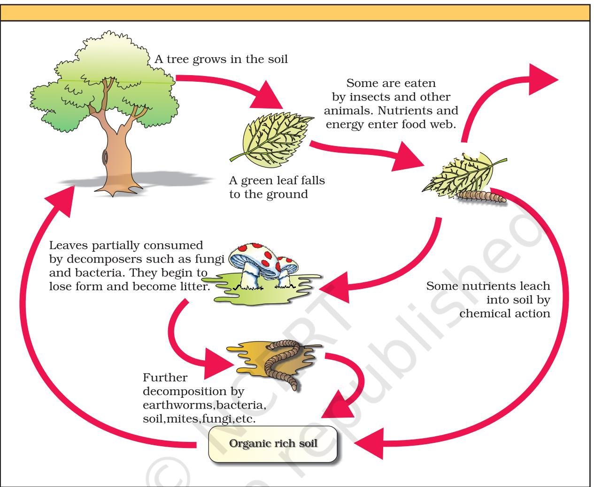
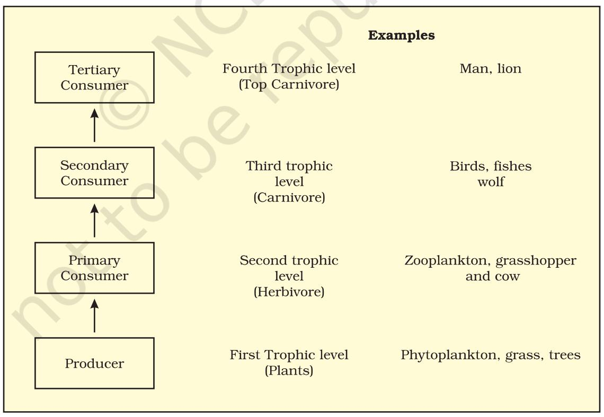
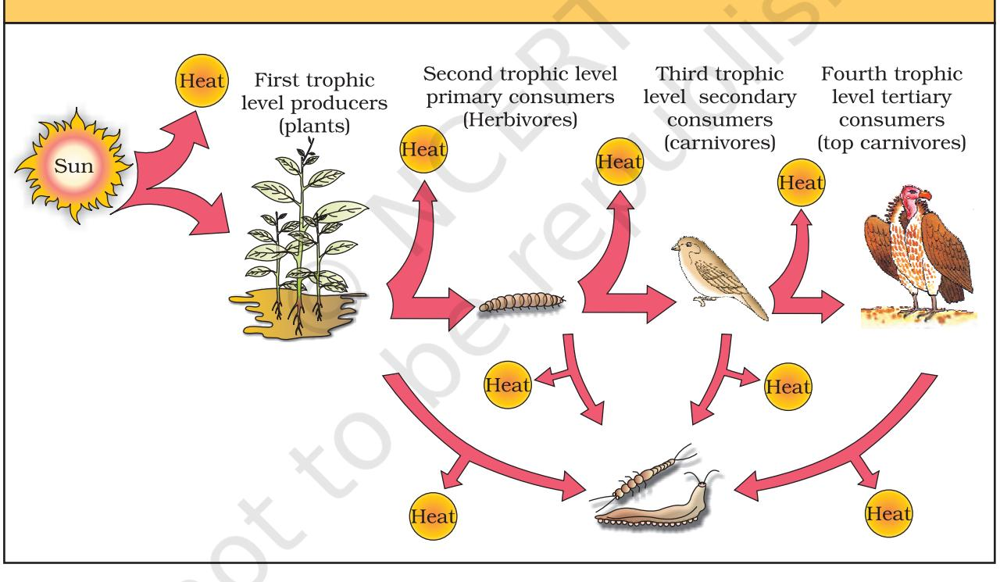
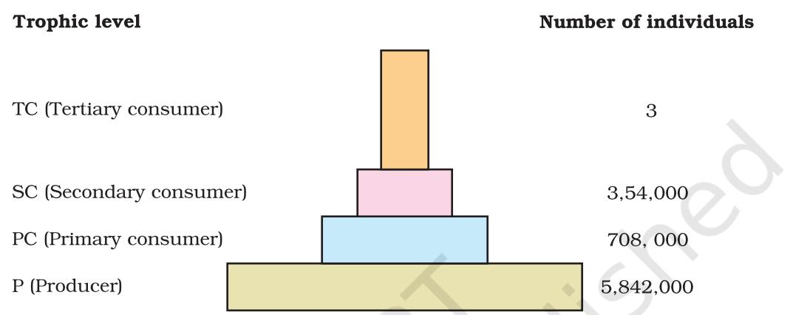
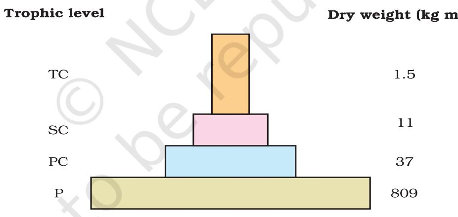
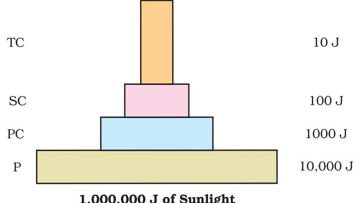

# CHAPTER 12 ECOSYSTEM

#### *12.1 Ecosystem–Structure and Function*

- *12.2. Productivity*
- *12.3 Decomposition*
- *12.4 Energy Flow*
- *12.5 Ecological Pyramids*

An ecosystem can be visualised as a functional unit of nature, where living organisms interact among themselves and also with the surrounding physical environment. Ecosystem varies greatly in size from a small pond to a large forest or a sea. Many ecologists regard the entire biosphere as a global ecosystem, as a composite of all local ecosystems on Earth. Since this system is too much big and complex to be studied at one time, it is convenient to divide it into two basic categories, namely the terrestrial and the aquatic. Forest, grassland and desert are some examples of terrestrial ecosystems; pond, lake, wetland, river and estuary are some examples of aquatic ecosystems. Crop fields and an aquarium may also be considered as man-made ecosystems.

We will first look at the structure of the ecosystem, in order to appreciate the input (productivity), transfer of energy (food chain/web, nutrient cycling) and the output (degradation and energy loss). We will also look at the relationships – cycles, chains, webs – that are created as a result of these energy flows within the system and their inter- relationship.

# 12.1 ECOSYSTEM – STRUCTURE AND FUNCTION

In earlier classes, you have looked at the various components of the environment- abiotic and biotic. You studied how the individual biotic and abiotic factors affected each other and their surrounding. Let us look at these components in a more integrated manner and see how the flow of energy takes place within these components of the ecosystem.

Interaction of biotic and abiotic components result in a physical structure that is characteristic for each type of ecosystem. Identification and enumeration of plant and animal species of an ecosystem gives its species composition. Vertical distribution of different species occupying different levels is called stratification. For example, trees occupy top vertical strata or layer of a forest, shrubs the second and herbs and grasses occupy the bottom layers.

The components of the ecosystem are seen to function as a unit when you consider the following aspects:

- (i) Productivity;
- (ii) Decomposition;
- (iii) Energy flow; and
- (iv) Nutrient cycling.

To understand the ethos of an aquatic ecosystem let us take a small pond as an example. This is fairly a self-sustainable unit and rather simple example that explain even the complex interactions that exist in an aquatic ecosystem. A pond is a shallow water body in which all the above mentioned four basic components of an ecosystem are well exhibited. The abiotic component is the water with all the dissolved inorganic and organic substances and the rich soil deposit at the bottom of the pond. The solar input, the cycle of temperature, day-length and other climatic conditions regulate the rate of function of the entire pond. The autotrophic components include the phytoplankton, some algae and the floating, submerged and marginal plants found at the edges. The consumers are represented by the zooplankton, the free swimming and bottom dwelling forms. The decomposers are the fungi, bacteria and flagellates especially abundant in the bottom of the pond. This system performs all the functions of any ecosystem and of the biosphere as a whole, i.e., conversion of inorganic into organic material with the help of the radiant energy of the sun by the autotrophs; consumption of the autotrophs by heterotrophs; decomposition and mineralisation of the dead matter to release them back for reuse by the autotrophs, these event are repeated over and over again. There is unidirectional movement of energy towards the higher trophic levels and its dissipation and loss as heat to the environment.

### 12.2 PRODUCTIVITY

A constant input of solar energy is the basic requirement for any ecosystem to function and sustain. Primary production is defined as the amount of

206

biomass or organic matter produced per unit area over a time period by plants during photosynthesis. It is expressed in terms of weight (gm–2 ) or energy (kcal m–2 ). The rate of biomass production is called productivity. It is expressed in terms of gm–2 yr –1 or (kcal m–2 ) yr –1 to compare the productivity of different ecosystems. It can be divided into gross primary productivity (GPP) and net primary productivity (NPP). Gross primary productivity of an ecosystem is the rate of production of organic matter during photosynthesis. A considerable amount of GPP is utilised by plants in respiration. Gross primary productivity minus respiration losses (R), is the net primary productivity (NPP).

#### GPP – R = NPP

Net primary productivity is the available biomass for the consumption to heterotrophs (herbiviores and decomposers). Secondary productivity is defined as the rate of formation of new organic matter by consumers.

Primary productivity depends on the plant species inhabiting a particular area. It also depends on a variety of environmental factors, availability of nutrients and photosynthetic capacity of plants. Therefore, it varies in different types of ecosystems. The annual net primary productivity of the whole biosphere is approximately 170 billion tons (dry weight) of organic matter. Of this, despite occupying about 70 per cent of the surface, the productivity of the oceans are only 55 billion tons. Rest of course, is on land. *Discuss the main reason for the low productivity of ocean with your teacher.*

### 12.3 DECOMPOSITION

You may have heard of the earthworm being referred to as the farmer's 'friend'. This is so because they help in the breakdown of complex organic matter as well as in loosening of the soil. Similarly, decomposers break down complex organic matter into inorganic substances like carbon dioxide, water and nutrients and the process is called decomposition. Dead plant remains such as leaves, bark, flowers and dead remains of animals, including fecal matter, constitute detritus, which is the raw material for decomposition. The important steps in the process of decomposition are fragmentation, leaching, catabolism, humification and mineralisation.

Detritivores (e.g., earthworm) break down detritus into smaller particles. This process is called fragmentation. By the process of leaching, watersoluble inorganic nutrients go down into the soil horizon and get precipitated as unavailable salts. Bacterial and fungal enzymes degrade detritus into simpler inorganic substances. This process is called as catabolism.

It is important to note that all the above steps in decomposition operate simultaneously on the detritus (Figure 12.1). Humification and mineralisation occur during decomposition in the soil. Humification leads 207

Figure 12.1 Diagrammatic representation of decomposition cycle in a terrestrial ecosystem

to accumulation of a dark coloured amorphous substance called humus that is highly resistant to microbial action and undergoes decomposition at an extremely slow rate. Being colloidal in nature it serves as a reservoir of nutrients. The humus is further degraded by some microbes and release of inorganic nutrients occur by the process known as mineralisation.

Decomposition is largely an oxygen-requiring process. The rate of decomposition is controlled by chemical composition of detritus and climatic factors. In a particular climatic condition, decomposition rate is slower if detritus is rich in lignin and chitin, and quicker, if detritus is rich in nitrogen and water-soluble substances like sugars. Temperature and soil moisture are the most important climatic factors that regulate decomposition through their effects on the activities of soil microbes. Warm and moist environment favour decomposition whereas low temperature and anaerobiosis inhibit decomposition resulting in build up of organic materials.

208

### 12.4 ENERGY FLOW

Except for the deep sea hydro-thermal ecosystem, sun is the only source of energy for all ecosystems on Earth. Of the incident solar radiation less than 50 per cent of it is photosynthetically active radiation (PAR). We know that plants and photosynthetic bacteria (autotrophs), fix Sun's radiant energy to make food from simple inorganic materials. Plants capture only 2-10 per cent of the PAR and this small amount of energy sustains the entire living world. So, it is very important to know how the solar energy captured by plants flows through different organisms of an ecosystem. All organisms are dependent for their food on producers, either directly or indirectly. So you find unidirectional flow of energy from the sun to producers and then to consumers. *Is this in keeping with the first law of thermodynamics?*

Further, ecosystems are not exempt from the Second Law of thermodynamics. They need a constant supply of energy to synthesise the molecules they require, to counteract the universal tendency toward increasing disorderliness.

The green plant in the ecosystem are called producers. In a terrestrial ecosystem, major producers are herbaceous and woody plants. Likewise, producers in an aquatic ecosystem are various species like phytoplankton, algae and higher plants.

You have read about the food chains and webs that exist in nature. Starting from the plants (or producers) food chains or rather webs are formed such that an animal feeds on a plant or on another animal and in turn is food for another. The chain or web is formed because of this interdependency. No energy that is trapped into an organism remains in it for ever. The energy trapped by the producer, hence, is either passed on to a consumer or the organism dies. Death of organism is the beginning of the detritus food chain/web.

All animals depend on plants (directly or indirectly) for their food needs. They are hence called consumers and also heterotrophs. If they feed on the producers, the plants, they are called primary consumers, and if the animals eat other animals which in turn eat the plants (or their produce) they are called secondary consumers. Likewise, you could have tertiary consumers too. Obviously the primary consumers will be herbivores. Some common herbivores are insects, birds and mammals in terrestrial ecosystem and molluscs in aquatic ecosystem.

The consumers that feed on these herbivores are carnivores, or more correctly primary carnivores (though secondary consumers). Those animals that depend on the primary carnivores for food are labelled secondary carnivores. A simple grazing food chain (GFC) is depicted below:

209

The detritus food chain (DFC) begins with dead organic matter. It is made up of decomposers which are heterotrophic organisms, mainly fungi and bacteria. They meet their energy and nutrient requirements by degrading dead organic matter or detritus. These are also known as saprotrophs (*sapro:* to decompose). Decomposers secrete digestive enzymes that breakdown dead and waste materials into simple, inorganic materials, which are subsequently absorbed by them.

In an aquatic ecosystem, GFC is the major conduit for energy flow. As against this, in a terrestrial ecosystem, a much larger fraction of energy flows through the detritus food chain than through the GFC. Detritus food chain may be connected with the grazing food chain at some levels: some of the organisms of DFC are prey to the GFC animals, and in a natural ecosystem, some animals like cockroaches, crows, etc., are omnivores. These natural interconnection of food chains make it a food web. *How would you classify human beings!*

Organisms occupy a place in the natural surroundings or in a community according to their feeding relationship with other organisms. Based on the source of their nutrition or food, organisms occupy a specific place in the food chain that is known as their trophic level. Producers belong to the first trophic level, herbivores (primary consumer) to the second and carnivores (secondary consumer) to the third (Figure 12.2).

The important point to note is that the amount of energy decreases at successive trophic levels. When any organism dies it is converted to detritus or dead biomass that serves as an energy source for decomposers. Organisms at each trophic level depend on those at the lower trophic level for their energy demands.

Each trophic level has a certain mass of living material at a particular time called as the standing crop. The standing crop is measured as the mass of living organisms (biomass) or the number in a unit area. The biomass of a species is expressed in terms of fresh or dry weight. Measurement of biomass in terms of dry weight is more accurate. *Why?*

The number of trophic levels in the grazing food chain is restricted as the transfer of energy follows 10 per cent law – only 10 per cent of the energy is transferred to each trophic level from the lower trophic level. In nature, it is possible to have so many levels – producer, herbivore, primary carnivore, secondary carnivore in the grazing food chain (Figure 12.3) . *Do you think there is any such limitation in a detritus food chain?*

Figure 12.3 Energy flow through different trophic levels

# 12.5 ECOLOGICAL PYRAMIDS

You must be familiar with the shape of a pyramid. The base of a pyramid is broad and it narrows towards the apex. One gets a similar shape, whether you express the food or energy relationship between organisms

# 211

212

at different trophic levels. This, relationship is expressed in terms of number, biomass or energy. The base of each pyramid represents the producers or the first trophic level while the apex represents tertiary or top level consumer. The three types of ecological pyramids that are usually studied are (a) pyramid of number; (b) pyramid of biomass and (c) pyramid of energy. For detail (see Figure 12.4 a, b, c and d).

Figure 12.4 (a) Pyramid of numbers in a grassland ecosystem. Only three top-carnivores are supported in an ecosystem based on production of nearly 6 millions plants

Figure 12.4 (b) Pyramid of biomass shows a sharp decrease in biomass at higher trophic levels

Figure 12.4 (c) Inverted pyramid of biomass-small standing crop of phytoplankton supports large standing crop of zooplankton

Any calculations of energy content, biomass or numbers, has to include all organisms at that trophic level. No generalisations we make will be true if we take only a few individuals at any trophic level into account. Also a given organism may occupy more than one trophic level simultaneously. One must remember that the trophic level represents a functional level, not a species as such. A given species may occupy more than one trophic level in the same ecosystem at the same time; for example, a sparrow is a primary consumer when it eats seeds, fruits, peas, and a secondary consumer when it eats insects and worms. *Can you work out how many trophic levels human beings function at in a food chain?*

In most ecosystems, all the pyramids, of number, of energy and biomass are upright, i.e., producers are more in number and biomass than the herbivores, and herbivores are more in number and biomass than the carnivores. Also energy at a lower trophic level is always more than at a higher level.

There are exceptions to this generalisation: If you were to count the number of insects feeding on a big tree what kind of pyramid would you get? Now add an estimate of the number of small birds depending on the insects, as also the number of larger birds eating the smaller. Draw the shape you would get.

The pyramid of biomass in sea is generally inverted because the biomass of fishes far exceeds that of phytoplankton. *Isn't that a paradox? How would you explain this?*

Pyramid of energy is always upright, can never be inverted, because when energy flows from a particular trophic level to the next trophic level, some energy is always lost as heat at each step. Each bar in the energy pyramid indicates the amount of energy present at each trophic level in a given time or annually per unit area.

213

However, there are certain limitations of ecological pyramids such as it does not take into account the same species belonging to two or more trophic levels. It assumes a simple food chain, something that almost never exists in nature; it does not accommodate a food web. Moreover, saprophytes are not given any place in ecological pyramids even though they play a vital role in the ecosystem.

#### SUMMARY

An ecosystem is a structural and functional unit of nature and it comprises abiotic and biotic components. Abiotic components are inorganic materials- air, water and soil, whereas biotic components are producers, consumers and decomposers. Each ecosystem has characteristic physical structure resulting from interaction amongst abiotic and biotic components. Species composition and stratification are the two main structural features of an ecosystem. Based on source of nutrition every organism occupies a place in an ecosystem.

Productivity, decomposition, energy flow, and nutrient cycling are the four important components of an ecosystem. Primary productivity is the rate of capture of solar energy or biomass production of the producers. It is divided into two types: gross primary productivity (GPP) and net primary productivity (NPP). Rate of capture of solar energy or total production of organic matter is called as GPP. NPP is the remaining biomass or the energy left after utilisation of producers. Secondary productivity is the rate of assimilation of food energy by the consumers. In decomposition, complex organic compounds of detritus are converted to carbon dioxide, water and inorganic nutrients by the decomposers. Decomposition involves three processes, namely fragmentation of detritus, leaching and catabolism.

Energy flow is unidirectional. First, plants capture solar energy and then, food is transferred from the producers to decomposers. Organisms of different trophic levels in nature are connected to each other for food or energy relationship forming a food chain. The storage and movement of nutrient elements through the various components of the ecosystem is called nutrient cycling; nutrients are repeatedly used through this process. Nutrient cycling is of two types—gaseous and sedimentary. Atmosphere or hydrosphere is the reservoir for the gaseous type of cycle (carbon), whereas Earth's crust is the reservoir for sedimentary type (phosphorus). Products of ecosystem processes are named as ecosystem services, e.g., purification of air and water by forests.

# EXERCISES

- 1. Fill in the blanks.
	- (a) Plants are called as_________because they fix carbon dioxide.
	- (b) In an ecosystem dominated by trees, the pyramid (of numbers) is_________type.

- (c) In aquatic ecosystems, the limiting factor for the productivity is_________.
- (d) Common detritivores in our ecosystem are_________.
- (e) The major reservoir of carbon on earth is_________.
- 2. Which one of the following has the largest population in a food chain?
	- (a) Producers
	- (b) Primary consumers
	- (c) Secondary consumers
	- (d) Decomposers
- 3. The second trophic level in a lake is
	- (a) Phytoplankton
	- (b) Zooplankton
	- (c) Benthos
	- (d) Fishes
- 4. Secondary producers are
	- (a) Herbivores
	- (b) Producers
	- (c) Carnivores
	- (d) None of the above
- 5. What is the percentage of photosynthetically active radiation (PAR) in the incident solar radiation?
	- (a) 100%
	- (b) 50 %
	- (c) 1-5%
	- (d) 2-10%
- 6. Distinguish between
	- (a) Grazing food chain and detritus food chain
	- (b) Production and decomposition
	- (c) Upright and inverted pyramid
	- (d) Food chain and Food web
	- (e) Litter and detritus
	- (f) Primary and secondary productivity
- 7. Describe the components of an ecosystem.
- 8. Define ecological pyramids and describe with examples, pyramids of number and biomass.
- 9. What is primary productivity? Give brief description of factors that affect primary productivity.
- 10. Define decomposition and describe the processes and products of decomposition.
- 11. Give an account of energy flow in an ecosystem.

# 215

