# CHAPTER 2

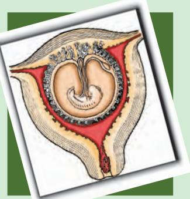

# HUMAN REPRODUCTION

- *2.1 The Male Reproductive System*
- *2.2 The Female Reproductive System*
- *2.3 Gametogenesis*
- *2.4 Menstrual Cycle*
- *2.5 Fertilisation and Implantation*
- *2.6 Pregnancy and Embryonic Development*
- *2.7 Parturition and Lactation*

As you are aware, humans are sexually reproducing and viviparous. The reproductive events in humans include formation of gametes (gametogenesis), i.e., sperms in males and ovum in females, transfer of sperms into the female genital tract (insemination) and fusion of male and female gametes (fertilisation) leading to formation of zygote. This is followed by formation and development of blastocyst and its attachment to the uterine wall (implantation), embryonic development (gestation) and delivery of the baby (parturition). You have learnt that these reproductive events occur after puberty. There are remarkable differences between the reproductive events in the male and in the female, for example, sperm formation continues even in old men, but formation of ovum ceases in women around the age of fifty years. Let us examine the male and female reproductive systems in human.

# 2.1 THE MALE REPRODUCTIVE SYSTEM

The male reproductive system is located in the pelvis region (Figure 2.1a). It includes a pair of testes alongwith accessory ducts, glands and the external genitalia.

The testes are situated outside the abdominal cavity within a pouch called scrotum. The scrotum helps in maintaining the low temperature of the testes (2–2.5o C lower than the normal internal body temperature) necessary for spermatogenesis. In adults, each testis is oval in shape, with a length of about 4 to 5 cm and a width of about 2 to 3 cm. The testis is covered by a dense covering. Each testis has about 250 compartments called testicular lobules (Figure 2.1b).

Each lobule contains one to three highly coiled seminiferous tubules in which sperms are produced. Each seminiferous tubule is lined on its inside by two types of cells called male germ cells (*spermatogonia*) and Sertoli cells (Figure 2.2 ). The male germ cells undergo meiotic divisions finally leading to sperm formation, while Sertoli cells provide nutrition to the germ cells. The regions outside the seminiferous tubules called interstitial spaces, contain small blood vessels and interstitial cells or Leydig cells (Figure 2.2). Leydig cells synthesise and secrete testicular hormones called androgens. Other immunologically competent cells are also present.

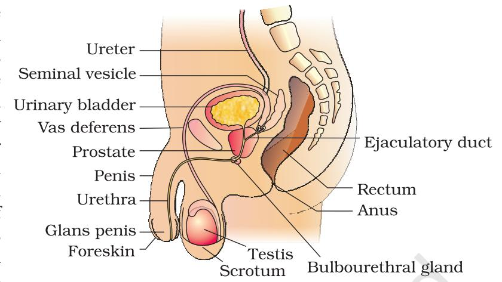

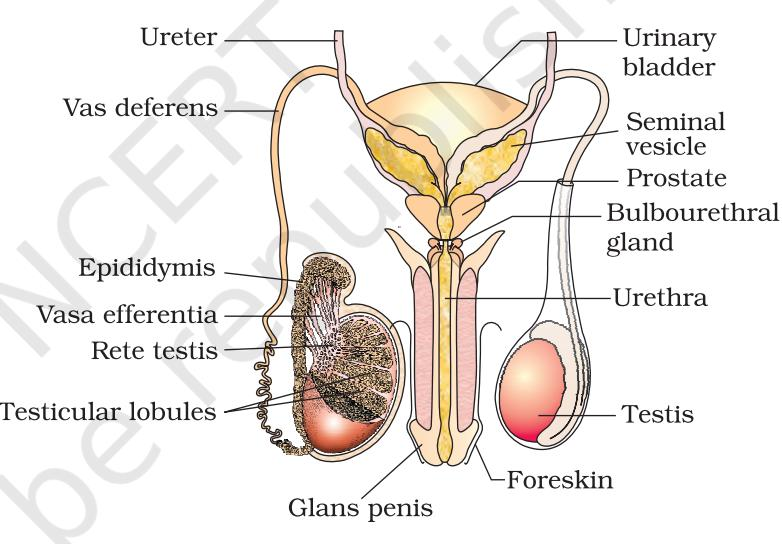

The male sex accessory ducts include rete testis, vasa efferentia, epididymis and vas deferens (Figure 2.1b). The seminiferous tubules of the testis open into the vasa efferentia through rete testis. The vasa efferentia leave the testis and open into epididymis located along the posterior surface of each testis. The epididymis leads to vas deferens that ascends to the abdomen and loops over the urinary bladder. It receives a duct from seminal vesicle and opens into urethra as the ejaculatory duct (Figure 2.1a). These ducts store and transport the sperms from the testis to the outside through urethra. The urethra originates from the urinary bladder and extends through the penis to its external opening called urethral meatus.

27

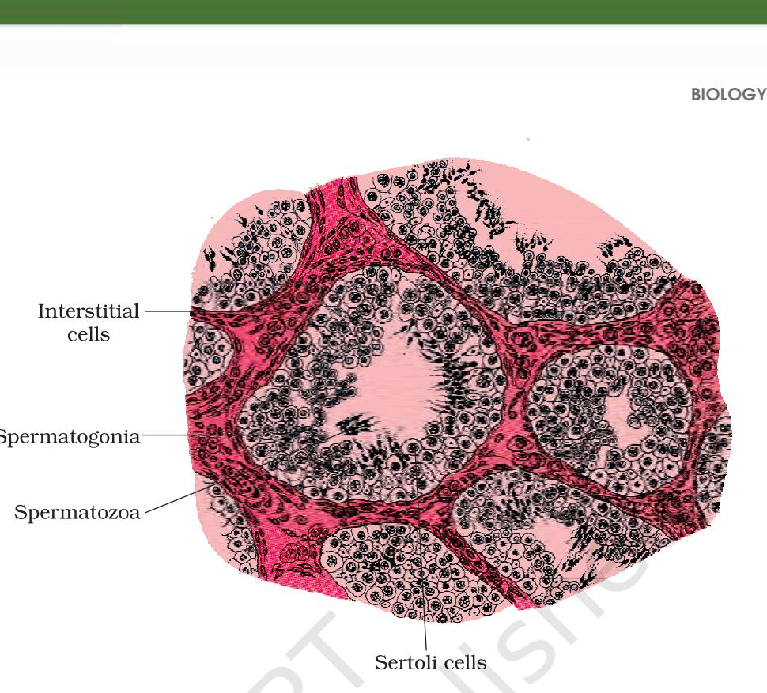

Figure 2.2 Diagrammatic sectional view of seminiferous tubule

The penis is the male external genitalia (Figure 2.1a, b). It is made up of special tissue that helps in erection of the penis to facilitate insemination. The enlarged end of penis called the glans penis is covered by a loose fold of skin called foreskin.

The male accessory glands (Figure 2.1a, b) include paired seminal vesicles, a prostate and paired bulbourethral glands. Secretions of these glands constitute the seminal plasma which is rich in fructose, calcium and certain enzymes. The secretions of bulbourethral glands also helps in the lubrication of the penis.

# 2.2 THE FEMALE REPRODUCTIVE SYSTEM

The female reproductive system consists of a pair of ovaries alongwith a pair of oviducts, uterus, cervix, vagina and the external genitalia located in pelvic region (Figure 2.3a). These parts of the system alongwith a pair of the mammary glands are integrated structurally and functionally to support the processes of ovulation, fertilisation, pregnancy, birth and child care.

Ovaries are the primary female sex organs that produce the female gamete (ovum) and several steroid hormones (ovarian hormones). The ovaries are located one on each side of the lower abdomen (Figure 2.3b). Each ovary is about 2 to 4 cm in length and is connected to the pelvic wall and uterus by ligaments. Each ovary is covered by a thin epithelium which encloses the ovarian stroma. The stroma is divided into two zones – a peripheral cortex and an inner medulla.

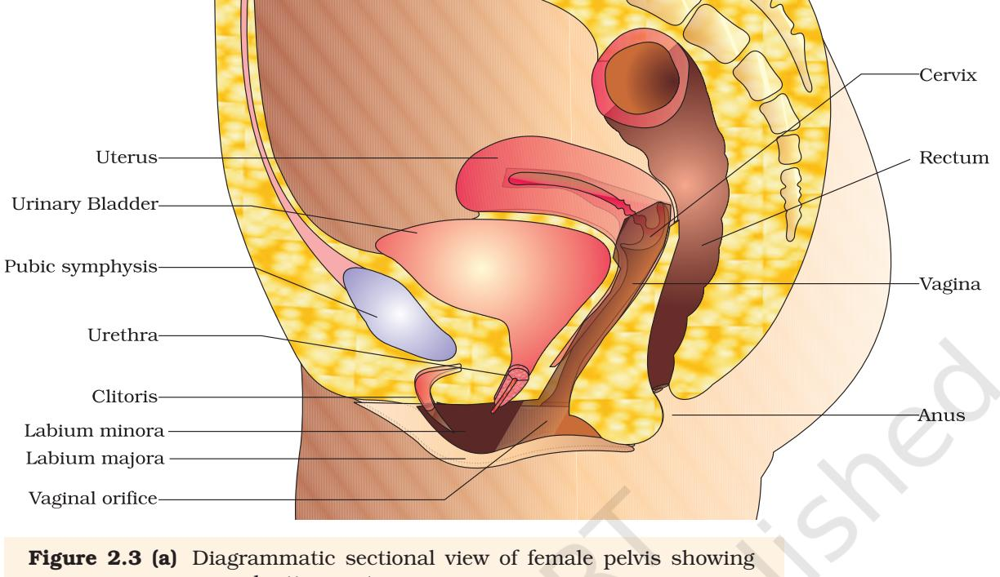

reproductive system

The oviducts (fallopian tubes), uterus and vagina constitute the female accessory ducts. Each fallopian tube is about 10-12 cm long and extends from the periphery of each ovary to the uterus (Figure 2.3b), the part closer to the ovary is the funnel-shaped infundibulum. The edges of the infundibulum possess finger-like projections called fimbriae, which help in collection of the ovum after ovulation. The infundibulum leads to a wider

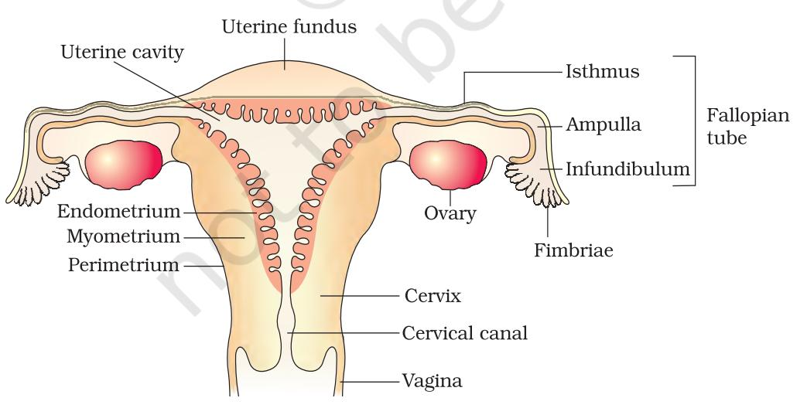

# 29

part of the oviduct called ampulla. The last part of the oviduct, isthmus has a narrow lumen and it joins the uterus.

The uterus is single and it is also called womb. The shape of the uterus is like an inverted pear. It is supported by ligaments attached to the pelvic wall. The uterus opens into vagina through a narrow cervix. The cavity of the cervix is called cervical canal (Figure 2.3b) which alongwith vagina forms the birth canal. The wall of the uterus has three layers of tissue. The external thin membranous perimetrium, middle thick layer of smooth muscle, myometrium and inner glandular layer called endometrium that lines the uterine cavity. The endometrium undergoes cyclical changes during menstrual cycle while the myometrium exhibits strong contraction during delivery of the baby.

The female external genitalia include mons pubis, labia majora, labia minora, hymen and clitoris (Figure 2.3a). Mons pubis is a cushion of fatty tissue covered by skin and pubic hair. The labia majora are fleshy folds of tissue, which extend down from the mons pubis and surround the vaginal opening. The labia minora are paired folds of tissue under the labia majora. The opening of the vagina is often covered partially by a membrane called hymen. The clitoris is a tiny finger-like structure which lies at the upper junction of the two labia minora above the urethral opening. The hymen is often torn during the first coitus (intercourse). *However, it can also be broken by a sudden fall or jolt, insertion of a vaginal tampon, active participation in some sports like horseback riding, cycling, etc. In some women the hymen persists even after coitus. In fact, the presence or absence of hymen is not a reliable indicator of virginity or sexual experience*.

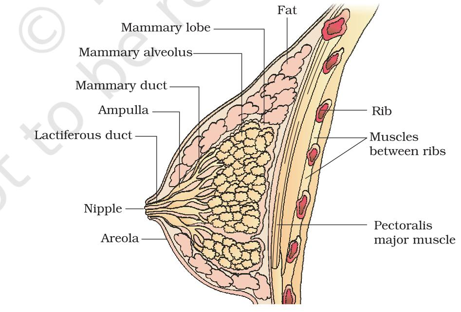

Figure 2.4 A diagrammatic sectional view of Mammary gland

A functional mammary gland is characteristic of all female mammals. The mammary glands are paired structures (breasts) that contain glandular tissue and variable amount of fat. The glandular tissue of each breast is divided into 15-20 mammary lobes containing clusters of cells called alveoli (Figure 2.4). The cells of alveoli secrete milk, which is stored in the cavities (lumens) of alveoli. The alveoli open into mammary tubules. The tubules of each lobe join to form a mammary duct. Several mammary ducts join to form a wider mammary ampulla which is connected to lactiferous duct through which milk is sucked out.

## 2.3 GAMETOGENESIS

The primary sex organs – the testis in the males and the ovaries in the females – produce gametes, i.e, sperms and ovum, respectively, by the process called gametogenesis. In testis, the immature male germ cells (spermatogonia) produce sperms by spermatogenesis that begins at puberty. The spermatogonia (sing. spermatogonium) present on the inside wall of seminiferous tubules multiply by mitotic division and increase in numbers. Each spermatogonium is diploid and contains 46 chromosomes. Some of the spermatogonia called primary spermatocytes periodically undergo meiosis. A primary spermatocyte completes the first meiotic division (reduction division) leading to

formation of two equal, haploid cells called secondary spermatocytes, which have only 23 chromosomes each. The secondary spermatocytes undergo the second meiotic division to produce four equal, haploid spermatids (Figure 2.5). *What would be the number of chromosome in the spermatids?* The spermatids are transformed into spermatozoa (sperms) by the process called spermiogenesis. After spermiogenesis, sperm heads become embedded in the Sertoli cells, and are finally released from the seminiferous tubules by the process called spermiation.

Spermatogenesis starts at the age of puberty due to significant increase in the secretion of gonadotropin releasing hormone

(GnRH). This, if you recall, is a hypothalamic hormone. The increased levels of GnRH then acts at the anterior pituitary gland and stimulates secretion of two gonadotropins – luteinising hormone (LH) and follicle stimulating hormone (FSH). LH acts at the Leydig cells and stimulates synthesis and secretion of androgens. Androgens, in turn, stimulate the process of spermatogenesis. FSH acts on the Sertoli cells and stimulates

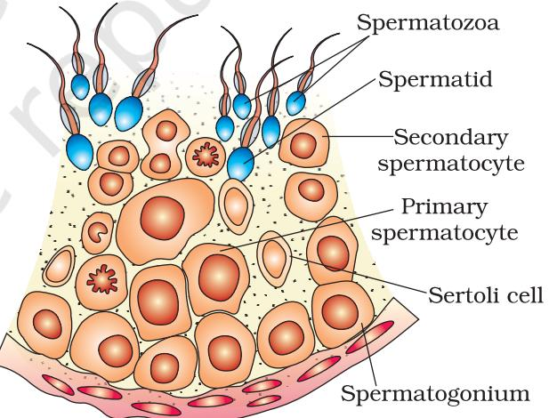

Figure 2.5 Diagrammatic sectional view of a seminiferous tubule (enlarged)

31

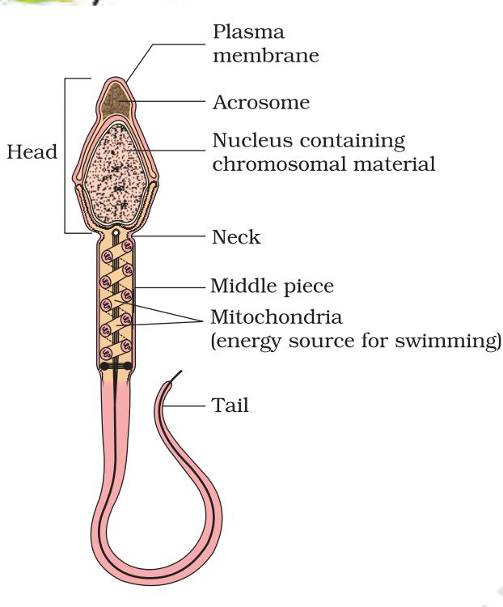

Figure 2.6 Structure of a sperm

secretion of some factors which help in the process of spermiogenesis.

Let us examine the structure of a sperm. It is a microscopic structure composed of a head, neck, a middle piece and a tail (Figure 2.6). A plasma membrane envelops the whole body of sperm. The sperm head contains an elongated haploid nucleus, the anterior portion of which is covered by a cap-like structure, acrosome. The acrosome is filled with enzymes that help fertilisation of the ovum. The middle piece possesses numerous mitochondria, which produce energy for the movement of tail that facilitate sperm motility essential for fertilisation. The human male ejaculates about 200 to 300 million sperms during a coitus of which, for normal fertility, at least 60 per cent sperms must have normal shape and size and at least 40 per cent of them must show vigorous motility.

Sperms released from the seminiferous tubules, are transported by the accessory

ducts. Secretions of epididymis, vas deferens, seminal vesicle and prostate are essential for maturation and motility of sperms. The seminal plasma along with the sperms constitute the semen. The functions of male sex accessory ducts and glands are maintained by the testicular hormones (androgens).

The process of formation of a mature female gamete is called oogenesis which is markedly different from spermatogenesis. Oogenesis is initiated during the embryonic development stage when a couple of million gamete mother cells (oogonia) are formed within each fetal ovary; no more oogonia are formed and added after birth. These cells start division and enter into prophase-I of the meiotic division and get temporarily arrested at that stage, called primary oocytes. Each primary oocyte then gets surrounded by a layer of granulosa cells and is called the primary follicle (Figure 2.7). A large number of these follicles degenerate during the phase from birth to puberty. Therefore, at puberty only 60,000-80,000 primary follicles are left in each ovary. The primary follicles get surrounded by more layers of granulosa cells and a new theca and are called secondary follicles.

The secondary follicle soon transforms into a tertiary follicle which is characterised by a fluid filled cavity called antrum. The theca layer is organised into an inner theca interna and an outer theca externa. It is important to draw your attention that it is at this stage that the primary oocyte within the tertiary follicle grows in size and completes its first meiotic division. It is an unequal division resulting in the formation of a large haploid secondary oocyte and a tiny first polar body (Figure 2.8b). The

secondary oocyte retains bulk of the nutrient rich cytoplasm of the primary oocyte. *Can you think of any advantage for this?* Does the first polar body born out of first meiotic division divide further or degenerate? At present we are not very certain about this. The tertiary follicle further changes into the mature follicle or Graafian follicle (Figure 2.7). The secondary oocyte forms a new membrane called zona pellucida surrounding it. The Graafian follicle now ruptures to release the secondary oocyte (ovum) from the ovary by the process called ovulation. *Can you identify major differences between*

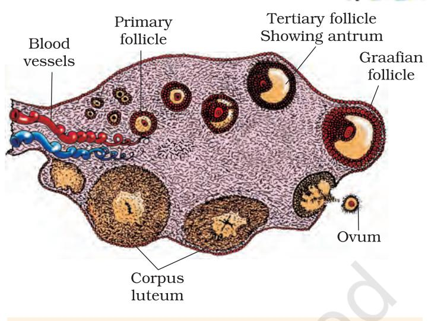

*spermatogenesis and oogenesis?* A diagrammatic representation of spermatogenesis and oogenesis is given below (Figure 2.8).

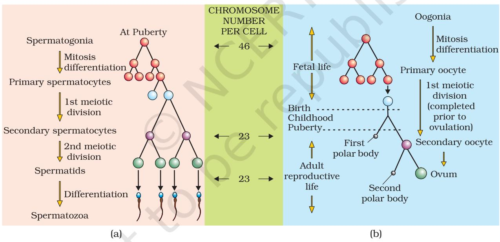

# 2.4 MENSTRUAL CYCLE

The reproductive cycle in the female primates (e.g. monkeys, apes and human beings) is called menstrual cycle. The first menstruation begins at puberty and is called menarche. In human females, menstruation is repeated at an average interval of about 28/29 days, and the cycle of events starting from one menstruation till the next one is called the menstrual cycle. One ovum is released (ovulation) during the middle

# 33

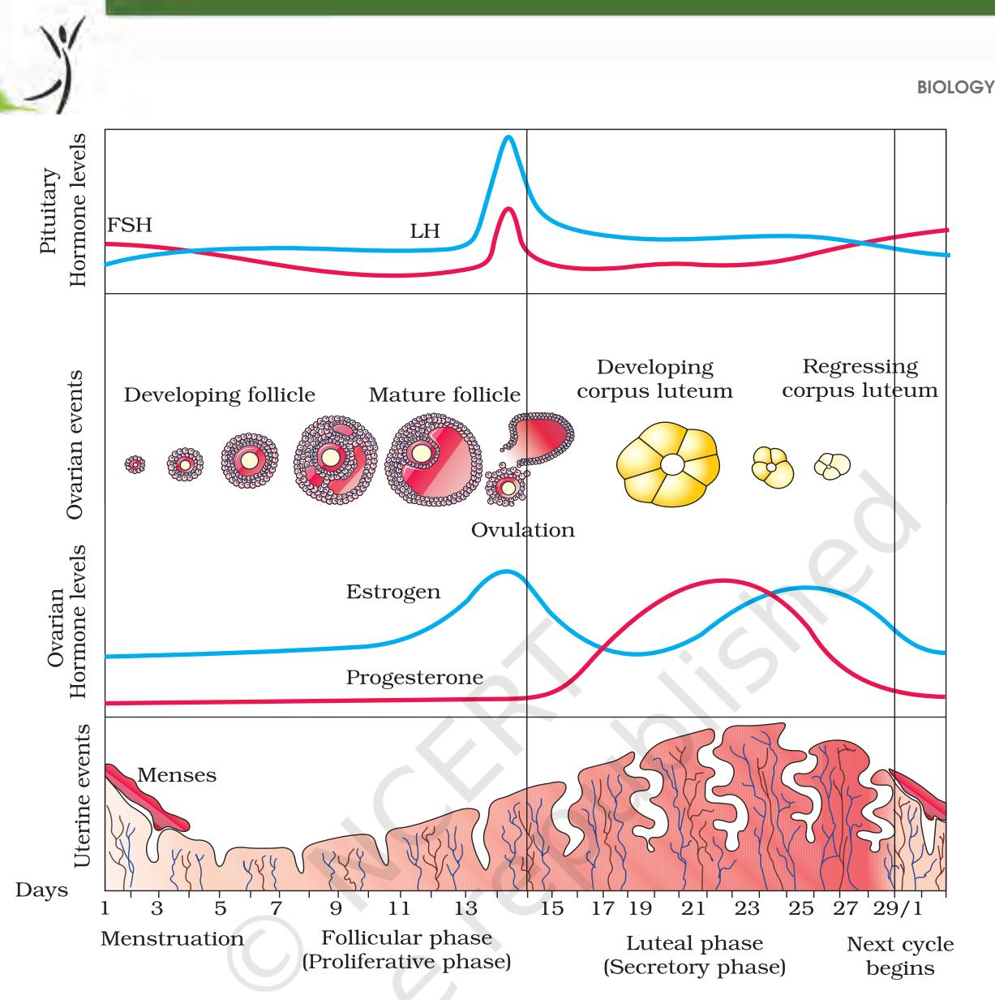

Figure 2.9 Diagrammatic presentation of various events during a menstrual cycle

of each menstrual cycle. The major events of the menstrual cycle are shown in Figure 2.9. The cycle starts with the menstrual phase, when menstrual flow occurs and it lasts for 3-5 days. The menstrual flow results due to breakdown of endometrial lining of the uterus and its blood vessels which forms liquid that comes out through vagina. Menstruation only occurs if the released ovum is not fertilised. Lack of menstruation may be indicative of pregnancy. However, it may also be caused due to some other underlying causes like stress, poor health etc. The menstrual phase is followed by the follicular phase. During this phase, the primary follicles in the ovary grow to become a fully mature Graafian follicle and simultaneously the endometrium of uterus regenerates through proliferation. These changes in the ovary and the uterus are induced by changes in the levels of pituitary and ovarian hormones (Figure 2.9). The secretion of

gonadotropins (LH and FSH) increases gradually during the follicular phase, and stimulates follicular development as well as secretion of estrogens by the growing follicles. Both LH and FSH attain a peak level in the middle of cycle (about 14th day). Rapid secretion of LH leading to its maximum level during the mid-cycle called LH surge induces rupture of Graafian follicle and thereby the release of ovum (ovulation). The ovulation (ovulatory phase) is followed by the luteal phase during which the remaining parts of the Graafian follicle transform as the corpus luteum (Figure 2.9). The corpus luteum secretes large amounts of progesterone which is essential for maintenance of the endometrium. Such an endometrium is necessary for implantation of the fertilised ovum and other events of pregnancy. During pregnancy all events of the menstrual cycle stop and there is no menstruation. In the absence of fertilisation, the corpus luteum degenerates. This causes disintegration of the endometrium leading to menstruation, marking a new cycle. In human beings, menstrual cycles ceases around 50 years of age; that is termed as menopause. Cyclic menstruation is an indicator of normal reproductive phase and extends between menarche and menopause.

## 2.5 FERTILISATION AND IMPLANTATION

During copulation (coitus) semen is released by the penis into the vagina (insemination). The motile sperms swim rapidly, pass through the cervix, enter into the uterus and finally reach the ampullary region of the fallopian tube (Figure 2.11b). The ovum released by the ovary is also

transported to the ampullary region where fertilisation takes place. Fertilisation can only occur if the ovum and sperms are transported simultaneously to the ampullary region. This is the reason why not all copulations lead to fertilisation and pregnancy.

The process of fusion of a sperm with an ovum is called fertilisation. During fertilisation, a sperm comes in contact with the *zona pellucida* layer of the ovum (Figure 2.10) and induces changes in the membrane that block the entry of additional sperms. Thus, it ensures that only one sperm can fertilise an ovum. The secretions of the acrosome help the sperm enter into the cytoplasm of the ovum through the zona pellucida and the plasma

### Menstrual Hygiene

Maintenance of hygiene and sanitation during menstruation is very important. Take bath and clean yourself regulary. Use sanitary napkins or clean homemade pads. Change sanitary napkins or homemade pads after every 4–5 hrs as per the requirement. Dispose of the used sanitary napkins properly wrapping it with a used paper. Do not throw the used napkins in the drainpipe of toilets or in the open area. After handling the napkin wash hands with soap.

Figure 2.10 Ovum surrounded by few sperms

membrane. This induces the completion of the meiotic division of the secondary oocyte. The second meiotic division is also unequal and results in the formation of a second polar body and a haploid ovum (ootid). Soon the haploid nucleus of the sperms and that of the ovum fuse together to form a diploid zygote. *How many chromosomes will be there in the zygote?*

One has to remember that the sex of the baby has been decided at this stage itself. Let us see how? As you know the chromosome pattern in the human female is XX and that in the male is XY. Therefore, all the haploid gametes (ova) produced by the female have the sex chromosome X whereas in the male gametes (sperms) the sex chromosome could be either X or Y, hence, 50 per cent of sperms carry the X chromosome while the other 50 per cent carry the Y. After fusion of the male and female gametes the zygote would carry either XX or XY depending on whether the sperm carrying X or Y fertilised the ovum. The zygote carrying XX would develop into a female baby and XY would form a male (you will learn more about the chromosomal patterns in Chapter 5). *That is why, scientifically it is correct to say that the sex of the baby is determined by the father and not by the mother!*

The mitotic division starts as the zygote moves through the isthmus of the oviduct called cleavage towards the uterus (Figure 2.11) and forms 2, 4, 8, 16 daughter cells called blastomeres. The embryo with 8 to 16

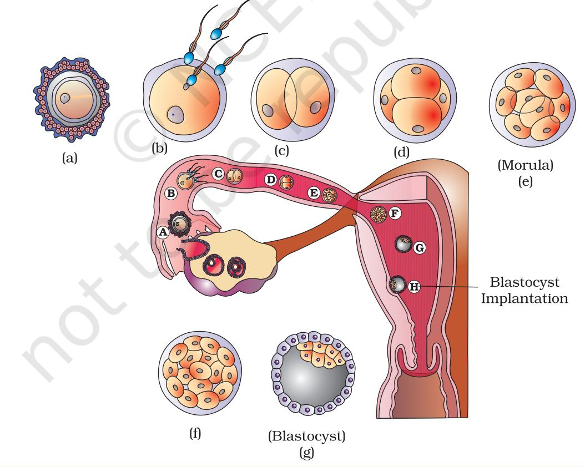

Figure 2.11 Transport of ovum, fertilisation and passage of growing embryo through fallopian tube

36

blastomeres is called a morula (Figure 2.11e). The morula continues to divide and transforms into blastocyst (Figure 2.11g) as it moves further into the uterus. The blastomeres in the blastocyst are arranged into an outer layer called trophoblast and an inner group of cells attached to trophoblast called the inner cell mass. The trophoblast layer then gets attached to the endometrium and the inner cell mass gets differentiated as the embryo. After attachment, the uterine cells divide rapidly and covers the blastocyst. As a result, the blastocyst becomes embedded in the endometrium of the uterus (Figure 2.11 step H). This is called implantation and it leads to pregnancy.

## 2.6 PREGNANCY AND EMBRYONIC DEVELOPMENT

After implantation, finger-like projections appear on the trophoblast called chorionic villi which are surrounded by the uterine tissue and maternal blood. The chorionic villi and uterine tissue become interdigitated with each other and jointly form a structural and functional unit between developing embryo (foetus) and maternal body called placenta (Figure 2.12).

The placenta facilitate the supply of oxygen and nutrients to the embryo and also removal of carbon dioxide and excretory/waste materials produced by the embryo. The placenta is connected to the embryo through an umbilical cord which helps in the transport of substances to and from the embryo. Placenta also acts as an endocrine tissue and produces several hormones like human chorionic gonadotropin (hCG), human placental lactogen (hPL), estrogens, progestogens, etc. In the later phase of pregnancy, a hormone called relaxin is also secreted by

the ovary. Let us remember that hCG, hPL and relaxin are produced in women only during pregnancy. In addition, during pregnancy the levels of other hormones like estrogens, progestogens, cortisol, prolactin, thyroxine, etc., are increased severalfolds in the maternal blood. Increased production of these hormones is essential for supporting the fetal growth, metabolic changes in the mother and maintenance of pregnancy.

Immediately after implantation, the inner cell mass (embryo) differentiates Figure 2.12 The human foetus within the uterus

into an outer layer called ectoderm and an inner layer called endoderm. A mesoderm soon appears between the ectoderm and the endoderm. These three layers give rise to all tissues (organs) in adults. It needs to be mentioned here that the inner cell mass contains certain cells called stem cells which have the potency to give rise to all the tissues and organs.

*What are the major features of embryonic development at various months of pregnancy?* The human pregnancy lasts 9 months. *Do you know for how many months pregnancy last in dogs, elephants, cats?* Find out. In human beings, after one month of pregnancy, the embryo's heart is formed. The first sign of growing foetus may be noticed by listening to the heart sound carefully through the stethoscope. By the end of the second month of pregnancy, the foetus develops limbs and digits. By the end of 12 weeks (first trimester), most of the major organ systems are formed, for example, the limbs and external genital organs are welldeveloped. The first movements of the foetus and appearance of hair on the head are usually observed during the fifth month. By the end of about 24 weeks (end of second trimester), the body is covered with fine hair, eye-lids separate, and eyelashes are formed. By the end of nine months of pregnancy, the foetus is fully developed and is ready for delivery.

## 2.7 PARTURITION AND LACTATION

The average duration of human pregnancy is about 9 months which is called the gestation period. Vigorous contraction of the uterus at the end of pregnancy causes expulsion/delivery of the foetus. This process of delivery of the foetus (childbirth) is called parturition. Parturition is induced by a complex neuroendocrine mechanism. The signals for parturition originate from the fully developed foetus and the placenta which induce mild uterine contractions called foetal ejection reflex. This triggers release of oxytocin from the maternal pituitary. Oxytocin acts on the uterine muscle and causes stronger uterine contractions, which in turn stimulates further secretion of oxytocin. The stimulatory reflex between the uterine contraction and oxytocin secretion continues resulting in stronger and stronger contractions. This leads to expulsion of the baby out of the uterus through the birth canal – parturition. Soon after the infant is delivered, the placenta is also expelled out of the uterus. *What do you think the doctors inject to induce delivery?*

The mammary glands of the female undergo differentiation during pregnancy and starts producing milk towards the end of pregnancy by the process called lactation. This helps the mother in feeding the newborn. The milk produced during the initial few days of lactation is called colostrum which contains several antibodies absolutely essential to develop resistance for the new-born babies. Breast-feeding during the initial period of infant growth is recommended by doctors for bringing up a healthy baby.

## SUMMARY

Humans are sexually reproducing and viviparous. The male reproductive system is composed of a pair of testes, the male sex accessory ducts and the accessory glands and external genitalia. Each testis has about 250 compartments called testicular lobules, and each lobule contains one to three highly coiled seminiferous tubules. Each seminiferous tubule is lined inside by spermatogonia and Sertoli cells. The spermatogonia undergo meiotic divisions leading to sperm formation, while Sertoli cells provide nutrition to the dividing germ cells. The Leydig cells outside the seminiferous tubules, synthesise and secrete testicular hormones called androgens. The male external genitalia is called penis.

The female reproductive system consists of a pair of ovaries, a pair of oviducts, a uterus, a vagina, external genitalia, and a pair of mammary glands. The ovaries produce the female gamete (ovum) and some steroid hormones (ovarian hormones). Ovarian follicles in different stages of development are embedded in the stroma. The oviducts, uterus and vagina are female accessory ducts. The uterus has three layers namely perimetrium, myometrium and endometrium. The female external genitalia includes mons pubis, labia majora, labia minora, hymen and clitoris. The mammary glands are one of the female secondary sexual characteristics.

Spermatogenesis results in the formation of sperms that are transported by the male sex accessory ducts. A normal human sperm is composed of a head, neck, a middle piece and tail. The process of formation of mature female gametes is called oogenesis. The reproductive cycle of female primates is called menstrual cycle. Menstrual cycle starts only after attaining sexual maturation (puberty). During ovulation only one ovum is released per menstrual cycle. The cyclical changes in the ovary and the uterus during menstrual cycle are induced by changes in the levels of pituitary and ovarian hormones. After coitus, sperms are transported to the ampulla, where the sperm fertilises the ovum leading to formation of a diploid zygote. The presence of X or Y chromosome in the sperm determines the sex of the embryo. The zygote undergoes repeated mitotic division to form a blastocyst, which is implanted in the uterus resulting in pregnancy. After nine months of pregnancy, the fully developed foetus is ready for delivery. The process of childbirth is called parturition which is induced by a complex neuroendocrine mechanism involving cortisol, estrogens and oxytocin. Mammary glands differentiate during pregnancy and secrete milk after child-birth. The new-born baby is fed milk by the mother (lactation) during the initial few months of growth.

# EXERCISES

#### 1. Fill in the blanks:

- (a) Humans reproduce _____________ (asexually/sexually)
- (b) Humans are _____________ (oviparous, viviparous, ovoviviparous)
- (c) Fertilisation is _____________ in humans (external/internal)
- (d) Male and female gametes are _____________ (diploid/haploid)
- (e) Zygote is _____________ (diploid/haploid)

# 39

- (f) The process of release of ovum from a mature follicle is called
- (g) Ovulation is induced by a hormone called _____________
- (h) The fusion of male and female gametes is called _____________
- (i) Fertilisation takes place in _____________

_____________

- (j) Zygote divides to form _____________which is implanted in uterus.
- (k) The structure which provides vascular connection between foetus and uterus is called _____________
- 2. Draw a labelled diagram of male reproductive system.
- 3. Draw a labelled diagram of female reproductive system.
- 4. Write two major functions each of testis and ovary.
- 5. Describe the structure of a seminiferous tubule.
- 6. What is spermatogenesis? Briefly describe the process of spermatogenesis.
- 7. Name the hormones involved in regulation of spermatogenesis.
- 8. Define spermiogenesis and spermiation.
- 9. Draw a labelled diagram of sperm.
- 10. What are the major components of seminal plasma?
- 11. What are the major functions of male accessory ducts and glands?
- 12. What is oogenesis? Give a brief account of oogenesis.
- 13. Draw a labelled diagram of a section through ovary.
- 14. Draw a labelled diagram of a Graafian follicle?
- 15. Name the functions of the following:
	- (a) Corpus luteum (b) Endometrium
	- (c) Acrosome (d) Sperm tail
	- (e) Fimbriae
- 16. Identify True/False statements. Correct each false statement to make it true.
	- (a) Androgens are produced by Sertoli cells. (True/False)
	- (b) Spermatozoa get nutrition from Sertoli cells. (True/False)
	- (c) Leydig cells are found in ovary. (True/False)
	- (d) Leydig cells synthesise androgens. (True/False)
	- (e) Oogenesis takes place in corpus luteum. (True/False)
	- (f) Menstrual cycle ceases during pregnancy. (True/False)
	- (g) Presence or absence of hymen is not a reliable indicator of virginity or sexual experience. (True/False)
- 17. What is menstrual cycle? Which hormones regulate menstrual cycle?
- 18. What is parturition? Which hormones are involved in induction of parturition?
- 19. In our society the women are often blamed for giving birth to daughters. Can you explain why this is not correct?
- 20. How many eggs are released by a human ovary in a month? How many eggs do you think would have been released if the mother gave birth to identical twins? Would your answer change if the twins born were fraternal?
- 21. How many eggs do you think were released by the ovary of a female dog which gave birth to 6 puppies?

40

