#### Chapter 4

Principles of Inheritance and Variation

Chapter 5 Molecular Basis of Inheritance

Chapter 6 Evolution

The work of Mendel and others who followed him gave us an idea of inheritance patterns. However the nature of those 'factors' which determine the phenotype was not very clear. As these 'factors' represent the genetic basis of inheritance, understanding the structure of genetic material and the structural basis of genotype and phenotype conversion became the focus of attention in biology for the next century. The entire body of molecular biology was a consequent development with major contributions from Watson, Crick, Nirenberg, Khorana, Kornbergs (father and son), Benzer, Monod, Brenner, etc. A parallel problem being tackled was the mechanism of evolution. Awareness in the areas of molecular genetics, structural biology and bio informatics have enriched our understanding of the molecular basis of evolution. In this unit the structure and function of DNA and the story and theory of evolution have been examined and explained. James Dewey Watson was born in Chicago on 6 April 1928. In 1947, he received B.Sc. degree in Zoology. During these years his interest in bird-watching had matured into a serious desire to learn genetics. This became possible when he received a Fellowship for graduate study in Zoology at Indiana University, Bloomington, where he received his Ph.D. degree in 1950 on a study of the effect of hard X-rays on bacteriophage multiplication.

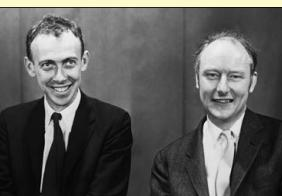

JAMES WATSON FRANCIS CRICK

He met Crick and discovered their common interest in solving the DNA structure. Their first serious effort, was unsatisfactory. Their second effort based upon more experimental evidence and better appreciation of the nucleic acid literature, resulted, early in March 1953, in the proposal of the complementary double-helical configuration.

Francis Harry Compton Crick was born on 8 June 1916, at Northampton, England. He studied physics at University College, London and obtained a B.Sc. in 1937. He completed Ph.D. in 1954 on a thesis entitled "X-ray Diffraction: Polypeptides and Proteins".

A critical influence in Crick's career was his friendship with J. D. Watson, then a young man of 23, leading in 1953 to the proposal of the double-helical structure for DNA and the replication scheme. Crick was made an F.R.S. in 1959.

The honours to Watson with Crick include: the John Collins Warren Prize of the Massachusetts General Hospital, in 1959; the Lasker Award, in 1960; the Research Corporation Prize, in 1962 and above all, the Nobel Prize in 1962.

## CHAPTER 4

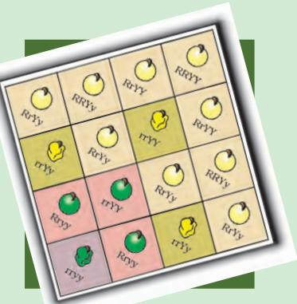

# PRINCIPLES OF INHERITANCE AND VARIATION

- *4.1 Mendel's Laws of Inheritance*
- *4.2 Inheritance of One Gene*
- *4.3 Inheritance of Two Genes*
- *4.4 Sex Determination*
- *4.5 Mutation*
- *4.6 Genetic Disorders*

Have you ever wondered why an elephant always gives birth only to a baby elephant and not some other animal? Or why a mango seed forms only a mango plant and not any other plant?

Given that they do, are the offspring identical to their parents? Or do they show differences in some of their characteristics? Have you ever wondered why siblings sometimes look so similar to each other? Or sometimes even so different?

These and several related questions are dealt with, scientifically, in a branch of biology known as Genetics. This subject deals with the inheritance, as well as the variation of characters from parents to offspring. Inheritance is the process by which characters are passed on from parent to progeny; it is the basis of heredity. Variation is the degree by which progeny differ from their parents.

Humans knew from as early as 8000-1000 B.C. that one of the causes of variation was hidden in sexual reproduction. They exploited the variations that were naturally present in the wild populations of plants and animals to selectively breed and select for organisms that possessed desirable characters. For example, through artificial selection and domestication from ancestral

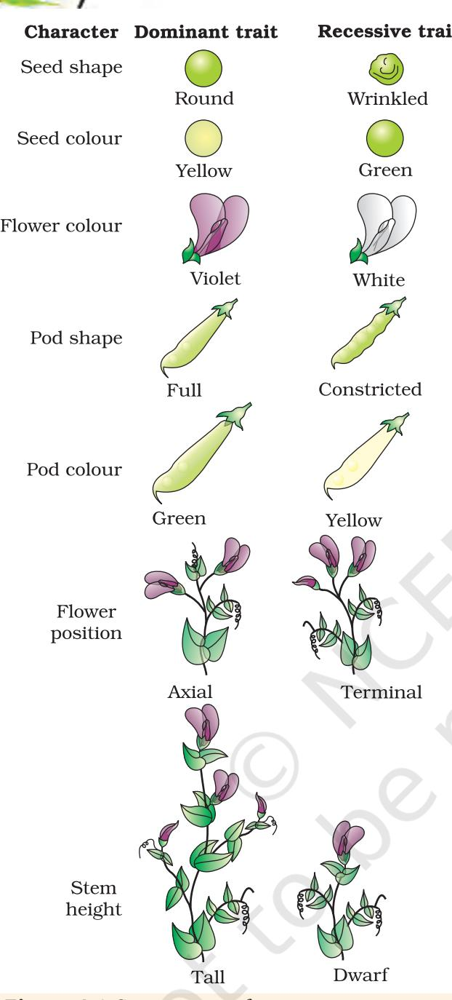

Figure 4.1 Seven pairs of contrasting traits in pea plant studied by Mendel

wild cows, we have well-known Indian breeds, e.g., Sahiwal cows in Punjab. We must, however, recognise that though our ancestors knew about the inheritance of characters and variation, they had very little idea about the scientific basis of these phenomena.

## 4.1 MENDEL'S LAWS OF INHERITANCE

It was during the mid-nineteenth century that headway was made in the understanding of inheritance. Gregor Mendel, conducted hybridisation experiments on garden peas for seven years (1856-1863) and proposed the laws of inheritance in living organisms. During Mendel's investigations into inheritance patterns it was for the first time that statistical analysis and mathematical logic were applied to problems in biology. His experiments had a large sampling size, which gave greater credibility to the data that he collected. Also, the confirmation of his inferences from experiments on successive generations of his test plants, proved that his results pointed to general rules of inheritance rather than being unsubstantiated ideas. Mendel investigated characters in the garden pea plant that were manifested as two opposing traits, e.g., tall or dwarf plants, yellow or green seeds. This allowed him to set up a basic framework of rules governing inheritance, which was expanded on by later scientists to account for all the diverse natural observations and the complexity inherent in them.

Mendel conducted such artificial pollination/cross pollination experiments using several true-breeding pea lines. A truebreeding line is one that, having undergone

continuous self-pollination, shows the stable trait inheritance and expression for several generations. Mendel selected 14 true-breeding pea plant varieties, as pairs which were similar except for one character with contrasting traits. Some of the contrasting traits selected were smooth or wrinkled seeds, yellow or green seeds, inflated (full) or constricted green or yellow pods and tall or dwarf plants (Figure 4.1, Table 4.1).

#### Table 4.1: Contrasting Traits Studied by Mendel in Pea

| S.No. | Characters | Contrasting Traits |
| --- | --- | --- |
| 1. | Stem height | Tall/dwarf |
| 2. | Flower colour | Violet/white |
| 3. | Flower position | Axial/terminal |
| 4. | Pod shape | Inflated/constricted |
| 5. | Pod colour | Green/yellow |
| 6. | Seed shape | Round/wrinkled |
| 7. | Seed colour | Yellow/green |

## 4.2 INHERITANCE OF ONE GENE

Let us take the example of one such hybridisation experiment carried out by Mendel where he crossed tall and dwarf pea plants to study the inheritance of one gene (Figure 4.2). He collected the seeds produced as a result of this cross and grew them to generate plants of the first hybrid generation. This generation is also called the Filial1 progeny or the F1 . Mendel observed that all the F1 progeny plants were tall, like one of its parents; none were dwarf (Figure 4.3). He made similar observations for the other pairs of traits – he found that the F1 always resembled either one of the parents, and that the trait of the other parent was not seen in them.

Mendel then self-pollinated the tall F1 plants and to his surprise found that in the Filial2 generation some of the offspring were 'dwarf'; the character that was not seen in the F1 generation was now expressed. The proportion of plants that were dwarf were

1/4th of the F2 plants while 3/4th of the F2 plants were tall. The tall and dwarf traits were identical to their parental type and did not show any blending, that is all the offspring were either tall or dwarf, none were of inbetween height (Figure 4.3).

Similar results were obtained with the other traits that he studied: only one of the parental traits was expressed in the F1 generation while at the F2 stage both the traits were expressed in the proportion 3:1. The contrasting traits did not show any blending at either F1 or F2 stage.

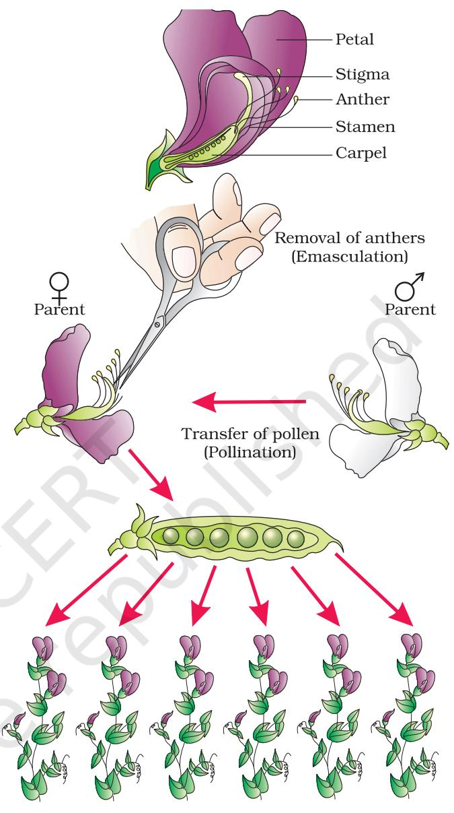

55

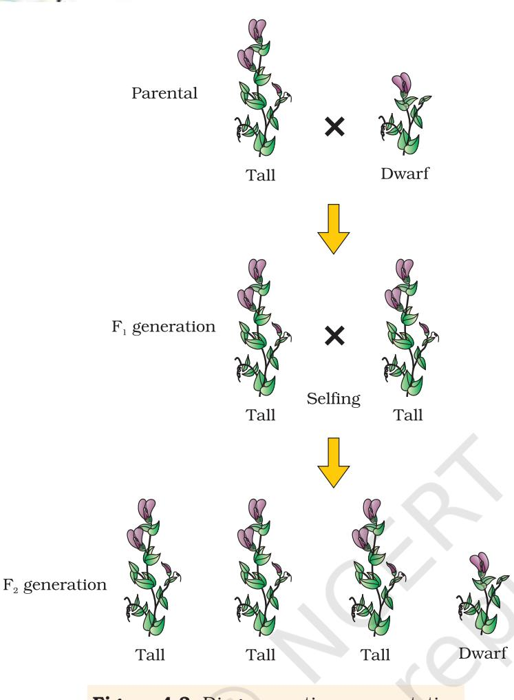

Figure 4.3 Diagrammatic representation of monohybrid cross

Based on these observations, Mendel proposed that something was being stably passed down, unchanged, from parent to offspring through the gametes, over successive generations. He called these things as 'factors'. Now we call them as genes. Genes, therefore, are the units of inheritance. They contain the information that is required to express a particular trait in an organism. Genes which code for a pair of contrasting traits are known as alleles, i.e., they are slightly different forms of the same gene.

If we use alphabetical symbols for each gene, then the capital letter is used for the trait expressed at the F1 stage and the small alphabet for the other trait. For example, in case of the character of height, T is used for the Tall trait and t for the 'dwarf', and T and t are alleles of each other. Hence, in plants the pair of alleles for height would be TT, Tt or tt. Mendel also proposed that in a true breeding, tall or dwarf pea variety the allelic pair of genes for height are

identical or homozygous, TT and tt, respectively. TT and tt are called the genotype of the plant while the descriptive terms tall and dwarf are the phenotype. What then would be the phenotype of a plant that had a genotype Tt?

As Mendel found the phenotype of the F1 heterozygote Tt to be exactly like the TT parent in appearance, he proposed that in a pair of dissimilar factors, one dominates the other (as in the F1 ) and hence is called the dominant factor while the other factor is recessive . In this case T (for tallness) is dominant over t (for dwarfness), that is recessive. He observed identical behaviour for all the other characters/trait-pairs that he studied.

It is convenient (and logical) to use the capital and lower case of an alphabetical symbol to remember this concept of dominance and recessiveness. (Do not use T for tall and d for dwarf because you will find it difficult to remember whether T and d are alleles of the same gene/character or not). Alleles can be similar as in the case of homozygotes TT and tt or can be dissimilar as in the case of the heterozygote Tt. Since the Tt plant is heterozygous for genes controlling one character (height), it is a monohybrid and the cross between TT and tt is a monohybrid cross.

From the observation that the recessive parental trait is expressed without any blending in the F2 generation, we can infer that, when the tall and dwarf plant produce gametes, by the process of meiosis, the alleles of the parental pair separate or segregate from each other and only one allele is transmitted to a gamete. This segregation of alleles is a random process and so there is a 50 per cent chance of a gamete containing either allele, as has been verified by the results of the crossings. In this way the gametes of the tall TT plants have the allele T and the gametes of the dwarf tt plants have the allele t. During fertilisation the two alleles, T from one parent say, through the pollen, and t from the other parent, then through the egg, are united to produce zygotes that have one T allele and one t allele. In other words the hybrids have Tt. Since these hybrids contain alleles which express contrasting traits, the plants are heterozygous. The production of gametes by the parents, the formation of the zygotes, the F1 and F2 plants can be understood from a diagram called Punnett Square as shown in Figure 4.4. It was developed by a British geneticist, Reginald C. Punnett. It is a graphical representation to calculate the probability of all possible genotypes of offspring in a genetic cross. The possible gametes are written on two sides, usually the top row and left columns. All possible combinations are represented in boxes below in the squares, which generates a square output form.

The Punnett Square shows the parental tall TT (male) and dwarf tt (female) plants, the gametes produced by them and, the F1 Tt progeny. The F1 plants of genotype Tt are self-pollinated. The symbols & and % are used to denote the female

(eggs) and male (pollen) of the F1 generation, respectively. The F1 plant of the genotype Tt when self-pollinated, produces gametes of the genotype T and t in equal proportion. When fertilisation takes place, the pollen grains of genotype T have a 50 per cent chance to pollinate eggs of the genotype T, as well as of genotype t. Also pollen grains of genotype t have a 50 per cent chance of pollinating eggs of genotype T, as well as of

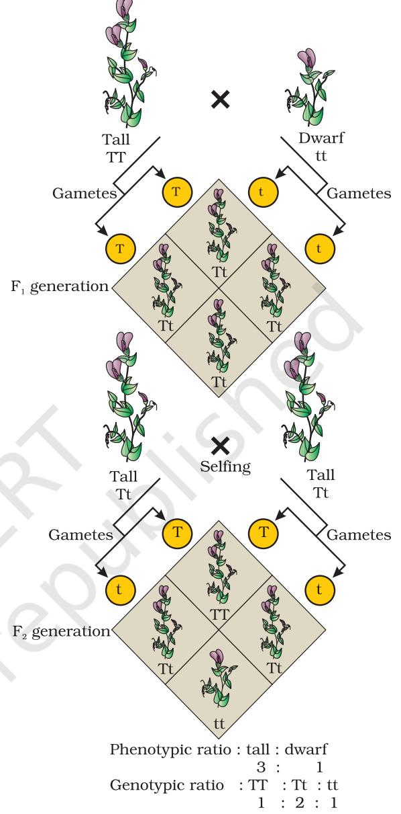

- Figure 4.4 A Punnett square used to understand a typical monohybrid cross conducted by Mendel between true-breeding tall plants and true-breeding dwarf plants
57

genotype t. As a result of random fertilisation, the resultant zygotes can be of the genotypes TT, Tt or tt.

From the Punnett square it is easily seen that 1/4th of the random fertilisations lead to TT, 1/2 lead to Tt and 1/4th to tt. Though the F1 have a genotype of Tt, but the phenotypic character seen is 'tall'. At F2 , 3/4th of the plants are tall, where some of them are TT while others are Tt. Externally it is not possible to distinguish between the plants with the genotypes TT and Tt. Hence, within the genopytic pair Tt only one character 'T ' tall is expressed. Hence the character T or 'tall' is said to dominate over the other allele t or 'dwarf' character. It is thus due to this dominance of one character over the other that all the F1 are tall (though the genotype is Tt) and in the F2 3/4th of the plants are tall (though genotypically 1/2 are Tt and only 1/4th are TT). This leads to a phenotypic ratio of 3/4th tall : (1/4 TT + 1/2 Tt) and 1/4th tt, i.e., a 3:1 ratio, but a genotypic ratio of 1:2:1.

The 1/4 : 1/2 : 1/4 ratio of TT: Tt: tt is mathematically condensable to the form of the binomial expression (ax +by)2 , that has the gametes bearing genes T or t in equal frequency of ½. The expression is expanded as given below :

#### (1/2T + 1/2 t) 2 = (1/2T + 1/2t) X (1/2T + 1/2t) = 1/4 TT + 1/2Tt + 1/4 tt

Mendel self-pollinated the F2 plants and found that dwarf F2 plants continued to generate dwarf plants in F3 and F4 generations. He concluded that the genotype of the dwarfs was homozygous – tt. What do you think he would have got had he self-pollinated a tall F2 plant?

From the preceeding paragraphs it is clear that though the genotypic ratios can be calculated using mathematical probability, by simply looking at the phenotype of a dominant trait, it is not possible to know the genotypic composition. That is, for example, whether a tall plant from F1 or F2 has TT or Tt composition, cannot be predicted. Therefore, to determine the genotype of a tall plant at F2 , Mendel crossed the tall plant from F2 with a dwarf plant. This he called a test cross. In a typical test cross an organism (pea plants here) showing a dominant phenotype (and whose genotype is to be determined) is crossed with the recessive parent instead of self-crossing. The progenies of such a cross can easily be analysed to predict the genotype of the test organism. Figure 4.5 shows the results of typical test cross where violet colour flower (W) is dominant over white colour flower (w).

*Using Punnett square, try to find out the nature of offspring of a test cross. What ratio did you get?*

*Using the genotypes of this cross, can you give a general definition for a test cross?*

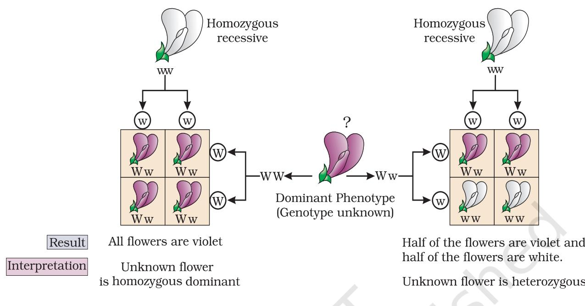

Based on his observations on monohybrid crosses Mendel proposed two general rules to consolidate his understanding of inheritance in monohybrid crosses. Today these rules are called the Principles or Laws of Inheritance: the First Law or Law of Dominance and the Second Law or Law of Segregation.

## 4.2.1 Law of Dominance

- (i) Characters are controlled by discrete units called factors.
- (ii) Factors occur in pairs.
- (iii) In a dissimilar pair of factors one member of the pair dominates (dominant) the other (recessive).

The law of dominance is used to explain the expression of only one of the parental characters in a monohybrid cross in the F1 and the expression of both in the F2 . It also explains the proportion of 3:1 obtained at the F2 .

### 4.2.2 Law of Segregation

This law is based on the fact that the alleles do not show any blending and that both the characters are recovered as such in the F2 generation though one of these is not seen at the F1 stage. Though the parents contain two alleles during gamete formation, the factors or alleles of a pair segregate from each other such that a gamete receives only one of the two factors. Of course, a homozygous parent produces all gametes that are similar while a heterozygous one produces two kinds of gametes each having one allele with equal proportion.

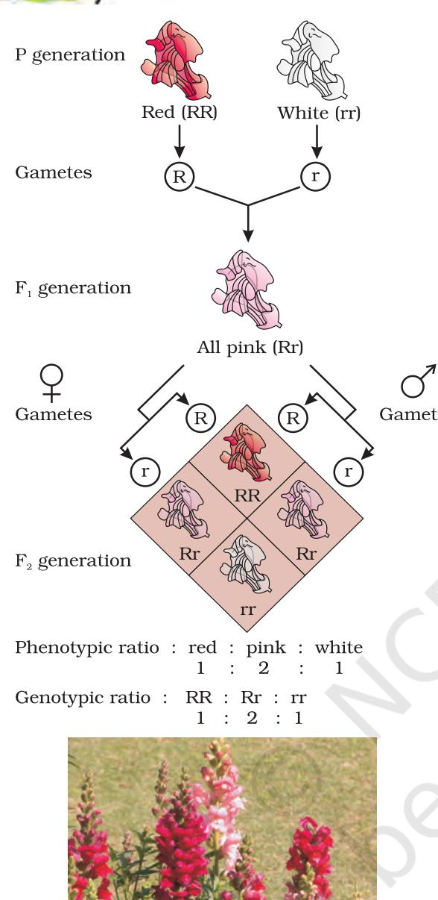

substrate S. Theoretically, the modified allele could be responsible for production of –

- (i) the normal/less efficient enzyme, or
- (ii) a non-functional enzyme, or
- (iii) no enzyme at all

## *4.2.2.1 Incomplete Dominance*

When experiments on peas were repeated using other traits in other plants, it was found that sometimes the F1 had a phenotype that did not resemble either of the two parents and was in between the two. The inheritance of flower colour in the dog flower (snapdragon or *Antirrhinum sp.*) is a good example to understand incomplete dominance. In a cross between true-breeding red-flowered (RR) and truebreeding white-flowered plants (rr), the F1 (Rr) was pink (Figure 4.6). When the F1 was self-pollinated the F2 resulted in the following ratio 1 (RR) Red: 2 (Rr) Pink: 1 (rr) White. Here the genotype ratios were exactly as we would expect in any mendelian monohybrid cross, but the phenotype ratios had changed from the 3:1 dominant : recessive ratio. What happened was that R was not completely dominant over r and this made it possible to distinguish Rr as pink from RR (red) and rr (white) .

Explanation of the concept of dominance: What exactly is dominance? Why are some alleles dominant and some recessive? To tackle these questions, we must understand what a gene does. Every gene, as you know by now, contains the information to express a particular trait. In a diploid organism, there are two copies of each gene, i.e., as a pair of alleles. Now, these two alleles need not always be identical, as in a heterozygote. One of them may be different due to some changes that it has undergone (about which you will read further on, and in the next chapter) which modifies the information that particular allele contains.

Let's take an example of a gene that contains the information for producing an enzyme. Now there are two copies of this gene, the two allelic forms. Let us assume (as is more common) that the normal allele produces the normal enzyme that is needed for the transformation of a

#### 2024-25

60

In the first case, the modified allele is equivalent to the unmodified allele, i.e., it will produce the same phenotype/trait, i.e., result in the transformation of substrate S. Such equivalent allele pairs are very common. But, if the allele produces a non-functional enzyme or no enzyme, the phenotype may be effected. The phenotype/trait will only be dependent on the functioning of the unmodified allele. The unmodified (functioning) allele, which represents the original phenotype is the dominant allele and the modified allele is generally the recessive allele. Hence, in the example above the recessive trait is seen due to non-functional enzyme or because no enzyme is produced.

### *4.2.2.2 Co-dominance*

Till now we were discussing crosses where the F1 resembled either of the two parents (dominance) or was in-between (incomplete dominance). But, in the case of co-dominance the F1 generation resembles both parents. A good example is different types of red blood cells that determine ABO blood grouping in human beings. ABO blood groups are controlled by the gene *I*. The plasma membrane of the red blood cells has sugar polymers that protrude from its surface and the kind of sugar is controlled by the gene*.* The gene (*I*) has three alleles *I A* , *I B* and *i*. The alleles *I A* and *I B* produce a slightly different form of the sugar while allele *i* does not produce any sugar. Because humans are diploid organisms, each person possesses any two of the three *I* gene alleles. *I A* and *I B* are completely dominant over *i*, in other words when *I A* and *i* are present only *I A* expresses (because *i* does not produce any sugar), and when *I B* and *i* are present *I B* expresses. But when *I A* and *I B* are present together they both express their own types of sugars: this is because of co-dominance. Hence red blood cells have both A and B types of sugars. Since there are three different alleles, there are six different combinations of these three alleles that are possible, and therefore, a total of six different genotypes of the human ABO blood types (Table 4.2). *How many phenotypes are possible?*

| Allele from | Allele from | Genotype of | Blood |
| --- | --- | --- | --- |
| Parent 1 | Parent 2 | offspring | types of offspring |
| I A | I A | I A I A | A |
| I A | I B | I A I B | AB |
| I A | i | I A i | A |
| I B | I A | I A I B | AB |
| I B | I B | I B I B | B |
| I B | i | I B i | B |
| i | i | i i | O |

#### Table 4.2: Table Showing the Genetic Basis of Blood Groups in Human Population

Do you realise that the example of ABO blood grouping also provides a good example of multiple alleles? Here you can see that there are more than two, i.e., three alleles, governing the same character. Since in an individual only two alleles can be present, multiple alleles can be found only when population studies are made.

Occasionally, a single gene product may produce more than one effect. For example, starch synthesis in pea seeds is controlled by one gene. It has two alleles (B and b). Starch is synthesised effectively by BB homozygotes and therefore, large starch grains are produced. In contrast, bb homozygotes have lesser efficiency in starch synthesis and produce smaller starch grains. After maturation of the seeds, BB seeds are round and the bb seeds are wrinkled. Heterozygotes produce round seeds, and so B seems to be the dominant allele. But, the starch grains produced are of intermediate size in Bb seeds. So if starch grain size is considered as the phenotype, then from this angle, the alleles show incomplete dominance.

Therefore, dominance is not an autonomous feature of a gene or the product that it has information for. It depends as much on the gene product and the production of a particular phenotype from this product as it does on the particular phenotype that we choose to examine, in case more than one phenotype is influenced by the same gene.

## 4.3 INHERITANCE OF TWO GENES

Mendel also worked with and crossed pea plants that differed in two characters, as is seen in the cross between a pea plant that has seeds with yellow colour and round shape and one that had seeds of green colour and wrinkled shape (Figure 4.7). Mendel found that the seeds resulting from the crossing of the parents, had yellow coloured and round shaped seeds. *Here can you tell which of the characters in the pairs yellow/ green colour and round/wrinkled shape was dominant?*

Thus, yellow colour was dominant over green and round shape dominant over wrinkled. These results were identical to those that he got when he made separate monohybrid crosses between yellow and green seeded plants and between round and wrinkled seeded plants.

Let us use the genotypic symbols Y for dominant yellow seed colour and y for recessive green seed colour, R for round shaped seeds and r for wrinkled seed shape. The genotype of the parents can then be written as RRYY and rryy. The cross between the two plants can be written down as in Figure 4.7 showing the genotypes of the parent plants. The gametes RY and ry unite on fertilisation to produce the F1 hybrid RrYy. When Mendel self hybridised the F1 plants he found that 3/4th of F2 plants had yellow seeds and 1/4th had green. The yellow and green colour segregated in a 3:1 ratio. Round and wrinkled seed shape also segregated in a 3:1 ratio; just like in a monohybrid cross.

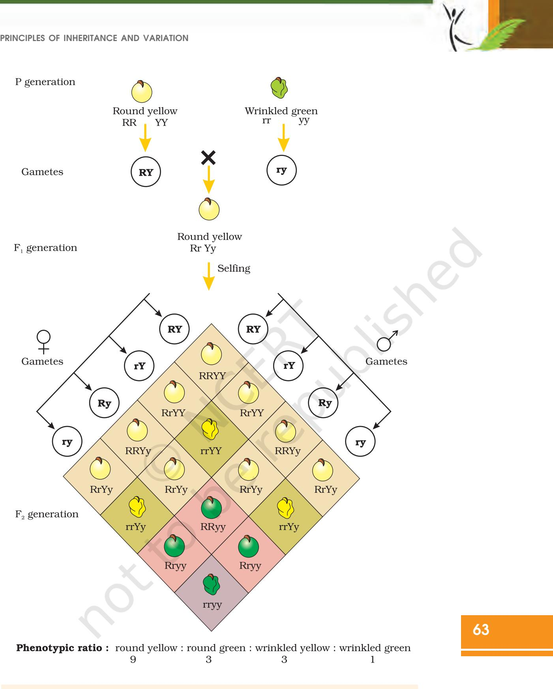

Figure 4.7 Results of a dihybrid cross where the two parents differed in two pairs of contrasting traits: seed colour and seed shape

#### 4.3.1 Law of Independent Assortment

In the dihybrid cross (Figure 4.7), the phenotypes round, yellow; wrinkled, yellow; round, green and wrinkled, green appeared in the ratio 9:3:3:1. Such a ratio was observed for several pairs of characters that Mendel studied.

The ratio of 9:3:3:1 can be derived as a combination series of 3 yellow: 1 green, with 3 round : 1 wrinkled. This derivation can be written as follows:

(3 Round : 1 Wrinkled) (3 Yellow : 1 Green) = 9 Round, Yellow : 3 Wrinkled, Yellow: 3 Round, Green : 1 Wrinkled, Green

Based upon such observations on dihybrid crosses (crosses between plants differing in two traits) Mendel proposed a second set of generalisations that we call Mendel's Law of Independent Assortment. The law states that 'when two pairs of traits are combined in a hybrid, segregation of one pair of characters is independent of the other pair of characters'.

The Punnett square can be effectively used to understand the independent segregation of the two pairs of genes during meiosis and the production of eggs and pollen in the F1 RrYy plant. Consider the segregation of one pair of genes R and r. Fifty per cent of the gametes have the gene R and the other 50 per cent have r. Now besides each gamete having either R or r, it should also have the allele Y or y. The important thing to remember here is that segregation of 50 per cent R and 50 per cent *r* is *independent* from the segregation of 50 per cent Y and 50 per cent y. Therefore, 50 per cent of the r bearing gametes has Y and the other 50 per cent has y. Similarly, 50 per cent of the R bearing gametes has Y and the other 50 per cent has y. Thus there are four genotypes of gametes (four types of pollen and four types of eggs). The four types are RY, Ry, r*Y* and ry each with a frequency of 25 per cent or 1/4th of the total gametes produced. When you write down the four types of eggs and pollen on the two sides of a Punnett square it is very easy to derive the composition of the zygotes that give rise to the F2 plants (Figure 4.7). *Although there are 16 squares how many different types of genotypes and phenotypes are formed?* Note them down in the format given.

Can you, using the Punnett square data work out the genotypic ratio at the F2 stage and fill in the format given? Is the genotypic ratio also 9:3:3:1?

#### 4.3.2 Chromosomal Theory of Inheritance

Mendel published his work on inheritance of characters in 1865 but for several reasons, it remained unrecognised till 1900. Firstly, communication was not easy (as it is now) in those days and his work could not be widely publicised. Secondly, his concept of genes (or factors, in Mendel's words) as stable and discrete units that controlled the expression of traits and, of the pair of alleles which did not 'blend' with each other, was not accepted by his contemporaries as an explanation for the apparently continuous variation seen in nature. Thirdly, Mendel's approach of using mathematics to explain biological phenomena was totally new and unacceptable to many of the biologists of his time. Finally, though Mendel's work suggested that factors (genes) were discrete units, he could not provide any physical proof for the existence of factors or say what they were made of.

In 1900, three Scientists (de Vries, Correns and von Tschermak) independently rediscovered Mendel's results on the inheritance of characters. Also, by this time due to advancements in microscopy that were taking place, scientists were able to carefully observe cell division. This led to the discovery of structures in the nucleus that appeared to double and divide just before each cell division. These were called chromosomes (*colored bodies*, as they were visualised by staining). By 1902, the chromosome movement during meiosis had been worked out. Walter Sutton and Theodore Boveri noted that the behaviour of chromosomes was parallel to the behaviour of genes and used chromosome movement (Figure 4.8) to explain Mendel's laws (Table 4.3). Recall that you have studied the behaviour of chromosomes during mitosis (equational division) and during meiosis (reduction division). The important things to remember are that chromosomes as well as genes occur in pairs. The two alleles of a gene pair are located on homologous sites on homologous chromosomes.

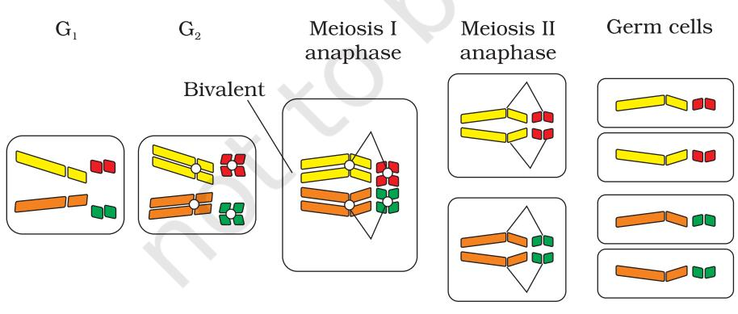

#### Figure 4.8 Meiosis and germ cell formation in a cell with four chromosomes. Can you see how chromosomes segregate when germ cells are formed?

## 65

#### Table 4.3: A Comparison between the Behaviour of Chromosomes and Genes

| A | B |
| --- | --- |
| Occur in pairs | Occur in pairs |
| Segregate at the time of gamete | Segregate at gamete formation and only |
| formation such that only one of each | one of each pair is transmitted to a |
| pair is transmitted to a gamete | gamete |
| Independent pairs segregate | One pair segregates independently of |
| independently of each other | another pair |
| Can you tell which of these columns A or B represent the chromosome |  |
| and which represents the gene? How did you decide? |  |

During Anaphase of meiosis I, the two chromosome pairs can align at the metaphase plate independently of each other (Figure 4.9). To understand this, compare the chromosomes of four different colour in the left and right columns. In the left column (Possibility I) orange and green is segregating together. But in the right hand column (Possibility II) the orange chromosome is segregating with the red chromosomes.

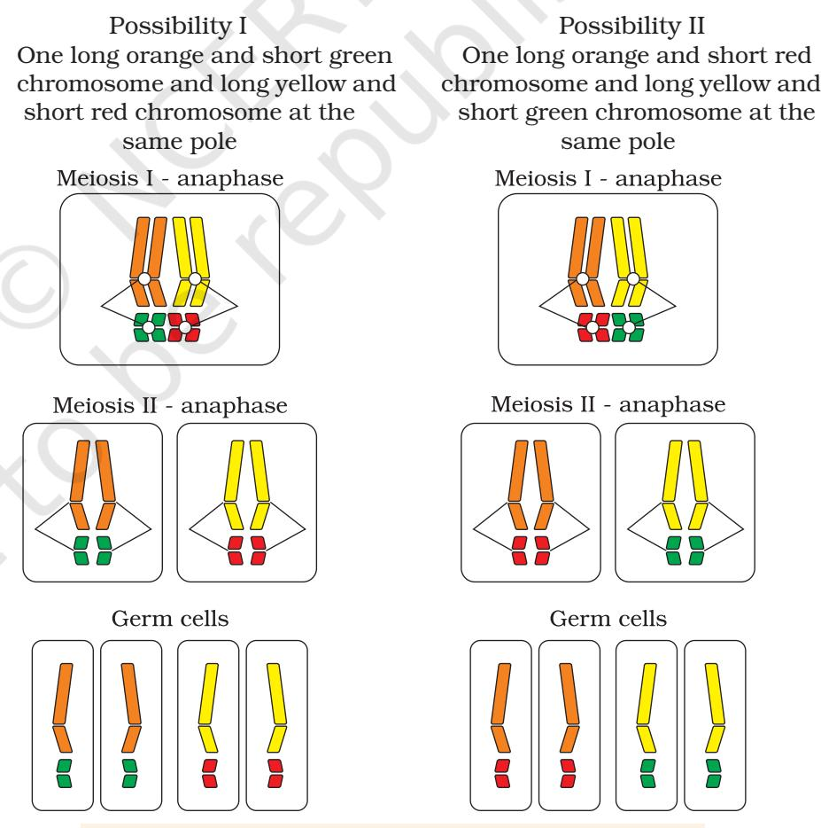

Figure 4.9 Independent assortment of chromosomes

66

Sutton and Boveri argued that the pairing and separation of a pair of chromosomes would lead to the segregation of a pair of factors they carried. Sutton united the knowledge of chromosomal segregation with Mendelian principles and called it the chromosomal theory of inheritance.

Following this synthesis of ideas, experimental verification of the chromosomal theory of inheritance by Thomas Hunt Morgan and his colleagues, led to discovering the basis for the variation that sexual reproduction produced. Morgan worked with the tiny fruit flies, *Drosophila melanogaster* (Figure 4.10), which were found very suitable for such studies. They could be grown on simple synthetic medium in the laboratory. They complete their life cycle in about two weeks, and a single mating could produce a large number of progeny flies. Also, there was a clear differentiation of the sexes – the male and female flies are easily distinguishable. Also, it has many types of hereditary variations that can be seen with low power microscopes.

### 4.3.3 Linkage and Recombination

Morgan carried out several dihybrid crosses in *Drosophila* to study genes that were sex-linked. The crosses were similar to the dihybrid crosses carried out by Mendel in peas. For example Morgan hybridised yellow-bodied, white-eyed females to brown-bodied, red-eyed males and intercrossed their F1 progeny. He observed that the two genes did not segregate independently of each other and the F2 ratio deviated very significantly from the 9:3:3:1 ratio (expected when the two genes are independent).

Morgan and his group knew that the genes were located on the X chromosome (Section 4.4) and saw quickly that when the two genes in a dihybrid cross were situated on the same chromosome, the proportion of parental gene combinations were much higher than the non-parental type. Morgan attributed this due to the physical association or linkage of the two genes and coined the term linkage to describe this physical association of genes on a chromosome and the term recombination to describe the generation of non-parental gene combinations (Figure 4.11). Morgan and his group also found that even when genes were grouped on the same chromosome, some genes were very tightly linked (showed very low recombination) (Figure 4.11, Cross A) while others were loosely linked (showed higher recombination) (Figure 4.11, Cross B). For example he found that the genes white and yellow were very tightly linked and showed only 1.3 per cent recombination while white and miniature wing showed 37.2 per cent recombination. His student Alfred Sturtevant used the frequency of recombination between gene pairs on the same chromosome as a measure of the distance between genes and 'mapped' their position on the chromosome. Today genetic maps

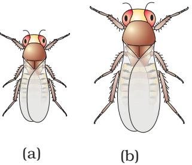

Figure 4.10 *Drosophila melanogaster* (a) Male (b) Female

are extensively used as a starting point in the sequencing of whole genomes as was done in the case of the Human Genome Sequencing Project, described later.

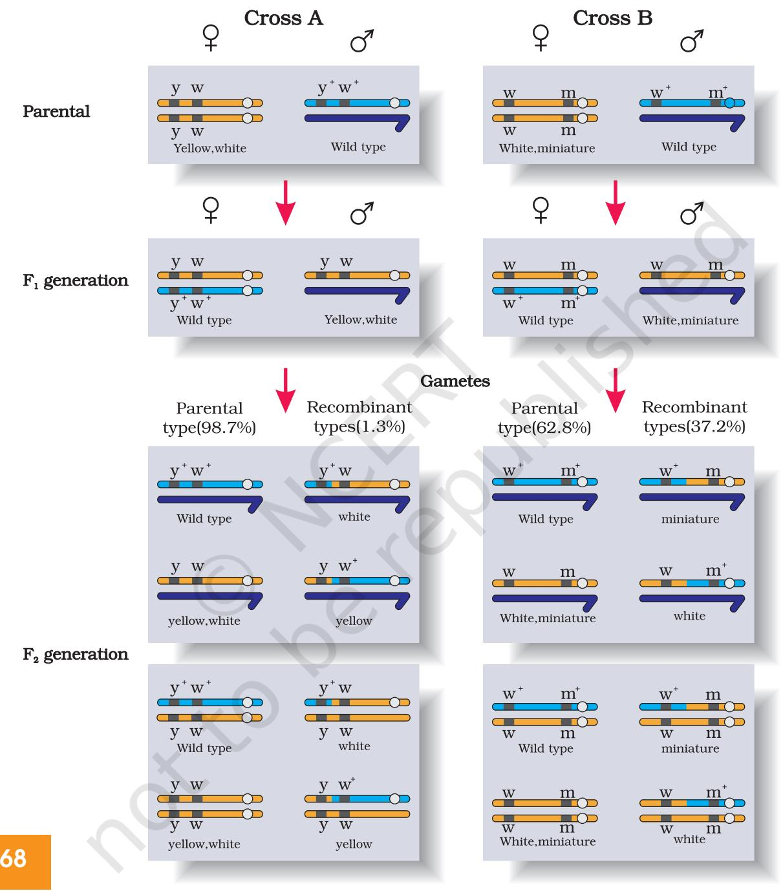

- Figure 4.11 Linkage: Results of two dihybrid crosses conducted by Morgan. Cross A shows crossing between gene y and w; Cross B shows crossing between genes w and m. Here dominant wild type alleles are represented with (+) sign in superscript Note: The strength of linkage between y and w is higher than w and m.
## 4.4 POLYGENIC INHERITANCE

Mendel's studies mainly described those traits that have distinct alternate forms such as flower colour which are either purple or white. But if you look around you will find that there are many traits which are not so distinct in their occurrence and are spread across a gradient. For example, in humans we don't just have tall or short people as two distinct alternatives but a whole range of possible heights. Such traits are generally controlled by three or more genes and are thus called as polygenic traits. Besides the involvement of multiple genes polygenic inheritance also takes into account the influence of environment. Human skin colour is another classic example for this. In a polygenic trait the phenotype reflects the contribution of each allele, i.e., the effect of each allele is additive. To understand this better let us assume that three genes A, B, C control skin colour in human with the dominant forms A, B and C responsible for dark skin colour and the recessive forms a, b and c for light skin colour. The genotype with all the dominant alleles (AABBCC) will have the darkest skin colour and that with all the recessive alleles (aabbcc) will have the lightest skin colour. As expected the genotype with three dominant alleles and three recessive alleles will have an intermediate skin colour. In this manner the number of each type of alleles in the genotype would determine the darkness or lightness of the skin in an individual.

## 4.5 PLEIOTROPY

We have so far seen the effect of a gene on a single phenotype or trait. There are however instances where a single gene can exhibit multiple phenotypic expression. Such a gene is called a pleiotropic gene. The underlying mechanism of pleiotropy in most cases is the effect of a gene on metabolic pathways which contribute towards different phenotypes. An example of this is the disease phenylketonuria, which occurs in humans. The disease is caused by mutation in the gene that codes for the enzyme phenyl alanine hydroxylase (single gene mutation). This manifests itself through phenotypic expression characterised by mental retardation and a reduction in hair and skin pigmentation.

## 4.6 SEX DETERMINATION

The mechanism of sex determination has always been a puzzle before the geneticists. The initial clue about the genetic/chromosomal mechanism of sex determination can be traced back to some of the experiments carried out in insects. In fact, the cytological observations made in a number of insects led to the development of the concept of genetic/chromosomal basis of sex-determination. Henking (1891) could trace a specific nuclear structure all through spermatogenesis in a few insects, and it was also observed by him that 50 per cent of the sperm received this structure after spermatogenesis, whereas the other 50 per cent sperm did not receive it. Henking gave a name to this structure as the X body but he could not explain its significance. Further investigations by other scientists led to the conclusion that the 'X body' of Henking was in fact a chromosome

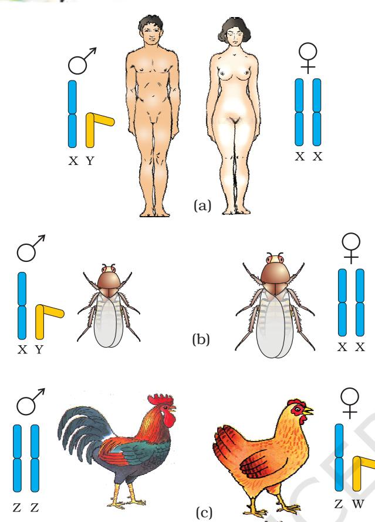

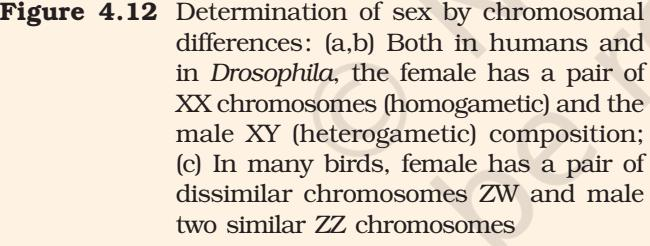

and that is why it was given the name X-chromosome. It was also observed that in a large number of insects the mechanism of sex determination is of the XO type, i.e., all eggs bear an additional X-chromosome besides the other chromosomes (autosomes). On the other hand, some of the sperms bear the X-chromosome whereas some do not. Eggs fertilised by sperm having an X-chromosome become females and, those fertilised by sperms that do not have an X-chromosome become males. *Do you think the number of chromosomes in the male and female are equal?* Due to the involvement of the X-chromosome in the determination of sex, it was designated to be the sex chromosome, and the rest of the chromosomes were named as autosomes.Grasshopper is an example of XO type of sex determination in which the males have only one X-chromosome besides the autosomes, whereas females have a pair of X-chromosomes.

These observations led to the investigation of a number of species to understand the mechanism of sex determination. In a number of other insects and mammals including man, XY type of sex determination is seen where both male and female have same number of chromosomes. Among the males an X-chromosome is present but its counter part is distinctly smaller and called the Y-chromosome. Females, however, have a pair of Xchromosomes. Both males and females bear

same number of autosomes. Hence, the males have autosomes plus XY, while female have autosomes plus XX. In human beings and in *Drosophila* the males have one X and one Y chromosome, whereas females have a pair of X-chromosomes besides autosomes (Figure 4.12 a, b).

In the above description you have studied about two types of sex determining mechanisms, i.e., XO type and XY type. But in both cases males produce two different types of gametes, (a) either with or without X-chromosome or (b) some gametes with X-chromosome and some with Y-chromosome. Such types of sex determination mechanism is designated to be the example of male heterogamety. In some other organisms, e.g., birds, a different mechanism of sex determination is observed (Figure 4.12 c). In this case the total number of chromosome is same in both males and females. But two different types of gametes in terms of the sex

chromosomes, are produced by females, i.e., female heterogamety. In order to have a distinction with the mechanism of sex determination described earlier, the two different sex chromosomes of a female bird has been designated to be the Z and W chromosomes. In these organisms the females have one Z and one W chromosome, whereas males have a pair of Z-chromosomes besides the autosomes.

## 4.6.1 Sex Determination in Humans

It has already been mentioned that the sex determining mechanism in case of humans is XY type. Out of 23 pairs of chromosomes present, 22 pairs are exactly same in both males and females; these are the autosomes. A pair of X-chromosomes are present in the female, whereas the presence of an X and Y chromosome are determinant of the male characteristic. During spermatogenesis among males, two types of gametes are produced. 50 per cent of the total sperm produced carry the X-chromosome and the rest 50 per cent has Y-chromosome besides the autosomes. Females, however, produce only one type of ovum with an X-chromosome. There is an equal probability of fertilisation of the ovum with the sperm carrying either X or Y chromosome. In case the ovum fertilises with a sperm carrying X-chromosome the zygote develops into a female (XX) and the fertilisation of ovum with Y-chromosome carrying sperm results into a male offspring. Thus, it is evident that it is the genetic makeup of the sperm that determines the sex of the child. It is also evident that in each pregnancy there is always 50 per cent probability of either a male or a female child. It is unfortunate that in our society women are blamed for giving birth to female children and have been ostracised and ill-treated because of this false notion.

## 4.6.2 Sex Determination in Honey Bee

The sex determination in honey bee is based on the number of sets of chromosomes an individual receives. An offspring formed from the union of a sperm and an egg develops as a female (queen or worker), and an unfertilised egg develops as a male (drone) by means of parthenogenesis. This means that the males have half the number of chromosomes than that of a female. The females are diploid having 32

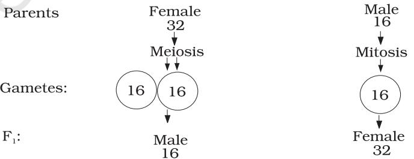

71

chromosomes and males are haploid, i.e., having 16 chromosomes. This is called as haplodiploid sex-determination system and has special characteristic features such as the males produce sperms by mitosis (Figure 4.13), they do not have father and thus cannot have sons, but have a grandfather and can have grandsons.

How is the sex-determination mechanism different in the birds? *Is the sperm or the egg responsible for the sex of the chicks?*

## 4.7 MUTATION

Mutation is a phenomenon which results in alteration of DNA sequences and consequently results in changes in the genotype and the phenotype of an organism. In addition to recombination, mutation is another phenomenon that leads to variation in DNA.

As you will learn in Chapter 5, one DNA helix runs continuously from one end to the other in each chromatid, in a highly supercoiled form. Therefore loss (deletions) or gain (insertion/duplication) of a segment of DNA, result in alteration in chromosomes. Since genes are known to be located on chromosomes, alteration in chromosomes results in

> abnormalities or aberrations. Chromosomal aberrations are commonly observed in cancer cells.

> In addition to the above, mutation also arise due to change in a single base pair of DNA. This is known as point mutation. A classical example of such a mutation is sickle cell anemia. Deletions and insertions of base pairs of DNA, causes frame-shift mutations (see Chapter 5).

> The mechanism of mutation is beyond the scope of this discussion, at this level. However, there are many chemical and physical factors that induce mutations. These are referred to as mutagens. UV radiations can cause mutations in organisms – it is a mutagen.

## 4.8 GENETIC DISORDERS

#### 4.8.1 Pedigree Analysis

The idea that disorders are inherited has been prevailing in the human society since long. This was based on the heritability of certain characteristic features in families. After the rediscovery of Mendel's work the practice of analysing inheritance pattern of traits in human beings began. Since it is evident that control crosses that can be performed in pea plant or some other organisms, are not possible in case of human beings, study of the family history about inheritance of a particular trait provides an

alternative. Such an analysis of traits in a several of generations of a family is called the pedigree analysis. In the pedigree analysis the inheritance of a particular trait is represented in the family tree over generations.

In human genetics, pedigree study provides a strong tool, which is utilised to trace the inheritance of a specific trait, abnormality or disease. Some of the important standard symbols used in the pedigree analysis have been shown in Figure 4.13.

As you have studied in this chapter, each and every feature in any organism is controlled by one or the other gene located on the DNA present

## 72

Figure 4.13 Symbols used in the human pedigree analysis

## 4.8.2 Mendelian Disorders

Broadly, genetic disorders may be grouped into two categories – Mendelian disorders and Chromosomal disorders. Mendelian disorders are mainly determined by alteration or mutation in the single gene. These disorders are transmitted to the offspring on the same lines as we have studied in the principle of inheritance. The pattern of inheritance of such Mendelian disorders can be traced in a family by the pedigree analysis. Most common and prevalent Mendelian disorders are Haemophilia, Cystic fibrosis, Sicklecell anaemia, Colour blindness, Phenylketonuria, Thalassemia, etc. It is important to mention here that such Mendelian disorders may be dominant or recessive. By pedigree analysis one can easily understand whether the trait in question is dominant or recessive. Similarly, the trait may also be linked to the sex chromosome as in case of haemophilia. It is evident that this X-linked recessive trait shows transmission from carrier female to male progeny. A representative pedigree is shown in Figure 4.14 for dominant and recessive traits. Discuss with your teacher and design pedigrees for characters linked to both autosomes and sex chromosome.

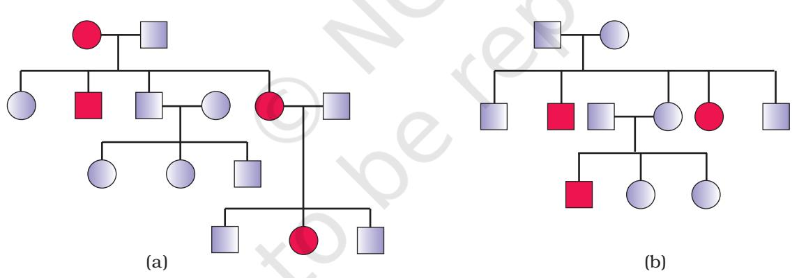

Figure 4.14 Representative pedigree analysis of (a) Autosomal dominant trait (for example: Myotonic dystrophy) (b) Autosomal recessive trait (for example: Sickle-cell anaemia)

Colour Blidness : It is a sex-linked recessive disorder due to defect in either red or green cone of eye resulting in failure to discriminate between red and green colour. This defect is due to mutation in certain genes present in the X chromosome. It occurs in about 8 per cent of males and only about 0.4 per cent of females. This is because the genes that lead to red-green colour blindness are on the X chromosome. Males have only one X chromosome and females have two. The son of a woman who carries

73

74

the gene has a 50 per cent chance of being colour blind. The mother is not herself colour blind because the gene is recessive. That means that its effect is suppressed by her matching dominant normal gene. A daughter will not normally be colour blind, unless her mother is a carrier and her father is colour blind.

Haemophilia: This sex linked recessive disease, which shows its transmission from unaffected carrier female to some of the male progeny has been widely studied. In this disease, a single protein that is a part of the cascade of proteins involved in the clotting of blood is affected. Due to this, in an affected individual a simple cut will result in non-stop bleeding. The heterozygous female (carrier) for haemophilia may transmit the disease to sons. The possibility of a female becoming a haemophilic is extremely rare because mother of such a female has to be at least carrier and the father should be haemophilic (unviable in the later stage of life). The family pedigree of Queen Victoria shows a number of haemophilic descendents as she was a carrier of the disease.

Sickle-cell anaemia: This is an autosome linked recessive trait that can be transmitted from parents to the offspring when both the partners are carrier for the gene (or heterozygous). The disease is controlled by a single pair of allele, HbA and HbS . Out of the three possible genotypes only homozygous individuals for HbS (HbSHbS ) show the diseased phenotype. Heterozygous (HbAHbS ) individuals appear apparently unaffected but they are carrier of the disease as there is 50 per cent probability of transmission of the mutant gene to the progeny, thus exhibiting sickle-cell trait (Figure 4.15). The defect is caused by the substitution of Glutamic acid

Figure 4.15 Micrograph of the red blood cells and the amino acid composition of the relevant portion of β-chain of haemoglobin: (a) From a normal individual; (b) From an individual with sickle-cell anaemia

(Glu) by Valine (Val) at the sixth position of the beta globin chain of the haemoglobin molecule. The substitution of amino acid in the globin protein results due to the single base substitution at the sixth codon of the beta globin gene from GAG to GUG. The mutant haemoglobin molecule undergoes polymerisation under low oxygen tension causing the change in the shape of the RBC from biconcave disc to elongated sickle like structure (Figure 4.15).

Phenylketonuria: This inborn error of metabolism is also inherited as the autosomal recessive trait. The affected individual lacks an enzyme that converts the amino acid phenylalanine into tyrosine. As a result of this phenylalanine is accumulated and converted into phenylpyruvic acid and other derivatives. Accumulation of these in brain results in mental retardation. These are also excreted through urine because of its poor absorption by kidney.

Thalassemia :This is also an autosome-linked recessive blood disease transmitted from parents to the offspring when both the partners are unaffected carrier for the gene (or heterozygous). The defect could be due to either mutation or deletion which ultimately results in reduced rate of synthesis of one of the globin chains (α and β chains) that make up haemoglobin. This causes the formation of abnormal haemoglobin molecules resulting into anaemia which is characteristic of the disease. Thalassemia can be classified according to which chain of the haemoglobin molecule is affected. In α Thalassemia, production of α globin chain is affected while in β Thalassemia, production of β globin chain is affected. α Thalassemia is controlled by two closely linked genes HBA1 and HBA2 on chromosome 16 of each parent and it is observed due to mutation or deletion of one or more of the four genes. The more genes affected, the less alpha globin molecules produced. While β Thalassemia is controlled by a single gene HBB on chromosome 11 of each parent and occurs due to mutation of one or both the genes. Thalassemia differs from sickle-cell anaemia in that the former is a quantitative problem of synthesising too few globin molecules while the latter is a qualitative problem of synthesising an incorrectly functioning globin.

#### 4.8.3 Chromosomal Disorders

The chromosomal disorders on the other hand are caused due to absence or excess or abnormal arrangement of one or more chromosomes.

Failure of segregation of chromatids during cell division cycle results in the gain or loss of a chromosome(s), called aneuploidy. For example, Down's syndrome results in the gain of extra copy of chromosome 21. Similarly, Turner's syndrome results due to loss of an X chromosome in human females. Failure of cytokinesis after telophase stage of cell division results in an increase in a whole set of chromosomes in an organism and, this phenomenon is known as polyploidy. This condition is often seen in plants.

The total number of chromosomes in a normal human cell is 46 (23 pairs). Out of these 22 pairs are autosomes and one pair of chromosomes are sex chromosome. Sometimes, though rarely, either an additional copy of a chromosome may be included in an individual or an

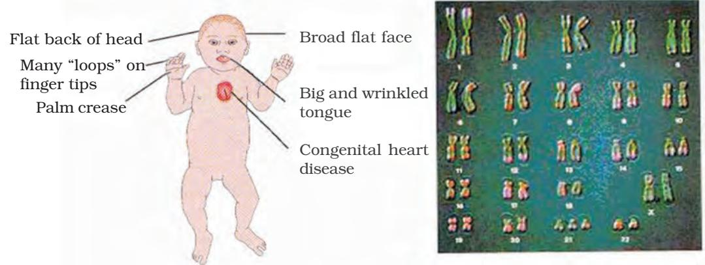

Figure 4.16 *A representative figure showing an individual inflicted with Down's syndrome and the corresponding chromosomes of the individual*

Tall stature with feminised character

Short stature and underdeveloped feminine character

Figure 4.17 Diagrammatic representation of genetic disorders due to sex chromosome composition in humans : (a) Klinefelter Syndrome; (b) Turner's Syndrome

individual may lack one of any one pair of chromosomes. These situations are known as trisomy or monosomy of a chromosome, respectively. Such a situation leads to very serious consequences in the individual. Down's syndrome, Turner's syndrome, Klinefelter's syndrome are common examples of chromosomal disorders.

Down's Syndrome : The cause of this genetic disorder is the presence of an additional copy of the chromosome number 21 (trisomy of 21). This disorder was first described by Langdon Down (1866). The affected individual is short statured with small round head, furrowed tongue and partially open mouth (Figure 4.16). Palm is broad with characteristic palm crease. Physical, psychomotor and mental development is retarded.

Klinefelter's Syndrome : This genetic disorder is also caused due to the presence of an additional copy of Xchromosome resulting into a karyotype of 47, XXY. Such an individual has overall masculine development, however, the feminine development (development of breast, i.e., Gynaecomastia) is also expressed (Figure 4.17 a). Such individuals are sterile.

Turner's Syndrome : Such a disorder is caused due to the absence of one of the X chromosomes, i.e., 45 with X0, Such females are sterile as ovaries are rudimentary besides other features including lack of other secondary sexual characters (Figure 4.17 b).

76

### SUMMARY

Genetics is a branch of biology which deals with principles of inheritance and its practices. Progeny resembling the parents in morphological and physiological features has attracted the attention of many biologists. Mendel was the first to study this phenomenon systematically. While studying the pattern of inheritance in pea plants of contrasting characters, Mendel proposed the principles of inheritance, which are today referred to as 'Mendel's Laws of Inheritance'. He proposed that the 'factors' (later named as genes) regulating the characters are found in pairs known as alleles. He observed that the expression of the characters in the offspring follow a definite pattern in different–first generations (F1 ), second (F2 ) and so on. Some characters are dominant over others. The dominant characters are expressed when factors are in heterozygous condition (Law of Dominance). The recessive characters are only expressed in homozygous conditions. The characters never blend in heterozygous condition. A recessive character that was not expressed in heterozygous conditon may be expressed again when it becomes homozygous. Hence, characters segregate while formation of gametes (Law of Segregation).

Not all characters show true dominance. Some characters show incomplete, and some show co-dominance. When Mendel studied the inheritance of two characters together, it was found that the factors independently assort and combine in all permutations and combinations (Law of Independent Assortment). Different combinations of gametes are theoretically represented in a square tabular form known as 'Punnett Square'. The factors (now known as gene) on chromosomes regulating the characters are called the genotype and the physical expression of the chraracters is called phenotype.

After knowing that the genes are located on the chromosomes, a good correlation was drawn between Mendel's laws : segregation and assortment of chromosomes during meiosis. The Mendel's laws were extended in the form of 'Chromosomal Theory of Inheritance'. Later, it was found that Mendel's law of independent assortment does not hold true for the genes that were located on the same chromosomes. These genes were called as 'linked genes'. Closely located genes assorted together, and distantly located genes, due to recombination, assorted independently. Linkage maps, therefore, corresponded to arrangement of genes on a chromosome.

Many genes were linked to sexes also, and called as sex-linked genes. The two sexes (male and female) were found to have a set of chromosomes which were common, and another set which was different. The chromosomes which were different in two sexes were named as sex chromosomes. The remaining set was named as autosomes. In humans, a normal female has 22 pairs of autosomes and a pair of sex chromosomes (XX). A male has 22 pairs of autosomes and a pair of sex chromosome as XY. In chicken, sex chromosomes in male are ZZ, and in females are ZW.

Mutation is defined as change in the genetic material. A point mutation is a change of a single base pair in DNA. Sickle-cell anemia is caused due to change of one base in the gene coding for beta-chain of hemoglobin. Inheritable mutations can be studied by generating a pedigree of a family. Some mutations involve changes in whole set of chromosomes (polyploidy) or change in a subset of chromosome number (aneuploidy). This helped in understanding the mutational basis of genetic disorders. Down's syndrome is due to trisomy of chromosome 21, where there is an extra copy of chromosome 21 and consequently the total number of chromosome becomes 47. In Turner's syndrome, one X chromosome is missing and the sex chromosome is as XO, and in Klinefelter's syndrome, the condition is XXY. These can be easily studied by analysis of Karyotypes.

# EXERCISES

- 1. Mention the advantages of selecting pea plant for experiment by Mendel.
- 2. Differentiate between the following
	- (a) Dominance and Recessive
	- (b) Homozygous and Heterozygous
	- (c) Monohybrid and Dihybrid.
- 3. A diploid organism is heterozygous for 4 loci, how many types of gametes can be produced?
- 4. Explain the Law of Dominance using a monohybrid cross.
- 5. Define and design a test-cross.
- 6. Using a Punnett Square, workout the distribution of phenotypic features in the first filial generation after a cross between a homozygous female and a heterozygous male for a single locus.
- 7. When a cross in made between tall plant with yellow seeds (TtYy) and tall plant with green seed (Ttyy), what proportions of phenotype in the offspring could be expected to be
	- (a) tall and green.
	- (b) dwarf and green.
- 8. Two heterozygous parents are crossed. If the two loci are linked what would be the distribution of phenotypic features in F1 generation for a dibybrid cross?
- 9. Briefly mention the contribution of T.H. Morgan in genetics.
- 10. What is pedigree analysis? Suggest how such an analysis, can be useful.
- 11. How is sex determined in human beings?
- 12. A child has blood group O. If the father has blood group A and mother blood group B, work out the genotypes of the parents and the possible genotypes of the other offsprings.
- 13. Explain the following terms with example

(a) Co-dominance

- (b) Incomplete dominance
- 14. What is point mutation? Give one example.
- 15. Who had proposed the chromosomal theory of the inheritance?
- 16. Mention any two autosomal genetic disorders with their symptoms.

78

