# CHAPTER 5

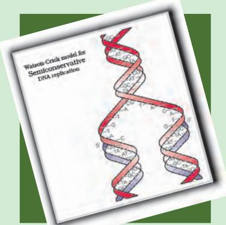

# MOLECULAR BASIS OF INHERITANCE

- *5.1 The DNA*
- *5.2 The Search for Genetic Material*
- *5.3 RNA World*
- *5.4 Replication*
- *5.5 Transcription*
- *5.6 Genetic Code*
- *5.7 Translation*
- *5.8 Regulation of Gene Expression*
- *5.9 Human Genome Project*
- *5.10 DNA Fingerprinting*

In the previous chapter, you have learnt the inheritance patterns and the genetic basis of such patterns. At the time of Mendel, the nature of those 'factors' regulating the pattern of inheritance was not clear. Over the next hundred years, the nature of the putative genetic material was investigated culminating in the realisation that DNA – deoxyribonucleic acid – is the genetic material, at least for the majority of organisms. In class XI you have learnt that nucleic acids are polymers of nucleotides.

Deoxyribonucleic acid (DNA) and ribonucleic acid (RNA) are the two types of nucleic acids found in living systems. DNA acts as the genetic material in most of the organisms. RNA though it also acts as a genetic material in some viruses, mostly functions as a messenger. RNA has additional roles as well. It functions as adapter, structural, and in some cases as a catalytic molecule. In Class XI you have already learnt the structures of nucleotides and the way these monomer units are linked to form nucleic acid polymers. In this chapter we are going to discuss the structure of DNA, its replication, the process of making RNA from DNA (transcription), the genetic code that determines the sequences of amino acids in proteins, the process of protein synthesis (translation) and elementary basis of their regulation. The determination

of complete nucleotide sequence of human genome during last decade

has set in a new era of genomics. In the last section, the essentials of human genome sequencing and its consequences will also be discussed. Let us begin our discussion by first understanding the structure of

the most interesting molecule in the living system, that is, the DNA. In subsequent sections, we will understand that why it is the most abundant genetic material, and what its relationship is with RNA.

# 5.1 THE DNA

DNA is a long polymer of deoxyribonucleotides. The length of DNA is usually defined as number of nucleotides (or a pair of nucleotide referred to as base pairs) present in it. This also is the characteristic of an organism. For example, a bacteriophage known as φ ×174 has 5386 nucleotides, Bacteriophage lambda has 48502 base pairs (bp), *Escherichia coli* has 4.6 × 106 bp, and haploid content of human DNA is 3.3 × 109 bp. Let us discuss the structure of such a long polymer.

# 5.1.1 Structure of Polynucleotide Chain

Let us recapitulate the chemical structure of a polynucleotide chain (DNA or RNA). A nucleotide has three components – a nitrogenous base, a pentose sugar (ribose in case of RNA, and deoxyribose for DNA), and a phosphate group. There are two types of nitrogenous bases – Purines (Adenine and Guanine), and Pyrimidines (Cytosine, Uracil and Thymine). Cytosine is common for both DNA and RNA and Thymine is present in DNA. Uracil is present in RNA at the place of Thymine. A nitrogenous base is linked to the OH of 1*'* C pentose sugar through a N-glycosidic linkage to form a nucleoside, such as adenosine or deoxyadenosine, guanosine or deoxyguanosine, cytidine or deoxycytidine and uridine or deoxythymidine. When a phosphate group is linked to OH of 5*'* C of a nucleoside through phosphoester linkage, a corresponding nucleotide (or deoxynucleotide depending upon the type of sugar present) is formed. Two nucleotides are linked through 3*'*-5*'* phosphodiester linkage to form a dinucleotide. More nucleotides can be joined in such a manner to form a polynucleotide chain. A polymer thus formed has at one end a free

phosphate moiety at 5*'* -end of sugar, which is referred to as 5'-end of polynucleotide chain. Similarly, at the other end of the polymer the sugar has a free OH of 3*'*C group which is referred to as 3*'* -end of the polynucleotide chain. The backbone of a polynucleotide chain is formed due to sugar and phosphates. The nitrogenous bases linked to sugar moiety project from the backbone (Figure 5.1).

In RNA, every nucleotide residue has an additional –OH group present at 2*'* -position in the ribose. Also, in RNA the uracil is found at the place of thymine (5-methyl uracil, another chemical name for thymine).

DNA as an acidic substance present in nucleus was first identified by Friedrich Meischer in 1869. He named it as 'Nuclein'. However, due to technical limitation in isolating such a long polymer intact, the elucidation of structure of DNA remained elusive for a very long period of time. It was only in 1953 that James Watson and Francis Crick, based on the X-ray diffraction data produced by Maurice Wilkins and Rosalind Franklin, proposed a very simple but famous Double Helix model for the structure of DNA. One of the hallmarks of their proposition was base pairing between the two strands of polynucleotide chains. However, this proposition was also based on the observation of Erwin Chargaff that for a double stranded DNA, the ratios between Adenine and Thymine and Guanine and Cytosine are constant and equals one.

The base pairing confers a very unique property to the polynucleotide chains. They are said to be complementary to each other, and therefore if the sequence of bases in one strand is known then the sequence in other strand can be predicted. Also, if each strand from a DNA (let us call it as a parental DNA) acts as a template for synthesis of a new strand, the two double stranded DNA (let us call them as daughter DNA) thus, produced would be identical to the parental DNA molecule. Because of this, the genetic implications of the structure of DNA became very clear.

The salient features of the Double-helix structure of DNA are as follows:

- (i) It is made of two polynucleotide chains, where the backbone is constituted by sugar-phosphate, and the bases project inside.
- (ii) The two chains have anti-parallel polarity. It means, if one chain has the polarity 5*'*à3*'*, the other has 3*'*à5*'*.
- (iii) The bases in two strands are paired through hydrogen bond (H-bonds) forming base pairs (bp). Adenine forms two hydrogen bonds with Thymine from opposite strand and vice-versa. Similarly, Guanine is bonded with Cytosine with three H-bonds. As a result, always a purine comes opposite to a pyrimidine. This generates approximately uniform distance between the two strands of the helix (Figure 5.2).
- (iv) The two chains are coiled in a right-handed fashion. The pitch of the helix is 3.4 nm (a nanometre is one billionth of a metre, that is 10-9 m) and there are roughly 10 bp in each

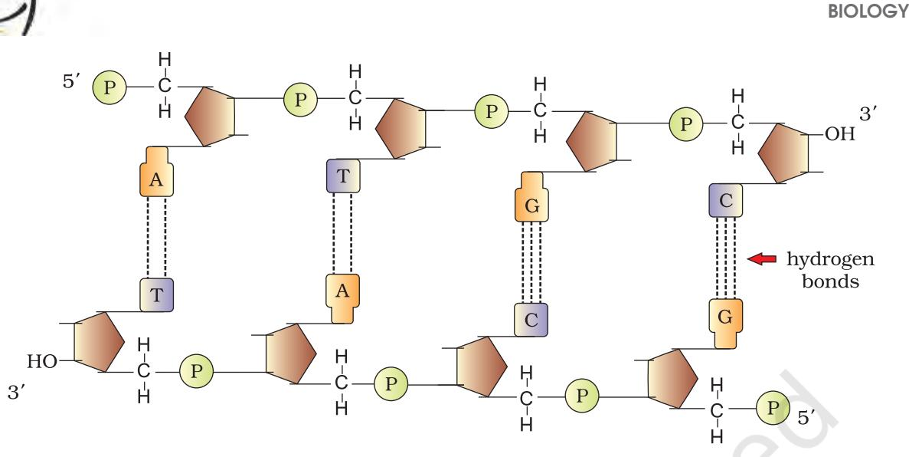

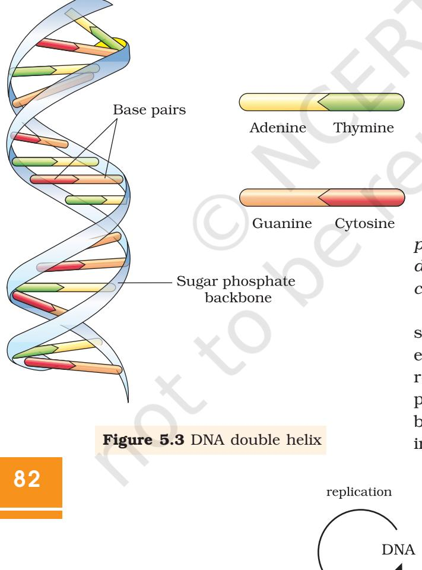

turn. Consequently, the distance between a bp in a helix is approximately 0.34 nm.

- (v) The plane of one base pair stacks over the other in double helix. This, in addition to H-bonds, confers stability of the helical structure (Figure 5.3).
*Compare the structure of purines and pyrimidines. Can you find out why the distance between two polynucleotide chains in DNA remains almost constant?*

The proposition of a double helix structure for DNA and its simplicity in explaining the genetic implication became revolutionary. Very soon, Francis Crick proposed the Central dogma in molecular biology, which states that the genetic information flows from DNAàRNAàProtein.

In some viruses the flow of information is in reverse direction, that is, from RNA to DNA. *Can you suggest a simple name to the process?*

## 5.1.2 Packaging of DNA Helix

Taken the distance between two consecutive base pairs as 0.34 nm (0.34×10–9 m), if the length of DNA double helix in a typical mammalian cell is calculated (simply by multiplying the total number of bp with distance between two consecutive bp, that is, 6.6 × 109 bp × 0.34 × 10-9m/bp), it comes out to be approximately 2.2 metres. A length that is far greater than the dimension of a typical nucleus (approximately 10–6 m). How is such a long polymer packaged in a cell?

*If the length of E. coli DNA is 1.36 mm, can you calculate the number of base pairs in E.coli?*

In prokaryotes, such as, *E. coli*, though they do not have a defined nucleus, the DNA is not scattered throughout the cell. DNA (being negatively charged) is held with some proteins (that have positive charges) in a region termed as 'nucleoid'. The DNA in nucleoid is organised in large loops held by proteins.

In eukaryotes, this organisation is much more complex. There is a set of positively charged, basic proteins called histones. A protein acquires charge depending upon the abundance of amino acids residues with charged side chains. Histones are rich in the basic amino acid residues lysine and arginine. Both the amino acid residues carry positive charges in their side chains. Histones are organised to form

a unit of eight molecules called histone octamer. The negatively charged DNA is wrapped around the positively charged histone octamer to form a structure called nucleosome (Figure 5.4 a). A typical nucleosome contains 200 bp of DNA helix. Nucleosomes constitute the repeating unit of a structure in nucleus called chromatin, threadlike stained (coloured) bodies seen in nucleus. The nucleosomes in chromatin are seen as 'beads-on-string' structure when viewed under electron microscope (EM) (Figure 5.4 b).

*Theoretically, how many such beads (nucleosomes) do you imagine are present in a mammalian cell?*

The beads-on-string structure in chromatin is packaged to form chromatin fibers that are further coiled and condensed at metaphase stage of cell division to form chromosomes. The packaging of chromatin at higher level requires additional set of proteins that collectively are referred to as

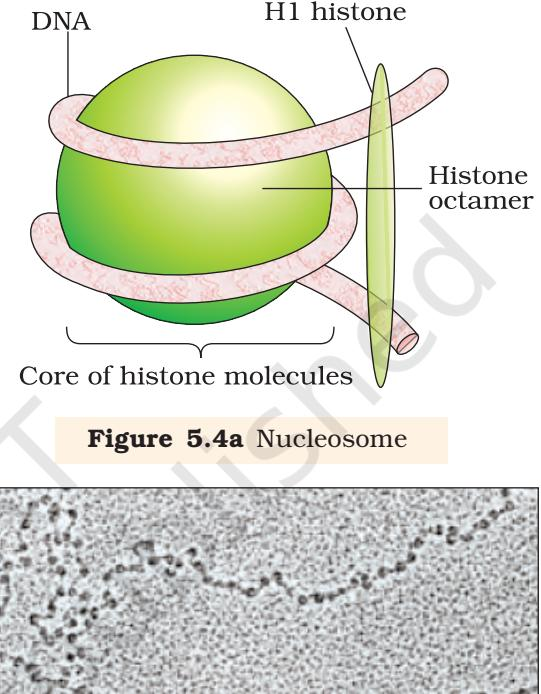

Figure 5.4b EM picture - 'Beads-on-String'

Non-histone Chromosomal (NHC) proteins. In a typical nucleus, some region of chromatin are loosely packed (and stains light) and are referred to as euchromatin. The chromatin that is more densely packed and stains dark are called as Heterochromatin. Euchromatin is said to be transcriptionally active chromatin, whereas heterochromatin is inactive.

# 5.2 THE SEARCH FOR GENETIC MATERIAL

Even though the discovery of nuclein by Meischer and the proposition for principles of inheritance by Mendel were almost at the same time, but that the DNA acts as a genetic material took long to be discovered and proven. By 1926, the quest to determine the mechanism for genetic inheritance had reached the molecular level. Previous discoveries by Gregor Mendel, Walter Sutton, Thomas Hunt Morgan and numerous other scientists had narrowed the search to the chromosomes located in the nucleus of most cells. But the question of what molecule was actually the genetic material, had not been answered.

#### Transforming Principle

In 1928, Frederick Griffith, in a series of experiments with *Streptococcus pneumoniae* (bacterium responsible for pneumonia), witnessed a miraculous transformation in the bacteria. During the course of his experiment, a living organism (bacteria) had changed in physical form.

When *Streptococcus pneumoniae* (pneumococcus) bacteria are grown on a culture plate, some produce smooth shiny colonies (S) while others produce rough colonies (R). This is because the S strain bacteria have a mucous (polysaccharide) coat, while R strain does not. Mice infected with the S strain (virulent) die from pneumonia infection but mice infected with the R strain do not develop pneumonia.

Griffith was able to kill bacteria by heating them. He observed that heat-killed S strain bacteria injected into mice did not kill them. When he

| S strain | > Inject into mice | > Mice live |
| --- | --- | --- |
| (heat-killed) |  |  |
| S strain |  |  |
| (heat-killed) |  |  |
| + | > Inject into mice | > Mice die |
| R strain |  |  |
| (live) |  |  |

84

injected a mixture of heat-killed S and live R bacteria, the mice died. Moreover, he recovered living S bacteria from the dead mice.

He concluded that the R strain bacteria had somehow been transformed by the heat-killed S strain bacteria. Some 'transforming principle', transferred from the heat-killed S strain, had enabled the R strain to synthesise a smooth polysaccharide coat and become virulent. This must be due to the transfer of the genetic material. However, the biochemical nature of genetic material was not defined from his experiments.

#### Biochemical Characterisation of Transforming Principle

Prior to the work of Oswald Avery, Colin MacLeod and Maclyn McCarty (1933-44), the genetic material was thought to be a protein. They worked to determine the biochemical nature of 'transforming principle' in Griffith's experiment.

They purified biochemicals (proteins, DNA, RNA, etc.) from the heat-killed S cells to see which ones could transform live R cells into S cells. They discovered that DNA alone from S bacteria caused R bacteria to become transformed.

They also discovered that protein-digesting enzymes (proteases) and RNA-digesting enzymes (RNases) did not affect transformation, so the transforming substance was not a protein or RNA. Digestion with DNase did inhibit transformation, suggesting that the DNA caused the transformation. They concluded that DNA is the hereditary material, but not all biologists were convinced.

*Can you think of any difference between DNAs and DNase?*

## 5.2.1 The Genetic Material is DNA

The unequivocal proof that DNA is the genetic material came from the experiments of Alfred Hershey and Martha Chase (1952). They worked with viruses that infect bacteria called bacteriophages.

The bacteriophage attaches to the bacteria and its genetic material then enters the bacterial cell. The bacterial cell treats the viral genetic material as if it was its own and subsequently manufactures more virus particles. Hershey and Chase worked to discover whether it was protein or DNA from the viruses that entered the bacteria.

They grew some viruses on a medium that contained radioactive phosphorus and some others on medium that contained radioactive sulfur. Viruses grown in the presence of radioactive phosphorus contained radioactive DNA but not radioactive protein because DNA contains phosphorus but protein does not. Similarly, viruses grown on radioactive sulfur contained radioactive protein but not radioactive DNA because DNA does not contain sulfur.

Radioactive phages were allowed to attach to *E. coli* bacteria. Then, as the infection proceeded, the viral coats were removed from the bacteria by agitating them in a blender. The virus particles were separated from the bacteria by spinning them in a centrifuge.

Bacteria which was infected with viruses that had radioactive DNA were radioactive, indicating that DNA was the material that passed from the virus to the bacteria. Bacteria that were infected with viruses that had radioactive proteins were not radioactive. This indicates that proteins did not enter the bacteria from the viruses. DNA is therefore the genetic material that is passed from virus to bacteria (Figure 5.5).

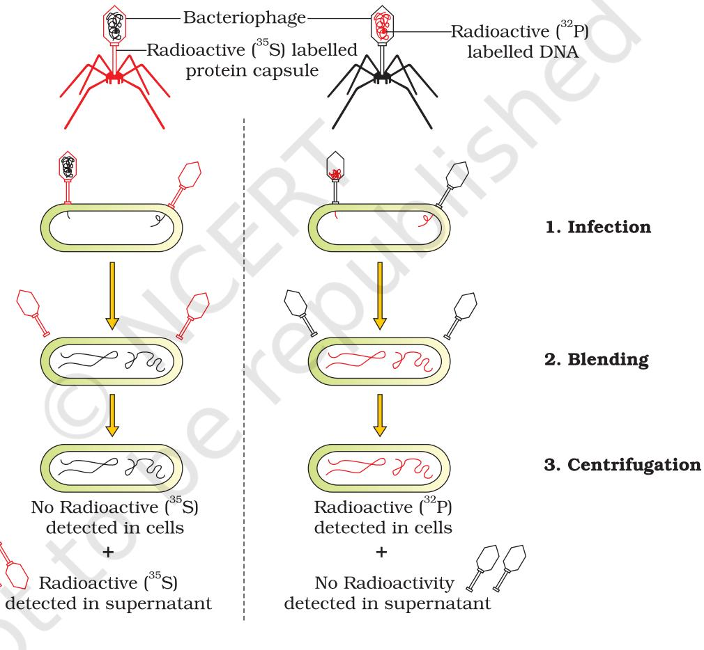

Figure 5.5 The Hershey-Chase experiment

## 5.2.2 Properties of Genetic Material (DNA versus RNA)

From the foregoing discussion, it is clear that the debate between proteins versus DNA as the genetic material was unequivocally resolved from Hershey-Chase experiment. It became an established fact that it is DNA that acts as genetic material. However, it subsequently became clear that

in some viruses, RNA is the genetic material (for example, Tobacco Mosaic viruses, QB bacteriophage, etc.). Answer to some of the questions such as, why DNA is the predominant genetic material, whereas RNA performs dynamic functions of messenger and adapter has to be found from the differences between chemical structures of the two nucleic acid molecules.

*Can you recall the two chemical differences between DNA and RNA?*

A molecule that can act as a genetic material must fulfill the following criteria:

- (i) It should be able to generate its replica (Replication).
- (ii) It should be stable chemically and structurally.
- (iii) It should provide the scope for slow changes (mutation) that are required for evolution.
- (iv) It should be able to express itself in the form of 'Mendelian Characters'.

If one examines each requirement one by one, because of rule of base pairing and complementarity, both the nucleic acids (DNA and RNA) have the ability to direct their duplications. The other molecules in the living system, such as proteins fail to fulfill first criteria itself.

The genetic material should be stable enough not to change with different stages of life cycle, age or with change in physiology of the organism. Stability as one of the properties of genetic material was very evident in Griffith's 'transforming principle' itself that heat, which killed the bacteria, at least did not destroy some of the properties of genetic material. This now can easily be explained in light of the DNA that the two strands being complementary if separated by heating come together, when appropriate conditions are provided. Further, 2*'*-OH group present at every nucleotide in RNA is a reactive group and makes RNA labile and easily degradable. RNA is also now known to be catalytic, hence reactive. Therefore, DNA chemically is less reactive and structurally more stable when compared to RNA. Therefore, among the two nucleic acids, the DNA is a better genetic material.

In fact, the presence of thymine at the place of uracil also confers additional stability to DNA. (Detailed discussion about this requires understanding of the process of repair in DNA, and you will study these processes in higher classes.)

Both DNA and RNA are able to mutate. In fact, RNA being unstable, mutate at a faster rate. Consequently, viruses having RNA genome and having shorter life span mutate and evolve faster.

RNA can directly code for the synthesis of proteins, hence can easily express the characters. DNA, however, is dependent on RNA for synthesis of proteins. The protein synthesising machinery has evolved around RNA. The above discussion indicate that both RNA and DNA can function as

87

genetic material, but DNA being more stable is preferred for storage of genetic information. For the transmission of genetic information, RNA is better.

# 5.3 RNA WORLD

From foregoing discussion, an immediate question becomes evident – which is the first genetic material? It shall be discussed in detail in the chapter on chemical evolution, but briefly, we shall highlight some of the facts and points.

RNA was the first genetic material. There is now enough evidence to suggest that essential life processes (such as metabolism, translation,

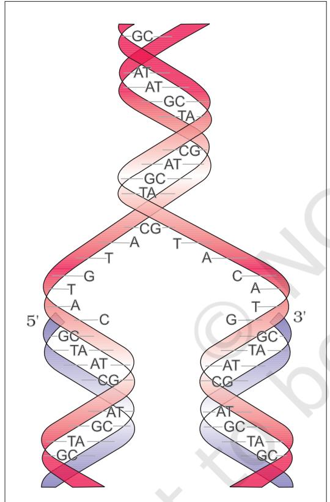

Figure 5.6 Watson-Crick model for semiconservative DNA replication

splicing, etc.), evolved around RNA. RNA used to act as a genetic material as well as a catalyst (there are some important biochemical reactions in living systems that are catalysed by RNA catalysts and not by protein enzymes). But, RNA being a catalyst was reactive and hence unstable. Therefore, DNA has evolved from RNA with chemical modifications that make it more stable. DNA being double stranded and having complementary strand further resists changes by evolving a process of repair.

# 5.4 REPLICATION

While proposing the double helical structure for DNA, Watson and Crick had immediately proposed a scheme for replication of DNA. To quote their original statement that is as follows:

''It has not escaped our notice that the specific pairing we have postulated immediately suggests a possible copying mechanism for the genetic material'' (Watson and Crick, 1953).

The scheme suggested that the two strands would separate and act as a template for the synthesis of new complementary strands. After the completion of replication, each DNA molecule would have one parental and one newly synthesised strand. This scheme was termed as semiconservative DNA replication (Figure 5.6).

## 5.4.1 The Experimental Proof

It is now proven that DNA replicates semiconservatively. It was shown first in *Escherichia coli* and subsequently in higher organisms, such as plants

and human cells. Matthew Meselson and Franklin Stahl performed the following experiment in 1958:

- (i) They grew *E. coli* in a medium containing 15NH4Cl (15N is the heavy isotope of nitrogen) as the only nitrogen source for many generations. The result was that 15N was incorporated into newly synthesised DNA (as well as other nitrogen containing compounds). This heavy DNA molecule could be distinguished from the normal DNA by centrifugation in a cesium chloride (CsCl) density gradient (Please note that 15N is not a radioactive isotope, and it can be separated from 14N only based on densities).
- (ii) Then they transferred the cells into a medium with normal 14NH4Cl and took samples at various definite time intervals as the cells multiplied, and extracted the DNA that remained as double-stranded helices. The various samples were separated independently on CsCl gradients to measure the densities of DNA (Figure 5.7).

*Can you recall what centrifugal force is, and think why a molecule with higher mass/density would sediment faster?*

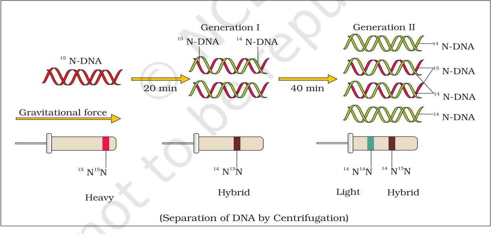

The results are shown in Figure 5.7.

Figure 5.7 Meselson and Stahl's Experiment

- (iii) Thus, the DNA that was extracted from the culture one generation after the transfer from 15N to 14N medium [that is after 20 minutes; *E. coli* divides in 20 minutes] had a hybrid or intermediate density. DNA extracted from the culture after another generation [that is after 40 minutes, II generation] was
89

*If E. coli was allowed to grow for 80 minutes then what would be the proportions of light and hybrid densities DNA molecule?*

Very similar experiments involving use of radioactive thymidine to detect distribution of newly synthesised DNA in the chromosomes was performed on *Vicia faba* (faba beans) by Taylor and colleagues in 1958. The experiments proved that the DNA in chromosomes also replicate semiconservatively.

## 5.4.2 The Machinery and the Enzymes

 In living cells, such as *E. coli*, the process of replication requires a set of catalysts (enzymes). The main enzyme is referred to as DNA-dependent DNA polymerase, since it uses a DNA template to catalyse the polymerisation of deoxynucleotides. These enzymes are highly efficient enzymes as they have to catalyse polymerisation of a large number of nucleotides in a very short time. *E. coli* that has only 4.6 ×106 bp (compare it with human whose diploid content is 6.6 × 109 bp), completes the process of replication within 18 minutes; that means the average rate of polymerisation has to be approximately 2000 bp per second. Not only do these polymerases have to be fast, but they also have to catalyse the reaction with high degree of accuracy. Any mistake during replication would result into mutations. Furthermore, energetically replication is a very expensive process. Deoxyribonucleoside triphosphates serve dual purposes. In addition to acting as substrates, they provide energy for polymerisation reaction (the two terminal phosphates in a deoxynucleoside triphosphates are high-energy phosphates, same as in case of ATP).

In addition to DNA-dependent DNA polymerases, many additional enzymes are required to complete the process of replication with high degree of accuracy. For long DNA molecules, since the two strands of DNA cannot be separated in its entire length (due to very high energy requirement), the replication occur within a small opening of the DNA helix, referred to as replication fork. The DNA-dependent DNA polymerases catalyse polymerisation only in one direction, that is 5*'*à3*'*. This creates some additional complications at the replicating fork. Consequently, on one strand (the template with polarity 3*'*à5*'*), the replication is continuous, while on the other (the template with polarity 5*'*à3*'*), it is discontinuous. The discontinuously synthesised fragments are later joined by the enzyme DNA ligase (Figure 5.8).

The DNA polymerases on their own cannot initiate the process of replication. Also the replication does not initiate randomly at any place in DNA. There is a definite region in *E. coli* DNA where the replication originates. Such regions are termed as origin of replication. It is

because of the requirement of the origin of replication that a piece of DNA if needed to be propagated during recombinant DNA procedures, requires a vector. The vectors provide the origin of replication.

Further, not every detail of replication is understood well. In eukaryotes, the replication of DNA takes place at S-phase of the cell-cycle. The replication of DNA and cell division cycle should be highly coordinated. A failure in cell division after DNA replication results into polyploidy(a chromosomal anomaly). You will learn the detailed nature of origin and the processes occurring at this site, in higher classes.

# 5.5 TRANSCRIPTION

The process of copying genetic information from one strand of the DNA into RNA is termed as transcription. Here also, the principle of

complementarity governs the process of transcription, except the adenosine complements now forms base pair with uracil instead of thymine. However, unlike in the process of replication, which once set in, the total DNA of an organism gets duplicated, in transcription only a segment of DNA and only one of the strands is copied into RNA. This necessitates defining the boundaries that would demarcate the region and the strand of DNA that would be transcribed.

Why both the strands are not copied during transcription has the simple answer. First, if both strands act as a template, they would code for RNA molecule with different sequences (Remember complementarity does not mean identical), and in turn, if they code for proteins, the sequence of amino acids in the proteins would be different. Hence, one segment of the DNA would be coding for two different proteins, and this would complicate the genetic information transfer machinery. Second, the two RNA molecules if produced simultaneously would be complementary to each other, hence would form a double stranded RNA. This would prevent RNA from being translated into protein and the exercise of transcription would become a futile one.

## 5.5.1 Transcription Unit

A transcription unit in DNA is defined primarily by the three regions in the DNA:

- (i) A Promoter
- (ii) The Structural gene
- (iii) A Terminator

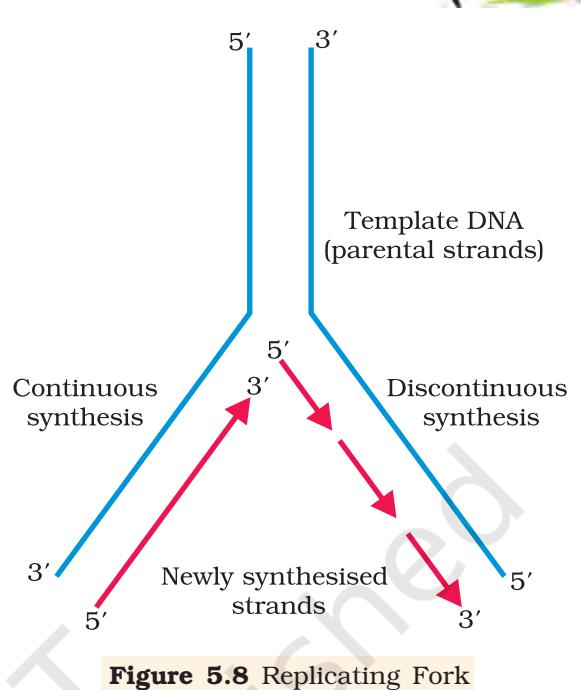

There is a convention in defining the two strands of the DNA in the structural gene of a transcription unit. Since the two strands have opposite polarity and the DNA-dependent RNA polymerase also catalyse the polymerisation in only one direction, that is, 5*'*→3*'*, the strand that has the polarity 3*'*→5*'* acts as a template, and is also referred to as template strand. The other strand which has the polarity (5*'*→3*'*) and the sequence same as RNA (except thymine at the place of uracil), is displaced during transcription. Strangely, this strand (which does not code for anything) is referred to as coding strand. All the reference point while defining a transcription unit is made with coding strand. To explain the point, a hypothetical sequence from a transcription unit is represented below:

3*'* -ATGCATGCATGCATGCATGCATGC-5*'* Template Strand

### 5*'* -TACGTACGTACGTACGTACGTACG-3*'* Coding Strand

*Can you now write the sequence of RNA transcribed from the above DNA?*

Figure 5.9 Schematic structure of a transcription unit

The promoter and terminator flank the structural gene in a transcription unit. The promoter is said to be located towards 5*'* -end (upstream) of the structural gene (the reference is made with respect to the polarity of coding strand). It is a DNA sequence that provides binding site for RNA polymerase, and it is the presence of a promoter in a transcription unit that also defines the template and coding strands. By switching its position with terminator, the definition of coding and template strands could be reversed. The terminator is located towards 3*'* -end (downstream) of the coding strand and it usually defines the end of the process of transcription (Figure 5.9). There are additional regulatory sequences that may be present further upstream or downstream to the promoter. Some of the properties of these sequences shall be discussed while dealing with regulation of gene expression.

## 5.5.2 Transcription Unit and the Gene

A gene is defined as the functional unit of inheritance. Though there is no ambiguity that the genes are located on the DNA, it is difficult to literally

define a gene in terms of DNA sequence. The DNA sequence coding for tRNA or rRNA molecule also define a gene. However by defining a cistron as a segment of DNA coding for a polypeptide, the structural gene in a transcription unit could be said as monocistronic (mostly in eukaryotes) or polycistronic (mostly in bacteria or prokaryotes). In eukaryotes, the monocistronic structural genes have interrupted coding sequences – the genes in eukaryotes are split. The coding sequences or expressed sequences are defined as exons. Exons are said to be those sequence that appear in mature or processed RNA. The exons are interrupted by introns. Introns or intervening sequences do not appear in mature or processed RNA. The split-gene arrangement further complicates the definition of a gene in terms of a DNA segment.

Inheritance of a character is also affected by promoter and regulatory sequences of a structural gene. Hence, sometime the regulatory sequences are loosely defined as regulatory genes, even though these sequences do not code for any RNA or protein.

## 5.5.3 Types of RNA and the process of Transcription

In bacteria, there are three major types of RNAs: mRNA (messenger RNA), tRNA (transfer RNA), and rRNA (ribosomal RNA). All three RNAs are needed to synthesise a protein in a cell. The mRNA provides the template, tRNA brings aminoacids and reads the genetic code, and rRNAs play structural and catalytic role during translation. There is single DNA-dependent RNA polymerase that catalyses transcription of all types of RNA in bacteria. RNA polymerase binds to promoter and initiates transcription (Initiation). It uses nucleoside triphosphates as substrate

93

Figure 5.10 Process of Transcription in Bacteria

and polymerises in a template depended fashion following the rule of complementarity. It somehow also facilitates opening of the helix and continues elongation. Only a short stretch of RNA remains bound to the enzyme. Once the polymerases reaches the terminator region, the nascent RNA falls off, so also the RNA polymerase. This results in termination of transcription.

An intriguing question is that how is the RNA polymerases able to catalyse all the three steps, which are initiation, elongation and termination. The RNA polymerase is only capable of catalysing the process of elongation. It associates transiently with initiation-factor (σ) and termination-factor (ρ) to initiate and terminate the transcription, respectively. Association with these factors alter the specificity of the RNA polymerase to either initiate or terminate (Figure 5.10).

In bacteria, since the mRNA does not require any processing to become active, and also since transcription and translation take place in the same compartment (there is no separation of cytosol and nucleus in bacteria), many times the translation can begin much before the mRNA is fully transcribed. Consequently, the transcription and translation can be coupled in bacteria.

In eukaryotes, there are two additional complexities –

- (i) There are at least three RNA polymerases in the nucleus (in addition to the RNA polymerase found in the organelles). There is a clear cut division of labour. The RNA polymerase I transcribes rRNAs
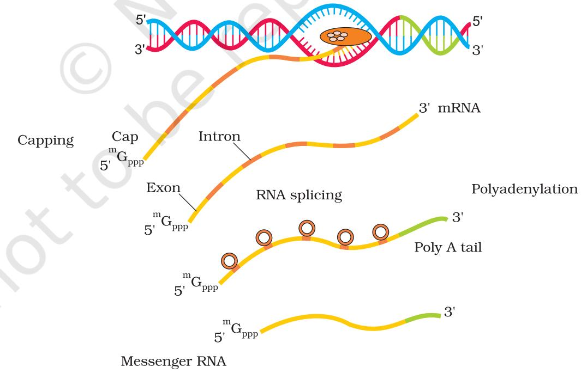

Figure 5.11 Process of Transcription in Eukaryotes

- (ii) The second complexity is that the primary transcripts contain both the exons and the introns and are non-functional. Hence, it is subjected to a process called splicing where the introns are removed and exons are joined in a defined order. hnRNA undergoes additional processing called as capping and tailing. In capping an unusual nucleotide (methyl guanosine triphosphate) is added to the 5*'*-end of hnRNA. In tailing, adenylate residues (200-300) are added at 3*'*-end in a template independent manner. It is the fully processed hnRNA, now called mRNA, that is transported out of the nucleus for translation (Figure 5.11).
The significance of such complexities is now beginning to be understood. The split-gene arrangements represent probably an ancient feature of the genome. The presence of introns is reminiscent of antiquity, and the process of splicing represents the dominance of RNA-world. In recent times, the understanding of RNA and RNA-dependent processes in the living system have assumed more importance.

# 5.6 GENETIC CODE

During replication and transcription a nucleic acid was copied to form another nucleic acid. Hence, these processes are easy to conceptualise on the basis of complementarity. The process of translation requires transfer of genetic information from a polymer of nucleotides to synthesise a polymer of amino acids. Neither does any complementarity exist between nucleotides and amino acids, nor could any be drawn theoretically. There existed ample evidences, though, to support the notion that change in nucleic acids (genetic material) were responsible for change in amino acids in proteins. This led to the proposition of a genetic code that could direct the sequence of amino acids during synthesis of proteins.

If determining the biochemical nature of genetic material and the structure of DNA was very exciting, the proposition and deciphering of genetic code were most challenging. In a very true sense, it required involvement of scientists from several disciplines – physicists, organic chemists, biochemists and geneticists. It was George Gamow, a physicist, who argued that since there are only 4 bases and if they have to code for 20 amino acids, the code should constitute a combination of bases. He suggested that in order to code for all the 20 amino acids, the code should be made up of three nucleotides. This was a very bold proposition, because a permutation combination of 43 (4 × 4 × 4) would generate 64 codons; generating many more codons than required.

Providing proof that the codon was a triplet, was a more daunting task. The chemical method developed by Har Gobind Khorana was instrumental in synthesising RNA molecules with defined combinations of bases (homopolymers and copolymers). Marshall Nirenberg's cell-free system for protein synthesis finally helped the code to be deciphered. Severo Ochoa enzyme (polynucleotide phosphorylase) was also helpful in polymerising RNA with defined sequences in a template independent manner (enzymatic synthesis of RNA). Finally a checker-board for genetic code was prepared which is given in Table 5.1.

| First position |  |  |  |  | Third Position |
| --- | --- | --- | --- | --- | --- |
|  |  |  | Second position |  |  |
|  | U | C | A | G |  |
| U | UUU Phe | UCU Ser | UAU Tyr | UGU Cys | U |
|  | UUC Phe | UCC Ser | UAC Tyr | UGC Cys | C |
|  | UUA Leu | UCA Ser | UAA Stop | UGA Stop | A |
|  | UUG Leu | UCG Ser | UAG Stop | UGG Trp | G |
| C | CUU Leu | CCU Pro | CAU His | CGU Arg | O |
|  | CUC Leu | CCC Pro | CAC His | CGC Arg | C |
|  | CUA Leu | CCA Pro | CAA GIn | CGA Arg | A |
|  | CUG Leu | CCG Pro | CAG GIn | CGG Arg | G |
| ਰ | AUU Ile | ACU Thr | AAU Asn | AGU Ser | U |
|  | AUC Ile | ACC Thr | AAC Asn | AGC Ser | C |
|  | AUA Ile | ACA Thr | AAA Lys | AGA Arg | A |
|  | AUG Met | ACG Thr | AAG Lys | AGG Arg | G |
| G | GUU Val | GCU Ala | GAU Asp | GGU Gly | U |
|  | GUC Val | GCC Ala | GAC Asp | GGC Gly | C |
|  | GUA Val | GCA Ala | GAA Glu | GGA Gly | A |
|  | GUG Val | GCG Ala | GAG Glu | GGG Gly | G |

#### Table 5.1: The Codons for the Various Amino Acids

The salient features of genetic code are as follows:

- (i) The codon is triplet. 61 codons code for amino acids and 3 codons do not code for any amino acids, hence they function as stop codons.
- (ii) Some amino acids are coded by more than one codon, hence the code is degenerate.
- (iii) The codon is read in mRNA in a contiguous fashion. There are no punctuations.
- (iv) The code is nearly universal: for example, from bacteria to human UUU would code for Phenylalanine (phe). Some exceptions to this rule have been found in mitochondrial codons, and in some protozoans.
- (v) AUG has dual functions. It codes for Methionine (met) , and it also act as initiator codon.
- (vi) UAA, UAG, UGA are stop terminator codons.

*If following is the sequence of nucleotides in mRNA, predict the sequence of amino acid coded by it (take help of the checkerboard):*

*-AUG UUU UUC UUC UUU UUU UUC-*

96

*Now try the opposite. Following is the sequence of amino acids coded by an mRNA. Predict the nucleotide sequence in the RNA:*

*Met-Phe-Phe-Phe-Phe-Phe-Phe*

*Do you face any difficulty in predicting the opposite?*

*Can you now correlate which two properties of genetic code you have learnt?*

## 5.6.1 Mutations and Genetic Code

The relationships between genes and DNA are best understood by mutation studies. You have studied about mutation and its effect in Chapter 4. Effects of large deletions and rearrangements in a segment of DNA are easy to comprehend. It may result in loss or gain of a gene and so a function. The effect of point mutations will be explained here. A classical example of point mutation is a change of single base pair in the gene for beta globin chain that results in the change of amino acid residue glutamate to valine. It results into a diseased condition called as sickle cell anemia. Effect of point mutations that inserts or deletes a base in structural gene can be better understood by following simple example.

Consider a statement that is made up of the following words each having three letters like genetic code.

#### RAM HAS RED CAP

If we insert a letter B in between HAS and RED and rearrange the statement, it would read as follows:

### RAM HAS BRE DCA P

Similarly, if we now insert two letters at the same place, say BI'. Now it would read,

#### RAM HAS BIR EDC AP

Now we insert three letters together, say BIG, the statement would read

#### RAM HAS BIG RED CAP

The same exercise can be repeated, by deleting the letters R, E and D, one by one and rearranging the statement to make a triplet word.

> RAM HAS EDC AP RAM HAS DCA P RAM HAS CAP

The conclusion from the above exercise is very obvious. Insertion or deletion of one or two bases changes the reading frame from the point of insertion or deletion. However, such mutations are referred to as

# 97

frameshift insertion or deletion mutations. Insertion or deletion of three or its multiple bases insert or delete in one or multiple codon hence one or multiple amino acids, and reading frame remains unaltered from that point onwards.

## 5.6.2 tRNA– the Adapter Molecule

From the very beginning of the proposition of code, it was clear to Francis Crick that there has to be a mechanism to read the code and also to link it to the amino acids, because amino acids have no structural specialities to read the code uniquely. He postulated the presence of an adapter molecule that would on one hand read the code and on other hand would bind to specific amino acids. The tRNA, then called sRNA (soluble RNA), was known before the genetic code was postulated. However, its role as an adapter molecule was assigned much later.

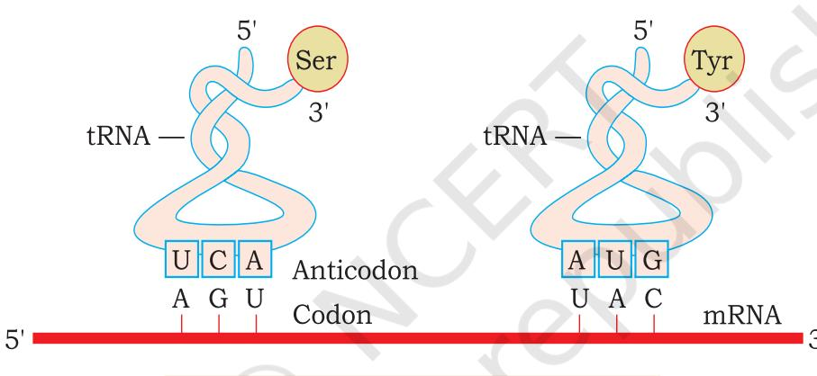

tRNA has an anticodon loop that has bases complementary to the code, and it also has an amino acid acceptor end to which it binds to amino acids. tRNAs are specific for each amino acid (Figure 5.12). For initiation, there is

#### Figure 5.12 tRNA - the adapter molecule

another specific tRNA that is referred to as initiator tRNA. There are no tRNAs for stop codons. In figure 5.12, the secondary structure of tRNA has been depicted that looks like a clover-leaf. In actual structure, the tRNA is a compact molecule which looks like inverted L.

# 5.7 TRANSLATION

Translation refers to the process of polymerisation of amino acids to form a polypeptide (Figure 5.13). The order and sequence of amino acids are defined by the sequence of bases in the mRNA. The amino acids are joined by a bond which is known as a peptide bond. Formation of a peptide bond requires energy. Therefore, in the first phase itself amino acids are activated in the presence of ATP and linked to their cognate tRNA – a process commonly called as charging of tRNA or aminoacylation of tRNA to be more specific. If two such charged tRNAs are brought close enough, the formation of peptide bond between them

would be favoured energetically. The presence of a catalyst would enhance the rate of peptide bond formation.

The cellular factory responsible for synthesising proteins is the ribosome. The ribosome consists of structural RNAs and about 80 different proteins. In its inactive state, it exists as two subunits; a large subunit and a small subunit. When the small subunit encounters an mRNA, the process of translation of the mRNA to protein begins. There are two sites in the large subunit, for subsequent amino acids to bind to and thus, be close enough to each other for the formation of a

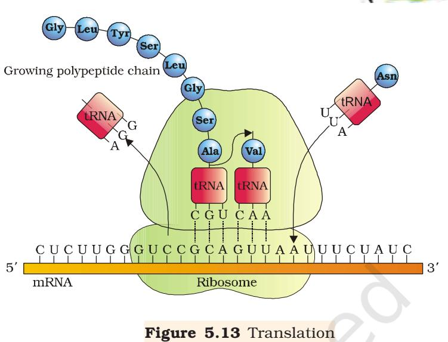

peptide bond. The ribosome also acts as a catalyst (23S rRNA in bacteria is the enzyme- ribozyme) for the formation of peptide bond.

A translational unit in mRNA is the sequence of RNA that is flanked by the start codon (AUG) and the stop codon and codes for a polypeptide. An mRNA also has some additional sequences that are not translated and are referred as untranslated regions (UTR). The UTRs are present at both 5*'* -end (before start codon) and at 3*'* -end (after stop codon). They are required for efficient translation process.

For initiation, the ribosome binds to the mRNA at the start codon (AUG) that is recognised only by the initiator tRNA. The ribosome proceeds to the elongation phase of protein synthesis. During this stage, complexes composed of an amino acid linked to tRNA, sequentially bind to the appropriate codon in mRNA by forming complementary base pairs with the tRNA anticodon. The ribosome moves from codon to codon along the mRNA. Amino acids are added one by one, translated into Polypeptide sequences dictated by DNA and represented by mRNA. At the end, a release factor binds to the stop codon, terminating translation and releasing the complete polypeptide from the ribosome.

## 5.8 REGULATION OF GENE EXPRESSION

Regulation of gene expression refers to a very broad term that may occur at various levels. Considering that gene expression results in the formation of a polypeptide, it can be regulated at several levels. In eukaryotes, the regulation could be exerted at

- (i) transcriptional level (formation of primary transcript),
- (ii) processing level (regulation of splicing),
- (iii) transport of mRNA from nucleus to the cytoplasm,
- (iv) translational level.

The genes in a cell are expressed to perform a particular function or a set of functions. For example, if an enzyme called beta-galactosidase is synthesised by *E. coli*, it is used to catalyse the hydrolysis of a disaccharide, lactose into galactose and glucose; the bacteria use them as a source of energy. Hence, if the bacteria do not have lactose around them to be utilised for energy source, they would no longer require the synthesis of the enzyme beta-galactosidase. Therefore, in simple terms, it is the metabolic, physiological or environmental conditions that regulate the expression of genes. The development and differentiation of embryo into adult organisms are also a result of the coordinated regulation of expression of several sets of genes.

In prokaryotes, control of the rate of transcriptional initiation is the predominant site for control of gene expression. In a transcription unit, the activity of RNA polymerase at a given promoter is in turn regulated by interaction with accessory proteins, which affect its ability to recognise start sites. These regulatory proteins can act both positively (activators) and negatively (repressors). The accessibility of promoter regions of prokaryotic DNA is in many cases regulated by the interaction of proteins with sequences termed operators. The operator region is adjacent to the promoter elements in most operons and in most cases the sequences of the operator bind a repressor protein. Each operon has its specific operator and specific repressor. For example, *lac* operator is present only in the *lac* operon and it interacts specifically with *lac* repressor only.

# 5.8.1 The *Lac* operon

The elucidation of the *lac* operon was also a result of a close association between a geneticist, Francois Jacob and a biochemist, Jacque Monod. They were the first to elucidate a transcriptionally regulated system. In *lac* operon (here *lac* refers to lactose), a polycistronic structural gene is regulated by a common promoter and regulatory genes. Such arrangement is very common in bacteria and is referred to as operon. To name few such examples, *lac* operon, *trp* operon, *ara* operon, *his* operon, *val* operon, etc.

The *lac* operon consists of one regulatory gene (the *i* gene – here the term *i* does not refer to inducer, rather it is derived from the word inhibitor) and three structural genes (*z*, *y*, and *a*). The *i* gene codes for the repressor of the *lac* operon. The *z* gene codes for beta-galactosidase (β-gal), which is primarily responsible for the hydrolysis of the disaccharide, lactose into its monomeric units, galactose and glucose. The *y* gene codes for permease, which increases permeability of the cell to β-galactosides. The *a* gene encodes a transacetylase. Hence, all the three gene products in *lac* operon are required for metabolism of lactose. In most other operons as well, the genes present in the operon are needed together to function in the same or related metabolic pathway (Figure 5.14).

100

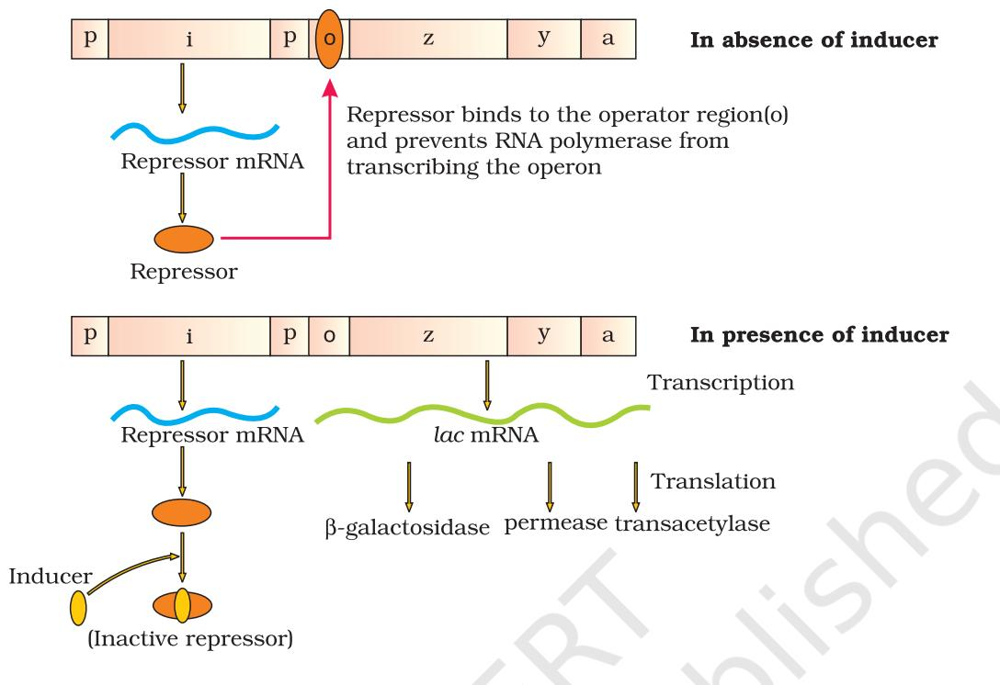

Figure 5.14 The *lac* Operon

Lactose is the substrate for the enzyme beta-galactosidase and it regulates switching on and off of the operon. Hence, it is termed as inducer. In the absence of a preferred carbon source such as glucose, if lactose is provided in the growth medium of the bacteria, the lactose is transported into the cells through the action of permease (Remember, a very low level of expression of *lac* operon has to be present in the cell all the time, otherwise lactose cannot enter the cells). The lactose then induces the operon in the following manner.

The repressor of the operon is synthesised (all-the-time – constitutively) from the *i* gene. The repressor protein binds to the operator region of the operon and prevents RNA polymerase from transcribing the operon. In the presence of an inducer, such as lactose or allolactose, the repressor is inactivated by interaction with the inducer. This allows RNA polymerase access to the promoter and transcription proceeds (Figure 5.14). Essentially, regulation of *lac* operon can also be visualised as regulation of enzyme synthesis by its substrate.

*Remember, glucose or galactose cannot act as inducers for lac operon. Can you think for how long the lac operon would be expressed in the presence of lactose?*

Regulation of *lac* operon by repressor is referred to as negative regulation. *Lac* operon is under control of positive regulation as well, but it is beyond the scope of discussion at this level.

# 101

# 5.9 HUMAN GENOME PROJECT

In the preceding sections you have learnt that it is the sequence of bases in DNA that determines the genetic information of a given organism. In other words, genetic make-up of an organism or an individual lies in the DNA sequences. If two individuals differ, then their DNA sequences should also be different, at least at some places. These assumptions led to the quest of finding out the complete DNA sequence of human genome. With the establishment of genetic engineering techniques where it was possible to isolate and clone any piece of DNA and availability of simple and fast techniques for determining DNA sequences, a very ambitious project of sequencing human genome was launched in the year 1990.

Human Genome Project (HGP) was called a mega project. You can imagine the magnitude and the requirements for the project if we simply define the aims of the project as follows:

Human genome is said to have approximately 3 x 109 bp, and if the cost of sequencing required is US $ 3 per bp (the estimated cost in the beginning), the total estimated cost of the project would be approximately 9 billion US dollars. Further, if the obtained sequences were to be stored in typed form in books, and if each page of the book contained 1000 letters and each book contained 1000 pages, then 3300 such books would be required to store the information of DNA sequence from a single human cell. The enormous amount of data expected to be generated also necessitated the use of high speed computational devices for data storage and retrieval, and analysis. HGP was closely associated with the rapid development of a new area in biology called Bioinformatics.

## Goals of HGP

Some of the important goals of HGP were as follows:

- (i) Identify all the approximately 20,000-25,000 genes in human DNA;
- (ii) Determine the sequences of the 3 billion chemical base pairs that make up human DNA;
- (iiii) Store this information in databases;
- (iv) Improve tools for data analysis;
- (v) Transfer related technologies to other sectors, such as industries;
- (vi) Address the ethical, legal, and social issues (ELSI) that may arise from the project.

The Human Genome Project was a 13-year project coordinated by the U.S. Department of Energy and the National Institute of Health. During the early years of the HGP, the Wellcome Trust (U.K.) became a major partner; additional contributions came from Japan, France, Germany, China and others. The project was completed in 2003. Knowledge about the effects of DNA variations among individuals can lead to revolutionary new ways to diagnose, treat and someday prevent the thousands of

# 102

disorders that affect human beings. Besides providing clues to understanding human biology, learning about non-human organisms DNA sequences can lead to an understanding of their natural capabilities that can be applied toward solving challenges in health care, agriculture, energy production, environmental remediation. Many non-human model organisms, such as bacteria, yeast, *Caenorhabditis elegans* (a free living non-pathogenic nematode), *Drosophila* (the fruit fly), plants (rice and *Arabidopsis*), etc., have also been sequenced.

Methodologies : The methods involved two major approaches. One approach focused on identifying all the genes that are expressed as RNA (referred to as Expressed Sequence Tags (ESTs). The other took the blind approach of simply sequencing the whole set of genome that contained all the coding and non-coding sequence, and later assigning different regions in the sequence with functions (a term referred to as Sequence Annotation). For sequencing, the total DNA from a cell is isolated and converted into random fragments of relatively smaller sizes (recall DNA is a very long polymer, and there are technical limitations in sequencing very long pieces of DNA) and cloned in suitable host using specialised vectors. The cloning resulted into amplification of each piece of DNA fragment so that it subsequently could be sequenced with ease. The commonly used hosts were bacteria and yeast, and the vectors were called as BAC (bacterial artificial chromosomes), and YAC (yeast artificial chromosomes).

The fragments were sequenced using automated DNA sequencers that worked on the principle of a method developed by Frederick Sanger. (Remember, Sanger is also credited for developing method for

determination of amino acid sequences in proteins). These sequences were then arranged based on some overlapping regions present in them. This required generation of overlapping fragments for sequencing. Alignment of these sequences was humanly not possible. Therefore, specialised computer based programs were developed (Figure 5.15). These sequences were subsequently annotated and were assigned to each chromosome. The sequence of chromosome 1 was completed only in May 2006 (this was the last of the 24 human chromosomes – 22 autosomes and X and Y – to be

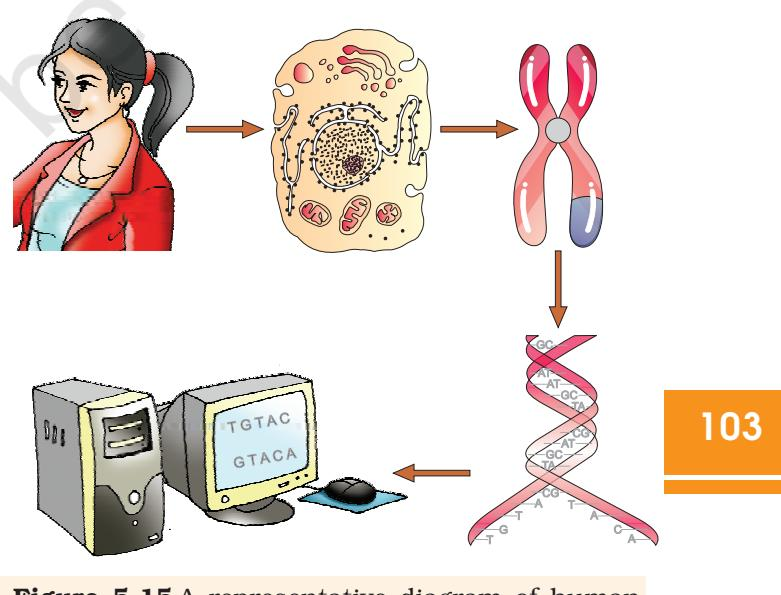

Figure 5.15 A representative diagram of human genome project

sequenced). Another challenging task was assigning the genetic and physical maps on the genome. This was generated using information on polymorphism of restriction endonuclease recognition sites, and some repetitive DNA sequences known as microsatellites (one of the applications of polymorphism in repetitive DNA sequences shall be explained in next section of DNA fingerprinting).

## 5.9.1 Salient Features of Human Genome

Some of the salient observations drawn from human genome project are as follows:

- (i) The human genome contains 3164.7 million bp.
- (ii) The average gene consists of 3000 bases, but sizes vary greatly, with the largest known human gene being dystrophin at 2.4 million bases.
- (iii) The total number of genes is estimated at 30,000–much lower than previous estimates of 80,000 to 1,40,000 genes. Almost all (99.9 per cent) nucleotide bases are exactly the same in all people.
- (iv) The functions are unknown for over 50 per cent of the discovered genes.
- (v) Less than 2 per cent of the genome codes for proteins.
- (vi) Repeated sequences make up very large portion of the human genome.
- (vii) Repetitive sequences are stretches of DNA sequences that are repeated many times, sometimes hundred to thousand times. They are thought to have no direct coding functions, but they shed light on chromosome structure, dynamics and evolution.
- (viii) Chromosome 1 has most genes (2968), and the Y has the fewest (231).
- (ix) Scientists have identified about 1.4 million locations where singlebase DNA differences (SNPs – single nucleotide polymorphism, pronounced as 'snips') occur in humans. This information promises to revolutionise the processes of finding chromosomal locations for disease-associated sequences and tracing human history.

## 5.9.2 Applications and Future Challenges

Deriving meaningful knowledge from the DNA sequences will define research through the coming decades leading to our understanding of biological systems. This enormous task will require the expertise and creativity of tens of thousands of scientists from varied disciplines in both the public and private sectors worldwide. One of the greatest impacts of having the HG sequence may well be enabling a radically new approach to biological research. In the past, researchers studied one or a few genes at a time. With whole-genome sequences and new high-throughput technologies, we can approach questions systematically and on a much

104

broader scale. They can study all the genes in a genome, for example, all the transcripts in a particular tissue or organ or tumor, or how tens of thousands of genes and proteins work together in interconnected networks to orchestrate the chemistry of life.

# 5.10 DNA FINGERPRINTING

As stated in the preceding section, 99.9 per cent of base sequence among humans is the same. *Assuming human genome as 3 × 109 bp*, *in how many base sequences would there be differences?* It is these differences in sequence of DNA which make every individual unique in their phenotypic appearance. If one aims to find out genetic differences between two individuals or among individuals of a population, sequencing the DNA every time would be a daunting and expensive task. Imagine trying to compare two sets of 3 × 106 base pairs. DNA fingerprinting is a very quick way to compare the DNA sequences of any two individuals.

DNA fingerprinting involves identifying differences in some specific regions in DNA sequence called as repetitive DNA, because in these sequences, a small stretch of DNA is repeated many times. These repetitive DNA are separated from bulk genomic DNA as different peaks during density gradient centrifugation. The bulk DNA forms a major peak and the other small peaks are referred to as satellite DNA. Depending on base composition (A : T rich or G:C rich), length of segment, and number of repetitive units, the satellite DNA is classified into many categories, such as micro-satellites, mini-satellites etc. These sequences normally do not code for any proteins, but they form a large portion of human genome. These sequence show high degree of polymorphism and form the basis of DNA fingerprinting. Since DNA from every tissue (such as blood, hair-follicle, skin, bone, saliva, sperm etc.), from an individual show the same degree of polymorphism, they become very useful identification tool in forensic applications. Further, as the polymorphisms are inheritable from parents to children, DNA fingerprinting is the basis of paternity testing, in case of disputes.

As polymorphism in DNA sequence is the basis of genetic mapping of human genome as well as of DNA fingerprinting, it is essential that we understand what DNA polymorphism means in simple terms. Polymorphism (variation at genetic level) arises due to mutations. (Recall different kind of mutations and their effects that you have already studied in Chapter 4, and in the preceding sections in this chapter.) New mutations may arise in an individual either in somatic cells or in the germ cells (cells that generate gametes in sexually reproducing organisms). If a germ cell mutation does not seriously impair individual's ability to have offspring who can transmit the mutation, it can spread to

# 105

the other members of population (through sexual reproduction). Allelic (again recall the definition of alleles from Chapter 4) sequence variation has traditionally been described as a DNA polymorphism if more than one variant (allele) at a locus occurs in human population with a frequency greater than 0.01. In simple terms, if an inheritable mutation is observed in a population at high frequency, it is referred to as DNA polymorphism. The probability of such variation to be observed in noncoding DNA sequence would be higher as mutations in these sequences may not have any immediate effect/impact in an individual's reproductive ability. These mutations keep on accumulating generation after generation, and form one of the basis of variability/polymorphism. There is a variety of different types of polymorphisms ranging from single nucleotide change to very large scale changes. For evolution and speciation, such polymorphisms play very important role, and you will study these in details at higher classes.

The technique of DNA Fingerprinting was initially developed by Alec Jeffreys. He used a satellite DNA as probe that shows very high degree of polymorphism. It was called as Variable Number of Tandem Repeats (VNTR). The technique, as used earlier, involved Southern blot hybridisation using radiolabelled VNTR as a probe. It included

- (i) isolation of DNA,
- (ii) digestion of DNA by restriction endonucleases,
- (iii) separation of DNA fragments by electrophoresis,
- (iv) transferring (blotting) of separated DNA fragments to synthetic membranes, such as nitrocellulose or nylon,
- (v) hybridisation using labelled VNTR probe, and
- (vi) detection of hybridised DNA fragments by autoradiography. A schematic representation of DNA fingerprinting is shown in Figure 5.16.

The VNTR belongs to a class of satellite DNA referred to as mini-satellite. A small DNA sequence is arranged tandemly in many copy numbers. The copy number varies from chromosome to chromosome in an individual. The numbers of repeat show very high degree of polymorphism. As a result the size of VNTR varies in size from 0.1 to 20 kb. Consequently, after hybridisation with VNTR probe, the autoradiogram gives many bands of differing sizes. These bands give a characteristic pattern for an individual DNA (Figure 5.16). It differs from individual to individual in a population except in the case of monozygotic (identical) twins. The sensitivity of the technique has been increased by use of polymerase chain reaction (PCR– you will study about it in Chapter 9). Consequently, DNA from a single cell is enough to perform DNA fingerprinting analysis. In addition to application in forensic science, it has much wider application, such as

106

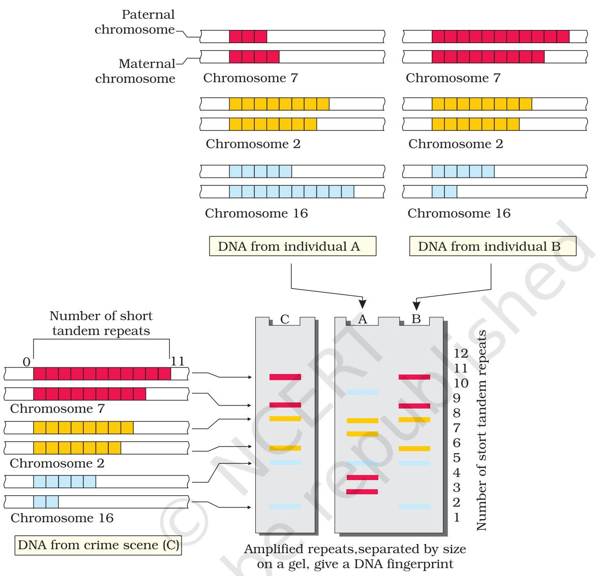

- Figure 5.16 Schematic representation of DNA fingerprinting : Few representative chromosomes have been shown to contain different copy number of VNTR. For the sake of understanding different colour schemes have been used to trace the origin of each band in the gel. The two alleles (paternal and maternal) of a chromosome also contain different copy numbers of VNTR. It is clear that the banding pattern of DNA from crime scene matches with individual B, and not with A.
in determining population and genetic diversities. Currently, many different probes are used to generate DNA fingerprints.

# 107

## SUMMARY

Nucleic acids are long polymers of nucleotides. While DNA stores genetic information, RNA mostly helps in transfer and expression of information. Though DNA and RNA both function as genetic material, but DNA being chemically and structurally more stable is a better genetic material. However, RNA is the first to evolve and DNA was derived from RNA. The hallmark of the double stranded helical structure of DNA is the hydrogen bonding between the bases from opposite strands. The rule is that Adenine pairs with Thymine through two H-bonds, and Guanine with Cytosine through three H-bonds. This makes one strand complementary to the other. The DNA replicates semiconservatively, the process is guided by the complementary H-bonding. A segment of DNA that codes for RNA may in a simplistic term can be referred as gene. During transcription also, one of the strands of DNA acts a template to direct the synthesis of complementary RNA. In bacteria, the transcribed mRNA is functional, hence can directly be translated. In eukaryotes, the gene is split. The coding sequences, exons, are interrupted by non-coding sequences, introns. Introns are removed and exons are joined to produce functional RNA by splicing. The messenger RNA contains the base sequences that are read in a combination of three (to make triplet genetic code) to code for an amino acid. The genetic code is read again on the principle of complementarity by tRNA that acts as an adapter molecule. There are specific tRNAs for every amino acid. The tRNA binds to specific amino acid at one end and pairs through H-bonding with codes on mRNA through its anticodons. The site of translation (protein synthesis) is ribosomes, which bind to mRNA and provide platform for joining of amino acids. One of the rRNA acts as a catalyst for peptide bond formation, which is an example of RNA enzyme (ribozyme). Translation is a process that has evolved around RNA, indicating that life began around RNA. Since, transcription and translation are energetically very expensive processes, these have to be tightly regulated. Regulation of transcription is the primary step for regulation of gene expression. In bacteria, more than one gene is arranged together and regulated in units called as operons. *Lac* operon is the prototype operon in bacteria, which codes for genes responsible for metabolism of lactose. The operon is regulated by the amount of lactose in the medium where the bacteria are grown. Therefore, this regulation can also be viewed as regulation of enzyme synthesis by its substrate.

Human genome project was a mega project that aimed to sequence every base in human genome. This project has yielded much new information. Many new areas and avenues have opened up as a consequence of the project. DNA Fingerprinting is a technique to find out variations in individuals of a population at DNA level. It works on the principle of polymorphism in DNA sequences. It has immense applications in the field of forensic science, genetic biodiversity and evolutionary biology.

108

# EXERCISES

- 1 Group the following as nitrogenous bases and nucleosides: Adenine, Cytidine, Thymine, Guanosine, Uracil and Cytosine.
- 2. If a double stranded DNA has 20 per cent of cytosine, calculate the per cent of adenine in the DNA.
- 3. If the sequence of one strand of DNA is written as follows:

5*'* -ATGCATGCATGCATGCATGCATGCATGC-3*'*

Write down the sequence of complementary strand in 5*'*→3*'* direction.

- 4. If the sequence of the coding strand in a transcription unit is written as follows:
5*'* -ATGCATGCATGCATGCATGCATGCATGC-3*'*

Write down the sequence of mRNA.

- 5. Which property of DNA double helix led Watson and Crick to hypothesise semi-conservative mode of DNA replication? Explain.
- 6. Depending upon the chemical nature of the template (DNA or RNA) and the nature of nucleic acids synthesised from it (DNA or RNA), list the types of nucleic acid polymerases.
- 7. How did Hershey and Chase differentiate between DNA and protein in their experiment while proving that DNA is the genetic material?
- 8. Differentiate between the followings:

(a) Repetitive DNA and Satellite DNA

- (b) mRNA and tRNA
- (c) Template strand and Coding strand
- 9. List two essential roles of ribosome during translation.
- 10. In the medium where *E. coli* was growing, lactose was added, which induced the *lac* operon. Then, why does lac operon shut down some time after addition of lactose in the medium?
- 11. Explain (in one or two lines) the function of the followings:
	- (a) Promoter
	- (b) tRNA
	- (c) Exons
- 12. Why is the Human Genome project called a mega project?
- 13. What is DNA fingerprinting? Mention its application.
- 14. Briefly describe the following:
	- (a) Transcription
	- (b) Polymorphism
	- (c) Translation
	- (d) Bioinformatics

109

