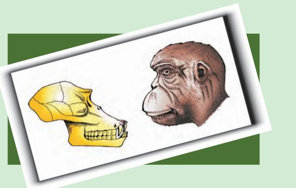
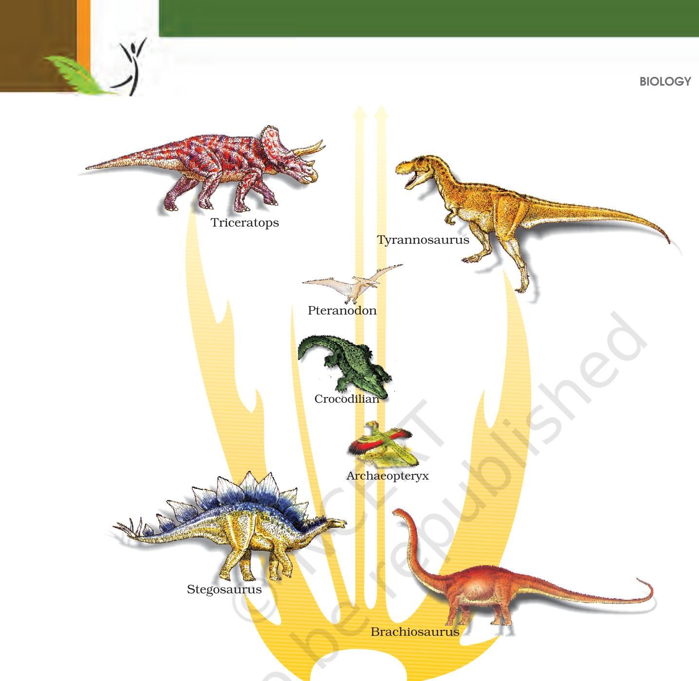
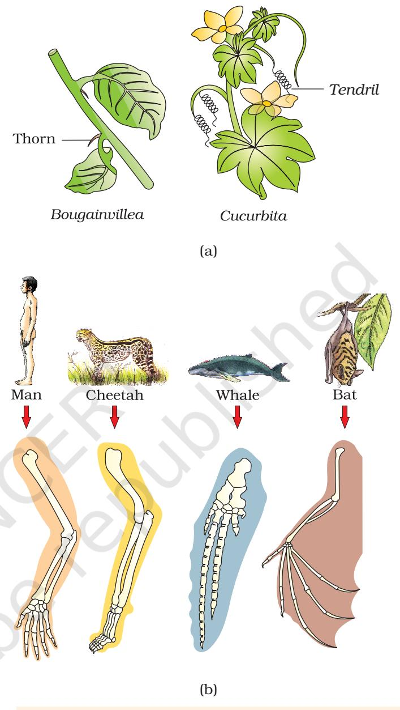
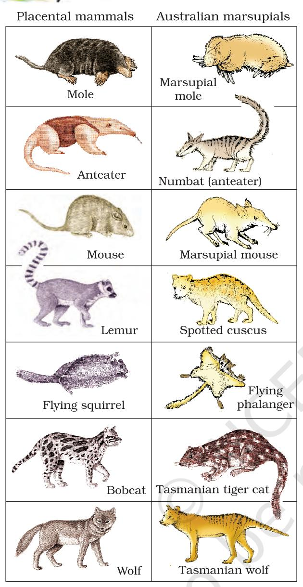
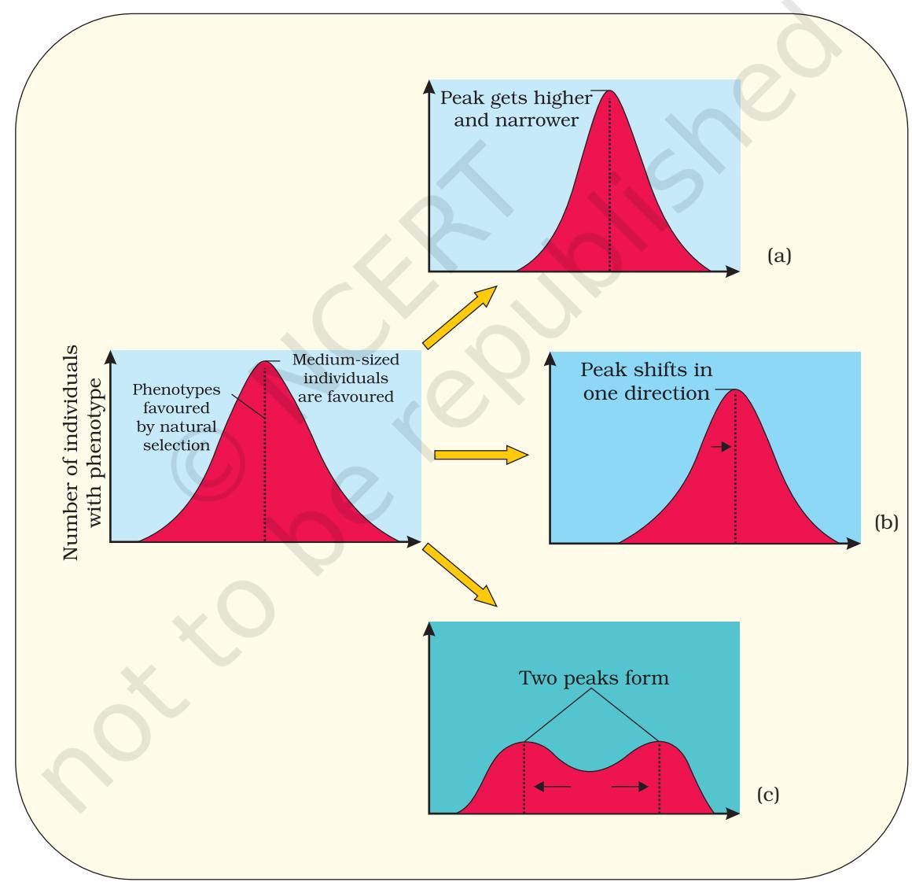
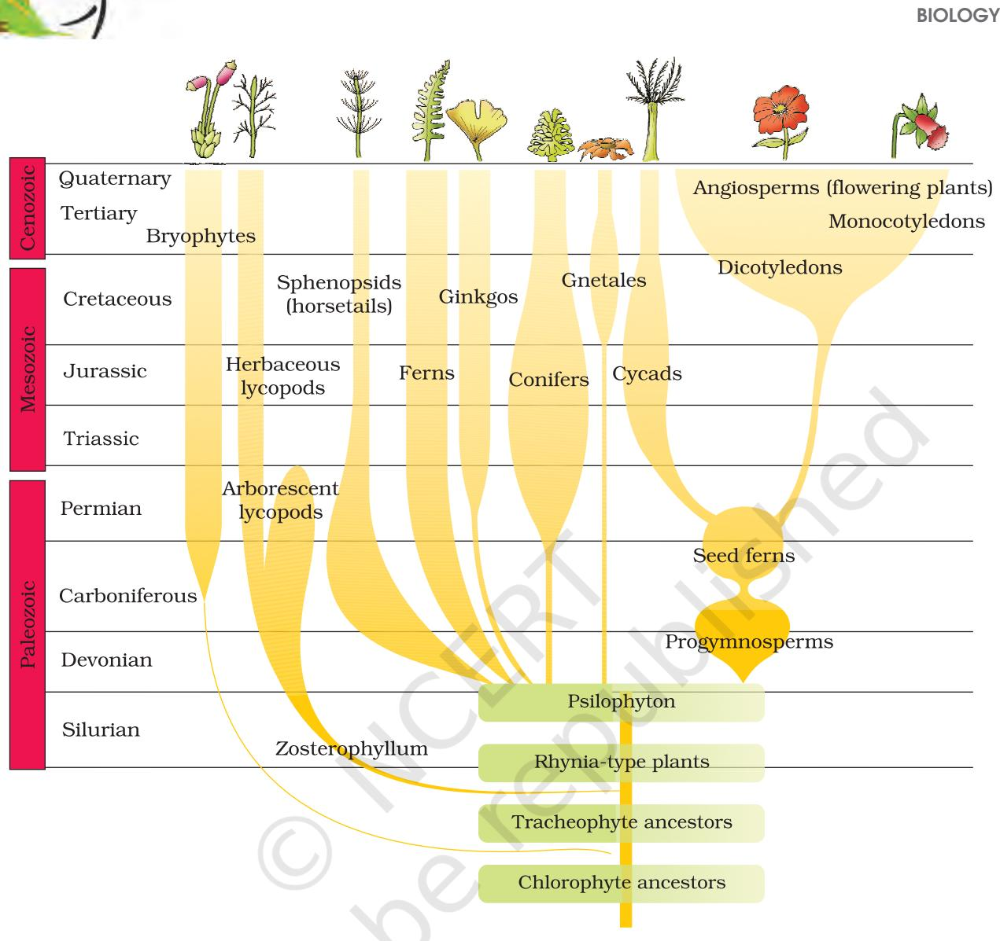
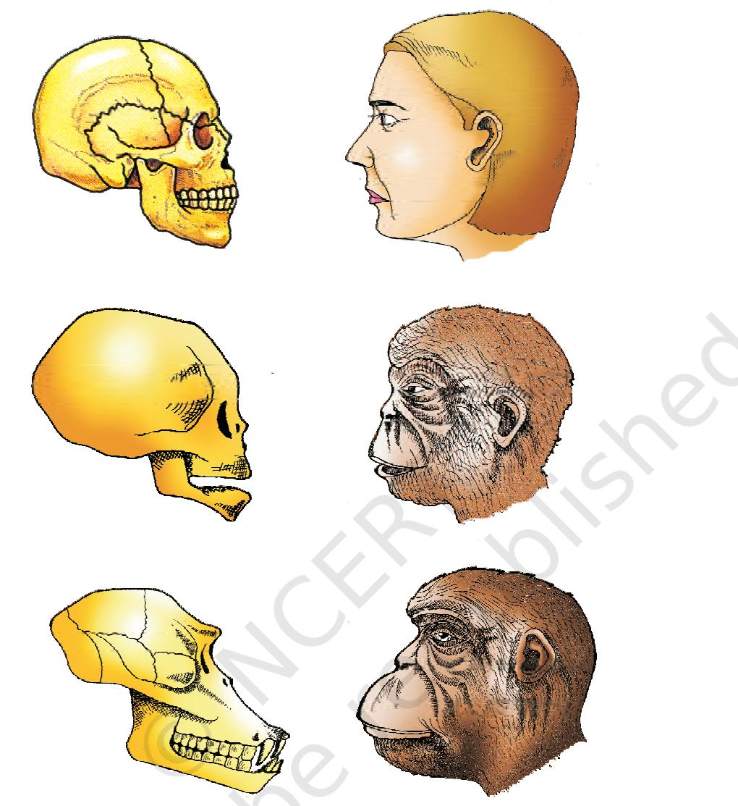

# CHAPTER 6 EVOLUTION

- *6.1 Origin of Life*
- *6.2 Evolution of Life Forms A Theory*
- *6.3 What are the Evidences for Evolution?*
- *6.4 What is Adaptive Radiation?*
- *6.5 Biological Evolution*
- *6.6 Mechanism of Evolution*
- *6.7 Hardy Weinberg Principle*
- *6.8 A Brief Account of Evolution*

110

- *6.9 Origin and Evolution of Man*
Evolutionary Biology is the study of history of life forms on earth. What exactly is evolution? To understand the changes in flora and fauna that have occurred over millions of years on earth, we must have an understanding of the context of origin of life, i.e., evolution of earth, of stars and indeed of the universe itself. What follows is the longest of all the construed and conjectured stories. This is the story of origin of life and evolution of life forms or biodiversity on planet earth in the context of evolution of earth and against the background of evolution of universe itself.

#### 6.1 ORIGIN OF LIFE

When we look at stars on a clear night sky we are, in a way, looking back in time. Stellar distances are measured in light years. What we see today is an object whose emitted light started its journey millions of year back and from trillions of kilometres away and reaching our eyes now. However, when we see objects in our immediate surroundings we see them instantly and hence in the present time. Therefore, when we see stars we apparently are peeping into the past.

The origin of life is considered a unique event in the history of universe. The universe is vast. Relatively speaking the earth itself is almost only a speck. The universe is very

old – almost 20 billion years old. Huge clusters of galaxies comprise the universe. Galaxies contain stars and clouds of gas and dust. Considering the size of universe, earth is indeed a speck. The Big Bang theory attempts to explain to us the origin of universe. It talks of a singular huge explosion unimaginable in physical terms. The universe expanded and hence, the temperature came down. Hydrogen and Helium formed sometime later. The gases condensed under gravitation and formed the galaxies of the present day universe. In the solar system of the milky way galaxy, earth was supposed to have been formed about 4.5 billion years back. There was no atmosphere on early earth. Water vapour, methane, carbondioxide and ammonia released from molten mass covered the surface. The UV rays from the sun brokeup water into Hydrogen and Oxygen and the lighter H2 escaped. Oxygen combined with ammonia and methane to form water, CO2 and others. The ozone layer was formed. As it cooled, the water vapor fell as rain, to fill all the depressions and form oceans. Life appeared 500 million years after the formation of earth, i.e., almost four billion years back.

Did life come from outerspace? Some scientists believe that it came from outside. Early Greek thinkers thought units of life called spores were transferred to different planets including earth. 'Panspermia' is still a favourite idea for some astronomers. For a long time it was also believed that life came out of decaying and rotting matter like straw, mud, etc. This was the theory of spontaneous generation. Louis Pasteur by careful experimentation demonstrated that life comes only from pre-existing life. He showed that in pre-sterilised flasks, life did not come from killed yeast while in another flask open to air, new living organisms arose from 'killed yeast'. Spontaneous generation theory was dismissed once and for all. However, this did not answer how the first life form came on earth.

Oparin of Russia and Haldane of England proposed that the first form of life could have come from pre-existing non-living organic molecules (e.g. RNA, protein, etc.) and that formation of life was preceded by chemical evolution, i.e., formation of diverse organic molecules from inorganic constituents. The conditions on earth were – high temperature, volcanic storms, reducing atmosphere containing CH4 , NH3 , etc. In 1953, S.L. Miller, an American scientist created similar conditions in a laboratory scale (Figure 6.1). He created electric discharge in a closed flask containing CH4 , H2 , NH3 and water vapour at 8000C. He observed formation of amino acids. In similar experiments others observed, formation of sugars, nitrogen bases, pigment and fats. Analysis of meteorite content also revealed similar compounds indicating that similar processes are occurring elsewhere in space. With this limited evidence, the first part of the conjectured story, i.e., chemical evolution was more or less accepted.

We have no idea about how the first self replicating metabolic capsule of life arose. The first non-cellular forms of life could have originated 3 billion years back. They would have been giant molecules (RNA, Protein,

## 111

Polysaccharides, etc.). These capsules reproduced their molecules perhaps. The first cellular form of life did not possibly originate till about 2000 million years ago. These were probably single-cells. All life forms were in water environment only. This version of a biogenesis, i.e., the first form of life arose slowly through evolutionary forces from non-living molecules is accepted by majority. However, once formed, how the first cellular forms of life could have evolved into the complex biodiversity of today is the fascinating story that will be discussed below.

#### 6.2 EVOLUTION OF LIFE FORMS – A THEORY

Conventional religious literature tells us about the theory of special creation. This theory has three connotations. One, that all living organisms (species or types) that we see today were created as such. Two, that the diversity was always the same since creation and will be the same in future also. Three, that earth is about 4000 years old. All these ideas were strongly challenged during the nineteenth century. Based on observations made during a sea voyage in a sail ship called H.M.S. Beagle round the world, Charles Darwin concluded that existing living forms share similarities to varying degrees not only among themselves but also with life forms that existed millions of years ago. Many such life forms do not exist any more. There had been extinctions of different life forms in the years gone by just as new forms of life arose at different periods of history of earth. There has been gradual evolution of life forms. Any population

112

has built in variation in characteristics. Those characteristics which enable some to survive better in natural conditions (climate, food, physical factors, etc.) would outbreed others that are less-endowed to survive under such natural conditions. Another word used is fitness of the individual or population. The fitness, according to Darwin, refers ultimately and only to reproductive fitness. Hence, those who are better fit in an environment, leave more progeny than others. These, therefore, will survive more and hence are selected by nature. He called it natural selection and implied it as a mechanism of evolution. Let us also remember that Alfred Wallace, a naturalist who worked in Malay Archipelago had also come to similar conclusions around the same time. In due course of time, apparently new types of organisms are recognisable. All the existing life forms share similarities and share common ancestors. However, these ancestors were present at different periods in the history of earth (epochs, periods and eras). The geological history of earth closely correlates with the biological history of earth. A common permissible conclusion is that earth is very old, not thousand of years as was thought earlier but billions of years old.

#### 6.3 WHAT ARE THE EVIDENCES FOR EVOLUTION?

Evidence that evolution of life forms has indeed taken place on earth has come from many quarters. Fossils are remains of hard parts of life-forms found in rocks. Rocks form sediments and a cross-section of earth's crust indicates the arrangement of sediments one over the other during the long history of earth. Different-aged rock sediments contain fossils of different life-forms who probably died during the formation of the particular sediment. Some of them appear similar to modern organisms (Figure 6.2). They represent extinct organisms (e.g., Dinosaurs). A study of fossils in different sedimentary layers indicates the geological period in which they existed. The study showed that life-forms varied over time and certain life forms are restricted to certain geological timespans. Hence, new forms of life have arisen at different times in the history of earth. All this is called paleontological evidence. *Do you remember how the ages of the fossils are calculated? Do you recollect the method of radioactive-dating and the principles behind the procedure?*

Embryological support for evolution was also proposed by Ernst Heckel based upon the observation of certain features during embryonic stage common to all vertebrates that are absent in adult. For example, the embryos of all vertebrates including human develop a row of vestigial gill slit just behind the head but it is a functional organ only in fish and not found in any other adult vertebrates. However, this proposal was disapproved on careful study performed by Karl Ernst von Baer. He noted that embryos never pass through the adult stages of other animals.

Comparative anatomy and morphology shows similarities and differences among organisms of today and those that existed years ago. 113

Such similarities can be interpreted to understand whether common ancestors were shared or not. For example whales, bats, Cheetah and human (all mammals) share similarities in the pattern of bones of forelimbs (Figure 6.3b). Though these forelimbs perform different functions in these animals, they have similar anatomical structure – all of them have humerus, radius, ulna, carpals, metacarpals and phalanges in their forelimbs. Hence, in these animals, the same structure developed along different directions due to adaptations to different needs. This is divergent evolution and these structures are homologous. Homology indicates common ancestry. Other examples are vertebrate hearts or brains. In

## 114

plants also, the thorn and tendrils of *Bougainvillea* and *Cucurbita* represent homology (Figure 6.3a). Homology is based on divergent evolution whereas analogy refers to a situation exactly opposite. Wings of butterfly and of birds look alike. They are not anatomically similar structures though they perform similar functions. Hence, analogous structures are a result of convergent evolution - different structures evolving for the same function and hence having similarity. Other examples of analogy are the eye of the octopus and of mammals or the flippers of Penguins and Dolphins. One can say that it is the similar habitat that has resulted in selection of similar adaptive features in different groups of organisms but toward the same function: Sweet potato (root modification) and potato (stem modification) is another example for analogy.

In the same line of argument, similarities in proteins and genes performing a given function among diverse organisms give clues to common ancestry. These biochemical similarities point to the same shared ancestry as structural similarities among diverse organisms.

Man has bred selected plants and animals for agriculture, horticulture, sport or security. Man has domesticated many wild animals and crops. This intensive breeding programme has created breeds that differ from other breeds (e.g., dogs) but still are of the same group. It is argued that

if within hundreds of years, man could create new breeds, could not nature have done the same over millions of years?

Another interesting observation supporting evolution by natural selection comes from England. In a collection of moths made in 1850s, i.e., before industrialisation set in, it was observed that there were more white-winged moths on trees than dark-winged or melanised moths. However, in the collection carried out from the same area, but after industrialisation, i.e., in 1920, there were more dark-winged moths in the same area, i.e., the proportion was reversed.

## 115

Figure 6.4 Figure showing white - winged moth and dark - winged moth (melanised) on a tree trunk (a) In unpolluted area (b) In polluted area

The explanation put forth for this observation was that 'predators will spot a moth against a contrasting background'. During postindustrialisation period, the tree trunks became dark due to industrial smoke and soots. Under this condition the white-winged moth did not survive due to predators, dark-winged or melanised moth survived. Before industrialisation set in, thick growth of almost white-coloured lichen covered the trees - in that background the white winged moth survived but the dark-coloured moth were picked out by predators. *Do you know that lichens can be used as industrial pollution indicators?* They will not grow in areas that are polluted. Hence, moths that were able to camouflage themselves, i.e., hide in the background, survived (Figure 6.4). This understanding is supported by the fact that in areas where industrialisation did not occur e.g., in rural areas, the count of melanic moths was low. This showed that in a mixed population, those that can better-adapt, survive and increase in population size. Remember that no variant is completely wiped out.

Similarly, excess use of herbicides, pesticides, etc., has only resulted in selection of resistant varieties in a much lesser time scale. This is also true for microbes against which we employ antibiotics or drugs against eukaryotic organisms/cell. Hence, resistant organisms/cells are appearing in a time scale of months or years and not centuries. These are examples of evolution by anthropogenic action. This also tells us that evolution is not a directed process in the sense of determinism. It is a stochastic process based on chance events in nature and chance mutation in the organisms.

#### 6.4 WHAT IS ADAPTIVE RADIATION?

During his journey Darwin went to Galapagos Islands. There he observed an amazing diversity of creatures. Of particular interest, small black birds later called Darwin's Finches amazed him. He realised that there were many

Figure 6.5 Variety of beaks of finches that Darwin found in Galapagos Island

varieties of finches in the same island. All the varieties, he conjectured, evolved on the island itself. From the original seed-eating features, many other forms with altered beaks arose, enabling them to become insectivorous and vegetarian finches (Figure 6.5). This process of evolution of different species in a given geographical area starting from a point and literally radiating to other areas of geography (habitats) is called adaptive radiation. Darwin's finches represent one of the best examples of this phenomenon. Another example is Australian marsupials. A number of marsupials, each different from the other (Figure 6.6) evolved from an ancestral stock, but all within the Australian island continent. When more than one adaptive radiation appeared to have occurred in an isolated geographical area (representing

Figure 6.7 Picture showing convergent evolution of Australian Marsupials and placental mammals

different habitats), one can call this convergent evolution. Placental mammals in Australia also exhibit adaptive radiation in evolving into varieties of such placental mammals each of which appears to be 'similar' to a corresponding marsupial (e.g., Placental wolf and Tasmanian wolf-marsupial). (Figure 6.7).

#### 6.5 BIOLOGICAL EVOLUTION

Evolution by natural selection, in a true sense would have started when cellular forms of life with differences in metabolic capability originated on earth.

The essence of Darwinian theory about evolution is natural selection. The rate of appearance of new forms is linked to the life cycle or the life span. Microbes that divide fast have the ability to multiply and become millions of individuals within hours. A colony of bacteria (say A) growing on a given medium has built-in variation in terms of ability to utilise a feed component. A change in the medium composition would bring out only that part of the population (say B) that can survive under the new conditions. In due course of time this variant population outgrows the others and appears as new species. This would happen within days. For the same thing to happen in a fish or fowl would take million of years as life spans of these animals are in years. Here we say that fitness of B is better than that of A under the new conditions. Nature selects for fitness. One must remember that the so-called fitness is based on characteristics which are inherited.

Hence, there must be a genetic basis for getting selected and to evolve. Another way of saying the same thing is that some organisms are better adapted to survive in an otherwise hostile environment. Adaptive ability is inherited. It has a genetic basis. Fitness is the end result of the ability to adapt and get selected by nature.

Branching descent and natural selection are the two key concepts of Darwinian Theory of Evolution (Figures 6.7 and 6.8).

Even before Darwin, a French naturalist Lamarck had said that evolution of life forms had occurred but driven by use and disuse of

### 118

organs. He gave the examples of Giraffes who in an attempt to forage leaves on tall trees had to adapt by elongation of their necks. As they passed on this acquired character of elongated neck to succeeding generations, Giraffes, slowly, over the years, came to acquire long necks. Nobody believes this conjecture any more.

Is evolution a process or the result of a process? The world we see, inanimate and animate, is only the success stories of evolution. When we describe the story of this world we describe evolution as a process. On the other hand when we describe the story of life on earth, we treat evolution as a consequence of a process called natural selection. We are still not very clear whether to regard evolution and natural selection as processes or end result of unknown processes.

It is possible that the work of Thomas Malthus on populations influenced Darwin. Natural selection is based on certain observations which are factual. For example, natural resources are limited, populations are stable in size except for seasonal fluctuation, members of a population vary in characteristics (infact no two individuals are alike) even though they look superficially similar, most of variations are inherited etc. The fact that theoretically population size will grow exponentially if everybody reproduced maximally (this fact can be seen in a growing bacterial population) and the fact that population sizes in reality are limited, means that there had been competition for resources. Only some survived and grew at the cost of others that could not flourish. The novelty and brilliant insight of Darwin was this: he asserted that variations, which are heritable and which make resource utilisation better for few (adapted to habitat better) will enable only those to reproduce and leave more progeny. Hence for a period of time, over many generations, survivors will leave more progeny and there would be a change in population characteristic and hence new forms appear to arise.

#### 6.6 MECHANISM OF EVOLUTION

What is the origin of this variation and how does speciation occur? Even though Mendel had talked of inheritable 'factors' influencing phenotype, Darwin either ignored these observations or kept silence. In the first decade of twentieth century, Hugo deVries based on his work on evening primrose brought forth the idea of mutations – large difference arising suddenly in a population. He believed that it is mutation which causes evolution and not the minor variations (heritable) that Darwin talked about. Mutations are random and directionless while Darwinian variations are small and directional. Evolution for Darwin was gradual while deVries believed mutation caused speciation and hence called it saltation (single step large mutation). Studies in population genetics, later, brought out some clarity.

119

### 6.7 HARDY-WEINBERG PRINCIPLE

In a given population one can find out the frequency of occurrence of alleles of a gene or a locus. This frequency is supposed to remain fixed and even remain the same through generations. Hardy-Weinberg principle stated it using algebraic equations.

This principle says that allele frequencies in a population are stable and is constant from generation to generation. The gene pool (total genes and their alleles in a population) remains a constant. This is called genetic equilibrium. Sum total of all the allelic frequencies is 1. Individual

120

frequencies, for example, can be named p, q, etc. In a diploid, p and q represent the frequency of allele *A* and allele *a*. The frequency of *AA* individuals in a population is simply p2 . This is simply stated in another ways, i.e., the probability that an allele A with a frequency of p appear on both the chromosomes of a diploid individual is simply the product of the probabilities, i.e., p2 . Similarly of aa is q2 , of Aa 2pq. Hence, p 2+2pq+q2=1. This is a binomial expansion of (p+q)2 . When frequency measured, differs from expected values, the difference (direction) indicates the extent of evolutionary change. Disturbance in genetic equilibrium, or Hardy- Weinberg equilibrium, i.e., change of frequency of alleles in a population would then be interpreted as resulting in evolution.

Five factors are known to affect Hardy-Weinberg equilibrium. These are gene migration or gene flow, genetic drift, mutation, genetic recombination and natural selection. When migration of a section of population to another place and population occurs, gene frequencies change in the original as well as in the new population. New genes/alleles are added to the new population and these are lost from the old population. There would be a gene flow if this gene migration, happens multiple times. If the same change occurs by chance, it is called genetic drift. Sometimes the change in allele frequency is so different in the new sample of population that they become a different species. The original drifted population becomes founders and the effect is called founder effect.

Microbial experiments show that pre-existing advantageous mutations when selected will result in observation of new phenotypes. Over few generations, this would result in Speciation. Natural selection is a process in which heritable variations enabling better survival are enabled to reproduce and leave greater number of progeny. A critical analysis makes us believe that variation due to mutation or variation due to recombination during gametogenesis, or due to gene flow or genetic drift results in changed frequency of genes and alleles in future generation. Coupled to enhance reproductive success, natural selection makes it look like different population. Natural selection can lead to stabilisation (in which more individuals acquire mean character value), directional change (more individuals acquire value other than the mean character value) or disruption (more individuals acquire peripheral character value at both ends of the distribution curve) (Figure 6.8).

#### 6.8 A BRIEF ACCOUNT OF EVOLUTION

About 2000 million years ago (mya) the first cellular forms of life appeared on earth. The mechanism of how non-cellular aggregates of giant macromolecules could evolve into cells with membranous envelop is not known. Some of these cells had the ability to release O2 . The reaction

Figure 6.9 A sketch of the evolution of plant forms through geological periods

could have been similar to the light reaction in photosynthesis where water is split with the help of solar energy captured and channelised by appropriate light harvesting pigments. Slowly single-celled organisms became multi-cellular life forms. By the time of 500 mya, invertebrates were formed and active. Jawless fish probably evolved around 350 mya. Sea weeds and few plants existed probably around 320 mya. We are told that the first organisms that invaded land were plants. They were widespread on land when animals invaded land. Fish with stout and strong fins could move on land and go back to water. This was about 350 mya. In 1938, a fish caught in South Africa happened to be a Coelacanth which was thought to be extinct. These animals called lobefins evolved into the

122

first amphibians that lived on both land and water. There are no specimens of these left with us. However, these were ancestors of modern day frogs and salamanders. The amphibians evolved into reptiles. They lay thickshelled eggs which do not dry up in sun unlike those of amphibians. Again we only see their modern day descendents, the turtles, tortoises and crocodiles. In the next 200 millions years or so, reptiles of different 123

shapes and sizes dominated on earth. Giant ferns (pteridophytes) were present but they all fell to form coal deposits slowly. Some of these land reptiles went back into water to evolve into fish like reptiles probably 200 mya (e.g. *Ichthyosaurs*). The land reptiles were, of course, the dinosaurs. The biggest of them, i.e., *Tyrannosaurus rex* was about 20 feet in height and had huge fearsome dagger like teeth. About 65 mya, the dinosaurs suddenly disappeared from the earth. We do not know the true reason. Some say climatic changes killed them. Some say most of them evolved into birds. The truth may live in between. Small sized reptiles of that era still exist today.

The first mammals were like shrews. Their fossils are small sized. Mammals were viviparous and protected their unborn young inside the mother's body. Mammals were more intelligent in sensing and avoiding danger at least. When reptiles came down mammals took over this earth. There were in South America mammals resembling horse, hippopotamus, bear, rabbit, etc. Due to continental drift, when South America joined North America, these animals were overridden by North American fauna. Due to the same continental drift pouched mammals of Australia survived because of lack of competition from any other mammal.

Lest we forget, some mammals live wholly in water. Whales, dolphins, seals and sea cows are some examples. Evolution of horse, elephant, dog, etc., are special stories of evolution. You will learn about these in higher classes. The most successful story is the evolution of man with language skills and self-consciousness.

A rough sketch of the evolution of life forms, their times on a geological scale are indicated in (Figures 6.9 and 6.10).

#### 6.9 ORIGIN AND EVOLUTION OF MAN

About 15 mya, primates called *Dryopithecus* and *Ramapithecus* were existing. They were hairy and walked like gorillas and chimpanzees. *Ramapithecus* was more man-like while *Dryopithecus* was more ape-like. Few fossils of man-like bones have been discovered in Ethiopia and Tanzania (Figure 6.11). These revealed hominid features leading to the belief that about 3-4 mya, man-like primates walked in eastern Africa. They were probably not taller than 4 feet but walked up right. Two mya, *Australopithecines* probably lived in East African grasslands. Evidence shows they hunted with stone weapons but essentially ate fruit. Some of the bones among the bones discovered were different. This creature was called the first human-like being the hominid and was called *Homo habilis*. The brain capacities were between 650-800cc. They probably did not eat meat. Fossils discovered in Java in 1891 revealed the next stage, i.e., *Homo erectus* about 1.5 mya. *Homo erectus* had a large brain around 900cc.

124

Figure 6.11 A comparison of the skulls of adult modern human being, baby chimpanzee and adult chimpanzee. The skull of baby chimpanzee is more like adult human skull than adult chimpanzee skull

*Homo erectus* probably ate meat. The Neanderthal man with a brain size of 1400cc lived in near east and central Asia between 1,00,000-40,000 years back. They used hides to protect their body and buried their dead. *Homo sapiens* arose in Africa and moved across continents and developed into distinct races. During ice age between 75,000-10,000 years ago modern *Homo sapiens* arose. Pre-historic cave art developed about 18,000 years ago. One such cave paintings by Pre-historic humans can be seen at Bhimbetka rock shelter in Raisen district of Madhya Pradesh. Agriculture came around 10,000 years back and human settlements started. The rest of what happened is part of human history of growth and decline of civilisations.

125

#### SUMMARY

The origin of life on earth can be understood only against the background of origin of universe especially earth. Most scientists believe chemical evolution, i.e., formation of biomolecules preceded the appearance of the first cellular forms of life. The subsequent events as to what happened to the first form of life is a conjectured story based on Darwinian ideas of organic evolution by natural selection. Diversity of life forms on earth has been changing over millions of years. It is generally believed that variations in a population result in variable fitness. Other phenomena like habitat fragmentation and genetic drift may accentuate these variations leading to appearance of new species and hence evolution. Homology is accounted for by the idea of branching descent. Study of comparative anatomy, fossils and comparative biochemistry provides evidence for evolution. Among the stories of evolution of individual species, the story of evolution of modern man is most interesting and appears to parallel evolution of human brain and language.

## EXERCISES

- 1. Explain antibiotic resistance observed in bacteria in light of Darwinian selection theory.
2. Find out from newspapers and popular science articles any new fossil discoveries or controversies about evolution.

- 3. Attempt giving a clear definition of the term species.
- 4. Try to trace the various components of human evolution (hint: brain size and function, skeletal structure, dietary preference, etc.)
- 5. Find out through internet and popular science articles whether animals other than man has self-consciousness.
- 6. List 10 modern-day animals and using the internet resources link it to a corresponding ancient fossil. Name both.
- 7. Practise drawing various animals and plants.
- 8. Describe one example of adaptive radiation.
- 9. Can we call human evolution as adaptive radiation?
- 10. Using various resources such as your school Library or the internet and discussions with your teacher, trace the evolutionary stages of any one animal, say horse.

## 126

