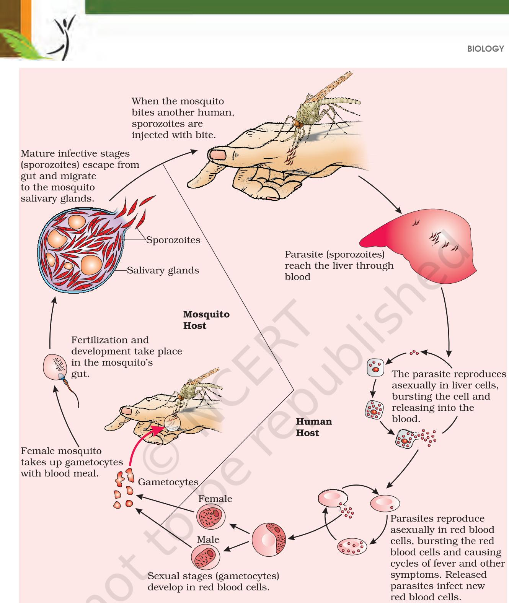
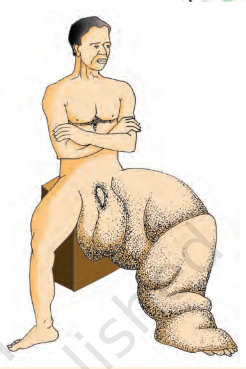
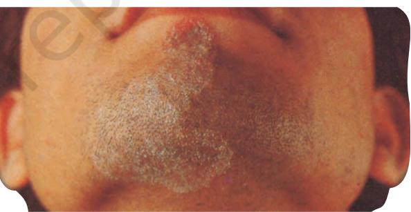
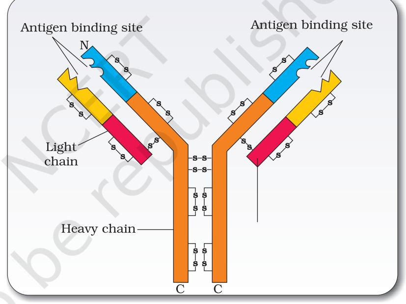
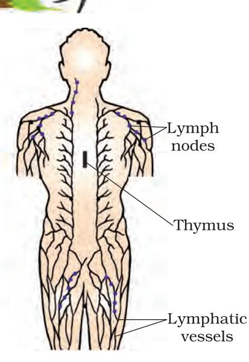
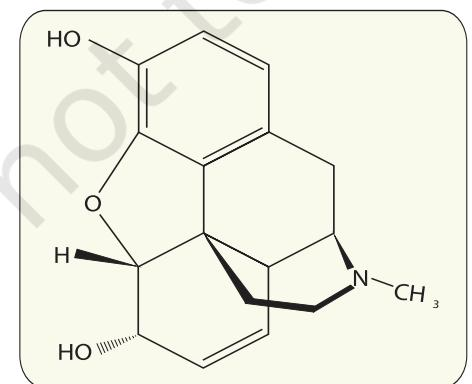
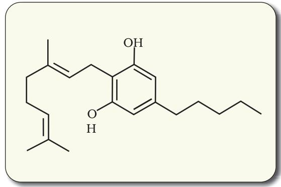

Chapter 7 Human Health and Disease

Chapter 8 Microbes in Human Welfare Biology is the youngest of the formalised disciplines of natural science. Progress in physics and chemistry proceeded much faster than in Biology. Applications of physics and chemistry in our daily life also have a higher visibility than those of biology. However, twentieth century and certainly twenty-first century has demonstrated the utility of biological knowledge in furthering human welfare, be it in health sector or agriculture. The discovery of antibiotics, and synthetic plant-derived drugs, anaesthetics have changed medical practice on one hand and human health on the other hand. Life expectancy of human beings have dramatically changed over the years. Agricultural practices, food processing and diagnostics have brought socio-cultural changes in human communities. These are briefly described in the following three chapters of this unit.

M.S. SWAMINATHAN (1925)

Born in August 1925 in Kumbakonam in Tamil Nadu, Monkambu Sambasivan Swaminathan did his graduation and post-graduation in Botany from Madras University. He worked in different capacities in large number of institutions in India and abroad and developed his expertise in genetics and plant breeding.

The School of Cytogenetics and Radiation Research established at the Indian Agricultural Research Institute (IARI) enabled Swaminathan and his team to develop short-duration high-yielding varieties of rice including scented Basmati. He is also known for the development of the concept of crop cafeteria, crop scheduling and genetically improving the yield and quality.

Swaminathan initiated collaboration with Norman Borlaug, which culminated in the 'Green Revolution' through introduction of Mexican varieties of wheat in India. This was highly recognised and appreciated. He is also the initiator of 'Lab-to-Land', food security and several other environmental programmes. He has been honoured with Padma Bhushan and several other prestigious awards, medals and fellowships by institutions of excellence.

# CHAPTER 7

# HUMAN HEALTH AND DISEASE

- *7.1 Common Diseases in Humans*
- *7.2 Immunity*
- *7.3 AIDS*
- *7.4 Cancer*
- *7.5 Drugs and Alcohol Abuse*

Health, for a long time, was considered as a state of body and mind where there was a balance of certain 'humors'. This is what early Greeks like Hippocrates as well as Indian Ayurveda system of medicine asserted. It was thought that persons with 'blackbile' belonged to hot personality and would have fevers. This idea was arrived at by pure reflective thought. The discovery of blood circulation by William Harvey using experimental method and the demonstration of normal body temperature in persons with blackbile using thermometer disproved the 'good humor' hypothesis of health. In later years, biology stated that mind influences, through neural system and endocrine system, our immune system and that our immune system maintains our health. Hence, mind and mental state can affect our health. Of course, health is affected by –

- (i) genetic disorders deficiencies with which a child is born and deficiencies/defects which the child inherits from parents from birth;
- (ii) infections and
- (iii) life style including food and water we take, rest and exercise we give to our bodies, habits that we have or lack etc.

The term health is very frequently used by everybody. *How do we define it*? Health does not simply mean 'absence of disease' or 'physical fitness'. It could be defined as a state of complete physical, mental and social well-being. When people are healthy, they are more efficient at work. This increases productivity and brings economic prosperity. Health also increases longevity of people and reduces infant and maternal mortality.

Balanced diet, personal hygiene and regular exercise are very important to maintain good health. Yoga has been practised since time immemorial to achieve physical and mental health. Awareness about diseases and their effect on different bodily functions, vaccination (immunisation) against infectious diseases, proper disposal of wastes, control of vectors and maintenance of hygiene in food and water resources are necessary for achieving good health.

When the functioning of one or more organs or systems of the body is adversely affected, characterised by appearance of various signs and symptoms, we say that we are not healthy, i.e., we have a disease. Diseases can be broadly grouped into infectious and non-infectious. Diseases which are easily transmitted from one person to another, are called infectious diseases. Infectious diseases are very common and every one of us suffers from these at sometime or other. Some of the infectious diseases like AIDS are fatal. Among non-infectious diseases, cancer is the major cause of death. Drug and alcohol abuse also affect our health adversely.

#### 7.1 COMMON DISEASES IN HUMANS

A wide range of organisms belonging to bacteria, viruses, fungi, protozoans, helminths, etc., could cause diseases in man. Such diseasecausing organisms are called pathogens. Most parasites are therefore pathogens as they cause harm to the host by living in (or on) them. The pathogens can enter our body by various means, multiply and interfere with normal vital activities, resulting in morphological and functional damage. Pathogens have to adapt to life within the environment of the host. For example, the pathogens that enter the gut must know a way of surviving in the stomach at low pH and resisting the various digestive enzymes. A few representative members from different groups of pathogenic organisms are discussed here alongwith the diseases caused by them. Preventive and control measures against these diseases in general, are also briefly described.

*Salmonella typhi* is a pathogenic bacterium which causes typhoid fever in human beings. These pathogens generally enter the small intestine through food and water contaminated with them and migrate to other organs through blood. Sustained high fever (39° to 40°C), weakness, stomach pain, constipation, headache and loss of appetite are some of the common symptoms of this disease. Intestinal perforation and death may occur in severe cases. Typhoid fever could be confirmed by

130

Widal test : A classic case in medicine, that of Mary Mallon nicknamed *Typhoid Mary*, is worth mentioning here. She was a cook by profession and was a typhoid carrier who continued to spread typhoid for several years through the food she prepared.

Bacteria like *Streptococcus pneumoniae* and *Haemophilus influenzae* are responsible for the disease pneumonia in humans which infects the alveoli (air filled sacs) of the lungs. As a result of the infection, the alveoli get filled with fluid leading to severe problems in respiration. The symptoms of pneumonia include fever, chills, cough and headache. In severe cases, the lips and finger nails may turn gray to bluish in colour. A healthy person acquires the infection by inhaling the droplets/aerosols released by an infected person or even by sharing glasses and utensils with an infected person. Dysentery, plague, diphtheria, etc., are some of the other bacterial diseases in man.

Many viruses also cause diseases in human beings. Rhino viruses represent one such group of viruses which cause one of the most infectious human ailments – the common cold. They infect the nose and respiratory passage but not the lungs. The common cold is characterised by nasal congestion and discharge, sore throat, hoarseness, cough, headache, tiredness, etc., which usually last for 3-7 days. Droplets resulting from cough or sneezes of an infected person are either inhaled directly or transmitted through contaminated objects such as pens, books, cups, doorknobs, computer keyboard or mouse, etc., and cause infection in a healthy person.

Some of the human diseases are caused by protozoans too. You might have heard about *malaria*, a disease man has been fighting since many years. *Plasmodium*, a tiny protozoan is responsible for this disease. Different species of *Plasmodium* (*P*. *vivax*, *P*. *malaria* and *P*. *falciparum*) are responsible for different types of malaria. Of these, malignant malaria caused by *Plasmodium falciparum* is the most serious one and can even be fatal.

Let us take a glance at the life cycle of *Plasmodium* (Figure 7.1). *Plasmodium* enters the human body as sporozoites (infectious form) through the bite of infected female *Anopheles* mosquito. The parasites initially multiply within the liver cells and then attack the red blood cells (RBCs) resulting in their rupture. The rupture of RBCs is associated with release of a toxic substance, haemozoin, which is responsible for the chill and high fever recurring every three to four days. When a female *Anopheles* mosquito bites an infected person, these parasites enter the mosquito's body and undergo further development. The parasites multiply within them to form sporozoites that are stored in their salivary glands. When these mosquitoes bite a human, the sporozoites are introduced into his/ her body, thereby initiating the events mentioned above. It is interesting to note that the malarial parasite requires two hosts – human and mosquitoes – to complete its life cycle (Figure 7.1); the female *Anopheles* mosquito is the vector (transmitting agent) too.

132

Figure 7.1 Stages in the life cycle of *Plasmodium*

*Entamoeba histolytica* is a protozoan parasite in the large intestine of human which causes amoebiasis (amoebic dysentery). Symptoms of this disease include constipation, abdominal pain and cramps, stools with excess mucous and blood clots. Houseflies act as mechanical carriers and serve to transmit the parasite from faeces of infected person to food

and food products, thereby contaminating them. Drinking water and food contaminated by the faecal matter are the main source of infection.

*Ascaris*, the common round worm and *Wuchereria*, the filarial worm, are some of the helminths which are known to be pathogenic to man. *Ascaris*, an intestinal parasite causes ascariasis. Symptoms of these disease include internal bleeding, muscular pain, fever, anemia and blockage of the intestinal passage. The eggs of the parasite are excreted along with the faeces of infected persons which contaminate soil, water, plants, etc. A healthy person acquires this infection through contaminated water, vegetables, fruits, etc.

*Wuchereria (W. bancrofti* and *W. malayi),* the filarial worms cause a slowly developing chronic inflammation of the organs in which they live for many years, usually the lymphatic vessels of the lower limbs and the disease is called elephantiasis or filariasis (Figure 7.2). The genital organs are also often affected, resulting in gross deformities. The pathogens are transmitted to a healthy person through the bite by the female mosquito vectors.

Many fungi belonging to the genera *Microsporum*, *Trichophyton* and *Epidermophyton* are responsible for ringworms which is one of the most common infectious diseases in man. Appearance of dry, scaly lesions on various parts of the body such as skin, nails and scalp (Figure 7.3) are the main symptoms of the disease. These lesions are accompanied by intense itching. Heat and moisture help these fungi to grow, which makes them thrive in skin folds such as those in the groin or between the toes. Ringworms are generally acquired from soil or by using towels, clothes or even the comb of infected individuals.

Maintenance of personal and public hygiene is very important for prevention and control of many infectious diseases. Measures for personal hygiene include keeping the body clean; consumption of clean drinking water, food, vegetables, fruits, etc. Public hygiene includes proper disposal of waste and excreta; periodic cleaning and disinfection of water reservoirs, pools, cesspools and tanks and observing standard practices of hygiene in public catering. These measures are particularly essential where the infectious agents are transmitted through food and water such as typhoid, amoebiasis and ascariasis. In cases of air-borne diseases such as pneumonia and common cold, in addition to the above measures, close

Figure 7.2 Diagram showing inflammation in one of the lower limbs due to elephantiasis

Figure 7.3 Diagram showing ringworm affected area of the skin

#### 133

contact with the infected persons or their belongings should be avoided. For diseases such as malaria and filariasis that are transmitted through insect vectors, the most important measure is to control or eliminate the vectors and their breeding places. This can be achieved by avoiding stagnation of water in and around residential areas, regular cleaning of household coolers, use of mosquito nets, introducing fishes like *Gambusia* in ponds that feed on mosquito larvae, spraying of insecticides in ditches, drainage areas and swamps, etc. In addition, doors and windows should be provided with wire mesh to prevent the entry of mosquitoes. Such precautions have become more important especially in the light of recent widespread incidences of the vector-borne (*Aedes* mosquitoes) diseases like dengue and chikungunya in many parts of India.

The advancements made in biological science have armed us to effectively deal with many infectious diseases. The use of vaccines and immunisation programmes have enabled us to completely eradicate a deadly disease like smallpox. A large number of other infectious diseases like polio, diphtheria, pneumonia and tetanus have been controlled to a large extent by the use of vaccines. Biotechnology (about which you will read more in Chapter 10) is at the verge of making available newer and safer vaccines. Discovery of antibiotics and various other drugs has also enabled us to effectively treat infectious diseases.

#### 7.2 IMMUNITY

Everyday we are exposed to large number of infectious agents. However, only a few of these exposures result in disease. Why? This is due to the fact that the body is able to defend itself from most of these foreign agents. This overall ability of the host to fight the disease-causing organisms, conferred by the immune system is called immunity.

Immunity is of two types: (i) Innate immunity and (ii) Acquired immunity.

#### 7.2.1 Innate Immunity

Innate immunity is non-specific type of defence, that is present at the time of birth. This is accomplished by providing different types of barriers to the entry of the foreign agents into our body. Innate immunity consist of four types of barriers. These are —

- (i) *Physical barriers* : Skin on our body is the main barrier which prevents entry of the micro-organisms. Mucus coating of the epithelium lining the respiratory, gastrointestinal and urogenital tracts also help in trapping microbes entering our body.
- (ii) *Physiological barriers* : Acid in the stomach, saliva in the mouth, tears from eyes–all prevent microbial growth.
- (iii) *Cellular barriers* : Certain types of leukocytes (WBC) of our body like polymorpho-nuclear leukocytes (PMNL-neutrophils) and

monocytes and natural killer (type of lymphocytes) in the blood as well as macrophages in tissues can phagocytose and destroy microbes.

- (iv) *Cytokine barriers* : Virus-infected cells secrete proteins called interferons which protect non-infected cells from further viral infection.
#### 7.2.2 Acquired Immunity

Acquired immunity, on the other hand is pathogen specific. It is characterised by memory. This means when our body encounters a pathogen for the first time it produces a response called primary response which is of low intensity. Subsequent encounter with the same pathogen elicits a highly intensified secondary or anamnestic response. This is ascribed to the fact that our body appears to have memory of the first encounter.

The primary and secondary immune responses are carried out with the help of two special types of lymphocytes present in our blood, i.e., B-lymphocytes and T-lymphocytes.

The B-lymphocytes produce an army of proteins in response to pathogens into our blood to fight with them. These proteins are called antibodies. The T-cells themselves do not secrete antibodies but help B cells to produce them. Each antibody molecule has four peptide chains, two small called light chains and two longer called heavy chains. Hence, an antibody is represented

as H2 L2 . Different types of antibodies are produced in our body. IgA, IgM, IgE, IgG are some of them. A cartoon of an antibody is given in Figure 7.4. Because these antibodies are found in the blood, the response is also called as humoral immune response. This is one of the two types of our acquired immune response – antibody mediated. The second type is called cell-mediated immune response or cell-mediated immunity (CMI). The T-lymphocytes mediate CMI. Very often, when some human organs like heart, eye, liver, kidney fail to function satisfactorily, transplantation is the only remedy to enable the patient to live a normal life. Then a search begins – to find a suitable donor. *Why is it that the organs cannot be taken from just anybody? What is it that the doctors check*? Grafts from

135

just any source – an animal, another primate, or any human beings cannot be made since the grafts would be rejected sooner or later. Tissue matching, blood group matching are essential before undertaking any graft/transplant and even after this the patient has to take immuno– suppresants all his/her life. The body is able to differentiate 'self ' and 'nonself' and the cell-mediated immune response is responsible for the graft rejection.

#### 7.2.3 Active and Passive Immunity

When a host is exposed to antigens, which may be in the form of living or dead microbes or other proteins, antibodies are produced in the host body. This type of immunity is called active immunity. Active immunity is slow and takes time to give its full effective response. Injecting the microbes deliberately during immunisation or infectious organisms gaining access into body during natural infection induce active immunity. When ready-made antibodies are directly given to protect the body against foreign agents, it is called passive immunity. *Do you know why mother's milk is considered very essential for the newborn infant*? The yellowish fluid colostrum secreted by mother during the initial days of lactation has abundant antibodies (IgA) to protect the infant. The foetus also receives some antibodies from their mother, through the placenta during pregnancy. These are some examples of passive immunity.

#### 7.2.4 Vaccination and Immunisation

The principle of immunisation or vaccination is based on the property of 'memory' of the immune system. In vaccination, a preparation of antigenic proteins of pathogen or inactivated/weakened pathogen (vaccine) are introduced into the body. The antibodies produced in the body against these antigens would neutralise the pathogenic agents during actual infection. The vaccines also generate memory – B and T-cells that recognise the pathogen quickly on subsequent exposure and overwhelm the invaders with a massive production of antibodies. If a person is infected with some deadly microbes to which quick immune response is required as in tetanus, we need to directly inject the preformed antibodies, or antitoxin (a preparation containing antibodies to the toxin). Even in cases of snakebites, the injection which is given to the patients, contain preformed antibodies against the snake venom. This type of immunisation is called passive immunisation.

Recombinant DNA technology has allowed the production of antigenic polypeptides of pathogen in bacteria or yeast. Vaccines produced using this approach allow large scale production and hence greater availability for immunisation, e.g., hepatitis B vaccine produced from yeast.

136

### 7.2.5 Allergies

When you have gone to a new place and suddenly you started sneezing, wheezing for no explained reason, and when you went away, your symptoms dissappeared. Did this happen to you? Some of us are sensitive to some particles in the environment. The above-mentioned reaction could be because of allergy to pollen, mites, etc., which are different in different places.

The exaggerated response of the immune system to certain antigens present in the environment is called allergy. The substances to which such an immune response is produced are called allergens. The antibodies produced to these are of IgE type. Common examples of allergens are mites in dust, pollens, animal dander, etc. Symptoms of allergic reactions include sneezing, watery eyes, running nose and difficulty in breathing. Allergy is due to the release of chemicals like histamine and serotonin from the mast cells. For determining the cause of allergy, the patient is exposed to or injected with very small doses of possible allergens, and the reactions studied. The use of drugs like anti-histamine, adrenalin and steroids quickly reduce the symptoms of allergy. Somehow, modern-day life style has resulted in lowering of immunity and more sensitivity to allergens – more and more children in metro cities of India suffer from allergies and asthma due to sensitivity to the environment. This could be because of the protected environment provided early in life.

#### 7.2.6 Auto Immunity

Memory-based acquired immunity evolved in higher vertebrates based on the ability to differentiate foreign organisms (e.g., pathogens) from selfcells. While we still do not understand the basis of this, two corollaries of this ability have to be understood. One, higher vertebrates can distinguish foreign molecules as well as foreign organisms. Most of the experimental immunology deals with this aspect. Two, sometimes, due to genetic and other unknown reasons, the body attacks self-cells. This results in damage to the body and is called auto-immune disease. Rheumatoid arthritis which affects many people in our society is an auto-immune disease.

### 7.2.7 Immune System in the Body

The human immune system consists of lymphoid organs, tissues, cells and soluble molecules like antibodies. As you have read, immune system is unique in the sense that it recognises foreign antigens, responds to these and remembers them. The immune system also plays an important role in allergic reactions, auto-immune diseases and organ transplantation.

Lymphoid organs: These are the organs where origin and/or maturation and proliferation of lymphocytes occur. The primary lymphoid organs are bone marrow and thymus where immature lymphocytes differentiate

Figure 7.5 Diagrammatic representation of Lymph nodes into antigen-sensitive lymphocytes. After maturation the lymphocytes migrate to secondary lymphoid organs like spleen, lymph nodes, tonsils, Peyer's patches of small intestine and appendix. The secondary lymphoid organs provide the sites for interaction of lymphocytes with the antigen, which then proliferate to become effector cells. The location of various lymphoid organs in the human body is shown in Figure 7.5.

The bone marrow is the main lymphoid organ where all blood cells including lymphocytes are produced. The thymus is a lobed organ located near the heart and beneath the breastbone. The thymus is quite large at the time of birth but keeps reducing in size with age and by the time puberty is attained it reduces to a very small size. Both bone-marrow and thymus provide micro-environments for the development and maturation of T-lymphocytes. The spleen is a large beanshaped organ. It mainly contains lymphocytes and phagocytes. It acts as a filter of the blood by trapping blood-borne microorganisms. Spleen also has a large reservoir of erythrocytes. The lymph nodes are small solid structures located at different

points along the lymphatic system. Lymph nodes serve to trap the micro-organisms or other antigens, which happen to get into the lymph and tissue fluid. Antigens trapped in the lymph nodes are responsible for the activation of lymphocytes present there and cause the immune response.

There is lymphoid tissue also located within the lining of the major tracts (respiratory, digestive and urogenital tracts) called mucosaassociated lymphoid tissue (MALT). It constitutes about 50 per cent of the lymphoid tissue in human body.

### 7.3 AIDS

The word AIDS stands for Acquired Immuno Deficiency Syndrome. This means deficiency of immune system, acquired during the lifetime of an individual indicating that it is not a congenital disease. 'Syndrome' means a group of symptoms. AIDS was first reported in 1981 and in the last twenty-five years or so, it has spread all over the world killing more than 25 million persons.

AIDS is caused by the Human Immuno deficiency Virus (HIV), a member of a group of viruses called retrovirus, which have an envelope enclosing the RNA genome (Figure 7.6). Transmission of HIV-infection generally occurs by (a) sexual contact with infected person, (b) by transfusion of contaminated blood and blood products, (c) by sharing infected needles as in the case of intravenous drug abusers and (d) from infected mother to her child through placenta. So, people who are at high risk of getting this infection includes - individuals who have multiple

Figure 7.6 Replication of retrovirus

sexual partners, drug addicts who take drugs intravenously, individuals who require repeated blood transfusions and children born to an HIV infected mother. *Do you know–when do people need repeated blood transfusion? Find out and make a list of such conditions.* It is important to note that HIV/AIDS is not spread by mere touch or physical contact; it spreads only through body fluids. It is, hence, imperative, for the physical and psychological well-being, that the HIV/AIDS infected persons are not isolated from family and society. There is always a time-lag between the infection and appearance of AIDS symptoms. This period may vary from a few months to many years (usually 5-10 years).

139

After getting into the body of the person, the virus enters into macrophages where RNA genome of the virus replicates to form viral DNA with the help of the enzyme reverse transcriptase. This viral DNA gets incorporated into host cell's DNA and directs the infected cells to produce virus particles (Figure 7.6). The macrophages continue to produce virus and in this way acts like a HIV factory. Simultaneously, HIV enters into helper T-lymphocytes (TH ), replicates and produce progeny viruses. The progeny viruses released in the blood attack other helper T-lymphocytes. This is repeated leading to a progressive decrease in the number of helper T-lymphocytes in the body of the infected person. During this period, the person suffers from bouts of fever, diarrhoea and weight loss. Due to decrease in the number of helper T lymphocytes, the person starts suffering from infections that could have been otherwise overcome such as those due to bacteria especially *Mycobacterium*, viruses, fungi and even parasites like *Toxoplasma.* The patient becomes so immuno-deficient that he/she is unable to protect himself/herself against these infections. A widely used diagnostic test for AIDS is enzyme linked immuno-sorbent assay (ELISA). Treatment of AIDS with anti-retroviral drugs is only partially effective. They can only prolong the life of the patient but cannot prevent death, which is inevitable.

Prevention of AIDS : As AIDS has no cure, prevention is the best option. Moreover, HIV infection, more often, spreads due to conscious behaviour patterns and is not something that happens inadvertently, like pneumonia or typhoid. Of course, infection in blood transfusion patients, new-borns (from mother) etc., may take place due to poor monitoring. The only excuse may be ignorance and it has been rightly said – "don't die of ignorance". In our country the National AIDS Control Organisation (NACO) and other non-governmental organisation (NGOs) are doing a lot to educate people about AIDS. WHO has started a number of programmes to prevent the spreading of HIV infection. Making blood (from blood banks) safe from HIV, ensuring the use of only disposable needles and syringes in public and private hospitals and clinics, free distribution of condoms, controlling drug abuse, advocating safe sex and promoting regular check-ups for HIV in susceptible populations, are some such steps taken up.

Infection with HIV or having AIDS is something that should not be hidden – since then, the infection may spread to many more people. HIV/AIDS-infected people need help and sympathy instead of being shunned by society. Unless society recognises it as a problem to be dealt with in a collective manner – the chances of wider spread of the disease increase manifold. It is a malady that can only be tackled, by the society and medical fraternity acting together, to prevent the spread of the disease.

#### 7.4 CANCER

Cancer is one of the most dreaded diseases of human beings and is a major cause of death all over the globe. More than a million Indians suffer from

cancer and a large number of them die from it annually. The mechanisms that underlie development of cancer or oncogenic transformation of cells, its treatment and control have been some of the most intense areas of research in biology and medicine.

In our body, cell growth and differentiation is highly controlled and regulated. In cancer cells, there is breakdown of these regulatory mechanisms. Normal cells show a property called contact inhibition by virtue of which contact with other cells inhibits their uncontrolled growth. Cancer cells appears to have lost this property. As a result of this, cancerous cells just continue to divide giving rise to masses of cells called tumors. Tumors are of two types: benign and malignant. Benign tumors normally remain confined to their original location and do not spread to other parts of the body and cause little damage. The malignant tumors, on the other hand are a mass of proliferating cells called neoplastic or tumor cells. These cells grow very rapidly, invading and damaging the surrounding normal tissues. As these cells actively divide and grow they also starve the normal cells by competing for vital nutrients. Cells sloughed from such tumors reach distant sites through blood, and wherever they get lodged in the body, they start a new tumor there. This property called metastasis is the most feared property of malignant tumors.

Causes of cancer : Transformation of normal cells into cancerous neoplastic cells may be induced by physical, chemical or biological agents. These agents are called carcinogens. Ionising radiations like X-rays and gamma rays and non-ionizing radiations like UV cause DNA damage leading to neoplastic transformation. The chemical carcinogens present in tobacco smoke have been identified as a major cause of lung cancer. Cancer causing viruses called oncogenic viruses have genes called viral oncogenes. Furthermore, several genes called cellular oncogenes (*c-onc*) or proto oncogenes have been identified in normal cells which, when activated under certain conditions, could lead to oncogenic transformation of the cells.

Cancer detection and diagnosis : Early detection of cancers is essential as it allows the disease to be treated successfully in many cases. Cancer detection is based on biopsy and histopathological studies of the tissue and blood and bone marrow tests for increased cell counts in the case of leukemias. In biopsy, a piece of the suspected tissue cut into thin sections is stained and examined under microscope (histopathological studies) by a pathologist. Techniques like radiography (use of X-rays), CT (computed tomography) and MRI (magnetic resonance imaging) are very useful to detect cancers of the internal organs. Computed tomography uses X-rays to generate a three-dimensional image of the internals of an object. MRI uses strong magnetic fields and non-ionising radiations to accurately detect pathological and physiological changes in the living tissue.

Antibodies against cancer -specific antigens are also used for detection of certain cancers. Techniques of molecular biology can be

142

applied to detect genes in individuals with inherited susceptibility to certain cancers. Identification of such genes, which predispose an individual to certain cancers, may be very helpful in prevention of cancers. Such individuals may be advised to avoid exposure to particular carcinogens to which they are susceptible (e.g., tobacco smoke in case of lung cancer).

Treatment of cancer : The common approaches for treatment of cancer are surgery, radiation therapy and immunotherapy. In radiotherapy, tumor cells are irradiated lethally, taking proper care of the normal tissues surrounding the tumor mass. Several chemotherapeutic drugs are used to kill cancerous cells. Some of these are specific for particular tumors. Majority of drugs have side effects like hair loss, anemia, etc. Most cancers are treated by combination of surgery, radiotherapy and chemotherapy. Tumor cells have been shown to avoid detection and destruction by immune system. Therefore, the patients are given substances called biological response modifiers such as α-interferon which activates their immune system and helps in destroying the tumor.

#### 7.5 DRUGS AND ALCOHOL ABUSE

Surveys and statistics show that use of drugs and alcohol has been on the rise especially among the youth. This is really a cause of concern as it could result in many harmful effects. Proper education and guidance would enable youth to safeguard themselves against these dangerous behaviour patterns and follow healthy lifestyles.

The drugs, which are commonly abused are opioids, cannabinoids and coca alkaloids. Majority of these are obtained from flowering plants. Some are obtained from fungi.

Opioids are the drugs, which bind to specific opioid receptors present in our central nervous system and gastrointestinal tract. Heroin (Figure 7.7), commonly called *smack* is chemically diacetylmorphine which is a white, odourless, bitter crystalline compound. This is obtained by acetylation of morphine (Figure 7.7), which is extracted from the latex of

Figure 7.7 Chemical structure of Morphine Figure 7.8 Opium poppy

poppy plant *Papaver somniferum* (Figure 7.8). Generally taken by snorting and injection, heroin is a depressant and slows down body functions.

Cannabinoids are a group of chemicals (Figure 7.9), which interact with cannabinoid receptors present principally in the brain. Natural cannabinoids are obtained from the inflorescences of the plant *Cannabis sativa* (Figure 7.10). The flower tops, leaves and the resin of cannabis plant are used in various combinations to produce marijuana, hashish, charas and ganja. Generally taken by inhalation and oral ingestion, these are known for their effects on cardiovascular system of the body.

Coca alkaloid or cocaine is obtained from coca plant *Erythroxylum coca*, native to South America. It interferes with the transport of the neuro-transmitter dopamine. Cocaine, commonly called coke or crack is usually snorted. It has a potent stimulating action on central nervous system, producing a sense of euphoria and increased energy. Excessive dosage of cocaine causes hallucinations. Other well-known plants with hallucinogenic properties are *Atropa belladona* and *Datura* (Figure 7.11). These days cannabinoids are also being abused by some sportspersons.

 Drugs like barbiturates, amphetamines, benzodiazepines, and other similar drugs, that are normally used as medicines to help patients cope with mental illnesses like depression and insomnia, are often

abused. Morphine is a very effective sedative and painkiller, and is very useful in patients who have undergone surgery. Several plants, fruits and seeds having hallucinogenic properties have been used for hundreds of years in folk-medicine, religious ceremonies and rituals all over the globe. When these are taken for a purpose other than medicinal use or in amounts/frequency that impairs one's physical, physiological or psychological functions, it constitutes drug abuse.

Figure 7.10 Leaves of *Cannabis sativa*

Figure 7.11 Flowering branch of *Datura*

143

Smoking also paves the way to hard drugs. Tobacco has been used by human beings for more than 400 years. It is smoked, chewed or used as a snuff. Tobacco contains a large number of chemical substances including nicotine, an alkaloid. Nicotine stimulates adrenal gland to release adrenaline and nor-adrenaline into blood circulation, both of which raise blood pressure and increase heart rate. Smoking is associated with increased incidence of cancers of lung, urinary bladder and throat, bronchitis, emphysema, coronary heart disease, gastric ulcer, etc. Tobacco chewing is associated with increased risk of cancer of the oral cavity. Smoking increases carbon monoxide (CO) content in blood and reduces the concentration of haembound oxygen. This causes oxygen deficiency in the body.

When one buys packets of cigarettes one cannot miss the statutory warning that is present on the packing which warns against smoking and says how it is injurious to health. Yet, smoking is very prevalent in society, both among young and old. Knowing the dangers of smoking and chewing tobacco, and its addictive nature, the youth and old need to avoid these habits. Any addict requires counselling and medical help to get rid of the habit.

#### 7.5.1 Adolescence and Drug/Alcohol Abuse

Adolescence means both 'a period' and 'a process' during which a child becomes mature in terms of his/her attitudes and beliefs for effective participation in society. The period between 12-18 years of age may be thought of as adolescence period. In other words, adolescence is a bridge linking childhood and adulthood. Adolescence is accompanied by several biological and behavioural changes. Adolescence, thus is a very vulnerable phase of mental and psychological development of an individual.

Curiosity, need for adventure and excitement, and experimentation, constitute common causes, which motivate youngsters towards drug and alcohol use. A child's natural curiosity motivates him/her to experiment. This is complicated further by effects that might be perceived as benefits, of alcohol or drug use. Thus, the first use of drugs or alcohol may be out of curiosity or experimentation, but later the child starts using these to escape facing problems. Of late, stress, from pressures to excel in academics or examinations, has played a significant role in persuading the youngsters to try alcohol and drugs. The perception among youth that it is 'cool' or progressive to smoke, use drugs or alcohol, is also in a way a major cause for youth to start these habits. Television, movies, newspapers, internet also help to promote this perception. Other factors that have been seen to be associated with drug and alcohol abuse among adolescents are unstable or unsupportive family structures and peer pressure.

144

#### 7.5.2 Addiction and Dependence

Because of the perceived benefits, drugs are frequently used repeatedly. The most important thing, which one fails to realise, is the inherent addictive nature of alcohol and drugs. Addiction is a psychological attachment to certain effects –such as euphoria and a temporary feeling of well-being – associated with drugs and alcohol. These drive people to take them even when these are not needed, or even when their use becomes self-destructive. With repeated use of drugs, the tolerance level of the receptors present in our body increases. Consequently the receptors respond only to higher doses of drugs or alcohol leading to greater intake and addiction. However, it should be clearly borne in mind that use of these drugs even once, can be a fore-runner to addiction. Thus, the addictive potential of drugs and alcohol, pull the user into a vicious circle leading to their regular use (abuse) from which he/she may not be able to get out. In the absence of any guidance or counselling, the person gets addicted and becomes dependent on their use.

Dependence is the tendency of the body to manifest a characteristic and unpleasant withdrawal syndrome if regular dose of drugs/alcohol is abruptly discontinued. This is characterised by anxiety, shakiness, nausea and sweating, which may be relieved when use is resumed again. In some cases, withdrawal symptoms can be severe and even life threatening and the person may need medical supervision.

Dependence leads the patient to ignore all social norms in order to get sufficient funds to satiate his/her needs. These result in many social adjustment problems.

#### 7.5.3 Effects of Drug/Alcohol Abuse

The immediate adverse effects of drugs and alcohol abuse are manifested in the form of reckless behaviour, vandalism and violence. Excessive doses of drugs may lead to coma and death due to respiratory failure, heart failure or cerebral hemorrhage. A combination of drugs or their intake along with alcohol generally results in overdosing and even deaths. The most common warning signs of drug and alcohol abuse among youth include drop in academic performance, unexplained absence from school/college, lack of interest in personal hygiene, withdrawal, isolation, depression, fatigue, aggressive and rebellious behaviour, deteriorating relationships with family and friends, loss of interest in hobbies, change in sleeping and eating habits, fluctuations in weight, appetite, etc.

There may even be some far-reaching implications of drug/alcohol abuse. If an abuser is unable to get money to buy drugs/alcohol he/she may turn to stealing. The adverse effects are just not restricted to the person who is using drugs or alcohol. At times, a drug/alcohol addict becomes the cause of mental and financial distress to his/her entire family and friends.

### 145

Those who take drugs intravenously (direct injection into the vein using a needle and syringe), are much more likely to acquire serious infections like AIDS and Hepatitis B. The viruses, which are responsible for these diseases, are transferred from one person to another by sharing of infected needles and syringes. Both AIDS and Hepatitis B infections are chronic infections and ultimately fatal. Both can be transmitted through sexual contact or infected blood.

The use of alcohol during adolescence may also have long-term effects. It could lead to heavy drinking in adulthood. The chronic use of drugs and alcohol damages nervous system and liver (cirrhosis). The use of drugs and alcohol during pregnancy is also known to adversely affect the foetus.

Another misuse of drugs is what certain sportspersons do to enhance their performance. They (mis)use narcotic analgesics, anabolic steroids, diuretics and certain hormones in sports to increase muscle strength and bulk and to promote aggressiveness and as a result increase athletic performance. The side-effects of the use of anabolic steroids in females include masculinisation (features like males), increased aggressiveness, mood swings, depression, abnormal menstrual cycles, excessive hair growth on the face and body, enlargement of clitoris, deepening of voice. In males it includes acne, increased aggressiveness, mood swings, depression, reduction of size of the testicles, decreased sperm production, potential for kidney and liver dysfunction, breast enlargement, premature baldness, enlargement of the prostate gland. These effects may be permanent with prolonged use. In the adolescent male or female, severe facial and body acne, and premature closure of the growth centres of the long bones may result in stunted growth.

#### 7.5.4 Prevention and Control

The age-old adage of 'prevention is better than cure' holds true here also. It is also true that habits such as smoking, taking drug or alcohol are more likely to be taken up at a young age, more during adolescence. Hence, it is best to identify the situations that may push an adolescent towards use of drugs or alcohol, and to take remedial measures well in time. In this regard, the parents and the teachers have a special responsibility. Parenting that combines with high levels of nurturance and consistent discipline, has been associated with lowered risk of substance (alcohol/drugs/tobacco) abuse. Some of the measures mentioned here would be particularly useful for prevention and control of alcohol and drugs abuse among adolescents

- (i) *Avoid undue peer pressure -* Every child has his/her own choice and personality, which should be respected and nurtured. A child should not be pushed unduly to perform beyond his/her threshold limits; be it studies, sports or other activities.
- (ii) *Education and counselling -* Educating and counselling him/ her to face problems and stresses, and to accept disappointments and failures as a part of life. It would also be worthwhile to channelise the child's energy into healthy pursuits like sports, reading, music, yoga and other extracurricular activities.
- (iii) *Seeking help from parents and peers -* Help from parents and peers should be sought immediately so that they can guide appropriately. Help may even be sought from close and trusted friends. Besides getting proper advise to sort out their problems, this would help young to vent their feelings of anxiety and guilt.
- (iv) *Looking for danger signs -* Alert parents and teachers need to look for and identify the danger signs discussed above. Even friends, if they find someone using drugs or alcohol, should not hesitate to bring this to the notice of parents or teacher in the best interests of the person concerned. Appropriate measures would then be required to diagnose the malady and the underlying causes. This would help in initiating proper remedial steps or treatment.
- (v) *Seeking professional and medical help -* A lot of help is available in the form of highly qualified psychologists, psychiatrists, and deaddiction and rehabilitation programmes to help individuals who have unfortunately got in the quagmire of drug/alcohol abuse. With such help, the affected individual with sufficient efforts and will power, can get rid of the problem completely and lead a perfectly normal and healthy life.

#### SUMMARY

Health is not just the absence of disease. It is a state of complete physical, mental, social and psychological well-being. Diseases like typhoid, cholera, pneumonia, fungal infections of skin, malaria and many others are a major cause of distress to human beings. Vector-borne diseases like malaria especially one caused by *Plasmodium falciparum*, if not treated, may prove fatal. Besides personal cleanliness and hygiene, public health measures like proper disposal of waste, decontamination of drinking water, control of vectors like mosquitoes and immunisation are very helpful in preventing these diseases. Our immune system plays the major role in preventing these diseases when we are exposed to disease-causing agents. The innate defences of our body like skin, mucous membranes, antimicrobial substances present in our tears, saliva and the phagocytic cells help to block the entry of pathogens into our body. If the pathogens succeed in gaining entry to our body, specific antibodies (humoral immune response) and cells (cell mediated immune response) serve to kill these pathogens. Immune system has memory. On subsequent exposure to same pathogen, the immune response is rapid and more intense. This forms the basis of protection

147

afforded by vaccination and immunisation. Among other diseases, AIDS and cancer kill a large number of individuals worldwide. AIDS caused by the human immuno-deficiency virus (HIV) is fatal but can be prevented if certain precautions are taken. Many cancers are curable if detected early and appropriate therapeutic measures are taken. Of late, drug and alcohol abuse among youth and adolescents is becoming another cause of concern. Because of the addictive nature of alcohol and drugs, and their perceived benefits like relief from stress, a person may try taking these in the face of peer pressure, examinations-related and competition-related stresses. In doing so, he/she may get addicted to them. Education about their harmful effects, counselling and seeking immediate professional and medical help would totally relieve the individual from these evils.

## EXERCISES

- 1. What are the various public health measures, which you would suggest as safeguard against infectious diseases?
- 2. In which way has the study of biology helped us to control infectious diseases?
- 3. How does the transmission of each of the following diseases take place? (a) Amoebiasis (b) Malaria (c) Ascariasis (d) Pneumonia
- 4. What measure would you take to prevent water-borne diseases?
- 5. Discuss with your teacher what does 'a suitable gene' means, in the context of DNA vaccines.
- 6. Name the primary and secondary lymphoid organs.
- 7. The following are some well-known abbreviations, which have been used in this chapter. Expand each one to its full form:
	- (a) MALT (b) CMI (c) AIDS (d) NACO (e) HIV
- 8. Differentiate the following and give examples of each:
- (a) Innate and acquired immunity (b) Active and passive immunity 9. Draw a well-labelled diagram of an antibody molecule.
- 10. What are the various routes by which transmission of human immunodeficiency virus takes place?
- 11. What is the mechanism by which the AIDS virus causes deficiency of immune system of the infected person?
- 12. How is a cancerous cell different from a normal cell?
- 13. Explain what is meant by metastasis.
- 14. List the harmful effects caused by alcohol/drug abuse.
- 15. Do you think that friends can influence one to take alcohol/drugs? If yes, how may one protect himself/herself from such an influence?
- 16. Why is that once a person starts taking alcohol or drugs, it is difficult to get rid of this habit? Discuss it with your teacher.
- 17. In your view what motivates youngsters to take to alcohol or drugs and how can this be avoided?

148

