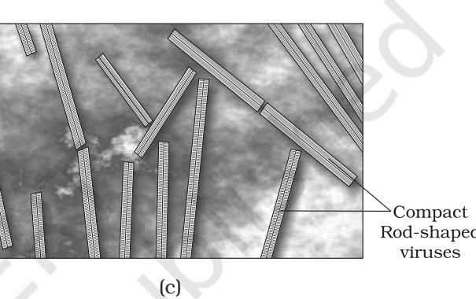
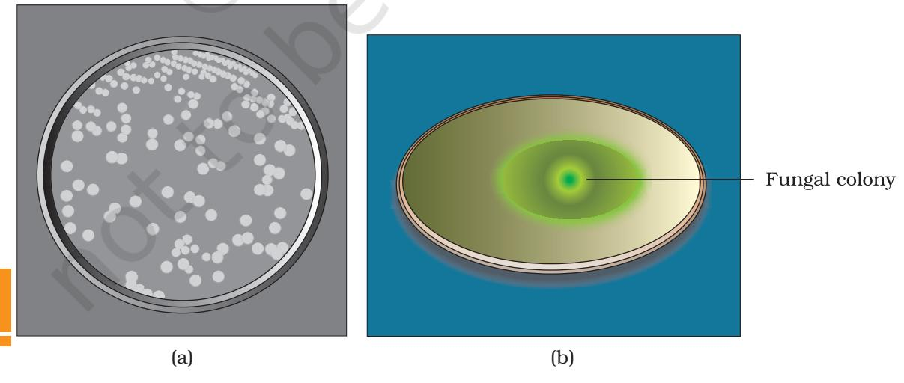
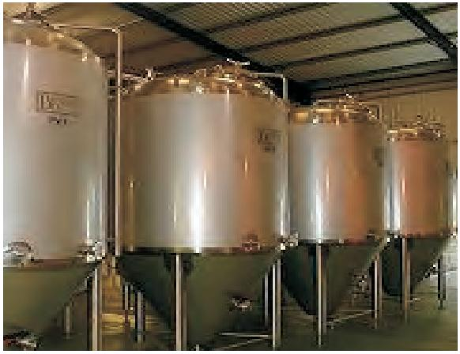
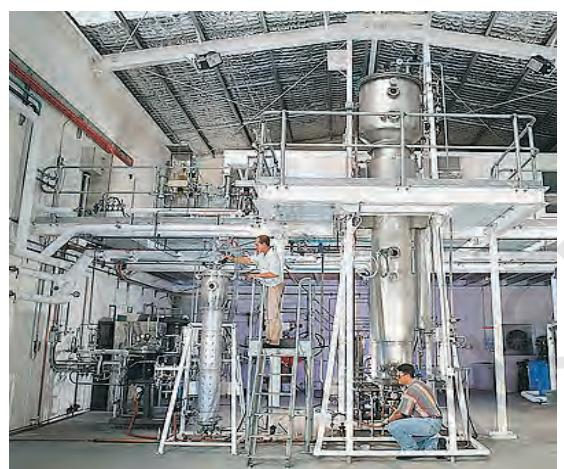
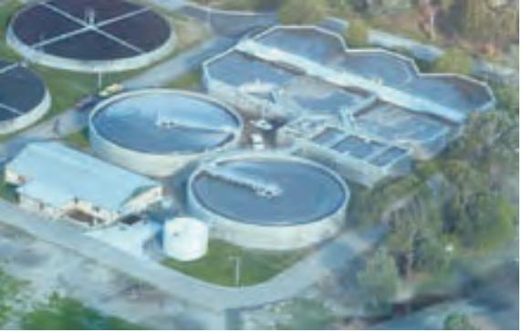
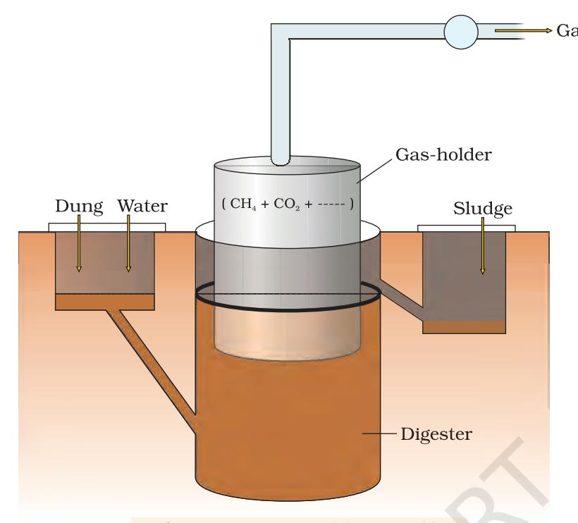

# CHAPTER 8

## MICROBES IN HUMAN WELFARE

- *8.1 Microbes in Household Products*
- *8.2 Microbes in Industrial Products*
- *8.3 Microbes in Sewage Treatment*
- *8.4 Microbes in Production of Biogas*
- *8.5 Microbes as Biocontrol Agents*
- *8.6 Microbes as Biofertilisers*

Besides macroscopic plants and animals, microbes are the major components of biological systems on this earth. You have studied about the diversity of living organisms in Class XI. *Do you remember which Kingdoms among the living organisms contain micro-organisms? Which are the ones that are only microscopic?* Microbes are present everywhere – in soil, water, air, inside our bodies and that of other animals and plants. They are present even at sites where no other life-form could possibly exist–sites such as deep inside the geysers (thermal vents) where the temperature may be as high as 1000C, deep in the soil, under the layers of snow several metres thick, and in highly acidic environments. Microbes are diverse–protozoa, bacteria, fungi and microscopic animal and plant viruses, viroids and also prions that are proteinacious infectious agents. Some of the microbes are shown in Figures 8.1 and 8.2.

Microbes like bacteria and many fungi can be grown on nutritive media to form colonies (Figure 8.3), that can be seen with the naked eyes. Such cultures are useful in studies on micro-organisms.

(a) (b)

Figure 8.1 Bacteria: (a) Rod-shaped, magnified 1500X; (b) Spherical shaped, magnified1500X; (c) A rodshaped bacterium showing flagella, magnified 50,000X

(c)

150

(a) (b)

BIOLOGY

- Figure 8.2 Viruses: (a) A bacteriophage; (b) Adenovirus which causes respiratory infections; (c) Rod-shaped Tobacco Mosaic Virus (TMV). Magnified about 1,00,000–1,50,000X

Figure 8.3 (a) Colonies of bacteria growing in a petri dish; (b) Fungal colony growing in a petri dish

In chapter 7, you have read that microbes cause a large number of diseases in human beings. They also cause diseases in animals and plants. But this should not make you think that all microbes are harmful; several microbes are useful to man in diverse ways. Some of the most important contributions of microbes to human welfare are discussed in this chapter.

#### 8.1 MICROBES IN HOUSEHOLD PRODUCTS

You would be surprised to know that we use microbes or products derived from them everyday. A common example is the production of curd from milk. Micro-organisms such as *Lactobacillus* and others commonly called lactic acid bacteria (LAB) grow in milk and convert it to curd. During growth, the LAB produce acids that coagulate and partially digest the milk proteins. A small amount of curd added to the fresh milk as inoculum or starter contain millions of LAB, which at suitable temperatures multiply, thus converting milk to curd, which also improves its nutritional quality by increasing vitamin B12. In our stomach too, the LAB play very beneficial role in checking diseasecausing microbes.

The dough, which is used for making foods such as *dosa* and *idli* is also fermented by bacteria. The puffed-up appearance of dough is due to the production of CO2 gas. *Can you tell which metabolic pathway is taking place resulting in the formation of CO2 ? Where do you think the bacteria for these fermentations come from?* Similarly the dough, which is used for making bread, is fermented using baker's yeast (*Saccharomyces cerevisiae*). A number of traditional drinks and foods are also made by fermentation by the microbes. 'Toddy', a traditional drink of some parts of southern India is made by fermenting sap from palms. Microbes are also used to ferment fish, soyabean and bambooshoots to make foods. Cheese, is one of the oldest food items in which microbes were used. Different varieties of cheese are known by their characteristic texture, flavour and taste, the specificity coming from the microbes used. For example, the large holes in 'Swiss cheese' are due to production of a large amount of CO2 by a bacterium named *Propionibacterium sharmanii*. The 'Roquefort cheese' are ripened by growing a specific fungi on them, which gives them a particular flavour.

#### 8.2 MICROBES IN INDUSTRIAL PRODUCTS

Even in industry, microbes are used to synthesise a number of products valuable to human beings. Beverages and antibiotics are some examples. Production on an industrial scale, requires growing microbes in very large vessels called fermentors (Figure 8.4).

#### 151

Figure 8.4 Fermentors

Figure 8.5 Fermentation Plant

#### 8.2.1 Fermented Beverages

Microbes especially yeasts have been used from time immemorial for the production of beverages like wine, beer, whisky, brandy or rum. For this purpose the same yeast *Saccharomyces cerevisiae* used for bread-making and commonly called brewer's yeast, is used for fermenting malted cereals and fruit juices, to produce ethanol. *Do you recollect the metabolic reactions, which result in the production of ethanol by yeast?* Depending on the type of the raw material used for fermentation and the type of processing (with or without distillation) different types of alcoholic drinks are obtained. Wine and beer are produced without distillation whereas whisky, brandy and rum are produced by distillation of the fermented broth. The photograph of a fermentation plant is shown in Figure 8.5.

#### 8.2.2 Antibiotics

Antibiotics produced by microbes are regarded as one of the most significant discoveries of the twentieth century and have greatly contributed towards the welfare of the human society. *Anti* is a Greek word that means 'against', and *bio* means 'life', together they mean 'against life' (in the

context of disease causing organisms); whereas with reference to human beings, they are 'pro life' and not against. Antibiotics are chemical substances, which are produced by some microbes and can kill or retard the growth of other (disease-causing) microbes.

You are familiar with the commonly used antibiotic Penicillin. Do you know that Penicillin was the first antibiotic to be discovered, and it was a chance discovery? Alexander Fleming while working on *Staphylococci* bacteria, once observed a mould growing in one of his unwashed culture plates around which *Staphylococci* could not grow. He found out that it was due to a chemical produced by the mould and he named it Penicillin after the mould *Penicillium notatum.* However, its full potential as an effective antibiotic was established much later by Ernest Chain and Howard Florey. This antibiotic was extensively used to treat American soldiers wounded in World War II. Fleming, Chain and Florey were awarded the Nobel Prize in 1945, for this discovery.

### 152

After Penicillin, other antibiotics were also purified from other microbes. *Can you name some other antibiotics and find out their sources?* Antibiotics have greatly improved our capacity to treat deadly diseases such as plague, whooping cough (*kali khansi*), diphtheria (*gal ghotu*) and leprosy (*kusht rog*), which used to kill millions all over the globe. Today, we cannot imagine a world without antibiotics.

#### 8.2.3 Chemicals, Enzymes and other Bioactive Molecules

Microbes are also used for commercial and industrial production of certain chemicals like organic acids, alcohols and enzymes. Examples of acid producers are *Aspergillus niger* (a fungus) of citric acid, *Acetobacter aceti* (a bacterium) of acetic acid; *Clostridium butylicum* (a bacterium) of butyric acid and *Lactobacillus* (a bacterium) of lactic acid.

Yeast (*Saccharomyces cerevisiae)* is used for commercial production of ethanol. Microbes are also used for production of enzymes. Lipases are used in detergent formulations and are helpful in removing oily stains from the laundry. You must have noticed that bottled fruit juices bought from the market are clearer as compared to those made at home. This is because the bottled juices are clarified by the use of pectinases and proteases. Streptokinase produced by the bacterium *Streptococcus* and modified by genetic engineering is used as a 'clot buster' for removing clots from the blood vessels of patients who have undergone myocardial infarction leading to heart attack.

Another bioactive molecule, cyclosporin A, that is used as an immunosuppressive agent in organ-transplant patients, is produced by the fungus *Trichoderma polysporum*. Statins produced by the yeast *Monascus purpureus* have been commercialised as blood-cholesterol lowering agents. It acts by competitively inhibiting the enzyme responsible for synthesis of cholesterol.

#### 8.3 MICROBES IN SEWAGE TREATMENT

We know that large quantities of waste water are generated everyday in cities and towns. A major component of this waste water is human excreta. This municipal waste-water is also called sewage. It contains large amounts of organic matter and microbes. Many of which are pathogenic. Have you ever wondered where this huge quantity of sewage or urban waste water is disposed off daily? This cannot be discharged into natural water bodies like rivers and streams directly – you can understand why. Before disposal, hence, sewage is treated in sewage treatment plants (STPs) to make it less polluting. Treatment of waste water is done by the

Figure 8.6 Secondary treatment

heterotrophic microbes naturally present in the sewage. This treatment is carried out in two stages:

Primary treatment : These treatment steps basically involve physical removal of particles – large and small – from the sewage through filtration and sedimentation. These are removed in stages; initially, floating debris is removed by sequential filtration. Then the grit (soil and small pebbles) are removed by sedimentation. All solids that settle form the primary sludge, and the supernatant forms the effluent. The effluent from the primary settling tank is taken for secondary treatment.

Secondary treatment or Biological treatment : The primary effluent is passed into large aeration tanks (Figure 8.6) where it is constantly agitated mechanically and air is pumped into it. This allows vigorous growth of useful aerobic microbes into flocs (masses of bacteria associated with fungal filaments to form mesh like structures). While growing, these microbes consume the major part of the organic matter in the effluent. This significantly reduces the BOD (biochemical oxygen demand) of the effluent. BOD refers to the amount of the oxygen that would be consumed if all the organic matter in one liter of water were oxidised by bacteria. The sewage water is treated till the BOD is reduced. The BOD test measures the rate of uptake of oxygen by micro-organisms in a sample of water and thus, indirectly, BOD is a measure of the organic matter present in the water. The greater the BOD of waste water, more is its polluting potential.

Once the BOD of sewage or waste water is reduced significantly, the effluent is then passed into a settling tank where the bacterial 'flocs' are allowed to sediment. This sediment is called activated sludge. A small part of the activated sludge is pumped back into the aeration tank to serve as the inoculum. The remaining major part of the sludge is pumped into large tanks called anaerobic sludge digesters. Here, other kinds of bacteria, which grow anaerobically, digest the bacteria and the fungi in the sludge. During this digestion, bacteria produce a mixture of gases such as methane, hydrogen sulphide and carbon dioxide. These gases form biogas and can be used as source of energy as it is inflammable.

The effluent from the secondary treatment plant is generally released into natural water bodies like rivers and streams. An aerial view of such a plant is shown in Figure 8.7.

You can appreciate how microbes play a major role in treating millions of gallons of waste water everyday across the globe. This methodology has been practiced for more than a century now, in almost all parts of the world. Till date, no manmade technology has been able to rival the microbial treatment of sewage.

You are aware that due to increasing urbanisation, sewage is being produced in much larger quantities than ever before. However the number of sewage treatment plants has not increased enough to treat such large quantities.

Figure 8.7 An aerial view of a sewage plant

So the untreated sewage is often discharged directly into rivers leading to their pollution and increase in water-borne diseases.

The Ministry of Environment and Forests has initiated Ganga Action Plan and Yamuna Action Plan to save these major rivers of our country from pollution. Under these plans, it is proposed to build a large number of sewage treatment plants so that only treated sewage may be discharged in the rivers. A visit to a sewage treatment plant situated in any place near you would be a very interesting and educating experience.

#### 8.4 MICROBES IN PRODUCTION OF BIOGAS

Biogas is a mixture of gases (containing predominantly methane) produced by the microbial activity and which may be used as fuel. You have learnt that microbes produce different types of gaseous end-products during growth and metabolism. The type of the gas produced depends upon the microbes and the organic substrates they utilise. In the examples cited in relation to fermentation of dough, cheese making and production of beverages, the main gas produced was CO2.. However, certain bacteria, which grow anaerobically on cellulosic material, produce large amount of methane along with CO2 and H2 . These bacteria are collectively called methanogens, and one such common bacterium is *Methanobacterium*. These bacteria are commonly found in the anaerobic sludge during sewage treatment. These bacteria are also present in the rumen (a part of stomach) of cattle. A lot of cellulosic material present in the food of cattle is also present in the rumen. In rumen, these bacteria help in the breakdown of cellulose and play an important role in the nutrition of cattle. *Do you think we, human beings, are able to digest the celluose present in our foods?* Thus, the excreta (dung) of cattle, commonly called *gobar*, is rich in these bacteria. Dung can be used for generation of biogas, commonly called *gobar gas*.

The biogas plant consists of a concrete tank (10-15 feet deep) in which bio-wastes are collected and a slurry of dung is fed. A floating cover is

Figure 8.8 A typical biogas plant

placed over the slurry, which keeps on rising as the gas is produced in the tank due to the microbial activity. The biogas plant has an outlet, which is connected to a pipe to supply biogas to nearby houses. The spent slurry is removed through another outlet and may be used as fertiliser. Cattle dung is available in large quantities in rural areas where cattle are used for a variety of purposes. So biogas plants are more often built in rural areas. The biogas thus produced is used for cooking and lighting. The picture of a biogas plant is shown in Figure 8.8. The technology of biogas production was developed in India mainly

due to the efforts of Indian Agricultural Research Institute (IARI) and Khadi and Village Industries Commission (KVIC). If your school is situated in a village or near a village, it would be very interesting to enquire if there are any biogas plants nearby. Visit the biogas plant and learn more about it from the people who are actually managing it.

#### 8.5 MICROBES AS BIOCONTROL AGENTS

Biocontrol refers to the use of biological methods for controlling plant diseases and pests. In modern society, these problems have been tackled increasingly by the use of chemicals – by use of insecticides and pesticides. These chemicals are toxic and extremely harmful, to human beings and animals alike, and have been polluting our environment (soil, ground water), fruits, vegetables and crop plants. Our soil is also polluted through our use of weedicides to remove weeds.

Biological control of pests and diseases: In agriculture, there is a method of controlling pests that relies on natural predation rather than introduced chemicals. A key belief of the organic farmer is that biodiversity furthers health. The more variety a landscape has, the more sustainable it is. The organic farmer, therefore, works to create a system where the insects that are sometimes called pests are not eradicated, but instead are kept at manageable levels by a complex system of checks and balances within a living and vibrant ecosystem. Contrary to the 'conventional' farming practices which often use chemical methods to kill both useful

and harmful life forms indiscriminately, this is a holistic approach that seeks to develop an understanding of the webs of interaction between the myriad of organisms that constitute the field fauna and flora. The organic farmer holds the view that the eradication of the creatures that are often described as pests is not only possible, but also undesirable, for without them the beneficial predatory and parasitic insects which depend upon them as food or hosts would not be able to survive. Thus, the use of biocontrol measures will greatly reduce our dependence on toxic chemicals and pesticides. An important part of the biological farming approach is to become familiar with the various life forms that inhabit the field, predators as well as pests, and also their life cycles, patterns of feeding and the habitats that they prefer. This will help develop appropriate means of biocontrol.

The very familiar beetle with red and black markings – the Ladybird, and Dragonflies are useful to get rid of aphids and mosquitoes, respectively. An example of microbial biocontrol agents that can be introduced in order to control butterfly caterpillars is the bacteria *Bacillus thuringiensis* (often written as *Bt*). These are available in sachets as dried spores which are mixed with water and sprayed onto vulnerable plants such as brassicas and fruit trees, where these are eaten by the insect larvae. In the gut of the larvae, the toxin is released and the larvae get killed. The bacterial disease will kill the caterpillars, but leave other insects unharmed. Because of the development of methods of genetic engineering in the last decade or so, the scientists have introduced *B. thuringiensis* toxin genes into plants. Such plants are resistant to attack by insect pests. Bt-cotton is one such example, which is being cultivated in some states of our country. You will learn more about this in chapter 10.

A biological control being developed for use in the treatment of plant disease is the fungus *Trichoderma. Trichoderma* species are free-living fungi that are very common in the root ecosystems. They are effective biocontrol agents of several plant pathogens.

Baculoviruses are pathogens that attack insects and other arthropods. The majority of baculoviruses used as biological control agents are in the genus *Nucleopolyhedrovirus.* These viruses are excellent candidates for species-specific, narrow spectrum insecticidal applications. They have been shown to have no negative impacts on plants, mammals, birds, fish or even on non-target insects. This is especially desirable when beneficial insects are being conserved to aid in an overall integrated pest management (IPM) programme, or when an ecologically sensitive area is being treated.

#### 8.6 MICROBES AS BIOFERTILISERS

With our present day life styles environmental pollution is a major cause of concern. The use of the chemical fertilisers to meet the ever-increasing

demand of agricultural produce has contributed significantly to this pollution. Of course, we have now realised that there are problems associated with the overuse of chemical fertilisers and there is a large pressure to switch to organic farming – the use of biofertilisers. Biofertilisers are organisms that enrich the nutrient quality of the soil. The main sources of biofertilisers are bacteria, fungi and cyanobacteria. You have studied about the nodules on the roots of leguminous plants formed by the symbiotic association of *Rhizobium*. These bacteria fix atmospheric nitrogen into organic forms, which is used by the plant as nutrient. Other bacteria can fix atmospheric nitrogen while free-living in the soil (examples *Azospirillum* and *Azotobacter*), thus enriching the nitrogen content of the soil.

Fungi are also known to form symbiotic associations with plants (mycorrhiza). Many members of the genus *Glomus* form mycorrhiza. The fungal symbiont in these associations absorbs phosphorus from soil and passes it to the plant. Plants having such associations show other benefits also, such as resistance to root-borne pathogens, tolerance to salinity and drought, and an overall increase in plant growth and development. *Can you tell what advantage the fungus derives from this association?*

Cyanobacteria are autotrophic microbes widely distributed in aquatic and terrestrial environments many of which can fix atmospheric nitrogen, e.g. *Anabaena*, *Nostoc*, *Oscillatoria,* etc. In paddy fields, cyanobacteria serve as an important biofertiliser. Blue green algae also add organic matter to the soil and increase its fertility. Currently, in our country, a number of biofertilisers are available commercially in the market and farmers use these regularly in their fields to replenish soil nutrients and to reduce dependence on chemical fertilisers.

#### SUMMARY

Microbes are a very important component of life on earth. Not all microbes are pathogenic. Many microbes are very useful to human beings. We use microbes and microbially derived products almost every day. Bacteria called lactic acid bacteria (LAB) grow in milk to convert it into curd. The dough, which is used to make bread, is fermented by yeast called *Saccharomyces cerevisiae*. Certain dishes such as *idli* and *dosa*, are made from dough fermented by microbes. Bacteria and fungi are used to impart particular texture, taste and flavor to cheese. Microbes are used to produce industrial products like lactic acid, acetic acid and alcohol, which are used in a variety of processes in the industry. Antibiotics like penicillins produced by useful microbes are used to kill disease-causing harmful microbes. Antibiotics have played a major role in controlling infectious diseases like diphtheria, whooping cough and

158

pneumonia. For more than a hundred years, microbes are being used to treat sewage (waste water) by the process of activated sludge formation and this helps in recycling of water in nature. Methanogens produce methane (biogas) while degrading plant waste. Biogas produced by microbes is used as a source of energy in rural areas. Microbes can also be used to kill harmful pests, a process called as biocontrol. The biocontrol measures help us to avoid heavy use of toxic pesticides for controlling pests. There is a need these days to push for use of biofertilisers in place of chemical fertilisers. It is clear from the diverse uses human beings have put microbes to that they play an important role in the welfare of human society.

### EXERCISES

- 1. Bacteria cannot be seen with the naked eyes, but these can be seen with the help of a microscope. If you have to carry a sample from your home to your biology laboratory to demonstrate the presence of microbes with the help of a microscope, which sample would you carry and why?
- 2. Give examples to prove that microbes release gases during metabolism.
- 3. In which food would you find lactic acid bacteria? Mention some of their useful applications.
- 4. Name some traditional Indian foods made of wheat, rice and Bengal gram (or their products) which involve use of microbes.
- 5. In which way have microbes played a major role in controlling diseases caused by harmful bacteria?
- 6. Name any two species of fungus, which are used in the production of the antibiotics.
- 7. What is sewage? In which way can sewage be harmful to us?
- 8. What is the key difference between primary and secondary sewage treatment?
- 9. Do you think microbes can also be used as source of energy? If yes, how?
- 10. Microbes can be used to decrease the use of chemical fertilisers and pesticides. Explain how this can be accomplished.
- 11. Three water samples namely river water, untreated sewage water and secondary effluent discharged from a sewage treatment plant were subjected to BOD test. The samples were labelled A, B and C; but the laboratory attendant did not note which was which. The BOD values of the three samples A, B and C were recorded as 20mg/L, 8mg/L and 400mg/L, respectively. Which sample of the water is most polluted? Can you assign the correct label to each assuming the river water is relatively clean?

159

- 12. Find out the name of the microbes from which Cyclosporin A (an immunosuppressive drug) and Statins (blood cholesterol lowering agents) are obtained.
- 13. Find out the role of microbes in the following and discuss it with your teacher. (a) Single cell protein (SCP) (b) Soil
- 14. Arrange the following in the decreasing order (most important first) of their importance, for the welfare of human society. Give reasons for your answer.

Biogas, Citric acid, Penicillin and Curd

- 15. How do biofertilisers enrich the fertility of the soil?
160

