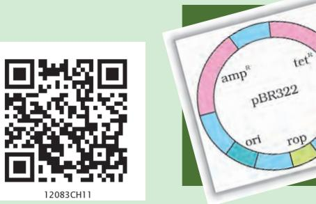
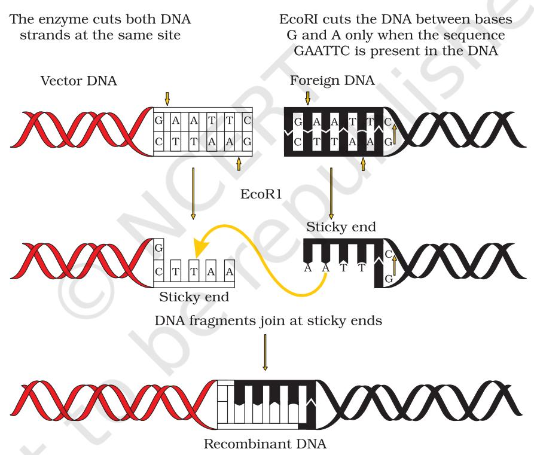
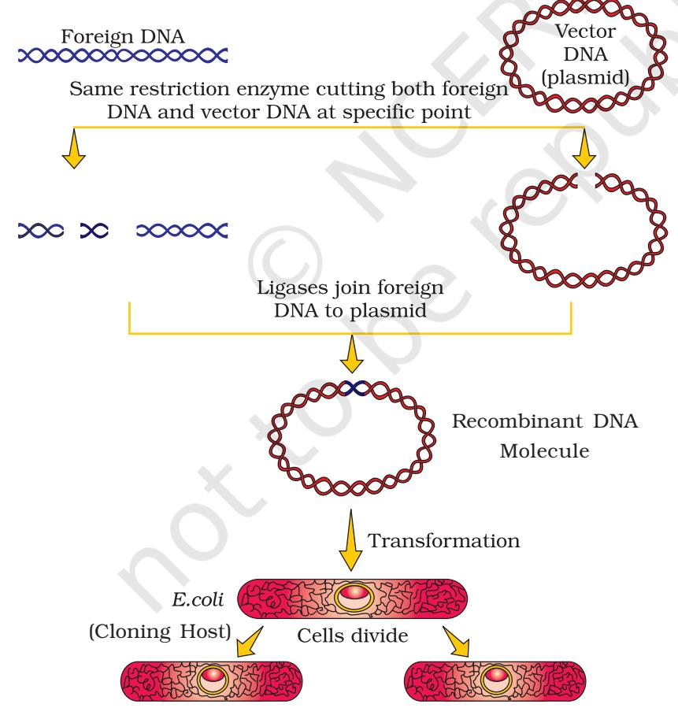
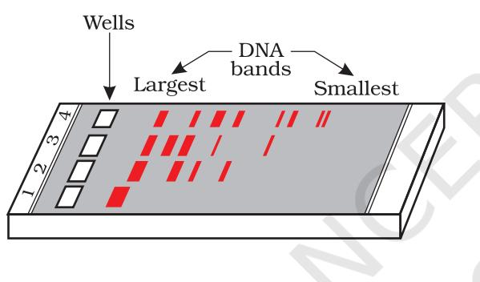
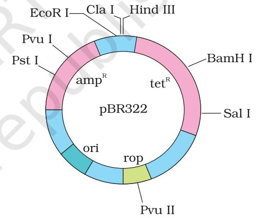
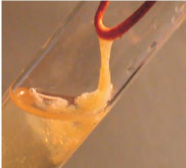
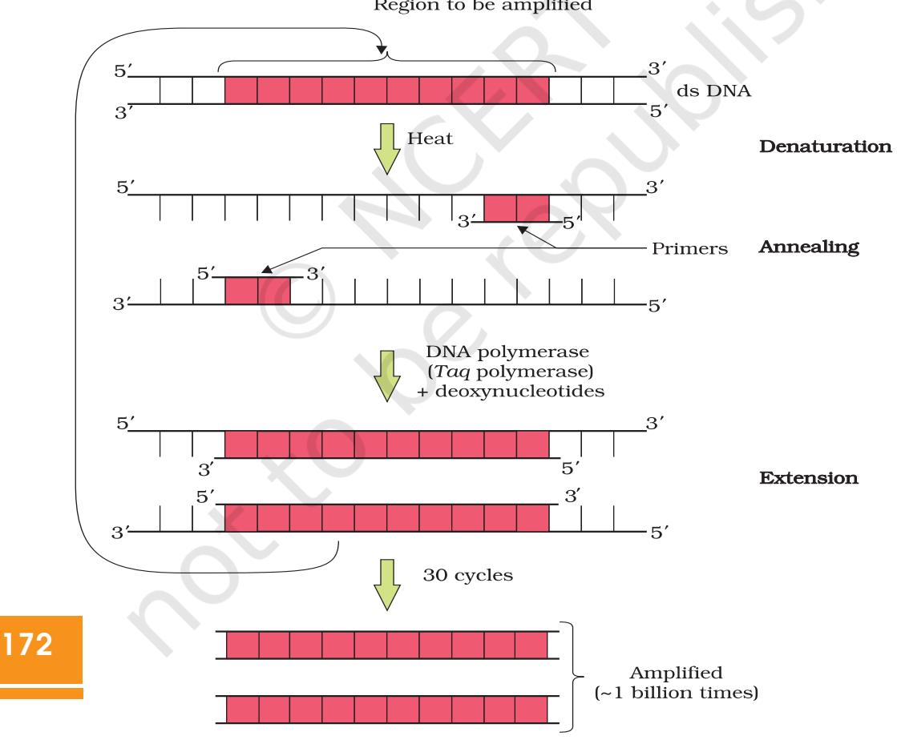
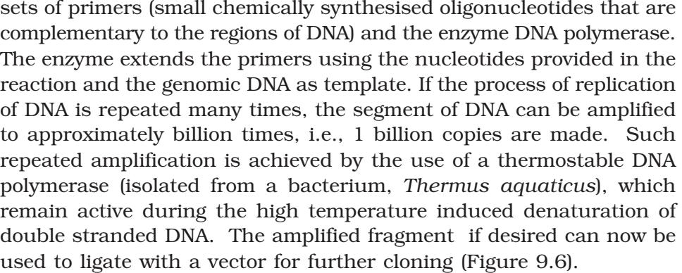
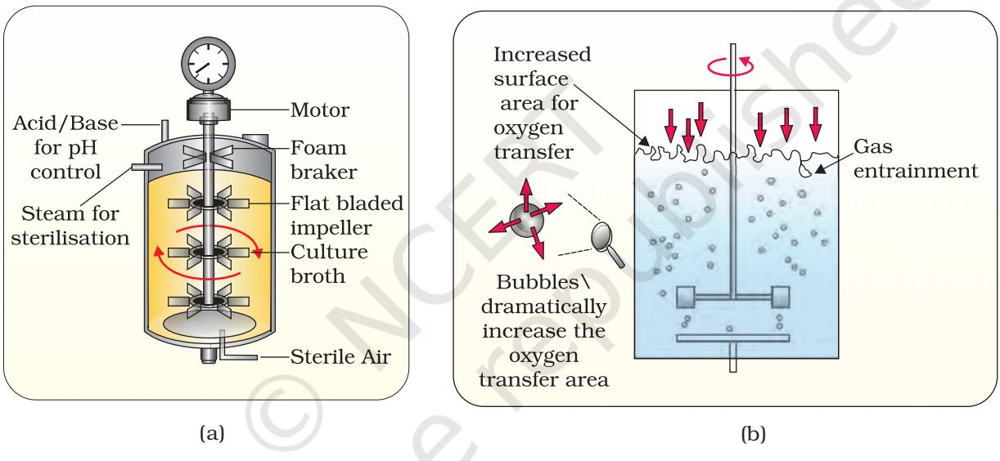

#### Chapter 9

Biotechnology : Principles and Processes

Chapter 10 Biotechnology and Its Applications

Ever since the days of Rene Descartes, the French philosopher, mathematician and biologist of seventeenth century, all human knowledge especially natural sciences were directed to develop technologies which add to the creature comforts of human lives, as also value to human life. The whole approach to understanding natural phenomena became anthropocentric. Physics and chemistry gave rise to engineering, technologies and industries which all worked for human comfort and welfare. The major utility of the biological world is as a source of food. Biotechnology, the twentieth century off-shoot of modern biology, changed our daily life as its products brought qualitative improvement in health and food production. The basic principles underlying biotechnological processes and some applications are highlighted and discussed in this unit.

HERBERT BOYER (1936 )

Herbert Boyer was born in 1936 and brought up in a corner of western Pennsylvania where railroads and mines were the destiny of most young men. He completed graduate work at the University of Pittsburgh, in 1963, followed by three years of post-graduate studies at Yale.

In 1966, Boyer took over assistant professorship at the University of California at San Francisco. By 1969, he performed studies on a couple of restriction enzymes of the E. coli bacterium with especially useful properties. Boyer observed that these enzymes have the capability of cutting DNA strands in a particular fashion, which left what has became known as 'sticky ends' on the strands. These clipped ends made pasting together pieces of DNA a precise exercise.

This discovery, in turn, led to a rich and rewarding conversation in Hawaii with a Stanford scientist named Stanley Cohen. Cohen had been studying small ringlets of DNA called plasmids and which float about freely in the cytoplasm of certain bacterial cells and replicate independently from the coding strand of DNA. Cohen had developed a method of removing these plasmids from the cell and then reinserting them in other cells. Combining this process with that of DNA splicing enabled Boyer and Cohen to recombine segments of DNA in desired configurations and insert the DNA in bacterial cells, which could then act as manufacturing plants for specific proteins. This breakthrough was the basis upon which the discipline of biotechnology was founded.

# CHAPTER 9

# BIOTECHNOLOGY : PRINCIPLES AND PROCESSES

- *9.1 Principles of Biotechnology*
- *9.2 Tools of Recombinant DNA Technology*
- *9.3 Processes of Recombinant DNA Technology*

Biotechnology deals with techniques of using live organisms or enzymes from organisms to produce products and processes useful to humans. In this sense, making curd, bread or wine, which are all microbe-mediated processes, could also be thought as a form of biotechnology. However, it is used in a restricted sense today, to refer to such of those processes which use genetically modified organisms to achieve the same on a larger scale. Further, many other processes/techniques are also included under biotechnology. For example, *in vitro* fertilisation leading to a 'test-tube' baby, synthesising a gene and using it, developing a DNA vaccine or correcting a defective gene, are all part of biotechnology.

The European Federation of Biotechnology (EFB) has given a definition of biotechnology that encompasses both traditional view and modern molecular biotechnology. The definition given by EFB is as follows:

'The integration of natural science and organisms, cells, parts thereof, and molecular analogues for products and services'.

# 9.1 PRINCIPLES OF BIOTECHNOLOGY

Among many, the two core techniques that enabled birth of modern biotechnology are :

- (i) *Genetic engineering :* Techniques to alter the chemistry of genetic material (DNA and RNA),
to introduce these into host organisms and thus change the phenotype of the host organism.

- (ii) *Bioprocess engineering:* Maintenance of sterile (microbial contamination-free) ambience in chemical engineering processes to enable growth of only the desired microbe/eukaryotic cell in large quantities for the manufacture of biotechnological products like antibiotics, vaccines, enzymes, etc.
Let us now understand the conceptual development of the principles of genetic engineering.

You probably appreciate the advantages of sexual reproduction over asexual reproduction. The former provides opportunities for variations and formulation of unique combinations of genetic setup, some of which may be beneficial to the organism as well as the population. Asexual reproduction preserves the genetic information, while sexual reproduction permits variation. Traditional hybridisation procedures used in plant and animal breeding, very often lead to inclusion and multiplication of undesirable genes along with the desired genes. The techniques of genetic engineering which include creation of recombinant DNA, use of gene cloning and gene transfer, overcome this limitation and allows us to isolate and introduce only one or a set of desirable genes without introducing undesirable genes into the target organism.

Do you know the likely fate of a piece of DNA, which is somehow transferred into an alien organism? Most likely, this piece of DNA would not be able to multiply itself in the progeny cells of the organism. But, when it gets integrated into the genome of the recipient, it may multiply and be inherited along with the host DNA. This is because the alien piece of DNA has become part of a chromosome, which has the ability to replicate. In a chromosome there is a specific DNA sequence called the origin of replication, which is responsible for initiating replication. Therefore, for the multiplication of any alien piece of DNA in an organism it needs to be a part of a chromosome(s) which has a specific sequence known as 'origin of replication'. Thus, an alien DNA is linked with the origin of replication, so that, this alien piece of DNA can replicate and multiply itself in the host organism. This can also be called as cloning or making multiple identical copies of any template DNA.

Let us now focus on the first instance of the construction of an artificial recombinant DNA molecule. The construction of the first recombinant DNA emerged from the possibility of linking a gene encoding antibiotic resistance with a native plasmid (autonomously replicating circular extra-chromosomal DNA) of *Salmonella typhimurium*. Stanley Cohen and Herbert Boyer accomplished this in 1972 by isolating the antibiotic resistance gene by cutting out a piece of DNA from a plasmid which was responsible for conferring antibiotic resistance. The cutting of DNA at specific locations became possible with the discovery of the so-called 'molecular scissors'– restriction enzymes. The cut piece of DNA was then linked with the plasmid DNA. These plasmid DNA act as vectors to transfer the piece of DNA attached to it. You probably know that mosquito acts as an insect vector to transfer the malarial parasite into human body. In the same way, a plasmid can be used as vector to deliver an alien piece of DNA into the host organism. The linking of antibiotic resistance gene with the plasmid vector became possible with the enzyme DNA ligase, which acts on cut DNA molecules and joins their ends. This makes a new combination of circular autonomously replicating DNA created *in vitro* and is known as recombinant DNA. When this DNA is transferred into *Escherichia coli*, a bacterium closely related to *Salmonella,* it could replicate using the new host's DNA polymerase enzyme and make multiple copies. The ability to multiply copies of antibiotic resistance gene in *E. coli* was called cloning of antibiotic resistance gene in *E. coli*.

You can hence infer that there are three basic steps in genetically modifying an organism —

- (i) identification of DNA with desirable genes;
- (ii) introduction of the identified DNA into the host;
- (iii) maintenance of introduced DNA in the host and transfer of the DNA to its progeny.

# 9.2 TOOLS OF RECOMBINANT DNA TECHNOLOGY

Now we know from the foregoing discussion that genetic engineering or recombinant DNA technology can be accomplished only if we have the key tools, i.e., restriction enzymes, polymerase enzymes, ligases, vectors and the host organism. Let us try to understand some of these in detail.

#### 9.2.1 Restriction Enzymes

In the year 1963, the two enzymes responsible for restricting the growth of bacteriophage in *Escherichia coli* were isolated. One of these added methyl groups to DNA, while the other cut DNA. The later was called restriction endonuclease*.*

The first restriction endonuclease–*Hind II*, whose functioning depended on a specific DNA nucleotide sequence was isolated and characterised five years later. It was found that *Hind II* always cut DNA molecules at a particular point by recognising a specific sequence of six base pairs. This specific base sequence is known as the recognition sequence for *Hind II*. Besides *Hind II*, today we know more than 900 restriction enzymes that have been isolated from over 230 strains of bacteria each of which recognise different recognition sequences.

The convention for naming these enzymes is the first letter of the name comes from the genus and the second two letters come from the species of the prokaryotic cell from which they were isolated, e.g., EcoRI comes from *E*s*cherichia coli* RY 13. In EcoRI, the letter 'R' is derived from the name of

strain. Roman numbers following the names indicate the order in which the enzymes were isolated from that strain of bacteria.

Restriction enzymes belong to a larger class of enzymes called nucleases. These are of two kinds; exonucleases and endonucleases. Exonucleases remove nucleotides from the ends of the DNA whereas, endonucleases make cuts at specific positions within the DNA.

Each restriction endonuclease functions by 'inspecting' the length of a DNA sequence. Once it finds its specific recognition sequence, it will bind to the DNA and cut each of the two strands of the double helix at specific points in their sugar -phosphate backbones (Figure 9.1). Each restriction endonuclease recognises a specific palindromic nucleotide sequences in the DNA.

- Figure 9.1 Steps in formation of recombinant DNA by action of restriction endonuclease enzyme - EcoRI
# 166

Do you know what palindromes are? These are groups of letters that form the same words when read both forward and backward, e.g., "MALAYALAM". As against a word-palindrome where the same word is read in both directions, the palindrome in DNA is a sequence of base pairs that reads same on the two strands when orientation of

reading is kept the same. For example, the following sequences reads the same on the two strands in 5*'* à 3*'* direction. This is also true if read in the 3*'* à 5*'* direction.

5*'* —— GAATTC —— 3*'* 3*'* —— CTTAAG —— 5*'*

Restriction enzymes cut the strand of DNA a little away from the centre of the palindrome sites, but between the same two bases on the opposite strands. This leaves single stranded portions at the ends. There are overhanging stretches called sticky ends on each strand (Figure 9.1). These are named so because they form hydrogen bonds with their complementary cut counterparts. This stickiness of the ends facilitates the action of the enzyme DNA ligase.

Restriction endonucleases are used in genetic engineering to form 'recombinant' molecules of DNA, which are composed of DNA from different sources/genomes.

When cut by the same restriction enzyme, the resultant DNA fragments have the same kind of 'sticky-ends' and, these can be joined together (end-to-end) using DNA ligases (Figure 9.2).

167

You may have realised that normally, unless one cuts the vector and the source DNA with the same restriction enzyme, the recombinant vector molecule cannot be created.

Separation and isolation of DNA fragments : The cutting of DNA by restriction endonucleases results in the fragments of DNA. These fragments can be separated by a technique known as gel electrophoresis. Since DNA fragments are negatively charged molecules they can be separated by forcing them to move towards the anode under an electric field through a medium/matrix. Nowadays the most commonly used matrix is agarose which is a natural polymer extracted from sea weeds. The DNA fragments separate (resolve) according to their size through sieving effect provided by the agarose gel. Hence, the smaller the fragment size, the farther it moves. *Look at the Figure 9.3 and guess at which end of the gel the sample was loaded.*

Figure 9.3 A typical agarose gel electrophoresis showing migration of undigested (lane 1) and digested set of DNA fragments (lane 2 to 4)

The separated DNA fragments can be visualised only after staining the DNA with a compound known as ethidium bromide followed by exposure to UV radiation (you cannot see pure DNA fragments in the visible light and without staining). You can see bright orange coloured bands of DNA in a ethidium bromide stained gel exposed to UV light (Figure 9.3). The separated bands of DNA are cut out from the agarose gel and extracted from the gel piece. This step is known as elution. The DNA fragments purified in this way are used in constructing recombinant DNA by joining them with cloning vectors.

# 9.2.2 Cloning Vectors

You know that plasmids and bacteriophages have the ability to replicate within bacterial cells independent of the control of chromosomal DNA. Bacteriophages because of their high number per cell, have very high copy numbers of their genome within the bacterial cells. Some plasmids may have only one or two copies per cell whereas others may have 15-100 copies per cell. Their numbers can go even higher. If we are able to link an alien piece of DNA with bacteriophage or plasmid DNA, we can multiply its numbers equal to the copy number of the plasmid or bacteriophage. Vectors used at present, are engineered in such a way that they help easy linking of foreign DNA and selection of recombinants from non-recombinants.

168

The following are the features that are required to facilitate cloning into a vector.

- (i) *Origin of replication (ori) :* This is a sequence from where replication starts and any piece of DNA when linked to this sequence can be made to replicate within the host cells. This sequence is also responsible for controlling the copy number of the linked DNA. So, if one wants to recover many copies of the target DNA it should be cloned in a vector whose origin support high copy number.
- (ii) *Selectable marker :* In addition to 'ori', the vector requires a selectable marker, which helps in identifying and eliminating nontransformants and selectively permitting the growth of the transformants. Transformation is a procedure through which a piece of DNA is introduced in a host bacterium (you will study the process in subsequent section). Normally, the genes encoding resistance to antibiotics such as ampicillin, chloramphenicol, tetracycline or kanamycin, etc., are considered useful selectable markers for *E. coli.* The normal *E. coli* cells do not carry resistance against any of these antibiotics.
- (iii) *Cloning sites:* In order to link the alien DNA, the vector needs to have very few, preferably single, recognition sites for the commonly used restriction enzymes. Presence of more than one recognition sites within the vector will generate several fragments, which will complicate the gene cloning (Figure 9.4). The ligation of alien DNA is carried out at a restriction site present in one of the two antibiotic resistance genes. For example, you can ligate a foreign DNA at the BamH I site of tetracycline resistance gene in the vector pBR322. The recombinant plasmids will lose tetracycline resistance due to insertion of foreign DNA but can still be selected out from non-recombinant ones by plating the transformants on

tetracycline containing medium. The transformants growing on ampicillin containing medium are then transferred on a medium containing tetracycline. The recombinants will grow in ampicillin containing medium but not on that containing tetracycline. But, non- recombinants will grow on the medium containing both the antibiotics. In this case, one antibiotic resistance gene helps in selecting the transformants, whereas the other antibiotic resistance

- Figure 9.4 *E. coli* cloning vector pBR322 showing restriction sites (*Hind* III, *Eco*R I, *Bam*H I, *Sa*l I, *Pvu* II, *Pst* I, *Cla* I), ori and antibiotic resistance genes (ampR and tetR ). rop codes for the proteins involved in the replication of the plasmid.
# 169

gene gets 'inactivated due to insertion' of alien DNA, and helps in selection of recombinants.

Selection of recombinants due to inactivation of antibiotics is a cumbersome procedure because it requires simultaneous plating on two plates having different antibiotics. Therefore, alternative selectable markers have been developed which differentiate recombinants from non-recombinants on the basis of their ability to produce colour in the presence of a chromogenic substrate. In this, a recombinant DNA is inserted within the coding sequence of an enzyme, β-galactosidase. This results into inactivation of the gene for synthesis of this enzyme, which is referred to as insertional inactivation. The presence of a chromogenic substrate gives blue coloured colonies if the plasmid in the bacteria does not have an insert. Presence of insert results into insertional inactivation of the β-galactosidase gene and the colonies do not produce any colour, these are identified as recombinant colonies.

- (iv) *Vectors for cloning genes in plants and animals :* You may be surprised to know that we have learnt the lesson of transferring genes into plants and animals from bacteria and viruses which have known this for ages – how to deliver genes to transform eukaryotic cells and force them to do what the bacteria or viruses want. For example, *Agrobacterium tumifaciens*, a pathogen of several dicot plants is able to deliver a piece of DNA known as 'T-DNA' to transform normal plant cells into a tumor and direct these tumor cells to produce the chemicals required by the pathogen. Similarly, retroviruses in animals have the ability to transform normal cells into cancerous cells. A better understanding of the art of delivering genes by pathogens in their eukaryotic hosts has generated knowledge to transform these tools of pathogens into useful vectors for delivering genes of interest to humans. The tumor inducing (Ti) plasmid of *Agrobacterium tumifaciens* has now been modified into a cloning vector which is no more pathogenic to the plants but is still able to use the mechanisms to deliver genes of our interest into a variety of plants. Similarly, retroviruses have also been disarmed and are now used to deliver desirable genes into animal cells. So, once a gene or a DNA fragment has been ligated into a suitable vector it is transferred into a bacterial, plant or animal host (where it multiplies).
#### 9.2.3 Competent Host (For Transformation with Recombinant DNA)

Since DNA is a hydrophilic molecule, it cannot pass through cell membranes. *Why*? In order to force bacteria to take up the plasmid, the bacterial cells must first be made 'competent' to take up DNA. This is done by treating them with a specific concentration of a divalent cation, such as calcium, which increases the efficiency with which DNA enters

170

the bacterium through pores in its cell wall. Recombinant DNA can then be forced into such cells by incubating the cells with recombinant DNA on ice, followed by placing them briefly at 420C (heat shock), and then putting them back on ice. This enables the bacteria to take up the recombinant DNA.

This is not the only way to introduce alien DNA into host cells. In a method known as micro-injection, recombinant DNA is directly injected into the nucleus of an animal cell. In another method, suitable for plants, cells are bombarded with high velocity micro-particles of gold or tungsten coated with DNA in a method known as biolistics or gene gun. And the last method uses 'disarmed pathogen' vectors, which when allowed to infect the cell, transfer the recombinant DNA into the host.

Now that we have learnt about the tools for constructing recombinant DNA, let us discuss the processes facilitating recombinant DNA technology.

# 9.3 PROCESSES OF RECOMBINANT DNA TECHNOLOGY

Recombinant DNA technology involves several steps in specific sequence such as isolation of DNA, fragmentation of DNA by restriction endonucleases, isolation of a desired DNA fragment, ligation of the DNA fragment into a vector, transferring the recombinant DNA into the host, culturing the host cells in a medium at large scale and extraction of the desired product. Let us examine each of these steps in some details.

## 9.3.1 Isolation of the Genetic Material (DNA)

Recall that nucleic acid is the genetic material of all organisms without exception. In majority of organisms this is deoxyribonucleic acid or DNA. In order to cut the DNA with restriction enzymes, it needs to be in pure form, free from other macro-molecules. Since the DNA is enclosed within the membranes, we have to break the cell open to release DNA along with other macromolecules such as RNA, proteins, polysaccharides and also lipids. This can be achieved by treating the bacterial cells/plant or animal tissue with enzymes such as lysozyme (bacteria), cellulase (plant cells), chitinase (fungus). You know that genes are located on long molecules of DNA

interwined with proteins such as histones. The RNA can be removed by treatment with ribonuclease whereas proteins can be removed by treatment with protease. Other molecules can be removed by appropriate treatments and purified DNA ultimately precipitates out after the addition of chilled ethanol. This can be seen as collection of fine threads in the suspension (Figure 9.5).

Figure 9.5 DNA that separates out can be removed by spooling

171

### 9.3.2 Cutting of DNA at Specific Locations

Restriction enzyme digestions are performed by incubating purified DNA molecules with the restriction enzyme, at the optimal conditions for that specific enzyme. Agarose gel electrophoresis is employed to check the progression of a restriction enzyme digestion. DNA is a negatively charged molecule, hence it moves towards the positive electrode (anode) (Figure 9.3). The process is repeated with the vector DNA also.

The joining of DNA involves several processes. After having cut the source DNA as well as the vector DNA with a specific restriction enzyme, the cut out 'gene of interest' from the source DNA and the cut vector with space are mixed and ligase is added. This results in the preparation of recombinant DNA.

### 9.3.3 Amplification of Gene of Interest using PCR

PCR stands for Polymerase Chain Reaction. In this reaction, multiple copies of the gene (or DNA) of interest is synthesised *in vitro* using two

Figure 9.6 Polymerase chain reaction (PCR) : Each cycle has three steps: (i) Denaturation; (ii) Primer annealing; and (iii) Extension of primers

#### 9.3.4 Insertion of Recombinant DNA into the Host Cell/Organism

There are several methods of introducing the ligated DNA into recipient cells. Recipient cells after making them 'competent' to receive, take up DNA present in its surrounding. So, if a recombinant DNA bearing gene for resistance to an antibiotic (e.g., ampicillin) is transferred into *E. coli* cells, the host cells become transformed into ampicillin-resistant cells. If we spread the transformed cells on agar plates containing ampicillin, only transformants will grow, untransformed recipient cells will die. Since, due to ampicillin resistance gene, one is able to select a transformed cell in the presence of ampicillin. The ampicillin resistance gene in this case is called a selectable marker.

#### 9.3.5 Obtaining the Foreign Gene Product

When you insert a piece of alien DNA into a cloning vector and transfer it into a bacterial, plant or animal cell, the alien DNA gets multiplied. In almost all recombinant technologies, the ultimate aim is to produce a desirable protein. Hence, there is a need for the recombinant DNA to be expressed. The foreign gene gets expressed under appropriate conditions. The expression of foreign genes in host cells involve understanding many technical details.

After having cloned the gene of interest and having optimised the conditions to induce the expression of the target protein, one has to consider producing it on a large scale. *Can you think of any reason why there is a need for large-scale production*? If any protein encoding gene is expressed in a heterologous host, it is called a recombinant protein. The cells harbouring cloned genes of interest may be grown on a small scale in the laboratory. The cultures may be used for extracting the desired protein and then purifying it by using different separation techniques.

The cells can also be multiplied in a continuous culture system wherein the used medium is drained out from one side while fresh medium is added from the other to maintain the cells in their physiologically most active log/exponential phase. This type of culturing method produces a larger biomass leading to higher yields of desired protein.

Small volume cultures cannot yield appreciable quantities of products. To produce in large quantities, the development of bioreactors, where large volumes (100-1000 litres) of culture can be processed, was required. Thus, bioreactors can be thought of as vessels in which raw materials are biologically converted into specific products, individual enzymes, etc., using microbial plant, animal or human cells. A bioreactor provides the optimal conditions for achieving the desired product by providing optimum growth conditions (temperature, pH, substrate, salts, vitamins, oxygen).

The most commonly used bioreactors are of stirring type, which are shown in Figure 9.7.

Figure 9.7 (a) Simple stirred-tank bioreactor; (b) Sparged stirred-tank bioreactor through which sterile air bubbles are sparged

A stirred-tank reactor is usually cylindrical or with a curved base to facilitate the mixing of the reactor contents. The stirrer facilitates even mixing and oxygen availability throughout the bioreactor. Alternatively air can be bubbled through the reactor. If you look at the figure closely you will see that the bioreactor has an agitator system, an oxygen delivery system and a foam control system, a temperature control system, pH control system and sampling ports so that small volumes of the culture can be withdrawn periodically.

#### 9.3.6 Downstream Processing

After completion of the biosynthetic stage, the product has to be subjected through a series of processes before it is ready for marketing as a finished

# 174

product. The processes include separation and purification, which are collectively referred to as downstream processing. The product has to be formulated with suitable preservatives. Such formulation has to undergo thorough clinical trials as in case of drugs. Strict quality control testing for each product is also required. The downstream processing and quality control testing vary from product to product.

### SUMMARY

Biotechnology deals with large scale production and marketing of products and processes using live organisms, cells or enzymes. Modern biotechnology using genetically modified organisms was made possible only when man learnt to alter the chemistry of DNA and construct recombinant DNA. This key process is called recombinant DNA technology or genetic engineering. This process involves the use of restriction endonucleases, DNA ligase, appropriate plasmid or viral vectors to isolate and ferry the foreign DNA into host organisms, expression of the foreign gene, purification of the gene product, i.e., the functional protein and finally making a suitable formulation for marketing. Large scale production involves use of bioreactors.

# EXERCISES

- 1. Can you list 10 recombinant proteins which are used in medical practice? Find out where they are used as therapeutics (use the internet).
- 2. Make a chart (with diagrammatic representation) showing a restriction enzyme, the substrate DNA on which it acts, the site at which it cuts DNA and the product it produces.
- 3. From what you have learnt, can you tell whether enzymes are bigger or DNA is bigger in molecular size? How did you know?
- 4. What would be the molar concentration of human DNA in a human cell? Consult your teacher.
- 5. Do eukaryotic cells have restriction endonucleases? Justify your answer.
- 6. Besides better aeration and mixing properties, what other advantages do stirred tank bioreactors have over shake flasks?
- 7. Collect 5 examples of palindromic DNA sequences by consulting your teacher. Better try to create a palindromic sequence by following base-pair rules.
- 8. Can you recall meiosis and indicate at what stage a recombinant DNA is made?
- 9. Can you think and answer how a reporter enzyme can be used to monitor transformation of host cells by foreign DNA in addition to a selectable marker?
- 10. Describe briefly the following:
	- (a) Origin of replication
	- (b) Bioreactors
	- (c) Downstream processing
- 11. Explain briefly
	- (a) PCR
	- (b) Restriction enzymes and DNA
	- (c) Chitinase
- 12. Discuss with your teacher and find out how to distinguish between (a) Plasmid DNA and Chromosomal DNA
	- (b) RNA and DNA
	- (c) Exonuclease and Endonuclease

176

