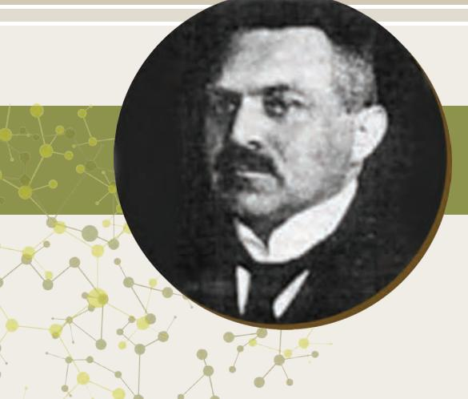
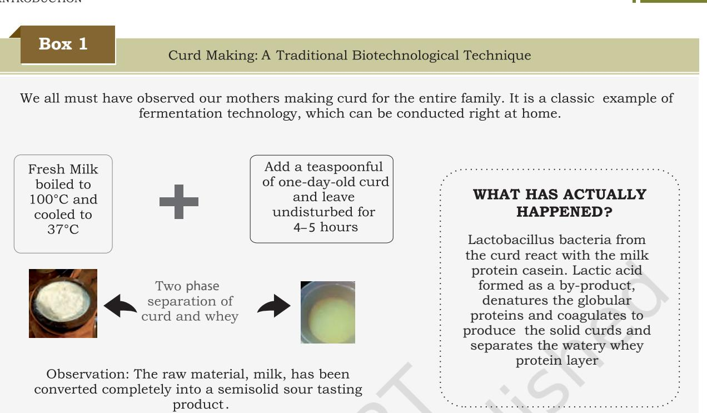
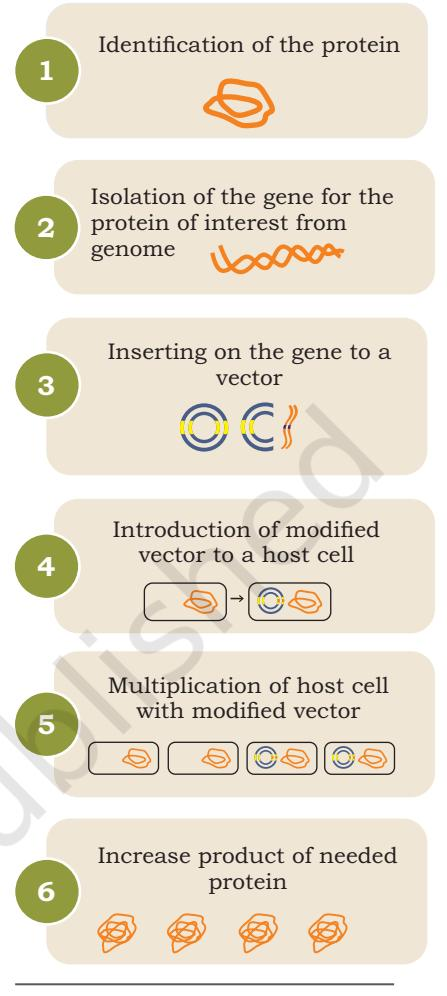
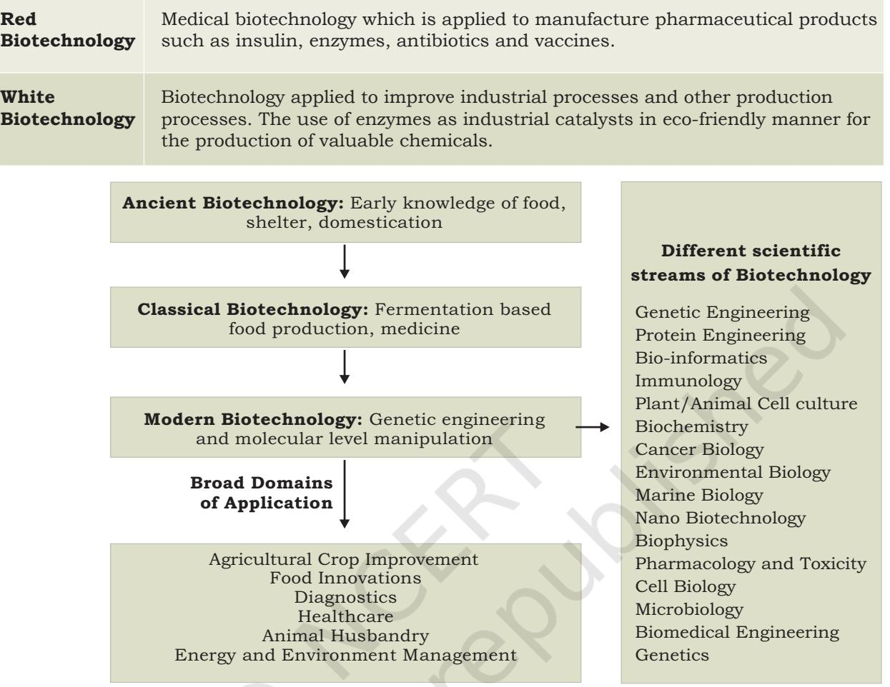
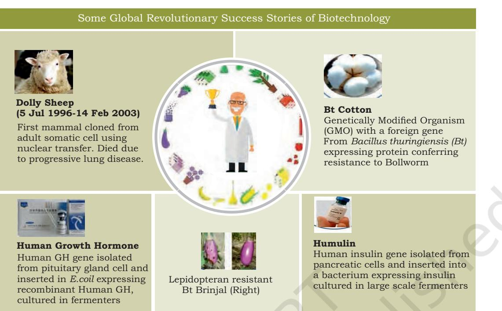
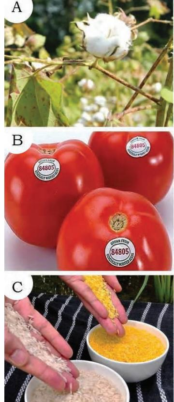

## **Chapter 1:** Introduction

# **An Introduction to Biotechnology Unit I**

Knowledge of natural sciences has been applied to develop technologies since long for the welfare and comfort of human beings. It has also contributed to enhance the value of human lives. Research in the fields of physics and chemistry gave rise to engineering and technology industries. Among the many fields of science is a broad area of biology called Biotechnology, which has now expanded to diverse fields such as genetics, immunology, agriculture, genomics, etc. This unit provides a comprehensive description to develop the understanding of early history of biotechnology along with the recent developments in this field.

Chapter 1.indd 1 11/14/2019 10:09:45 AM

## **Karl Ereky (1878-1952)**

The term biotechnology was coined by Karl Ereky, a Hungarian scientist, in his book entitled *Biotechnologie der Fleish-, Fett-und Milcherzeugung im landwirtschaftlichen Grossbetriebe* (Biotechnology of Meat, Fat and Milk Production in an Agriculture Large-scale Farm) in 1917.

In his book, he described how technology could be used to transform plants and animals into useful products.

Chapter 1.indd 2 11/14/2019 10:09:47 AM

## **Chapter 1 Introduction**

- *1.1 Historical Perspectives*
- *1.2 Applications of Modern Biotechnology*
- *1.3 Biotechnology in India: Academic Prospects and Industrial Scenario*

Biotechnology, the term, is a combination of two words 'bio' and 'technology', — 'bio' means biological systems or processes, and 'technology' refers to methods, systems, and devices used to make useful products from these biological systems. Thus, biotechnology refers to the different technologies that make use of living cells and/ or biological molecules to generate useful products for the benefit of mankind.

Mankind has been practicing biotechnology since long. Right from the domestication of sheep and cattle in the Paleolithic age, conservation of plant stocks by the early Egyptian farmers (ancient germplasm conservation), to the classical examples of early fermentation technology in the form of making bread, cheese and wine. However, modern biotechnology is a multidisciplinary subject which involves knowledge sharing between different areas of science such as Cell and Molecular Biology, Microbiology, Genetics, Anatomy and Physiology, Biochemistry, Computer Science and Recombinant DNA technology (rDNA technology).

Chapter 1.indd 3 11/14/2019 10:09:47 AM

This chapter will elaborate on the history of biotechnological practices and the development of the modern concepts; major applications of biotechnology in the field of medicine, agriculture, food and environment conservation as well as the current scenario of the Indian biotechnology sector.

## **1.1 Historical Perspectives**

4

**Ancient biotechnology** had taken root as early as in the Paleolithic era, around 10,000 years ago, when early farmers began to cultivate crops such as wheat and barley. Civilisations prevalent in the Sahara region of Africa were successfully domesticating sheep, goat and cattle, and were familiar with the techniques of hunting and the potential uses of fire. People collected the seeds of wild plants for cultivation and domesticated some species of wild animals living around them, executing, what is now known as 'selective breeding'. However, the most classical example of biotechnology in the medieval times is the use of fermentation technology for production of bread, cheese, wine and beer.

Science and traditional knowledge have always gone hand-in-hand in order to produce beneficial results. Greater efforts are being made to document and utilise the Indian traditional knowledge of medicine and biotechnology. People of ancient India had immense knowledge of their environment and properties of plants and animals. The practice of making fermented food such as *dahi*, *idli*, *kinema* and beverages using local biological resources was common in medieval India. The relevance of traditional Indian knowledge in making curd (*dahi*) has been indicated in few of the patents found in the United States patent database. Preparation of curd is given in Box 1.

Fermentation can be explained as a microbial process in which enzymatically-controlled conversion of organic compounds occurs. Fermentation was practiced for years without any actual knowledge of the processes involved. Fermented dough was discovered by accident when dough was not baked immediately and consequently it underwent fermentation by yeast such as *Saccharomyces winlocki*. Egypt and Mesopotamia exported bread to Greece and Rome. In efforts to improve the technique, Baker's Yeast was discovered by the Romans, which revolutionised the

Chapter 1.indd 4 11/14/2019 10:09:47 AM

5

bread-making technology prevalent then. The Chinese were also using fermentation technology by 4000 B.C., for production of their traditional food items, such as soy sauces and fermented vegetables. Vinegar production was known to the Egyptians by 2000 B.C., by preserving crushed dates for a longer time. The art of preserving animal foods by drying, smoking, and pickling in the brine were popular in pre-historic East and Europe.

Beer making may have begun as early as between 6000 and 5000 B.C. using cereal grains such as sorghum, corn, rice, millet, and wheat. Brewing was considered as an art until the fourteenth century A.D. However, early brewers had no practical knowledge about the microbial basis of fermentation. Wine was probably made by accident, when grape juice was contaminated with yeast and other microbes. Between 1850s and 1860s, Louis Pasteur established that yeast and other microbes were responsible for fermentation.

Nineteenth century witnessed an increase in the production scale of fermentation based products such as glycerol, acetone, butanol, lactic acid, citric acid, etc. Industrial fermentation was established during World War I because of Germany's requirement for large amounts of glycerol for explosives. By 1940's, significant

Chapter 1.indd 5 11/14/2019 10:09:48 AM

improvement was made to techniques involving sterility maintenance, aeration methods, product isolation and purification. World War II was the catalyst which led to the invention of the modern fermenter (vessels used for fermentation), also called bioreactor for mass production of antibiotic penicillin. Today, many chemicals such as antibiotics, amino acids, hormones, pigments and even enzymes are produced with extreme precision in controlled environments of industrial bioreactors.

6

The foundation of modern biotechnology were laid down with the advancements in science and technology during the eighteenth and nineteenth centuries. Thus with the advent of the first compound microscope, made by Dutch spectacle-maker Zacharias Janssen in 1590, which could magnify about 3×-9×, enabled humans to 'see' things that were not perceived by naked eye.

In 1665, Robert Hooke, a physicist, examined thinly sliced cork and drew rectangular components, which he called *cellulae* (Latin for 'small chambers'). In 1676, Antonie van Leeuwenhoek, a Dutch shopkeeper, saw living organisms in pond water and called them 'animalcules'. During the eighteenth century, the cell theory was developed by German biologists, Matthias Schleiden and Theodor Schwann, who determined that all plant and animal tissues were composed of cells. In 1858, Rudolf Virchow, a German pathologist, concluded that 'all cells arise from pre-existing cells' and that cell is the basic unit of life.

Between 1850 and 1880, Pasteur developed the process of pasteurisation. By 1860, he also concluded that spontaneous generation of organisms did not occur, proving that 'all cells arise from pre-existing cells'. In 1896 Eduard Buchner converted sugar to ethyl alcohol using yeast extracts, showing that biochemical transformations can occur without the use of cells. By 1920s and 1930s, the biochemical reactions of many important metabolic pathways were established.

Genetics and Principles of Heredity was developed by an Austrian monk named Gregor Mendel, beginning in 1857, when he cross-pollinated pea plants to examine traits such as petal color, seed color, and seed texture. In 1869, Johann Friedrich Miescher, a

Chapter 1.indd 6 11/14/2019 10:09:48 AM

Swiss biochemist, isolated a substance that he called nuclein from the nuclei of white blood cells. The substance contained nucleic acids. In 1882, German cytologist Walter Flemming described thread-like bodies that were visible during cell division, as well as the equal distribution of this material to daughter cells. These thread like bodies were actually chromosomes dividing between the two daughter cells during mitosis.

Many path breaking experiments were conducted during the twentieth century which established the nature of the gene and the chromosome, most important being identification of DNA as the genetic material by the classical Alfred Hershey and Martha Chase experiment in 1952. James Watson and Francis Crick proposed the double helical structure of DNA in 1953. Many experiments followed that determined how the information in the gene is used, such as the manipulation of enzymes involved in DNA replication, and DNA repair.

Modern biotechnology is based on the rDNA technology that has revolutionised biotechnology by allowing scientists to cut and join different pieces of DNA, and place the new recombinant (Chimeric/ hybrid) DNA into a new host (Fig. 1.1). It allows the transfer of gene(s) from one organism to another conferring a novel property. This has revolutionised the age old process of biotechnology with regards to its precision and efficiency with limitless possibilities. Since the advent of rDNA technology, biotechnology has become more advanced and led to advancements in medicine, agriculture, animal science and environmental science. The multi-disciplinary nature of modern biotechnology and the areas of its application is given in Fig. 1.2 and Table 1.1.

7

*Fig. 1.1: Overview of modern biotechnology*

| Table 1.1: Some common names of areas covered under biotechnology |
| --- |

| Blue | Application of biotechnology for marine and freshwater organisms, which are |
| --- | --- |
| Biotechnology | used for increasing seafood supply, regulation of the reproduction of dangerous |
|  | water-borne organisms, and developing new drugs. |
| Green | Application of biotechnology for environment‑friendly solutions such as in |
| Biotechnology | plants to improve the nutritional quality, quantity and production of eco-friendly |
|  | products. The transgenic plants with improved traits are the examples of green |
|  | biotechnology. |

Chapter 1.indd 7 17-Aug-21 11:39:45 AM

8

## **1.2 Applications of Modern Biotechnology**

Modern biotechnology, which is based on rDNA technology, exhibits a wide range of applications. The broad application areas of biotechnology include pharmaceutical and therapeutic research, disease diagnostics, crop improvement, vegetable oil, biofuels, and development of enviromental friendly products (for example biodegradable plastics). Some classic examples of successful application of biotechnology is provided in Fig. 1.3. Thus, the applications of modern biotechnology mainly focus on the following major areas:

- 1. Medicine and health care
- 2. Crop production and agriculture
- 3. Food processing
- 4. Environmental protection

Chapter 1.indd 8 11/14/2019 10:09:48 AM

9

*Fig. 1.3: Some classic examples of successful applications of biotechnology*

## **1.2.1 Medicine and health care**

Biotechnology techniques are used in the field of medicine for diagnosis via development of diagnostic tools and kits, which have proved helpful in detecting certain molecules and cellular components which are expressed in diseased conditions. Using rDNA technology, tools of bioinformatics, modern instrumentation and bioprocess technologies, synthetic drug analogs can be predicted and possibly synthesised, which may show improved disease treatment. Production of vaccines and gene therapy are also important applications of biotechnology in the field of medicine.

Some of the major applications of modern biotechnology in the field of medicine are listed below:

- **• Production of important therapeutic molecules:**  rDNA technology has been successfully applied for the development of biopharmaceuticals with therapeutic value. Different protein molecules which may act as drug molecules, are being expressed in heterologous systems such as microorganisms, plants (transgenic plants explained in the following section) etc.
A number of therapeutic products including antibiotics and hormones have been produced using

Chapter 1.indd 9 11/14/2019 10:09:48 AM

rDNA technology which are available in the market. A common example of therapeutic protein produced using rDNA technology is human insulin, used for the treatment of diabetes, a disease in which blood sugar levels are elevated. This presents a classic example of a human protein being expressed in a heterologous system such as *Escherichia coli.* At present, insulin is being produced predominantly in *E. coli* and *Saccharomyces cerevisiae*. The human growth hormone is another example of successful production of desired proteins in different microbial host systems via rDNA technology. Many human proteins have also been expressed in milk of transgenic sheep and goat. For example, Food and Drug Administration, USA (FDA) has approved the production of blood anti-coagulant in milk of transgenic goats for human use.

Currently, scientists are trying to develop such drugs against diseases like hepatitis, cancer and heart diseases, which are the leading causes of human mortality.

- **• Gene therapy:** This technology is most helpful in the treatment of diseases caused by gene defects such as cystic fibrosis, thalassemia, Parkinson's disease, etc. Conceptualised in 1972, gene therapy involves delivery of required gene into a patient's cell as a drug to treat disease, so that it replaces the function of the defective gene. The first attempt, although unsuccessful, was performed by Martin Cline in 1980 for treating β-thalassemia. The first successful report of gene therapy was achieved in 1990 when, Ashanthi De Silva was treated for Adenosine Deaminase deficiency [also
called Adenosine Deaminase Severe Combined Immunodeficiency (ADA-SCID)] which is an autosomal recessive metabolic disorder that causes immunodeficiency. Russia approved Neovasculgen in 2011, as a first-in-class-gene therapy for peripheral artery disease.

- **• Genetic testing:** It is a type of medical test that helps in identifying the defects in an individual's genetic composition such as chromosomal defects in gene and protein expression anomalies. It helps in determining a person's chance of developing or passing on a specific disorder. Hundreds of genetic tests are currently in use
The first commercial gene therapy product approved for cancer treatment by China in 2003, was **Gendicine**.

10

Chapter 1.indd 10 11/14/2019 10:09:48 AM

and many are being developed. For example, genetic tests for phenylketonuria (patients lack enzyme needed to process the amino acid phenylalanine, which is responsible for normal growth) and congenital hypothyroidism (thyroid gland disorder) have been developed.

## **1.2.2 Crop Production and Agriculture**

Biotechnology has played a major role in revolutionising agriculture by facilitating genetic manipulations of important crop plants, to develop biotic and abiotic stress resistance plants, and better quality products of food in terms of nutrition and longer shelf lives. The five major traits used for crop improvement are insect resistance, herbicide resistance, virus resistance, delayed fruit ripening and nutritional enhancement. Thus, transgenic plants (Genetically Modified Organisms; GMOs) harbouring these improved traits are good examples of the application of biotechnology in agriculture.

Some examples describing the success stories of biotechnology are given below:

### Biotechnology for crop improvement

- Biotechnology, based on rDNA technology, has immense applications in crop improvement. Although conventional plant breeding techniques have made considerable progress in the development of improved varieties, they have not been able to keep pace with the increasing demand for food, vegetables and fruits. Use of rDNA technology has successfully led to the development of a number of transgenic plants exhibiting resistance to pathogens, salt, cold, herbicide, etc. In these transgenic plants, useful genes have been stably incorporated into the plant genome which resulted in the stable expression of targeted gene product.
- Among biotic stress resistant category, for example, virus-resistant plants have a viral coat protein gene which is overproduced that prevents the virus from reproducing in the host cell. Coat protein genes are involved in resistance against many viruses such as Papaya Ring Spot Virus, Cucumber Mosaic Virus, Tobacco Rattle Virus, and Potato Virus in these plants.
- Crop losses from insect pests also result in devastating financial loss of farmers and may lead to starvation in developing countries. Spraying chemical pesticides

Chapter 1.indd 11 11/14/2019 10:09:48 AM

12

*Fig . 1.3: Examples of some GM plants: (A) Bt Cotton (B) Flavr Savr Tomato and (C) Golden rice*

is costly and it leads to potential health hazards and may also pollute the environment. Genetically modified plants offering resistance to insect pathogen have been developed through rDNA technology. These plants help in bringing down or eliminating the application of chemical pesticides. One common example is Bt cotton. Bt is a toxic protein called Cry 1A(b), obtained from a soil bacterium called *Bacillus thuringiensis*, demonstrates insecticidal activity against larvae of moths and butterflies, beetles, cotton bollworms and caterpillars but are harmless to us. Thus, the gene coding for Bt toxin has been transferred and expressed in cotton. These transgenic cotton plants express Bt toxin which acts as insecticide (Fig. 1.3(A)). Similar to the Bt cotton, other plants including brinjal, corn (maize), potato, soybean, tomato, tobacco have also been developed expressing the Bt toxin.

- Among abiotic stress resistant plants, resistance against chilling has been introduced into tobacco plants by introducing gene for glycerol-1-phosphate acyl-transferase enzyme from *Arabidopsis.* Similarly, Roundup-ready soybeans (Transgenic/GM soybeans) have been developed which are unaffected by the herbicide glyphosate, and therefore can be applied in selective killing of competing weeds.
- Among the quality improvement category, a classic example is the development of Flavr Savr tomato. These tomatoes have extended shelf life due to delayed ripening (Fig. 1.3(B)).
- Biotechnological tools have also been extensively used to improve the nutritional quality of different food crops. A classic example is the Golden Rice, which has high beta-carotene content (the precursor for vitamin A production in the human body) (Fig. 1.3(C)). The name comes from the colour of the transgenic grain due to over expression of beta-carotene, responsible for golden coloration.

• The technique of plant tissue culture, i.e., culturing plant cells or tissues in artificial medium supplemented with required nutrients, has many applications in efficient clonal propagation (true to the type or similar) which may be difficult via conventional breeding methods. Many of the dry land legume species have been successfully regenerated from culture of

Chapter 1.indd 12 11/14/2019 10:09:49 AM

cotyledons, hypocotyls, leaf, ovary, protoplast, petiole root, anthers, etc. Haploid generation through anther/ pollen culture is recognised as another important area in crop improvement. Storage of horticultural crops with recalcitrant seeds or perennial crops may be maintained via plant cell culture, which is of great practical importance. These techniques have successfully been demonstrated in a number of horticultural crops and now there are various germplasm collection centers globally.

## Transgenic plants as systems for expression of therapeutics

Plants can also be used as heterologous systems for expression of a therapeutic molecule via expressing the required gene(s) into the plant using rDNA technology. An example is the production of antibiotics particularly for animal use in stock feed plants. Stock feed plants are plant species that may be given to cattle and livestock as a food source. Examples of such stock feed are bamboo, citronella, andropogon, foxtail millet, wheat grass, rice straw, etc. Stockfeeds capable of stably expressing the desired antibiotic may be fed directly to animals. This technique is less expensive than traditional antibiotic production and administration. However, this practice raises many bioethical issues, especially in the arena of human use, because of possible development of drug resistant bacterial strains due to antibiotic overuse.

Similarly, transgenic plants have been developed for production of **edible vaccines** by expressing antigenic proteins from pathogens into the edible parts of the plant, in a form that will retain its immunogenicity. Individuals are expected to be immunised by simply consuming such transgenic plants. Potato based vaccines against measles, cholera, Norfolk virus, etc., are under rigorous clinical trials.

#### Biofuels

These production can also be improved using biotechnology. These are produced through biological processes rather than a fuel produced by geological processes such as coal and petroleum. Biofuels can be derived directly from plants, or indirectly from agricultural, commercial and industrial wastes. Basically, it involves generation

Chapter 1.indd 13 11/14/2019 10:09:49 AM

of biomass that can be converted to convenient energycontaining substances via different ways such as thermal conversion, chemical conversion, and biochemical conversion. This biomass conversion can result in fuels which are in solid, liquid, or gas form. Major types are bioethanol or biologically generated alcohols produced via fermentation of sugar and starches by micro-organisms. **Bio-butanol**, a biofuel, is often a direct replacement for gasoline. Biodiesel is the most common biofuel in Europe, produced from oils or fats using trans-esterification. Feed stocks for biodiesel include animal fats, vegetable oils, soy, rapeseed, *Jatropha*, hemp, etc. Other examples are **bio-ethers** and **biogas**.

The first commercial-scale plants to produce biofuels from cellulose containing organic matter, have begun operating in the United States. In parts of Asia and Africa where drylands prevail, sweet sorghum is being investigated as a potential source of food, feed and fuel. Since the crop uses very little water, it is particularly suitable for growing in arid conditions. In India, and other places, sweet sorghum stalks are used to produce biofuel by squeezing the juice and then fermenting into ethanol. Several groups in various sectors are conducting research on *Jatropha curcas*, which produces seeds considered to be a viable source of biofuels feedstock oil. Current research focuses on improving the overall oil yield of *Jatropha* through biotechnological techniques.

#### **1.2.3 Food processing**

The role of biotechnology in food processing is immense as discussed below:

- Biotechnological tools can help in improving the edibility, texture, and storage of the food; prevention of mycotoxin production, extending shelf life and also to delay time dependent degradation of nutritional components of foodstuffs.
- Almost one-third of the world's diet consists of fermented food.
- Protein engineering of microbial enzymes capable of improved fermentation are produced commercially at a large scale by culturing the microorganisms in tanks and industrial scale fermenters.

14

Chapter 1.indd 14 11/14/2019 10:09:49 AM

- Industrial scale production of fermented foods with added taste, nutrition and shelf life such as cheese, yoghurt, certain probiotics, buttermilk and other popular fermented products has also been made possible.
15

## **1.2.4 Environmental protection**

Biotechnological tools and techniques are also very helpful in tackling issues related to environment and ecology. A special branch of science which applies biotechnology to study the natural environment, identifying optimum, but sustainable uses of plants, animals and microorganisms to develop green technology, and remediation of contaminated environments is known as Environmental Biotechnology. Some of the remarkable achievements obtained in environmental biotechnology are as follows:

- Many eco-toxicological biomarkers are being used to indicate the effect of xenobiotics which are present in the environment as well as within an organism. Bio-markers are defined as any naturally occurring molecule which may indicate specific biological processes in response to any environmental or chemical stimuli. Many eco-toxicological biomarkers are developed which may prove helpful in indicating subtle changes in the immediate environment, which may otherwise be difficult to detect. For example, a reported gene, *lux* (which is responsible for emission of light), expressed in *E. coli*, acts as a bio sensor for detecting the mercury contamination.
- Biotechnological applications may also be helpful in the process of cleaning up the hazardous substances in the environment by converting them into nontoxic or less toxic compounds. This is known as **bioremediation**. This process of clean-up exploits the potential of natural sources for bioremediation. Genetic engineering has been exploited to generate organisms specifically designed for bioremediation. Genes, which code for enzymes for degradation of pollutants or monitor their levels may be inserted into the organisms. An example of a degradation gene is biphenyl dioxygenase, which has been inserted in *E.coli* to degrade PCB (polychlorinated biphenyl).
- Cultivable land area is often contaminated with heavy metals such as Cadmium, Mercury and Lead, which

Chapter 1.indd 15 11/14/2019 10:09:49 AM

may prove detrimental for growth of crop plants and may even prove as a health hazard upon consumption. Many hyper-accumulator plants when grown on these contaminated soils, have the potential to soak up the heavy metals from the soil and sequester it in their cellular compartments, thereby phyto-remediating the soil. Examples of some hyper-accumulators are, *Brassica napus, Helianthus annus,* etc., for mercury and lead removal from contaminated soils. Extensive research is being carried out in identifying the genes responsible for tolerance of these plants to such hazardous heavy metals.

- The application of environmental biotechnology will help to keep our environment safe and clean for future generations. It can provide alternative ways of adaptation to the changes in the environment. Multidisciplinary association between branches of science such as genomics, proteomics, bioinformatics, sequencing and imaging processes provide large amounts of information and novel ways to protect the environment.
## **1.3 Biotechnology in India: Academic Prospects and Industrial Scenario**

Emphasis for development of human resource was one of the mandates of DBT. DBT offers many research fellowships for promising students interested in the area of biotechnological research. Among these are DBT scholarships after 10+2, DBT-JRF to support doctoral research in biotechnology, DBT research associateship (DBT-RA) to support life sciences post-doctoral study in the premier institutes of India.

Few of the first biotechnology firms to be set up in India were the Serum Institute of India (late 1960s) and Biocon (1978) recognising the significance of biotechnology. The National Biotechnology Board (NBTB) was constituted by Government of India in 1982, which was subsequently upgraded to Department of Biotechnology (DBT) in 1986. DBT has established some major research institutions all over India (Table 1.2).

DBT also supports post graduate academic programmes of biotechnology in the subject areas of Agricultural Biotechnology, Marine Biotechnology, Neuroscience, Industrial Biotechnology, Environmental Biotechnology, Bioresources, etc. These courses are being conducted at different centres located at various

State and Central Universities of India. Certificate and Diploma courses in biotechnology are also offered by some premier Indian institutes.

Chapter 1.indd 16 11/14/2019 10:09:49 AM

| S.No. | Name of the Institutes |
| --- | --- |
| 1. | Centre for DNA Fingerprinting and Diagnostics (CDFD), Hyderabad |
| 2. | Institute of Bioresources and Sustainable Development (IBSD), Imphal, Manipur |
| 3. | Institute of Life Sciences, Bhubaneswar |
| 4. | National Agri-food Biotechnology Institution (NABI), Mohali |
| 5. | National Brain Research Centre (NBRC), Gurugram |
| 6. | National Center for Cell Science, Pune |
| 7. | National Institute for Plant Genome Research (NIPGR), New Delhi |
| 8. | National Institute of Animal Biotechnology (NIAB), Hyderabad |
| 9. | National Institute of Biomedical Genomics (NIBMG), Kalyani, West Bengal |
| 10. | National Institute of Immunology (NII), New Delhi |
| 11. | Rajiv Gandhi Centre for Biotechnology, Thiruvananthapuram |
| 12. | Regional Centre for Biotechnology (RCB), Faridabad |
| 13. | Institute of Stem Cell Science and Regenerative Medicines, Bangalore |
| 14. | Translational Health Science and Technology Institute, Faridabad |

#### **Table 1.2: List of institutes established under DBT engaged in active research**

17

## **1.3.1 Indian biotechnology industry**

The Indian biotechnology industry is one of the fastest growing industries of the country. Presently, India is among top 12 biotechnology powers in the world and third biggest industry in Asia Pacific in terms of industrial biotechnology infrastructure. The Indian biotechnology companies have generated revenues to the tune of US $11.6 billion in 2017. The number of biotechnology companies in India has also increased to 800 in 2017.

The Indian biotechnology industry is divided into five segments namely, Bio-pharma, Bio-services, Bioagri, Bio-industrial, and Bio-informatics. Among the five segments, Bio-pharma contributed towards the largest revenue share of 64 per cent during 2016. The revenue

Chapter 1.indd 17 11/14/2019 10:09:49 AM

contributed by Bio-services was 18 per cent, followed by Agri-business (14%), Bio-industry (3%) and Bio-informatics (1%). India has also obtained significant achievement in Bio-agri segment. India has fourth largest area covered by genetically modified crops. Majority of 11.57 million hectare of area covered under genetically modified crops is dominated by Bt cotton.

The Bio-pharma industry comprises mainly of vaccines manufacturing and its export in large quantities internationally. The other products that are being produced at large scale are diagnostics and therapeutics. There are many Biopharma company in the country which contributes to a large number of products related to pharmaceuticals and other medicine produts. Indian companies hold expertise to indigenously develop and manufacture many recombinant biotech products such as recombinant Hepatitis B Vaccine, Human Insulin, G-CSF, Erythropoietin, Human Growth Hormone and Interferon alpha 2b. India is world's largest producer of recombinant Hepatitis B vaccine. Bharat Biotech commercially launched the first ROTAVAC® vaccine to eradicate rotavirus diarrhoea in India. The Government of India also initiated collaborations with private pharmaceutical companies for better Research and Development (R and D). BIRAC (DBT) and Department of Electronics and Information Technology (DeitY) collaborated with each other in 2016 to promote innovative technologies in medical electronics sector.

Biotechnology is an industrial hub and is refining the economy of the nation. At present more than 800 biotech companies have been established. The ten most recognised Biotech companies are listed in Table 1.3.

Various biotechnology parks (Table 1.4) have also been established in collaboration with these firms and the Government of India to provide high end research infrastructures.

#### **1.3.2 Achievements and innovations**

#### Vaccines

Major products of bio-pharma industry are vaccines and therapeutics. India is the world's largest producer of recombinant Hepatitis B vaccine, measles vaccine and DTP vaccine. World's only adsorbed liquid HDC rabies vaccine

Chapter 1.indd 18 11/14/2019 10:09:49 AM

#### **Table 1.3: List of a few biotech companies functional in India (in alphabetical order)**

19

| Bharat Biotech International Limited Company |
| --- |
| Bharat Serum and Vaccines Limited |
| Biocon |
| Dr Reddy's Laboratories |
| GlaxoSmithKline Pharmaceuticals Limited |
| Indian Immunologicals |
| Novozymes |
| Panacea Biotec |
| Serum Institute of India Limited |
| Shantha Biotechnics Limited (Sanofi) |
| Wockhardt Biotech Park |

### **Table 1.4: Few biotechnology parks in India (in alphabetical order)**

| Parks | City |
| --- | --- |
| Bangalore Biotech Park | Karnataka |
| Bio-Pharma-IT Park | Odisha |
| Golden Jubilee Biotech Park | Chennai |
| Guwahati Biotech Park | Guwahati |
| ICICI Knowledge Park | Hyderabad |
| International Biotech Park | Pune |
| KINFERA Biotech Park | Kerala |
| Lucknow Biotech Park | Lucknow |
| Shapoorji Pallonji Biotech Park | Hyderabad |
| Ticel Bio Park | Chennai |

and India's first MMR vaccine 'Tresivac' has been launched by the Serum Institute. One out of every two children in the world has been vaccinated by vaccines manufactured by an Indian company. The country exports its vaccines to more than 140 countries as well as to UNICEF and the Pan American Health Organization (PAHO). Major vaccine producing firms of the country are Serum Institute of India Ltd., Bharat Serum and Vaccines Limited, Panacea Biotec, Glaxo Smith Kline Pharmaceuticals Limited, Wockhardt Biotech, etc. with international repute.

Chapter 1.indd 19 03 March 2022 04:06:59

In 2016, Memorandum of Understanding (MOU) was signed by Sun Pharmaceutical Industries Ltd. and International Center for Genetic and Engineering and Biotechnology (ICGEB), India, for the development of vaccine for all forms of serotypes of the dengue virus. India is also amongst the first few countries that developed vaccines against Covid-19. Covaxin, India's first indigenous Covid-19 Vaccine, was developed by a Biotechnology Company, Bharat Biotech International Ltd. Hyderabad (Telangana).

#### Therapeutics

Stem cell research, monoclonal antibody products, growth factors, cell engineering and cell based therapeutics are other areas of the bio-pharmaceutical industry. India is the world's largest producer of Statin and Immunosuppressants. In 2015, launched INSUPEN, a convenient and affordable reusable insulin delivery device. In 2016, the first genuine formulation Rosuvastatin tablet was granted European approval and was launched in 2017. Panacea Biotec has been selected by WHO for developing the sabin based injectable polio vaccine. 80 per cent of the antiretroviral drugs for AIDS are provided by Indian pharmaceutical firms globally.

#### Agriculture sector

Agriculture sector has immense opportunities in India. Indian hybrid seed industry is growing at the rate of 10–17 per cent annually with Bt cotton leading the market. Monsanto Research Centre for plant genomics was established in 1998 in India. In the same year DBT approved Monsanto to grow Bt cotton in India. Since then Bt cotton is leading the market, accounting for 45% share in Indian hybrid seed industry. India has the potential to become a major producer of transgenic rice and several GM (genetically modified) crops and vegetable hybrid seeds, including GM seeds. Among these GM rice is the Blight resistant rice, *Samba Mahsuri* (developed through marker assisted backcrossing), flood, drought and salt tolerant rice, etc. GM maize hybrid with high quantity of protein and increased provitamin A has also been developed. Bread wheat and durum wheat genotypes with high yield and high micronutrient concentration are also being developed.

Chapter 1.indd 20 20-Sep-21 10:48:53 AM

### Bio-services

Bio-services sector represent an area of significant promise for India because of a huge skilled labour force, attractive cost and access to major markets in Asia. It includes global contract research organisations, such as Quintiles, as well as Indian companies including GVK Bio, Jubilant Biosys and Advinus.

## **Summary**

- Biotechnology refers to the different technologies that make use of living cells and/or biological molecules to generate useful products for the benefit of mankind.
- The beginning of cultivation of crops as early as in the Paleolithic Era, around 10,000 years ago, marks the introduction of biotechnology and is commonly referred to as ancient biotechnology.
- Production of bread, cheese, wine, vinegar, beer, etc., is the contribution of ancient biotechnology.
- Modern biotechnology is based on recombinant DNA technology which allows scientists to cut and join different pieces of DNA and place the new recombinant DNA into a new host allowing the transfer of gene(s) from one organism to another conferring a novel property.
- Modern biotechnology has its applications in numerous fields such as Agricultural Crop Improvement, Food Innovations, Diagnostics Healthcare, Animal Husbandry, and Energy and Environment Management.
- The different streams of modern biotechnology are Genetic Engineering, Protein Engineering, Bio-informatics, Immunology, Plant/Animal cell culture, Biochemistry, Cancer Biology, Environmental Biology, Marine Biology, Nano Biotechnology, Bio-physics, Pharmacology and Toxicity, Cell Biology, Microbiology, Biomedical Engineering, and Genetics.
- The Government of India constituted the National Biotechnology Board in 1982 which was subsequently upgraded to Department of Biotechnology (DBT) in 1986. DBT has established several major research institutions all over India.
- Indian biotechnology industry is one of the fastest growing industries of the country, presently ranked among the

Chapter 1.indd 21 11/14/2019 10:09:49 AM

top 12 biotechnology powers in the world and third biggest industry in Asia Pacific in terms of industrial biotechnology infrastructure.

- Indian biotechnology industry has made significant contributions in the field of Vaccine production, Therapeutics, Agriculture sector, and Bio-services.
## Exercises

- 1. What do you understand by the term 'Biotechnology'? Explain giving suitable examples.
- 2. Give a comparative account of the ancient and modern concept of biotechnology.
- 3. Elaborate on the role of biotechnology with respect to the following:
	- (a) Biopharmaceutical production
	- (b) Gene therapy and applications
	- (c) Abiotic stress resistance in crops
	- (d) Crops with insect resistance
	- (e) Environmental protection and conservation
- 4. Explain the contribution of ancient biotechnology in human welfare.
- 5. Modern biotechnology is based on recombinant DNA technology. Justify the statement.

Chapter 1.indd 22 11/14/2019 10:09:49 AM

