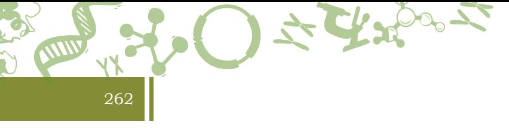
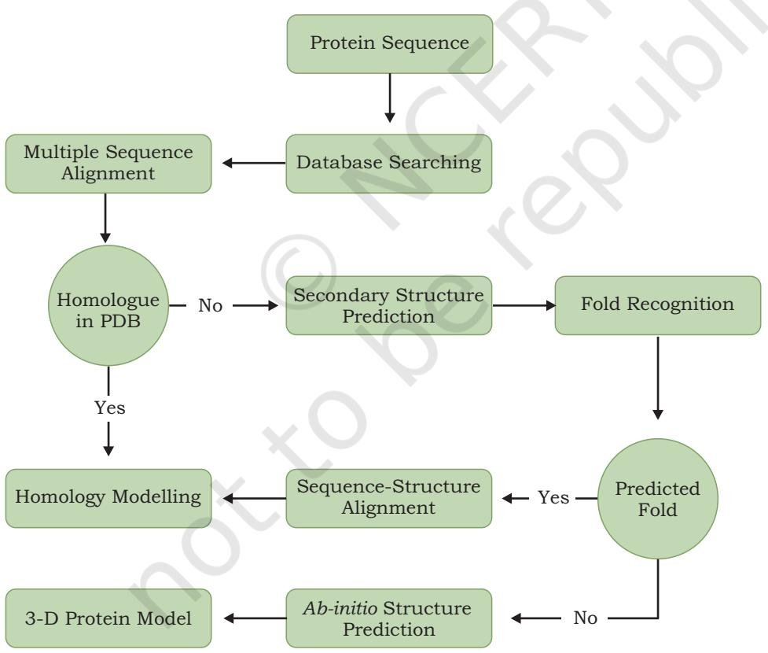
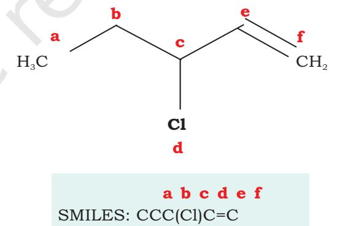
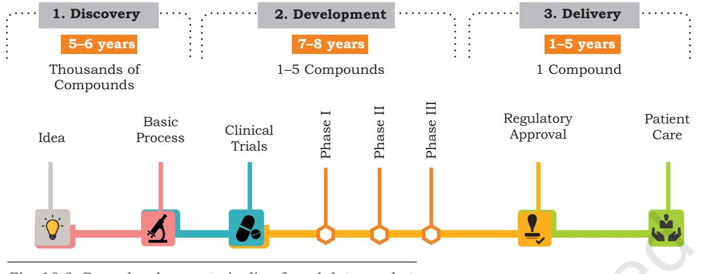

*10.1 Protein informatics 10.2 Cheminformatics*

# **10.1Protein Informatics**

# **10.1.1 Introduction**

Collecting information about any protein using techniques of information technology comes under protein informatics. Protein informatics has been of tremendous help in getting the geometrical location of the functional site, the biochemical function and the biological function of the hypothetical proteins. In addition, it has led to the determination of the tertiary structures of many hypothetical proteins, whose molecular functions could not be understood using conventional methods. Heterogeneous databases and various descriptors of amino acid sequences, tertiary structures and pathways on the proteome scale have also been of help in developing protein informatics.

Chapter 10.indd 260 11/14/2019 10:14:55 AM

## **10.1.2 Protein data types**

The process of computation of information extraction needs raw data of protein. These protein data can be of following types —

261

- (i) Microscopic image of heat-denatured protein aggregate
- (ii) Protein in solution form
- (iii) Protein sequence as output of Matrix Assisted Laser Desorption/Ionisation (MALDI)
- (iv) Assembled protein sequence
- (v) Protein crystal structure in Protein Data Bank (PDB) format
- (vi) Protein-protein, protein-ligand or protein-nucleotide interaction file
- (vii) Nuclear Magnetic Resonance (NMR) data, Mass Spectrometry (MS) data
- (viii) Protein sequences derived directly from the genomic sequences, which do not contain the known evidence of existence (Hypothetical protein)

The above mentioned types of protein data can be used for getting useful information like

- (i) Multi-fractal property of microscopic image of heatdenatured protein aggregate is used for designing protein-marker.
- (ii) Protein data in solution are useful for analysing physico-chemical properties and kinetics information.
- (iii) Fragmented short sequences of proteins from MALDI are used to find out the full length sequence.
- (iv) Protein crystal structures are used to study mutations and interactions.
- (v) PDB, NMR and MS data are also used for the prediction of structure of non-crystallised protein (directly from the sequence).
- (vi) There are proteins which do not have known existences (known as hypothetical proteins) which can be identified from the genomic sequences.
- (vii) Network mapping of protein provides information about the possible target of treatment of different diseases.

Chapter 10.indd 261 11/14/2019 10:14:55 AM

In order to carry out the protein informatics analysis, the following two basic facilities are required:

- (i) Availability of the raw data from various databases, such as NCBI, PDB, CHEMBL, BIOMODELS, etc.
- (ii) Informatics tools and techniques used for the analyses. Some of the well known techniques are: (a) image analysis by the wavelet techniques, (b) sequence similarity and homology calculations, (c) structure optimisation techniques, (d) data analysis by statistical and machine learning techniques as Artificial Neural Network (ANN), Support Vector Machine (SVM) and Hidden Markov Model (HMM). (e) Network Mapping Technique, and (f) Systems Biology Mark-up Language (SBML).

# **10.1.3 Computational prediction of protein structures**

Protein structure prediction using bioinformatics tools is aimed to explore how amino acid sequences specify the structure of proteins and how these proteins bind to substrates and other molecules to perform their functions. This task for predicting structure of a protein (including those of hypothetical proteins) using bioinformatics tools is possible even when only gene sequence is known, i.e., in the absence of protein sequence. Many computational tools are available from different sources for making predictions of structural and physicochemical properties of proteins. The major advantages of computational methods are the time frame involved, high cost and the feasibility of high throughput screening.

10.1.3.1 Primary structure prediction

Protein primary structure prediction involves physicochemical characterisation such as isoelectric point, extinction co-efficient, instability index, aliphatic index and grand average hydropathy. All these can be calculated with the help of ProtParam tool of ExPASy Proteomics Server. Some of the physicochemical properties of proteins are described in brief in the following section.

**Isoelectric point**— Isoelectric point (pI) is the pH at which the surface of protein is covered with charge but net charge of protein is zero. At pI, proteins are stable and compact. If the computed pI value is less than 7 (pI<7), it indicates that protein is considered as acidic.

Chapter 10.indd 262 11/14/2019 10:14:55 AM

263

The pI greater than 7 (pI> 7) reveals that protein is basic in character. The computed isoelectric point (pI) will be useful for developing the buffer system for purification by isoelectric focusing method.

**The aliphatic index**— The aliphatic index (AI), which is defined as the relative volume of a protein occupied by aliphatic side chains (A, V, I and L), is regarded as a positive factor for the increase of thermal stability of globular proteins. Very high aliphatic index of protein sequences indicates that protein may be stable for a wide temperature range.

**The instability index**—The instability index provides an estimate of the stability of protein in a test tube. There are certain dipeptides, the occurrence of which is significantly different in the unstable proteins compared with those in the stable ones. This method assigns a weight value of instability. Using these weight values it is possible to compute an instability index. A protein whose instability index is smaller than 40 is predicted as stable, a value above 40 predicts that the protein may be unstable.

**The Grand Average Hydropathy (GRAVY) value**— The Grand Average Hydropathy (GRAVY) value for a peptide or protein is calculated as the sum of hydropathy values of all the amino acids, divided by the number of residues in the sequence. The low range of GRAVY value indicates the possibility of better interaction with water.

## 10.1.3.2 Secondary Structure Prediction

The protein secondary structure has been studied intensely, since it is very helpful to reveal the functions of protein with unknown structures. In addition, it has been shown that the prediction of protein secondary structure is a step toward protein 3-dimensional structure prediction. APSSP, CFSSP, SOPMA, and GOR are common protein secondary structure prediction tools.

## 10.1.3.3 Three dimensional (3D) Structure Prediction

The following three computational methods are commonly used to predict protein 3D structure.

**Homology modelling**—For homology modelling, the amino acid sequence of a protein with unknown structure is aligned against sequences of proteins

Chapter 10.indd 263 11/14/2019 10:14:55 AM

264

with known structures. High degrees of homology (very similar sequences across and between the proteins) can be used to determine the global structure of the protein with unknown structure and place it into a certain fold category. Lower degrees of homology may still be used to determine the local structures, an example being the Chou-Fasman method for predicting secondary structure. An advantage of homology modelling methods is lack of dependence on the knowledge of physical determinants. MODELLER and SWISS-MODEL are commonly used tools for homology modelling.

**Fold prediction**—Fold recognition methods take a complementary approach where structures are aligned. With the method called 'threading', the sequence of a protein with unknown structure is forced to take the conformation of the backbone (protein side chains) of a protein with known structure. The better the physical determinants measure for each attempt, the better the score for the alignment. These methods tend to be more compute-intensive than homology modelling methods, but they give more confidence in the physical viability of the results. **LIBELLULA** and **Threader** are commonly used tools for this method.

*De novo* **protein structure prediction:** It is an algorithmic process by which protein tertiary structure is predicted from its amino acid primary sequence. **QUARK** is a computer algorithm for *ab initio* protein structure prediction and protein peptide folding, which aims to construct the correct protein 3D model from amino acid sequence only. QUARK models are built from small fragments (1–20 residues long) by replica-exchange Monte Carlo simulation under the guide of an atomic-level knowledge-based force field.

Computationally elucidated structure of a protein is recorded as atomic coordinates in protein-data-bank files. The three-dimensional coordinates are stored in a type of text-file namely PDB-file with file extension .pdb in **Protein Data Bank** (PDB) database. It contains data from X-ray crystallography, NMR and few theoretical structure models. Besides this, the PDB database is also linked with protein databases, which are used to search homologous

Chapter 10.indd 264 11/14/2019 10:14:55 AM

sequence as well as 3D-structure for structure prediction through methods as **Homology modelling and Threading**. **MODELLER** is one of the known freely available tools for protein structure prediction.

265

**Domain prediction**— Domain is distinct functional and/or structural units of a protein. Independent folding unit of a polypeptide chain also carries specific function. They are often identified as recurring (sequence or structure) units, which may exist in various contexts. Domains provide most valuable information for the prediction of protein structure, function, evolution and design. The most common tools for domain prediction are **InterPRO** scan of **EMBL** and **CDD** search of **NCBI**.

A flowchart depicting various possible ways for protein structure prediction from a protein sequence is shown in Fig. 10.1.

*Fig. 10.1: Flowchart of all possible ways for protein structure prediction from a protein sequence*

Chapter 10.indd 265 11/14/2019 10:14:55 AM

## **10.2 Cheminformatics**

#### **10.2.1 Introduction**

266

The use of computational and informational techniques to understand problems of chemistry is known as cheminformatics. Cheminformatics is an interface science for combining principles of physics, chemistry, biology, mathematics, biochemistry, statistics and informatics. Terms like chemoinformatics and chemical informatics are used along with cheminformatics, to indicate the same approach. Cheminformatics strategies are useful in drug discovery where large numbers of compounds are evaluated for interaction with the target cellular molecules.

For the last two decades, the science of cheminformatics has grown conceptually and technically, finding widespread applications in chemical industry, pharmaceutical and biotechnology research e.g., computer-aided drug design (CADD) where one looks for molecules with specific biological and therapeutic properties.

 Cheminformatics specialists handle information on physical properties, three-dimensional molecular and crystal structures, chemical reaction pathways and so on. In addition to real compounds, cheminformatics researchers primarily handle virtual libraries of chemical databases that can contain hypothetical compounds. Virtual libraries can contain information on likely synthesis methods and predicted stability of the reaction products. Virtual screening uses chemical and physical principles to identify and evaluate the best candidates for a particular property or reaction from large libraries of real and virtual molecules. The most desirable candidates can then be verified in laboratory studies.

#### **10.2.2 Storing and managing the chemical data**

Many groups and organisations maintain database of chemical compounds, some of them are publicly available for free and some of them are commercially available. Though these databases contain millions of chemical compounds, their reactions and so on, the computational power and tools are so robust that it takes only a few seconds to search through the entire resource and retrieve the records.

Chapter 10.indd 266 11/14/2019 10:14:55 AM

Science has advanced so much that we are now talking of library of virtual molecules (runs into billions of entries) —these are compounds that do not exist according to the available literature, but can be synthesized using advanced combinatorial techniques.

CAS **(Chemical Abstracts Service)**, a division of American Chemical Society) is the world's largest collection of chemistry insights. It is an authoritative source of chemical names, structures and serves as a universal standard for chemists.

As of 2018, CAS registry hosts 142 million organic and inorganic substances taken from literature for the past more than 200 years. The registry includes 67 million protein and nucleic acid sequences. The database contains more than 7.6 billion property values of substances.

Data from large number of global published literature including biomedical sciences, chemistry, engineering, material science and so on, are added to the CAS database everyday. Since 1800s, the database covers more than 47 million publications covering more than 100 million chemical reactions. This tremendous resource is a treasure for finding compounds of therapeutic and industrial importance. Some of the popular chemical databases are mentioned in Table 10.1.

| Name | Description |
| --- | --- |
| PubChem | PubChem is a database of chemical molecules which maintains three types of information namely, substance, compound and BioAssays. |
| ZINC | ZINC database contains 21 million compounds available for virtual screening. In this database various molecule features like molecular weight, log P etc. are |
|  | included. |
| ChEMBL | This database provides comprehensive information about 1 million bioactive (small drug-like molecules) compounds with 8200 drug targets. |
| NCI | NCI database had more than 2,75,000 small molecule structures, a very useful |
|  | resource for researchers working in the field of cancer/AIDS. |
| ChemDB | It is a databse of five million chemicals containing information of chemicals, which includes predicted or experimentally determined physicochemical properties, such |
|  | as 3D structure, melting temperature and solubility. |

#### **Table 10.1: Popular Chemical Database**

Chapter 10.indd 267 11/14/2019 10:14:55 AM

| ChemSpider contains more than 28 million unique chemical entities aggregated | ChemSpider | from more than 400 diverse data sources. |
| --- | --- | --- |
| It is a binding affinity database of small molecules which contains 9,10,836 binding | BindingDB | data for 6,263 protein targets and 378,980 small molecules. |
| The database that combines detailed drug (i.e., chemical, pharmacological and | pharmaceutical) data with comprehensive drug target (i.e., sequence, structure, |  |
| DrugBank | and pathway) information. The database contains 6712 drug entries including 1448 | FDA-approved small molecule drugs, 131 FDA-approved biotech (protein/peptide) |
| drugs, 85 nutraceuticals and 5080 experimental drugs. |  |  |
| It is a pharmacogenomics knowledge resource that encompasses clinical information | PharmaGKB | of drug molecules. |
| This database contains approximately 2500 3D-structures of active ingredients of | SuperDrug | essential marketed drugs. |

# **10.2.3 Why do we need cheminformatics?**

Faced with hundreds of millions of compounds, properties, chemical reactions and so on, the question is how to navigate this huge resource and find the right chemical compound that meets our requirement?

The cheminformatics tools help us browse through the enormous body of literature and find patterns. Pharma companies use cheminformatics resources and tools for *in silico* design of novel drugs, followed by synthesis and testing. Chemical manufacturing industry needs cheminformatics to design new properties, predict efficacy and toxicity of chemicals before they reach the market.

### **10.2.4 How to store information on chemical compounds?**

One can easily draw chemical compounds on the paper with bonds in between the atoms and aligned at a certain angle. Using drawing tools, it is possible to use predefined templates on the user interface and draw standard geometric structures and reactions with ease. One can store such information as an image file (e.g, jpg, tif) or document form (e.g., doc, pdf). However, such a storage of chemical data is of little use in research projects that demand 'deep browsing' into bond angles, flexibilty of rotation and so on, to find the right molecule for a particular purpose.

Chapter 10.indd 268 11/14/2019 10:14:55 AM

Chemical structures are therefore stored in the computer as molecular graphs. A graph is an imaginary representation of nodes (units of chemical substances) and edges (movement of information between nodes). Using node-edge approach, one can create graphs representing atoms and bonds. At a higher level, the same representation is used to build molecular pathways in the cell e.g. glycolysis and Kreb's cycle, etc.

A graph may have subgraphs, i.e., a collection of smaller graphs that collectively build a graph, for a particular application. In graphs or subgraphs, it is common to observe cycles or rings. In contrast, a tree is a special type of graph where there are no rings. In tree representation, there would be root nodes, followed by branch nodes and leaf nodes, all representing chemical substances at various stages of transformation.

After constructing the graph, the ability to communicate the graph to the computer in terms of its every mechanistic detail is needed. This can be achieved by using a 'connection table'.

At a very basic level, the simplest form of connection table consists of two sections: (i) a list of atomic numbers of the atoms in a molecule, and (ii) a list of bonds between

the atoms that talk to each other. Furthermore, the connection table is enriched with additional information like hybridisation state of every atom, three dimensional (xyz) coordinates of atoms and so on. It is important to understand that hydrogen atoms may not be explicitly represented in the connection table (they may be implied). In such a situation, the connection table is hydrogensuppressed.

Another way to represent and convey molecular graph to the computer is through the method of 'linear notation'.

A linear notation uses alphanumeric (a1, b2, c3 and so on) scheme to store for computation. One of the most popular linear notation is SMILES

269

- 1. Atoms are represented by their atomic symbols.
- 2. Hydrogen atoms are omitted (are implicit).
- 3. Neighbouring atoms are represented next to each other.
- 4. Double bonds are represented by "=", triple bonds by "#".
- 5. Branches are represented by parentheses.
- 6. Rings are represented by allocating digits to the two connecting ring atoms.

*Fig. 10.2: The smiles notation*

Chapter 10.indd 269 11/14/2019 10:14:55 AM

(Simplified Molecular Input Line Entry Specification) (Fig. 10.2). One reason for the popularity of SMILES is its simplicity and scalabilty.

## **10.2.5 Searching the structures**

It has been a norm that commercially available databases have origins in the academic research projects. This is true of Cheminformatics as well.

The simplest task involves extraction of information on chemical structure. For example, finding the physical and chemical properties of a substance, show me all those knowing all the chemical substances within a certain boiling point range and so on.

The second level of search involves substructure retrieval. For example, it shows all those chemical compounds that correspond to a certain functional group like a methyl group, benzene ring or an alkene backbone.

When we find that a small graph is entirely embedded in another bigger graph, we call this as subgraph isomorphism (iso means many forms of the same type).

Due to this reason, many-a-times people perform a two stage search. The first step involves the use of a general screen to eliminate those molecules that do not possibly match the substructure query. During this step, most of the molecules are discarded, leaving a residue of a small minority of molecules that may be interesting for exploration in the second step.

The second phase involves a more elaborate subgraph isomerism process to find molecules that truly match a given substructure. Molecule screens are implemented using binary strings of 0s and 1s, called bitstrings.

# **10.2.6 Searching the reactions**

While planning a synthesis, a chemist may wish to search the reaction database for products to find if someone has already synthesised a given compound and, if yes, what were the reaction conditions? Also, one may want to know how many different reaction pathways exist to move from point A to point X in the pathway. Further, one may need information on solvents, pH, temperature, pressure and so on. One can refine reaction queries by integrating several queries into one statement: find all reactions that utilise glucose and operate within temperature range of 37o C.

Chapter 10.indd 270 11/14/2019 10:14:55 AM

A key feature of reaction search is atom mapping, i.e., finding an exact correspondence between reactant atoms and the resultant products. The existing cheminformatics tools and databases also allow retrieval of reactions where a certain substructure is converted into products.

271

#### **10.2.7 Pharmacophore**

A pharmacophore is a description of molecular features that define molecular recognition of a ligand. The IUPAC defines pharmacophore as an ensemble of steric and electronic features necessary to ensure optimal interactions with specific biological target and trigger a biological response.

A pharmacophore model explains how structurally diverse ligands can dock on to a single receptor molecule. A 3D pharmacophore is a set of features related to spatial orientation e.g., positively and negatively charged groups, rings and hydrophobic regions.

It is important to know that a pharmacophore is not a physical molecule or a group of molecules. The pharmacophore is a well established conceptual framework that defines specific molecular description (pharmacophore points e.g., steric, electrostatic and hydrophobic properties) of a therapeutic molecule needed for its interaction with a target.

## **10.2.8 Lipinski's rule of five (R05)**

This rule was proposed by Christopher A. Lipinski in 1997 and describes the key molecular properties of compounds. R05 provides indicative information about Absorption (A), Distribution (D), Metabolism (M), Excretion (E) and Drug likeness properties of any small molecule.

Ideally a drug should be biodegradable, non-toxic, stable, with no side effects, have uniform cellular distribution, controllable release in the body, cost-effective and easily excreted after action.

Thus, the rule of five assumes immense importance as **RO5** talks about absorption, distribution, metabolism and excretion of a chemical compound. However, it does not deal with the pharmacological effect of a drug like molecule.

As this is an introductory chapter on cheminformatics, we will not get into deep thought process that has gone into designing every rule. For now, a brief mention of the

Chapter 10.indd 271 11/14/2019 10:14:55 AM

rule shall suffice as a gentle introduction. The Lipinski's rule of five includes the following criteria for finding an orally active drug and it should not bear more than one violation.

(i) Not more than 5 hydrogen bond donors

(ii) Not more than 10 hydrogen bond acceptors

(iii) Molecular weight below 500 Daltons

272

(iv) Octanol water partition coefficient log P of less than 5 A warning is flagged if the chemical compound property exceeds a certain number. Based on the alerts, the rule of five can assign a value between 0–4. If the RO5 score is greater than 1, the compound is not favoured further due to its expected unfavourable performance during absorption, distribution, metabolism and excretion.

It is important to remember that Lipinski's rule of five only deals with finding a chemical compound that has potential to be a successful oral drug. The RO5 may not apply to the drugs given through intramuscular and intravenous routes.

A number of drugs including tuberculosis (TB) drugs and antimicrobials (e.g., amphotericin B and streptomycin) do not follow Lipinski rule. There are situations where a molecule may score 0 and its extremely similar equivalent may score 4. There is a general observation in the community that all the four rules need to be given equal weight and thresholds can possibly be softened for wider application. The Lipinski rule is only a statistical measure of the possibilities and considers only a subset of drugs to be given orally. Lastly, the RO5 does not apply to natural products and semi-synthetic natural products.

#### **10.2.9 The journey of a drug**

Nature provides an immense store house of active compounds with therapeutic applications. Using scientific methods, we have learnt how to narrow down to a certain set of compounds that might make promising molecules that one is looking for. The road to drug discovery and development is long, expensive and risky. Fig. 10.3 depicts the overall drug discovery pipeline, i.e., from lab to the market. Virtual screening is an *in-silico* approach to decide which compounds among billions are useful for a particular purpose. The purpose may be related to drug discovery, industrial applications and so on.

Chapter 10.indd 272 11/14/2019 10:14:55 AM

273

*Fig. 10.3: Drug development pipeline from lab to market*

#### **Box 1**

1. In the early 1990s, Pfizer tested out a drug called UK92480, which is expected to relax the blood vessels and treat heart complications. Instead, they found an unexpected side effect on reproductive system and developed the drug into a blue pill known as viagra.

2. Do you know the origin of saccharin, an artificial sweetner that we often use in the tea or coffee? The origin of this discovery was accidental. One day in 1879, a Russian Chemist Dr. Constantin Fahlberg, was so involved with his work that he forgot about the supper till it was quite late and rushed off for a meal without washing the hands. He broke a piece of bread with unwashed hands and put it in the mouth. It tasted very sweet. At this time, he did not suspect much. Rather, he washed his mouth and dried moustache with a napkin. Interestingly, napkin also tasted sweet. Then he drank water and that also tasted sweet. Immediately, he sensed the breakthrough of sweetner coming from coal tar. He dropped the dinner, ran back to the lab and tasted the contents of every beaker. One of them had an impure solution of saccharin. Luckily there wasn't any corrosive liquid. He worked on this for months, found a chemical method of making saccharin, started a company and became rich and globally famous for this breakthrough.

In the virtual screening, one scores, ranks and extracts a set of structures using computational methods. The virtual screening may consist of series of filters that eliminate undesirable compounds at every step. As we move from the first step of virtual screening to the last step, the criteria gets increasingly stringent, i.e., one moves from a broad set of parameters to a narrow set,

Chapter 10.indd 273 11/14/2019 10:14:55 AM

with the hope of identifying a small group of molecules that exhibits the desired property.

Virtual screening may include the use of: (a) general filters to identify drug like compounds with a desired ADME property, (b) Ligand based methods that encompass machine learning techniques, pharmacophore based search, and (c) structure based methods that include protein-ligand docking. Once a compound passes through these filters, one can use them for biological screening, synthesis, testing and so on.

#### **Box 2**

#### **Common terminologies in cheminformatics**

- **(1) High Throughput Screening (HTS)** A large scale automated process where millions of compounds are tested for a desired property.
- **(2) Hits**—Activity observed during high-throughput screening, generally defined by percent activity of new compounds in comparison to well defined and known compounds.
- **(3) False positive**—During screening, one may observe situations where a compound is found active in an assay but may turn out to be inactive towards a certain biological target.
- **(4) Lead compound** A compound that is biologically and pharmacologically active with desired properties, and that can be processed further.
- **(5) Library** An inventory of compounds that fulfill the criteria for screening against specific cellular targets.
- **(6) New Chemical Entity** A novel molecule discovered in the lab that has not yet entered clinical trials.
- **(7) Off target activity** Molecular interactions between chemical compounds and cellular molecules that do not bind the target.

## **Summary**

- Protein informatics is a growing field of information technology in which information about any protein is collected using sophisticated techniques. Raw data of proteins collected through various means is used to retrieve crucial information about the protein of interest.
- Primary structure of a protein can be analysed using ProtParam tool of ExPASy Proteomics Server. Isoelectric point, aliphatic Index, instability index and Grand Average

Chapter 10.indd 274 11/14/2019 10:14:56 AM

Hydropathy (GRAVY) value of a protein are calculated using this server. Secondary structure of a protein is predicted using APSSP, CPSSP, SOPMA and GOR.

275

- Homology modelling, fold prediction and *de novo* protein structure prediction are common computational methods used to predict protein 3D structure.
- Cheminformatics combines the computational and informational techniques to understand the problems related to chemistry. The information used in cheminformatics includes information on physical properties, 3-D molecular crystal structures, chemical reaction pathways, etc.
- Pharmacophore modelling is a method which gives description about the molecular features that define molecular recognition of a ligand. Lipinski's rule of five (RO5) outlines key molecular properties of compounds which is helpful in choosing potential drug compounds.

# Exercises

- 1. What is the role of information technology in determination of protein properties?
- 2. What type of protein raw data is used for computationally extracting information about the protein?
- 3. Name any two common tools for domain prediction.
- 4. What is the significance of cheminformatics?
- 5. Which of the following is not a rule in Lipinski's rule of five (RO5)?
	- (a) No more than 10 hydrogen bond receptors
	- (b) Partition coefficient logP of less than 5
	- (c) Not more than 5 hydrogen bond donors
	- (d) Molecular weight above 500g/mol
- 6. Which of the following properties of protein is not included in primary structure prediction?
	- (a) Aliphatic index
	- (b) Fold prediction
	- (c) Instability index
	- (d) Isoelectric point

Chapter 10.indd 275 11/14/2019 10:14:56 AM

