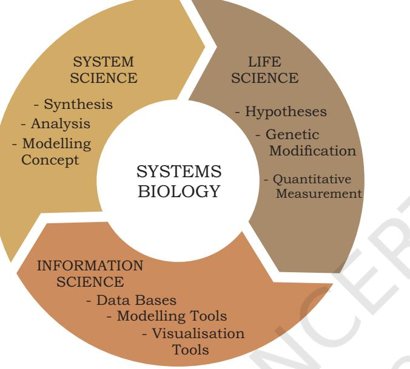
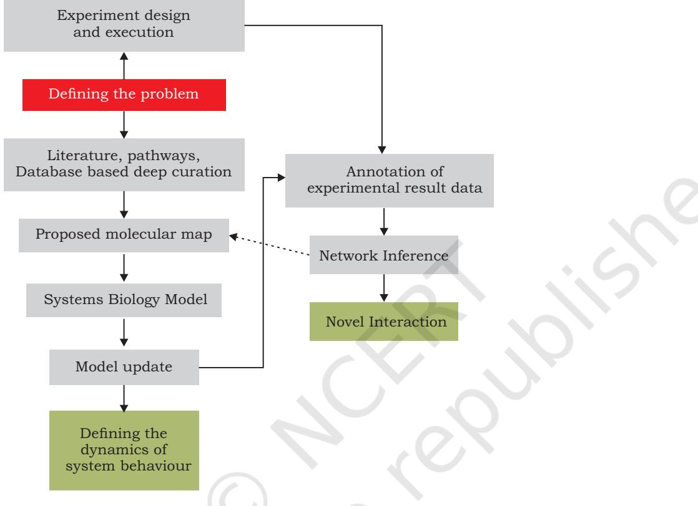

- *11.1 Programming in Biology*
#### *11.2 Systems Biology*

## **11.1Programming in Biology**

From an era of manual computation, we are currently in a phase of large scale (i.e., high-throughput) data generation, automated analysis and prediction. Technological advancements have proven to be a boon for generating huge data, unthinkable a few decades ago which handles more difficult questions. However, the arrival of massive data has also thrown massive challenges in the storage, visualisation, transfer, analysis and interpretation of data. The task that looked gigantic a decade back appears trivial now.

The emergence of artificial intelligence and machine learning techniques has changed research practices in almost every field. It is increasingly evident that, in future, young biotechnology students working at the cutting edge of science may require basic programming knowledge and comfort with chemistry and statistical methods.

The purpose of this chapter is not to give an exhaustive description of programming languages but to offer a gentle introduction to some of the most popular high level languages relevant to biologists.

Chapte 11.indd 276 11/14/2019 10:15:18 AM

Although bioinformatics software is being developed for all the available operating system (OS) platforms, majority of successful application have been developed on Linux platform. From the beginning of bioinformatics, PERL is always at the core of sequence based large data handling. Now a days these platforms are being enriched with the advanced performing language, normally Python and R provides strong facilities of statistical packages for solving biological problems. Similarly, Python modules are continuously being enriched with visualisation and analysis modules for handling of large data set on standalone, web server as well as cloud computing. Beyond these, MATLAB also includes very good platform for bioinformatics data analysis. Description of few of the most advanced languages, active in the area of bioinformatics, is given below:

277

**Python:** It is a high level programming general purpose language created by Guido van Rossum (1991). It is an object oriented programming interactive language that can run on unix, mac and windows. Python is very popular within bioinformatics community largely because: (i) of the clear meaning of terms used and the structure of statements (ii) it's expressivity and alignment to object-oriented programming, and (iii) the availability of libraries and third-party toolkits. Python has been successfully used for sequence and structure analyses, phylogenetics and so on.

**R:** The name R has been derived from its inventors, Robert Gentleman and Robert Ihaka, who developed the language. R language has gained wide acceptance as a rapid and reliable functional programming language that is ideal for high volume analysis, visualisation and simulation of biological data. The software is free and open source. The R language has been used for analysis of genome sequence and biomolecular pathways.

Moving from data analysis to designing the systems, new programming languages have emerged. Among them are — GEC (Genetic Engineering of living Cells), a rule based language developed by Microsoft and Kera, an object oriented knowledge based programming language developed by Dr. Umesh P of University of Kerala. Kera (short form of Kerala, also means coconut) captures information on the genome, proteins and the cell, using a user edited biological library called *Samhita*.

Chapte 11.indd 277 11/14/2019 10:15:18 AM

## **11.2 Systems Biology**

#### **11.2.1 Introduction**

278

As you know, in order to understand the mysteries of nature, scientists are performing experiments from ancient time. Findings of these experiments are recorded in the form of data in the literature. Starting from small bit of data to large ones, data are being collected from decades of experimental efforts. Presently, a large size of biology data is being generated and stored in the digital format in a variety of storehouses called as databases. These digital data are the resources which make the foundation for researchers to develop such computational models which can perform tasks similar to our complex biological systems, i.e., those we observe in real *in-vitro*/*in-vivo* experiments or real life. Implementation of such ideas is being performed with mathematical and computational models to mimic complex biological systems. These models are called system models. Therefore, you can visualise the systems biology as the representation of system models. Now-a-days systems biology has become an area for intensive research with potent application. Thus, it is an interdisciplinary field of study that focuses on complex biological interactions within biological systems (Fig. 11. 1). The concept of systems biology is being adopted in a variety of biological contexts, particularly from last two decades onwards. The human genome project is one of the most glorious seedings of a thought of systems biology, which led to new avenues of today's form of systems biology. Presently, systems biology models can provide theoretical description for discovery of emergent functional properties of cells, tissues and organisms, similar to those which were only possible through experiments. Examples of most efficient system models are metabolic or signaling network. Along with fundamental understanding of the mechanism of action of biological systems, systems biology is intensely being utilized into potent applicability for e.g., in the areas of health and diseases from biological networks to modern therapeutics.

#### **11.2.2 Historical perspective**

Before the emergence of systems biology, the scenario of research in biological sciences (e.g., 1900 – 1970) was wondering around physiology, population dynamics,

Chapte 11.indd 278 11/14/2019 10:15:18 AM

enzyme kinetics, control theory, cybernetics, etc. as the segmental components of research. The systems biology has been mapped to be evolved from a physiological description, when in 1952 Alan Lloyd Hodgkin and Andrew Fielding Huxley (Nobel Prize winners) described a mathematical model for action potential propagation along the axon of a neuronal cell. More evolved implementation of theory emerged in 1960 when the first computer model of the heart pacemaker was developed by Denis Noble [PMID 13729365]. The systems biology was formally launched by systems theorist Mihajlo Mesarovic in 1966 at the Case Institute of Technology in Cleveland, Ohio, titled "Systems Theory and Biology". In 1968, first theory about systems biology was published by Ludwig von Bertalanffy, which is considered as precursor of this discipline. The duration betwen 1960s and 1970s was the decade of development of multiple aspects of complex molecular systems, such as the metabolic control analysis and the biochemical systems theory. Furthermore, skepticism of systems theory with molecular biology was broken by the development of theoretical biology, which includes the quantitative modelling of biological processes. Since 1990s, functional genomics is generating large quantities of high-quality of biological data, which are helping in the development of more realistic models. In continuation of these developments in the area of systems biology, National Science Foundation (NSF) put forward a challenge to mathematically model the whole cell. In this direction, in 2003, Massachusetts Institute of Technology started search of solution of this challenge in association with CytoSolve. Finally, in 2012 whole cell model of *Mycoplasma genitalium (cell wall less bacterium)*, for prediction of cell viability in response to the genetic mutations, was developed by Mount Sinai School of Medicine, New York. Presently, a big systems biology project, namely 'Physiome' is running (http://physiomeproject.org/). This project is aimed at developing a multi-scale modelling framework for understanding the physiological function that allows models to be combined and linked in a hierarchical fashion. For example, electromechanical models of the heart, need to be combined with models of ion channels, myofilament mechanics and signal transduction pathways at the subcellular level and then to link these processes

Chapte 11.indd 279 11/14/2019 10:15:18 AM

to models of tissue mechanics, wavefront propagation and coronary blood flow—each of which may well have been developed by a different group of researchers.

#### **11.2.3 Theme behind the systems biology**

To cover diverse disciplines of biology, systems biology has been observed from different aspects. The reductionist worked on identification of components and interactions

280

of a system, but no convincing method could be evolved to describe the pluralism of system. Pluralism can be better observed through quantitative measures of multiple components simultaneously and this can only be possible by mathematical models containing rigorous data integration. In this way it can be said that systems biology is the observation of system by integrating different components together (Fig.11.1). Covering all the individual components together at the core of theme of systems biology is: 'Object network mapping and its integration with interdependent dynamic event—kinetics with partial differential equations'.

### **11.2.4 Protocol for systems biology experiments**

To perform a standard systems biology experiment, discrete steps, as shown in Fig.11.2, are followed.

The whole protocol basically involves definition of problem, designing of experiment, execution of the experiments to generate data, collection of the resultant data and their arrangement in appropriate file formats followed by the development of network inference. This is followed by transfer of this network interface which should be precise as well as mechanism based so that the model can be developed accordingly. This is further followed by analysis of discrepancies between model based simulation results and experimental data and accordingly model the hypothesis with reference to the discrepancies observed. Finally, the simulation is repeated and tested again and

Chapte 11.indd 280 11/14/2019 10:15:18 AM

again, and new hypotheses are incorporated into the model.

Thus, the work flow of computation for systems biology (as depicted in Fig. 11.2) requires data-management, optimisation of network development parameters, performance analysis and evaluation.

281

*Fig. 11.2: Workflow for implementation of systems biology experiment*

Standards for data management have been defined for collection of structure data for systems biology. Accordingly, three basic aspects are considered for data management which are explained below—

#### **(i) Minimum information**

Minimum information represents a set of essential supporting information needed from different experiments as microarray, proteomic, biological and biomedical investigations. Incorporation of metadata about these collected data is an important point to care.

#### **(ii)File formats**

The collected data for minimum information are stored in specific file formats.These formats are generally **Extensible** 

Chapte 11.indd 281 11/14/2019 10:15:18 AM

282

**Markup Language (XML)** based, which has facility to be automatically processed by computers.

#### **(iii) Ontologies**

Ontologies define a semantic annotation of data, which represents the hierarchical relationship between different terms. Few important examples are, the **Gene Ontology (GO)** and the **Systems Biology Ontology (SBO)**.

Current data-management systems include spreadsheets, web-based electronic lab notebooks (ELN), and laboratory information management systems (LIMS). The data-management systems have been customised in such a way that they can be accessed and integrated with different analysis tools and computational workflows. Systems like Konstanz Information Miner (KNIME), caGrid23, Taverna24, Bio-STEER25 and Galaxy26, allow the construction, execution and sharing of specialised workflows. These workflows provide computational pipeline by enabling data exchange, data integration and inter-tool communication. A list of data management, network inference, curation, simulation, model analysis, moleular interaction, and physiological modelling tools have been given in Table 11.1.

| Facilities | Tools / Software |
| --- | --- |
| Data management | Taverna, MAGE-TAB, Bio-STEER, caGrid |
| Network inference | MATLAB, R, BANJO |
| Curation | CellDesigner, PathVisio, Jdesiner |
| Simulation | MATLAB, CellDesigner, insilico IDE, ANSYS, JSim |
| Model analysis | MATLAB, BUNKI, COBRA, NetBuilder, SimBoolNet |
| Moleular interaction | AutoDock Vina, GOLD, eHiTS |
| Physiological modelling | PhysioDesigner, CellDesigner, OpenCell, FLAME |

#### **Table 11.1 A resource matrix of software, tools and data resources**

These systems modelling tools include set of interconnected partial differential equations (PDEs) which represent spatiotemporal systems. The PDEs are solved by the Finite Element Method (FEM), which is a numerical technique for approximate solutions for PDEs. PDEs can be solved by ANSYS, FreeFEM++, OpenFEM and MATLAB.

Chapte 11.indd 282 11/14/2019 10:15:18 AM

There are several tools, which are used for systems modelling. These include: JSim, OpenCell and Flexible Large-scale Agent-based Modelling Environment (FLAME) etc. Many other simulation tools are under development which touch more real life aspects of simulations.

#### **11.2.5 Model-analysis methods**

Several mathematical techniques have been developed to analyse the behaviour of complex biological models. Some basic principles for model analysis are presented below —

#### **(i) Sensitivity analysis**

Sensitivity analysis describes about the stability and controllability of system against various distractions. Some of the important tools for sensitivity analysis are: SBML-SAT, MATLAB SimBiology, ByoDyn and SensSB.

#### **(ii) Bifurcation and phase-space analysis**

Bifurcation and phase-space analysis is performed to analyse the system model to discover the possible steady as well as dynamical tendencies. Some of the important tools are: AUTO, XPPAut, BUNKI and ManLab.

#### **(iii) Metabolic control analysis**

Metabolic control analysis (MCA) is performed for understanding the relationship between the properties of a metabolic network (at steady state) and component reactions. The MetNetMaker is a tool for this.

## **Summary**

- With increasing amount of data produced everyday by biologists, it has become all the more important to competently handle complex datasets in order to generate and explore hypotheses. Programming languages make it easier for the scientists to access, filter and manipulate the biological data.
- Some of the most advanced programming languages include Python and R. Python can run on unix, mac and windows, and is used for visualisation and analysis of sequence and structure datasets. The R language provides facilities of statistical tools, and is suitable for high volume analysis and visualisation.

Chapte 11.indd 283 11/14/2019 10:15:19 AM

- Systems biology utilises computational methods to analyse complex biological datasets. Examples of systems models are metabolic and signaling network.
- Data management, optimisation of network development parameters, performance analysis and evaluation are some of the important requirements of computation for systems biology. There are three aspects of data management in systems biology, namely minimum information, file formats and ontologies.

## Exercises

- 1. Why are programming languages a boon for biologists?
- 2. Name the various aspects of data management for systems biology.
- 3. Choose the INCORRECT statement
	- (a) Python is a programming language.
	- (b) Biologists do not require knowledge of statistical tools for handling datasets.
	- (c) Most of the applications have been developed on Linux platform.
	- (d) Python provides third-party toolkits.
- 4. Systems biology is

284

- (a) the systematic study of all the living organisms.
- (b) the thorough study of all biochemical and signaling pathways.
- (c) the detailed study of biological systems through computational and experimental methods.
- (d) the study of dynamics of enzymes.
- 5. Which of the following is NOT included in data management systems?
	- (a) Metabolic control analysis
	- (b) Spreadsheets
	- (c) Web-based electronic lab notebooks (ELN)
	- (d) Laboratory information management systems (LIMS)
- 6. What is the need of systems biology?
- 7. What is the fundamental difference between systems biology and physiology?
- 8. Explain systems biology as collection of approaches and tools.
- 9. Is systems biology cell-centric?

Chapte 11.indd 284 11/14/2019 10:15:19 AM

