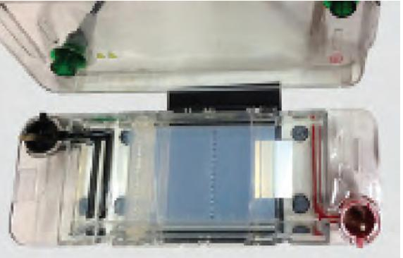

#### **Chapter 12**  Tools and Technologies

# **Tools and Technologies: Basic Concepts Unit V**

Considering the fact that biotechnology is an experimental science and involves a lot of experimentations; therefore, research in this field depends highly on sophisticated laboratory methods. Advances in biotechnology were closely followed by the development of newer tools and techniques in biological sciences. These new methods opened new avenues for research and investigation in the field of biotechnology. It is, thus, important to appreciate the experimental tools available to biotechnologists in order to understand the progress and future directions of this rapidly moving area of science. Some of the important experimental methods including methods of cell and molecular biology will be discussed in this unit.

Chapter 12.indd 285 11/14/2019 10:15:43 AM

# **Frederick Sanger (1918-2013)**

Frederick Sanger (1918–2013) was a British biochemist and molecular biologist who had two Nobel Prizes in Chemistry to his credit. He was awarded the first Nobel Prize in 1958 for the discovery of structure of insulin molecule, and second Nobel Prize in 1980 for his work (in collaboration with Paul Berg and Walter Gilbert) on the determination of base sequences of nucleic acids. He is, by far, the most influential biochemist in history. His technique of deciphering DNA sequences was based on 'read-off' methods using acrylamide gel. In 1977, Sanger sequenced the genome of bacteriophage ΦX174, the first genome to be completely sequenced. Most of his later contributions laid the foundation of molecular biology and are being utilised in every biotechnology application.

Chapter 12.indd 286 11/14/2019 10:15:45 AM

# **Tools and Chapter 12 Technologies**

- *12.1 Microscopy*
- *12.2 Centrifugation*
- *12.3 Electrophoresis*
- *12.4 Enzyme-linked Immunosorbent Assay (ELISA)*
- *12.5 Chromatography*
- *12.6 Spectroscopy*
- *12.7 Mass Spectrometry*
- *12.8 Fluorescence in situ hybridisation (FISH)*
- *12.9 DNA Sequencing*
- *12.10 DNA Microarray*
- *12.11 Flow Cytometry*

#### **12.1 Microscopy**

Biological studies and explorations cannot be imagined without a microscope as it enables us to see something which is beyond the scope of our eyes. Today, the technique of microscopy has become so much advanced that a researcher can not only see a highly magnified image of a very minute structure but also can visualise the three dimensional structure of such objects. Using powerful electron microscopic techniques, even the DNA molecule of bacteria and viruses have been visualised.

The use of first microscope dates back to 1665 when the British Physicist Robert Hooke designed a simple microscope using combination of magnifying lenses (Fig. 12.1) and observed the slices of cork, and coined the term Cellulae or cell to that honeycomb like structure. You are aware that Matthias Jacob Schleiden and Theodor Schwann proposed cell theroy in 1838 on the basis of observation of cells in plants and animals.

Chapter 12.indd 287 11/14/2019 10:15:45 AM

*Fig. 12.1: Microscope*

288

#### **12.1.1 Magnification and Resolution**

Let us now focus on the principle on which the technique of microscopy is based. Two optical properties are extremely important for an optical instrument like microscope. One is the power to magnify and the other is the ability to resolve.

Magnification or magnifying power of a microscope is the ability by which the retinal image size can be increased. Thus in simple terms magnification is—

Size of retinal image with the help of microscope __________________________________________________ Size of the retinal image without using microscope

You may have studied in physics that magnification (M) of a lens is measured as per the following formulae (in which f is focal length of the lens and d is the distance of object from the lens).

$$\mathrm{M}={\frac{\mathrm{f}}{\mathrm{f}\,\cdot\,\mathrm{d}}}$$

Chapter 12.indd 288 11/14/2019 10:15:46 AM

Normally, the microscope which is used in the laboratory is a compound microscope in which two sets of lenses are there. One is called objective lens, which remains close to the object to be seen, and the other is eyepiece through which the observer sees. It is needless to mention that the object, objective lens, eyepiece and the eye of the observer have to be in the same line for the passage of light to see the magnified image of the object. In simple word, magnification of a microscope is product of the magnifying power of the objective lens and the magnifying power of the eyepiece (Mo × Me ).

Resolving power is another important property of a microscope, which is the ability to form separate images of the two objects situated very close to each other. It can be measured by the smallest distance between two points.

#### **12.1.2 Functioning of a light microscope**

You have already studied about the structure of a compound microscope in previous class, yet to recapitulate, as you can see in the Fig. 12.1, a compound microscope consists of a base on which a stage is fitted with a central hole. Attached to the base is an arm to which a body tube is fitted in such a way that it aligns with the hole of the stage. At the lower end of the body tube, a nose piece is fitted on which two to four objective lenses may be present. By rotating the nose piece, one of the objective lenses can be placed above the hole present on the stage where object to be seen is placed on a glass slide. At the upper end of the body tube, an eye piece is fitted through which an observer can see under the microscope. There are adjustment screws (coarse and fine) on the arm which facilitate in adjusting the distance of objective lens from the object present on the stage. Below the stage, there is a source of light (which may be a reflective mirror or a bulb to illuminate the object and facilitate the formation of image through objective lens and eyepiece). In addition, there is a condenser present between the light source and the stage, which is important for focusing light on the object. Fig. 12.2 also shows the path of light in a compound microscope. You might have observed that both objective lenses and eye pieces are of different magnifying power. In a student microscope the eyepiece has the magnifying power of 10× or 15× and that of the different objective lenses fitted on the nose piece are of 4×,

Chapter 12.indd 289 11/14/2019 10:15:46 AM

10×, 40/45× and 100×. The technique of microscopy just discussed is also called **bright field microscopy** as light is used to illuminate the object to be seen. Therefore, in order to distinguish different regions of the object, the same is stained with specific dyes or stain. Carmine, Eosin, Safranin, Methylene blue, Giemsa, etc., are few such stains commonly used for light microscopy.

*Fig. 12.2: Light microscope*

#### **12.1.3 Different forms of microscopy**

Studying minute details of internal organisation of tissues/ cells is so diverse that it cannot be achieved by light microscopy only. Therefore, by making one or the other kind of maneuvering, quite diverse forms of microscopy are used. In one such maneuvering, light falling on the object from the central condenser is blocked by a disc and illumination of the object is done by an oblique light beam, which is reflected off from the slide and the

Chapter 12.indd 290 11/14/2019 10:15:46 AM

image is illuminated against dark background. Therefore, such a microscopy is known as **Dark Field Microscopy**. Mitochondria, nuclei, vacuoles, etc., can be easily detected using this. Similarly, in a different form called **Phase Contrast Microscopy,** wave amplitude and phase of light passing through the transparent object is changed. This change depends on the density of the part of the object or specimen. Such a change is more in the area where density is comparatively high and as a result of which, varied contrast of different regions of the object can be seen. This is especially helpful in the study of cell organelles and chromosomes. Staining of the object or specimen with some specific dye is routinely done. There are some special type of dyes e.g., Acridine orange, Bisbenzimide, Merocyanine (also called fluorophores). These dyes are capable of emitting light of longer wavelength after being illuminated, a property called **fluorescence**. As a result of this, the fluorophore stained object looks more illuminated and of different colour depending on the dye used. In **fluorescence microscopy**, the same principle is applied. Object to be seen is stained with fluorophore to study a specific part of organelle or molecule. After illuminating the object under fluorescence microscope, the specifically stained region is easily seen or observed. This is helpful in identifying bacteria or viruses to know the cause of infection and immunodiagnosis.

**Electron microscopy** is a highly sophisticated technique in which the object to be studied is bombarded with electron beam which is approximately 1,00,000 time shorter in wavelength than visible light. The electron beam in an electron microscope magnifies the image with the help of electromagnetic lenses. The entire passage of electron is in vacuum and the generated image is viewed on a fluorescent screen and not through eyepiece. Owing to the very shorter wavelength of the electron, the image produced by an electron microscope is of very high resolution. Two types of electron microscopy are used; transmission electron microscopy and scanning electron microscopy. In **Transmission electron microscopy,** the ultra-thin heavy metal salt (of lead, tungsten, etc.) coated section of the object or specimen is placed in such a way that the electron beam passes through it to create the image. In the other technique of electron microscopy,

Chapter 12.indd 291 11/15/2019 9:59:33 AM

reflected electron beam from the gold or platinum coated surface of the object creates the image. In this technique, highly magnified and resolved image of the object surface is generated, therefore, it is called **Scanning electron microscopy**.

In last two three decades, yet another more sophisticated microscopic imaging technique has been developed and used called the **confocal microscopy**. Confocal microscopy is useful in resolving detailed structures within fixed cells/tissues and gives sharp images of the objects. To examine an object using confocal microscopy, it is first fluorescently labelled and then analysed under a confocal microscope in high resolution.

#### **12.2 Centrifugation**

You have studied about various biomolecules like proteins, nucleic acids, etc., present in cells of all living organisms. To study these biomolecules, you need to isolate them by using one or the other separation techniques. Centrifugation is one such technique in which particles or molecules are separated based on their densities under the influence of gravitational force (g), by spinning them in a solution around an axis at high speed using **centrifugal force**. The equipment used is called centrifuge (Fig. 12.3), which is of different types depending on its use. It consists of a base, a rotating container (spinning vessel/rotor) and a lid. The

*Fig. 12.3: Basic structure of centrifuge*

Chapter 12.indd 292 11/14/2019 10:15:46 AM

spinning vessel contains several centrifuge tubes. The cell extract or mixture is taken in centrifuge tubes and allowed to spin at a desired speed (revolution per minute; rpm) for a specific period of time leading to settlement of particulate material at the bottom of the centrifuge tubes.

## **12.2.1 Basic principles of Sedimentation**

Sedimentation is the tendency of the particles in suspension to settle out of the fluid in which they are entrained, and come to rest against a barrier. This is due to their motion through the fluid, in response to the forces acting on them. These forces can be due to gravity and centrifugal forces.

## **12.2.2 Types of Centrifuges**

Different types of centrifuges are available commercially. Commonly used centrifuges for research purposes are:

- Table top/clinical centrifuge or microfuge
- High-speed centrifuge
- Ultracentrifuge
- Differential centrifuge

Large-capacity preparative centrifuges, high speed refrigerated centrifuges and ultracentrifuges are the main types of centrifuges.

Based on the principle and application, following types of centrifugations are performed—

**Differential Centrifugation—**It is based upon the differences in the sedimentation rate (centrifugal force) of particles of different size and density. It is used to separate large cellular structures, the nuclear fraction, mitochondria, chloroplasts or large protein.

**Density-gradient Centrifugation—** In order to separate biological particles of similar size but differing in densities, one can use density gradient centrifugation. In this type of centrifugation, a density gradient is developed in centrifuge tubes. Depending upon their densities, different molecules get sedimented at different levels. The heavier molecules move outward and lighter ones remain in inner part in the centrifuge tubes. The greater the difference in density, the faster they move.

Chapter 12.indd 293 11/14/2019 10:15:46 AM

**Ultracentrifugation—** When centrifugation is carried out at very high speed, i.e., 100,000 x/g or more to separate the molecules, it is called **ultracentrifugation**. In ultracentrifuge, cell has to allow light passage through the biological particles for the proper measurement of concentration distribution.

#### **12.3 Electrophoresis**

Electrophoresis is a method of separation on the basis of charge to mass ratio of macromolecules under the influence of an electric field. Electrophoresis is a Greek word meaning 'to bear electrons'. The prefix *electro* refers to electricity which is required to migrate molecules and the suffix *phoresis* means 'migration' or 'movement'. It was observed for the first time in 1807 by Russian professors Peter Ivanovich Strakhov and Ferdinand Frederic Reuss. They noticed the migration of the clay particles dispersed in water in the presence of constant electric field.

## **Principle**

Many important biological molecules such as nucleotides, DNA, RNA, peptides and proteins bear ionisable groups, and therefore at any given pH exist in solution as electrically charged species either as cations or anions. Under the influence of an electric field, these particles will migrate either towards cathode or anode, depending on their net charge.

The mobility of a molecule is inversely proportional to its size and directly proportional to its charge, allowing them to be separated from one another.

# **12.3.1 Agarose Gel Electrophoresis**

In this type of electrophoresis, the gel is a matrix of agarose molecules that are held together by hydrogen bonds and form tiny pores. Gels for DNA separation are often made out of a polysaccharide called agarose, which comes as dry, powdered flakes. When the agarose is heated in a buffer and allowed to cool, it will form a solid, slightly squishy gel.

Gel is a slab of jelly-like material, placed in a gel box. One end of the box is connected to a positive electrode, while the other end is connected to a negative electrode. The gel box is filled with a salt-containing buffer solution

Chapter 12.indd 294 04 March 2022 12:20:19

that can conduct current. The end of the gel with the wells is positioned towards the negative electrode. The other end of the gel is positioned towards the positive electrode towards which the DNA fragments will migrate (Fig. 12.4).

DNA molecules are negatively charged. Gel electrophoresis of DNA fragments separates them on the basis of size only. Using electrophoresis, we can check the different DNA fragments present in a sample and determine their absolute size

with the help of **DNA ladder** made up of DNA fragments of known sizes.

When the power is turned on, the current begins to flow through the gel. DNA molecules have a negative charge due to the presence of phosphate groups in their sugarphosphate backbone; therefore, they move through the matrix of the gel towards the positive electrode (anode).

The voltage for running an agarose DNA gel lies in the range of 80–120 V. As the electric current is applied, shorter pieces of DNA travel through the pores of the gel matrix faster than longer ones. Thus the longest pieces of DNA remain near the wells while the shortest pieces of DNA are close to the positive end of the gel.

# **12.3.2 Visualising the DNA fragments**

Equipment used for visualisation of target DNA is ultra-violet (UV) trans-illuminator. Ethidium bromide (EtBr) is likely the most wellknown stain used for visualising DNA. This stain can be mixed in the gel mixture, in the electrophoresis buffer or the gel is stained after it is run. Molecules of the EtBr intercalates within DNA bases and fluoresce under UV light. Despite its advantages, ethidium bromide is a potential carcinogen, so it must be handled with great care (Fig. 12.5).

# **12.3.3 Polyacrylamide Gel Electrophoresis (PAGE)**

PAGE is an analytical method used to separate components of a protein mixture based on their size. To provide uniform charge to the protein molecules, an anionic detergent

Chapter 12.indd 295 11/14/2019 10:15:46 AM

2024-25

*Fig 12.4: Agarose gel electrophoresis unit to separate nucleic acid*

*Fig. 12.5: Visulalisation of DNA bands under UV light*

called sodium dodecyl sulfate (SDS) is used to bind the proteins and give them negative charge. Proteins are then separated electrophoretically according to their size using a gel matrix made of polyacrylamide in an electric field.

Polyacrylamide is produced as a result of the polymerisation reaction between acrylamide and N,N' methylene-bis-acrylamide (BIS) using a catalyst. The degree of polymerisation or cross-linking can be controlled by adjusting the concentration of acrylamide and BIS. The more the cross-linking the harder the gel. Hardness of the gel, in turn, modulates the friction experienced by macromolecules when they travel through the gel during PAGE, thus affecting the resolution of separation. Loose gels (4–8% acrylamide) allow higher molecular weight molecules to migrate faster through the gel while hard gels (12–20% acrylamide) restrict the migration of large molecules and selectively allow small ones to move through the gel.

### **12.3.4 Tracking dye**

As DNA, RNA and proteins are mostly colourless, their progress through the gel during electrophoresis cannot be easily followed. Anionic dyes of a known electrophoretic mobility are therefore, usually included in the sample buffer. A very common tracking dye is bromophenol blue. This dye is coloured at alkali and neutral pH, and is a small negatively charged molecule that moves towards the anode and it is coloured at alkali and neutral pH. Being a highly mobile molecule it moves ahead of most proteins and nucleic acids. As it reaches the anodic end of the electrophoresis medium, electrophoresis is stopped. Other common tracking dyes are xylene cyanol, which has lower mobility, and Orange G, which has a higher mobility. **Visualisation of protein on gel**— Coomassie Brilliant Blue R-250 is the most popular protein stain. It is an anionic dye, which non-specifically binds to proteins. Proteins in the gel are fixed by acetic acid and simultaneously stained. The excess dye incorporated into the gel can be removed by destaining with the same solution without the dye. The proteins are detected as blue bands on a clear background. After the visualisation by a staining (proteinspecific) technique, the size of a protein can be calculated by comparing its migration distance with that of a known molecular weight ladder.

Chapter 12.indd 296 11/14/2019 10:15:46 AM

#### **Box 1**

#### **Surprise Discovery of Jelly property**

A Japanese Emperor and his Royal Party were lost in the mountains during a snow storm and arrived at a small inn; they were treated by the innkeeper with a seaweed jelly dish with their dinner. Maybe the innkeeper prepared too much jelly or the taste was not so palatable but some jelly was thrown away, freezing during the night and crumbling afterwards by thawing and draining, leaving a cracked substance of low density. The innkeeper took the residue and, to his surprise, found that by boiling it up with more water, the jelly could be remade.

#### **Agar**

One of the scientists named Koch used to culture bacteria on the sterile surfaces of cut, boiled potatoes. This was unsatisfactory because bacteria would not always grow well on potatoes. He then tried to solidify regular liquid media by adding gelatin but it was digested by many bacteria and melted when the temperature rose above 28°C. A better alternative was provided by Fanny Eilshemius Hesse, the wife of Walther Hesse, one of Koch's assistants. She suggested the use of agar as a solidifying agent—she had been using it successfully to make jellies for some time. Agar was not attacked by most bacteria and did not melt until reaching a temperature of more than 42°C. Agarose is one of the two principal components of agar, and is purified from agar by removing agar's other component, agaropectin.

#### **12.4 Enzyme-linked Immunosorbent Assay (ELISA)**

Enzyme-linked immunosorbent assay (ELISA) was invented by two Swedish scientists, Eva Engvall and Peter Perlman in 1971. ELISA is a quantitative method used for the measurement of antigen and antibody concentration in a given sample. This is done by monitoring the antigenantibody interaction with the help of an enzyme catalysed reaction. This detection system (an enzyme-conjugate) is covalently linked to a specific antibody that recognises a target antigen. The intensity of the color produced is detected by ELISA reader or spectrophotometer. ELISA is a safer and less costly assay as compared to many other immunological assays.

A number of modifications of ELISA have been developed, allowing qualitative detection or quantitative measurement of either antigen or antibody. These different types of ELISA can be employed qualitatively to detect the presence of antibody or antigen. Using the known concentrations of antibody or antigen, a standard curve is prepared to determine the unknown concentration of a sample.

Chapter 12.indd 297 11/14/2019 10:15:46 AM

# 298

#### Biotechnology

Antigen-coated well Add specic antibody to be measured

Add enzyme-conjugated secondary antibody

Add substrate(s) and measure colour

*Fig. 12.6: Indirect ELISA*

*Fig. 12.8: Competitive ELISA*

**Direct ELISA—** In direct ELISA, the antigen or sample is coated on the microtiter plate wells and the enzymeconjugated antibody 'directly' binds to the antigen. The enzyme linked to the antibody reacts with its substrate to produce a colourful product that can be measured using spectrophotometer/ELISA reader. The direct ELISA is faster and less error prone and does not require a secondary antibody. Disadvantage of direct ELISA is nonspecific binding of antibody due to cross-reactivity.

**Indirect ELISA—** The indirect ELISA detects the presence of antibody in a sample in two stages (Fig. 12.6). Firstly, an unlabelled primary antibody (Ab1) is applied to antigen coated microtiter wells. The unbound extra primary

Chapter 12.indd 298 11/14/2019 10:15:47 AM

antibody (Ab1) is then washed off. Next, an enzymeconjugated secondary antibody (Ab2) specific for primary antibody (Ab1) is added. Any unbounded secondary antibody (Ab2) is washed off and the substrate is added. The amount of coloured product formed can be measured using spectrophotometer/ELISA reader. Indirect ELISA has increased sensitivity since more than one labelled antibody is bound per primary antibody.

**Sandwich ELISA** — In sandwich ELISA, the antibody is coated on the microtiter plate and is referred to as captured antibody. Using sandwich ELISA technique, the antigen can be detected or measured (Fig. 12.7). After the captured antibody is coated on the plate, antigen is added and allowed to react with the captured antibody. Excess antigen is washed off and then a second enzymeconjugated antibody specific for a different epitope (the part of an antigen molecule to which an antibody attaches) on the antigen is loaded. The excess unbound enzymeconjugated antibody is washed off and substrate is added and the coloured product produced is then measured using spectrophotometer/ELISA reader. High specificity and no requirement of antigen purification or limiting antigen are the main advantages of sandwich ELISA.

**Competitive ELISA—** The competitive ELISA helps in measuring amounts of antigen (Fig. 12.8). In this method, the antibody and antigen are first incubated in solution. In this step, the antibody is present in excess to the antigen; it will bind to its antibody in a concentration dependent manner leaving unbound antibody, accordingly. This antigen-antibody complex is then added to an antigen coated microtiter well. Thus, if more antigens are present in the sample, less free antibody will be available to bind to the antigen-coated well and *vice versa*. Finally, the enzyme-conjugated secondary antibody (Ab2), specific for the primary antibody is added to the plate, and these binds to the primary antibody bound to the antigen on the plate. As in the case of indirect ELISA, addition of an enzyme-conjugated secondary antibody (Ab2) specific for the primary antibody helps in determining the amount of primary antibody bound to the well. Thus, in the competitive ELISA, the higher the concentration of antigen in the sample; the lower will be the free antibody 299

Chapter 12.indd 299 11/14/2019 10:15:47 AM

and accordingly, the intensity of the developed colour will be less.

Application of ELISA

- 1. Presence of antigen or antibody in a sample can be estimated.
- 2. Concentration determination of serum antibody in a virus test can be carried out.
- 3. Detection of potential food allergens in food industry.
- 4. Disease outbreaks can be tracked down e.g., HIV, bird flu, cholera, etc.

# **12.5 Chromatography**

# **Principle**

Chromatography is a separation procedure for isolating various components of a mixture. The whole operation is time dependent, and involves a mobile phase and a stationary phase. The mobile phase may be a solution containing solutes to be separated and the eluent (liquid) that carries the solution through the stationary phase. Stationary phase may be adsorbent, ion-exchange resin, porous solid, or gel. The basis of chromatography is different migration properties of the solute molecules during passage through the stationary phase. Each solute in the original solution moves at the rate proportional to its relative affinity for the stationary phase. The stationary phase is usually packed in a cylindrical column. Fig. 12.9 reveals an outline description of the separation of three solutes from a mixture through chromatography.

The various components of a mixture, i.e., the solute molecules travel with the eluent molecules at different speeds

*Fig. 12.9: Chromatography—a schematic description*

Chapter 12.indd 300 11/14/2019 10:15:47 AM

depending upon their relative affinities for the resin particles. As a result, they separate and appear for collection at the other end of the column at different time intervals. The pattern of solute peaks emerging from a chromatography column is called a **chromatogram.** A typical HPLC chromatogram is shown in Fig. 12.10.

Liquid chromatography is used both as a laboratory method for sample analysis and as a preparative technique for large-scale purification of biomolecules. In recent year there have been rapid developments in the technology of liquid chromatography aimed at the isolation of recombinant products from genetically engineered organisms. Chromatography is a high resolution technique and therefore suitable for the recovery of high-purity therapeutics and pharmaceuticals. Chromatographic methods are available for purification of proteins, peptides, amino acids, nucleic acids, alkaloids, vitamins, steroids and many other biological materials. These methods differ in the principles by which molecules are separated in the chromatography column.

**Adsorption Chromatography (ADC):** This chromatography is based on the adsorption of solute molecules onto polar adsorbents such as silica gel, alumina, diatomaceous earth and charcoal. Because the mobile phase is in competition with solute for adsorption sites, solvent properties are also important. Polarity scales for solvents are available to aid mobile-phase selection.

Chapter 12.indd 301 11/14/2019 10:15:47 AM

**Liquid-liquid Partition Chromatography (LLC**)—Partition chromatography relies on different partition coefficients (solubility) of solute molecules between two immiscible solvents. This is achieved by fixing one solvent as the stationary phase and passing the other solvent containing solute over it, a mobile phase. The solvents make intimate contact allowing multiple extractions of solute to occur.

**Ion-exchange chromatography (IEC)—**The basis of separation in this procedure is the adsorption of solute ions on ion exchange resin particles on the column packing by electrostatic forces. Ion exchange chromatography may provide high resolution of macromolecules. Commercially, it is used for fractionation of antibiotics and proteins. Column packings include silica, glass and polystyrene; carboxymethyl and diethylaminoethyl groups attached to cellulose, agarose or dextran provide suitable resins for protein chromatography. Solutes are eluted by changing the pH or ionic strength of the liquid phase.

**Gel Filtration Chromatography—**This technique is also known as **molecular sieve chromatography, size exclusion chromatography** and **gel-permeation chromatography.** This is based on the size of molecules to be separated. Solute molecules present in the solution are separated in a column packed with gel particles of distinct porosity. Mostly, the cross-linked dextrants, agaroses and polyacrylamide gels are used for the packing of column. The penetration of the solute molecules through the column depends on the shape of solute molecules and their effective molecular size. Gel filtration can be used for separation of proteins and lipophilic compounds. Large-scale gel filtration columns are operated with upward-flow elution.

**Affinity Chromatography (AFC**): This separation technique exploits the binding specificity of biomolecules. Enzymes, hormones, receptors, antibodies, antigens, binding proteins, lectins, nucleic acids, vitamins, whole cells and other components capable of specific and reversible binding are amenable to highly selective affinity purification. Column packing is prepared by linking a

Chapter 12.indd 302 11/14/2019 10:15:47 AM

binding molecule called a ligand to column, only solutes with appreciable affinity for the ligand are retained.

**High-pressure /performance Liquid Chromatography (HPLC):** It is based on general principles of chromatography. With the development of HPLC, the particle size of stationary phase used has become progressively smaller. Small size of these particles leads to a considerable resistance to solvent flow. The mobile phase has to be pumped through the column under high pressure.

**Gas Chromatography (GC):** The gas chromatography (GC) is widely used for separation and purification of volatile components such as alcohols, ketones, aldehydes and many other organic and inorganic compounds. In gas chromatography, the mobile phase is gas. Gas chromatography is used widely, however, liquid chromatography is of great relevance to bioprocessing.

#### **12.6 Spectroscopy**

Spectroscopy is a technique used for the study of interaction of electromagnetic radiation with matter. It is used for the identification of substances through the spectrum emitted from or absorbed by them. It is used for the estimation of concentration of coloured compounds, analysis of chemical structure of molecules, types of molecular changes occurring during various enzymatic reactions; and in the study of intermolecular bonding. List of various spectroscopic techniques is given in Table 12.1. Spectrophotometric techniques offer a very rapid and convenient means of qualitative and quantitative

*Fig. 12.11: Diagrammatic representation of instrumentation of spectroscopy*

Chapter 12.indd 303 11/14/2019 10:15:47 AM

estimation of biomolecules. Spectrophotometer consists of the following parts: light source, which provide the desired wavelength of light, collimator, which transmits a straight beam of light, monochromator, which splits the light into its component wavelength, and wavelength selector, that transmits only the desired wavelength (Fig. 12.11).

#### **Box 2**

#### **The Beer-Lambert Law**

The Beer-Lambert law states that the absorbance of a solution is directly proportional to the concentration of the absorbing substance in the solution and the path length. For this reason, Beer-Lambert law can only be applied when there is a linear relationship. Beer's law is written as:

# *A***=** ε*lc*

Where *A* is the measure of absorbance (no units),

ε is the molar extinction coefficient or molar absorptivity (or absorption coefficient), *l* is the path length and

*c* is the concentration.

Transmittance is the relationship between the amount of light that is transmitted to the detector once it has passed through the sample (I) and the original amount of light (I0). This is expressed in the following formula.

#### T = I / I0

Where T is the transmittance,

I is the intensity of the light coming out of the sample, and I0 is the intensity of the incident light beam.

Absorbance equals the negative log of transmittance and this relationship between transmittance (T) and absorbance (A) can be expressed as:

$$\begin{array}{c}{{\mathrm{A=-\log\left(T\right)}}}\\ {{\mathrm{A=-\log\left(I/I_{0}\right)}}}\\ {{\mathrm{A=\log\left(I_{0}/\ I\right)}}}\end{array}$$

Therefore,

$$A=\xi l c=\log\,(\mathrm{I}_{0}/\mathrm{~I})$$

If you know the absorption coefficient for a given wavelength, and the thickness of the path length for light transmitted through the solution, you can calculate concentration.

Chapter 12.indd 304 11/14/2019 10:15:47 AM

| Types of Spectroscopic |  | Region of |  |
| --- | --- | --- | --- |
| Energy Technique |  | Electromagnetic | Application |
| Transfer |  | Spectrum |  |
| UV/Visible spectroscopy |  | UV/Visible | Detection of functional groups, extent of conjugation, and determines the |
|  |  |  | configurations of geometrical isomers |
| Atomic absorption |  | UV/Visible | Determines the amount of various levels of |
| spectroscopy |  |  | metals and other electrolytes within samples |
| Infrared |  | Infrared | Determines the functional groups |
| spectroscopy Absorption |  |  |  |
| Raman |  | Infrared | Contaminant identification, gemstone and |
| spectroscopy |  |  | mineral identification |
| Nuclear magnetic |  |  | Provides information about the structure and |
| resonance |  | Radio wave | chemical environment of atoms |
| spectroscopy |  |  |  |
| X-ray absorption |  | X-ray | Determines the elemental composition and |
| spectroscopy |  |  | chemical bonding of molecules |
| Emission | Atomic emission spectroscopy | UV/Visible | Detection of trace metals, minerals, sodium, potassium and lithium |
| Mass spectrometer |  |  | Analysis of proteins, peptides, checking water |
|  |  |  | quality and food contamination |
| Photolumi nescence | Fluorescence | UV/Visible | Detection of many of organic compounds, |
| spectroscopy |  |  | numerous aromatic active substances in drug |
| Phosphorescence | spectroscopy | UV/Visible | - |

#### **Table 12.1 List of various spectroscopic techniques**

# **12.6.1 Colorimetry**

Colorimetry technique utilises the interaction of light energy with coloured solutions. This instrument is used to measure transmittance and absorbance of light passing through liquid sample. It measures the intensity of the color that develops upon adding a specific reagent into a solution. The intensity of color is directly proportional to the concentration of the compound being measured. Wavelength is selected using coloured filters which absorb all but a certain limited range of wavelength. This limited range is known as **bandwidth** of the filter. The three main components of colorimeter are light source 305

Chapter 12.indd 305 11/14/2019 10:15:47 AM

(tungsten-filament lamp), filter, cuvette containing sample and a photocell for detecting the transmitted light (light passed through the solution) (Fig. 12.12). The principle of colorimeter is based on **Beer-Lambert's law** (Box 2) which is a combination of two laws, each dealing separately with absorption of light related to the concentration of absorber and the path length or thickness of the absorbing medium. Colorimeter is inexpensive, easily transportable and used for quantitative analysis of colored compounds.

*Fig. 12.12: Components of colorimeter*

#### **12.6.2 UV-visible Spectrophotometry**

This instrument is used to measure the amount of light absorbed at each wavelength of UV and visible regions of electromagnetic spectrum. A spectrophotometer is a sophisticated type of a colorimeter where monochromatic light is provided by grating of a prism. In a colorimeter, filters are used which allow a broad range of wavelengths to pass through, whereas in the spectrophotometer a prism (or) grating is used to split the incident beam into different wavelengths. A 'photometer' is a device for measuring light,

*Fig. 12.13: UV-visible spectrophotometer*

Chapter 12.indd 306 11/14/2019 10:15:47 AM

and 'spectro' means the whole range of continuous wavelength that the light source is capable of producing. Spectrophotometer is made up of different components, such as light sources (UV and visible), wavelength selector (monochromator), sample containers (cuvette), detector, signal processor etc. (Fig. 12.13).

307

#### **12.7 Mass Spectrometry**

Mass spectrometry is used to identify unknown compounds, to quantify unknown materials, and to elucidate structure and chemical properties of molecules. The complete process involves the conversion of the sample into gaseous ions by electron ionisation with or without fragmentation, which are then characterised by their mass-to-charge ratios (m/z) and relative abundances. The unit of measurement of mass is Dalton (Da for short form). One Dalton is equal to 1/12th of the mass of single atom of the isotope of carbon-12. Three major components of mass spectrometry are: **ion source** for producing gaseous ions from the substance being studied, **analyser** for resolving the ions into their characteristic mass components according to their massto-charge ratio, **detector system** for detecting the ions, and recording the relative abundance of each of the resolved ionic species (Fig. 12.14).

<i>Fig. 12.14: Mass spectrometer

# **12.8 Fluorescence In Situ Hybridisation (FISH)**

Fluorescence *in situ* hybridisation (FISH) is a cytogenetic (study of chromosomes number and structure) technique that uses fluorescent molecule that binds to highly complementary region of chromosome. FISH is useful to identify where a particular gene falls within an individual's chromosomes. Fluorescence microscopy is

Chapter 12.indd 307 11/14/2019 10:15:47 AM

308

used to find the location of the fluorescent molecule in the chromosome. It is an important tool to understand chromosomal abnormalities.

*Fig. 12.15: Basic steps of FISH*

The main components of FISH are:

- (i) A fluorescent DNA molecule (probe), and
- (ii) The chromosome (target sequence)

# **Here is how FISH works**

- 1. Design a molecule (probe) complementary to the known sequence. The probe is labelled with a fluorescent molecule e.g. fluorescein, by incorporating nucleotides that have the fluorescent marker attached to them (Fig. 12.15).
- 2. Put the chromosomes on a microscope slide and denature them.

Chapter 12.indd 308 11/14/2019 10:15:47 AM

- 3. Denature the probe and add it to the microscope slide.
- 4. The probe hybridises to its complementary site.
- 5. The excess probe is washed off and the chromosome is observed under a fluorescent microscope. The probe will show as one or more fluorescent signals in the microscope, depending on how many sites it can hybridize to.

#### **Application of FISH**

#### Chromosome Painting

Multifluor FISH probe can be used to generate a karyotype in which each chromosome appears to be painted with a different colour (Fig. 12.16).

First, a collection of DNA sequences are prepared for using as probe for each chromosome. Then these DNA sequences are labelled with combinations of fluorochromes that produce a unique color. The fluorescent DNA probes and metaphase chromosomes are mixed together; then the hybrids are visualised under fluorescent microscope.

309

*Fig. 12.16: Chromosome painting*

#### **Box 3**

- 1. Osamu Shimomura is a Japanese organic chemist and marine biologist, who survived the bombing of Nagasaki. As a young man, he discovered Green Fluorescent Protein (GFP) accidentally from jellyfish.
- 2. In 1962, during his PhD work on jelly fish, he threw the purified protein sample in sink in frustration, and later he observed that the calcium in the water caused the conversion of blue light from aequorin to the green colour. Aequorin is a necessary precursor of GFP. Later on it was found that GFP absorbs some of the blue emission of aequorin, emitting a more green hue.
- 3. In 2008 Osamu Shimomura along with other two American scientists: Martin Chalfie of Columbia University and Roger Tsien of the University of California, San Diego, received the Noble Prize in chemistry for the discovery and development of GFP.

#### **12.9 DNA Sequencing**

As you are aware, DNA is made up of four letters (A,T,G,C) called as nucleotides (nitrogenous bases), which are linked together through phosphodiester linkages, and is

Chapter 12.indd 309 11/14/2019 10:15:47 AM

the carrier of genetic information. DNA sequencing refers to finding the order of nucleotides (ATGC) on a piece of DNA. The order of these four bases is key to the unique feature of the functional unit of a given DNA (e.g., a gene). In other words, the sequence of DNA comprises the heritable genetic information that forms the basis for the developmental programs of all living organisms. The advent of DNA sequencing has significantly accelerated biological research and discovery.

310

The unique order of these bases greatly influences health, e.g., what disease a person is prone to and how the person will react to different medications. Understanding a particular DNA sequence can shed light on a genetic condition (e.g., disease) and offer hope for the eventual development of treatment. Thus, an alteration in a DNA sequence can lead to an altered or non functional protein, and hence to a harmful effect. Also, in order to understand the structure, function and evolutionary history of a cloned DNA, its primary structure, i.e., the nucleotide sequence is required. DNA sequencing technology is also extended to environmental, agricultural and forensic applications. Thus, determining the DNA sequence is useful in basic research studying fundamental biological processes, as well as in applied fields such as diagnostic or forensic research. The rapid speed of sequencing attained with modern DNA sequencing technology has been helpful in the sequencing of the complete DNA sequences of many animal, plant, and microbial genomes including that of the human.

#### **12.9.1 DNA sequencing methods**

Historically there are two main methods of DNA sequencing, namely, (1) Enzymatic method (Sanger's method, dideoxynucleotides chain termination method) and (2) Chemical degradation method (Maxam and Gilbert method).

The two methods are described in detail in the following sections:

- **(a) Sanger's method —** Sanger's method works on the principle that dideoxynucleotides (dideoxyadenine, dideoxyguanine, etc., which resemble normal nucleotides but lack the normal-OH group at 3' position) get incorporated, instead of the normal deoxynucleotide,
Chapter 12.indd 310 11/14/2019 10:15:48 AM

into the newly synthesised chain (daughter chain) which leads to termination of synthesis of the new strand at that point (and hence it is called as chain termination method) (Fig. 12.17). Sanger's method is considered as a gold standard for DNA sequencing. It is used even today for routine sequencing applications and also for validation of Next Generation Sequencing (read in following sections of this chapter) data.

311

*Fig. 12.17: Structure of normal deoxynucleotide (top) dideoxynucleotide (bottom)*

In Sanger's method of DNA sequencing, the template DNA (the sequence of which has to be determined) is mixed with a primer (a small piece of chemically synthesised DNA of defined sequence that can pair with the template DNA to act as a starting point for DNA synthesis) complementary to the template DNA and the four normal dNTPs, one of which is labelled radioactively or fluorescently. This mixture is then split into four different tubes that are labelled A, C, G, and T. Each tube is then 'spiked' with a different ddNTP (ddATP for tube A, ddCTP for tube C, ddGTP for tube G, or ddTTP for tube T). Following this, DNA polymerase is added, and using the DNA template and its complementary primer, the synthesis

Chapter 12.indd 311 11/14/2019 10:15:48 AM

of new strands of DNA complementary to the template begins. Occasionally, a dideoxynucleotide is added instead of the normal deoxynucleotide and synthesis of that strand is terminated at that point. Thus, all fragments in lane A will end in an A, fragments in lane C will all end in a C, fragments in lane G will all end in a G, and fragments in lane T will all end in a T. After carrying out the reaction for a fixed time the newly synthesised DNA strands (fragments) are separated through high resolution polyacrylamide gel electrophoresis (PAGE) and the DNA fragments are visualised by exposing the gel to X-ray film for nucleotides labelled radioactively. Finally, the sequence of the DNA is read from the gel by starting from the bottom and reading upward on X-ray film (Fig. 12.18).

*Fig. 12.18: Sanger's method of DNA sequencing*

312

Chapter 12.indd 312 11/14/2019 10:15:48 AM

**(b) Chemical Degradation Method (Maxam and Gilbert Method)—** In the chemical degradation method of DNA sequencing, the DNA fragment, whose sequence is to be determined is cleaved in a base specific manner using chemicals as shown in Fig.12.19. Before the chemical mediated degradation of the DNA, the DNA is labelled at the 5' end using enzyme polynucleotidyl kinase and gamma-32P labelled nucleotide. The fragments generated are subsequently separated using high resolution PAGE to resolve the sequence order. These gels are placed under X-ray film, which then yields a series of dark bands which show the location of radiolabeled DNA fragments. The fragments are ordered by size and therefore, we can deduce the sequence of the DNA molecule. Acid High NaCl *DNA + Dimethylsulphate (DMS) *DNA + Dimethylsulphate (DMA) *DNA + Hydrazine Specific for G Specific for A Specific for C Heat

313

Specific for C+T

*DNA + Hydrazine

*Fig. 12.19: Base specific cleavage reactions used in Maxam and Gilbert method*

# **12.9.2 Automated DNA sequencing**

Majority of DNA sequencing is now done through automated method. These automated sequencers primarily work on Sanger method of DNA sequencing. In automated sequencing, fluorescent labelled dideoxynucleotides are used which has eliminated the need for radioactive isotopes. The slab gel has been replaced by polymer filled capillary tubes in automated equipment. Automation of DNA sequencing has made the method much quicker and more reliable. For example, in one year, by using manual sequencing, on an average, a person can sequence 20,000 to 50,000 bases while automated sequencer can sequence that long in just a few hours. Furthermore, total cost of material for one gel using the automated method is approximately half, compared to that of the manual method. In automated DNA sequencing, all four dideoxy

Chapter 12.indd 313 11/14/2019 10:15:48 AM

*Fig. 12.20: Chromatogram of automated sequencing*

reactions are carried out in a single tube, which is possible because each dideoxynucleotide is labelled with a different fluorescent dye such as Rhodamine 110 (RHO)-A (which gives green fluorescence), Rhodamine 6G (REG)-C (which gives blue fluorescence), Tetramethyl Rhodamine (TAMRA)-G (which gives black fluorescence) and X-Rhodamine (ROX)-T (which gives red fluorescence). The contents of the single tube reaction are loaded onto a single lane of a gel and electrophoresis is done. The sequence is determined by the order of the dyes coming off the gel. A fluorimeter and computer are hooked up to the gel and they detect and record the fluorescent dye attached to the fragments as they come off the gel. All the DNA fragments labelled with fluorescent dideoxynucleotide are 'read' by a laser and the fluorescence intensity translated into a data 'peak' (Fig. 12.20).

#### **Box 4**

#### **Next-generation Sequencing (NGS)**

NGS methods have facilitated the sequencing of very large DNA such as whole genome as the above mentioned methods work optimally for short sequence analysis up to few Kb size DNA and it is difficult to analyse the whole genome as it will take too much time and cost. The evolution of DNA sequencing from the historical methods of Sanger (Sanger sequencing) and Maxam & Gilbert (Maxam-Gilbert sequencing ) to today's high-throughput technologies has occurred at a breathtaking speed. In the past 30 years or so, these high-throughput technologies have given rise to superexponential growth in sequence data generation and the resultant data have led to transformative applications ranging from basic biology to criminal investigation and prenatal diagnostics.

NGS allows massively parallel sequencing reactions and therefore, they are capable of analysing millions or even billions of sequencing reactions at the same time. The widely used NGS platforms are Roche/454 FLX sequencing, Solexa/Illumina and SOLiD platforms.

#### **12.10 DNA Microarray**

DNA microarray technology is a high throughput hybridisation-based technique that is used to analyse a large number of DNA fragments in parallel for

Chapter 12.indd 314 11/14/2019 10:15:48 AM

quantification of the expression of large number of genes. It uses the property of two DNA strands to pair with each other by forming hydrogen bonds between complementary nucleotide bases. Hence, the principle of DNA microarray technology is that complementary DNA sequences can be used to hybridise to immobilised DNA fragments on the chip and individual hybridisation events can be recorded.

Thousands of single stranded DNA (ssDNA) segments corresponding to the gene transcripts (mRNA) or other genomic regions, are immobilised on a small solid surface and are referred as **microarray chips** (Fig. 12.21). These chips are usually made of either glass or nylon, and are coated with a special surface coating that allows spotting of DNA on to the chip of *in situ* synthesis of oligonucleotides. ssDNA segments immobilised on the chips are called as **probes** and are arranged in rows and columns on the chip. This arrangement of the probes helps to find the location of any specific fragment on the chip. Usually probes are either cDNAs, PCR amplicons or oligonucleotides that correspond to the mRNAs and are referred as cDNA or oligonucleotide probes. Oligonucleotide probe-based arrays are very popular. These probes are short sequences that are complementary to the known/predicted transcripts from a single species, and allows to analyse the expression of thousands of genes in parallel.

*Fig. 12.21: DNA Microarray chip*

Chapter 12.indd 315 11/14/2019 10:15:48 AM

A typical microarray experiment includes the following steps (Fig. 12.22).

- 1. Extraction of mRNA
- 2. Probe labelling

316

- 3. Hybridisation and washing
- 4. Scanning and data analysis

*Fig. 12.22: An example of a cDNA microarray experiment*

### **Extraction of mRNA**

In a cell, transcription from a gene produces a mRNA, which makes proteins by translation. Depending upon the requirement, many RNA copies of the same gene are formed. Therefore, activity of a particular gene can be quantified by quantification of mRNA. Because mRNA is degraded very easily, it is converted into complimentary DNA (cDNA) through reverse transcription, which is more stable and represents actively transcribing genes in the cell.

Chapter 12.indd 316 11/14/2019 10:15:48 AM

### **Probe Labelling**

cDNA fragments are digested with restriction endonucleases and resulting fragments are attached with fluorochrome dyes. Cy3 and Cy5 are most commonly used fluorescent dyes to this purpose. Therefore, probes are made of thousands of labelled nucleic acid fragments.

317

#### **Hybridisation and Washing**

Labelled DNA fragments are hybridised with the microarray chip. For hybridisation, DNA chips (having thousands of single stranded probes) are exposed and allowed to react with single stranded fluorochrome labelled DNA fragments. These fragments bind to their complementary single stranded probes on the chip and form duplexes. The number of duplexes formed is the reflection of the number of its DNA segments complementary to its probe. Other DNA fragments, which do not find their complementary probe on the chip are washed away.

#### **Scanning and Data Analysis**

Finally, microarray chip with hybridised labelled DNA fragments are scanned using a highly sophisticated scanner. Image analysis is performed using sophisticated software program that helps to determine how much labelled cDNA is bound to target probes on the chip. Unique addresses of these target probes and their association with specific genes is used to interpret and quantify data. Microarray data analysis software uses different colours to represent the expression level of genes in one condition with respect to other condition. Genes whose expression increases in one condition with respect to an other condition are called as **upregulated genes**, and other whose expression decreases are called as **downregulated genes**. Classically, green colour is used to represent upregulated genes and red colour is used to represent downregulated genes.

#### **12.11 Flow Cytometry**

There are diverse varieties of cells in organisms, which perform one or the other function. Understanding features of a specific cell, whether physical or chemical may provide valuable information from different

Chapter 12.indd 317 11/14/2019 10:15:48 AM

perspectives. Such an understanding of cells based on either of the parameters mentioned earlier may be used for qualitative or quantitative measurement of cells. History of quantifying cells based on physical or chemical properties can be traced back to the Coulter counter used during late 1950s , which was invented to quantify particle in suspension based on the principle of change in impedance proportional to the particle volume. Such impedance can be detected under electric field when the particle passes through an area separated by two chambers having electrolyte solution (Fig. 12.23).

318

Present day's flow cytometry is also based on the same principle of impedance due to particle passing along with flowing channel of fluid. In order to achieve this, cells (sample) are passed through the flow cytometer in such a way that cells flow one by one in the fluid stream. Laser beams fixed in the passage detects cells one by one based on its properties or the dye used to label the same. The deflected light is then detected by a sensor, which based on the intensity of light source and the deflected light provides information about particle or cell. These detectors may either be in the line of the light beam to detect the surface property or volume, or it may be perpendicular, which can detect the internal properties. Signals are received by sensor and ultimately an image of the object emerges comprehensively (Fig. 12.23). Similarly, cells present in the immune system may have thousands of antigens on their surface. In order to locate any antigen or protein in a cell, specific antibodies are used quite often. Fluorescence dye is commonly used to label antibodies for the purpose of easy identification and localisation. Different cells of a mixture activated with different fluorescent dye can also be mechanically separated by this technique called **Flow Cytometry**.

Sometimes, cells labeled with different fluorescent dyes in a mixture is detected on the basis of fluorescence present on it. For the purpose of separation of cells, first the mixture of fluoresce labeled cells are loaded on a charging electrode followed by its release drop-wise. Laser based sensor present in the path of dropped cells detect these based on their fluorescent label and the information is recorded in a computer, which can be seen as the plot shown in Fig.12.23.

Chapter 12.indd 318 11/14/2019 10:15:48 AM

The development of modern, rapid and sophisticated biological tools and techniques has made biological studies more accurate, fast, quantitative and reproducible.

*Fig. 12.23: A diagrammatic representation of flow cytometry*

Chapter 12.indd 319 11/14/2019 10:15:48 AM

#### **Summary**

320

- Simple light microscopy enables us to see things that are otherwise too small to be observed by our naked eyes. Studying minute details of internal organisation of cells is so very diverse that it requires more refined microscopy like contrast microscopy or electron microscopy.
- Different types of centrifuges like differential centrifuge, high speed centrifuge, density gradient centrifuge and ultracentrifuge helps in the separation of various biomolecules present within cells based on their densities under the influence of gravitational force and spinning them in a solution around an axis at high speed using centrifugal force.
- By means of electrophoresis, many important biological molecules like DNA, RNA and proteins can be separated and studied on the basis of charge to mass ratio of macromolecules under the influence of an electric field.
- Enzyme-linked immunosorbent assay (ELISA) is a highly sensitive and quantitative immunological assay for measurement of antigen and antibody concentration in given sample. Different types of ELISA like direct, indirect, sandwich and competitive are used in diagnosis and scientific studies.
- Various different chromatography methods: Adsorption chromatography, Ion-exchange chromatography, affinity chromatography and gas chromatography are exploited for purification of proteins, peptides, amino acids, sugars, nucleic acids, alkaloids, vitamins and steroids.
- Similarly, to elucidate the chemical structure of molecules, spectroscopy techniques are used. Colorimetry technique measures the transmittance and absorption of light passing through liquid sample and measures the concentration of the sample.
- Fluorescence In Situ Hybridisation (FISH) technique uses fluorescent molecules binding to highly complementary regions of chromosome and facilitates in the identification of a particular gene in an individual chromosome and hence, play crucial role to understand chromosomal abnormalities.
- Sequence of DNA comprises the heritable genetic information that forms the basis for the developmental

Chapter 12.indd 320 11/14/2019 10:15:49 AM

programs of all living organisms. The advent of DNA sequencing has significantly accelerated biological research and discovery. Sanger method of DNA sequencing are developed about four decades earlier is even used today for routine sequencing applications. Many other sequencing methods called Next Generation Sequencing are available these days such as; Roche/454, Solexa/Illumina and SOLiD plateforms.

- DNA microarray analysis assist in analysing expression levels of large number of genes.
- In flow cytometry, cells pass through a laser beam, allowing their physical and chemical properties to be analysed.

# Exercises

- 1. The function of ethidium bromide in electrophoresis is to
	- (a) track the progression of electrophoresis
	- (b) visualise the DNA molecules
	- (c) separate the DNA molecules
	- (d) provide charge to DNA molecules
- 2. Match the following

|  | Column I | Column II |
| --- | --- | --- |
| (a) | Separation of ionic | Affinity chromatography (AFC) |
|  | solutes |  |
| (b) | Separation of | Gas chromatography (GC) |
|  | biomolecules with |  |
|  | different binding |  |
|  | specificities |  |
| (c) | Separation of volatile | Ion-exchange chromatography (IEC) |
|  | components |  |

- 3. Mass spectrometry is used to
	- (a) identify unknown compounds
	- (b) elucidate the structure of molecules
	- (c) quantify compounds
	- (d) All of the above

Chapter 12.indd 321 11/14/2019 10:15:49 AM

- 4. Match the following table with reference to Antigen

|  | ANTIGEN | ANTIBODY | Procedure |
| --- | --- | --- | --- |
| (i) | Free | Bound to surface | Direct ELISA |
| (ii) | Bound | Only one labeled primary antibody used | Indirect ELISA |
| (iii) | Bound | Labeled secondary antibody used | Sandwich ELISA |

- 5. In DNA gel electrophoresis,
	- I. Longer DNA fragments remain close to the well.
	- II. Longer DNA fragments move towards the positive end of gel.
	- III. Smaller DNA fragments move close to the positive end of gel.
	- IV. Smaller DNA fragments remain close to the well.
	- Which of the above options are correct
	- (a) I and III
	- (b) II and IV
	- (c) Only II
	- (d) None of the above
- 6. For a resolved image of the surface of an object, which of the following microscopes would you prefer
	- (a) Transmission electron microscope
	- (b) Scanning electron microscope
	- (c) Phase contrast microscope
	- (d) Fluorescence microscope
- 7. Match the following:

|  | Column I | Column II |
| --- | --- | --- |
| (a) | Engvall and Perlman | Microscopy |
| (c) | Robert Hooke | DNA sequencing |
| (c) | Sanger | ELISA |

- 8. Which of the following techniques is feasible to quantify the expression of a large number of genes
	- (a) Mass spectrometry
	- (b) Microarray
	- (c) FISH
	- (d) Agarose gel electrophoresis

Chapter 12.indd 322 11/14/2019 10:15:49 AM

- 9. Differentiate between the following types of microscopy techniques
	- (a) Scanning electron microscopy (SEM) and transmission electron microscopy (TEM)

323

- (b) Dark field microscopy and bright field microscopy
- (c) Phase contrast microscopy and confocal microscopy
- 10. Discuss the principle of agarose gel electrophoresis.
- 11. Name a tracking dye which is used to track DNA as well as proteins during electrophoresis. What will happen if you forget to add tracking dye to your sample during electrophoresis?
- 12. Two polyacrylamide gels A and B were prepared. Gel A had 4% acrylamide whereas Gel B had 12% acrylamide. Based on the given information answer the following
	-
	- (a) Which gel is harder: A or B?
	- (b) Which gel offers greater friction to the proteins: A or B?
	- (c) Which gel (A or B) will be used to separate a mixture containing low molecular weight proteins?
	- (d) Which gel (A or B) will be used to separate a mixture containing both low and high molecular weight proteins?
- 13. What is a chromatogram? Draw a well labeled diagram of a chromatogram of a mixture containing three different solutes.
- 14. Explain the principle of FISH. How is FISH technique applied in chromosome painting? What are the advantages of chromosome painting?
- 15. Mention the various applications of spectroscopy techniques.
- 16. What are major components of UV-visible spectrophotometer? Explain each in brief.
- 17. Write the major differences between the Sanger's method and Maxam and Gilbert's method of DNA sequencing.
- 18. Write the principle of flow cytometry.

Chapter 12.indd 323 11/14/2019 10:15:49 AM

Chapter 12.indd 324 11/14/2019 10:15:49 AM

