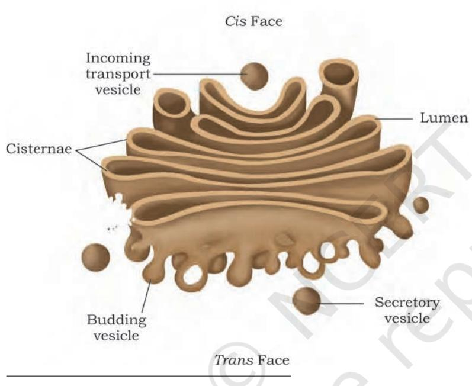

**Chapter 2**  Cellular Organelles

> **Chapter 3** Biomolecules

**Chapter 4** Enzymes and Bioenergetics

> **Chapter 5** Cellular Processes

# **Cell Organelles and Biomolecules Unit II**

Being the structural and functional unit of a living organism, cell has got a very important place in understanding the entire functioning of a living system. Therefore, it is required to have a thorough understanding of the structure and functions of a cell. This unit gives a detailed description of the general characteristics of cell, its structure and growth. Cell theory, which will be explained in Chapter 2 of this unit, offered an intriguing explanation of the living phenomena. It filled the researchers with wonder and compelled them to investigate the molecular structure and physiochemical characteristics of a cell. Chapter 3 deals with details of the molecular compounds responsible for carrying out various cellular processes and sustaining living systems. Central to the various molecular processes are the biocatalysts, without the help of which, all the biochemical reactions in a living system would slow down. The importance of biocatalysts and their mechanism of action will be discussed in Chapter 4. The concepts and mechanisms of some of the important cellular processes have been dealt with in Chapter 5.

Chapter 2 Cellular Organelles.indd 23 11/14/2019 10:10:17 AM

# **G.N. Ramachandran (1922–2001)**

He was born in a small town near Cochin on the Southwestern coast of India. His father taught mathematics at a local college and profoundly influenced Ramachandran's interest in mathematics. Ramachandran completed his graduation in physics in the year 1942 and was the top-ranking student at his college. He received a doctoral degree in 1949 from Cambridge University. His meeting with Linus Pauling considerably directed his attention towards solving the intricate structure of collagen. In 1954, his study on the Triple Helical Structure of Collagen was published in the *Nature*. Ramachandran was the founder of 'Madras School' of conformational analysis of biopolymers. His work on the analysis of the allowed conformations of proteins through the use of 'Ramachandran plot' is considered to be one of the most outstanding contributions in structural biology.

Chapter 2 Cellular Organelles.indd 24 11/14/2019 10:10:19 AM

# **Cellular Chapter 2 Organelles**

- *2.1 Plasma Membrane*
- *2.2 Cell Wall*
- *2.3 Endoplasmic Reticulum*
- *2.4 Golgi Apparatus*
- *2.5 Lysosomes*
- *2.6 Vacuoles*
- *2.7 Mitochondria*
- *2.8 Plastids*
- *2.9 Ribosomes*
- *2.10 Microbodies*
- *2.11 Cytoskeleton*
- *2.12 Cilia and Flagella*
- *2.13 Centrosome and Centrioles*
- *2.14 Nucleus*
- *2.15 Nucleolus*
- *2.16 Chromosome*

## **Overview**

Our body does large number of tasks at a given point of time for example, food digestion, sending electrical messages through nerves, pumping blood from the heart, circulating nutrients, synthesising proteins, filtering urine and many more. All this is possible because of cells which are considered to be the basic unit of life. Each cell is equipped with different machineries known as **organelles** responsible for different functions. You also know that cells present in organisms (unicellular or multicellular) have been broadly characterised into two main categories, based on the nuclear organisation and membrane-bound cell organelles, i.e., prokaryote and eukaryote. Some of the components are common to both prokaryotic and eukaryotic cell. These are plasma membrane, cytoplasm, ribosomes, DNA, etc. Prokaryotic cells are without an organised nucleus and contain numerous ribosomes, mesosomes (folds in plasma membrane) besides having locomotory structures such as flagella in some of them. While a eukaryotic cell has a well-organised nucleus, cell

Chapter 2 Cellular Organelles.indd 25 03 March 2022 10:38:17

membrane and membrane-bound cell organelles such as endoplasmic reticulum, golgi apparatus, mitochondria, plastids, vacuole, lysosomes, peroxisomes, and many more. Advancement in microscopic techniques played a very crucial role in exploring the detailed structure of cell.

Let us now look at an individual cell to understand the structure and functioning, along with the role in establishing cell functioning and life.

# **2.1 Plasma Membrane**

Plasma membrane forms the boundary of the cytoplasm being guarded from outside by extracellular matrix. The membrane is responsible for the relationship of a cell with its surrounding. It is semipermeable in nature. Major breakthrough in understanding the detailed structure of cell membrane was realised only after understanding the chemical composition (lipid and protein mainly) and the discovery of electron microscope in 1950s. Some amount of carbohydrates are also present. A widely accepted model for the organisation of plasma membrane was proposed by Seymour Jonathan Singer and Garth L. Nicolson (1972) as '**The Fluid Mosaic Model**' (Fig. 2.1). The model suggests plasma membrane to be lipid bilayer surrounding the cell with mosaic of globular proteins. Composition of lipid and protein varies in different cells, for example, human erythrocyte membrane contains approximately 52 per cent protein and 40 per cent lipids. Lipid bilayer makes the cell boundary in a quasifluid state and it is dynamic in nature. Due to the fluid nature, lipids and proteins can freely diffuse laterally across the membrane. Phospholipids (the major membrane lipid) is composed of hydrophilic head facing the exterior and long hydrophobic tail of hydrocarbon chains occupying the interior of a lipid bilayer. Two different types of proteins have been identified in the plasma membrane based on their location and association i.e., **peripheral**  and **integral membrane proteins**. Peripheral membrane proteins are mainly involved in cell signalling and these are superficially attached to lipid bilayer. Integral membrane proteins are partially or fully buried in the plasma membrane. Transmembrane proteins are the most abundant type of integral membrane protein. Structurally, prokaryotic cell membrane is similar to that of eukaryotes.

Chapter 2 Cellular Organelles.indd 26 11/14/2019 10:10:19 AM

#### **Box 1**

Edwin Gorter and F. Grendel in the year 1925 collected blood cells (chromocytes) from the artery or vein of mammals. The chromocytes were separated from plasma by several washes with saline solution and extracted using acetone. They obtained lipids that exactly covered the entire surface area of chromocytes like a two-molecular thick layer. They observed all the cells, either prokaryotic or eukaryotic, to be enclosed with welldefined plasma membrane, which maintains cell identity by preserving its internal constituents from the environment. This evidence was further supported by high magnification electron micrograph referring plasma membrane as a 'railroad track', with two densely stained lines of polar heads groups of phospholipids and a lightly stained portion representing hydrophobic fatty acid chain. Its molecular organisation was still rudimentary. On the basis of this, they proposed the bilayer structure of plasma membrane rather than a monolayer, using mammalian RBCs as a model.

*Fig. 2.1: Schematic diagram showing fluid mosaic model of plasma membrane*

A special membranous structure is formed by extension of plasma membrane in the cell, this structure called **mesosome** is in the form of vesicle, tubules and lamellae. Mesosomes increase the surface of plasma membrane.

The quasifluid nature of membrane is useful for different cellular functions such as cell division, cell growth, communication at intercellular junctions, cell secretion, endocytosis, etc. Plasma membrane being selectively

Chapter 2 Cellular Organelles.indd 27 11/14/2019 10:10:20 AM

permeable restricts molecular movement and maintains cell composition. Some of the molecules move passively without any expenditure of energy across the membrane along the concentration gradient called **passive transport**. Passive movement of molecules occurs by the process of diffusion and osmosis. However, a few molecules either charged (for example, ions and amino acids) or uncharged (for example, glucose) cannot cross plasma membrane by simple diffusion. Movement of such molecules is facilitated by **carrier proteins** for example, glucose transporter (Fig. 2.2 (a)) and **channel proteins**. Such molecular movement is known as the **facilitated movement**. **Aquaporins** are one of the critical channel proteins for transport of water in plant and animal cell across the plasma membrane. Some of the well-studied channel proteins in the membrane of muscle and nerve cell are **ion channels** (Fig. 2.2(b)).

*Fig. 2.2: Membrane transport (a) Facilitated transport of glucose and (b) Transport through ion-gated channel*

28

Molecules which are transported against the concentration gradient (i.e., from lower concentration to higher concentration) require utilisation of energy from ATP molecules, e.g. **Na+-K+ pump** (Fig 2.3). This is referred to as **active transport**. However, some active transports are ATP-independent; molecules are transported against the concentration gradients with no energy utilisation from ATP hydrolysis. It couples transport of such molecule with a second molecule transported along the concentration gradient for example, active transport of ions, sugars and amino acids using energy derived from the Na+ gradient.

In coupled transport, if two molecules are transported in the same direction (uptake of glucose and Na+), it is

Chapter 2 Cellular Organelles.indd 28 11/14/2019 10:10:20 AM

Cellular Organelles

called **symport**. If active transport involves transport of two molecules in the opposite direction (transport of Na+ and Ca2+ by Na+-Ca2+ antiporter), it is called **antiport**. While facilitated diffusion transports only single molecule, for example, glucose, it is known as **uniport**.

<i>Fig. 2.3: Active transport through Na+ - K+ pump

## **2.2 Cell Wall**

Cells of bacteria, algae, fungi, and higher plants are also surrounded by a rigid cell wall besides the plasma membrane. It is not found in animal cells. It differs structurally in bacteria and eukaryotes. In bacteria, it is composed of polysaccharide cross-linked by small peptides, which provides rigidity, shape and protection from osmotic pressure; and in eukaryotes (plants and fungi), it is primarily made up of polysaccharides. Cell wall not only determines the cell shape, but also prevents cell bursting caused due to osmotic pressure. It also helps in cell–cell interaction and provides mechanical strength and protection from infection. Gram-positive bacteria have a thick cell wall with the single plasma membrane (Fig. 2.4 (a)). In contrast, gram negative bacteria have a thin cell wall surrounded by a dual plasma membrane (Fig. 2.4 (b)). Cell wall continuously grows and changes its shape as bacteria grows and divides. Structurally, the bacterial cell wall is a sturdy covalent shell of linear peptidoglycan

Chapter 2 Cellular Organelles.indd 29 11/14/2019 10:10:21 AM

30

chain cross-linked by tetrapeptides. Commonly used antibiotics are known to inhibit this cross-linking of peptidoglycan strands and interfering bacterial growth.

*Fig. 2.4: Prokaryotic cell wall; (a) Gram-positive and (b) Gram-negative bacteria*

Among eukaryotes, the cell wall is mainly composed of polysaccharide (Fig. 2.5), which may be of **cellulose** (a linear polymer of glucose residues) for example, most higher plants, or **chitin** (a linear polymer of N-acetylglucosamine) for example, fungi. In plants, a growing cell is surrounded by a comparatively thin **primary cell wall**, having a scope for cell expansion. As it ceases growing, a new layer called **secondary cell wall** is formed between the primary cell wall and plasma membrane. A secondary cell wall is very rigid and thick compared to primary cell wall due to the deposition of **lignin**. A layer of calcium pectate (known as middle lamella) holds together neighbouring cells and connect their cytoplasm through a structure called **plasmodesmata**.

In prokaryotic cells, especially in bacteria, the cell wall is further covered with a heavily glycosylated protein known as **glycocalyx**. It acts as a barrier to invading pathogens and protects the cell from mechanical and ionic stresses. Glycocalyx is also involved in cell-cell interactions. In some cases, it could be present as a loose sheath called **slime layer** and in others, it could be thick and tough called **capsule**.

#### **2.2.1 Endomembrane System**

Among eukaryotes, there are many cell organelles which are bound by membrane similar to that of cell membrane, and these are distinct in terms of structure and function.

Chapter 2 Cellular Organelles.indd 30 03 March 2022 10:39:44

Yet, some membrane bound organelles work together in a system known as endomembrane (endo-'within') system, because their functions are co-ordinated with each other. It comprises a group of membrane bound organelles that work together in protein and lipid synthesis; its processing, packaging and transport to their respective locations inside a cell (Box 2). Endomembrane system includes Endoplasmic Reticulum, Golgi complex, Lysosomes and Vacuole.

(a) Cellulose; Polysaccharide made up of repeating units of β-D-glucose linked via β(1→4) glycosidic linkages

31

(b) Chitin; Polysaccharide made up of repeating units of N-acetylglucosamine linked via β(1→4) glycosidic linkages

*Fig.2.5: Components of eukaryotic cell wall; (a) plant and (b) fungus*

Chapter 2 Cellular Organelles.indd 31 11/14/2019 10:10:21 AM

## **2.3 Endoplasmic Reticulum**

Endoplasmic reticulum (ER) is an extensive network of membrane-enclosed tubules and cisternae located near the nucleus and golgi apparatus. It is exclusively present in a eukaryotic cell. ER is a large and dynamic structure continuously involved in protein synthesis, calcium storage and lipid metabolism. Based on the presence or absence of ribosomes, endoplasmic reticulum may either be **rough ER** or **smooth ER** (Fig. 2.7).

#### **Box 2**

32

In 1960s, the pioneering work of George Palade and colleagues demonstrated the role of ER in protein processing and sorting. They revealed the entire pathway of secretory protein which is as follows:

#### **2.3.1 Rough Endoplasmic Reticulum (RER)**

Rough ER can be distinguished from smooth ER by the presence of ribosomes on its cytosolic surface. Ribosomes are the **protein synthesising factory** of a cell. Proteins synthesised on free ribosomes are released into cytoplasm and they are directly transported to nucleus, mitochondria, chloroplast and peroxisomes to be used within the cell. In case of bound ribosomes, after initiation of protein synthesis, the ribososme-protein complex is tranferred to a receptor on ER in eukaryotes. There the nascent protein under synthesis by ribosome is inserted into ER. These proteins may be either retained in the ER or transported to their destinations via golgi complex through the secretory pathway (Fig 2.6). ER plays a significant role in trafficking of secretory proteins to golgi apparatus, lysosomes and plasma membrane within the eukaryotic cells.

Chapter 2 Cellular Organelles.indd 32 09-Aug-21 3:13:14 PM

2024-25

*Fig. 2.6: Protein sorting in higher eukaryotes*

# **2.3.2 Smooth Endoplasmic Reticulum (SER)**

As mentioned earlier, ribosomes are not present on the surface of smooth ER [Fig. 2.7(a)]. It is mainly involved in lipid metabolism. As lipids are hydrophobic, they can not be synthesised in the cytosol. Most of the lipids are

*Fig. 2.7: Structure of endoplasmic reticulum (a) SER and (b) RER*

Chapter 2 Cellular Organelles.indd 33 03 March 2022 04:15:49

synthesised in the SER and transported to their respective destinations as transport vesicles. Phospholipids are one of the crucial components of a membrane, derived from glycerol. Its synthesis takes place on the outer side (cytosolic side) of SER membrane. SER is also an essential site for cholesterol synthesis.

> First observed by Camillo Golgi, an Italian biologist in 1898, Golgi Apparatus (GA) is a dark stained reticular structure located near the cell nucleus. This was later found to be present in other cell types and named as golgi apparatus or the golgi complex. It is a membrane-bound cell organelle consisting of a series of flattened membranous sacs that look like stacked pouches called **cisternae**. Varied number of cisternae are present in a stack. The membrane of each cisterna in a stack separates its internal

## **2.4 Golgi Apparatus**

*Fig. 2.8: Structure of Golgi apparatus*

34

space from the cytosol. The golgi cisternae are concentrically arranged near the nucleus with distinct *cis* face (cisternae nearest the endoplasmic reticulum) or the forming face and *trans*  face (cisternae away from the endoplasmic reticulum) or the maturing face (Fig. 2.8). The Golgi apparatus principally performs the function of packaging the materials and prepare for secretions (receiving and shipping department). Transport vesicles move material from the ER to the golgi complex.

The material to be secreted moves from ER to the golgi apparatus, during which vesicles are budded off from the ER. These vesicles travel to golgi apparatus and fuse with *cis* face. The *trans* face gives rise to the vesicles that pinch off and travel to other sites (Box 2 at page 32). These vesicles can fuse with the plasma

2024-25

Chapter 2 Cellular Organelles.indd 34 09-Aug-21 4:12:18 PM

membrane, releasing their contents outside of the cell. Some vesicles deliver their contents to other organelles. Protein synthesised by ribosomes of the RER are modified in the cisternae of the Golgi apparatus before they are released from the *trans* face. For example, specific type of sugars are attached to some protein before they are released from the cell. Golgi apparatus is a central membrane organelle for trafficking and post-translational modification of protein and lipid in the cell. Also, it is an important site of formation for Glycoproteins and Glycolipids.

# **2.5 Lysosomes**

Present in the cytoplasm, lysosomes are small spherical vesicles of approximately 0.2 – 0.5 micron in diameter, which are bound by a single membrane containing hydrolytic enzymes capable of breaking down macromolecules. These special vesicles of animal cells and some other eukaryotes are formed either from the golgi apparatus or directly from the endoplasmic reticulum. Lysosomal enzymes show optimal activity at an acidic pH and thus are acid hydrolases, which are used in the dissolution and digestion of redundant structures or damaged macromolecules from within or outside the cell. For example, when an animal cell ingests food into a food vacuole, lysosomes fuse with the vacuole and break down the contents (carbohydrates, proteins, fats and other components) enzymatically. Lysosomes carry out intracellular digestion in a variety of circumstances. They also use their hydrolytic enzymes to recycle the cell's own organic material through a process called **autophagy** and the cell continually renews itself. In Tay-Sachs disease, brain becomes impaired due to accumulation of lipids in the cells because of lack of, or inactivation of lipid digesting enzymes in it.

# **2.6 Vacuoles**

Vacuoles are membrane-bound intracellular organelle found in the cytoplasm of most plants, fungi and also some animal cells. The term 'vacuole' meaning 'empty' comes from its transparent morphology and lack of cytoplasmic material. Its major function is storage, structural support and recycling.

Chapter 2 Cellular Organelles.indd 35 11/14/2019 10:10:22 AM

The number and size of vacuoles varies per plant cell. Young cells have large number of small vacuoles. As the plant cell matures, the vacuoles amalgamate to form a large central vacuole that occupies almost 90 per cent of the cytoplasmic volume. The central vacuole contains water, cell sap, solid inclusions and other metabolites. Other types of vacuoles found in a plant cell are lytic vacuoles, protein storage vacuoles (PSV) and storage vacuoles. The vacuoles are covered by a membrane called the **tonoplast**.

The major function of vacuoles in plant cells is storage, maintaining cell turgor and also to protect cells during biotic stresses. Fungal vacuoles, however are comparatively complex organelle performing a variety of functions apart from storage such as helping in degradative processes, playing role in osmoregulation and maintains intracellular pH. The food vacuoles help in engulfing food particles and the contractile vacuoles in excretion. In case of amoeba, contractile vacuole plays a critical role in excretion and osmoregulation. In many protists, food vacuoles are formed by engulfing food particles.

## **2.7 Mitochondria**

36

Mitochondria (singular: mitochondrion) are found in nearly all eukaryotic cells. Some cells may have single large mitochondrion, but more often a cell has hundreds or even thousands of mitochondria at variable location in cells depending upon the cell function. Mitochondria possess recognisable morphological characteristics despite considerable variability in appearance. A typical mitochondria is sausage shaped. In electron micrographs, they appear mostly as rod-shaped or cylindrical. They vary in size within the range 3.0 to 10.0 μm long and 0.5 – 1.5 μm wide.

Each mitochondrion is a double membrane bound structure i.e., outer and the inner membrane, each consisting of phospholipids bilayer with proteins (Fig. 2.9). The outer membrane is smooth, but the inner membrane has infoldings called **cristae** (singular: crista) that provides it comparatively larger surface area. The inner membrane divides the mitochondrion into two internal compartments. The narrow region between the inner and outer membrane is the **peri-mitochondrial space,** and the innermost compartment lined by inner membrane

Chapter 2 Cellular Organelles.indd 36 11/14/2019 10:10:22 AM

is called **mitochondrial matrix**. The inner membrane and matrix contains all enzymes and proteins involved in the process of tricarboxylic acid (TCA) cycle and cellular respiration for the purpose of ATP synthesis (details given in Chapter 5). Mitochondria also contains DNA molecules, ribosome (70S) and few RNA molecules. Some of the mitochondrial proteins are synthesised by genes present on the mitochondrial DNA. Therefore, mitochondrial matrix is the site of organellar DNA replication,

37

*Fig. 2.9: Longitudinal section of mitochondria showing internal structure*

transcription, protein synthesis and other enzymatic processes. We know that mitochondria consist of well over 1000 proteins which are varying within and between species in response to the needs of the organisms.

## **2.8 Plastids**

Plastids are usually the coloured bodies (as they contain pigments) present in the cytoplasm of plant cells. The term plastid is derived from the Greek word *Plastikas*  (meaning formed or moulded). They are easily observed under the microscope as they are large. They bear some specific pigments, thus imparting specific colours to the plants. Three different types of plastids are recognised on the basis of their pigments or colouration.

- **a) Chromoplasts**—These are coloured plastids containing variously coloured pigments such as yellow, red, pink, violet colours of flowers, fruits, leaves, etc. In chromoplasts, fat soluble pigments like carotene, xanthophylls and others are present.
- **b) Leucoplasts**—These are colourless plastids. They are usually involved in the storage of various kinds of reserve food materials and are named accordingly, as Amyloplasts (storage of starch), Aleuroplasts (storage of protein) and Elaioplasts or Lipoplast (storage of oil).
- **c) Chloroplasts** These are the green plastids, universally found in all the green parts of the plant, specially the green leaves. It contains large quantities of green pigments, called chlorophyll. Chlorophyll is a collection of four pigments, chlorophyll *a*,

Chapter 2 Cellular Organelles.indd 37 09-Aug-21 4:14:17 PM

chlorophyll *b* and the yellow pigments—carotenoids and xanthophylls.

*Fig. 2.10: Sectional view of chloroplast*

38

**Chloroplasts** are located predominantly in the mesophyll cells of the leaves. The chloroplasts of higher plants are generally lens-shaped such as oval, spherical, discoid, flat ellipsoids or even ribbon like organelles and in average 2 to 4 μm wide and 5 to 10 μm long. They are the largest organelles in the plant cell.

The chloroplast is bounded by a double membrane, separated by a very narrow intermediate space. Chloroplast also contains a third inner membrane which is organised into flattened membranous sacs, called **thylakoids**. Thylakoids are arranged in orderly stacks called **grana** (singular: granum), which resemble stacks of coins. Space (fluid) outside the thylakoids and within the chloroplast envelop is the **stroma**, which contains the chloroplast DNA and ribosomes as well as many enzymes. In addition, there are flat membranous tubules called the **stroma lamellae** connecting the thylakoids of the different grana. The membrane of the thylakoids enclose a space called a lumen. The membrane of the chloroplast divides the chloroplast space into three compartments: the intermediate space, the stroma, and the thylakoid space (Fig. 2.10).

Chlorophyll pigments are present in the thylakoids, its membrane contains light-harvesting proteins, reaction centres, electron-transport chains and ATP synthase, which are the primary events of photosynthesis (detail of photosynthesis is given in Chapter 5). The ribosomes of the chloroplasts are smaller (70S) than the cytoplasmic ribosomes (80S).

Chapter 2 Cellular Organelles.indd 38 11/14/2019 10:10:23 AM

# **2.9 Ribosomes**

Ribosomes are '**protein synthesising factories**' scattered throughout the cytoplasm in both prokaryotic and eukaryotic cells. Each ribosome is a membraneless cell organelle, which was first observed by George Palade in 1955 under electron

39

*Fig. 2.11: Subunits of ribosome*

microscope. It was observed to be made up of two subunits after ultracentrifugation of cell lysate.

The number of ribosomes per cell are quite variable but these are rarely numerous. A rapidly growing mammalian cell approximately has 10 million ribosomes. Ribosomes have been classified on the basis of their sedimentation rate in a centrifuge machine i.e., prokaryotic ribosome as 70S and eukaryotic ribosomes as 80S. It is peculiar to note that 70S ribosomes are also present in mitochondria and chloroplast of a eukaryotic cell, suggesting there relatedness to prokaryotic cell. Ribosomes are mainly composed of rRNA and proteins. Each ribosome has a small and a large subunit (Fig. 2.11). The 70S prokaryotic ribosome has larger 50S and smaller 30S subunits. On the other hand, 80S eukaryotic ribosomes also contain two subunits i.e., larger subunit 60S and smaller subunit 40S. In both prokaryotes and eukaryotes, the subunits of ribosomes remain dissociated in the cytoplasm when it is not involved in protein synthesis.

In a ribosomal subunit, rRNAs assume characteristic secondary structure by utilising complementary base pairing and form a distinct three-dimensional structure by associating with ribosomal proteins. Some rRNAs have catalytic activities and are called **ribozymes**.

#### **Box 3**

In ribosomes 70S and 80S, S denotes Svedberg unit, a unit for sedimentation rate. It is named after scientist Theodor Svedberg, a Swedish chemist who won Nobel Prize in chemistry for the invention of ultracentrifuge. Sedimentation rate is the measure of speed with which a particle sediments under gravitational field induced by a centrifuge.

Chapter 2 Cellular Organelles.indd 39 11/14/2019 10:10:23 AM

## **2.10 Microbodies**

These are small, single-membrane bound cell organelles, present only in eukaryotic cells. They are usually present near endoplasmic reticulum. Based on their functional properties, microbodies are classified into two types; peroxisomes and glyoxysomes.

#### **2.10.1 Peroxisomes**

Peroxisomes are small, membrane-bound organelles. They are involved in energy metabolism in the cell, thus, serve as a site for enzymes involved in metabolic reactions. They are derived from ER and replicate by fission. Though, they share morphological similarities with lysosomes, they are assembled in a manner similar to mitochondria and chlororplast in terms of assembly and replication (i.e., by fission). Unlike mitochondria and chloroplast, peroxisome lacks its own genome.

In animal cells, peroxisomes perform two major functions: oxidation and lipid biosynthesis. They contain oxidases that help in peroxide production, and catalase that neutralizes the harmful products of oxidation reaction. In liver cells, peroxisomes also help in alcohol detoxification. In plant cells, peroxisomes have two major roles to play, i.e., conversion of fatty acids into carbohydrates in seeds and photorespiration in leaves.

#### **2.10.2 Glyoxysomes**

Glyoxysomes are specialised peroxisomes found in fungi and other higher plant (especially in fat storage tissues in germinating seeds). When oil filled seeds germinate, then the number and activity of glyoxysomes also increase. Glyoxysomes contain all the enzymes necessary for the fatty acid oxidation, glyoxylate cycle and gluconeogenesis. The seedling uses these sugars synthesised from fats until it is mature enough to produce them by photosynthesis. The conversion of lipids into glucose requires coordinated function of glyoxysomes, mitochondria and plastids.

# **2.11 Cytoskeleton**

Cytoskeleton is a multi-component system made of fibrous protein. It maintains cell organisation and shape. It is a vital component of cell that provides mechanical support

Chapter 2 Cellular Organelles.indd 40 03 March 2022 10:50:45

and plays a very crucial role, especially, during cell division, cell movement and intracellular transport. Cytoskeleton is composed of three major filaments varying in their protein composition and diameter: (1) Microtubules (25 nm) made of tubulin protein, (2) Actin filament (6 nm) made of actin protein and (3) Intermediate filament (10 nm) made of combination of different subunits of protein.

41

- 1. **Microtubules—** They are composed of globular proteins called tubulin (a dimer having α and β subunits). Tubulin proteins undergo polymerisation to form a protofilament. Microtubules are hollow rod-like, may contain 10–15 protofilaments (Fig. 2.12). In addition to its other functions, it is also responsible for rhythmic movement of cilia and flagella.

*Fig. 2.12: Schematic representation of microtubules*

- 2. **Actin Filament** It is observed in skeletal muscle and plays a very important role in muscle contraction. It is richly found in the cytoplasm closer to the plasma membrane. Its main function is to provide strength to the cell and facilitating cytokinesis and cell movement.
- 3. **Intermediate Filaments** These are strong filaments resembling a rope, primarily involved in providing mechanical strength to the cell.

## **2.12 Cilia and Flagella**

Cilia (Singular: cilium) and flagella (Singular: flagellum) are hair-like, microscopic, filamentous protoplasmic processes. Both cilia and flagella are involved in cell motility. Although cilia and flagella are morphologically and physiologically identical, but it can be differentiated on the basis of their size, number and function (Table 2.1). Cilia are smaller in size and present in large number in a ciliated cell whereas, flagella are longer in size and typically vary from one or two in number. The body of a *Paramecium*

Chapter 2 Cellular Organelles.indd 41 03 March 2022 10:51:36

42

*Fig 2.13: Section of cilia/flagella showing different parts*

(unicellular protozoan) is fully covered by a few thousands of cilia. Cells present in the upper respiratory tract of mammals bear cilia to expel particulate matter present in inhaled air. A mammalian spermatozoan contains single flagellum, while a unicellular *Chlamydomonas*, a green alga has two flagella. Even a prokaryotic bacterium has flagella but it differs structurally from a eukaryotic flagella.

Cilia and flagella are fibrillar and made up of microtubules. Their fundamental structure is same. Both arise from a

centriole-like structure known as **basal body**. Electron microscopic view shows that they are bounded by a unit membrane (thickness 90 Å) which is continuous with plasma membrane (Fig. 2.13). They have a core known as **axoneme** in the matrix containing nine peripheral and two central microtubules. Such an arrangement is referred as **9+2 array**. Central fibrils are enclosed by a sheath.

| Characteristics | Cilia | Flagella |
| --- | --- | --- |
| Size | Smaller in size up to 5–10 µm | Larger in size up to 150 µm |
| Location | Occurs throughout the surface of a cell | Occurs at one end of the cell |
| Number | Numerous in number | One or two in number |
| Movement | Moves in a co-ordinated rhythm and | Moves independently and show |
|  | show sweeping or perpendicular stroke | undulatory movement or whiplash |
|  | motion | movement |
| Examples | It is found in— • Protozoans (class—Ciliata) • Ciliated epithelium of metazoan | It is found in— • Protozoans (class—Flagellata) |
|  |  | • Sponges (Choanocyte cells) |
|  | • Larvae of Platyhelminthes, ribbon |  |
|  | worms, Annelids, Mollusca and | • Spermatozoa of Metazoa • Plants (algae and gamete cells) |
|  | Echinodermata |  |

#### **Table 2.1: Difference between cilia and flagella**

## **2.13 Centrosome and Centrioles**

Centrosome is present in animal cell cytoplasm near the nucleus. It consists of two cylindrical centrioles placed perpendicular to each other, embedded in amorphous

Chapter 2 Cellular Organelles.indd 42 09-Aug-21 4:15:30 PM

pericentriolar materials. During cell division, it duplicates in S phase and separates to opposite direction during mitosis M-phase.

43

Centrioles are two cylindrical structures composed of nine triplets of microtubules of tubulin, arranged around a central cavity (Fig. 2.14). They act as a center of mitotic spindle assembly during cell division.

*Fig. 2.14: Schematic view of centrioles*

# **2.14 Nucleus**

As compared to prokaryotes, eukaryotes have a welldefined nucleus (Fig. 2.15), a master controller of cell activities and a vast repository of genomic information. It not only separates genetic material from the cytoplasm, but also regulates gene expression by various mechanisms that are exclusive to eukaryotes.

*Fig. 2.15: Structure of a nucleus*

Chapter 2 Cellular Organelles.indd 43 11/14/2019 10:10:26 AM

#### **2.14.1 The nuclear envelope**

44

It is a dual membrane barrier that prevents easy access of genetic material to selected proteins and regulatory molecules. The nuclear envelope is a phospholipid bilayer similar to the plasma membrane, permeable to only small hydrophobic molecules. It allows trafficking of RNAs and proteins at specific channels, known as **nuclear pore complex**. Nuclear pore complexes are the pores/ interruptions in the continuous outer and inner nuclear membrane at several places. It is surrounded by eight structural protein subunits arranged in a ring-like manner around the central channel. The outer nuclear membrane is continuous with the endoplasmic membrane. A fibrous network of proteins called **lamins** is present below the inner membrane of the nucleus, strengthening the structural framework of the nucleus.

## **2.14.2 The nuclear pore complex and the selective transport**

Nuclear pore complex is a large size pore with a diameter of approximately 120 nm (Fig 2.16), exclusively designed

*Fig. 2.16: Structure of a nuclear pore complex*

Chapter 2 Cellular Organelles.indd 44 03 March 2022 10:52:59

to transport proteins and RNA along with small polar and charged molecules. It is composed of eight structural subunits of **nucleoporins** (a family of pore-forming protein) surrounding a central channel. Electron microscopic visualisation has revealed the eight fold symmetry of nucleoporins, connecting nuclear and cytoplasmic sites.

## **2.14.3 Nucleoplasm**

The nuclear envelope encloses a clear fluid karyolymph or nuclear sap containing protein fibrils called nuclear matrix. It helps to maintain the shape of the nucleus. The enzymes associated with DNA replication and transcription are located in the nuclear matrix. Nucleolus and chromatin are suspended in the nucleoplasm.

# **2.15 Nucleolus**

Like cells, nucleus also comprises a distinct set of organelles referred to as **nuclear bodies**, but they lack a well-defined membrane. It helps in compartmentalising nuclear processes. Nucleolus (Fig 2.15 at page 43) is one of the most distinct nuclear bodies, involved in the synthesis of rRNA and ribosomes. Besides nucleolus, various other structures present are involved in many different activities; that includes transcriptional regulation, gene silencing, DNA repair, rRNA transcription and processing, and many others. The chromosomal region occupied by nucleolus comprises a large number of rRNA synthesising genes; therefore, it was named as **nucleolar organising region**.

# **2.16 Chromosome**

A chromosome is a thread like microscopic structure formed by coiling of DNA packaged with protein containing all genetic material of an organism. Chromosomes can be categorised into two types: **autosomes** (body chromosome(s)) and **allosomes** (sex chromosome(s)). Certain hereditary traits are linked to a person's sex and are passed on through the sex chromosomes. Autosomes contain the rest of the genetic information. Cells in human being have 23 pairs of chromosomes (22 pairs of autosomes and one pair of sex chromosomes), with a total of 46 per cell. Table 2.2 shows the number of chromosomes in some plants and animals.

Chapter 2 Cellular Organelles.indd 45 04 March 2022 12:16:58

#### **Box 4**

Theophilus Painter, an American zoologist first declared the number of human chromosomes as 24 pairs or 48 in 1923 on the basis of microscopic studies which were wrong. It was corrected by Joe Hin Tjio, an Indonesia born American cytogeneticist in 1956 and declared the total number as 46. Every living organism including plants and animals has a fixed number of chromosomes.

| Organism | No. of Chromosomes |
| --- | --- |
| Arabidopsis thaliana (diploid) | 10 |
| Maize (diploid) | 20 |
| Wheat (hexaploid) | 42 |
| Common fruit fly (diploid) | 8 |
| Earthworm (diploid) | 36 |
| Mouse (diploid) | 40 |
| Human (diploid) | 46 |
| Elephant (diploid) | 56 |
| Donkey (diploid) | 62 |
| Dog (diploid) | 78 |
| Gold Fish (diploid) | 100–104 |
| Tobacco (tetraploid) | 18 |
| Oat (hexaploid) | 12 |

#### **Table 2.2: Number of chromosomes in different eukaryotic organisms**

Prokaryote like bacteria or blue-green algae usually contain single circular chromosome (called **nucleoid**) in the cytoplasm as they do not contain well-defined nucleus or other membrane-bounded organelles. However, in some prokaryotes there may be more than one chromosome for example, *Vibrio cholerae.* 

In eukaryotes, the chromosomes are present inside a well-defined nucleus. During the interphase of cell cycle, chromosomes are present in the form of long threads called **chromatin fibres**. The chromatin fibre is composed of nucleosomes. Nucleosomes consist of DNA wrapped around histone proteins. Chromatin enables the long strands of DNA molecules to fit into the cell nucleus. If all of the DNA molecules in a single human cell are unwound from the histones and placed end-to-end, they would

Chapter 2 Cellular Organelles.indd 46 03 March 2022 10:57:14

stretch to 6 feet. During cell division, chromatin fibres condense further to form microscopically visible, long and slender chromosomes. The structure of chromosomes varies through the different phases of cell cycle. During cellular division, chromosomes are replicated (along with its DNA), divided, and passed successfully to their daughter cells. Sometimes, errors do occur leading to changes in the number or structure of chromosomes in new cells which may lead to serious problems.

# **Summary**

- Millions of tasks performed by our body become possible due to the presence of 'cell', which is the 'basic unit of life'. Cells can be broadly categorised into two types, prokaryotic (without membrane bound organelles and presence of nucleoid) and eukaryotic (with membrane bound organelles and presence of nucleus) cells.
- Both prokaryotic and eukaryotic cells are surrounded by a plasma membrane. Plasma membrane is mainly composed of phospholipids. It is selectively permeable and facilitates transport of molecules in and out of the cell. Besides plasma membrane, cells of bacteria, algae, fungi and some higher plants are surrounded by a rigid cell wall.
- Eukaryotic cell has two major compartments: nucleus and cytoplasm. Nucleus is enclosed by a nuclear envelope which has nuclear pores. The nuclear envelope encloses nucleoplasm, nucleolus and the genetic material in form of chromatin. Nucleolus helps in rRNA synthesis. A pair of centrioles form spindle apparatus during cell division in animal cells. Centrosome and centrioles form the basal body of the cilia and flagella which facilitate locomotion.
- Endomembrane system includes the Endoplasmic Reticulum (ER), Golgi Apparatus, Lysosomes and Vacuoles. ER is constituted by tubules called cisternae. It is of two types: rough (with ribosomes) and smooth (without ribosomes). Ribosomes are non-membranous structures involved in protein synthesis.
- Ribosomes may be present freely in the cytoplasm or in bound state on rough ER.
- The function of the ER is to help in synthesis and transport of proteins, lipoproteins and glycogen.

Chapter 2 Cellular Organelles.indd 47 11/14/2019 10:10:27 AM

- Golgi apparatus is a membranous organelle composed of flattened sacs. It performs the packaging of secretory substances and their transport from the cell.
- Lysosomes are single membrane structures containing enzymes for digestion of all types of macromolecules.
- Vacuoles are membrane bound organelles that function in storage, structural support and recycling in the cell.
- Peroxisomes and microbodies take part in oxidation reactions within the cell. Glyoxysomes are peroxisomes involved in fat metabolism.
- Mitochondria are bound by two membranes. Its inner membrane has infoldings called cristae. The mitochondria help in oxidative phosphorylation and generation of ATP.
- In plant cells, pigment containing granules are called plastids. The plastids containing the green pigment, chlorophyll, are known as chloroplasts. Chloroplasts are essential for photosynthesis.

# Exercises

- 1. The Fluid Mosaic Model has been proposed by
	- (a) Robert Brown

48

- (b) Schleiden and Schwann
- (c) Robert Virchow
- (d) Singer and Nicolson
- 2. Ribosomes are composed of
	- (a) only rRNA
	- (b) rRNA and proteins
	- (c) rRNA, proteins and DNA
	- (d) lipids, proteins and DNA
- 3. Tonoplast is
	- (a) a membrane covering the cell wall in plant cells
	- (b) the inner membrane of the mitochondria
	- (c) a membrane covering the vacuoles
	- (d) a membrane covering the plastids
- 4. Describe the various mechanisms of transport across plasma membrane with the help of labelled diagrams.

Chapter 2 Cellular Organelles.indd 48 11/14/2019 10:10:27 AM

- 5. Match the following

| Column I |  | Column II |
| --- | --- | --- |
| (a) Nucleolus | (i) | Alcohol detoxification |
| (b) Mesosome | (ii) | Infoldings of inner mitochondrial |
|  |  | membrane |
| (c) Vacuoles | (iii) | Protein synthesis |
| (d) Cristae | (iv) | Disc shaped sacs in Golgi |
| (e) Ribosomes | (v) | rRNA synthesis |
| (f) Thylakoid | (vi) | Membranous extensions of |
|  |  | plasma membrane |
| (g) Peroxisomes | (vii) | Storage and structural support |
| (h) Cisternae | (viii) | Membranous sacs in chloroplast |

- 6. What is the significance of the ratio of protein and lipids in membranes? How does varying the concentration of lipids in a membrane affect its function?
- 7. State the importance of cell wall in prokaryotic cells.
- 8. A eukaryotic cell contains organelles which may be bound by a single-membrane; double-membrane or non-membrane bound organelles. Classify the various eukaryotic organelles into these three types.
- 9. Mention the different types of vacuoles.
- 10. Peroxisomes share similarities as well as differences with mitochondria and chloroplast. Comment.
- 11. What are glyoxysomes? Where are these present? Mention their functions.
- 12. Cell is the structural and functional unit of life. Justify the statement.
- 13. Distinguish between
	- (a) cilia and flagella
	- (b) primary and secondary cell wall
	- (c) lysosomes and vacuoles
	- (d) microtubules and actin filaments
	- (e) active and passive transport

Chapter 2 Cellular Organelles.indd 49 11/14/2019 10:10:27 AM

