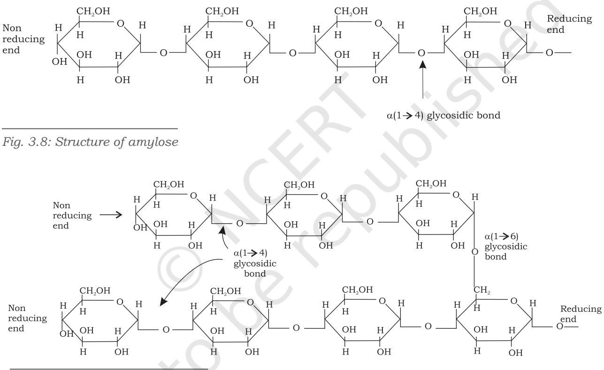

- *3.1 Carbohydrates*
- *3.2 Fatty Acids and Lipids*
- *3.3 Amino Acids*
- *3.4 Protein Structure*
- *3.5 Nucleic Acids*

In the previous chapter you have learnt about the cell and its organelles. Each organelle has distinct structure and therefore performs different function. For example, cell membrane is made up of lipids and proteins. Cell wall is made up of carbohydrates. Chromosomes are made up of protein and nucleic acid, i.e., DNA and ribosomes are made up of protein and nucleic acids, i.e., RNA. These ingredients of cellular organelles are also called **macromolecules** or **biomolecules**. There are four major types of biomolecules carbohydrates, proteins, lipids and nucleic acids. Apart from being structural entities of the cell, these biomolecules play important functions in cellular processes. In this chapter you will study the structure and functions of these biomolecules.

# **3.1 Carbohydrates**

Carbohydrates are one of the most abundant classes of biomolecules in nature and found widely distributed in all life forms. Chemically, they are aldehyde and ketone derivatives of the polyhydric alcohols. Major role of carbohydrates in living organisms is to function as a primary source of energy. These molecules also serve as energy stores,

Chapter 3 Carbohydrade Final 30.018.2018.indd 50 11/14/2019 10:11:16 AM

metabolic intermediates, and one of the major components of bacterial and plant cell wall. Also, these are part of DNA and RNA, which you will study later in this chapter. The cell walls of bacteria and plants are made up of polymers of carbohydrates. Carbohydrates also act as informational materials and linked to surfaces of proteins and lipids to act in cell–cell interaction, and in the interaction between cells with other elements in the cellular environment where they play role.

51

# **(A) Classification of carbohydrates**

Carbohydrates are found in various forms ranging from simple sugars to complex polymers of more than one unit, and accordingly these have been classified. They are commonly classified into three categories namely, monosaccharides, oligosaccharides and polysaccharides.

## **1. Monosaccharides**

Monosaccharides are simple sugars which cannot be further hydrolysed into simpler forms. These monosaccharides are the simplest carbohydrates, which contain free aldehyde (-CHO) and ketone (>C=O) groups, with two or more hydroxyl (-OH) groups with a general formula of Cn(H2O)n. Based on the number of carbon atoms and functional groups, monosaccharides are classified as given in Table 3.1.

|
|  |

| S. No. | Class of monosaccharides based on number of carbon |  | Class of monosaccharides based on functional groups |
| --- | --- | --- | --- |
|  | atoms | Aldoses | Ketoses |
| 1. | Trioses (C3H6O3) | Glyceraldehyde (an aldotriose) | Dihydroxyacetone (a ketotriose) |
| 2. | Tetroses (C4H8O4) | Erythrose | Erythrulose |
| 3. | Pentoses (C5H10O5) | Ribose | Ribulose |
| 4. | Hexoses (C6H12O6) | Glucose | Fructose |

# **2. Oligosaccharides**

Conventionally, oligosaccharides are carbohydrates having two to ten units of monosaccharides joined together by glycosidic bond. Some commonly occurring oligosaccharides are maltose, lactose, sucrose, etc.

Chapter 3 Carbohydrade Final 30.018.2018.indd 51 11/14/2019 10:11:16 AM

## **3. Polysaccharides**

52

Polysaccharides are polymers of ten or more monosaccharide units joined together by glycosidic linkages. These are classified in a number of ways depending upon the type of repeating monosaccharide unit (homo- and hetero-polysaccharides); in the degree of branching, and in the type of glycosidic linkage between the monomeric units. Examples of some common polysaccharides are starch, glycogen, cellulose and chitin.

Carbohydrates can be conjugated to proteins and lipids to form **glycoconjugates**. There are three types of glycoconjugates; **glycoproteins, proteoglycans** and **glycolipids**. If the protein component is predominant in the association of carbohydrate and protein, it is called glycoprotein. If the association contains major amount of carbohydrate than protein, then it is called proteoglycan. When the carbohydrate conjugates with lipids, it is called glycolipid.

## **(B) Structure and properties of carbohydrates**

#### **(a) Monosaccharides**

Structure of some common monosaccharides are given in (Fig 3.1). Monosaccharide such as glucose exists both as

*Fig. 3.1: Structure of some monosaccharides*

Chapter 3 Carbohydrade Final 30.018.2018.indd 52 11/14/2019 10:11:16 AM

straight chain structure and cyclic structure (Fig. 3.2). Cyclic structures are the result of hemiacetal formation by intramolecular reaction between carbonyl group and a hydroxyl group.

*Fig. 3.2: Structure of glucose: (a) straight chain and (b) cyclic form*

All monosaccharides except dihydroxy acetone contain one or more asymmetric (chiral) carbon (carbon atoms bound by four different groups), thus, are optically active isomers **(enantiomers)**. A molecule with *n* chiral centres can have 2n stereoisomers. Thus, glyceraldehyde with one chiral centre has 21=2 and glucose with four chiral centres has 24=16 stereoisomers.

The orientation of the –OH group that is most distant from the carbonyl carbon determines whether the sugar belongs to D or L sugars. When this–OH group is on the right side of the carbon atom bearing it then the sugar is D-isomer, and when it is on the left, the sugar is L isomers (Fig. 3.3). Most of the sugars present in the biological system are D sugars.

Isomeric forms of monosaccharide that differ only in their configuration about the hemiacetal (formed due to reaction between alcoholic and aldehyde groups of a monosaccharide) or hemiketal (formed due to reaction between alcoholic and keto groups of a monosaccharide) carbon atom are called

**anomers**. The carbonyl carbon atom is called the anomeric carbon. In the - anomer, the -OH group of the carbon is on the opposite of the sugar ring from CH2OH group at the chiral centre that designates the D and L configuration (C-5 in case of glucose). The other anomer is known as β-anomer.

53

Chapter 3 Carbohydrade Final 30.018.2018.indd 53 11/14/2019 10:11:16 AM

54

The interconversion of α and β anomers in aqueous solution is called **mutarotation**, in which one ring form opens briefly into the linear form, then closes again to produce β anomers (Fig 3.4).

*Fig. 3.4: Two cyclic forms of glucose* 

Isomers having different configuration of –OH only at one carbon atom are known as epimers. The most important **epimers** of glucose are mannose (epimers at C-2) and galactose (epimers at C-4) as shown in Fig. 3.5.

*Fig. 3.5: The epimers of glucose*

## **(b) Disaccharides**

Disaccharides consist of two monosaccharides joined by glycosidic linkage. The disaccharide maltose contains two D-glucose residues joined by a glycosidic linkage, which is a covalent bond formed by joining of –OH group of one monosaccharide with the anomeric carbon of the other sugar unit. Lactose is made up of D-galactose and D-glucose residues (Fig. 3.6 and 3.7).

Disaccharides can be hydrolysed to yield their constituent monosaccharides by boiling with dilute acid. Hydrolysis of sucrose yields a mixture of glucose and fructose.

Chapter 3 Carbohydrade Final 30.018.2018.indd 54 11/14/2019 10:11:16 AM

55

*Fig. 3.6: Formation of maltose from two molecules of D-glucose*

Lactose -D-galactopyranosyl-(1 4) -D-glucopyranose)

*Fig. 3.7: Structure of lactose*

## **(c) Polysaccharides**

Depending on the functional roles played by homopolysaccharides are divided into storage polysaccharides and structural polysaccharides. Storage polysaccharides serve as storage form of monosaccharide that is used as fuel. Starch is an example of storage polysaccharide in plants, and glycogen is the storage

Chapter 3 Carbohydrade Final 30.018.2018.indd 55 11/14/2019 10:11:16 AM

polysaccharide in animals. Structural polysaccharides such as cellulose and chitin serve as structural elements in plant cell wall and animal exoskeleton, respectively. Heteropolysaccharides, unlike homopolysaccharides, provide extracellular support for organisms. In extracellular space of animal tissues, these form a matrix that holds individual cells together and provides shape, support and protection to the cells and tissues. The names and properties of some homopolysaccharides are given in Table 3.2

|
|  |

| Name | Constituent | Size (no. of monosaccharide | Biological significance |
| --- | --- | --- | --- |
|  | monosaccharide | residues) |  |
|  |  | 50–5000 |  |
| Starch | α-D-glucose |  | Storage of energy in plants |
|  |  | Up to 106 |  |
| Glycogen | α-D-glucose | Up to 50000 | Storage of energy in bacteria and animals |
| Cellulose | β-D-glucose | Up to 15000 | It plays structural role and provides rigidity |
|  |  |  | and strength to the cell wall. |
| Chitin | β-N-acetyl-D | Very large | It plays structural role and provides rigidity |
|  | glucosamine |  | to exoskeleton of insects. |
| Inulin | β-D-fructose | 30–35 | Storage of energy in plants. |
| Pectin | α-D-galacturonic | - | It has structural role: holds cellulose fibrils |
|  | acid |  | together in plant cell walls. |
| Dextran | α-D-glucose | Wide range | It plays structural role as an extracellular |
|  |  |  | adhesive in bacteria. |
| Xylan | β-D-xylose | 30–100 | It has storage and supporting roles in |
|  |  |  | plants. |

# **Examples of some common polysaccharides**

## **(a) Starch**

Starch occurs in plants as reserve carbohydrate in tubers, seeds, fruits and roots. It is composed of two homopolysaccharides, amylose (15-20%) and amylopectin (80–85%). Amylose is a linear polymer of α-D-glucose monomers and linked by α(1→ 4) bonds (Fig.3.8). Amylopectin, on the other hand, consists of glucose units

Chapter 3 Carbohydrade Final 30.018.2018.indd 56 11/14/2019 10:11:16 AM

linked by α(1→ 4) glycosidic linkage, like amylose. However, unlike amylose, it is highly branched. Branch points occur every 24 to 30 glucose residues and linkage at the branch points is α(1→ 6) glycosidic (Fig. 3.9). Characteristic blue colour of the starch with iodine is due to amylose. In contrast, amylopectin gives only dull reddish brown colour with iodine. The enzymes present in saliva (salivary amylase) and pancreatic juice (pancreatic amylase) hydrolyses α(1→ 4) glycosidic linkages of starch therefore digesting it into monomeric glucose residues.

57

*Fig. 3.9: Structure of amylopectin*

## **(b) Glycogen**

Glycogen is an extensively branched storage homopolysaccharide found in animals. Similar to amylopectin, it consists of glucose units joined together by α(1→ 4) glycosidic linkage and having α(1→ 6) linkage at branching points. Muscle cells contain glycogen at 1–2 per cent of their dry weight, and liver cells contain up to 10 per cent of their dry weight as glycogen.

Chapter 3 Carbohydrade Final 30.018.2018.indd 57 11/14/2019 10:11:17 AM

#### **(c) Cellulose**

Cellulose is the most abundant extracellular structural polysaccharide found in plants. It is also the most abundant of all biomolecules in the biosphere. It is the primary structural component of plant cell wall. Structurally, cellulose is a linear polymer of upto 15000 D-glucose units linked by β(1→ 4) glycosidic bonds (Fig. 3.10). Unlike starch, cellulose cannot be digested by humans as human gut lacks the β(1→ 4) glycosidic bond hydrolysing enzyme known as cellulase. However, cattles and termites can digest cellulose as their gut harbors symbiotic microorganisms that secrete cellulase which hydrolyses and digests cellulose.

*Fig. 3.10: Structure of cellulose*

58

#### **(d) Chitin**

Chitin is a linear polysaccharide of β(1→ 4) linked N-acetyl-D-glucosamine residues. It is the main structural component of the exoskeleton of invertebrates (crustaceans, insects and spiders), and main component of cell walls of most fungi. Chitin and cellulose have similar structures except that OH group at second carbon position of cellulose is replaced by an acetamido group in chitin. Extensive hydrogen bonding of N-acetyl side chains makes chitin tough and insoluble polymer.

#### **(e) Peptidoglycan**

Peptidoglycan constitutes the rigid component of bacterial cell wall. It is heteropolysaccharide of alternating β(1→ 4) linked N-acetyl-D-glucosamine (NAG) and N-acetyl muramic acid (NAM) residues. The linear polysaccharide chains are cross linked by short peptides attached to N-acetyl muramic acid. Cross linking by peptide welds the polysaccharide chains into a strong sheath that envelops the entire cell and prevents osmotic rupture of the cell.

Chapter 3 Carbohydrade Final 30.018.2018.indd 58 11/14/2019 10:11:17 AM

Lysozyme, which is an enzyme present in human tears kills bacteria by hydrolysing the β(1→ 4) glycosidic linkage of peptidoglycan.

#### **Box 1**

#### **Agar**

Agar is gelatinous heteropolysaccharide produced in the cell wall of marine red algae such as species of *Gelidium*, *Gracilaria*, *Gigartina,* etc. It is a mixture of sulphated heterpolysaccharides made up of D-galactose and L-galactose derivatives ether-linked between C3 and C6. Agarose is the agar component with very few charged groups (sulfates, pyruvates). It has molecular weight in the range of 80,000-1,40,000. If agar and agarose are dissolved in hot water, they form solution which upon cooling sets to a gel. Agarose gels are used as inert support for the electrophoretic separation of nucleic acids. Agar is used to form a surface for the growth of bacterial and plant tissue cultures.

59

# **3.2 Fatty Acids and Lipids**

Lipids are a group of organic compounds found in living organisms. They vary in their structures and functions. Because of their hydrophobic and non-polar nature, lipids are soluble in organic solvents. Lipids are primarily made up of hydrocarbon chains connected to glycerol via ester linkage. We broadly classify lipids into two categories–simple lipids and compound lipids. Various types of lipids are included within these two major categories of lipids. These include fats, triacylglycerols, wax, phospholipids, steroids, etc.

Fatty acids are obtained as a result of hydrolysis of fats. Naturally occurring fatty acids are generally synthesised from two carbon units and hence, contain even number of carbon atoms (Fig. 3.11). Synthesised from 2 carbon units, fatty acid chains may be saturated (having no double bonds) or unsaturated (having one or more double bonds) (Table 3.3).

$\begin{array}{c}\includegraphics[height=36.135pt]{Fig1}\end{array}$

#### *Fig. 3.11: Structure of a fatty acid (stearic acid)*

Fatty acids are denoted by total number of carbon followed by colon (:) and then total number of double bonds with

Chapter 3 Carbohydrade Final 30.018.2018.indd 59 03 March 2022 11:39:07

Δ (delta) having superscript number defining the position of the double bond in parenthesis. For example a fatty acid with 18 carbon with two double bonds between C-9 and C-10 and C-12 and C-13 will be denoted as 18:2 (Δ9,12).

Unsaturated fatty acids are of two types based on the degree of unsaturation as follows:

**Monounsaturated fatty acids:** 'Mono' means single. Therefore, monounsaturated fatty acid contains only a single double bond. for example, oleic acid (Fig. 3.12).

*Fig. 3. 12: Structure of unsaturated fatty acid (oleic acid)*

60

**Polyunsaturated fatty acids:** As the name suggests, these fatty acids contain more than one double bond. e.g., Linoleic acid contains two double bonds, Linolenic acid contains three double bonds; and Arachidonic acid contains four double bonds.

**Table 3.3: Some examples of saturated and unsaturated fatty acids indicating their chain length and melting point**

| Common name | Symbol | No. of Carbons | Melting Point |
| --- | --- | --- | --- |
| Saturated |  |  |  |
| Lauric acid | 12:0 | 12 | 44˚C |
| Myristic acid | 14:0 | 14 | 58˚C |
| Palmitic acid | 16:0 | 16 | 63˚C |
| Stearic acid | 18:0 | 18 | 69˚C |
| Arachidic acid | 20:0 | 20 | 77˚C |
| Unsaturated |  |  |  |
| Palmitoleic acid | 16:1 (Δ9) | 16 | 0˚C |
| Oleic acid | 18:1 (Δ9) | 18 | 13˚C |
| Linoleic acid | 18:2 (Δ9, 12) | 18 | -5˚C |
| Arachidonic acid | 20:4 (Δ5, 8, 11, 14) | 20 | -49˚C |

# **Classification of lipids**

## **1. Simple Lipids**

A simple lipid is a fatty acid ester having various alcohols with no other group. For example, fats and waxes.

Chapter 3 Carbohydrade Final 30.018.2018.indd 60 11/14/2019 10:11:17 AM

- **(a) Triacylglycerols:** Widely known as triglycerides (or neutral fats), these compounds are the esters of glycerol and fatty acids (Fig. 3.13). The triglycerides containing the same fatty acids in all three ester positions are called simple triglycerides. The triglycerides contain more than one fatty acid at its three positions which are called mixed triglycerides. Triacylglycerol is essential for providing energy to body. Triglycerides are a vehicle of energy storage, primarily in adipose tissue.
- **(b) Waxes:** Wax is formed as a result of esterification of fatty acids with a monohydric alcohol of high molecular weight. Waxes are found in a wide variety of organisms. For example, wax serves as a protective coating on the surface of animals and plants, and also reduces water loss in tropical plants.

## **2. Compound lipids**

Compound lipids are fatty acid esters with alcohols and contain additional groups. The fatty acid components of these lipids make hydrophobic tails, and the alcohol moiety along with additional group constitutes hydrophilic head. Such a structure is known as amphipathic molecules. Common examples of compound lipids include phospholipids and steroids.

**Phospholipids** are amphipathic molecules made up of two hydrophobic fatty acid tails and a hydrophilic phosphate group head. Phospholipids are primarily found in cell membranes. These compounds are composed of fatty acid chains attached to a glycerol backbone **(glycerophospholipids)** or sphingoid base backbone **(sphingophospholipid)** (Fig. 3.14). A modified phosphate group occupies the third carbon of glycerol in glycerophospholipids. A phospholipid is defined by the kind of modifier attached to the phosphate group. The most common are choline (phosphatidylcholine) and serine (phosphatidylserine). Similarly, in the case of sphingolipids, when the head group contains only a hydrogen atom, it is called ceramide. Many a time, the head group in sphingolipids can be phosphocholine, yielding a sphingomyelin. In sphingolipids, the fatty acid

61

*Fig. 3.13: Structure of triacylglycerol*

Chapter 3 Carbohydrade Final 30.018.2018.indd 61 11/14/2019 10:11:17 AM

chain is attached to the sphingoid backbone via amide linkage instead of ester linkage.

*Fig. 3.14: Structure of (a) glycerophospholipid and (b) sphingophospholipid*

Phospholipids do not spontaneously mix with water. Instead, they acquire a sphere-shaped structure known as **micelle**.

**Steroids** are distinct from other lipids in having a peculiar four-fused ring structure. However, like all the other types of lipids discussed so far, steroids are hydrophobic in nature and insoluble in water. In a cell, steroids act as receptor

*Fig. 3.15: Structure of cholesterol*

ligands and help to control the metabolism. **Cholesterol** is the most common derivative of steroids (Fig. 3.15). Synthesised primarily by the liver, cholesterol is the key precursor of all the steroid hormones, including testosterone and estradiol. Besides, cholesterol is also found in the plasma membrane of most eukaryotes, where it provides rigidity. Common examples of steroids

found in plants are phytosterols and stigmasterols which regulate membrane fluidity and permeability. Ergosterol is an important precursor of vitamin D and is typically found in fungi.

Chapter 3 Carbohydrade Final 30.018.2018.indd 62 03 March 2022 11:40:40

# **3.3 Amino Acids**

Amino acids, the building blocks of proteins, are represented by general formula:

$$\mathrm{\boldmath~\Gamma~}_{\mathrm{R}}-\mathrm{\boldmath~\Gamma~}_{\mathrm{C}}^{\mathrm{H}}-\mathrm{\boldmath~\Gamma~}_{\mathrm{COOH}}$$

where central carbon atom is called α-carbon, which is linked to four different groups; an acidic carboxylic (-COOH), a basic amino (-NH2) group, a hydrogen atom, and an R group called side chain. Only the side chain R varies in all 20 amino acids, it can be as simple as a hydrogen atom (H) in glycine or it can be a methyl (-CH3) in alanine. The carboxylic group contributes the first carbon, and the carbon atom to which carboxylic group is attached is called α-carbon. Since the α-carbon of most amino acids is tetrahedrally attached by four different groups, hence α-carbon of amino acids is chiral or asymmetric. Because of this asymmetric α-carbon, amino acids are present in two optically active forms or mirror image forms (Fig. 3.16). L

In L isomers –NH2 group is present to the left and in D isomers –NH2 group is present to the right of α-carbon. Only L isomers of amino acids are found in proteins, D isomers are rare in biological protein. List of the 20 standard amino acids is given in Table 3.4. Structure of the 20 amino acids are given in Fig. 3.17 to 3.21.

## **Table 3.4: 20 standard amino acids along with their three letter and one letter symbol**

| Amino acid | Abbreviation symbol | Single letter |
| --- | --- | --- |
|  | (Three letter) | symbol |
| Polar, uncharged R groups |  |  |
| Serine | Ser | S |
| Threonine | Thr | T |
| Cysteine | Cys | C |

Chapter 3 Carbohydrade Final 30.018.2018.indd 63 11/14/2019 10:11:17 AM

| 64 |  |  |
| --- | --- | --- |
| Asparagine | Asn | N |
| Glutamine | Gln | Q |

| Aromatic R groups |  |  |
| --- | --- | --- |
| Phenylalanine | Phe | F |
| Tryptophan | Trp | W |
| Tyrosine | Tyr | Y |
| Non-polar aliphatic amino acids |  |  |
| Glycine | Gly | G |
| Valine | Val | V |
| Alanine | Ala | A |
| Proline | Pro | P |
| Leucine | Leu | L |
| Isoleucine | Ile | I |
| Methionine | Met | M |
| Positively charged (basic) R groups |  |  |
| Lysine | Lys | K |
| Arginine | Arg | R |
| Histidine | His | H |
| Negatively charged (acidic) R groups |  |  |
| Aspartate | Asp | D |
| Glutamate | Glu | E |

*Fig. 3.17: Structure of polar uncharged amino acids*

Chapter 3 Carbohydrade Final 30.018.2018.indd 64 11/14/2019 10:11:17 AM

*Fig. 3.19: Structure of non-polar aliphatic amino acids*

Chapter 3 Carbohydrade Final 30.018.2018.indd 65 11/14/2019 10:11:18 AM

*Fig. 3.21: Structure of negatively charged amino acids*

# **Nomenclature**

The numbering of carbon in amino acids is done using Greek letters. The additional carbons attached to α-carbon in an R group are designated β (beta), γ (gamma), δ (delta), ε (epsilon) and so on proceeding out from α-carbon. Like other organic molecules, numbering of carbon atoms begins from the carboxylic group and carboxylic carbon being C-1 and α-carbon would be C-2 (Fig. 3.22).

*Fig. 3.22: Numbering of carbon atoms of L-lysine*

## **Electrochemical properties of amino acids**

At physiological pH (pH=7) the α-COOH group and α-NH2 group of amino acids are ionized (deprotonated) in solutions to form –COO- (bearing negative charge) and the –+NH3

Chapter 3 Carbohydrade Final 30.018.2018.indd 66 11/14/2019 10:11:18 AM

(bearing a positive charge), respectively. This dipolar state of amino acids is called **zwitterion.** Zwitterions state occurs as a result of migration of proton from carboxyl group to amino group (Fig. 3.23).

#### **Non-standard and non-protein amino acids**

Some amino acids are non-standard amino acids. These amino acids occur naturally in the cells but do not take part in protein synthesis. They are generated after protein synthesis by modification of the specific standard amino acids. Examples are 4-hydroxyproline (formed by hydroxylation of proline), 5-hydroxylysine, selenocysteine and γ-carboxyglutamic acid. Amino acids that are not part of proteins are widely present in various plants, animals, and microbes known as non-protein amino acids. Some non-protein amino acids are L-ornithine, L-citrulline, β-alanine, creatine, and γ-aminobutyrate.

# **3.4 Protein Structure**

Proteins are the most abundant macromolecules present in all cells from simplest bacteria to human beings and plants. Proteins are the most diverse group of macromolecules; a single cell may contain thousands of different proteins. Proteins are made up of 20 naturally occurring amino acids, which are linked covalently to form a linear sequence. The most remarkable thing is that cells can produce proteins with entirely different structures and properties by joining the 20 amino acids in many different combinations. From these building blocks, the organisms can make vast variety of products such as catalysts (enzymes), antibodies, transporters, hormones, transcription factors, muscle fibres, membrane proteins etc. These products participate in all vital processes such as, in the transport of oxygen and nutrients to each cell, muscle contraction, transmission of nerve impulse, control of metabolism, growth and differentiation, providing mechanical support, immune response, signal transduction and many more.

Composition of amino acids and their order in proteins decide the structure of a protein. Four levels of protein structures namely primary, secondary, tertiary and quaternary have been described. Primary structure is a sequence of amino acids linked through covalent bond

$$\begin{array}{c}{{\begin{array}{c}{{\mathrm{COO}^{-}}}\\ {{|}}\\ {{\mathrm{H}-\mathrm{C}-\mathrm{H}_{3}\mathrm{N}^{+}}}\\ {{|}}\\ {{\mathrm{H}}}\end{array}}}\end{array}$$

*Fig. 3.23: Zwitterion of glycine*

67

Chapter 3 Carbohydrade Final 30.018.2018.indd 67 11/14/2019 10:11:18 AM

called as peptide bond. Secondary structure is with specific residual pattern based stable structure, while tertiary structure includes 3-dimensional folding of polypeptides. Quaternary structure is the complex of two or more polypeptide subunits.

# **3.4.1 Primary structure of proteins**

68

The primary structure of proteins is the linear chain of amino acid sequences that are linked through peptide bonds (Fig. 3.24).

*Fig. 3.24: Primary structure of protein (a) Reaction showing peptide bond formation (b) Long polypeptide chain containing linear sequence of amino acids linked by peptide bond*

> The peptide bond (also called amide bond) is formed by coupling of the α-carboxyl group of one amino acid to an α-amino group of another amino acid. Formation of a peptide bond between two amino acids is accompanied

Chapter 3 Carbohydrade Final 30.018.2018.indd 68 11/14/2019 10:11:18 AM

by the loss of water molecules. Each amino acid unit in a polypeptide is therefore called a residue.

69

The equilibrium of this reaction lies on the side of the hydrolysis rather than synthesis. Hence, the biosynthesis of peptide bond requires an input of free energy.

On the basis of number of amino acids constituting a chain, the peptides may be called as a dipeptide (containing two amino acid units), a tripeptide (containing three amino acid units) and so on. A polypeptide chain has polarity because its ends are different. The two ends are named as amino (or N-terminal) and carboxy (or C-terminal) ends. In the naming of a polypeptide, the convention is that the N-terminal residue, present at the extreme left, is written first and the C-terminal residue is written at the end. Thus, in the pentapeptide Tyr-Ala-Gly-Ser-Leu (YAGSL), tyrosine is the amino-terminal residue and leucine is the carboxy-terminal residue.

In a polypeptide constituent, amino acids are named by adding the suffix –yl (because all these are acyl groups) to all the amino acids except the last one where no suffix is added. For example, the pentapeptide Tyr-Ala-Gly-Ser-Leu (YAGSL) is named as Tyrosyl-L-alanyl-L-glycyl-L-seryl-Lleucine. If the sequence of amino acid in this pentapeptide is not known, the abbreviation would be (Tyr, Ala, Gly, Ser, Leu), the parenthesis and commas indicate that only the composition of the pentapeptide is known.

On an average, the majority of natural polypeptides contain 50 to 2000 amino acid residues. The mean molecular weight of an amino acid residue is about 110 Da (Dalton is the unit of mass).

#### **Box 2**

#### **Conformation of peptide bond**

Six atoms of a pair of amino acids linked by a peptide bond, lie in the same plane i.e., has a planar structure. These atoms are the α-carbon atom and CO group from the first amino acid, and NH group and α-carbon from the second amino acid. Planar structure is the result of resonance interactions that give the peptide bond an ~40% double bond character. Due to this double bond character, the peptide bond cannot rotate freely.

Chapter 3 Carbohydrade Final 30.018.2018.indd 69 11/14/2019 10:11:18 AM

#### **The flexibility of polypeptide backbone**

70

The backbone of protein is a linked sequence of rigid planar peptide bonds. In contrast to peptide bond, which has partial double bond character, the bonds between the – NH2 group and α-C, and between α-C and –COOH group are pure single bonds. The rotation of two bonds, adjacent to peptide bond results in various orientations. Because of this freedom of rotation about two bonds of each amino acids residues linked, there are many possible ways proteins can fold. The rotation angles of these bonds can be specified by dihedral angles (torsion angles). The rotation angle about the Cα–N bond is called phi (φ). The angle of rotation between Cα–C bond is called psi (ψ). A clockwise rotation about either bond as viewed from the front of the back group corresponds to a positive value. The φ and ψ angles determine the path of the polypeptide chain. By convention, both φ and ψ are defined as 0° in the conformation, in which the two peptide bonds are

*Trans and cis conformation of a peptide bond*

connected to a single carbon in the same plane. The dihedral angles, φ and ψ can have any value between -180° and +180°, but most of the values of φ and ψ are prohibited. The conformation in which φ and ψ are both 0° is also prohibited because of steric interference between atoms of polypeptide backbone and the amino acid side chains.

#### **Ramachandran Plot**

The conformation of a fully stretched polypeptide chain having φ = ψ = 180° can be determined if the value of φ and ψ for each amino acid residue is present in the

Chapter 3 Carbohydrade Final 30.018.2018.indd 70 11/14/2019 10:11:18 AM

71

*Rotation about bonds in the polypeptide. φ is rotation angle between Cα–N bond and ψ is rotation angle between Cα–C bond*

polypeptide chain. In 1963 G.N. Ramachandran identified that an amino acid residue in polypeptide chain cannot just have any pair of values of φ and ψ. The values of φ and ψ that are permissible can be predicted by assuming atoms as hard/solid spheres. The allowed values of φ and ψ can be represented on a two-dimensional plot called Ramachandran plot. For poly-L-serine, this plot shows three separate allowed regions

#### *A Ramachandran Plot*

(shaded in the Figure). One region contains φ-ψ values that produce the parallel β sheet, the antiparallel β sheet, and the collagen helix. The second region includes φ-ψ values that produce the right-handed α helix, and the third region has left-handed α helix. Though left-handed α helices come in sterically allowed region, but this conformation is not found in proteins due to less stability.

Chapter 3 Carbohydrade Final 30.018.2018.indd 71 11/14/2019 10:11:18 AM

# **3.4.2 Secondary structure of proteins**

Secondary structure of protein deals with folding of the polypeptide chain. In 1951, Linus Pauling and Robert Corey proposed two types of periodic structures called α-helix and β pleated sheet.

## **Helix**

72

A polypeptide chain with planar peptide bonds can form a helical structure by twisting about the Cα–N and the Cα–C bonds called α-helix. Thus, an α-helix is a rod-like structure (Fig. 3.25). The hydrogen bonds between NH and CO group of the main chain stabilise the helix. CO group of each amino acid forms hydrogen bonds with the NH group of the amino acid that is situated four residues ahead in the sequence. All the main chain NH and CO groups are hydrogen bonded, except the amino acids near the ends of the helix. Also, helices are connected by loops.

The helix can be right-handed (clockwise) or lefthanded (counter clockwise). Right-handed helices are sterically more stable due to less clash between side chains and the backbone. All known polypeptides contain righthanded helix. The occurrence of α helical content in proteins ranges widely. For example ferritin, a blood protein that helps storage of iron, has 75% of its amino acid residues form α helix.

*Fig. 3.25: α-Helix*

These α-helical structures, present in myosin and tropomyosin of muscles and keratin of hair, provides mechanical strength to the stiff bundles of fibers.

Chapter 3 Carbohydrade Final 30.018.2018.indd 72 11/14/2019 10:11:19 AM

# **β Pleated sheet**

The second type of periodic structure that Pauling and Corey suggested was β pleated sheet. In contrast to α-helix, β pleated sheet involves hydrogen bonds between groups from residues distant from each other in the linear sequence. In β sheets, two or more strands widely separated in the protein sequence are arranged side by side, with hydrogen bonds between the strands. Based on the orientation of the strands, β sheets are of two types: parallel and anti-parallel β sheets (Fig. 3.26). If the strands run in the same direction they are called parallel β sheets; if strands run in opposite direction they are called antiparallel β sheets. Parallel β sheets are less twisted as compared to anti-parallel. The branched amino acids such as valine and isoleucine possess extended structure, therefore can fit more easily in β sheet structure than in a tightly coiled α helix where side chains are more crowded.

73

*Fig. 3.26: Structure of β pleated sheets*

# **3.4.3 Tertiary structure of protein**

The overall three-dimensional arrangement of all residues in a protein is called tertiary structure of the protein. In contrast to secondary structure, the tertiary structure includes larger range aspects of amino acid sequences. The amino acids that are far apart in a polypeptide chain within different types of secondary structures may interact with each other to form the completely folded structure of a protein. In tertiary structure, there is an involvement of some additional bonds like disulfide, hydrogen, hydrophobic and ionic (Fig. 3.27). The disulfide bonds are formed by oxidation of a pair of cysteine residues.

Chapter 3 Carbohydrade Final 30.018.2018.indd 73 11/14/2019 10:11:19 AM

These bonds make the protein globular in shape. Some enzymes, transport protein, peptide hormones, and immunoglobulins are globular in shape. In the tertiary structure, the polar R groups of amino acid residues are located on the outer side because of their hydrophilic nature, and the non-polar R groups of amino acid residues are located in the interior to form hydrophobic interaction. The three-dimensional structure of more than one thousand proteins has been revealed by x-ray crystallography and nuclear magnetic resonance (NMR) techniques.

*Fig. 3.27: Tertiary structure of protein*

74

# **3.4.4 Quaternary structure of protein**

Some proteins may consist of more than one polypeptide subunit, which may be identical or different in their primary structure. These subunits associate specifically to each

*Fig. 3.28: The quaternary structure of protein (Haemoglobin)*

Chapter 3 Carbohydrade Final 30.018.2018.indd 74 11/14/2019 10:11:19 AM

other to form a comparatively larger and complex molecule, i.e., quaternary structure. Quaternary structure is the spatial arrangement of the protein subunits. These subunits are stabilised by hydrogen bonds, electrostatic interactions, ionic bonds and disulfide bridges. Depending upon subunit numbers, the quarternary structures may be dimer, trimer, etc. Identical protein subunits form homodimer, homotrimer, etc. whereas non-identical subunits form heterodimers, heterotrimer, etc. The quaternary structure of haemoglobin is given in Fig. 3.28.

# **3.5 Nucleic Acids**

The cell organelles, namely nucleus, mitochondria and chloroplast contain nucleic acid within them. Within nucleus, nucleic acids are associated with histone proteins to form chromatin. Nucleic acids are polymers of nucleotides linked through phosphodiester linkages. Two types of nucleic acids are present in cells, namely deoxyribonucleic acid (DNA) and ribonucleic acid (RNA). DNA acts as a genetic material and inherits the information from one generation to next. However, RNA serves as genetic material in some viruses.

Nucleotides of DNA and RNA are made up of nitrogenous base, sugar and phosphate. The sugar that is present in nucleic acids is pentose sugar which is of two types; the one present in DNA is **2'-deoxy-D-ribose,** and the other present in RNA is **D-ribose**. Both the pentoses are present as closed five membered rings (Fig. 3.29). For numbering pentoses of nucleotides the carbon numbers are given a prime (′) designation to differentiate them from the numbered atoms of the nitrogenous bases.

*Fig. 3.29: Structure of pentose sugars present in nucleic acids*

Chapter 3 Carbohydrade Final 30.018.2018.indd 75 09-Aug-21 4:48:00 PM

Nitrogenous bases are of two types; **purines** and **pyrimidines**. The two purine bases of DNA and RNA are **adenine (A)** and **guanine (G)**. Among pyrimidines, **cytosine (C)** is present in both DNA and RNA, **thymine (T)** is present in DNA only and **uracil (U)** is present in RNA only. The structure of five major bases is shown in (Fig. 3.30). The purine and pyrimidine bases contain aromatic ring structures which absorb light at a wavelength near 260 nm.

76

*Fig. 3.30: Structure of nitrogenous bases present in nucleic acids*

A base (either purine or pyrimidine), a pentose sugar unit and a phosphate group are linked together to form a **nucleotide**. On the other hand, a base linked only to a pentose sugar unit without a phosphate group is called a **nucleoside**. The four nucleosides of DNA are named as deoxyadenosine, deoxyguanosine, deoxycytidine and deoxythymidine. The nucleotides in DNA are called deoxyribonucleotides or deoxyribonucleoside-5'-monophosphates, which form the structural unit of DNA. They are of four types namely; deoxyadenylate (deoxyadenosine-5'-monophosphate; dAMP), deoxyguanylate (deoxyguanosine-5'-monophosphate; dGMP), deoxycytidylate (deoxycytidine-5'-monophosphate; dCMP) and deoxythymidylate (deoxythymidine-5'-monophosphate; dTMP) (Fig. 3.31). Nucleotides in DNA are indicated by prefix 'd' as they contain deoxyribose rather than ribose sugar.

Chapter 3 Carbohydrade Final 30.018.2018.indd 76 17-Aug-21 12:06:48 PM

77

*Fig. 3.31: The nucleosides and nucleotides present in DNA and RNA*

Chapter 3 Carbohydrade Final 30.018.2018.indd 77 11/14/2019 10:11:20 AM

78

The four nucleosides of RNA are called adenosine, guanosine, cytidine, and uridine, which, when bound to a phosphate group, make ribonucleotides or ribonucleoside-5'-monophosphate. There are four types of ribonucleotides namely; adenylate (adenosine-5'-monophosphate; AMP), guanylate (guanosine-5'-monophosphate; GMP), cytidylate (cytidine-5'-monophosphate; CMP) and uridylate (uridine-5'-monophosphate; UMP).

# **3.5.1Polynucleotide chain**

Nucleotides of both DNA and RNA are covalently linked, in which the 3' hydroxyl (-OH) group of the sugar of one nucleotide unit is esterified to -OH group of phosphate attached to 5' carbon atom of the sugar of the next

*Fig. 3.32: Primary structure of (a) DNA and (b) RNA*

Chapter 3 Carbohydrade Final 30.018.2018.indd 78 10-Aug-21 10:01:54 AM

nucleotide, forming a phosphodiester linkage (Fig. 3.32). Like a polypeptide chain, a polynucleotide chain has a specific polarity, i.e., distinct 5' and 3' ends. The 5' end has phosphate group at C-5' of sugar while 3' end has free -OH group at C-3' of ribose. The base sequence in a polynucleotide chain is written in the 5'→3' direction.

79

James Watson and Francis Crick in 1953 proposed the double helical (three dimensional) structure of DNA (Fig. 3.33 (b)). It consists of two polynucleotide chains of DNA wound around the same axis to form right handed double helix. The two strands are oriented antiparallel, i.e., their 3' and 5' phosphodiester bonds run in opposite directions. The sugar and phosphate form the backbones of the double helix and remain exposed to the polar environment. The bases of both the strands are stacked inside the core of the double helix and make it hydrophobic. Within the helix each nucleotide base of one strand makes hydrogen bonds in the same plane with the base of the other strand. A of one strand forms two hydrogen bonds with T of the other strand (A=T) and *vice versa* and G on one strand forms three hydrogen bonds with C on the other strand (G≡C) and *vice versa* (Fig. 3.33 (a)).

*Fig 3.33: (a) Base pairing in DNA and (b) Watson-Crick double helical model of DNA*

Chapter 3 Carbohydrade Final 30.018.2018.indd 79 03 March 2022 11:44:03

The Watson-Crick structure of DNA is also known as B-DNA. B-DNA is the most stable form of DNA. The other two structural variants are A-DNA and Z-DNA. A-DNA is right handed double helix. It is wider and contains 11 base pairs per helix. Z-DNA is left handed double helix with 12 base pairs per helix.

The bases of two strands of DNA double helix are joined by hydrogen bonds [Fig. 3.33 (a)]. Heating disrupts hydrogen bonds between the base pairs, and thereby separation of the two strands of DNA takes place called **denaturation** or **melting**. The temperature at which half of the DNA is denatured is called **melting temperature (Tm).** Apart from heating, melting is also caused by acid or alkali. The two strands of nucleic acids that are separated by melting, can spontaneously reassociate to form a double helix if temperature is decreased below Tm. This process of reassociation or renaturation is called **annealing**.

*Fig 3.34: Schematic representation of a typical prokaryotic mRNA*

## **3.5.2 Types of RNA**

#### **Messenger RNA (mRNA)**

It is a single strand linear polyribonucleotide chain that carries genetic information from DNA to ribosome. At the 5' end is UTR (untranslated region) containing no genetic information for polypeptide synthesis. It is followed by initiation codon, coding region and stop codon. At the 3' end is present another UTR (Fig. 3.34). In eukaryotic mRNA, 5' end contains guanylate which is methylated at its N-7. This process is called capping. 3' end of mRNA also undergoes polyadenylation (addition of several adenylate

80

residues). *Fig. 3.35: Structure of a tRNA molecule*

Chapter 3 Carbohydrade Final 30.018.2018.indd 80 11/14/2019 10:11:20 AM

## **Ribosomal RNA (rRNA)**

It forms the structural components of ribosomes. 70S prokaryotic ribosomes have 16S rRNA in smaller subunit (30S), 23S and 5S rRNAs in larger subunit (50S). The eukaryotic ribosome (80S) has 18S rRNA in smaller subunit (40S) and 28S, 5.8S and 5S rRNAs in larger subunit (60S).

81

#### **Transfer RNA (tRNA)**

These are small RNA molecules that transfer amino acids to ribosome during protein synthesis. It is a single ribopolynucleotide chain folded to form four arms. The acceptor arm has a CCA sequence at 3'OH end which is amino acid binding site (Fig. 3.35). The anticodon arm has anticodon, a set of three bases which recognises a specific codon of mRNA during translation.

# **Summary**

- Carbohydrates are made up of carbon, hydrogen and oxygen atoms, and are widely distributed in animal and plant tissues.
- Carbohydrates are categorised into 4 major classes, namely monosaccharides (e.g., glucose, ribose), disaccharides (e.g., sucrose, lactose), oligosaccharides (e.g., raffinose) and polysaccharides (e.g., starch, glycogen).
- Monosaccharides can be classified as trioses, tetroses, pentoses, hexoses, etc., depending on the number of carbon atoms in the molecule.
- Pentose sugar such as ribose is an important component of nucleic acids, coenzymes.
- Two monosaccharides linked by glycosidic bond make a disaccharide (e.g., sucrose ).
- Polysaccharides perform various roles as the storage form of energy and also as structural component.
- Lipids are organic compounds found in living organisms. These are made up of hydrophobic fatty acid chains linked to glycerol via ester bond.
- Fatty acids are long chain hydrocarbon containing carboxylic acid group. Fatty acids may be saturated (having no double bonds) or unsaturated (having one or more double bonds). Nomenclature of fatty acids is based

Chapter 3 Carbohydrade Final 30.018.2018.indd 81 11/14/2019 10:11:20 AM

on total number of carbons, total number of double bonds and position of double bonds.

- Lipids are broadly classified into two classes–simple and compound lipids.
82

- Simple lipids include triacylglycerol and waxes, which are esters of glycerol with fatty acids and esters of high molecular weight alcohol with fatty acids, respectively.
- Compound lipids include membrane lipids which are of two types, glycerophospholipids and sphingolipids. Compound lipids are amphipathic molecules made up of hydrophilic phosphate tails.
- Glycerophospholipid contains glycerol backbone and sphingolipids contain sphingoid base backbone.
- Steroids are another class of compound lipids made up of four-fused ring structure. Cholesterol is the most common steroid found in animals. It is the precursor of all steroid hormones and vitamin D.
- The amino acids are organic compounds containing amine (-NH2) and carboxyl (-COOH) functional groups, along with a side chain (R group) specific to each amino acid.
- There are 20 standard amino acids and some nonstandard amino acids (e.g. 4-hydroxy proline, 5-hydroxy lysine, etc.) and some non-protein amino acids (e.g., L-ornithine, L-citrulline, etc.)
- In a polypeptide chain, the amino acids are linked covalently via peptide bond in a linear fashion to make a protein.
- There are four levels of protein structures, namely primary, secondary, tertiary and quaternary.
- Primary structure of proteins is the linear chain of amino acid sequences linked through peptide bonds.
- Secondary structure of protein is the three dimensional form of polypeptide.
- The two major types of secondary structures are α-helix and β-sheets.
- Tertiary structure is the three dimensional arrangement of protein.
- Quaternary structure is the complex arrangement of folded protein subunits, stabilised through hydrogen bonds, electrostatic interactions, etc.
- Nucleic acids are the polymer of nucleotide which contain nitrogenous bases (adenine, guanine, cytosine, thymine and uracil), sugar and phosphate.

Chapter 3 Carbohydrade Final 30.018.2018.indd 82 11/14/2019 10:11:21 AM

- Deoxyribonucleic acid (DNA) and ribonucleic acid (RNA) are the two types of nucleic acids.
83

- DNA is genetic material of almost all the organisms except some viruses where RNA is the genetic material.
- DNA contains deoxyribose sugar and thymine while RNA contains ribose sugar and uracil in place of thymine.
- In DNA, adenine forms 2 hydrogen bonds with thymine (A=T) and cytosine forms 3 hydrogen bonds with guanine (C≡G).
- J.Watson and F.Crick (1953) described the three dimensional double helical structure of DNA.
- The mRNA, tRNA, rRNA are the major types of RNA.

# Exercises

- 1. Describe the classification of carbohydrates.
- 2. Differentiate between D- and L-forms of glucose.
- 3. Draw the structure of a disaccharide made up of two monosaccharides glucose and fructose.
- 4. Draw the partial structure of starch and glycogen.
- 5. Write the major functions of carbohydrates.
- 6. Describe isomerisation in monosaccharides.
- 7. Differentiate between sphingolipids and glycerolipids.
- 8. Why are membrane lipids called amphipathic?
- 9. Differentiate between saturated and unsaturated fatty acids.
- 10. Describe the various categories of amino acids.
- 11. What is zwitterion and how is it developed?
- 12. What are non-standard and non-protein amino acids?
- 13. How the peptide bonds are formed?
- 14. Draw the structure of Lys-Glu-Lys.
- 15. Describe the various secondary structures of protein.
- 16. Differentiate between tertiary and quaternary structure of proteins.
- 17. Differentiate between nucleosides and nucleotides.
- 18. Explain the primary structure of DNA.

Chapter 3 Carbohydrade Final 30.018.2018.indd 83 11/14/2019 10:11:21 AM

- 19. Draw the structure of A-T-C-G polynucleotide.
- 20. Explain Watson and Crick model of DNA.
- 21. Describe the various forms of DNA.
- 22. Describe the clover leaf model of tRNA.
- 23. In carbohydrates which of these functional groups are present
	- (a) Alcohol and carboxyl groups
	- (b) Aldehyde and ketone groups
	- (c) Hydroxyl and hydrogen groups
	- (d) Ether and ester groups
- 24. Which of the following is a non-reducing disaccharide?
	- (a) Maltose

84

- (b) Lactose
- (c) Sucrose
- (d) Cellobiose
- 25. The repeating units of proteins are
	- (a) Glucose units
	- (b) Amino acids
	- (c) Fatty acids
	- (d) Nucleotides
- 26. Which of the following is the most common secondary structure of proteins
	- (a) α-helix
	- (b) β-pleated sheet
	- (c) Both (a) and (b)
	- (d) None of the above
- 27. A nucleotide contains
	- (a) Nitrogenous base, sugar and phosphate
	- (b) Sugar and phosphate
	- (c) Nitrogenous base and sugar
	- (d) None of the above
- 28. The two strands in DNA double helix are joined by
	- (a) Covalent bond
	- (b) Hydrogen bond
	- (c) Glycosidic bond
	- (d) Phosphodiester bond
- 29. Which is an example of storage lipid?
	- (a) Fatty acids
	- (b) Triacylglycerol
	- (c) Sphingolipids
	- (d) Eicosanoids
- 30. In glycerolipids fatty acids are joined to glycerol through which bond?
	- (a) Phosphodiester bond
	- (b) Glycosidic bond
	- (c) Peptide bond
	- (d) Ester bond

Chapter 3 Carbohydrade Final 30.018.2018.indd 84 11/14/2019 10:11:21 AM

