- *4.1. Enzymes: Classification and Mode of Action*
- *4.2. Brief Introduction to Bioenergetics*

## **4.1 Enzymes: Classification and Mode of Action**

Enzymes are biocatalysts and they catalyse the biochemical reactions both *in vivo* as well as *in vitro*. They are highly specific to its substrate and have great catalytic power, i.e., they enhance the rate of reaction tremendously without being changed. All enzymes are proteins with exception of some small group of catalytic RNA molecules called **ribozymes**. Like proteins, the molecular weight of enzymes ranges from about 2000 to more than one million Dalton. Enzymatic activity of proteinaceous enzymes may be affected depending on the conformational structure as well as its denaturation. There are many enzymes which require cofactors for their catalytic activity. The cofactor may be a complex organic molecule called coenzyme (Table 4.1) or it may be a metal ion such as Fe2+, Mn2+, Zn2+, Mg2+ (Table 4.2). An enzyme plus its cofactor is called **holoenzyme**. In such cases, the protein component in cofactor requiring enzyme is called **apoenzyme**.

Chapter 4 enzymes and Bioengertics.indd 85 10-Aug-21 10:04:57 AM

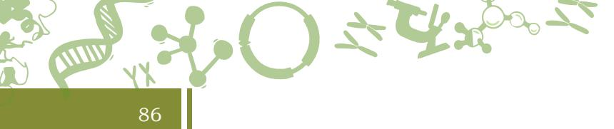

| Coenzyme | Precursor vitamin | Role in the catalytic reaction |
| --- | --- | --- |
| Biocytin | Biotin (vitamin B7) | Transfer of CO2 |
| Coenzyme B12 (5'-adenosylcobalamin) | Vitamin B12 | Transfer of an alkyl group |
| Flavin adenine dinucleotide (FAD) | Riboflavin (vitamin B2) | Transfer of electrons |
| Coenzyme A | Pantothenic acid | Transfer of acyl and alkyl group |
|  | (vitamin B3) |  |
| Nicotinamide adenine dinucleotide (NAD) | Niacin (vitamin B5) | Transfer of hydride (:H- ) |
| Pyridoxal phosphate | Pyridoxine (vitamin B6) | Transfer of amino group |
| Thiamine pyrophosphate | Thiamine (vitamin B1) | Transfer of aldehydes |
| Tetrahydrofolate | Folic acid (vitamin B9) | Transfer of one carbon group |

**Table 4.1: Some coenzymes and their precursor vitamins and their role**

Coenzymes take part in catalysis transiently and are carriers of specific functional groups. Most of the coenzymes are derived from vitamins (organic nutrients required in small amounts in diet).

#### **Table 4.2: Metal ions that serve as cofactors for enzymes**

| Metal Ions | Enzyme name |
| --- | --- |
| Fe2+ or Fe3+ | Catalase, peroxidase, cytochrome oxidase |
| Cu2+ | Cytochrome oxidase |
| Mg2+ | DNA polymerase |
| Mn2+ | Arginase |
| K+ | Pyruvate kinase |
| Mo2+ | Nitrogenase, nitrate reductase |
| Zn2+ | Carbonic anhydrase, alcohol dehydrogenase |
| Ni2+ | Urease |

When a coenzyme or metal ion is tightly bound through covalent bond with the enzyme protein, it is called a **prosthetic group**.

#### **4.1.1 Classification of enzymes**

In order to have a systematic study and to avoid ambiguities considering the fact that new enzymes may also be

Chapter 4 enzymes and Bioengertics.indd 86 10-Aug-21 10:07:26 AM

discovered, International Union of Biochemistry (I.U.B.) in 1964 has adopted classification of enzymes depending on the type of reactions they catalyze. According to this commission, all enzymes are classified into 6 major classes (Table 4.3).

| Class No. | Class name | Type of reaction catalyze |
| --- | --- | --- |
| 1. | Oxidoreductases | Oxidation-reduction reactions (transfer of electrons) |
| 2. | Transferases | Transfer of groups |
| 3. | Hydrolases | Hydrolytic reactions (transfer of functional groups to water) |
| 4. | Lyases | Addition or removal of groups to form double bonds |
| 5. | Isomerases | Transfer of groups within molecules to yield isomeric forms |
| 6. | Ligases | Condensation of two molecules coupled through ATP hydrolysis |

87

| Table 4.3: Classification of enzymes adopted by I.U.B. |
| --- |

#### **Isozymes**

Many enzymes are present in multiple forms (more than one molecular form) in the same species, tissue or even in the same cell. These enzymes are called **isoenzymes** or **isozymes**. Isoenzymes catalyse the same reaction but have different amino acid composition, hence, possess different physicochemical properties. For example, a glycolytic enzyme, hexokinase exists in four isozyme forms in various tissues. Similarly, lactate dehydrogenase (LDH), involved in anaerobic glucose metabolism has two isozyme forms in human, one is present in heart and the other is found in skeletal muscles.

#### **Enzyme active site**

The catalytic reaction performed by enzymes occurs at a particular site on the enzyme. This site is called **active site**, and represents only small part of the total size of the enzyme. The active site is a clearly defined pocket or cleft in the enzyme molecule where the whole or a portion of substrate can fit. Active site has a three-dimensional structure since it consists of portions of a polypeptide chain. Various non covalent bonds involved in enzyme substrate binding are electrostatic interactions, hydrogen bonds, Van Der Waals forces and hydrophobic interactions. The active site often comprises non polar environment which facilitates the binding of substrate and the catalysis.

Chapter 4 enzymes and Bioengertics.indd 87 11/14/2019 10:11:45 AM

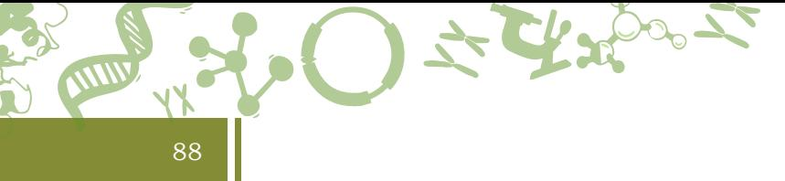

However, some polar residues may be present. This type of environment is not found in any other region of the enzyme molecule.

## **Fischer's Lock and Key Model**

In 1894, the introduction of **Lock and Key Model** for the substrate and enzyme interaction was proposed by Emil Fischer. According to this model, complementary structural features are present between enzyme and substrate, and the active site is pre-shaped to fit the substrate. The substrate can fit into its complementary site on the enzyme as a key fits into a lock. This results in the formation of an enzyme-substrate complex (Fig. 4.1).

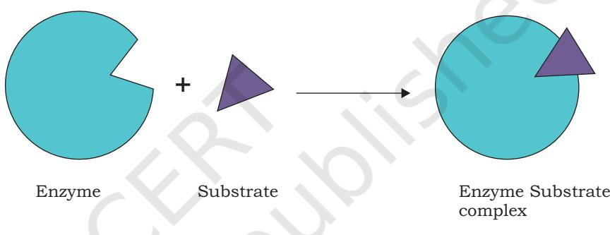

*Fig. 4.1: Interaction between an enzyme and its substrate according to lock and key model*

## **Koshland's Induced Fit Model**

Daniel Koshland in 1958 proposed **Induced Fit Hypothesis**. He suggested that the structure of a substrate may be complementary to that of the active site in the enzymesubstrate complex but not in the free enzyme. The interaction between the substrate and the enzyme induces conformational changes in the enzyme which aligns the

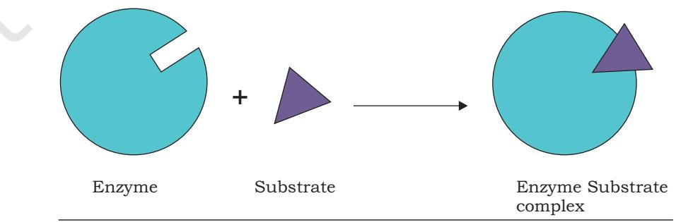

*Fig. 4.2: Interaction between an enzyme and its substrate according to induced fit model*

Chapter 4 enzymes and Bioengertics.indd 88 11/14/2019 10:11:45 AM

amino acid residues or other groups for substrate binding, catalysis, or both. The relationship between a substrate and an active site resembles hand and woollen glove. During interaction, the structure of one component, i.e., substrate or hand remains rigid and the shape of the second component, i.e., active site or glove flexible to become complementary to that of the first (Fig. 4.2).

#### **Enzyme specificity**

The enzymes are highly specific in action. In fact, the properties that make enzymes such a strong catalysts are their specificity of substrate binding and their ideal arrangement of catalytic group. Various types of enzyme specificity are: group specificity, absolute specificity, stereospecificity and geometrical specificity. When enzymes act on several different closely related substrates then it is called **group specificity**. When enzymes act only on one particular substrate, it is called **absolute specificity**. **Stereochemical or optical specificity** occurs when substrate exists in two stereochemical forms (chemically identical but different arrangement of atoms in three-dimensional space) then only one of the isomers will undergo reaction by particular enzyme. For example, D-amino acid oxidase catalyses oxidation of the D-amino acids to keto acids. In **geometrical specificity**, enzymes are specific towards *cis* and *trans* forms. For example, fumarase catalyses the interconversion of fumarate and malate.

#### **4.1.2 Factors affecting enzyme activity**

Rate of enzyme catalysed reactions is influenced by changing the environmental conditions. The important factors that influence the velocity of enzyme catalysed reactions are temperature, pH, substrate concentration and modulators.

#### 1. Temperature

The rate of an enzyme catalysed reaction increases with the increase in temperature up to a maximum and then falls. When a graph is plotted between temperature versus enzyme activity, a bell-shaped curve is obtained (Fig. 4.3). The temperature at which the maximum rate of reaction occurs is called the enzyme's optimum temperature. The optimum temperature is different for different enzymes;

Chapter 4 enzymes and Bioengertics.indd 89 10-Aug-21 10:08:56 AM

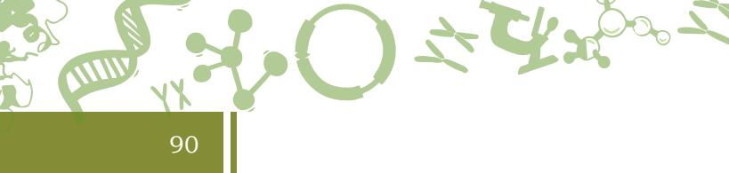

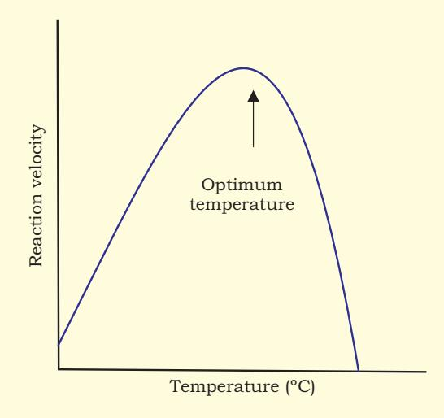

*Fig. 4.3: Effect of temperature on enzyme activity*

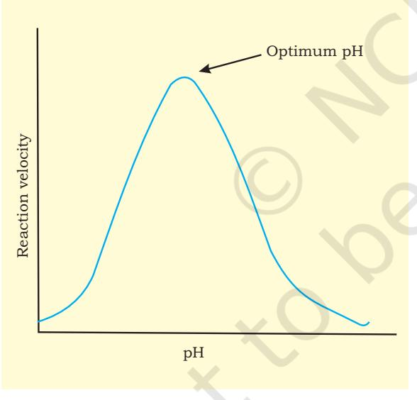

*Fig. 4.4: Effect of pH on enzyme activity*

but for most of the enzymes it is between 40°C-45°C. Majority of enzymes in the human body have an optimum temperature of around 37°C (98.6°F) and are denatured or degraded at extreme temperatures. However, few enzymes like Taq DNA polymerase present in thermophilic bacteria, *Thermus aquaticus,* venom phosphokinase and muscle adenylate kinase are active even at 100°C.

#### 2. Hydrogen Ion Concentration (pH)

Enzyme activity is also affected by pH. A plot of enzyme activity against pH results in a bell shaped curve (Fig. 4.4). Each enzyme has its unique optimum pH at which the rate of reaction is greatest. The optimum pH is the pH at which the activity of a particular enzyme is at maximum. Many enzymes of higher organisms show optimum reaction rate around neutral pH (6-8). However, there are several exceptions such as pepsin (pH 1-2), acid phosphatases (pH 4-5) and alkaline phosphatases (pH 10-11). Below and above the optimum pH, the enzyme activity is much lowered and at extreme pH, the enzyme becomes totally inactive.

### 3. Substrate concentration

The substrate concentration also influences enzyme activity. As the substrate concentration increases the rate of reaction also increases. This is because the more substrate molecules will interact with enzyme molecules, the more products will be formed. However, after a certain concentration, further increase in substrate concentration will have no effect on the rate of reaction, since the substrate concentration will no longer be the limiting factor (Fig. 4.5). At this stage, enzyme molecules become saturated and work at their maximum possible rate.

Chapter 4 enzymes and Bioengertics.indd 90 10-Aug-21 10:09:52 AM

#### **4.1.3 Unit of enzyme activity**

The **enzyme unit (U)** is that amount of enzyme that catalyses the conversion of 1 micromole of substrate per minute under standard conditions. The International Union of Biochemistry (I.U.B.) adopted enzyme unit as unit of enzyme activity in 1964. But it was discouraged in favour of the **katal** since the minute is not an SI unit. One katal (kat) is the amount of enzyme that catalyses 1 mole of substrate per second, so 1 kat = 60,000,000 U.

#### **4.1.4 Specific activity**

Another common unit of enzyme is specific activity. It is defined as the moles of product formed by an enzyme in

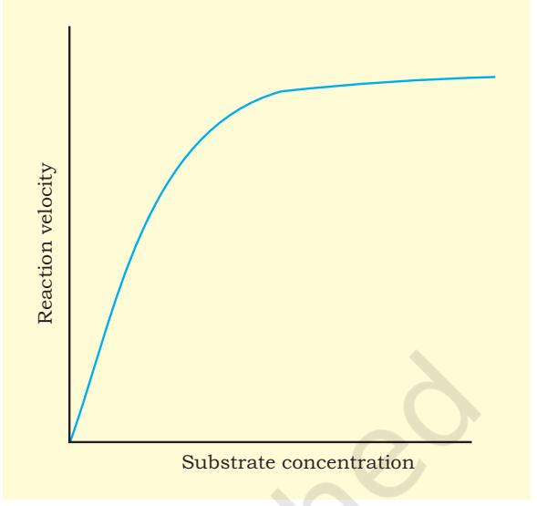

91

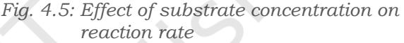

a given amount of time (minutes) under given conditions per milligram of proteins. Specific activity represents a measurement of enzyme purity in the mixture.

#### **4.1.5 Mechanism of enzyme action**

For understanding the enzyme mechanism, you should consider two thermodynamic properties of a reaction. These are the free energy difference (∆G) between products and reactants and the energy needed to initiate the conversion of reactant into product. The former energy, i.e., ∆G determines whether the reaction is spontaneous, whereas the latter determines the rate of reaction. Enzymes affect the energy, which determines the rate of reaction. The enzymes cannot change the laws of thermodynamics and therefore, cannot alter the equilibrium of a biochemical reaction. They speed up the attainment of equilibrium.

Rate of reaction rather depends on the free energy of activation (∆GA), which is not related to ∆G. The substrate S of a reaction converted into product P via formation of a transition state has higher free energy than either S or P. The difference between the free energy of transition state and substrate is called **Gibbs free energy of activation** or simply **activation energy (∆GA)**. The enzymes enhance reaction rate without altering ∆G of the reaction, rather they lower the activation energy, ∆GA.

2024-25

Chapter 4 enzymes and Bioengertics.indd 91 03 March 2022 11:48:18

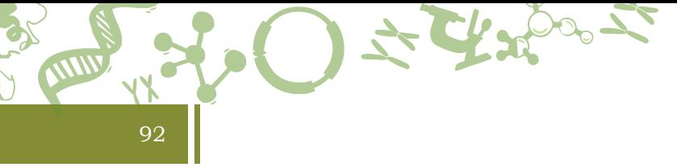

#### **Kinetics of enzyme-catalysed reaction**

During catalysis, substrate S binds at the active site of the enzyme E and results in formation of enzyme substrate complex ES, which is finally converted into product P. The reaction can be represented as: E+s Es E+P

Where, E forms weakly bonded complex ES with the substrate S. The ES complex decomposes to yield product P and the free enzyme E.

The kinetics of enzyme catalysed reactions was explained by Leonor Michaelis and Maud Menten in 1913. The most remarkable feature of this kinetics is that specific ES complex is an intermediate during catalysis. Michaelis-Menten theory of enzyme kinetics is the simplest one that accounts for kinetic properties of many enzymes.

Further simplifying the reaction, Michaelis-Menten derived following equation for one substrate reaction.

$$\mathbf{v}_{0}={\frac{\mathbf{\nabla}\mathbf{V}_{\mathrm{max}}\ \ [\mathbf{S}]}{\mathbf{K}_{\mathrm{m}}\ +[\mathbf{S}]}}$$

The equation is called Michaelis-Menten equation. Where, Km is called Michaelis constant, v0 is initial velocity, Vmax is maximum velocity of reaction, and [S] is substrate concentration.

A graph of v0 against [S] results in rectangular hyperbola (Fig. 4.6). Vmax is the maximum velocity at particular enzyme concentration. Vmax and Km can be determined from the graph as shown in Fig. 4.6.

In the graph, we can see that at very low substrate concentration (when [S]<< Km), v0=(Vmax/Km)/[S], i.e., the reaction rate is directly proportional to substrate concentration. At high substrate concentration (when [S]>>Km), v0=Vmax , i.e., reaction rate is maximum and independent of substrate concentration. When [S]=Km , then v0= Vmax/2. Thus, Km is substrate concentration at which half of the maximum reaction rate is obtained.

The maximum velocity, Vmax represents the turnover number of an enzyme. **Turnover number** is the number of substrate molecules converted into product by an enzyme molecule in a unit time when the enzyme is fully saturated with substrate. It is equal to kinetic constant k2, which is also called kcat.

Chapter 4 enzymes and Bioengertics.indd 92 04 March 2022 12:18:38

#### **4.1.6 Enzyme inhibition**

Substances which decrease the rate of an enzyme catalysed reaction are called as **enzyme inhibitors** and the process is known as enzyme inhibition. Enzyme inhibition can be classified as **reversible inhibition** and **irreversible inhibition**. In irreversible inhibition, the inhibitor binds very tightly to the enzyme and does not dissociate from it. For example, the antibiotic penicillin acts as inhibitor and binds with the enzyme transpeptidase, which is responsible for synthesis of bacterial cell wall. Hence, binding of this drug to the enzyme prevents cell wall synthesis, thus killing the bacteria. In the same way, the drug aspirin inhibits the enzyme cyclooxygenase, thus reducing the inflammation.

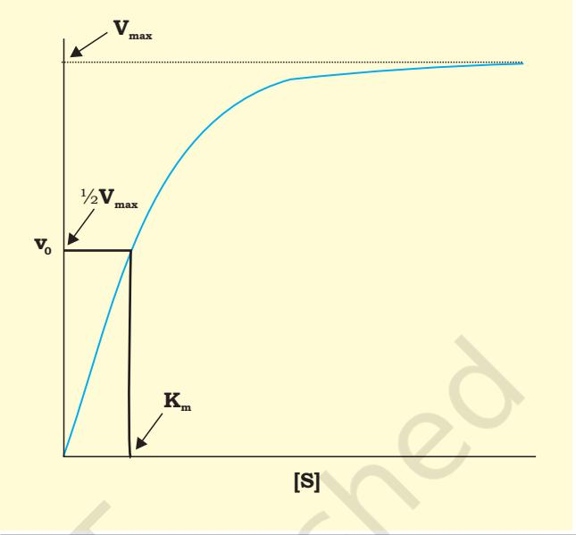

*Fig. 4.6: Graph of v0 against [S] at constant enzyme concentration for a single substrate enzyme-catalysed reaction for Michaelis-Menten equation*

In reversible inhibition, the inhibitor rapidly dissociates from the enzyme-inhibitor complex. There are three types of reversible inhibitions: **competitive, non-competitive**  and **uncompetitive inhibition**.

#### **(i) Competitive inhibition**

In competitive inhibition, there is close resemblance in the structure of inhibitor I and substrate S, therefore, they both compete for the same active site on the enzyme. The enzyme can form enzyme-substrate ES complex or it can form enzyme-inhibitor EI complex (Fig. 4.7) but not both ESI.

Competitive inhibitors decreases the rate of reaction by reducing the amount of active enzyme molecules bound to a substrate. At very high substrate concentration, the chances of binding of inhibitor molecule to the enzyme will be reduced, so Vmax for the reaction will not be changed. However, the Km which is substrate concentration at which v0=½ Vmax, is increased in presence of inhibitor and is denoted by symbol K'm (Fig. 4.8).

2024-25

Chapter 4 enzymes and Bioengertics.indd 93 11/14/2019 10:11:46 AM

93

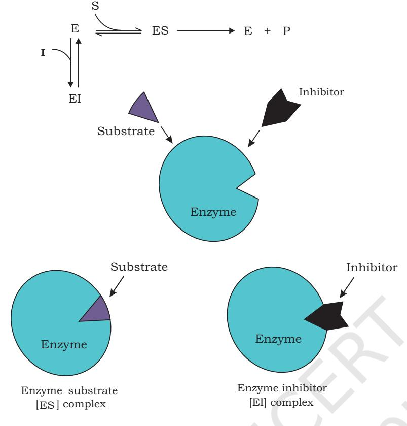

*Fig. 4.7: Competitive inhibition*

94

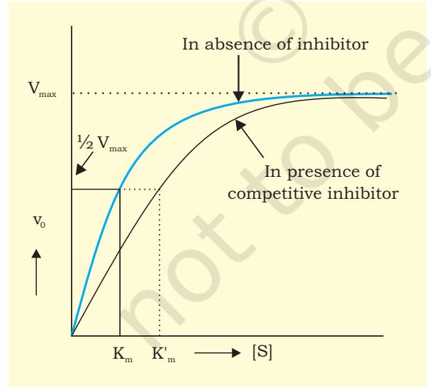

*Fig. 4.8: Michaelis-Menten plot for competitive inhibition*

#### **(ii) Non-Competitive inhibition**

In this type of inhibition, inhibitor has no structural similarity with substrate and binds with the enzyme at different site other than the active site. Therefore, there is no competition between S and I, and formation of ES, EI and ESI takes place.

The inhibitor I and substrate S can bind simultaneously to the same enzyme molecule as their binding sites are different and hence do not overlap (Fig. 4.9). Non competitive inhibitor lowers the Vmax rather than by decreasing the proportion of enzyme molecules that are bound to the S. Thus, the non competitive inhibition in contrast to competitive inhibition, cannot be overcome by increasing substrate concentration. The substrate can still bind to the EI complex. However, the ESI does not form product. The I effectively lowers the concentration of active enzyme and hence lowers the Vmax. There is no effect on Km as the inhibitor decrease the amount of functional enzyme (Fig. 4.10).

### **(iii) Uncompetitive inhibition**

In this type of inhibition, inhibitor does not bind to free enzyme. It binds only to

Chapter 4 enzymes and Bioengertics.indd 94 11/14/2019 10:11:46 AM

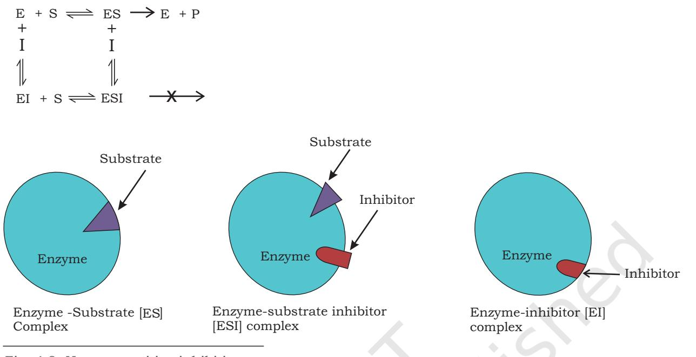

*Fig. 4.9: Non-competitive inhibition*

enzyme substrate (ES) complex directly or its binding is facilitated by the conformational change that takes place after substrate binds to enzyme (Fig. 4.11). In both the cases, the inhibitor does not compete with substrate for the same binding site. Therefore, the inhibition cannot be overcome by increasing substrate concentration. Both Km and Vmax values are altered.

#### **4.1.7 Allosteric enzymes**

Allosteric enzymes do not obey Michaelis-Menten kinetics. These enzymes in general consist of more than one protein subunits, therefore, more than one active sites are present. Allosteric enzymes result in sigmoidal graph instead of rectangular hyperbola when v0 is plotted against substrate concentration [S] (Fig. 4.12). Each subunit of allosteric enzymes also contain regulatory site along with active site. Regulatory molecules may reversibly bind to the regulatory site and alter the affinity of enzyme for substrate binding. Whereas, most of the enzymes obeying Michaelis-Menten kinetics are

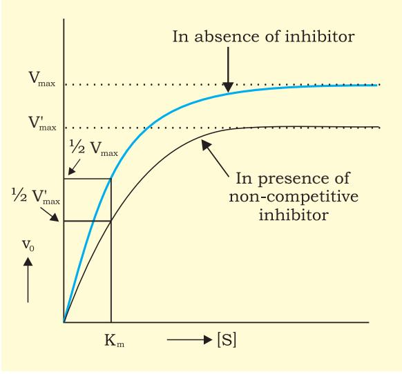

95

*Fig. 4.10: Michaelis Menten plot for non-competitive inhibition*

Chapter 4 enzymes and Bioengertics.indd 95 10-Aug-21 10:15:18 AM

the normal enzymes, allosteric enzymes are the key regulators of metabolic pathways in the cell.

96

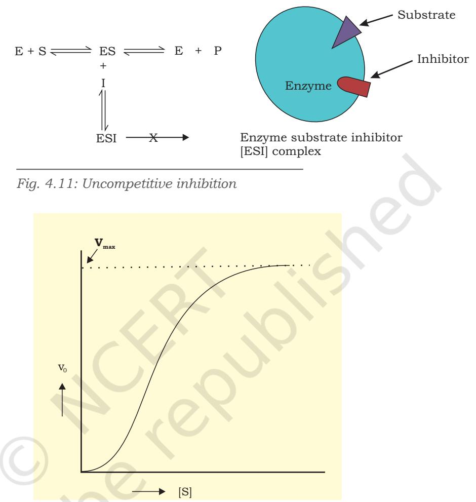

*Fig. 4.12: Kinetics of an allosteric enzyme*

## **4.2 Brief Introduction to Bioenergetics**

Biological energetics or bioenergetics deal with the transformation and use of energy by living cells. In biological reactions, the energy is released as the reactions move from a higher to lower energy level. Energy is liberated in the form of heat.

A + X B + Y + Heat

The conversion of metabolites A→B occurs with the release of energy. It is coupled to another reaction in which energy is required to convert metabolite X→Y.

Chapter 4 enzymes and Bioengertics.indd 96 03 March 2022 12:07:36

#### **4.2.1 The laws of thermodynamics**

Energy is the capacity to do work and it exists in a variety of forms such as electrical, mechanical, chemical, heat and light. These forms of energy are interconvertible. Bioenergetics is concerned with the changes in energy during biochemical processes. It does not deal with the mechanism or speed of the process. **Thermodynamics** is the branch of physical chemistry that deals with the energy changes. There are two fundamental laws of thermodynamics which explain interconversions of various forms of energy. The two laws also help to understand the following:

97

- 1. The direction of a reaction, whether forward or reverse.
- 2. The accomplishment of work, whether useful or nonuseful.
- 3. Whether the energy for executing a reaction must be delivered from an external source.

#### **The first law of thermodynamics**

According to this law, energy exchange in any process takes place between 'system' and 'surroundings'. A system is a matter within defined region, and surroundings constitute matter in the rest of the universe. Thus, the system and surroundings make the universe, which includes the entire earth and the outer space.

The first law of thermodynamics states that 'energy can neither be created nor destroyed, but can be converted into other forms of energy'. It means, the total amount of energy in the universe (system plus surroundings) remains constant.

$$\mathrm{E}=\mathrm{E}_{\mathrm{B}}-\mathrm{E}_{\mathrm{A}}=\mathrm{Q}-\mathrm{W}$$

Where,

E = change in internal energy

EA = energy of a system at the start of a process

EB = energy of a system at the end of a process

Q = heat absorbed by the system

W = work done by the system

 According to this equation, change in the energy of a system depends only on the initial and the final stages, and not the path of the transformation.

Chapter 4 enzymes and Bioengertics.indd 97 10-Aug-21 10:22:39 AM

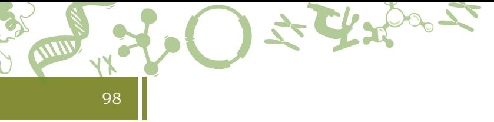

### **The second law of thermodynamics**

The first law of thermodynamics cannot be used to predict the spontaneity or non-spontaneity of the reaction. On the other hand, the second law introduces a term '**entropy**', which is denoted by symbol 'S'. Entropy is degree of randomness or disorder of a system and explains whether a reaction takes place spontaneously. The entropy of a system increases when it becomes more disordered. Entropy reaches maximum in a system as it nears equilibrium. Biological systems, however, do not follow the second law as the life is state of higher organisation or lower entropy rather than increase entropy. This highly ordered form of life is maintained for a while by consumption of chemical energy food and in case of photosynthetic organisms light energy. This energy is either converted to a less organised form of energy (heat) or utilised to perform work. Ultimately, the thermodynamic equilibrium is certain and entropy increases after death and subsequent decomposition of every organism.

The second law of thermodynamics states that the entropy or disorder of universe is always increasing. According to this law, a process can occur spontaneously only if the sum of the entropies of the system and its surrounding increases. This can be represented as,

## (Ssystem+ Ssurroundings) > 0 (for a spontaneous process)

Thus, for a process to occur spontaneously, the total entropy of a system must increase. However, the entropy of a system can decrease even during a spontaneous process, provided the entropy of the surrounding increases to an extent that their sum becomes positive.

The difference between the first and second law is that, first law is concerned with the transformation of various kinds of energy involved in a given process, whereas the second law is concerned with the availability of the energy of a given system for doing work.

### **Combining the two laws**

Entropy is not used as a criteria to know whether a biochemical reaction is spontaneous or not. This is because changes in entropy of reaction cannot be measured. Moreover, changes in entropy of surrounding and the system should be known

Chapter 4 enzymes and Bioengertics.indd 98 10-Aug-21 10:22:59 AM

for spontaneity. Therefore, a different thermodynamic function '**free energy**' is used to overcome this problem. Free energy is denoted by symbol G.

99

In 1878, **Gibbs** created free energy function by combining the first and second laws of thermodynamics. Following equation was obtained,

G = H – TS

Where,

- G = change in free energy of a reacting system
- H = change in heat content or enthalpy of this system
- T = absolute temperature at which the process is taking place
- S = change in entropy of the system

This equation shows the relationship between the change in free energy (G), heat (also called **enthalpy**, H), and entropy in chemical reactions at constant temperature (T) and pressure (P). Biochemical reactions also occur at these conditions. The G is free energy change or theoretically available useful work. The term TS is that component of H which cannot be used to perform work.

A closed system is described as system that can exchange energy but not matter with its surroundings. The exchange of energy must involve heat transfer or the performance of work. If, in a closed system at constant temperature and pressure, a process takes place which involves a transfer of heat to or from the surroundings and a change in volume of the system, then from the first law of thermodynamics,

E = H - PV

Where,

E = change in internal energy

H = change in enthalpy

PV = work done on the surroundings by increasing the volume of the system by V at constant pressure P and temperature T.

#### *ATP: the universal currency of free energy*

The living organisms derive free energy from the environment. The photosynthetic organisms take this

Chapter 4 enzymes and Bioengertics.indd 99 11/14/2019 10:11:46 AM

energy from sunlight whereas, chemotrophs (non photosynthetic organisms) obtain it by oxidation of food stuff. This free energy is used to complete some vital processes in the cell such as (i) synthesis of macromolecules from small precursors, (ii) in active transport (transport against gradient) across the membrane, (iii) in muscle contraction, and (iv) in the fidelity of genetic information transfer. Before being utilised in the above-mentioned process the free energy (derived from light or from the oxidation of food stuff) is partly converted into a special form, **adenosine triphosphate (ATP)**. ATP is also known as universal currency of free energy. It plays a central role in the transfer of free energy from **exergonic** (energy releasing) processes to **endergonic** (energy consuming) processes in the cells. During the breakdown of the energyrich food stuff, some of the free energy is consumed in synthesis of ATP from **adenosine diphosphate (ADP)** and inorganic phosphate (Pi). ATP then donates much of its chemical energy to energy-requiring processes such as biosynthesis, transport, muscle contraction etc. by converting itself into ADP and Pi and releases 7.3 Kcal/ mol of energy. ATP can be converted into **adenosine** 

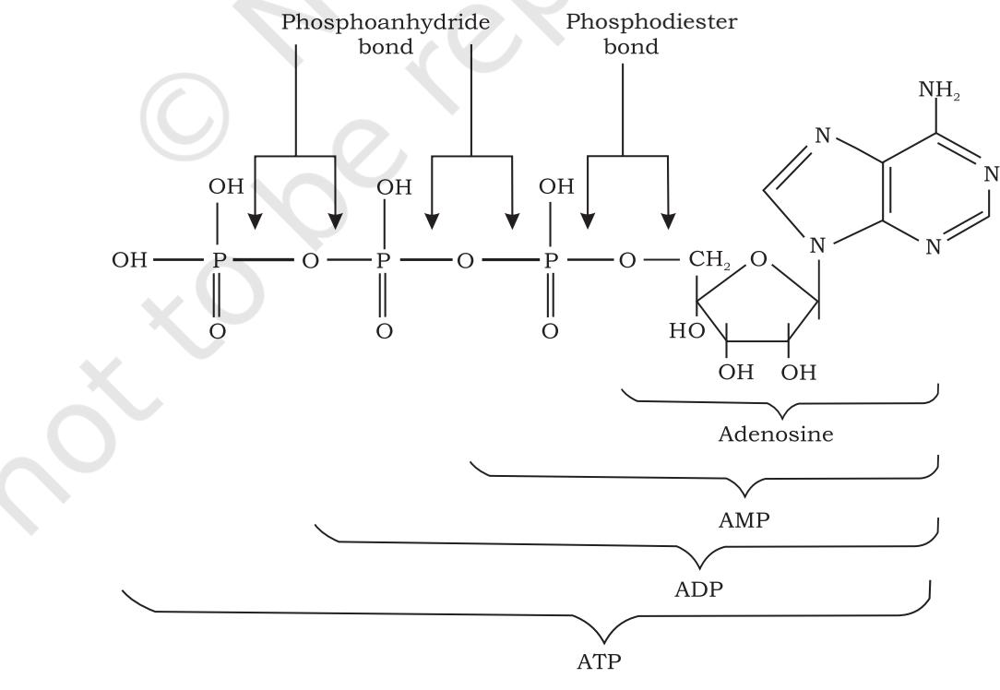

*Fig. 4.13: Structure of AMP, ADP and ATP*

100

Chapter 4 enzymes and Bioengertics.indd 100 11/14/2019 10:11:47 AM

Enzymes and Bioenergetics

**monophosphate (AMP)** and PPi (pyrophosphate) while donating its energy in some other processes e.g., in the production of light flashes by firefly. ATP and its consecutive hydrolysis products, ADP and AMP are nucleotides, made up of an adenine (a purine base occur in DNA and RNA) a ribose (a pentose sugar) and three, two and one phosphate group(s), respectively (Fig. 4.13).

## **Summary**

- Enzymes are catalysts that catalyse the biochemical reactions in the living system.
- Each enzyme has an active site into which the substrate molecule fits precisely. The 'lock and key' hypothesis postulated that the substrate fits precisely into the lock of the enzyme. This hypothesis has now been modified.
- The modern 'induced fit' hypothesis does not regard active site as a rigid structure but a flexible one, which modifies its shape to fit precisely the substrate molecule.
- Various factors like temperature, pH, substrate concentration and presence of inhibitors and activators influence the rate of enzyme catalysed reactions.
- Enzymes lower the activation energy of the reaction they catalyse.
- Simple single substrate enzyme catalysed reactions can be described by Michaelis-Menten kinetics which has a hyperbolic graph in terms of substrate concentration and initial velocity.
- Enzymes are also affected by the presence of inhibitors, like competitive, non-competitive and uncompetitive inhibitors, which slow down the rate of reaction or stop it completely.
- Bioenergetics deals with the transformation and use of energy by living cell.
- There are two laws of thermodynamics. The first law states that energy can neither be created nor destroyed but can be converted into other forms of energy.
- The second law of thermodynamics states that entropy or disorder of universe is always increasing.

Chapter 4 enzymes and Bioengertics.indd 101 11/14/2019 10:11:47 AM

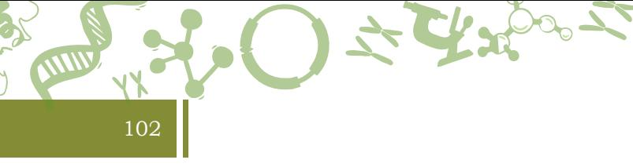

- Combining the two laws of thermodynamics describe the free energy (G) change or the performance of work.
- The photosynthetic organisms derive free energy from the sunlight, whereas chemotrophs obtain free energy by oxidation of food stuff.
- This free energy is used to complete the cellular processes.
- This free energy is partly converted into ATP which is also known as universal currency of free energy.
- During energy releasing processes (breakdown), ATP is synthesised from ADP and inorganic phosphate (Pi), while in energy requiring processes ATP is broken into ADP and Pi.

# Exercises

- 1. In order to catalyse a reaction, an enzyme is required to (a) be saturated with substrate
	- (b) decrease the activation energy
	- (c) increase the equilibrium constant
	- (d) increase the activation energy
- 2. Pepsin is a gastric enzyme. Does it have an acidic or alkaline optimum pH? What happens to pepsin when it enters the duodenum?
- 3. What is the relationship between vitamins and enzyme co-factors?
- 4. What is the effect of temperature, pH and substrate concentration on catalytic activity of enzyme?
- 5. The rate determining step of Michaelis-Menten kinetics is (a) the complex dissociation of ES complex
	- (b) the complex formation
	- (c) the product formation
	- (d) the product degradation
- 6. Define Km and its significance.
- 7. What is meant by one unit of enzyme?
- 8. What is specific activity of an enzyme?
- 9. Briefly describe first and second laws of thermodynamics.
- 10. Define entropy. What is the relationship between free energy and entropy?
- 11. Why ATP is called universal energy currency?

Chapter 4 enzymes and Bioengertics.indd 102 11/14/2019 10:11:47 AM

