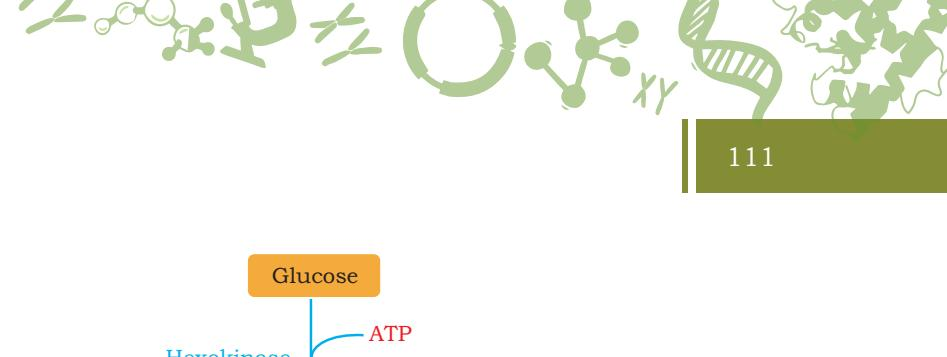

- *5.1 Cell Signaling*
- *5.2 Metabolic Pathway*
- *5.3 Cell Cycle*
- *5.4 Programmed Cell Death (Apoptosis)*
- *5.5 Cell Differentiation*
- *5.6 Cell Migration*

#### **5.1 Cell Signaling**

Cells are not simply the building blocks of our body. An important property of both, the prokaryotic and the eukaryotic cells, is that they constantly receive and interpret environmental cues and respond to them in real time. These signals include light, heat, sound, and touch. The cell fates during development are specified by signal ing pathways in response to extracellular signals. Cells interact with their neighbouring cells by transmitting and receiving signals. These signals are synthesised by the cells in the form of chemicals and released in the extracellular milieu. However, cells can also respond to 'external' signals which are not synthesised by the cells of our body. Therefore, one can assume that the cells are capable of sensing a wide variety of signals. It is important to note that a cell can only respond to a particular signal if it possesses the corresponding receptor for it. A **receptor** is a glycoprotein located either on the cell surface or inside the cytoplasm or the nucleus. A chemical messenger to which a receptor responds is a **ligand**. The association between

Chapter 5 Cellular Processes.indd 103 11/14/2019 10:12:23 AM

a receptor and its corresponding ligand is highly specific, which means that a cell will only be able to respond to a chemical messenger, if it bears the corresponding receptor for it and not otherwise.

Transmission of chemical messages from one cell to another cell requires binding of a ligand to its receptor, which results in conformational changes in the receptor. These changes then initiate a message relay system and bring about further important changes in the activities inside the cell.

It should be noted that cells send and receive signals in different ways. Depending on the proximity of sender and recipient cells, signaling can be broadly classified in the following categories:

- **1. Paracrine signaling:** In this form of signaling, communication between cells occurs over relatively short distances. A chemical message released in the extracellular space by the sender cells is sensed by the recipient cells instantly. This type of signaling is seen in the communication of neurons.
- **2. Autocrine signaling:** Many times, a cell which secretes a ligand, also possesses receptors specific for that ligand. This type of signaling is referred to as autocrine signalling. For instance, cancer cells are characterised by uncontrollable growth. Therefore, they require a greater amount of growth factors for their proliferation. Unlike normal cells, cancer cells do not depend on external growth factors for their growth. Instead, they are capable of synthesising their own growth factors and also possess the receptors specific for them.
- **3. Endocrine signaling:** Long-distance signaling or endorcine signaling requires the ligand to be synthesised by the cell in the extracellular space, from where it reaches the bloodstream to travel to the recipient or target cell. Hormones generally exhibit this form of signaling.

# **5.2 Metabolic Pathways**

Metabolism is the process through which living organisms take and utilise the free energy required to carry out their

Chapter 5 Cellular Processes.indd 104 11/14/2019 10:12:24 AM

life processes. Living organisms are of two types on the basis of taking free energy: phototrophs and chemotrophs. **Phototrophs** use the energy of sunlight to convert simple molecules (less energy containing) into more complex molecules (energy rich) that serve as fuel to perform life processes. Phototrophs are photosynthetic organisms (such as plants and some bacteria); they transform light energy into chemical energy. **Heterotrophs** such as animals, obtain chemical energy indirectly from plants through their food. This free energy uptake in organisms is done by coupling the exergonic reactions of nutrient oxidation to the endergonic processes required to maintain the living state. Central to all these energy transactions is the energy currency called ATP (detail is given in section 4.2 bioenergetics). In metabolism, there are interlinked biochemical reactions that begin with a particular molecule and convert it into some other molecule or molecules in a carefully defined fashion. In **chemotrophs,** the energy is obtained by oxidising eletron donors. The energy is utilised for various processes within the cell such as, the creation of gradient, movement of molecules across membranes, conversion of chemical energy into mechanical energy and powering of reactions that result in the synthesis of biomolecules.

The synthesis and breakdown of biomolecules is accomplished through a number of steps inside the living system. These steps collectively constitute metabolic pathway. Metabolic pathways can broadly be classified into two classes; anabolic pathways and catabolic pathways.

#### **(i) Anabolic pathways**

In these pathways, larger and more complex molecules are synthesised from small molecules. Anabolic pathways are endergonic (consumption of energy). The reactions that require energy such as synthesis of glucose, fats, protein or DNA are called anabolic reactions or anabolism.

Chapter 5 Cellular Processes.indd 105 03 March 2022 12:12:00

#### **(ii) Catabolic pathways**

106

These pathways involve the breakdown of larger molecules. These are exergonic (release of energy) reactions and produce reducing equivalents and ATP. The useful forms of energy that are produced in catabolism are utilised in anabolism, to generate complex structures from simple ones or energy-rich states from energy poor ones.

Fuel (carbohydrate, protein, fats)

Catabolism

CO + 2 2 H O + Useful energy

#### **5.2.1 Overview of carbohydrate metabolism**

In animals, the metabolic fuel for most of the tissues is glucose. Glucose is metabolised into pyruvate through glycolysis. In aerobic condition (in presence of oxygen) pyruvate enters into mitochondrial matrix, where it is converted into acetyl CoA and take part in the citric acid cycle to complete oxidation of glucose to CO2 and H2O (Fig. 5.1). This oxidation is linked to the formation of ATP through the process of oxidative phosphorylation. In anaerobic (in absence/lack of O2) condition pyruvate is converted into lactic acid. The metabolic intermediates of glycolysis also take part in other metabolic processes, such as

- (i) In synthesis of glycogen and its storage in animals.
- (ii) In pentose phosphate pathway which is source of reducing equivalent (NADPH) for fatty acid synthesis, and source of ribose for nucleotides and nucleic acid synthesis.
- (iii) The triose phosphate generates glycerol moiety of triacylglycerol.
- (iv) Acetyl CoA is the precursor for synthesis of fatty acids and cholesterol. Cholesterol then synthesises all other steroids in animals.
- (v) Pyruvate and intermediates of citric acid cycle give rise to carbon skeleton for amino acid synthesis.
- (vi) When glycogen reserves are depleted such as in starvation conditions the non-carbohydrate precursors such as lactic acid, amino acids, and glycerol can

Chapter 5 Cellular Processes.indd 106 10-Aug-21 10:30:46 AM

107

*Fig. 5.1: Overview of carbohydrate metabolism*

## **5.2.2 Overview of lipid metabolism**

Some vital tissues such as brain, heart and red blood cells are exclusively dependent on glucose. In the fasting state when glucose is limiting, then less glucosedependent tissues such as muscles, liver and other tissues alternatively use fuel other than glucose (Fig. 5.2). This fuel is long chain fatty acids which are either taken from diet or synthesized from acetyl CoA derived from carbohydrate or amino acids. Fatty acids may be oxidized to acetyl CoA through the β-oxidation pathway or esterified with glycerol

Chapter 5 Cellular Processes.indd 107 11/14/2019 10:12:24 AM

108

to synthesize triacylglycerol (fat) as main fuel reserve in adipose tissue of animals. Following are three fates of acetyl CoA formed by the β-oxidation pathway.

- (i) It is oxidized to CO2 and H2O through the citric acid cycle.
- (ii) It is a precursor for the synthesis of other lipids such as cholesterol. Cholesterol then synthesises all other steroids (hormones and bile pigments).
- (iii) It is used to synthesise ketone bodies (acetone, acetoacetate and 3-hydroxy butyrate) which are an alternative fuel for liver, and some other tissues in prolonged fasting.

*Fig. 5.2: Overview of lipid metabolism*

# **5.2.3 Overview of amino acid metabolism**

Since amino acids are building blocks of proteins, therefore they are required for protein synthesis. There are 20

Chapter 5 Cellular Processes.indd 108 11/14/2019 10:12:24 AM

standard amino acids. Some are non essential amino acids as these are synthesised in the body through metabolic intermediates by the process of transamination (Fig. 5.3). The remaining are essential amino acids which must be supplied in the diet as they are not synthesised in the body. In transamination, the amino nitrogen is transferred from one amino acid to a carbon skeleton to form other amino acids. In the process of deamination, the amino nitrogen is excreted as urea. The carbon skeletons that remain after transamination can play the following roles:

*Fig. 5.3: Overview of amino acid metabolism*

- (i) Oxidised to CO2 via citric acid cycle.
- (ii) Used to synthesise glucose through gluconeogenesis.
- (iii) Form ketone bodies, which may be oxidised or used for fatty acid synthesis.

Some amino acids take part in the synthesis of other biomolecules like hormones of plant and animals, purines, pyrimidines, and neurotransmitters.

Chapter 5 Cellular Processes.indd 109 11/14/2019 10:12:24 AM

Some of the important metabolic pathways are —

#### **5.2.4 Glycolysis**

Glycolysis is a universal catalytic pathway in all living cells, also known as Embden-Meyerhof-Parnas (EMP) pathway (Fig. 5.4). It is a major pathway of carbohydrate metabolism and all the enzymes involved are present in the cytosol, and the pathway starts with the phosphorylation of glucose to glucose-6-phosphate which is catalysed by enzyme hexokinase. ATP is phosphate donor; its γ-phosphoryl group is transferred to glucose. This reaction is irreversible and enzyme hexokinase is inhibited allosterically (when product binds to the enzyme at a site different from the active site and alters its catalytic activity) by its product glucose-6-phosphate. Hexokinase can also phosphorylate sugar other than glucose such as fructose, galactose, mannose, etc. Liver cells also contain an isoenzyme (detail is given in section 4.1 ) of hexokinase called glucokinase which can phosphorylate only glucose. Glucose-6-phosphate is an important intermediate of carbohydrate metabolism as it is formed in glycolysis, gluconeogenesis (formation of glucose from noncarbohydrate molecules), pentose phosphate pathway, glycogenesis (synthesis of glycogen) and glycogenolysis (breakdown of glycogen).

Glucose-6-phosphate is then converted into fructose-6-phosphate by enzyme phosphoglucose isomerase which catalyses an aldose-ketose isomerisation reaction. Fructose-6-phosphate then undergoes another phosphorylation by the enzyme phosphofructokinase (PFK) forming fructose-1- 6-bisphosphate. Similar to hexokinase, PFK also catalyzes the irreversible reaction and undergoes allosteric regulation. Fructose-1-6-bisphosphate is cleaved by enzyme aldolase into two triose phosphates, glyceraldehyde-3-phosphate and dihydroxyacetone phosphate.

The two trioses synthesised are interconverted by the enzyme triose phosphate isomerase. Oxidations of glyceraldehyde-3-phosphate to 1-3-bisphosphoglycerate occur by the enzyme glyceraldehyde-3-phosphate dehydrogenase, which is a NAD-dependent enzyme. In the next reaction, phosphate is transferred from 1-3-bisphosphate glycerate to ADP, forming ATP and 3-phosphoglycerate by the enzyme phosphoglycerate kinase. This phosphorylation of ADP to form ATP is called substrate-level phosphorylation.

Since two molecules of triose phosphates are synthesised per molecule of glucose, two ATP molecules

Chapter 5 Cellular Processes.indd 110 11/14/2019 10:12:24 AM

*Fig. 5.4: Glycolysis*

Chapter 5 Cellular Processes.indd 111 11/14/2019 10:12:24 AM

*Fig.5.5: Fate of pyruvate* 

2 Ethanol + 2CO2

Fermentation to ethanol in yeast

anaerobic condition

Glucose

Glycolysis (10 successive reactions)

2 Pyruvate

lactate in rigorously contracting muscle, in erythrocytes, in some other cells and in some microorganism

2 Lactate

Fermentation to cycle

Animals, plants and many microbial cells under aerobic

4CO +4H O 2 2

citric acid

condition

2 Acetyl CoA

aerobic condition

are formed at this stage per molecule of glucose undergoing glycolysis. Next step of glycolysis involves isomerisation of 3-phosphoglycerate into 2-phosphoglycerate by enzyme phosphoglycerate mutase.

The subsequent step involves a dehydration reaction converting 2-phosphoglycerate into phosphoenol pyruvate by the enzyme enolase which requires either Mg2+ or Mn2+ for its activity. The phosphoenol pyruvate, by enzyme pyruvate kinase is converted into pyruvate, during which phosphate is transferred to ADP to form ATP (substrate level phosphorylation).

Out of the 10 glycolytic reactions, three reactions are exergonic and therefore irreversible. These reactions are catalysed by regulatory enzymes namely, hexokinase, PFK and pyruvate kinase and are therefore major sites of regulation of glycolysis.

# **Energy yield by glycolysis**

The net reaction in the transformation of one molecule of glucose into two pyruvate molecules is:

> Glucose + 2ATP + 2NAD + 4ADP + 4P + i

2Pyruvate + 2ADP+ 2NADH + 2H + 4ATP + 2H O + 2

Thus four molecules of ATP are generated in the conversion of glucose into two molecules of pyruvate. The net ATP production is two as two ATP molecules are utilised during the process.

# **Fate of pyruvate**

All the steps of glycolytic reactions from glucose to pyruvate are similar in most organisms and most types of cells, but the fate of pyruvate is different. Three reactions of pyruvate are of prime importance, conversion into ethanol, lactic acid or carbon dioxide (Fig. 5.5).

#### **Fermentation (anaerobic breakdown of pyruvate)**

For glycolysis to continue, NAD+ which the cells have in limited quantities must be recycled after its reduction to NADH by glyceraldehyde-3-phosphate dehydrogenase. Under anaerobic conditions, the NAD+ is replenished by the

Chapter 5 Cellular Processes.indd 112 11/14/2019 10:12:24 AM

113

#### *Fig.5.5: Fate of pyruvate*

are formed at this stage per molecule of glucose undergoing glycolysis. Next step of glycolysis involves isomerisation of 3-phosphoglycerate into 2-phosphoglycerate by enzyme

The subsequent step involves a dehydration reaction converting 2-phosphoglycerate into phosphoenol pyruvate by the enzyme enolase which requires either Mg2+ or Mn2+ for its activity. The phosphoenol pyruvate, by enzyme pyruvate kinase is converted into pyruvate, during which phosphate is transferred to ADP to form ATP (substrate

Out of the 10 glycolytic reactions, three reactions are exergonic and therefore irreversible. These reactions are catalysed by regulatory enzymes namely, hexokinase, PFK and pyruvate kinase and are therefore major sites of

The net reaction in the transformation of one molecule of

Glucose + 2ATP + 2NAD + 4ADP + 4P +

2Pyruvate + 2ADP+ 2NADH + 2H + 4ATP + 2H O +

i

2

Thus four molecules of ATP are generated in the conversion of glucose into two molecules of pyruvate. The net ATP production is two as two ATP molecules are

All the steps of glycolytic reactions from glucose to pyruvate are similar in most organisms and most types of cells, but the fate of pyruvate is different. Three reactions of pyruvate are of prime importance, conversion into ethanol, lactic

**Fermentation (anaerobic breakdown of pyruvate)** For glycolysis to continue, NAD+ which the cells have in limited quantities must be recycled after its reduction to NADH by glyceraldehyde-3-phosphate dehydrogenase. Under anaerobic conditions, the NAD+ is replenished by the

phosphoglycerate mutase.

level phosphorylation).

regulation of glycolysis.

**Energy yield by glycolysis**

utilised during the process.

acid or carbon dioxide (Fig. 5.5).

**Fate of pyruvate** 

glucose into two pyruvate molecules is:

reduction of pyruvate in an extension of the glycolytic pathway. The two processes for the anaerobic replenishment of NAD+ are homolactic fermentation and alcoholic fermentation which occur in muscle and yeast, respectively.

# **Homolactic fermentation**

Under anaerobic condition, pyruvate is reduced by NADH to lactate by the enzyme lactate dehydrogenase. Lactate dehydrogenase is also an isozyme. The overall process of anaerobic glycolysis in muscle may be represented as,

Much of the lactate produced by glycolysis is exported from muscle cell to the liver where it is reconverted to glucose.

# **Alcoholic fermentation**

Under anaerobic conditions in yeast, NAD+ is regenerated through conversion of pyruvate to ethanol and CO2. The reaction has two steps. The first reaction is the decarboxylation of pyruvate to form acetaldehyde and CO2 by the enzyme pyruvate decarboxylase, which contains coenzyme TPP (thiamine pyrophosphate; a coenzyme). The second reaction is a reduction of acetaldehyde into ethanol

Chapter 5 Cellular Processes.indd 113 03 March 2022 12:15:22

by enzyme alcohol dehydrogenase. In this reaction NADH is oxidised to NAD+.

Fermentation results in the production of 2 ATP per glucose.

# **Aerobic breakdown of pyruvate**

Under aerobic conditions, pyruvate is transferred from cytosol to mitochondria which is converted to acetyl CoA by oxidative decarboxylation. This is an irreversible reaction, catalysed by a multienzyme complex known as pyruvate dehydrogenase complex (PDH), which is found only in mitochondria.

Pyruvate + CoA + NAD Acetyl CoA + CO +NADH +H + 2 +

The coenzyme and prosthetic groups required in this reaction sequence are TPP, FAD (flavin adenine dinucleotide coenzymes), NAD+, and lipoamide. This irreversible reaction is the link between glycolysis and citric acid cycle.

# **5.2.5 Citric acid cycle**

The citric acid cycle is also known as **Kreb's cycle** or **Tricarboxylic acid (TCA) cycle** on the name of Hans Kreb who discovered it for the first time (Fig. 5.6). It is a sequence of reactions in mitochondria that oxidise the acetyl moiety of acetyl CoA and reduces NAD+ that are reoxidised through the electron transport chain, linked to the formation of ATP. The citric acid cycle is the final common pathway for the oxidation of carbohydrates, lipids, and proteins because glucose, fatty acids, and most amino acids are metabolised to acetyl CoA or intermediates of the TCA cycle.

In eukaryotes, the reaction of the citric acid cycle takes place inside mitochondria in contrast with those of glycolysis which occurs in cytosol. The enzymes catalyse the reactions of TCA cycle are located in the mitochondrial matrix, either free or attached to the inner mitochondrial membrane where the enzymes and coenzymes of electron transport chain are also found.

Chapter 5 Cellular Processes.indd 114 10-Aug-21 10:45:08 AM

#### *Fig. 5.6: Citric acid cycle*

The cycle begins with a condensation reaction between two carbon acetyl CoA and four carbon oxaloacetate to form six carbon citrate by the enzyme citrate synthase (Fig. 5.6). Citrate is isomerised into isocitrate by the enzyme aconitase. Isocitrate undergoes dehydrogenation to form oxalosuccinate by the enzyme isocitrate dehydrogenase. The enzyme isocitrate dehydrogenase is an isozyme present in three forms. One form is found in mitochondria that requires NAD+ for its activity. The other two forms use NADP+ and are found in mitochondria and cytosol both. In citric acid cycle, oxidation of the isocitrate takes place via NAD+ dependent enzyme, which

Chapter 5 Cellular Processes.indd 115 10-Aug-21 11:36:35 AM

116

results in formation of NADH+H+ along with the product oxalosuccinate. Oxalosuccinate remains bound to the enzyme and undergoes decarboxylation to form five carbon α-ketoglutarate. α-ketoglutarate undergoes oxidative decarboxylation to form four carbon succinyl CoA by the enzyme α-ketoglutarate dehydrogenase complex. In this step, another NAD+ get reduced to NADH+H+ and another CO2 is liberated. This reaction is an irreversible reaction and favors formation of succinyl CoA. Succinyl CoA is converted into succinate by the enzyme succinyl CoA synthetase. This is the only step in a citric acid cycle where, substrate level phosphorylation takes place in which a GDP, is phosphorylated to GTP, which is then converted to ATP. Succinate is then oxidised to form fumarate by the enzyme succinate dehydrogenase. This enzyme contains coenzyme FAD and iron sulfur (Fe-S) protein, the FAD is get reduced to FADH2. Fumarate is then converted into malate by enzyme fumarase. Malate is oxidised into oxaloacetate by the enzyme malate dehydrogenase. In this step NAD+ gets reduced to NADH+H+.

In the citric acid cycle, two carbon atoms enter the cycle (as acetyl CoA) and two leave the cycle (as two molecules of CO2). Three hydride ions (:H- )(hence, six electrons) are transferred to three-molecule of NAD+, while one pair of hydrogen atoms (H)(hence two electrons) are transferred to one molecule of a FAD. The citric acid cycle neither generates a large amount of ATP nor utilises O2 as a reactant instead, it harvest the high energy electrons from acetyl CoA and use these electrons to form NADH and FADH2. In oxidative phosphorylation the electrons are released during reoxidation of NADH and FADH2 flow through a series of membrane proteins to generate a proton gradient across the membrane. These protons then flow through ATP synthase to synthesise ATP from ADP and inorganic phosphate. Oxygen is utilised as electron acceptor at the end of electron transport chain, and for generation of NAD+, and FAD.

The overall reaction of TCA cycle is

Acetyl CoA + 3NAD + FAD + GDP + Pi + 2H O + 2

2CO + 3NADH + 3H + FADH + GTP + CoA 2 + 2

Chapter 5 Cellular Processes.indd 116 11/14/2019 10:12:25 AM

#### **ATP production through citric acid cycle**

One turn of the citric acid cycle results in the following chemical transformations:

117

- (i) One acetyl CoA is oxidised to two molecules of CO2.
- (ii) Three molecules of NAD+ are reduced to NADH.
- (iii) One molecule of FAD is reduced to FADH2.
- (iv) One 'high energy' phosphate group is produced as GTP (or ATP).

#### **5.2.6 Electron transport chain**

The reduced coenzymes (NADH+H+ and FADH2) produced during TCA cycle and various catabolic pathways are oxidised through **electron transport system (ETS)** and the electrons are passed on to O2 resulting in the formation of H2O (Fig. 5.7). The passage of electrons through ETS is associated with the loss of free energy. A part of this energy is utilised to generate ATP from ADP and Pi. The ETS is located in the inner mitochondrial membrane.

ETS involves chain of four large protein complexes called NADH-Q-oxidoreductase (complex I), succinate-Qreductase (complex II), Q-cytochrome C oxidoreductase (complex III), and cytochrome C oxidase (complex IV) (Fig. 5.7). These electron carriers are large transmembrane protein complexes with multiple oxidations-reduction centers such as quinones, flavins, iron sulfur clusters, heme and copper ions. Succinate-Q-reductase (complex II) in contrast with the other three complexes does not pump protons. Electrons are carried from complex I to

*Fig.5.7: The four complexes of electron transport chain*

Chapter 5 Cellular Processes.indd 117 10-Aug-21 11:37:48 AM

complex III by the reduced form of coenzyme Q, also known as ubiquinone. Ubiquinone is quinone, which is lipid (hence hydrophobic) and diffuses quickly within the inner mitochondrial membrane. The electrons from FADH2 are generated through succinate-Q-reductase (complex II), which then transferred to cytochrome-C-oxidoreductase (complex III). Then electron from complex III transferred to cytochrome-C-oxidase (complex IV), which is the final component in the ETS. This component catalyses the reduction of O2 into H2O.

#### **Oxidative phosphorylation (ATP synthesis)**

The flow of electron from NADH or FADH2 to O2 through four protein complexes located in the mitochondrial inner membrane, lead to the pumping of protons out of the mitochondrial matrix side to the cytosolic side of the inner mitochondrial membrane (Fig. 5.8). The resulting uneven distribution of protons generates a proton motive force (pmf), which consists of a pH gradient (matrix side basic) and a trans membrane electrical potential (matrix side negative). Synthesis of ATP takes place when protons flow back to the matrix side through an enzyme complex called ATP synthase. ATP synthase is made up of two operational units: a rotatory component consisting of three sub-units α, β and γ and a stationary component. The rotation of γ subunit induces structural changes in the β subunit that results in the synthesis and release of ATP from the enzyme. The force for the rotation is provided by proton influx.

*Fig.5.8: Proton pumping and pH gradient*

The flow of electrons through NADH-Q-oxidoreductase, Q-cytochrome-c-oxidoreductase, and cytochrome-c-oxidase

Chapter 5 Cellular Processes.indd 118 04 March 2022 12:19:23

develop a gradient enough to synthesise 1, 0.5 and 1 molecule of ATP, respectively. Hence, 2.5 molecules of ATP are synthesised per molecule of NADH oxidised in the mitochondrial matrix, whereas only 1.5 molecule of ATP are made per molecule of FADH2 oxidised because its electrons enter the electron transport chain at QH2 (complex III).

119

The citric acid cycle along with oxidative phosphorylation takes place in mitochondria and is the major source of ATP in aerobic organisms. For instance, it generates 26 of the 30 molecules of ATP when glucose is completely oxidised to CO2 and H2O.

#### **Photosynthesis**

All the energy utilised by biological system come from solar energy, which is trapped and converted to chemical energy in the process of photosynthesis. The basic reaction of photosynthesis can be represented as

6CO2 + 12H2O (CH2O)6 + 6O2 + 6H2O .....(1) light Chlorophyll

where, (CH2O)6 represents carbohydrate. Photosynthesis in plants and some photosynthetic bacteria take place in chloroplasts. The energy of light captured by various photoreceptor pigment molecules, which includes chlorophyll a, xanthophylls, carotenoids and other chlorophyll, found in chloroplasts, is used to generate high energy electrons with great reducing potential. These electrons are utilised in the production of ATP and NADPH+H+ through a series of reactions called the **light reactions** of photosynthesis. ATP and NADPH+H+ formed in the process of light reaction reduce CO2 and convert it into 3-phosphoglycerate by a series of reactions called **Calvin cycle** or **dark reactions**.

#### **Light Reactions**

Light reactions are also called 'Photochemical' phase of photosynthesis. This phase includes the following:

- 1. Capturing the solar energy,
- 2. Splitting of water and release of oxygen, and
- 3. Formation of higher-energy organic intermediates, i.e. ATP and NADPH+H+.

Chapter 5 Cellular Processes.indd 119 03 March 2022 02:01:13

120

The light reactions occur in the thylakoid membranes of chloroplast. The thylakoid membrane comprises the major energy transducing machinery such as light harvesting proteins, reaction centers, electron transport chains, and ATP synthase.

In membrane system of chloroplast, there are two types of light-haversting protein complexes, namely, **photosystem I (PSI)** and **photosystem II (PSII)** (Fig. 5.9). PSI contains 30 polypeptide chains, about 60 chlorophyll molecules, a quinone (vitamin K) and three 4Fe-4S clusters. Total molecular mass of PSI is 800 kDa. PSII is slightly less complex with about 10 polypeptide chains, 30 chlorophyll molecules, a nonheme iron ion and four manganese ions.

*Fig. 5.9: Light reactions of photosynthesis*

The two photosystems PSI and PSII respond to light at slightly different wavelengths. PSI responds to the wavelength of 700 nm, whereas chlorophyll a at PSII responds to the wavelength of of 680 nm.

Under normal conditions, PSII is activated first. Capture of red light at 680 nm by PSII brings an electron from its ground energy state to an excited state. The excited electron enters the **Electron Transport Chain (ETC)** by acceptor molecule pheophytin, which transfers electron to plastoquinone (PQ), from PQ to cytochrome (Cyt b6f )

Chapter 5 Cellular Processes.indd 120 11/14/2019 10:12:25 AM

complex, from cytochrome b6f complex to plastocyanin (PC), from PC to PSI. PSI accept electron from the PC only when the electron in its reaction center get excited by the absorption of light at 700 nm. Acceptor molecule (a modified chlorophyll) of P700+ transfer its electron to a phylloquinone and from phylloquinone to soluble ferredoxin (Fd) through a series of membrane bound iron-sulphur protein, which finally reduces NADP+ into NADPH + H+ in the stroma, in the presence of the enzyme ferredoxin NADP-reductase (FNR).

121

Transfer of electron from PSII (P680) to pheophytin results in positive charge on it (P680+), which is a very strong oxidant and receives an electron from water present in lumen of thylakoid. Two molecules of water are oxidised to generate one molecule of O2 for every four electrons sent from PSII to PSI through ETC. The splitting of water is catalysed by a protein complex, the oxygen evolving complex, located on the luminal surface of the thylakoid membrane.

> 2H2O 4H+ + 4e- + O2 ......(2) O2 evolving complex

ATP synthesis by non-cyclic photophosphorylation: We can look at the reaction (2). It reveals that water oxidises and provide hydrogen ion as proton. If we carefully observe at the Fig. 5.9, we can find that during transfer of electron to plastoquinone, it accepts proton from stroma and transfer it to the lumen of thylakoid through cytochrome b6f. This input of proton into the lumen of thylakoid results in higher concentration of protons inside. This results into development of proton gradient across the membrane i.e. very high electrochemical potential gradient in lumen and very low in stroma side of the thylakoid membrane. As a result of this proton motive force (pmf), protons tend to reenter into the stroma through proton channel (CF0) of the ATP synthase. ATP is synthesised on the CF1 subunit of the ATP synthase by using ADP and inorganic phosphate (Pi). In this way both NADPH + H+ and ATP are synthesised by non-cyclic electron flow, which we call **non-cyclic photophosphorylation**.

In certain cases, where only PSI works, it follow the cyclic flow of electron. The PSI is present in the stromal lamellae or on the edge of the grana of thylakoid

Chapter 5 Cellular Processes.indd 121 10-Aug-21 3:05:32 PM

122

*Fig. 5.10: Cyclic photophosphorylation*

membrane. When the reaction center of PSI absorbs light at 700 nm, its photoexcited electrons are accepted by a modified chlorophyll molecule (AO). AO transfers its electron to phylloquinone (A1) which diffuses into thylakoid membrane and binds to cytochrome b6f complex (Fig. 5.10). Phylloquinone is coupled to proton pumping into thylakoid membrane from stroma side to create **electrochemical proton gradient**. ATP synthesis occur when proton back-flow down their electrochemical gradient through ATP synthase. Cytocrome b6f transfers its electron to PSI through plastocyanin. Thus, photoexcited electron from PSI again come in their original state through electron transport chain; so it's called **cyclic electron flow**. In cyclic electron flow only ATP is produced not NADPH + H+ and O2. The process of formation of ATP due to light induced cyclic flow of electron is called **cyclic photophosphorylation**.

## **5.2.7 Carbon Assimilation — dark reactions or Calvin Cycle**

The dark reactions of photosynthesis take place within the stroma. The stroma contains the soluble enzymes that utilise the NADPH+H+ and ATP synthesised by the thylakoids to convert CO2 into sugar. The energy and reducing power generated in the form of ATP and

Chapter 5 Cellular Processes.indd 122 11/14/2019 10:12:26 AM

*Fig. 5.11: Carbon assimilation*

NADPH+H+, respectively, by light-dependent reactions of photosynthesis are utilised by plants to synthesise carbohydrate. In this process, CO2, which is the sole source of carbon assimilate into trioses and hexoses which lead to the synthesis of sugar. The process is called **CO2 assimilation**, or **CO2 fixation** (Fig. 5.11).

The CO2 fixation operates in a cyclic pathway, known as **Calvin cycle** as it was elucidated in 1950 by, **Melvin Calvin** and his co-workers. The Calvin cycle takes place in the stroma of chloroplasts. We can understand CO2 assimilation in three stages, stage I, stage II and stage III (Fig. 5.12).

# **Stage I: Fixation of CO2 into 3-phosphoglycerate**

In this stage, gaseous carbon dioxide is fixed into stable organic intermediate. CO2 get condensed with five carbon acceptor ribulose1, 5-bisphosphate to form two molecules of 3-phosphoglycerate (PGA); this carboxylation reaction is catalysed by enzyme ribulose1, 5-bisphosphate

Chapter 5 Cellular Processes.indd 123 10-Aug-21 3:08:24 PM

carboxylase/oxygenase (also known as **RuBisCO**). The enzyme **RuBisCO** possesses both carboxylase and oxygenase activities. Three molecules of CO2 are fixed to three molecules of ribulose1, 5-bisphosphate to form six molecules of 3-phosphoglycerate (PGA) (Fig. 5.12).

*Fig. 5.12: The three stages of Calvin cycle*

124

*Fig. 5.13: Vertical section of (a) wheat leaf and (b) Maize leaf*

| BH – Bundle Sheeth | VB – | Vascular Bundle |
| --- | --- | --- |
| P – Pallisade | SP – | Spongy Parenchyma |

Chapter 5 Cellular Processes.indd 124 17-Aug-21 12:11:33 PM

#### **Stage II: Reduction of 3-phosphoglycerate to glyceraldehyde 3-phosphate**

125

These are series of reactions that lead to the reduction of 3-phosphogycerate and sugar is formed. This process requires two molecules of ATP and two molecules of NADPH+H+ for reduction of one CO2 molecule to be fixed. This way, for fixation of six molecules of CO2, six turn of a complete cycle is required for one molecule of glucose from the pathway.

#### **Stage III: Regeneration of ribulose1, 5-bisphosphate from triose phosphates**

For the continuous flow of CO2 into carbohydrate, ribulose1, 5-bisphosphate should be constantly regenerated. This is accomplished in a series of reactions, and one ATP is utilised for phosphorylation to form ribulose 1, 5-bisphosphate.

# **5.2.8 The C4 pathway**

For understanding the C4 pathway, it is necessary to understand the anatomy of kranz of some plants. Carefully observe the vertical section of the leaf of wheat and maize

*Fig. 5.14: The C4 cycle*

Chapter 5 Cellular Processes.indd 125 10-Aug-21 4:53:44 PM

in Fig. 5.13 and compare the anatomy of the two. Note the differences between the two.

In the vertical section of the leaf of maize, we can observe the presence of bundle sheath cells around the vascular bundles. The leaves with such anatomy are said to have kranz anatomy. Bundle sheath cells are characterised by the presence of a large number of chloroplast, thick walls and absence of intercellular spaces (Fig. 5.13).

Now let us study the pathway as given in the Fig. 5.14. Mesophyll cells in leaves of C4 plants has 3 carbon molecule, phosphoenol pyruvate (PEP) which is acceptor of CO2. PEP carboxylase enzyme is responsible for the fixation of CO2 and formation of C4 acid that is oxaloacetic acid (OAA) in the mesophyll cell. Oxaloacetic acid forms malate by NADP-malate dehydrogenase enzyme and transports it to bundle sheath cells. In bundle sheath cells malate is broken down to release CO2 and a 3-carbon molecule pyruvate. Pyruvate is transported to mesophyll cells which regenerate to form phosphoenol pyruvate.

Carbon dioxide released due to decarboxylation of malate is accepted by RuBisCO in bundle sheath cell for C3 pathway or Calvin cycle. Bundle sheath cells are rich in an enzyme RuBisCO, but lack PEP carboxylase. Thus C3 pathway is a basic pathway and is common to all plants. In mesophyll cells of the C3 plants PEP carboxylase is absent. In C3 plants, RuBisCO is present in mesophyll cells of the leaves which is first CO2 acceptor, while in C4 plants RuBisCO is present in bundle sheath cells and first CO2 acceptor is PEP carboxylase, which is found in mesophyll cells.

## **5.3 Cell Cycle**

All living organisms start their life from a single cell. But where do the new cells come from? One of the most important characteristics of a cell is its ability to **grow** and **divide** (or reproduce) in suitable environment. You might ask, why cells need to divide? Such a question can be answered in terms of what happens if they don't? The answer is–they die. **Cell division** is common to all living organisms and is essentially a mechanism by which cells grow and divide, giving rise to a new cell population. As a cell divides, it gives rise to two daughter cells which possess the same genetic makeup as the parent cell. These daughter cells further give rise to new cells by undergoing reproduction. You must

Chapter 5 Cellular Processes.indd 126 11-Aug-21 9:53:43 AM

now appreciate the formidable ability of cells to divide by considering the fact that we have trillions of cells in our body despite starting our lives as a single cell.

127

## **5.3.1 Phases of cell cycle**

There are a series of tasks which a cell must accomplish in order to divide. These include: growth, replication of genetic material and physical splitting of the cell into two daughter cells. All these events are themselves under strict genetic control. A typical eukaryotic cell takes about **24 hours** to divide. However, this duration is not absolute, and can vary from organism to organism.

A cell cycle is divided into two major phases:

1. *Interphase—*This phase is basically characterised by growth of the cell, followed by replication of its DNA content. It represents the phase between two successive M phases (Fig. 5.15).

*Fig. 5.15: A schematic diagram of cell cycle*

*2. Mitotic (M) Phase—* During M-phase, the cell begins to separate its DNA content (which it had replicated during interphase) as well as cytoplasm, making sure that both the daughter cells receive exactly the same amount of DNA at the end of cell cycle.

Chapter 5 Cellular Processes.indd 127 11/14/2019 10:12:27 AM

#### **Interphase**

A cell which has just entered into the cell cycle must grow and carry out DNA replication in an orderly manner. This is accomplished during the interphase of cell cycle. Interphase is also sometimes referred to as the resting phase because it is the time when the cell is preparing itself to undergo replication. The interphase is further divided into three phases, namely **G1 (Gap 1) phase, S (Synthesis) phase,** and **G2 (Gap 2) phase** (Fig. 5.15).

- *1. G1 Phase—* During the first gap phase, the cell is metabolically active and grows continuously larger but does not replicate its genetic content. G1 phase is essentially the first gap which occurs between mitosis and synthesis of DNA. The growth of the cell occurs largely due to the accumulation of RNA, organelles, and other molecular building blocks.
- *2. S Phase—* This phase is characterised by the synthesis of DNA in the nucleus. During S phase, the amount of DNA in the cell doubles. Therefore, if initially the DNA content in the cell was 2C, at the end of S phase the amount increases to 4C. It is important to note that the chromosome number in the cell remains unchanged at the end of this phase, i.e., a diploid (2n) cell will remain diploid. Microtubule-organising structure known as the **centriole** is also duplicated in the cytoplasm during S-phase. Centrioles are required for the proper segregation of chromosomes.
- *3. G2 Phase—* This phase is marked by the synthesis of more proteins and organelles which further enhances cell growth. The cell, at this stage, is prepared to enter the M phase.

In the body of an organism, not all cells are equally capable of undergoing division. In certain cell types, for example somatic cells, mitotic division occurs on a regular basis. However, in other cell types, the cells are incapable of undergoing division. These cells withdraw themselves from the cell cycle by exiting the G1 phase and enter an inactive stage called **quiescent stage (G0)**. Such cells are also referred to as **differentiated cells**, for example cardiac cells, neurons, etc.

Chapter 5 Cellular Processes.indd 128 11/14/2019 10:12:27 AM

# **Mitotic (M) Phase**

During M phase, the cell condenses its chromosomes and segregates them equally into two daughter cells. Since the number of chromosomes in the parent and daughter cells is the same, it is also referred to as **equational division**. Mitosis is further divided into the following four stages (Fig. 5.16):

129

*1. Prophase—*Mitosis begins with the condensation of chromatin in the prophase (Fig. 5.16). Chromatin which is lying diffused in the nucleus during interphase can be seen as long threads. However, during the prophase of mitosis, these chromatin threads begin to condense. The condensed form of chromatin is known as chromosome. This phase is also marked by the movement of centrioles, which were duplicated during the S phase, towards the opposite poles of the cell. The movement of centrioles towards the opposite poles initiates the assembly of mitotic spindle. Importantly, during the prophase, a number of cell organelles and structures begin to disappear. These include the Golgi apparatus, endoplasmic reticulum, nucleolus and nuclear membrane.

*2. Metaphase —* By this stage, the disintegration of nuclear envelope and condensation of chromosomes is completed. The chromosomes, at this stage, can be easily viewed under the microscope and their morphology can be studied (Fig. 5.16). Two sister chromatids, held together at the **centromere** is a general feature of a metaphase chromosomes. Centromeres consist of small disc-shaped structure at their surface known as **kinetochores**, which serve as the sites of attachments of chromosomes to the spindle fibers. A general feature of metaphase is that, all the chromosomes come to lie at the equator with one chromatid of each chromosome connected by its kinetochore to spindle fibers from one pole, and its sister chromatid connected by its kinetochore to spindle fibers from the opposite pole. The plane of alignment of the chromosomes during metaphase is referred to as the **metaphase** plate.

*3. Anaphase —*The chromosomes arranged at the metaphase plate are eventually pulled apart towards

Chapter 5 Cellular Processes.indd 129 03 March 2022 02:07:30

#### **Interphase**

130

The nucleolus and the nuclear envelop are distinct and the form of the chromosomes are in the form of thread like chromatin.

#### **Prophase**

The chromosomes appear condensed, and the nuclear envelope is not apparent.

#### **Metaphase**

**Anaphase** The chromatids of each chromosome have separated and are moving toward

the poles.

**Telophase** The chromosomes are at the poles, and are becoming more diffuse. The nuclear envelope is reforming. The cytoplasm may be

Thick, coiled chromosomes, each with chomatids, are lined up on the metaphase plate.

#### **Cytokinesis**

dividing.

(part of telophase) Division into two daughter cells is completed.

/

///

/

////////// // /// /////////////

////////// // /// //////////

the opposite poles. The force from the spindle fibers radiating from the centrosome of opposite poles is required for this action.

*4. Telophase—* This is the final stage of M phase, marked by the reformation of the nuclear envelope, endoplasmic reticulum and Golgi apparatus. By this stage, all the chromosomes which were split apart during the anaphase, have reached their respective poles. These chromosomes then begin to decondense.

#### **5.3.2 Cytokinesis**

The division of cytoplasm of a parent cell occurs as a result of a physical process called **cytokinesis** (Fig. 5.16). This process results in the separation of a parent cell into two daughter cells. Even before cytokinesis occurs, division of the nucleus (karyokinesis) occurs. Cytokinesis begins with the formation of a furrow in the plasma membrane. As the furrow deepens, it ultimately joins at the centre of the cell forming a contractile ring, dividing the cytoplasm equally in two. The contractile ring is made up of actin filaments. However, in plant cells, the situation is different because plant cells are surrounded by an inextensible cell wall. Therefore, to successfully carry out cell division, plant cells synthesise new cell wall during cytokinesis. The formation of the new cell wall begins with formation of a precursor, called cell plate. Cytokinesis is characterised by the distribution of cell organelles equally into two daughter cells.

#### **5.3.3 Meiosis**

Meiosis refers to the production of haploid gametes from diploid cells. These gamete cells ultimately fuse

Chapter 5 Cellular Processes.indd 130 03 March 2022 02:08:27

/////////// // /// //////////

///

/

///

////////// // /// //////////

during the fertilisation phase of sexual reproduction to produce diploid offspring. Meiosis is also seen during gametogenesis in plants. During meiosis, the number of chromosome is reduced to half. There is only a single interphase in meiosis, which is followed by two nuclear divisions. The two nuclear division cycles are known as **Meiosis I** and **Meiosis II** (Fig.5.18).

131

The first meiotic division (Meiosis I) is also known as **reductional division** in which the number of chromosomes is reduced to half, while meiosis-II is similar to mitosis and referred to as **equational division** in which the number of chromosomes remains the same. At the end of a meiotic cycle four haploid cells are produced.

Meiosis differs from mitosis in two crucial respects:

- (i) Number of chromosomes in mitosis remains the same as the parent cell, while in meiosis the number of chromosomes is halved.
- (ii) Recombination during meiosis results in shuffling of genes between chromosomes in each pair.

Meiosis I and II are divided into the following stages: Prophase, Metaphase, Anaphase and Telophase. However, in order to distinguish the two meiotic cycles, the subphases of meiosis I and meiosis II are referred to as Prophase I, Metaphase I, Anaphase I and Telophase I for meiosis I, and Prophase II, Metaphase II, Anaphase II and Telophase II for meiosis II.

*Prophase I:* Prophase I is the longest phase of meiotic cycle. During prophase I, a number of activities occurring between the chromosomes are required for their proper segregation in the subsequent stages. Prophase I is further divided into the following substages (Fig. 5.17):

- *(i) Leptotene—* During this stage, the chromosomes form thin threads visible under the light microscope. Each chromosome consists of two sister chromatids.
- *(ii) Zygotene—* The pairing of homologous chromosomes takes place during this stage. The synaptonemal complex is assembled which facilitate the pairing of homologous chromosomes. The complex formed by a pair of synapsed homologous chromosomes is called a bivalent or tetrad.
- *(iii) Pachytene—* This stage is characterised by the appearance of recombinational nodules.

Chapter 5 Cellular Processes.indd 131 11-Aug-21 10:27:09 AM

Recombinational nodules are the sites on chromosomes where **crossing over** takes place between non-sister chromatids of homologous chromosomes. Crossing over is the exchange of genetic material between homologous chromosomes. It results in recombination of genetic material and is a source of variation among organisms of same species.

- *(iv) Diplotene—* This stage is marked by the degeneration of synaptonemal complex and separation of homologous chromosomes except at the crossover sites known as **chiasmata**. In oocytes of some vertebrates, diplotene can last for months or years.
- *(v) Diakinesis—* During diakinesis, the chiasmata are terminalised. The chromosomes become fully condensed and the meiotic spindle is assembled to mediate the separation of homologous chromosomes. By the end of this stage, the nuclear envelope breaks down and the nucleolus disappears.

*Fig. 5.17: The various stages of Prophase of meiosis I*

# *Metaphase I*

This stage is marked by the alignment of bivalents on the equatorial plate. This alignment is facilitated by the attachment of microtubules from the opposite poles of the spindle to the kinetochore of homologous chromosomes (Fig. 5.18).

Chapter 5 Cellular Processes.indd 132 11/14/2019 10:12:29 AM

## *Anaphase I*

Separation of homologous chromosomes occur during anaphase of meiosis I. However, the sister chromatids remain attached to each other at their centromeres.

## *Telophase I and cytokinesis*

During this stage, the nuclear envelope and nucleolus reappear which is closely followed by cytokinesis. Generally, there is a gap between two meiotic divisions called interkinesis. This phase is short-lived and does not involve another round of DNA replication.

133

*Fig. 5.18: The different stages of Meiosis I and Meiosis II*

Chapter 5 Cellular Processes.indd 133 03 March 2022 02:24:09

# *Meiosis II*

*Prophase II—* During prophase II, there is breakdown of nuclear envelope and disappearance of nucleolus. The compaction of chromosomes occurs again.

*Metaphase II—* Attachment of chromosomes occurs at the centromeres containing kinetochores. The chromosomes are arranged at the equator.

*Anaphase II—* Detachment of centromeres of each chromosome takes place at anaphase II. The detached chromosomes move towards the opposite poles.

*Telophase II and cytokinesis—* This phase marks the end of meiotic cycle. The two sets of chromosomes get enclosed by a nuclear membrane as it reforms, followed by cytokinesis. The final result of meiosis is the formation of four haploid cells.

# **5.3.4 Significance of meiosis**

- (i) It ensures the same chromosome number (n) in all the sexually reproducing organisms.
- (ii) It helps to restrict the number of chromosomes and maintains stability of the species.
- (iii) Crossing over which occurs between the homologous chromosomes during meiosis is a significant source of genetic variations among the offspring.
- (iv) All four sister chromatids of homologous chromosomes segregate and go to four different daughter cells. This makes the four daughter cells genetically different.

**Table 5.1: How is Meiosis Different from Mitosis?**

| S.No. | Mitosis | Meiosis |
| --- | --- | --- |
| 1. | Mitosis occurs in both sexually as well as asexually reproducing organisms. | Meiosis occurs in only sexually reproducing organisms. |
| 2. | Mitosis takes place in the somatic cells of | Meiosis takes place in the germ cells. |
|  | the body. |  |
| 3. | During mitosis, the cell undergoes only | During meiosis, the cell undergoes two nuclear |
|  | one nuclear division. | divisions. |
| 4. | DNA replication takes place at interphase | DNA replication takes place at interphase I but |
|  | I. | not at interphase II. |
| 5. | Prophase is comparatively simple. | Prophase is divided into further subphases. |

Chapter 5 Cellular Processes.indd 134 11-Aug-21 10:33:02 AM

| 6. | Synapsis does not occur in mitosis. | Synapsis of homologous chromosomes occur at prophase. |
| --- | --- | --- |
| 7. | Crossing over between sister chromatids | Crossing over occurs between sister chromatids |
|  | does not occur during mitosis. | of homologous chromosomes. |
| 8. | In daughter cells number of | The daughter cells get half chromosomes to that |
|  | chromosomes is equal to the mother cell. | of the mother cell. |
| 9. | Mitosis results in formation of two | Meiosis results in formation of four daughter |
|  | daughter cells | cells. |

135

# **5.4 Programmed Cell Death (Apoptosis)**

During the embryonic stage of development, our fingers are joined together, giving our hands a web-like appearance. As development continues, gaps begin to appear between our fingers. If it were not so, we would have webbed-hands and would not be able to hold things firmly. But how are these gaps created? The answer is that the cells between our fingers undergo apoptosis.

**Apoptosis** (also known as **Programmed Cell Death**) is a property of the cells which enables them to die during development. It is a highly controlled, energy-dependent process and does not occur randomly. It means that once a cell is committed to undergo apoptosis, it cannot reverse its fate. Not only is apoptosis useful in normal development, but also plays a major role in protecting us from diseases including viral infections and cancers. In certain cases where apoptosis does not work efficiently, unregulated growth and division of cells may occur which could result in the formation of cancer.

Apoptosis is characterised by certain morphological and physiological changes in the cell. These include DNA fragmentation, blebbing of the plasma membrane, breakdown of nuclear envelope and increase susceptibility of DNA to deoxyribonuclease (DNAase). Eventually, the entire cell splits up into small membraneenclosed fragments which are ultimately phagocytosed by the nearby macrophages (Fig. 5.19). It is important to note that apoptosis is not the only mechanism by which cells die. Sometimes, when there is a physical injury, an immune response is triggered which results in inflammation of the injured area. In such conditions, the cells undergo **necrosis**, which results in unregulated

Chapter 5 Cellular Processes.indd 135 11-Aug-21 10:34:36 AM

digestion of cell fragments. Essentially, necrosis is a traumatic, unplanned death of cells which occurs as a result of injuries or exposure to toxic substances. Unlike apoptosis, necrosis is not a regulated process and does not involve DNA fragmentation or blebbing of plasma membrane. The content of a cell which undergoes necrosis is released into the surrounding and causes inflammation.

*Fig. 5.19: The mechanism of Apoptosis and Necrosis*

136

### **5.5 Cell Differentiation**

You are aware that a multicellular organism consists of trillions of cells having exactly the same DNA. Yet, it is observed that a group of cells is different from other group of cells in terms of their structural and functional roles. For instance, a neuron is specialised to conduct impulse whereas RBCs perform the function of oxygen transport. How are these distinctions created? The answer lies in the way genes are expressed in different cells. In other words, the unique combination of genes which are differentially

Chapter 5 Cellular Processes.indd 136 11-Aug-21 10:55:19 AM

expressed at a given time in different cells dictates their structure and function.

137

As development of an embryo proceeds, the unspecialised cells begin to acquire specific properties and gradually become specialised. The process by which an unspecialised cell becomes specialised (or differentiated) is known as **cell differentiation**. A few examples of differentiated cells are epithelial cells, RBCs, WBCs, cardiac cells, neurons and muscle cells. It is important to note that not all of our body cells are differentiated. Some populations of unspecialised/undifferentiated cells, also known as **stem cells**, are found to be present in organisms even after attaining adulthood. Stem cells are unspecialised cells which divide to produce two daughter cells, one of which remains a stem cell and the other one becomes differentiated. The major sources of stem cells are embryos and adult tissues (adult stem cells). The embryonic stem cells can be derived from embryos which are in the early phase of development, usually a week old blastocyst is preferred. It is a common practice to extract the inner cell mass from the blastocyst and culture the cells in a culture dish containing essential nutrients. In the total absence of any necessary stimulation to differentiate, these cells begin to divide while retaining the ability to differentiate in any type of cell. The adult stem cells, on the other hand, can be found in various tissues throughout the body, e.g., bone marrow, blood vessels, brain, skeletal muscles and liver. In these tissues, the adult stem cells remain in a non-dividing (or quiescent) state until they are finally activated due to tissue injury.

Cellular differentiation is controlled by major molecular processes involving signalling. The principal signalling molecules which aid in communication from one cell to another in the process of differentiation are known as growth factors. How this signal transduction is carried out in cells shall be discussed later in this chapter. The ability of stem cells to differentiate into other cell types is known as **cell potency**. Since, stem cells can give rise to any type of cell, they are considered to be the most potent. We can characterise them on the basis of their potential to differentiate into 3 types:

Chapter 5 Cellular Processes.indd 137 11/14/2019 10:12:29 AM

# **1***. Totipotent Cells*

138

A totipotent cell is able to differentiate into all possible cell types in an organism. This ability of the cell is referred to as totipotency. Totipotent cells, thus, exhibit highest differentiation potential. Unlike pluripotent cells, totipotent cells can give rise to embryonic as well as extraembryonic cells. Examples of totipotent cells include a zygote formed after fertilisation (Fig 5.20), and asexual spores.

*Fig. 5.20: Formation of different kinds of specialised cells from a fertilised egg (totipotent)*

# *2. Pluripotent Cells*

These cells do not exhibit full potency in the sense that they can get differentiated into most tissues of the body but are unable to produce all the tissues. Their differentiation potential is, thus, less than that of totipotent cells. An example of pluripotent stem cells include the cells derived from inner cell mass. They essentially give rise to three germ layers namely, endoderm, mesoderm and ectoderm. These can further differentiate into most of the body tissues and organs.

## *3. Multipotent Cells*

These cells have a limited range of tissues into which they can differentiate. Therefore, they have an even lower cell differentiation potential. An excellent example of this cell type is the haematopoetic stem cells (HSCs). HSCs differentiate into a large number of blood cells including red blood cells (RBCs), white blood cells (WBCs) and platelets.

Chapter 5 Cellular Processes.indd 138 11/14/2019 10:12:29 AM

#### **Box 1**

Pluripotent cells are of great importance to scientists as they allow for modelling human diseases, such as cancer, congenital heart disease, etc. Embryonic stem cells (ESCs) were the standard source of pluripotent stem cells until now. However, because of ethical constraints related to death of embryos, this method is no longer in use. A new technology called Induced Pluripotent Stem Cell (IPSC) technology was developed in 2006 by Shinya Yamanaka, Japan, which uses adult tissue cells to induce pluripotency in them via expression of specific transcription factors. This bypasses the need for obtaining embryos. IPSCs can be used to make patient-matched pluripotent cells. This avoids the risk of transplant rejection.

#### **5.6 Cell Migration**

Cell migration refers to the movement of cell(s) from one place to another. It occurs in unicellular organisms like amoeba to multicellular organisms like mammals and in different environments (natural soil to experimental set-ups Petri dishes). Cell migration occurs in an organism under different conditions like, during embryogenesis to create

new layers, organogenesis and regeneration to generate different organs, feeding requirements and immune responses.

Depending on the type of cell and the various conditions, there are different modes of the cell migration. Cells can move as single unit or in groups. The cell migration varies with different intrinsic factors of a cell(s) like the organisation of cytoskeleton (if it highly organised or not), the extracellular matrix, adhesion strength and the migratory signals, etc.

Cell migration involves several stages of highly coordinated and integrated signalling networks of events. These processes comprise of polarisation (spatial differences in shape, structure, and function within a cell), protrusion and

*Fig. 5.21: Diagrammatic representation of the steps involved in cell migration*

Chapter 5 Cellular Processes.indd 139 11/14/2019 10:12:30 AM

adhesion, translocation of the cell body and retraction of the rear (Fig. 5.21).

- (i) Foremost, cells develop polarisation by means of specialisation of the plasma membrane/cell cortex. The polarity is reinforced and often even arises from environments that offer a directional signal. These directional signals can be chemical based, electric field based, mechanical force based or concentrations of substrate based. The end result is a definite cell front and a rear. Also, in case of certain cells like Dictyostelium and also various immune cells, phosphatidylinositol triphosphate (PIP3), a lipid, is produced and confined to the leading edge.
- (ii) Subsequently, to create a leading edge of the cell, protrusions which are membrane extensions in the direction of cell migration like pseudopodia etc. are required to be formed and extended. This comprises of the three chief components; the spreading out of the plasma membrane, the development of a core backbone that hold the expanded plasma membrane and the set-up contact with the substratum, which impart foothold for the migration of the cell body and signals or cues that control actin polymerisation.
- (iii) These protrusions attach to the substratum across which the cell is moving. Eventually, the lagging edge of the cell then separate from the substratum and is pulled back in the cell body. During cell migration, the branching and polymerisation of actin filaments facilitate the extension of the leading edge.
- (iv) Adhesions are sites of molecular communication between the cell and the substrate. They assemble and disassemble in reaction to extracellular signals and regulate cell migration. During cell migration, at the leading edge adhesions assemble and disassemble at the trailing edge. However, in protruding areas of cells, as new adhesions form, they can dissemble or stabilise and develop into more fully grown, wellbuilt adhesions. Hence, the extremely motile cells, particularly those *in vivo*, do not have the well-built adhesions that characterise less motile cells.
- (v) For cells to move forward, adhesions at the rear end are required to disassemble and the trailing edge retract, or else under tension the cell will be ripped

Chapter 5 Cellular Processes.indd 140 11/14/2019 10:12:30 AM

apart. For this, the termination of the adhesive contacts at the rear edge is attained through down regulation by phosphorylation by phosphatases, or merely by proteolysis of adhesive contacts by proteases enzymes.

#### **Role of Cell Migration**

- (i) Cell migration plays a fundamental role in the origin and development of morphological characteristics of embryos during **gastrulation**, the formation of the embryonic layers in the embryo by migration of large number of cells (endoderm, mesoderm and ectoderm), as well as the **organogenesis**, formation of organs and tissues. These migratory cells reach their ultimate destinations and undergo differentiation and produce the different organs and limbs.
- (ii) Cell migration is a key element for maintaining the **homeostasis**, the ability to maintain a steady internal environment in response to environmental changes of an individual. For example, the tissue regeneration/ repair and inflammation (during injury or infection) are important events of homeostasis. Inflammation involves the migration of immune cells from the lymph nodes to the circulation, where they remain alert until an inflammatory reaction is triggered which leads them to respond to injury or infection. Therefore, failure of cells to migrate can cause severe life-threatening defects, for example, autoimmune diseases, defective wound repair, etc.
- (iii) Cell migration also plays an important role in **metastasis** i.e., the spread of cancer from one place to another. Due to loss of cell-cell interactions and increased cell motility, the cancer cells develop invasive properties and migrate and spread from the primary site of tumor growth.

Chapter 5 Cellular Processes.indd 141 11-Aug-21 11:38:33 AM

#### **Summary**

142

- All cells respond to signals in their environment through specific receptors which can either be located on the cell surface or present inside the cytoplasm or the nucleus. A ligand is a chemical messenger which is specific to a receptor. Once bound to its ligand, the receptor undergoes conformational changes, allowing the signal to be interpreted. There are three types of signaling- Paracrine signaling, Autocrine signaling and Endocrine signaling.
- Apoptosis refers to programmed cell death which occurs as a part of an organism's growth. It is a normal and highly regulated process.
- Living organisms take up and utilise free energy through metabolism.
- Glucose acts as an important metabolic fuel in animal. The conversion of glucose into pyruvate occurs through glycolysis.
- Under aerobic conditions, pyruvate enters the citric acid cycle in the mitochondrial matrix and gets converted into acetyl CoA. The final products of citric acid cycle is CO2 and H2O.
- Oxidation of fatty acids to acetyl CoA occurs through the β-oxidation pathway.
- Transamination of amino acids involves transfer of the amino nitrogen from an amino acid to a carbon skeleton to form other amino acids. Deamination involves excretion of the amino nitrogen as urea.
- Photosynthesis is the process by which light energy gets converted into chemical energy. Photosynthesis occurs inside the chloroplast in plants and some photosynthetic bacteria. During the light reactions, solar energy is captured and splitting of water occurs along with the release of oxygen. Dark reactions (or calvin cycle) involve assimilation of carbon into trioses and hexoses, leading to synthesis of sugar.
- Cell division gives rise to two daughter cells which carry the same genetic makeup as the parent cell. Interphase and Mitotic phase are important phases of cell cycle. Interphase is further divided into G1 phase, S phase and G2 phase. During interphase, the cells growth and replicate their genetic content. M phase in mitosis consists of four stages: prophase, metaphase, anaphase and telophase.

Chapter 5 Cellular Processes.indd 142 11/14/2019 10:12:30 AM

- Unlike mitosis, meiosis has a single interphase which is followed by two nuclear divisions named as Meiosis I (reductional division) and Meiosis II (equational division). M-phase is followed by cytokinesis (division of cytoplasm).
- The process by which an unspecialised cell achieves a specialised state is referred to as cell differentiation. Stem cells are undifferentiated and unspecialised cells. The ability of stem cells to become differentiated into other cell types is known as cell potency. Stem cells are characterised into three types depending on their potency: totipotent cells, pluripotent cells and multipotent cells.
- Cell migration is the movement of cell from one place to another. It is important at various stages of development of a living organism, such as embryogenesis, organogenesis, regeneration, immune responses, etc.

# Exercises

- 1. Give a comparative account of the following
	- (a) Apoptosis and necrosis
	- (b) Autocrine and paracrine signaling
	- (c) Anabolic and catabolic pathways
	- (d) Totipotent and pluripotent cells
- 2. Explain how stem cells are different from blood cells in terms of potency?
- 3. How many mitotic divisions will produce 64 cells out of a single cell?
- 4. During cell division, assembly of mitotic spindle can be prevented by administration of a drug called colchicine. Which stage of mitosis is most likely to be affected by this drug?
- 5. Match the following

| (a) | Centromere | (i) Reductional division |
| --- | --- | --- |
| (b) | Kinetochore | (ii) Holds the two sister chromatids |
|  |  | together |
| (c) | Metaphase | (iii) Pairing of homologous |
|  |  | chromosomes |
| (d) | Zygotene | (iv) Equational division |

Chapter 5 Cellular Processes.indd 143 11/14/2019 10:12:30 AM

| (e) | Pachytene | (v) Assembly of homologous |
| --- | --- | --- |
|  |  | chromosomes on metaphase plate |
| (f) | Meiosis I | (vi) Site of attachment of chromosomes |
|  |  | to spindle fibers |
| (g) | Meiosis II | (vii) Crossing over between homologous |
|  |  | chromosomes occurs |

- 6. How is cell migration important for the development of an embryo?
- 7. What is the significance of citric acid cycle?
- 8. The first reaction in glycolysis is catalysed by which of the following enzymes:
	- (a) Glucokinase

144

- (b) Phosphoglycerate kinase
- (c) Phosphofructokinase
- (d) Hexokinase
- 9. Which of the following statements regarding cell signaling is NOT true?
	- (a) In endocrine signaling, the ligand reaches the target cell through bloodstream after being synthesised in the extracellular space.
	- (b) Synaptic signaling is an example of paracrine signaling.
	- (c) Ligands bind to receptors in a non-specific manner.
	- (d) Cancer cells exhibit autocrine signaling.
- 10. Dark reaction in photosynthesis is named so because—
	- (a) It occurs independent of light energy
	- (b) It occurs in dark
	- (c) It cannot occur in daylight
	- (d) All of the above
- 11. Differentiate between cyclic and non-cyclic photophosphorylation.
- 12. Briefly describe Calvin cycle.

Chapter 5 Cellular Processes.indd 144 11/14/2019 10:12:30 AM

