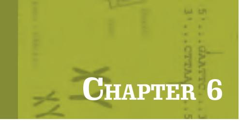
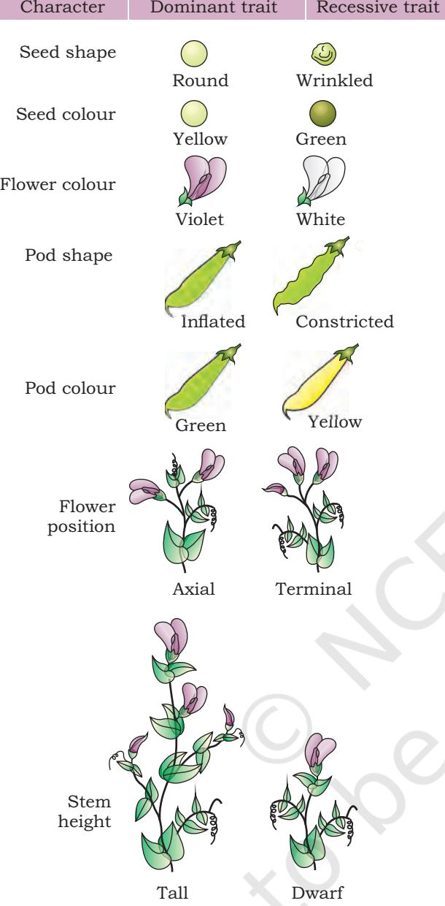

**Chapter 7**  Basic Processes

**Chapter 8**  Genetic Disorders

# **Genetic Principles and Molecular Processes Unit III Chapter 6**

The idea of inheritance patterns emerged from the work of Mendel and other scientists who followed him. What was not clear was the nature of the 'factors' which are responsible for determining a particular phenotype. It became crucial to have an understanding of the structure of genetic material and the patterns of inheritance. The foundation of molecular biology and genetics was laid down by many eminent scientists of that time, such as Watson, Crick, Nirenberg, Khorana, Monod, Benzer, etc. The contributions of these scientists and the concepts explained by them have been discussed in three chapters of this unit.

Chapter 6.indd 145 11/14/2019 10:12:55 AM

## **Gregor Johann Mendel (1822-1884)**

Gregor Johann Mendel was born on July 22, 1822 in Austria. His pioneering work laid the foundation of science of genetics and therefore, he is known as 'father of genetics'. In 1843, Mendel began studying even while being a monk at St. Thomas Monastery in Brno. There he was exposed to the lab facilities and got interested in research and teaching. His experiments focussed on cross-breeding of pea plants and gathering data on the variations for several generations. Based on his experiments on a total of seven characteristics in garden pea, he established Law of segregation and Law of independent assortment. Decades after his death in 1884, his work got recognition by other researchers. His research is now considered to be the basis of modern genetics.

Chapter 6.indd 146 11/14/2019 10:12:57 AM

- *6.1 Introduction to Inheritance*
- *6.2 Linkage and Crossing Over*
- *6.3 Sex-linked Inheritance*
- *6.4 Extrachromosomal inheritance*
- *6.5 Polyploidy*
- *6.6 Reverse Genetics*

# **6.1 Introduction to Inheritance**

Have you ever noticed that all the members of your family have several features in common like facial features, hair

colour, skin colour, etc.? Why is it so? Why do you resemble in certain characters with your mother and certain characters with your father? Characteristics that run in families have a **genetic basis**, meaning that they depend on genetic information a person inherits from his or her parents. The same is true for all plants and animals.

This transmission of characters from one generation to the next, or the phenomenon of the offsprings to inherit the parental traits is known as '**Heredity**'. The inherited

*Gregor Johann Mendel (1822–1884), 'father of genetics'*

characters are present on the chromosomes in the form of genes. Further, it is observed that though offsprings inherit

Chapter 6.indd 147 11/14/2019 10:12:57 AM

*Fig. 6.1: Seven pairs of contrasting traits of pea plants used by Mendel*

characters from their parents, they are unique and differ from their parents in certain aspects. These differences between the offsprings and their parents are known as **variations**. The study of scientific facts of heredity and variation is referred to as **Genetics**.

The major objective of biotechnology is the manipulation of the living organisms or to modify the genetic constitution of an organism to manufacture products intended to improve the quality of human life. In order to use biotechnological tools for manipulating the genes, understanding of the genetics and heredity of the traits is essential. It is essential to identify the genetic constituents (genes and their allelic forms in the population) regulating a trait, for its manipulation. In this chapter we will study about the principles of inheritance.

## **6.1.1 Mendel's work: The foundation**

Our modern understanding of inheritance of traits through generations comes from the studies made by Gregor Mendel, an Austrian monk. He selected pea plants (*Pisum sativum*) for his breeding experiments as a good model system because it is an annual plant with perfect bisexual flowers and having many contrasting pair of characters. He selected

seven pairs of contrasting characters for his breeding experiments and produced pure line for each trait by self-pollinating for several generations (Fig. 6.1; Table 6.1). He performed artificial cross pollination in plants with contrasting traits by transferring pollen from one flower to another with a small brush. He grew a large number of plants for each cross and collected data for several generations.

Chapter 6.indd 148 11/14/2019 10:12:58 AM

#### **Table 6.1: Contrasting Traits Studies by Mendel in Pea**

| S. No. | Characters | Contrasting Traits |
| --- | --- | --- |
| 1. | Stem height | Tall/dwarf |
| 2. | Flower colour | Violet/white |
| 3. | Flower position | Axial/terminal |
| 4. | Pod shape | Inflated/constricted |
| 5. | Pod colour | Green/yellow |
| 6. | Seed shape | Round/wrinkled |
| 7. | Seed colour | Yellow/green |

#### **Single gene inheritance**

When Mendel cross pollinated a pure (homozygous) tall pea plant with a pure dwarf pea plant, he noticed that the progeny of first generation (First filial or F1 generation, which was raised by collecting the seeds produced from this cross) were all tall. The dwarf phenotype was missing. What happened to the dwarf trait? When the said F1 offspring were self-pollinated to raise F2 generation, surprisingly both tall and dwarf plants appeared in the ratio of 3:1 (3 tall and 1 dwarf). Since Mendel designed this experiment by considering only one contrasting trait, i.e., tall and dwarf, this cross is called **monohybrid cross** (Fig. 6.2). Interestingly, in all such monohybrid crosses involving other contrasting pair of characters carried out by Mendel, similar ratio of approximately 3:1 were obtained in F2 generation. These results prompted Mendel to propose that each individual has two factors for each character (trait) and that one factor (which was later named as gene) was inherited from each parent through gametes.

Mendel carried out hybridisation experiments on pea plants for nine long years and published all his observations in 1866 in Annual Proceedings of Natural History Society of Brṻnn, demonstrating the actions of invisible 'factors' now called gene, in predictably determining the traits of an organism. Mendel's conclusions were largely ignored by the vast majority. In 1900, however, his work was 'rediscovered' by three European scientists, Hugo de Vries, Carl Correns, and Erich von Tschermak.

*Fig. 6.2: Monohybrid cross* 

Chapter 6.indd 149 11/14/2019 10:13:00 AM

150

This is the reason that the dwarf feature which was not there in F1 generation was found in F2. Hence, F1 tall plants are heterozygotes as they contain two different alleles (Tt). As F1 plants are heterozygous tall (Tt), this indicates that the tall allele (T) is dominant over dwarf allele (t). Thus, dwarf allele (t) is recessive to tall allele (T).

Understanding of these crosses can be well understood by the graphical representation developed by Reginald C. Punnett, a British geneticist. Using Punnett Square, we can easily calculate the probability of all possible genetic combinations or genotypes. We can see in the Fig. 6.3, that when plants in F1 heterozygous progeny were self-pollinated as they produced 'T' and 't' gametes, the progeny revealed three genotype combinations; TT, Tt, tt in a ratio of 1:2:1 respectively. Here we learnt that through Punnett Square by using mathematics, we can easily calculate probability of genotype (genetic make up) and phenotype (morphological or observable traits) of future progeny. This clearly shows that the phenotypic ratio of a monohybrid cross is 3:1 and the genotypic ratio is 1:2:1. Are you able to tell about the genotype of a particular plant merely by looking at it? For example, can you say that the tall plant of F1 or F2 progeny has the genotype TT or Tt? Therefore, Mendel crossed tall

plants from F2 with dwarf plants and determined genotype of the tall plants of F2. He called this cross as **test cross**. Through analysing the progeny of the test cross, it is easy to predict the genotype of tall plants of F2, F3 …… and so on generations (Fig. 6.4).

Inferences can be drawn that out of two contrasting characters, one is dominant and the other is recessive. This is what Mendel's law of dominance is all about. Also, alleles of these traits do segregate while getting inherited as we have seen in the above cross, called **law of segregation**.

Chapter 6.indd 150 11/14/2019 10:13:01 AM

*Fig. 6.4: Test cross for identification of genotype*

#### **Incomplete dominance**

When similar experiments were conducted with other pea varieties, it was observed that F1 hybrids were not related to either of the parents but exhibited a blending/intermediate of characters of the two parents. It means the two alleles of one trait are not related as dominant and recessive, but the dominant gene in heterozygous condition has reduced expression, so that each of the allele gets expressed itself partially, called **incomplete dominance**. In fouro'clock plant, *Mirabilis jalapa*, when homozygous plants with red flowers (RR) are crossed with the homozygous plants having white flowers (rr), the F1 plants (Rr) bear pink flowers, when these F1 plants with pink flowers undergo selfing, they yield 1:2:1 ratio of red, pink and white (Fig. 6.5).

#### **Codominance**

*Fig. 6.5: Incomplete dominance in four-o' clock plant*

So far we have seen that both alleles in

heterozygous condition have dominant recessive relationship expressing only the dominant trait or having incomplete

Chapter 6.indd 151 11-Aug-21 11:47:05 AM

dominant relationship producing an intermediate trait. Many instances have been seen in which alleles of both parents get equally expressed in F1 heterozygote. This condition is known as **codominance**. This is observed in coat colour of cattle or MN blood group of human beings (Fig. 6.6). Inheritance of coat colour in many cattles such as horses, cows and dogs is an example of codominance. When pure red (RR) recessive is crossed with pure white (WW), the F1 generation will have Roan (RW) coat colour which is a heterozygous. Roan coat colour is a mixture of white and pigmented coat colours that does not fade as the animal ages. Both the red (RR) and white (WW) traits are equally expressed in F1. Therefore, F1 generation progeny will have roan coat colour.

| Genotype | Phenotype | Antigen present |  |  |  |
| --- | --- | --- | --- | --- | --- |
|  |  | on red |  |  |  |
|  |  | blood |  |  |  |
|  |  | cell |  |  |  |
| LMLM | M | M | Pure white (WW) Roan (RW) |  | Pure red (RR) |
| LMLN | MN | M and N |  |  |  |
| LNLN | N | N |  |  |  |
|  |  |  | Fig. 6.6: Codominance of MN blood group and coat colour | in cattle |  |

152

#### **Law of independent assortment**

Let us now consider a dihybrid cross between homozygous round shape and yellow colour (RRYY) seeded pea plant with a homozygous wrinkled and green colour (rryy) seeded pea plant. All F1 progeny were round seeded having yellow colour. Can you guess in this example which traits are dominant and which are recessive? In F1 progeny, as all plants were round and yellow seeded, it clearly showed that they are dominant over wrinkled and green seeded traits.

The result of F2 generation upon selfing is explained in Fig. 6.7 in which a ratio of 9:3:3:1 of offspring with 9 round yellow, 3 wrinkled yellow, 3 round green, and 1 wrinkled green (9:3:3:1) is observed. Since two pairs of contrasting characters are included in such crosses, hence they are called **dihybrid crosses**.

Based upon such observations on dihybrid crosses, the third principle of inheritance, i.e., **Law of Independent Assortment** was proposed.

Chapter 6.indd 152 11/14/2019 10:13:02 AM

There is an interesting observation in such a dihybrid cross that not only the parental traits reappear in F2 but there are new combinations of traits, i.e., round shaped seed with green colour and wrinkled seed with yellow colour (Fig. 6.7). Such a new combination is possible only in a situation when factors or genes controlling a specific trait are inherited independent of each other. Such a pattern of inheritance is known as the principle of independent assortment of alleles. *Can you work out the genotypic ratio of F2 progeny using the Punnett square data?*

153

*Fig. 6.7: Results of a dihybrid cross where parents differ in two pairs of contrasting characters* 

# **6.2 Linkage and Crossing Over**

We have already learnt that there are several phenotypic traits in the body of an organism such as colour of flower (red/white), shape of pollen (round/elliptical), etc., in pea. Each of these phenotypic traits is determined by a pair of alleles, which is located at a specific gene loci of homologous chromosomes (autosomes or sex-chromosomes). Thus, organisms may have numerous genes for its various

Chapter 6.indd 153 20-Sep-21 10:52:35 AM

phenotypic traits. As you know in humans, there are 20,000 to 25,000 protein coding genes present on 23 pairs of chromosomes. Thus, each chromosome contains several genes. Can you think the genes present in each chromosome are inherited together or independently? Because several genes are present in a chromosome, they should be inherited together as a unit during meiosis. This phenomenon of the inheritance of genes together and to retain their parental combination even in the offspring is known as **linkage**. The genes located on the same chromosomes and being inherited together are known as **linked genes** and the characters controlled by these genes are known as **linked characters**. All the genes located on the single chromosomes constitute a linkage group.

154

W. Bateson and R.C. Punnett provided the evidence in favour of linkage in their experiments on sweet pea (Fig. 6.8). They crossed plants with red flowers and long pollen grains to plants with white flowers and short pollen grains. All plants in F1 progeny/generation had red flower with long pollen grains, thus indicating that the alleles for these two phenotypes were dominant. When the F1 progeny was self

*Fig. 6.8: Bateson and Punnett experiment on sweet pea to study linkage*

Chapter 6.indd 154 20-Sep-21 10:53:20 AM

pollinated, they observed peculiar distribution of *genotypes* among the offspring (Fig. 6.8). Bateson and Punnett could not provide the correct explanation for this experiment but later on in similar kind of experiments on *Drosophila*  performed by Morgan and his colleagues in 1910 provided explanation for the same which is discussed in the next section.

The data revealed that the genes for flower colour [Red (R), white (r)] and pollen grain length [Long (L), short (l)] do not assort independently as expected. The correct explanation for the lack of independent assortment in the data is that the genes for flower colour and pollen length are located on the same chromosome, that is they are linked. This is explained in the diagram (Fig. 6.9).

Later on Morgan (1910) suggested that the genes are present in a linear fashion in chromosome. All the genes present in the same chromosome are inherited together generation after generation retaining the parental combination. A cross between a homozygous grey bodied vestigial winged (BBvv) *Drosophila* with a black bodied long winged (bbVV) *Drosophila* produced grey bodied and long winged (BbVv) flies in F1 generation. When these flies were

crossed with a double recessive fly (bbvv), surprisingly in addition to parental combination (83%), non-parental (17%) combination appeared. This indicated that linked genes do not stay together always but may get separated due to exchange of segments during gametogenesis. This phenomenon of interchange of chromosome segments is known as **crossing over** (Fig. 6.10). The linked genes are located on the same chromosome in a linear fashion. If chromosomes remain intact during inheritance, the genes located on one chromosome should be inherited together generation after generation, and only parental combinations must appear in F2 generation. But in most

*Fig. 6.9: Linkage and crossing over among genes for flower colour (R and r) and pollen shape (L and l)* 

Chapter 6.indd 155 20-Sep-21 10:54:07 AM

155

of the cases though parental combinations are more numerous, non-parental combinations also appear. This indicates that the linked genes do not always stay together but get separated many a times. They get separated with an interchange of alleles, resulting in the appearance of non-parental combinations. When Morgan mated grey bodied vestigial winged (BBvv) and black bodied long winged (bbVV) *Drosophila*, it produced F1 hybrid, all of them having grey body and long wings (BbVv). When female flies of F1 generation were crossed with double recessive males having black body and vestigial wings (bbvv), four types of offsprings were produced as follows:

> Grey vestigial — 41.5 per cent Grey long — 8.5 per cent Black vestigial — 8.5 per cent Black long — 41.5 per cent

156

In this case parental combinations are 83 per cent and non-parental combinations are 17 per cent. This phenomenon in which non-parental combinations appeared due to interchange of alleles is called **crossing over**.

*Fig. 6.10: Single cross over between two non-sister chromatids of a pair of homologous chromosomes*

### **6.3 Sex-linked Inheritance**

One of the earliest known instance of sex-linked character is the bleeders disease haemophilia observed only in males in the royal family of Britain. However, the concept of sexlinked inheritance was introduced by Thomas H. Morgan in 1910, while working on *Drosophila melanogaster*.

Chapter 6.indd 156 11/14/2019 10:13:03 AM

Morgan and his coworkers noted the sudden appearance of one white-eyed male in the culture of wild red eyed *Drosophila*. This white-eyed male was crossed with red eyed female, the flies of F1 generation (both male and female) were all red eyed, indicating that white-eyed mutation (w) is recessive to red eye colour (W). When F1 flies mate freely, the red and white eyed flies appeared in the ratio of 3:1 in F2 generation. But all the white eyed flies were male. The red-eyed males were equally numerous. The female on the other hand were all red eyed. The white eyed female did not appear. Morgan concluded that the gene for eye colour is located on X chromosome (Fig. 6.11). Such genes for autosomal characters present in sex chromosomes are called sex-linked genes and inheritance of these sex-linked genes is called sex-linked inheritance. Colour blindness and haemophilia are common examples of sex-linked inheritance in human.

157

*Fig. 6.11: Sex linkage in Drosophila* 

#### **6.4 Extrachromosomal Inheritance**

As discussed earlier, in addition to nucleus, DNA is also present in mitochondria and plastids. Gametes carry a copy of nuclear DNA from the respective parents and that combine to form new individual after fertilisation. An interesting feature of fertilisation process is that

Chapter 6.indd 157 11-Aug-21 12:31:40 PM

sperm cell loses most of its cytoplasm and cytoplasmic organelles before fertilisation and only sperm nucleus enters in the egg. Therefore, zygote receives genome of plastids and mitochondria only from the maternal parent. This phenomena is also called as **extrachromosomal** or **cytoplasmic inheritance**. Several traits are controlled by the genes present in plastids or mitochondrial genomes. These traits do not follow the Mendelian principles of inheritance and most of the cytoplasmic traits that have

158

*Fig. 6.12: Plant with variegated leaves*

been recorded, they follow maternal line. Therefore, this phenomenon is also known as maternal or **uniparental inheritance**. For example, some of the enzymes required for cellular respiration are coded by DNA present in the mitochondria and DNA that codes for chlorophyll or other pigments is present in plastids. In Four O'clock plant (*Mirabilis jalapa*), leaves can be white, green or variegated (mixture of white and green) because of genes in the DNA of plastids (Fig. 6.12). The evidence of maternal or extrachromosomal inheritance concludingly came from the crosses conducted in the Four O'clock plant. The cross of female green, white or variegated plant with either of those make phenotypes yield offspring with female phenotype only.

# **6.5 Polyploidy**

As discussed earlier, the number of complete set of chromosomes in an organism represents the ploidy number. The organisms having one or two complete sets of chromosomes are known as haploids or diploids, respectively. Other organisms having more than two sets of chromosomes in each cell are known as **polyploids.**  Depending upon the number of chromosome sets, polyploid are known as triploid (3 sets), tetraploid (4 sets), hexaploid (6 sets), octoploid (8 sets) and so on (Fig. 6.13). Most of the species that we see around us are diploid. Natural occurrence of monoploidy or haploidy is rare in nature. In some species of bees and ants, males are haploid, and females are diploid. Though, polyploidy is rare in animal kingdom, it is very common in the plant kingdom (Table 6.2). In fact, more than 30% plants are polyploid. Size of various parts like leaves and cell size in polyploid plants is typically larger as compared to diploid plants. Further,

Chapter 6.indd 158 11-Aug-21 2:13:01 PM

polyploid plants seem to be more tolerant to harsh environment conditions.

Change in number of chromosomes does not occur as complete set always. In some organisms some chromosomes may be over- or underrepresented, i.e., they have incomplete set of chromosomes. These organisms in which either one or more chromosomes of a chromosome set are either missing or have more copies, are known as **aneuploids**. Aneuploidy usually results from irregular meiotic division that leads to unequal distribution of chromosomes to opposite poles.

159

*Fig. 6.13: Chromosomes in polyploid genomes*

| Name of Plant | Total No. of | No. chromosomes in | Ploidy Level |
| --- | --- | --- | --- |
|  | Chromosomes | one Set (X) |  |
| Rice | 24 | 12 | Diploid |
| Sorghum | 20 | 10 | Diploid |
| Banana | 22 or 33 | 11 | Diploid or Triploid |
| Apple | 34 or 51 | 17 | Diploid or Triploid |
| Peanuts | 40 | 10 | Tetraploid |
| Cotton | 52 | 13 | Tetraploid |
| Potato | 48 | 12 | Tetraploid |
| Wheat | 42 | 7 | Hexaploid |
| Strawberry | 56 | 7 | Octoploid |
| Sugarcane | 80 | 10 | Octoploid |

#### **Table 6.2 List of plants representing various ploidy levels**

# **6.6 Reverse genetics**

In the above sections, we have learnt as to how we study the genetic principles based upon the phenotypic variations. These can be measured in the form of macro variations like visible morphological variations such as size, shape and number of body organs (i.e., macro-variations) or variation in DNA sequences, protein profiles, or metabolites, etc. (i.e., micro-variations). This process of analysing phenotypic variations in the population and to determine genetic

Chapter 6.indd 159 11/14/2019 10:13:03 AM

constituents (DNA sequences or genes) regulating these variations is called forward genetics (Fig. 6.14). In last few decades, DNA sequencing technologies have evolved exponentially and has made it possible to read complete genome of organisms, thereby identifying all the genes in them. In a reverse genetic approach, investigation starts with the analysis of DNA or protein sequence rather than phenotypic variations. In forward genetic approach, it is possible to identify regulatory genes that produce visible phenotypes, whereas reverse genetics can be used to investigate function of any gene/protein in an organism.

Reverse genetics approach starts with DNA sequence (gene) or a *protein sequence* with an unknown function (Fig. 6.14). First candidate gene is selected whose function is not known and we want to determine its function.

*Fig. 6.14: Forward genetics*

160

Various experimental procedures are used to disrupt the candidate gene and then its effect on development of the organism is analysed. If the candidate protein, the function of which is to be determined is a protein, it is first traced backwardly to ascertain its DNA sequence. The candidate gene is cloned and is reinserted back to genome of the same organism. Its expression is silenced to determine the phenotypic outcome. Whole genome sequencing has led to identification of large number of genes, whereas functions of only a

few genes are known. Further, each gene in an organism does not result in visible variations. Therefore, reverse genetics approach can be used to characterise genes having unknown functions. In summary, the goal of reverse genetic approach is to induce variations in a particular gene and investigate their impact on an organism. Several technical procedures are used for causing variation (disruption or altering) in target. These techniques can be very specific like gene silencing through RNA interference (RNAi) or targeted gene disruption by homologous recombination. RNAi is a regulatory biological process, which uses small double stranded RNA molecules to inhibit gene expression or translation.

Chapter 6.indd 160 11-Aug-21 2:15:26 PM

### **Summary**

- Characteristics that run in families have a genetic basis, meaning that they depend on genetic information that a person inherits from his or her parents. This is true for all plants and animals.
- Transmission of characters from one generation to the next generation or the phenomenon of the offspring to inherit the parental traits is known as Heredity.
- The differences that exist between the offsprings and their parents are known as variation.
- The study of scientific facts of heredity and variation is referred to as Genetics.
- Our modern understanding of inheritance of traits through generations comes from the studies made by Gregor Mendel, an Austrian monk.
- When a cross is made between parents with one pair of contrasting characters it is called a monohybrid cross.
- Each gene exists in two alternate forms called alleles. When two similar alleles for a trait are present in an individual it is referred as homozygous alleles, while when two different alleles for a trait are present in an individual it is referred as heterozygous alleles.
- The phenotypic ratio of a monohybrid cross is 3:1 and the genotypic ratio is 1:2:1.
- A test cross help determine whether a dominant phenotype is homozygous or heterozygous for a specific allele.
- Mendel's law of dominance states that out of the two contrasting characters, one is dominant and the other is recessive.
- According to law of segregation, alleles of traits segregate in the process of inheritance.
- In case of incomplete dominance, the two alleles of a trait are not related as dominant and recessive, but the dominant gene in heterozygous condition reduce expression, so that each of the allele expresses itself partially.
- When both the alleles of parental generation get equally expressed in F1 heterozygote, it is known as codominance.
- When a cross is made between parents with two pairs of contrasting characters, it is called a dihybrid cross.
- According to the principle of independent assortment of alleles, factors or genes controlling a specific trait is inherited independent of each other.

Chapter 6.indd 161 11/14/2019 10:13:04 AM

- The phenomenon of inheritance of genes together and to retain their parental combination even in the offspring is known as linkage. Genes located on the same chromosome and being inherited together are known as linked genes and the characters controlled by these genes are known as linked characters.
162

- The phenomenon in which non-parental combinations appear due to interchange of alleles is called crossing over.
- There are different types of inheritance: Sex-linked inheritance (inheritance resulting from a recessive gene in the sex chromosome), extra chromosomal or cytoplasmic inheritance (inheritance of characters controlled by genes present in the cytoplasm) and maternal or uniparental inheritance (transmission of genetic characters only from maternal extra nuclear elements such as mitochondrial DNA). Organisms having more than two sets of chromosomes in each cell are known as polyploids.
- Organisms in which either one or more chromosomes of a chromosome set are either missing or have more copies are known as aneuploids.
- The process of analysing phenotypic variations in the population and to determine genetic constituents (DNA sequences or genes) regulating these variations is called forward genetics. While reverse genetics approach starts with DNA sequence (gene) or a protein sequence with an unknown function.
- Characters are controlled by small DNA segments called genes.
- Collection of all the DNA material in one complete set of chromosomes (including all the genes and other part of DNA) in a cell is referred to as genome. A eukaryotic cell has two types of genome: nuclear genome and organellar genome (such as chloroplast genome and mitochondrial genome).
- One complete set of chromosomes in an individual makes genome of that individual and is represented by the letter n. Most of the organisms carry two sets of chromosomes (2n) and are known as diploid organisms.

Chapter 6.indd 162 11/14/2019 10:13:04 AM

# Exercises

163

- 1. Differentiate between the following
	- (a) Genotype and Phenotype
	- (b) Dominant and Recessive characters
	- (c) Hybrid and Pure individuals
	- (d) Heterozygous and Homozygous progeny
	- (e) Monohybrid and Dihybrid cross
	- (f) Gene and allele
	- (g) Incomplete dominance and codominance
- 2. Mention the genotypic and phenotypic ratio of progeny when there is a cross between
	- (a) F1 progeny with pure dominant parent
	- (b) F1 progeny with pure recessive parent
	- (c) F1 progeny with F1 progeny
- 3. Explain test cross through diagrammatic representation.
- 4. Explain following using monohybrid cross
	- (a) Law of dominance
	- (b) Law of segregation
	- (c) Law of independent assortment
- 5. What will be the genotypic and phenotypic ratio when a red and tall homozygous tomato plant is crossed to a red and tall heterozygous plant?
- 6. When one male and one female Drosophila, heterozygous for the two pairs of alleles AaBb, were mated, the offspring's phenotypic ratio 2:1:1:2 was obtained.
	- (a) Explain how these ratios help in detecting linkages?
	- (b) How degree of linkage can be determined?
- 7. Make a close observation with the nature. Do you think that the phenomenon of linkage is absolute?

Chapter 6.indd 163 11/14/2019 10:13:04 AM

