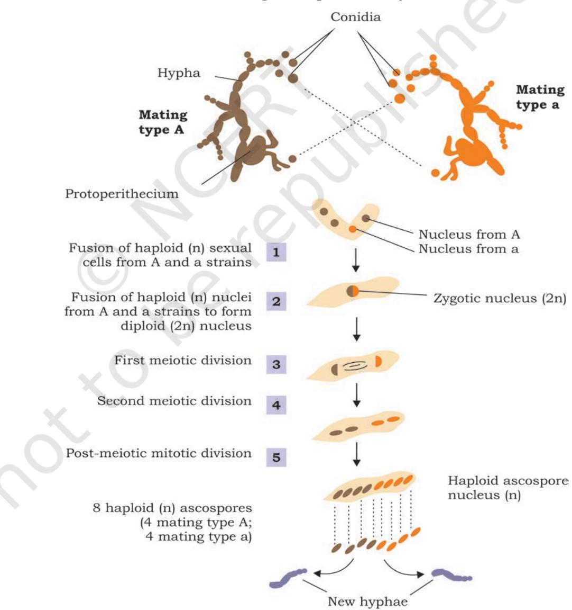
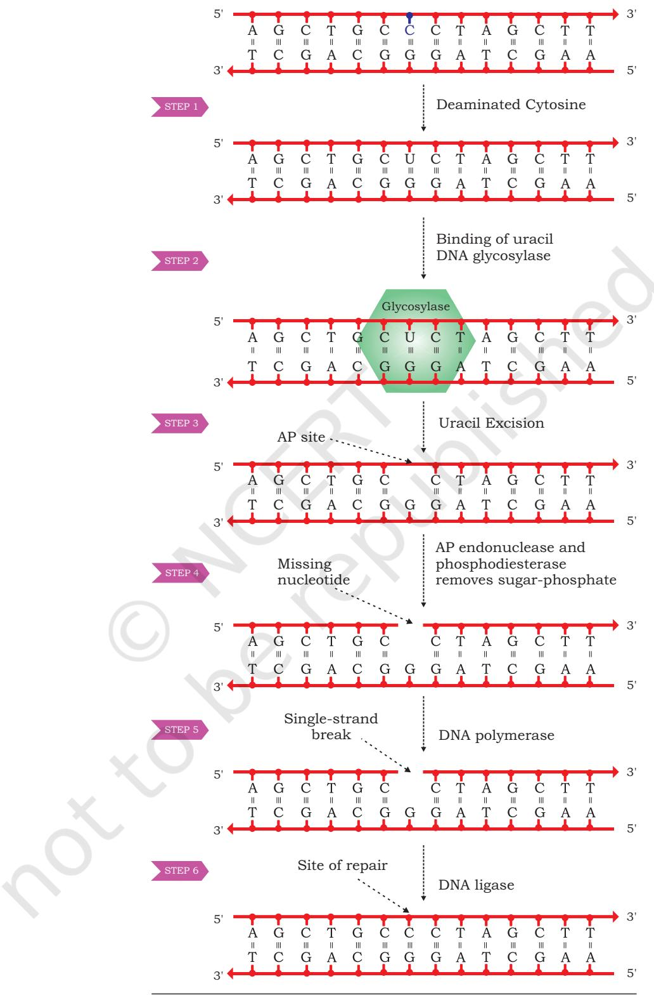
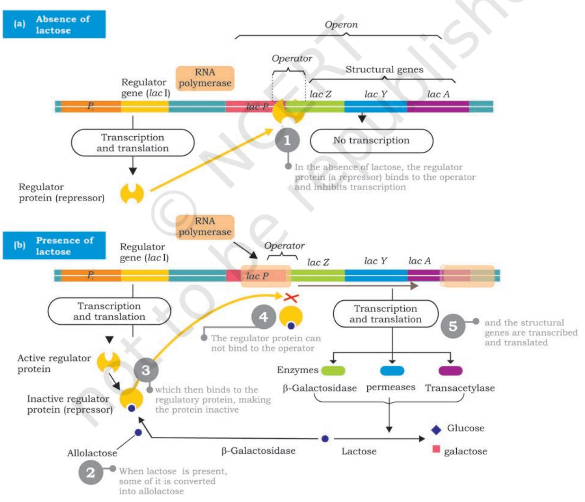

- *7.1 DNA as the Genetic Material*
- *7.2 Prokaryotic and Eukaryotic Gene Organisation*
- *7.3 DNA Replication*
- *7.4 Gene Expression*
- *7.5 Genetic Code*
- *7.6 Translation*
- *7.7 Gene Mutation*
- *7.8 DNA Repair*
- *7.9 Recombination*
- *7.10 Regulation of Gene Expression*

### **7.1 DNA As The Genetic Material**

You have studied in previous chapter that characters or traits are inherited from parents to offspring through genes. You are also aware that these genes are present on chromosomes which are made up of nucleic acids and proteins. However, understanding the nature of gene which is responsible for expression of trait was one of the biggest challenges before the scientific community. Answer to this question came after a few experimental evidences that deoxyribonucleic acid (DNA) determines the trait or feature of any organism except a few viruses.

Credit of discovery of DNA goes to Johann Friedrich Miescher, who for the first time isolated an acidic substance from nuclei of pus cells and named nuclein having DNA and protein. Due to presence in chromosome and nucleus these two chemical components; nucleic acid (mainly DNA) and protein became possible candidates to be the genetic material. Still, the nature of genetic material remained unknown for a long time. Gradually, experiments with microorganisms by different investigators yielded results that provided evidences in favour of DNA as genetic material.

Chapter 7.indd 164 20-Sep-21 11:57:36 AM

#### **7.1.1 Discovery of the transforming principle**

165

In 1928, a British medical officer, Frederick Griffith made an observation in the course of developing a vaccine against pneumonia caused by bacterium *Streptococcus pneumoniae* (also called *Diplococcus pneumoniae*) in mammals, which causes pneumonia in humans and is normally lethal in mice. He identified two different strains (varieties) of the bacterium i.e. virulent (disease causing) having a polysaccharide capsule around cell and nonvirulent (harmless). In virulent strain, each bacterium is surrounded by a polysaccharide capsule because of which the bacterial colony when grown on an agar plate appear smooth and are referred to as smooth strain (S). The non-virulent strain lack polysaccharide coat and produce rough looking colony and are referred to as rough strain (R). The S type bacteria kill mice by causing pneumonia.

Griffith made a series of experiments with S and R type bacteria (Fig. 7.1). When he injected live S bacteria into mice, the mice developed pneumonia and died. However, when he infected mice with R type bacteria mice showed no ill effects. The results of these two experiments confirmed that the polysaccharide coat present in S type bacteria was apparently necessary for virulence.

*Fig. 7.1: Griffith's transformation experiment*

Chapter 7.indd 165 20-Sep-21 11:57:36 AM

166

In order to understand further, Griffith killed some virulent S bacteria by boiling them and injected the said heat-killed bacteria into mice. As per his expectations, mice survived. However, quite unexpectedly, mice died due to pneumonia when it was injected with a mixture of heat-killed S bacteria and live R bacteria. Examination of blood and tissue fluid of the dead mice revealed the presence of live S type bacteria. Based on the above observation, Griffith concluded that the R-strain bacteria must have taken up what he called a '**transforming principle**' from the heat-killed S bacteria, which allowed them to 'transform' into smooth-coated bacteria and become virulent. He called the phenomenon as transformation, which means transfer of genetic material from one cell to another that alter the genetic makeup of the recipient cell. But the nature of transforming substance still needed to be determined.

### **7.1.2 Biochemical characterisation of transforming principle**

Three scientists, Oswald T. Avery, Colin Macleod and Maclyn McCarty conducted a series of experiments to identify the Griffith's transforming principle, and it was confirmed in 1944 that the transforming agent is DNA (Fig. 7.2). In the design of experiment, they focused on three main components of smooth strain of bacteria, i.e., DNA, RNA and protein. They prepared an extract of heat-killed smooth strain of the bacteria from which lipids and carbohydrates were removed. Remaining components of the extract having proteins, RNA and DNA were retained for further experiment by dividing the extract into three parts. These extracts were separately treated with hydrolytic enzymes like ribonuclease (RNase), deoxyribonuclease (DNase) and protease to degrade RNA, DNA and protein, respectively, for their transforming ability by transferring each of the enzyme treated extracts into three different cultures of rough strain of bacteria. Transformation of rough strain into the smooth strain was observed in those colonies in which RNase and protease treated extract were added and not in the colony to which DNase treated extract was added. These results established beyond doubt that it is DNA which acts as a likely transforming principle.

Chapter 7.indd 166 20-Sep-21 11:57:36 AM

167

### **7.1.3 The Hershey – Chase experiment**

Later on, yet another experiment conducted by Alfred Hershey and Martha Chase (1952) with T2 bacteriophages provided evidence in favour of DNA as genetic material. The virus T2 bacteriophage that infects *Escherichia coli*  bacteria contains DNA surrounded by a protein coat. When it infects a bacterial cell, it attaches onto the outer surface followed by injecting its DNA into the cell. In a series of their experiments with T2 bacteriophage and *E. coli*, the purpose was to establish as to which component is responsible for multiplication of phage particles, DNA or protein. To identify easily, T2 bacteriophages were initially grown with the colonies of *E. coli* in medium containing radioactive phosphorous (32P) and radioactive sulfur (35S) separately (Fig. 7.3). This led to labelling of one set of bacteriophages with radioactive phosphorous (32P) and the other set with radioactive sulphur (35S).

35S and 32P labelled T2 phages were now inoculated into two separate cultures of unlabelled *E. coli* bacterial colony. After infection, the bacterial colonies were agitated

Chapter 7.indd 167 20-Sep-21 11:57:37 AM

in a blender for removing any remaining phage and phage parts from the outside of the bacterial cells. The mixture of the blender was then centrifuged to separate the bacteria (present in pellet) from the phage debris (present in supernatant). Pellets of bacterial culture which showed radioactivity were infected with phages having radioactive DNA, whereas, radioactivity was observed in the supernatant which was infected with 35S bacteriophage. This indicates that proteins did not enter the bacteria from the phage. It was therefore, concluded that the material which enters into bacterial cell, i.e., the DNA can be the genetic material.

Though the above experiments provided strong evidence in favour of DNA as the genetic material, it was not clear DNA molecule is the repository of genetic information. Subsequent studies made by Erwin Chargaff, Maurice Wilkins, Rosalind Franklin, James Watson and Francis Crick led to the discovery of DNA structure, clarifying how DNA can encode large amounts of information (described in Chapter 3).

*Fig. 7.3: Hershey-Chase experiment*

Chapter 7.indd 168 20-Sep-21 11:57:37 AM

# **7.2 Prokaryotic and Eukaryotic Gene Organisation**

It is well understood that traits get inherited from parents to offspring as 'gene unit' and DNA is the genetic material in all organisms except some viruses (where the genetic material is RNA). This led to the question about the organisation of gene, whether this organisation is similar in prokaryotes as well as eukaryotes and how does it function at molecular level? Gene is the unit of inheritance that controls a specific trait or character and may also be expressed in alternative forms known as alleles. In other words gene is a segment of DNA that expresses itself through the synthesis of polypeptide chain via RNA synthesis, which is known to be the '**Central dogma**' of molecular biology.

169

In the beginning it was established that the traits or characters are regulated by gene on the basis of the rediscovery of Mendel's principle of inheritance in 1900, and a series of subsequent researches both in plants and animals established the fact that characters or features are regulated and controlled by some inherent principle which are passed on from one generation to the other. Factor or the inherent unit that controls traits or character was later given the name 'gene' by Wilhelm Johannsen in 1909.

Understanding the nature and functioning of gene was one of the main focuses of scientific community during the early twentieth century. The work of George Beadle and Edward Tatum during 1930s on the mould *Neurospora crassa* helped to establish the relationship of a gene to control synthesis of one enzyme.

Considering the property that the mould *Neurospora crassa* can be very easily grown on medium containing simple sugar, inorganic salts and vitamin biotin, Beadle and Tatum experimented on the premise that the organism can synthesise other essential amino acids and nitrogenous bases on its own (Fig. 7.4). It was considered to be obvious that the synthesis is mediated by enzymes, which are synthesised under genetic control. Design of the experiment was very simple in which the conidia, i.e., the asexual

Chapter 7.indd 169 20-Sep-21 11:57:37 AM

spores were irradiated with X-ray to induce mutation (Fig. 7.4). The offspring produced by irradiated spores were identified by growing them on some specific minimal medium. For the purpose of identifying strains with mutation, the offspring of irradiated spores were crossed with wild type and identified mutant strains by growing the subsequent offspring on minimal medium either for a specific amino acid or vitamin (culture medium that contains all amino acids, nitrogenous bases and vitamins except a specific vitamin or amino acid). Many such mutations were identified by them and it was genetically established that each of the mutation, in fact, results in the non-functioning of a specific enzyme.

170

*Fig. 7.4: Experiment showing detection of mutation in Neurospora*

Chapter 7.indd 170 20-Sep-21 11:57:37 AM

Subsequently, it was observed that not all proteins are made up of single polypeptide but more than one polypeptide chain. The fact that one gene encodes one polypeptide; the central dogma also got modified from one gene one protein, to one gene one polypeptide.

Almost simultaneously in early 1940s, the cytological investigations of chromatin fibre revealed somewhat bead on a string like structure (Fig. 7.5) through electron

*Fig. 7.5: Beads on string structure of chromatin*

microscopy and it was readily concluded that each bead perhaps represents a gene. Later investigations revealed that each bead is a nucleosome (containing a core of histone octamer and a 171

double stranded DNA of 146 bp) and a string between the two beads, the linker DNA. It was also established that each nucleosome with its linker region involves approximately 200 bp. This cannot be considered to be a gene, as the size of the genes in many cases has to be much bigger than 200 nucleotides. The simple reason is that many proteins have more than 100 amino acid residues and their corresponding regulatory genes cannot be less than three times of the same (based on triplet nature of the codon).

It has now become evident that a gene is the segment of DNA with specific promoter region, where RNA polymerase can bind and transcribe mRNA. The transcribed mRNA then gets involved in the process of translation. The mechanism is same for all organisms from virus to bacteria, plants and animals. Are genes of a virus, bacterium or higher organism similar in their structure and function? The total DNA content in one complete set of chromosomes (including all the genes and other parts of DNA) is called a genome. As we see in the case of viruses or bacteria, the size of genome is comparatively much smaller than that of eukaryotic genome. Eukaryotic genomes are much more complex than prokaryotic genomes. Plant genomes are even more complex than any other eukaryotic genomes. Estimated size of genome in various groups of living organisms is shown in Fig. 7.6.

Chapter 7.indd 171 20-Sep-21 11:57:37 AM

*Fig. 7.6: Genome size variations in various groups of living organisms. Genome sizes are measured in thousands of nucleotide pairs, i.e., 1000 bp = 1 Kilobase (kb) and 1000,000 bp = 1000 Kb = 1 Megabase (Mb)* 

> In most of the eukaryotes a major part of the genome is not expressed and remains as non-coding sequence. It has also been observed that in eukaryotic gene expression the size of active mRNA involved in the process of polypeptide chain synthesis is much smaller than the primary transcript. In fact, many of the eukaryotic genes e.g., the β-globin gene of haemoglobin after transcription undergoes the process of splicing in which a few interspersed segment of primary transcript is excised (introns) and remaining portions (exons) of the RNA transcript are joined together to form mRNA.

> A eukaryotic cell has two types of genome: (i) nuclear genome and (ii) organellar genome.

#### **Nuclear Genome**

Majority of the DNA is found in the nucleus and is known as nuclear DNA. In prokaryotes, most of the genome is composed of coding DNA sequences while in eukaryotic genomes coding regions makes relatively very small part of the total genome. For example, size of the human genome is about 3,000 Mb or 3 billion base pairs of DNA and estimated to have more than 20,000 genes, which

Chapter 7.indd 172 20-Sep-21 11:57:37 AM

constitutes approximately 2% of the total genome. In noncoding region of the genome, there are sequences which are repeated thousands to several million times in the form of tandem arrays. Size and number of these repetitive DNA sequences in the genome varies significantly.

Nuclear genome in a eukaryotic cell is organised into smaller condensed unit, known as chromosome containing linear DNA molecules. One complete set of chromosomes in a haploid genome of an individual is represented by letter n. Most of the organisms carry two sets of chromosomes in each cell and are known as diploid organisms (2n).

#### **Organellar Genomes**

In addition to nuclear DNA, few membrane-bound cellular organelles like chloroplast and mitochondria contain organelle-specific DNA. Organelle genomes are mostly circular double stranded DNAs and are present in multiple copies in each organelle (Fig. 7.7). These replicate in semi-conservative fashion and are inherited separately from the nuclear genome. Organelle DNA contains genes that are required for organelle-specific functions and are usually uniparental and inherited to next generation through female gametes.

173

# **7.3 DNA Replication**

When the three dimensional structure of DNA was proposed by James Watson and Francis Crick in 1953, the feature that most excited the biologists was the complementary relationship of bases of two polynucleotide chains. Watson and Crick immediately suggested a model that the basis for copying the genetic information is

Chapter 7.indd 173 20-Sep-21 11:57:38 AM

complementarity (For details refer to Unit II, Chapter 2). According to the model proposed by them, the two strands of DNA separate during replication; each strand serving as a template for the synthesis of a new complementary strand because of the specificity of base pairing (i.e., Thymine with Adenine and Cytosine with Guanine). Thus the parental duplex DNA to form two identical daughter duplex, each of which consists of one parental strand and one newly synthesised daughter strand. This form of DNA replication is called **semiconservative replication** (Fig. 7.8). The evidence for this mode of replication was provided by Mathew Messelson and Franklin Stahl in 1958.

174

*Fig. 7.8: Semiconservative mode of DNA replication*

#### **7.3.1 Messelson and Stahl experiment**

To distinguish between old and new strand, Messelson and Stahl used two isotopes of nitrogen, 14N (the common form) and 15N (a rare, heavy form). They grew *E. coli* bacteria in a medium containing the heavier isotope of nitrogen as the sole nitrogen source. After several generations, all the *E. coli*  cells had 15N incorporated into the purine and pyrimidine bases of DNA. By using density gradient centrifugation, they observed that the DNA extracted from *E. coli* grown in 15N produced a single band at the lower side of the centrifuge tube, while DNA extracted from bacterial cells grown in 14N medium formed a band closer to the top. This indicated that the DNA of *E. coli* cells grown in 15N medium was denser

Chapter 7.indd 174 20-Sep-21 11:57:38 AM

than that of bacteria grown in a medium containing the lighter isotope (14N) (Fig. 7.9).

Messelson and Stahl then transferred the *E. coli* bacteria from the 15N medium to the 14N medium and collected DNA at various time intervals as the bacterial cells multiplied (*E. coli* divides after every 20 minutes). The DNA extracted from *E. coli* cells after first round of division (generation I) when analysed by using cesium chloride salt in density gradient centrifugation) produced a single band, but at a position intermediate between the

175

*Mathew Messelson and Franklin Stahl confirmed semi-conservative mode of DNA replication*

bands of heavy DNA (15N) and light DNA (14N) bands. When DNA was extracted from *E. coli* cells, after a second round of replication in 14N medium (generation II) two bands of equal intensity appeared in the centrifuge tube, one in the intermediate position and other at the position expected of DNA that contained only 14N DNA. When samples of DNA were collected after additional rounds of replication they produced two bands. The bands representing light DNA became progressively thicker but the band at the intermediate position remained unchanged.

#### **Box 1**

#### **Density Gradient Centrifugation**

It is a centrifugation technique for separating the molecules from a mixture on the basis of their density. The centrifugation tube is filled with a heavy salt solution of cesium chloride (CsCl) and the sample whose density is to be measured. The centrifuge tube is then allowed to spin in an ultracentrifuge at a very high speed for several days. The enormous artificial force generated by the ultracentrifuge causes the Cs ions to migrate towards the bottom of the tube, creating a gradient with high density at the bottom and low density at the top. The DNA strands float or sink in the gradient till the density matches the density of the salt.

It is then spun in a centrifuge at high speed for several days

A centrifuge tube is lled with a heavy salt solution and DNA fragments

A density gradient develops within the tube. Heavy DNA (with N) will 15 move towards the bottom; light DNA (with N) will remain closer to the top 14

Chapter 7.indd 175 20-Sep-21 11:57:38 AM

176

### **7.3.2 Interpretation of results by Messelson and Stahl**

After the first round of replication, each daughter DNA duplex was a hybrid having one heavy strand containing 15N from the parent and one light strand containing 14N from the medium. When this hybrid duplex replicated, the heavy template strand formed another hybrid duplex DNA while the lighter formed light DNA duplex. Thus, Messelson and Stahl experiment clearly confirmed the prediction of Watson and Crick model that DNA replicates in a semiconservative manner.

Taylor and colleagues in 1958 also conducted similar experiments in *Vicia faba* by using radioactive thymidine to detect the distribution of newly synthesised DNA in the chromosomes. They also proved that DNA in chromosomes replicate semiconservatively.

### **7.3.3 The machinery of replication**

In order to carry out the replication of double stranded DNA molecule it must unwind for separating the strands to expose the bases. Both DNA strands act as template for the assembly of complementary bases to form new polynucleotide strands which are anti-parallel to the template strand. Several proteins and enzymes are required for unwinding the double helix and synthesis

Chapter 7.indd 176 20-Sep-21 11:57:38 AM

of new strands of DNA. The key enzymes and proteins involved in the replication of DNA in both prokaryotes and eukaryotes include177

#### (i) *DNA Polymerases*

These are the main enzymes of replication as they are responsible for synthesising new DNA strands. They synthesise new DNA strands in 5'→3' direction by catalysing the formation of phosphodiester bond between the 3′ hydroxyl group at the growing end of DNA chain and the 5′ phosphate group of incoming deoxy-ribonucleoside triphosphate (dNTP).

In prokaryotes, there are three kinds of DNA polymerases—DNA polymerase I, II, III. DNA polymerase III is the main enzyme of DNA replication. It synthesises new strand in 5'→3' direction and by its 3'→5' exonuclease activity that enables it to correct errors in the growing chain by removing mis-incorporated nucleotides in 3'→5' direction. The DNA polymerase I has 5'→3' polymerisation activity in addition to both 5'→3' and 3'→5' exonuclease activity. By its 5'→3' exonuclease activity, it removes RNA primers laid down by primase. The DNA polymerase II is involved in repair of DNA. In eukaryotes, multiple DNA polymerases are involved in synthesis of new strands and repair of damaged DNA.

#### (ii) *Primase*

The drawback of DNA polymerase is that it cannot initiate synthesis of a new strand of DNA. It needs a RNA primer, an existing segment of nucleotides that provides 3′ OH group to which it can add a new nucleotide. The primase, a DNA dependent RNA polymerase synthesises short RNA oligonucleotide chain (about 10-12 nucleotides long) called RNA primer in order to get DNA replication started.

#### (iii) *Helicases*

In order to generate single strand templates, the DNA double helix must unwind. DNA helicase breaks hydrogen bonds that exist between the bases of two strands of a DNA molecule by using energy in the form of ATP.

#### (iv) *Topoisomerase*

As the two strands of DNA separate, torsional strain causes the DNA helix to coil up forming a knot in front of

Chapter 7.indd 177 20-Sep-21 11:57:38 AM

the replication fork. Topoisomerases relieve the tension by nicking and religating the DNA that holds the helix in its coiled and supercoiled structure.

### (v) *Single strand binding (SSB) proteins*

After unwinding of DNA by helicase, the single stranded nucleotide chains have a tendency to form hydrogen bonds again and reanneal. SSB proteins attach tightly to the exposed single stranded DNA and stabilise them in single stranded form for replication to take place.

### (vi) *DNA ligase*

Old DNA

DNA ligase enzyme joins the newly synthesised DNA fragments by forming phosphodiester bond between 3′OH group and 5' phosphate group.

### **7.3.4 Mechanism of DNA replication in bacteria**

Replication usually starts at a specific site on the DNA sequence known as **origin of replication (***ori***)** (Fig. 7.10).

> In bacteria, DNA is circular and double stranded. It has single replication origin (in *E. coli* called *oriC* ) and ends at a specific site, knows as terminus. Initiator proteins bind to origin of replication and unwind a short section of DNA. Further, separation of two strands on both sides of initial opening is brought about by helicase, by breaking the hydrogen bonds present between the bases of two

*Fig. 7.10: Bacterial chromosomes have a single point of origin*

nucleotide strands. Replication forks are formed on both sides and they move away from the origin in opposite direction. This mode of replication is called bidirectional replication (Fig. 7.10). As DNA synthesis requires single stranded template, single strand binding proteins stabilise the single stranded DNA by binding to it. A topoisomerase, reduces torsional strain generated in front of replication fork as a result of unwinding of DNA strands (Fig. 7.11).

DNA polymerase III synthesises a new DNA strand in 5'→3' direction, antiparallel to the template strand (Fig. 7.12). DNA polymerase cannot initiate DNA synthesis on a bare template; rather can add nucleotide to 3'OH group of

Chapter 7.indd 178 20-Sep-21 11:57:38 AM

*Fig. 7.11: DNA synthesis takes place simultaneously but in opposite directions on the two DNA template strands*

a primer strand. The primase synthesises a RNA primer, a short stretch of about 10-12 nucleotides long in 5'→3' direction on template strand in each replication fork at the origin. The RNA primer provides 3'OH group to which DNA polymerase add nucleotides. After the formation of RNA primer on the template strand oriented in 5'→3' direction in the replication fork, DNA polymerase III elongates the polynucleotide strand by catalysing the formation of phosphodiester bond between the 3'OH group present at the growing end of DNA strand and 5' α

*Fig. 7.12: DNA polymerase catalyses the addition of the 5′ phosphate group to the 3′ OH group of the previous nucleotide*

Chapter 7.indd 179 20-Sep-21 11:57:39 AM

phosphate group of incoming deoxyribonucleoside triphosphate (dNTP). In each step, β and γ phosphates of incoming dNTP are cleaved and the resulting nucleotide is added to the 3'-OH group of the growing nucleotide strand. On the template strand, oriented in 3'→5' direction, the new strand is synthesised continuously in 5'→3' direction and is called as leading strand (Fig. 7.13).

180

*Fig. 7.13: Leading strand is synthesised continuously and lagging strand synthesised discontinuously*

Synthesis of new DNA strands on both template strands in replication fork takes place simultaneously. On the template strand, oriented in 5'→3' direction in replication fork, replication proceeds in opposite direction to that of the movement of replication fork. The primase synthesises a RNA primer at the replication fork on this template strand. The DNA polymerase III adds nucleotide to the 3′OH end of primer and synthesises short stretch of DNA of about 1000 – 2000 nucleotides. As unwinding proceeds, another RNA primer is formed which is elongated by DNA polymerase. Synthesis on this template takes place discontinuously in the form of short segments called Okazaki fragment named after R. Okazaki, who along with colleagues first identified them. Each Okazaki fragment begins with an RNA primer. The DNA strands synthesised discontinuously is called lagging strand.

Chapter 7.indd 180 20-Sep-21 11:57:39 AM

Since during DNA replication, one strand is synthesised continuously (leading strand) and the other strand is synthesised discontinuously (lagging strand), replication is said to be semidiscontinuous. Thus, leading strand has only one RNA primer at its 5' end while lagging strand has multiple RNA primers (equal to number of Okazaki fragments). The question here arises is, how are these Okazaki fragments converted into a continuous DNA strand? DNA polymerase I by its 5'→3' exonuclease activity removes nucleotides of RNA primer and replaces them with complementary DNA nucleotides by its 5'→3' polymerisation activity. The DNA ligase joins the Okazaki fragments by catalysing formation of phosphodiester bonds between them.

The exact details of the termination process are not clear, but it is known that a specific termination site is located roughly opposite to origin of replication on the circular DNA molecule. Replication is terminated whenever two replication forks meet (Fig. 7.14). A termination protein binds to termination site and blocks the movement of helicase thus stopping the replication fork and preventing further DNA replication.

The eukaryotic DNA replication resembles bacterial replication in many respects. Eukaryotes have multiple chromosomes containing linear, double stranded, long DNA molecules. Instead of single origin, each eukaryotic chromosome has multiple origins and replication forks are bidirectional. Replication can start simultaneously from all origins. Several kinds of DNA polymerases are found in eukaryotes involved in replication and repair (Fig. 7.15).

181

*Fig. 7.14: Termination of replication*

*Fig. 7.15: Eukaryotic chromosomes have multiple points of origin*

Chapter 7.indd 181 20-Sep-21 11:57:39 AM

### **7.4 Gene Expression**

182

As we have already studied that gene is a segment of DNA which carries biological information for the expression of a trait. One of the great challenges in understanding gene is how the gene is expressed. In other words, how is this information in the form of linear sequence of nucleotides in a polynucleotide chain converted into the linear sequence of amino acids in a polypeptide chain?

Every organism from bacteria to human beings has the same basic mechanism of expression of genes (Fig. 7.16). The information encoded in the sequence of the four bases of DNA directs the assembly of amino acids in the correct order, so as to produce the protein for which the given DNA sequence is responsible. The DNA inherited by an organism leads to specific traits by directing the synthesis of specific proteins. In other words, proteins are the link between genotype and phenotype. This unidirectional flow of information from DNA to proteins involves two steps, i.e., transcription and translation and is called **central dogma**.

*Fig. 7.16: Central dogma – unidirectional flow of information*

During transcription the genetic information is transferred from DNA to mRNA. In the second step of central dogma, i.e., translation the information is transferred from mRNA to polypeptide chain. Why would the cell want to have mRNA as an intermediate between a gene present in DNA and the peptide it encodes? First of all, the information present in gene can be amplified by having many copies of mRNA made from a single copy of DNA. Second, in eukaryotes, DNA is present inside nucleus and ribosomes, the protein factories are present in

Chapter 7.indd 182 20-Sep-21 11:57:39 AM

cytoplasm. Once the mRNA is synthesised as a complementary copy of DNA strand (gene), it moves into cytoplasm. In the cytoplasm, it serves as a template for the synthesis of polypeptide chain in ribosome (Fig. 7.17).

183

*Fig. 7.17: Gene expression in prokaryotes and eukaryotes*

In some viruses like retroviruses, the genetic material is RNA instead of DNA. The information present in genetic RNA is transferred to a single stranded complementary DNA strand which is then converted into double stranded DNA. This process is called **reverse transcription**.

After the formation of DNA, the genetic information flows to mRNA and then to polypeptide chain (Fig 7.18).

*Fig. 7.18: Reversal of central dogma of molecular biology*

#### **7.4.1 Transcription**

All kinds of cellular RNAs such as messenger RNA (mRNA), transfer RNA (tRNA), ribosomal RNA (rRNA) are synthesised on DNA template. Synthesis of complementary RNA

Chapter 7.indd 183 20-Sep-21 11:57:39 AM

polynucleotide chain on DNA is called transcription. The transcription is in many ways similar to the process of replication. One fundamental difference is that during replication, the entire DNA template is copied to DNA molecule but, during transcription, only small parts of the DNA are copied into RNA. The DNA strand whose base sequence is identical to that of the transcribed RNA (except for T in DNA to U in RNA) that carries genetic information is called sense or coding strand. The other DNA strand on which RNA is transcribed and whose nucleotide sequence is complementary to that of the transcribed RNA is called the template or non-coding strand (Fig. 7.20). Thus, within a gene, only one of the nucleotide strands is normally transcribed into RNA.

#### **7.4.2 RNA polymerase**

184

The enzyme responsible for transcription in both prokaryotes and eukaryotes is DNA-dependent RNA polymerase. In prokaryotes there is a single type of RNA polymerase that catalyses the transcription of all types of RNA (mRNA, rRNA and tRNA). In eukaryotes, three distinct types of RNA polymerases are present. RNA polymerase I transcribes 28S, 18S and 5.8S; RNA polymerase II transcribes hnRNA (heterogenous nuclear RNA, the precursor of mRNA) and RNA polymerase III transcribes tRNA and 5S rRNA. RNA polymerase enzyme do not require a primer for initiating synthesis of polynucleotide chain and to synthesise new chain in 5'→3' direction using ribonucleoside triphosphates (rNTPs) as substrates.

*Fig. 7.19: Prokaryotic RNA polymerase*

Chapter 7.indd 184 20-Sep-21 11:57:39 AM

The prokaryotic RNA polymerase is a large enzyme comprising of two α, one β and one β' subunits (Fig. 7.19). These subunits together constitute **core enzyme** (α2, β, β'). When core enzyme associates with a sigma factor it forms **holoenzyme** (α2, β, β', σ).

185

#### **7.4.3 Transcription unit**

The stretch of DNA on which RNA is transcribed is called a transcription unit. How does the RNA polymerase recognise a transcription unit? How does it know which DNA strand to transcribe and where to start and stop? Each transcription unit has a start site from where transcription start and a terminator site where transcription is to end (Fig. 7.20). Upstream to the start site is a DNA sequence called promoter, which is recognised by the RNA polymerase and binds to it for accomplishing initiation of transcription. In addition to providing the binding site for the polymerase, the promoter also tells the polymerase where to start synthesis and in which direction to proceed. Within promoter is a most common consensus sequence TATAAT called **Pribnow box** in bacteria where initial melting of duplex DNA takes place.

*Fig. 7.20: A transcription unit*

### **7.4.4 Initiation**

The binding of RNA polymerase to the promoter is the first step in transcription. In bacteria, sigma subunit of RNA polymerase recognises promoter and binds to it. Once bound to promoter, the RNA polymerase holoenzyme begins to unwind the DNA helix at the **TATAAT Sequence**. It unwinds a DNA segment approximately 17 base pairs long. To begin the synthesis of an RNA molecule, RNA polymerase pairs the base of an incoming ribonucleoside

Chapter 7.indd 185 20-Sep-21 11:57:40 AM

triphosphate with complementary base at the start site on the DNA template strand. No primer is required to initiate the synthesis of the 5' end of the RNA molecule. The next ribonucleoside triphosphate complementary to the second nucleotide of template strand is added to the 3′ OH end of the first RNA nucleotide by a phosphodiester bond catalysed by RNA polymerase. During this, the two (β and γ) of the three phosphate groups are cleaved as pyrophosphate from the incoming ribonucleoside triphosphate. The sigma subunit is usually released after initiation.

## **7.4.5 Elongation**

The region containing the RNA polymerase, DNA and growing RNA transcript is called transcription bubble because it contains a locally unwound 'bubble' of DNA (Fig. 7.21). The RNA polymerase moves along the template strand

*Fig. 7.21: Elongation of RNA chain by RNA polymerase*

<i>Fig. 7.22: Addition of rNTP to the 3'OH end of the growing  *polynucleotide chain*

Chapter 7.indd 186 20-Sep-21 11:57:40 AM

progressively and unwind the DNA at the leading edge of the transcription bubble. It joins nucleotides to the 3'OH end of RNA molecule according to the sequence of the template (Fig. 7.22). As the elongation of RNA chain continues, the new RNA molecule peels away from the DNA template and the DNA double helix reforms behind transcription bubble. The rate of transcription in bacterial cells at 370C is about 40 nucleotides per second.

187

### **7.4.6 Termination**

The elongation of RNA chain continues till the RNA polymerase reaches the terminator sequence in DNA. The RNA-DNA hybrid helix within transcription bubble dissociates as RNA polymerase reaches terminator sequence. The RNA polymerase separates from template DNA, the two strands of DNA rewind and newly synthesised RNA chain gets released. In prokaryotic termination of transcription, RNA polymerase requires a rho protein (rho dependent termination) in some cases, while in others it is terminated with rho independent termination.

In prokaryote, a group of genes is often transcribed into a single RNA molecule, called polycistronic RNA. It is produced when a single termination sequence is present at the end of a group of several genes that are transcribed together. In prokaryote, since the mRNA does not require any processing to become active, and also since transcription and translation take place in the cytoplasm, many times the translation can begin much before the mRNA is fully transcribed.

#### **7.4.7 Transcription in eukaryotes**

The basic mechanism of transcription by RNA polymerase is the same in eukaryotes as in prokaryotes. However, a number of differences in the process of transcription occur between prokaryotes and eukaryotes. A number of accessory factors known as trascription factors are required for proper initiation of transcription by RNA polymerase I, II and III at promoters of rRNA, mRNA and tRNA genes respectively. Most of the genes in eukaryotes are split genes containing introns (non-coding regions) in between exons (coding regions). The primary transcripts contain both the exons and the introns. The primary transcripts called heterogenous nuclear RNA (hnRNA) undergo processing

Chapter 7.indd 187 20-Sep-21 11:57:40 AM

*Fig. 7.23: Post-transcriptional modifications of pre-mRNA*

before getting transferred into cytoplasm from nucleus called **post-transcriptional modifications** (Fig. 7.23).

#### *1. Capping*

188

In eukaryotic pre-mRNA, the first nucleotide is a purine (A or G) at the 5' end. The 5' end of the pre-mRNA is modified by the addition of GTP called a 5' cap. The guanine in the GTP is also modified by the addition of a methyl group often called 5' methyl G cap. The cap protects 5' end of mRNA from degradation by exonuclease.

#### *2. Splicing*

The primary transcripts or pre-mRNA has both exons and introns. During processing of pre-mRNA, the introns are cleaved and exons are joined (spliced) together. This process is called splicing.

#### *3. Poly-A tail*

After the transcription of pre-mRNA, a series of adenine

Chapter 7.indd 188 20-Sep-21 11:57:40 AM

nucleotides are added to the 3' end called poly-A tail or poly-adenylated tail. The poly-A tail appears to play a role in the stability of mRNA by protecting them from degradation.

189

# **7.5 Genetic Code**

In case of replication and transcription, a polynucleotide chain (template strand) is copied to form another, polynucleotide strand, i.e., a DNA strand or an RNA strand respectively. These processes are easy to conceptualise on the basis of complementarity. But in the process of translation, genetic information is transferred from a polymer of nucleotides (mRNA) to a polymer of amino acids. No complementarity exists between nucleotides and amino acids. The question arises how the sequence of four bases in mRNA specifies the amino acid sequence of a polypeptide? Evidences suggest that a minute alteration in the nucleotide sequence is accompanied by a change in the amino acid sequences of the polypeptides. This led to the proposition of a genetic code that could direct the amino acid sequence during protein synthesis.

The proposition and deciphering of the genetic code was indeed challenging as it necessitated the collective involvement and efforts of physicists, organic chemists, biochemists and geneticists. In 1961, Francis Crick hypothesized the existence of a genetic code and suggested base sequence as the carrier of genetic information. How many nucleotides are necessary to specify a single amino acid? Since there are twenty different amino acids and only four different bases, it would be logically impossible for each amino acid to be specified by only one nucleotide. Similarly, combination of two nucleotides could also specify sixteen amino acids as there will be 16 codons. George Gamow, a physicist, argued that since there are 4 bases and if they have to code for 20 amino acids, the code should constitute a combination of bases. Further he added that in order to produce 20 amino acids there should be 3 nucleotides constituting a genetic code. This was indeed a bald proposition, because a permutation combination of 43 gives 4×4×4 that would generate 64 codons, which is more than enough to specify 20 different amino acids.

The next major step was to determine which groups of three nucleotides specify which amino acids. In 1961, the

Chapter 7.indd 189 20-Sep-21 11:57:40 AM

*Fig. 7.24: Genetic code*

experiment conducted by Marshall Nirenberg and Johann H. Matthaei deciphered the first codon. They synthesised an artificial mRNA by linking RNA nucleotides containing uracil as their base. The poly (U) RNA was added to a test tube containing all twenty types of amino acids, ribosomes and the other components required for protein synthesis. In each test tube, a particular amino acid was made radioactive. A radioactive polypeptide chain was detected in one of the test tubes containing phenylalanine amino acids. Thus, Nirenberg and Matthaei determined that the mRNA codon UUU specifies the amino acid phenylalanine. The results of similar experiments using poly (C) and poly (A) RNA demonstrated that CCC codes for proline and AAA codes for lysine. The experiments of Nirenberg, Matthaei, Leder, Ochoa and H. G. Khorana helped in deciphering all 64 codons of genetic code.

The salient features of genetic code are as follows:

- 1. The codons are triplet and there are 64 codons (Fig. 7.24).
- 2. Out of 64 codons, 61 codons code for 20 amino acids. The remaining three codons UAA, UAG and UGA do not code for any amino acids and are used to signal the termination of protein synthesis.

Chapter 7.indd 190 20-Sep-21 11:57:40 AM

- 3. AUG has dual functions. It codes for methionine and also acts as an initiator codon.
- 4. The genetic code is unambiguous, i.e., one codon codes for only one amino acid.
- 5. The genetic code is degenerate, which means that each amino acid may be specified by more than one codon. Only methionine and tryptophan are encoded by a single codon each.
- 6. The genetic code is non-overlapping. Each base along the mRNA is a part of only one codon.
- 7. The genetic code is universal; for example, from bacteria to human GUG would code for valine. Some exceptions to this rule have been found in mitochondrial codons, and in some protozoans.

## **7.6 Translation**

So far you have learnt that genetic information present in DNA is transcribed into mRNA. Thus, mRNA carries genetic information for the sequence of amino acids of specific polypeptide chains in the form of codons. In ribosomes, information present in the language of codons is decoded into language of amino acids which join to form a polypeptide chain. The process of synthesis of polypeptide chain on an mRNA bound to ribosome is called translation. The translation process can be divided into

four steps:

- (i) the charging of tRNA
- (ii) the initiation of translation
- (iii) elongation
- (iv) termination

### **Charging of tRNA**

The tRNA molecules deliver amino acids on to ribosomes. Three bases present in anticodon region of a tRNA recognise specific base of a codon of mRNA and get paired with them (Fig. 7.25). For example, the mRNA codon GAG contains information for glutamic acid. The anticodon of tRNA that base pairs with codon GAG by hydrogen bonding is CUC and carries glutamic acid at its other end (3' end). During

191

Chapter 7.indd 191 20-Sep-21 11:57:40 AM

translation, when an mRNA molecule moves through ribosome, glutamic acid is added to the polypeptide chain whenever GAG is presented for translation.

Each tRNA molecule carries a specific type of amino acid. The tRNA molecules are named according to the amino acid they carry. For example, the tRNA carrying methionine is called methionyl tRNA or tRNAmet. Similarly tRNA that carries serine is called tRNAser. In genetic code, 61 codons code for 20 amino acids. For 61 codons there should be 61 different tRNA molecules with different anticodon in the

*Fig. 7.26: Wobble pairing at third position of codon*

cell. However, the number of tRNA molecules is much less than 61. Hence, the anticodon of one tRNA molecule can recognise more than one codon on mRNA and base pairs with it. But how does the anticodon of one tRNA molecule recognise more than one codon? The base pairing between codon and anticodon follow Watson and Crick base pairing, i.e., A pairs with U and G with C. The pairing is precise in first two positions while it is flexible at third base of the codon. This unusual pairing at third base position is called **wobble pairing** 

(Wobble hypothesis) (Fig. 7.26).

Amino acids are first activated in the presence of ATP by aminoacyl-tRNA synthetase and transferred to its specific tRNA molecules (Fig. 7.27). A cell has 20 different

*Fig. 7.27: Activation of amino acid and transfer to its specific tRNA to form aminoacyl-tRNA* 2024-25

Chapter 7.indd 192 20-Sep-21 11:57:41 AM

aminoacyl-tRNA synthetase enzymes, one for each of the 20 amino acids. Each synthetase recognises a specific amino acid and transfers it to a specific tRNA molecule. Before starting of protein synthesis in ribosomes the amino acids are activated and transferred to their appropriate tRNA molecules. This is called charging of tRNA and involves two steps.

193

In the first step, amino acid reacts with ATP in the presence of aminoacyl tRNA synthetase producing aminoacyl-AMP and PPi. In the second step, the amino acid is transferred to the tRNA. The activated amino acid is attached to the hydroxyl group of terminal adenine nucleotide present at the 3'OH end of the tRNA (CCA) sequence. The charged aminoacyl tRNA enters the ribosome.

#### **Initiation of Translation**

In the previous unit we have studied about prokaryotic (70S) and eukaryotic (80S) ribosomes and their subunits. There are three sites on a ribosome for binding of tRNA molecules: the A site (aminoacyl tRNA binding site), P site (peptidyl tRNA binding site) and E site (tRNA exit site). Aminoacyl-tRNA molecules enter into A site one after another during translation.

During initiation, the 30S subunit of ribosome in prokaryotes binds to ribosome binding sequence present at the 5' end of mRNA (Fig. 7.28). As a result, the initiation codon AUG (codes for methionine) is positioned in the P site.

The initiating amino acid methionine in prokaryotes is formylated (formylated methionine - fMet) but it is not formylated in eukaryotes. The initiating charged tRNA or aminoacyl-tRNA molecule in prokaryotes is fMet-tRNAfmet (in eukaryotes—Met-tRNAmet) which attaches to the initiation codon AUG present in the P site. The 3' UAC 5' anticodon of fMet-tRNAfmet base pairs with 5' AUG 3' codon of mRNA. The 50S subunit then associates with 30S subunit to form 70S initiation complex. The formation of this initiation complex also requires the activity of certain protein factors known as initiation factors and GTP. Hence, in the initiation complex,

Chapter 7.indd 193 20-Sep-21 11:57:41 AM

we have the initiator aminoacyl-tRNA (fMet-tRNAfmet) in the P site, while the A site is empty, awaiting delivery of the second aminoacyl tRNA.

The initiation in eukaryotes is almost similar with some important differences. The small subunit of eukaryotic ribosome (40S) recognises the cap with the help of initiation factors, binds to it, and then moves along the mRNA until it locates the initiating AUG codon.

#### **Elongation**

The next step in protein synthesis is elongation, in which amino acids are joined to create a polypeptide chain. In the initiation complex, P site is occupied by amino acyl-tRNA with formylated methionine (fMet-tRNAfmet) in prokaryotes and methionine (Met-tRNAmet) in eukaryotes (Fig. 7.29). The A site is vacant. Now a second aminoacyl-tRNA enters into A site with appropriate anticodon that base pairs

Chapter 7.indd 194 20-Sep-21 11:57:41 AM

with the mRNA codon. A peptide bond is now formed between the amino acids that are attached to tRNA at P and A sites. The peptide bond is formed between the carboxyl group of amino acid bound to initiator tRNA in the P site and the free amino group of the amino acid attached to tRNA in the A site. This reaction is catalysed by peptidyl transferase enzyme. The

195

*Fig. 7.29: Formation of peptide bond between initiating amino acid (fMet) and second amino acid*

formation of peptide bond releases the amino acid in the P site from its tRNA. Thus A site has a dipeptidyl-tRNA and P site contains an uncharged tRNA (without amino acid).

The ribosome now moves along mRNA in 5'→3' direction three nucleotides at a time. This movement is called translocation. The movement brings the uncharged tRNA from P site to E site from where it is ejected from ribosome. The peptidyl-tRNA with growing polypeptide chain moves from A site to P site. A site of ribosome is now again vacant with a new codon of mRNA. It is now ready to receive the next aminoacyl-tRNA molecule specified by the codon. The entire process is repeated and elongation of polypeptide chain takes place. Several protein factors called elongation factors and GTP are involved during the elongation step.

#### **Termination**

Elongation of polypeptide chain continues until a stop codon on the mRNA enters the A site of the ribosome. The three stop codons—UAA, UAG and UGA do not code for any amino acid. There are no tRNAs with anticodons complementary to these stop codons. No tRNA with amino acid enters into A site of ribosome when termination codon occupies it. The protein factors called release factors recognise stop codons and binds to A site (Fig. 7.30). The release factors then release the polypeptide chain from tRNA in the P site. Other protein factors bring about the

Chapter 7.indd 195 20-Sep-21 11:57:41 AM

*Fig. 7.30: Release factor recognise stop codon and terminates translation process*

release of tRNA from the P site, mRNA from ribosome and finally the dissociation of ribosome.

Proteins synthesised in ribosomes then undergo **posttranslational modifications** (PTMs) to form the mature protein product. Such modifications come in a wide variety of types, and are mostly catalysed by enzymes that recognise specific target sequences in specific proteins.

#### **Polyribosomes**

A single mRNA is translated simultaneously by several ribosomes producing many copies of a polypeptide chain. When the first ribosome attached to mRNA translocates far enough past the start codon, a second ribosome attaches to the same mRNA, eventually resulting in a number of ribosomes attached to mRNA called polyribosomes (Fig. 7.31). It is found in both prokaryotes and eukaryotes.

*Fig. 7.31: Several ribosome bind to an mRNA during translation forming polyribosome*

Chapter 7.indd 196 20-Sep-21 11:57:42 AM

### **7.7 Gene Mutation**

You have understood the fact that traits or characters in an organism are regulated or controlled by genes, which are a part of the DNA of the chromosomes. Traits are faithfully inherited in the form of coded information through these genes present on the DNA or chromosomes from parents to the offspring. All the mechanisms and processes such as DNA replication, transcription and the distribution of chromosomes during the process of cell division (mitosis or meiosis), etc. are extremely precise and accurate under the control of specific enzyme. Yet there are possibilities that some error may occur during these molecular processes leading to changes in the chromosomal organisation and molecular structure of the DNA carrying genes to be transmitted. These changes are broadly classified as **mutation** or sudden changes in the genetic material. Thus, it is now clear that changes may take place in the carrier of genetic information, i.e., DNA or chromosome both in somatic as well as germinal cell. However, such a change unless occurring in germinal cells and getting inherited into offspring has no significance.

197

Let us now examine different categories of changes or modifications that may happen. Among eukaryotes, chromosomes present in a germinal cell carries the hereditary information from parents to offspring. Hence, any change, either in the structure of a chromosome, (chromosomal aberration) or overall number of chromosome (ploidy) is categorised to be chromosomal mutation. Aberration may take place either due to loss of a part or addition of some part in a chromosome. Even rearrangement of chromosomal segment either within a chromosome or between two chromosomes are categorised as chromosomal aberration. Many extraneous factors like ionising radiations or some chemicals may induce such aberration in chromosomes called mutagen. You will appreciate that all such rearrangements can be identified by either specific chromosome staining technique called banding or fluorescence in situ hybridisation (FISH), which you will study later in Unit V. Similarly, there may be some exceptional situations in which the overall number of chromosomes (which remains constant from one generation to other) may get changed either by

Chapter 7.indd 197 20-Sep-21 11:57:42 AM

increase or decrease by one or both the homologues. Such a situation is described in the category of aneuploidy and you will find later that this is responsible for different types of hereditary syndromes observed in human beings. Likewise, change in number may occur by multiplication of the complete haploid set in such a way that the number increases to that of 3n, 4n or even more which is called polyploidy.

You may be thinking now that if such a change at chromosomal level may take place or be induced, there may be possibility that changes in the genetic material, i.e., DNA or RNA may also occur at molecular level. Bacteria has only a circular DNA or each of the chromosomes of a eukaryote contains DNA and all are involved in the process of making its copy by the process called replication before mitosis or meiosis. Any error happening during replication or by other means may alter the reading frame of the genetic code of one or the other gene and may alter the code and thus may affect the trait encoded by the gene. Such a change in the genetic material at molecular level is categorised to be gene mutation or point mutation. Sickle cell anaemia is one such example of mutation in which substitution of one nucleotide results in the formation of abnormal sickle haemoglobin in human RBC and consequently the disease. Extraneous agent (mutagen), physical (ionising radiation, UV rays), chemical or biological (viruses) may induce gene mutations. We will focus our attention mainly on gene mutation.

It is now clear that alteration in the genetic material, i.e., DNA (RNA in case of a few viruses) may occur during the molecular processes happening. It has been observed that there are some intrinsic properties of the molecule or process that may result into changes in DNA or gene from the point of view of structural organisation at molecular level. These changes can be categorised in three different groups, i.e., addition, deletion and substitution of one or a few nucleotides. Among these, the two types of changes namely addition and deletion change the entire reading frame of nucleotide sequence on the DNA molecule. The impact of such a change can be understood by the fact that the changed coding of DNA may change its expression during RNA transcription and ultimately during the polypeptide chain synthesis. Obviously, the protein

Chapter 7.indd 198 20-Sep-21 11:57:42 AM

synthesized by such modified gene may not be a normal one or even the specific protein may not be synthesised.

199

The change in the gene may also happen due to substitution or replacement of single nucleotide. The replacement of nucleotide may take place in which a purine base is replaced by another purine base. Same may happen for pyrimidine base too. Such a substitution type of mutation is known as **transition**. Similarly, a purine base may be replaced in a gene by a pyrimidine base or its *vice versa*, which is called **transversion** (Fig. 7.32).

*Fig.7.32: Different substitution mutations*

### **7.7.1 Molecular mechanism of mutation**

As discussed earlier, mutations may happen spontaneously due to the intrinsic properties of the molecule or they may even be induced by external agents called **mutagens**.

**Spontaneous mutations**—DNA carries the genetic information in the form of nucleotide. Among these nucleotides, there are functional groups present either in C = O or C – NH2 form, normally called Keto or amino form respectively. However, in these forms of nitrogenous bases hydrogen atom may shift from one atom of the molecule to the other atom within the base. Such a phenomenon is known to be the tautomeric shift and results in to a temporary phase of the nitrogen base called either enol (C - OH) or imino (C = NH) form. These rare tautomeric forms of nitrogenous base have changed property to pair with other nucleotide in the DNA molecule. Therefore, at the time of replication, when the imino form of guanine is

Chapter 7.indd 199 20-Sep-21 11:57:42 AM

present in the DNA, it makes a complementary pairing with thymine nucleotide whereas the former would have normally paired with cytosine. During the next replication cycle, place where thymine is wrongly added may normally pair cytosine leading to the substitution of GC pair in gene by A = T pair (Fig. 7.33). We have discussed the consequence of single base substitution in case of sickle cell anaemia.

*Fig. 7.33: Showing spontaneous induction of substitution mutation*

**Induced Mutation**—It is after the use of Hermann J. Muller's experiments of inducing mutation using X-ray, a new area of induction of mutation using various external agents were opened. These mutagens fall in the categories of:

- **• Physical** Radiations like X-ray, UV rays, etc.
- **• Chemical** Alkylating agents like Mustard gas, ethyl methane sulfonate (EMS); base analogs like 5-bromouracil or 2-aminopurine; the deaminating agents like nitrous acid, etc.

Chapter 7.indd 200 20-Sep-21 11:57:42 AM

201

*Fig. 7.34: Effect of 5-bromouracil on DNA replication*

In order to understand the mechanism of induction of mutation by external agent let us try with a few examples. Any cell, especially those responsible for the formation of gamete when gets exposed to ionising radiation of X-ray it may induce breakage of different bonds present within the molecule. In case such a breakage occur in the phosphodiester bond of DNA, it may result into the loss of a few nucleotides in it. This may result into the frame shift mutation due to deletion of one or a few nucleotides. Consequence of such a change in the reading frame of the genes is understandable as it may lead to a wrong RNA

Chapter 7.indd 201 20-Sep-21 11:57:42 AM

transcription and non-expression or altered expression of the gene. Even non-ionising radiation like UV rays may lead to the excitation of electron within the DNA molecule. These excited molecules may become more reactive and may lead to the induction of deletion or substitution type of mutation.

Similarly, base analog like 5-bromouracil when present in its keto form may get incorporated preferentially in the DNA as a complementary base against adenine. However, in the eventuality of its conversion into tautomeric enol form 5-bromouracil may pair with guanine nucleotide resulting into the substitution of A=T pair into pair (Fig. 7.34). GC

Alkylating agent like EMS ethylates DNA nucleotide either at nitrogen at 7th position or oxygen at 6th position. Such an alkylation alters the pairing property. For example, the ethylated guanine nucleotide pairs with thymine, which means a GC pair in DNA will be mutated to A=T pair. Many such chemical mutagens induce mutation by the process of altered pairing property.

# **7.8 DNA Repair**

From the above account on mutation it may perhaps be understood that the rate of mutation either spontaneous or induced must be very high. But such a high rate of mutation is not observed. Also, a very high rate of mutation is not expected considering the fact that the genetic material gets transferred in a faithful stable way. Understanding of the molecular processes in various organisms has revealed that mechanisms exist so that most of the errors that occur are corrected also. Many of such mechanisms have been identified in the bacterial system *E. coli*. Out of these we will see a few to understand the mechanism.

*Excision repair—* This is a mechanism in which altered or modified bases in the DNA are removed or excised sequentially by identifying the altered base and subsequently removing them by enzymatic binding. Gap thus created is eventually filled by a DNA polymerase enzyme for which the unaltered strand is used as template. One such mechanism involves recognition of altered bases by enzyme DNA glycosylase, which specifically recognises either deaminated or oxidised bases followed by cleaving of

Chapter 7.indd 202 20-Sep-21 11:57:42 AM

bond between the altered base and the deoxyribose sugar. As a result, a site without any nucleotide is created in one of the strands of DNA called AP site (which stands either for apurinic or apyrimidinic site). A specific enzyme AP endonuclease detects this AP site and removes the sugarphospate group creating a gap at the site. Lastly, a DNA polymerase fills the gap by placing the correct nucleotide as per the complimentary strand followed by joining the nick by DNA ligase enzyme (Fig. 7.35). Such an excision repair is also called **base excision repair**.

203

There exist other mechanisms of the excision repair in which comparatively larger portions of altered portions of DNA can be repaired. One such example is the repair of damage formed by thymine dimer. Such a dimer may be formed as a covalent linkage between carbons of two adjacent thymine nucleotides due to photochemical reaction caused by ultra violet rays. Consequences of such a dimer formation can be easily understood by the fact that, it may induce a deletion type of frameshift mutation as the dimer would not be able to pair with any nucleotide during the next replication cycle. The mechanism known as **nucleotide excision repair** for this type of damage is slightly complex, in which a specific trimeric protein called Uvr (Uvr stands for ultra violet repair) protein recognises and binds to the dimer site and bends it. Two units of UvrA polypeptide of the trimeric protein leaves the site and another protein UvrB forms a complex with the DNA molecule at the damaged site and breaks the 5th phosphodiester bond towards the 3' end. Another protein called UvrC also acts on the damaged site and breaks the 8th phosphodiester linkage towards 5' end. Thus a portion of 12 nucleotides are excised from the DNA strand having damaged dimer. This 12 nucleotide long gap is filled by DNA polymerase I followed by DNA ligase sealing of the nick (Fig. 7.36).

*Mismatch repair—* Sometimes in the process of DNA replication, wrong nucleotide is likely to be incorporated. There exist a mechanism through which the same is corrected in four different types of proteins MutH, MutL, MutS and MutT. This repair process also helps in proofreading of the replication. Mismatch is recognised by MutS and subsequent to its binding MutH and MutL protein also binds forming a complex. The specific endonuclease

Chapter 7.indd 203 20-Sep-21 11:57:42 AM

204

 *Fig. 7.35: Base excision repair mechanism*

Chapter 7.indd 204 20-Sep-21 11:57:42 AM

205

*Fig. 7.36: Nucleotide excision repair*

Chapter 7.indd 205 20-Sep-21 11:57:42 AM

activity of MutH breaks the strand either 5' or 3' side which may be of 1000 nucleotide far or more and nicked portion including mismatch is excised. Gap thus created is filled by DNA polymerase followed by joining of nick by DNA ligase.

A few other DNA repair mechanism have also been observed and studied both in prokaryotes and eukaryotes. You will study them in your higher classes. However, based on the account of mutation and repair mechanism the stable nature of genetic information can be appreciated vis-à-vis its ability to undergo changes.

# **7.9 Recombination**

The concept of recombination was very quickly observed by geneticists after the rediscovery of Mendel's principles of inheritance in the year 1900. Experiments performed by W. Bateson and R. C. Punnet in sweet pea clearly established that all genes do not assort independently. This was evident in the dihybrid cross performed in sweet pea. Crossing of pure line of red flower having long pollen grains with white flower having short pollen grains resulted into expected red flower and long pollen offspring. But among the selfed F2 offspring more than 50% of the offspring had parental combinations of red-long and whiteshort for flower colour and pollen shape. Recombinants, i.e., red flower having short pollen and white flower having long pollen were less than 50%. This was a deviation from the expected 9:3:3:1 ratio (Fig. 6.8).

Though, the initial explanation suggested by Bateson and Punnet were different, but later, this was established as the phenomenon of linkage in which genes situated on one chromosome inherit together. The appearance of recombinants was attributed to the phenomenon of crossing over, in which exchange of parts of homologous chromosome during meiosis may result into recombinants. Obviously, percentage of such recombinants is expected to be less in comparison to the independently assorting traits as the same has been observed in the experiment described earlier. Later, similar experiments performed in *Drosophila melanogaster* by Thomas Hunt Morgan provided many instances of linkage and recombination. Not only this, based on the frequency or percentages of recombinants, a physical map of chromosomes of a number

Chapter 7.indd 206 20-Sep-21 11:57:42 AM

of organisms were prepared. In preparing such physical map of the chromosome 1% of recombinants between two traits were designated to be apart by

1 map unit or 1 centimorgan (cM). Further, the cytological studies of meiosis and appearance of chiasmata in the first meiotic division, when the homologous chromosome pair separate (reductional division) provided insight about direct connection of recombinants with the exchange of the parts of homologous chromosome pair. One of the initial evidence that crossing over is responsible for recombination came from the classical experiment performed by Harriet Creighton and Barbara McClintock (1931) in maize. Based on their careful observation they found that some of the homologous chromosomes can be morphologically distinguished. In their investigation, two types of chromosome 9 were identified. One of the pair was a normal one whereas the other had a heterochromatic knob at one end of the chromosome and a small piece of another chromosome on the other end of it. You have already studied chromosomal aberration and understood as to how these may arise. In their experiment, two traits were used as markers to understand recombination. One was the gene that is responsible for colour of the kernel, i.e., coloured (C) versus colourless (c). The other was the gene responsible for texture of the kernel, i.e., starchy (Wx) versus waxy (wx). Performance of the cross as per Fig. 7.37 provides an evidence that during crossing over exchange of parts of homologous chromosome

207

*Fig. 7.37: Experimental evidence of crossing over (a) showing cytological marker on one chromosome and other normal chromosome (b) Result of test cross showing non-cross over and cross over progeny*

Chapter 7.indd 207 20-Sep-21 11:57:43 AM

occur. When recombinant offspring were examined for the exchanged part of chromosome, it was found that recombinants, i.e., either coloured with starchy kernel or colourless with waxy kernel had different morphological forms of chromosome 9. Here only one of the aberrant markers were found cytologically among recombinants, contrary to the presence of both the markers on the same chromosome, establishing the fact that during recombination exchange of part of homologous chromosomes do take place.

## **7.10 Regulation of Gene Expression**

Do you know in a multicellular organism there are many types of cells differing in structure and function, nevertheless their genes are identical? This is because all cells are derived from zygote by mitotic divisions. All activities of an organism are controlled by genes. Most of the genes of an organism express themselves by producing proteins. All genes are not expressed in all cells as their products are not needed at one time. Only those genes whose products are required in a cell are expressed while other genes are not expressed as its products are not required by the cell at that time. This 'switching on and switching off' mechanism of gene action is known as regulation of gene expression or regulation of gene action.

Lower organisms like bacteria encounter wide range of environmental conditions. For example, *E. coli* live in our large intestine. Our eating habits determine the nutrients available to this bacterium. When glucose is available, it expresses those genes whose products (enzymes) will break it down for generation of energy. If lactose or any other sugar is available then some other genes are expressed whose products will break it to generate energy. This indicates that specific genes are expressed at specific times according to the need of the cell.

The expression of genes may be regulated at different steps along the pathway of flow of information from genotype to phenotype. Regulation may be at chromatin level, transcription level, mRNA processing (eukaryotes), transport of mRNA and at translational level (Fig. 7.38). In both prokaryotic and eukaryotic systems, transcription initiation is an important point of gene regulation as the cell not only decides which gene has to be expressed but also their

Chapter 7.indd 208 20-Sep-21 11:57:43 AM

degree of expression. In most cells of a species or organism, some genes are expressed at a more or less constant level and are called **'housekeeping genes'** or **'constitutive genes'**. The product of these genes is required all the time. Genes encoding the enzymes that catalyse the steps in central metabolic pathways, such as the citric acid cycle fall into this category. Such unregulated expression of genes is called **constitutive gene** 

209

*Fig. 7.38 Levels of regulation of gene expression*

**expression**. But rate of expression of most of the genes alter in cells according to the molecular signal it receives. The product level of these genes rise and fall according to need of the cell. Such type of control is called **regulated gene expression**.

#### **7.10.1 Regulation of gene expression in bacteria**

The mechanism of regulation of gene expression was first studied in bacterial cells. The organisation of functionally related genes in prokaryotes is different from that of eukaryotes. In bacteria, genes that have related functions are clustered and often transcribed together into a single mRNA molecule. The advantage of clustering related genes is that a single 'on-off switch' can control all the genes of a cluster. It means all the genes of a cluster are coordinately controlled. On the other hand, each gene of eukaryote is transcribed into a separate mRNA. A group of clustered structural genes that are transcribed together along with promoter and additional controlling sequences (that control transcription) is called an **'operon'**.

A typical operon (Fig. 7.39) has a set of structural genes or cistrons (encode proteins involved in metabolism) at one end which are transcribed and then translated to produce different proteins. Upstream to the first structural gene is **'promoter'** which controls the transcription of structural genes. RNA polymerase binding site lies in the promoter. A DNA segment called **'operator'** positioned within the promoter or between the promoter and the first structural gene controls the access of RNA polymerase to the genes. The

Chapter 7.indd 209 20-Sep-21 11:57:43 AM

*Fig. 7.39: Organisation of an operon*

operator is the site of binding of the repressor protein, the latter binds to the operator forming an operator-repressor complex. When the repressor binds to the operator, transcription of the structural genes cannot occur. A **'regulator gene'** is located upstream to the promoter of an operon. It is not considered part of the operon although it regulates the transcription of structural genes. It has its own promoter and is transcribed to produce a small mRNA which is then translated into a protein called regulatory protein **(repressor)**. Repressor may be either an active repressor or an inactive repressor. The active repressor protein binds to operator of the operon and prevents the binding of RNA polymerase to the promoter thereby interferes with the transcription of structural genes.

The mechanism of regulation of operon was first described by Francois Jacob and Jacque Monod in 1961 and proposed 'operon model' for the genetic control of lactose metabolism in *E. coli* cells. There are two types of operon, **inducible operon** and **repressible operon** based on the nature of their response to an effector molecule. In case of inducible operons, the effector molecules are called **inducers** (substrates) when present bind to active repressor and inactivates it. The inactive repressor-inducer complex cannot bind to operator, and transcription of structural genes in the operon is turned on (induced) and subsequently

Chapter 7.indd 210 20-Sep-21 11:57:43 AM

proteins (enzymes) are translated. The enzymes whose production can be increased by the presence of the substrate on which it acts are called **inducible enzymes**  and the genetic system responsible for the synthesis of such an enzyme is called **inducible system**. In case of repressible operons, the effector molecules are called **corepressors** (end products). When co-repressors bind to inactive repressors, the repressor-corepressor complex is active, bind to operators and prevent RNA polymerase from transcribing structural genes. For instance, when no amino acids are supplied from outside, the *E. coli* cells can synthesise all the enzymes needed for the synthesis of different amino acids. However, if a particular amino acid, for instance, histidine, is added, the production of histidine synthesising enzyme falls. In such a system, the addition of the end product checks the synthesis of the enzymes needed for the biosynthesis. Such enzymes whose synthesis can be checked by the addition of the end product are **repressible enzymes** and the genetic system is known as **repressible system**. There are two types of transcriptional control: **negative and positive control**. In negative control, the regulatory protein is a repressor that inhibits transcription. In positive control, the regulator protein is an activator which stimulates transcription.

211

### **7.10.2 The** *Lac* **operon – an inducible operon**

The lactose (milk sugar, a disaccharide) is a β-galactoside is available to *E. coli* in the colon when a person drinks milk. The bacteria uses lactose for energy as well as source of carbon after it is broken down into glucose and galactose by

*Fig.7.40: Structure of lac operon*

Chapter 7.indd 211 20-Sep-21 11:57:43 AM

enzyme β-galactosidase. When *E. coli* are growing in absence of lactose, few molecules of β-galactosidase are present in the cells but when lactose is added to the bacterium's environment, the number of β-galactosidase molecules in the cells increases many folds within 2 to 3 minutes.

The *lac* operon consists of three structural genes; *lacZ*, *lacY* and *lacA* encoding three different proteins (Fig. 7.40). The *lacZ* gene encodes **β-galactosidase** that break down lactose into glucose and galactose. This enzyme can also convert lactose into allolactose which act as an inducer in *lac* operon. The gene *lacY* encodes **β-galactoside permease**, a membrane protein which actively transports lactose into the cell. The *lacA* encodes **β-galactoside transacetylase**, but its function in lactose metabolism is not yet known.

*Fig. 7.41: Regulation of lac operon*

Chapter 7.indd 212 20-Sep-21 11:57:43 AM

The regulator gene called *lacI* is located upstream to promoter of *lac* operon has its own promoter. It is transcribed into a small mRNA which is then translated into a regulator protein called repressor protein. The repressor is an allosteric protein has two binding sites; one for binding to operator of operon and to the other binds inducer (allolactose).

In the absence of lactose in *E. coli* cells, the repressor protein encoded by *lacI* is active and binds to *lac* operator; physically blocking the binding of RNA polymerase and transcription of structural genes is prevented (Fig. 7.41). This is negative control of lac operon. As long as the repressor is binding with the operator, no proteins are made. However, when lactose is present, β-galactosidase converts some of it into allolactose. The allolactose acts as inducer, binds to active repressor and causes conformational change by which it becomes inactive. The inactive repressor fails to bind with operator and binding of RNA polymerase is no longer blocked. RNA polymerase now transcribes *lacZ, lacY* and *lacA* into a polycistronic

mRNA which translates into three different enzymes required for lactose metabolism (Fig. 7.42). The production of the enzymes to break down lactose continues until enough of the lactose molecules are broken down and then release repressors to recombine with the operator to stop production of the enzymes. The *lac* operon is an inducible operon as presence of lactose induces the production of β-galactosidase, β-galactoside permease and β-galactoside transacetylase.

In positive control of *lac* operon, the regulator protein, i.e., an activator binds to DNA at a site other than operator. The activator is produced

213

*Fig. 7.42: Positive control of lac operon*

in an inactive state and fails to bind to DNA (Fig. 7.42). The RNA polymerase does not bind to promoter and transcription is off. When inducer associates with inactive activator rendering it active, RNA polymerase binds to promoter and initiates transcription.

Chapter 7.indd 213 20-Sep-21 11:57:43 AM

## **SUMMARY**

214

- DNA was, for the first time, isolated from nuclei of pus cells by Johann Friedrich Miescher in 1869.
- The phenomenon of transfer of genetic material from one cell to another that alter the genetic make-up of the recipient cell is called transformation and this was discovered by Frederick Griffith in 1928.
- The experiments conducted by Oswald Avery, Colin Macleod and Maclyn McCarty revealed DNA as the likely transforming agent.
- The experiments conducted by Hershey and Chase in 1952 provided strong evidence that DNA is the genetic material.
- Gene is the unit of inheritance that controls a specific trait or character and may also be expressed in alternative forms known as alleles.
- The expression of DNA through the synthesis of polypeptide chain via RNA synthesis represents the Central Dogma of genetics.
- The fact that one gene encodes one polypeptide, the central dogma also got modified from one gene, one protein to one gene, one polypeptide.
- Each gene must satisfy the test to be a unit of function, unit of recombination and unit of mutation.

• The kind of DNA replication in which the parental duplex DNA form two identical daughter duplex, each of which consists of one parental stand and one newly synthesised daughter strand is called semi-conservative replication.

- It was Messelson and Stahl who experimentally distinguished between the old and new stand of the DNA after replication using two isotopes of Nitrogen, 14N and 15N in their experiment.
- Several enzymes and proteins are involved in the replication of DNA in both prokaryotes and eukaryotes such as DNA polymerase, primase, helicase, single-strand binding protein, topoisomerase, DNA ligase, DNA-dependent RNA polymerase.
- Replication usually starts at a specific site on a DNA sequence known as origin of replication.
- The new strand that is synthesised continuously in 5'→3' direction is called the leading strand.
- The DNA strands synthesised discontinuously with the Okazaki fragments are called the lagging strand.

Chapter 7.indd 214 20-Sep-21 11:57:44 AM

- Transcription is a process by which genetic information is transferred from DNA to mRNA.
- Translation is the process by which information is transferred from mRNA to polypeptide chain and consists of four stages such as (i) charging of tRNA (ii) initiation (iii) elongation, and (iv) termination.
- In case of reverse transcription the information present in the genetic material which is RNA is first transferred to a single stranded complementary DNA strand and is then converted into a double stranded DNA.
- Within a gene, only one of the nucleotide strands is normally transcribed into RNA. The DNA strand whose nucleotide sequence is complementary to that of the mRNA is called the template or antisense strand, while the other strand whose base sequence is identical to that of the mRNA (except for T in DNA and U in RNA) is called the sense or coding strand.
- The major steps which are common to both prokaryotes and eukaryotes in the process of transcription include initiation, elongation and termination. In addition to these steps, in eukaryotes the primary transcripts undergo posttranscriptional modifications such as capping, splicing, poly-adenylated tail.
- Genetic codes are triplet codons, i.e., unique combinations of three bases which codes for a specific amino acid depending on their combinations. There are 64 codons, out of which 61 codons code for 20 amino acids.
- Polyribosomes consist of several ribosomes attached to the same mRNA.
- Mutation is the alteration in the genetic material, i.e., DNA (RNA in case of a few viruses) and can be categorised as addition, deletion and substitution of one or a few nucleotide.
- High rates of mutation are not observed due to the DNA repair mechanism which could be through excision repair, mismatch repair, etc.
- Recombination is a process during which exchange of part of homologous chromosomes take place.

Chapter 7.indd 215 20-Sep-21 11:57:44 AM

# EXERCISES

- 1. What is the importance of gene expression? What are the steps involved in it?
- 2. Describe the process of regulation of gene expression in prokaryotes by giving example of *lac* operon.
- 3. What would be the effect of loss of all proteins from a cell on DNA replication?
- 4. How is the structure of DNA affected by UV rays? Discuss the molecular basis of the type of mutation caused by this type of radiation and the mechanism used by cells to correct them.
- 5. Differentiate between the following
	- (a) Leading strand and lagging strand
	- (b) Transcription and translation
	- (c) Transition and transversion mutation
	- (d) Codon and anticodon
- 6. Which of the following types of radiations is least likely to be harmful to cells?
	- (a) Gamma rays
	- (b) Ultraviolet rays
	- (c) X rays

216

- (d) Alpha rays
- 7. In which of the following DNA repair mechanism is apyrimidinic or apurinic (AP) site formed?
	- (a) Excision repair
	- (b) Mismatch repair
	- (c) Both of the above
	- (d) None of the above

Chapter 7.indd 216 20-Sep-21 11:57:44 AM

