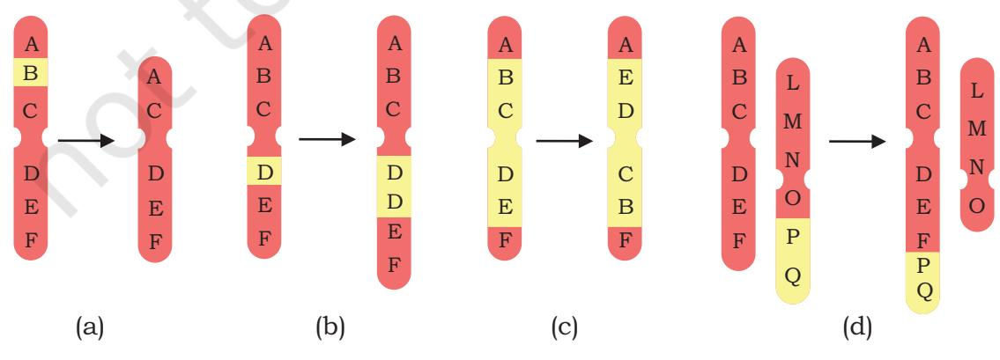
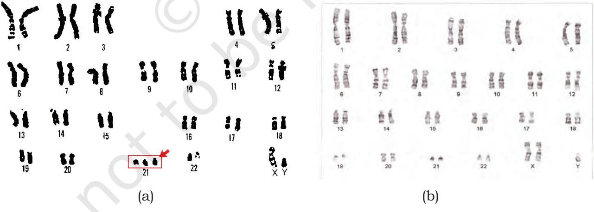

- *8.1 Chromosomal Abnormalities and Syndromes*
- *8.2 Monogenic Disorders and Pedigree Mapping*
- *8.3 Polygenic Disorders*

# **8.1 Chromosomal Abnormalities and Syndromes**

In certain situations e.g., due to environmental radiation, food intake or internal genetic conditions, chromosomes may suffer damage or may change in numbers. The change in structure is called **structural chromosomal abnormality (or aberration)** and the change in number is called **numerical chromosomal abnormalities**. When one chromosome of the pair is absent, the condition is called monosomy (2n-1) for that chromosome e.g., monosomy of chromosome 1. When a chromosome is present in three copies, this condition is called trisomy (2n+1) e.g., trisomy of chromosome X. It is important to notice that both monosomy and trisomy come under the broad category of aneuploidy. However, when the entire set of chromosome is multiplied (e.g., 69: 23 ´ 3, 92: 23 ´ 4), the condition is called polyploidy. The artificial breeding of plants has resulted in several polyploid varieties that we commonly use in our food. For example, bread wheat has six sets of chromosomes (hexaploid), cabbages or mustards are

Chapter 8.indd 217 11/14/2019 10:14:02 AM

tetraploids. Likewise, banana and apple are triploid (3 sets of chromosomes), strawberry and sugar cane are octoploid (8 sets of chromosomes). Both structural or numerical changes can result in significant changes in phenotypic condition in the form of diseases or syndromes.

## **8.1.1 Structural chromosomal abnormalities**

218

Structural chromosomal abnormalities may be of following types:

- **1. Deletion** In deletion, a segment of a chromosome breaks away leading to shortening of the chromosome (Fig. 8.1a). For example, retinoblastoma is caused due to deletion of a portion of chromosome 13. Sometimes when two ends of a chromosome are deleted, they can reattach to form a ring chromosome.
- **2. Duplication** Duplication refers to when a segment of the chromosome gets repeated resulting in a longer chromosome (Fig. 8.1b). This can lead to conditions e.g., Charcot-Marie-Tooth disease caused due to duplication of genes on chromosome 17.
- **3. Inversion** In inversion, a segment of the chromosome breaks away, completely reverses itself and reattaches with the chromosome. Here the overall length of the chromosome remains same but the orientation of genes is reversed by 180 degrees (Fig. 8.1c). For example, RCAD syndrome caused by inversion of a segment of chromosome 17.
- **4. Translocation** In translocation, a segment of a chromosome breaks away and reattaches itself with another chromosome. If there is a mutual exchange of segments between two chromosomes, it is called

*Fig. 8.1: (a) Deletion (b) Duplication (c) Inversion and (d) Translocation*

Chapter 8.indd 218 11/14/2019 10:14:02 AM

**reciprocal translocation**. Example: Burkitt's lymphoma, where exchange of materials happens between chromosomes 8 and 14. If a segment of a chromosome breaks away and attaches with another chromosome, without mutual exchange, it is called **Robertsonian translocation**. This may result in decrease of chromosome number of the cell (Fig. 8.1d).

### **8.1.2 Numerical chromosomal abnormalities**

Some commonly observed syndromes/diseases due to numerical chromosomal abberations are described in following section. The term syndrome is generally referred to a group of symptoms which consistently occur together, or a condition characterised by a set of associated symptoms. A disease refers to abnormal physiological response to internal or external factors e.g., fever caused due to microbes.

### **1. Down's Syndrome**

*Incidence:* Occurs in approx.1 per 800 live births. *Chromosomal basis*: Down syndrome is a genetic condition that arises due to presence of an extra chromosome 21. Here, chromosome 21 is repeated thrice (trisomy 21), instead of showing up twice in a normal individual. The karyotype of Down syndrome is represented as 47, XX, +21 (females) and 47, XY, +21 (males) (Fig. 8.2a).

*Fig. 8.2: Karyogram of (a) an individual affected with down syndrome (b) an individual affected with Klinefelter's*

The trisomic condition is usually caused by an error in the process of cell division called non disjunction, i.e., inability of chromosomes to separate at the time of cell division.

Chapter 8.indd 219 11/14/2019 10:14:03 AM

The possibility of having a Down's syndrome baby in the family increases with the maternal age. It has been reported that more than 85% Down syndrome babies are born in mothers over 35 years of age, at the time of pregnancy.

*Clinical symptoms:* Some of the distinguishing features of Down's syndrome are: flat face, slanting eye, small mouth, protruding tongue, flattened nose, short neck, short arms and legs, single deep crease across the palm, low IQ, stunted growth, muscular hypotonia, under developed gonads. Down's syndrome babies also show breathing, heart or hearing problems.

220

*Fig. 8.3: Individual with Klinefelter's Syndrome* 

*Diagnosis and Treatment:* Down syndromes are usually diagnosed by an extra chromosome 21 in the karyotype. There is no single standard treatment protocol for Down syndrome. Treatments are tailored on specific set of conditions presented by these individuals. At early age, children with Down's syndrome can benefit from speech therapy, physiotherapy and taking nutritional supplements.

In early 1900s, on an average, Down's syndromes used to live until age 9. Now with the advances in diagnostic and treatment technologies, the age expectancy has increased up to 60 and even longer.

#### **2. Klinefelter's syndrome**

*Incidence:* Occurs in approximately 1 out of 1000 new born males.

*Chromosomal basis: Genotype*: 47, XXY. Affects males. The extra chromosome is not transmitted genetically (i.e., a Klinefelter newborn cannot have a Klinefelter father) but arises from inability of X chromosome to detach itself from the pair during meiosis (at the time of gamete formation). Fertilisation of an XX ova with a Y sperm produces an XXY zygote.

Chapter 8.indd 220 11/14/2019 10:14:03 AM

*Clinical Symptoms:* Klinefelter's syndrome children are unusually tall for their age, have reduced facial and body hair, smaller testes, enlarged breasts and coarse voice (Fig. 8.2b and 8.3).

*Diagnosis and Treatment:* One of the most frequent methods to diagnose Klinefelter syndrome is through Barr body test of buccal smear. Normally no Barr body appears in the male buccal smear. However, in Klinefelter one Barr body shows up, indicating the presence of an extra X chromosome.

At the time of birth, babies with Klinefelter differ a little with other normal babies. However, as the age increase the differences become noticeable, especially at the time of puberty.

People with Klinefelter's syndromes are often treated with testosterone to look masculine. They also need to be psychologically counselled to control depression leading to aggression.

#### **3. Turner's Syndrome**

*Incidence:* Occurs in 1 in 2,500 newborn girls, frequently observed in miscarriages and still births.

*Chromosomal basis:* Affects females, arises due to the missing X chromosome in affected females. This is called monosomy X and the karyotype is represented as: 45, X. A cell division error during meiosis of an ovum results in

an ovum with no X chromosome and other with two X chromosomes. The ovum with no X chromosome fuses with sperm with one X chromosome to generate 45, X condition. Mothers with Turner syndrome cannot pass the condition to their daughters i.e., this condition is not inherited.

*Clinical symptoms:* Turner syndromes are diagnosed by following features — short stature, webbed neck (i.e., the neck skin is unusually loose and can be pulled several centimetres of the neck), small breasts, low

*Fig. 8.4: Turner's Syndrome*

set ears (i.e., ears are placed below the normal position), swollen hands and feet. Furthermore, ovaries are under developed and menstrual periods are usually absent (Fig. 8.4).

Chapter 8.indd 221 11/14/2019 10:14:03 AM

*Diagnosis and treatment:* Prenatal chromosomal diagnosis usually happens through amniocentesis or chorionic villus sampling. At puberty the first test is that of Barr body of buccal smear. The absence of Barr body is the first indicator to follow up the condition with a detailed investigation. As with other syndromes, there is no permanent cure. However, growth and ovarian functions can be strengthened by the controlled administration of hormones androgen and estrogen.

#### **Box 1**

222

#### **Famous people with syndromes**

- 1. Isabelle Springmühl is a famous fashion designer with Down syndrome. Achieving this feat wasn't easy as several universities rejected her application to study fashion design. But she persisted and now the 19-year-old immensely talented person has showcased her work in London, Rome and Mexico.
- 2 It's commonly believed that the famous US president, six feet two inches tall, Mr. George Washington had Klinefelter Syndrome. He had no children and adopted two later in his life.
- 3. Lauren Foster, a South African model was born male and diagnosed with XXY Klinefelter condition. However, Lauren chose to identify herself with feminine features and transitioned to a full female phenotype in her teens. Lauren became a successful model and appeared in Vogue Magazine. She even wanted to contest for the Miss South Africa pageant but was disqualified.
- 4. Hollywood TV, Film and Stage actress Linda Hunt was diagnosed with Turner syndrome. Linda started her career as a singer and made her Hollywood debut with Popeye film version. Linda has won 13 awards that include the 2012 Teen Choice Award and the 1984 Oscar Award for the Best Supporting Actress.
- 5. Dr. Catherine Ward Melver is a famous medical genetics doctor in the US. The 4 feet and 8 inch tall, Dr.Melver was diagnosed with Turner syndrome when she was seven years of age. Dr.Melver adopted a 4-year-old Turner syndrome girl, Zoe, from China.

# **8.2 Monogenic Disorders and Pedigree Mapping (Cystic Fibrosis, Sickle Cell Anemia, Haemophilia, Color Blindness, ADA)**

Monogenic disease is caused by an error in a single gene. According to current estimate over 10,000 of human diseases are estimatd to be monogenic affecting millions of individual world wide. The nature of disease, its sign and symptoms depend on the functions performed by the modified or defective gene. These diseases are inherited

Chapter 8.indd 222 12-Aug-21 4:57:06 PM

according to Mendel's Laws. In some cases, the mutation can be spontaneous and where we will not get the previous family history. There may be single mutation in one gene causing specific disease like sickle cell anemia or multiple types of mutation in one gene and producing the same disease like cystic fibrosis (more than 200 different types mutation can occur in one gene).

The single-gene or monogenic diseases can be classified into the following categories according to the inheritance pattern as follows:

- Autosomal recessive
- Autosomal dominant
- X-linked recessive
- X-linked dominant

For diagnosis of the inherited genetic disease one has to understand the concept of pedigree analysis. The pedigree analysis is the process of interpretation of information displayed as a family tree. If more than one person in a family is involved with a disease then the pedigree analysis can be done. Specific symbols are used to indicate different aspects of a pedigree as shown in (Fig. 8.5).

### Autosomal recessive disorder

The word 'Recessive' indicates that 2 copies of the genes are needed to have the trait and disorder in case of mutated gene. Out of the 2 copies one gene is inherited from father and one from mother. If an individual carries one defective recessive and one normal recessive gene then he or she will be the carrier and not develop the disease. On the basis of statistical projection it is estimated that every human being carry about 5 or more defective recessive genes which can cause a genetic disease. The disease phenotype of a recessive disorder is due to homozygosity of a recessive allele and the unaffected phenotype is secondary to corresponding dominant allele. This can be explained with the example of sickle cell anemia which is a autosomal recessive disease. Sickle cell disease is caused by a mutation in the hemoglobin-β gene found on chromosome 11. This results in a defective haemoglobin (Hb). After giving up oxygen these defective Hb molecules cluster together resulting in formation of rod like structures.

Chapter 8.indd 223 17-Aug-21 12:18:40 PM

*Fig. 8.6: Peripheral blood shows sickling of red blood cells in case of sickle cell disease*

Sickle cell anemia is determined by an allele which we can designate as s and the normal condition by S. The person affected by the disease will have a genotype of s/s and unaffected ones will be either S/S or S/s. We can make a projected pedigree of the disease as follows assuming that both parents are carriers (S/s) (Fig. 8.7):

Sickle cell anemia is particularly common among people whose ancestors originated from sub-Saharan Africa, South America, Cuba, Central America, Saudi Arabia, India, and Mediterranean countries. In India it is common among people of the Deccan plateau of central India with a smaller focus in the north of Kerala and Tamil Nadu.

Other examples of autosomal recessive diseases include cystic fibrosis, Tay Sach's disease and phenylketonuria. Individual with cystic fibrosis produce mucus that is abnormally thick and sticky that can damage different organs specially lungs resulting in chronic infections. Tay-Sachs disease is due to absence of an enzyme called hexosaminidase A which results in a fatty substance accumulation in nerve cells particularly affecting the brain. It is a fatal disease manifest in childhood. One in 27 persons of European Ashkenazi Jewish origin individuals carries the Tay-Sachs gene. Phenylketonuria is caused by a mutation in phenylalanine hydroxylase gene resulting in increase in phenylalanine in the blood.

Chapter 8.indd 224 03 March 2022 02:28:44

*Fig. 8.7: A cross showing inheritance of sickle cell anemia disease*

## Autosomal dominant disorder

In this kind of inheritance the normal allele is recessive and the abnormal allele is dominant. A rare autosomal dominant disorder Achondroplasia may be considered as an example which leads to a type of Dwarfism in the affected individuals (Fig. 8.8).

In this condition normal people have genotype d/d, affected individual with mild disease have D/d and severly affected have D/D which is often lethal. So most of the surviving cases of achondroplasia are heterozygotes.

Huntington's disease is another example of a rare autosomal dominant disorder which affects nervous system.

### X-linked recessive disorder

In the X-linked recessive inheritance in the mother (XX) the affected gene remains on one X chromosome, as a result she becomes the carrier and usually only males (XY) are affected by the disorder (Fig. 8.9). In the progeny the men pass the Y chromosome on to their sons and their X chromosomes to their daughters. So a man who is affected will not pass it on to his sons but all his daughters will be carriers.

Some examples of X-linked recessive disorders are, Haemophillia, and Duchenne Muscular Dystrophy. Haemophilia is a bleeding disorder associated with

225

*Fig. 8.8 Schematic diagram of Achondroplasia causing Dwarfism*

*Fig. 8.8 courtesy: https://www.shutterstock.com/image-vector/dwarfism-257159986*

Chapter 8.indd 225 13-Aug-21 9:54:43 AM

226

*Fig. 8.9: Inheritance of an X-linked disorder*

mutation in coagulation factor VIII gene (type A) or factor IX gene (type B). Mutations in coagulation factor genes results in the production of an abnormal version of coagulation factor VIII or IX, or reduced amount of one of these proteins. The altered or missing coagulation factor cannot effectively complete the blood clotting process leading to spontaneous bleeding or increased bleeding tendencies. Duchenne Muscular Dystrophy (DMD) is caused by mutation of dystrophin gene resulting in reduction/ absence of dystrophin or presence of abnormal protein. Dystrophin abnormality or deficiency leads to dystrophy or degeneration of muscle making them more fragile and weak.

Chapter 8.indd 226 11/14/2019 10:14:04 AM

## X-linked dominant disorder

In this type of inheritance the affected males pass on the mutated dominant gene to all their daughters but to none of their sons (Fig. 8.10a). In case of affected female married to unaffected male the condition is passed on to half of their sons and daughters. (Fig. 8.10b). Examples of such disorders are hypophosphatemia, a type of vitamin D resistant rickets and Alport syndrome, which is associated with progressive hearing loss and kidney disease.

227

*Fig. 8.10 Inheritance of an X-linked dominant disorder through (a) affected father and (b) affected mother*

# **8.3 Polygenic Disorders (Hypertension, Coronary Heart Disease, and Diabetes)**

A polygenic disorder is caused by the defect or combined action of more than one gene. The classical examples of polygenic disease include hypertension, coronary heart disease and diabetes. As the pathogenesis proceeds such diseases depend on the simultaneous association of several genes and therefore, they can not be explained as monogenic diseases.

Diabetes mellitus is an important example of polygenic disease. It is a heterogeneous group of disorders characterised by persistent high blood sugar level or

Chapter 8.indd 227 13-Aug-21 9:57:47 AM

hyperglycemia. There are two most common forms of diabetes: Type 1 diabetes (T1D, previously known as insulin dependent diabetes or IDDM) and type 2 diabetes (T2D, previously known as non-insulin-dependent diabetes or NIDDM). Diabetes is one of the most common non-communicable diseases in India with more than 62 million individuals currently suffering with the disease. In 2000, India with 31.7 million cases became the country with the highest number of diabetes mellitus followed by China (20.8 million) and United States (17.7 million). The prevalence of diabetes is predicted to become double in the world from 171 million in 2000 to 366 million in 2030 with a maximum increase in India. The cause of diabetes in India is multifactorial which includes genetic factors along with environmental influences and life style. The rising standard of living with change in food habits and increasing intake of fast food as well as decrease in regular exercise may be responsible for high incidence of the disease in our country. Type I diabetes is caused by the destruction of the beta cells of the pancreas due to immunological abnormality. This type constitutes approximately 10% of all cases of diabetes. Life long treatment with insulin injection is needed for these cases. Type 2 diabetes is the commonest form of disease and represents about 90% of cases. It is caused by impaired insulin secretion from beta cells of pancreas and also peripheral insulin resistance. Insulin is needed for transporting glucose from blood to inside the cells like muscle cells for producing energy and maintaining cell function. In case of insulin resistance, presence of insulin fails to initiate the cellular uptake and utilisation of glucose by muscle and other peripheral tissues leading to more accumulation of glucose in the blood. Usually, the type 2 diabetes is managed by controlling the diet, exercise and oral drugs or other preparations which can reduce the blood sugar level. Such agents which can reduce the blood sugar level are called hypoglycemic agents or drugs.

228

Hypertension or presistent increase in blood pressure is a major risk factor for renal, heart and stroke involving brain. This is leading cause of global mortality and morbidity. Over the years our understanding about the diseases has improved. The current guideline (2017) for adults by American College of Cardiology mentions that the normal blood pressure (BP) as <120 (systolic) /<80

Chapter 8.indd 228 11/14/2019 10:14:04 AM

(diastolic) mm Hg; elevated BP 120-129/<80 mm Hg; hypertension stage 1 is 130-139 or 80-89 mm Hg, and hypertension stage 2 is ≥140 or ≥90 mm Hg. Doctor now advice strict control of blood pressure with reduction of obesity, regular exercise and improving lifestyle. The cases of hypertension can be divided in two main types. In about 95% of persons suffering from hypertension the cause is unknown and they are called Essential or Primary hypertension. When a cause can be found it is called Secondary hypertension.

229

*Fig. 8.11: (a) Normal heart and artery and (b) Artery with plaque build-up in coronary heart disease*

The Coronary Heart Disease (CHD) is also an important cause of morbidity and mortality world over. Both hypertension and diabetes are important risk factors for this disease. The CHD develops due to narrowing of the coronary artery which supplies blood to heart muscles by gradual build-up of fatty material on its wall (Fig. 8.11). This accumulation of fatty material on the wall of the artery is called **atherosclerosis**. Due to narrowing of the coronary artery by atherosclerosis it can not supply oxygen rich blood to heart muscle which needs it for its continuous activity. This phenomenon of reduction of blood supply is called ischemia. That is why previously coronary heart disease was called as ischaemic heart disease.

2024-25

Chapter 8.indd 229 20-Sep-21 11:43:37 AM

### **8.3.1 Mitochondrial inheritance and diseases**

230

As you have studied earlier, mitochondria are organelle present in the cytoplasm of the cells which are primarily responsible for energy production for all cellular activities. Mitochondria produce energy by ATP (adenosine triphosphate). The ATP production depends on a series of well regulated chemical reaction under specific interaction of different enzymes. There are genes in the mitochondria which contain information or codes for these critical enzymes. Any defect or mutation in these genes can affect

*Fig. 8.12: Diagram showing Mitochondrial inheritance in a family with a faulty (mutated) mitochondrial gene* 

Chapter 8.indd 230 11/14/2019 10:14:04 AM

the ATP production and cellular function. There are variable number of mitochondria in different cell types. Cells in organs like brain, heart, kidneys, muscle and liver which are metabolically very active needs continuous high energy supply. These cells have a large number of mitochondria. In a defect with mitochondrial gene if all mitochondria are affected then it will not be possible for the person to survive. So, in human disease due to mitochondrial gene defect the symptoms and disease severity depends on the ratio of normal and abnormal mitochondria in cells.

Mitochondria are the organelle which contain DNA in circular form, and in animals it is the only organelle in addition to nucleus which contain DNA and gene. The sperm contains very low number of mitochondria and mitochondrial gene. So in the offspring the mitochondrial genes are inherited from the mother. Thus a father with mitochondral gene defect can not transmit the disease to his offspring. The concept of mitochondrial inheritance is explained in the Fig. 8.12.

**Summary**

- Haploid cells have only one copy of the chromosome while diploid cells have two copies of the same chromosome.
- Any deviation where one or few chromosomes are either absent or present in multiple copies is called aneuploidy.
- In polyploidy condition, the entire set of chromosome is multiplied.
- A syndrome is a specific collection of signs or symptoms suggesting a particular disease, while a disease is a broader term that refers to abnormal physiological response to internal or external factors.
- Symptoms are subjective and signs are objective.
- Structural chromosomal abnormalities can be caused by deletion, duplication, inversion and translocation.
- Individuals with Down syndrome has an extra chromosome 21, i.e., there are three copies of chromosome 21 (trisomy 21).
- Individuals with Klinefelter syndrome has an extra X chromosome (XXY) and is observed only in males.

Chapter 8.indd 231 11/14/2019 10:14:04 AM

- Turner syndrome arises due to missing one X chromosome in affected females.
232

- Monogenic disease is caused by modifications in a single gene. They can be classified into the following: autosomal recessive, autosomal dominant, X-linked recessive and X-linked dominant.
- Polygenic disorder is caused by the defect or combined action of more than one gene.
- Mitochondrial inheritance and diseases are caused due to defect or mutation in the genes coding for critical enzymes present in the mitochondria.
- Four types of structural chromosomal abnormalities exist: deletion, duplication, inversion and translocation.
- Down syndrome occurs due to trisomy 21 and are characterised by features like moon like face, protruding tongue, muscular hypotonia, palmar crease and so on.
- Klinefelter syndrome occurs due to presence of an extra X chromosome in males and is characterised by tall height, enlarged breasts, coarse voice, hypogonadism and so on.
- Turner syndrome occurs due to absence of one X chromosome in females and is characterised by short stature, webbed neck, small breasts, no menstruation and so on.

# Exercises

- 1. Define following terms: dominant, recessive, homozygous, heterozygous, phenotype and genotype.
- 2. Describe the origin, symptoms and treatment of Down syndrome.
- 3. Describe the origin, symptoms and treatment of Klinefelter syndrome.
- 4. Describe the origin, symptoms and treatment of Turner syndromes.
- 5. Describe various structural chromosomal abnormalities.

Chapter 8.indd 232 11/14/2019 10:14:05 AM

