**Chapter 9**  Introduction to Bioinformatics

> **Chapter 10**  Protein Informatics and Cheminformatics

**Chapter 11** Programming and Systems Biology

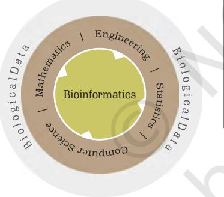

# **Quantitative Biology and Bioinformatics Unit IV**

The recent advances in science have resulted in generation of enormous amount of data obtained from genome sequencing and functional genomics. Handling of such vast data obtained from diverse sources is beyond the scope of humans. This has consequently given rise to a whole new field of science called bioinformatics. Chapter 9 describes the various terminology and concepts of bioinformatics. The scope of utilisation of raw data in biology to retrieve important information about proteins of interest has been discussed in Chapter 10. Chapter 11 deals with the accession, filtration and manipulation of biological data with the help of programming languages.

Chapter 9.indd 233 11/14/2019 10:14:28 AM

## **Margaret Oakley Dayhoff (1925-1983)**

Margaret Oakley Dayhoff (1925- 1983) was an American physical chemist and one of the most important figures in the field of bioinformatics. She received her doctoral degree from Columbia University in the Department of Chemistry and dedicated her entire career to applying mathematics and computational methods to biochemistry. In 1965, she published a comprehensive, open source collection of protein sequences- *Atlas of Protein Sequence and Structure.* It subsequently became a model for the sequence databases which later developed. She had also developed the one-letter codes for amino acids in an attempt to reduce the size of data files in computer applications.

Chapter 9.indd 234 11/14/2019 10:14:30 AM

- *9.1 The Utility of Basic Mathematical and Statistical Concepts to Understand Biological Systems and Processes*
- *9.2 Introduction*
- *9.3 Biological Databases*
- *9.4 Genome Informatics*

## **9.1 The Utility of Basic Mathematical and Statistical Concepts to Understand Biological Systems and Processes**

The objective of this chapter is to let you know why understanding of the basic concepts of mathematics and statistics is important to a biologist.

The outcome of any biological experiment is data. Previously, biologists used to generate and analyse data without the help of sophisticated software, computational tools, and statistical tests. However, this is not the case anymore. With the advent of instruments like highthroughput DNA sequencers, powerful microscopes, and other imaging systems, and analytical instruments capable of generating large volumes of data, biologists can no longer deal with the data using their notebooks and Excel sheets. Instead, they need computational and statistical tools to handle data. Large volumes of data often require quantitative analyses to interpret and generate biological meaning. Performing such analyses require one to have

Chapter 9.indd 235 20-Sep-21 11:45:03 AM

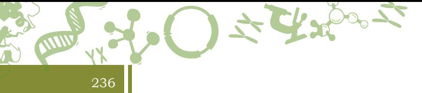

good working knowledge of computational and statistical concepts, for example; machine learning technologies, regression, variance, and correlation, etc. Mathematical and statistical concepts can only aid biologists to interpret their data and are not a replacement for asking the right questions and the biological acumen. The names of some of the commonly used statistical terms used in biology is provided in Box 1.

#### **Box 1**

#### **Box 1: Glossary of the commonly used statistical terms in biology**

*Null hypothesis—* A statement that there is no relationship between two measured phenomena.

*Statistical significance—* A result has statistical significance when it is very unlikely to have occurred.

*p-value—* The probability of finding the observed results when the null hypothesis of a study question is true.

*t-test —*An analysis of two populations means through the use of statistical examination.

Multivariate analysis: A set of techniques used for analysis of data that contain more than one variable.

*Regression analysis—*A technique to investigate the relationship between a dependent and an independent variable.

*Multiple testing correction—* A statistical test that corrects for multiple tests to keep the overall error rate to less than or equal to the user-specified P-value cutoff

*Analysis of Variance or ANOVA—* A collection of statistical models used to analyse the differences among group means in a sample.

> Let us examine with specific examples where both the knowledge of computing and statistics can help understand biological phenomena better. For example, we want to understand the association, if any, between blood pressure and heart rates in ten patients (Table 9.1). As provided in the table below, a simple visual estimation (Fig.9.1) is not sufficient to accurately determine the relationship (correlation) between the two variables. For that, one needs to draw a regression line. Correlation and regression are distinct, yet correlated. Correlation quantifies how the variables are connected, but regression defines a statistical relationship between two or more variables where a change in one variable is

Chapter 9.indd 236 11/14/2019 10:14:30 AM

associated with a change in another. Therefore, in the example above a simple regression test will tell us if there is a direct relationship between heart rate and blood pressure. The output of a linear regression analysis is R2-value, a statistical measure to show as to how close the data is to the fitted regression line. The R2 value ranges from 0 (no correlation between the variables) and 1 (perfect correlation between the variables). As shown in Fig. 9.1, the R2 value suggests that there is a good correlation between the two variables. Therefore, the null hypothesis is rejected in this case.

237

| Patient | Heart rate | Blood pressure |
| --- | --- | --- |
|  |  | (cystolic) |
| 1 | 112 | 189 |
| 2 | 83 | 140 |
| 3 | 92 | 153 |
| 4 | 121 | 192 |
| 5 | 85 | 147 |
| 6 | 111 | 178 |
| 7 | 94 | 135 |
| 8 | 88 | 143 |
| 9 | 102 | 177 |
| 10 | 111 | 189 |

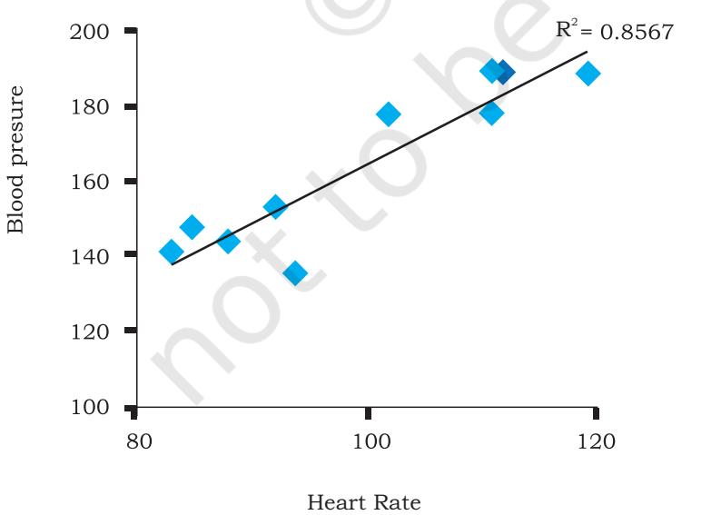

*Fig. 9.1: Correlation between the two variables with a simple linear regression line*

Chapter 9.indd 237 03 March 2022 02:30:57

Many fields of biology require a basic understanding of probability. Mathematical modeling of complex systemic phenomena such as cellular mechanisms allows one to understand the vital parameters of the system and its kinetics. Phylogenetic reconstruction, determining ancestral sequences and modeling rates of evolution from a bunch of extant sequences requires knowledge of probability. Biologists need to keep statistical issues before performing an experiment. For instance, choosing an adequate number of samples and replicates, both biological and technical, for the experiment requires knowledge of statistics. An experiment must be repeated multiple times independently to ascertain confidence in the results and to know if they are real or fake. A necessary background in statistical randomness and law of large numbers equips one to deal with this problem. A random sampling from a large number reduces the chance of obtaining biased results. The biologist needs to make sure that the results are statistically significant. This step requires familiarity with various tests and measures of statistical significance and to apply the correct test(s) for the problem in question. Depending upon the problem, the biologist may have to correct and adjust the measure of significance for multiple testing.

238

For higher levels of computing, analysis, and visualisation, a biologist can use the built in frameworks. Such as MATLAB (commercial) and R (open source), etc.

For biologists, the choice of the statistical analysis employed is the key to determining the right answer. A weak or incorrect statistical standards lead to false assumptions and therefore may lead to irreproducible results. For example, the commonly used concept in statistics is the P value as the evidence of support for a hypothesis. The smaller the P value, the more likely it is that the result of the test is significant. A P value cutoff of 0.05 (95% significance) or less is considered to be significant. However, the 0.05 threshold has caused too many false positives to appear in the scientific literature. Therefore, the P value cutoff of 0.05 needs to be re-examined. With small sample sizes, one is better off showing all independent data points rather than distorting the visualisation with a misleading average and standard deviation. The statistical

Chapter 9.indd 238 17-Aug-21 12:22:46 PM

power that one begins to consider when faced with a negative result should also be considered in case of positive results. The assumptions of certain established statistical models and distributions to the wrong type of data is, therefore, a common abuse. For example, an assumption of a Gaussian distribution to nonlinear dynamical systems, which results in false positives. Unbalanced mathematical models constructed with unrealistic parameter weights is yet another common abuse and one that is difficult to detect. With due consideration to these caveats, the application of mathematics and statistics to biology can lead to the opening of newer areas of research that are inter-disciplinary in nature to tackle more complex biological problems.

## **9.2 Introduction**

Bioinformatics is an interdisciplinary field that uses computational, mathematical, statistical and occasionally, engineering approaches, in analysing biological information for solving biological problems (Fig. 9.2). Thus, bioinformatics deals with storage, retrieval, analysis and interpretation of biological data using computer based software and tools. Although there are differences, it is alternatingly and interchangeably used with other terms such as 'computational biology,' 'mathematical biology,' 'quantitative biology' and 'bio-statistics,' depending on the dominating disciplinary components. It must be noted, however, that use of these definitions vary among experts and practitioners, and has changed with time.

#### **9.2.1. Historical perspective**

Bioinformatics aids in discovery of new findings by data mining as well as the generation of new hypothesis. This is done via modeling or analysis of molecular data. Most bioinformatics tools use either preexisting nucleotide and

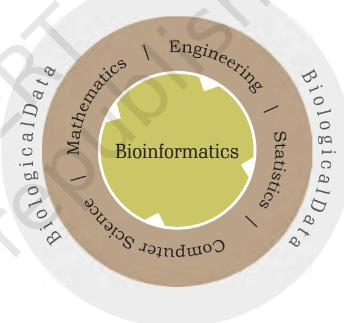

*Fig. 9.2: Inter-disciplinary nature of bioinformatics: the intersection of biology with one or more other disciplines such as computer science, mathematics, engineering, and statistics*

Chapter 9.indd 239 13-Aug-21 10:15:56 AM

protein data from sequence and structure databases, or newly created data generated using high-throughput instruments like next-generation sequencers and DNA microarrays. The National Center for Biotechnology Information (NCBI) in the USA was created as a resource for bioinformatics tools and services. It houses nucleotide and bibliographic databases. GenBank, a widely used database stores all publicly available DNA sequences, was launched in 1982. Although bioinformatics was practiced much before the widespread use of the term, it was not until 1991 when it started appearing in the literature. The name gained wide acceptance after the launch of the human genome project and bioinformatics tools were used extensively for the analysis of sequence data. Therefore, the use of the term bioinformatics in the literature is not more than 30 years old. Bioinformatics has gained broader attraction in the post genome sequencing and high-performance computing era, following advancements and accessibility in biotechnology and computing technology. Before this, when the focus was on lower throughput assays, such as studying the action of a single gene or studying morphology under a microscope, bioinformatics was still used but on a smaller scale.

240

Structural bioinformatics preceedes informatics based on high-throughput genome-wide assays such as sequencing and DNA microarrays. This is because studies on three-dimensional structures of proteins using NMR spectroscopy and X-ray crystallography in the early 1900s, pre-dates genome and other -ome informatics introduced only in early 2000 and are continuing till date. The number of Protein Data Bank (PDB) structures and GenBank entries are growing every year. The primary concern in bioinformatics is to manage the sequence and structural data in the form of databases, and mine data from these databases to get biological meanings. NCBI hosts nucleotide and protein data, under various categories (Gene, Genome, Structure, Sequence, etc.). Currently, biological data, produced at an unprecedented rate, and along with their analysis and interpretation leading to critical biological insights have taken a higher priority. New, optimised and superior algorithms and tools with

Chapter 9.indd 240 13-Aug-21 10:36:19 AM

statistical adaptations and synthesis from multiple fields are developed and implemented to achieve this. Databases based on secondary and tertiary levels of information such as molecular pathways, gene expression, protein structure and function, interaction networks, disease-associated changes, organism specificity and regulatory networks have since been developed and used. Bioinformatics is an evolving field. Due to the dynamic nature of the biological data, genes and exon-intron boundaries, contamination and discrepancies in sequences, *in silico* translation errors such as frameshift errors, annotation errors, assembly errors, and simple spelling mistakes are continually being updated.

We will now learn about the different types of biological molecules, kinds of data produced by these techniques, and commonly used analytical and statistical workflows to interpret and visualise data (Fig. 9.3). Details of the experimental techniques used for the production of genomic data is described in Unit V.

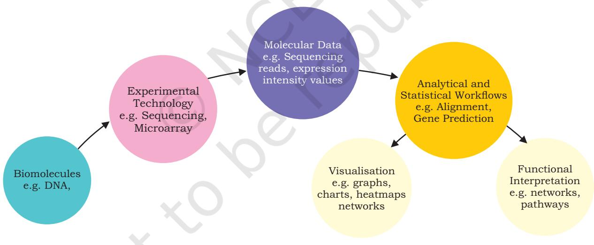

*Fig. 9.3. From biomolecules to function*

## **9.2.2. Types of experimental technologies for analysing biomolecules**

A few critical experimental technologies used for identification and/or quantification of biomolecules are

Chapter 9.indd 241 11/14/2019 10:14:31 AM

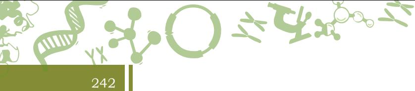

given in Table 9.2. Details on some of these techniques are described in Unit V.

#### **Table 9.2: Name of the technology, biomolecules assayed and the purpose of the technology**

| Technology | Biomolecule | Purpose |
| --- | --- | --- |
| PCR (Polymerase Chain | DNA | Amplify a region of interest |
| Reaction) |  |  |
| RT (Real-Time)-PCR/qPCR | RNA | Detect RNA expression |
| (quantitative PCR) |  |  |
| Next-generation sequencing | DNA/RNA | To sequence genes/genomes and |
|  |  | RNA |
| Gel electrophoresis | DNA, RNA and Proteins | Separation of fragments, based on |
|  |  | their size and charge |
| HPLC (High-performance Liquid | Metabolities | Separation, identification and |
| Chromatography) |  | quantification of metabolites |
|  | DNA, proteins, metabolites, | Fragmentation, measurement of |
| MS (Mass spectrometry) | trace gases | isotopic composition and mass |
|  |  | determination |
| EM (Electron microscope) | DNA, RNA or protein | Structure, and sequence |
|  |  | determination |

## **9.2.3 Types of molecular data**

Different technologies assay different biomolecules and produce different types of data output in various formats (Table 9.3). The descriptions on the two commonly used DNA data formats **(FASTQ and FASTA)** are provided later in the chapter (Genome Informatics).

## **9.2.4 Commonly used analytical and statistical workflows**

Biological knowledge may or may not be mandatory for implementation of open source or other proprietary tools. However, it is a must for asking relevant questions and interpretation of biological results as mentioned in the beginning of this chapter. One must understand the logic and principle, and be aware of the underlying assumptions behind the working of any tool.

Chapter 9.indd 242 11/14/2019 10:14:31 AM

#### **Table 9.3: Types of molecular data and their formats**

| Technology | Molecular data formats | Examples |  |  |  |  |  |  |  |  |
| --- | --- | --- | --- | --- | --- | --- | --- | --- | --- | --- |
| Next-Gen | Reads (.fastq) | @read1 |  |  |  |  |  |  |  |  |
| Sequencing |  | TTTCCGGGGCCCATAATCTTCTGCAG | + |  |  |  |  |  |  |  |
|  |  | 8C;=<=;9@4368>9:67AA<9>63< |  |  |  |  |  |  |  |  |
| Microarray | .cel, intensity data files | PROBE_ID |  |  |  |  |  |  |  |  |
|  | (.idat), reports | Assay_Name_1.QT1 |  |  |  |  |  |  |  |  |
|  | binary file | Assay_Name_1.QT2 |  |  |  |  |  |  |  |  |
|  |  | Assay_Name_2.QT1 |  |  |  |  |  |  |  |  |
|  |  | Assay_Name_2.QT2 |  |  |  |  |  |  |  |  |
| Capillary Gel | .chromat, .fasta, .ab1 | >seq1 TCACCTTCTGGGATCCAG |  |  |  |  |  |  |  |  |
| Electrophoresis |  |  |  |  |  |  |  |  |  |  |
| based |  |  |  |  |  |  |  |  |  |  |
| Sequencing (Sanger) |  |  |  |  |  |  |  |  |  |  |
| High | Chromatogram | 25 |  |  |  |  |  |  |  |  |
| performance |  | 2 20 |  |  |  |  |  |  |  |  |
| Liquid |  |  |  |  |  |  |  |  |  |  |
| chromatography (HPLC) |  | 15 3 Absorbance unit (254 nm) AU 1 |  |  |  |  |  |  |  |  |
|  |  | 10 |  |  |  |  |  |  |  |  |
|  |  | 5 |  |  |  |  |  |  |  |  |
|  |  | 0 0 10 20 30 50 60 |  |  | 40 |  | 70 | 80 | 90 | 100 |
|  |  | Minute |  |  |  |  |  |  |  |  |
| Mass | Mass spectrum |  |  |  |  |  |  |  |  |  |
| spectrometry |  |  |  |  |  |  |  |  |  |  |
| (MS) |  |  |  |  |  |  |  |  |  |  |
|  |  | Relative abundance 0 |  |  |  |  |  | 43 |  |  |
|  |  | 0 10 30 |  | 20 |  | 40 |  | 50 |  |  |

243

Chapter 9.indd 243 11/14/2019 10:14:31 AM

244

*Some commonly used analysis tools are as follows:*

- Homology search (Basic Local Alignment Search Tool (BLAST) – blastn, blastp)
- Sequence alignment (CLUSTAL, MAFFT, MUSCLE)
- Phylogenetics (PHYLIP, PAUP)
- Gene prediction (GlimmerHMM, GenScan)
- Functional homology search (HMMER)
- RNA structure (mfold, sFold, uniFold)
- Regulatory region analysis (MatInspector, BEARR, RSAT)
- Protein structure (Phyre2, Jpred)

*Bioinformatics tools use various statistical and computational algorithms and approaches. Some commonly used statistical packages are:*

- Statistical Package for the Social Sciences (SPSS)
- Statistical Analysis System (SAS)
- R
- Microsoft Excel

At the final stages of the biological data analysis, gene and protein level findings are linked to certain functions. These functional interpretations can be made by using commonly used biological tests like loss- or gainof function assays, gene knockouts and gene editing. Additionally, inferring affected networks and pathways by using computational tools, one can assign functional significance to a gene and its protein product.

## **9.3 Biological Databases**

A biological database is a repository that contains an organised, structured and searchable collection of biological data. In other words, it is a library of biological information, easily accessible and searchable. A biological database links all the relevant data to their original creators or to a reference that describes the underlying data. The information in a database is collected through experiments and computational approaches. For example, a database of human genes contain both the actual nucleotide sequence of all the genes and their characteristics. The database can be made by a single group of researchers collecting information from a variety

Chapter 9.indd 244 11/14/2019 10:14:31 AM

of public resources or by multiple teams of researchers who can add data to a single repository. A biological database may store just one type of information, for example, DNA sequence information, or multiple types of information, for for example, primary nucleotide sequence of a gene; mutation in a given gene specific to a disease and the frequency of single nucleotide polymorphism (SNP) in various population; translated protein sequence of the genes, the 3D structures of proteins and domains, and the functional interaction of one protein with other. The characteristics of a good biological database is one that is easy to access and use, has a user friendly interface, has excellent documentation, has support staff that can answer any queries from its users, lacks errors in the underlying data, cross-referenced, and continually updates information as and when the primary source is updated. There are two main types of databases, relational and non-relational. Databases are managed by using a software system called **database management system (DBMS)** that is used to manipulate, retrieve and manage data. The structured query language (SQL) is the standard application program interface for a relational database. A **non-relational or NoSQL database** does not follow the order of a relational database and is used for large sets of distributed and unstructured data.

## **9.3.1 What is the need for a biological database?**

Imagine when you walk into your school library and ask the librarian about a book. What if the librarian has to physically walk to all the shelves and look for the book? This will take time, and there is no guarantee that the librarian will find the book on the shelf. Instead, if the librarian looks for the book by searching a database that stores all the books using a computer by either using a keyword containing the title of the book or the author or both, the job becomes much simpler. This is why we need databases, to make the search process easy and foolproof. Unlike a library of books where physical items that can be seen with open eyes, for example, books, the nucleotide sequence or genes or protein structures are tiny and can not be searched physically. Therefore, the information must be encoded and stored in a machine-readable

Chapter 9.indd 245 11/14/2019 10:14:31 AM

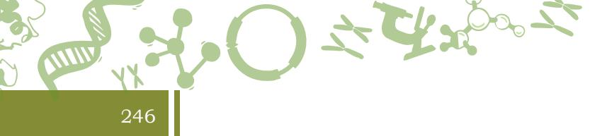

format in a database that can be easily searched using an user interface. With the exponential growth of biological data, especially the genome data from various organisms alongside their functions and interactions, it has become imperative to store biological information in databases. Some commonly used biological databases are—

- GenBank (https://www.ncbi.nlm.nih.gov/genbank/): A collection of annotated publicly available DNA sequences.
- PDB (www.wwpdb.org): A collection of 3D structures of proteins, nucleic acids, and complex assemblies.
- UniProt (www.uniprot.org): A collection of protein sequences and function.
- PubMed (https://www.ncbi.nlm.nih.gov/pubmed/): A collection of biomedical literature.
- KEGG (www.kegg.jp): A collection of biological pathways, diseases, drugs, and chemical substances.
- OMIM (www.omim.org): A catalog of human genes and genetic disorders.

In addition to the above, there are organism-specific, disease-specific and secondary databases and are used routinely by biologists.

## **9.3.2 Data visualisation**

Biological data visualisation is an essential aspect of bioinformatics. It involves the application of graphics and data representation and incorporates sequences, genomes, alignments, phylogenies, macromolecular structures, microscopy, and other imaging information. A few examples of data visualisation tools and their use are provided in Table 9.4.

#### **Table 9.4. Data visualisation tools and their uses**

| Visualisation tool | Use |
| --- | --- |
| UCSC Genome browser | An online interactive website to visualise |
| (https://genome.ucsc.edu/) | macro- and micro-level genome information |
|  | on vertebrate and invertebrate species. |
| KEGG (http://www.genome.jp/kegg/pathway.html) |  |
| Biocarta (http://www.biocarta.com) | Visualisation of pathways. |
| Reactome (https://reactome.org/) |  |
| CIRCOS (circos.ca/) | Visualisation of data in circular layout. |

Chapter 9.indd 246 11/14/2019 10:14:31 AM

| EXCEL | Histograms, scatter plots, bubble charts, heat |
| --- | --- |
|  | maps |
| R (https://www.r-project.org/) | A software environment for statistical computing and generating graphics. |
| D3.js (https://d3js.org/) | A JavaScript library for producing dynamic, interactive data visualisations in web |
|  | browsers. |
| Phinch (phinch.org/) | An interactive, exploratory framework for visualising biological data. |
| Integrative Genomics Viewer (IGV, http://software. broadinstitute.org/software/igv/) | A visualisation tool for interactive exploration of large, integrated genomic datasets. |

247

## **9.4 Genome Informatics**

#### **Genome**

Genome is the complete set of DNA of an organism, including its genes and the intergenic regions. Genomics is a field of science that deals with the structure, function, evolution, mapping, and modification of genomes. **Genome informatics** is the application of bioinformatics tools to process the outputs of genome-wide assays and technologies, facilitating the interpretation of data and linking them to function. Genomics is one of the omics fields (the other commonly used terms being transcriptomics, proteomics, metabolomics) that has evolved rapidly over the last decade.

Genome information is obtained using high-throughput methods or assays by way of using instruments that provide information on DNA/RNA nucleotide sequence, the variations in genomes, changes in gene expression, profiles of regulatory protein binding to DNA/RNA, and DNA/RNA methylation and various other profile changes. Details on these methods are provided in Unit V. The term high-throughput relates to the process that produces a significant amount of data. The amount of data generated by genome sequencing is substantial. As an analogy, if your personal computer has a 1TB harddisk space, some of the large genome centers in the world like the Broad Institute of the Massachusetts Institute of Technology (MIT) and Harvard produces as much as

Chapter 9.indd 247 11/14/2019 10:14:31 AM

248

24TB of genome data per day (as of early 2018). This corresponds to nearly 5000 personal computers worth of data a year (considering there are 200 working days in a year). Although there are not many large genome institutes like the Broad, this gives you an idea of the magnitude of genome data produced today. In fact, it is postulated that the computing resources required to handle genome data will exceed those involved in processing Twitter and YouTube data. As the amount of data is significant, genome data need the power of computer science, information technology, quantitative methods and analytics, and statistics for gaining an understanding of underlying complexity, patterns and meaning.

### **9.4.1 Human Genome Project**

An initiative to sequence the complete nucleotide content in human cells started in early 1990s. This initiative is known as the Human Genome Project. The method proposed and used by Fred Sanger was used with modifications for both the publicly-funded initiative headed by the National Human Genome Research Institute (NHGRI) of the National Institutes of Health, USA and the private company Celera Genomics. Both efforts used different methods to sequence DNA. The publicly-funded initiative sequenced human DNA cloned into bacterialartificial chromosomes and Celera Genomics sequenced randomly cut human DNA, a technique called wholegenome shotgun sequencing method.

The first complete draft human genome was published in 2001. Even the project, which announced the release of the entire human genome in 2003, is still is an unfinished task as the human genome sequence available today has many gaps where the sequence information is not known. Most sequenced part of the genome is in the euchromatic region of the chromosomes and with minimal representations from the heterochromatic regions. The heterochromatic areas mainly consist of repetitive elements, are primarily located in the centromeric and telomeric regions of the chromosomes are difficult to assay with the current sequencing technology. Additionally, due to the repetitive nature of DNA, they are difficult to be assembled to a single location in the chromosome unambiguously.

Chapter 9.indd 248 11/14/2019 10:14:31 AM

## **9.4.2 Commonly used data format**

One of the challenges of bioinformatics is working with different formats of the resulting data. The bioinformatics community adopts a standard data format of data for the same analytes. For example, most DNA sequencing data (with some exceptions) from the high-throughput DNA sequencers are presented in **FASTQ** format. It is a textbased format that stores sequence information along with its corresponding quality scores. Both the sequence letter and its corresponding quality score are encoded with a single ASCII character. The sequence information in the FASTQ sequence uses the **FASTA** format, which is a textbased format for representing the sequence information in single-letter codes (Fig. 9.4B).

An example of a FASTA file and a FASTQ file is given in Table 9.3. The first line in a FASTA file usually starts with a ">" (greater-than) symbol and holds a summary description of the sequence, often a unique library accession number or the name of a gene. A FASTQ file uses typically four lines per sequence. The first line begins with a '@' character, followed by sequence description; line 2 has the raw sequence letters, line 3 begins with a '+' character, and line 4 shows the quality values for the sequence in Line 2. The quality values in line 4 contain the same number of symbols as letters in the sequence presented in line 2. Additionally, both line 1 and line 3 may include optional sequence identifiers. In line 4 representing quality values, the character '!' and '~' represent the lowest and the highest quality respectively.

#### **9.4.3 Genome Informatic Tools**

Genome informatics tools came up in parallel with the development of sequencing technology to cater the analysis of resulting data. The high-throughput sequencing instruments produce sequence reads, either short (about 100-150 nucleotides) or long (few kilobases) depending on the target size and device used. The resulting sequenced reads need to be either assembled into a genome (where no prior genome information is known) or aligned to a reference genome (in the case of re-sequencing). Broadly there are two possible analytical workflows, one based on aligning the reads to a reference sequence (e.g., genome) and second based on the *de novo* assembly of the reads into

Chapter 9.indd 249 11/14/2019 10:14:31 AM

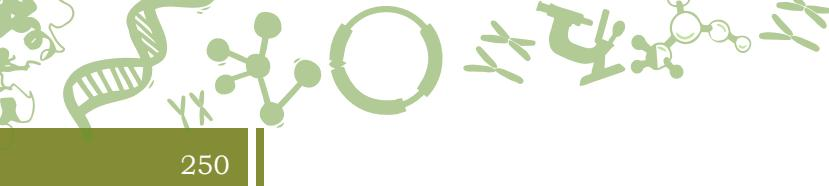

a draft reference genome sequence. In both the scenarios, the sequencing data is pre-processed and checked for quality (Table 9.6).

| Table 9.6: Quality Control tools for pre-processing of raw sequencing data |
| --- |

| Tool category | Examples of tools | Function |
| --- | --- | --- |
| QC (Quality control) | FastQC | To QC high-throughput sequence data |
|  | Trimmomatic | Quality and adaptor trimming |

The alignment-based workflow requires one to choose an appropriate short or long read aligner, followed by one or more variant callers and post-processing and interpretation of filtered variants. The alignment of short sequence reads to a reference genome and the visualisation of three major types of variants, namely **Single Nucleotide Variants (SNVs), Insertions and Deletions (InDels),** and **Copy Number Variations (CNVs)** is demonstrated in Fig. 9.4A.

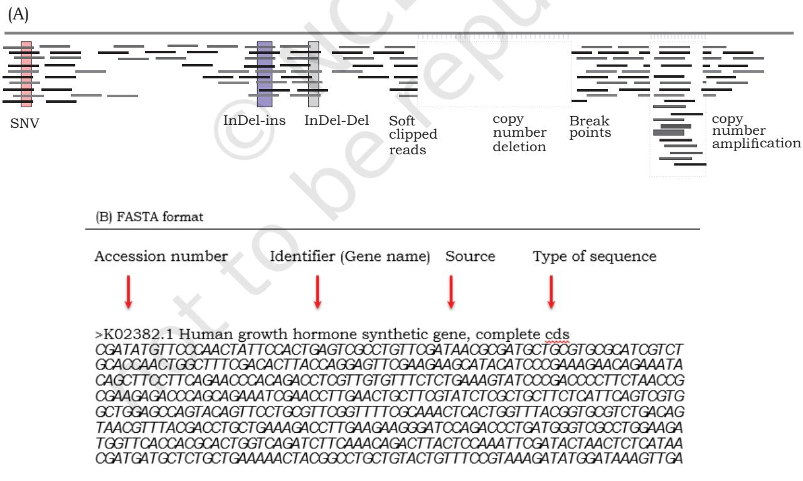

*Fig. 9.4: (A) Visualising SNVs, InDels, and CNVs on a read to reference alignment (B) FASTA formate*

Chapter 9.indd 250 11/14/2019 10:14:31 AM

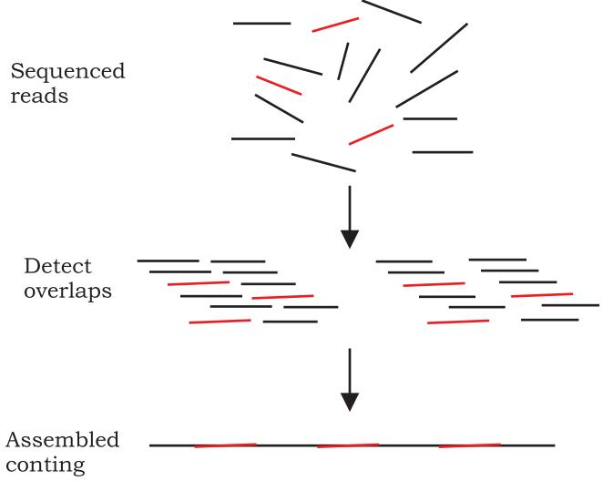

251

*Fig. 9.5: Assembly of reads into a continuous stretch (contig)*

The *de novo* assembly based workflow involves assembling a genome by piecing together reads based on the overlaps and insert size (distance between paired-end reads). The assembly undergoes further annotation and processing, i.e., prediction of novel genes, and identification of genes based on homology to the known ones, quantification of gene expression, identification of splice variants, novel isoforms, and fused transcripts.

A simplified demonstration of the assembly of reads into a contiguous stretch (contig) is provided in Fig. 9.5. The quality of the assembler is determined by how well it assembles these contigs and scaffolds (contigs bridged by gaps), with a low error rate. Several metrics measure the intactness and contiguity of an assembly. One such parameter is called N50, which is the minimum contig length needed to cover at least 50% of the genome. In other words, N50 is the contig length at and above which all the contigs add up to 50% of the genome. However, these quantitative statistics can not be relied soley to determine the quality of a sequenced genome since they do not account for the quality and error-freeness of the assembly. On the microarray front, there are tools specialised for pre-processing and analysis. The pre-processing is done to remove systemic noise variation and batch effects and makes the data comparable at large.

Chapter 9.indd 251 11/14/2019 10:14:31 AM

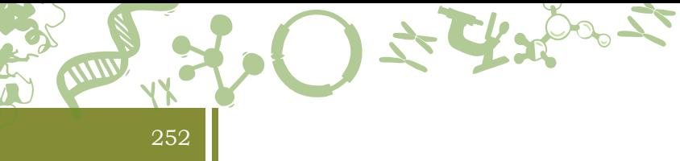

There are several conversion and auxiliary tools for downstream analysis of genome data. Table 9.7 below highlights a few of those tools.

#### **Table 9.7: Conversion and auxiliary tools used in the analytical workflow**

| Seach nucleotide or protein query sequence against | Basic Local Alignment | non-redundant sequence database | Search Tool (BLAST) |  |
| --- | --- | --- | --- | --- |
| filter search to specific organisms | -blastn, blastp | can control stringency of the search | Database |  |
| search | Stores the genome index in memory |  |  |  |
| BLAST-like alignment | designed to quickly find highly similar sequences | tool (BLAT) | (>95%), of at least 40 nucleotides |  |
| Allows comparison of one sequence against the | BLAST (bl2seq) | other, without having to run the formatdb option |  |  |
| Aligners | CLUSTAL | Series of multiple sequence alignment programs |  |  |
| MUltiple Sequence | Comparison by | Better speed and accuracy than CLUSTAL and | Pairwise |  |
| Log-Expectation | T-Coffee | alignment | (MUSCLE) |  |
| Tree-based | Progressive approach | Consistency Objective | supports the use of PDB files in its advanced |  |
| Function For | versions | alignment Evaluation | can identify motifs |  |
| (T-Coffee) |  |  |  |  |
| Conversion | SAM to BAM (Binary Alignment/ Mapping) | SAMtools | tools | conversion |
| PICARD | SAM to Fastq | tools |  |  |

## **9.4.4 Downstream analyses, interpreting data and linking to function**

## **Genome annotation**

**Genome annotation** is the process of identification and classification of all the features in a genome. After a genome is assembled, it is analysed for predicting and identifying locations of coding parts of genes, exon-intron junctions, repeat elements, non-coding elements, and pseudogenes. This is a critical process as all of the downstream analysis depends on its output. Repeats are a significant component of any eukaryotic genome. They provide diversity to individual genomes and could play a significant role in their evolution. Repeats in a genome are classified into

Chapter 9.indd 252 11/14/2019 10:14:31 AM

three major categories — transposons, satellites and low complexity regions. Out of these, transposons form the most significant chunk of repeat elements. The simplest of the repeat analysis can be carried out using a tool called **RepeatMasker** if the sample is close to a model organism. If there are no close relatives known, then the tool **RepeatModeler** can be used first to form a library of repeats for the sample, and this library can be used in turn by RepeatMasker.

253

#### **Variant identification and classification**

All variants called by the variant callers are not necessarily associated with the function or disease being studied. The variant numbers are brought down by functional filters, such as ones affecting protein sequence, splice variants, and stop codon read through. Second among these filters is the somatic filter and is typically applied when one is looking at disease-specific variants. Next, variants common between the control sample and the disease sample are subtracted leaving behind only the potentially disease-specific or somatic ones. Once, the variants are narrowed down; they need to be validated in additional samples using alternate low-throughput and orthogonal technologies before their functional implications are interpreted.

## **Gene prediction**

Gene prediction involves identification of all the coding elements in a genome. Tools used for gene prediction may follow either *ab initio*, similarity-based or integrated model. The similarity-based approach uses sequence similarity for identifying coding regions. Programs like BLAST and its sub-packages are used to carry out an exhaustive comparative search using the existing sequences. The last approach to identify genes utilise both strategies, and integrate the gene prediction results from both of these methods.

#### **Gene ontology**

After gene prediction, the gene products, and their associated functions need to be integrated and represented without ambiguity. The Gene Ontology project aims to do this and provides three vocabularies or ontologies that

Chapter 9.indd 253 11/14/2019 10:14:31 AM

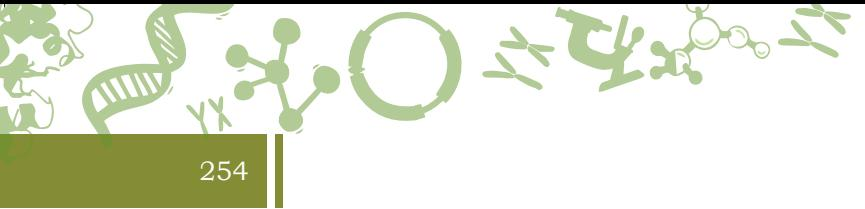

can describe gene products regarding their associated biological processes, cellular components, and molecular functions.

## **Transcript prediction**

Prediction of transcripts (both coding and non-coding) are important to understand the identity of unannotated genes/transcripts. There are several tools that can do this. For example, Cufflinks, cuffmerge, and cuffcompare are a part of a suite that helps in the identification of transcripts.

## **Phylogenetic analysis**

Phylogenetic analysis is done to determine the evolutionary relationship (phylogeny) of an organism with others. This relationship can be expressed as a diagram called **cladogram** or **phylogenetic tree**, and the distance of an organism on the diagram indicates how close that organism is related to others on an evolutionary scale. There are different methods for calculating evolutionary distances which are used by tools for phylogenetic analysis like PHYLIP and PAUP.

## **9.4.5 Analysis of data pertaining to human genetic diseases**

Genetic abnormalities in the genome cause many human diseases. The frequency of these disorders ranges from common to rare, depending on the allele frequency of the genetic variation. Disorders caused due to mutation in one or both copies of a single gene are classified as monogenic (single gene) disorders. Examples of these are sickle cell anemia and cystic fibrosis. If the disease is being caused due to a variation in a gene in one or more of the autosomes (chromosome 1-22, except chromosome X and chromosome Y), it is termed as an **autosomal disorder**. Recessive traits or diseases are caused due to variation in both the alleles, where both parents are carriers of the disease, if not affected themselves. Dominant traits, on the other hand, can be due to variation in one of the alleles, where at least one of the parents is affected. Among sex chromosome-linked traits, the X-linked ones can be either dominant or recessive, but the Y-linked ones are compulsorily dominant since there is only one Y allele. The third category of inheritance is called

Chapter 9.indd 254 11/14/2019 10:14:31 AM

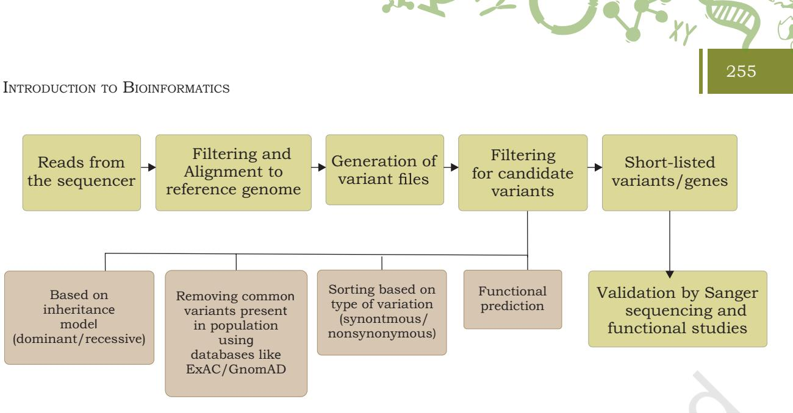

*Fig. 9.6: A typical human genetics analysis workflow for data generated from high-throughput sequencers*

**incomplete dominance or codominance exists**, where one of the alleles is not entirely expressed over another allele, resulting in an intermediate phenotype. Sickle cell anemia is an example of incomplete dominance, where the recessive allele for sickle cell anemia and the dominant allele for normal cells are both expressed together. In large consanguineous (consanguineous marriages result when closely related individuals marry) families, the autosomal recessive variants typically reside in long stretches (1 MB or larger) of autozygosity. These stretches enable to narrow down meaningful and disease-relevant variants. The likely inheritance model in the scenario of autosomal recessive and rare diseases in non-consanguineous families is compound heterozygosity, caused by two affecting mutations, one on each allele.

The analytical workflow for a human genetics experiment is shown in Fig. 9.6. Sequencing reads are taken through a series of steps before the causal variant is found. Once a list of annotated variants has been found, post the initial bioinformatics analysis, the challenge is to distinguish the actual disease associated variant from the common polymorphisms in a population and those resulted due to sequencing errors. Various filtering steps are needed to be incorporated to identify the causal variant. For initial prioritisation, the variants that are generally present outside the coding regions are excluded, so are the synonymous coding variants (those that does not alter the amino acid), on the assumption that the

Chapter 9.indd 255 11/14/2019 10:14:32 AM

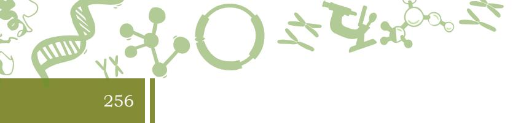

coding regions are the better understood regions of the genome, and the synonymous variants will have minimal effect on the disease phenotype. The next filtering step involves excluding variants that are present in the public databases such as dbSNP, HapMap, 1000 Genome project, ExAC and GnomAD, since these variants are more commonly present in a population, they would generally not be associated with a rare disease. This filtering substantially reduces the number of novel candidate variants which need to be screened to identify the causal variant by both *in silico* and functional analyses. The variant search is generally restricted to genes harbouring heterozygous mutations in the case of dominant inheritance model. In the case of either homozygous or compound heterozygous, genes having at least two novel variants are taken into account.

**Exome sequencing** has been extensively used in the last 5 year to discover human disease genes. Compared to the whole-genome sequencing, it is cheaper, requires considerable less effort to analyse the data and the data is easier to interpret. Before the advent of exome sequencing techniques, finding or discovering a rare causal gene for an inherited genetic disease was a daunting task. It used to take years to successfully map a disease gene in the genome. Linkage mapping and candidate gene analysis, both time-consuming and labor-intensive, were the primary tools for decades to map disease genes before the advent of exome and whole-genome sequencing technologies. The traditional methods of disease gene discovery depended on detailed pedigree information, which included critical categorisation of diseased individual from the non-diseased ones. The more informative the pedigree, the more likely the chances of finding a Mendelian pattern. Tools like pVAAST (Pedigree Variant Annotation, Analysis, and Search Tool) and PLINK enable identification of disease-linked genetic variants. The OMIM (Online Mendelian Inheritance in Man) is a database of genetic diseases used extensively by human genetics researchers. Additionally databases like Clinvar, and Orphanet catalog curated genes associated with human Mendelian, complex and environmental diseases. For rare genetic disorders, the **ExAC** (Exome Aggregation Consortium) and **gnomAD** (Genome Aggregation Database) databases help in filtering down the common variants in the exome and genome, respectively.

Chapter 9.indd 256 11/14/2019 10:14:32 AM

Although exome sequencing techniques have been widely used to study Mendelian genetic diseases, there are some shortcomings to this technology. The technology focuses on the protein coding regions of the genome, hence misses the variants in the non-coding regions. Additionally, the process used to capture the coding portions of the genome and the coverage in the evolutionarily conserved regions as well as the regulatory regions is often not complete. Additionally, the high-throughput sequencing technologies have a higher base calling error rate as compared to Sanger sequencing. Another major limitation of using highthroughput sequencing technology is data analysis. Most small laboratories are not equipped or trained to handle significant amount of data. Many genetic disorders are extremely rare and therefore, the causal allele has very low frequency in the population that requires a large number of affected individuals to be sequenced making the study very expensive. Furthermore, some of the variants may be population specific and may not necessarily be associated with the disease. Hence, careful selection of the healthy controls of the same ethnicity is necessary for many human genetic studies. Whole genome sequencing circumvents some of the limitations of exomesequencing, offers the least biased and most comprehensive method to identify variants that cannot be identified with exome sequencing, for example, large structural variations such as copy number variations, translocations, and fusion events.

257

## **9.4.6 Role of Artificial Intelligence (AI) in future**

We are moving into an era where the prospect of Artificial Intelligence (AI) is beginning to take hold. Bots such as Libratus and AlphaGo have already conquered reallife experts in games such as Poker and GO. Machine learning is also starting to make its presence felt in improving farming and broadening healthcare options. For example, AI-based tools are used in the USA to diagnose eye diseases that rely on thousands of stored images of the eye. It is possible that we will have computers read X-rays and pathology slides routinely in the hospitals and aid radiologists and pathologists in correctly and quickly diagnose human diseases. AI also holds significant promise to help our farmers to improve their yield and decide on their crops. Many existing bioinformatics tools are already

Chapter 9.indd 257 11/14/2019 10:14:32 AM

using machine learning algorithms for calling genomic variants and assessing their significance levels. However, similar to other real-life situations where Siri (from Apple) or Alexa (from Amazon) as personal assistants are not perfect and cannot do everything, a successful intersection between AI and bioinformatics will require time and multidisciplinary efforts to yield successful results. Such a junction demands to build sufficient intelligence in the tools to interpret data and generate hypotheses. The competency of the tools being developed for analysis is still not at par with the fast pace at which the data is being produced. A collaboration among researchers working in biology, computer science, bioinformatics, statistics and artificial intelligence researchers will lead to successful tools for biological data analyses in the future.

## **Summary**

- In this chapter, we learned about the exciting and expanding field of bioinformatics. We got a glimpse of its evolution and scope. We learned about the different types of biological molecules, underlying technologies and advances to assay the biomolecules, biological databases, data analysis and visualisation, and how to translate the results to functional interpretations.
## Exercises

- 1. Name the two modalities of analysis following sequencing.
- 2. Name any three major types of variants.
- 3. What are disease-specific variants termed?
	- (a) somatic

258

- (b) germline
- 4. Which is the preferred tool for transcriptome assembly, in the de novo and genome-guided modalities?
	- (a) Tophat2
	- (b) Trinity

Chapter 9.indd 258 11/14/2019 10:14:32 AM

- 5. What is the difference between BLAT and BLAST?
- 6. What came first? Structural Bioinformatics or Genome informatics?

259

- 7. Name any two of the major classes of biological macromolecules.
- 8. DNA sequences can be represented by which of the following data format?
	- (a) FASTQ
	- (b) FASTA
	- (c) AB1
	- (d) All of the above
- 9. Can a phylogeny be produced directly from a multi-fasta file? Justify your answer.
- 10. Which tool can help you visualise variants in a circular manner?
	- (a) UCSC Genome Browser
	- (b) CIRCOS
	- (c) IGV
- 11. Which of the following approaches can help one in arriving at a comprehensive understanding of the biology of an organism?
	- (a) Single assay across multiple individuals.
	- (b) Multiple orthogonal assays across fewer individuals.
- 12. Why do we need to sequence nucleic acids? What can one gain by understanding the sequence of nucleic acide?

Chapter 9.indd 259 11/14/2019 10:14:32 AM

