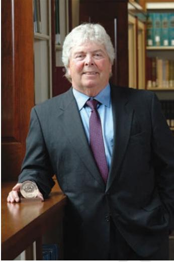
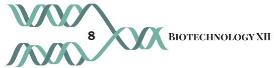

# **UNIT I Recombinant DNA Technology**

Chapter 1: An Overview of Recombinant DNA Technology

Chapter 2: Host–Vector System

Chapter 3: Gene Cloning

Chapter 4: Application of Recombinant DNA Technology

Chapter 1 Recombinant DNA Tec.indd 1 07-02-2023 10:04:01

#### **Herbert Boyer**

Herbert Wayne 'Herb' Boyer (born July 10, 1936) was a researcher and entrepreneur in Biotechnology. Herb Boyer hails from Derry, Pennsylvania. Boyer went on to graduate at the University of Pittsburgh, where he specialised in microbial genetics. After preliminary experiments in 1973, the Cohen-Boyer team was able to cut open a plasmid loop from one species of bacteria, insert a gene from different bacterial species and close the plasmid. This created a recombinant—plasmid containing recombined DNA from two different sources. The team had created the first genetically modified organisms. He is the recipient of the 1990 National Medal of Science, co-recipient of the 1996 Lemelson– MIT Prize, and a co-founder of Genentech. He was a professor at the University of California, San Francisco (UCSF) and later served as the Vice President of Genentech from 1976 until his retirement in 1991.

Chapter 1 Recombinant DNA Tec.indd 2 07-02-2023 10:04:01

**An Overview of Recombinant DNA Technology** 

**Chapter 1**

This chapter gives an overview of recombinant DNA (rDNA) technology as to how the application of basic concepts of molecular biology, microbiology, genetics, biochemistry, etc., led to initial development of rDNA technology. Potential application of rDNA technology in the use of medicine and agriculture is also discussed in conceptual manner along with some noticeable examples of products developed through rDNA technology.

# **1.1 AN OVERVIEW OF RECOMBINANT DNA TECHNOLOGY**

In the last century when scientists discovered that nucleic acid (DNA) is the principal molecule responsible for the expression of characters, attempts were made to alter the genetic makeup of an organism by manipulating nucleic acid directly. Various methods used for directly manipulating nucleic acid/genome (DNA) of an organism are collectively referred to as recombinant DNA (rDNA) technology or genetic engineering.

rDNA technology has been possible due to rapid progress in various fields of biology which spans from

- *1.1 An Overview of Recombinant DNA Technology*
Chapter 1 Recombinant DNA Tec.indd 3 07-02-2023 10:04:01

biochemistry, genetics, cytology, microbiology, molecular biology and others. Isolation and purification of nucleic acids followed by the understanding of their structures, properties, functions and finally their sequencing in the last century are the most important contributions which laid the foundation of development of rDNA technology. The first breakthrough in this journey was to establish the fact that DNA of an organism not only carries its genetic information but also propagates it from one generation to another. The next hallmark was the determination of chemical and physical structure of DNA molecule and double helical structure of DNA. Further, replication, transcription and translation of DNA was understood in detail by scientists. Scientists were also able to develop various methods and techniques to isolate and purify DNA from various organisms. Several enzymes were simultaneously discovered using which one can precisely manipulate a DNA molecule. Thus, new enzymes, such as restriction enzymes (which act as scissors to cut the molecules of DNA) by Werner Arbor, Hamilton Smith and Daniel Nathan (during late 1960s and early 1970s) and ligase (which joins two DNA fragments) by Gellert, Lehman, Richardson and Hurwitz in the year 1967 were discovered. During this period, scientists also noticed that foreign DNA fragments can be taken by bacteria from its surrounding environment where it can be integrated into its genome. With all this knowledge, scientists asked a question that is it possible to transfer the gene of interest from one organism to another organism to get its product? Stanley Cohen had the expertise in introducing plasmid DNA into *Escherichia coli* (*E. coli*) and subsequent propagation and cloning of plasmids in the bacteria. On the other hand, Boyer had the expertise to cleave the double stranded DNA to produce single stranded ends with identical termini using restriction enzymes. Both visualised the potential of combining the two discoveries to what would later become rDNA technology or genetic engineering.

**4 Biotechnology XII**

Chapter 1 Recombinant DNA Tec.indd 4 07-02-2023 10:04:01

Apart from its unquestionable contribution to basic scientific endeavour, rDNA technology has played a great role in shaping our life standards by its immense contribution in diagnosis and treatment of various diseases including genetic disorders and to improve and develop disease free high yielding crops. The contribution of rDNA technology in shaping our life can be judged from the given examples. Earlier several tons of animal pancreatic glands were needed to get a few milligrams of insulin to treat diabetes, or thousands of animal pituitary glands were required to isolate growth hormone to treat dwarfism. Therefore, these products were available in limited quantity as well as at a high cost. Nevertheless, such purified therapeutic proteins from animal source exhibited immunogenic reactions in humans. Needless to say, scientists circumvent the above obstacles by producing human insulin and growth hormone in bacterial system using rDNA technology. Production of interferon to treat cancer, plasminogen activator and urokinase to dissolve blood clots are a few examples of the contribution of rDNA technology to human society. In the last few decades, by employing rDNA technology, scientists have been able to introduce specific targeted modifications in plant genome to get genetically modified crops. Thus, in this way, crops have been developed which offer resistance to diseases, thereby helping farmers to be free from worry about damage of their crops. Similarly, drought resistant or salinity tolerant crops were also developed so that farmers can grow them in adverse environment. Such modifications in genetic system of plants or crops by rDNA technology not only improve the quality of production but also enhance the value of products.

Days are not far, when a variety of important therapeutic proteins, peptides and hormones will be produced from plants employing rDNA technology. Such products will have many advantages over animal-based products in terms of costs and contamination. In general, animalbased products are costlier and require extra care to be free of virus and other animal protein contaminants.

Landmark discoveries which led to the development of modern biotechnology (based on rDNA technology is given in Box 1).

**Recombinant DNA Technology 5**

Chapter 1 Recombinant DNA Tec.indd 5 07-02-2023 10:04:01

#### **Box 1**

#### **Selected development in the history of biotechnology**

| 1917 | Karl Ereky coined the term 'Biotechnology' |
| --- | --- |
| 1944 | Avery, MacLeod and McCarty demonstrated that 'DNA is the genetic material' |
| 1952 | Joshua Lederberg Discovered 'Plasmids' |
| 1953 | Watson and Crick proposed 'Double Helical structure of DNA' |
| 1960s | Werner Arber, Matthew Meselson discovered ' Type I restriction enzymes' |
| 1967 | Gellert, Lehman, Richardson and Hurwitz discovered 'ligases enzymes' |
| 1970 | Hamilton O. Smith and Thomas J. Kelly discovered ' Type II restriction enzymes' |
| 1972 | Paul Berg assembled the first 'Recombinant DNA' from a bacterium into the virus |
|  | Stanley N. Cohen and Herbert Boyer developed 'DNA cloning and rDNA |
| 1973 | technology' |
| 1975 | Georges J.F. Köhler and César Milstein described the 'Hybridoma Technique' |
|  | for production of monoclonal antibodies |
| 1982 | FDA approved world's first recombinant DNA Therapeutic Product 'Humulin' |
|  | developed by Eli Lilly and Genentech |
| 1983 | Kary Mullis developed 'Polymerase Chain Reaction' |
| 1984 | Sir Alec Jeffreys invented 'DNA Fingerprinting' |
| 1986 | The first recombinant vaccine 'Recombivax HB' for Hepatitis B was approved |
|  | for human use |
| 1990 | 'Human Genome Project' officially initiated which was coordinated by the U.S. |
|  | Department of Energy (DOE) and the National Institute of Health (NIH) |
| 1994 | The first genetically engineered crop 'Flavr Savr' tomato was introduced which |
|  | was produced by Calgene in 1992 |
| 1996 | Keith Campbell and Ian Wilmut cloned the first mammal from adult somatic |
|  | cell using nuclear transfer 'Dolly' (Sheep) |

**6 Biotechnology XII**

Rationalised 2023-24

Chapter 1 Recombinant DNA Tec.indd 6 07-02-2023 10:04:01

| 1996 | Researchers at Monsanto developed 'Bt cotton' and first commercially released it in China and the United States in 1996, followed by its introduction in India |
| --- | --- |
|  | in 2003 |
| 2000 | Ingo Potrykus and Peter Beyer developed 'Golden Rice' |
| 2003 | The Human Genome Project (HGP) was completed |
| 2004 | 'Avastin', an anti-VEGF monoclonal antibody for cancer treatment was |
|  | discovered |
| 2006 | A recombinant vaccine 'Gardasil' against human papillomavirus (HPV) receives |
|  | FDA approval |
| 2006 | Discovery of RNA interference 'Gene Silencing' by double stranded RNA |
| 2010 | Robert Edwards awarded Nobel Prize for the development of human 'in vitro |
|  | fertilization' (IVF) therapy |
|  | Shinya Yamanaka and John B. Gurdon discovered that mature differentiated |
| 2012 | cells can be reprogrammed into 'Induced Pluripotent Stem Cells' |
| 2019 | Recent advances in the 'CRISPR-Cas9' genome editing tool |
| 2020 | Recombinant vaccines against COVID-19 was developed. |

In the next chapters of the present Unit, the various components and applications of rDNA technology are discussed in detail.

## **SUMMARY**

- The methods used for manipulating nucleic acid/ genome (DNA) of an organism are collectively referred to as recombinant DNA (rDNA) technology or genetic engineering.
- The fundamental theme of rDNA technology is the isolation and propagation of a desired DNA molecule (gene) from a source with an aim to have its product in ample quantity. This technique is called gene cloning.

**Recombinant DNA Technology 7**

Chapter 1 Recombinant DNA Tec.indd 7 07-02-2023 10:04:01

## **EXERCISES**

- 1. Discuss in brief how recombinant DNA technology was initially developed?
- 2. Briefly discuss the application of rDNA technology in crop improvement and therapeutic.
- 3. Who discovered the Plasmid?
- (a) Paul Berg
- (b) Sir Alec Jeffreys
- (c) Joshua Lederberg
- (d) Kary Mullis
- 4. Plasminogen activator and Urokinase are used as:
	- (a) Antiviral agent
	- (b) Blood clot dissolving drug
	- (c) Sugar lowering agent
	- (d) Cholesterol lowering agent
- 5. **Assertion:** Restriction endonuclease cuts DNA and isolated mostly from bacteria.

**Reason:** Restriction endonuclease is a type of nuclease.

- (a) Both assertion and reason are true and the reason is the correct explanation of the assertion.
- (b) Both assertion and reason are true but the reason is not the correct explanation of the assertion.
- (c) Assertion is true but reason is false.
- (d) Both assertion and reason are false.
- 6. **Assertion:** *E.coli* divides in 20 minutes while replicates its DNA in about 60 minutes.

**Reason:** *E.coli* follows multifork replication mechanism.

- (a) Both assertion and reason are true and the reason is the correct explanation of the assertion.
- (b) Both assertion and reason are true but the reason is not the correct explanation of the assertion.
- (c) Assertion is true but reason is false.
- (d) Both assertion and reason are false.

Chapter 1 Recombinant DNA Tec.indd 8 07-02-2023 10:04:01

