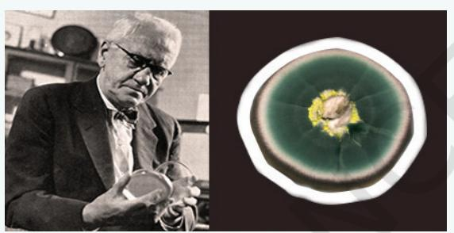
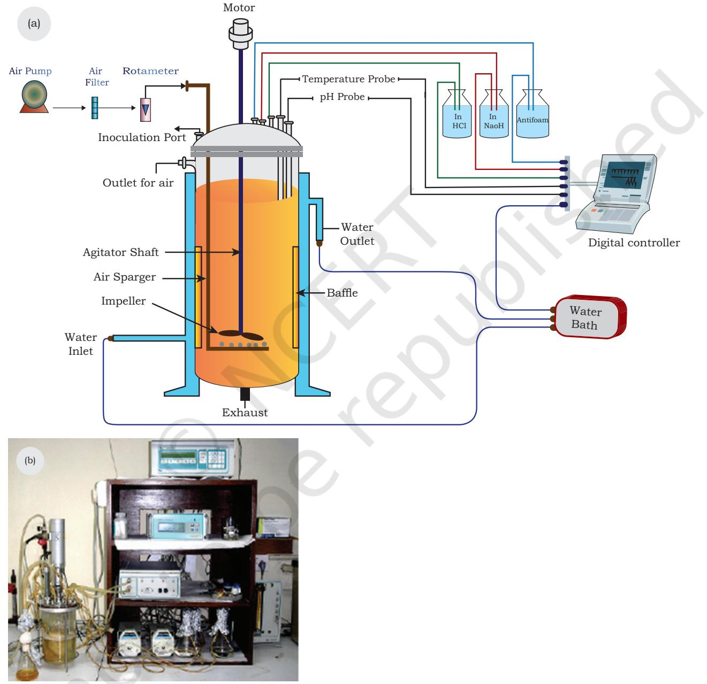
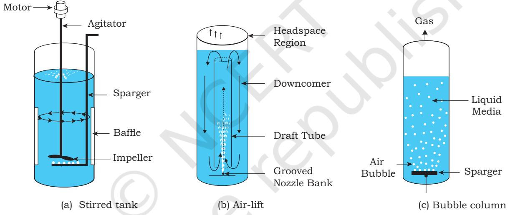
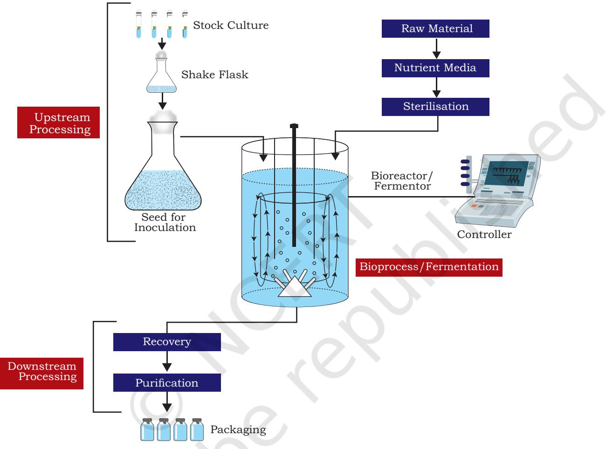
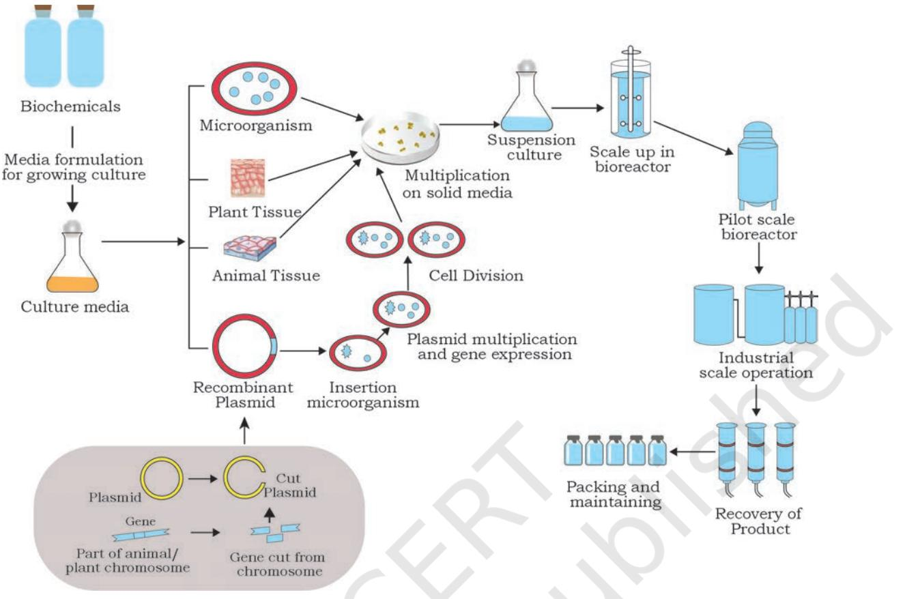
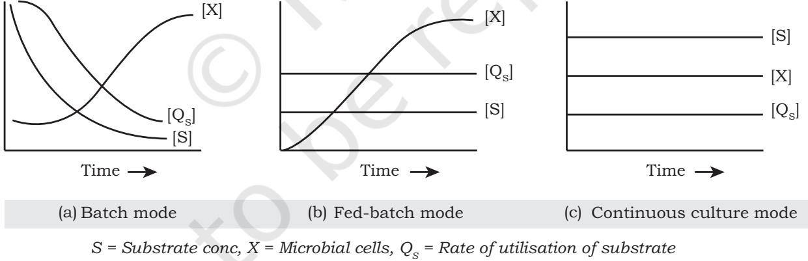
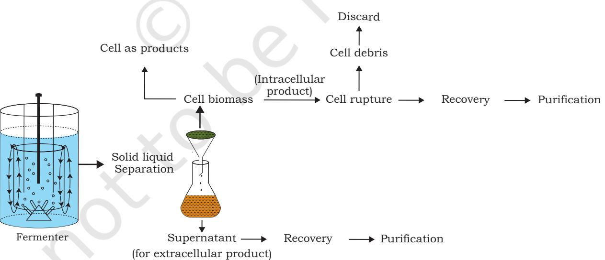
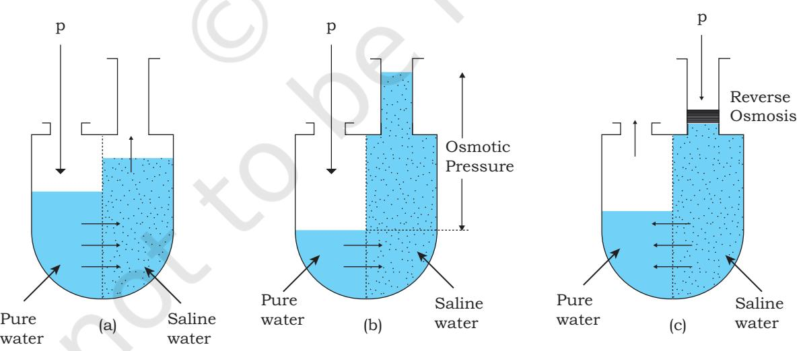
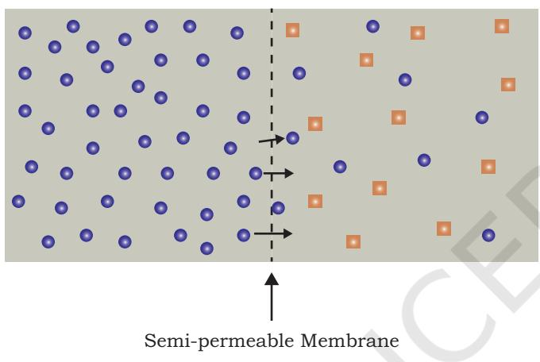

# **Bioprocessing and** 10 **Biomanufacturing Chapter**

Students are already aware that living organisms especially microbes and biological processes therein are used for making various household products (curd/yoghurt, idli, kinema, etc.) and industrial products (ethanol). We have already learnt in the previous class that living organisms are endowed with a variety of metabolic processes which lead to the formation of chemical compounds, called metabolites, that are broadly classified into primary and secondary metabolites. Primary metabolites are the compounds produced directly out of primary metabolic pathways associated with essential cellular functions such as growth and development. On the other hand, secondary metabolites are intermediates or indirect products, elaborated by entirely different metabolic pathways called secondary metabolic pathways. Secondary metabolites take part in a variety of functions. For example, they are used in defence for protection against pathogens, phytoplanktons and herbivores, to improve tolerance to abiotic stresses; as attractants for insects and animals for fertilisation, seed dispersal in plants or to contribute in causing the displeasure to the unwanted feeders.

#### *10.1 Historical Perspective*

- *10.2 Instrumentation in Bioprocessing: Bioreactor and Fermenter Design*
- *10.3 Operational Stages of Bioprocess*
- *10.4 Bioprocessing and Biomanufacturing of Desired Product*

Chapter 10_Bioprocessing and Bio-manuf.indd 235 06-02-2023 17:45:21

Nowadays, most of these secondary metabolites have a variety of applications in the form of pharmaceuticals, dyes, food additives, enzymes, vitamins, etc. In view of the variety of applications, production of these compounds (biochemicals) at commercial level requires their production in bulk quantities, as quantities produced naturally are not sufficient. These compounds are usually produced at commercial level in a purified form through a series of steps covered under bioprocessing. For large scale production, where large volume (on an average 100–10,000 litres) of culture can be processed, the development of bioreactors was required. Thus, bioreactors can be thought of as vessels in which raw materials are biologically converted into specific products using microbial, plant or animal cells or their components. Bioreactors provide optimal growth conditions (temperature, pH, substrate, salts, vitamins, oxygen) for achieving the desired product. Thus, bioprocessing deals with the manufacturing of desired biochemicals using a living system or their components. Bioprocess involves the maintenance of sterile (microbial contamination free) atmosphere or environment to enable the growth of only the desired microbial or eukaryotic cell in large quantities for manufacturing biotechnological products like antibiotics, vaccines, enzymes, organic acids and so on.

## **10.1 HISTORICAL PERSPECTIVE**

After the breakthrough discovery of Penicillin and its role in killing bacteria by Alexander Fleming in 1928, the significance of products from biological systems was well understood. Now, the challenge before the scientific/ research community was to enhance the production of penicillin. Production in larger amount for its use in treatment would obviously require a systematic process using the culture of biological entity in question i.e., *Penicillium* species. The need of involvement of microbial physiologist and other life scientists and technologists was identified. This followed the identification of a number of products of living organisms and processes especially from microbes for application in bioprocessing. Many companies

Chapter 10_Bioprocessing and Bio-manuf.indd 236 06-02-2023 17:45:21

and government laboratories, assisted by different universities and institutions came together to take up this challenge and efforts were made to increase the production of penicillin. All this paved a way for the emergence of a new area of biological applications, which is now known as **bioprocessing**. Thus, bioprocessing involves biological or living systems or their components (e.g., enzymes, chloroplasts, etc.) and chemical engineering processes to obtain the desired products at commercial level as depicted in Fig. 10.4.

At industrial or commercial stage, all bioprocesses are carried out in vessels called **fermenter** or **bioreactor**. We are also aware that after the advent of rDNA technology, microbes are extensively employed for the production of a number of biological material for the welfare of mankind.

#### **Box 1**

#### **Discovery of Penicillin**

It was in 1928 when Alexander Fleming at St. Mary's Hospital in London, while trying to isolate boils causing bacterium, *Staphylococcus aureus,* found that one of the Petridishes was contaminated inadvertently with a foreign entity. Instead of discarding the Petri plate for disinfection, Fleming made an important observation in the unwashed

contaminated plate that no bacteria grew near the invading entity. The observation surprised Fleming's intellect and he soon realised that this chance observation may be a meaningful arena of interest.

 Later this antibacterial foreign entity was identified as a common mould, the *Penicillium notatum*, and the metabolite secreted has powerful antibacterial properties called penicillin. Its full potential as an effective antibiotic was established by Ernest Chain and Howard Florey. This antibiotic was extensively used to treat the American soldiers wounded in World War II. Fleming, Chain and Florey were awarded the Nobel Prize in 1945 for this discovery.

# **10.2 INSTRUMENTATION IN BIOPROCESSING: BIOREACTOR AND FERMENTER DESIGN**

**Bioreactor** is an engineered vessel made up of glass or steel that supports a biologically active environment, where cells can be cultivated under aseptic conditions with appropriate nutritional and environmental requirements.

**Bioprocessing and Biomanufacturing 237**

Chapter 10_Bioprocessing and Bio-manuf.indd 237 06-02-2023 17:45:21

In a bioreactor, the biochemical processes involve the cultivation of microbial, plant and animal cells or biochemically active substances derived from such cell cultures or organisms. Commonly, bioreactors are cylindrical and vary in size. The design and components of a typical bioreactor are shown in Fig. 10.1.

*Fig. 10.1: (a) Diagrammatic representation of the design and components of a typical bioreactor (b) Photograph of a laboratory bio-reactor* 

**238 Biotechnology XII**

Chapter 10_Bioprocessing and Bio-manuf.indd 238 06-02-2023 17:45:21

A bioreactor should fulfil the following requirements:

- 1. a **sterile environment**, so that a pure culture may be grown without contamination
- 2. **adequate supply of air** for cellular respiration in culture
- 3. **uniform mixing of nutrients**, cells and air throughout the bioreactor vessel without causing any shear stress to the cultured cells
- 4. a system for **maintenance of optimum temperature**  conducive for the growth and product formation in a desired culture
- 5. a system for **monitoring the environmental process**  parameters, such as pH, dissolved oxygen, etc.

Thus, in order to fulfil these requirements a typical bioreactor consists of the following:

- **• Agitator shaft:** It helps in mixing contents of the bioreactor and keeps the cells in perfect homogenous conditions that provide better transport of nutrient and oxygen throughout the running bioprocess. An impeller is fixed at the bottom of an agitator shaft.
- **• Sparger**: It helps in providing an adequate and continuous supply of sterilised air (oxygen) using microfilters for growing cells submerged in the liquid media inside the bioreactor system.
- **• Baffle**: It helps in breaking the vortex formation which is highly undesirable as it changes the centre of gravity of the system making it consume extra power to run the system.
- **• Jacket**: It provides area for the circulation of water at the given temperature for maintenance of optimum temperature inside the device required for the growth of cultivated cells and product formation.
- **• Sensitivity probe for temperature and pH:** These are the probes to sense temperature and hydrogen ion concentration of a bioprocess.
- **• Digital controller for controlling process parameters:** Digital controller is connected to bioreactor through probes and its one separate unit is connected to a water bath that pumps water of desired temperature in and out of the jacket present around the bioreactor unit for the maintenance of temperature throughout. It is also connected to pH probes and bottles containing 1M NaOH and 1N HCl. As the

**Bioprocessing and Biomanufacturing 239**

Chapter 10_Bioprocessing and Bio-manuf.indd 239 06-02-2023 17:45:21

probe senses acidity or alkalinity, digital controller commands any of the two bottles for addition of either dilute NaOH or HCl for the maintenance of the desired pH. All process parameters including temperature, pH, speed of stirring (*rpm*), etc., are exhibited over the display of the controller.

## **10.2.1 Types of bioreactors**

Based on the design or configuration, important types of bioreactors are discussed below:

- **• Stirred tank reactors** are the most conventional bioreactors. In these reactors, agitator facilitates the mixing of nutrients, oxygen and growing cells. The reactor is characterised by the presence of agitator shaft. Design, shape and size of the impeller differ for various bioprocesses [Fig. 10.2(a)].

*Fig. 10.2: Various types of bioreactors* 

- In **Air-lift reactors**, a motion of air is created using a draft tube. The mixing of nutrients and oxygen is maintained by creating the air current that lifts the fluid broth and cells up and down, inside-out or viceversa through a draft tube inside the reactor vessel [Fig. 10.2(b)].
- In **Bubble column** reactor, the mixing of nutrients and oxygen is maintained with the help of air bubbles produced through sparger jet. These reactors provide low shear environment, which may be a critical consideration for some cells and high oxygen transferred per unit of power input [Fig. 10.2(c)].

Chapter 10_Bioprocessing and Bio-manuf.indd 240 06-02-2023 17:45:22

# **10.3 OPERATIONAL STAGES OF BIOPROCESS**

A bioprocess is composed mainly of two stages for converting raw material into the final product namely, upstream and downstream processing (Fig. 10.3).

*Fig. 10.3: Different stages of upstream and downstream processing*

The upstream bioprocessing consists of four components as detailed below:

- 1. optimisation of nutritional conditions in artificial media and formulation for culturing the living organisms, cells or its components
- 2. sterilisation of media, bioreactor and other additional tools and equipment
- 3. production of pure, active and healthy inoculums in sufficient quantity

**Bioprocessing and Biomanufacturing 241**

Chapter 10_Bioprocessing and Bio-manuf.indd 241 06-02-2023 17:45:22

- 4. optimisation of environmental conditions for growth and product formation
On the other hand, downstream processing consists of two steps as detailed below:

- 1. extraction, recovery and purification of product
- 2. the disposal of effluents produced by the process

Upstream and downstream processing are described in detail in the following sections.

## **10.3.1 Upstream processing**

A typical upstream bioprocess involves raw materials such as the biomass of microbial, plant or animal cells to be usually treated and mixed with other ingredients that are required for the cells to grow well. The raw material to be used in bioprocessing is first converted to a suitable fermentable form. Preparation of liquid or solid nutrient medium, sterilisation, aeration, agitation and shear sensitivity besides many other preparatory operations and scaling up for high product formation are described in the following sections.

**Nutrient media** or culture media required for maximum growth and product formation of a particular culture is formulated using chemicals and nutrients, etc. Different media formulations are prescribed for microbial, plant and animal cell culture (Chapter 6–8).

Requirement of medium constituents varies with the species of an organism for biosynthesis and cell maintenance. The following equation based on stoichiometry may be considered for growth and product formation:

Carbon and energy source + Nitrogen source + other requirements Cell biomass + products + Carbon dioxide + Water + heat

> The equation is important for economical designing of the media by minimising wastage of media components. For example, under aerobic conditions, carbon requirement of a particular culture may be estimated by determining the cellular yield coefficient (Y) as:

> > Y = Quantity of cell dry weight produced by the culture

Quantity of carbon substrate utilised

**242 Biotechnology XII**

Chapter 10_Bioprocessing and Bio-manuf.indd 242 06-02-2023 17:45:22

#### *Fig. 10.4: Bioprocess Development*

Similarly, in a bioprocess other media components may also be determined for their minimal wastage and optimum productivity of the culture. Thus, media formulation is very important for a bioprocess.

**Inoculum** of viable, healthy, fast growing and high producing living cells, organ or organism is very much required for good growth and technologically viable and economically efficient production. Inoculum may be developed on solid culture or liquid culture. Liquid culture may usually be developed in shake flask and called suspension culture. The culture to be used as inoculum must fulfil the following criteria:

- 1. inoculum should be healthy and in log or exponential phase of the growth cycle (i.e., actively dividing).
- 2. in subsequent transfer, inoculum should not exhibit long lag phase.
- 3. it should be available in sufficient amount to provide an inoculum of optimum size.

**Bioprocessing and Biomanufacturing 243**

Chapter 10_Bioprocessing and Bio-manuf.indd 243 06-02-2023 17:45:22

- 4. it should be available in a suitable morphological form.
- 5. it should be free of contamination.
- 6. it should retain its product forming capability.

**Aeration** is required to fulfil oxygen requirement of submerged suspension culture in shake flask and bioreactors. Ideally, maximum amount of dissolved oxygen in pure water is approximately 8 g/L, which is available for growing submerged culture in liquid media. In bioreactor, pure sterilised air is sent through sparger to maintain the oxygen levels in the media for growth of the culture.

A mild **agitation** is required for uniform distribution of oxygen and other nutrients. Some cells such as animal cells are more shear sensitive than plant cells. Plant cells are more sensitive to shear than microbial cells. Thus, in shake flask, shear stress or sensitivity of cells to shear can be controlled by increasing or decreasing the speed of shaker i.e., revolution per minute (*rpm*) of the shaking condition. The same is maintained in bioreactors by increasing or decreasing the speed of agitator.

**Temperature** required for maximum growth and production has to be maintained. Temperature requirement for different cultures is different. There may be an optimum temperature for the formation of a desired product. The optimum temperature may be similar or different for culture growth and product formation.

**Hydrogen ion concentration (pH)** is another parameter that affects growth and product formation. Optimum pH for growth and product formation has to be maintained for an efficient bioprocess.

Thus, before a bioprocess is run, all processing parameters, such as nutrient media formulations, temperature, hydrogen ion concentration, etc., are optimised separately.

**Sterilisation** is an essential requirement for a successful bioprocess. It requires sterilisation of tools, glassware, media, air or in-site sterilisation of bioreactor, etc., and even the maintenance of aseptic conditions to perform processes and scale up in the bioreactor. Thus, contamination in a bioprocess may be avoided by the following:

- 1. sterilisation of nutrient media
- 2. sterilising the bioreactor vessel

**244 Biotechnology XII**

Chapter 10_Bioprocessing and Bio-manuf.indd 244 06-02-2023 17:45:22

- 3. sterilising all the materials to be added to the bioreactor vessel during the process.
- 4. maintenance of aseptic conditions during the fermentation.
- 5. using a pure culture as inoculum.
- A typical bio process development stage are summarised in fig. 10.4

## **Modes of Bioprocess Operation**

One of the important decisions in the development of a bioprocess is that the mode of bioprocess operations is to be applied to a particular bioprocess. Mainly there are three different modes under which a bioprocess may be operated:

- 1. Batch
- 2. Fed-batch
- 3. Continuous

**1. Batch mode:** It is a closed culture system with an initial fixed amount of nutrients. An inoculated batch culture passes through a number of phases of growth cycle. When cells are grown in a nutrient medium, cells start growing in number and size to some extent. In a suitable nutrient medium, the cells utilise nutrients from the medium for growth and energy production and convert the material to be bioprocessed (fermented) into

*Fig. 10.5: Graphical representation of growth of cell culture in (a) Batch mode (b) Fed batch mode and* 

*(c) Continous culture mode.* 

the product. Fig. 10.5(a) is showing cell biomass [X], rate of substrate consumption [Qs] and substrate concentration [S] in a batch culture.

- **2. Fed-batch mode:** In a batch culture if the growth of
**Bioprocessing and Biomanufacturing 245**

Chapter 10_Bioprocessing and Bio-manuf.indd 245 06-02-2023 17:45:22

cells become limited due to the concentration of one or more substrate components, the same are fed intermittently or continuously to the growing culture as per the requirement from time to time. In such culture, volume in the fermenter increases due to extra feed added and no removal of any volume of culture. This is known as fed-batch mode of culture, which is advantageous for maintaining the residual substrate concentration at very low levels and thereby avoiding their toxic effects. In this culture system, substrate concentration's' and rate of substrate utilisation [Qs ] remains constant and cell biomass/product keeps on increasing Fig. 10.5(b).

**3. Continuous mode:** In this mode, the design of the bioprocess (reactor) is such that the fresh lot of nutrient media is added and the used media is removed in such a way so that continous supply of the desired product is to be ensured. Similarly, a fresh lot of inoculum could also be added. Thus, in the continuous mode, a steady state is maintained that is, the formation of new biomass by the culture is balanced by the loss of cells from the reactors vessel Fig 10.5(c). Thus, during steady state rate of growth and product formation, substrate concentration and rate of substrate utilisation remains constant.

## **Downstream processing**

In the process, the desired product is recovered in an

*Fig. 10.6: Major steps in downstream processing*

**246 Biotechnology XII**

Chapter 10_Bioprocessing and Bio-manuf.indd 246 06-02-2023 17:45:23

efficient way which involves efficient separation and purification technique. Thus, the product of bioprocess may be cell biomass, extracellular component of liquid media (broth) or intracellular product of cell. The major process of downstream processing is shown in Fig. 10.6. The extraction and purification of product in the culture fluid may be difficult and costly. High quality efficient recovery requires the following considerations:

- 1. the process chosen must be quick.
- 2. the chosen process must have minimum investment and operated at minimum cost.

The downstream processing mainly consists of physical separation as well as purification operations, which includes the separation of particulate, dialysis, reverse osmosis, solid-liquid separations, adsorption, liquid-liquid extraction, distillation, drying, etc.

**Solid-Liquid Separation**: The first step in product recovery is separation of solids, such as biomass, insoluble particles and macromolecules from culture fluid or fermentation broth. In some cases, the culture broth or fermentation fluid needs pre-treatment, such as heating or pH adjustment or treating with coagulating and flocculating agents for the separation of insoluble products from the fluid or broth. Major methods used for the separation of cell biomass are filtration or centrifugation.

**Filtration** is the most common cost-effective method to be used for separation of large particles and cell biomass from the culture fluid. The conventional filtration involves the separation of large particles (pore diameter dp>10 mm) by using canvas, synthetic fabrics or glass fibre as filter medium. Continuous rotary filters are most widely used filters in the industry. Ultra-filtration or microporous filtration is also used for the separation of cell biomass.

**Centrifugation** is used for the separation of particle size between 100 µ — and 0.1 µ — from liquid in centrifuge and ultracentrifuge.

**Cell disruption**: if the product is intracellular, it may be recovered by cell rupture. Cell rupture techniques may be powerful but mild enough so that it should not damage the desired product. Disruption of cell may be achieved by physical, chemical and biological methods.

**Bioprocessing and Biomanufacturing 247**

Chapter 10_Bioprocessing and Bio-manuf.indd 247 06-02-2023 17:45:23

Physical methods include the mechanical means of cell disruption by milling in high-speed bead mills, homogenisation by creating very high shear rates using high pressure homogeniser and ultrasonic vibrations through sound waves in ultrasonicator. Cell disruption using ultrasonicator is very effective with most of the cell suspension culture.

Non-mechanical methods include the treatment of cells with either chemicals, such as surfactants, alkalis, organic solvents, or by osmotic shocks besides biological methods such as enzymatic degradation of the cell wall.

## **Recovery**

After solid and liquid are separated, a dilute aqueous solution is obtained from which the product has to be recovered and purified. Extraction and adsorption are the processes that are exclusively categorised as techniques for recovery of the product.

Choice of recovery process is based on the following criteria:

- 1. intracellular or extracellular location of the product.
- 2. concentration of product in the culture fluid.
- 3. physical and chemical properties of the desired product.
- 4. minimal acceptable standard of purity.
- 5. impurities in the culture fluid.

The separation of a component from a liquid mixture by treatment with a solvent in which the desired component is preferentially soluble is known as **liquid-liquid extraction**. The specific requirement is obtaining a high percentage extraction of product but concentrated in a smaller volume of solvent. Efficient extraction requires choosing a suitable solvent for extraction and optimising conditions of temperature, pH, light, etc. After complete extraction, the solute rich phase is called the extract and the residual liquid from which solute has been removed is called raffinate.

**Purification:** Purification techniques include precipitation, chromatography, electrophoresis, membrane separation, dialysis, reverse osmosis, ultra-filtration, etc., some of these technique are also used for the recovery of products. In Class XI, you have already learnt about chromatography and electrophoresis. Some of the other purification techniques are discussed below:

**• Precipitation** is a technique widely used for

Chapter 10_Bioprocessing and Bio-manuf.indd 248 06-02-2023 17:45:23

**248 Biotechnology XII**

the recovery of proteins and antibiotics. It can be induced by the addition of salts, organic solvents and ultrafiltration.

**Membrane Separation** process can be classified into three categories: microfiltration, ultrafiltration and reverse osmosis. These are all pressure driven membrane separation processes in which separation is achieved through very small pore sizes. In microfiltration, the pore size is 0.1 to 10 µm, while in ultrafiltration, it ranges from 0.01 — 0.1 µm.

| Process | Size Cutoff | Molecular Wt. Cutoff | Pressure Drop (psi) | Material Retained |
| --- | --- | --- | --- | --- |
| Microfiltration | 0.01–10 µm | <1000,000 Da | 10 | Suspended material (bacteria, etc.) |
| Ultrafiltration | 0.01–0.1 µm | 300-300,000 Da | 10–100 | Biological, colloids, macromolecules |
| Reverse osmosis | 0.001 µm or <1µm | <300 Da | 100–800 | All suspended and dissolved materials |

| Table 10.1: Different types of filtration processes |
| --- |

Protein products are under the range of molecular cut-off for ultrafiltration.

If saline water is separated from pure water by a semipermeable membrane, osmosis occurs, i.e., water molecules move from pure water phase to saline water

*Fig. 10.7: Reverse Osmosis: Pressure driven membrane separation processes*

**Bioprocessing and Biomanufacturing 249**

Chapter 10_Bioprocessing and Bio-manuf.indd 249 06-02-2023 17:45:23

phase [Fig. 10.7(a)]. As the water moves to saline phase, its pressure increases. This pressure is called osmotic pressure [Fig. 10.7(b)]. In **reverse osmosis** (RO), pressure is applied onto a salt containing phase, which drives water molecules in reverse direction, that is, from salt containing phase to pure water phase [Fig. 10.7(c)]. The pressure required for the movement of water in reverse direction is slightly larger than the osmotic pressure as the solvent flux takes place in the direction against the concentration gradient [Fig. 10.7(c)].

**Dialysis** is an operation used for the removal of low-molecular weight (MW) solutes, such as organic acids (MW = 100–500 Da) and inorganic ions (molecular weight =

*Fig. 10.8: Dialysis*

**250 Biotechnology XII**

10–100 Da) from a solution through a selectively permeable membrane. A well-known example is the use of dialysis membranes to remove urea (MW = 60) from urine in artificial kidney (dialysis) devices.

As depicted in Fig. 10.8, the dialysis membrane separates two phases containing low and high molecular weight solutions. Since, the cut-off size of pores of a dialysis membrane is very small, only low molecular weight molecules move from a high to low concentration region. At equilibrium, the chemical potentials of diffusing compounds on

both sides of a membrane are equal.

# **10.4 BIOPROCESSING AND BIOMANUFACTURING OF DESIRED PRODUCTS**

These days bioprocessing industries have successfully provided a number of valuable products from primary (amino acids and organic acids) as well as secondary metabolites (antibiotics) using microorganisms, animal and plant cells as well as their constituents. Some of the examples are: production of alcohols, antibiotics, amino acids, organic acids, enzymes, vitamins, vaccines, recombinant proteins, pigments, plant alkaloids, etc., (Table 10.2). These products have now become an integral part of our day-to-day life. Some of these are described in Table 10.3.

Chapter 10_Bioprocessing and Bio-manuf.indd 250 06-02-2023 17:45:23

Since time immemorial, yeasts have been used for the production of ethanol. A common species of yeast *Saccharomyces cerevisiae*, commonly called brewer's or baker's yeast, is used in the fermentation of malted cereals and fruit juices for ethanol production. Depending upon the type of raw material and the processes, a variety of alcoholic drinks are obtained. Wine and beer are produced without distillation, whereas whisky, brandy and rum are produced by distillation of the fermented broth.

| Types | Products |
| --- | --- |
| Cell biomass | Baker's yeast, single cell protein |
| Extracellular | Alcohols, organic acids, amino acids, enzymes, antibiotics |
| Intracellular | Recombinant DNA protein |

| Table 10.2: Examples of variety of bioprocessing products |
| --- |

#### **Table 10.3: Some of the major products of bioprocesses at commercial level**

| Products | Category | Microorganisms or Plants or |
| --- | --- | --- |
|  |  | Animals cells used |
| Ethanol | Alcohol | Saccharomyces cerevisiae |
| L-glutamic acid | Amino acids | Corynebacterium glutamicum |
| Lactic acid | Organic acid | Lactobacillus delbrueckii |
| Proteases | Enzymes | Bacillus spp. |
| Pectinase | Enzymes | Aspergillus niger |
| Penicillin | Antibiotics | Penicillium chrysogenum |
| B12 | Vitamins | Propionibacterium shermaniior, |
|  |  | Pseudomonas denitrificans |
| Diphtheria vaccine | Vaccines | Corynebacterium diphtheriae |
|  | Recombinant | Recombinant Escherichia coli |
| Insulin | Proteins |  |
|  | Pigments (quinone |  |
| Shikonin | derivatives or | Lithospermum erythrorhizon |
|  | naphthaquinone) |  |
| Taxol | Plant alkaloids | Taxus brevifolia |

**Bioprocessing and Biomanufacturing 251**

Chapter 10_Bioprocessing and Bio-manuf.indd 251 06-02-2023 17:45:24

Antibiotics production is another significant contribution of bioprocessing and biomanufacturing towards the welfare of human society. It has already been discussed earlier in this chapter as to how the penicillin, the first antibiotic, was discovered which in fact was a chance discovery. After penicillin, other antibiotics were also purified from other microbes.

Amino acids, such as lysine and glutamic acid, are useful in food industry as nutritional supplements and flavour enhancing compounds, respectively. Production of amino acids is typically carried out by mutants that have reduced the capability to synthesise a specific amino acid or a key intermediate. Mutants of *Corynebacterium glutamicum* are used for the commercial production of glutamic acid and lysine. Certain chemicals, such as organic acids, enzymes and several other bioactive molecules, are produced commercially in industry through bioprocessing. Several species of microorganisms are used in the bioprocessing of a number of organic acids. A fungal species *Aspergillus niger* was used for citric acid production, and species of bacteria *Acetobacter aceti* was used for the production of acetic acid; *Clostridium butylicum* for the production of butyric acid and *Lactobacillus* sp. for the production of lactic acid.

Enzymes are also produced commercially through bioprocessing. Lipases are used in detergent formulations and are helpful in removing oily stains from the laundry. You must have noticed that bottled fruit juices bought from the market are clearer as compared to home-made ones. This is because the bottled juices are clarified by the use of pectinases and proteases. Proteases are also used in leather industry. Bioprocessing of these enzymes at commercial level uses a variety of fungal genera including the species of *Aspergillus*, *Bacillus*, *Mucor*, *Trichoderma,* etc. Streptokinase, produced using *Streptococcus* species and modified by genetic engineering, is used as a 'clot buster' for removing clots from the blood vessels of patients who have undergone myocardial infarction leading to heart attack. Another bioactive molecule *cyclosporin A*, used as an immunosuppressive agent in organ-transplant patients, is produced using the fungus *Trichoderma polysporum*.

Chapter 10_Bioprocessing and Bio-manuf.indd 252 06-02-2023 17:45:24

Statins produced by the yeast *Monascus purpureus* have been commercialised as blood-cholesterol lowering agents. It acts by competitively inhibiting the enzyme responsible for the synthesis of cholesterol.

Several vitamins specifically B12 and riboflavin are commercially produced by fermentation using microorganisms. Vitamin B12 was first obtained as a by-product in the production of various antibiotics streptomycin, chloramphenicol, or neomycin, using the fermentation of bacterial genera *Streptomyces*. Later, high-yielding *strains of Propionibacterium freudenreichii, Pseudomonas denitrificans, Bacillus megaterium* and *Streptomyces olivaceus* were developed for the production of vitamin B12.

Riboflavin is commercially produced through biotransformation as well as fermentation. In biotransformation, glucose is first converted to D-ribose by mutant strains of *Bacillus pumilus*. The D-ribose so produced is converted to riboflavin by chemical reactions. In acetone-butanol fermentation using *Clostridium acetobutylicum* and *Clostridium butylicum*, riboflavin is formed as a byproduct. Commercial production of riboflavin is predominantly carried out by direct fermentation using the ascomycetes. High-yielding strains of *Ashbya gossypii* is preferred due to its high producing capability of riboflavin.

Vaccines, the single most important health weapon, have also been produced through bioprocess using various cell or microbial cultures. *Corynebacterium diphtheria*  is used in the process for the production of diphtheria toxin, which in turn is processed as diphtheria toxoid and then to diphtheria toxoid vaccine. The cell-based vaccine manufacturing process uses cells from mammals to culture the influenza virus for vaccine production. Various pharmaceutical companies use different sources of mammalian cell cultures for the vaccine manufacturing process.

Plant cell and tissue culture have long been used in bioprocess for commercial production of a variety of biochemicals, such as pigments, quinone derivatives, plant alkaloids, etc., which have been used in a variety of tasks,

**Bioprocessing and Biomanufacturing 253**

Chapter 10_Bioprocessing and Bio-manuf.indd 253 06-02-2023 17:45:24

such as dying, clothes, food additives, pharmaceutics, etc. The bioprocess for the production of dye shikonin was commercially developed for the first time using cell culture of plant species *Lithospermum erythrorhizon*. Successful commercial production of berberine, ginseng, saponin and taxol are the examples of bioprocessing that uses plant cell and tissue culture of *Coptis japonica*, *Panax ginseng* and *Taxus brevifolia*.

After having cloned the gene of interest and having optimised the conditions to induce the expression of the target protein, one has to consider producing it on a large scale. A protein encoding gene expressed in a heterologous host leads to the synthesis of desired biological product which is a **recombinant protein**. Cells harbouring cloned genes of interest may be grown on a small scale in a laboratory. The culture may be used for extracting the desired protein and then purifying it by using different separation techniques. The recombinant DNA method is used for large scale production of human insulin. Twophase cultivation process is followed for the production of human insulin; a glycerol batch and a continuous methanol fed-batch.

This way in industrial applications, a bioprocess is run with optimised process parameters for high production of desired compounds. Many compounds are in pipeline and the researches are going on all over the world for commercial production of the desired bioactive compounds from living organisms.

### **SUMMARY**

- There are various metabolic processes in living systems which are responsible for the synthesis of many metabolites which can be classified into primary and secondary.
- Primary metabolites are essential for the growth and development of living organisms whereas, secondary

Chapter 10_Bioprocessing and Bio-manuf.indd 254 06-02-2023 17:45:24

metabolites have diverse functions in defense system, tolerance to abiotic stress, etc.

- Secondary metabolites are used in many industries, such as pharmaceuticals, cosmetics, drugs, food additives, etc. However, these compounds are synthesized in very small amounts in the natural system. Therefore, efforts are being made to scale up the production of these beneficial metabolites using bioprocess engineering.
- Bioreactor or fermenter is an engineered vessel which may provide optimum conditions for the product formation and based on the requirement , different types of bioreactors may be configured in bioprocessing.
- Bioprocessing can be operated through two stages: upstream processing and downstream processing.
- In upstream processing, formulation and sterilisation of the media and equipment take place along with the production of pure, healthy and active culture for inoculation.
- The growth of organisms under optimum conditions for desired product formation takes place in a bioreactor or a fermenter.
- There are three modes of operations in bioprocessing: (i) batch (closed vessel system), (ii) (fed-batch) (growth limiting substrate is fed intermittently or continuously) and (iii) continuous (growth limiting substrate is fed continuously).
- In downstream processing, the product is recovered and purified using various techniques, such as reverse osmosis, distillation, drying, etc.
- Many desired products of animals, plants and microbial origin have been commercialised till date.

## **EXERCISES**

- 1. Differentiate between primary and secondary metabolites on the basis of their functions with example.
- 2. Explain the challenges encountered during the development of a bioprocess.
- 3. Describe briefly the design and components of a typical bioreactor and their applications.

**Bioprocessing and Biomanufacturing 255**

Chapter 10_Bioprocessing and Bio-manuf.indd 255 06-02-2023 17:45:24

- 4. Explain the basic operational stages of a bioprocess using concept map.
- 5. Describe briefly the following:
- (a) upstream processing
- (b) downstream processing
- 6. Explain the recovery and purification process of an intracellular product with the help of a flow diagram.
- 7. Write short notes on the following:
- (a) reverse osmosis
- (b) dialysis
- 8. Match the following:
- (a) Agitator (i) Breaking the vortex formation
	-
- (b) Sparger (ii) Provides area for circulation of water of desired temperature
- (c) Baffle (iii) Helps in mixing the contents
	-
- (d) Jacket (iv) Provides adequate and continuous supply of air
- 9. A culture in a closed vessel to which no additional medium is added is called ___________________ culture.
- (a) Continuous
- (b) Batch
- (c) Fed-batch
- (d) Semi continuous
- 10. **Assertion:** Secondary metabolites are used in defense against pathogens, phytoplanktons, improving tolerance to abiotic, etc.

**Reason:** Secondary metabolites are intermediate or indirect products.

- (a) Both assertion and reason are true and the reason is the correct explanation of the assertion.
- (b) Both assertion and reason are true but the reason is not the correct explanation of the assertion.
- (c) Assertion is true but reason is false.
- (d) Both assertion and reason are false.

Chapter 10_Bioprocessing and Bio-manuf.indd 256 06-02-2023 17:45:24

