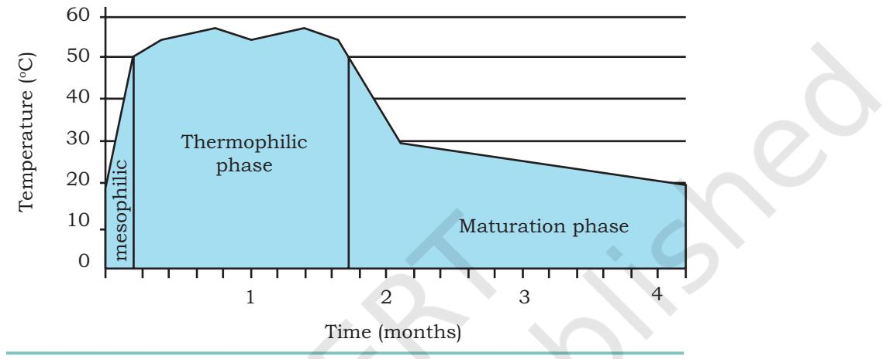

# **UNIT IV Bioremediation**

Chapter 11: Bioremediation

Rationalised 2023-24

Chapter 11_Bioremediation new correction.indd 257 06-02-2023 17:45:52

**Ananda Mohan Chakrabarty**  (4 April 1938 – 10 July 2020 )

Ananda M. Chakrabarty is an Indian American microbiologist, who is known for his work in developing genetically engineered organisms using plasmid transfer. In 1965, he earned his Ph.D. from the University of Calcutta and moved to the University of Illinois in United States for higher studies. He started to work with environmental microbiology with an aim to develop microbes for biodegradation. He specifically worked with *Pseudomonas sp*. and in 1971, developed a genetically engineered *Pseudomonas* strain that was capable of using oil as nutrient for its growth. He called these microbes as "multi-plasmid hydrocarbon-degrading *Pseudomonas*", which could digest most of the hydrocarbons found in oil spills. He was the first to get a patent for a recombinant microbe. Patenting living organisms was not available at that time and his efforts to patent a recombinant microbe landed in the Supreme Court in 1980. This famous trial "Diamond v. Chakrabarty" made it possible to patent microbes or higher organisms. Later, his research group has done pioneer work with cupredoxin (proteins) from *Pseudomonas* and its role for cancer biology.

Prof. Chakrabarty served as an expert on legal issues related to patents or intellectual property rights. In 2007, Indian government recognised his efforts and he was awarded with the Padma Shri.

Chapter 11_Bioremediation new correction.indd 258 06-02-2023 17:45:52

# **Chapter** 11 **Bioremediation**

Human activities at domestic, agricultural and industrial level have resulted in the entry of a large number of pollutants in air, water and soil resulting in an alarming situation in many areas across the world. Many of these untreated chemical toxicants and excess of fertilisers and pesticides used in agriculture are drained to various water bodies and poses threat to the ecosystem and its flora and fauna including human beings. It is very much desirable that such pollutants must be eliminated from the ecosystem. Recently, a good number of microorganisms have been reported to be capable of modifying and degrading such synthetic agrochemicals. In this chapter, we will discuss the management of wastes and pollutants by conventional approach as well as by using microorganisms and plants. Since living organisms (bios) are employed to remediate or solve the problem of damage caused by chemical toxicants, the process is often referred to as bioremediation.

## **11.1 WASTE WATER TREATMENT**

Waste water from a home, community or industry is collectively called sewage. Such wastes are very difficult

- *11.1 Wastewater Treatment*
- *11.2 Solid Waste Management*
- *11.3 Management and Disposal of Biomedical Waste*
- *11.4 Bioremediation of Pesticides*

Chapter 11_Bioremediation new correction.indd 259 06-02-2023 17:45:52

to be treated due to the presence of antiseptic, chemicals and its high oxygen demand. Almost all the industries (dairy, tannery, cannery, distillery, oil refinery, textile, coal and coke, synthetic rubber, steel, etc.) produce their own characteristic sewage. Some are readily treated while others are practically unamendable through biological treatment. An average individual in India produces 0.8 kg waste per day.

## **11.1.1 Composition of Sewage**

Sewage consists of human excreta, wash waters, industrial waste, agricultural wastes and wastes from livestock i.e., poultry, cattle, horse, etc. The bulk municipal sewage consists of approximately 99 percent water and 1% inorganic and organic matter in suspended and soluble forms. Lignocellulose, cellulose, proteins, fats and various inorganic particulate matter exist in suspended state, whereas sugars, fatty acids, alcohols, amino acids and inorganic ions constitute the soluble forms. The organic content of sewage is measured in terms of its oxygen equivalence by means of the biochemical or biological oxygen demand (BOD) test. BOD may be defined as the quantity of oxygen required during the stabilisation of

| Constituents(s) | Concentration (mg/L) | Concentration (mg/L) |
| --- | --- | --- |
|  | before treatment | after treatment |
| Suspended Solids (SS) | 100–750 | Upto 35 |
| Total Nitrogen | 20–80 | Upto 15 |
| Total Phosphorus | 05–20 | Upto 5 |
| Chlorides | 230–2700 | <250 |
| Grease and oil | 50–100 | <10 |
| Biochemical oxygen demand (BOD) | 100–300 | Upto 25 |
| Chemical oxygen demand (COD) | 600–900 | 75–100 |
| pH | 05–7.5 | 6.5–8.5 |
| Total coliform | 107–109 | Not detectable |

**Table 11.1: Composition of untreated and treated domestic sewage**

Chapter 11_Bioremediation new correction.indd 260 06-02-2023 17:45:52

decomposable organic matter and oxidisable inorganic matter by aerobic (oxidative) biological action. The efficiency of mechanical, chemical and biological treatment of sewage is based on the amount of BOD reduction. Table 11.1 shows the composition of an untreated and treated domestic sewage.

#### **Box 1: Biochemical Oxygen Demand (BOD)**

Biochemical Oxygen Demand is a measure that signifies the amount of oxygen dissolved in water required by different microorganisms present in it. BOD is, in a way, measurement of the oxidisable organic matter present in sewage. Higher BOD value signifies higher amount of oxidisable organic matter present and such a sewage is called strong, whereas weak sewage has comparatively less oxidisable matter. Entry of strong sewage in a water body leads to a quick consumption of dissolved oxygen. Fishes and other aquatic fauna die due to very low level of dissolved oxygen which ultimately decompose and increased level of organic matter ultimately makes water unsuitable for recreational purpose and unfit for drinking.

Measurement of BOD is done by dilution of a measured amount of sewage with water already saturated with oxygen followed by incubation of sewage and water mixture at 20°C simultaneously with a control, which is diluted water. After five days of incubation, the residual oxygen present in both the sewage sample and the control is measured. Difference in the level of oxygen is the expression of the capacity to consume oxygen by the sewage which is expressed in parts per million (ppm). However, for the purpose of estimation of BOD of a sewage sample (in which the organic load may be too high and dissolved oxygen is too low to be measured), the same is diluted with double distilled water. One litre of BOD free water (double distilled water) in a bottle is aerated for one hour by an aerator followed by adjusting the pH to 7.0 using buffer. BOD is calculated as follows:

$\text{BOD}(\text{O}_{2}\text{mg/L})=\frac{\text{D}_{1}-\text{D}_{2}\times100}{\text{\%}\text{dilution}}$ or $(\text{D}_{1}-\text{D}_{2})\times\text{D}_{\text{L}}$

D1 = Dissolved oxygen (DO) of sample before incubation

D2 = Dissolved oxygen (DO) of sample after incubation

| S.No. | Volume of Sample (mL) | Volume of Dilution Water added (mL) | Dilution Factor |
| --- | --- | --- | --- |
| 1 | 1000 | NIL | 1 |
| 2 | 500 | 500 | 2 |
| 3 | 200 | 800 | 5 |
| 4 | 100 | 900 | 10 |
| 5 | 50 | 950 | 20 |
| 6 | 20 | 980 | 50 |

#### **Calculation of Dilution factor**

**Bioremediation 261**

Chapter 11_Bioremediation new correction.indd 261 06-02-2023 17:45:53

Wastes disposed from the industries consist of detergents, antibiotics, paints, biocides, etc. The pulp and paper industries discharge cellulosic and inorganic chemicals. Therefore, sewage composition differs with the type of industrial effluents discharged into sewage systems.

A variety of microorganisms are present in sewage, for example, bacteria, fungi, protozoa, algae, nematodes, amoebae and viruses. The microbial population per millilitre of sewage may vary from a few lakhs to several millions. Bacteria occurring in sewage are mainly intestinal and soil inhabiting and their common types are *coliforms*, *streptococci*, *clostridia*, *micrococci*, *Broteus*, *pseudomonas*, and *lactobacilli*.

| Organism | Disease |
| --- | --- |
| Bacteria |  |
| Escherichia coli | Gastroenteritis |
| Salmonella typhi | Typhoid |
| Vibrio cholerae | Cholera |
| Shigela sp | Shigellosis |
| Viruses |  |
| Adenovirus | Respiratory diseases |
| Enteroviruses, Rotavirus | Gastroenteritis |
| Hepatitis A | Infectious hepatitis |
| Protozoa |  |
| Entamoeba histolytica | Amoebic dysentery |
| Giardia lamblia | Giardiasis |
| Balantidium coli | Balantidiasis |
| Helminths |  |
| Ascaris lumbricoides | Ascariasis |
| Schistosoma sp | Schistosomiasis |
| Fasciola hepatica | Fascioliasis |
| Taenia saginata | Taeniasis |

#### **Box 2: Common pathogenic organisms found in water (domestic waste water) and the respective diseases**

**262 Biotechnology XII**

Chapter 11_Bioremediation new correction.indd 262 06-02-2023 17:45:53

## **11.1.2 Waste water Disposal Plant**

Treatment of sewage water is essential before its disposal. If raw domestic or sanitary sewage is discharged without its biological and/or chemical treatment directly into water bodies, the water becomes a vector of diseases, available oxygen and other hydrogen acceptors in the water are soon used by the microorganisms living in the sewage and then foul smelling anaerobic processes start creating nuisance. Survival of fishes and other forms of higher aquatic life is also negatively affected leading to economic losses. Further, the water that receives the sewage becomes unfit for drinking or recreation purposes. The objective behind the sewage treatment is to kill pathogenic microorganisms, prevent anoxia, raise the pH to alkaline side, increase photosynthetic rate, reduce organic content, etc. For this, waste water is first routed to sewage disposal plants for treatment before it is discharged into the water bodies. The wastewater treatment plants are designed to carry out various steps namely, primary (physical or mechanical) treatment, secondary (biological) treatment, and tertiary (advanced) treatment. The steps involved in all types of treatments are shown in Fig. 11.1.

## **11.1.3 Primary or Physical Treatment**

In primary treatment, sewage is first subjected to physical (or mechanical) methods such as screening, passage of wastewater into grit chamber and sedimentation to remove its coarse solid materials. In screening, bulky foreign matter such as bottles, paper, wooden boxes, etc., are removed. The sewage is passed through grit chamber having filters of graded openings and then allowed to flow through sedimentation tanks or sedimentation basins. The sewage is held in these tanks usually from 2 to 10 hours. Coarse solid materials are concentrated in these tanks and collected from it. The particulate materials are now collectively called primary sludge which is removed for further processing. At this point, treatment efficiency ranges from 30 to 40 percent BOD removal. Following sedimentation, the sludge and liquid effluent are processed separately during secondary treatment.

**Bioremediation 263**

Chapter 11_Bioremediation new correction.indd 263 06-02-2023 17:45:53

*Fig. 11.1: Schematic representation of a modern municipal sewage treatment plant. (a) Primary (mechanical) treatment; (b) Secondary (biological) treatment; and (c) Tertiary (final) treatment*

Chapter 11_Bioremediation new correction.indd 264 06-02-2023 17:45:53

## **11.1.4 Secondary or Biological Treatment**

The main function of secondary treatment is to remove much of the suspended organic material through the following steps that remain in the effluent after primary treatment. All biological waste treatment depends on microbiological degradation activities (hydrolysis, oxidation, reduction) on decomposable nutrients in sewage. Decomposition and stabilisation of wastes may be accomplished either anaerobically or aerobically, depending on the choice of the engineer, and both methods depend on the characteristics and amount of waste being treated.

The aerobic secondary treatment includes activated sludge process, aerobic digestion of sludge by various filters (e.g., trickling filters) and oxidation ponds, while anaerobic secondary treatment is represented by anaerobic digestion of sludge. However, regardless of the process being, waste stabilisation occurs in a series of more or less discrete stages. During activated sludge process a large volume of compressed air is passed through sewage to maintain aerobic condition. Aerobic microbes, during the activated sludge process, break down the organic carbon, nitrogen and phosphorus into minerals. In aerobic phase all of the complex, putrescible and organic matters in sewage are eventually changed largely into oxidised inorganic materials, such as sulfates, phosphates, nitrates, CO2 and H2O, i.e., they are mineralised.

## **Activated sludge process**

Figure 11.2 explains the sludge process in which there is an aeration tank and a settling tank. The sludge that settles at the bottom of the second settling tank is called activated sludge because it bears a high density of bacteria that have become conditioned to the unique environment of the system. A part of activated sludge is piped to the sludge digester. The remaining part is recycled back to the aeration tank and second settling tank, where it in turn activates the inflowing deactivated effluent (Fig.11.2). In this process, plenty of oxygen is pumped into sewage tank and oxidation of sewage effluent is brought about by aerobic microorganisms which break down organic matter to CO2 and H2O. Now, the effluent is passed through a

Chapter 11_Bioremediation new correction.indd 265 06-02-2023 17:45:53

*Fig. 11.2: Activated sludge process under aerobic conditions*

sedimentation tank. Though about 90 percent of the organic matter of the effluent is digested *via* this process, the effluent still contains a considerable amount of nitrate and phosphate, etc. It is, therefore, not safe to discharge effluent at this stage into water bodies as both nitrate and phosphate can cause eutrophication. Now the effluent, which looks clear at this stage, is subjected to tertiary (final) treatment for further purification.

#### **Trickling filter**

Chapter 11_Bioremediation new correction.indd 266 06-02-2023 17:45:53

Rationalised 2023-24

**266 Biotechnology XII**

Another form of secondary treatment is trickling filter process in which the sewage, after primary treatment, is sprayed by the arms of a rotating sprinkler into a filter bed of graded mixture of crushed stones, gravel, clinker and slag (Fig. 11.3). Spraying saturates the effluent with oxygen. The bed surface and stones are coated with slimy film of microbes (bacteria, fungi, protozoa and algae) that have accumulated during the operation of filter. As the effluent seeps over, the aerobic microbes degrade the organic matter. However, the treated effluent collected at the bottom of the tank is passed to sedimentation tank and, like activated sludge process, the effluent follows

#### **Box 3: Eutrophication**

Excessive nutrients including nitrogenous and phosphorous compounds in water bodies due to sewage or run-off from agricultural fields favours the growth of photosynthetic microorganisms especially algae and phytoplankton. A rapid growth of algae in water bodies is called algal bloom. Such a phenomenon of excessive growth of photosynthetic microorganisms is referred to as Eutrophication. Eutrophication may occur either naturally or due to artificial means. Artificial or Anthropogenic eutrophication is caused by human activities, such as discharge of nitrate or phosphate containing industrial wastes, detergents, fertilisers, or sewage, into the water bodies. This excessive photosynthetic microorganisms growth on water surface prevents the entry of light and the submerged plants ultimately die. Algal population also releases toxins which are harmful for the aquatic flora. In a situation of exhaustion of nutrients and due to the presence of toxic substances, algal growth is drastically stunted leading to decomposition of algal biomass by heterotrophic microbes. Dissolved oxygen also gets depleted leading to the death of aquatic fauna including fishes.

Natural eutrophication on the other hand, refers to excessive enrichment of water bodies as a result of merging of nitrogen and phosphorus rich streams into the lake. As explained above, organic debris and silt gradually pile up making the lake shallower and warmer. The warm-water organisms suppress the growth of those who thrive in a cooler environment. The shallower lake basin is overgrown by marshy plants, followed by the crowding of large masses of floating plants. Finally, the lake may convert into land. The natural eutrophication process is very slow, whereas eutrophication due to anthropogenic activities is faster.

tertiary treatment. Primary treatment combined with secondary treatment can reduce BOD to about 90 percent, total nitrogen to about 50 per cent, total phosphorus to 30 percent and suspended matter to 90 percent.

*Fig. 11.3: Sketch of trickling filter process*

Chapter 11_Bioremediation new correction.indd 267 06-02-2023 17:45:53

## **Sewage Oxidation Ponds or Lagoons**

Oxidation ponds (or lagoons) are up to 5 feet deep shallow ponds designated to allow direct wind action and algal growth on the sewage effluent. The lagoon treatment process is usually recommended for only small communities in rural areas, where large acreages of land are available. Oxygenation of the wastewater is accomplished by natural means (e.g., wind action and photosynthetic action of algae) or by mechanical aeration. Efficient and properly operated lagoons are capable of reducing BOD by 75 to 95 percent or greater. Oxygen supplied from air and produced as a result of algal photosynthesis fulfils the BOD of sewage effluent and thus helps in maintaining aerobic condition in sewage effluent. In such condition, the aerobic microbes grow rapidly and digest organic matter. In view of conservation of ground water for domestic, industrial, irrigation and recreational purposes, oxidation ponds are receiving considerable attention in many arid areas.

## **Anaerobic Sludge Digestion**

Anaerobic waste treatment represents the use of anaerobic microorganisms to process waste material in the absence of oxygen. These microorganisms digest the complex organic material to grow and reproduce. The sludge collected after primary treatment of sewage is subjected to anaerobic (in absence of oxygen) digestion in a separate tank designed especially for the purpose. Since anaerobic condition prevails in this tank, the anaerobic microbes digest the organic matter by degrading them to soluble substances and gaseous products, such as methane (60–70%), CO2 (20–30%), H2S and small amounts of H2 and N2. This gas mixture can be used for operating power for the sewage plant or as a fuel. Anaerobic sludge digestion requires 30 to 40 days for complete digestion. Remaining sludge, after digestion, undergoes dewatering by air-drying on sand filter sludge beds, vacuum filtration, centrifugation and wet air oxidation prior to the final disposal. After dewatering, the sludge is pulverized, incinerated or sold as a fertiliser. The heating kills all pathogens. Milorganite is a good example of such fertiliser. Important constituents are

Chapter 11_Bioremediation new correction.indd 268 06-02-2023 17:45:53

**268 Biotechnology XII**

various soluble compounds of nitrogen, phosphorus and potassium—essential for plant growth.

## **11.1.5 Tertiary or Advanced Treatment**

Since the sewage-effluent treated during secondary treatment process still contains non-biodegradable organic pollutants (if the sewage contains industrial wastes) and mineral nutrients, particularly nitrogen and phosphorus salts, it is subjected to tertiary (or final) treatment for their removal. If not done, the sewage effluents containing nitrogen and phosphorus salts can cause serious eutrophication in aquatic ecosystems. Nonbiodegradable organic pollutants are normally removed by using activated carbon filters, whereas phosphorus and nitrogen salts are removed by chemical treatment. Phosphorus salts are precipitated by liming. Lime reacts with phosphorus inorganic compounds in the effluent to form insoluble calcium phosphate (Ca3(PO4) 2), which then settles to the bottom of the settling tank and is removed. Nitrogen is present mainly as ammonia and it is removed by volatilisation (vigorous aeration at elevated temperature) at high pH. Ammonia containing waste water is directed into a metal tower. As this water slowly flows downwards over a series of small plastic baffle plates, air is forced upwards through the effluent and removes the ammonia gas from the water. Carbon absorption is done to remove the dissolved organic compounds from the effluent. This is done by passing water through a tower packed with small particles of carbon. Dissolved organic matter sticks to the carbon particle, a process called carbon polishing.

These treatments result in a high-quality effluent which does not cause eutrophication. The final step of tertiary treatment is chlorination by using either sodium or calcium hypochlorite (NaOCl or CaOCl2), respectively or chlorine to disinfect the effluent. Now the effluent is a clean water but still it cannot be used as drinking water without the normal chemical treatment given to natural waters.

## **11.2 SOLID WASTE MANAGEMENT**

All non-liquid waste materials generated from households, streets, industrial, commercial and agricultural activities are called solid wastes.

Chapter 11_Bioremediation new correction.indd 269 06-02-2023 17:45:53

## **Sources and types of solid wastes**

Major sources of solid waste are households, agricultural fields, industries and mining, hotels and catering, roads and railways, hospitals and educational institutions, cultural centers and places of recreation and tourism, etc. (Table 11.2).

| Source | Typical waste generators | Type of solid waste |
| --- | --- | --- |
| Residential | Single and multifamily dwellings | Food waste, paper, cardboard, plastics, |
|  |  | glass, leather, yard waste, wood, glass, |
|  |  | metals, ashes, special waste (e.g., |
|  |  | bulky items, consumer electronics, |
|  |  | white good, batteries, oil, tires and |
|  |  | household hazardous waste) |
| Industrial | Light and heavy manufacturing, | Housekeeping waste, packaging, |
|  | fabrication, construction sites, | food waste, construction and |
|  | power and chemical plants | demolition materials, hazardous |
|  |  | waste, ashes, special waste |
| Commercial | Stores, hotels, restaurants, | Paper, cardboard, plastics, wood, |
|  | markets, office, buildings, etc. | food waste, glass, metals, special |
|  |  | waste, hazardous waste |
| Industrial | School, hospital, prisons, | Same as commercial |
|  | government offices |  |
| Construction | New construction site, road | Wood, steel, concrete, dirt, etc. |
| and demolition | repair, renovation site, |  |
|  | demolition of buildings |  |
| Municipal | Street cleaning, landscaping, | Street sweeping landscape and |
| services | parks, beaches, other | tree trimming, general wastes |
|  | recreational areas, water and | from park, beaches and other |
|  | waste water treatment plant | recreational areas, sludge. |
| Process | Heavy and light manufacturing | Industrial process wastes, scrap |
| (manufacturing | refineries, chemical plants, | materials, off specification |
| etc.) | power plants, mineral | products, slay, tailings |
|  | extraction and processing |  |
| Agriculture | Crop, orchards, vineyards, | Spoiled food wastes, agricultural waste, |
|  | dairies, food lots, farm | hazardous wastes (e.g., pesticides) |

#### **Table 11.2: Major sources and types of solid wastes**

As we know that some of the solid materials like wood or paper, when left in nature, are slowly broken down into inorganic components, whereas plastic and polythene bags

Chapter 11_Bioremediation new correction.indd 270 06-02-2023 17:45:53

are not degraded. Based on this property, solid wastes can be categorised into two groups: (i) biodegradable waste and (ii) non-biodegradable waste. The biodegradable wastes are generated from agricultural sector and households. Different types of bacteria, earthworm, etc., utilise these materials to form soil and organic manure. The nonbiodegradable wastes generally consists of plastic, such as plastic bags, old clothes, polyesters, broken glass, chemicals and metals, etc., which cannot be absorbed by soil. Microorganisms cannot use such wastes for decomposition.

## **11.2.1 Risks of solid waste**

Decomposing organic waste attracts animals, vermins and flies. Flies play a major role in the transmission of faecaloral diseases, particularly in case of domestic waste faeces. Rodents may increase the transmission of diseases and also attracts snakes. Solid waste can also provide breeding sites for mosquitoes and flies which are carriers of many life-threatening diseases. For example, mosquitoes of *Aedes* genus spreads dengue and yellow fever; *Anopheles* genus of mosquitoes transmits malaria; and mosquitoes of *Culex* genus transmit microfilariasis. Number of recent episodes relating to the spread of a disease in cities are linked to an unconcerned approach towards handling of solid waste problems. Improper management of solid wastes may lead to diseases, like plague and dengue. This illustrates the importance of solid waste management in our lives in order to have a cleaner environment.

Various types of wastes like cans, pesticides, cleaning solvents, batteries (zinc, lead or mercury), radioactive materials, plastics and electronic waste are mixed up with paper, scraps and other non-toxic materials which could be recycled. Burning of some of these materials produce carcinogens and other toxins. Poor management of collection and disposal of solid waste may lead to leachate pollution of surface and ground water. This may cause a significant problem if the waste contains toxic substances and disposed near the source of drinking supplies. Unhygienic and polluted environment affect the health of people living in the area negatively.

Chapter 11_Bioremediation new correction.indd 271 06-02-2023 17:45:53

#### **Box 4**

- 1. Spread of plague episode in Surat (Gujarat) has been associated with the mishandling of solid waste disposal at city level.
- 2. Spread of dengue fever in Delhi is linked with the widespread stagnant water in different forms— water cooler, open sewage, badly kept drains, etc.

## Identification of the types of waste Identification of the sources of waste Determination of the potential health hazards from waste Determination of the volume of the waste Identification of safe collection Identification of safe transportation Identification of safe disposal *Fig.11.4: Stages of solid waste management*

**272 Biotechnology XII**

### **11.2.2 Solid waste management**

Solid waste management refers to collecting, treating, and disposing off solid material that is discarded or is

> no longer useful. Solid waste management is an important aspect of urban area management. Improper disposal of municipal solid waste can create unsanitary conditions, which can lead to environmental pollution and the outbreak of vectorborne diseases. It is the discipline associated with the control of generation, collection, storage, transfer and transport, processing and disposal of solid wastes in a manner that is in accord with the best principles of public health, economics, engineering, conservation, aesthetics and other environmental considerations.

> The task of solid waste management presents complex technical challenges. They also pose various economic, administrative and social problems which need urgent attention.

#### Strategies for solid waste management

Strategies for solid waste management can be presented broadly as shown in Fig. 11.4. The handling and managing of solid waste involves two approaches: (i) dumping the waste and (ii) recycling the waste. These two steps are of significance in managing the overall burden of the solid waste.

In order to establish effective solid waste management in the affected area, the given process should be used:

#### Sorting and management of solid waste

To maximise the role of recycling of solid wastes it is essential to sort the waste at the waste generating point in different categories to facilitate the recycling

Chapter 11_Bioremediation new correction.indd 272 06-02-2023 17:45:53

in practice easy. Recycling of solid waste can be achieved under the following heads. Organic waste can be recycled through the process of composting. Fruits and vegetables waste, animal dung, fallen leaves from plants form excellent soil conditioner and fertiliser (compost). Implantation to make compost at home level can be achieved by using a suitable container. The contents of the container after a few weeks can be used as fertiliser. Vegetable waste and dried weeds can be chopped and compressed into small bricks and sun dried. Like dried cow dung, they can be used to replace charcoal or wood as cooking fuel. Glass and plastic waste can be reused in plastic and glass industries to reproduce wares for reuse. The task of collecting these waste items under different heads makes the recycling task more efficient and convenient.

Construction debris and other waste building material can also be reused. Often the construction of new house or building involves razing old structures. The debris produced in this manner can be very effectively used as filling material under floors.

Used tyres can be recycled by establishing appropriate recycling units. In the absence of this facility, it is advisable to bury them to avoid collection of water during rainy season which encourages mosquito breeding. Burning of tyres has to be compulsorily avoided as the process leads to the emission of toxic fumes.

### Solid waste management at community level

Some household items cannot be degraded at home level and their storage can cause space problem. Plastics, bones, metals, used batteries, broken glass, etc., falls in this class. A common facility made at community makes the subsequent processing easier, once the solid waste is sorted.

Community refuse pit dug near the community dwelling units can be used to fill the refuse which cannot be handled at home level. The site chosen to perform this function should be located away from water source to avoid any leaching of waste into the water. The surroundings of the pit should be fenced to prevent animals from intruding into the refuse pit. Collection of waste at community level can be organised by employing the service of trained persons who are aware to take adequate precautions while handling

Chapter 11_Bioremediation new correction.indd 273 06-02-2023 17:45:53

waste. The waste collected at community collection site should be taken to a designated city disposal site as and when the need is felt.

## Managing special solid wastes

Some solid waste needs expert handling by using special equipment to protect the handler. Solid waste under this class falls in the following categories.

## Medical solid waste

Healthcare solid waste is generated both at medical facilities and some routine activities at home and hospitals. The waste often contains infectious pathogens. Also, use of medical solid wastes (like masks, gloves, PPE kits, syringes and needles, etc.) increase significantly during pandemic/ epidemic. Therefore, high risk medical solid wastes must be separated as per guidelines and incinerated. The handler of the waste needs to take all precautions (wearing mask and gloves) while handling. In the absence of incinerator (such as at home), the waste should be treated with strong disinfectant. Sharp needles and glassware used at health facility should be disinfected. Used needles should be destroyed to prevent their reuse.

## Slaughterhouse waste

Slaughterhouse waste consists of decaying animal carcasses, blood, fecal matter, hair and bones. Collection of such wastes should be handled by trained staff at specific sites meant to handle this kind of waste. The functioning and maintenance of the facility should comply with health standards and the community should ensure regular inspection of the sites by the authorities concerned for a proper disposal.

## Industrial solid waste

Industrial solid waste can be of different kinds and the main concern associated with industrial waste is the proper disposal of chemical, biological and toxic metals. In general, the processing of waste from industrial units is handled by the respective industry itself as per the environmental rules and regulations.

Chapter 11_Bioremediation new correction.indd 274 06-02-2023 17:45:53

## Disposal of toxic chemicals

Disposal of toxic chemicals should be done according to the manufacturer's guidance, in case of doubt as to how to dispose specific toxic chemicals, local health and environment officials should be contacted.

## Composting, vermiculture and methane production

Composting is the most powerful biological, chemical and physical activity, available in natural environment, where organisms under suitable conditions carry out biological degradation of material, considered waste from humans point of view. Organisms including microorganisms break down organic waste and produce carbon dioxide, water, heat and humus. The process stands out as the most powerful environmental tool by which a large variety of complex molecules, after degradation, can be recycled and reutilised. Composting concept has been successfully exploited by humans to degrade the toxic and persistent compounds present in water/soil.

## Mechanism and procedure of composting

The waste material subsequent to its proper sorting of degradable material, after grinding, is mixed with water and sewage sludge containing organisms. To maintain the efficient digestion of waste material, suitable environment (such as optimum moisture content 45–65%) for optimum growth and activity of organisms is needed. Composting methods are either aerobic or anaerobic. Aerobic process requires enough oxygen availability within the compost heap or compost pit. The design and size of the composting pit ensures the maximum efficiency of degradation. Under optimal conditions, composting proceeds through three phases: (i) the **mesophilic**, or moderate-temperature phase, which lasts for a couple of days, (ii) the **thermophilic**, or high-temperature phase, which can last from a few days to several months, and finally (iii) a several-months cooling and **maturation phase** (Fig.11.5).

As composting proceeds, temperature changes, correspond to the dominance of specific communities of microorganisms at work. Mesophilic phase involves rapid breakdown of the soluble, readily degradable compounds

Chapter 11_Bioremediation new correction.indd 275 06-02-2023 17:45:54

by mesophilic class of microorganisms. Degradation activity accompanies heat production and rapid rise in the compost temperature. As temperature rises above 40ºC, the mesophilic microorganisms are competed out by thermophilic class of microorganisms which are able to withstand higher temperature. At temperature of 55ºC and above, many pathogenic microorganisms are destroyed and this limits the rate of decomposition. To ensure

*Fig. 11.5: Temperature changes during composting*

aeration and lower temperature (<65ºC), the compost pit is designed to allow passage of air which mixes the compost intermittently. During thermophilic phase, high temperature accelerates the degradation of protein, fats and complex carbohydrates, such as cellulose and hemicelluloses, the major structural components of plants. Once the supply of these compounds gets exhausted, the compost temperature gradually decreases and mesophilic phase again takes over for the final phase of 'curing' or maturation of the remaining organic matter.

#### Organisms involved in composting process

Diverse communities of microorganisms (both unicellular and multicellular) play their role at different stages of composting. Constant change in the microenvironment around the community of organisms provide selective advantage to those organisms who can survive best at a given time. Bacteria make up 80–90% of the billions of microorganisms found in a gram of compost. At highest compost temperature, bacteria of the genus *Thermus* are

Chapter 11_Bioremediation new correction.indd 276 06-02-2023 17:45:54

**276 Biotechnology XII**

isolated. Actinomycetes are filamentous type of bacteria and play an important role in degrading lignin, cellulose, chitin and proteins. Special class of enzymes present in these bacteria are capable of degrading debris, such as woody stems, bark, or newspaper and cardboard boxes, etc.

Fungi represent a class of organisms that also consists of molds and yeast. It can decompose many complex polymer waste material present in the soil or compost. Most fungi live in the outer layer of the compost and are present during all phases of temperature change during the process of composting.

Protozoans are single-celled microscopic animals found in water droplets trapped in compost matrix. Their role in composting is that of a secondary consumer and sustain on organic material, bacteria and fungi. In addition to above, compost also has the presence of a large variety of insects, mites, snow bugs, ants, earthworms and other types of worms. Vermiculture and methane emission are a part of the process of composting. Presence of worms in the compost or soil is an indication of the fertility of the soil in terms of the availability of nutrients essential for the growth of the plants. Composting, in essence, represents a natural way of regenerating soil fertility by utilising the waste produced in the environment by humans.

## **11.3 MANAGEMENT AND DISPOSAL OF BIOMEDICAL WASTE**

'Biomedical waste can be defined as any waste generated during the diagnosis, treatment or immunisation of human beings or animals or research activities pertaining thereto or in the production or testing of biological or in health camps'. Government has made guidelines for handling of biomedical waste which are provided under Biomedical Waste Management Rules (BMWM), 2016, The Biomedical Waste Management Rules, 2016, categorises the biomedical waste into four major categories based on the segregation pathway and standard colour code that has been assigned for the containers in which these are to be segregated, these are yellow, red, white and blue (Table 11.3).

Chapter 11_Bioremediation new correction.indd 277 06-02-2023 17:45:54

| S. No. | Category | Type of Waste |
| --- | --- | --- |
| 1. | Yellow | (a) Anatomical Waste |
|  |  | • Human tissues, body parts and fetus below the viability period |
|  |  | • Animal carcasses, tissues, organs, body parts, animal houses |
|  |  | (b) Soiled waste, items contaminated with body fluids, blood, cotton swabs, |
|  |  | discarded old and blood components. |
|  |  | (c) Discarded or expired medicines like antibiotics, cytotoxic drugs along |
|  |  | with glass or plastic ampoules, vials, etc. |
|  |  | (d) Chemical waste like disinfectants, chemical used in the production |
|  |  | of biologicals, insecticides, discarded solvents and reagents used for |
|  |  | laboratory preparations, heavy metals (broken thermometer), batteries, |
|  |  | etc. |
|  |  | (e) Beddings contaminated with blood or body fluids, discarded linen, |
|  |  | mattresses, mask and gown. |
|  |  | (f) Microbiology, biotechnology and other clinical laboratory waste, like |
|  |  | blood bags, specimens, human and animal cultures used in research, |
|  |  | residual toxins, dishes and devices used for culture. |
| 2. | Red | Contaminated plastic waste: waste generated from disposable items like |
|  |  | intravenous tubes, bottles, catheters, syringes without needles, fixed |
|  |  | needle syringes with their needles cut, urine bags, vaccutainers and gloves. |
| 3. | White | Sharps including metals; used, discarded and contaminated metal sharps, |
|  |  | needles, syringes with fixed needles, needles from needle tip cutter, blades, |
|  |  | scalpels or any other contaminated sharp object that may cause puncture |
|  |  | and cuts. |
| 4. | Blue | Metallic body implants, broken or discarded and contaminated glass; |
|  |  | medicine vials ampoules |

**Table 11.3: Details of colour code and types of waste**

Biomedical wastes are also classified on the basis of risk factors involved as per WHO guidelines. These are:

- **• Risk Group 1** is comprised of no or low individual and community risk. For example, a microorganism that is unlikely to cause human or animal disease.
- **• Risk Group 2** categorises the condition of moderate individual risk and low community risk. Pathogen that causes human or animal disease and is likely to be a serious hazard to laboratory workers, the community, livestock or the environment. Laboratory exposures may cause serious infection, but effective treatment and preventive measures are available and the risk of spread of infection is limited.

Chapter 11_Bioremediation new correction.indd 278 06-02-2023 17:45:54

**278 Biotechnology XII**

- **• Risk Group 3** classifies high individual risk and low community risk condition. A pathogen that usually causes serious human or animal disease but does not ordinarily spread from one infected individual to another. Effective treatment and preventive measures are available.
- **• Risk Group 4** is a group with high individual as well as community risk. In this group, the risk is due to pathogens that usually cause serious human or animal disease and that can be readily transmitted from one individual to another, directly or indirectly. Effective treatment and preventive measures are not usually available.

As we know, the biomedical wastes generated in healthcare facilities, diagnostic laboratories, biotechnology laboratories and institutions, medical research centres, veterinary institutes, mortuary and autopsy centres, and blood banks — are in large amount and highly infectious to human health, animals, living organisms and environment. It is the responsibility of the health care provider to segregate these biomedical wastes appropriately, and it is also important to segregate waste at the point of its generation from handling point of view. The containers, bins, bags, sharp boxes should be available in each health care facility, laboratories, medicals, etc. Trained staff is needed to segregate the waste. General information, posters, proper instructions regarding proper disposal of waste must be placed near dustbins, bags, containers, etc.

In health care facility, the treatment and disposal for biomedical waste is done by **Common Biomedical Waste Treatment Facility (CBWTF)**, which is available within 75 kms of travelling distance of the facility. All the public health care facilities within the reach of 75 kms of CBWTF need to dispose of their biomedical waste (BMW) through it. No health care facility is allowed to establish their own treatment and disposal facility.

Furthermore, the treatment and disposal of biomedical waste must be carried out as per the guidelines of Biomedical Waste Managment Rules, 2016.

Chapter 11_Bioremediation new correction.indd 279 06-02-2023 17:45:54

#### **Box 5**

#### **WHO recommended segregation and collection scheme**

| Waste | Colour of Container | Type of Container | Collection |
| --- | --- | --- | --- |
| Categories | and Markings |  | Frequency |
| Infectious waste | Yellow with biohazard | Leak-proof strong | When three |
|  | symbol, highly | non-chlorinated plastic | quarters filled or at |
|  | infectious waste | bag placed in a container | least once a day. |
|  | should be additionally | (bags for highly infectious |  |
|  | marked 'HIGHLY | waste should be capable |  |
|  | INFECTIOUS' | of being autoclaved) |  |
| Sharp waste | Yellow, marked | Puncture-proof container | When filled to |
|  | SHARPS with |  | the line or three |
|  | biohazard symbol. |  | quarters filled. |
| Pathological | Yellow with | Leak-proof strong plastic | When three |
| waste | biohazard symbol. | bag placed in a container. | quarters filled or at |
|  |  |  | least once a day. |
| Chemical and | Brown, labeled | Plastic bag or | On demand |
| pharmaceutical | with an appropriate | rigid container |  |
| waste | hazard symbol |  |  |
| Radioactive | Labeled with | Lead box | On demand |
| waste | radiation symbol |  |  |
| General health | Black | Plastic bag inside | When three |
| care waste |  | a container or | quarters filled or at |
|  |  | container which is | least once a day. |
|  |  | disinfected after use. |  |

In rural areas where CBWTF is not available, the health care facility centres should dispose BMW in captive treatment or deep burial pit as authorised by State Pollution Control Board (SPCB) or according to Biomedical Waste Management Rules, 2016.

#### **Box 6**

#### **Mayapuri Radiological Accident**

In April 2010, scrap market of Mayapuri area in Delhi was affected by a serious radiological accident in which public radiation exposure was reported. In this accident, the source of radioactive unit containing Gamma unit having Cobalt-60 pencils were sold at auction to a scrap metal dealer in Mayapuri on February 2010. It was dismantled by workers without knowing its consequences. The cobalt-60 source was cut into eleven pieces. Eight people were hospitalised in AIIMS as a result of radiation exposure, where one later died.

**280 Biotechnology XII**

Chapter 11_Bioremediation new correction.indd 280 06-02-2023 17:45:54

The segregation, treatment and disposal options for all the four categories of biomedical wastes (refer Table 11.3) are detailed below:

#### **Yellow category**

Yellow category wastes are mainly generated in health care facilities like hospitals, diagnostics and other microbiology and biotechnology laboratories, industries producing hazardous substances, effluent treatment plant, etc. These wastes should be stored properly in yellow colour containers. In case of waste being cytotoxic drugs or hazardous chemicals, the same should also be specified on the container. These wastes should be handed over to CBWTF in yellow colour non-chlorinated plastic bags for its final disposal through incineration.

#### **Red category**

Red category waste is contaminated recyclable plastic waste: waste generated from disposable items like intravenous tubes, bottles, catheters, syringes without needles, syringes after removing and cutting the needle. All the waste is collected in red coloured non-chlorinated plastic bag and stored in red coloured container. Fixed needle syringes with their needles cut, urine bags, vacutainers or vials with blood sample should be pre-treated with disinfectant (autoclave, microwave, hydroclave, ozone gas, lime based powders or solutions) and collected in red coloured non-chlorinated plastic bag and stored in red coloured container and sent to CBWTF for final treatment and disposal. In case CBWTF is not available, the recyclable waste must be sterilised through autoclave, microwave or hydroclave followed by shredding or mutilation.

#### **White category**

White category waste includes sharp metals, used, discarded and contaminated metal sharps, needles, syringes with fixed needles, needles from needle tip cutter, blades, scalpels or any other contaminated sharp object that may cause puncture and cuts. Waste is then collected in white translucent, puncture proof, leak proof and tamper proof container and handed over to CBWTF. If health care facilities have their own treatment and disposal facility then the waste should be disinfected through autoclaving,

Chapter 11_Bioremediation new correction.indd 281 06-02-2023 17:45:54

dry-heat sterilisation or a combination of autoclaving cum shredding then final disposal to concrete pit, sanitary landfill or steel foundry.

#### **Blue category**

Blue category waste contains metallic body implants, these should be collected in blue puncture proof, leak proof boxes or container with blue coloured marking and handed over to CBWTF. Where CBWTF is not available, the metallic body implants should be disinfected (by autoclaving, microwaving, hydroclaving or through sodium hypochlorite treatment) and later washed with detergent before sending or selling to metal recycler.

The broken or discarded and contaminated glass, medicine vials ampoules, glass slides, pipettes, petridishes are collected in blue puncture proof, leak proof boxes or container with blue coloured marking and handed over to CBWTF. Where CBWTF is not available the glass waste has to be sterilised or disinfected as described above followed by soaking and washing with detergent before sending it for recycling or can be disposed in sharp pit.

## **MANAGEMENT AND DISPOSAL OF RADIOACTIVE WASTE**

The Atomic Energy Regulatory Board (AERB) has been mandated by the Government of India to be the competent authority as per Atomic Energy (safe Disposal of Radioactive Wastes) Rules, 1987. The radioactive waste should be disposed according to guidelines issued as per the provisions of the said rules.

- 1. Atomic Energy (safe Disposal of Radioactive Wastes) Rules, 1987: https://www.aerb.gov.in/images/ PDF/AE(SDRW)Rules%201987.pdf
- 2. Radiation protection rule: https://dae.nic.in/ writereaddata/RPR2004.pdf

## **11.4 BIOREMEDIATION OF PESTICIDES**

Pesticides are the categories of diverse chemicals that are used either for protecting the standing crop or stored food grains from different types of pests like insects, rodents, weeds, bacteria, larvae of worms and even fungi. Broadly, chemical pesticides can be categorised into organochlorine,

**282 Biotechnology XII**

Chapter 11_Bioremediation new correction.indd 282 06-02-2023 17:45:54

organophosphorus, organometallic, synthetic pyrethroids, carbamates, etc., which vary in their properties (Table 11.4).

| Type of | Chemical | Effects on animals | Example | Persistency |
| --- | --- | --- | --- | --- |
| pesticide | Nature |  |  |  |
| Organochlorine | Organic | Nervous system | DDT, Lindane, | Very long |
|  | compound with | disrupter, Toxic | Endosulfan, |  |
|  | chlorine atom, |  | Aldrin, Dialdrin, |  |
|  | Lipid soluble |  | Atrazine |  |
|  |  |  | (herbicide) |  |
| Organophosphate | Organic | Nervous system | Parathion, | Less persistent |
|  | compound | disrupter (inhibits | Malathion, |  |
|  | with phosphate | cholinesterase | Dimecron, |  |
|  | group as basic | activity), | Diazinon |  |
|  | structure | highly toxic |  |  |
| Carbamates | Derivate of | Nervous system | Carbaryl, | Less persistent |
|  | Carbamic acid | disrupter (inhibits | Carbofuran, IPC |  |
|  |  | cholinesterase |  |  |
|  |  | activity), |  |  |
|  |  | highly toxic |  |  |
| Pyrethroids | Synthetic | Nervous system | Cypermethrin, | Usually |
|  | analogues of | disrupter | Deltamethrin | degraded by |
|  | pyrethrum plant |  |  | sunlight in a |
|  |  |  |  | few days. Less |
|  |  |  |  | persistent in |
|  |  |  |  | soil (few days) |
| Organometallic | Synthetic | Can be absorbed | Methylmercury | Very long |
|  | organic | through skin, GI |  |  |
|  | compound with | tract and through |  |  |
|  | heavy metal | respiration, toxic |  |  |
| Inorganic | Metal or non | Coagulation of | Arsenic, Mercury, | Very long |
| Pesticides | metal and its | protein, affect | Cadmium, |  |
|  | compound | the central | Sulphur |  |
|  |  | nervous system |  |  |
|  |  | and functioning |  |  |
|  |  | of enzyme |  |  |

| Table 11.4: Various types of pesticides along with their properties |
| --- |

Use of these agrochemicals was also one of the key contributors in the success of green revolution during late sixties which made our country self-sufficient for food.

Let us briefly understand the nature of different types of pesticides. DDT (an organochlorinous pesticide) was

Chapter 11_Bioremediation new correction.indd 283 06-02-2023 17:45:54

#### **Box 7: The first pesticide**

**284 Biotechnology XII**

Dichlorodiphenyltrichloroethane (DDT) was the first ever pesticide synthesized in the laboratory, which is an organochlorine compound. Considering the efficacy in killing insects, including mosquitos, it was considered initially as a solution to the problem of insects and other categories of pests. Subsequently, a large number of other chemicals having the potential to kill insects and other pests quite efficiently were synthesized and its usage in agricultural practices became quite prevalent.

> initially found to be a miraculous solution to the spread of malaria as it proved to be highly effective and useful in the control of *Anopheles* mosquito. Later, resistance to DDT pesticides was noted among the target organism, rendering them ineffective on the one side, and their use was found to be harmful to non-target species. Owing to their hydrophobic nature and lipid solubility, these chlorinated organic compounds have also been found to be non-biodegradable.

> Organophosphate pesticides have phosphate group and they are acutely toxic due to their ability to inhibit cholinesterase resulting into accumulation of neurotransmitter acetylcholine across synapse during neuronal transmission. Excess of such organophosphates in their residual forms may turn out to be more harmful than the original one and therefore their excessive usage may be harmful in the long run.

> Carbamate and synthetic pyrethroids pesticides get easily hydrolysed and degraded. Organochlorine and organometallic pesticides may persist long in the environment and owing to their solubility in lipid, they may also remain present even in the body of non-target organisms i.e., organisms other than insects and pests including human beings.

> These excessive agrochemicals, either in their original or metabolised forms, may also enter into plants and ultimately in different organisms of the trophic levels including human beings by the process called **biomagnification**. Quite significant levels of such agrochemicals have been found to be present in the tissues of many organisms besides being accumulated in soil and water.

> Therefore, the removal of such a long-lasting toxic compounds from soil and water bodies is extremely crucial

Chapter 11_Bioremediation new correction.indd 284 06-02-2023 17:45:54

for ecosystem and the health of non-target organisms including human beings even if it is present in residual amount.

## **Bioremediation of pesticides using microorganisms**

Considering the persistency of pesticides or its residues, either the removal or altering the toxic nature is extremely crucial and essential in minimising its adverse effects in humans, other non-target organisms and the ecosystem. Bioremediation is thus a process through which such toxic pesticides can be removed completely or its chemical nature can be altered, so as to have no or less adverse impact on the environment. In the process of bioremediation, the ability of microorganisms to degrade or alter the toxic nature of chemical pesticides into non-toxic substances is exploited. There are quite a good number of microorganisms capable of wide spectrum metabolism. These may be bacteria, fungi, algae and other microbial strains. Many microorganisms are known to utilise chemicals to derive energy on one hand and possess enzymes capable of degrading such pesticides on the other hand. Enzymatic reaction that is important from the perspective of degrading pesticides or other toxic chemicals are mainly catalysed by cytochrome P450, esterases, oxidases, peroxidases, transferases, etc. Role of these enzymes in the process of degradation reaction has been given briefly in Table 11.5. The process of transformation or degradation of pesticides is complex and

| Enzyme | Function | Role in Bioremediation |
| --- | --- | --- |
| Cytochrome | Oxidation and | Oxidative breakdown of the pesticide or |
| P450 | reduction reaction | any xenobiotic (synthetic) compound |
| Esterase | Hydrolysis reaction | Hydrolytic breakdown of organophosphate |
|  |  | or carbamate pesticide |
| Oxidase | Redox reactions | Oxidation reduction reaction |
| Peroxidase | Redox reaction | Oxidative degradation of |
|  |  | organometallic compounds |
| Transferase | Transfer of glutathione | Transfer of glutathione to some electrophilic |
|  | group, hydrolytic and | pesticides and also its oxidative degradation |
|  | redox reaction |  |

#### **Table 11.5: Enzymes and their role in Pesticide Bioremediation**

**Bioremediation 285**

Chapter 11_Bioremediation new correction.indd 285 06-02-2023 17:45:54

may involve enzymatic reactions like oxidation, reduction, hydrolysis, transfer of groups and formation of conjugate with sugar or amino acid making it less toxic and water soluble.

*Examples of (a) Organochlorine, (b) Organophosphate, (c) Carbamate and (d) Synthetic pyrethroids*

A number of microorganisms have been identified with the potential to bioremediate a number of toxic substances e.g., *Pseudomonas*, *Aerobactor*, *Acinetobacter*, *Plesiomonas*, *Neisseria*, *Sphingomonas*, *Flavobacteriaum,* etc. The whole process of bioremediation of any persistent chemical present in the system also depends on physicochemical conditions like pH, temperature, water, availability of oxygen and substrate, etc., of the environment on one hand and varieties of soil and water microflora present on the other hand. Simultaneous use of a conglomerate of such microorganisms for biodegradation or bioremediation of toxic chemicals has also been observed to yield a better result.

## **Strategies for bioremediation**

Bioremediation of toxic substances may take place naturally or it may be maneuvered using specific type

Chapter 11_Bioremediation new correction.indd 286 06-02-2023 17:45:54

Chapter 11_Bioremediation new correction.indd 287 06-02-2023 17:45:54

**Bioremediation 287**

#### **Box 10: Superbug and Bioremediation**

The presence of hydrocarbon degrading genes on plasmids of four different strains *Pseudomonas*  was successfully exploited by an India born US scientist Anand Mohan Chakrabarty (4 April 1938 –10 July 2020) and these genes were inserted using rDNA technology into one strain of *Pseudomonas putida* which is capable of degrading camphor, naphthalene, octane and xylene. Creation of this superbug by rDNA technology is shown in the Figure below. This breakthrough was recognised by the award of a US patent.

of microorganisms and other strategies. We have already understood earlier that microorganisms are either already present in the soil/water or introduced and has the potential to either degrade or remediate the toxic substances in to non-toxic substances or elements. Such an onsite remediation strategy is referred to as *in situ* bioremediation. There are many instances in which *in situ* bioremediation strategies have been adopted to clean-up petroleum spillage and for restoration of degraded ecosystem due to excessive mining or accumulation of toxic substances including pesticides. It is possible that some of the toxic substances

Chapter 11_Bioremediation new correction.indd 288 06-02-2023 17:45:54

**288 Biotechnology XII**

are degraded or remediated into non-toxic ones by microorganisms naturally present in the system in the course of time. This situation is referred to as intrinsic *in situ* bioremediation. However, such an intrinsic mechanism of bioremediation is dependent on many factors, like type and population of microorganisms, soil type, availability of nutrients and other substances that support growth. Undoubtedly, such an intrinsic pathway of *in situ* bioremediation mechanism involves very less disruption of the contaminated site with low public exposure and is cost effective. However, this process not only takes comparatively long time but it has also been found that complete bioremediation of the toxic substances is not achieved through this process. In order to address these difficulties in the *in situ* bioremediation process, it is possible to adopt a strategy to encourage microbial growth in an area selected for bioremediation. For this, oxygen, nitrogen and other growth-promoting substances are circulated in the contaminated soil through injection and extraction wells created for the purpose (Fig. 11.7). Obviously, oxygen will serve the purpose of electron acceptor (which is produced during the process of being converted into water by the toxicant called electron donor). Such a process in which the microbial growth is promoted externally in the contaminated soil or water for *in situ* bioremediation of toxicants is referred to as engineered *in situ* bioremediation.

*Fig. 11.7:* In Situ *bioremediation*

Chapter 11_Bioremediation new correction.indd 289 06-02-2023 17:45:55

For the purpose of bioremediation, another technique can also be adopted in which the contaminated soil is physically taken away and treated separately for the removal or biodegradation of toxicants present in it. This is normally done for a very heavily contaminated soil. There are various strategies adopted for the purpose as described below:

*Slurry bioreactors:* In such bioreactors, the contaminated solid or soil is agitated vigorously in the presence of water and nutrients capable of enhancing the ability of microbes present in soil to degrade the toxicant. In these bioreactors, factors like temperature, nutrient, mixing process can be easily regulated to achieve optimal result. Mobile slurry bioreactors are also available so that the bioremediation of contaminated soil can be done very close to the contaminated site. However, excavation of contaminated soil is a challenge and a potential health concern for workers, if proper care is not taken. In case, the soil contains very high concentration of free phase toxicant, then the same may also be toxic to the microorganisms responsible for bioremediation in the reactor. Besides drying of soil after the treatment, proper disposal of untreated waste water from the bioreactor is another challenge.

*Land Farming:* In this process, the contaminated soil is spread over an already prepared bed after its excavation from the contaminated site. Nutrient, moisture and other conditions for an optimal microbial growth are applied to bed of the land farming site to facilitate bioremediation process.

*Composting:* It is an aerobic process of biodegradation of the contaminants present in moist and porous soil by microorganisms. In such a composting process, the role of microorganisms is significant. In this process, the contaminated soil is mixed with agricultural wastes of organic substances like stray or corncobs to enable optimal supply of air and water for bioremediation process. Excavation and transport of contaminated soil for composting is a challenge from the point of view of exposure of contaminants to labourers.

*Biopiles:* This is a process in which the contaminated soil is excavated and mixed with leachate materials capable of degrading and draining out the toxic substances present in it.

Chapter 11_Bioremediation new correction.indd 290 06-02-2023 17:45:55

**290 Biotechnology XII**

#### **Box 11**

#### **Oilzapper: A solution for oil spills and treatment of oily sludge**

Oil spill incidents are global phenomena posing a serious threat to the ecosystem and its flora and fauna. Exploration, production, transportation, storage and refining processes of petroleum may accidently lead to oil spill in soil or water bodies causing hydrocarbon pollution. Physical (storing of oil sludge and drill cutting in secured pits) and chemical methods of remediation of these hydrocarbons are expensive as well as non-environment friendly. The Energy and Resource Institute (TERI) with the support of Department of Biotechnology, Government of India, came out with its invention called 'Oilzapper', which can zap the spilled petroleum oil using a consortium of five non-pathogenic bacterial strains. These bacteria can biodegrade different fractions of oil like aliphatic, aromatic and asphalting compound of oil sludge or crude oil. In this cost effective technology, Oilzapper is immobilised onto a carrier material which is powdered corncob, for its application in oil contaminated environment. TERI has developed fermentation facility of different capacities ranging from 15000 litres, 1500 litres, 300 litres to 20 and 10 litres

for large scale production of Oilzapper. 'Oilzapper' have been successfully used by various oil companies across India as well as abroad. Considering the wide scale implication of 'Oilzapper', TERI and ONGC (Oil and Natural Gas Company) developed a joint venture namely ONGC TERI BIOTECH LIMITED (OTBL), which takes care of its implementation. Till date, 'Oilzapper' has cleaned more than 750000 metric tones of oil sludge and oil contaminated soil in India

*Oilzapper packed in sterile polybags* 

*Bioreactors for production of Oilzapper (13kl,1.5kl,300L,30L,10L)*

and in a few Middle-east countries.

*Courtesy: The Energy and Resources Institute (TERI)*

#### **Phytoremediation**

There are many examples in which whole plants do play an important role in either uptaking or remediating chemical nature of toxic substances present in soil or

Chapter 11_Bioremediation new correction.indd 291 06-02-2023 17:45:55

water. Students have studied about *Brassica napus*, *Helianthus annus* plants in Class XI (Chapter 1) Which can accumulate mercury and lead from contaminated soil. Besides this, microorganisms found in the rhizosphere play an important role in the remediation process of toxic chemicals present in the environment (soil and/or water). Since most of the toxic substances present in soil are due to agricultural activity and therefore, microorganisms present in the rhizosphere (region of soil under the influence of secretions of root or microorganisms present in it) facilitates the phytoremediation process through a variety of biochemical processes, like chelation, methylation, changing pH of soil, altering redox reaction and many other actions. The process also includes the ability of a number of plants to accumulate toxicants (especially compounds with heavy metals), altering bioavailability of such toxicants.

The role of nitrogen fixing bacteria, also known as **diazotrophs,** in increasing the soil fertility is well known which can convert atmospheric nitrogen into the compound (ammonia and urea) that plants can easily uptake. Few of the common examples of microbes involved in the process of phytoremediation are given in Table 11.6. Also, these diazotrophs facilitate the production of a few plant hormones like indole acetic acid (IAA), and gibberellins that facilitates crop plant growth besides remediation of toxicants containing lead, zinc, nickel, etc. Also, there are a few aquatic plants like *Hydrila verticilliata* and *Nymphaea alba* which help in the reduction of chromium in polluted water and therefore used in phytoremediation.

| Types of microorganism | Plant | Effect |
| --- | --- | --- |
| Azotobacter | Maize, Mustard | Reducing soil pH, production of plant hormones, |
| chroococcum |  | remediation of heavy metals like lead, zinc |
| Rhizobium | Maize | Reducing soil pH, production of plant hormones, |
| leguminosarum |  | remediation of heavy metals like lead, zinc |
| Rhizobium sp. | Pea, Lentil | Production of siderophore, release of |
|  |  | hormones, remediation of nickel and zinc |

#### **Table 11.6: Microbes in Phytoremediation**

**292 Biotechnology XII**

Chapter 11_Bioremediation new correction.indd 292 06-02-2023 17:45:55

#### **SUMMARY**

- Large population and various human activities lead to the drastic shortage of fresh water in India.
- A large part of the population is unaware of the treatment of sewage waste before discharge.
- Sewage water consists 1percent inorganic and organic matter suspended in soluble form, which can be detected by Biological Oxygen Demand (BOD) value.
- Sewage water contains the microflora of human intestinal tract as well as many soil and water species, some fungus and viruses.
- Sewage disposal plants are operated for treatment of waste water before its release into streams. The waste water treatment plants are designed based on their capability to provide primary, secondary (biological), and tertiary (advanced) treatment.
- Primary treatment removes large floating objects, secondary treatment removes suspended organic material through microbiological degradation, whereas tertiary treatment removes phosphorus and nitrogenous nutrients and all suspended organic matter from waste water.
- All non-liquid waste materials generated from households, streets, industrial, commercial and agricultural activities are called solid wastes.
- Solid wastes can be categorised into two groups: (i) biodegradable waste and (ii) non-biodegradable waste.
- Decomposition of solid wastes are associated with various diseases, like malaria, dengue, SARS, plague; attract animals, flies, vermins and can play a major role in the transmission of diseases.
- Solid waste management refers to the process of collecting, treating, and disposing of solid material that is discarded or is no longer useful.
- The handling and managing of solid waste involves two approaches—dumping and recycling the waste.
- Organic waste can be recycled through the process of composting. Fruits and vegetables waste, animal dung and fallen leaves from plants form an excellent soil conditioner and fertiliser (compost).
- Health care solid waste contains many infectious

Chapter 11_Bioremediation new correction.indd 293 06-02-2023 17:45:55

pathogens which needs incineration or safe burial immediately. The handler of the waste needs to take all precautions (wearing mask and gloves) while handling waste.

- Industrial solid waste can be of different kinds and the main concern associated with industrial waste is the proper disposal of chemical, biological and toxic metals, which is handled by the respective industries.
- Composting is the most powerful biological, chemical and physical activity, available in natural environment, where organisms under suitable conditions carry out biological degradation of material.
- Biomedical Waste Management Rules 2016 (BMWM) categorises the biomedical waste into four major categories based on the segregation pathway and standard colour code assigned for containers.
- Yellow colour code is for anatomical waste, soiled waste, discarded or expired medicines, chemical waste, bedding, microbiology and biotechnology and other clinical laboratory waste.
- Red colour code is for contaminated plastic waste: waste generated from disposable items like intravenous tubes, bottles, catheters, syringes without needles, fixed needle syringes with their needles cut, urine bags, vaccutainers and gloves.
- White colour code for sharps including metals; used, discarded and contaminated metal sharps, needles, syringes with fixed needles, needles from needle tip cutter, blades, scalpel or any other contaminated sharp object that may cause puncture and cuts.
- Blue colour code is for metallic body implants, broken or discarded and contaminated vials, ampoules.
- As per WHO guidelines, the biomedical waste is also classified on the basis of risk factors involved into four major groups.
- It is important to segregate waste at the point of its generation from handling point of view.
- Common Biomedical waste Treatment Facility (CBWTF) is available within 75 km of travelling distance of a health care facility.
- A symbol indicating 'Biohazard' should be placed in all colour coding and labels.
- The radioactive waste should be disposed of according to the guidelines issued and as per the provisions of the said rule.

Chapter 11_Bioremediation new correction.indd 294 06-02-2023 17:45:55

#### **EXERCISES**

- 1. Which microorganisms are used in sewage water treatment and what is their role?
- 2. Explain as to how biological oxygen demand represents the condition of sewage water?
- 3. How does any toxic substance get biomagnified among organisms? Explain in brief.
- 4. What are xenobiotic compounds? How do these compounds affect the productivity of soil?
- 5. Discuss the process of aerobic and anaerobic decomposition of sewage waste water treatment.
- 6. What are the different types of solid wastes produced?
- 7. Discuss the role of different microorganisms in the process of composting of solid waste.
- 8. How are pesticides harmful for non-target organisms?
	- 9. Briefly explain as to how microorganisms can bioremediate toxic pesticides into harmless and non-toxic compounds.
- 10. Which of the following compounds can be removed from waste water during treatment using lime?
- (a) Organic compound
- (b) Phosphorous salts
- (c) Ammonia
- (d) Urea
- 11. Maximum decomposition of water takes place during:
- (a) Primary treatment only
- (b) Primary and Secondary treatment both
- (c) Secondary treatment only
- (d) Secondary and tertiary treatment both
- 12. Which enzyme is mainly responsible for hydrolytic breakdown of pesticides?
- (a) Peroxidare
- (b) Oxidare
- (c) Cytochrous P 450
- (d) Esterare
- 13. Which of the following is not a strategy of bioremediation?
- (a) Sludge digestion

Chapter 11_Bioremediation new correction.indd 295 06-02-2023 17:45:55

- (b) Composting
- (c) Slury bioreactor
- (d) Biopiles
- 14. **Assertion:** Bioremediation is a process through which toxic pesticides can be completely removed.

**Reason:** Microorganisms can be used for bioremediation of toxic chemicals.

- (a) Both assertion and reason are true and the reason is correct explanation of assertion.
- (b) Both assertion and reason are true but the reason is not the correct explanation of the assertion.
- (c) Assertion is true but reason is false.
- (d) Both assertion and reason are false.
- 15. Based on the colour coding and type of container for disposal of health care waste, choose the correct match:
- (a) Yellow recyclable plastic waste
- (b) Red metallic body
- (c) White sharp metals, needle, syringes
- (d) Blue general health care waste
- 16. What is the basis of classifying organisms into four risk groups?

**296 Biotechnology XII**

Chapter 11_Bioremediation new correction.indd 296 06-02-2023 17:45:55

