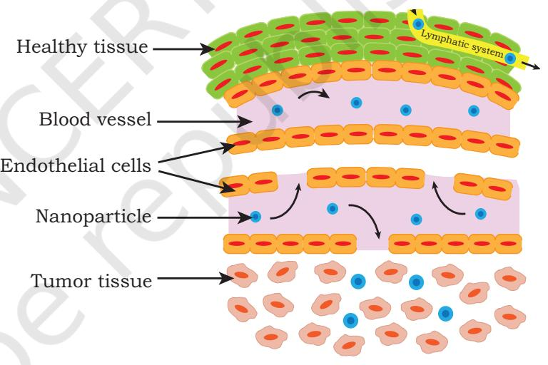

# **UNIT V Recent Innovations in Biotechnology and Entrepreneurship**

Chapter 12: Recent Innovations in Biotechnology

Chapter 13: Entrepreneurship

Chapter 12_Recent Innovations in Biotechnology__230321.indd 297 07-02-2023 10:14:05

**John Bertrand Gurdon**  (2nd October 1933–Present )

Sir John Bertrand Gurdon (born on 2 October 1933) is an English Developmental Biologist. He is best known for his pioneering research in nuclear transplantation and cloning. In 1956, he joined a Ph.D. programme with Embryologist Michael Fischberg and started to work on nucleus transfer from differentiated cells to eggs cells. Later, he successfully replaced a nucleus of fertilised egg cell of frog with a nucleus of mature cell from the intestine of tadpole. This egg cell with the nucleus from intestinal cell grew successfully into a new frog. This experiment proved that mature cell also carries the required genetic information required to differentiate into every cell type. Gurdon's work laid down the foundation for cloning, which later resulted in the first successful cloning of mammal "Dolly". In 2012, Gurdon was awarded the Nobel Prize for Physiology or Medicine, jointly with Shinya Yamanaka, who discovered the induced pluripotent stem cells. His Nobel Lecture was called "The Egg and the Nucleus: A Battle for Supremacy".

Chapter 12_Recent Innovations in Biotechnology__230321.indd 298 07-02-2023 10:14:05

# **Recent Innovations in** 12 **Biotechnology Chapter**

Biotechnological innovations have grown steadily over the past 10 years or so, and have benefited the human lives in agriculture, medical science, environment and energy. These technological innovations include GM crops, diagnostics, bacteria that can eat oil, growing human organs in labs for transplants, and advances in biofuel, that can help reduce our nation's carbon footprint. Innovations could help improve cost effectiveness and resource efficiency of biogas energy technology in a sustainable manner. We now even have plants and meat grown in labs that can be genetically regulated to taste and look in a particular way reflecting on the importance of synthetic biology.

# **12.1 ENVIRONMENTAL BIOTECHNOLOGY**

Ever since the industrial revolution started in the 1750s, the number of industries in different sectors increased exponentially. With this, came the unprecedented degradation of the environment, polluting the air, water and soil with various pollutants such as heavy metals, pesticides, dyes, carbon dioxide and other greenhouse and poisonous gases, micro-pollutants, etc.

- *12.1 Environmental Biotechnology*
- *12.2 Plant Biotechnology*
- *12.3 Regenerative Medicine*
- *12.4 Nanobiotechnology*
- *12.5 Synthetic Biology*
- *12.6 Future Prospects*

Chapter 12_Recent Innovations in Biotechnology__230321.indd 299 07-02-2023 10:14:06

In addition to the issue of environmental degradation, it has also become inevitable to find alternatives for non-renewable fossil fuels or finding more efficient ways of extracting and using fossil fuels. Biotechnology offers viable options, primarily because it is environment-friendly and uses natural systems. In environmental biotechnology, different forms of biological systems, whether naturally occurring or genetically engineered, are used.

The basic concepts and approaches in the field of environmental biotechnology are bioremediation (that includes a wide array of applications such as waste treatment, degradation, vermi-technology, etc.), prevention of environmental problems, detection and monitoring of contaminants and genetic engineering. You have learned about bioremediation in Chapter 11 of Unit IV. In this section, the focus will be on the second aspect i.e., prevention, and will primarily deal with the production of biofuels and avenues in the field of biodegradation and manufacture of biodegradable products.

# **12.1.1 Biofuel**

Biofuels are the fuels produced from biological products, which could be living organisms or from waste generated from biological products, such as from landfills, recycled vegetable oil, etc. In many places specific crops, such as soybeans, jatropha, pongamia, palm oil, algae, etc., are grown for the production of fuel. Fuels produced from such crops are known as biofuel or **agrofuels**. Based on their characteristics, biofuels can be broadly divided into biodiesel, bioalcohol, biogas and biomass in different forms.

# Biodiesel

**300 Biotechnology XII**

Biodiesel is made from raw materials such as animal fats, vegetable oils, waste cooking oil, soybean, rapeseed, jatropha, mustard, flax, sunflower, palm oil, canola, hemp, field pennycress, *Pongamia pinnata*, algae, etc., by the process called trans-esterification. Although in many European countries, a 5 per cent biodiesel blend is widely used, it can be used in its pure form without blending it with fossil diesel. The advantage of biodiesel is that it

Chapter 12_Recent Innovations in Biotechnology__230321.indd 300 07-02-2023 10:14:06

contains higher hydrogen and oxygen and less carbon when compared with fossil fuels. This improves the combustion of biodiesel and reduces the particulate emissions from unburnt carbon. Another advantage of biodiesel is that it can be directly used in regular diesel engines without making any changes or modifications to the engines.

# Bioalcohol

Bioalcohols, such as bioethanol, are produced from wheat, corn, sugarcane, molasses, sugar beets, potato, fruit waste, etc., by the process of fermentation. The basic steps in the production of bioalcohol include treatments which release sugars from the stored starch or cellulose followed by fermentation of the sugars by microorganisms, distillation and drying.

#### **Box 1: Ethanol Blending in Petrol**

Ethanol is widely used across the continents. Although it can be blended in any percentage with petrol, the blending percentage varies and ranges from about 2% to almost 30%, depending upon the norms adopted by the country. In India, the government has permitted oil marketing companies to sell ethanol blended petrol with percentage of ethanol up to 10%. Bureau of Indian Standards (BIS) specification recommends to achieve 5% ethanol blending across the country as a whole. As more ethanol is blended, the lesser will be the consumption of fossil fuel. In addition, ethanol is renewable and also reduces carbon dioxide and other greenhouse gas emissions. However, the use of ethanol has practical problems, like reduced efficiency of the engine. It makes engines harder to start and causes sputtering and oxidation of aluminium in the carburettors. Further, it causes steel components of the engine to rust. In order to overcome this issue, automobile manufacturers have to make necessary changes in the engine.

As far as the source of biofuel is concerned, micro algae and macro algae are being explored for the purpose. Micro algae includes microscopic photosynthetic forms, and the macro algae are the large multicellular plantlike organisms, commonly known as seaweeds. Different varieties of seaweeds have varied content of oil and sugar. The mass production of biofuels from algae is being explored because of several reasons, such as the ease with which it can be grown and harvested. It is renewable as it can be grown and harvested year after year, and it can produce both bioalcohol and biodiesel, it is non-edible and

**Recent Innovations in Biotech... 301**

Chapter 12_Recent Innovations in Biotechnology__230321.indd 301 07-02-2023 10:14:06

can serve as an alternative to corn, sugarcane, soybeans and other sources which are also consumed as food. This is also important from the perspective that increased use of agriculture fields to produce biofuels or biodiesel which will adversely affect food production for human consumption. However, in spite of the advantages of using algae for the production of biofuel, at present it is still not cost-effective and research is underway to overcome such challenges.

# Biogas

Biogas is a useful energy source or biofuel produced from organic substances such as dung, night soil wastes, manure, crops, organic industrial waste, waste water, etc., and mainly consists of methane and carbon dioxide. It is produced by breaking down of organic material with the help of bacteria in anaerobic conditions. This process takes place in an anaerobic digester and is accelerated by creating the optimal conditions for microorganisms to multiply, which leads to a highly efficient breakdown of materials.

Biogas could play a key role in the developing market for renewable energy. Utilisation of biogas is expected to be doubled in next five years. Biogas generation serves three important functions: waste removal, environmental management and energy production.

In India, under the National Biogas and Manure Management Programme, the Ministry of New and Renewable Energy installed about 49.3 lakh biogas plants in the country, introducing novel technologies, such as cryogenic separation, *in situ* upgrading, hydrate separation and biological methods. Biogas plant is considered to be the most sustainable option for households having feed material, so as to become self-dependent for cooking gas and highly organic enriched bio-manure. It provides the solution to protect the households from the problems of indoor air pollution at the same time saving on the cost of refilling of LPG cylinders. Biogas is considered to be the future of renewable and sustainable energy.

Inspite of its many benefits, the method of its production is yet to be perfected so as to simplify and improve the process of biogas generation to make it more efficient and

Chapter 12_Recent Innovations in Biotechnology__230321.indd 302 07-02-2023 10:14:06

user-friendly. Biogas has been found to damage vehicles by corroding the metal parts of the engine when used in automobiles as a biofuel. This greatly increases the cost of maintenance.

# Biomass

Biomass, or solid biofuels, are an important source of energy, especially for the economically weaker section of the society. Some examples of solid biofuels are wood, sawdust, coal, grass cuttings, domestic refuse, charcoal, agricultural waste, non-food energy crops, dried manure, etc. Most of the available biomass can be conveniently used directly on stove, furnace, hearth, etc. Certain forms of biomass such as sawdust, wood chips, and other agricultural wastes are preferably converted into pellets. Cow dung cakes are another popular form of solid biofuel. However, the problem that comes with the combustion of biomass or solid biofuel is that it emits considerable amounts of pollutants, such as particulate matters and polycyclic aromatic hydrocarbons (PAHs), which are harmful to health.

# **12.1.2 Biodegradation**

The natural waste management and recycling system breaks down everything from yard waste to crude oil keeping the planet clean and healthy. Increase in population has resulted in the generation of heaps of wastes, many of which are non-biodegradable, such as plastics and fluorinated carbons, which takes hundreds of years to decompose. Microbes have been identified that can break down such non-biodegradable materials. For example, scientists have discovered a strain of bacteria that can literally eat plastics. They have also found ways to improve such activity of the bacteria so that the task can be done faster. However, this technology is still developing, but it is promising for environment-friendly recycling.

# Bioplastics

An alternative to reduce non-biodegradable products is the production of materials that are made using biological materials. For example, instead of using styrofoams or

Chapter 12_Recent Innovations in Biotechnology__230321.indd 303 07-02-2023 10:14:06

plastics in the manufacture of disposable or single use or use-and-throw products, plant materials such as leaves, bamboo, wood chips, corn starch, seaweeds and natural biopolymers, such as polysaccharides, proteins or lignin, natural rubber, etc., can be used. Since plastics are made from fossil fuels, such approaches to do away with plastic products will help reduce the use of fossil fuels and hence, thereby reducing the plastic based pollutants. Though less than 10% of oil is used to make plastic products, this is important keeping in view its impact on the environment. Technological innovations have also been made in the field of bioplastic production. In 1999, the production of biopolymers from seeds and leaves of genetically modified plants had been established which is economically competitive with polymers produced from petrochemicals. Biodegradable plastic, e.g., Polyhydroxybutyrate (PHB) is being produced commercially by fermentation with the bacterium *Alcaligenes eutropus,* and can be produced in transgenic plants. The genetically engineered *Arabidopsis* plant may be used to upscale PHB production as the three genes involved in PHB synthesis from *A. eutropus*  produced PHB globules in their chloroplasts without affecting plant growth and development. The large scale production of PHB may be done using plants such as leaves of populus, the only limitation being its high cost as compared to synthetic polymers.

# Biotechnology in paper industry

Pulp making is a crucial step in the manufacture of paper during which wood chips are cooked by heating under pressure using caustic soda and sulfur. During this process, lignin is separated from cellulose fibers. Biopulping (treatment of wood chips with lignin-degrading fungi) improves the effectiveness of pulp making, thereby reducing the demand for energy and chemicals, it improves paper quality and ultimately decreases the environmental impact of pulp production. By increasing such efficiency, it helps in conserving raw material, energy, chemicals, etc. On the other hand, GM trees that produce less of lignin are being considered to be a promising solution to ease the process of pulp making. As in the case of biopulping, biobleaching uses enzymes such as xylanase to reduce the use of chlorine in

Chapter 12_Recent Innovations in Biotechnology__230321.indd 304 07-02-2023 10:14:06

bleaching. However, considering the impacts of deforestation to obtain wood for paper industries, alternatives are also being explored to completely replace the use of wood for the manufacture of paper. Non-wood materials such as bagasse, bamboo, jute, hemp, esparto, flax, grass, kenaf or reed, etc., are now used in paper making, whereby biotechnology contributes immensely in paper industry.

# Biotechnology in oil recovery

Microbial technologies are also being used in Enhanced Oil Recovery (EOR). EOR is a stage in the production of oil, which involves the extraction of residual oil from the initial first two phases (primary and secondary phases) of production. The use of suitable microbes and their metabolic products can enhance the efficiency of EOR. The ability of bacteria to feed on hydrocarbons has also been exploited to clean-up after an oil spill. These oil-eating microbes play an important role in maintaining the ecosystem. A genetically engineered *Pseudomonas* bacterium has also been developed, which can be used to 'eat' oil spills. Such 'superbugs' have immense environmental benefits. The details of superbug construction is given in Box 10 of Chapter 11.

# **12.1.3 Bioremediation**

Bioremediation has gained importance with advances in biotechnology, especially environmental restoration, using microorganisms to reduce the toxicities caused by chemical pollutants including heavy metals in soil or water such as As, Cr, Hg, Cd, Zn, etc. Three key principles must be considered for selecting the most appropriate strategy to treat, contaminated wastes:

(1) Possibility of pollutant to allow biological transformation to less toxic products.

(2) Bio availability of the contaminant to micro-organisms, and

(3) The efficiency of bio-activity.

Recent advances in molecular genetics of biodegradation and studies on enzyme-tailoring through recombinant DNA – RNA technologies are being utilised for the removal of heavy metals and toxic chemicals from contaminated sites. Bioremediation has been discussed in detail in Chapter 11.

**Recent Innovations in Biotech... 305**

Chapter 12_Recent Innovations in Biotechnology__230321.indd 305 07-02-2023 10:14:06

# **12.2 PLANT BIOTECHNOLOGY**

Plant biotechnology such as GM technology and molecularassisted breeding has generated products that have helped to achieve enhanced yields in a more sustainable manner. Development of pharmaceuticals, recombinant therapeutic proteins, plant-made pharmaceuticals, transgenic plants, artificial seeds, and plant-made vaccines or antibodies (plantibodies) are currently in advanced research in plant science. Recently, attempts are being made to use genome editing technique namely CRISPR-Cas9 for crop improvements.

# 12.2.1. Innovations in plant biotechnology through GM crops

You have already studied about GM crops and its application in Chapter 4 of the book. Almost 29 countries adopted GM crops in which soybeans, maize, cotton and canola form the major crops. The transgenic technology initially developed was limited to the control of weeds and pests, whereas, the second generation of GM crops has assisted farmers in the production of plants with tolerance to abiotic stress, improved nutritional features, can overcome sexual incompatibilities between plants and species, and overcome barriers that allow the introduction of genes from unrelated organisms such as bacteria, fungi or other plants and also from viruses. Innovations made in plant biotechnology through GM crops are described under various heads in the following sections.

**Herbicide tolerant GM Crops**: Weeds (plants growing where they are not wanted, e.g., Striga) decrease crop yields and quality primarily by competing with crop plants for light, water and nutrients. Farmers apply herbicides or weedicides (e.g. glyphosate) for the eradication of weeds in the fields, but the main problem with this is the loss of crop plants also as these herbicides are non-selective. Newer techniques, based on biotechnology tools, have been developed which are quite effective for weed management as well as in increasing the yields and income. There are several biotechnological strategies for weed control, but the most commonly employed approach is the over-production of herbicide target enzyme (usually in the chloroplast) in

Chapter 12_Recent Innovations in Biotechnology__230321.indd 306 07-02-2023 10:14:06

the target plant (crop), so that it becomes insensitive to the herbicide. The popular example for such an approach is the introduction of a modified gene from an *Agrobacterium*  that encodes for a ressistant form of an enzyme into crop plants for tolerance against the most extensively used herbicide glyphosate (sold as Roundup) which is effective against many weeds. Roundup Ready GM crop plants, such as canola, soybean, corn and cotton, tolerant to glyphosate have already been commercialised.

# **Disease resistant GM crops**

A wide range of diseases caused by viruses, fungi, bacteria, insects, mites and plant nematodes lead to significant crop losses each year. Disease causing microbes and strategies to make resistant plants are discussed below.

#### *(i) Viruses*

Viruses are among the most ubiquitous pests in agriculture. The transgenic technology has been used successfully in many plants against several different viruses such as virus causing yellow crookneck disease in squash, potato mosaic virus, the potato leaf roll virus, barley yellow dwarf virus in wheat and papaya ringspot virus (PRSV) for developing resistance to virus by introducing gene for viral coat proteins. A viral coat protein acts like a vaccine, causing the plant to develop resistance to the particular virus. Transferring the gene for a viral coat protein, a part of the outer shell of a virus that does not cause disease, into the plant may confer protection to the plant and induces resistance without the introduction of the actual virus.

#### *(ii) Fungi*

Fungal diseases cause significant damage to crops including fruits and vegetables, and is characterised by wilting, mouldy coatings, rusts, blotches, scabs and rotted tissue. Finding adequate substitutes for fungicides like methyl bromide has intensified the need to develop genetic engineering approaches. Defensins are antimicrobial proteins that enhance the plant's tolerance to pathogens and are present in insects, mammals (including humans), crustaceans, fish and plants. Defensins from moths and butterflies, the fruit fly, pea seeds and alfalfa seeds all

Chapter 12_Recent Innovations in Biotechnology__230321.indd 307 07-02-2023 10:14:06

show potent antifungal activity too. The first transgenic application of defensins was the incorporation of the antifungal defensin from alfalfa into potatoes. The transgenic potatoes were resistant to the fungal pathogen *Verticillium dahlia*.

Resveratrol from the white grapevine is a secondary metabolite that acts as a natural defensin which protects the plant from *Botrytis cinerea* infection. A gene of resveratrol when inserted into the host plant provides resistance against *Botrytis cinerea* in wheat and barley. Rpivnt1.1 gene isolated from *Solanum venturi* is transferred to potato to protect from resistance for late blight caused by *Phytophthora infestans*. Similarly, wheat gene encoding oxalate oxidase is being transferred to *Castanea* sp. to provide resistance against chestnut blight fungus; and chitinase gene from insects is being transferred to apple to provide resistance to apple scab fungus.

#### *(iii) Bacteria*

Most food crops are susceptible to bacterial infections causing leaf and fruit (lesions), soft rots, yellowing, wilting, stunting, tumors, scabs or blossom blights. When tissue damage occurs on the blossoms, fruit or roots of food crops, yields may be reduced. GM crops have been developed against various bacterial pathogens in which lysozyme genes are being transferred into potatoes to provide resistance against blackleg and soft rot diseases caused by *Erwinia carotovora*. Gene from *E. carotovora* and *Pseudomonas syringae* (pv tabaci) is being inserted into rice to make it resistant to wild fire disease.

#### *(iv) Insect*

**308 Biotechnology XII**

Widely used transgenic pest-protected crops are those that express insecticidal proteins derived from genes cloned from the soil bacterium *Bacillus thuringiensis* (Bt). This insecticidal protein called crystal (Cry) proteins or deltaendotoxins bind specifically to receptor protein in the insect gut destroying cells and killing the insect. A number of plants offering resistance to insects using this strategy have been developed worldwide. In India, Bt cotton is the only transgenic plant permitted by the Government for

Chapter 12_Recent Innovations in Biotechnology__230321.indd 308 07-02-2023 10:14:06

cultivation at commerical level since 2002. Bangladesh became the first country in the world to approve the commercial planting of Bt brinjal, which started in 2014.

In addition, the widening spread of fall-army worm infestations prompted the researchers to strategise on its control by using pyramided i.e., stacking of two or more genes in a single crop plant for insect resistant crop improvement. Stacking of two genes, one with increased water use efficiency and other for resistance to insect pests have resulted in the formation of hybrid maize seeds. Similarly, Bt gene was stacked with the drought-tolerance trait (MON87460) that expresses the *B. subtilis* cold-shock protein B (cspB).

#### *(v) Plant nematodes*

Transgenic strategies to combat nematodes that infect bananas, soybeans, rice and potatoes are emerging areas. Incorporation of the genes in potatoes produced upto 70 per cent nematode resistance in field trials. Using genetic markers, scientists bred plants containing the resistance gene with domesticated varieties, circumventing the poor performance characteristics of the wild variety. Producing a resistant variety of soybean from wild strain is one such example, in which by using specific genetic marker, scientists first identified a particular trait and its subsequently breeding with plants containing resistance gene with domesticated variety. The new varieties are not transgenic but have resulted from combining the use of modern genetic markers with conventional breeding techniques.

There are many other applications of such genetic modification of crops through which a tolerant and resistant variety of crops can be produced. One of the examples is a GM maize CIEA-9 that has been developed in Mexico, which has enhanced adaptation to severe drought and extreme temperature in which sugar trehalose is broken down by a glycoside hydrolase enzyme trehalase. By antisense RNA technology, trehalose expression is silenced in the maize and such a biotech maize requires approximately 20 per cent less water and can withstand higher temperature.

A few examples of the genetically modified crops have been depicted in Table 12.1.

**Recent Innovations in Biotech... 309**

Chapter 12_Recent Innovations in Biotechnology__230321.indd 309 07-02-2023 10:14:06

| Crop | Name of trait/ | Applications |
| --- | --- | --- |
| gene transferred |  |  |
| Stress resistant GM crops |  |  |
| Arabidopsis | Mannitol | Withstand high saline conditions and enhanced |
| and tobacco |  | germination rates and increased biomass |
| Rice | Embryogenesis abundant | More tolerant to drought and salinity |
| protein gene from barley |  | than conventional varieties of rice |
| Soybeans | HaHB4 transcription factor | HB4® soybean named EcoSoy® |
| gene from sunflower plant |  | tolerant to drought and herbicide |
| Wheat | HaHB4 transcription factor | HB4® wheat named EcoWheat® has increased |
| gene from sunflower plant |  | the yield upto 20% and drought tolerant |
| GM crops for enhanced paper quality |  |  |
| Arabidopsis | Coenzyme A-ligase | Resulted in transgenic plants |
|  |  | with upto 45% less lignin |
| Eucalyptus | Gene encoding an | 20% more wood than the conventional |
| Arabidopsis thaliana protein |  | variety and is ready for harvest in five |
|  |  | and a half years instead of seven |
| GM crops for improved product |  |  |
| Potato | Gene involved in | 60% more starch than non-GM plants |
| starch synthesis |  | which make potatoes take up less fat during |
|  |  | frying, resulting in a lower-fat product |
| Maize and | Two stacked genes | Confer tolerance to the herbicides |
| soybean |  | glyphosate and 2,4-D-choline |
| Apple | Gene involved in | Apple named Arctic®Gala had |
| non-browning |  | non-browning trait |

#### **Table 12.1: Few GM plants and their acquired charateristics**

GM technology has also helped scientists in the fortification of many crop plants and a few of there have been depicted in Table 12.2.

**Table 12.2: Biofortified GM crops**

| Crop | Nutrient | Name of the trait/ | Benefit |
| --- | --- | --- | --- |
|  | incorporated | gene transferred |  |
| Rice GR1 | Vitamin A (Vit A) | Maize phytoene synthesis | Golden Rice is an effective |
|  |  | gene and gene from the | source of Vit A in humans |
|  |  | bacterium Erwinia |  |
|  |  | uredovoia |  |

Chapter 12_Recent Innovations in Biotechnology__230321.indd 310 07-02-2023 10:14:06

| Biofortified | Iron and folate | GR: Two genes from: | Biofortified rice with |
| --- | --- | --- | --- |
| rice |  | daffodil (Narcissus poeticus) | improved iron and |
|  |  | bacterium (Erwinia | folate with improved |
|  |  | Uredoroia) affect the | mineral bioavailability, |
|  |  | Carotenoid biosynthesis | and with high content to |
|  |  |  | essential amino acids |
| Bananas | proVit A | Maize phytoene synthesis | Bananas with |
|  |  | gene and gene from the | enriched proVitA |
|  |  | bacterium Erwinia uredovoia |  |
| Soybeans | High oleic acid | Endogenous soybean | (Plenish™) was the |
|  |  | gene encoding fatty acid | first soybean produced |
|  |  | desaturase (gm-fad2-1) | through antisense RNA |
|  |  | was down regulated | technology. Seeds have |
|  |  |  | increased ratio of oleic acid |
|  |  |  | to linoleic acid content |
| Tomato | Enhanced | Genes from two snapdragon | The "purple" tomatoes are |
|  | hydrophilic | (Antirrhinum majus) | more healthy and more |
|  | antioxidant | transcription factors Delila | resistant to diseases. |
|  | capacity | and Rosea1 that control |  |
|  |  | anthocyanin biosynthesis |  |
|  | Increased shelf life | Polygalactouronase expressed | Increased shelf life |
|  |  | in antisense orientation |  |

# **12.2.2. Genome Engineering technology: Application of CRISPR-Cas9**

In Chapter 5, Section 5.4.2, you learned about genome editing with CRISPR-Cas9 technology, in which guide RNA bound to target DNA and Cas9 is used to edit genes in diverse plants. Scientists at the University of California San Diego have developed the first CRISPR-Cas9-based gene edited plants, with the objective of producing drought and disease-resistant crops. Breaking from the traditional inheritance principles that stipulate that an offspring acquires genetic materials equally from each parent (Mendelian genetics), the new research employs CRISPR-Cas9 editing to transfer specific traits from a single parent to successive generations. It has been used to improve nutritional quality, increase yield, and develop

**Recent Innovations in Biotech... 311**

Chapter 12_Recent Innovations in Biotechnology__230321.indd 311 07-02-2023 10:14:06

resistance to various biotic and abiotic stress in several crops, including rice, tomato, and soybean, etc. As we know that the traditional methods take years to develop a different trait, CRISPR-Cas9 is comparatively rapid, than other genetic manipulation techniques. Furthermore, CRISPR-Cas9 technology is relatively simple, precise, and can be used to create many beneficial traits in plants as it targets multiple genes. However, the revolution brought by CRISPR-Cas9 in plant molecular biology has raised various concerns for its off-target effects, and at times, low efficiency. In addition, there are regulatory issues and several challenges for its safety and use in the future. Efforts are being undertaken to improve its on-target efficiency and several modifications of the Cas9 enzyme. However, the work carried out is in preliminary stage and there is still more to be done.

# **12.3 REGENERATIVE MEDICINE**

Regenerative medicine is an emerging multidisciplinary specialty in medicine with the goal of cell and organ replacement to restore the loss of function resulting from degeneration, trauma or other disease processes. It can also protect vulnerable diseased cells from death. The oldest strategy is replacement of the diseased or lost organ by a new one, which is termed as **transplantation**. The organ transplantation may be of three types:

- **1. Autograft**  Transplantation of cells, tissues or organs between sites within the same individual, e.g., skin graft.
- **2. Allograft** Transplantation of organs or tissues from a donor to a non-genetically identical individual of the same species. This is the most common practice for organ transplant like renal, liver, heart, lungs and pancreas.
- **3. Xenograft** Transplantation of an organ or tissue between two different species. 'Pig valves', have been used to repair or replace a defective heart valve in humans.

Majority of organs like liver, kidney, pancreas consists of differentiated cells with limited capacity for regeneration. In case of major organ damage, these differentiated cells cannot proliferate and replace the damage cells. Stem cell technology can be helpful in this situation where the stem

Chapter 12_Recent Innovations in Biotechnology__230321.indd 312 07-02-2023 10:14:06

cells have the capability to proliferate and differentiate, replacing dead or damaged cells. There are several types of stem cells depending on their differentiation and origin as depicted in Chapter 9.

# **12.3.1 Stem Cell Technology**

Stem cells exhibit an intrinsic ability to assemble into complex structures. When placed within a hydrogel (often Matrigel) and in the presence of suitable exogenous factors, the stem cells can be coaxed into forming structures that contain organised clusters of cells. The recent availability of stem cell derived organoid systems to provide 3D self-organised tissue models provide a compelling new class of biological model to serve as both tissue and organ substitutions (Fig. 12.1).

- *Fig. 12.1: All organisms follow a system from the subcellular level to the whole body. A number of models have been developed across organismal hierarchy, to address definite questions across biology and medicine. Each model system has specific characteristics; in general, with increasing scale comes increasing system complexity and challenges in cell culture and the reduced availability of biochemical and quantitative tools, which can limit study insights. Organoid models provide a unique opportunity to incorporate moderate system complexity while still affording many tools for probing structure and function. When compared to tissue explants, organoid systems can mimic similar cell-cell and cell-matrix interactions while maintaining the ability for longterm cultures, maintaining signaling cues that are important for survival.*
**Recent Innovations in Biotech... 313**

Chapter 12_Recent Innovations in Biotechnology__230321.indd 313 07-02-2023 10:14:07

**Organoids** are ultra-small, self-assembled threedimensional tissue cultures that are derived from stem cells. Organoids can be created from both pluripotent stem cells (PSCs) and adult stem cells (ASCs) by simulating the biochemical and physical characteristics of tissue development and homeostasis. Such cultures can be maneuvered to replicate most of the complexity of the organ, or may be differentiated to express certain characteristics, like producing particular subsets of cells only. For example, the shape and tissue architecture of mesenchymal stem cells from bone marrow directly impacts their differentiation into osteoblasts or adipocytes. A round shape promotes adipogenic differentiation, and cells with wide spreading favour an osteoblastic differentiation.

Organoids reiterate a number of biological parameters that include spatial organisation of tissue-specific cells that are heterogeneous, cell-matrix interactions, cell-cell interactions, and certain physiological functions generated by tissue-specific cells within the organoid.

Organoids bridge a gap in the existing model systems by providing a stable system that can be extended to the manipulation and mimicking the *in vivo* physiology. The foremost aim of engineering organoid systems is to enhance the system utility in downstream applications. Therefore, it is necessary to create improved *in vivo* mimics for tissues and organs and to improve the organoid system to achieve high-throughput formats or multi-tissue organoid compatibility in larger multiplexed systems e.g., humanon-a-chip. Bioengineers have long aspired to deconstruct biological systems and manipulate or reconstruct the system in a controlled manner. Bioengineering approaches have enabled us to understand cell behaviour and cell organisation, that are the fundamental processes in organoid formation. Several improved systems are on the horizon.

Cells in monolayers have the same unlimited access to nutrients and growth factors. But, in *in vivo*, the position of cell inside a tissue determines whether it can get enough nutrients. In response to the downsides of monolayer cultures, biomedical companies have developed various types of **3D cell culture systems** to exploit its potential for predicting more realistic representations of drug response *in vivo*.

Chapter 12_Recent Innovations in Biotechnology__230321.indd 314 07-02-2023 10:14:07

Tumor spheres represent a model of cancer stem cell expansion; tissue-derived tumor spheres and organotypic multicellular spheroids are characteristically obtained from mechanical dissociation and cutting of the tumor tissue. However, there is a distinct ordered self-assembly in organoids as opposed to spheroid cultures, and the former is more dependent on a matrix for its generation.

Organoids have recently attracted attention as a model, primarily as they may serve as a better *in vitro* model when compared to 2D or even 3D co-culture systems. Applications for organoid research include organ development, disease modeling, drug penetration in the centre of the tumor mass, drug screening and toxicity testing. To induce spheroid formation, one can choose from methods such as suspension culture, non-adherent surface methods, hanging drop methods, and microfluidic methods (Fig. 12.2).

Though 3D cell cultures provide realistic models of cell assembly into tissues or organs, the new variables

*Fig. 12.2: 2D and 3D culture*

**Recent Innovations in Biotech... 315**

Chapter 12_Recent Innovations in Biotechnology__230321.indd 315 07-02-2023 10:14:07

#### **Box 2: Bioprinting**

Several therapies based on the principles of regenerative medicine are currently being practiced which are approved by regulatory bodies. The usual practice in regenerative medicine includes identification of the diseased organ dimension by imaging like Computerised Tomography (CT) scan or Magnetic Resonance Imaging (MRI). The tissue engineered scaffold with biopolymer embedded with cells and nanoparticles containing growth factors can be made by a computer assisted 3D Bioprinter with exact dimensions calculated from the MRI/ CT scan. The concept is depicted in the diagram.

Cartilage injury is common in sports injury as well as degenerative disease in old population which can lead to significant disabilities. 'Carticel' is an innovative therapy where autologous cartilage cells (chondrocytes) from articular cartilage fragment removed during surgery are expanded in *in vitro* and then implanted at the site of injury. 'laViv' is a technology where autologous fibroblasts are injected in the face for the removal of wrinkles or beautification of nose as a part of cosmetic surgery. 'Dermagraft', a patch of allogenic fibroblast dermal substitute, is used for diabetic ulcer. Autologous platelet, derived from the peripheral blood, is used for wound healing.

**316 Biotechnology XII**

as to how the tissues function, or how the pathological processes disturb the cellular functions, need to be carefully addressed. Three-dimensional models are far more expensive and time-consuming than 2D cultures, as very few automation and reproducible applications are available. The 3D cultures further require careful planning

Chapter 12_Recent Innovations in Biotechnology__230321.indd 316 07-02-2023 10:14:07

and expert handling. Owing to the lack of vascularization, it is difficult to get sufficient nutrients to the cells. Additionally, new microscopic analysis workflows for the thick 3D structures need to be developed, for observing and measuring cell processes with optimised protocols originally developed for 2D cell analysis.

However, rapid scientific development in this field has led to several new strategies involving cell based therapy, polymer and material science, nanotechnology, bioengineering and 3D bioprinting making an artificial organ or a substitute of the organ.

Currently, tissue engineered vascular graft, trachea, cardiac patches are in clinical trials. In near future, swift development in the field of regenerative medicine will empower the physicians to replace the majority of the diseased or dead cells in the human body.

# **12.4 NANOBIOTECHNOLOGY**

Nanoscience is the study of materials which are in nanoscale range, that includes size in nanometer, that is less than one micron. Fig. 12.3 gives clarity on the concept of scales, where an atom is 0.1 nm and a small molecule of sand is 1 mm. The diagram shows the size comparison among an atom which is less than 1 nm, a fullerene molecule containing 60 atoms of carbon (C60), a molecule of DNA, protein, a virus, bacteria, red blood cell, pollen and a sand particle (Fig. 12.3). The technology of using material in nanoscale is called nanotechnology. Nanobiotechnology thus implies application in the field of biotechnology at nano scale. The use of nanotechnology in medicine for diagnosis and therapy is termed as nanomedicine.

The conversion of any bulk material to nanoscale results in the alteration of its physicochemical, biological, mechanical, optical and electronic properties. These newly acquired novel properties of the materials due to conversion into a nanoscale can be utilised for different useful purposes.

The typical example of change in property of the bulk material when it is converted to nanoparticles of different sizes is observed in gold. Gold is a golden coloured metal widely used for making ornaments and jewellery.

Fig. 12.4 (a) shows golden colour of the bulk metal. The nanoparticles smaller than 30 nm are ruby red, up to 100 nm are pink and larger appear darker in colour demonstrating change in one of the physical characteristics

**Recent Innovations in Biotech... 317**

Chapter 12_Recent Innovations in Biotechnology__230321.indd 317 07-02-2023 10:14:07

*Fig. 12.3: Concept of scales (0.1 nm –1 mm)*

**318 Biotechnology XII**

with nanoform that is also size dependent. The bulk material, gold, of unit weight (1 mg) when converted to nanoparticles in a reducing size scale for example, with diameter of 500 nm, 100 nm and 10 nm, increases the number of particles exponentially accompanied by an enormous increase in the surface area [Fig. 12.4 (b)]. This phenomenon can tremendously increase the surface reactivity, which can then be used for different applications in the field of nanobiotechnology.

*Fig. 12.4: (a) Gold as a noble metal (b) Colour change in gold based on the size.*

Nanoparticles can be made from a large number of inorganic and organic materials as mentioned in the following table (Table 12.3). Depending upon the composition, nanoparticles can be categorised as biodegradable and non-biodegradable. Properties of nanoparticles depend on its size, shape, surface charge and composition. Nanoparticles made from one material like carbon, depending upon its composition, may acquire unique size and shape like fullerene (C60), single wall and multiwall carbon tube and graphene (Fig.12.5).

**Table:12.3: Composition of some of the nanoparticles widely explored in nanobiotechnology**

Chapter 12_Recent Innovations in Biotechnology__230321.indd 318 07-02-2023 10:14:08

*Fig. 12.5: (a) Fullerene (C60), (b) single wall, (c) multiwall carbon tube and (d) graphene*

| Inorganic |  |
| --- | --- |
| Metal | Iron oxide, Gold, Silver, Copper, Zinc oxide, Titanium oxide, Cadmium, Selenium |
| Non-metal | Silicon oxide, Calcium phosphate, Ceramic |
| Organic |  |
| Polymer | Naturally derived like chitosan from shell, alginate from algae, Cellulose, Lignin |
| Synthetic polymers | Polycaprolactone (PCL), polylactic acid or polylactide (PLA), Poly Lactic-co Glycolic Acid (PLGA) |
| Protein | Albumin, Gelatin |
| Lipid | Cholesterol, Fatty acids, Phospholipids, Liposome |

Similarly, cadmium- selenium (CdSe) nanocrystals of different sizes produce different colours of fluorescence, which does not quench with light (Fig. 12.6). The fluorescent CdSe nanocrystals are called Quantum Dots (QDs) which can be used for fluorescence based diagnostic tests.

# **12.4.1 Application of Nanotechnology**

Nanotechnology is an enabling technology which is useful in diverse sectors, such as chemicals, textile, consumer products, cosmetics, health (Nanomedicine), energy, agriculture, various industries and for environment as shown in the given diagram (Fig.

*Fig. 12.6: The QDs of different sizes showing different colour of fluorescence* 

**Recent Innovations in Biotech... 319**

Chapter 12_Recent Innovations in Biotechnology__230321.indd 319 07-02-2023 10:14:08

#### 12.7).

Some of the applications of nanotechnology are described in the following sections.

*Fig. 12.7: Nanotechnology an enabling technology relevant to every aspect of life*

Chapter 12_Recent Innovations in Biotechnology__230321.indd 320 07-02-2023 10:14:08

- **(a) Medicine (Nanomedicine):** Drug or other biomolecules can be loaded in nanoparticles or nanocarriers which can be targeted to the diseased site for delivery. This kind of nanotechnology based **Drug Delivery Systems** (DDS) can increase the bioavailability of the drugs at the diseased site with low systemic toxicity and reduced amount of drug required for cure. Currently, systemic administration of drug by oral or parenteral routes need higher dosage to maintain high serum levels, so that effective concentration can be achieved at the diseased site which is associated with toxicity involving other organs. Antifungal drug, amphotericin B has a high toxicity. When it is delivered in liposomes, which is a spherical vesicle consisting of one or more phospholipid bilayers, it shows less toxicity and higher efficacy. Systemic toxicity with anticancer chemotherapeutic drugs is a major problem in cancer management. The anticancer drugs can be targeted to cancer
micro-environment by enhanced permeability and retention (EPR) effect. The endothelial cells in the tumor has gaps or fenestration making them leaky in comparison to healthy tissue. If small size nanocarriers (20 to 30 nm) are loaded with drug and administered, it will be accumulated in the tumor area through the leaky vessels with retention of the drug loaded nanoparticles in the tumor area, this phenomenon is called EPR effect which

*Fig. 12.8: Accumulation of drug loaded nanoparticles in tumor by enhanced permeability and retention (EPR)*

is shown in Fig. 12.8. An example of such kind of DDS is Paclitaxel loaded albumin nanoparticles or liposomal doxorubicin currently being used for cancer therapy. Silver nanoparticles have wide spectrum antimicrobial properties and are being used in different wound dressings.

- **(b) Cosmetics:** Zinc oxide and titanium oxide nanoparticles are very useful for protection against
**Recent Innovations in Biotech... 321**

Chapter 12_Recent Innovations in Biotechnology__230321.indd 321 07-02-2023 10:14:08

ultraviolet light and widely used in sunscreen cosmetic preparations. Liposomal preparations and nanoemulsions are commonly used for better penetration of essential oils, vitamins and other biomolecules which can prevent age related skin changes, improve fairness and provide many other beneficial effects.

- **(c) Agriculture and food packaging:** Nanotechnology is being used for precision farming techniques enhancing the absorption of nutrients. New generation of nano-pesticides is more effective in controlling plant diseases with less amount of pesticide thereby reducing human exposure. Nanomaterials are used in food packaging for longer preservation and storage. Silver and iron nanoparticles can be used for the treatment and disinfection of livestock and poultry.
- **(d) Textile:** Nanomaterials can be used for several improvements of the textile like stain and water repellence, wrinkle-free features, fire retardancy, high tensile strength, durability, textured surface and so on. Nanotechnology can impart electrical conductivity to fibers without compromising their comfort and flexibility. The garments can sense and respond to external stimuli *via* electrical, colour or physiological signals and keep itself cool in summer and warm in winter. In near future, nanotechnology enabled garments can monitor the health conditions too.
- **(e) Nanobiosensors:** Nanotechnology has revolutionised the area of sensor development for the detection of biological molecules which may be biomarkers of diseases. Point of care devices can be made, which are low cost and more effective and the tests can be done at bedside, in villages with small volume of test materials. The scientists are working with the concept of 'Lab on a Chip', where many tests can be done simultaneously using nanotechnology and microfluidics.

The above mentioned examples give a clear insight into the enormous scope of nanotechnology applications. In future, this technology renders immense hope and may lead to innovations in various biomedical applications ranging from molecular imaging, drug delivery, gene therapy to biosensors and biomarkers. However, the use

Chapter 12_Recent Innovations in Biotechnology__230321.indd 322 07-02-2023 10:14:08

of nanotechnology raises fundamental questions about the need for new regulations and we should understand the safety issues of using nanoparticles in the body and environment.

# **12.5 SYNTHETIC BIOLOGY**

Traditionally, scientists have used two major strategies to study organisms. First is a reductionist approach that involves going from higher level description to the lower level description i.e., from the whole animal or plant to the tissue level, then to the cellular organelle level and finally at the molecular level (DNA, protein, etc.). We use several names for this general approach e.g., anatomy, histology, molecular biology, biochemistry and so on. The reductionist approach has been highly successful leading to the generation of a huge data at various levels.

Now the challenge is to collect this data and weave it in the form of databases and computer models of tissues, metabolic pathways and so on. This integrative approach of data collection and doing biology through computer, is more popularly known as bioinformatics, systems biology and so on.

In June 2004, a third major approach was announced at MIT USA that focused on building organisms from scratch. People asked: Could one chemically synthesise a chromosome, assemble mitochondria, construct a nucleus, a cell or tissue and ultimately an organism, just like an engineer constructs buildings from brick and mortar? This new engineering approach of building organisms from the bottom up, is called **synthetic biology**. Therefore, synthetic biology may be defined as a rationale design approach of constructing biological components leading to certain functions. The logic is that if engineering principles have worked in constructing electronic gadgets, buildings, bridges and so on, why not use them in constructing organisms? However, to enable such an activity, one needs to build (a) standards and (b) rules of composition.

Synthetic biology bridges the gap between biologists and engineers to design and build innovative biomolecular networks, components and pathways, and to utilise these constructs to reprogramme and rewire organisms. Synthetic

Chapter 12_Recent Innovations in Biotechnology__230321.indd 323 07-02-2023 10:14:08

Biology offers innovative approaches for engineering new biological systems or re-designing existing ones for useful purpose.

Integrating interdisciplinary expertise has enabled synthetic biology to address the unpredictable challenges linked to the complex intricacy of cellular systems. Synthetic biology has enthused researchers to innovate and bioengineer biological systems to accomplish explicit tasks. Its applications are— biomanufacturing of high-value biomolecules, diagnostics, therapeutics leading to cheaper drugs, 'green' means to fuel our cars and targeted therapies for attacking 'superbugs' and diseases, such as cancer. These re-engineered organisms will change our lives over the coming years. While synthetic biology has demonstrated its potential to solve high-impact problems, a plethora of basic research studies are still going on to discover the engineering limits for biological systems.

While people were collectings the datasheets of gene, another thought emerged: how about chemically synthesising a series of genes in one step, instead of assembling them? This gave rise to the technology of long

*Fig. 12.9: Summary of synthetic biology indicating the amalgamation of associated disciplines and their varied applicability.*

Rationalised 2023-24

Chapter 12_Recent Innovations in Biotechnology__230321.indd 324 07-02-2023 10:14:09

DNA synthesis leading to a major change in the way genetic engineering was practised (Fig. 12.9).

Instead of constructing plasmids and loading them with genes, the new strategy was to edit the plasmid in the computer, save the document as a text file of nitrogen bases (ATGC), email the sequence to the company and get the recombinant vector in a month or so. The process that would normally take six months to an year could be completed in less than a month. This strategy has been so successful that a chemically synthesised and a fully functional yeast chromosome was made by scientists at the John Hopkins University.

# **12.6 FUTURE PROSPECTS**

Biotechnological innovations will undoubtedly be at the core of discoveries benefiting the society in future, depending primarily on how the future unfolds. For example, as microbes make their impact, complex ecological systems and exploitation of biological knowledge will offer innovations in a wide spectrum including medicine, health care, food systems, industries and creating smart materials.

Currently, scientists are working towards creating microbial factories, where bacteria can synthesise chemicals and help in the reduction of air, soil and water pollution caused by chemical factories. They are also trying to clear environmental pollution by designing microbes that can eat harmful chemicals and convert them into environment friendly end products. People have been successful in synthesising natural plant products in bacteria and save plants from destruction. Bioremediation treatment technologies for contaminated soils and groundwater can involve: (1) solid-phase biotreatment; (2) slurry-phase treatment; (3) *in situ* treatment; and (4) combination of biological, physical and chemical treatment.

Plant biotechnology with a focus on seed-varietal improvement, such as GM technology and molecular-assisted breeding, has generated products that help agriculture to achieve enhanced yields in a more sustainable manner. GM technology has brought significant improvements in income, life quality and per acre productivity. Plant-

**Recent Innovations in Biotech... 325**

Chapter 12_Recent Innovations in Biotechnology__230321.indd 325 07-02-2023 10:14:09

made pharmaceuticals have become a major focus point since 2010, when realistic opportunities for commercial development emerged. Plant-manufacturing platforms for pharmaceuticals or molecular pharming open interesting prospects for low-income countries, where large quantities of medicines need to be provided on a regular basis. Costeffective local focus and needle-free deployment can be of great help for the treatment of tropical diseases. In the industrial sector, plant biotechnology has the potential not only to generate more productive biomass feedstocks and minimise inputs, but also to develop more efficient biofuels, chemicals and bio-material conversion processes. A number of non-food crops, improved with sustainable management, have gone through the regulatory process.

Medical applications of biotechnology include regenerative medicine, tissue engineering, transplantation, stem cell research, nanobiotechnology and synthetic biology. The interdisciplinary field of nanobiotechnology is bringing the science of the incomprehensibly small devices closer to reality. Although the expectations from nanobiotechnology in medicine are high and the potential benefits are endlessly enlisted, the safety of nanomedicine is not yet fully defined. If synthetic biology becomes widespread in future then the rubber used in tyres, the bioacrylic used in glues and paints, the surfactant used in shampoos and soaps, additives and flavours used in food and so on would be made in side bacteria.

Nevertheless, there are also aspects of synthetic biology which may be harmful for humanity e.g., creating new viruses that may give rise to new diseases and designing bioweapons which can be misused against humanity. It is therefore more important to promote ethical and humane practices in synthetic biology and have strict regulations to prevent its misuse.

India has become a key contributor in biotechnology sector playing a key role in the global vaccine market including DPT, BCG and measles and other vaccines. Low cost diagnostics kits and medical interventions along with vaccines were promptly developed by the vibrant biotechnology sector of India. Recent unprecedented pandemic caused by Corona Virus (COVID-19) posed

Chapter 12_Recent Innovations in Biotechnology__230321.indd 326 07-02-2023 10:14:09

a severe threat to human health. Biotechnological innovations helped to develop vaccines that saved mankind. In summary, the future of biotechnology research is strong and promising. Its development requires entrepreneurship as business skills are critical for managing research projects and a technical team. Technology experts can add real time analysis to the cuttingedge research. The Draft National Biotech Development Strategy 2020–24 aims to build and nurture a vibrant start-up, entrepreneurial, and industrial base, connecting academia and industry. It focuses strengthening and nurturing of a strong basic research and innovation driven ecosystem across research institutes and laboratories, public and private sector, with complete engagement of start-ups, small, and large industries.

# **SUMMARY**

- Environmental biotechnology focuses on bioremediation that includes a wide array of applications, such as waste treatment, degradation, vermi-technology. It also includes the second aspect i.e., prevention, that will primarily deal with the production of biofuels and avenues in the field of biodegradation and manufacture of biodegradable products.
- Biofuels are the fuels produced from biological products from living organisms or from waste generated from biological products such as from landfills, recycled vegetable oil, etc. Fuels produced from crops are known as agrofuels. Based on their characteristics, biofuels can be broadly divided into biodiesel, bioalcohol, biogas and biomass in different forms.
- Biodegradation using biotechnology helps in environmentfriendly waste recycling.
- Bioremediation of heavy metals in soil or water such as As, Cr, Hg, Cd, Zn, etc. is being done by plants and microorganisms such as bacteria and fungi using biotechnology.
- GM technology has evolved to generate a number of products and crops with improved traits, such as resistance crops, against herbicides, biotic and abiotic stresses, etc., as well as with improved nutritional quality and quantity.
- Regenerative medicine is an emerging multidisciplinary specialty in medicine with the goal of cell and organ

Chapter 12_Recent Innovations in Biotechnology__230321.indd 327 07-02-2023 10:14:09

replacement to restore the loss of function resulting from degeneration, trauma and other disease processes.

- Stem cells exhibit an intrinsic ability to assemble into complex structures. When placed within a hydrogel (often Matrigel) and in the presence of suitable exogenous factors, the stem cells can be coaxed into forming structures that contain organised clusters of cells.
- The recent availability of stem cell derived organoid systems to provide 3D self-organised tissue models provides a compelling new class of biological model to serve as both tissue and organ substitutions.
- Organoids are ultra-small, self-assembled three-dimensional tissue cultures that are derived from stem cells. Organoids have been created from both pluripotent stem cells (PSCs) and adult stem cells (ASCs) by simulating the biochemical and physical characteristics of tissue development and homeostasis.
- Nanoscience is the study of materials in the range that includes size in nanometer which is less than one micron i.e., 10-9 to 10-12. The application of material in nanoscale is called nanotechnology.
- Nanobiotechnology implies the use of nanotechnology in the field of biotechnology. Nanomedicine is the strongest arm of nanobiotechnology used for diagnosis, drug/gene delivery and therapy.
- Nanobiosensors: Nanotechnology has revolutionised the area of sensor development for the detection of biological molecules which may be biomarkers of disease. Point of care devices can be developed which are low cost, more sensitive and the tests can be done at bedside villages with a small volume of test materials. The scientists are working with the concept of "Lab on a Chip", where many tests can be done simultaneously using nanotechnology and microfluidics.
- Synthetic biology may be defined as a rational design approach of constructing biological components leading to certain functions.
- The application of automation and artificial intelligence (e.g., in designing and building plasmids) may help to reduce the time and cost to improve the return on investment.

Chapter 12_Recent Innovations in Biotechnology__230321.indd 328 07-02-2023 10:14:09

### **EXERCISES**

- 1. What are the advantages of biodiesel?
- 2. Enlist the differences between biodegradation and bioremediation.
- 3. Explain how biofuel is better than fossil fuels.
- 4. Enumerate the challenges in growing 3D cultures.
- 5. What are the applications of stem cells in generating organoids and spheroids.
- 6. What are nanomaterials?
- 7. Are there specific health risks from nano products?
- 8. Organoids can be created from:
- (a) Both Totipotent and Pluripotent Cells
- (b) Both Pluripotent and Multipotent Cells
- (c) Both Adult Stem Cells and Pluripotent Cells
- (d) Both Adult Stem Cells and Multipotent Cells
- 9. Incineration is:
- (a) Extracting metals from their ores using microbes
- (b) Treating waste which involves the combustion of organic substances
- (c) Degrading harmful chemicals and materials using microbes
- (d) Remediation of harmful metals from the environment using microbes.
- 10. Ultra small, self-assembled, three dimensional tissue cultures derived from stem cells are called:
- (a) Spheroids
- (b) Organoids
- (c) Monolayer Cells Culture
- (d) Tissue Explants
- 11. What is the colour of the nano gold particles?
- (a) Yellow
- (b) Orange
- (c) Red
- (d) Variable
- 12. Quantum dots can be used in:
- (a) Crystallography
- (b) Optoelectronics
- (c) Mechanics
- (d) Quantum physics

**Recent Innovations in Biotech... 329**

Chapter 12_Recent Innovations in Biotechnology__230321.indd 329 07-02-2023 10:14:09

- 13. Fabrics are extensively made out of nano materials like
- (a) Carbon nano tubes
- (b) Fullerenes

___________.

- (c) Mega tubes
- (d) Polymers
- 14. **Assertion**: Bt cotton is a transgenic plant.

**Reason:** Bt toxin provides resistance to plants against insects.

- (a) Both assertion and reason are true and the reason is the correct explanation of the assertion.
- (b) Both assertion and reason are true but the reason is not the correct explanation of the assertion.
- (c) Assertion is true but reason is false.
- (d) Both assertion and reason are false.
- 15. **Assertion**: Biodiesel is made from raw materials such as vegetable oils, animal fats, etc.

**Reason:** Biodiesel reduces the particulate emissions from unburnt carbon.

- (a) Both assertion and reason are true and the reason is the correct explanation of the assertion.
- (b) Both assertion and reason are true but the reason is not the correct explanation of the assertion.
- (c) Assertion is true but reason is false.
- (d) Both assertion and reason are false.

Chapter 12_Recent Innovations in Biotechnology__230321.indd 330 07-02-2023 10:14:09

