# **Host–Vector System**

**Chapter 2**

Recombinant DNA technology is a two component system involving a compatible host and a vector. A variety of hosts as well as vectors are available for gene cloning. In this chapter, students will be exposed to the fundamentals of different kind of prokaryotic and eukaryotic hosts and vectors used in rDNA technology.

# **2.1 TWO KEY COMPONENTS OF RECOMBINANT DNA TECHNOLOGY**

As discussed in the previous chapter (Chapter 1), rDNA technology refers to joining two different DNA molecules with an aim to isolate, propagate, characterise and manipulate the genes for various applications. This technique involves two major steps (Fig. 2.1). In the first step, the desired DNA molecule, generally termed as **insert** (target gene) is isolated from the source. In the second step, this target gene is inserted into a convenient carrier DNA molecule called **vector**. The vector containing the insert is called **recombinant DNA (rDNA)**. Subsequently, the rDNA is introduced into an organism referred to as **host**.Using

- *2.1 Two Key Components of Recombinant DNA Technology*
- *2.2 Host*
- *2.3 Vector*
- *2.4 Eukaryotic Host Vector System*
- *2.5 Expression Vectors*
- *2.6 Shuttle Vectors*

Chapter 2_Host vector system.indd 9 07-02-2023 10:05:25

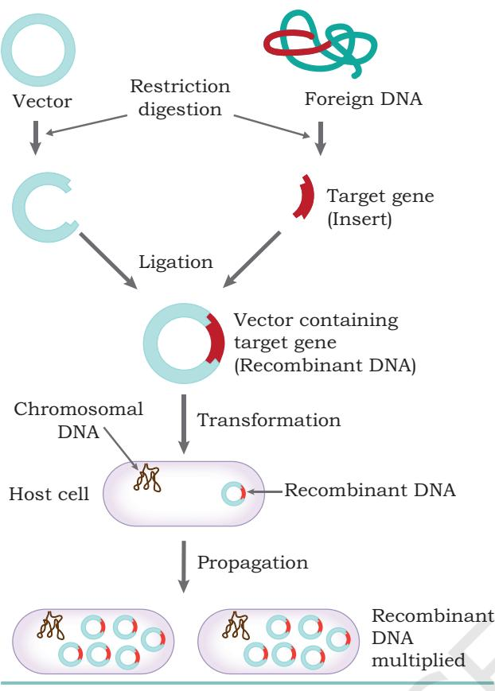

*Fig. 2.1: Schematic representation of gene cloning*

**10 Biotechnology XII**

genetic machinery of the host, the rDNA undergoes propagation and expression. This whole process of rDNA technology is covered under the term 'gene cloning'. Thus, gene cloning may be considered as a two component system: a compatible host and a vector, where the vector provides essential sequences required for its replication in a compatible host which provides various replication functions (enzymes and proteins).

## **2.2 HOST**

A large number of host organisms, both prokaryotic and eukaryotic are used for gene cloning (Fig 2.2). A host should allow easy entry of the rDNA into the cell and should not consider the recombinant DNA as a foreign DNA and degrade it. The host must supply all the required enzymes and proteins for smooth replication of the vector DNA along with

insert. A wide variety of genetically defined strains are available as hosts.

Among prokaryotic hosts, *Escherichia coli* (*E. coli*) is the most extensively used. Typical *E. coli* is a rod-shaped Gram-negative bacterium commonly found in the lower intestine of warm-blooded organisms. It is able to reproduce and grow rapidly, doubling its population about every 20 mins. K12 strain of *E. coli* is one of the most commonly used hosts in gene cloning. Other prokaryotic hosts have also been developed. For example, *Bacillus subtilis* constitute an important alternative host, where the aim is secretion of a protein encoded by a cloned gene. Among eukaryotic hosts, the most widely used is yeast.

# **2.3 VECTOR**

In principle, any molecule of DNA, which can replicate itself inside a host cell, can work as a vector for gene cloning. However, in order for a plasmid to act as vector, it must

Chapter 2_Host vector system.indd 10 07-02-2023 10:05:26

fulfil the following features:

- 1. For easy incorporation into the host cell, a vector should itself be small in size and be able to integrate a large size of the insert.
- 2. The vector should have an **origin of replication** or *ori*, so that the vector is capable of autonomous replication inside the host organism.
- 3. The vector needs to have **unique restriction sites**. If it possesses too many restriction sites, then it would be fragmented into several pieces.
- 4. The vector needs to have a **selectable marker**. The selectable markers are required to screen out transformants [For example: resistance to antibiotics such as tetracycline (*tetR*), ampicillin (*ampR*)].

A variety of vectors both prokaryotic as well as eukaryotic are available (Fig 2.2).

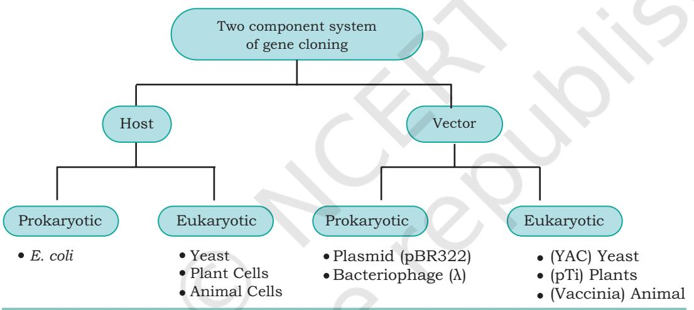

*Fig. 2.2: Two component system of gene cloning showing various kinds of eukaryotic and prokaryotic hosts and vectors*

### **2.3.1 Plasmid as a vector**

Plasmids are circular, double-stranded (ds), extra chromosomal DNAs capable of autonomous replication. They occur naturally in many bacteria, archaea, and even eukaryotes, such as yeast. Size of plasmids ranges from a few thousand base pairs to more than 100 kilobase pairs (kbp). Like the host-cell chromosomal DNA, plasmid DNA is duplicated before every cell division. During cell division, atleast one copy of the plasmid DNA is segregated to each daughter cell, assuring continued propagation of the plasmid through successive generations of

Chapter 2_Host vector system.indd 11 07-02-2023 10:05:26

the host cell. Some plasmids can integrate into chromosomes. Such plasmids are called **episomes**.

Several naturally occurring plasmids contain genes that provide some benefit to the host cell. For example, some bacterial plasmids encode enzymes that deactivate antibiotics, such as ampicillin, tetracycline chloramphenicol. Such drug-resistance providing plasmids (called **R-plasmids**) constitute a major category of plasmids used for gene cloning. Another category of plasmids produce a variety of toxins called 'colicins' which kill other bacteria (called **Col plasmids**). Some plasmids contain 'transfer genes' encoding proteins that can form a macromolecular tube, or pilus, through which a copy of the plasmid can be transferred to other host cells of the same or related bacterial species (called **F-plasmids**).Similarly, plasmids can also be based on the copy number and are classified as follows:

**(a) High or multi copy plasmids:** Replication and segregation of these plasmids are free from control of replication of the bacterial chromosomal DNA which allows for many copies of these plasmids per cell (10–30 copies) [Fig. 2.3(a)].

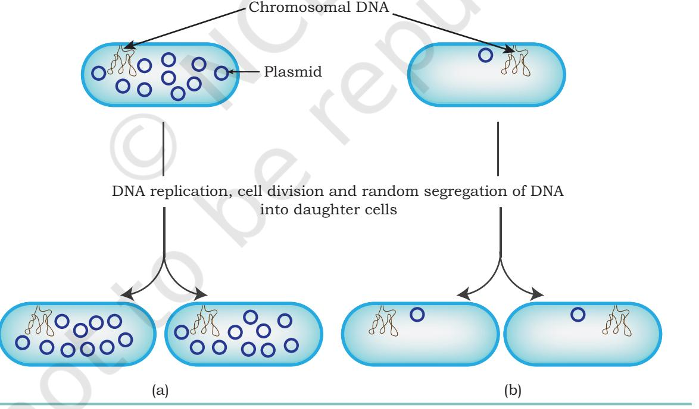

*Fig. 2.3: (a) High copy plasmid (b) low copy plasmid* 

**12 Biotechnology XII**

Chapter 2_Host vector system.indd 12 07-02-2023 10:05:26

Replication of these plasmids is referred to as **relaxed replication**. Use of a high copy number plasmid gives rise to higher yields and increased strength of the signals during screening of recombinants.

**(b) Low or single copy plasmids:** Replication and segregation of these plasmids are under the same control as replication of the bacterial chromosomal DNA. As a result of this, the copy numbers of these plasmids are restricted to only one or few copies per cell (Fig. 2.3(b). Replication of these plasmids is referred to as **stringent replication**.

#### *Development of plasmid based vectors*

In order to use plasmids as a vector and to enhance their utility either for general purposes or to suit particular

experimental designs, plasmids originally found in nature, are modified, shortened, reconstructed and recombined under both *in vivo* as well as *in vitro* to incorporate the properties indicated above into them. For example, the plasmid based vector pBR313, which replicates in relaxed fashion (giving rise to high copy number), contains two selectable markers *tetR* and *ampR* (selectable markers were derived from other two naturally occurring plasmids) and carried a number of unique restriction sites (cloning sites). However, the size of this plasmid was 9 kb, which was unnecessarily large. It was observed that more than half of its DNA was not essential for its role as a vector. Therefore, the first phase of this plasmid vector development led to the construction of vector pBR322, whose size was reduced to 4,361 bp by deleting most of the non-essential sequences of pBR313. The vector pBR322 became the most widely used vector for gene cloning (Fig. 2.4).

Subsequent development included the introduction of synthetic cloning sites termed as **multiple cloning site (MCS)** or **poly cloning site** or **polylinker**. MCS is a short synthetic DNA fragment containing a large number of unique restriction sites. This enables the insertion of a foreign DNA cleaved by any of these restriction sites into that region

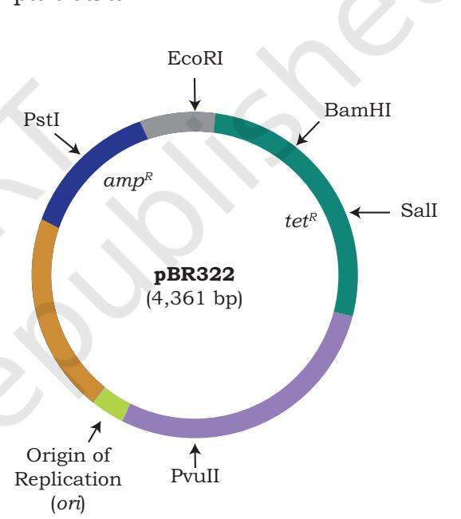

*Fig. 2.4: Vector map of pBR322 showing the origin of replication (ori), unique cloning sites for restriction enzymes* (PstI, EcoRI, BamHI, SalI, PvuII) *and antibiotic selection marker genes (ampR and tetR)*

**Host-Vector System 13**

Chapter 2_Host vector system.indd 13 07-02-2023 10:05:26

(Fig. 2.5). Further development involved the introduction of easy and convenient selection markers. Thus, for example, selection of the recombinants on the basis of blue/white selection was introduced (for detail refer section 3.5; Chapter 3), which facilitated the selection of recombinants utilising -galactosidase (*lacZ*) of *E. coli*. A common example of such an improved cloning vector is pUC19 vector as shown in Fig. 2.5. Many other plasmids are used as vectors for gene cloning in *E. coli.*

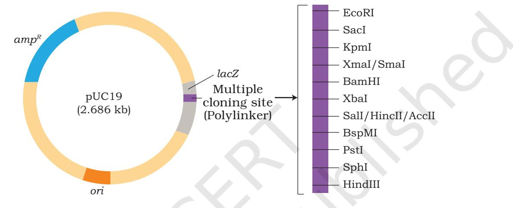

*Fig. 2.5: Vector map of pUC19 showing origin of replication sequence (ori), ampicillin resistance gene (ampR), part of -galactosidase gene (lacZ)* 

### **2.3.2 Bacteriophage as vectors**

Another important category of vectors for gene cloning is derived out of the genome of bacteriophages (phages) i.e., viruses which infect the bacterial cells. In general, bacteriophage vectors are more efficient than plasmids for **cloning large inserts**, and **screening large numbers of bacteriophage plaques** (lysed bacterial cells due to phage infection) than screening bacterial colonies for a specific desired insert. The bacteriophages lambda (λ) and M13 are the two most common phages whose genome has been frequently used to make cloning vectors for *E. coli* host. They are described in the following section.

#### *Lambda (*λ*) Phage Vector*

**14 Biotechnology XII**

The bacteriophage lambda, a virus that infects *E. coli*, has been widely used as a cloning vector. The virus is easy to

Chapter 2_Host vector system.indd 14 07-02-2023 10:05:26

propagate, and therefore, has long been a model system. It consists of a head (capsid) and a tail (Fig. 2.6). The head contains phage genome. The phage particles binds to the surface of *E. coli* and inserts its genome *via* tail into the cytoplasm of the bacterial cell. Lambda phage is a virus with both lytic and lysogenic alternatives to its life cycle (Fig. 2.7). Usually, a 'lytic cycle' is followed, where the lambda DNA is replicated and new phage particles are produced within the cell. This causes cell lysis, releasing the newly formed phage particles. However, under certain conditions, the phage DNA may integrate itself into the host cell chromosome in the lysogenic pathway. In this state, the λ DNA is called a prophage and stays resident within

**Lytic cycle**

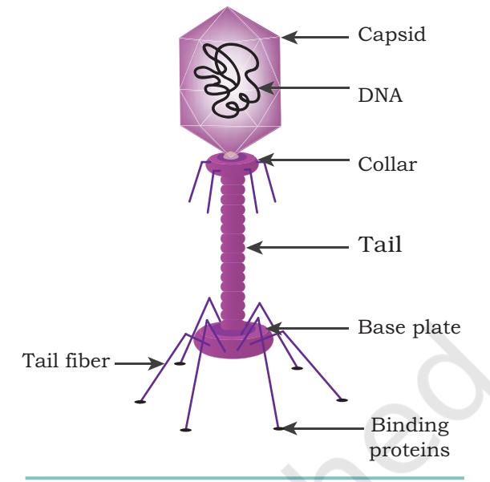

*Fig. 2.6: Lambda bacteriophage*

the host's genome without causing apparent harm to the host.

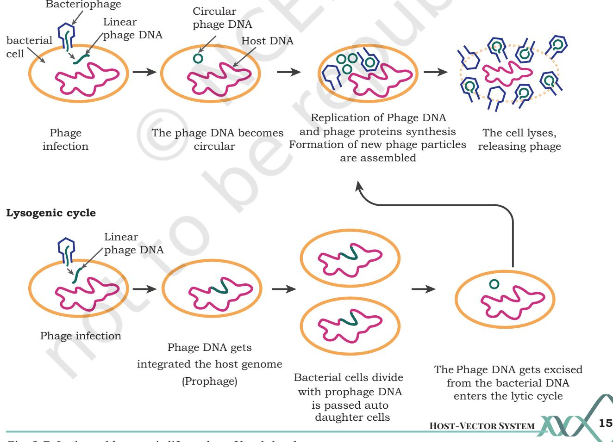

*Fig. 2.7: Lytic and lysogenic life cycles of lambda phage*

Chapter 2_Host vector system.indd 15 07-02-2023 10:05:27

The λ phage genome is linear double stranded DNA containing 48,490 base pairs. Each end has a 12 bases single stranded segment known as *cos* sequences (cohesive ends). The two cohesive ends are complementary to each other. The λ genome has a replication origin site, genes for viral head and tail proteins, enzymes of replication involved in lytic and lysogenic cycles. The λ genome remains linear within the phage head (Fig. 2.8 (a)). Once inside the *E. coli* host cell, the *cos* sequences pair up and cohesive ends are ligated together by host enzyme forming the circular version of lambda genome (Fig. 2.8 (b)). The sealed cohesive end is called *cos* site (Fig. 2.8 (b)). The 12 nucleotides long single stranded DNA at both ends pair with each other to form double stranded DNA. Therefore, in its circular form, the phage genome is 48,502 base pairs in length. The phage λ genome can be inserted into host chromosome and is then called a prophage (Fig. 2.7).

During multiplication, the phage genome undergoes rolling circle replication in which a template strand rotates, churning out a chain of many copies of λ genomes to form a long concatemer joined end to end and separated by *cos* sites. The concatemer is cleaved at the *cos* sites to yield one unit of phage DNA. This is followed by the packaging of single copy of λ genome into each empty head followed by the attachment of tail and release of newly formed phage particles by lysis of bacterial cells (Fig. 2.7).

Approximately, one-third of the lambda genome, the middle region of the λ genome (which contains genes required for lysogeny) is dispensable (non-essential) for successful lytic infection (Fig. 2.8). Therefore, in order to construct a vector for gene cloning out of the lambda phage DNA, all or part of the middle dispensable region is replaced with an insert segment of appropriate length such that the size of the recombinant DNA (rDNA) lies between 38 to 52 kbp for its efficient packing into the λ head.

Typical vectors coming out of lambda genome fall into two broad classes, namely 'insertion vectors' and 'replacement vectors'. Insertion vectors have a single restriction enzyme site (cloning site) for insertion of insert DNA, whereas replacement vectors have a pair of cloning sites flanking a segment of non-essential bacteriophage

Chapter 2_Host vector system.indd 16 07-02-2023 10:05:27

**16 Biotechnology XII**

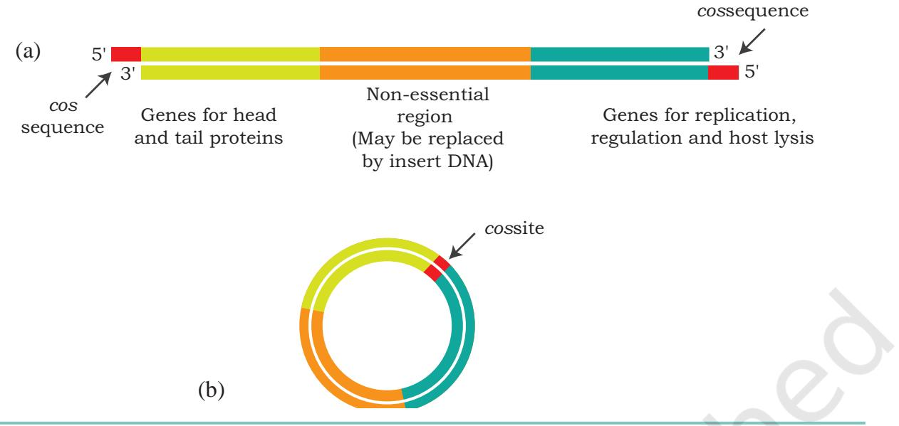

λ DNA (central stuffer region) that can be replaced by the insert DNA.

A large array of λ vectors has been constructed for different purposes. Some commonly used λ bacteriophage based vectors for *E. coli* are given in Table 2.1 below.

| Table 2.1: Commonly used λ bacteriophage based vectors for E. coli as host. |
| --- |

| S.No. | Vector name | Type of vector | Selection of recombinants | Maximum insert size (kbp) |
| --- | --- | --- | --- | --- |
| 1. | λgt10 | Insertion vector | Lytic (plaque formation) | 6 |
| 2. | λgt11 | Insertion vector | Blue/ white | 7.2 |
| 3. | λ EMBL3 | Replacement vector | Lytic (plaque formation) | 20 |

#### *Bacteriophage M13*

M13 is a filamentous bacteriophage of *E. coli*. Its genome consists of a single stranded circular DNA of about 6.4 kb nucleotides which is packaged in a tube like capsid (Fig. 2.9). Almost full genome encodes genes (I-X) required for coat protein, viral replication, viral assembly except for a small non-essential region flanking *ori* called intergenic region. Bacteriophage M13 infects only *E. coli* cells harbouring F plasmid. These cells have a tube-like

**Host-Vector System 17**

Chapter 2_Host vector system.indd 17 07-02-2023 10:05:27

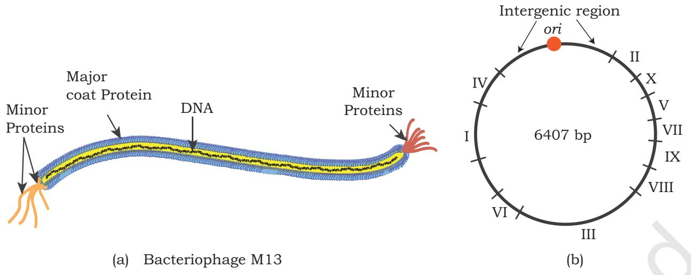

*Fig. 2.9: M13 bacteriophage (a) single stranded genome (b) M13 genome indicating different genes I to X*

structure called 'pilus' extending from their membranes. This pilus is required for attachment and adsorption of the phage to the cell (Fig. 2.10).

During the life cycle of the M13 bacteriophage, the single stranded M13 phage DNA undergoes replication inside the host to generate a double stranded replicative form (RF) (Fig. 2.10). Subsequently, the mode of replication changes to generate a single stranded genomic DNA (+) from double stranded replicative form (Fig. 2.10). The

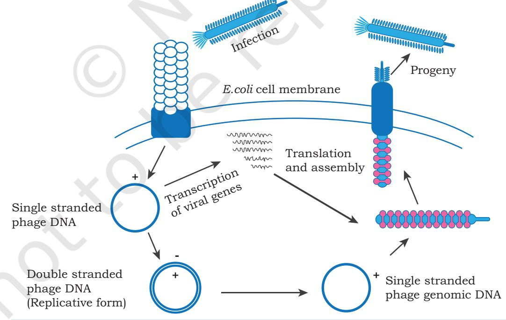

*Fig. 2.10: Life cycle of bacteriophage M13*

Chapter 2_Host vector system.indd 18 07-02-2023 10:05:28

circular single stranded genomic DNA (+) is assembled with capsid proteins during their passage through the host cell without causing cell lysis. The double stranded RF DNA is readily isolated from infected cells for use as a vector, and the single stranded genome is abundantly available in the form of phage in the growth medium. Thus, for M13 vector construction, the double stranded RF of the M13 genome is used. The intergenic region is exploited for putting the insert so that it does not interfere with M13 replication. A large sized DNA (more than 42 kb) can be cloned by M13 bacteriophage. An example of M13 based vector for *E. coli* is M13mp18 which facilitates blue/white selection of the recombinants. You will study blue/white selection in Chapter 3 of this book.

### **2.3.3 Cosmid vector**

A Cosmid is a type of hybrid (combination) vector that replicates like a plasmid but can also be packaged *in vitro* into lambda phage coats. A typical cosmid has replication functions, unique restriction endonuclease sites, and selective markers contributed by plasmid DNA, combined with a λ DNA segment that includes the joined cohesive ends (*cos* sites) (Fig. 2.11). As little as 250 bp of λ DNA is sufficient to provide the *cos* junction, including the sequences required for binding to and cleavage by an enzyme called terminase.

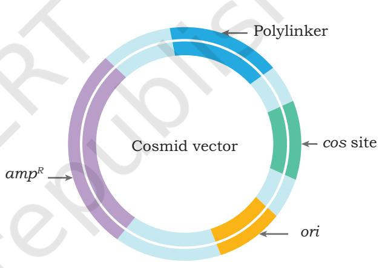

*Fig. 2.11: A typical cosmid vector*

Advantage of most cosmid cloning vectors is that they accommodate DNA inserts as large as 45 kbp.

## **2.3.4 Phasmids (Phagemids)**

Phasmids are true combination (hybrid) vectors between phage and plasmid. They are linear duplex DNAs whose ends are lambda phage DNA that contain all the genes required for a lytic infection and whose middle region is linearised plasmid. Both the lambda phage and the plasmid replication functions are intact (Fig. 2.12). Phasmid recombinants are packaged *in vitro* before infection. Once inside an *E. coli* cell, the phasmid can replicate like a phage

Chapter 2_Host vector system.indd 19 07-02-2023 10:05:28

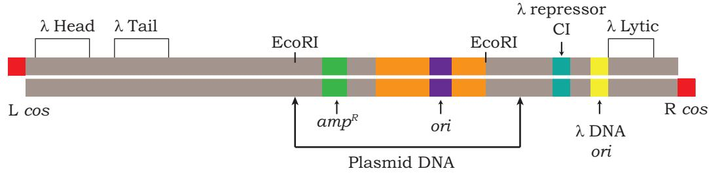

and form plaques in the normal way. However, if the vector contains the gene that encodes the lambda repressor, then the phasmid replicates as a plasmid rather than as a phage.

## **2.4 EUKARYOTIC HOST VECTOR SYSTEM**

Genome analysis of the higher organisms requires the cloning of much larger fragments. Because eukaryotic genes contain introns which may be hundreds of kilobases in length and even if a eukaryotic gene without introns is to be inserted, its size exceeds the maximum length as an insert for a plasmid. Therefore, special vectors are required for such large DNA fragments. Consequently, 'artificial chromosomes' have been developed to carry huge lengths of eukaryotic DNA.

Among eukaryotic host vector system, the most common is the baker's yeast, *Saccharomyces cerevisiae*. Although yeast can reproduce sexually, the cells usually multiply asexually by budding. They grow as single cells in suspension and produce colonies in solid medium, much as in *E. coli*. A large collection of metabolic, biosynthetic, and cell cycle defective mutants are known and genetically mapped. Because of a long history of safe use of *S*. *cerevisiae* in food industry, it belongs to the category which is generally recognised as safe (GRAS) organisms.

*S. cerevisiae* also harbors a double stranded circular plasmid called 2 µm plasmid which has been used to develop a number of vectors. One important category of vectors that has been designed for cloning large size DNA insert (200–500 kb size) is known as **Yeast Artificial Chromosomes** (YACs). The YAC vector consists of two copies of a yeast telomeric sequence (telomeres are the

Chapter 2_Host vector system.indd 20 07-02-2023 10:05:28

**20 Biotechnology XII**

sequences at the ends of chromosomes), a yeast centromeric sequence, a yeast ARS (an autonomously replicating sequence where DNA replication begins), and appropriate selectable markers. YAC has two forms, a circular form for growing in bacteria, and a linear form for growing in yeast (Fig. 2.13). The circular form can be manipulated and grown like any other plasmid in bacteria since it has a bacterial origin of replication and an antibiotic resistance gene. In order to use this in yeast, the circular form is isolated and linearised such that the yeast telomere sequences are on each end.

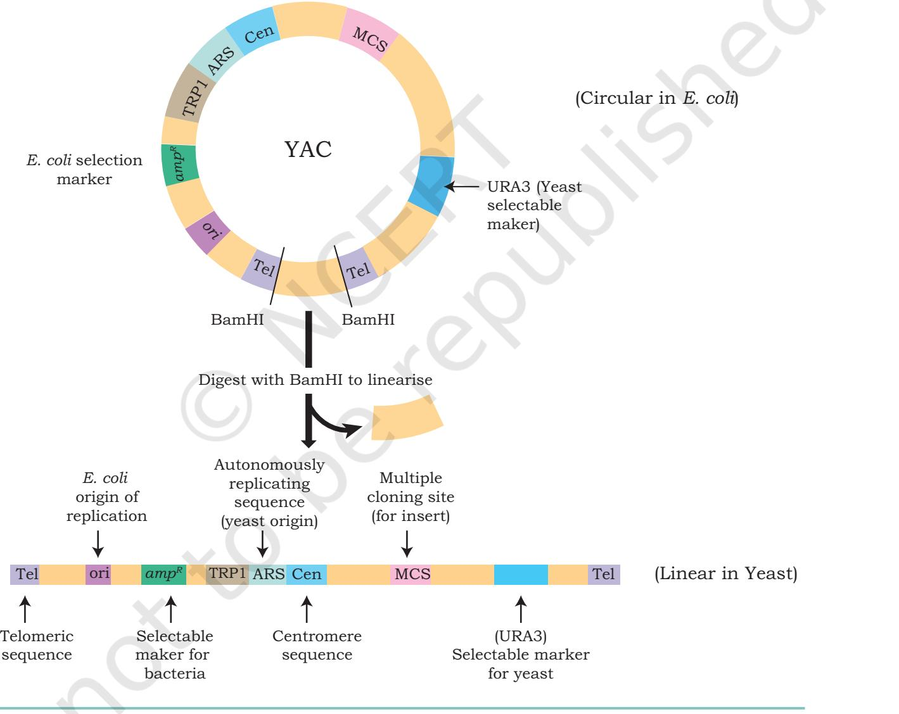

*Fig. 2.13: Yeast Artificial Chromosome (YAC)*

**Host-Vector System 21**

Chapter 2_Host vector system.indd 21 07-02-2023 10:05:28

Vectors like YACs are sometimes called high capacity cloning vectors. Some other high capacity cloning vectors coming from bacterial plasmid and phage are called **Bacterial Artificial Chromosomes (BACs)** and **Phage Artificial Chromosomes (PACs)**.

promoter for expression of the cloned genes. These promoters are generally inducible in nature so that expression of the cloned gene can be regulated. Downstream of the promoter there are unique restriction sites for insertion of the gene to be expressed. Furthermore, in order to ensure correct termination of transcription of the cloned genes, a proper transcription termination sequence is provided by the vector near the 3' end of the gene. Thus, the cloned gene is inserted between a promoter towards the 5' end (upstream) and a terminator at the 3' end (downstream) of the cloned gene in an expression vector. This portion of the vector is called expression cassette. Such vectors are therefore, sometimes also

Expression of a gene by recombinant strategies depends on the source of the gene as well as the host being used. Thus, for example, if a gene of eukaryotic origin is to be expressed in a prokaryotic host (or a vice versa) known as heterologous gene expression, as the gene being expressed is foreign to the host. Such heterologous expression requires that the eukaryotic gene being expressed: (i) does not contain intron(s) as the process of splicing is absent in the prokaryotic host, (ii) Expressed protein does not require post translational modification (e.g. glyocosylation) for its biological activity

called **sandwich expression vectors**.

(functionality).

**2.6 SHUTTLE VECTORS**

Vectors developed for repli- cation in two alternative hosts (either prokaryotic or eukaryotic) are called shuttle vectors. These vectors are themselves constructed by recombinant DNA techniques, and many different types have been made. Some of them shuttle between two prokaryotic species, others between a prokaryote (usually *E. coli* ) and eukaryotic cells (including yeast, plants

A list of commonly used vectors for gene cloning having different capacities to take up different size inserts are shown in Table 2.2.

| S. No. | Vectors | Insert size (kb) |
| --- | --- | --- |
| 1. | Plasmid | ≤ 10kb |
| 2. | Bacteriophage | 8–25 kb |
| 3. | Cosmids | 23–40 kb |
| 4. | PAC | 100–300 kb |
| 5. | BAC | ≤ 300 kb |
| 6. | YAC | 200–500 kb |

**Table 2.2: DNA insert size with different cloning vectors**

## **2.5 EXPRESSION VECTORS**

Till now we have discussed the different types of cloning vectors which are used to propagate DNA. Another type of vectors are expression vectors which act as vehicles for DNA insert and also allow the DNA insert (gene) to be expressed efficiently (Fig. 2.14). These may be plasmids or viruses based vectors. These vectors contain an efficient

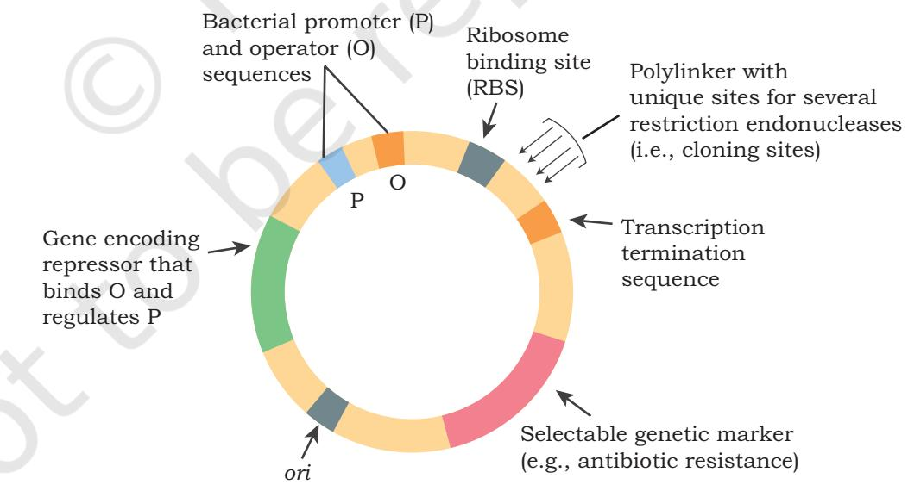

*Fig. 2.14: An expression vector*

**22 Biotechnology XII**

Chapter 2_Host vector system.indd 22 07-02-2023 10:05:28

promoter for expression of the cloned genes. These promoters are generally inducible in nature so that expression of the cloned gene can be regulated. Downstream of the promoter there are unique restriction sites for insertion of the gene to be expressed. Furthermore, in order to ensure correct termination of transcription of the cloned genes, a proper transcription termination sequence is provided by the vector near the 3' end of the gene. Thus, the cloned gene is inserted between a promoter towards the 5' end (upstream) and a terminator at the 3' end (downstream) of the cloned gene in an expression vector. This portion of the vector is called expression cassette. Such vectors are therefore, sometimes also called **sandwich expression vectors**.

Expression of a gene by recombinant strategies depends on the source of the gene as well as the host being used. Thus, for example, if a gene of eukaryotic origin is to be expressed in a prokaryotic host (or a vice versa) known as heterologous gene expression, as the gene being expressed is foreign to the host. Such heterologous expression requires that the eukaryotic gene being expressed: (i) does not contain intron(s) as the process of splicing is absent in the prokaryotic host, (ii) Expressed protein does not require post translational modification (e.g. glyocosylation) for its biological activity (functionality).

### **2.6 SHUTTLE VECTORS**

Vectors developed for repli- cation in two alternative hosts (either prokaryotic or eukaryotic) are called shuttle vectors. These vectors are themselves constructed by recombinant DNA techniques, and many different types have been made. Some of them shuttle between two prokaryotic species, others between a prokaryote (usually *E. coli* ) and eukaryotic cells (including yeast, plants

Gene encoding repressor that binds O and regulates P

Bacterial promoter (P) and operator (O)

> P O

sequences Polylinker with

Ribosome binding site (RBS)

unique sites for several restriction endonucleases

(i.e., cloning sites)

Transcription termination sequence

Selectable genetic marker

(e.g., antibiotic resistance) *ori*

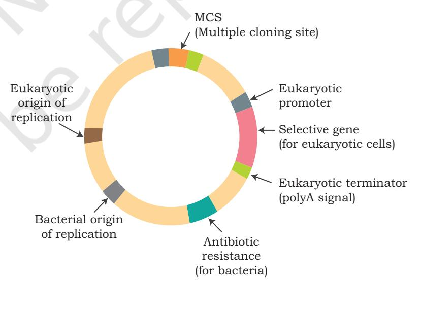

*Fig. 2.14: An expression vector Fig. 2.15: Shuttle vector for E. coli and yeast*

**Host-Vector System 23**

Chapter 2_Host vector system.indd 23 07-02-2023 10:05:28

and animals). Indeed, most of the eukaryotic vectors are shuttles. Shuttle vectors contain two origins of replication, however, in a given host, only one origin is active at a time (Fig. 2.15).

### **SUMMARY**

- rDNA technology is a two-component system: a compatible host and a vector combination, where the vector provides essential sequences required for its replication in a compatible host which provides various replication functions.
- The cloning vector should be small in size and have an origin of replication or *ori* site, unique restriction sites and selectable marker.
- Plasmids are circular, extra-chromosomal double stranded DNA (dsDNA) capable of autonomous replication.
- The bacteriophages lambda (λ) and M13 are the two most common phages whose genomes have been frequently used to make cloning vectors for *E. coli* host.
- The bacteriophage lambda, a bacterial virus that infects *E. coli*, has been widely used as a cloning vector.
- Typical vectors coming out of lambda genome fall into two broad classes, namely 'insertion vectors' and 'replacement vectors'.
- M13 is a filamentous bacteriophage of *E. coli* having genome consisting 6.4kb long circular DNA packaged in a tubular capsid.
- An example of M13 based vector for *E. coli* is M13mp18 which facilitates blue/white selection of recombinants.
- Cosmids are a type of hybrid (combination) vector that replicate like a plasmid but can be packaged *in vitro* into lambda phage coats.
- A typical cosmid has replication functions, unique restriction endonuclease sites, and selective markers contributed by plasmid DNA, combined with a lambda DNA segment that includes the joined cohesive ends (*cos* sites).
- Phasmids are true combination vectors between phage and plasmid. They are linear duplex DNAs whose ends

Chapter 2_Host vector system.indd 24 07-02-2023 10:05:28

are lambda segments that contain all the genes required for a lytic infection and the middle segment is linearised plasmid.

- Among eukaryotic host vector system, the most common is the baker's yeast, *Saccharomyces cerevisiaes,* from which YAC's have been derived through genetic engineering.
- A YAC cloning vector consists of two copies of a yeast telomeric sequence (telomeres are the sequences at the ends of chromosomes), a yeast centromeric sequence, a yeast ARS (an autonomously replicating sequence) and appropriate selectable markers.

### **EXERCISES**

- 1. Describe the importance of host vector system in rDNA technology.
- 2. What are the major characteristics of a vector?
- 3. What is plasmid and what are its different types?
- 4. Discuss the strategy applied for the development of (pBR322) plasmid cloning vectors.
- 5. Briefly describe the structure of lambda bacteriophage and also discuss the role of lambda phage based vectors.
- 6. Discuss the M13 based vectors and its application.
- 7. Differentiate between cosmids and phagemids.
- 8. Why is a vector required for cloning of a gene?
- 9. A plasmid capable of getting integrated into host chromosome is called:
- (a) Col plasmid
- (b) Episome
- (c) Ti plasmid
- (d) R plasmid
- 10. Why the replication of single copy plasmid called stringent replication?
- 11. Identify the incorrect match pair from the following:
- (i) Multi copy plasmid (a) Stringent replication
- (ii) Col plasmid (b) Kills bacteria
	-
- (iii) pBR322 (c) Plasmid
- -
- (iv) Prophage (d) Phage genome inserted into a host genome

**Host-Vector System 25**

Chapter 2_Host vector system.indd 25 07-02-2023 10:05:28

- 12. How can a large size eukaryotic gene insert be cloned?
- 13. **Assertion:** An ideal vector should have selectable marker.

**Reason:** Selectable markers are required to screen out transformation.

- (a) Both assertion and reason are true and the reason is the correct explanation of the assertion.
- (b) Both assertion and reason are true but the reason is not the correct explanation of the assertion.
- (c) Assertion is true but reason is false.
- (d) Both assertion and reason are false.
- 14. **Assertion:** Cosmid is a hybrid vector.

**Reason:** Cosmid has properties of both plasmids and lambda phage vector.

- (a) Both assertion and reason are true and the reason is the correct explanation of the assertion.
- (b) Both assertion and reason are true but the reason is not the correct explanation of the assertion.
- (c) Assertion is true but reason is false.
- (d) Both assertion and reason are false

Chapter 2_Host vector system.indd 26 07-02-2023 10:05:28

