# **Gene Cloning**

**Chapter 3**

Gene cloning is a customary procedure to use a gene for its product in the biotechnology industry and various other purposes. Traditionally, it engages the transfer of a DNA fragment containing the gene of interest to a host cell by a vector so that many copies of the gene will be available for its characterisation and future application. Technological breakthrough in the field of genetic engineering have made it possible to analyse DNA, isolate a specific gene from a genome, enzymatically inserting it into an autonomously replicating vector (e.g. plasmid) to generate rDNA molecule and ultimately introducing into host (e.g. bacteria) to produce a virtually unlimited number of copies (clones) of it. This chapter will expose students to all the procedures involved in gene cloning.

### **3.1 IDENTIFICATION OF CANDIDATE GENE**

Over the past decades, rDNA technology has been utilised to produce crops that are resistant to pests, diseases, herbicides and pathogens. This is possible by manipulating the specific gene of interest of one organism followed by its transfer into the genome of another organism, which upon

- *3.1 Identification of Candidate Gene*
- *3.2 Isolation of Nucleic Acids*
- *3.3 Enzymes used for Recombinant DNA Technology*
- *3.4 Modes of DNA Transfer*
- *3.5 Screening and Selection*
- *3.6 Blotting Techniques*
- *3.7 Polymerase Chain Reaction (PCR)*
- *3.8 DNA Libraries*

Chapter 3_Gene Cloning.indd 27 07-02-2023 10:06:40

expression results in the desired product or activity. The first and most formidable problem in this process is to identify the candidate gene in the genome of an organism.

Identification of a gene to be cloned depends upon its significance with regard to its role in biomedical, economical and evolutionary fields. This information on a gene comes from its biochemical and physiological studies. For example, the cause of diseases (diabetes in human beings due to deficiency of insulin) or defect in the metabolic pathways (iron deficiency leading to chlorosis in plants) or resistance to environment (salinity tolerance in plants) or resistance to infection (both in plants and animals) or economically important genes (milk protein, blood clotting factors, etc.) are candidate genes for the improvement of human health and needs. Once a gene of interest is identified, it is explored in new sources and the same is cloned as mentioned in the subsequent sections.

 Searching a gene of interest is not an easy task. This will be clear from the following example. As you know, a haploid human genome contains approximately 3.2 billion bp. Therefore, searching a gene of interest having a size of 3000 to 3500 bp, which is one-millionth of the genome; is perhaps more difficult than looking for a needle in the haystack. However, in case we know the protein product of a gene, we can synthesise its mRNA sequence using genetic code from which its DNA sequence can be deduced or we can use the mRNA as a probe to search the gene from its genome library. We can also isolate the mRNA of the gene from a tissue which produces it exclusively. From mRNA, we can prepare RNA:cDNA hybrid molecule using reverse transcriptase enzyme. RNA strand from RNA:cDNA hybrid molecule can be removed using RNase enzyme. The single strand cDNA is converted into double stranded cDNA by using DNA polymerase enzyme. The candidate gene can then be cloned, which is discussed in the subsequent chapters.

### **3.2 ISOLATION OF NUCLEIC ACIDS**

The first and foremost requirement for any molecular biology experiment is isolation of nucleic acids from organisms. Extraction of nucleic acids is encountered by two big challenges. First one is related to their availability in cells as DNA and RNA, both of which are present in very

Chapter 3_Gene Cloning.indd 28 07-02-2023 10:06:40

small amounts in cells in comparison to other biological macromolecules, such as proteins, carbohydrates and lipids. Second, the enormous length of nucleic acids, particularly makes it susceptible to cleavage when exposed to harsh physical stress. In addition, the chemical bonds by which different components of nucleic acids are joined with each other and various groups present in them make nucleic acid vulnerable to chemical agents.

Four important steps are involved during the extraction of nucleic acids. The first step involves the effective rupture of cell membrane or walls to release the

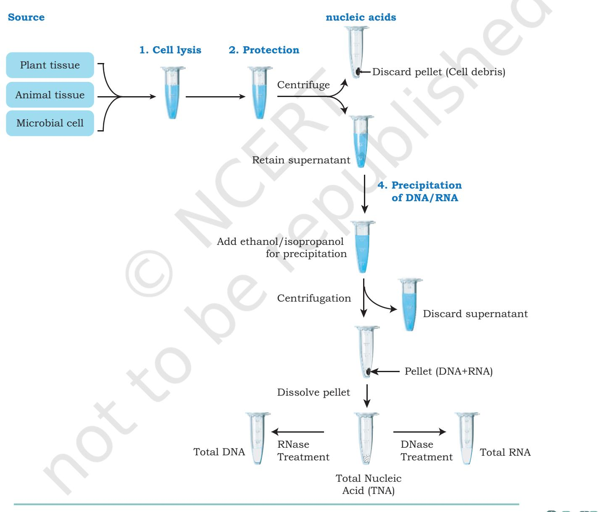

*Fig. 3.1: Steps involved in the isolation of nucleic acid*

Chapter 3_Gene Cloning.indd 29 07-02-2023 10:06:40

**Gene Cloning 29**

nucleic acids and other cellular molecules. The second step involves the protection of nucleic acids from their respective degrading enzymes which are released in the isolation medium with other proteins. In the third step, the nucleic acids are separated from other molecules. In the fourth and the last step, the isolated nucleic acids are precipitated and concentrated by adding ethanol or isopropanol (Fig. 3.1).

Although, chemical and physical properties of nucleic acids are similar in all organisms, the outer boundary of cells differs from one organism to another. Therefore, in order to disrupt the cell boundaries for releasing nucleic acids into extraction medium, different strategies are adopted. Animal cells have plasma membrane which can be easily disrupted. On the other hand, plant cells and bacteria are protected by tough layers (e.g., cell wall), which need different approaches for their lysis. These include homogenisation, grinding, sonication or enzymatic treatment. Such mechanical or enzymatic treatment ruptures plasma membrane or cell wall so that nucleic acids get released from cells and exposes them to nuclease enzymes (deoxyribonuclease and ribonuclease), which are also released simultaneously.

As bacterial cells have little structure beyond the cell wall and cell membrane, isolating DNA from them is much easier. An enzyme called lysozyme digest the peptidoglycan, the main component of bacterial cell wall. Detergents like sodium dodecyl sulphate (SDS) is used to lyse the cell membranes by disrupting the lipid bilayer. Plant and animal cells are ground to release the intracellular components. Plant cells are mechanically ruptured in a blender to break open the tough cell walls. For isolation of DNA from plant cells, cetyl trimethyl ammonium bromide (CTAB) is used as detergent (a cationic detergent). Plant cells have high concentration of polysaccharide and polyphenols in comparison to animal cells and pose problems during isolation of DNA. The solubility of DNA and polysaccharides to CTAB depends on ionic strength of the solution. At low ionic strength, DNA is soluble in CTAB solution while polysaccharides are insoluble; whereas at high ionic strength, polysaccharides are soluble and DNA is insoluble. In addition, being a detergent, it also

Chapter 3_Gene Cloning.indd 30 07-02-2023 10:06:40

lyses cell wall. Both the molecules are separated based on their differential affinity to CTAB. Addition of polyvinyl pyrrolidone (PVP) to CTAB extraction medium neutralises phenols. Soluble DNA present in supernatant is extracted with chloroform-isoamyl solution. DNA present in aqueous phase is precipitated using ethanol or isopropanol. In case of animal cells, the cell membrane is disrupted by detergent to release the intracellular components.

The cells and tissues from which nucleic acids are to be extracted are broken down in a medium either mechanically or enzymatically. The media is usually a buffer having mild alkaline pH with minimum ionic strength (0.05 M) containing chelating agent ethylene diamine tetraacetic acid (EDTA). The mild alkaline pH facilitates the reduction of electrostatic interaction between DNA and basic proteins (histones) released during cell disruption. Chelating of divalent cations particularly Mn2+ and Mg2+ prevents the action of nucleases. Further, inhibition of their activities is achieved due to alkaline pH of the buffer. In addition, chelating of divalent cations prevents the formation of their respective salts with phosphate groups of nucleic acids.

The next step is to separate nucleic acids from its bound proteins. This is achieved by decreasing interaction between proteins and nucleic acids so that nucleic acids are free of proteins, by exposing to detergents, like SDS, an anionic detergent. Exposure to SDS makes all the protein molecules anionic. Consequently, basic proteins which are positively charged and bound to negatively charged nucleic acids become negatively charged and dissociate from the nucleic acids. In addition, SDS also prevents the activities of nucleases thereby giving additional protection to nucleic acids from nucleases. Then sodium chloride is added to the medium at high concentration. Increased salt concentration diminishes the ionic interaction between DNA and cations thus ensuring complete dissociation of DNA and protein complexes. Deproteinisation of the medium is achieved by exposing it to chloroform and isoamyl alcohol. These solvents are non-polar in nature. When it is added to the medium which is polar in nature and subjected to centrifugation, it gives three distinct layers. Since, the density of organic solvent mixture is higher than water, it forms a lower layer (which contains denatured

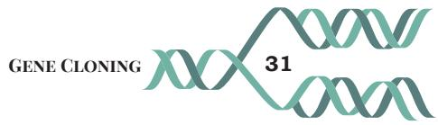

Chapter 3_Gene Cloning.indd 31 07-02-2023 10:06:40

proteins) while the upper layer is aqueous in nature and contains nucleic acids. Chloroform causes denaturation of proteins while isoamyl alcohol prevents the formation of foam and helps in stabilising the interface between lower organic and upper aqueous phase, that can be separated by pipetting. The nucleic acids from aqueous phase are precipitated by addition of ethanol to aqueous medium which reduces its polarity, that makes aqueous medium as non-polar and thus nucleic acids become insoluble which were otherwise soluble in aqueous medium. To remove RNA, the enzyme ribonuclease A is added which digests RNA into ribonucleotides. DNA is then isolated by centrifugation and stored at low temperatures.

### **RNA Isolation**

RNA is single stranded, while DNA is mostly double stranded. Ribonucleases (RNases), a group of enzymes that degrade RNA molecules, are abundant in the environment

#### **Cell lysis and dissolution**

Cell lysis can be achieved using buffers or reagents containing chaotropic agent Guanidinium isothiocyanate (GITC).

#### **Denaturation of DNA and proteins**

D K nase can be used to degrade DNA, while proteinas can be e a t dded to digest proteins. Alterna ively, epeated r ro ganic e t x raction using phenol and chloroform or dissolving the i sample n buffers c m ontaining guanidinium salts can also be used to re ove proteins.

#### **Denaturation and inactivation of RNases**

This can be achieved using any of the chaotropic agents such, as phenol and chloroform.

#### **Separation of cellular components**

R a NA c n be a sep rated from other cellular components by adding chloroform and centrifuging the solution. This separates the solution into two phases: organic and aqueous phases. The aqueous phase contains RNA.

#### **Precipitation**

RNA is often recovered from the aqueous phase using isopropanol.

denaturation of proteins *Fig. 3.2: (a) Flow chart for the isolation of RNA*

and it is difficult to remove or destroy RNases completely. Thus, it is often difficult to isolate intact RNA.

Total RNA is extracted from biological samples by using a specific reagent known as guanidinium isothiocyanate (GITC) phenol-chloroform. GITC is a chaotropic reagent and acidic in nature as it disrupts the hydrogen bond and releases energy to increase entropy (chaos) that reduces hydrophobic effect of the solution resulting in the aggregation of proteins and nucleic acids. Phenol causes

**32 Biotechnology XII**

Chapter 3_Gene Cloning.indd 32 07-02-2023 10:06:40

while chloroform solubilises lipids. Chloroform also enhances specific gravity of phenol with respect to water. When biological samples are treated with GITC solution and subjected to centrifugation, the solution gets separated into three phases: upper aqueous phase, followed by interface and organic phase. Total RNA is extracted in the aqueous phase due to the acidic nature of the reagent while DNA and denatured proteins are retained in the interface or organic phase. This step also inactivates RNase enzyme that may hydrolyse RNA. Subsequently, RNA from aqueous phase is precipitated with the help of isopropanol (Fig. 3.2 (a) and b).

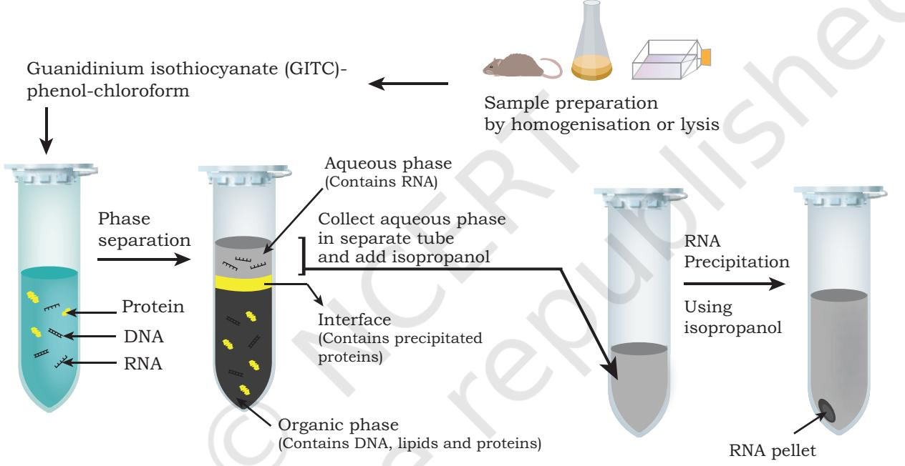

### **Box 1: Separation of Plasmid DNA from Genomic DNA**

Two types of DNA molecules are isolated in cloning experiments. One is plasmid DNA and the other genomic DNA from bacteria. Chromosomal DNA is separated from plasmid DNA by boiling bacterial lysate. The boiling of lysate causes irreversible denaturation of chromosomal DNA and denaturation of proteins including deoxyribonuclease. Boiling causes formation of a gel, which is precipitated by centrifugation. On the other hand, partially denatured plasmid DNA (due to boiling) is renatured as circular double helix and become soluble. In another method, bacterial suspension is lysed and its contents are denatured by anionic detergent SDS and NaOH solution. The broken cell wall, chromosomal DNA and denatured proteins are clumped as a large mass coated with SDS that are precipitated from solution by replacing sodium ions (Na+) with potassium ions (K+). The precipitate is then separated by centrifugation. The plasmid DNA is isolated from the supernatant by ethanol precipitation.

**Gene Cloning 33**

Chapter 3_Gene Cloning.indd 33 07-02-2023 10:06:41

## **3.3 ENZYMES USED FOR RECOMBINANT DNA TECHNOLOGY**

Enzymes constitute an important tool in rDNA technology. The major task of the manipulation of the DNA involves cutting and ligation of the vector DNA and the gene of interest. For this, the natural abilities of different enzymes found in organisms are exploited. The major enzymes used in the rDNA technology are:

- **(i) Nucleases:** Nucleases are the enzymes which cleave nucleic acids by hydrolysing the phosphodiester bond that joins the sugar residues of adjacent nucleotides. Some nucleases are DNA specific called DNases and some are RNA specific called RNases. There are two major types of nuclease enzymes depending on their preference of the location of phosphodiester bonds of polynucleotide chains (DNA or RNA or synthetic polynucleotide chain) namely, exonuclease and endonuclease. Exonuclease, as the name suggests, removes the
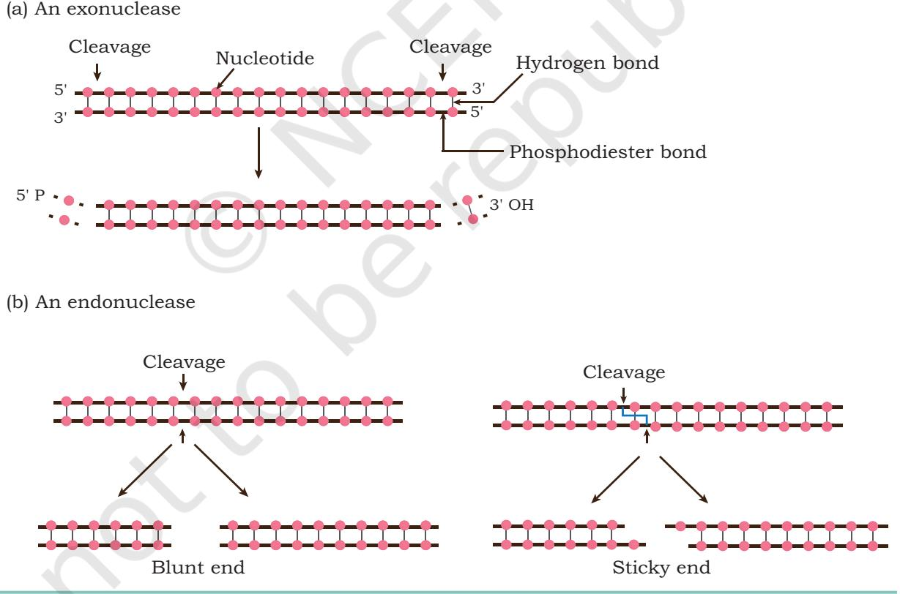

*Fig. 3.3: (a) An exonuclease, which removes nucleotides from the end of DNA molecule (b) An endonuclease, which breaks internal phosphodiester bonds*

Chapter 3_Gene Cloning.indd 34 07-02-2023 10:06:41

Rationalised 2023-24

nucleotides one at a time i.e., mononucleotides, either from the 3′ or 5′ ends of polynucleotide chains. Endonuclease, on the other hand, breaks internal phosphodiester bonds within a DNA or RNA molecule [Fig. 3.3 (a) and (b)].

### **(ii) Restriction endonuclease/enzyme (RE):**

Endonuclease enzymes that cleave DNA molecules at a specific position are called restriction endonucleases or restriction enzymes. They are mostly found in bacteria and archaea that provide a defense mechanism against invading bacteriophages. RE recognises and binds to a specific DNA sequence called recognition sequence or site, often consisting of 4 to 8 bp.

Restriction enzymes are categorised mainly into three groups (Type I, II and III) based on their co-factor requirement and the position of their DNA cleavage site relative to the target sequence. Type I enzymes cleave DNA at a site which is about 1000 bp from the recognition site and require S-adenosyl methionine (SAM), Mg2+, ATP and has DNA strand cleavage, methylase and ATPase activities. Type II enzymes cleave within the recognition site and require Mg2+ and has only DNA strand cleavage activity (Fig. 3.4). Type II REs find application in rDNA technology. Type III enzymes cleave at sites about 24 to 26 bp away from the recognition site; require S-adenosyl methionine (SAM), Mg2+, ATP and has DNA strand cleavage and methylase activities (Table 3.1).

### **Box 2**

The 1978 Nobel Prize in Physiology or Medicine was awarded jointly to Werner Arber, Daniel Nathans and Hamilton Smith for the discovery of 'restriction enzymes' and their application to the problems of molecular genetics. HindII was the first restriction enzyme to be isolated by Hamilton Smith.

|  | Cleavage site | Endonuclease and methylase function |  |  | Examples |
| --- | --- | --- | --- | --- | --- |
| Type I | Random around 1000 bp away from the | Endonuclease and methylase function on a single protein molecule |  |  | EcoKI |
|  | recognition site |  |  |  | EcoAI |
|  |  |  |  |  | CfrAI |
| Type II | Specific within the | Endonuclease and | methylase | are | EcoRI |
|  | recognition site | separate entities |  |  | BamHI |
|  |  |  |  |  | HindIII |
| Type III | Random 24–26 bp away | Endonuclease and methylase function |  |  | EcoPI |
|  | from the recognition site | on a single protein molecule |  |  | HinfIII |
|  |  |  |  |  | EcoP15I |

### **Table 3.1: Types of Restriction Enzymes**

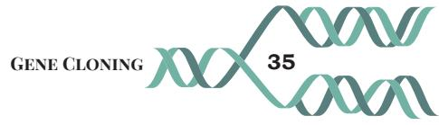

Chapter 3_Gene Cloning.indd 35 07-02-2023 10:06:41

The recognition sequences of widely applied Type II REs are **palindromic sequences**, meaning the sequence on the forward direction on a double stranded DNA reads same in a reverse direction on the complementary strand. These enzymes break specific phosphodiester bond in both strands of the DNA molecule within the restriction sequence recognised by the enzyme or at the site or near the sequence. It generates a 5′-phosphate group at one end of the break and a 3′-hydroxyl group at the other end of the break (Fig. 3.4). Several REs cleave at different locations on the two DNA strands to produce staggered cut having short single-stranded protruding ends called cohesive or sticky ends. Some REs produce blunt ended cut by cleaving both strands of DNA at same location (Fig. 3.4).

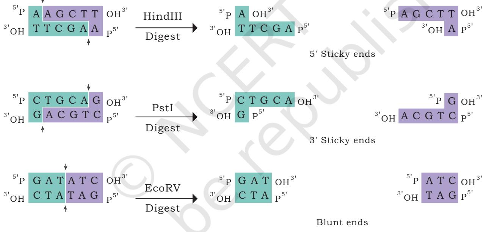

*Fig. 3.4: Type II REs generating sticky or blunt ends*

**36 Biotechnology XII**

Let us now understand the nomenclature of restriction enzymes. The enzyme is named after the microorganism from which it is isolated. The first capital letter represents the genus, the second and third letters represent species. The fourth letter specifies the strain of the microorganism. And the last Roman number represents the number of the enzyme isolated from the species (Table 3.2).

Chapter 3_Gene Cloning.indd 36 07-02-2023 10:06:41

| EcoRI |  |
| --- | --- |
| Escherichia (E) | genus |
| coli (co) | specific epithet |
| strain Ry13 (R) | strain |
| first endonuclease (I) | order of identification |
| HindIII |  |
| Haemophilus (H) | genus |
| influenzae (in) | specific epithet |
| strain Rd (d) | strain |
| third endonuclease (III) | order of identification |

#### **Table 3.2: Nomenclature for restriction endonucleases**

- **(iii) DNA ligase:** Ligase enzyme facilitate the joining of DNA strands together by catalysing the formation of a phosphodiester bond in the duplex form (Fig. 3.5). Bacterial DNA ligases, from *E. coli* ,use the hydrolysis of NAD as their energy source, whereas ATP is the energy source for DNA ligases from bacteriophages (e.g., T4) and eukaryotic cells. The 5′-P group of one chain makes a covalent linkage with the 3′- OH group of adjacent chain. T4 DNA ligase is used to join two DNA molecules having cohesive ends or blunt ends. *E. coli* DNA ligase is used to join a gap between two nucleotides in one strand of DNA molecules.
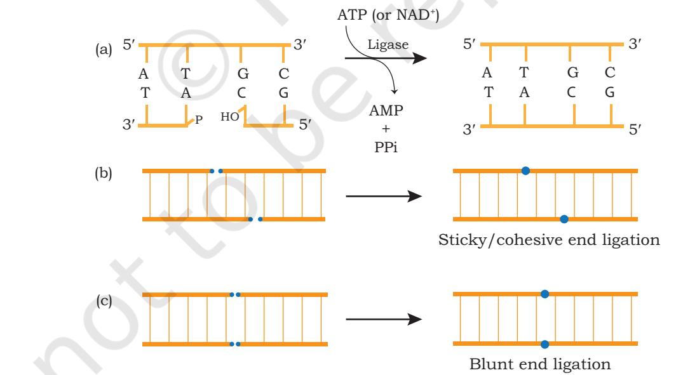

*Fig. 3.5: Ligation of DNA by ligase (a) Formation of phosphodiester bond (b) Ligation of sticky end (c) Ligation of blunt end*

Chapter 3_Gene Cloning.indd 37 07-02-2023 10:06:41

- **(iv) DNA polymerases:** DNA polymerases are a group of polymerases that catalyse the synthesis of new DNA strand by using mono-deoxyribonucleoside triphosphates (dNTPs) on a template strand. A DNA polymerase enzyme synthesises new DNA strand in 5′→3′ direction (Fig. 3.6). It cannot initiate synthesis of a new DNA strand. In addition to dNTPs, they require a primer (oligonucleotide) carrying a free 3′-end hydroxyl group that can be used as the starting point of chain growth. DNA polymerase I of *E.Coli* exhibit several other activities, such as 5′→ 3′ exonuclease and 3′→ 5′-exonuclease.
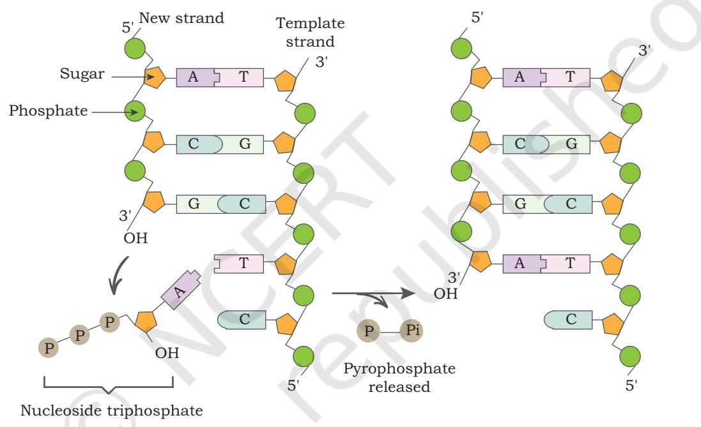

*Fig. 3.6: DNA polymerase adds nucleotides at 3*′*OH end of the DNA molecule* 

- **(v) Alkaline phosphatase:** Alkaline phosphatase is used to remove the terminal phosphate group from 5′ end of DNA strands.
- **(vi) Polynucleotide kinase:** Using polynucleotide kinase, a phosphate group can be attached to hydroxyl (-OH) group present on 5′ end of DNA. Polynucleotide kinase has the reverse effect of alkaline phophatase, adding phosphate groups onto free 5′ termini.

Chapter 3_Gene Cloning.indd 38 07-02-2023 10:06:42

- **(vii) Terminal deoxynucleotidyl transferase or terminal transferase:** This enzyme can add similar nucleotide residues to form a homopolymer tail on 3′ end of a DNA strand. Unlike most DNA polymerases, it does not require a template.
- **(viii) Reverse transcriptase:** It is also called RNA directed DNA polymerase and is found in many retroviruses. It is used to generate complementary DNA (cDNA) strand from a–RNA template, a process termed as reverse transcription (Fig. 3.7).

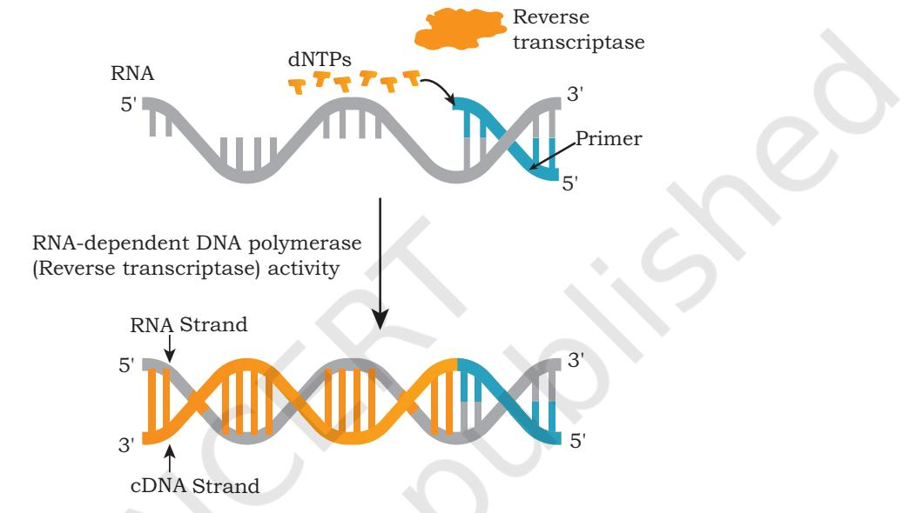

*Fig. 3.7: Reverse transcription*

- **(ix) Poly A polymerase:** It incorporates adenine residues to hydroxyl group of 3′ end of RNA (Fig. 3.8).
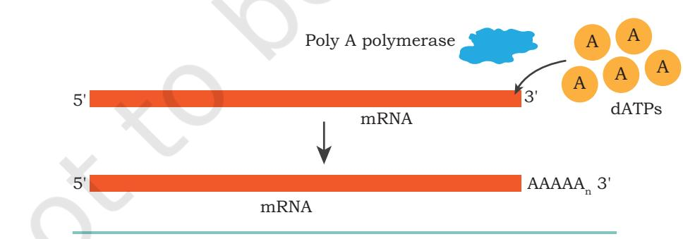

*Fig. 3.8: Addition of dATPs by poly A polymerase*

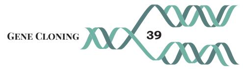

Chapter 3_Gene Cloning.indd 39 07-02-2023 10:06:42

## **3.4 MODES OF DNA TRANSFER**

Transfer of a foreign DNA molecule to a host cell (prokaryotic or eukaryotic) from its surrounding environment is one of the basic steps in rDNA technology. In nature, bacteria obtain foreign DNA molecules from its surroundings in three different ways, which are: (i) transformation, (ii) transduction and (iii) conjugation.

- **(i) Transformation:** Transformation is genetic alteration of a cell resulting from the direct uptake of exogenous DNA molecule from its surroundings through the cell membrane and gets incorporated in the recipient genetic material. Recipient cells with foreign DNA molecule are referred to as **transformants** (Fig. 3.9). Transformation occurs naturally in some species of bacteria.
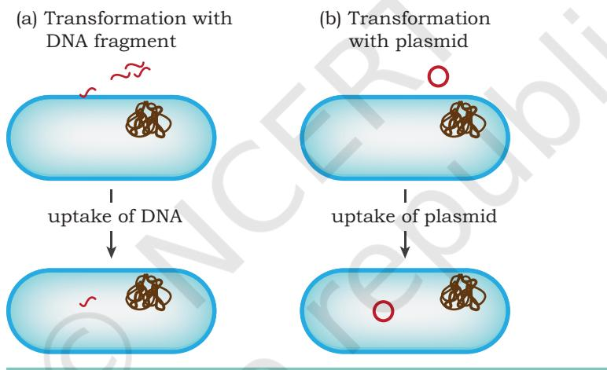

*Fig. 3.9: Transformation in bacteria*

**40 Biotechnology XII**

- **(ii) Transduction:** Viruses may also mediate the uptake of foreign DNA into the genome of a cell. Viruses which specifically infect bacterial cells are known as bacteriophages. Bacteriophages on infecting follow a lytic cycle or a lysogenic life cycle in the host. In **lysogenic life cycle**, the bacteriophage genome gets incorporated into bacterial DNA, and remains dormant for several generations. After a period of time when phage genome gets excised from the host DNA, they occasionally take small sequences of bacterial DNA with them. Phage genome containing bacterial DNA is then packaged into phage coat proteins to
Chapter 3_Gene Cloning.indd 40 07-02-2023 10:06:42

form a complete, recombinant viral particle. When this phage infects a bacterial cell, the recombinant phage genome containing bacterial DNA is introduced into bacteria (Fig. 3.10). The recipient bacterial cell is referred to as **transductants**.

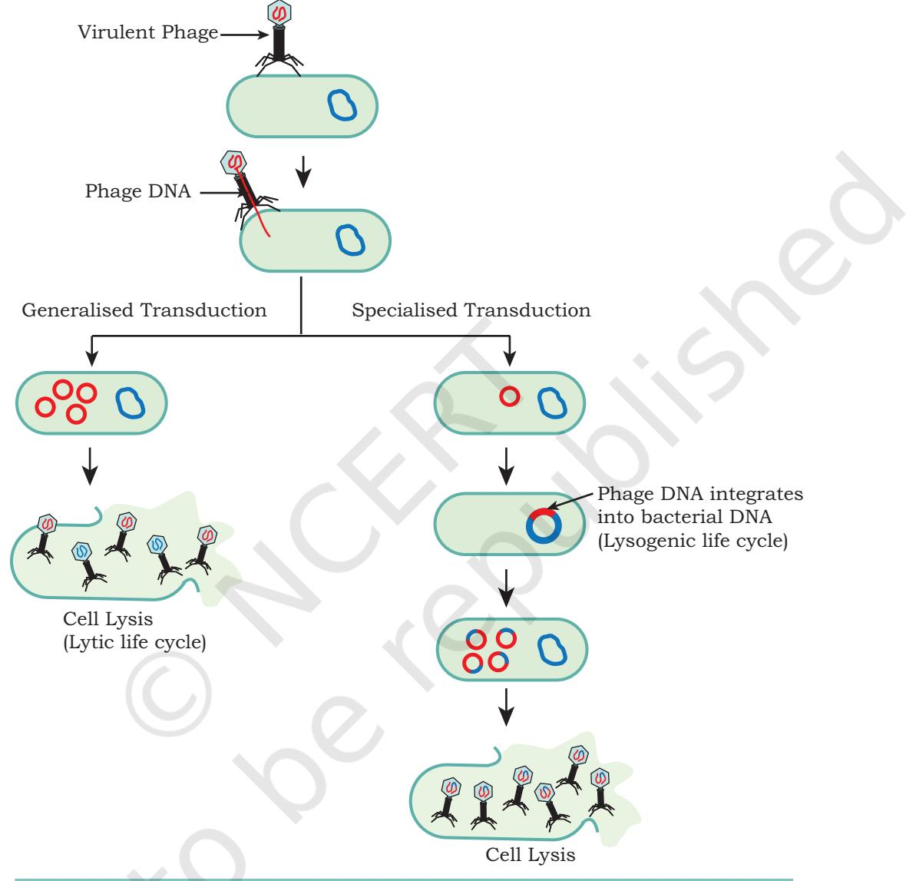

*Fig. 3.10: Transduction in bacteria*

- **(iii) Conjugation:** Conjugation is referred to as transfer of genetic material (DNA) from one bacterium to another through cell-to-cell direct contact. The bacterial cell that transfers its DNA is called the donor cell and the one which receives is the recipient cell. Conjugation is usually mediated by
**Gene Cloning 41**

Chapter 3_Gene Cloning.indd 41 07-02-2023 10:06:42

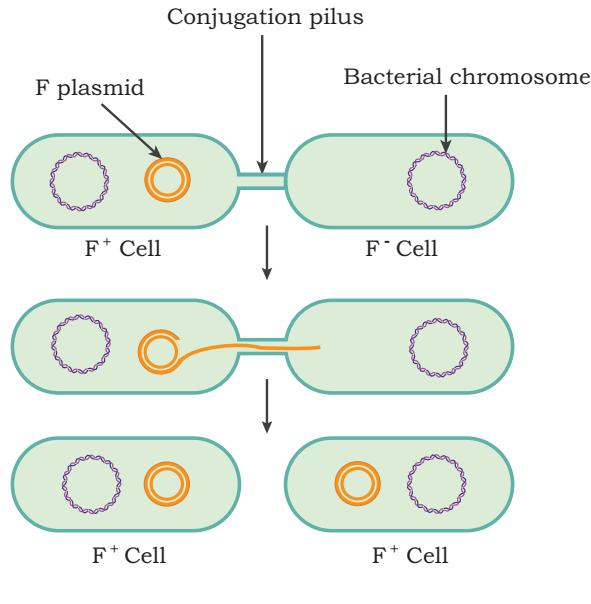

*Fig. 3.11: Bacterial conjugation*

**42 Biotechnology XII**

F plasmids that carry a DNA sequence called the fertility factor, or F–factor. The F-factor produces a thin tube-like structure called **pilus**, through which the donor cell makes contact with the recipient. A nick is made in one of the strands of double stranded F-plasmid by an enzyme relaxase in the donor cell and this strand is transferred to the recipient cell through pilus. Inside both donor and recipient cells, the singlestranded DNA undergoes replication to form double-stranded F plasmid identical to the original F plasmid (Fig. 3.11).

In rDNA technology, the rDNA is introduced (transferred) in host cells by numerous methods. Chemical (calcium chloride, lipofection, etc.) and physical

(electroporation, microinjection and gene gun) methods for introducing foreign DNA molecules into host cells are commonly used. In **calcium chloride method**, the DNA to be transferred is mixed in a solution containing positively charged calcium and the negatively charged group of DNA to form a complex. The host cells take up the foreign DNA molecule by a process of heat shock. In **electroporation method**, transient micropores are created on the membrane of host cells by exposing them to mild electric current in the presence of foreign DNA molecules. The recombinant DNA molecules enter into host cells through transient micropores. **Lipofection** (or liposome transfection) is a technique used to inject genetic material into a cell by means of liposomes, which are vesicles that can easily merge with the cell membrane since they are both made of a phospholipid bilayer. Foreign DNA molecules can be introduced directly to the nucleus of host cells using specialised automated **Microinjection** apparatus. In **biolistic method**, with the help of a gene gun (particle gun), microscopic particles (gold, nickel, tungsten) coated with foreign DNA are bombarded to cells at high velocity so that foreign DNA molecule enters inside the cell (Fig. 3.12).

Chapter 3_Gene Cloning.indd 42 07-02-2023 10:06:43

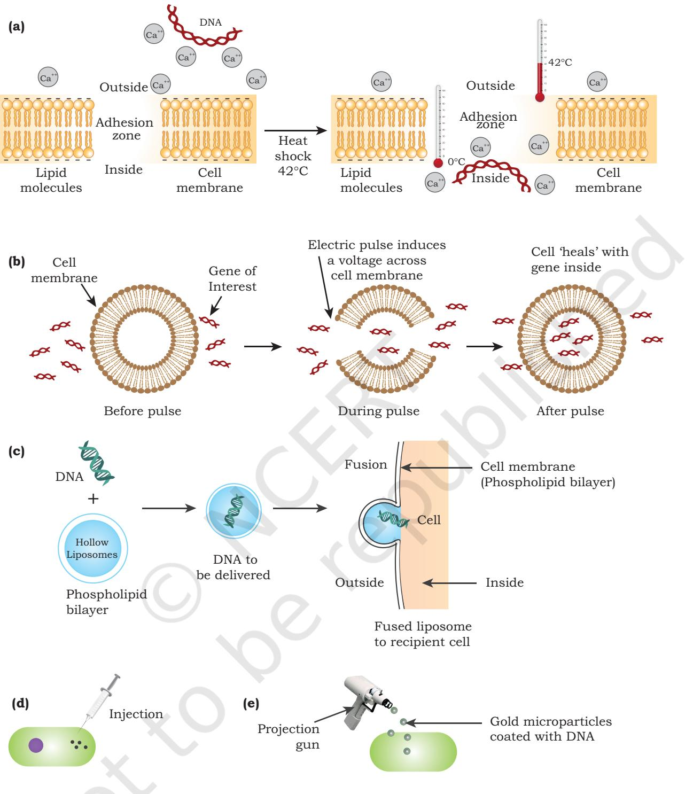

*Fig. 3.12: Methods of DNA transfer (a) Chemical (CaCl2 ), (b) Electroporation, (c) Lipofection method of DNA transfer into host cell, (d) Microinjection and (e) Biolistic method*

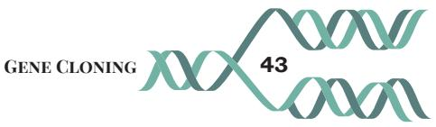

Chapter 3_Gene Cloning.indd 43 07-02-2023 10:06:43

## **3.5 SCREENING AND SELECTION**

Selection of transformed bacteria with recombinant vectors is the most essential step for a successful cloning experiment. Here, the objective is to identify the transformed cells having recombinant vector from a mixture of non-transformed cells. Success rate of insertion of an insert into a plasmid and subsequent transfer of recombinant plasmids to bacteria is very low. Therefore, it is difficult to select a few bacteria containing plasmids with insert from a large number of bacterial populations without the insert.

The method of selection of recombinant cells is based on the principle of difference in biological traits present in hosts with recombinant DNA from those without recombinant DNA. Thus, the recombinant cells are distinguished from non-recombinants on the basis of their expression or non-expression of certain traits, such as antibiotic resistance, or expression of some specific proteins, such as β-galactosidase or Green Fluorescent Protein (GFP), or dependence/independence of a nutritional requirement, such as amino acid leucine. On the basis of this principle, the selection procedure can be divided into two main types as described in the following section.

- **(i) Direct selection of recombinants:** In this method of selection, transformed cells are distinguished from non-transformed cells on the basis of expression of certain traits. For example, bacterial cells (host) are not resistant to a particular antibiotic but when they take up the plasmids containing antibiotic resistant gene, they become resistant to that specific antibiotic. These cells will survive and grow in a media containing the antibiotic(s), whereas the host cells without plasmid will be killed when they are exposed to antibiotics.
 **(ii) Selection of recombinants by insertional inactivation:** This is more efficient than the direct selection method. In this method, a vector having two markers (either two antibiotic resistant genes, or one antibiotic resistant gene and one *lacZ* gene) is used. When the gene of interest (insert DNA) is inserted into one of the selection marker genes in the vector, its expression is disrupted and hence called insertional inactivation. Let

Chapter 3_Gene Cloning.indd 44 07-02-2023 10:06:43

us use a plasmid with two antibiotic resistance genes—one for ampicillin (*ampR* gene) and the other for tetracycline (*tetR* gene). The target DNA (insert) is inserted into *ampR* gene of the plasmid making them recombinant plasmids. Now we have plasmids with insert and without insert. When this plasmid mixture is added to a culture of bacteria as described earlier, there will be three different populations of host bacterial cells: (i) host cells without plasmids (non-transformed), (ii) transformed host cells with plasmids without insert and (iii) transformed host cells with recombinant plasmids (with insert). Now it is essential to identify those cells which have received the recombinant plasmid. This process of screening is based on the property of resistance to ampicillin which is lost in the host cell having recombinant plasmids. The insert gets cloned in ampR gene leading to insertional inactivation of ampicillin resistance gene (ampR) (Fig. 3.13). When these bacteria are plated on a media containing tetracycline, the non-transformed cells get eliminated as they are sensitive to it. Only transformed cells (with functional *tetR*) multiply and form colonies as they are resistant to it. There will be two types of colonies (master plate)— one of transformed cells having plasmid without insert (non-recombinant) and the other of transformed cells having plasmid with insert (recombinant) (Fig. 3.13). By using nitrocellulose membrane, bacterial cells from the master plate colonies are plated on a solid media containing ampicillin. Transformed cells with vectors (without insert) will only multiply to form colonies (replica plate) while transformed cells with recombinant vectors will not grow because their *ampR* gene has been inactivated. Now, if we compare the master plate with replica plate, the colonies present in master plate and absent in replica plate are the transformed cells with recombinant vector containing DNA insert of interest (Fig. 3.13).

Chapter 3_Gene Cloning.indd 45 07-02-2023 10:06:43

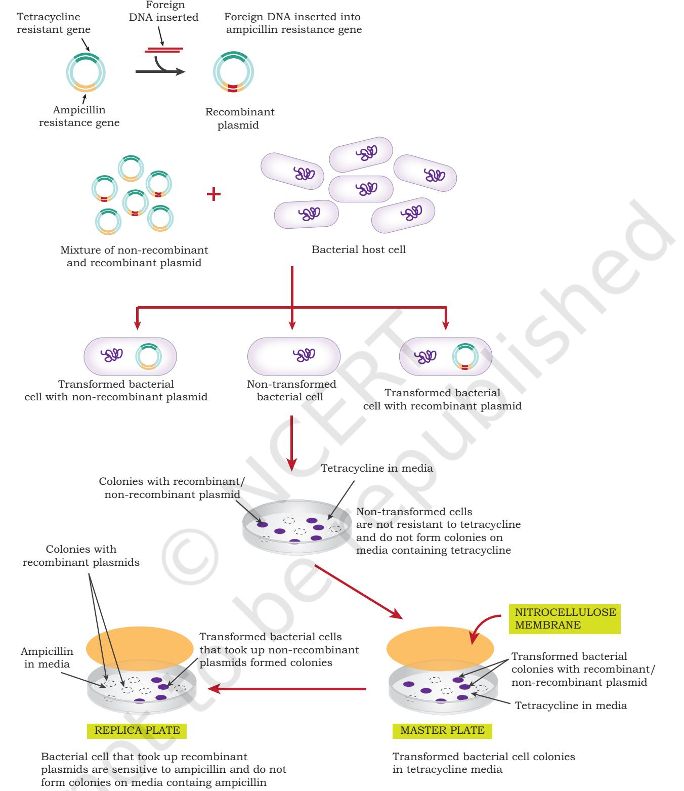

*Fig. 3.13: Selection of recombinants by insertional inactivation*

**46 Biotechnology XII**

Rationalised 2023-24

Chapter 3_Gene Cloning.indd 46 07-02-2023 10:06:48

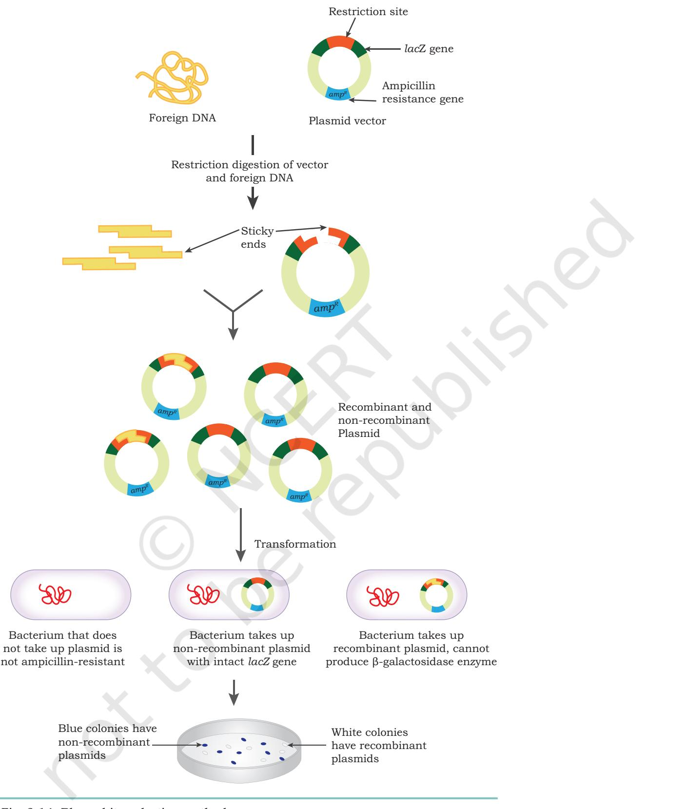

*Fig. 3.14: Blue-white selection method*

Chapter 3_Gene Cloning.indd 47 07-02-2023 10:06:48

**Gene Cloning 47**

Blue-white selection method is another example of insertional inactivation selection method to select the recombinant transformed cells. In this method, *lacZ* gene present in plasmid vector (refer to Vector section of Chapter 2) expresses the β-galactosidase enzyme. β-galactosidase cleaves a colourless chromogenic, Substrate called X-gal (5 Bromo-4-Chloro-3 indolyl-beta D-Galactoside), an analog of lactose to form 5-bromo-4-chloro-indoxyl, which spontaneously dimerises to produce an insoluble blue pigment called 5,5′-dibromo-4,4′-dichloro-indigo. When *lacZ*  gene in the plasmid is inactivated due to insertion of the insert DNA, then the enzyme β-galactosidase is not expressed in hosts containing recombinant plasmids (Fig. 3.14).

During transformation experiment, the bacterial cells (both transformed and non-transformed) are plated on an ampicillin and X-gal-IPTG (Isopropyl β-D-1 thiogalactopyranoside) containing solid media. The nontransformed cells get eliminated and only the transformed cells multiply and form colonies. Two types of colonies will be formed i.e., blue colour and white colour colonies. The bacterial cells in blue colonies contain a vector with an uninterrupted *lacZ*, (no insert) while cells in white colonies, where X-gal is not hydrolysed, indicate the presence of an insert in *lacZ*, which disrupts the formation of an active β-galactosidase.

Alternative methods have been developed in order to screen transformed bacteria e.g., GFP. The concept is similar to *lac*Z in which a DNA insert can disrupt the coding sequence within a vector and thus disrupt the GFP production resulting in non-fluorescing bacteria. Bacteria that have recombinant vectors (vector + insert), will be white and not express the GFP protein, while non-recombinant (vector) will fluoresce under UV light.

## **3.6 BLOTTING TECHNIQUES**

Blotting techniques are widely used by scientists to separate and identify DNA, RNA and proteins from a mixture of molecules. This technique immobilises the molecule of interest on a support, which is a nitrocellulose or nylon or polyvinylidene difluoride (PVDF) membrane. It uses hybridisation techniques for the identification of

Chapter 3_Gene Cloning.indd 48 07-02-2023 10:06:48

specific nucleic acids and genes. Both nitrocellulose and PVDF membranes are highly hydrophobic and chemically resistant to a broad range of chemicals. They have high affinity for binding to proteins and nucleic acids. Once proteins or nucleic acids are transferred to membranes, they are immobilised on the membrane. A specific protein can be detected on the membrane by using its specific antibody. Similarly, by using a specific nucleic acid probe, one can detect the desired nucleic acid on the membrane by hybridisation. Detection methods used in blotting techniques are chromogenic, fluorescence, chemiluminescence or radioactive. There are mainly three types of blotting techniques used in biotechnology—southern blotting, northern blotting and western blotting.

**Southern blot technique:** The original blotting technique was invented by British biologist Edwin Southern as a method to detect specific sequence in DNA samples. In Southern blotting, large DNA molecules are cut into small pieces by restriction endonuclease. The DNA fragments are separated on agar gel on the basis of their size by electrophoresis. DNA from the gel is transferred on to nitrocellulose membrane through capillary action. For this, a solid support is placed in a tray. Buffer solution is added in the tray to half the height of the solid support. A

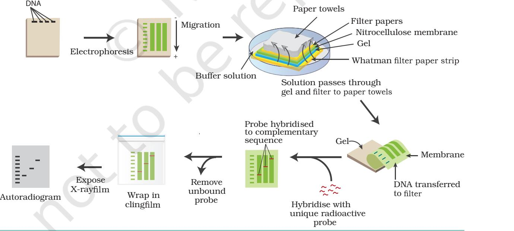

*Fig. 3.15: Identification of desired DNA by Southern blotting*

Chapter 3_Gene Cloning.indd 49 07-02-2023 10:06:51

**Gene Cloning 49**

Whatman paper strip is placed on the solid support that touch the buffer on two sides. The gel having DNA is kept on this Whatman strip. A sheet of nylon or nitrocellulose membrane is placed on the top of the gel. Pressure is applied evenly on the gel by placing a stack of filter papers or paper towels and a weight on top of the membrane and gel. Buffer solution by capillary action moves through the gel and membrane onto filter papers. Along with buffer solution, DNA moves to the positively charged membrane. The membranes after transfer of nucleic acids, serve as the replica of their respective gels. The membrane is then baked to permanently attach or fix the transferred DNA to the membrane which is mixed with probes. The blot membrane is then washed to remove unhybridised probe. The desired DNA sequence on the membrane is subsequently detected using probe (Fig. 3.15). **Probe** is a single DNA strand, complementary to the sequence present in the DNA fragment to be identified. The probe is labeled with a detecting tag which may be of radioactivity, fluorescence or chemical nature. The labeled DNA probe anneals with its complementary strand in the membrane. Location of the target DNA fragment is identified by visualisation on X-ray film by autoradiography.

**Northern blotting technique:** It is used to detect specific RNA molecules in a mixture of RNA. It was developed by American scientists J. Alwine, David Kemp and George Stark in 1977. Like Southern blotting, it starts with the extraction of total RNA from a homogenised tissue sample or from cells. They are separated on a agarose gel on the basis of their size by electrophoresis. Then they are transferred to a membrane where they are immobilised. A nylon membrane with a positive charge is most effective for use in northern blotting since the negatively charged nucleic acids have a high affinity for them. The transfer buffer used for the blotting usually contains formamide because it lowers the annealing temperature of the probe-RNA interaction, thus eliminating the need for high temperatures, which could cause RNA degradation. Once the RNA has been transferred to the membrane, it is immobilised through covalent linkage to the membrane by UV light or heat. It is then mixed with radioactive probes.

Chapter 3_Gene Cloning.indd 50 07-02-2023 10:06:51

The probes are specifically designed for the RNA of interest, so that they will hybridise with RNA sequences on the blot corresponding to the sequence of interest. The blot is now washed to remove extra probes. The labeled probe is then detected by autoradiography which appears as dark bands on X-ray film or by fluorescent labels (Fig. 3.16).

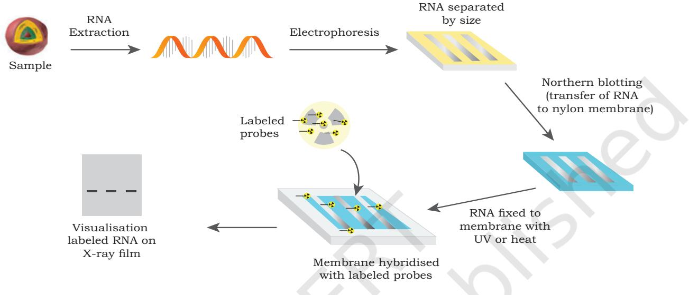

*Fig. 3.16: Identification of desired RNA by Northern blotting*

**Western blotting technique:** The name was coined by W. Neal Burnette in 1981. It is a technique used to detect specific proteins in a sample of tissue homogenate or extract. Proteins are isolated from a source. They are separated on an – SDS-PAGE gel on the basis of their electrophoretic mobility which depends on charge, molecule

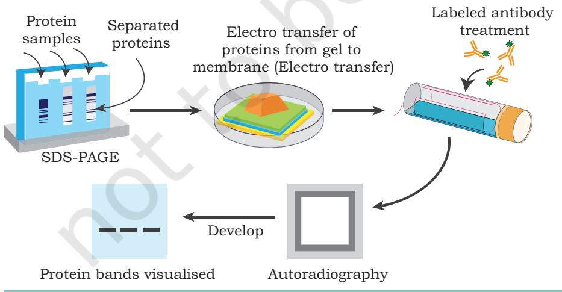

*Fig. 3.17: Identification of desired protein by Western blotting*

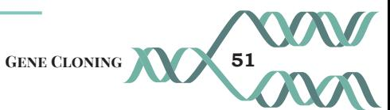

Chapter 3_Gene Cloning.indd 51 07-02-2023 10:06:51

size and structure of the proteins. They are transferred to a nitrocellulose membrane. The desired protein is detected on membranes using an antibody specific to the protein (Fig. 3.17).

Using all the three blotting techniques, a person can identify a gene and its expression. For example, a gene in a DNA sequence can be identified by Southern blotting, and its transcripts (RNA) can be identified by northern blotting, and finally the expression of a protein from mRNA (by translation) by western blotting.

#### **Box 3: Eastern Blot**

**52 Biotechnology XII**

Eastern blot is used for the detection of specific post-translational modification of proteins. Proteins are separated by gel electrophoresis before being transferred to a blotting matrix where upon post-translational modifications are detected by specific substrates (cholera toxin, concanavalin, phosphomolybdate, etc.) or antibodies

## **3.7 POLYMERASE CHAIN REACTION (PCR)**

Several molecular and genetic experiments require significant amount of DNA. In order to generate multiple copies of DNA from a few copies, a technique was developed by Kary B. Mullis, which is known as 'Polymerase Chain Reaction (PCR)'. In this technique, a very small amount of DNA can be exponentially amplified to generate thousands to millions of copies. PCR, sometimes called 'molecular photocopying', is often heralded as one of the most important scientific advances in molecular biology that revolutionised the study of DNA to such an extent that its inventor, Kary B. Mullis was awarded the Nobel Prize for Chemistry in 1993.

PCR technique is based on the principle that cells use to replicate its DNA. As the name implies, it is a chain reaction carried out in repeated cycles which involves the process of heating and cooling called thermal cycling carried out by a machine called thermocycler. It requires a heat stable DNA polymerase enzyme that can make new strands of DNA on template strands at a high temperature of about 72 to 78°C (a temperature at which a human or *E. coli* DNA polymerase would be non-functional). DNA polymerase typically used in PCR is called *Taq* **polymerase**, an enzyme isolated from the

Chapter 3_Gene Cloning.indd 52 07-02-2023 10:06:51

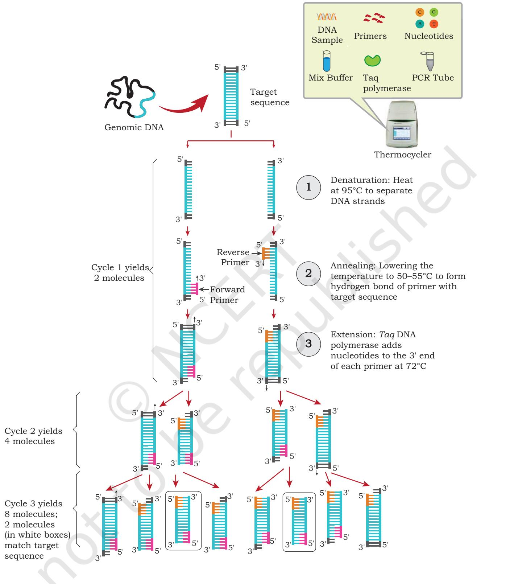

*Fig. 3.18: Steps of polymerase chain reaction*

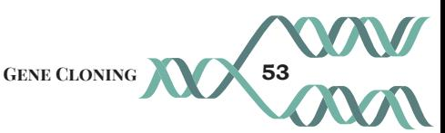

Chapter 3_Gene Cloning.indd 53 07-02-2023 10:06:51

thermophilic bacterium, *Thermus aquaticus*, which inhabits hot springs. Another enzyme *Pfu* polymerase isolated from *Pyrococcus furiosus* is used widely because of its higher fidelity when copying DNA. Like other DNA polymerases, *Taq* polymerase also requires a primer, a short sequence of nucleotides that provides 3′-OH end to start DNA synthesis. Two types of single stranded synthetic deoxyoligonucleotide primers (called forward and reverse primers) are used in each PCR reaction that is complementary to the DNA sequences in the template strands flanking the target region (region that should be copied). They are designed from the pre-existing knowledge of the sequence of DNA template to be amplified.

PCR involves three steps — denaturation, annealing and extension (Fig. 3.18). The first step i.e., denaturation is accomplished by heating the double stranded DNA to be amplified to a temperature of about 94–95°C. At high temperature, hydrogen bonds that hold two complementary strands of DNA molecule break down and each strand serves as template for the synthesis of its new complementary strands. The second step is annealing during which the temperature is lowered to around 50–55°C so that the specific primers can anneal to their respective template strands at their complementary sites and serve as the starting point for copying. Lowering of temperature depends upon the length of the primer and sequence of the primer. In the third step i.e., extension, the temperature is raised to about 72°C, and the heat stable DNA polymerase begins adding deoxyribonucleotides (dNTPs – dATP, dTTP, dCTP and dGTP) onto the 3′-OH ends of the annealed primers. Thus, a new chain of DNA grows from 5′ to 3′ direction on each template. Copies of DNA strands formed by PCR are known as amplicons. At the end of the cycle, again the temperature is raised and the process is repeated. The number of DNA copies doubles after each cycle and the number of copies at the end of each cycle would be 2n (where 'n' is the cycle number). Usually, 25 to 30 cycles are carried out in a typical PCR reaction

In PCR, the amplified product is analysed by gel electrophoresis at the end of reaction (end point analysis). The amount of DNA in the band of gel plate is then estimated by measuring the intensity of the band by computer

Chapter 3_Gene Cloning.indd 54 07-02-2023 10:06:51

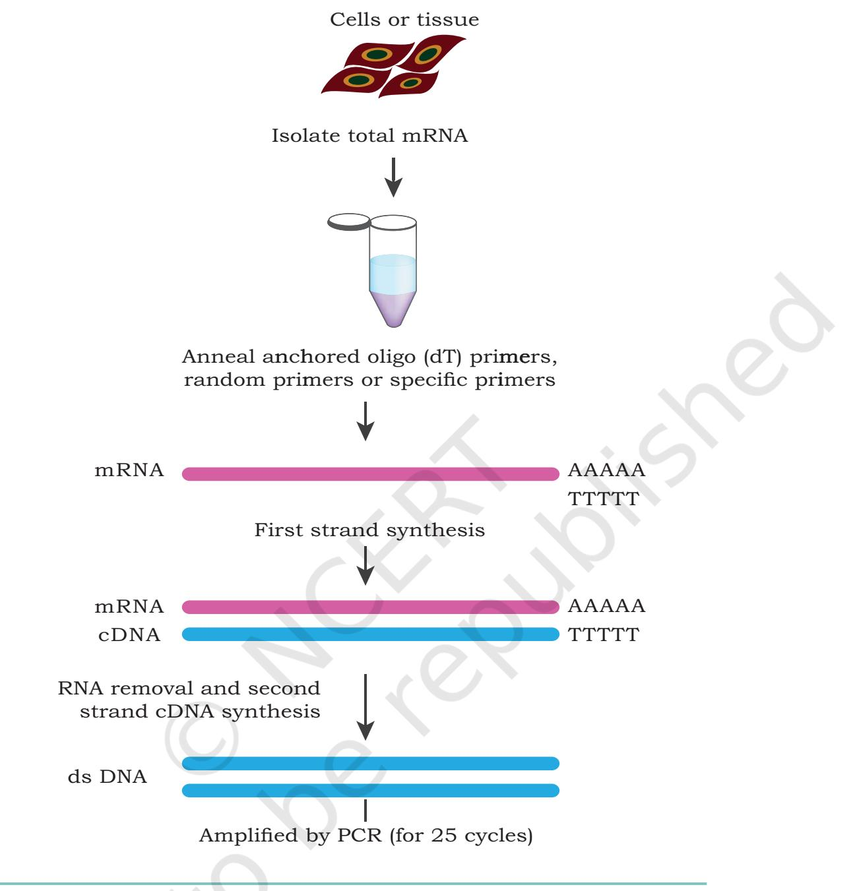

<i>Fig. 3.19: Steps of RT-PCR.

programs and transferred into a quantitative data. This is called **semi-quantitative** PCR. If DNA material is formed from mRNA by reverse transcriptase and used in PCR for amplification (Fig. 3.19), the method is known as **reverse transcription PCR** (RT-PCR).

The latest advancement in PCR technology is **real-time quantitative PCR** (real-time qPCR). In this method,

Chapter 3_Gene Cloning.indd 55 07-02-2023 10:06:52

fluorescent markers are used which have specific binding affinity to double stranded DNA. When bound to dsDNA, they exhibit fluorescence behaviour. Fluorescence emission is detected and quantitated by a detector. The amount of fluorencence emitted is directly proportional to the amount of double stranded PCR product. Since, the amount of PCR product formed can be measured after each PCR cycle, and hence, it is called real-time quantitative PCR. One of the fluorescent dyes used in real time PCR is SYBR green. The dye only binds to double stranded DNA.

The machine in which PCR reaction is conducted is known as thermocycler. These are automated machines having control points where one can set three gradients of temperature (for denaturation, annealing and extension) for different time periods for each step. For real-time qPCR thermocycler it has a detector to measure emitted fluorescence. In real-time PCR, gel electrophoresis is not needed as in case of conventional PCR.

PCR has several applications in molecular biology and rDNA technology. One of the applications of PCR is to quantify mRNA to assess the expression of a gene. It is also used to amplify minute DNA samples collected from crime scenes and fossils for further investigation.

#### **Box 4**

### **The Novel Coronavirus (nCoV) Severe Acute Respiratory Syndrome Coronavirus-2 (SARS-CoV-2) and COVID-19 Disease**

**Box 4**

#### **(Corona Pandemic)**

The International Committee on Taxonomy of Viruses on 12 February, 2020, officially named 2019-nCoV virus as SARS-CoV-2, and on the same day, World Health Organization (WHO) announced it to be responsible for the pandemic Coronavirus disease 2019 (COVID-19). SARS-CoV-2 is an enveloped virus which contains crown-like spikes on its outer surface.

The genome of SARS-CoV-2 is a single-stranded positive (sense) RNA of 30 kb with G + C content of 38%. Two-thirds of viral RNA encode a number of non-structural proteins (NSPs) which include papain-like protease (PLpro), 3-chymotrypsin-like protease (3CLpro), RNA-dependent RNA polymerase (RdRp), helicase (Hel) and exonuclease (ExoN) as major proteins while the rest are

**56 Biotechnology XII**

Chapter 3_Gene Cloning.indd 56 07-02-2023 10:06:52

accessory proteins which are involved in the transcription and replication of the virus. The rest part of the virus genome encodes four essential structural proteins, including spike (S) glycoprotein, small envelope (E) protein, membrane (M) protein, and N phosphoprotein (N) protein, and also several accessory proteins that interfere with the host immune response.

 Based on the structure, the RT - PCR tests have been efficiently optimised, and mRNA vaccines have been designed and being administered (Chapter 4).

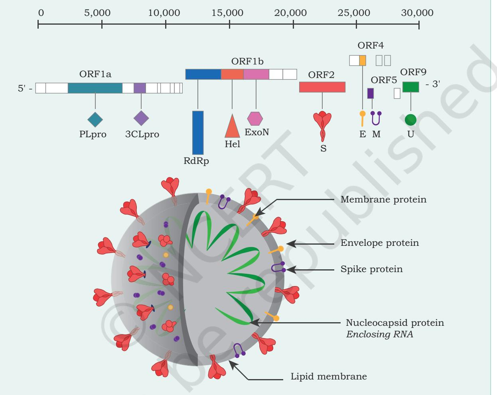

*Schematic diagram of the SARS-CoV-2 genome organisation and a virion. The genome contains a 5*′*-untranslated region (5*′′*- UTR), open-reading frames (ORFs) 1a and 1b encodes non-structural proteins, 3-chymotrypsin-like protease (3CLpro), papain-like protease (PLpro), helicase (Hel), and RNA-dependent RNA polymerase (RdRp) besides accessory proteins, The other ORFs code for structural S protein (S), E protein (E), M protein (M), and N phosphoprotein (N).*

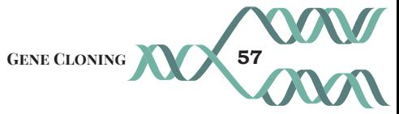

Chapter 3_Gene Cloning.indd 57 07-02-2023 10:06:52

#### **Box 5: Application of RT-PCR and COVID-19 detection test**

RT-PCR plays an important role in the COVID-19 detection test. It is based on the principle of real-time reverse transcription polymerase chain reaction (rRT-PCR) test that qualitatively detects the nucleic acid from SARS-CoV-2 in the lower and upper respiratory tract specimens [sputum, broncho-alveolar lavage (BAL)] collected by health care staff, from individuals that are suspected of COVID-19.

Principle of the RT-PCR test is same as described in the chapter. For testing, primer and probes are selected from Open Reading Frame gene region (ORF1a/b) and viral nucleocapsid region (N), or the spike protein (S) of SARS-CoV-2 genome. The kit contains primer/probe specific for N gene, ORF1a/b gene and the human RNase P. RNA is separated and purified from the upper and lower respiratory tract specimens is firstly converted to cDNA by reverse transcription and then amplified in real-time PCR thermal cycler. Probes consist of a reporter dye at 5′ and quenching dye at 3′. The fluorescent signals emitted from reporter dye are absorbed by the quencher, so it doesn't emit signals. During amplification, probes are allowed to bind to templates and are cut off by Taq enzyme (5′-3′ exonuclease activity), separating reporter dye from the quencher, and generating fluorescent signals. The PCR instrument can then inevitably draw a real-time amplification curve that is based on the change in signal, and finally realising the qualitative detection of SARS-CoV-2 novel coronavirus at the nucleic acid level. **Amplification plots** shown in the figure signify the accumulation of the product over the duration of the **real-time PCR** experiment. The fluorescent signal from individual sample is plotted against the cycle number.

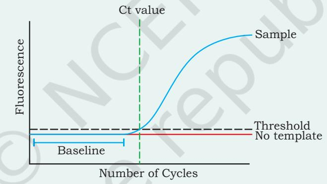

Threshold level and Ct value on a RT-PCR ampli cation curve

 The threshold cycle or Ct value is the cycle number at which the fluorescence generated within a reaction crosses the fluorescence threshold — a fluorescent signal significantly above the background fluorescence. Ct refers to the **number of cycles** needed to amplify the viral RNA to a detectable level. At the threshold cycle, a detectable amount of amplicon product has been generated during the early exponential phase of the reaction. The Ct value is **inversely proportional** to the amount of the gene of interest in the sample.

Chapter 3_Gene Cloning.indd 58 07-02-2023 10:06:52

## **3.8 DNA LIBRARIES**

DNA molecules present in a genome of an organism are very large in terms of the number of base pairs it contains. The size of a DNA molecule present in any diploid cell from any organ of your body has around 3×109 bp. In a genome, gene sequences are arranged randomly and selecting or isolating a gene of interest is a big task, especially when the genomic sequences are not known. Also, a small portion of genome is transcribed to give mRNA, whereas a major portion of the genome remains untranscribed. It will be very difficult to isolate a gene of interest or a sequence of genome whose location and sequence is not known. Hence, DNA libraries are constructed by collecting DNA fragments that have been cloned into vectors so that the specific DNA fragments of interest can be identified and isolated for further study. There are basically two types of DNA libraries (genomic and cDNA libraries) which are described in the following section.

### (i) Genomic DNA Library

A genomic library is a collection of clones of small fragments of DNA that together represents the complete genome of an organism. A population of identical vectors store DNA inserts, each containing a different insert. In general, construction of genomic library is done as shown in Fig. 3.20. First, genomic DNA is isolated from the source, which is too large to be incorporated into a vector and needs to be broken down into desirable fragment sizes. Therefore, the genomic DNA is digested with a restriction enzyme to cut the DNA into fragments of a specific size. DNA fragments are then inserted into vectors using DNA ligase to form recombinant vectors. This generates a pool of recombinant DNA molecules. The recombinant DNA molecules are now taken up by host bacterial cells by transformation and then allowed to multiply in a nutrient medium to form colonies. All host cells containing recombinant vectors represent a genomic library. The library created contains representative copies of all the DNA fragments present within the genome of an organism.

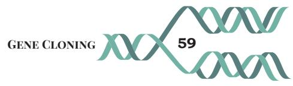

Chapter 3_Gene Cloning.indd 59 07-02-2023 10:06:52

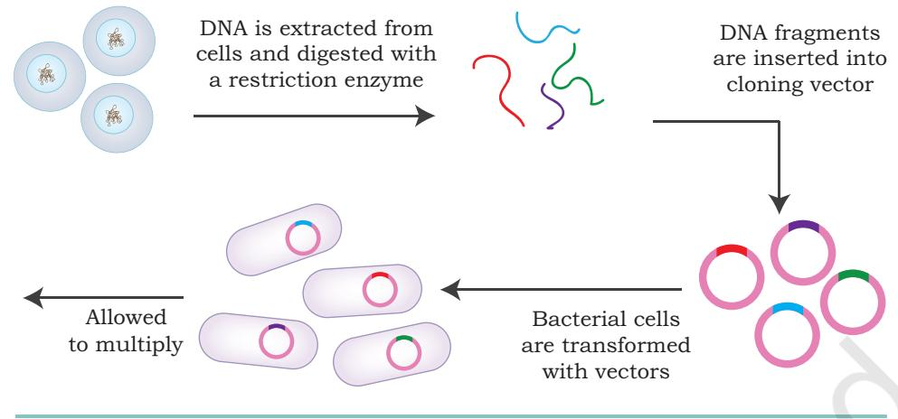

*Fig. 3.20: Construction of genomic library*

Genomic library has several applications in biotechnology. Genomic library of a species may be helpful for complete sequencing of its genome. Also, one can search for many genes which are not expressed in the genome of an organism. It is also helpful in understanding the evolution of species. Genomic library can be used to compare the sequences of healthy and diseased tissues of the same organism to identify genetic aberrations.

## (ii) cDNA Library

Gene expression in higher eukaryotes is tissue-specific. In specific cells, certain genes undergo moderate to high expression. For example, the genes encoding insulin proteins are expressed only in beta cells of pancreas while albumin encoding genes are expressed in liver cells*.* Using this information, a target gene can be cloned by isolating the mRNA from a specific tissue. The specific cDNA sequences are synthesised as copies from mRNAs of a particular cell type called cDNA (complementary DNA). Clones of such DNA copies of mRNAs are called cDNA clones. The cDNA clones of all the genes expressed in a specific cell type or tissue of an organism represent cDNA library.

Construction of cDNA library involves the isolation of total mRNA from a cell type or tissue of interest. mRNA being single-stranded cannot be cloned as such and is not a substrate for DNA ligase. It is first converted into cDNA before insertion into a suitable vector which can be

Chapter 3_Gene Cloning.indd 60 07-02-2023 10:06:52

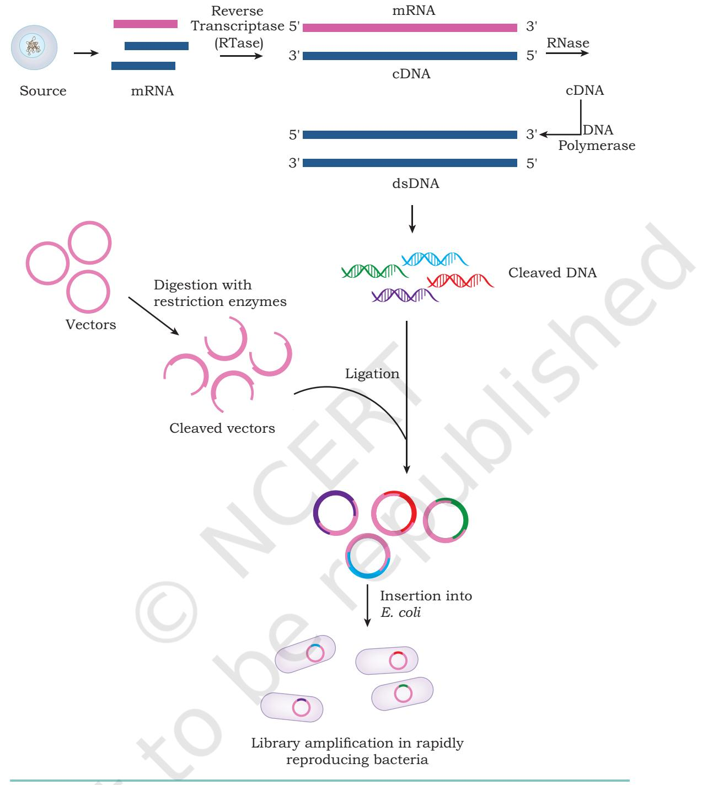

*Fig. 3.21: Construction of cDNA library*

achieved using reverse transcriptase (RNA-dependent DNA polymerase or RTase). RTase synthesise a complementary DNA strand on mRNA by using mRNA as a template. mRNA is then removed by RNase and the single stranded

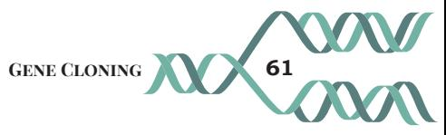

Chapter 3_Gene Cloning.indd 61 07-02-2023 10:06:53

cDNA is converted into double-stranded cDNA by DNA polymerase. cDNA molecules are cloned in appropriate host-vector system (Fig. 3.21). The total clones of cDNA are the representative of cDNA library of the source. Since the expressions of genes are different in different organs or cells of an organism at different physiological states, cDNA libraries prepared from different sources of an organism may vary from each other.

The cDNA library has a great significance in the applications of biotechnology. The most important application of cDNA library is to know which genes are active in particular tissues under a particular physiological state. It also helps us to isolate a specific gene. Using cDNA as probes, we can screen genomic libraries for a particular gene.

### **SUMMARY**

- Isolation of nucleic acids from different organisms is the most essential requirement for any molecular biology experiment. There are four steps in the process of extraction of nucleic acids i.e., disruption of biological samples, protection of nucleic acids from its degrading enzymes, separation of nucleic acids from other molecules and assessment of purity and quality of the isolated nucleic acids.
• Various enzymes play an important role in recombinant DNA (rDNA) technology. These are nucleases, DNA ligase, alkaline phosphatase, polynucleotide kinase, poly A polymerase, etc.

- The major task of the manipulation of DNA involves cutting and ligation of the gene of interest into the vector DNA.
- Nucleases are the enzymes that cleave nucleic acids by hydrolysing the phosphodiester bond that joins the sugar residues of adjacent nucleotides. Two major types of nuclease enzymes depending on its action on the phosphodiester bonds of polynucleotide chains have been identified, which are exonuclease and endonuclease.
- Exonuclease enzymes can remove mononucleotide either from the 3′ or 5′ end of the DNA molecule.

Chapter 3_Gene Cloning.indd 62 07-02-2023 10:06:53

- Endonuclease enzymes cleave DNA molecules at a specific sequence, hence called restriction endonucleases or restriction enzymes (REs). REs are mainly categorised into three groups (i.e., Types I, II and III) based on their cofactor requirement and the position of their DNA cleavage site relative to the target sequence. Type II REs find application in rDNA technology.
- DNA ligase can join two DNA strands together by catalysing the formation of a phosphodiester bond in the duplex form.
- DNA polymerases are a group of enzymes that catalyse the synthesis of new DNA strand by using dNTPs on a template strand.
- Alkaline phosphatase is used to remove the terminal phosphate group from 5′ end of DNA strands.
- Reverse transcriptase is used to generate complementary DNA (cDNA) strand from an RNA template, a process called reverse transcription.
- In rDNA technology, the recombinant DNA is introduced (transferred) in host cells by a number of methods, such as chemical based transfection (calcium chloride, lipofection etc.) and physical transfection (electroporation, microinjection and biolistic) methods.
- Selection of transformed bacteria is the most essential step for a successful cloning experiment i.e., to identify the transformed cells having recombinant vector (with gene of interest) from a mixture of transformed and non-transformed cells. These selection methods may be direct or through insertional inactivation.
- In direct selection, the transformed cells are distinguished from non-transformed cells on the basis of expression of certain traits, such as resistance to antibiotics.
- In insertional inactivation method, a vector is used having two markers (either two antibiotic resistant genes or one antibiotic resistant gene and *lacZ* gene).
- Blue-white selection method is another example of insertional inactivation to select recombinant transformed cells in which the expression of *lacZ* gene can directly be observed in bacterial colonies.
- Blotting techniques are widely used to separate and identify DNA, RNA and proteins from a mixture of molecules.
- Southern blotting technique is used to detect specific sequence of DNA in DNA samples.

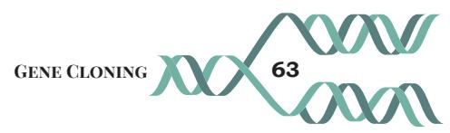

Chapter 3_Gene Cloning.indd 63 07-02-2023 10:06:53

- Northern blotting technique is used to detect specific RNA molecules in a mixture of RNA.
- Western blotting is used to detect specific proteins in a sample of tissue homogenate or extract.
- Polymerase Chain Reaction (PCR) is used to amplify a small amount of DNA into thousands to millions of copies, which involves three steps i.e., denaturation, annealing and extension. The amplified product of PCR can be analysed by gel electrophoresis at the end of reaction (end point analysis).
- The latest advancement in PCR technology is real-time quantitative PCR (qPCR), in which the fluorescent markers are used that have specific binding affinity to double stranded DNA. In qPCR, gel electrophoresis is not needed as in the case of conventional PCR.
- DNA libraries are constructed by collecting DNA fragments that have been cloned into vectors so that specific DNA fragments of interest can be identified and isolated. There are basically two types of DNA libraries — genomic and cDNA library.
- A genomic library is a collection of clones of small fragments of DNA that together represent complete genome of an organism.
- The cDNA library constitutes cDNA clones of all the genes expressed in a specific cell type or tissue of an organism.

### **EXERCISES**

- 1. Describe the methods used for isolation of DNA.
- 2. What is the role of biological detergent in the process of isolation of nucleic acid?
- 3. How does DNA isolation from plant tissue differ from that of bacterial cell?
- 4. How many types of restriction enzymes (REs) are there? Can all REs be used in rDNA technology? Give justification.
- 5. What are the challenges faced during the process of nucleic acid extraction?
- 6. Write the role of alkaline phosphatase, DNA ligase, terminal transferase in rDNA technology.
- 7. Describe the role of chelating agent in the process of DNA extraction.

Chapter 3_Gene Cloning.indd 64 07-02-2023 10:06:53

- 8. Briefly describe the modes of DNA transfer into the host.
- 9. Identify the correct statement for blue-white selection method.
- (a) A specific dye is used to stain bacterial colony.
- (b) It is based on the expression of *lacZ* gene.
- (c) The recombinant bacterial colony remains blue.
	- (d) *lacZ* gene is inserted in an antibiotic resistant gene.
- 10. Identify the correctly matched pair from the following options.
- (a) Northern blot: Detect specific sequence of DNA
- (b) Southern blot: Detect specific sequence of RNA
- (c) Western blot: Detect specific proteins
- (d) Eastern blot: Detect transcriptional modifications in RNA
- 11. Identify the incorrect matched pair from the following options.
- (a) Taq polymerase: *Thermus aquaticus*
- (b) Pfu polymerase: *Pyrococcus furiosus*
- (c) HindIII: *Haemophilus influenzae*
- (d) PstI: *Pyrococcus stuartii*
- 12. How are recombinants screened? Describe the methods in detail.
- 13. Differentiate between the Southern, Northern and Western blotting.
- 14. What is PCR? Describe in detail.
- 15. Write a comparative account of the genomic and cDNA libraries.
- 16. Diploid human genome contains:
- (a) 3.2 × 109 base pairs
- (b) 6.4 × 108 base pairs
- (c) 3.2 × 108 base pairs
- (d) 6.4 × 109 base pairs
- 17. Select the incorrectly matched pair from the following.
- (a) Nucleases : Hydrolyse phosphodiester bond
- (b) Restriction enzymes: Cleave DNA at specific sequence
- (c) Palindromic sequence: Read same backwards and forward
- (d) EcoRI: Type I Restriction Enzyme

Chapter 3_Gene Cloning.indd 65 07-02-2023 10:06:53

- 18. **Assertion:** PCR can be used to amplify very small amount of DNA using DNA modifying enzymes. **Reason:** PCR uses Taq Polymerase.
- (a) Both assertion and reason are true and the reason is the correct explanation of the assertion.
- (b) Both assertion and reason are true but the reason is not the correct explanation of the assertion.
- (c) Assertion is true but reason is false.
- (d) Both assertion and reason are false.
- 19. **Assertion:** Foreign gene can be introduced into host bacterium by transformation techniques like electroporation.

**Reason:** Bacteria have cell wall/membrane.

- (a) Both assertion and reason are true and the reason is the correct explanation of the assertion.
- (b) Both assertion and reason are true but the reason is not the correct explanation of the assertion.
- (c) Assertion is true but reason is false.
- (d) Both assertion and reason are false.

**66 Biotechnology XII**

Chapter 3_Gene Cloning.indd 66 07-02-2023 10:06:53

