**Applications of Recombinant DNA Technology**

Recombinant DNA (rDNA) technology has revolutionised our life in various ways. In recent years breakthrough discoveries have provided solutions to many of the problems. These include establishing the identity of an individual, introduction of foreign genes into other organisms, diagnosis of many diseases and their treatment, production of therapeutic agents/molecules and so on. In this chapter, students will be acquainted with a few applications of rDNA technology, like DNA fingerprinting, developing transgenic organisms gene therapy, recombinant vaccines and production of therapeutic agents/molecules.

# **4.1 DNA Fingerprinting**

**Chapter 4**

As you are aware, chemical structure of every individual's DNA is identical and is made up of four bases: A (Adenine), G (Guanine), C (Cytosine) and T (Thymine). The arrangement of these bases along the DNA strands is specific to an individual. The human genome consists of 3.2 × 109 bp. However, there is very little uniqueness in the genetic makeup of humans. About 99.9% of the genome among humans is same and the remaining 0.1% of the genome consists of sites of inherited variations. It is these variations in DNA which make each of us unique.

- *4.1 DNA Fingerprinting*
- *4.2 Transgenic Organism*
- *4.3 Gene Therapy*
- *4.4 Recombinant Vaccines*
- *4.5 Therapeutic Agents/Molecules: Monoclonal antibodies, insulin and Growth Hormone*

Chapter 4_App recombinant DNA Tec_New corrections.indd 67 07-02-2023 10:08:06

Identifying these differences is helpful in determining the relatedness between two individuals. One way of achieving this is by DNA sequencing. However, sequencing and comparing DNA of individuals every time would not be feasible. Therefore, to study and compare the inherited variations in human DNA without sequencing, a new technique known as 'DNA fingerprinting' was developed by a British geneticist Sir Alec Jeffreys in 1984 at the University of Leicester.

More than 90% of the human genome consists of which does not code for protein. Within the non-coding regions of an individual's genome, there exists short sequences

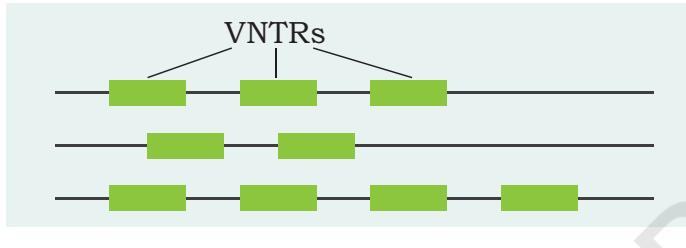

*Fig. 4.1: Schematic representation of VNTRs in 3 alleles*

of nucleotides which are repeated a number of times in tandem (short tandem repeats) at a locus which are called **VNTR** (variable number tandem repeat). VNTRs are commonly subdivided into microsatellites (repeat sequences of 1 to 9 bp) and minisatellites (repeat sequences of 10 to 100 bp) as shown in Fig. 4.1.

These sequences show a high degree of polymorphism (or variations) and form the basis of DNA fingerprinting. Furthermore, as the polymorphisms are inheritable from parent to offspring, DNA fingerprinting is the basis of paternity testing in case of disputes.

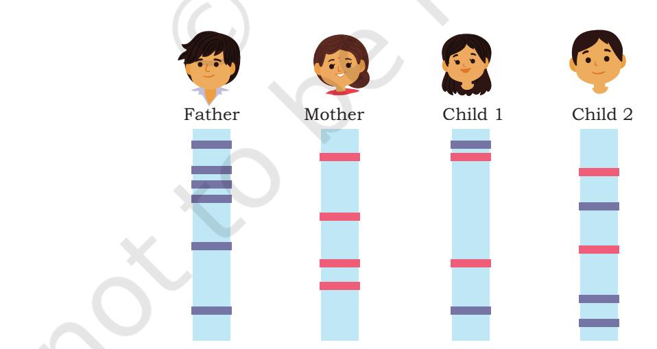

*Fig. 4.2: DNA profiling to determine the child of a couple. In the above figure, the DNA profile of a child is compared with father and mother to confirm paternity. Here, father and mother are parents of child 1 but not of child 2.*

**68 Biotechnology XII**

Chapter 4_App recombinant DNA Tec_New corrections.indd 68 07-02-2023 10:08:06

We carry two different copies of every VNTR locus because we inherit one chromosome from mother and one from father. In simplest way, DNA fingerprinting can be performed using restriction digestion of DNA. This technique is referred to as Restriction Fragment Length Polymorphism (RFLP). In RFLP, after restriction enzyme digestion of individual's DNA in specific regions, unique patterns are generated that are used for genetic analysis and identification (Fig. 4.2).

Conceptually, the DNA fingerprinting shown in Fig.4.3 is correct but in reality, the identification of individual bands on gel is difficult and therefore, hybridisation (Southern Hybridisation) using a VNTR probe is used. Hybridisation with VNTR probes produces a pattern of bands which are characteristic to every individual (Fig. 4.3). The steps involved in this technique are as follows:

- 1. DNA is isolated from different samples like blood, hair, skin, semen and buccal swab, etc.
- 2. The collected DNA sample is cut into several fragments of different sizes using one or more restriction enzymes.

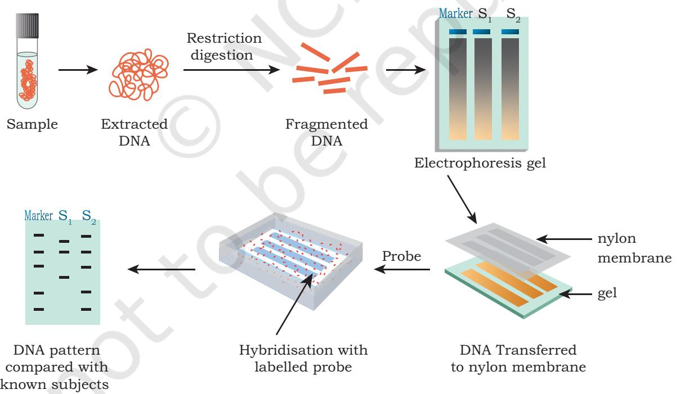

*Fig. 4.3: Steps involved in DNA Fingerprinting*

**Applications of Recombinant DNA technology 69**

Chapter 4_App recombinant DNA Tec_New corrections.indd 69 07-02-2023 10:08:07

- 3. The DNA fragments are then separated by agarose gel electrophoresis. The different sized DNA pieces are separated on the basis of size.
- 4. The separated DNA on the gel is thus transferred to a nitrocellulose/nylon membrane. The nylon membrane is then exposed to UV radiation on UV transilluminator for three minutes or baked at 80°C for two hours to permanently attach DNA to the membrane.
- 5. Then, Southern hybridisation is performed using VNTR Probes (the labeled stretches of single-stranded DNA used to detect the presence of complementary target sequences)
- 6. Finally, the hybridised DNA fragments are detected.
- 7. The patterns of DNA bands are highly specific for each individual and can be used in forensics and paternity disputes.

**Note:** Polymerase Chain Reaction (PCR) is often used to increase the sensitivity of the technique as it amplifies the DNA, irrespective of the amount of DNA.

### **Applications of DNA Fingerprinting**

- 1. VNTR patterns are used to ascertain the paternity and maternity of a person given the fact that they are inherited from their parents. Since, these patterns are very specific, even a parental VNTR pattern can be reconstructed from their known offspring(s) VNTR patterns. Therefore, VNTR patterns of parent-child can be used to solve paternity and maternity cases.
- 2. DNA isolated from tissues like blood, hair, skin, semen, etc., from the scene of a crime is used for VNTR patterns analysis as evidence, where such a pattern of DNA isolate is compared with VNTR patterns of a criminal or suspect for establishing guilt or innocence. Hence, DNA fingerprinting helps in criminal identification and forensic studies.
- 3. DNA fingerprinting is also used to compare DNA

Chapter 4_App recombinant DNA Tec_New corrections.indd 70 07-02-2023 10:08:07

extracts from fossils to modern day counter parts and therefore, finds great significance in evolutionary biology studies.

- 4. DNA profile of people suffering from some particular disorder, or comparing it to a large number of people with and without the disorder helps to identify the DNA patterns in studying inherited disorders.
- 5. In addition to social security numbers, picture ID and other more routine methods, even the DNA profile (VNTR patterns) of an individual are also being proposed to be used as a sort of genetic barcode for personal identification.

# **4.2 Transgenic Organism**

You must have heard about 'Bt Cotton' or 'Rosie,the cow', but have you ever wondered what these are? Are these naturally found in the environment? If not, then how have these been created? Or why these have been created at all? Both the examples mentioned above are a transgenic plant and animal, respectively. These have been produced by the introduction of new gene segments through the process of transgenesis and these are not naturally found in the environment. These have been created for the benefit of human beings.

The process of insertion of a foreign gene (transgene) into the genome of an organism and its transmission and expression in the organism's progeny is termed as transgenesis. The organisms carrying the transgene are known as transgenic organisms or genetically modified organisms (GMOs).

## **4.2.1 Historical background**

The first genetically modified organism was a bacterium made by Herbert Boyer and Stanley Cohen in 1973. In the subsequent year, it was followed by the engineering of first transgenic animal (transgenic mice) by Rudolf Jaenisch and Beatrice Mintz in 1974. In 1994, Flavr Savr tomato was released as the first genetically modified (GM) food crop approved by the US food and Drug Administration USFDA.

**Applications of Recombinant DNA technology 71**

Chapter 4_App recombinant DNA Tec_New corrections.indd 71 07-02-2023 10:08:07

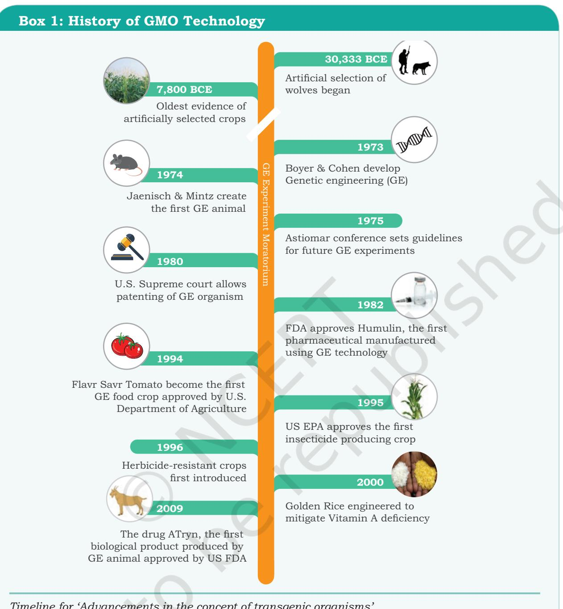

*Timeline for 'Advancements in the concept of transgenic organisms' Ref: Rangel, G. (2015). From Corgis to Corn: a Brief Look at the Long History of GMO Technology. Science in the News.*

# **4.2.2 Production of transgenic organisms**

## Transgenic Plants

Transgenic or genetically modified plants are those plants whose genome is modified (by the introduction of one

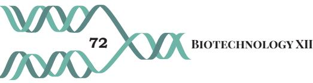

Chapter 4_App recombinant DNA Tec_New corrections.indd 72 07-02-2023 10:08:07

or more genes from another species) through genetic engineering. Basic requirement for genetic transformation is construction of genetic vehicle (vector), which carries the genes of interest flanked by necessary regulating sequences, like promoter or terminator. Most commonly used techniques for gene transfer are of two types.

- Vector-mediated or indirect gene transfer
- Vector-less or direct gene transfer

### *• Vector-mediated or indirect gene transfer*

*Bacteria Mediated transfer: Agrobacterium tumefaciens* is a rod shaped Gram- negative soil bacterium that is capable of naturally transferring DNA into the plant genome, and causes crown gall disease (a type of plant tumor). It is the most commonly and extensively used vector for plant transformation in dicot plants. *Agrobacterium* has the natural ability to transfer its own DNA to plant genome randomly, where it can produce copies of itself, and therefore, is also known as 'Natural Genetic Engineer'. It contains a large size tumor inducing (Ti) plasmid. A portion of the plasmid carrying tumor inducing genes is called T-DNA, which is transferred to plant genome upon infection. These genes encode for phytohormones, like auxin and cytokines which induce rapid cell division in the host plant cell and cause the formation of tumor called crown gall. This natural ability of *A. tumefaciens* to transfer T-DNA has been exploited to transfer the genes of interest to plants and produce transgenic plants. The tumor inducing genes of T-DNA are replaced with genes of interest like *Bt* gene for insect resistance. Ti plasmid without tumor inducing genes is a disarmed plasmid and this process is called disarming. Antibiotic marker genes can be introduced along with genes of interest, to differentiate among the transformed and non-transformed cells. Vectors containing modified T-DNA (recombinant disarmed T-DNA) are transferred to *Agrobacterium* cells, which are further used for plant transformation. Leaf segments are incubated with *A. tumefaciens* carrying recombinant disarmed Ti-plasmid. *Agrobacterium* infection causes the T-DNA to get transferred into plant cells and subsequent integration of T-DNA carrying the target gene

**Applications of Recombinant DNA technology 73**

Chapter 4_App recombinant DNA Tec_New corrections.indd 73 07-02-2023 10:08:07

into plant nuclear DNA. These are further cultured on regeneration media supplemented with the bacteriostatic agent to stop further growth of *Agrobacterium* and lethal concentrations of marker antibiotic which selectively eliminates the non-transformed plant cells. In a few weeks, the transformed tissue forms shoots which are transferred onto the rooting media, where the transformed shoots make roots within two to three weeks. Plantlets are then transferred to soil; and molecular techniques like PCR, are used for the confirmation of integration of genes of interest in the genome of these plants. A schematic representation of *Agrobacterium* mediated plant transformation is given in Fig. 4.4.

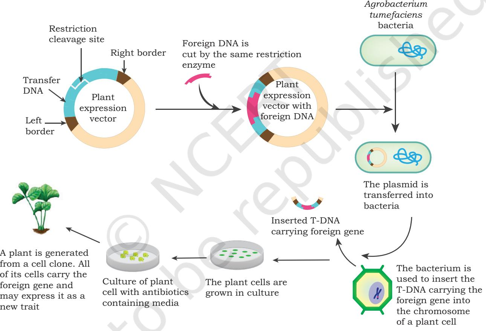

*Fig. 4.4: Stepwise procedure for Agrobacterium mediated plant transformation*

• Intact plant parts, such as flower for transformation instead of leaf fragments or isolated plant cells. Flowers are dipped in *Agrobacterium* solution for a few minutes and then plants are allowed to mature naturally. Seeds from these plants are germinated in the presence of antibiotics

Chapter 4_App recombinant DNA Tec_New corrections.indd 74 07-02-2023 10:08:07

and transgenic plants are selected. This is a time saving approach as it omits the tissue culture step described in the previous section.

*• Plant virus-mediated transfer:* Plant viruses, such as caulimoviruses have the ability to enter intact plant cells and introduce their own DNA into the plant's DNA. Use of plant viruses constitutes another method to transfer gene of interest into plant cells. However, this is not a common method of plant transformation as compared to *Agrobacterium*.

### *B. Vector - less or direct gene transfer*

Many physical or mechanical methods have been developed to help direct entry of DNA in plant cells.

*• Particle Bombardment gene transfer:* It is a popular direct gene transfer method and is capable of delivering foreign DNA in both monocot and dicot plants. It is also called **biolistics**. The DNA having genes of interest and antibiotic resistance marker gene is coated on to the surface of gold or tungsten particles (1 mm – 3 mm in size). These particles are accelerated with high velocity and bombarded onto the target tissue or cells using a powerful gun, which is called a **particle gun** or **gene gun**. Tissues bombarded are then cultured on the nutrient media having an appropriate antibiotic. Transformed cells grow to make callus and then transgenic plants are regenerated. This method is very useful for those plant species, where *Agrobacterium*-mediated transformation may not be very successful, for example, cereals.

Particle bombardment technique is also utilised for the transformation of chloroplast which requires bombardment of plant cells with the transgene such that it gets integrated into the chloroplast genome. As a plant cell contains many chloroplasts, this method allows much higher fold of transgene expression.

*• Protoplast Transformation and Electroporation:*  Protoplasts are spherical naked plant cells, which are produced by the removal of cell walls. These naked cells are capable of taking up DNA from their surroundings, which get integrated into the genome of transfected

**Applications of Recombinant DNA technology 75**

Chapter 4_App recombinant DNA Tec_New corrections.indd 75 07-02-2023 10:08:07

cells. Gene transfer process can be accelerated with the application of polyethylene glycol (PEG) and dextran sulphate. Alternatively, electric current can also be used for gene transfer in protoplast and the method is known as electroporation. Transfected protoplasts are allowed to regenerate cell walls and then the cell division begins. Transformed cells are selected on the selective nutrient medium and transgenic plants are regenerated.

## Transgenic Animals

In transgenic animals, genetic makeup has been altered by the use of various genetic engineering techniques (Fig. 4.5). Most commonly used techniques for developing transgenic animals are:

- 1. DNA pronuclear microinjection
- 2. Embryonic stem cell-mediated gene transfer
- 3. Retrovirus-mediated gene transfer

### *1. DNA Pronuclear Microinjection*

This is one of the earliest strategies used for creating transgenic mice. Just after fertilisation, the egg contains a small female pronucleus and a large male pronucleus. In pronuclear microinjection technique, transgene is directly injected into the larger male pronucleus. The embryos with injected transgene are cultured *in vitro* and then implanted into the uterus of foster mothers. The transgene may get integrated into the DNA of zygote, resulting in animals that are transgenic.

The technique is simple and reliable, but the rate of success is low as the transgene may or may not get integrated into the host DNA. Also, the site of integration of transgene is random which may lead to unpredictable effects.

### *2. Embryonic stem cell-mediated gene transfer*

Embryonic stem (ES) cells have the potential to differentiate into any other cell type of the body including germ cells. ES cells are collected from the inner cell mass region of the blastocyst stage. These ES cells are then mixed with

Chapter 4_App recombinant DNA Tec_New corrections.indd 76 07-02-2023 10:08:07

#### Biotechnological production of transgenic animals

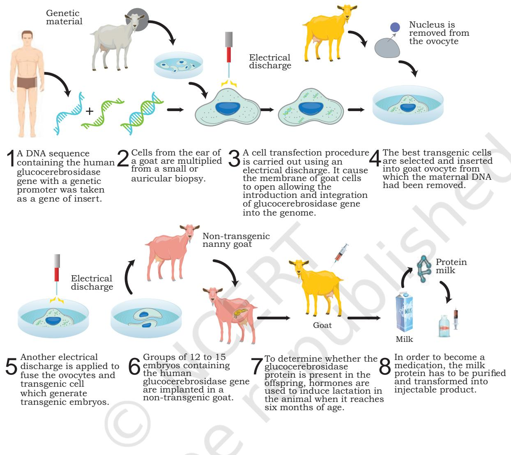

*Fig. 4.5: Stepwise procedure for production of transgenic animals*

**Box 2: Chimeric Mouse**

recombinant DNA carrying the transgene, so that few ES cells take up the transgene and get transformed. These transformed ES cells are then transferred back to the inner cell mass of blastocyst through injection. The blastocyst is implanted into the uterus of a foster mother. The offspring are then monitored for expression of the transgene.

**Applications of Recombinant DNA technology 77**

Chapter 4_App recombinant DNA Tec_New corrections.indd 77 07-02-2023 10:08:08

#### **Box 1: Chimeric Mouse**

Chimeras are organisms composed of at least two genetically distinct cell lineages originating from different zygotes. A chimeric mouse contains both normal cells and genetically manipulated 'knockout' cells. Coat colour can reflect this with a spotted pattern. It is a patchwork of normal cell and genetically manipulated 'knockout' cells. Embryonic chimeras of the mouse have become a tool to investigate the critical developmental processes, including cell specification,

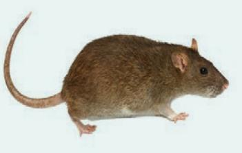

differentiation, cell lineage, potential patterning and the function of specific genes. In addition, chimeras can also be generated to address biological processes in the adult, including the mechanisms underlying diseases or tissue repair and regeneration.

#### *3. Retrovirus mediated gene transfer*

The genetic material of retroviruses is RNA. Retroviral vectors are used to stably introduce transgene into early embryos or ES cells. The advantage of this method is that a single copy of retrovirus carrying the transgene integrates at a particular location in the host genome. An example of such retroviruses is the lentivirus.

### **4.2.3 Applications of Transgenic organisms**

### Applications of Transgenic Plants

#### *In Agriculture*

One major goal of plant transgenics has been to increase the yield of crops and also to improve the nutritional quality of crop products to cater to the needs of ever increasing human population. Biotic stress due to pathogens, like bacteria, fungi, viruses or insects, and abiotic stress factors, like drought, salinity, extreme temperatures causes huge loss to crop productivity in terms of yield. Being sessile organisms, plants encounter both biotic and abiotic stresses. Biotechnological strategies have been used effectively to generate newer and effective cultivars with increased resistance to pathogens or perform better in harsh environmental conditions. Abiotic stress response reaction involves the production of stress related osmolytes, like sugar (e.g., trehalose and fructans), amino

Chapter 4_App recombinant DNA Tec_New corrections.indd 78 07-02-2023 10:08:08

acids (e.g., betaine, proline) and certain proteins have been produced which over express one of the above mentioned compounds. These show better tolerance to environmental stresses. A common example of a plant offering resistance to insect is *Bt* cotton. This insect resistant transgenic crop has been developed by transferring and expressing *Bt* gene (also called *cry* gene) from bacterium *Bacillus thuringiensis* into a cotton plant. *Bt* gene encodes a toxin (*Bt* toxin) which is naturally produced by *B. thuringiensis* as an insecticidal protein to kill insects. There are several classes of *cry* genes and products of each class are harmful only to a specific group of insects and do not affect other useful insects, like butterflies and silkworms. For example, *cryIAc* and *cryII as Ab* codes for a toxin that control cotton bollworms whereas *cryIAb* encodes for a toxin that controls corn borers. Some of the other crops for which transgenic plants have been developed by introducing *Bt* genes are brinjal, maize, rice, tomato, etc. All these transgenic crops have been proven to be effective in controlling the insect pests. Many of these transgenic crops are currently grown commercially and have resulted in significant increase in the total yields. Most notable example in India is *Bt* cotton (offering resistance to the insect pest pink bollworm) which is grown commercially since 2002.

Similarly, transgenic crops have been generated for several other traits, which results in significant enhancement in the crop productivity. These traits include tolerance to herbicides; resistance to bacteria, pests, viruses or nematodes; tolerance to environmental stresses; nutrient quality and delayed fruit ripening, etc.

Strategies for increasing crop yield also include modifying the photosynthetic machinery of the plant, manipulating the enzyme activity and increasing sugar to starch conversion, improving the nutritional quality; for example increasing the expression of vitamins, such as vitamin A in plants, e.g., Golden Rice. Many traits have been already commercialised and several others are being tested for their performance in the field conditions.

**Applications of Recombinant DNA technology 79**

Chapter 4_App recombinant DNA Tec_New corrections.indd 79 07-02-2023 10:08:08

|  | Box 2: List of some transgenic crops and their engineered traits |  |
| --- | --- | --- |
| Crop | Source of Inserted Trait | Trait |
|  | Bacteria, other species of corn | Resistance to insects |
|  |  | Tolerance to herbicides |
|  |  | Male corn sterility |
|  |  | Alpha-amylase expression |
|  |  | Increased lysine level for use in animal feed |
|  |  | Reduction of yield-loss under |
|  |  | water-limited conditions |
| Cotton | Bacteria | Tolerance to herbicides |
|  |  | Resistance to insects |
|  | Bacteria, corn, oats, other species of soybean | Tolerance to herbicides |
|  |  | High oleic acid soybean oil |
|  |  | Resistance to insects |
|  | Mustard greens | Resistance to insects |
|  | Bacteria | Tolerance to herbicides |
|  |  | Fertility restoration |
|  |  | Male canola sterility |
|  | Fungus | Degradation of phytate in animal food Lower level of reducing sugars |
|  | Bacteria | Resistance to insects |
|  | Potato virus | Resistance to potato viruses |
|  | Other species of potato | Lower level of free asparagine |
|  |  | Reduced black spot bruising |
| Tomato | Bacteria, potato | Delayed softening |
|  | Bacteria | Resistance to insects |
| Radicchio | Bacteria | Tolerance to herbicides |
|  |  | Male radicchio sterility |
| Alfalfa | Bacteria | Tolerance to herbicides |
| Sugar beet | Bacteria | Tolerance to herbicides |
| Rice | Bacteria | Tolerance to herbicides |
| Apple | Other species of apple | Reduced browning and bruising |
| Cantaloupe | Bacteria | Delayed ripening |
| Squash | Viruses | Resistance to viruses |
| Papaya | Viruses | Resistance to viruses |
| Flax | Mustard green | Tolerance to herbicides |
| Plum | Virus | Resistance to viruses |
|  | Bacteria | Tolerance to herbicides |
| Corn Soybean Canola Potato Creeping Bentgrass |  |  |

Chapter 4_App recombinant DNA Tec_New corrections.indd 80 07-02-2023 10:08:08

### *Antisense technology*

The antisense technology is used to inhibit/silence the gene expression. In this technique, the inhibition of expression of a specific gene is achieved by preventing the translation of its mRNA. There are two approaches, the first one is known as antisense oligonucleotide (ASO) technique. In this technique, a synthetic oligonucleotide (a short RNA or DNA molecule) which is complementary to the mRNA of the target gene, is introduced into a cell. The antisense oligonucleotide (ASO) makes a complementary base pairing with the mRNA of the target gene and thereby, prevents its translation. The ASO can mediate its effect in two ways: either by binding of ASO to the target mRNA followed by RNase H mediated degradation or by blocking of its translation by hindering its binding to ribosomes. The second approach is known as RNA interference (RNAi) technique. In this technique, the expression of target gene is inhibited by inactivating its mRNA through RNA induced silencing complex (RISC). A double stranded RNA of exogenous (viral origin) or endogenous origin (cellular origin) is cleaved in the cytoplasm into shorter fragments by the endoribonuclease named DICER. The shorter double stranded fragments are separated by a multiprotein complex RISC into guide strand and passenger strand.

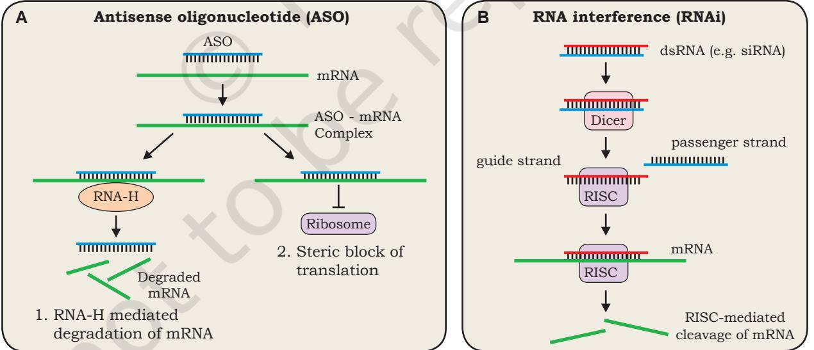

*Fig. 4.6: (A) Mechanism of antisense oligonucleotide mediated gene silencing, (B) Mechanism of RNA interference (RNAi).* 

**Applications of Recombinant DNA technology 81**

Chapter 4_App recombinant DNA Tec_New corrections.indd 81 07-02-2023 10:08:08

The passenger strand is degraded while the guide strand attached to RISC binds to the target mRNA and cleaves it, thereby the target gene is silenced.

Using a combination of *Agrobacterium*-mediated transformation and antisense technology, pest-resistant plants have been created. An example is provided by the tobacco plant, which is infected by nematode *Meloidogyne incognita*. Nematode-specific genes were introduced into the plant using *Agrobacterium* as a vector. The genes, when transcribed, produced antisense RNA. The antisense RNA binds to the sense RNA of the nematode, being complementary to each other, and thus prevents its translation into proteins that are necessary for nematode survival. This makes transgenic plants resistant to the parasitic attack of the nematodes.

### *For Industrial Production*

Chapter 4_App recombinant DNA Tec_New corrections.indd 82 07-02-2023 10:08:08

Rationalised 2023-24

**82 Biotechnology XII**

Plants are the backbone of all life forms on earth as they convert the energy of sun to chemical energy that feed the world. Today thousands of plants are being used for food, feed and medicines to cure acute and chronic health problems. Advances in our understanding of plant genetics and biotechnological tools has led to the development of relatively new bioscience '**Molecular Farming**'. It involves the genetic modification of the host plant through purposeful addition of a gene or group of genes leading to the production of new desired biomolecules. Foreign genes can be inserted either to nuclear genome or chloroplast genome. As chloroplast has several copies of the genome, the insertion of gene of interest in chloroplast results in higher accumulation target biomolecules. In this way, a large number of products have been produced in plants which include vaccine antigens, therapeutic proteins, diagnostic reagents, nutritional products, bioplastics, or industrial enzymes, etc. In 2012, U.S. FDA approved the first plant-made human biologics 'Elelyso'. It is an enzyme that is used to treat Gaucher's disease and has been produced in carrot cell cultures. Table 4.2 lists the examples of a few therapeutic molecules that have been produced in plants through genetic engineering.

| Transgenic Plant | Industrial/ Therapeutic Product(s) | Disease/ Other Usage |
| --- | --- | --- |
| Lettuce | Hepatitis B antigen | Hepatitis B |
| Tobacco | Cancer vaccine | Non-Hodgkin's Lymphoma |
| Carrot | Human glucocerebrosidase | Gaucher's Disease |
| Safflower | Insulin | Diabetes |
| Rice | Human lysozyme | Anti-infection, anti-inflammatory |

**Table 4.2: List of industrial or therapeutic products produced in plants through genetic engineering.**

### *For Environmental benefits*

**• Biodegradable plastics:** As you know, plastics are non-biodegradable and a nuisance to the environment. Transgenic plants can be exploited to produce biopolymers that can replace plastics. Polyhydroxyalkanoates (PHAs) are an attractive source of non-polluting and biodegradable plastic. Production of PHAs using transgenic plants provides an economically viable alternative. An example is the production of bacterial polyester polyhydroxybutyrate (PHB) in transgenic sugarcane.

**• Phytoremediation:** Phytoremediation refers to the use of plants for the removal of pollutants from the environment, especially soil. Metal detoxifying genes from bacteria and other organisms are introduced into plants, and the transgenic plants then uptake and convert the toxic elements into less toxic forms.

Mercury is a hazardous heavy metal, largely found in the aquatic ecosystems. Transgenic plants have been designed to incorporate the mercuric reductase gene, which helps in the detoxification of harmful mercury into less toxic forms. Such transgenic plants act as 'Mercury-breathing plants', and can be used for environmental remediation.

## Applications of Transgenic Animals

### *For Industrial production*

Transgenic animals are used as bioreactors for production of normal and recombinant protein products in large quantities (**Molecular Pharming**). An early example of success in 1990s was the transgenic ewe, Tracy, which

**Applications of Recombinant DNA technology 83**

Chapter 4_App recombinant DNA Tec_New corrections.indd 83 07-02-2023 10:08:08

produced high levels of human protein α1-antitrypsin in her milk. Deficiency of α1-antitrypsin in humans causes lung diseases. The protein produced in the milk of Tracy was thought to cure the symptoms of this deficiency but clinical trials for this recombinant protein revealed the side effects in patients.

In 1997, the first transgenic cow, Rosie was created which could produce human α-lactalbumin-enriched milk. Human α-lactalbumin-enriched milk was found to be a more balanced product for human infants compared to natural cow milk. Table 4.3 lists the examples of a few human recombinant proteins that have been produced in transgenic animals through genetic engineering.

#### **Table 4.3: List of human recombinant proteins produced in the milk of transgenic animals through genetic engineering**

| Name | Transgenic Animal |
| --- | --- |
| Albumin | Cow |
| α-fetoprotein | Goat |
| Growth hormone | Goat |
| Tissue plasminogen activator | Goat |
| Coagulation factor IX | Mouse |
| Coagulation factor VIII | Rabbit |

### *For Research*

**84 Biotechnology XII**

Transgenic animals are also used as model organisms by scientists for studying the normal human physiology, development and diseases.

The transgenic animals are genetically manipulated to develop symptoms of diseases, such as cancer, Alzheimer's, etc. This also allows the researchers to understand the function of genes involved in various diseases.

Transgenic animals are also used for toxicity testing of vaccines, drugs and chemicals before they can be used on humans.

### **4.2.4 Concern over GMOs**

The major concern over GMOs is the potential risk to human health and the environment. Transgenic crops may produce proteins that may cause allergic reactions in

Chapter 4_App recombinant DNA Tec_New corrections.indd 84 07-02-2023 10:08:08

humans. Concerns arise over the use of viral vectors and promoters in GMOs, as these can lead to viral infections in humans. The improved characteristics of GMOs may make them invasive or for the native or wild type species. Variable insertion of transgene can lead to unpredictable or non-target effects.

For ethical issues related to the use of transgenic animals, India has established biosafety regulations for the production and use of GMOs. The Ministry of Environment, Forest and Climate Change has established the Genetic Engineering Approval Committee (GEAC) which regulates manufacture, use, import, export and storage of genetically modified organisms and cells/hazardous microorganisms and decides upon the validity and safety of introducing GMOs.

# **4.3 Gene Therapy**

Many diseases in humans are known to be caused either due to the absence of normal gene, or the presence of defective and disease-causing gene. Can such disorders be corrected? The answer lies in the approach known

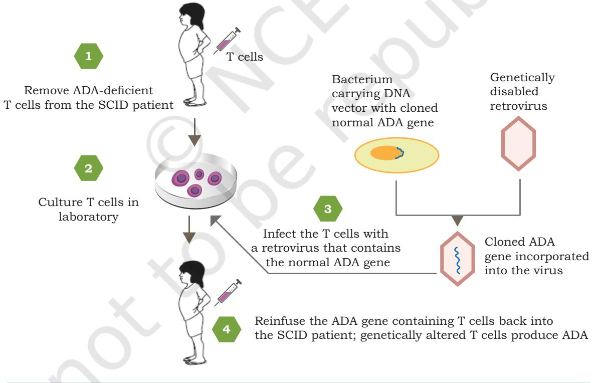

*Fig. 4.7: Steps involved in gene therapy for SCID by replacement of a functional adenosine deaminase (ADA)*

**Applications of Recombinant DNA technology 85**

Chapter 4_App recombinant DNA Tec_New corrections.indd 85 07-02-2023 10:08:08

as 'Gene therapy'. Gene therapy is a technique designed to repair faulty genes in humans by introducing correct genetic material inside the cells. The obvious candidate diseases for gene therapy include immune disorder called **Severe Combined Immunodeficiency (SCID)** and inherited genetic disorders, such as cystic fibrosis, hemophilia, muscular dystrophy, etc. The first gene therapy was performed in 1990 in a four year old girl suffering from SCID caused due to the defect in adenosine deaminase (ADA) coding gene. Deficiency of ADA led to the inability to produce sufficient immune cells which subsequently made the girl suffer from frequent lifethreatening infections. A functional copy of ADA gene was inserted into a viral vector, which was then introduced into lymphocytes collected from the patient and these lymphocytes were then reintroduced into the patient's bloodstream (Fig. 4.7). The immune system functioning of the patient improved but the cure was not permanent.

## **4.3.1 Approaches for Gene Therapy**

There are three main approaches for gene therapy— **Gene replacement or Gene addition, Gene inhibition** and **Gene repair or Gene editing therapies**.

> In gene replacement or gene addition therapy, a functional copy of the gene is delivered into the genome to replace the non-functional defective gene. The new gene carries the instructions to synthesise the protein that was not available in the cell due to defective gene. For example, cystic fibrosis is an inheritable disease caused due to a defective membrane protein known as cystic fibrosis transmembrane conductance regulator (CFTR) protein. The defective protein is produced due to a mutation in the CFTR gene. Due to the defective protein, the movement of salt and water are hampered in body cell causing damage to respiratory and digestive tract (Fig. 4.8). If the mutated CFTR gene is replaced by normal CFTR gene, the disease can be cured. Another example is p53 gene that normally prevents tumor growth. Several types of cancers have been linked to defective forms of p53. Replacement of the defective form of p53 in cancer cells may cause inhibition or death of cancer cells thereby, curing cancer.

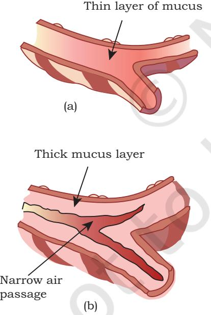

*Fig. 4.8: Cross section of air passage (a) normal and (b) in cystic fibrosis*

Chapter 4_App recombinant DNA Tec_New corrections.indd 86 07-02-2023 10:08:09

In case of gene inhibition, the function of a gene which causes a disease in cell, is inactivated. Therefore, gene inhibition approach of gene therapy is applicable in case of infectious diseases, cancer and in mutated genes whose products cause diseases (for example, sickle cell anaemia, Tay-Sachs disease, phenylketonuria, colour-blindness). In gene inhibition, a gene is introduced in a cell whose product either blocks the expression of the faulty gene or disarms the products of the faulty gene.

Finally, in case of gene repair or gene editing, the DNA is inserted, deleted, modified or replaced in the defective gene of genome of living cells. This is achieved by a recent technology known as CRISPR/Cas9 system. Clustered Regularly Interspaced Short Palindromic Repeats/Crisper associated protein 9. The CRISPR/Cas9 system was adopted from the natural defense system of bacteria or archea against viruses that attack them. With CRISPR system, bacteria recognise the invading virus and with the help of Cas9 enzyme, they cut the viral DNA into small pieces. The technique offers an easy way to snip out mutated DNA and replace it with correct sequence. This technique shows the possibility of treating several genetic disorders in future (refer section 5.4.2, Chapter 5).

### **4.3.2 Types of Gene Therapies**

Based on the strategy used for gene delivery, gene therapy can be classified into *ex vivo* and *in vivo* (Fig. 4.9). In *ex vivo* (*ex* means 'out of' and *vivo* means 'something alive') gene therapy, cells are taken out from the diseased person, grown in culture, normal genes are then introduced into these cells, and finally these transformed cells are reintroduced into the patient. This is also known as **cellbased delivery**. *Ex vivo* approach is much simpler as compared to *in vivo* approach, because it becomes easier to manipulate the cells externally (Fig. 4.9).

In *in vivo* gene therapy, unlike *ex vivo* approach, normal functional genes are directly introduced into the target cells and tissues of the person with the disease condition. This is also known as direct delivery method.

**Applications of Recombinant DNA technology 87**

Chapter 4_App recombinant DNA Tec_New corrections.indd 87 07-02-2023 10:08:09

Based on the nature of target cells or tissues used for the introduction of functional genes, gene therapy can be classified into: *somatic* and *germ-line* gene therapy. In somatic gene therapy, functional copies of the target gene are introduced into the somatic cells of the patient. In

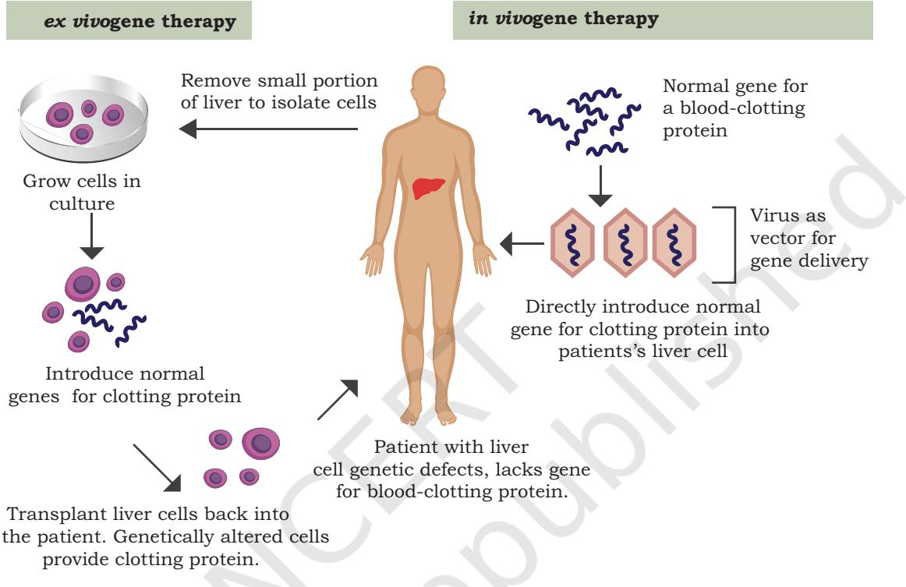

*Fig. 4.9: ex vivo and in vivo gene therapies*

germ-line gene therapy, functional genes are introduced into the germ cells (egg or sperm). The functional gene then gets integrated into the genome of the germ cells. Changes made to the germ-line are heritable.

Thus, based on the functional strategy used, gene therapy can be classified into:

- **• Gene augmentation therapy (GAT)**: Addition of functional gene to the genome with the aim of replacing the missing gene product.
- **• Gene inhibition therapy (GIT)**: Using antisense RNA or other inhibition techniques to block the expression of dominant acting mutated genes
- **• Gene targeting**: Replacing the non-functional gene with a normal gene using homologous recombination.

Chapter 4_App recombinant DNA Tec_New corrections.indd 88 07-02-2023 10:08:09

Attempts to correct the function of a defective gene as described above could become possible only after advancements in rDNA technology, gene transfer and gene editing mechanism. You have already studied the mechanism of the delivery of target gene (desired DNA sequence) either through viral (direct gene transfer) or non-viral (indirect gene transfer) method earlier in this chapter and also in Chapter 3.

## **4.3.3 Merits and Demerits of Gene Therapy**

Gene therapy provides a potential cure for the treatment of the devastating inherited diseases for which conventional treatment strategies provide little hope. Advancements in human genomics have shown that cancer is caused due to somatic aberrations in the human genome. This has led to enthusiasm among cancer researchers to use gene therapy approach for genetic manipulation of cancer cells and to find a possible cure to the disease.

However, uncontrolled expression of the therapeutic gene needs to be resolved for efficient gene therapy mechanism. Also, introduction of therapeutic gene in non-target cells or its random integration at a wrong place in the host genome another concern. For example, if the DNA gets integrated into a tumor-suppressor gene, this can result in tumor. There may be a requirement of frequent administration of the therapeutic gene as gene therapy is short-lived in nature. Host rejection of the therapeutic gene or the viral vector employed in the process can stimulate the host's immune system. Besides being a costly process, gene therapy is effective for single-gene defects but not for multigene disorders.

## **4.3.4 Ethical Issues**

Bioethics refers to the assessment of risks associated with the procedures and moral implications of any new techniques which are created. While genetic modification of somatic cells is approved by a large part of scientific community, genetic therapy in germ line cells often forms a subject for heated discussion in the field of science. Since, gene therapy includes making changes to the body's basic set of genes, it raises unique ethical considerations. Some of the ethical concerns associated with gene therapy include:

- To decide the ethics behind germ line gene therapy is a big question. Apart from the associated risks, it is often argued that in place of involving reproductive processes, like *in vitro*-fertilisation for treatment of
**Applications of Recombinant DNA technology 89**

Chapter 4_App recombinant DNA Tec_New corrections.indd 89 07-02-2023 10:08:09

genetic diseases, the defective embryo should be discarded. Also, identification of germ-line mutations requires prenatal genetic testing, which can result in increase in the number of abortions and foeticides.

- To distinguish gene therapy from making alteration in any target gene (gene enhancement) is another concern. There is a need for strict regulations so that such researches may not be improperly utilised for gene enhancement research for which the outcome is unpredictable.
- Access to such technology and its benefits may not be distributed equally as the developed and rich country or people may exploit its benefit. Also, in most of the cases, experiments using gene therapy have been primarily conducted in patients for whom all other treatments have failed. Any new technology takes time to get perfected and the same notion applies to gene therapy as well.

Gene therapy as an approach is often criticised for promising too much but delivering very little. However, with constant efforts it might prove to become a common practice for the treatment of genetic diseases with single gene defects.

# **4.4 Recombinant Vaccines**

A preparation of killed or weakened pathogen or their components given to elicit an immune response that subsequently recognises the infectious agent and fights off the disease is known as **Vaccine**. The word vaccine was coined by Edward Jenner (Latin word *vacca* means cow), who injected cow pox virus in the skin of a person to confer successful protection against small pox. The process of injection and administering vaccines is known as 'Vaccination'. The term vaccination was coined by Louis Pasteur in 1881. During vaccination, the pathogen (live or inactivated) or a component of pathogen known as antigen is injected into an individual with a purpose to induce immunity in an individual. Consequently, on the subsequent exposure to the same pathogen, a quick and heightened immune response is elicited involving

Chapter 4_App recombinant DNA Tec_New corrections.indd 90 07-02-2023 10:08:09

**90 Biotechnology XII**

antibodies and memory immune cells. The most common vaccines given to infants and young children are DPT (diphtheria, pertussis, tetanus) and MMR (measles, mumps, rubella), since they are at the highest risk due to low level of immunity. Initially, vaccines were developed mostly by attenuation or inactivation of pathogens. To avoid several potential concerns raised by conventional vaccines, like chances of infection in case of live attenuated vaccine, reversal of the toxoids to their toxigenic forms, or co-purification of undesirable components and to overcome the complexity involved in obtaining sufficient quantities of purified antigenic components, recombinant vaccines were developed using the various tools of rDNA technology. There are three main types of recombinant vaccine:

## **1. Live genetically modified vaccines**

The live pathogenic organism (bacteria or virus) is modified into a risk free and safe non-pathogenic organism by either the deletion or inactivation of one or more gene. These deletion or gene-inactivated vaccines are primarily developed to weaken or attenuate the disease agent.

Vector-based vaccines which carry a foreign gene from another disease agent also falls under this category of live genetically modified organisms. These vector-based vaccines are bacteria, viruses, or plants carrying a gene from another disease agent that is expressed and when injected into the host, induces an immune response. Examples of such vaccines include *Salmonella* vaccine (for sheep and poultry) and a *Pseudorabies* virus vaccine (for pigs). In case of viral and bacterial vectors, the vaccine induces a protective response against itself in addition to the pathogenic organism. Foreign genes must be inserted into the genome of the vaccine vector in such a way that the vaccine remains viable. Example of vector-based vaccines includes vaccinia virus, an enveloped virus belonging to the pox family. It has a large linear double stranded DNA genome with around 200 genes. The genome of this virus can accommodate stretches of foreign DNA which can be expressed alongside with its own genes.

With the help of rDNA technology, vaccinia virus carrying antigenic genes of several different pathogens have been

**Applications of Recombinant DNA technology 91**

Chapter 4_App recombinant DNA Tec_New corrections.indd 91 07-02-2023 10:08:09

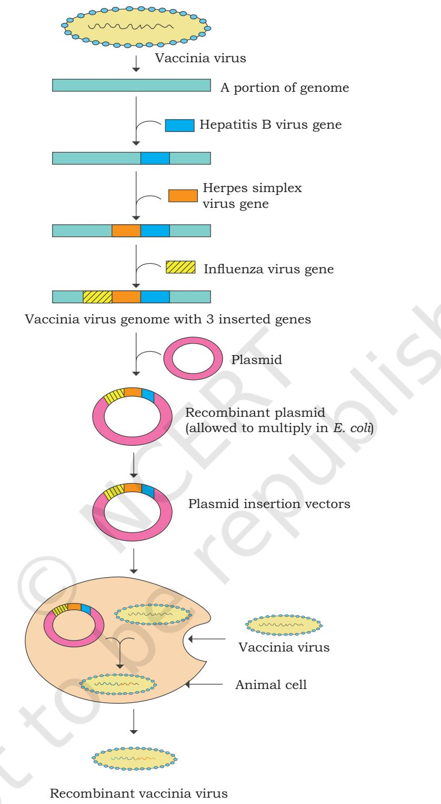

*Fig. 4.10: Production of vector based vaccine using virus*

Chapter 4_App recombinant DNA Tec_New corrections.indd 92 07-02-2023 10:08:09

constructed which are capable of simultaneously providing protection against several different diseases. Such vaccines are known as **polyvalent** or **multivalent** vaccines based on their antigenic sites (Fig. 4.10). Thus, for the production of vaccinia vectors to be used as vaccine, the DNA of vaccinia virus is removed and genes from hepatitis viruses, herpes simplex viruses and influenza viruses are inserted in plasmid vector (Fig. 4.10). These insertion vectors now possess the genes essential for vaccinia virus maintenance and also the foreign subunit genes of interest. These insertion vectors are then introduced into host cells along with the normal vaccinia viruses. Since, vaccinia virus takes over the host machinery, it is capable of replicating in the host cell cytoplasm, and transcribe to produce its proteins. During viral DNA replication, the plasmids are taken up with normal vaccinia DNA to produce recombined vaccinia viruses. These recombinant vaccinia vector vaccines against hepatitis, influenza, malaria, herpes simplex virus, rabies, and vesicular stomatitis are available since early 1990s. The most important benefit of using vector based vaccines is that they are capable of stimulating both B cells and T cells. Consequently, vaccinia virus offers elevated levels of protection against pathogens. But, due to safety concerns, none of these vaccines has been licensed for human use.

#### **Box 3: Plant Vaccines**

Edible vaccines are vaccines manufactured in plants that can be administered easily by consuming the plant material containing the vaccine e.g. fruits, leaves and seeds, etc. The significant antigenic genes have been inserted into different plants, like tobacco, banana, potatoes, tomatoes and rice, etc. using various vectors. These recombinant vectors are introduced within the plants by using either a bacterial transformation system, like *Agrobacterium tumefaciens* or by microprojectile bombardment method. The ingestion of the edible vaccine stimulates the mucosal immune system and elicits an immune response.

Example: Hepatitis B banana has been successfully made by inserting the HBsAg gene in a plasmid vector and finally this construct was injected in the plant cell. Banana is the best plant for oral vaccine production as it is easy to digest, requires no cooking, palatable, inexpensive and available throughout the year.

Gene from a

vector

human pathogen is inserted into a Vector introduced into plant cells

Leaf segments sprout into whole plants carrying genethe from human pathogen

Eating banana triggers immune response to the pathogen

**Applications of Recombinant DNA technology 93**

Chapter 4_App recombinant DNA Tec_New corrections.indd 93 07-02-2023 10:08:09

# **2. Recombinant subunit vaccines**

Subunit vaccines contain only a part of the whole pathogenic organism. These can be either synthetic peptide or an expressed whole protein extracted from the pathogenic organism or expressed from cloned genes in the laboratory. Prokaryotic systems, such as *Escherichia coli* or eukaryotic systems, such as yeast can be used to express recombinant proteins. The advantages of these vaccines include purity, stability and safe use. One such example of a subunit vaccine developed against Hepatitis B, a widespread disease that mainly affects liver leading to cirrhosis, chronic hepatitis and cancer. Hepatitis B virus consists of a core containing a viral genome (DNA) surrounded by a phospholipid envelope carrying surface antigens HBsAg, the key element for the hepatitis B vaccine. Culturing Hepatitis B virus and producing these surface antigens is very complicated. Therefore, with the advent of rDNA technology, the gene coding HBsAg surface protein was identified and inserted in pMA56, a yeast plasmid vector and expressed in *Saccharomyces cerevisiae* yeast cells.

## **3. DNA vaccines**

In recent years, DNA vaccines are one of the promising advancements in vaccine technology. For DNA vaccines, genes of interest (antigens) are identified and cloned in plasmids. DNA vaccine carrying the plasmid harbours a promoter site, cloning site, origin of replication, a selectable marker sequence and a terminator sequence, like a poly-A tail. During vaccination, DNA is directly injected into the muscles of the animal model system like mice, generally using a 'gene gun' that is based on compressed gas, to inject the DNA into the muscle. DNA vaccines can also be administered by nasal spray. The antigenic DNA is taken up by a few muscle cells, which after protein expression, induce the immune system. DNA vaccines are capable of inducing both humoral and cellular immune responses.

Chapter 4_App recombinant DNA Tec_New corrections.indd 94 07-02-2023 10:08:09

### **Box 4**

The HBsAg gene is claved to a strong alcohol dehydrogenase promoter (ADH Promoter). These plasmids are then transferred and cultured. pMA56 plasmid also carries a termination sequence from yeast gene and the origin of replication from bacteria. For selection of recombinants, an antibiotic resistance marker and a gene that permits growth only in the absence of amino acid tryptophan were used in pMA56. The protein is separated, purified and used for immunisation. This was the first recombinant subunit vaccine for public use, licensed in 1987 and marketed as Recombivax and Engerix-B.

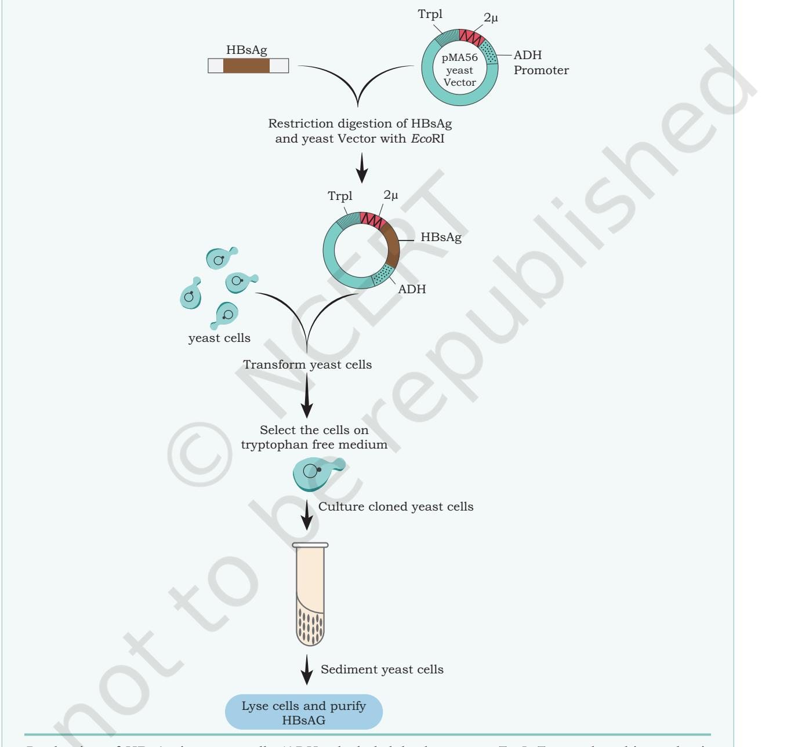

*Production of HBsAg in yeast cells (ADH: alcohol dehydrogenase TrpI: Tryptophan biosynthesis gene I; 2µm. Yeast sequence*

**Applications of Recombinant DNA technology 95**

Chapter 4_App recombinant DNA Tec_New corrections.indd 95 07-02-2023 10:08:09

### **4. RNA Vaccines**

RNA vaccines contain mRNA. Once injected for vaccination, the mRNA is directly taken up by antigen presenting cells and other target cells, where the mRNA is expressed as properly folded and glycosylated protein that acts as an antigen (Fig. 4.11). These vaccines elicit both humoral and cellular immune response against the encoded protein.

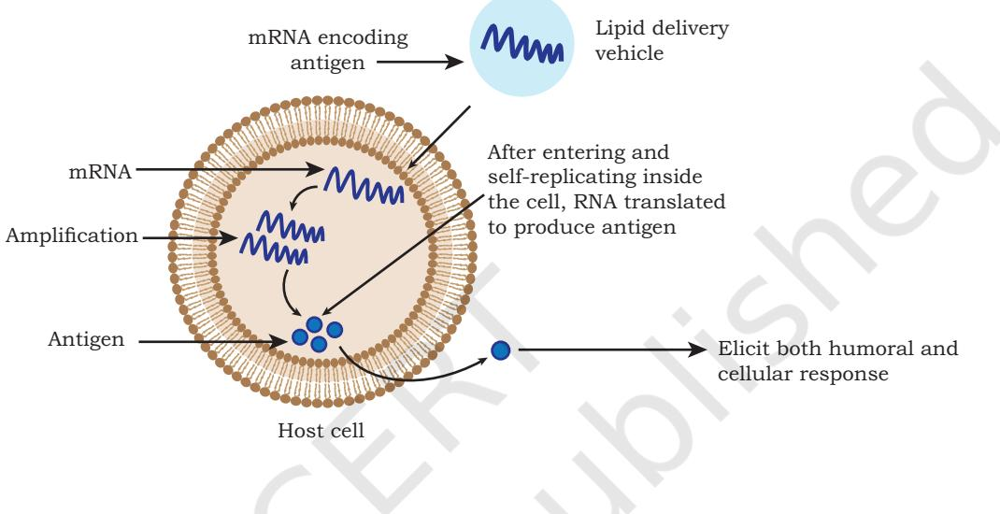

#### *Fig. 4.11: RNA vaccine*

**96 Biotechnology XII**

RNA being labile, the stability of injected mRNA is prevented by modifying it in a variety of ways e.g., the addition of a 5' cap; the length and structure of a 3' PolyA tail; use of untranslated regions and the modification of nucleotides, etc. Such RNA modifications are also helpful in increasing the immunogenicity of mRNA. Therefore, RNA vaccines are formulated with specific delivery systems such as lipid nanoparticles (LNPs), which protect RNA from degradation and increase target cellular uptake.

Thermostability of a vaccine is vital to reduce the need for cold conditions during vaccine storage and use. Since RNA is unstable, it needs to be frozen when stored to ensure long-term stability. Efforts are underway to improve the thermostability of RNA vaccines. Lyophilisation or freeze-drying has been proposed as a way to improve their thermostability. In this direction, formulation of RNA with thermostable lipid nanoparticles, as mentioned above, has

Chapter 4_App recombinant DNA Tec_New corrections.indd 96 07-02-2023 10:08:10

also been suggested for improving the thermostability of RNA vaccines.

RNA vaccines are comparatively simple and have high yield production. Their virus-free production process enables modest and scalable production facilities. As a result of cell-free production, there is less concern with respect to contaminating agents. Another important advantage of mRNA vaccine technology is its ability to respond rapidly to emerging viral variants. This means making modified mRNA vaccines for mutants with changed sequences, is quick and simple.

Thus, RNA vaccines offer several advantages over other categories of vaccines including rapid and low-cost development (owing to rapid design and synthesis of mRNA using fully synthetic approach), reduced need for optimisation and regulatory testing (due to already existing optimised and licensed formulation and delivery method). Furthermore, mRNA vaccines require less amount of vaccine dose in each shot and may not even require two doses. Also, it can be produced more quickly and efficiently as compared to other vaccines in case of new emerging variants of the pathogens. RNA vaccines are comparatively safe. There is no risk of pathogen reactivation and RNA is degraded *in vivo* with no risk of antigen persistence or integration into the genome. However, mRNA vaccines need to be addressed for their improved thermostability.

# **mRNA Vaccine Development against COVID-19**

The COVID-19 pandemic demonstrates the ongoing threat of pandemics caused by novel, previously unrecognised, or mutated Severe Acute Respiratory Syndrome Corona Virus-2 (SARS-CoV-2) strain with high transmissibility. Vaccines namely, Covaxin (inactivated whole virus) and Covishield (Adenovirus based DNA vaccines) are widely used in India for the ongoing COVID-19 pandemic. However, for effective control of pandemics, RNA-based vaccines have also being developed. More than 25 mRNAbased vaccine candidates for COVID-19 are in different phases of preclinical and clinical trials. The mRNA-1273 is a lipid nanoparticle (LNP)-encapsulated mRNA-based

Rationalised 2023-24

Chapter 4_App recombinant DNA Tec_New corrections.indd 97 07-02-2023 10:08:10

vaccine that encodes a stable form of the spike protein of SARS-CoV-2. When injected, the encapsulated mRNA-1273 travels to the immune cells (lymph nodes) and instructs them to make copies of the spike protein on their surface, similar to that of SARS-CoV-2 upon its infection. Meanwhile, other immune cells learn about the spike protein and prepare themselves for the future response to SARS-CoV-2.

# **4.5 Therapeutic Agents/Molecules: Monoclonal Antibodies, Insulin and Growth Hormone**

Recombinant DNA technology has revolutionised health care by facilitating the large-scale biological production of a variety of safe, pure and efficient human proteins. Compounds used for treating a disease and for improving the health of human beings are called **therapeutic agents**. With the advent of rDNA technology, not only the newer therapeutic agents are produced but also more efficient forms of conventionally produced therapeutics are being manufactured. Since these recombinant therapeutics produced are identical to the natural human proteins unlike those isolated from animals (like cow and pig), hence, they do not induce immune responses and are free from threat of any allergic responses. Presently, numerous products, like antibiotics, monoclonal antibodies, blood clotting factors, hormones (insulin and growth hormone), cytokines and vaccines are being produced for human welfare.

Antibodies are the protein molecules produced by B cells of the immune system and protect the body against the invading foreign substances called **antigens**. In human serum, five different types of antibodies are present: IgA, IgD, IgE, IgG and IgM. B cells, in response to a foreign particle, produce many different types of antibodies specific to different regions of antigen called **epitopes** present on the surface of antigen and hence, designated **polyclonal antibodies**. This polyclonal antibody mediated response leads to the antigen processing and degradation and therefore, has obvious advantage for the organism, *in vivo*. However, due to their heterogenic nature, the efficacy for *in* 

Chapter 4_App recombinant DNA Tec_New corrections.indd 98 07-02-2023 10:08:10

**98 Biotechnology XII**

*vitro* use is restricted. On the contrary, antibodies, specific to a particular region or epitope of an antigen, known as **monoclonal antibodies** (MAB) can be very well exploited for *in vitro* purpose, like in therapeutic and diagnostic applications.

Earlier, following a brief exposure of an animal to an antigen, B cells were isolated and cultured for producing monoclonal antibodies. However, B cell culturing is very tricky and complicated, and also the monoclonal antibodies produced were short- lived. An invention made by George Kohler and Cesar Milstein (1975) provided a way out, through which the large-scale production of monoclonal antibodies using **Hybridoma technology**, where the short-lived antibody secreting normal B cell is fused with immortal myeloma cells with the help of Polyethylene Glycol (PEG) leading to the formation of hybrid cells called **hybridoma**. Hybridoma cells acquire immortal growth, a typical attribute of a myeloma cell, besides the antibodies production property bestowed by B plasma cell. Myeloma cells are genetically engineered such that they cannot use hypoxanthine, aminopterin and thymidine (HAT medium) as a source for nucleic acid biosynthesis and will die in culture. On the other hand, B cells are able to survive in

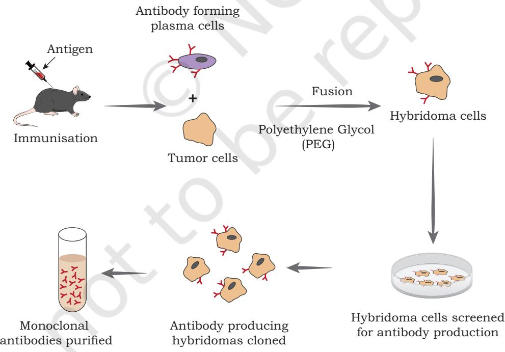

*Fig. 4.12: Production of monoclonal antibodies using hybridoma technique*

**Applications of Recombinant DNA technology 99**

Chapter 4_App recombinant DNA Tec_New corrections.indd 99 07-02-2023 10:08:10

Rationalised 2023-24

HAT medium but have a definite life span and die after that. Only B cells that have fused with these engineered myeloma cells will survive in culture when grown in HAT medium (Fig. 4.12). With the advances in rDNA technology, it is possible to develop mouse antibodies carrying a few human segments known as **chimeric** or **humanised antibodies** possessing higher effectiveness and activity.

Monoclonal antibodies have revolutionised the diagnosis of various diseases and are used in a number of commercially available diagnostic kits, like pregnancy detection kits and use of monoclonal antibodies in the diagnostic imaging cancer, wherein the tumor specific monoclonal antibodies can help in differentiating cancerous and non-cancerous growth. In recent years, monoclonal antibodies are employed as a very specific targeted therapeutic agents and are coupled or attached with toxins or drugs and carried to target tissues for efficient action.

#### **Box 5**

**100 Biotechnology XII**

In 1921, a series of classic experiments were performed by Frederick Banting and Howard Best, which lead to the isolation of insulin. Insulin is distributed to all cells of the body through the bloodstream. The primary structure of insulin was studied by Sanger (1955) for which he was awarded Nobel Prize in 1958.

Insulin, a hormone secreted by beta cells of pancreas acts on different types of cells resulting in the uptake of glucose from blood. Insulin also stimulates the conversion of glucose to glycogen (glycogenesis) in the target cells. The glucose homeostasis in blood is infact maintained jointly by the two hormones—insulin and glucagon. A genetically linked disease caused by the deficiency of insulin hormone and characterised by the presence of sugar in urine is **Diabetes mellitus**.

Structurally, insulin consists of two chains: an A chain of 21 amino acids and a B chain of 30 amino acids interconnected with disulphide bonds (Fig. 4.13). After

Chapter 4_App recombinant DNA Tec_New corrections.indd 100 07-02-2023 10:08:10

Banting and Best experiments, insulin was purified from the pancreas of pigs and cows. Human insulin, porcine insulin (from pig) and bovine insulin (from cow) are very similar except one or three amino acids. But these minor differences in the chemical structure can lead to an allergic response in some diabetic patients. As a result, the use of human insulin for treatment is more suitable as compared to the animal insulin. Physiological insulin first gets translated into a primary protein called **preproinsulin** composed of 110 amino acids. In endoplasmic reticulum, first the signal peptide fragment

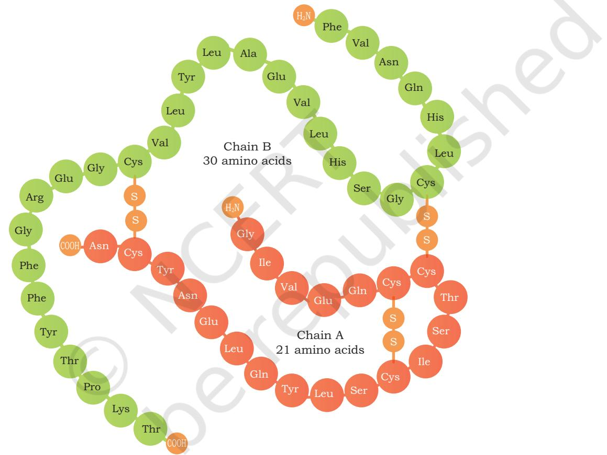

*Fig. 4.13: Insulin Structure: Primary structure of human insulin. A-chain is shown in red and the B-chain in green*

is cleaved off from preproinsulin, thus turning preproinsulin to **proinsulin** (composed of 86 amino acids). Proinsulin carry three distinct peptide chains: A-chain, B-chain, and C-peptide (composed of 31 amino acids). In the next step inside endoplasmic reticulum, the C-peptide and additional four amino acids are removed to produce biologically active insulin of 51 amino acids residues (Fig. 4.14).

**Applications of Recombinant DNA technology 101**

Chapter 4_App recombinant DNA Tec_New corrections.indd 101 07-02-2023 10:08:10

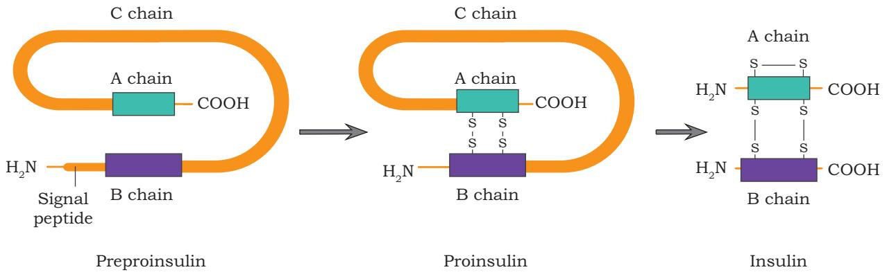

*Fig. 4.14: Conversion of Preproinsulin to Insulin*

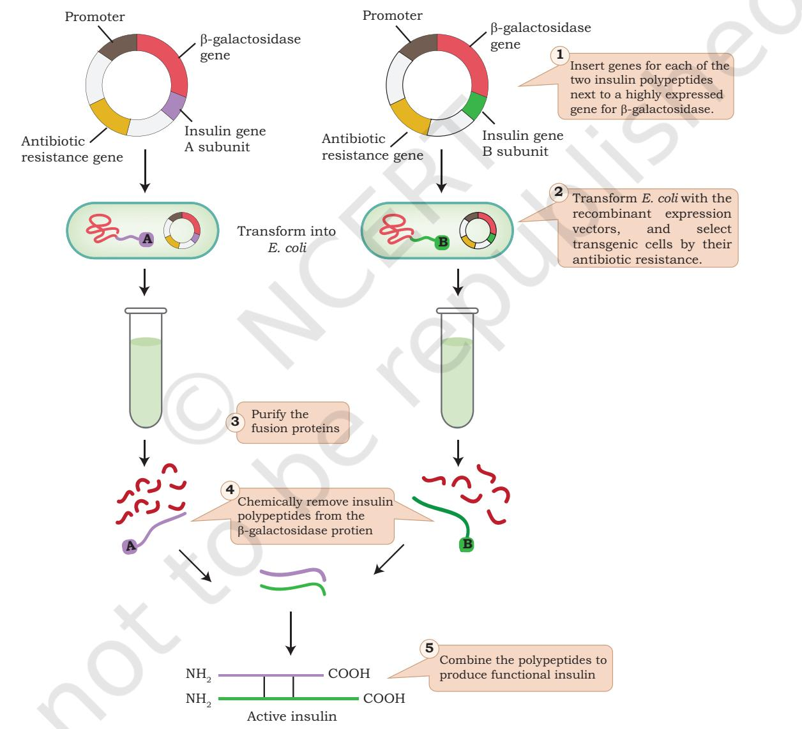

*Fig. 4.15: Steps involved in the production of genetically engineered insulin*

**102 Biotechnology XII**

Chapter 4_App recombinant DNA Tec_New corrections.indd 102 07-02-2023 10:08:11

In late 1970s, bochemists exploited various tools of rDNA technology for the production of insulin. Isolated insulin gene from a gene library was inserted in a bacterial plasmid of *E. coli*. A promoter site derived from the lac operon was inserted next to the insulin gene. Since the insulin gene was inserted right after the bacterial operon, therefore, this gene was expressed as its own. The gene expression produced a fusion protein i.e. insulin molecule fused with the enzyme β-galactosidase (β-gal), which was later cleaved to produce the human insulin. Because the processing of **preproinsulin** was not feasible in bacteria, scientists sidestepped this difficulty by cloning separately the genes for A and B insulin chains in bacteria. The fusion protein, β-gal-insulin was extracted and treated with cyanogen bromide (CNBr) to separate β-gal fragment from A and B chains. Subsequently, the disulfide bonds were again reestablished between A and B chain to reconstruct the final product, insulin (Fig. 4.15).

The first genetically engineered human insulin marketed as **Humulin** (Fig 4.16) was manufactured in 1982 which was more effective as compared to the pig and cow-derived insulin and the correct sequence was completely free from any allergic response.

Another important hormone secreted by the pituitary gland, *human growth hormone* (HGH), was produced using rDNA technology. HGH containing 191 amino acids is peptide hormone and promotes body growth by increasing the amino acids, lipids and carbohydrate metabolism during

childhood as well as the adulthood. Childhood deficiency of HGH leads to *Dwarfism.* Dwarfism is characterised by retarded body growth, chubby face, added fat deposition at waist and short height of about four feet, while the adult has an average intelligence but with an abnormal body proportion (Fig. 4.17). Since the bone growth is not fully complete at an early stage, dwarfism can be treated at this stage by providing HGH shots. To obtain sufficient HGH quantity for one year using conventional treatment, the pituitary glands from more than 80 cadavers were

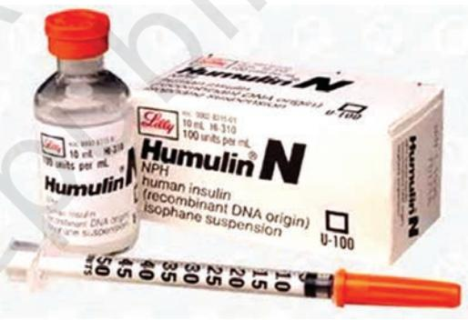

*Fig. 4.16: Eli Lilly Company has been marketing E.coli expressed insulin as Humulin*

**Applications of Recombinant DNA technology 103**

Chapter 4_App recombinant DNA Tec_New corrections.indd 103 07-02-2023 10:08:11

required. Not only, this method was expensive but also carried a risk of developing disease from infected brain tissue of cadavers.

#### **Box 6**

In 1978, the use of cadaver tissue was restricted in the United States and Great Britain because of the possibility of transferring Creutzfeldt-Jacob (CJ) Syndrome. This disease is believed to be caused by a virus-like agent 'prion' and it is accompanied by tremors, convulsions, dementia and wasting of the muscles. Indeed, by 1993, 24 cases of CJ syndrome had been identified in French recipients of HGH from cadaver tissue.

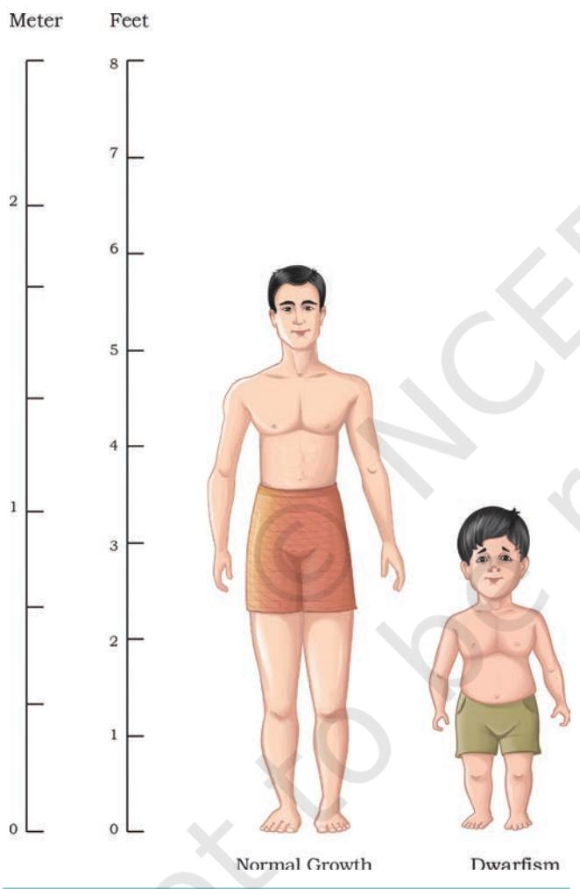

*Fig. 4.17: Deficiency of human growth hormone results in retarded growth and unusual body proportions*

**104 Biotechnology XII**

rDNA technology has enabled the production of the entire HGH. The production process for HGH is similar to that for human insulin production.

Though the natural HGH molecule consists of 191 amino acids but during its production in the body, an intermediate molecule having an extra 26 amino acids is encoded as a signal peptide. This signal peptide chain is finally cut free during secretion. To accomplish enough amounts of HGH, basic production techniques were modified. Consequently, to synthesise the gene for HGH, the HGH encoding mRNA was used as a template, and a complementary DNA (cDNA) molecule was synthesised. Due to the presence of signal peptide, the bacterium responds erratically after the insertion of cDNA and fails to remove the signal peptide from the intermediate HGH molecule.

To overcome this problem, rDNA technologists have worked with the cDNA molecule to cut away the **signal peptide**, where it binds the HGH gene. Since, no known restriction enzyme can make this cut, restriction enzyme EcoRI was used to remove the

Chapter 4_App recombinant DNA Tec_New corrections.indd 104 07-02-2023 10:08:13

base sequences for the signal peptide (26 amino acids) plus an additional 24 amino acids (a total of 50 amino acids) from the cDNA molecule. The extra 24 amino acids base sequence removed were chemically synthesised and put back on the cDNA molecule to generate the complete human growth hormone gene (Fig. 4.18). In the absence of signal peptide sequence, the human growth hormone gene can be inserted in bacterial cells for hormone production. In 1985, genetically engineered

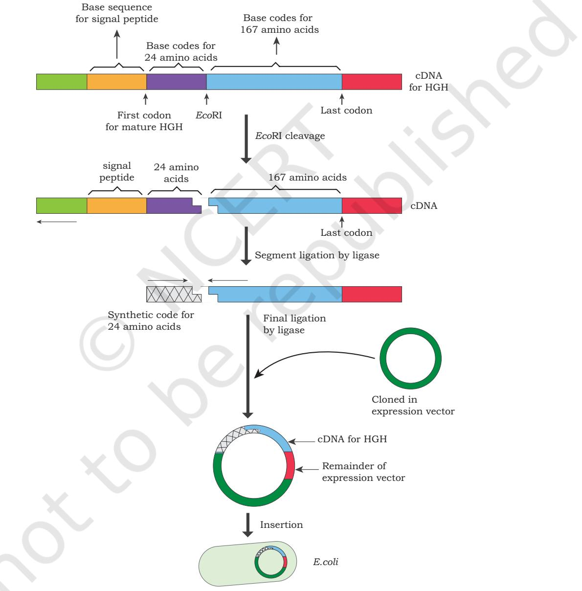

*Fig. 4.18: Production of genetically engineered human growth hormone*

**Applications of Recombinant DNA technology 105**

Chapter 4_App recombinant DNA Tec_New corrections.indd 105 07-02-2023 10:08:13

human growth hormone was produced and marketed as **Humatrope** and **Protropin**.

### **SUMMARY**

- To study and compare the inherited variations in human DNA without sequencing, a new technique, known as 'DNA fingerprinting' was developed by Sir Alec Jeffreys in 1984 at the University of Leicester.
- In DNA fingerprinting, a stretch of mini-satellite DNA known as Variable Number Tandem Repeats (VNTR) tandemly arranged are exploited using the technique, referred to as Restriction Fragment Length Polymorphism (RFLP).
- The process of insertion of a foreign gene (transgene) into the genome of an organism and its transmission and expression in the organism's progeny is termed as transgenesis. The organisms carrying the transgene are known as transgenic organisms.
- Transgenic plants are also called genetically modified plants, whose genome is modified, like introduction of one or more genes from another species through genetic engineering techniques.
- Basic requirement for genetic transformation is construction of genetic vehicle, which carries the genes of interest flanked by necessary regulating sequences, like promoter or terminator. The most commonly used techniques for gene transfer are of two types: vector-mediated or indirect gene transfer and vector-less or direct gene transfer.
- Vector-mediated or indirect gene transfer includes transformation using *Agrobacterium tumefaciens*, *in* planta transformation, plant virus-mediated transfer while vectorless or direct gene transfer includes particle bombardment, protoplast transformation and microinjection.
- Transgenic animals are animals whose genetic makeup has been transformed by the use of various genetic engineering techniques, such as DNA pronuclear microinjection, embryonic stem cell-mediated gene transfer and retrovirusmediated gene transfer.
- Transgenic plants have been developed with improved agronomic traits in crop plants and products, for example, resistance to biotic and abiotic stresses nutrient quality and delayed fruit ripening, etc.
- Transgenic plants are used in Molecular Farming for large scale production of industrial and therapeutic products.

Chapter 4_App recombinant DNA Tec_New corrections.indd 106 07-02-2023 10:08:13

- Transgenic animals have also been used in molecular pharming for large scale production of proteins, such as α1-antitrypsin, human α-lactalbumin, etc. Transgenic animals have been developed for use in environment benefits and for research purposes.
- There are a number of concerns related to use of GMOs on human health and environment. The Genetic Engineering Approval Committe (GEAC) established by Ministry of Environment, Forest and Climate Change regulates the manufature, use, import, export of hazardous microorganisums.
- Gene therapy is a technique designed to repair faulty genes in humans by introducing correct genetic material inside cells. There are three main approaches for gene therapy, they are: (i) Gene replacement / Gene addition, (ii) Gene inhibition and (iii) Gene repair/ Gene editing.
- Since, gene therapy includes making changes to the body's basic set of genes, it raises unique ethical considerations.
- A preparation of killed or weakened pathogen or their components given to elicit an immune response that subsequently recognises the infectious agent and confers protection against disease is known as 'Vaccine'.
- To avoid several potential concerns raised by conventional vaccines like reversal of the toxoids to their toxigenic forms, or co-purification of undesirable components and to overcome the complexity involved in obtaining sufficient quantities of purified antigenic components, recombinant vaccines were developed using the various tools of rDNA technologies.
- There are three main types of recombinant vaccines: Live genetically modified vaccines, recombinant subunit vaccines and genetic/DNA vaccines
- rDNA technology enables health care by facilitating large scale biological production of a variety of safe, pure and efficient therapeutic agents, such as a Drugs: Monoclonal antibodies, human proteins e.g. Insulin, HGH.
- With the advances in rDNA technology, it is possible to develop mouse antibodies carrying a few human segments known as chimeric or humanised antibodies possessing higher efficacy and activity.
- In late 1970s, biochemists exploited various tools of rDNA technology for the production of insulin. They isolated the insulin gene from a gene library and then inserted this gene in a bacterial plasmid of *E. coli*.
- The first, genetically engineered human insulin marketed as Humulin was manufactured in 1982. Successful

**Applications of Recombinant DNA technology 107**

Chapter 4_App recombinant DNA Tec_New corrections.indd 107 07-02-2023 10:08:14

production of human insulin proved without any ambiguity, the possibility of genetically engineering diverse biological organisms to produce human proteins for medicinal and therapeutic use.

- DNA technologists can now produce Human Growth Hormone entirely using rDNA technology. In 1985, genetically engineered human growth hormone was produced and marketed as Humatrope and Protropin.
### **EXERCISES**

- 1. What do you mean by DNA fingerprinting? Explain it through RFLP.
- 2. What are GMOs? Describe the method of development of transgenic plants.
- 3. Differentiate between direct and indirect method of gene transfer. Name one indirect method suitable for gene transfer in dicot plants.
- 4. What is molecular pharming? Give applications of transgenic animals in molecular pharming.
- 5. Differentiate between gene gun and gene therapy.
- 6. Give the procedure of development of recombinant subunit vaccines.
- 7. Write a short note on DNA vaccines.
- 8. Describe the advantages of monoclonal antibodies developed by rDNA technology over that developed by Hybridoma technology.
- 9. Briefly describe the development of Humulin through rDNA technology.
- 10. Write a short note on humatrope and Protropin.
- 11. Briefly describe the applications of rDNA technology in crop improvement.
- 12. List the ethical issues related to the use of transgenic animals?
- 13. What is the role of vaccinia virus in the development of recombinant vaccine?
- 14. Write a short note on recombinant therapeutic agents.
- 15. Write a short note on humanised antibodies.

Chapter 4_App recombinant DNA Tec_New corrections.indd 108 07-02-2023 10:08:14

- 16. **Assertion:** In hybridoma technology, B cells are fused with myeloma cells.
**Reason:** Myeloma cells are immortal.

- (a) Both assertion and reason are true and the reason is the correct explanation of the assertion.
- (b) Both assertion and reason are true but the reason is not the correct explanation of the assertion.
- (c) Assertion is true but reason is false.
- (d) Both assertion and reason are false.
- 17. **Assertion:** In Humulin, polypeptide A and polypeptide B are linked with disulfide bridges.

**Reason:** C peptide is removed from proinsulin to biological active insulin.

- (a) Both assertion and reason are true and the reason is the correct explanation of the assertion.
- (b) Both assertion and reason are true but the reason is not the correct explanation of the assertion.
- (c) Assertion is true but reason is false.
- (d) Both assertion and reason are false.
- 18. DNA fingerprinting depends on identifying specific:
	- (a) Coding sequences
	- (b) Non-coding sequences
	- (c) mRNA
	- (d) Promoter
- 19. Short stretch of DNA used to identify complementary sequences in a sample is called:
	- (a) Probe
	- (b) Marker
	- (c) VNTR
	- (d) Minisatellite
- 20. Variable number tandem repeat (VNTR) are:
	- (a) Repetitive coding short DNA sequences
	- (b) Non-repetitive non-coding short DNA sequences
	- (c) Repetitive non-coding short DNA sequences
	- (d) Non-repetitive coding short DNA sequences
- 21. Cry genes or Bt genes are obtained from:
	- (a) Cotton pest
	- (b) Tobacco plant
	- (c) *Bacillus thuringiensis*
	- (d) *E. coli*

**Applications of Recombinant DNA technology 109**

Chapter 4_App recombinant DNA Tec_New corrections.indd 109 07-02-2023 10:08:14

- 22. When gene therapy is done in somatic cells, it is ______.
	- (a) not-heritable
	- (b) heritable
	- (c) rarely heritable
	- (d) not related to heritability
- 23. In gene augmentation therapy, genetic material is ______.
	- (a) modified
	- (b) replaced
	- (c) suppressed
	- (d) removed
- 24. Germ cell therapy if used for ____________.
	- (a) RBC
	- (b) Stomach cells
	- (c) Egg cells
	- (d) Bone marrow cells
- 25. For the first time, from which animal material was isolated for vaccination?
	- (a) Cat
	- (b) Cow
	- (c) Goat
	- (d) Horse
- 26. Vaccination was invented by:
	- (a) Jenner
	- (b) Pasteur
	- (c) Watson
	- (d) Crick
- 27. For the production of insulin by rDNA technology, which bacterium was used?
	- (a) *Saccharomyces*
	- (b) *Rhizobium*
	- (c) *Escherichia*
	- (d) *Mycobacterium*

28. Genetically engineered insulin is called __________.

- (a) Humulin
- (b) Promulin
- (c) Bovulin
- (d) Proculin
- 29. Monoclonal antibodies are produced by_________.
	- (a) Mutations
	- (b) Transfection
	- (c) Hybridoma technology
	- (d) RNA interference

Chapter 4_App recombinant DNA Tec_New corrections.indd 110 07-02-2023 10:08:14

