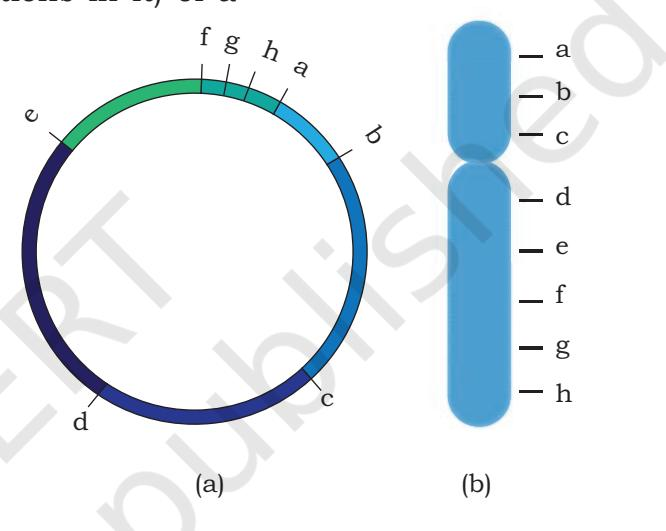
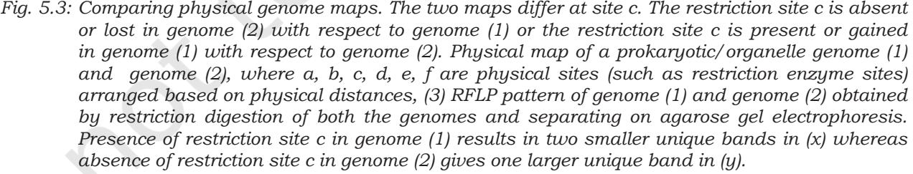
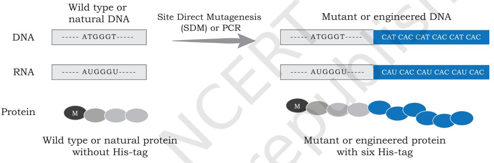

## **UNIT II Genome Engineering**

Chapter 5: Genome Technology and Engineering

Rationalised 2023-24

Chapter 5_Genome Technology.indd 111 06-02-2023 17:41:30

**Stanley Norman Cohen 17 February 1935—present**

Stanley Cohen was born in Perth Amboy, New Jersey. After graduating from Rutgers College in 1956, Cohen went to the University of Pennsylvania School of Medicine. He finished his medical degree in 1960. He accepted a position at Stanford University's Medical School in 1968 and began experimenting with plasmids. Cohen is a Professor of Genetics at Stanford University. He is a member of the National Academy of Sciences, and in 1980, won the Albert Lasker Basic Medical Research Award. He was awarded the National Medal of Science in 1988. Stanley Cohen is well-known for his innovation with Herbert Boyer of recombinant DNA technology, which they published in 1973. Stanley Cohen and Herbert Boyer were the first two scientists to transplant genes from one living organism to another, a fundamental discovery for genetic engineering.

Chapter 5_Genome Technology.indd 112 06-02-2023 17:41:31

# **Genome Technology and** 5 **Engineering Chapter**

Gradual development in the area of biotechnology and molecular biology especially in genome mapping and its implication has led to the opening of new frontiers for research as well as its applications in many fields. Advancement in genome research has opened up scope for understanding of transcriptome and proteome of any organism on one hand, and application of genomics and related engineering in prediction and treatment of diseases on the other. Applications in crop improvement, gene therapy and remediation of environmental hazards are yet another frontier in which genome technology has tremendous potential and scope. In this chapter, concepts related to genome, its sequencing, analysis and its impact on understanding the biology of organisms have been detailed. In Chapter 7 of Class XI, students have already studied as to how genetic information is encoded in DNA and the processes, like transcription and translation.

## **5.1 Mapping of Genome: Genetic and Physical**

Genome of an organism is the complete genetic information present in the cell of an organism. For prokaryotes, it includes

- Physical mapping of the genome (physical and genetic mapping) *5.1 Mapping of the Genome: Genetic and Physical*
- High-throughput DNA sequencing *5.2 High-throughput DNA sequencing*
- Other genome-related technology *5.3 Other genomerelated technology*
- Structural, functional and comparative genomics *5.4 Genome Engineering*
- Protein engineering *5.5 Structural, functional and comparative genomics*
	- *5.6 Protein engineering*

Chapter 5_Genome Technology.indd 113 06-02-2023 17:41:31

(b) Eukaryotes

- *Fig. 5.1: Genome represents DNA content present in Prokaryotes or Eukaryotes. (a) For prokaryotes, it includes the DNA present in the nucleoid and plasmid (b) For eukaryotes, it includes the DNA present in the chromosomes of the nucleus as well as in organelles, like mitochondria and chloroplast*
the DNA present in the nucleoid region and plasmid (as it is present in bacteria); and for eukaryotes, it includes the DNA present in the chromosome of the nucleus as well as in organelles, like mitochondria and the plastids, e.g. Protists and all multicellular organisms (Fig. 5.1).

Chapter 5_Genome Technology.indd 114 06-02-2023 17:41:33

One of the important tasks for many biologists is to compare genomes or DNA of two organisms for various purposes including the understanding of conserved genes or DNA sequences and relationships, etc. In simple words, from multiple samples of a biological organism, a scientist wants to know whether DNA samples from two or more sources are similar or different. If DNA from two sources are different, then how are these different from each other. Further, if an interesting phenotype is noticed, the scientist might also be interested to know the genetic basis (genes and mutations in it) of a

particular phenotype. Therefore, a set of techniques is required to answer such questions. Ideally, if we know the complete DNA sequence of each sample, we can compare them and answer all such questions.

In genome research, it is extremely important and crucial to create a map of the genome of an organism from the point of view of identification and relative position of genes or loci. Maps of genome can be created by two different approaches i.e., the genetic approach and the physical approach, giving rise to genetic and physical mapping techniques for genome mapping in biological organisms (Fig. 5.2).

## **5.1.1 Genetic Mapping**

Genetic mapping experiments give us an estimate of distances between two or more genetic loci responsible for a set of well-known phenotypes. A genetic map, as shown in Fig. 5.2, is created by carrying out crossover analysis. You have already studied about the phenomenon of crossing over in Class XI (refer section 6.2, Chapter 6). Rate of crossing over (also referred to as recombination frequency) between two or more genes or loci has been successfully used to measure relative genetic distance between them. One map unit is equal to one per cent of observed

*Fig. 5.2: Genome map—(a) Map of a prokaryotic/ organelle genome. (b) Map of a eukaryotic genome, where a, b, c, d, e, f, g, h are genetic loci or physical sites like SSLP, STS arranged based on genetic distances*

**Genome Technology and Engineering 115**

Chapter 5_Genome Technology.indd 115 06-02-2023 17:41:33

cross-over (recombinants). The unit centimorgan (cM) is used to denote genetic distance between genes based on offspring phenotype frequency. Chances of segregation of two markers (loci) by recombination are directly proportional to the distances between them. Therefore, decreased recombination frequency is an indication that distance between said markers is less. When genetic loci are arranged based on the genetic distances between them, it creates a genetic map of the organism. The main drawback of this approach is the availability of limited number of genetic loci responsible for a set of well-known phenotypes. This makes genetic maps sparsely populated or coarsely grained and therefore, it limits on the utility of such maps for fine mapping of new phenotypes to the genome.

## **5.1.2 Physical Mapping**

An alternative to genetic mapping is physical mapping of the genome in which specific locations on the genome are identified using DNA based map features. The presence of restriction enzyme sites (restriction mapping), simple sequence length polymorphism (SSLP), and sequence tagged sites (STS) have been used as map features (Fig. 5.2). These features are helpful in creating a high resolution physical map of genome. Let us briefly understand these genome map features.

**Restriction fragment length polymorphism (RFLP):**  RFLP is a mapping technique that uses a DNA endonuclease enzyme called restriction enzymes (refer Section 3.3, Chapter 3) that cuts DNA at a specific base sequence resulting in the fragmentation of DNA. The fragmentation pattern of the digested DNA can be visualised when the fragments are separated based on their sizes by agarose gel electrophoresis. Typically, a single cut in a circular DNA yields one fragment of DNA, while the dual cut leads to two fragments. For linear DNA, a single cut results in two fragments of DNA while the dual cut results in three fragments. The DNA is digested with some of the enzymes

Chapter 5_Genome Technology.indd 116 06-02-2023 17:41:33

such as a EcoRI, BamHI, etc., either singly or sequentially to create a map of restriction sites based on the size of fragments they produce. This exercise results in a high-resolution physical map of restriction sites of the genome. Such a map can easily be compared with others noticing the gain or loss of certain restriction sites resulting in observed Restriction Fragment Length Polymorphism from DNA samples by the changes in length of DNA fragments (Fig. 5.3). For example, in a family with a history of certain disease, comparison of these maps among the diseased and disease-free members may help to identify specific RFLP locus associated with the disease. Association mapping can also help to identify the genetic divergence between populations. However, it is also important here that a mammalian genome may have sites for approximately 105 different restriction enzyme sites and it is quite possible that a restriction enzyme like EcoRI may cut a mammalian genome in lakhs of fragments and these cannot be distinguished on the basis of electrophoresis. This problem is addressed by the technique of Southern hybridisation in which specific DNA probe between

**Genome Technology and Engineering 117**

Chapter 5_Genome Technology.indd 117 06-02-2023 17:41:33

different RFLP sites are used. [Fig. 5.4 (a)].

*Fig. 5.4: Physical mapping using restriction fragment length polymorphism (RFLP)—(a) A probe P detects two DNA morphs when the DNA is cut by a certain restriction enzyme (RE). (b) The pedigree of the dominant disease phenotype D shows linkage of D locus to the RFLP locus; only child 8 is recombinant* 

**Simple sequence length polymorphism (SSLP) map:** A large genome contains arrays of different repeat sequences, which may be of varying length. Microsatellites and minisatellites are such repeat sequences that can also be used for physical mapping of genome based on its length variant (refer Section 4.1 in Chapter 4 of this book).

**Physical Mapping using Sequence Tagged Sites (STS):**  Sequence tagged sites are a useful addition to physical mapping. STS are unique DNA sequence (200–500 bp) that occur once in a genome and whose unique location in the genome is known. The presence or absence of STS

Chapter 5_Genome Technology.indd 118 06-02-2023 17:41:33

**118 Biotechnology XII**

site in a given fragment of DNA can be easily demonstrated using polymerase chain reaction (PCR). Hence, the presence of these sites serve as a useful location landmark in the creation of physical map of a genome. They are often combined with the restriction maps to improve the resolution and effectiveness of association mapping.

## **5.2 High-Throughput DNA Sequencing**

While we can compare the physical and genetic map to differentiate and classify organisms based on their genetic or physical map, it is highly desirable to get the complete DNA sequence of the organism. In earlier days, sequencing complete genomes was prohibitively expensive and therefore, less expensive techniques were used to narrow down the region of interest to small locus of DNA that is statistically associated with the phenotype of interest. Only this small region of interest is used for sequencing to avoid the prohibitive cost of full genome sequencing. However, this approach requires a map of genome that could be referred to or compared with others. Advances in sequencing technology have now made it possible to obtain complete DNA sequence of any organism, if we can get its DNA. Initially, the cost of DNA sequencing per base was prohibitive to carry out full DNA sequencing of eukaryotic organisms including human beings. However, this has changed drastically at present. In this section, we will see as to how the DNA sequence technology has evolved over last three decades.

## **5.2.1 First generation DNA sequencing technology**

Initial or first phase of genome sequencing was an elaborate and a multistep procedure. It involved separation of chromosome on agarose gel using pulse field gel electrophoresis (PFGE). Separated chromosome was then subjected to restriction digestion and the digested fragment were ligated to high-capacity cloning vectors, such as BAC, YAC, PAC, etc. (Refer Section 2.3, Chapter 2). The DNA present in these clones are often overlapping and the clones from such exercises can be organised in a set of minimum

Chapter 5_Genome Technology.indd 119 06-02-2023 17:41:33

clones that carry overlapping set of DNA from the organism.

DNA segments from these clones are physically mapped and sub-cloned into sequencing plasmid for sequencing the cloned DNA using the first generation DNA sequencing techniques.

The first generation DNA sequencing technique used a method called sequencing by chain termination (refer Section 12.9.1 of Class XI *Biotechnology* textbook). In this method, a ladder of single stranded DNA is created, each terminating at a specific base (identified by a specific fluorescence tagged to the terminating base) location. These fragments are separated based on their size using capillary gel electrophoresis technique (in which the electrophoresis of the charged molecule i.e., DNA fragments, is done in a capillary filled with gel). A fluorescence detector is positioned near the bottom end of the capillary to read the fluorescence of the single stranded DNA passing in front of the detector. Output of this technology is a chromatogram of fluorescence, where each peak represents a base position and colour of the peak indicates which DNA base is present there. Each capillary in a single run, sequences about 800-1000 base–long DNA. A single DNA sequencer can have as many as 96 capillaries (with 96 different sequencing reactions loaded) operating in parallel in one machine. This type of setup can provide up to 96000 bases per run, per machine.

One of the drawbacks of this technology is that it is time consuming and labour intensive which leads to a prohibitively high cost of genome sequencing. To overcome this challenge, the next generation of DNA sequencing technology was developed.

## **5.2.2 Next generation (second) DNA sequencing technology**

Next generation DNA sequencing technology uses a massively parallel (millions of parallel sequencing reactions in one machine) DNA sequencing approach. This technology does not require time consuming cloning and subcloning steps and therefore, reduces cost required for the genome sequencing project. Compared to the first generation sequencing methods, next generation methods

Chapter 5_Genome Technology.indd 120 06-02-2023 17:41:33

**120 Biotechnology XII**

provide advantages, such as simple workflow high data accuracy (due to high depth of coverage) and a broad range of application.

Although there are many approaches to this strategy, we will look at working of one of the most popular Next Generation sequencing technologies platform i.e., **Illumina Sequencing Technology** (Fig. 5.5). It uses a flow cell (glass slide) where DNA fragments are amplified through a special method called **Bridge PCR Amplification**. A flow cell is a solid support, where single stranded small oligonucleotides (8 –10 bases) are attached. Initially, DNA is fragmented into small pieces (~1– 2 kb) and small oligonucleotide adaptors are attached to these DNA fragments. These adaptors are complementary to the oligonucleotides on the flow cell and hence, help in the attachment of DNA fragments to flow cell. These adaptors are used as primers and new DNA strands are synthesised. During this process, fragments

*Fig. 5.5: A popular Next Generation sequencing technology*

**Genome Technology and Engineering 121**

Chapter 5_Genome Technology.indd 121 06-02-2023 17:41:34

make a bridge like structure because of complementarity of adaptors with the oligonucleotides attached to the flow cell. Therefore, it is called **bridge amplification**.

It results in a cluster of similar fragments at the same location. After the PCR amplification, sequencing primer is used, which binds to one of the adaptors and each fragment is sequenced at the same time. For sequencing, fluorescently tagged dNTPs are used for the synthesis of complementary strand and each of the bases i.e., dATPs, dTTPs, dGTPs or dCTPs, is attached with different fluorescent tags. Only one base is added at one time and incorporated bases are read based upon the type of its fluorescence. This is followed by the addition of next base and fluorescence is imaged. In this way, millions of fragments are sequenced parallelly at the same time.

The sequencing reaction is polymerase based and it is carried out in the flow cell by passing labelled base (these bases have unique fluorescence tag). These fluorescent bases would get incorporated depending on the DNA template initially attached to the flow cells. The fluorescence of the newly incorporated base reveal the sequence of the DNA fragment attached on the flow cells (Fig. 5.5). After recording the image of the flow cell, the fluorescent tag of the incorporated base is removed and then next base is passed through the flow cell (Fig. 5.5). The whole sequencing is recorded as an array of fluorescent images, where the DNA sequencing is recorded as fluorescence changes at a given coordinate or spot. Such an array of images reveals the sequence of millions of such spots in parallel.

Although this technology is capable of sequencing millions of DNA in parallel, it generates a very short (75 to 300 base long) length of sequences compared to the first generation technology. However, additional sequencing strategies are available to overcome some of the limitations posed by short sequencing output.

## **5.2.3 Some recent advances in DNA sequencing technology**

One of the recent advances in DNA sequencing technology is the use of nanopores for DNA sequencing. This is also

Chapter 5_Genome Technology.indd 122 06-02-2023 17:41:34

**122 Biotechnology XII**

considered a third generation sequencing technology. Here, sequencing is carried out by measuring the pattern change in electric current across a nanopore when a specific base in single stranded DNA passes through a nanopore (Fig. 5.6). The current implementation of this technology makes use of two proteins— a DNA helicase and a porins like molecule that is assembled to form nanopore on a synthetic membrane which divides the sequencing cell into two compartments. The DNA helicase captures and unwinds a double stranded DNA and pushes one of its strand through the nanopore. An ionic current is maintained across the nanopore, and it is monitored continuously. When the DNA bases pass through the pore, the porins like molecule interacts differentially with single stranded DNA bases and it disrupts the ionic current. The disruption caused by each base is

- *Fig. 5.6: Nanopore based sequencing technology. Yellow dots are ions flowing through a pore creating current across nanopore formed by protein pore (blue). Passage of each base through the nanopore results in specific changes in the ionic current. These changes in the ionic current are measured and the corresponding bases are identified. The sequence read here is ACGT. The unwinding enzyme efficiently captures the DNA, docks on the protein pore and drives one strand of DNA through the nanopore*
**Genome Technology and Engineering 123**

Chapter 5_Genome Technology.indd 123 06-02-2023 17:41:34

very specific and by measuring these signatures of electric current changes, corresponding bases can be identified. The nanopore based sequencing technology offers a rapid and simple sample processing and has the potential to display sequencing results in real-time, making it highly useful for genotyping even in the field setup. Another major advantage of the nanopore sequencing is the production of very long sequencing reads (as long as 1 Mb or even more) at a relatively low cost.

## **5.3 Other Genome-related Technologies**

Genome sequencing comes in multiple flavours or variations. This includes whole genome sequencing (WGS), targeted sequencing, metagenomics etc., as described in the following sections.

## **5.3.1 Whole Genome Sequencing (WGS)**

WGS is a comprehensive method of determining the DNA sequence of the entire genome of an organism. Using WGS, the first genome of *Haemophilus influenzae* was sequenced. The availability of the whole genome sequences is helpful in understanding the genetic regulation of inheritance, identification of the genetic disorders that are inherited and so on. Whole genome sequencing of human genome started in 1990 and complete sequence was published in 2003. With advances in sequencing technologies (as discussed in the previous section), now it is possible to sequence the entire genome in a few days. Whole genome sequence of a large number of microbes, animals and plants has already been obtained. Availability of the WGS can help to create personalised plans to treat human diseases or reading the variations in the cancer cells can help the physician to select the best chemotherapy.

When a whole genome sequencing uses a reference genome sequence (already sequenced and phylogenetically related genome sequence) to assemble its individual sequencing reads into genome sequence it is called reference based genome sequencing. When no such reference is used, it is called *de novo* genome sequencing.

Chapter 5_Genome Technology.indd 124 06-02-2023 17:41:34

## **5.3.2 Targeted sequencing**

Targeted sequencing project is done to know as to whether targeted regions of a genome have variation or not. Such projects make use of already sequenced genome as reference genome sequence in order to assemble the newly sequenced genome. Targeted sequencing focuses on the sequencing and analysis of a set of selected genes or genomic regions of the genome. It can be used to compare the smaller set of the genomic regions among different genomes to identify variations like mutations, insertions or deletions, etc. For this purpose, target genomic regions is selected, isolated and then sequenced. Usually, PCR is used for this purpose.

**Clinical exome sequencing** is also very similar to targeted resequencing. Clinical exome sequencing covers gene that are known to be disease associated (as reported and curated from databases, like OMIM, HGMD, etc.). Genetic diagnostics tests based on clinical exome sequencing are cost effective than whole genome sequencing.

With the development of high-throughput DNA sequencing, DNA sequencing technology itself has been adapted to do much more than just reveal the genome sequence of an organism. One can use this technology to study the biology of an organism at genome level. Some of the advance applications of sequencing technologies are ChipSeq, RNASeq, etc.

**ChipSeq sequencing** projects are used to map genome-wide DNA binding site of a transcription regulator. Since transcription regulators play an important role in controlling the gene expression of one or more genes, ChipSeq projects are used to know ginome-wide DNA binding sites (as well as target genes) of a transcription regulator.

**RNASeq** projects are carried out to study the global gene expression profile (transcriptome) of an organism, a tissue or a sample. Total RNA is extracted from the target sample and cDNA is synthesised, which is sequenced using next generation sequencing technologies.

The sequencing read thus generated mapped to various genes on the genome and count of such reads mapping to those genes are in proportion to their expression reads.

**Genome Technology and Engineering 125**

Chapter 5_Genome Technology.indd 125 06-02-2023 17:41:34

## **5.3.3 Metagenomics: Sequencing of DNA or cDNA present in a microbial community**

Metagenomics projects are used to study the genomics of community of organisms. Here, we do not separate the organisms or culture them individually. Metagenomics, in fact, is the study of the total genetic material directly obtained from the microorganisms living in a particular environment, like microbes living in the animal gut or in any particular ecological environment. It has several applications in medical microbiology, agriculture as well as environmental microbiology. In particular, it helps to study the diversity of microbial communities and how the diversity of these microbes changes with changes in the environment. Metagenomics may also help in identifying novel genes or enzymes with the significant industrial applications. For example, the study of microbial communities living in extreme environments, like high temperature sulphur springs can help to identify the novel enzymes that are resistant and functional at such high temperatures.

Thus, metagenomics has applications in understanding the genomes of gut microbes, throat microbes, microbes present on a toilet seat, and many more. It provides an insight about the genome of diverse forms of microbes and their correlations. For example, study of genomes of diverse forms of viruses may provide an understanding about virus-host interaction, epidemiology and also evolution of viruses. Presence of multiple genomes in metagenomics sample creates special challenges in data analysis, hence they require a different set of computing algorithms.

## **5.4 Genome Engineering**

This technology is used to modify the genome. It is often carried out to introduce or remove one or more genes. The goal of this engineering is to introduce a new functionality or to modify (or remove) the existing functionality of a biological organism. In this section, we would get a glimpse of the approaches that had been used to engineer a genome. One of the approaches uses transposon or jumping genes to inactivate or delete a gene(s) in a genome. Another approach is to edit the genome without having any additional unwarranted changes in the genome.

Chapter 5_Genome Technology.indd 126 06-02-2023 17:41:34

**126 Biotechnology XII**

## **5.4.1 Knock-out and knock-in of a gene by transposon insertion**

Transposons are DNA sequences also known as 'Jumping Genes' that move from one location to another on the genome found in almost all organisms (both prokaryotes and eukaryotes). DNA transposon generally moves by a 'cut and paste' mechanism in which the transposon is excised from one location and integrated elsewhere in the genome. Many a times, such movement of DNA segment results in the insertional inactivation of a gene located at the site of insertion. This behaviour of transposon is exploited to *knock-out* an existing gene. In such a strategy, the transposon is engineered, so that it recognises a specific sequence of a target gene, where it gets inserted. Once the transposon is inserted at the target site, the coding frame of target gene is disrupted and therefore, it can no longer produce the original transcript required to code the gene product (Fig. 5.7).

#### *Fig. 5.7: Genome engineering through transposition*

In certain cases, when a transposon gets inserted at a particular site, it alters the genetic locus of interest, resulting in the addition of DNA sequence, that was not present on the said genetic locus. This property of

**Genome Technology and Engineering 127**

Chapter 5_Genome Technology.indd 127 06-02-2023 17:41:34

transposon is used to *knock-in* of a functional gene. This *knock-in* and *knock-out* technology helps in the generation of animal/plant models to understand the molecular basis and development of new drugs for the disease.

## **5.4.2 Genome editing using Clustered Regularly Interspaced Short Palindromic Repeats (CRISPR-Cas9)**

Genome editing is a set of techniques or technologies that can be used to change the DNA of an organism by adding, removing or altering the specific DNA sequence of the genome. Like restriction enzymes, this technique is a biotechnological adaptation or repurposing of a naturally occurring genome editing system present in bacteria. In its natural context, this system is used to memorise the DNA signature of past viral attacks so that any subsequent viral infection with matching DNA signature present on the viral DNA can be countered or destroyed effectively.

Gene knock-out by deletion or insertion

**128 Biotechnology XII**

Chapter 5_Genome Technology.indd 128 06-02-2023 17:41:34

<i>Fig. 5.8: *Gene editing using CRISPR-Cas9 technology. Guide RNA position the specific region of genomic DNA with Cas9 protein complex for inducing double strand break. After double strand break, gene knock-out can be created using deletion or insertion of DNA sequence. For gene editing, a desired mutant copy (for correction/replacement around the break site) can be introduced to this region to undergo homologous recombination in the presence of desired mutant template DNA, thereby introducing these mutations in genomic DNA at a specific place.*

In this approach, a guide RNA is designed and produced in the cell along with Cas9 endonuclease. The guide RNA are required for positioning of Cas9 endonuclease at a location, where DNA are required to be edited or engineered. Part of the guide RNA is complementary to the DNA sequence, where the sequence needs to be edited. The other part of guide RNA attracts and binds to Cas9 endonuclease. Once this whole complex (the guide RNA bound to target DNA and Cas9) is assembled, a double strand break is introduced in the DNA by the endonuclease (Fig. 5.8). The broken DNA undergoes a template based homologous DNA repair where a modified or edited DNA template is provided that has the desired changes (edited sequence). As a consequence of such double strand break and template guided DNA repair, the repaired genomic DNA now possess an edited DNA sequence.

#### **Box 1**

#### **Nobel Prize in Chemistry 2020 for discovering the CRISPR-Cas9 genetic scissors**

Emmanuelle Charpentier Jennifer Doudna

Emmanuelle Charpentier, a *Researcher* at the Max Planck Unit for the Science of Pathogens, in Berlin, Germany; and Jennifer A. Doudna, a *Biochemist* at the University of California, Berkeley were awarded the Nobel Prize in chemistry 2020 for discovering the CRISPR-Cas9 genetic scissors, a gene-editing method.

The concept of CRISPR-Cas9 was modified from naturally occurring ancient bacterial immune systems. Bacteria use CRISPR-Cas systems to recognise and cut the DNA of invading viruses into inactive segments called CRISPR arrays. This effectively disables the virus and contributes to immune 'memory' of the bacteria. While studying *Streptococcus pyogenes* in 2011, Dr. Charpentier discovered a new molecule in the CRISPR-Cas system, called tracrRNA, and started a collaboration with Dr. Doudna to reprogram the CRISPR system. Together, they discovered that CRISPR could be directed to cut DNA at the target sequences using Cas9 protein. This allowed the genetic material to be subsequently added, deleted or changed as desired, using the cell's own DNA repair machinery. Researchers can use this technique to modify the DNA of living organism with extremely high precision. This specialised gene editing tool allows very small and precise changes to be made to the genetic code, it can halt a disease that causes premature ageing in a mouse model and double the lifespan of the treated animals.

**Genome Technology and Engineering 129**

Chapter 5_Genome Technology.indd 129 06-02-2023 17:41:34

## **5.5 Structural, Functional and Comparative Genomics**

Next generation sequencing projects generate large volume of data that require extensive computing for data analysis. Computational genomics is a field that uses high performance computing clusters and workstations to analyse genomics data including the data generated by the sequencing technology. Computational genomics helps in understanding the functions of the genome based on computational and statistical analysis to decipher biology from genome sequences and related data based on DNA and RNA sequences, as well as other experimental data. With the increasing number of genome sequence of different organisms, one major step is the identification of common genes through homology search and gene annotation (assigning functional value). Secondly, sequence comparisons across multiple sequences can be carried out by advanced computational genomics tools, such as BLAST, ClustalW, Phylip to understand the evolutionary relationship. Rapid progress in the field has led to advancements in structural genomics which deals with the three dimensional information of the proteins encoded by the genome.

Advancements in the area of powerful computer graphics processing units (GPU) and graphic cards have been utilised [General purpose (GP-GPU) and Computer Unified Device Architecture (CUDA) programming] for scientific computing including computational genomics to bring high performance computing for accelerated data analysis.

Genomics work is capital intensive. Since genomics has become a major tool to study biology and has a profound effect on biotechnology, the Department of Biotechnology (under Ministry of Science and Technology, Government of India) has taken an initiative to establish three National Genomics Core facilities in India. These facilities would help Indian scientists and entrepreneurs to execute their genomic projects. These facilities are located within two national laboratories (Centre for DNA Fingerprinting and Diagnostics, Hyderabad and National Institute

Chapter 5_Genome Technology.indd 130 06-02-2023 17:41:34

**130 Biotechnology XII**

of Biomedical Genomics, Kalyani) and one university (University of Allahabad, Allahabad).

## **5.5.1 Structural genomics**

Structural genomics means two different things to two different sets of people. For those who are interested in protein structure, it refers to 3D structure of every protein encoded by a particular genome. For those who are interested in chromosome organisation, it refers to physical nature of the whole genome.

Earlier, the focus of structural genomics (as defined by structural genomics consortium) was to search for new protein folds or structure in newly sequenced genomic DNA. Through this approach, scientists address the need for solving more protein structures, especially of proteins with sequence that are of unknown fold types.

An expanded view of structural genomics includes the study of structural organisation of DNA region in chromosome and nucleosome status of the genome. This includes the study of large structural changes in genome organisation of related species. An interesting example is to see as to how genes that are common between mice and human are redistributed across different chromosomes of two species.

## **5.5.2 Functional genomics**

Functional genomics aims to understand as to how the physiological function information encoded in genome is executed. A set of genomics based tools and techniques, such as RNAseq, ChipSeq, Metagenomics (of microbial community), etc., are used to understand the physiological and pathological function associated with the state of a cell.

## **5.5.3 Comparative genomics**

Comparative genomics deals with the comparison of genes and genomes of multiple species or within multiple individuals of the same species. It can help in genome annotation of the newly sequenced genome based on its comparison with related well-known genome. It can also help identify the set of common genes that form core

**Genome Technology and Engineering 131**

Chapter 5_Genome Technology.indd 131 06-02-2023 17:41:34

genome and other genes that are unique to a species. The latter may be responsible for unique behaviour or function of a particular species. Comparative genomics may also identify whether a functional molecule is present or absent in a genome. It may also be used as a starting point for genome based taxonomy and phylogenetic lineage study.

## **5.6 Protein Engineering**

In this unit, we would learn about another advanced usage of rDNA technology that can be used to create and produce engineered proteins having additional or extended property as compared to the original protein.

The engineered proteins may have greater stability when exposed to elevated temperature, change in pH, presence of salts or organic solvent. Proteins can also be engineered to develop and produce novel reagents for research, diagnostics and therapeutics.

## **5.6.1 Applications of protein engineering**

To engineer a protein, the critical amino acids responsible for the desired trait is identified. Its codon sequences on the gene are modified by creating point mutations so that it can be mutated or replaced by another amino acid that modulate the desired activity. Let us discuss some examples of engineered proteins.

**1) Recombinant protein to improve cleansing action of detergent:** Subtilisin is a proteolytic enzyme that is added to detergents to hydrolyse the protein component of

*Fig 5.9 : Catalytic Triad in Subtilisin* introduced at a specific site), the

**132 Biotechnology XII**

dirt. This improves the cleansing action of the detergent. The catalytic triad of subtilisin is Ser 221, His 64 and Asp 32. However, in the presence of bleach, Met 222 is oxidised, this leads to reduced action of subtilisin. If the codon for Met 222 is replaced by codon for Ala by point mutation by site directed mutagenesis (a process by which point mutation can be

Chapter 5_Genome Technology.indd 132 06-02-2023 17:41:34

engineered protein becomes stable even in the presence of bleach (Fig. 5.9).

**2) Recombinant protein for protein purification:** A peptide with six consecutive His amino acids called 6-His-Tag, can bind to metal ions, like Nickel, Zinc and Cobalt with great affinity at mildly alkaline pH. This property of 6-His-tag is exploited for the purification of recombinant protein. DNA encoding for 6-His-tag is fused with the gene sequence of recombinant protein of interest. During protein purification by affinity chromatography, the 6-His-tagged recombinant protein will be immobilised by the presence of metal ions in the agarose gel. All other proteins will be removed by washing the gel. 6-His-tagged recombinant protein can then be eluted by using an elution buffer (Fig. 5.10).

*Fig. 5.10: Protein engineering for protein purification. The engineered protein with 6-His-tag are easily and efficiently purified on Nickel ion columns*

### **3) Recombinant protein for tracking the location of the**

**protein in a cell:** The gene encoding for green fluorescent protein (GFP) obtained from jelly fish, *Aequorea victoria*, is fused with the DNA sequence of interest. This chimeric DNA now encodes for an engineered protein that appears as a green fluorescent molecule when exposed to UV light, thus revealing its location inside the cell (Fig. 5.11).

**4) Recombinant protein as immunotoxin:** Recombinant immunotoxins are rationally engineered protein agents (often anti-cancer agents) that combine the selectivity of antibody with cell-killing potency of toxin. To generate immunotoxin, DNA coding region of antibody (Single Chain Antibody Box 2) that recognise a cancer cell marker (cell-surface antigens present exclusively or abundantly on

**Genome Technology and Engineering 133**

Chapter 5_Genome Technology.indd 133 06-02-2023 17:41:35

*Fig. 5.11: Protein engineering for protein localisation. The engineered protein with Green Fluorescent protein (GFP) tags are easily visualised and localised in the specific regions of cell using epifluorescence or confocal microscopy. The nucleus localised GFP tagged protein appears green in the presence of UV light.*

the cancer cell) is fused with the DNA code of toxin (such as *Diphtheria* toxin or the exotoxin from *Pseudomonas*) to produce immunotoxin (Fig. 5.12). This engineered protein uses its antibody part for selectively targeting cells displaying their cognate antigens while the toxin part does the killing of those cells.

*Fig. 5.12: Single chain immunotoxin. Variable part of light chain coding DNA (Grey) is fused with the equivalent part of heavy chain coding DNA (green) and toxin coding DNA (orange) through an arbitrary linker DNA code (black) giving rise to an engineered single chain antibody gene. This gene can be used to make single chain antibody. The blue triangle is an antigen sitting at antigen binding site of a single chain immunotoxin.*

Chapter 5_Genome Technology.indd 134 06-02-2023 17:41:36

#### **Box 2**

#### **Single chain antibody (SCA)**

Natural antibodies are multi-chain proteins usually having two heavy and two light chains coded, separately by two different genes (Figure). The part of antibody that recognises target antigens is localised in the N-terminal region of the two chains. In a single chain recombinant antibody, the DNA codes of the N-terminal part of two chains are fused with each other to produce a chimeric recombinant gene coding for an engineered recombinant protein. This can form antigen binding region of the original antibody with nearly same affinity as the original one. Such single chain antibodies can be conveniently produced in bacteria and used in place of antibody for therapeutics (as in case of recombinant Immunotoxin) and diagnostics (as in case of (SCA based diagnostics reagents).

*Single chain antibody. Variable part of light chain coding DNA (grey) is fused with the equivalent part of heavy chain coding DNA (green) through an arbitrary linker DNA code (black) giving rise to an engineered single chain antibody gene which can be used to make Single chain antibody*

#### **Box 3**

#### **Humanised monoclonal antibody**

Monoclonal antibodies are very useful reagents that bind their targets in a well-defined way. These antibodies are easily produced using Mouse hybridoma technology (refer Section 4.5, Chapter 4), a biotechnological tool that exploits normal mouse immune response to develop a specific antibody producing immortalised mouse plasma cells by fusing it to mouse myeloma cells. Such immortalised hybrid cells become cell factories for producing specific antibodies. While these mouse monoclonal antibodies are useful as reagents of the same cannot be used as immune-therapeutics in humans. This restriction is due to the ability of human immune system to recognise the mouse antibody as a foreign antigen leading to anti-mouse monoclonal antibody immune response. Raising monoclonal antibodies is not practical in humans. As a result, a biotechnological strategy of protein engineering is applied to humanise the mouse monoclonal antibody. In this strategy, the part of mouse

**Genome Technology and Engineering 135**

Chapter 5_Genome Technology.indd 135 06-02-2023 17:41:36

antibody involved in antigen binding is identified and transferred to a human antibody, which again is done at the DNA level. The DNA coding sequence that codes part of mouse antibody involved in binding the antigen is transferred to the equivalent position in a human antibody coding genes using recombinant DNA techniques, thereby producing a humanised version of mouse monoclonal antibody (Figure). The humanised antibody is often considered self and therefore, has good immune acceptance in human beings when administered for therapeutic purposes.

## **SUMMARY**

- The genome of an organism is the complete DNA content, which includes DNA present in the nucleoid in prokaryotes and the DNA present in the chromosomes of the nucleus, mitochondria and plastids in eukaryotes.
- There are two different approaches of genome mapping, physical mapping and genetic mapping.
- A genetic map estimates genetic distances between genetic loci, which are responsible for a set of well-known phenotypes. Genetic distances are measured in centimorgan or map unit (a unit to measure genetic linkage of two phenotypes).
- Physical mapping is based on map features, such as restriction enzyme sites (restriction mapping) and sequence tagged sites (STS).
- In restriction mapping, restriction enzymes cut DNA at a specific base sequence, resulting in fragments of DNA that can be visualised by agarose gel electrophoresis in which DNA fragments are separated based on their sizes.
- STS are unique DNA sequences (200–500–bp) with well–known location, these serve as a useful landmark in the creation of a physical map of a genome. STS can be demonstrated by PCR.

Chapter 5_Genome Technology.indd 136 06-02-2023 17:41:36

- First generation DNA sequencing technology was a multistep procedure involving separation of chromosomes, restriction digestion and ligation to high capacity cloning vectors.
- First generation DNA sequencing technique used a method of sequencing by chain termination, where a ladder of single stranded DNA with specific fluorescence tagged terminating bases are separated and detected by a fluorescence detector. By this method, base position and type of DNA bases are identified.
- Next generation DNA sequencing technology depends on advance computing algorithms to take millions of short sequence outputs, assembling in large contigs, representing DNA sequences of large genomes.
- Next generation sequencing includes techniques, like whole genome sequencing (WGS), Targeted resequencing, clinical exome sequencing, etc., and Chipseq, RNAseq are some of the advance applications of sequencing technologies.
- Nanopore sequencing technology uses two proteins: DNA helicase and porins like molecules to bind, unwind double stranded DNA and push single stranded DNA through porins like molecules to identify base pattern. This technique is simple, rapid, cost efficient, and displays results in real-time, and useful for genotyping and high mobility testing.
- Metagenomics involves sequencing of DNA or cDNA present in a microbial community.
- Computational genomics involves assuage of high performance computing clusters and workstations to analyse genomics data.
- Genome engineering is a technology to modify a genome (such as inactivate, delete, integrate, transduce and edit the genome).
- Transposons are DNA elements with the ability to move from one position of DNA to another, and can be exploited to engineer a knockout of the existing genes.
- Genome editing using CRISPR-Cas9 (use guide RNA along with Cas9 endonuclease) involves double strand break, homologous DNA repair to generate the edited DNA sequence.
- Structural genomics includes the study of structural organisation of DNA region in chromosome and nucleosome status of genome.
- Comparative genomics identify a set of common genes that form core genome and other genes that are unique to a species. So, it is a starting point for genome based taxonomy and phylogenetic lineage study.
- Functional genomics aims to study the physiological and pathological function associated with the state of a cell.

**Genome Technology and Engineering 137**

Chapter 5_Genome Technology.indd 137 06-02-2023 17:41:36

- Protein engineering is applied to develop novel reagents, diagnostics and therapeutics. It is used to develop recombinant protein with 6 histidine-tag (6-His-tag) for the ease of purification and to develop fluorescent proteins to track the cellular localisation of proteins.
- Protein engineering technology is also involved in the production of humanised monoclonal antibody, single chain antibody and a recombinant immunotoxin which is an engineered antibody that delivers toxin to specific cellular targets.

#### **EXERCISES**

- 1. What is a genome? How is the genome of prokaryotes different from eukaryotes?
- 2. What are the types of genome mapping? Explain each with a comparative approach.
- 3. Suppose a DNA is extracted, purified and digested with enzyme BamH1. What type of mapping can be achieved? Mention the application of this type of mapping.
- 4. What is STS and its role in genome mapping?
- 5. Give a brief insight about the development of DNA sequencing technology and genomic workflow.
- 6. Discuss how next generation DNA sequencing technology has overcome the drawbacks of the first-generation DNA sequencing technology. Elaborate the methodology.
- 7. What is a unit of physical mapping? Discuss in detail.
- 8. Discuss the methodology and applications of third generation sequencing technology.
- 9. What are the different variations of Next Generation Sequencing? Explain in brief.
- 10. What are the applications of advanced sequencing technologies? Elaborate.
- 11. Discuss the applications of metagenomics.
- 12. What are the goals of genome engineering? Explain each in detail.
- 13. One of the applications of genome engineering is to achieve high level recombinant protein production. How can we achieve this? Explain in detail.

Chapter 5_Genome Technology.indd 138 06-02-2023 17:41:36

- 14. What is a genome editing? Why is there a need to edit a genome? Explain the methodology of editing using CRISPR-Cas9.
- 15. What are the structural, functional and comparative genomics?
- 16. What are the applications of protein engineering? Discuss in brief.
- 17. If you are given a recombinant protein with 6-His-tags, how are you going to use it? Explain the methodology and application in detail.
- 18. How do you apply protein engineering to track cellular localisation of proteins?
- 19. How to generate a recombinant immunotoxin? Why do you think there is a need for generation of an immunotoxin? Mention its mechanism of action.
- 20. **Assertion:** RFLP is variation in length of DNA fragments when cleaved by same restriction endonuclease.

**Reason:** Genome of every individual has different position of restriction sites.

- (a) Both assertion and reason are true and the reason is the correct explanation of the assertion.
- (b) Both assertion and reason are true but the reason is not the correct explanation of the assertion.
- (c) Assertion is true but reason is false.
- (d) Both assertion and reason are false.
- 21. **Assertion:** Recombinant immunotoxins are rationally engineered protein agents.

**Reason:** It is prepared by fusing DNA-coding region of antibody with the DNA code of toxin.

- (a) Both assertion and reason are true and the reason is the correct explanation of the assertion.
- (b) Both assertion and reason are true but the reason is not the correct explanation of the assertion.
- (c) Assertion is true but reason is false.
- (d) Both assertion and reason are false.

**Genome Technology and Engineering 139**

Chapter 5_Genome Technology.indd 139 06-02-2023 17:41:36

Chapter 5_Genome Technology.indd 140 06-02-2023 17:41:36

