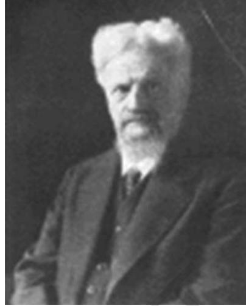
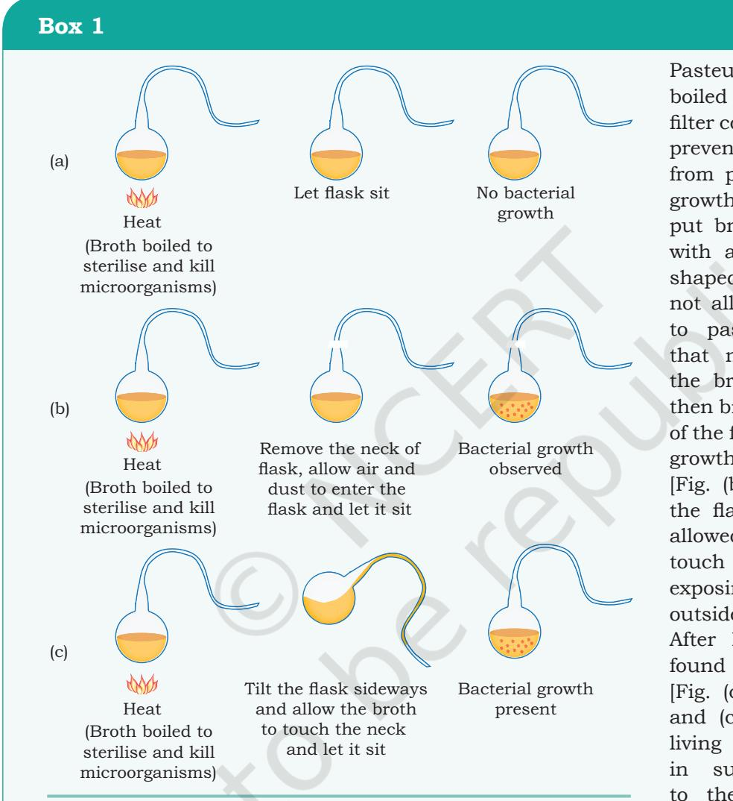
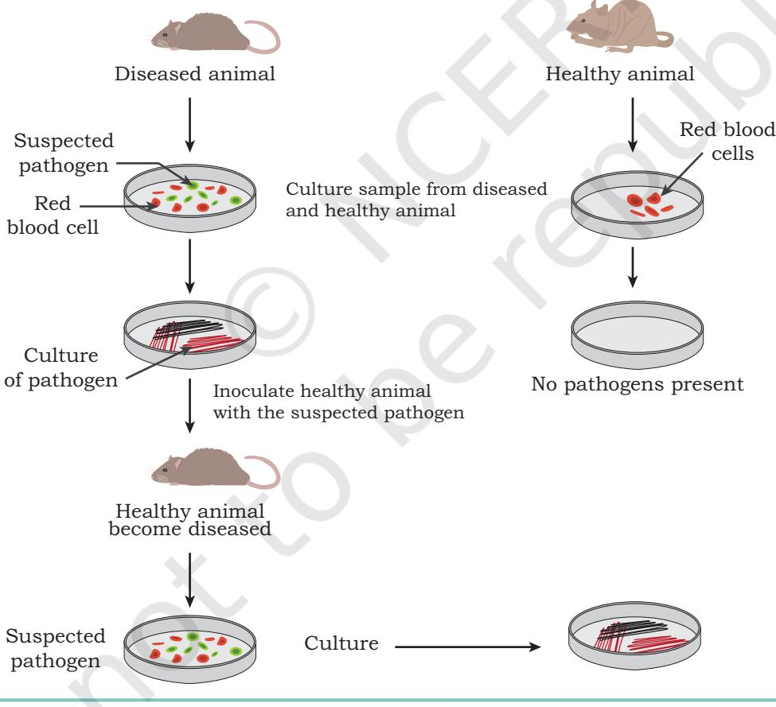
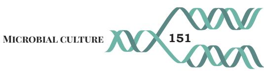
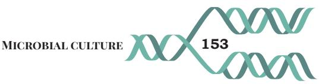
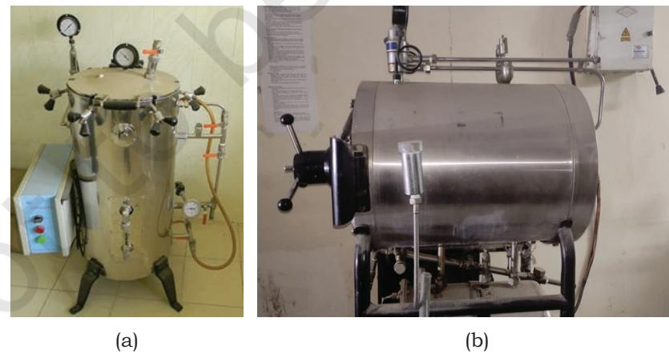
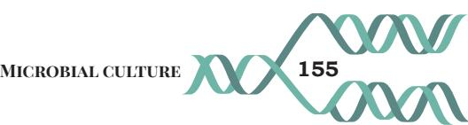
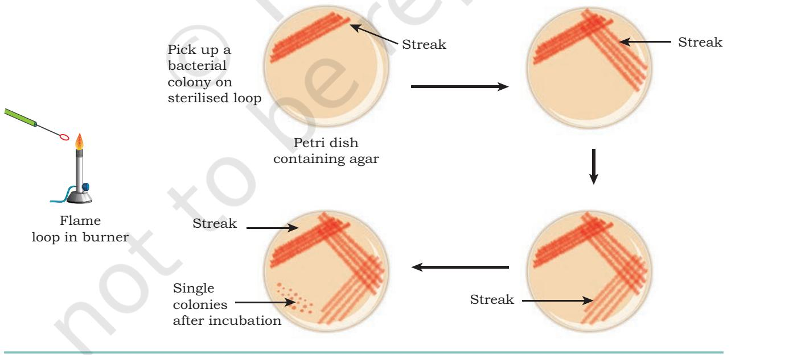
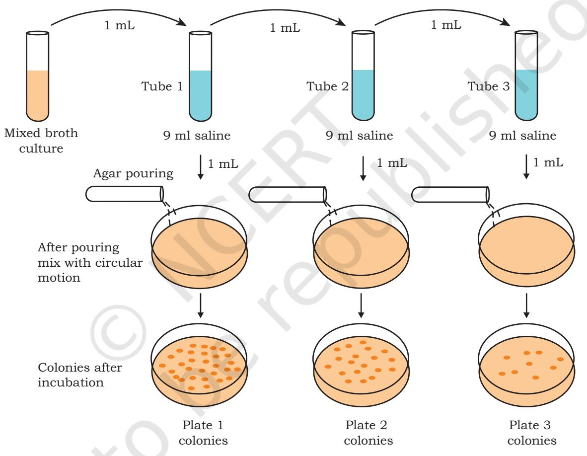
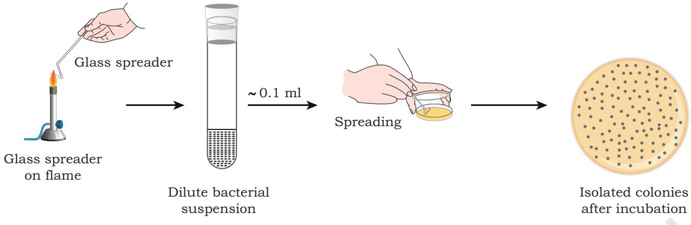

## **UNIT III Microbial, Plant, Animal Cell, Organ Cultures and Bioprocessing**

Chapter 6: Microbial Culture

Chapter 7: Plant Tissue Culture

Chapter 8: Animal Cell Culture

Chapter 9: Stem Cell Culture and Organ Culture

Chapter 10: Bioprocessing and Biomanufacturing

Chapter 6_Microbial Culture.indd 141 06-02-2023 17:42:22

**Gottlieb Haberlandt** (28 Nov 1854 – 30 Jan 1945)

Gottlieb Haberlandt was an Austrian Botanist. He was the son of European 'soybean' pioneer Professor Friedrich J. Haberlandt. Haberlandt first pointed out the possibilities of the culture of isolated tissues and plant tissue culture. He suggested the potentialities of individual cells via tissue culture and also suggested that the reciprocal influences of tissues on one another could be determined by this method. Haberlandt's original assertion methods for tissue and cell culture have been realised, leading to significant discoveries in Biology and Medicine. His original idea presented in 1902 was called totipotentiality: 'Theoretically all plant cells are able to give rise to a complete plant.' The term Kranz (German for wreath) anatomy was given by Gottlieb Haberlandt in 1904 to describe the specialised leaf anatomy found in more efficient C4 photosynthesis in land plants.

Chapter 6_Microbial Culture.indd 142 06-02-2023 17:42:22

# **Chapter** 6 **Microbial Culture**

The world of microorganisms has unusual diversity pertaining to their structure, function, habitat and applications. They are ubiquitous in nature i.e., they are present everywhere. Microbiology is the study or science (logos) of the small (micro) organisms (bios). Microbiology has gained a dominant position in fundamental research, agriculture, pharmaceutical industry, medicine, environmental science, food technology, genetic engineering, etc. In this chapter, you will learn about the nutrition of microorganisms, culture media, sterilisation techniques and growth curve.

## **6.1 Historical Perspective**

Discovery of microscope during the mid 1600s laid the foundation of microbiology. In the 1670s to 1680s, a Dutch merchant, Anton van Leeuwenhoek developed the microscope and observed the microscopic organisms and coined the term 'animalcules'. After the era of Anton van Leeuwenhoek, the development of microbiology was slow, due to rare availability of microscopes and lack of interest towards microorganisms. Scientists at that time believed

- *6.1 Historical Perspective*
- *6.2 Nutritional Requirements and Culture Media*
- *6.3 Sterilisation Methods*
- *6.4 Pure Culture Techniques*
- *6.5 Factors Affecting Microbial Growth*
- *6.6 The Growth Curve*

Chapter 6_Microbial Culture.indd 143 06-02-2023 17:42:22

that the microorganisms originate from lifeless matter. But, on the other hand, Lazzaro Spallanzani observed that there were no microscopic forms of life in boiled broth. In the middle and late 1800s, Louis Pasteur had performed experiments to prove the importance of microorganisms in everyday life and encouraged scientists to think about the role of bacteria in human illness.

Pasteur exposed the boiled broths to air in a filter containing flasks to prevent all the particles from penetrating to the growth medium. He also put broth in the flasks with a long twisted 'S' shaped neck that would not allow dust particles to pass. He observed that nothing grows in the broth [Fig. (a)]. He then broke the long neck of the flask and bacterial growth was observed [Fig. (b)]. He also tilted the flask sideways and allowed the broth to touch the neck, thereby exposing the broth to the outside environment. After letting it sit, he found bacterial growth [Fig. (c)]. These [Fig. (b) and (c)] prove that the living organisms grow in such broths due to the agents coming from outside, rather than spontaneously

generated within the

broth. Thus, his pioneer work further proved that the microorganisms were present in the air, and could cause diseases. Based on his experiments, Pasteur disproved the theory of spontaneous generation and postulated the germ theory of disease, which states that 'the microorganisms were the cause for infectious diseases.

Chapter 6_Microbial Culture.indd 144 06-02-2023 17:42:23

The German scientist, Robert Koch further proved the germ theory by injecting pure cultures of *Bacilli* into mice and showed that the *Bacilli* caused anthrax. Accordingly, Koch postulated (Fig. 6.1) and provided a set of principles that implicated the microorganisms to be the causative agents for diseases. Thus, Koch hypothesised the following:

- The microorganism must be present in abundance in all organisms suffering from the disease, but should not be present in healthy organisms.
- The microorganism must be isolated from a diseased organism and grown in pure culture.
- The cultured microorganism should cause disease when introduced into a healthy organism.
- The microorganism must be re-isolated from the inoculated, diseased experimental host and identified as being identical to the original specific causative agent.

*Fig. 6.1: Pictorial representation of Koch's experiments*

Chapter 6_Microbial Culture.indd 145 06-02-2023 17:42:23

In the course of development of microbiology, based on the suggestions made by Pasteur and Koch, the period of late 1800s and the early decade of the 1900s is referred to as the Golden Age of Microbiology. During this period, various causative agents responsible for microbial diseases were discovered.

In the 19th century, the bacteriologists have attempted the use of food or material to grow the microbes. In 1860, Louis Pasteur used a media containing yeast, ash, and ammonium salts. This medium contained the basic nutrients for microbial growth, such as carbon source (e.g., sugar), nitrogen (e.g., ammonium salts), and vitamins (e.g. ash). In order to develop more versatile basal medium, Ferdinand Cohn further refined the Pasteur's medium by varying the types of sugars. Robert Koch observed that broths based on fresh beef serum or meat extracts could be used for optimal growth.

The use of solid media instead of liquid medium also proved an important milestone in the development of bacteriology. In 1881, Robert Koch had recognised the difficulties of using broth media for the isolation of pure cultures and considered the use of solid media alternatives. During the isolation of *Bacillus anthracis*, Koch evaluated media with coagulated egg albumin, starch paste and an aseptically cut slice of a potato, but it proved to be relatively poor at recovering the pathogenic bacteria. After that, Koch further developed medium with meat extract and gelatin (derived from the collagen of skin and bones). During the course of development, finally agar replaced gelatin, as agar provides the requisite solid support for microbiological media, but it does not provide the nutrients necessary for the bacteria to grow. Based on the observation of the growth of bacteria on solid media, Koch coined the term 'colony' to describe the pure and discrete growth.

An important development in the improvement of microbial culture occurred in 1887, when Julius Richard Petri modified the flat glass plate (common to laboratories) and started to use a new type of culture dish for media, termed as Petri dish. It is a shallow circular glass dish with a loose fitting cover used to hold the growth media. It helped to improve the culturing conditions and today it is one of the most commonly used plates for microbial cultures.

**146 Biotechnology XII**

Chapter 6_Microbial Culture.indd 146 06-02-2023 17:42:23

Most of the media used during the 19th century was non-selective and was designed to grow a range of bacteria. In the beginning of the 20th century, further advances with culture media occurred. Martinus Beijerinck developed a medium without nitrogenous compounds for isolating the root nodule bacterium *Rhizobium*, that inhibited the growth of non-nitrogen fixing microorganisms helping to isolate a pure culture of *Rhizobium*. Again, based on the ability of certain microorganisms to use CO2 as a carbon source under anaerobic conditions, Beijerinck (1904) developed another selective medium to isolate a pure culture of sulphur-oxidising bacterium, *Thiobacillus denitrificans*. Some of the important developments in media formulation include:

- Alfred Theodore MacConkey (1905) used bile salts to select lactose fermenting bacteria in faecal samples.
- Churchman (1912) showed that derivatives of triphenylmethane, such as gentian violet and brilliant green dyes were inhibitory to Gram positive bacteria in particular.
- Muller (1923) described a medium using iodine and sodium thiosulphate (which react together to form tetrathionate) to select an organism that possesses the enzyme tetrathionase.

By the 1930s, the researchers started to consider the importance of growth factors upon bacterial nutrition. In the 1940s, with the invention of electron microscope, the study and culture methods for viruses were introduced, and the knowledge of viruses developed rapidly. By 1950s, the mechanisms of coenzymes in bacterial growth was found to be useful. Another important development was the use of antibiotics in media and by 1960s, antibiotics were used in culture media as selective agents.

After World War II, further advancement of microbiology led to the discovery of antibiotics as medicine for various diseases, such as pneumonia, tuberculosis, meningitis, syphilis, etc. During the period of 1950s and 1960s, many vaccines against viral diseases, such as polio, measles, mumps, and rubella were developed.

Modern microbiology has application in various fields, such as development of pharmaceutical products,

Chapter 6_Microbial Culture.indd 147 06-02-2023 17:42:23

food and dairy products, the control of disease-causing microorganisms, and the industrial exploitation of microorganisms. Thus, microorganisms were used to produce vitamins, amino acids, enzymes, growth supplements as well as various foods, such as fermented dairy products (sour cream and buttermilk), pickles, breads and alcoholic beverages.

In biotechnology, applied microbiology has a dominant role as the microorganisms are used as living factories to produce pharmaceuticals, including human hormone insulin, the antiviral protein interferon, numerous blood-clotting factors and clot-dissolving enzymes, including a number of vaccines. For rDNA technology, genetically engineered microorganisms are used as host vectors in order to develop genetically modified organisms (GMOs) with improved traits.

## **Nutritional categories of microbes**

Microorganisms can be categorised based on the means of obtaining their carbon and energy. Most microorganisms obtain their carbon in the form of organic molecules, derived directly or indirectly from other organisms, and are described as heterotrophs that include all the fungi and protozoans, as well as most types of bacteria. Microorganisms that obtain their carbon from carbon dioxide are called autotrophs that include a significant number of bacteria and about all of the algae.

Autotrophs may further be of two categories. **Chemoautotrophs** obtain their energy as well as their carbon from inorganic sources (by the oxidation of inorganic molecules, such as sulphur or nitrite), while **photoautotrophs** have photosynthetic pigments and use them to convert light energy into chemical energy.

Majority of the heterotrophs obtain energy by chemical oxidation of organic nutrient molecules, and thus are called **chemoheterotrophs**. Although, some heterotrophs (such as the green and purple non-sulphur bacteria) obtain light energy from photosynthesis, they get carbon from organic nutrients, hence known as **photoheterotrophs**. A **lithotroph** is an organism that uses inorganic molecules, such as H2O, H2S or ammonia as a source of electrons, while an **organotroph** uses organic molecules for the same purpose.

Chapter 6_Microbial Culture.indd 148 06-02-2023 17:42:23

**148 Biotechnology XII**

## **6.2 Nutritional Requirements and Culture Media**

Microorganisms require nutrients that are essential for energy production as well as their growth and multiplication.Carbon, oxygen, hydrogen, nitrogen, sulfur, phosphorus, potassium, calcium, magnesium and iron are called macronutrients and they are required in relatively large amounts. Among them, C, O, H, N, S and P are the components of carbohydrates, lipids, proteins and nucleic acids, and K, Ca, Mg, Fe play a variety of roles being involved as cofactor of various enzymes. Besides macronutrients, some micronutrients or trace elements, such as Mn, Zn, Co, Mo, Ni, and Cu are also required for microbial growth in a small amounts. These micronutrients are ubiquitous in nature and already exist with various regular media components, so they are not usually supplied separately. The essential nutrients have to be supplied in the form of nutrient media. The major components required for the medium are as follows:

*(a) Carbon source:* Carbon is required for the skeleton or backbone of all organic molecules, and the carbon sources usually also provide oxygen and hydrogen atoms. In the microbial culture media, variety of a carbon sources are used. For example, glucose, lactose, sucrose, starch, glycogen, cellulose, a mixture of various carbohydrates, such as cereal grain powders, cane molasses, etc.

*(b) Nitrogen, phosphorous and sulphur sources:*  Nitrogen source is required for the biosynthesis of amino acids, nucleic acids, enzymes, etc. The ammonium salts, urea, animal tissue extracts, amino acid mixtures and plant-tissue extracts are the main nitrogen sources that are used in culture media. Phosphorus is present in nucleic acids, phospholipids, nucleotides, several cofactors, and other cellular components. Almost all the microorganisms use inorganic phosphate as their phosphorus source. Sulfur is required for biosynthesis of various amino acids, such as cysteine and methionine, some carbohydrates, etc. Most of the microorganisms use sulfate as a source of sulfur.

*(c) Growth factors:* Growth factors are organic compounds (e.g., certain amino acids, purines and

Chapter 6_Microbial Culture.indd 149 06-02-2023 17:42:23

pyrimidines and vitamins) that cannot be synthesised in the cells and are required for the growth and multiplication of cells.

*(d) Anti-foams:* Anti-foams are not the nutritional component. However, the media having nutritional components including starch, protein, and other organic compounds as well as products formed during cell growth may have excessive foaming due to the agitation of culture media. To prevent this foam formation, some anti-foaming agents including olive oil, sunflower oil and silicones are included in the media.

*(e) Water:* Water is an essential component/base of any culture media (liquid or solid). In solid culture media, the quantity of water used is comparatively less than the liquid media.

A culture media has all the nutrients, growth factor, energy source, etc., to support the growth of microorganisms.

Though all the microorganisms need sources of energy, carbon, nitrogen, phosphorus, sulfur and various minerals, the specific composition of a suitable medium will depend on the particular species which is to be grown in the laboratory. Thus, for selecting an appropriate culture medium for the microorganism, prior knowledge of the habitat of the microorganism is useful, because its nutrient requirements are based on its natural surroundings.

## **Types of media**

*(A) On the basis of chemical composition, the culture media are classified into two types:*

#### *(i) Synthetic or chemically defined media*

Media in which all chemical components are known is called defined media or synthetic media. Some microorganisms, specifically photolithotrophic autotrophs (e.g. cyanobacteria) can be cultured on a media containing CO2 as a carbon source, nitrate or ammonia as a nitrogen source, sulfate, phosphate, and a number of minerals. A variety of heterotrophs may be cultured in a media with glucose as a carbon source and an ammonium salt as a nitrogen source. Defined media are used widely in research and prepared by mixing various components according to the requirements for

Chapter 6_Microbial Culture.indd 150 06-02-2023 17:42:23

**150 Biotechnology XII**

experimental microorganism. M9 media is widely used for the cultivation and maintenance of *Escherichia coli* (*E. coli*) cultures, and BG11 media is used for the cultivation and maintenance of blue green algae (cyanobacteria).

## *(ii) Complex media*

Media that contain some constituents with unknown chemical composition are called complex media. These types of media are useful, because even a single complex medium may have almost all the constituents to meet the nutritional requirements of a number of different microorganisms. The undefined components in the complex media are peptones, beef extract, yeast extract, etc. Peptones are protein hydrolysates prepared by the partial proteolysis of meat, casein, gelatin, and other protein sources and serve as sources of carbon, energy and nitrogen. The beef extract and yeast extract are aqueous extracts of beef and brewer's yeast, respectively. The beef extracts have amino acids, peptides, nucleotides, organic acids, vitamins, and minerals, whereas yeast extract is a rich source of vitamin, nitrogen as well as carbon compounds. Examples are nutrient broth, tryptic soy broth, and MacConkey agar. Luria-Bertani (LB medium) is a commonly used medium for culturing bacteria, such as *E. coli*. The LB medium, first developed by Giuseppe Bertani (1951) consists of 10% tryptone/peptone, 5% yeast extract, and 10% sodium chloride. Potato dextrose agar (PDA) is used for the identification, cultivation and enumeration of various fungi including yeast and moulds.

## *(B) On the basis of consistency, the culture media are of three types*

## *(i) Liquid media or broth*

In liquid media, agar is not added. After inoculation and later incubation, the growth of cells becomes visible in the broth.

## *(ii) Solid media*

For the surface cultivation of microorganisms, solid culture media is required. For preparation of solid media, the liquid media is solidified with the addition of 1.0–2.0% agar. Agar is a sulphated polymer composed of D-galactose, 3,

Chapter 6_Microbial Culture.indd 151 06-02-2023 17:42:23

6-anhydro-L-galactose, and D-glucuronic acid, generally extracted from red algae. Solid media are used for making agar slants, slopes and agar stab. Agar is preferred as a solidifying agent as most of the microorganisms cannot degrade it. Although, other solidifying agents, such as silica gel can also be used.

#### *(iii) Semi-solid agar media*

The semi-solid media are prepared by adding 0.5% of agar in the media. This type of media may be selective as it promotes the growth of one organism and may retard the growth of the other organism.

## *(C) On the basis of their application and functions, the culture media are classified into the following types*

#### *(i) Selective media*

The selective media favours the growth of a particular type of microorganism. They provide nutrients that increase the growth of a particular type of microorganism and suppresses all other microorganisms that are present in the culture. This medium is useful for isolating a specific microorganism from a mixed population. Thus, for the isolation of cellulose-digesting bacteria, a medium containing only cellulose as a carbon and energy source is used. Endo agar, eosin methylene blue agar, and MacConkey agar media are used for the growth of *E. coli* and similar bacteria. Certain media that contain bile salts or dyes, such as basic fuchsin and crystal violet are used to suppress the growth of Gram-positive bacteria but encourage the growth of Gram-negative bacteria.

#### *(ii) Differential media*

Differential media are used to distinguish different groups of microorganisms on the basis of appearance on the medium as well as their biological characteristics, which permit the identification of microorganism. For example, if a mixture of bacteria is inoculated on to a blood-containing agar medium (blood agar), some of the bacteria may hemolyze (destroy) the red blood cells, and others do not. Thus, this medium distinguishes between hemolytic and non-hemolytic bacteria. Therefore, blood agar medium is both a differential

Chapter 6_Microbial Culture.indd 152 06-02-2023 17:42:23

medium and an enriched one. MacConkey agar is also kept under both differential and selective media. Certain indicators are present in this medium which may allow such differentiation. For example, the MacConkey's agar containing lactose and a dye (which changes colour when pH drops). The microorganisms that ferment lactose produce an acid as the end product, which lowers the pH and produces a red colony. Microorganisms that fail to ferment lactose produce colourless colonies. The dye in MacConkey's agar also inhibits the growth of Gram-positive bacteria. This medium is, therefore, both selective and differential.

#### *(iii) Enrichment media*

In enrichment medium, the nutritional environment is adjusted in order to selectively enhance the growth of certain microorganisms within the mixed inoculum. For example, the addition of plant and animal tissue extract into nutrient broth and nutrient agar media provides additional nutrients which enhance the growth of fastidious heterotrophic bacteria. Blood agar is also an enrichment media.

## **6.3 Sterilisation Methods**

In any microbial study, all media, working surface, glassware and plasticware should be free from contaminants. Thus, a detailed understanding about the sterilisation techniques must be known before starting the work.

- *• Sterilisation* is the process, where all the living microorganisms, including bacterial spores are killed or removed.
- *• Disinfection* is defined as the process of elimination of most of the pathogenic microorganisms (excluding bacterial spores) from non-living objects. Disinfection can be achieved by physical or chemical methods.
- *• Decontamination* is the process of elimination of contaminating pathogenic microorganisms from the equipments and surfaces by a process of sterilisation or disinfection.
- *• Sanitisation* is the process of chemical or mechanical cleaning, i.e., by sanitisation, microbial population is reduced to levels that are considered safe and applicable in public health systems.

Chapter 6_Microbial Culture.indd 153 06-02-2023 17:42:23

- *• Antibiotics* are produced by one microbe that inhibits or kills other microbes.
Usually, sterilisation can be achieved by both physical and chemical methods. In physical methods, sterilisation can be done by heat, radiation and filtration, while in chemical methods, sterilisation can be achieved using chemicals.

## **Sterilisation by Heat**

Sterilisation by heat is considered to be the most effective and rapid method for articles that can withstand heat. Heat acts by denaturation, coagulation of proteins, by exerting oxidative effect and interfering with the metabolic reactions that lead to the death of cells. The sterilisation by heat is performed by various methods:

- **(a) Boiling:** Sterilization can be done at 100°C for 30 min in boiling water bath. The syringes, rubber goods and surgical instruments may be sterilised by this method.
- **(b) Autoclaving:** Autoclaving is one of the most common methods for sterilisation in almost all the laboratories. In this method, sterilisation is done by steam at temperature higher than 100°C under pressure. At atmospheric pressure, water boils at 100°C but if the pressure is raised, the boiling temperature also increases. In an autoclave, the water is boiled in a closed air-tight chamber. At a pressure of 15 lb per square inch (psi) inside the autoclave, the temperature is raised to 121°C. In an autoclave, the articles are exposed to the steam released at this temperature and sterilisation is achieved. Autoclaves are of vertical

*Fig. 6.2: (a) Vertical Autoclave (b) Horizontal Autoclave (Photo courtesy: Dr. Veda P. Pandey)*

**154 Biotechnology XII**

Chapter 6_Microbial Culture.indd 154 06-02-2023 17:42:24

or horizontal design and they may be jacketed and non-jacketed (Fig. 6.2). In the jacketed autoclave, the steam flows surrounding the jacket in which the articles/media are kept and they are not directly exposed to steam, while in non-jacketed autoclave, the articles/media are directly exposed to the steam. The **holding time** in the autoclaving is the time for which the entire load in the autoclave is exposed and actual sterilisation takes place. The holding time depends on the size and types of the load and generally exceeds 30 min.

- **(c) Pasteurisation:** This process is used in food and dairy industry. Actually, pasteurisation is the heating of milk to a temperature for a period of time to kill the pathogenic microorganisms that may be present in milk. It does not fully sterilise the milk, so many living organisms including spores are not destroyed. There are two methods of pasteurisation, the holder method (low temperature long time, LTLT, heated at 63°C for 30 min) and flash method (high temperature short time, HTST, heated at 72°C for 15 sec) followed by quick cooling. Other pasteurisation methods are also available, such as Ultra-High Temperature (UHT) at 140–150°C for 1–3 seconds.
- **(d) Heating and flaming:** Many objects are sterilised in the absence of water by dry heat sterilisation. The articles, such as inoculation loops, straight wires, tips of forceps and searing spatulas are sterilised by holding them in Bunsen flame till they become red hot. While, some articles, such as mouth of test tubes, flasks, glass slides, etc., are passed through the flame for a few times without allowing it to become red hot. Hot air oven is also used to sterilise glassware.

## **Sterilisation by Radiation**

Two types of radiations, namely, ionizing and non-ionizing radiations are used for sterilisation. As radiation does not generate heat, so sterilisation by radiation is termed as 'cold sterilisation'. Non-ionizing radiations, such as UV rays have the germicidal activity in the wavelength range of 200–280 nm, with 260 nm being most effective. UV rays induce the formation of thymine-thymine dimers, which ultimately inhibits DNA replication and induces mutation in cells. UV radiation is useful for surface disinfection i.e.,

Chapter 6_Microbial Culture.indd 155 06-02-2023 17:42:24

to disinfect culture lab, laminar hood, operation theatres, virus laboratories, etc. The disadvantages of UV rays include their harmful effect on skin and eyes, and reversal action of damage due to DNA repair bacterial enzymes. Ionizing radiations are of two types, particulate (electron beams) and electromagnetic rays (gamma rays). Electron beams are used to sterilise syringes, gloves, dressing packs, foods and pharmaceuticals, etc. Electromagnetic rays have more penetrative power than electron beam, but require longer time of exposure. These radiations damage the nucleic acid of the microorganism. Electromagnetic radiations are used to sterilise disposable Petri dishes, plastic syringes, antibiotics, vitamins, hormones, glassware and fabrics.

## **Sterilisation by Filtration**

Filtration is used to sterilise the heat labile substances in solutions, such as serum, antibiotics, sugars, urea, etc. Filtration does not kill microbes, it separates them out based on the size. Membrane filters with pore sizes between 0.2–0.45 μm are commonly used to remove microbes from solutions. Air can be filtered using **High Efficiency Particulate Air** (HEPA) filters. HEPA filters are 99.97 percent efficient for removing particles >0.3 µm in diameter. They are usually used in biological safety cabinets.

## **Sterilisation by Chemicals**

Sterilisation/disinfection can also be achieved by certain chemicals, such as alcohols, aldehydes, heavy metals, etc. Alcohols sterilise the surface through cell dehydration, membrane disruption and protein coagulation. 70 percent ethyl alcohol is used as antiseptic on skin. Isopropyl alcohol can be used to disinfect surfaces and clinical thermometers. Aldehydes such as 40 percent formaldehyde (formalin) is used for surface disinfection and fumigation of rooms, chambers, operation theatres, biological safety cabinets, etc. Heavy metals such as mercury, silver, arsenic, zinc, and copper are used as germicides. They cause precipitation of proteins. Hydrogen peroxide solution is used for skin disinfection of wounds and ulcers and deodorising wound dressings.

Chapter 6_Microbial Culture.indd 156 06-02-2023 17:42:24

## **6.4 Pure Culture Techniques**

Bacteria may be cultured using either liquid or solid media. Solid media are particularly useful in the isolation of bacteria and are also used for their long-term storage, while liquid (broth) cultures are used for rapid and largescale production of bacteria.

As you know, the microorganisms in the natural habitat, exist as a part of complex ecosystems comprising a numerous other microorganisms. Obtaining a pure culture, is important for studying a particular microbe. A culture consisting of entirely one strain of organism is called pure culture.

The standard method of obtaining a pure bacterial culture is the **streak plate method** (Fig. 6.3). An inoculating loop is used to streak out a drop of bacterial suspension or bacterial colony on a solid agar plate in such a way that it becomes progressively more dilute. After proper incubation at an appropriate temperature, due to cell divisions, visible bacterial colonies are developed. Colonies are formed because all the progeny stay in the same place and the movement of daughter cells is not possible on the solid surface. In other words, a clump of cells, deposited together, gives rise to a colony. Near the end of streak, isolated colonies are obtained.

**Microbial culture 157**

*Fig. 6.3: The streak plate method*

Chapter 6_Microbial Culture.indd 157 06-02-2023 17:42:25

An alternative method for the isolation of pure cultures is the **pour-plate method** (Fig. 6.4). In this method, the original microbial sample is diluted several times to dilute the population sufficiently in order to obtain separate colonies upon plating. The small volumes (1 mL) of each dilution is then poured on the bottom of a Petri plate/dish. After that, the melted medium with agar is poured on to the Petri plates and mixed gently with a circular motion. After incubation at appropriate temperature, the isolated cells grow into colonies which can be used to establish pure cultures.

*Fig. 6.4: The Pour-Plate method*

The **spread-plate technique** is another easy and direct way of achieving a pure culture (Fig. 6.5). In this technique, a small volume of the diluted bacterial mixture is transferred to the centre of a solidified agar plate and spread evenly over the surface with a sterile, L-shaped

Chapter 6_Microbial Culture.indd 158 06-02-2023 17:42:25

*Fig. 6.5: The spread-plate technique*

glass spreader. The glass rod is usually sterilised by dipping in alcohol and flamed to burn off the alcohol. After proper incubation at an appropriate temperature, some of the dispersed cells develop into isolated colonies.

## **6.5 Factors Affecting Microbial Growth**

Microbial growth may be affected by a number of factors. The major factors are described below:

## **Temperature**

Microorganisms are able to grow over a wide range of temperatures. The minimum and maximum growth temperatures for a microorganism is typically about 25–45°C. The growth rate increases with temperature until the optimum temperature is achieved, and beyond that the growth rate declines again due to loss of enzymatic activity. The majority of microorganisms achieve optimal growth in the range of about 20–45°C and are called **mesophiles**. Some microorganisms would be capable of growing within a range of about 40–80°C, with an optimum temperature around 50–65°C and are called **thermophiles**. In addition, some are **extreme thermophiles**  that can tolerate temperatures above 100°C.

## **pH**

The growth of microorganisms is strongly influenced by the variation in pH of their surroundings. Fungi can tolerate a wide range of pH variation when compared to bacteria. Most of the microorganisms grow best around neutrality (pH 7). A number of bacteria prefer slightly alkaline conditions,

Chapter 6_Microbial Culture.indd 159 06-02-2023 17:42:25

but few are tolerant to acidic conditions. On the other hand, fungi generally prefer slightly acidic conditions and therefore tend to dominate bacteria when these prevail together. The pH of growth media is adjusted to the desired value depending upon the type of microorganisms by the addition of acid or alkali during its preparation.

## **Oxygen**

Oxygen is present as one of the major constituents (21%) of our atmosphere, and the microorganisms that are dependent on oxygen for survival, are called **aerobes**. Some microbes are also able to survive in the absence of oxygen and called **anaerobes**. During the culture of aerobic organisms, oxygen must be provided. For a shallow layer of medium such as that in a Petri dish, sufficient oxygen is available as dissolved in surface moisture. But in a flask of broth, aerobes will only grow on the surface layers, therefore, additional oxygen is provided by shaking or mechanical stirring to facilitate uniform growth. **Obligate anaerobes** cannot tolerate oxygen and they are cultured in special anaerobic chambers, where oxygen is excluded from all liquid and solid media. The **facultative anaerobes**  can survive like aerobes in the presence of oxygen, and are also able to survive in anaerobic condition. **Aerotolerant anaerobes** are the organisms that are generally anaerobic, but they are not inhibited by the atmospheric oxygen as they do not utilise it.

## **Carbon dioxide**

The autotrophic organisms are able to use carbon dioxide as a carbon source and when they are grown in culture, CO2 is provided as bicarbonate in their growth medium or incubated in a CO2 enriched atmosphere.

## **Light**

**160 Biotechnology XII**

Phototrophic microorganisms require light in order to carry out photosynthesis. In the laboratory, during culturing of microorganism, one should ensure that light of the correct wavelength is used.

Chapter 6_Microbial Culture.indd 160 06-02-2023 17:42:25

## **6.6 The Growth Curve**

When single cell microorganisms are grown in a suitable nutrient media with initial limited amount of nutrients, cells start growing in number and size at their maximum. The growth of cells in an artificial media depends on various factors including nutritional factors, environmental factors, etc. The growth of cells in nutrient media depends on cell concentration and the outcome of this process is cellular reproduction. Unicellular organisms divide by binary fission, replicate their genetic material, then divide

into two identical cells which then divide into four, four into eight and so on, leading to an exponential increase in the number of cells. This growth of the cultured microorganisms can be analysed by plotting the logarithm of the number of viable cells versus the incubation time, which results in a curve with four distinct phases as lag phase, exponential phase,

*Fig. 6.6: Microbial growth curve*

stationary phase and decline phase (Fig. 6.6).

## **Lag Phase**

Initially, when microorganisms are introduced into fresh culture medium, usually increase in cell number is not observed immediately, and therefore, this period is called lag phase. Due to the lack of cell division, during lag phase, there is no net increase in mass, the cell is synthesising new components required for cell division. The duration of lag phase varies with the condition of the inoculated microorganisms and the nature of the medium. This phase may be long if the inoculum is taken from an old culture or refrigerated culture. On the other hand, when a young or growing microbial culture is inoculated to fresh medium, the lag phase may be short or even absent.

Chapter 6_Microbial Culture.indd 161 06-02-2023 17:42:25

## **Exponential Phase**

During the exponential or log phase, the microorganisms are growing and dividing at the maximal rate. The microorganisms are doubling in number at regular intervals during the exponential phase and the growth rate is constant. In this phase, the population will double in number during a specific time period which is called the generation time or doubling time. For example, the doubling time for *E. coli* is 20 minutes. During exponential growth, the doubling time can be expressed as:

$$t_{d}={\frac{0.693}{\mu}}$$

µ = Specific growth rate 0 (logX logX ) m 2.303 − = *t t*

- Xt = Cell concentration at time *t*
- Xo = Initial cell concentration
- t = Time taken
- td = Doubling time

During this phase, the population is most uniform in terms of chemical and physiological properties, and therefore, the microorganisms of this phase are usually used for biochemical and physiological studies.

## **Stationary Phase**

After a certain time of log phase, the population growth ceases and the growth curve becomes horizontal. This depends on the overall nutrient availability and other factors, as well as the type of microorganism being cultured. During the stationary phase, the total number of viable microorganisms remains constant due to the development of a balance between cell division and cell death. There are several factors for the microbial populations to enter into stationary phase. One important factor is the nutrient limitation; if any essential nutrient is severely depleted, then the population growth will be slow.

## **Death Phase**

The unfavourable environmental conditions, such as nutrient deprivation, accumulation of toxic wastes, etc., lead to further decline in the number of viable cells which

Chapter 6_Microbial Culture.indd 162 06-02-2023 17:42:25

#### **Box 2**

#### **Measurement of microbial growth**

A microbial cell culture undergoing balanced growth is like a chemical reaction where substrates present in media are converted to cell mass.

The parameter that characterises microbial growth is the doubling time also called **generation time** *td***.** It is time (*t*) required in minutes/hours for cell mass or cell number to double its original value during balanced growth.

*td* = *t*/*n* (*n* = number of generations)

Specific growth rates µ, is an index of growth of microbes in a particular environment. It is defined as the rate of increase of biomass of a cell population per unit of biomass concentration. Value of µ is characteristic for each microbe. It depends upon the temperature, pH, media composition and O2 dissolved in the media.

As the value of µ increases, i.e., the microbial culture having specific growth rate has low doubling time.

On the basis of value of µ and *td* of an organism, the media composition and fermentation batch time is decided to optimise the production in commercial fermenters.

#### **Example**

If a culture contains 104 cells/mL at *t*o and 108 cells/ml after 2 h, calculate the specific growth rate and generation time of the culture.

1

-

*hr*

#### **Solution:**

X0 = 104 cells/mL Xt = 108 cells/mL *t* = 2 h 8 4 (log10 log10 ) (i) . 2 303 2 (8 4) 2 3. 30 2 (4) 2 3. 30 4.606 2 - = - = = =

(ii) $t_{d}=\frac{0.693}{\mu}=0.693$ = 0.15 $h$

is the characteristic of decline/death phase. During this phase, the death of a microbial population is usually logarithmic (as it is growth during the exponential phase). The accumulation of metabolic waste products may often become a factor for the decline of population growth. For example, the bacteria namely, *Streptococci* can produce lactic acid and other organic acids from sugar fermentation which results in the medium becoming acidic and growth is inhibited.

Chapter 6_Microbial Culture.indd 163 06-02-2023 17:42:25

## **SUMMARY**

- Microbiology is the study about small life forms, i.e. microorganisms.
- The microorganisms require a source of energy, carbon, nitrogen, oxygen, iron and other minerals, micronutrients, and water for growth and multiplication.
- Selection of appropriate culture medium for the microorganisms depends on the prior knowledge of the habitat of the microorganisms.
- Culture media can be categorised on the basis of chemical composition. Media are classified into two types: synthetic and complex media. While on the basis of consistency, the culture media may be solid, liquid and semi-solid. Whereas, based on their application and functions, the media may be divided into selective, differential and enrichment media.
- Sterilisation is of prime importance for any microbial study and it is the process, where all the living microorganisms, including bacterial spores are killed or removed.
- Sterilisation can be achieved by physical (heat, radiation and filtration) and chemical methods.
- The microbial growth may be affected by a number of physical factors, such as temperature, pH, oxygen, etc.
- The growth of the cultured microorganisms can be analysed by plotting the logarithm of the number of viable cells versus the incubation time, which results in a curve with four distinct phases, namely lag, exponential, stationary and death phase.

## **EXERCISES**

- 1. Describe the nutritional requirements of microorganisms.
- 2. What is culture media? Classify the culture media.
- 3. Write an account of the growth curve analysis of a microorganism.
- 4. Discuss any two methods to isolate a pure culture.
- 5. Define sterilisation, disinfection and sanitisation.
- 6. Give a detailed account on the various methods of sterilisation.
- 7. Bacterial strains which do not require any organic supplement are called:

Chapter 6_Microbial Culture.indd 164 06-02-2023 17:42:25

- (a) Auxotroph
- (b) Prototroph
- (c) Heterotroph
- (d) Chemotroph
- 8. Who was the first to develop the process of colony purification on solid media?
	- (a) Louis Pasteur
	- (b) Robert Koch
	- (c) Fannie Hesse
	- (d) Richard Petri
- 9. HTST and UHT methods belong to:
	- (a) Pasteurisation
	- (b) Isolation of pure culture
	- (c) Staining of bacteria
	- (d) Culture of bacteria
- 10. Spontaneous generation was suggested by:
	- (a) Francesco Redi
	- (b) Lazzaro Spallanzani
	- (c) Robert Koch
	- (d) Louis Pasteur
- 11. Germ theory of disease was suggested by:
	- (a) Francesco Redi
	- (b) Lazzaro Spallanzani
	- (c) Robert Koch
	- (d) Louis Pasteur
- 12. Calculate the specific growth rate and generation time of a bacterial population in which the number of bacteria increases from 104 cells/mL to 107 cells/mL, during 4 hours of exponentail growth.

(Ans: µ = 1.72 hrs-1, td = 0.4 h or 24 min)

- 13. **Assertion:** Alcohol production by a batch culture of *Saccharomyces* starts declining steadily even though conditions like temperature are optimum.
**Reason:** Alcohol concentration of around 13% is toxic for yeast cells.

- (a) Both assertion and reason are true and the reason is correct explanation of the assertion.
- (b) Both assertion and reason are true but reason is not the correct explanation of the assertion.
- (c) Assertion is true but reason is false.
- (d) Both assertion and reason are false.

Chapter 6_Microbial Culture.indd 165 06-02-2023 17:42:25

- 14. **Assertion:** A selection medium containing Ampicillin is sterilised by autoclaving. Both AmpS and AmpR microbes show growth on the medium.
**Reason:** To inhibit the growth of AmpS microbe ampicillin should not have been autoclaved but sterilised by using micro-filters before adding to the medium.

- (a) Both assertion and reason are true and reason is correct explanation of the assertion.
- (b) Both assertion and reason are true but reason is not the correct explanation of the assertion.
- (c) Assertion is true but reason is false.
- (d) Both assertion and reason are false.
- 15. **Assertion:** Microorganisms are able to grow and multiply over a wide range of temperatures.

**Reason:** Extreme thermophiles can tolerate temperatures of above 100°C.

- (a) Both assertion and reason are true and reason is the correct explanation of the assertion.
- (b) Both assertion and reason are true but reason is not the correct explanation of the assertion.
- (c) Assertion is true but reason is false.
- (d) Both assertion and reason are false.

Chapter 6_Microbial Culture.indd 166 06-02-2023 17:42:25

