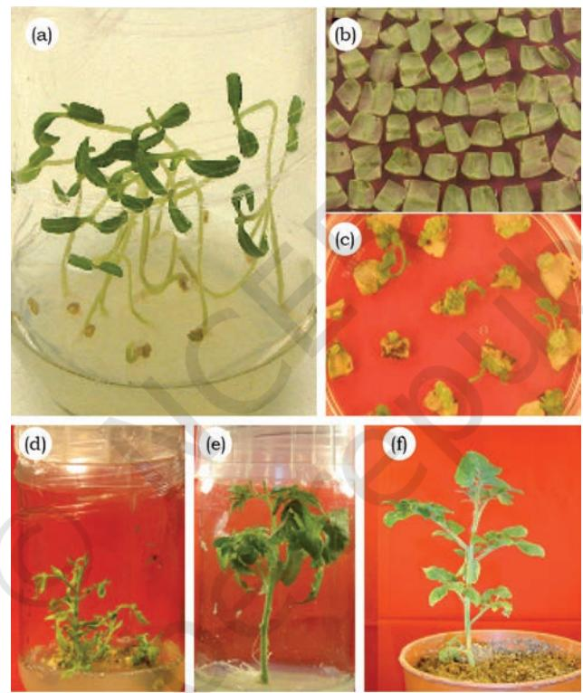
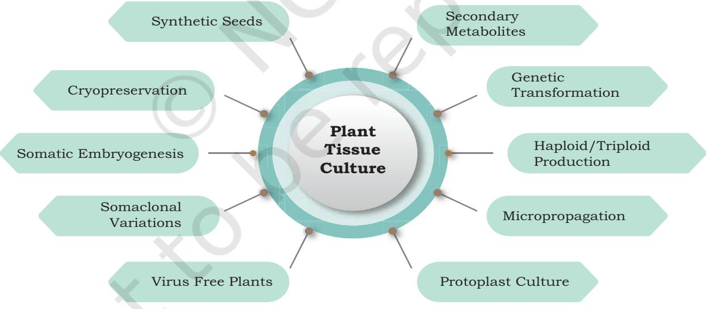
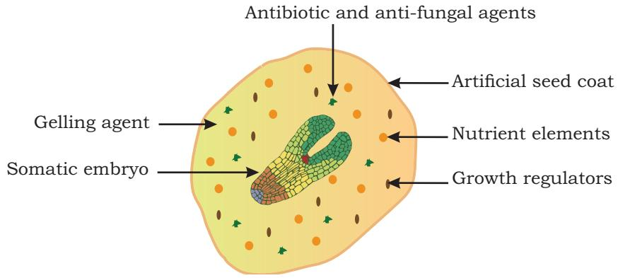
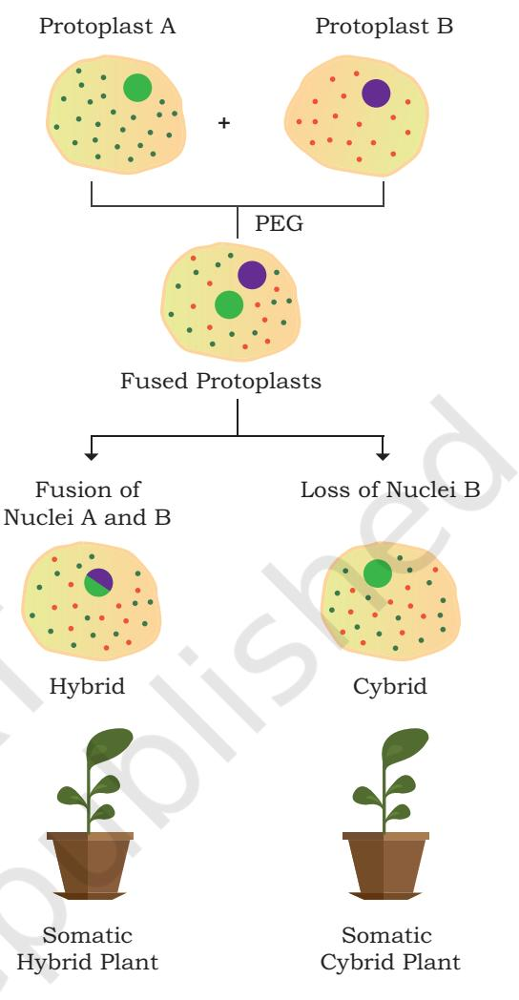

# **Chapter** 7 **Plant Tissue Culture**

Plant tissue culture (PTC) refers to the cultivation of undifferentiated plant cells, tissues or organs on synthetic media under aseptic environment and suitable controlled physical conditions. It is an important tool for both basic research as well as commercial applications. Plant tissue culture is based upon the unique characteristic of a plant cell i.e., totipotency. Totipotency is the ability of a vegetative cell to divide and differentiate into any type of specialised cell or to regenerate into a whole plant.

# **7.1 Historical Perspective**

In 19th century, German scientists Theodor Schwann and Matthias Schleiden, drew attention to the fact that a cell is the basic unit of life and has the capacity to divide and grow. During 1890's, **Gottlieb Haberlandt** (German Botanist), pioneered the field of PTC with his idea to achieve continuous cell divisions in plant cells on nutrient media. He attempted to culture fully differentiated plant cells on simple nutrient media. He laid down several principles of plant tissue culture in 1902, like plant cells are capable of resuming uninterrupted growth, or it is possible to

#### *7.1 Historical Perspective*

- *7.2 Cell and Tissue Culture Techniques*
- *7.3 Nutrient Media*
- *7.4 Culture Types*
- *7.5 Applications of Plant Cell and Tissue Culture*

Chapter 7_Plant Tissue Culture.indd 167 06-02-2023 17:42:59

regenerate embryos from vegetative cells. Later, all of the predictions made by him were found to be true as they were confirmed experimentally by other researchers. This is the reason he is regarded as the '**Father of Plant Tissue Culture**'. During 1902–1930's, several attempts were made to culture the isolated plant tissues, like root or shoot tips, and continuously growing plant cell cultures were established. The discovery that vitamins and natural auxins are necessary for the growth of plant tissues on synthetic media gave a significant boost to PTC. During 1940's –70's, extensive studies were performed to improve the existing techniques for developing new methods to optimise the nutrient media components for culturing plant tissues. Coconut water stimulated the development of young embryos and was used with nutrient media for *in vitro* cultures. Later, other natural supplements, like corn milk, orange juice, etc., were used for developing callus culture of several species, like woody plants and herbaceous dicot plants. During 1950's, adenine, kinetin and high levels of phosphate were used in nutrient media that resulted in the successful initiation of cultures from non-meristematic tissues and production of shoots or roots. It was also established during this time that the morphogenic fate of cultured cells was directly influenced by the exogenous balance of auxins and kinetin. It was suggested that a relatively high level of auxin to kinetin causes rooting, while the reverse led to shooting and intermediate levels were responsible for the proliferation of callus. This led to the regeneration of new plants through tissue culture using various plant tissues or organs as starting material in several commercial applications. An artificial culture medium developed by Murashige and Skoog (MS) (1962) was successful for culturing plants and resulted in the initiation of tissue culture from a large number of plant species. MS media composition is the most widely used nutrient media in plant tissue cultures.

Chapter 7_Plant Tissue Culture.indd 168 06-02-2023 17:42:59

#### **Box 1**

|  | Major landmark discoveries in plant tissue culture and its applications |
| --- | --- |
| 1902 | Gottlieb Haberlandt proposed that plant cells can be cultured on artificial media and developed the concept of in vitro cell culture. |
| 1904 | Hannig initiated work on excised embryo culture and later cultured embryos from several cruciferous species. |
| 1922 | Kotte and Robbins suggested root and stem tips as possible explants to initiate in vitro tissue culture. |
| 1926 | Went discovered the first plant growth hormone i.e., Indole Acetic Acid (IAA). |
| 1934 | The role of vitamin B as growth supplement in plant tissue culture was reported by White. He could successfully establish continuous growing cultures from tomato root tips. |
| 1937 | White formulated the first synthetic plant tissue culture medium (WM). |
| 1941 | Van Overbeek introduced coconut water as a media component and demonstrated its beneficial effects on in vitro tissue culture. |
| 1946 | Ball raised whole plants from shoot tips of Lupinus. |
| 1954 | Muir successfully induced cell division in mechanically isolated single cells. |
| 1955 | Skoog and Miller reported the discovery of Kinetin, which is a type of cytokinin and promotes cell division. |
| 1957 | Skoog and Miller described chemical control hypothesis of root and shoot differentiation by manipulating the ratio of concentrations of auxin and kinetin. |
| 1962 | Murashige and Skoog formulated MS medium with higher salt concentrations. |
| 1964 | Guha and Maheshwari produced the first androgenic haploid Datura plant by anther culture. |
| 1971 | Protoplasts were subcultured in vitro, and plants were regenerated from their culture. |
| 1972 | Protoplast from two different species of Nicotiana were isolated, fused together and somatic hybrids were generated successfully. |
| 1976 | Gynogenic haploid plants were successfully cultured from unfertilised ovaries of barley by San Noeum. |
| 1978 | Melchers and colleagues produced 'Pomato', which was a hybrid of potato and tomato, and was produced through somatic hybridisation. |

**Plant Tissue Culture 169**

Chapter 7_Plant Tissue Culture.indd 169 06-02-2023 17:42:59

| 1981 | The term 'Somaclonal Variations' was introduced by Larkin and Scowcroft, for the genetic variations introduced during the plant tissue culture. |
| --- | --- |
| 1984 | Horsh and colleagues produced transgenic tobacco plants. Leaf discs were used as explants and were cultured with Agrobacterium tumefaciens. |
| 1987 | Klien and colleagues developed high-velocity microprojectile-based DNA |
|  | delivery 'biolistic gene transfer' method for plant transformation. |
| 1987 | Y. Fujita and Mamoru Tabata established Lithospermum erythrorhizon cell cultures for the shikonin production and commercialised it. |
| 1990 | Transgenic Bt-cotton was produced by Monsanto and in 2000, it was |
|  | approved by the Government of India for commercial production in India. |
| 1993 | Kranz and Lorz produced fertile maize plants through in vitro fertilisation. |
| 1994 | Plant tissue culture free plant transformation method 'Arabidopsis |
|  | Floral-dip' was developed. |
| 2000 | Transgenic rice engineered for the production of provitamin A (beta-carotene) |
|  | in rice endosperm was developed and is called 'Golden Rice'. |
| 2012 | The first plant produced enzyme was approved for human use. It is used to |
|  | treat a rare lysosomal storage disease called Gaucher's Disease. |
| 2016 | Somatic embryogenesis was introduced in plant transformation through the |
|  | embryonic genes. |

# **7.2 Plant Cell and Tissue Culture Techniques**

Virtually any part of the plant like leaf, apical meristem, embryo, cotyledon, hypocotyl, etc., can be used as a starting material called explant. These explants are transferred on to the nutrient media and whole plants can be regenerated through *in vitro* culture. It has been observed in various research experiments that different plant organs of different plant species respond in different ways as per their nutritional requirement and physical conditions under *in vitro* culture conditions. However, the response of different plant organs varies for *in vitro* culture. For example, immature embryos are more responsive than apical meristem, which are generally more responsive than leaf explants on a particular tissue culture media and culture conditions.

Chapter 7_Plant Tissue Culture.indd 170 06-02-2023 17:42:59

**170 Biotechnology XII**

Plant regeneration in cultures can mostly be achieved by two morphogenetic pathways—organogenesis and somatic embryogenesis. Inducing the formation of various vegetative organs from cells or tissues in plant tissue culture is called **organogenesis**. First, the specialised cells of explants start dividing under certain specific conditions and form a mass of undifferentiated cells. This process is called **dedifferentiation**. This is followed by the formation of organ primordia, like shoot or root, and is called **redifferentiation**. Relative concentration of growth hormones (especially auxins and cytokinins) play an important role in organogenesis.

The process of formation of an embryo from somatic cells is called **somatic embryogenesis**. Resulting embryos are called somatic embryos. Somatic embryogenesis follows embryogenic pathways of zygotic embryogenesis. Somatic embryos are very similar to zygotic embryos.

Following is the step-by-step procedure that explains the *in vitro* plant tissue cultures using tomato cotyledons as explants (Fig. 7.1).

#### **Some of the basic requirements for plant tissue culture are:**

- (i) Washing area—the place to wash glassware, plasticware and other labware used in PTC. Washed labware need to be stored at a clean and dry place.
- (ii) Various media components for the preparation of Nutrient Media.
- (iii) Facility to sterilise nutrient media and store media at low temperatures.
- (iv) Facilities for maintenance of cultured tissues in aseptic conditions under controlled environment i.e., light, temperature and humidity.

#### **Steps of plant tissue culture**

- **(i) Selection of a suitable nutrient media and its sterilisation** by autoclaving or passing through micropore filters to avoid microbial contamination.
- **(ii) Selection of a starting desired material for tissue culture i.e., explants**. Any plant tissue , organ or part, which is used in plant tissue culture to regenerate mass of dedifferentiated cells, tissues, organ or whole plant, is called explant. Most commonly used explants are root or shoot apical meristems, leaves,

**Plant Tissue Culture 171**

Chapter 7_Plant Tissue Culture.indd 171 06-02-2023 17:42:59

cotyledons, hypocotyls and immature embryos. Fig. 7.1 (a) shows the aseptically grown tomato seedlings, which can be used for preparing explants.

- **(iii) Surface sterilisation of the explant** is done using suitable disinfectants followed by washing with sterile distilled water. Sodium hypochlorite is the most commonly used disinfectant for sterilisation of explants. Explants harvested from seedlings grown in sterile conditions [Fig. 7.1 (a)] need not to be sterilised again.
- **(iv) Inoculation of explants** takes place onto the nutrient media (Fig. 7.1 (b)).

- (a) Germination of seeds on the culture medium in a culture bottle.
- (b) Explant preparation from germinated seedlings.
- (c) Regenerating callus (calli with shoot buds) from inoculated explants.
- (d) Regenerating shoots ready to be transferred to rooting media.
- (e) Rooting in the inoculated Shoots.
- (f) A plantlet transferred to the soil in pot.

Chapter 7_Plant Tissue Culture.indd 172 06-02-2023 17:42:59

- **(v) Growing the cultures** in the plant tissue culture room under suitable physical conditions like light, temperature and humidity [Fig. 7.1 (c)], small calli are regenerated on cotyledon explant on suitable tissue culture media.
- **(vi) Transfer of growing cultures** on to suitable media to regenerate shoots, and their elongation.[Fig. 7.1 (d)],
- **(vii) Excision of regenerated shoots** and transfer onto the rooting medium [Fig. 7.1 (e)].
- **(viii) Transfer of plantlets to sterilised soil in pots** for hardening in green house or growth room [Fig. 7.1(f)] followed by their transfer to the field conditions.

# **7.3 Nutrient Media**

A variety of nutrients and suitable environmental conditions are required for optimal growth and development of an explant. Depending upon the type of plant species, like monocot or dicot; domesticated or wild, etc., composition of the culture media varies. Even different tissues from the same plant may have different nutritional requirements for optimal growth. Therefore, success of *in vitro* culture of plants mainly depends upon the selection of the right composition of culture medium.

Culture media used for *in vitro* plant cultures broadly contain the following components:

- 1. Inorganic components
- 2. Organic supplements
- 3. Carbon source
- 4. Plant growth hormones
- 5. Gelling agents
- 6. Antibiotics

Many **inorganic components** are required in large amounts (milli molar concentrations) and are categorised as **macronutrients**. These include carbon (C), calcium (Ca), hydrogen (H), potassium (K), magnesium (Mg), nitrogen (N), oxygen (O), phosphorus (P) and sulphur (S). Several other essential inorganic components are required in small amounts (micro molar concentrations) and are categorised as **micronutrients**. These include boron (B), cobalt (Co), copper (Cu), iron (Fe), manganese (Mn), molybdenum (Mo)

Chapter 7_Plant Tissue Culture.indd 173 06-02-2023 17:42:59

and zinc (Zn). Amino acids and vitamins are common **organic supplements** that are used in culture media.

**Amino acids** serve as nitrogen source and commonly used amino acids are arginine, asparagine, glycine or proline. **Vitamins** added in the culture medium are thiamine (Vitamin B1), nicotinic acid (Vitamin B3) and myoinositol. For *in vitro* cultures, sucrose is considered as the best carbon source and is used at concentration of about 2–5 percent. Other sources for carbon are glucose, fructose and mannose.

**Plant growth hormones** play a vital role in plant's growth and development, and are critical components of media. These are required in minute quantities in the nutrient media. There are five main categories of growth hormones i.e., Auxin, Cytokinin, Gibberellin, Abscisic acid and Ethylene. However, auxins and cytokinin are most commonly used in plant tissue culture. Ratio of their concentrations determines the type of organs produced from the cultured cell or tissues. For example, higher concentration of cytokinin results in shoot regeneration in general. Further, different plant tissues need different amount of hormones for their growth and therefore, depending upon the type of explant, their concentration may vary in the nutrient media. **Gelling agent** is required for solid culture media. Agar is the most commonly used gelling agent and is ideal for routine applications.

Further, pH of the nutrient media is usually adjusted to about 5.8 to 6.0. Increase in the pH increases the hardness of the medium and decrease in pH leads to poor solidification of the media. pH of the nutrient media also affects the uptake of the nutrients by plant cells and solubility of the media salts. Antibiotics can be used to suppress the bacteria and antifungal agents for mould infections in cultures. The recipe of plant tissue culture media is usually directed by plant species, however (MS) / media is the most commonly used media composition in plant tissue culture.

# **7.4 Culture Types**

Plant Tissue Culture may be categorised as organ culture, callus culture, cell suspension culture, protoplast

Chapter 7_Plant Tissue Culture.indd 174 06-02-2023 17:42:59

#### **Box 2**

| Composition of commonly used Plant tissue culture media (White's and MS Media) |  |  |
| --- | --- | --- |
| Components | White's | Murashinge and Skoog (MS) |
|  |  | Amount (mg l-1) |
| Macronutrients |  |  |
| MgSO4·7H2O | 750 | 370 |
| KH2PO4 | - | 170 |
| NaH2PO4·H2O | 19 | - |
| KNO3 | 80 | 1900 |
| NH4NO3 | - | 1650 |
| CaCl2·2H2O | - | 440 |
| Micronutrients |  |  |
| H3BO3 | 1.5 | 6.2 |
| MnSO4·4H2O | 5 | 22.3 |
| ZnSO4·7H2O | 3 | 8.6 |
| Na2MoO4·2H2O | - | 0.025 |
| CuSO4·5H2O | 0.01 | 0.025 |
| CoCl2·6H2O | - | 0.025 |
| Kl | 0.75 | 0.83 |
| FeSO4·7H2O | - | 27.8 |
| Na2EDTA·2H2O | - | 37.3 |
| Sucrose (g) | 20 | 30 |
| Organic supplements |  |  |
| Vitamins |  |  |
| Thiamine HCl | 0.01 | 0.5 |
| Pyridoxine (HCl) | 0.01 | 0.5 |
| Nicotinic acid | 0.05 | 0.5 |
| Myoinositol | - | 100 |
| Others |  |  |
| Glycine | 3 | 2 |
| pH | 5.8 | 5.8 |

**Plant Tissue Culture 175**

Chapter 7_Plant Tissue Culture.indd 175 06-02-2023 17:42:59

culture, etc. Cultivation of plant organs like roots, anther, ovary, embryo, endosperm, seeds, etc., under laboratory conditions is called **organ culture**. Depending upon the type of organ, the culture is called root culture, anther culture, embryo culture and so on. Various plant parts may induce dedifferentiation and form unorganised mass of cells called callus. This culture is called **callus culture**  and is commonly used for plant regeneration and genetic transformation studies.

Single cells can be isolated either from callus or other plant parts by mechanical or enzymatic methods. These single cells can be cultured in the liquid medium and therefore referred to as **cell suspension** culture. Single cells from the cell suspension culture can be used for genetic transformation studies, production of secondary metabolites or induction of somatic embryos and plants.

# **7.5 Applications of Plant Cell and Tissue Culture**

Plant cell and tissue culture are routinely used for several applications in plant science. Fig. 7.2 lists some of the major commercial applications of plant tissue culture.

*Fig. 7.2: Various applications of plant tissue culture* 

Chapter 7_Plant Tissue Culture.indd 176 06-02-2023 17:43:00

## **Micropropagation**

It is a tissue culture technique that is used to multiply plants without sexual reproduction or seed formation. Each of the new plant is genetically identical to its parent and can be called clone. Traditionally, it is done by using cuttings, budding, grafting, corms, tubers or other vegetative propagules. However, these traditional procedures are laborious, dependent on environmental conditions and the success rate is also low. Micropropagation can be used to address the above mentioned problems. It results in rapid multiplication of plants within a short period of time in a small space. Since it is performed under controlled environmental conditions, micropropagation is not season dependent. This method is useful for the multiplication of non-fertile plants, rare plants, endangered plants or other plants for which the character of choice cannot be maintained by sexual reproduction (elite plants). Micropropagation has been employed successfully in agriculture, horticulture and forestry like potato, banana, carnation, chrysanthemum, etc. Banana tissue culture technology is very popular for the supply of disease-free quality planting materials and has been proven to be profitable to the farmers. Banana is one of the major tissue culture-raised crops in India. More than 400 million plantlets are regenerated annually through tissue culture.

## **Artificial (synthetic) seed production**

Artificial seeds are also called synthetic seeds or somatic seeds. Using nutrient media with suitable hormones, somatic embryos are produced on the callus tissue. They are produced by artificial encapsulation of the somatic embryos with a protective coating of suitable matrix, like calcium alginate. In addition, nutritional components and growth regulators are also added, which provide nutrition for the embryos and mimic the structure of the conventional seed (Fig. 7.3). Suitable explants are selected for establishing callus culture.

Artificial seeds can be stored for a long time in suitable conditions and can be utilised for the rapid and mass propagation of elite plants species, as well as hybrid varieties. Artificial seed production is also helpful for asexually propagating plants. For example, artificial seed production has been successfully used in carrot, grapes, sandalwood, etc.

Chapter 7_Plant Tissue Culture.indd 177 06-02-2023 17:43:00

*Fig. 7.3: Schematic representation of an artificial seed*

# **Haploids or triploid productions**

Unlike diploid plants, which have two sets of chromosomes (2n), haploid plants have only one set of chromosomes, like the number of chromosomes in the gametes of a diploid plant. Haploids are used to produce genetically homozygous diploid plants by doubling the chromosome number through the colchicine application. These haploid plants, after doubling their chromosome number, are called double haploids. This enables the recessive traits to express too. These homozygous diploid plants are frequently used in cross breeding. They can be produced through anther culture, pollen culture or ovary culture. Many varieties of broccoli, brassica, sorghum, rice and tobacco are a few examples.

# **Somatic hybrids**

Sexual reproduction involves the fusion of haploid gametes to produce zygote, which develops in a new individual. However, it is limited to similar individuals as inter-specific or inter-generic crosses do not occur because of species barrier. Therefore, good characters from one species cannot be transferred to another species through sexual reproduction. Somatic hybridization provides an excellent alternative for obtaining hybrids from distantly related species.

Essentially, the plant cell wall is digested with enzymes like cellulases and pectinases, and protoplasts are isolated. When brought in close contact, these protoplasts tend to fuse with each other, irrespective of the source of protoplasts.

Chapter 7_Plant Tissue Culture.indd 178 06-02-2023 17:43:00

**178 Biotechnology XII**

This method of fusion of protoplasts from somatic cells is called **somatic hybridisation**. Resulting fusion products are regenerated to form hybrid plants and called somatic or parasexual hybrids (Fig. 7.4). Inter-specific somatic hybrids were generated for the first time in 1972 by Carlson and his associates. Since then, several somatic hybrids have been produced in a number of crops like potato, rice and brassica.

Several traits are controlled by genes located in the cytoplasmic organelles, like cytoplasmic male sterility is controlled by mitochondrial genome whereas, chloroplast encodes many key proteins involved in photosynthesis. In sexual reproduction, cytoplasmic genomes are mostly contributed by the female parent. However, protoplast fusion provides an opportunity to combine nuclear genome of one parent with mitochondrial or plastid genome of another parent. This process of combining cytoplasmic genomes of one parent with nuclear genome of the other parent is called **cybridisation** and resulting hybrids are called **Cybrids** (Fig. 7.4).

## **Production of virus-free plants**

Most of the crop plants are infested with viruses that result in huge losses in terms of productivity and yield. For vegetatively propagated plants, virus infection is a serious problem, as the entire clonal population raised from infected stocks will also be infected with viruses. Therefore, production of virus free

plants is important to maintain the yield and quality of vegetatively propagated plants. Interestingly, these virus particles have uneven distributions throughout the plant body. Generally apical or axillary meristems are free from virus particles. Therefore, very small part of apical meristems (less than 1 mm long) can be used as explant to initiate cultures for the production of virus free plants. This method is important and has been successfully used for clonally propagated crops, like sugarcane, banana and potato.

- *Fig. 7.4: Schematic representation of protoplast fusion and development of somatic hybrid or somatic cybrid plants. Protoplast A and B are from two different plant species*
**Plant Tissue Culture 179**

Chapter 7_Plant Tissue Culture.indd 179 06-02-2023 17:43:00

## **Somaclonal variations (Genetic variability)**

Terminally differentiated somatic cells in plants accumulate genetic variations. As these are not associated with germline a cells, these variations are not transferred to next generations. However, when these somatic tissues having genetic variations are used as explant for tissue culture, these variations are passed to and are expressed in newly regenerated plants. In addition, long term *in vitro*  callus and cell suspension cultures may introduce genetic variations, which are also expressed in newly regenerated plants. Therefore, the genetic variations observed in plants regenerated from cultured somatic tissues are called **somaclonal variations** and such regenerated plants are known as **somaclones**. These variations can be used to engineer novel traits and have been utilised for crop improvement.

The somaclonal variations can be both, a boon and a bane. If the objective of *in vitro* tissue culture is clonal multiplication of the plant with a specific trait, these variations can result in unwanted traits and compromise the commercial value of the clones. However, somaclones may be screened for novel phenotypes of agronomic or commercial advantages. Agronomically important somaclones have been identified in several crops and have been released as new cultivars. Some of the examples are disease resistant sugarcane, banana and tomato, and improved yield in wheat.

## **Production of secondary metabolites**

Plants produce thousands of specialised compounds that are not necessary for its survival, but are important for plant's interaction with its environment. These compounds (alkaloids, flavonoids, tannins, steroids, latex, resins, etc.) are called secondary metabolites, and are often involved in plants, defense against biotic and abiotic stress conditions. These compounds are economically valuable products and have several industrial applications, such as drugs, flavours, dyes, insecticides, fragrances, etc. Plant cell or tissue-based cultures can be a potential source of specific secondary metabolite and are routinely used to synthesise metabolite of interest. Hairy root system produces high-quality secondary metabolites and is routinely used in the industry. As tissue cultures are maintained

Chapter 7_Plant Tissue Culture.indd 180 06-02-2023 17:43:00

under controlled conditions, metabolite can be produced independent of variations caused by environment, season or disease.

Many of the metabolites like alkaloids are of immense use in medicine. These compounds are produced in very small amounts in plants and therefore, overharvesting of these plants has brought them to near extinction. Further, these compounds are very expensive. It is also known that cultured cells or tissues can accumulate phytochemicals at levels, which are higher than their parent plants. Therefore, cell or tissue culture-based production of secondary metabolites of industrial importance can be a possible solution and can make it affordable for common man too. Many such compounds have been produced in cell or tissue culture-based systems and a few are listed in Box 3.

#### **Box 3**

**Examples of industrially important secondary plant metabolites produced through cell and tissue cultures**

| S. No. | Product Name | Plant Source | Uses |
| --- | --- | --- | --- |
| 1. | Artemisin | Artemisia sp. | Antimalarial |
| 2. | Azadirachtin | Azadirachta indica (Neem) | Insecticidal |
| 3. | Berberine | Coptis japonica | Antibacterial, anti-inflammatory |
| 4. | Capsaicin | Capsicum annum (Chilli) | Rheumatic pain treatment |
| 5. | Codeine | Papaver sp. | Analgesic |
| 6. | Digoxin | Digitalix lanata | Cardiac tonic |
| 7. | Diosgenin | Dioscorea deltoidei | Antifertility |
| 8. | Scopolamine | Datura stramonium | Antihypertensive |
| 9. | Quinine | Cinchona officinalis | Antimalarial |
| 10. | Shikonin | Lithospermum erythrorhizon | Antimicrobial |
| 11. | Taxol | Taxus sp. | Anticarcinogenic |
| 12. | Vincristine | Cathranthus roseus | Anticarcinogenic |

**Plant Tissue Culture 181**

Chapter 7_Plant Tissue Culture.indd 181 06-02-2023 17:43:00

## **SUMMARY**

- Plant tissue culture (PTC) refers to the cultivation of undifferentiated mass of plant cells, tissues or organs on artificial media under aseptic and controlled environmental conditions.
- Any plant organ like leaf, apical meristem, embryo, cotyledon, hypocotyl, etc., can be used as an explant and whole plants can be regenerated *in vitro.*
- Plant tissue culture media used for *in vitro* cultures is mainly composed of inorganic and organic supplements, carbon source, plant growth hormones, vitamins, gelling agents, antibiotics, etc.
- Tissue culture can be categorised as organ culture, explant culture, callus culture, cell suspension culture, protoplast culture or single cell culture.
- Plant tissue culture is routinely used for several applications in plant science, such as in micropropagation, synthetic seed formation, protoplast culture, haploid or triploid culture, virus free plants production, secondary metabolites production, etc.
- Plant growth hormones play a vital role in plant tissue culture especially, different ratios of auxin and cytokinin are employed for either root or shoot regeneration depending upon the need or objective.
- Somatic hybridisation in plant tissue culture can be exploited to produce distantly related plants as well.
- Cultured cells or tissues may accumulate a higher concentration of secondary metabolites than its parents, under optimum environmental and nutritional conditions.
- Several compounds of industrial importance have been successfully produced in tissue culture, like taxol, azadirachtin, shikonin.

### **EXERCISES**

- 1. What is plant tissue culture?
- 2. Describe the various components of plant tissue culture media.
- 3. What are the general steps of plant tissue culture?
- 4. Describe various applications of plant tissue culture.
- 5. How are somatic hybrids developed?
- 6. What are somaclonal variations?

Chapter 7_Plant Tissue Culture.indd 182 06-02-2023 17:43:00

- 7. Define explant and list five most commonly used explants for plant tissue culture.
- 8. Describe somatic embryogenesis and their application for the development of synthetic seeds.
- 9. Describe briefly the role of pH in nutrient media.
- 10. Describe the method of somatic hybridization and its advantages.
- 11. What are somaclonal variations and discuss their role for improving crops.

#### **Multiple Choice Questions**

- 12. Which of the following tissues can be used as explant for regenerating complete plant through tissue culture?
	- (a) Shoot apical meristem
	- (b) Embryo
	- (c) Leaf segments
	- (d) All of the above
- 13. Which of the following explants are suitable for the production of virus free plants?
	- (a) Leaf segments
	- (b) Seeds
	- (c) Apical meristem
	- (d) Stem cuttings
- 14. The process of combining the nuclear genomes of one parent with the cytoplasmic genome of the other parent is called as:
	- (a) Cybridization
	- (b) Micropropagation
	- (c) Regeneration
	- (d) None of them
- 15. Which of the following components is not essential for Murashige and Skoog media?
	- (a) Inorganic nutrients
	- (b) Carbon source
	- (c) Antibiotics
	- (d) Organic Nutrients
- 16. Decrease in the pH of the media may result in:
	- (a) Increase in hardiness of the solidified medium.
	- (b) May interfere with the solubility of media salts.
	- (c) Interfere with solidification of the medium and results in poor solidification.
	- (d) All of the above.

**Plant Tissue Culture 183**

Chapter 7_Plant Tissue Culture.indd 183 06-02-2023 17:43:00

- 17. Somatic clonal variation can be present in which of the following plants?
	- (a) Plants regenerated through tissue culture
	- (b) Plant generated through seeds
	- (c) Plant generated through sexual reproduction which includes fertilisation of egg with pollen nuclei.
	- (d) None of the above.
- 18. *In vitro* tissue culture can be used for the generation of:
	- (a) Virus free plants
	- (b) Somatic hybrid plants
	- (c) Synthetic seeds
	- (d) None of the above.
- 19. **Assertion:** Somatic seeds are encapsulated by a layer called seed coat.

**Reason:** Seed coat is the protective layer which prevents water desiccation.

- (a) Both assertion and reason are true and the reason is the correct explanation of the assertion.
- (b) Both assertion and reason are true but the reason is not the correct explanation of the assertion.
- (c) Assertion is true but reason is false.
- (d) Both assertion and reason are false.
- 20. **Assertion**: Virus free plants can be produced by growing apical/axillary meristem of virus infected plants.

**Reason:** Apical/axillary meristems lack vascular bundle which is required by the virus to replicate.

- (a) Both assertion and reason are true and the reason is the correct explanation of the assertion.
- (b) Both assertion and reason are true but the reason is not the correct explanation of the assertion.
- (c) Assertion is true but reason is false.
- (d) Both assertion and reason are false.

Chapter 7_Plant Tissue Culture.indd 184 06-02-2023 17:43:00

