# **Chapter 8 Animal Cell Culture**

Animal cell culture is described as the *in vitro* maintenance and proliferation of animal cells that will continue to grow outside the living organisms if supplied with appropriate nutrients and growth conditions. The process of growing cells under laboratory conditions is termed as Cell Culture. It is carried out *in vitro* (within glass) as opposed to *in vivo* (within the living). It deals with the isolation of cells from animal tissue, surgical intervention for removal of tissues or organs from animal and their placement into an environment (media) in order to enhance their survival and proliferation.

A homogenous population of cells can be derived from a single parental cell termed as a clone. Therefore, all cells within a clonal population are genetically identical. The growth rate of animal cells is relatively slow and usually requires 18 to 24 hours to divide. This makes animal cell culture vulnerable to contamination, as a small number of bacteria would soon outgrow a larger population of animal cells.

- *8.1 Historical Perspective*
- *8.2 Culture Media*
- *8.3 Physical Environment for Culturing Animal Cells*
- *8.4 Equipment Used for Cell Culture*
- *8.5 Types of Animal Cell Cultures and Cell Lines*
- *8.6 Cell Viability Determination*
- *8.7 Scale-up of Animal Cell Culture Process*
- *8.8 Advantages of Animal Cell Culture*
- *8.9 Applications of Animal Cell Culture*

Chapter 8_Animal cell culture.indd 185 06-02-2023 17:43:33

#### **Box 1**

**186 Biotechnology XII**

#### **Immortal cells of Henrietta Lacks**

An African-American woman named Henrietta Lacks was diagnosed with terminal cervical cancer in 1951. She was treated at John Hopkins University by a doctor named George Gey who snipped cells from her cervix without her permission. Gey discovered that Lacks' cells could not only be kept alive, but could also be grown indefinitely. For the past 70 years, 'Lacks' cells have been cultured and used in various experiments ranging from determining the long-term effects of radiation to testing the live polio vaccine. Her cells were commercialised and have generated millions of dollars in profit for the medical researchers who patented her tissue.

> Essential requirements for optimal growth of cells are regulated temperature, proper substrate for an attachment of cells on appropriate growth medium and an incubator that maintains the correct pH and defined osmolality. Cell culture helps to study the basis of regulation of cell proliferation, differentiation and product formation in controlled conditions and therefore, has gained a dominant position in many branches of the life science research. This technology has now emerged as a tool in the area of molecular genetics, immunological analysis, surgery, bioengineering and pharmaceutical industry.

## **8.1 Historical Perspective**

The animal cell culture became a routine laboratory technique in 1950s after George Gey established the first human cell line (HeLa) from cervix cancer of the patient Henrietta Lacks, that led to several important discoveries in medical sciences. The need for cell culture, especially at large scale, became apparent with the need for viral vaccines.

The cell culture technologies have been used in various areas, including the assessment of the efficacy and toxicity of new drugs, manufacture of vaccines and biopharmaceuticals, etc. With the development of cell culture technology, a variety of culture media have been designed. The culture medium supports cell survival and proliferation, as well as cellular functions.

Growth factors, such as nerve growth factor, epidermal growth factor, insulin-like growth factor, fibroblast

Chapter 8_Animal cell culture.indd 186 06-02-2023 17:43:33

growth factor (FGF), platelet-derived growth factor and transforming growth factor (TGF) were discovered one after another and their addition led to increased cellular proliferation. In 1976, the development of serum-free media was accelerated. The timeline for the historical perspective of animal culture is presented in Table 8.1.

# **8.2 Culture Media**

The most significant and critical stage in cell culture is the selection of a suitable growth medium for their proper *in vitro* culture. Appropriate media selection will depend on the kind of cells to be cultured and on the requirement for culture, such as growth, differentiation and production of desired products like pharmaceutical compounds. A typical culture medium contains a complement of vitamins, amino acids, glucose, inorganic salts, serum (as a source of growth factors) and hormones. Additionally, medium helps to maintain the pH and the osmolality. Media can be natural or synthetic/artificial media along with a few natural growth factors to culture animal cells (Table 8.2).

## **Media supplements**

As you know, the culture media contains a combination of amino acids, salts, glucose, vitamins, supplemented with other nutrients. The requirements for these components is based on the cell lines that are to be cultured and thus, there are extensive number of media formulations available.

Some additional components (hormones, growth factors and signaling substances), which are not present in the basal media and serum, are required that help in the proliferation and maintaining normal cell metabolism.

## Serum

Serum is one of the most important components of cell culture media. Serum is considered a good source for amino acids, proteins, vitamins, carbohydrates, lipids, hormones, growth factors, etc. Serum provides several binding proteins, like albumin, transferrin, which can carry other molecules into the cell. In addition, serum also supplements adhesion factors that help the cells to adhere to substratum before they begin to divide. Fetal and calf

Chapter 8_Animal cell culture.indd 187 06-02-2023 17:43:33

| Name | Year | Breakthrough |
| --- | --- | --- |
| Sydney Ringer | 1882 | Balanced salt solution with a composition similar to that of body fluids and kept frog hearts after dissection and removal from the |
|  |  | body |
| Roux | 1885 | Medullary plate of chick embryo on warm saline |
| Jolly | 1903 | In vitro cell survival and cell division in salamander leucocytes |
| Ross Harrison | 1907 | Published experiments showing frog embryo nerve fibre growth in |
|  |  | vitro |
| Lewis and Lewis | 1911 | • Cultured connective tissue cells for extended periods and showed heart muscle tissue contractility over 2–3 months |
|  |  | • The first liquid media consisted of sea water, serum, embryo extracts, salts and peptides |
| Alexis Carrel | 1912 | Aseptic techniques to tissue culture. Use of trypsin, embryo |
|  |  | extracts/animal serum |
| Rous and Jones | 1913 | Use of antibiotics: penicillin/streptomycin |
|  | 1916 | Use of laminar air-flow cabinets |
|  | 1940 | Trypsinization was used to produce homogenous cell strain; |
|  |  | tissue culture media |
|  | 1950 | Environment: temperature, OP, pH, essential metabolites, |
|  |  | inorganic ions, hormones, extracellular matrix |
| Katherine | 1940s– | Were the first to clone mouse L-cells. Tumor cells could give rise to continuous cell lines. Used non-malignant rodent cell culture to |
| Sanford, et al. | 50s | study the effects of carcinogens/viruses. |
| Margaret Gey | 1948 | Observed contact inhibition among fibroblasts — the beginning of |
| and George Gey |  | quantitative cell culture experimentation |
| Abercrombie and | 1952 | Polio virus in human E-cells; production of polio vaccine |
| Heaysma |  |  |
| Enders, et al. | 1954 | Human cell lines for the production of vaccines — human and |
|  |  | veterinary |
| Hayflick and | 1955 | Described the finite lifespan of normal human diploid cells. |
| Moorhead |  |  |
|  | 1961 | Published the methods for maintaining differentiated cells (of |
|  |  | tumor origin) |
| Harry Eagle | 1962 | Developed defined media |
|  | 1970 | Described attachment factors and feeder layers |
| Buonassisi, et al. | 1962 | Studied the differentiation of normal myoblasts in vitro |
| Littlefield | 1964 | HAT selection |
| David Yaffe | 1968 | Human foetal lung fibroblasts |
| Kohler and | 1975 | First hybridoma capable of screening a monoclonal antibody |
| Milstein |  |  |

#### **Table 8.1: Historical perspective of animal tissue culture**

**188 Biotechnology XII**

Chapter 8_Animal cell culture.indd 188 06-02-2023 17:43:33

| Category | Definition | Type | Description | Disadvantages/ |
| --- | --- | --- | --- | --- |
|  |  |  |  | Advantages |
| Natural | Consisting | Coagulant | Plasma separated from | The greatest |
| media | of natural | or clots | heparinised blood, serum | disadvantage of |
|  | biological |  | and fibrinogen | natural media is poor |
|  | substances, | Tissue | Extracts of chicken | reproducibility and |
|  | such as plasma, | extracts | embryos, liver, spleen, | reduced uniformity |
|  | serum and |  | and bone marrow | because the exact |
|  | embryo extract |  |  | composition of these |
|  |  | Biological | Plasma, serum, lymph, | natural media are not |
|  |  | fluids | amniotic fluid and |  |
|  |  |  | pleural fluid | known. |
| Synthetic | Composed | Serum | Human, bovine, equine, | The quality of serum |
| media or | of a basal | containing | or other serum is used | varies from batch to |
| Artificial | medium and | media | as a supplement | batch and deteriorates |
| media | supplements, |  |  | within one year. |
|  | such as serum, |  |  | Therefore, every batch |
|  | growth factors |  |  | of serum needs fresh |
|  | and hormones |  |  | testing. |
|  |  | Serum-free | Crude protein fractions, | It has the ability |
|  |  | media | such as bovine serum | to make a medium |
|  |  |  | albumin or α- or | selective for a particular |
|  |  |  | β-globulin, are used as | cell type, since each cell |
|  |  |  | supplements | type appears to require |
|  |  |  |  | a different recipe. |
|  |  | Xeno-free | Human-source |  |
|  |  | media | components, such as |  |
|  |  |  | human serum albumin, |  |
|  |  |  | are used as supplements |  |
|  |  |  | but animal components |  |
|  |  |  | are not allowed as |  |
|  |  |  | supplements |  |
|  |  | Protein-free | Undefined components, |  |
|  |  | media | such as peptide fractions |  |
|  |  |  | (protein hydrolysates), |  |
|  |  |  | are used as supplements |  |
|  |  | Chemically | Basal media | Balanced salt solution |
|  |  | defined | Phosphate buffered | (BSS) is composed |
|  |  | media |  | of inorganic salts |
|  |  |  | saline (PBS), Dulbecco's |  |
|  |  |  | phosphate buffered | that maintain the |
|  |  |  |  | physiological pH and |
|  |  |  | saline (DPBS), hank's | osmotic pressure. |
|  |  |  | balanced salt solution | The physiological role |
|  |  |  | (HBSS), Earle's balanced |  |
|  |  |  | salt solution (EBSS) | played by the inorganic |
|  |  |  |  | ions is to maintain the |
|  |  |  |  | membrane potential. |

#### **Table 8.2: Various types of media**

**Animal Cell Culture 189**

Chapter 8_Animal cell culture.indd 189 06-02-2023 17:43:34

| Complex media | They also work as |
| --- | --- |
| • Eagle's Minimum | cofactors in enzyme |
| Essential Medium | reaction and in cell |
| (EMEM) | attachment. Na+, K+, |
| • Dulbecco's Minimal | Mg2+, Ca2+, Cl−, S02 4−, |
| Essential Medium, | 4− and HCO−3 are PO3 |
| • Roswell Park Memorial | the inorganic molecules |
| Institute (RPMI-1640), | involved. To maintain |
| • Ham's Nutrient Mixtures | the osmolality, |
| (Hams's F-12) | concentration of NaCl is |
|  | generally adjusted. |

bovine serum are commonly used to support the growth of cells in culture.

However, there are certain disadvantages of serum in media:

- Serum contains insufficient amount of cell specific growth factors and thus, cannot be used as stand alone for culture.
- It may also contain cytotoxic compounds and some growth inhibiting factors that will cause the inhibition of the cultured cell growth and proliferation.
- Serum may contain high risk of contaminants, like various virus, fungi and mycoplasma.
- The serum in the culture media may interfere with the purification and isolation of cell culture products including pharmaceutical compounds and thus, some additional approaches are applied for the isolation of cell culture products.

# Antibiotics

**190 Biotechnology XII**

Even though not essential for the growth of cells, use of antibiotics such as penicillin and streptomycin, is common in culture medium to control the growth of contaminants such as bacteria and fungus.

# **8.3 Physical Environment for Culturing Animal Cells**

Animal cell culturing under *in vitro* conditions involves simulating suitable micro-environments, nutritional, physical and hormonal conditions to enable optimal growth of cells. Therefore, controlling the temperature, osmolality, pH, gaseous requirements, a supporting surface and

Chapter 8_Animal cell culture.indd 190 06-02-2023 17:43:34

giving protection to the cells from physical, chemical and mechanical stresses are needed.

#### *Temperature*

CO2 incubators are used to grow mammalian cells at 37°C, as this temperature simulates the body temperature of *Homo sapiens*. Moreover, most of the cells have been derived from the warm-blooded animals that will grow optimally at this temperature.

## *Osmolality*

Osmolality of the medium has substantial effect on cell growth and function. It maintains the integrity of the cell membranes. If the outside osmotic pressure becomes lower or higher than the pressure that is maintained inside the cell, it will swell or shrink accordingly. The osmolality of the medium used is determined by the formulation of media. Both, glucose and salt are the major donors to the osmolality of the medium, even though amino acids also contribute significantly. Generally, all the commercial media are formulated so as to have a final osmolality of approximately 300 mOsmol. Osmolality can be measured by an osmometer.

## *Buffering systems*

For optimum culture conditions, the regulation of pH is critical and is achieved by one of the following buffering systems:

## *(A) Natural buffering system*

In a natural buffering system, gaseous CO2 balances with the CO2/HCO-3 content of the culture medium. The concentrations of CO2, HCO-3 and pH are interrelated. By increasing the external/exogenous CO2, the pH will be reduced making the medium acidic.

The culture media with a natural buffering system need to be maintained in air with 5 –10 percent CO2, which is usually maintained by a CO2 incubator. Natural buffering system is low cost and non-toxic. The presence of pyruvate in the medium results in the increased endogenous production of CO2 by the cells. Thus, the use of pyruvate is advantageous because of less dependency on the exogenous supply of CO2.

**Animal Cell Culture 191**

Chapter 8_Animal cell culture.indd 191 06-02-2023 17:43:34

#### **Box 2**

Bicarbonate buffering follows Le Chatelier's principle. Increased acidity in the medium is established by an increase in Hydrogen (H+) ions; free bicarbonate ions then react with the extra H+ ions to form carbonic acid 'shifting the reaction to the left', stabilising pH. Similarly, a decrease in H+ ions will result in a 'shift to the right'.

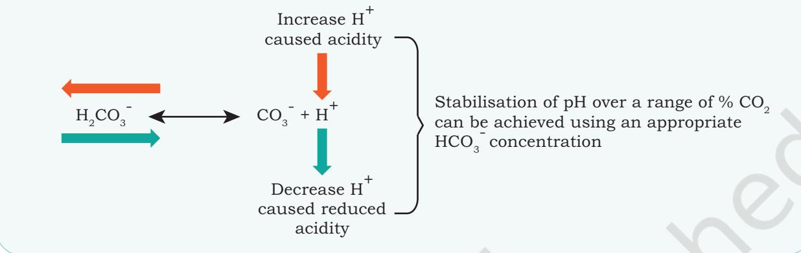

#### *(B) Chemical buffering system*

In the chemical buffering system, a zwitter ion, 4-(2-hydroxyethyl)-1-piperazineethanesulfonic acid (HEPES), is used that has a superior buffering capacity in the pH range 7.2–7.4, and with HEPES, a controlled gaseous atmosphere is not required. It is relatively expensive and toxic at a higher concentration for some cell types.

#### *Phenol red*

Phenol red is generally used in commercial media as a pH indicator. This is effectively used to monitor the pH change owing to the metabolic activities during cell growth. Due to the presence of phenol red, the medium changes its colour as pH changes. At acidic pH levels, phenol red turns the medium yellow, while at alkaline pH levels, the medium turns pink. Medium is bright red at optimal pH—7.4. (Fig. 8.1)

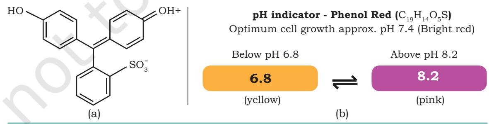

*Fig. 8.1: (a) Structure of phenol red, (b) Phenol red as pH indicator*

**192 Biotechnology XII**

Chapter 8_Animal cell culture.indd 192 06-02-2023 17:43:34

# **8.4 Equipment Used for Cell Culture**

Cultures should be maintained and examined daily for the colour of the medium to understand their morphology and density of cells that are grown in culture flasks, Petri dishes or multi-well plates of several sizes and shapes (Fig. 8.2) at an appropriate temperature, humidity and gas mixture (typically, 37°C, 95%, 5% CO2 for mammalian cells) in an incubator respectively. Culture conditions differ extensively for each cell type, and these variations in conditions for any particular cell type may result in the expression of altered phenotypes.

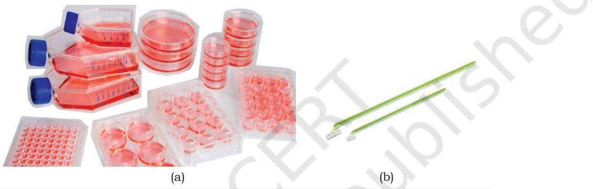

*Fig. 8.2: (a) Culture flask, microplates and Petri dishes, (b) Cells scraper*

An ideal animal cell culture laboratory should have equipment like laminar hood, CO2 incubator, an inverted microscope, autoclave, centrifuge, etc. They are discussed in the following sections.

## **Laminar flow hoods or biosafety cabinets**

Animal tissue or cell culture should be handled and the entire work must be performed aseptically, i.e., without any bacterial or fungal contamination. Laminar flow cabinet (Fig. 8.3) provides a controlled environment in which the levels of particulates, microbes and contamination of all kinds are regulated and kept to a minimum by constant air filtration with industrial-grade filters. Laminar hoods operate by drawing air under negative pressure, into the top of the unit. This air initially passes through a prefilter, which traps the bigger particles of dust and dirt. The blower then directs this prefiltered air, now under positive

**Animal Cell Culture 193**

Chapter 8_Animal cell culture.indd 193 06-02-2023 17:43:34

pressure, through the 99.99 percent efficient HEPA filter engulfing the entire work area with sterile, unidirectional, ultraclean air. This air travels at a velocity calculated to prevent the intrusion of unfiltered room air into the work area. The laminar flow cabinet is generally enclosed on either sides and kept under constant positive pressure in order to prevent the infiltration of contaminated room air. Such cabinets operate by the filter sterilising the air taken in, thus excluding larger particles including bacterial and fungal organisms. The air thus sterilised passes vertically down on the work area— vertical (downflow) flow hoods (Fig. 8.3(b)).When the air is directed horizontally towards the operator, then this is known as horizontal (crossflow)

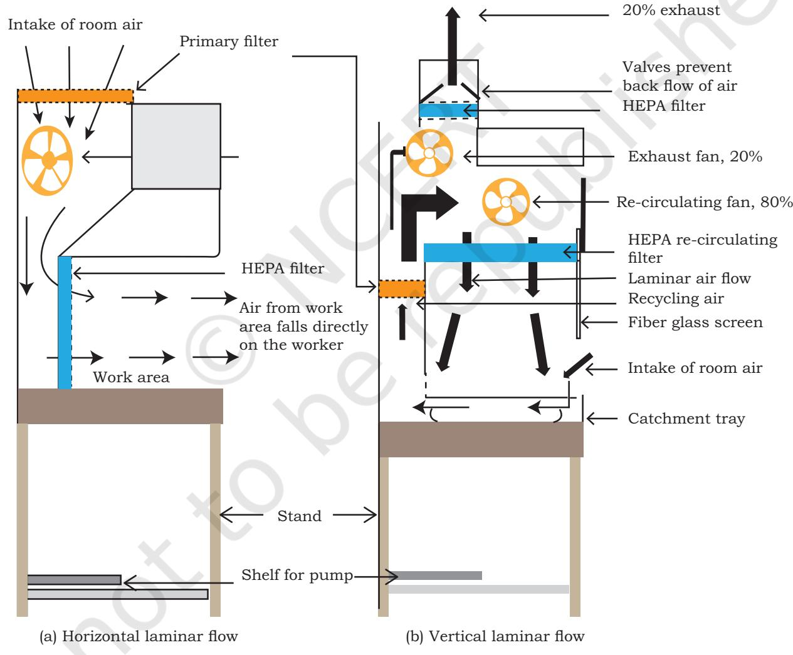

**194 Biotechnology XII** *Fig.8.3: Laminar Flow Hoods (a) Horizontal (b) Vertical*

Chapter 8_Animal cell culture.indd 194 06-02-2023 17:43:34

flow hoods (Fig. 8.3(a)). Horizontal flow hoods are not popular as these do not offer any protection to the operator from the potential hazards of some cultured cells. Sterile, particle-free air is essential in such diverse processing areas as the contain electronic assembly, sterile packaging and hospital pharmacy intravenous (I.V.) preparations.

# **CO2 Incubators**

Incubators for cell culture work depend on an external supply of CO2 so as to maintain a fixed level of CO2 in the incubator. To maintain sterile handling area and cleanliness, the CO2 cylinder should be kept outside the laboratory and the gas should be

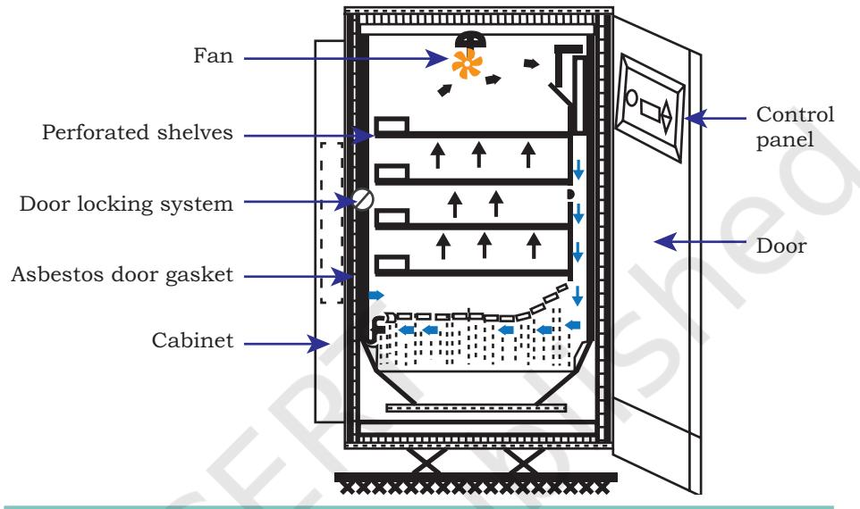

piped through. The *Fig. 8.4: CO2 incubator*

essential functions of the incubator are to maintain the sterility of the chamber, a constant temperature, an atmosphere with a 5–10% level of CO2 and high relative humidity (~95%) (Fig. 8.4). The medium is further buffered with sodium bicarbonate/carbonic acid and the pH must be strictly maintained.

## **Inverted microscope**

A cell culture laboratory essentially requires a good quality inverted microscope with phase-contrast optics and preferably a photographic facility (Fig. 8.5). The morphology of cell, granularity, degree of spreading, membrane blebbing, the proportion of multi-nucleates, vacuolation, and so on, can be regularly monitored for understanding the signs of stress in cells. Cell morphology is sensitive to the alterations in culture conditions hence, problems can be easily detected. Early indications of a microbial contamination can also be spotted with a good phasecontrast microscope. Regular checking of cultures under

**Animal Cell Culture 195**

Chapter 8_Animal cell culture.indd 195 06-02-2023 17:43:34

the microscope can help to avoid the loss of irreplaceable material by allowing a problem to be noticed at an early stage. Also, experiments done on unhealthy cells may give variable or erroneous results. When choosing a microscope, select the long or extra-long working distance condenser so that the flasks and even roller bottles can be viewed. Normally a 20 x magnification objective is sufficient; their depth of field is often too low to obtain a sharp image of all but the most flattened. A good, low-power, wide-field objective is extremely useful for scanning culture colonies.

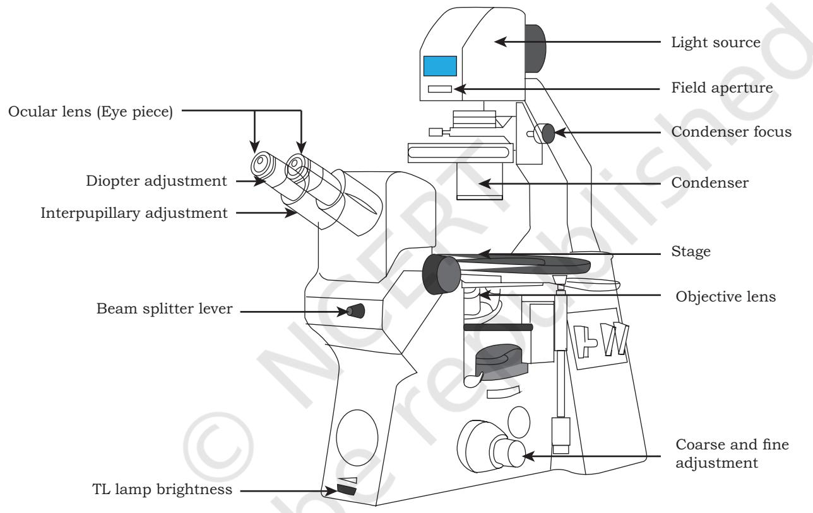

<i>Fig: 8.5: Inverted microscope

**196 Biotechnology XII**

# **8.5 Types of Animal Cell Cultures and Cell Lines**

The animal cell cultures and cell lines are broadly classified as primary and secondary cell cultures and cell lines.

## **(i) Primary cell cultures**

Primary cell culture is obtained directly from the host tissue.

Rationalised 2023-24

Chapter 8_Animal cell culture.indd 196 06-02-2023 17:43:34

The cells dissociated from the parental or host tissues are grown in a suitable culture media in a container and thus, the so obtained culture is called primary cell culture. This type of culture contains mostly heterogeneous cells and these cells are similar to their parents and is called primary cell lines. For the preparation of primary cultures and cell lines, a tissue is dissected in sterile conditions followed by mechanical or enzymatic disaggregation. The tissue can simply be chopped and the pieces attached to a dish. Now cells will grow out from the fragment and may be used directly for culture. The fragment of tissue is called explant that may be transferred to a fresh dish. Primary cultures can also be made by disaggregating tissue with the help of enzymes, such as trypsin or collagenase, etc., and the cell suspension are allowed to adhere, and spread out on the substrate. Cells may grow as adherent cultures or may remain in suspension.

#### *Adherent cells*

These cells are anchorage dependent and proliferate as a monolayer and they require the attachment to a solid or semi-solid substrate for proliferation. These cells adhere to the culture vessel with the help of extracellular matrix, usually derived from tissues that are immobile and present in the network of connective tissue, examples are fibroblasts and epithelial cell types. As the bottom of the culture vessel is covered with a continuous layer of cells with one cell in thickness, these are known as monolayer cultures. A majority of continuous cell lines grow as monolayers. As they are single layers, such cells can be transferred directly to a cover slip to be examined under microscope.

#### *Suspension cells*

Suspension cells, also called anchorage independent or non-adherent cells, are not attached to the surface of the culture vessels and float in the culture medium. Hematopoietic stem cells (derived from blood, spleen and bone marrow) and tumor cells are the examples of suspension cells. These cells grow faster, as they do not require frequent replacement of the culture medium and these are homogeneous in nature.

**Animal Cell Culture 197**

Chapter 8_Animal cell culture.indd 197 06-02-2023 17:43:34

## **(ii) Secondary cell culture**

When a primary culture is sub-cultured or passaged, the resulting culture is called secondary cell culture. During sub-culturing, a portion of cells are transferred to a new vessel having fresh growth medium for continual growth of cells. Sub-culturing of primary cells leads to the generation of secondary cell lines. During the passage, the cells with highest growth capacity predominate, leading to genotypic and phenotypic uniformity in the population. As the cells are sub-cultured at regular intervals, they may become different from the original cell.

Based on the culture life span, the cell lines are categorised into two types:

#### **(a) Finite cell lines**

The cell lines with a limited number of cell division and having a limited life span are called finite cell lines. As the cells pass several times, they lose their ability to proliferate (i.e., **senescence)**. Cell lines derived from primary cultures of normal cells are finite cell lines.

#### **(b) Continuous cell lines**

Some cells of the finite cell line undergo transformation and resume the ability to divide indefinitely, and become a continuous cell line. This type of transformation or mutation can occur spontaneously or can be chemically or virally induced. Cell cultures prepared in this way can be sub-cultured and grown indefinitely as permanent cell lines and are immortal and tumorigenic. The continnous cell lines are less adherent and can also grow in suspension; they become fast growing, less demanding for nutrients and are able to grow up to higher cell density.

#### **Aseptic techniques**

In the cell culture, the bacterial infections, like *Mycoplasma*  and fungal infections commonly occur that create problems. Thus, all the cell culture work is done in a strictly sterile environment with proper aseptic techniques. All work related to culture should be done in laminar flow with constant unidirectional flow of HEPA filtered air over the work area. All the material, solutions and the whole atmosphere should be sterile and contamination free.

Chapter 8_Animal cell culture.indd 198 06-02-2023 17:43:34

#### **Subculture**

After the isolation of cells and subsequent culture, the cells can proliferate under appropriate conditions and they adhere to the available substrate to reach confluence. After few a days, the cells form a monolayer and overgrow becoming crowded, and this can be unfavourable to their growth, leading to cell death. At this point, the cells need sub-culturing or passaging which is the process of using enzyme like trypsin to enable the cells to detach from the old medium. It is then removed and the cells are transferred to a fresh flask after centrifugation and addition of fresh media. This is commonly termed as 'splitting' as the cells of one flask are equally split into two flasks for culturing. A passage number refers specifically to the number of times a cell line has been sub-cultured. For the passaging of adherent cells, first all the cells are detached/dissociated from the surface of the culture vessel by enzymatic (by trypsin, trypsin + collagenase, etc.) or mechanical means (using cell scraper, shaking, vigorous pipetting, etc.) and after that they are transferred into fresh media.

Once the cell line is established, then its karyotype should be determined. This will confirm the species of origin, particularly for those cells that were karyotyped, and the extent of gross chromosomal changes in the line will be determined. Karyotypes may vary from being near normal (i.e., the vast majority of cells in the culture have normal karyotypes) to being aneuploid. While a normal karyotype is desirable, the presence of an abnormal karyotype does not exclude using the cells for *in vitro* studies, especially if it has been verified that the cells retain the normal function expected of them. If a normal karyotype is essential such that the cell lines need to be used to create transgenic animals, then distinct care must be taken in handling the cells to minimise chromosomal changes. The karyotype stability depends on the species from where the cell lines have been derived, the growth conditions used, the way in which the cells were sub-cultured and whether or not the cells were frozen.

#### **Cryopreservation**

Very low temperatures (–180°C to –196°C) are required to store cells. Liquid nitrogen is used for freezing cells at low

Chapter 8_Animal cell culture.indd 199 06-02-2023 17:43:34

temperatures as the formation of ice crystals is reduced below –130°C. Freezing can cause cell mortality due to the damage caused by the formation of ice crystals, alterations in electrolyte concentration, dehydration and pH changes. To nullify the effects of freezing, glycerol or Dimethyl sulfoxide (DMSO) that are cryoprotective agents are added. Typically, the freezing medium contains 90 percent serum and 10 percent DMSO. Preferably, healthy cells growing in log phase should be used and the medium should be replaced 24 h before freezing. Also, the cells should be slowly cooled from room temperature to – 80°C to allow the water to move out of the cells before they freeze. Frozen cells should be thawed as rapidly as possible by placing the vial containing them into a 37°C water bath with moderate shaking. This is to minimise ice and crystal formation, which may damage cells. After thawing, the cells can be transferred directly into a tissue culture vessel containing suitable media for further growth.

## **8.6 Cell Viability Determination**

The measurement of cell viability i.e., the determination of living, plays a vital role in cell culture. The cell viability measurements can be applied to evaluate the live status of culture cells. This is required to determine the effectiveness of a pesticide or insecticide, to evaluate the damage due to toxins as well as to evaluate the potential of a drug, etc. Usually, the cell viability assay or test should be performed at regular intervals to check whether the cells are alive or dead. If too many dead cells are present, the cell suspension should be changed. Following are the two types of viability assay:

## **(a) Dye exclusion viability assays**

In this process, a dye or stain is used that enters the cell and usually intercalates with the DNA in the nucleus. The internalisation of the dye into the cell indicates loss of cell membrane integrity that causes cell death. In other words, live cells exclude the dye, while dead cells allow the dye to enter hence, it is called dye-exclusion assay. Some examples of dye or stains that are used in dye exclusion viability assays include trypan blue (Fig. 8.6), propidium

Chapter 8_Animal cell culture.indd 200 06-02-2023 17:43:35

**200 Biotechnology XII**

iodide, 7-aminoactinomycin D (7-AAD), acridine orange, etc.

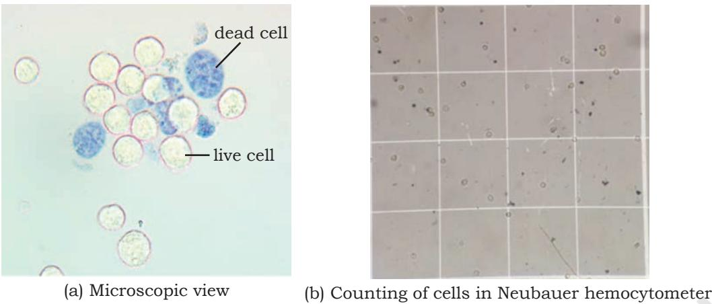

*Fig.8.6: Cell viability by trypan blue exclusion assay* 

## **(b) Metabolic viability assays**

Metabolic viability assays rely on the ability of cells to execute a specific biochemical reaction that can be measured by various means including absorbance, fluorescenc or luminescence methods (Fig. 8.7). The examples of reactions that can be tested are reduction of a tetrazolium compound, e.g. MTT assay that are measured by absorbance. These methods are developed to estimate the cell number based on the cellular content of enzyme or substrate and subsequent extraction of the dye. A yellowcoloured water-soluble salt 3-(4,5-dimethylthiazole-2-yl)-

2,5-diphenyltetrazolium bromide [MTT] reacts with the mitochondrial dehydrogenase enzymes of live cells, which reduces them to purplecoloured insoluble formazan crystals, which are precipitated and dissolved in DMSO. Dehydrogenase content is consistent among the cells of a specific type and the amount of formazan reduced is proportional to the cell number.

In addition, the conversion of

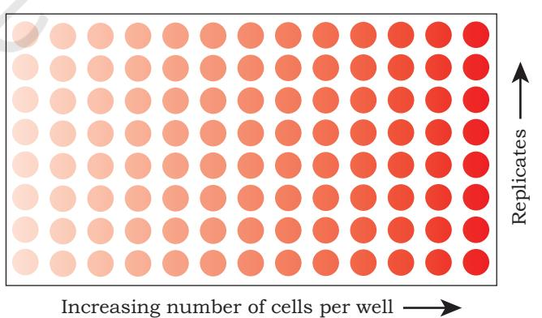

*Fig. 8.7: Result of metabolic viability assays. Colour is directly proportional to the number of cells*

**Animal Cell Culture 201**

Chapter 8_Animal cell culture.indd 201 06-02-2023 17:43:35

non-fluorescent acetomethoxy derivative of calcein to a fluorescence emitter component after ester hydrolysis by intracellular esterase is also used.

# **8.7 Scale-up of Animal Cell Culture Process**

The various scale-up methods include spinner flasks for suspension cultures and roller bottles with microcarrier beads for adherent cell cultures (Fig. 8.8).

**Spinner flasks** are used for scaling up the production of suspension cells. They consist of a flat surface glass flask with a suspended central teflon paddle that agitates and turns the medium when placed on a magnetic stirrer. Commercial versions incorporate one or more side arms for sampling and/or decantation. The cells are not allowed to settle to the bottom of the flask, and thus, cell crowding occurs only when the cultures reach extremely high densities. Stirring the medium improves gas exchange [Fig. 8.8(a)].

 In **roller bottles**, the cells adhere to the total curved surface area of the microcarrier beads, thereby distinctly increasing the available space for growth. These tissue culture bottles can be used in specialised CO2 incubators with attachments that rotate the bottles along the long axis. At the end of each complete rotation of the bottle, the total cell monolayer has rapidly been exposed to the medium. The volume of the medium should be sufficient to provide a shallow cover of medium over the monolayer [Fig. 8.8(b)].

**Microbeads** of different diameters ∼ 150 µm (i.e., 90–300 µm) made of dextran, plastic, glass, gelatin or collagen can be effectively used to grow monolayer cells [Fig. 8.8(c)]. Culturing monolayer cells on microbeads gives a maximum ratio of the surface area of the culture to volume of medium, almost up to 90,000 cm2 l−1, depending on the size and density of the beads. It has the additional advantage that the cells may be treated as a suspension. Microcarrier uses a pendulum or paddle as in suspension culture to achieve efficient stirring without damaging the beads. Under optimal conditions, adherent cells may be grown to high densities before the overgrown cultures become a problem.

Chapter 8_Animal cell culture.indd 202 06-02-2023 17:43:35

**202 Biotechnology XII**

Cells growing at these high densities tend to exhaust the medium rapidly that may need replenishing very often.

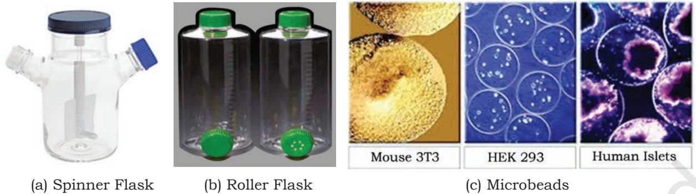

*Fig. 8.8: Tools for scale-up of animal culture process*

# **8.8 Advantages of Animal Cell Culture**

The advantages of animal cell culture are:

- Can be grown under controlled physico-chemical environment.
- Can proliferate into a homogenous genetic population.
- Makes adding genes easy (e.g. transfection) or regulate protein levels (e.g. RNAi).
- Available in adequate numbers to conduct chemical study.
- Easy production of biopharmaceuticals.
- Ethical clearance not required.

However, there are a few limitations which are as follows:

- It is a highly sensitive technique, and even small changes can reduce the productivity.
- Scale-up is possible but challenging.
- May not be a holistic representation of *in vivo* phenotype/genotype.

# **8.9 Applications of Animal Cell Culture**

Animal cell culture has diverse applications in various areas. Some are listed below:

- As a model system for the study of interaction between cells and diseases causing agents as well as their drugs

**Animal Cell Culture 203**

Chapter 8_Animal cell culture.indd 203 06-02-2023 17:43:35

- As a convenient and economic tool to study virus research
- As a useful technique for vaccine production on a large scale
- As a production house for various medically important protein pharmacueticals. The important ones are listed in Table 8.3.

| Table 8.3: Pharmaceutical proteins and their therapeutic use |
| --- |

| Proteins | Animal cells used | Applications |
| --- | --- | --- |
| Follicle Stimulating Hormone (FSH) | CHO cells | Infertility |
| Human Growth Hormone (HGH) | CHO cells | GH deficiency |
| Erythropoietin (EPO) | CHO cells | Anemia |
| Factor VIII | CHO cells | Hemophilia A |
| Factor IX | CHO cells | Hemophilia B |
| Interleukin 2 (IL2) | CHO cells | Cancer therapy |
| Tissue Plasminogen Activator (tPA) | Chines Hanster Ovary cells | Stroke |
| Monoclonal antibodies (mAbs) | Hybridoma cells | Cancer therapy & Autoimmune diseases |
| * CHO — Chinese Hamster Ovary |  |  |

**Erythropoietin (EPO)** is a glycoprotein hormone secreted by kidney under hypoxic (shortage of oxygen) or anoxia (lack of oxygen) conditions caused by anaemia that induce RBC production (erythropoiesis) and wound healing. EPO stimulates the bone marrow to produce more red cells and thereby increase the oxygen-carrying capacity of the blood. EPO is used for treating certain types of anamia caused by chemotherapy in cancer patients, treatment of AIDS and even in chronic renal failure. Recombinant human EPO (r-HuEPO) has been produced using Chinese Hamster Ovary (CHO) cell lines. The use of r-HuEPO is advantageous over blood transfusion as it does not require donors or transfusion facilities, and the risk of transfusionassociated disease is minimised.

**Factor VIII for Haemophilia A**, is a common inherited genetic disorder in which Factor VIII required for blood clotting is not produced in the body. Like EPO, Factor VIII is also a glycoprotein and may be produced in CHO cells.

Chapter 8_Animal cell culture.indd 204 06-02-2023 17:43:35

**204 Biotechnology XII**

**Factor IX for Hemophilia B** or Christmas disease is a bleeding disorder caused due to the deficiency of factor IX. Recombinant Factor IX produced in CHO, cells used to treat haemophilia B.

**Tissue Plasminogen Activator (tPA)** is a serine protease that catalyses the conversion of plasminogen to plasmin which is responsible for dissolving blood clots. It is approved for use in certain patients having a heart attack or stroke. tPA is the first drug to be produced through mammalian cell culture. Production and mode of action of tPA is given in Fig. 8.9.

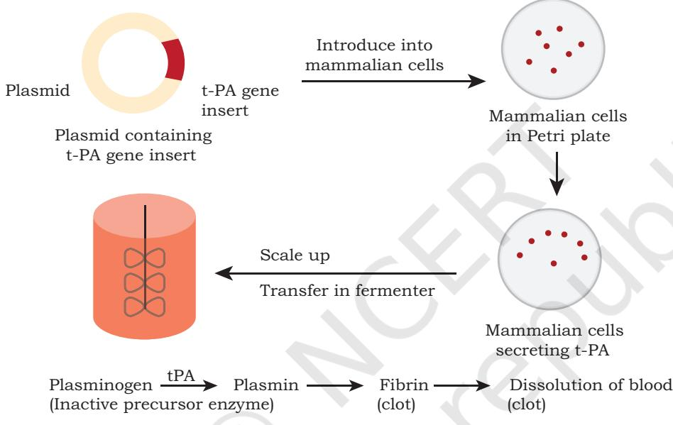

*Fig. 8.9: Production and mechanism of action of tPA*

#### **Hybridoma Technology for Monoclonal Antibody Production**

Antibodies have the specificity to bind to particular domains of macromolecules (antigens) known as epitopes. The antibodies present in serum are a heterologous population secreted by B-Lymphocytes after recognising specific epitopes of various antigens, hence termed as polyclonal antibodies. Alternatively, monoclonal antibodies (MABs) have single specificity i.e., it binds specifically to an epitope on an antigen, hence useful in the detection of specific antigens (diagnostics) or in blocking their binding by other molecules.

**Animal Cell Culture 205**

Chapter 8_Animal cell culture.indd 205 06-02-2023 17:43:35

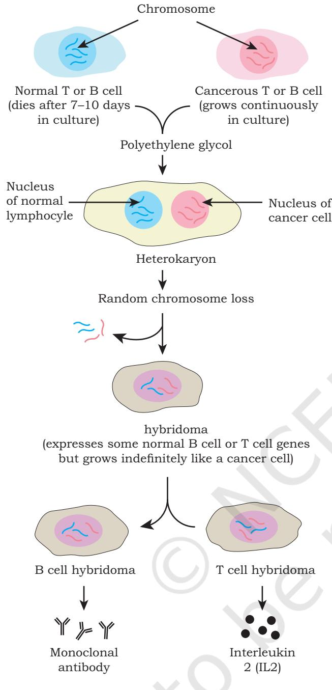

activated B lymphocytes that have been immortalised by hybridising (fusing) them with a myeloma cell (cancerous lymphocyte). Ceasar Milstein and George Kohler (Nobel Prize winners) developed hybridoma technology by fusing antibody secreting B cells with the immortal myeloma cells using polyethylene glycol. The hybrid cells retain the ability of B cells to produce antibody and the immortality of the myeloma cells. The hybrid clones, when grown in culture, produce epitope-specific MAB (Fig. 8.10 ). This technology has revolutionised the area of diagnostics and antibody-based therapies. The detection of many infectious diseases like hepatitis and AIDS, have been facilitated by the availability of

MABs are produced by antigen-

#### monoclonal antibodies. **Therapeutic MAB – OKT3**

Muromonab-CD3 (OKT-3) is a murine monoclonal antibody directed against CD3 receptor. It is used as an immunosuppressant drug that is given intravenously to reverse acute rejection of transplanted organs, such as kidney, heart and liver. When OKT–3 is bound to CD3, the T-cell receptor (TCR) undergoes endocytosis resulting in an inert T-cell and acts by blocking the function of T cells which play a major role in acute graft rejection (Fig. 8.11). This prevents

subsequent recognition. T cells are then eliminated by phagocytosis. After OKT–3 therapy is over, T cell function usually returns to normal within a week. OKT–3 was the first monoclonal antibody to be approved for the treatment of acute rejection in clinics.

Chapter 8_Animal cell culture.indd 206 06-02-2023 17:43:36

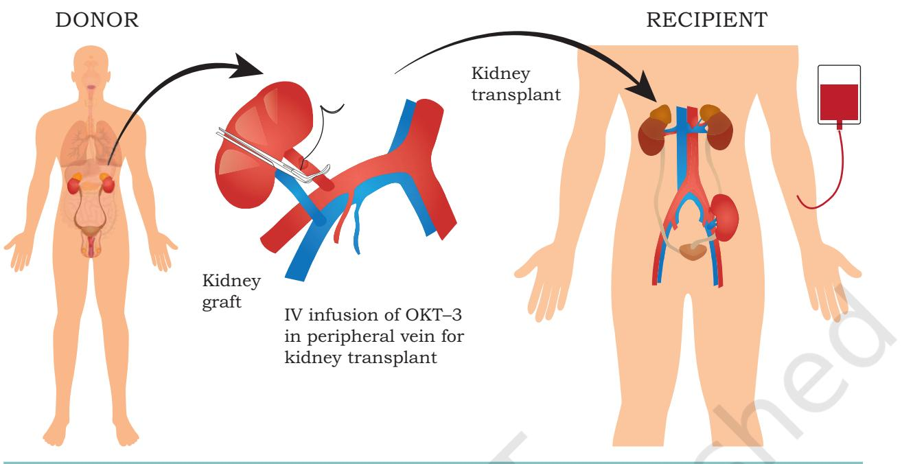

*Fig. 8.11: Use of OKT–3 during kidney transplantation (KT)*

**Trastuzumab** is a monoclonal antibody approved for therapy of early-stage breast cancer that is Human Epidermal growth factor Receptor 2-positive (HER2+). Normal cells also express HER2 but cancer cells overexpress HER2+ along with dysregulation of receptor activation. These cell surface receptors receive signals that stimulate the cells to proliferate. Trastuzumab works by attaching itself to HER2 receptors and blocking them from receiving growth signals. The result is impaired growth of breast cancer.

## **SUMMARY**

- Animal cell culture is *in vitro* maintenance and proliferation of animal cells using an appropriate nutrient media.
- The basic requirement for optimal growth of cells include temperature, pH and appropriate growth medium.
- Animal cell media can be categorised into two major categories, namely natural media and artificial or synthetic media.

**Animal Cell Culture 207**

Chapter 8_Animal cell culture.indd 207 06-02-2023 17:43:36

- Natural media consists of naturally occurring biological fluids, such as plasma, tissue extract, etc., and it is suitable for the culture of a wide range of animal cells.
- Artificial or synthetic media is made up of various nutrients (both organic and inorganic), vitamins, salts, O2 and CO2 gases, serum, carbohydrates, cofactors, etc., and it can be modified according to purpose and it is divided into four categories namely, serum containing, serum free, chemically defined and protein free media.
- The cell culture can be classified as primary cell culture and secondary cell culture (cell line).
- Primary cells can grow either as an adherent monolayer or in a suspension.
- Secondary cell lines are derived from primary cells after sub-culturing.
- Based on the life span of culture, the cell lines are categorised into finite and continuous cell lines.
- The cell viability measurement i.e., the determination of living or dead cells, is very significant in cell culture and is done *via* dye exclusion or viability assays and metabolic viability assays.
- Cell culture technology has application in various areas, such as molecular genetics, immunological analyses, gene therapy, bioengineering, pharmaceutical industry, etc.
- Animal cell culture plays an important role in research and development of drug and also helps to improve the health and quality of life of patients suffering from various diseases, such as cancer, genetic disorders, etc.

## **EXERCISES**

- 1. What is animal cell culture?
- 2. Describe animal cell culture media and their types.
- 3. Write the advantages and disadvantages of serum in the culture media.
- 4. Describe any two chemically synthesised media.
- 5. What is primary cell culture? Also discuss as to how it is developed.
- 6. What is subculture or passaging of cell?
- 7. Differentiate between finite and continuous cell lines.
- 8. How is cell viability measurement performed?
- 9. Write a detailed account of application of cell culture.

Chapter 8_Animal cell culture.indd 208 06-02-2023 17:43:36

- 10. The example of animal cell culture media is:
	- (a) DMEM
	- (b) MS media
	- (c) LB Media
	- (d) All of the above
- 11. Name the type of culture which is prepared by inoculating directly from the tissue of an organism to culture media.
	- (a) Primary cell culture
	- (b) Secondary cell culture
	- (c) Cell lines
	- (d) Transformed cell culture
- 12. Sodium bicarbonate is added to animal cell culture media to
	- (a) keep cells stuck to the plastic
	- (b) promote the uptake of CO2 into animal cells
	- (c) maintain the correct pH when CO2 is present
	- (d) keep iron soluble
- 13. Which of the following is NOT present in growth medium for animal cell culture?
	- (a) Inorganic salts
	- (b) Bicarbonate
	- (c) Carbon source
	- (d) Starch
- 14. Disaggregating of cells can be performed by:
	- (a) Physical disruption
	- (b) Enzymatic digestion
	- (c) Treating with chelating agents
	- (d) All of the above
- 15. The approach in which genes are transferred into animals to obtain a large scale production of the proteins encoded by these genes in the milk, blood, etc., is called
	- (a) *In situ* culture
	- (b) Molecular pharming
	- (c) Gene therapy
	- (d) Hybridoma technology
- 16. Which of the following is a protein free animal cell culture media?
	- (a) RPMI-1640 Media
	- (b) MS media
	- (c) LB media
	- (d) None of the above

**Animal Cell Culture 209**

Chapter 8_Animal cell culture.indd 209 06-02-2023 17:43:36

- 17. MTT assay is used for
	- (a) Cell viability test
	- (b) Monitoring of variation in pH of culture media
	- (c) Transformation screening
	- (d) Cell dissociation from substratum
- 18. Passaging of animal cells in animal cell culture is
	- (a) Sub-culturing of the cells
	- (b) Isolation of cells
	- (c) Passing the cells from culture tube to Petri dishes
	- (d) Counting of cells
- 19. Which of the following is NOT the major function of serum?
	- (a) Enhance cell attachment
	- (b) Stimulate cell growth
	- (c) Promotion of tuber and bulb formation
	- (d) Provide transport proteins
- 20. **Assertion:** Serum is the most important component of culture media.

**Reason:** Serum is a good source of nutrients and also helps in cell proliferation and cell-matrix attachment.

- (a) Both assertion and reason are true and the reason is the correct explanation of the assertion.
- (b) Both assertion and reason are true but the reason is not the correct explanation of the assertion.
- (c) Assertion is true but reason is false.
- (d) Both assertion and reason are false.
- 21. **Assertion:** Cell lines derived from the primary culture of normal cells are finite cell line.

**Reason:** Some cells of the finite cell line undergoes transformation and retain the ability to divide indefinitely.

- (a) Both assertion and reason are true and the reason is the correct explanation of the assertion.
- (b) Both assertion and reason are true but the reason is not the correct explanation of the assertion.
- (c) Assertion is true but reason is false.
- (d) Both assertion and reason are false.

Chapter 8_Animal cell culture.indd 210 06-02-2023 17:43:36

