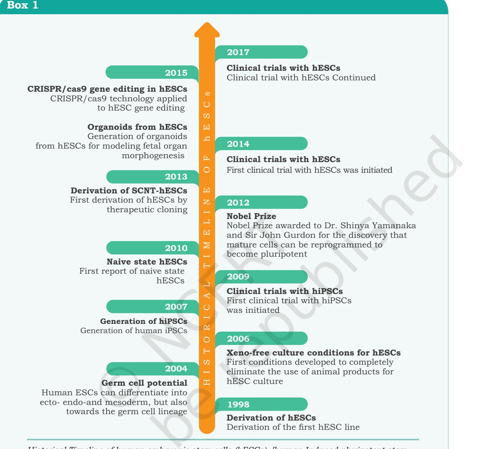
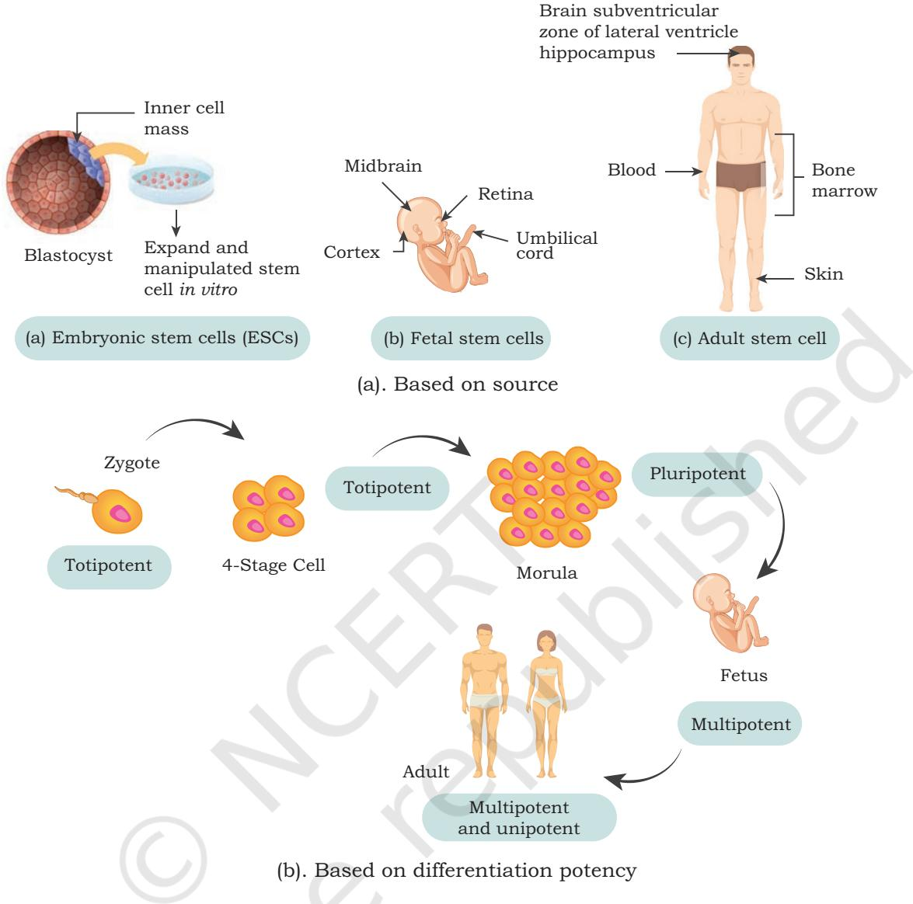
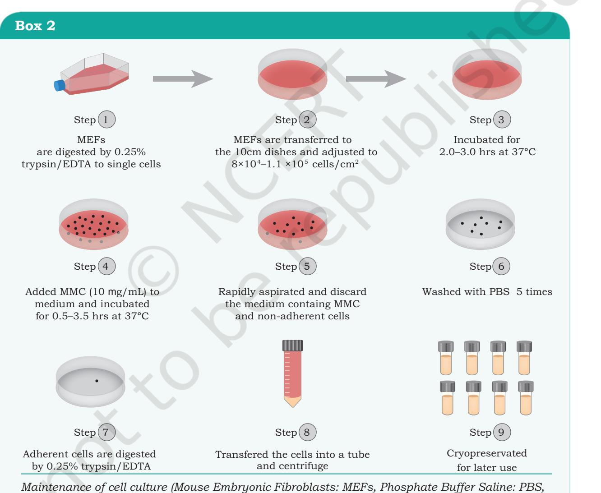
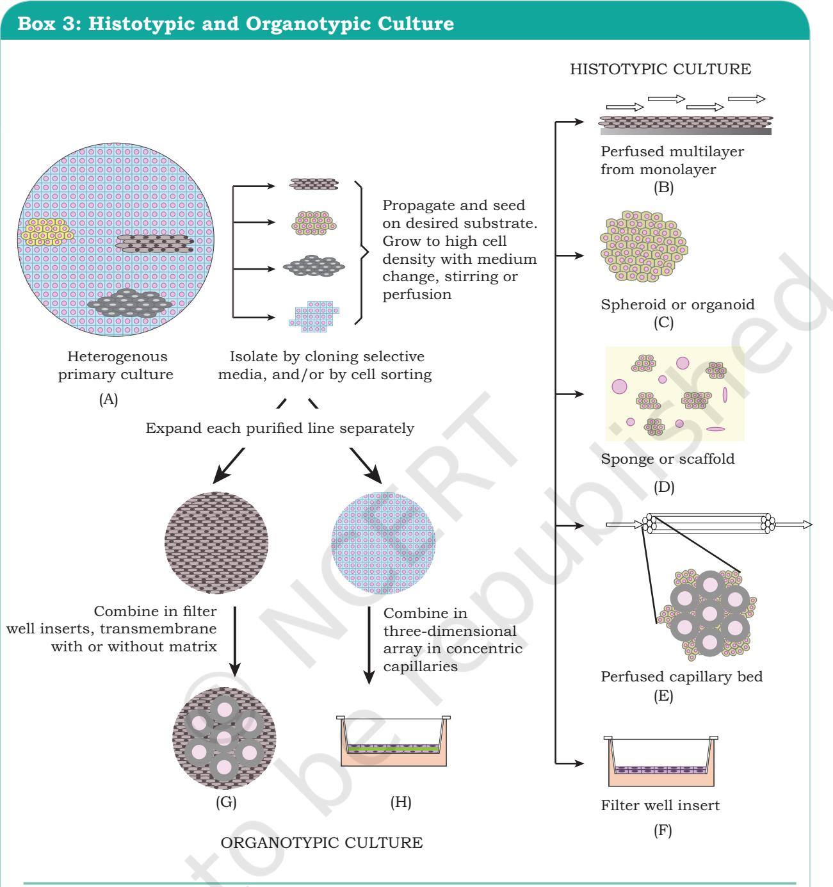

# **Stem Cell Culture and** 9 **Organ Culture Chapter**

Stem cell study forms an exciting and attractive area of contemporary biomedical research that has enormous potential for both basic and translational research. Stem cells can be used for alleviating suffering for many diseases that currently have no effective therapy. The field has progressed to the clinic and it is very important that the basics of stem cells be reinforced by excellent science and rigorous standards of clinical research. Besides this, organ culture is another modern culture approach that involves developing a part of organ or the whole organ using tissue culture techniques. In this chapter, we are going to study in detail about stem cell culture and organ culture along with their applications.

# **9.1 Stem Cell Culture**

Life forms are characterised by the ability to reproduce itself. One of the key features of sexual reproduction is the formation of zygote through the process of fertilisation resulting from the fusion of the male gamete (sperm) and female gamete (oocyte). Formation of embryo from the zygote involves cell division resulting into the formation of two *9.1 Stem Cell Culture 9.2 Organ Culture*

Chapter 9_Stem cell culture and Organ Culture.indd 211 06-02-2023 17:44:31

celled, four celled, eight celled organism so on. Ultimately, these daughter cells differentiate into a variety of cells, such as muscle cells, skin cells, liver cells, cardiovascular cells, epithelial cells, etc. However, during the process of differentiation, cells vary in their potential to make final cells such that some cells become 'mature' while some remain 'immature'. Such 'immature' cells which have the potential to differentiate into a wide range of specialised cell type, are called **stem cells**. These stem cells have the potential for self-renewal via mitotic cell division and then differentiate into a wide range of specialised cell types.

#### **Historical perspective**

Stem cells have been known to procreate more interest, inspection and debate than any other area of scientific study. The first stem cells were isolated from blood cells. At present, scientists all around the world are working on various types of stem cells to revolutionise the area of regenerative medicine by using the potential of stem cells to regenerate the tissue or organ. The story of this amazing journey has been detailed in the form of a flow chart to reveal its most salient moments through the voice of some of the pioneers in this exciting field (Box 1).

Stem cells are non-specialised cells with an inherent property of self-renewal and potency i.e., they have the potential for self-renewal via mitotic cell division and then differentiate into a wide range of specialised cell types. Stem cells are present in most of the multi-cellular organisms and are able to endure adverse conditions for long time periods. In humans, stem cells are found in umbilical cord, placenta, inner cell mass of the early embryo, few tissues of foetus and in some adult organs.

Due to the virtue of differentiation, stem cells can be useful for treating and understanding the diseases and can be used to:

- develop new cells *in vitro* to replace the damaged tissues or organs.
- study the cause of genetic defects in cells as well as to study the cause of diseases and their treatments.
- test new lead molecules as drugs.

Chapter 9_Stem cell culture and Organ Culture.indd 212 06-02-2023 17:44:31

*Historical Timeline of human embryonic stem cells (hESCs). [human Induced pluripotent stem cells (hiPSCs); Somatic Cell Nuclear Transfer (SCNT)]*

# **9.1.1 Stem cell classification**

Stem cells may be classified depending upon the source and potency (Fig. 9.1).

# **Classification based on source**

Based on the source, stem cells have been categorised into two major groups— the embryonic stem cells and the

**Stem cell culture and Organ Culture 213**

Chapter 9_Stem cell culture and Organ Culture.indd 213 06-02-2023 17:44:32

*Fig 9.1: Various type of stem cells*

adult stem cells. There is one more group called fetal stem cells. Embryonic stem cells are also known as early stem cells and are present in the inner cell mass of blastocyst after around five days of development. Adult stem cells or mature stem cells are present in the umbilical cord, placenta after birth and in mature body tissues. As the embryonic stem cells have the property to differentiate into any tissue of the body, they are more promising for clinical applications than adult stem cells. However, the use of embryonic stem cells in humans is limited because of technical safety and some ethical dilemma. On the other

Chapter 9_Stem cell culture and Organ Culture.indd 214 06-02-2023 17:44:32

hand, there are no controversies regarding the safety and ethical issues associated with adult stem cells. Adult stem cells were thought to be irreversible, dedicated to a specific lineage. However, now they have been shown to exhibit plasticity i.e., stem cells from one tissue can differentiate and produce cells of a completely different tissue.

## Embryonic stem cells

In 1998, James Thomas and his colleagues first derived human embryonic stem cells from donated blastocysts through *in vitro* fertilisation. Embryonic stem cells are classified as self-reproducing pluripotent cells and are possibly immortal. Embryonic stem cells can be derived from the pre-implanted embryo in the uterus. The human embryonic stem cells are derived from the embryo that is normally four to five days old and is a hollow microscopic ball of cells known as blastocyst. The properties of embryonic stem cells were determined in subsequent *in vitro* and *in vivo* studies. There is no disagreement that these pluripotent embryonic stem cells truly have the ability to regenerate all types of tissues. The distinctive features of embryonic stem cells are as follows:

- 1. These cells can be isolated from the inner cell mass or epiblast of the blastocyst.
- 2. These cells are pluripotent in nature and have the ability to give rise to all the three germ layers i.e., ectoderm, mesoderm and endoderm.
- 3. They have the capability of self-renewal and exhibit stable diploid chromosome.
- 4. They are known to get incorporated into all fetal tissues if injected into blastocyst during the development.
- 5. The X-chromosome inactivation is absent in undifferentiated embryonic stem cells and they also lack G1 check point in the cell cycle.
- 6. They retain the characteristics of embryo founder cells even after extensive manipulation.
- 7. Depending on the conditions of the *invitro* environment, they can self-renew or differentiate into multiple tissue types.

**Stem cell culture and Organ Culture 215**

Chapter 9_Stem cell culture and Organ Culture.indd 215 06-02-2023 17:44:32

# Adult stem cells

**Adult stem cells** are precisely called **somatic stem cells**, because they can come from children or umbilical cord and not from adults only. They are undifferentiated multipotent or totipotent stem cells. The adult stem cells are present all over the body after embryonic development and replace and regenerate the damaged tissues or dying cells by cell division. The adult stem cells have two basic characteristics: ability to self-renewal without compromising with stemness and ability to differentiate into mature morphologically and functionally dissimilar tissue specific cells. The main role of adult stem cells in an organism is to preserve and repair the tissue in which they reside. Therefore, adult stem cells maintain cellular homeostasis throughout the lifetime of mammals. Adult stem cells are rare and may be present in most of the organs and dispersed in tissues throughout the body, however, they have been isolated from limited organs or tissues. So far, adult stem cells have been identified in the digestive tract, bone marrow, liver, brain, cornea, skeletal muscle, epithelia of skin, dental pulp, pancreas and blood vessels. The highest frequency of adult stem cells is present in the bone marrow.

The embryonic stem cells are defined by their origin but the origin of adult stem cells in some tissues is still under examination. The adult stem cells can either be hematopoietic or mesodermal in origin.

# Hematopoietic stem cells

Hematopoiesis, the controlled production of eight different blood cells (RBC, monocytes, neutrophil, acidophil, basophils, T lymphocytes and B lymphocytes, platelets) is initiated from a common small population of stem cells, known as hematopoietic stem cells. Hematopoiesis occurs mainly in the bone marrow of adult mammals therefore, hematopoietic stem cells are present in the bone marrow. The bone marrow is a highly prolific tissue in the body.

On an average, the daily output of blood cells by bone marrow is nearly 400 billion. The hematopoietic stem cells are rare and have the ability of self-renewal and pluripotency hence, they are capable of producing the

Chapter 9_Stem cell culture and Organ Culture.indd 216 06-02-2023 17:44:32

**216 Biotechnology XII**

complete hematopoietic system. Hematopoietic stem cells have been recognised at well-defined stages of embryonic development and several subsets have been characterised in adult hematopoiesis. During embryonic development in humans, the site of hematopoiesis is believed to be in the yolk sac. In second trimester, it is shifted to liver and spleen, and later in the third trimester, hematopoiesis is abundant in the central and peripheral skeleton. In the adulthood, the main sites of hematopoiesis are vertebral bodies, ribs, sternum and pelvis. Bone marrow is a highly heterogeneous population of both hematopoietic and non-hematopoietic cells, originated from common mesodermal precursor cells.

# Mesenchymal stem cells

The precursor of non-hematopoietic stem cells of bone marrow are known as mesenchymal stem cells (MSCs), originally derived from the mesoderm. MSCs are multipotent marrow derived adhered fibroblastic cells that can differentiate into a variety of cells, such as muscle cells (myocytes), bone cells (osteoblasts), cartilage cells (chondrocytes), fat cells (adipocytes), tendon and marrow stromal cells. MSCs extremely proliferative are rare population of cells in the bone marrow and can be easily isolated from it. They can be cloned from bone marrow and expanded *in vitro* about 106 fold without compromising the ability to differentiate into other lineages. Besides the expansion potential, major advantages of MSCs include their genetic stability, avoid allo-rejection, compatible in tissue engineering applications and are capable of repairing many vital tissues. They are thought to be responsible for wound healing, growth and replacing cells that are lost through daily wear and tear and pathological conditions. MSCs are important for making and repairing skeletal tissues, such as cartilage, bone and fat found in the bone marrow. Because of these functions, they have been shown to be effective in the treatment of tissue injury and degenerative diseases.

**Stem cell culture and Organ Culture 217**

Chapter 9_Stem cell culture and Organ Culture.indd 217 06-02-2023 17:44:32

# **Classification based on differentiation potency of stem cells**

On the basis of the ability of self-replication and differentiation into various tissues, stem cells have been categorised into totipotent, pluripotent, multipotent and unipotent. Each of them has been described in the following sections.

## Totipotent stem cells

Totipotent (toti = whole, potent = able to) stem cells are the most versatile form and have the utmost potential for differentiation that permits the cells to produce both embryo and extra-embryonic membranes, and all the post-embryonic tissues and organs that form an entire functional organism. Zygote is an example of totipotent stem cells as a few hours after egg fertilisation and division, each cell has the potential to develop into a complete organism.

Moreover, identical twins are formed as a consequence of two totipotent cells separation and their development into two genetically identical embryos. All cells of the early embryo are totipotent until the eight-cell stage, after that they begin to specialise and form blastocyst. In this regard, primordial germ cells are also totipotent in nature. After nearly four days, the inner cell mass of blastocyst becomes pluripotent.

# Pluripotent stem cells

Pluripotent (pluri = several, potent = able to) stem cells have the potential to differentiate into almost all cell types of the embryo except the cells of the extra embryonic support tissues, (placenta and yolk sac). These cells can give rise to all the germ layers but are not able to form extra-embryonic tissues, such as placenta, as a consequence, they cannot give rise to a complete organism like totipotent stem cells. The inner cell mass of blastocyst gives rise to tissues of the adult organism while the outer layer trophectoderm forms the placenta. The pluripotent stem cells go on dividing, until they begin to specialise in the gastrulation stage. Examples comprise embryonic stem cells and cells that are derived from the ectoderm, mesoderm and endoderm germ layers that are formed in the beginning stages of embryonic stem cell differentiation.

Chapter 9_Stem cell culture and Organ Culture.indd 218 06-02-2023 17:44:32

## Multipotent stem cells

The multipotent cells (multi = many, potent = able to) have the ability to differentiate into a closely related family of cells. These are the plastic and more differentiated stem cells. These multipotent stem cells can specialise into various types of cells within the specific cell lineage. For example, multipotent hematopoietic (adult) stem cells can develop into various types of blood cells, such as red blood cells, white blood cells and platelets. Similarly, neural stem cells can give rise to neurons, oligodendrocytes and astrocytes. After differentiation, the abilities of these cells are restricted to the cells of its specific lineage.

## Unipotent stem cells

It is an undifferentiated cell present in the differentiated tissue with the property of dividing repeatedly. Unipotent stem cells have the ability to only produce cells of their own type and also have the property of self-renewal needed to be labelled as stem cell. They can self-renew and differentiate into specialised cells of the tissue, such as epidermal stem cells, muscles and endothelial, etc. The repetitive division in unipotent stem cells make them a promising candidate for therapeutic use in regenerative medicine.

It should be remembered that totipotent and pluripotent stem cells belong to the embryonic life of the organism, whereas multipotent and unipotent stem cells are found in the adult life. In general, multipotent and unipotent stem cells are termed as adult stem cells or somatic stem cells.

## **9.1.2 Characteristics of stem cells**

Over the past several years, a great deal of attention has been paid on the differentiating ability of the adult stem cells. **Plasticity** of adult stem cells is the presumed ability of tissue specific stem cells to attain the fate of cell types distinct from the tissue of origin. Differentiation of one cell type against its fate into other cell type requires massive molecular rearrangement within the cells, for which the competence of the responding cells and micro-environmental cues are most important. For example, all the types of bone marrow cells are not competent for differentiating into neurons or hepatocytes.

Chapter 9_Stem cell culture and Organ Culture.indd 219 06-02-2023 17:44:32

Similarly, the competent bone marrow cells do not undertake differentiation program against fate, unless they are exposed to inductive microenvironment. Some of the alternative fate changing pathways by somatic cells to switch lineages are trans-determination, transdifferentiation, dedifferentiation, heterogeneity, versus gene level pleiotropy and fusion. The first is **transdetermination**, in which a stem cell that is programmed to produce certain lineages, switches to another stem cell and gives rise to the cell types of that precursor, i.e., its potential is redirected. The second pathway is **trans-differentiation**, in this process a differentiated cell can achieve the phenotype of another differentiated cell. **Dedifferentiation** is common in lower vertebrates but rare in mammals. By dedifferentiation process, adult stem cells revert back to master cells from which they originate and the master cells can differentiate into other cell types. Heterogeneity is the most acceptable explanation for the plastic nature of adult stem cells. One of the gold standards for plasticity of adult stem cells is its clonal level purity. Normally, the purity of stem cells is determined by the presence and absence of the specific surface markers. When plasticity between two cells originated from the same germ layer can be explained by clonal level impurity, it is known as **pleiotropic**. **Fusion** is an alternative mechanism proposed for the plasticity in adult stem cells.

## **9.1.3 Maintenance of Stem Cell**

Cells are usually passaged under a laminar flow hood and maintained in incubators, which are under atmospheric partial oxygen pressure (pO2). Stem cells should be cultivated at a controlled dissolved oxygen partial pressure lower than the atmospheric pressure. The critical parameters, such as pH and pO2,should be continuously monitored and measured in the culture medium. A promising approach for intracellular sensing is the use of fluorophores that can be added in the culture and taken into the cytoplasm without changing cell functions. Alternatively, intrinsic cellular fluorophores like flavoproteins and lipofuscin can be used to monitor non-invasive changes in the cell redox state as well as to monitor oxidative stress under different culture conditions.

Chapter 9_Stem cell culture and Organ Culture.indd 220 06-02-2023 17:44:32

**220 Biotechnology XII**

The culture of stem cells is similar to that of protocols as standard for animal cell culture. However, the successful culture of human stem cells needs additional attention to retain their significant characteristics of self-renewal and potency. A successful stem cell culture, restoration of the *in vivo* microenvironment, includes the presence of growth factors and other components for proper cell-to-cell interactions and cell to matrix adhesions (Box 2).

For the culture of stem cells, it is highly recommended that the cells should be monitored at regular intervals for the following parameters:

*Macromolecular Crowding: MMC, Ethylenediamine tetraacetic acid: EDTA)*

**Stem cell culture and Organ Culture 221**

Chapter 9_Stem cell culture and Organ Culture.indd 221 06-02-2023 17:44:33

- *• Cell line sterility:* Continuous cell cultures are vulnerable to various microbial contaminations (mainly fungal and bacterial) that leads to cell death. Since the stem cells are cultured in nutritionally rich culture without any antibiotics, therefore they are prone to infections and contamination. In addition to bacteria and fungi, mycoplasma is also considered as another contaminant. Common sources of mycoplasma are contaminated materials of animal origin, such as serum, trypsin and primary feeder cell cultures. Viruses are another form of contamination in stem cell culture and they utilise the cellular resources for viral replication and cause integration into the host genome, thereby alter the cellular activity. Thus, testing for microbial contaminations before use and at regular intervals during culture is highly recommended.
- *• Cell line authenticity:* In the cell culture, crosscontamination is a major risk factor because in most of the laboratories, culture of multiple cell lines are present. The cross-contamination may lead to incorrect data, misinformation and misleading conclusions. Thus, the proper authentication of cell lines prior to their use is mandatory.
- *• Cell line stability:* During long-term culture, there is a possibility of genetic and/or phenotypic changes in the cells. Thus, at regular intervals, the check-up of genetic abnormalities including changes at the chromosomal level should be practised. There are several methods available to monitor the cell line stability including RT-PCR, immuno-cytochemical staining and flow cytometry, etc.

# **9.1.4 Applications of stem cells**

The goal of any stem cell therapy is to repair a damaged tissue that cannot heal itself. Ongoing research on stem cell treatments give hope and confidence to the patients who would generally not get treatment to cure their diseases but just to improve the symptoms of their chronic illness. Stem cell therapies involve more than simply transplanting cells into the body and directing them to grow new, healthy tissue. It may also be possible to persuade the stem cells already in the body to work overtime and produce new tissue. There are a number of stem cell therapeutics developed, but most

Chapter 9_Stem cell culture and Organ Culture.indd 222 06-02-2023 17:44:33

of them are at experimental stages and costly, with the notable exception of bone marrow transplantation. Many medical researchers predict that soon the embryonic and adult stem cells will be able to treat muscle damage, cancer, Huntington's disease, Type 1 diabetes mellitus, Parkinson's disease, cardiac failure, celiac disease, neurological disorders and many more. Before the application of stem cell therapeutics in clinical medicine, further research is required to understand the stem cell behaviour upon transplantation and the mechanisms of stem cell interaction with the injured or diseased micro-environment. Some clinical applications of stem cell therapies are detailed as follows.

## Neurological diseases

The stem cells may become a good alternative therapeutic candidate for the treatment of neurological diseases. For example, the Amyotrophic Lateral Sclerosis (ALS) disease is a progressive neuromuscular disease which is characterised by the loss of motor neurons in the brain and spinal cord. The investigation for the treatment of ALS using bone marrow stem cells and induced pluripotent stem cells (iPS cell or iPSCs) is under clinical trials.

During the spinal cord injury cases, the nerve fiber bundles are damaged which lead to paralysis. The investigation using adult stem cells to regenerate new nerve cells and trigger the growth of severed nerve fibers is being carried out.

Stem cells therapies are being used for the eye disease treatments. In one of such cases an improved vision was observed with the transplantation of retinal pigment epithelial cells derived from the embryonic stem cells and retinal stem cells. This observation brings a hope for new therapeutics for eye diseases.

# Wound healing or skin replacement

The skin (keratinocyte) stem cells are present in the hair follicle and these stem cells are removed after plucking hair and are cultured. After culture of these cells, they can be used as equivalent to the patients, own skin which has less problem of rejection. Thus, the stem cell become a possibility to develop skin from a patient's plucked hair. Stem cells are

**Stem cell culture and Organ Culture 223**

Chapter 9_Stem cell culture and Organ Culture.indd 223 06-02-2023 17:44:33

a better alternative for faster healing of the skin injuries, genetic disorders, and burnt wounds with lower inflammation levels as compared to the conventional skin grafts that fail to restore the complete composition of the dermis lost.

## Cardiovascular Diseases

The cardiovascular diseases are basically characterised by ischemia and heart muscle injury leading to hypertrophy and congestive heart failures. The traditional and standard treatments for this are surgical procedures that repair the blocked arteries, medications that reduce fluid retention and lifestyle changes. With the advent of stem cells, a better therapy is under investigation that aim to re-establish the lost function of heart tissue and blood vessels.

## Auto-immune Disorders

#### *Type 1 Diabetes*

Type I diabetes is caused by the degradation of insulin-producing pancreatic beta cells by body's own immune system. For treatment, the *in vitro* insulin administration is an effective strategy but optimisation of doses of insulin is one of the major limitations, because the amount of insulin depends on the glucose level. Thus, its treatment with the cells derived from haematopoietic stem cells is being explored.

### *Multiple Sclerosis*

Multiple sclerosis is a chronic inflammatory disease that occurs in brain or spinal cord. This disease is due to over-activation of body's own immune system, in which the myelin sheath of the neurons get damaged. For the treatment, the bone marrow stem cells and neural stem cells are being investigated to regenerate the neurons with a proper myelin sheath.

#### *Arthritis*

**224 Biotechnology XII**

In arthritis, the symptoms are chronic pain, inflammation of the joints, which are mainly due to the destruction of cartilage by the immune system. The currently used treatment strategies involve drugs that reduce the pain and inflammation. But the stem cells can be differentiated into cartilage making cells, chondrocytes, thus the use of stem cells could be a better alternative.

Chapter 9_Stem cell culture and Organ Culture.indd 224 06-02-2023 17:44:33

In pharmaceutical industries, the stem cells have evolved as a suitable model to investigate the potential or mode of action of drugs and have become an improved alternative against the limitation of the ethical challenges of animal models. In the current scenario, pharmaceutical industries emphasise the use of stem cells for drug screening. Furthermore, the cardiomyocytes originated from the human embryonic stem cells are used as a model for cardiac diseases. The neuronal cells originated from stem cells are used as working model for neuronal disorders.

## **Stem Cell Research Challenges**

In the current research scenario, the stem cell research is an emerging area with various applications, but it has some challenges yet to be resolved. One of the major challenges is immunological rejection, in which the stem cell transplants are rejected by the recipient's immune system. Thus, to resolve it, immunosuppressive treatments are given to recipients, that make them prone to microbial infections. However, the use of inducing pluripotent stem cells (derived directly from the recipient's own cells) may be one strategy to resolve the above limitation of rejection to some extent. The second major challenge is the behaviour of stem cells. The normal characteristics of a stem cell may have limitations for certain applications. For example, the embryonic stem cells, which divide indefinitely, might induce tumour growth. The safety of stem cells during application is also one of the challenges, as stem cells are prone to microbial infection that leads to various infectious diseases in the recipients.

# **9.2 Organ Culture**

So far, you have studied the different aspects of cell culture which deals with the *in vitro* maintenance and proliferation of isolated cells using appropriate nutrient media. In cell culture, although cell-to-cell interaction is possible, but the *in vivo* structural complexity is lacking which is the main limitation of cell culture. Conventional human cell cultures that are generally used to establish differences in species, are also constrained in their depiction of the *in vivo*  responses owing to the lack of a suitable microenvironmental

**Stem cell culture and Organ Culture 225**

Chapter 9_Stem cell culture and Organ Culture.indd 225 06-02-2023 17:44:33

framework of the responding cell types. Preclinical trials on animals had partial success in predicting human pathology, physiology and therapeutics. Modern culture approaches, such as **three-dimensional (3D) cultures, organs-on-achip or organoids** have attempted to partially mimic the tissue microenvironment.

Development of a part of an organ or the whole organ itself from tissue culture techniques for research is termed as organ culture. In this, the parts of an organ are explanted and grown *in vitro* such that the anatomical relationship and physiological functions of several tissue components are preserved in the culture on artificial medium, resulting in simulating its parent tissue.

For success in any organ culture technique, it is crucial that the tissues must be handled with extreme care and should not be damaged or disrupted during handling. Tissues should be transported to the laboratory as fast as possible to minimise deterioration, ideally within minutes of collection. Further, analysis of the organ cultures can be done by immunochemistry, autoradiography and histology.

## **9.2.1 Characteristics of organ culture**

Primarily, the structural design has to be preserved in organ culture of the organ or tissue and direct it towards normal development. The important characteristics of organ culture are as follows.

# Structural integrity

A major limitation in organ culture is the lack of a vascular system in tissues, restricting the size (by diffusion) and possibly the polarity of the cells within the organ culture. Overall, in the whole organ culture, some proliferation may occur on the outer cell layers as in organs. These cells are unified as a single unit, while the isolated cells are discrete. Also, in organ culture, the cell-to-cell communication and association are greatly preserved. Therefore, owing to the retention of structural integrity of the native tissue, the associated cells can interchange signals *via* cell interaction or adhesion.

Chapter 9_Stem cell culture and Organ Culture.indd 226 06-02-2023 17:44:33

# Nutrient and gas exchange

Organ cultures are devoid of vascular system and this condition results in restricted gas exchange and nutrient supply to the cells. When the cells are cultured as a solid mass of tissue, nutrient exchange and diffusion of gases ensues from the periphery and this diffusion rate restricts the size of the tissue. As a result, at the central part of the tissue or organ, some amount of necrosis may happen. Most of the time, organ cultures are exposed to high O2 concentration. However, the use of high O2 concentration is accompanied with the O2 prompted toxicity risk in organs.

To deal with this difficulty in organ cultures, tissues are maintained at a gas-liquid phase to facilitate the exchange of gases, while maintaining the access to adequate nutrients. Anchorage of the tissue to a solid substrate can lead to the development of an outgrowth of cells from the tissue and resultant alterations in geometry, though this effect can be minimised by using a hydrophobic surface. The significance of maintaining organ cultures at the interface of gaseous and liquid phase is that if the liquid is retained at optimal level then the tissue maintains a spherical geometry. However, if the level of liquid is too superficial, then the tissue will outgrow and flatten as a result of surface tension, whereas, if the level is too deep, the exchange of gases is compromised. To enhance the permeation of oxygen in organ cultures, hyperbaric oxygen or enhanced pure oxygen content is used.

## **9.2.2 Growth and differentiation**

Growth refers to increase in the number of cells is a culture whereas, differentiation refers to change in the function of the differentiated cell. Growth and differentiation are related to each other such that the differentiated cells may not be able to proliferate further. There is a possibility that irrespective of cell density, termination of growth may promote the induction of differentiation. Most of the organ cultures do not grow, instead they proliferate only on the outer layers of cells as a consequence of physical limitations executed by the structure and shape. The organ culture is tolerant to the suitable cellular communications and differentiations and also to maintain the appropriate environment. Soluble growth factors are supplied to facilitate differentiation.

**Stem cell culture and Organ Culture 227**

Chapter 9_Stem cell culture and Organ Culture.indd 227 06-02-2023 17:44:33

# Whole embryo culture

Spratt (1950s) explained the effect of metabolic inhibitors on the developing embryo *in vitro*. To culture the embryo, a suitable medium has to be prepared and poured onto a watchglass, which was then placed on a small piece of moist absorbent cotton wool pad in a petridish. To observe the chick embryo in culture, the eggs were incubated at 38°C for 40–42 hours so that a dozen of embryos could be produced. The egg shell was sterilised with 70 percent ethanol, then broken into pieces and kept in 50 ml of balanced salt solution (BSS). The vitelline membrane covering the blastoderm was removed and kept in BSS. The adherent vitelline membrane was removed with the help of a forcep. The embryo was observed under a microscope to study the developmental stage of blastoderm. The blastoderm was then carefully placed on the sterile absorbent cotton wool pad in the watchglass in the petridish and the embryo culture of chick incubated at 37.5°C for further development.

## **9.2.3 Types of organ culture**

# Histotypic culture

When any characterised cell line is proliferated or cultured at a high density in the presence of suitable soluble factors and extracellular matrix, then such a culture is termed as histotypic. Vascular endothelial cells can form capillary tubules in the presence of appropriate soluble factors when grown in a collagen matrix. Cellulose sponges coated with extracellular matrix components such as collagen is another example. Alternatively, cells may infiltrate the sponge and form glandular structures.

# Organotypic culture

The limitation in a histotypic culture is the inability to evaluate the heterologous cell interactions. When cells of different lineages are co-cultured to create a tissue-like structure, then it is termed as organotypic culture, which is the easiest way to maintain a co-culture of two cell types. For instance, co-culture of fibroblast and epithelial cell clones

Chapter 9_Stem cell culture and Organ Culture.indd 228 06-02-2023 17:44:33

**228 Biotechnology XII**

*Histotypic and organotypic culture. Heterogeneity of a primary culture (A), how to purify defined cell populations, that can be expanded and seeded into appropriate conditions can give highdensity cultures of one cell type in perfused multilayers (B), spheroids or organoids in stirred suspension (C), sponge or scaffold (D), three-dimensional multilayers in perfused capillaries (E), monolayers or multilayers in filter well inserts (F). Expansion of purified populations and recombination can generate organotypic cultures, in filter well inserts (G) or on concentric microcapillaries (H).*

**Stem cell culture and Organ Culture 229**

Chapter 9_Stem cell culture and Organ Culture.indd 229 06-02-2023 17:44:34

derived from the mammary gland allows the epithelial cells to differentiate functionally. This has been demonstrated by their ability to produce milk proteins in optimal hormonal environment. The formation of characteristic structures is further validated by functional differentiation, such as the three-dimensional cords in which the fibroblast cells reorganise themselves into bundles that are further enveloped by the epithelial cells. 'Organoids' are self organised 3D tissue culture derived from stem cells. Thus the organoid is made from a combination of cells, growth factors, collagen etc. Example: artificial liver surgically implanted into the peritoneal cavity of a rat. These organoids have the potential to replace any diseased or non-functional organ, or deliver genetically altered cells into a patient's body.

# **9.2.4 Applications of organ culture**

Cultured organs can be used as a substitute for organs. This may be beneficial as the accessibility of transplantable organs is decreasing in developed countries. One more significance of organ culture is that the organs are produced by using patient's own stem cells, that would permit transplantation of organs without the use of immunosuppressive drugs by patients.

The organ culture helps to study the actual behaviour of a tissue in an *in vitro* system as well as to understand the biochemical and functional characteristics of an organ or tissue and their comparison with that of the similar organs *in vivo* in an easier way. The organ culture is also suitable for the study of hormones and their effects as individual, or combinations with other hormones. For example, mammary gland is one of the most commonly cultured organ of the mouse.

# **9.2.5 Limitations of organ culture**

There are some limitations of organ culture. Fundamentally, the organ cultures depend on histological techniques and not much on biochemical and molecular analyses. The biochemical analyses is based on the reproducibility that cannot be achieved in organ culture. Furthermore, the organ cultures exhibited more difficulty in the preparation of replicates than that of the cell culture. The organ culture

Chapter 9_Stem cell culture and Organ Culture.indd 230 06-02-2023 17:44:34

**230 Biotechnology XII**

exhibited high variations and low reproducibility. Thus, in organ culture, a fresh organ from a donor is needed for each experiment.

Various limitations of organ culture are as follows:

- (a) Since the organ cultures cannot proliferate, therefore fresh organs are required for every experiment.
- (b) In organ culture, reproducibility is less and disparities are high. This can be because of a slight variation in geometry and handling, sampling difference in organising an organ culture and differences in the proportions of types of cell among cultures.
- (c) Organ cultures are very challenging to prepare and are also very expensive.
- (d) By this technique, the behaviour of integrated tissue only can be examined and not of isolated cells.

## **9.2.6 Future Prospects**

One of the future challenges is to adapt the cell-based assay protocols developed for the analysis of 2D cell culture to the altered conditions of cells growing in 3D structures. 3D cell cultures include multicellular spheroids, scaffold hydrogels, organoids, organs-on-chips, hanging drop, microfluidics, magnetic levitation, microtissues and 3D bioprinting.

# **SUMMARY**

- Stem cells are unspecialised cells and have the ability to renew themselves and differentiate into a diverse range of cell types.
- Based on the potency, the stem cells can be classified into totipotent, pluripotent, multipotent or unipotent cells.
- Totipotent stem cells have the ability to differentiate into all cell types of an organism.
- Pluripotent stem cells have the potential to differentiate into almost all cell types of the embryo except the cells of the extra embryonic support tissues.
- The multipotent cells have ability to differentiate into a closely related family of cells.
- Based on the sources, the stem cells are divided into early (or embryonic) stem cells and mature (or adult) stem cells.
- The early stem cells (embryonic stem cells) are present in the inner cell mass of a blastocyst.

**Stem cell culture and Organ Culture 231**

Chapter 9_Stem cell culture and Organ Culture.indd 231 06-02-2023 17:44:34

- Adult stem cells are undifferentiated totipotent or multipotent cells and are found in specific mature body tissues as well as the umbilical cord and placenta after birth.
- Stem cells have the potential to treat a number of diseases including cancer, Type 1 diabetes mellitus, Parkinson's disease, cardiac diseases, neurological disorders, etc.
- Development of a part of an organ or the whole organ itself from tissue culture techniques are termed as organ culture.
- The most important advantage of organ culture is that the whole three-dimensional structure of the organ can be recreated.
- The important characteristics of organ culture are structural integrity, nutrient and gas exchange, growth and differentiation.
- The types of organ culture are whole embryo culture, histotypic culture and organotypic culture.
- The organ culture helps to study the actual behaviour of a tissue in an *in vitro* system as well as to understand the biochemical and functional characteristics of an organ or tissue and their comparison with that of the similar organs, *in vivo,* in an easier way.
- Organ culture helps in understanding the developmental biology and interaction in tissues.

#### **EXERCISES**

- 1. Briefly describe the stem cells and their properties.
- 2. Differentiate totipotent, pluripotent and multipotent stem cells.
- 3. What are embryonic stem cells and how do they differ from adult stem cells?
- 4. Describe some applications of stem cells.
- 5. What parameters should be monitored during stem cell culture?
- 6. What is organ culture?
- 7. Describe the main characteristics of organ culture.
- 8. Discuss the various types of organ culture.
- 9. What are the advantages of organ culture over cell culture?
- 10. Describe the applications of organ culture.

Chapter 9_Stem cell culture and Organ Culture.indd 232 06-02-2023 17:44:34

- 11. Describe the various support systems used in organ culture.
- 12. Stem cells are present in:
	- (a) unicellular organisms
	- (b) multicellular organisms
	- (c) non-living things
	- (d) viruses
- 13. Differentiation potential of stem cells specifies:
	- (a) Stochastic differentiation
	- (b) Asymmetric replication
	- (c) Potency
	- (d) Self-renewal
- 14. Which of the following cells is a multipotent cell?
	- (a) T-cell
	- (b) B-cell
	- (c) HSC
	- (d) Monocytes
- 15. A stem cell is:
	- (a) a cell out of which the stem of the tree is made up of
	- (b) a part of the tissue that forms the outer layer of the skin in human beings.
	- (c) it is a cell that can divide and give rise to specialised cells.
	- (d) a type of specialised cell
- 16. __________ can be cured with stem cells.
	- (a) Spinal cord injuries
	- (b) Type 1 diabetes
	- (c) Both (a) and (b)
	- (d) None of these
- 17. The stem cells may be obtained from sources such as:
	- (a) Bone marrow
	- (b) Umbilical cord blood
	- (c) Adipose tissue
	- (d) All of these
- 18. **Assertion:** Embryonic stem cells can give rise to different cell types.

**Reason:** Embryonic stem cells are pluripotent.

- (a) Both assertion and reason are true and the reason is the correct explanation of the assertion.
- (b) Both assertion and reason are true but the reason is not the correct explanation of the assertion.

**Stem cell culture and Organ Culture 233**

Chapter 9_Stem cell culture and Organ Culture.indd 233 06-02-2023 17:44:34

- (c) Assertion is true but reason is false.
- (d) Both assertion and reason are false.
- 19. **Assertion:** Stem cells are undifferentiated and found in multicellular organisms, and undergo numerous mitotic cycles.

**Reason:** Stem cells have 'self-renewal' feature and do not exhibit 'cellular potency'.

- (a) Both assertion and reason are true and the reason is the correct explanation of the assertion.
- (b) Both assertion and reason are true but the reason is not the correct explanation of the assertion.
- (c) Assertion is true but reason is false.
- (d) Both assertion and reason are false.

Chapter 9_Stem cell culture and Organ Culture.indd 234 06-02-2023 17:44:34

