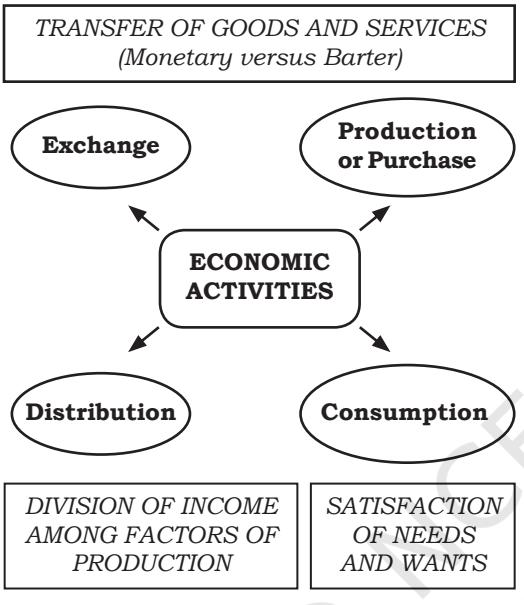
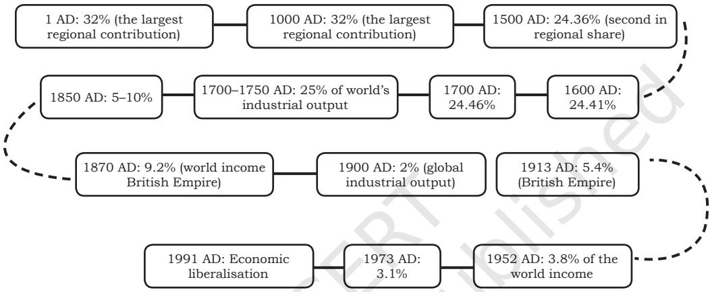
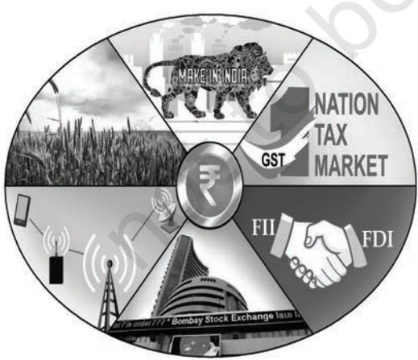
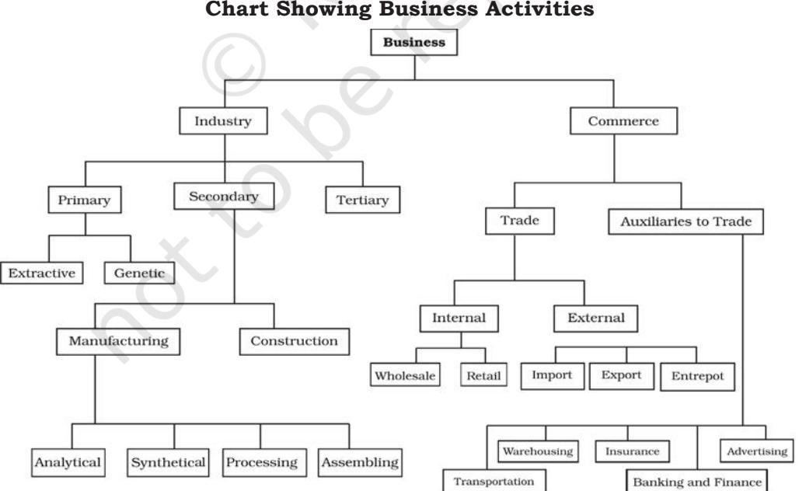

Part I

# **Foundations of Business**

Chapter 1 .indd 1 13-01-2021 09:40:02

Chapter 1

# **Business, Trade and Commerce**

# **LEARNING OBJECTIVES**

After studying this chapter, the learner:

- i. Appreciates the contribution of business activities in the growth and development of an economy;
- ii. Discusses the concept and objectives of business;
- iii. Categorises business activities into occupation, profession, and employment
- iv. Classifies industry in different types;
- v. Explains Risk and Profit as a reward of Risk; and
- vi. Enumerates factors for starting a business.

Chapter 1 .indd 2 13-01-2021 09:40:02

Imran, Manpreet, Joseph and Priyanka have been classmates in Class X. After their exams are over, they happen to meet at a common friend Ruchita's house. Just when they were sharing their experiences of examination days, Ruchika's father Raghuraj Chaudhary intervenes and asks about their well-being. He also enquires about their career plans. But none of them had a definite reply. Raghuraj who himself is a successful businessman tells them about business as a career opportunity. Joseph gets excited by the idea and says "yes, business is really good for making lots of money". Raghuraj tells them that 'there is a lot more to business than merely money'. Business activities lead to growth and development of any country, he added. He further tells them that the roots of business activities can be traced back to ancient times and how trading helps in the prosperity of the Indian subcontinent. Priyanka said that they have read about the Silk Route in their history textbooks. Raghuraj then gets busy with his day-to-day tasks. However, the four classmates begin raising questions. The conversation of the four classmates focused on how trading activities were conducted during ancient times. How far can the roots of trading activities be traced? Why was the Indian subcontinent referred to as *'Swaran Bharat and Swaran Dweep'* by the then travellers to India? What made Columbus and Vasco da Gama undertake journeys to locate India? They decided to meet the commerce teacher of their school to find out answers to many such questions about the development, nature and purpose of business.

### **1.1 Introduction**

All human beings, wherever they may be, require different types of goods and services to satisfy their needs. If we look around, we observe people require different types of products and services to satisfy their needs. How do they buy them? They go to the market, either physical or electronic over internet, where they find variety of shops and sellers offering the required commodities and choose the best which they require.

Have you ever wondered how do these products and services are made available in the market. The necessity of supplying goods and services is done by different set of people engaged in various economic activities such as production, manufacturing and distribution and exchange so that the needs and wants of customers are satisfied. Business is a major economic activity which is concerned with the production and sale of goods and services required by people. Business is central to our lives. Although our lives are also influenced by many other institutions in modern society, such as schools, colleges, hospitals, political parties and religious bodies; business has a major influence on our daily lives. It, therefore, becomes important that we understand the concept, nature and purpose of business.

Business starts with production and end with consumption. Making the finished products reach the consumer involves a series of steps. The work of production of goods is covered under

Chapter 1 .indd 3 13-01-2021 09:40:02

Industry and the remaining activities belong to commerce. In a nutshell we call them 'Business' which is a wider term and includes Industry, trade and commerce.

# **1.1.1 Ro le o f Bus iness in the Development of Economy**

Business which includes trade and commerce have played a vital role since times memorial. You have studied in your earlier classes that our country, India, had a golden past and the trading activities had a significant contribution to its prosperity and gains. The archaeological evidences have shown that trading activities were the mainstay of the economy in ancient times which were carried out by both water and land routes. Silk route and maritime trade were quite prominent in transporting goods and commodities for trading purposes.

The goods were traded both internally and to the foreign lands, which generated surplus income. As a result, the people were engaged in various economic activities such as agriculture and domestication of animals, weaving cotton, dyeing fabrics, making clay pots, utensils and handicrafts, sculpting, cottage industries, masonry, etc. Family based workshops [*karkhanas*], for manufacturing, were important components of economic life. This money was channelised into further investment, and led to the dominant growth of indigenous banking system to finance the trading activities.

An example of it is the use of age old *Hundi* and *Chitties* (used in southern region). These were used as documents to facilitate transfer of money from one hand to another for trading activities. As an instrument of exchange it involved a contract which — (i) warrant the payment of money, the promise or order which is unconditional (ii) capable of change through transfer by valid negotiation.

Why there was a need to create an intangible form of exchange of money. It was so because travelling long distances either by land or sea involved risk of theft and robbery. *Hundi* which literally means *'to collect'* was written in vernacular language and facilitated the safe transfer of money between parties and helped promotion of trading activities.

The emergence of credit transactions and availability of loans and advances enhanced commercial operations. The

Chapter 1 .indd 4 13-01-2021 09:40:02

|  |  | Hundi as practised by Indian Merchant Communities |
| --- | --- | --- |
| Dhani-jog | Darshani | Payable to any person—no liability over who |
|  |  | received payment. |
| Sah-jog | Darshani | Payable to a specific person, someone |
|  |  | 'respectable'. Liability over who received payment. |
| Firman-jog | Darshani | Hundi made payable to order. |
| Dekhan-har | Darshani | Payable to the presenter or bearer. |
| Dhani-jog | Muddati | Payable to any person—no liability over who |
|  |  | received payment, but payment over a fixed term. |
| Firman-jog | Muddati | Hundi made payable to order following a fixed |
|  |  | term. |
| Jokhmi | Muddati | Drawn against dispatched goods. If goods lost in |
|  |  | transit, the drawer or holder bears the coasts, |
|  |  | and the Drawee carries no liability. |

Indian subcontinent enjoyed the fruits of favourable balance of trade, where exports exceeded imports with large margins and the indigenous banking system benefitted the manufacturers, traders and merchants with additional capital funds for expansion and development. Commercial and Industrial banks later evolved to finance trade and commerce and agricultural banks to provide both short and long-term loans to finance agriculturists.

Many leading trade centres were developed in ancient times for the import and export of goods, some of them being Patliputra, Peshawar, Taxila, Indraprastha, Mithila, Maduram, Surat, Ujjain, Kanchi, Mithila. Major exports items were Spices, wheat, sugar, indigo, opium, sesame oil, cotton, parrot, live animals and animal products, etc. Major imports were Horses, animal products, Chinese silks, linen, wine, gold, silver, copper, etc. There were all kinds of towns port towns, manufacturing towns, mercantile towns, the sacred centres, and pilgrimage towns. Their existence is an index of prosperity of merchant communities and professional classes.

Business activities led to the growth of different aids to trade such as transportation, banking, finance and communication which grew the prospects of trading activities. With the active contribution of Indian traders and other merchant communities, the Indian sub-continent was popularly called '*Swaran Bhoomi and Swaran Deep*' in the writings of many travellers, such as Megasthenes, Faxian (FaHien),

Chapter 1 .indd 5 13-01-2021 09:40:02

Xuanzang (Huen Tsang), Al Beruni (11th century), IbnBatuta (11th century), Frenchman Francois (17th century) and others. They repeatedly refer to the prosperity of the country.

Between the 1st and the 7th centuries CE, India is estimated to have the largest economy of the ancient and medieval world, controlling about one-third and one-fourth of the world's wealth (timeline).

*Source: Angus Maddison (2001 and 2003), The World Economy: A Millennial Perspective, OECD, Paris; Angus Maddison, The World Economy, Historical Statistics*

#### **Major Trade Centres in ancient times**

- 1. *Pataliputra:* Known as Patna today. It was not only a commercial town, but also a major centre for export of stones.
- 2. *Peshawar:* It was an important exporting centre for wool and for the import of horses. It had a huge share in commercial transactions between India, China and Rome in the first century A.D.
- 3. *Taxila:* It served as a major centre on the important land route between India and Central Asia. It was also a city of financial and commercial banks. The city occupied an important place as a Buddhist centre of learning. The famous Taxila University flourished here.
- 4. *Indraprastha:* It was the commercial junction on the royal road where most routes leading to the east, west, south and north converged.
- 5. *Mathura:* It was an emporium of trade and people here subsisted on commerce. Many routes from South India touched Mathura and Broach.
- 6. *Varanasi:* It was well placed as it lay both on the Gangetic route and on the highway that linked North with the East. It grew as a major centre of textile industry and became famous for beautiful gold silk cloth and sandalwood workmanship. It had links with Taxila and Bharuch.

Chapter 1 .indd 6 13-01-2021 09:40:02

- 7. *Mithila:* The traders of Mithila crossed the seas by boats, through the Bay of Bengal to the South China Sea, and traded at ports on the islands of Java, Sumatra and Borneo. Mithila established trading colonies in South China, especially in Yunnan.
- 8. *Ujjain:* Agate, carnelian, muslin and mallow cloth were exported from Ujjain to different centres. It also had trade relations through the land route with Taxila and Peshawar.
- 9. *Surat:* It was the emporium of western trade during the Mughal period. Textiles of Surat were famous for their gold borders (zari). It is noteworthy that Surat *hundi* was honoured in far off markets of Egypt and Iran.
- 10. *Kanchi:* Today known as Kanchipuram, it was here that the Chinese used to come in foreign ships to purchase pearls, glass and rare stones and in return they sold gold and silk.
- 11. *Madura:* It was the capital of the Pandayas who controlled the pearl fisheries of the Gulf of Mannar. It attracted foreign merchants, particularly Romans, for carrying out overseas trade.
- 12. *Broach:* It was the greatest seat of commerce in Western India. It was situated on the banks of river Narmada and was linked with all important marts by roadways.
- 13. *Kaveripatta:* Also known as Kaveripatnam, it was scientific in its construction as a city and provided loading, unloading and strong facilities of merchandise. Foreign traders had their headquarters in this city. It was a convenient place for trade with Malaysia, Indonesia, China and the Far East. It was the centre of trade for perfumes, cosmetics, scents, silk, wool, cotton, corals, pearls, gold and precious stones; and also for ship building.
- 14. *Tamralipti:* It was one of the greatest ports connected both by sea and land with the West and the Far East. It was linked by road to Banaras and Taxila.

With the emergence of the British Empireroots in India the east india company used revenues generated by the provinces under its rule for purchasing Indian raw materials, spices and goods. This changed the condition of the Indian economy from being an exporter of processed goods to the exporter of raw materials and buyer of manufactured goods.

After independence the process of rebuilding the economy started and India embarked on planned development with the objective of achieving a self-reliant socialistic pattern of society. The measures taken towards the same was characterised by centralised economic planning and emphasis on public investment in basic and key industries.

Due importance was given to the establishment of modern industries, modern technological and scientific institutes, space and nuclear programmes. But lack of capital formation, rise in population,

Chapter 1 .indd 7 13-01-2021 09:40:02

weak financial system, inadequate infrastructure and high huge expenditure on defence, high fiscal deficits and continuous deficits in balance of payments were evident and international community's confidence in India's ability to manage its economy was severely affected. The balance of payment situation was precarious. As a result, India agreed to economic liberalisation in 1991.

A three pronged approach of stabilisation, restructuring and globalisation of Indian economy was adopted to address the changes in economic and business scenario and its integration with global economy. Government of India announced major economic reform packages aimed at restoring the growth momentum in the economy. Major policy changes were effected since 1991 w.r.t., fiscal, monetary, trade, industry, agriculture, infrastructure, foreign exchange and foreign investment since 1991. **1.2 Concept of Business**

The Indian economy is emerging as one of the faster growing economies in the world today and a preferred FDI destination. Rising incomes, savings, investment opportunities, increased domestic consumption and younger population ensures growth for decades to come. The high growth sectors have been identified, which are likely to grow at a rapid pace and the recent initiatives of the Government of India such as 'Make in India', Skill India', 'Digital India' is expected to help the economy in terms of exports and imports with steady and sustainable trade balance.

#### **Activity**

Did you notice how business plays a major role in the growth and development of any nation and why business is regarded as a backbone of the Economy? Discuss in class.

The term business is derived from the word 'busy'. Thus, business means being busy. However, in a specific sense, business refers to an occupation in which people regularly engage in activities related to purchase, production and/or sale of goods and services with a view to earning profits.

If you look around you will observe that people undertake various activities to satisfy their needs. These activities may be broadly classified into two groups — economic and non-economic activities. Economic activities are those by which we can earn our livelihood, whereas, non-economic

Chapter 1 .indd 8 13-01-2021 09:40:07

activities are performed out of love, sympathy, sentiment, patriotism, etc. For example, a worker working in a factory, a doctor operating in his clinic, a manager working in an office and a teacher teaching in a school are doing so to earn their livelihoods and are, therefore, engaged in an economic activity. On the other hand, a housewife cooking food for her family, or a boy helping an old man cross the road are performing non-economic activities since they are doing so out of love or sympathy.

Economic activities may be further divided into three categories, namely business, profession and employment. Business may be defined as an economic activity involving the production and sale of goods and services undertaken with a motive of earning profit by satisfying human needs in society.

#### **Activity**

Barter system is an old method of exchange of goods and/or services for another set of goods and/or services. Is barter system an economic activity? Give reasons for your answer.

### **Try it yourself:**

State whether each of the following is an economic activity or not. Give reasons for your answer.

- 1. Health worker treating her patient.
- 2. Store owner sympathies with a needy elderly person and gives medicines for his ailment.
- 3. Football coach giving training in football to his daughter for forthcoming match.
- 4. Services of a housewife doing household chores at home.
- 5. Donation made by a business house towards community kitchen run by an NGO for providing food, medicines to underprivileged people and migrant workers of the society during Covid 19 pandemic.

# **1.2.1 Characteristics of Business Activities**

In order to appreciate how business activity is different from other activities in society, the nature of business or its fundamental character must be explained in terms of its distinguishing characteristics, which are as follows:

- **(i) An economic activity:** Business is considered to be an economic activity because it is undertaken with the objective of earning money or livelihood and not out of love, affection, sympathy or any other emotion. It may be mentioned here that this
Chapter 1 .indd 9 13-01-2021 09:40:07

activity can be undertaken either on small and individual level, e.g. (purchase and sale by a shopkeeper) or on large scale in a more formal and organised level (purchase and sale by a cooperative society or company).

- **(ii) Production or procurement of goods and services:** Before goods are offered to people for consumption, these must be either produced or procured by business enterprises. Thus, every business enterprise either manufactures the goods it deals in or acquires them from producers, to be further sold to consumers or users. Goods may consist of consumable items of daily use, such as sugar, ghee, pen, notebook, etc., or capital goods, like machinery, furniture, etc. Services may include facilities offered to consumers, business firms and organisations in the form of transportation, banking, electricity, etc.
- **(iii) Sale or exchange of goods and services:** Directly or indirectly, business involves transfer or exchange of goods and services for value. If goods are produced not for the purpose of sale but for personal consumption, it cannot be called a business activity. Cooking food at home for the family is not business, but cooking food and selling it to others in a restaurant is business. Thus, one essential

characteristic of business is that there should be sale or exchange of goods or services between the seller and the buyer.

- **(iv) Dealings in goods and services on a regular basis:** Business involves dealings in goods or services on a regular basis. One single transaction of sale or purchase, therefore, does not constitute business. Thus, for example, if a person sells his/ her domestic radio set even at a profit, it will not be considered a business activity. But if he/she sells radio sets regularly either through a shop or from his/her residence, it will be regarded as a business activity.
- **(v) Profit earning:** One of the main purpose of business is to earn income by way of profit. No business can survive for long without profit. That is why, businessmen make all possible efforts to maximise profits, by increasing the volume of sales or reducing costs.
- **(vi) Uncertainty of return:** Uncertainty of return refers to the lack of knowledge relating to the amount of money that the business is going to earn in a given period. Every business invests money (capital) to run its activities with the objective of earning profit. But it is not certain as to what amount of profit will be earned. Also, there is always a possibility of losses being incurred, despite

Chapter 1 .indd 10 13-01-2021 09:40:07

the best efforts put into the business.

- **(vii) Element of risk:** Risk is the uncertainty associated with an exposure to loss. It is caused by some unfavourable or undesirable event. Risks are related with factors, like changes in consumer taste and fashion, changes in method of production, strike or lockout at workplace, increased competition in market, fire, theft,
accidents, natural calamities, etc. No business can altogether do away with risks.

# **1.2.3 Comparison of Business, Profession and Employment**

As has been mentioned earlier, economic activities may be divided into three major categories viz., Business, Profession and Employment. The difference between these three terms is given in figure 1.2.

| Basic | Business | Profession | Employment |
| --- | --- | --- | --- |
| 1. Mode of | Entrepreneur's | Membership of a | Appointment |
| establishment | decision and other | professional body | letter and service |
|  | legal formalities, if | and certificate of | agreement |
|  | necessary | practice |  |
| 2. Nature of work | Provision of | Rendering of | Performing work as |
|  | goods and | personalised, | per service contract |
|  | services to the | expert services | or rules of service |
|  | public |  |  |
| 3. Qualification | No minimum | Qualifications, | Qualification |
|  | qualification is | expertise and | and training as |
|  | necessary | training in specific | prescribed by the |
|  |  | field as prescribed | employer |
|  |  | by the professional |  |
|  |  | body is a must |  |
| 4. Reward or | Profit earned | Professional fee | Salary or wages |
| return |  |  |  |
| 5. Capital | Capital | Limited capital | No capital required |
| investment | investment | needed for |  |
|  | required as per | establishment |  |
|  | size and nature |  |  |
|  | of business |  |  |
| 6. Risk | Profits are uncertain | Fee is generally | Fixed and regular |
|  | and irregular; risk is | regular and | pay; no or little risk |
|  | present | certain; some risk |  |

Chapter 1 .indd 11 13-01-2021 09:40:07

| 7. Transfer of | Transfer | Not possible | Not possible |
| --- | --- | --- | --- |
| interest | possible with |  |  |
|  | some formalities |  |  |
| 8. Code of | No code of | Professional code | Norms of behaviour |
| conduct | conduct is | of conduct is to be | laid down by the |
|  | prescribed | followed | employer are to |
|  |  |  | be followed |
| 9. Example | Shop, factory | Legal, medical | Jobs in banks, |
|  |  | profession, | insurance |
|  |  | chartered | companies, |
|  |  | accountancy | government |
|  |  |  | departments |

# **1.3 Classification of Business Activities**

Various business activities may be classified into two broad categories —industry and commerce. Industry is concerned with the production or processing of goods and materials. Commerce includes all those activities, which are necessary for facilitating the exchange of goods and services. On the basis of these two categories, we may classify business firms into industrial and commercial enterprises. Let us examine in detail the activities relating to business.

# **1.3.1 Industry**

Industry refers to economic activities, which are connected with conversion of resources into useful goods. Generally, the term industry is used for activities in which mechanical appliances and technical skills are involved. These include activities relating to producing or processing of goods, as well as, breeding and raising of animals. The term industry is also used to mean groups of firms producing similar or related goods. For example, cotton textile industry refers to all manufacturing units producing textile goods from cotton. Similarly, electronic industry would include all firms producing electronic goods, and so on. Further, in common parlance, certain services, like banking and insurance, are also referred to as industry, say banking industry, insurance industry, etc. Industries may be divided into three broad categories namely primary, secondary and tertiary.

- **(i) Primary industries:** These include all those activities which are concerned with the extraction and production of natural resources and reproduction and development of living organisms, plants, etc. These are divided as follows.
	- **(a) Extractive industries:** These industries extract

Chapter 1 .indd 12 13-01-2021 09:40:07

or draw products from natural sources. Extractive industries supply some basic raw materials that are mostly products of geographical or natural environment. Products of these industries are usually transformed into many other useful goods by manufacturing industries. I m p o r t a n t e x t r a c t i v e industries include farming, mining, lumbering, hunting and fishing operations.

- **(b) Genetic industries:** These industries are engaged in breeding plants and animals for their use in further reproduction. Seeds and nursery companies are typical examples of genetic industries. In additional, activities of cattle breeding farms, poultry farms, and fish hatchery come under genetic industries.
- **(ii) Secondary industries:** These are concerned with using materials, which have already been extracted at the primary sector. These industries process such materials to produce goods for final consumption or for further processing by other industrial units. For example, mining of iron ore is a primary industry, but manufacturing of steel by way of further processing of raw irons is a secondary industry. Secondary industries may be further divided as follows:

#### **(a) Manufacturing industries:**

These industries are engaged in producing goods through processing of raw materials and, thus, creating form utilities. They bring out diverse finished products, that we consume, or use through the conversion of raw materials or partly finished materials in their manufacturing operations. Manufacturing industries may be further divided into four categories on the basis of method of operation for production.

- Analytical industry which analyses and separates different elements from the same materials, as in the case of oil refinery.
- Synthetical industry which combines various ingredients into a new product, as in the case of cement.
- Processing industry which involves successive stages for manufacturing finished products, as in the case of sugar and paper.
- Assembling industry which assembles different component parts to make a new product, as in the case of television, car, computer, etc.
- **(b) Construction industries:**  These industries are involved

Chapter 1 .indd 13 13-01-2021 09:40:07

in the construction of buildings, dams, bridges, roads as well as tunnels and canals. Engineering and architectural skills are an important part in construction industries.

- **(iii) Tertiary industries:** These are concerned with providing support services to primary and secondary industries as well as activities relating to trade. These industries provide service facilities. As business activities, these may be considered part of commerce because as auxiliaries to trade these activities assist trade. Included in this category are transport, banking, insurance, warehousing, communication, packaging and advertising.
#### **1.3.2 Commerce**

Commerce includes two types of activities, viz., (i) trade and (ii) auxiliaries to trade. Buying and selling of goods is termed as trade. But there are a lot of activities that are required to facilitate the purchase and sale of goods. These are called services or auxiliaries to trade and include transport, banking, insurance, communication, advertisement, packaging and warehousing. Commerce, therefore, includes both, buying and selling of goods, i.e., trade, as well as, auxiliaries, such as transport, banking, etc.

Commerce provides the necessary link between producers and consumers. It embraces all those activities, which are necessary for maintaining a free flow of goods and

Chapter 1 .indd 14 13-01-2021 09:40:07

services. Thus, all activities involving the removal of hindrances in the process of exchange are included in commerce. The hindrances may be in respect of persons, place, time, risk, finance, etc. The hindrance of persons is removed by trade, thereby, making goods available to consumers from the possession or ownership producers. Transport removes the hindrances of place by moving goods from the place of production to the markets for sale. Storage and warehousing activities remove the hindrance of time by facilitating holding of stocks of goods to be sold as and when required. Goods held in stock, as well as, goods in course of transport are subject to a risk of loss or damage due to theft, fire, accidents, etc. Protection against these risks is provided by insurance of goods. Capital required to undertake the above activities is provided by banking and financing institutions. Advertising makes it possible for producers and traders to inform consumers about the goods and services available in the market. Hence, commerce is said to consist of activities of removing the hindrances of persons, place, time, risk, finance and information in the process of exchange of goods and services.

# **1.3.3 Trade and Auxiliaries to Trade**

Trade is an essential part of commerce. It refers to sale, transfer or exchange of goods either physical or virtual. It helps in making the goods produced available to the consumers or users. These days' goods are produced on a large scale and it is difficult for producers to themselves reach out to individual buyers for selling their products. Businessmen are engaged in trading activities to make the goods available to consumers in different markets. In the absence of trade, it would not be possible to undertake production activities on a large scale.

Activities which are meant for assisting trade are known as auxiliaries to trade. These activities are generally referred to as services because these are in the nature of facilitating the activities relating to industry and trade. Transport, banking, insurance, warehousing, and advertising are regarded as auxiliaries to trade, i.e., activities playing a supportive role. In fact, these activities support not only trade, but also industry and, hence, the entire business activity. Auxiliaries are an integral part of commerce in particular and business activity in general. These activities help in removing various hindrances which arise in connection with the production and distribution of goods. Transport facilitates movement of goods from one place to another. Banking provides financial assistance to the manufacturer and trader. Insurance covers various kinds of business risks. Warehousing creates time utility by way of storage facilities. Advertising provides information to the consumers. In other words, these activities facilitate movement, storage, financing, risk coverage and sales promotion of goods. Auxiliaries to trade are briefly discussed below:

Chapter 1 .indd 15 13-01-2021 09:40:07

- **(i) Transport and Communication:**  Production of goods generally takes place in particular locations. For instance, tea is mainly produced in Assam; cotton in Gujarat and Maharashtra; jute in West Bengal and Odisha; sugar in U.P., Bihar and Maharashtra and so on. But these goods are required for consumption in different parts of the country. The obstacle of place is removed by transport through road, rail or coastal shipping. Transport facilitates movement of raw material, to the place of production and the finished products from factories to the place of consumption. Along with transport facility, there is also a need for communication facilities so that producers, traders and consumers may exchange information with one another. Thus, postal services and telephone facilities may also be regarded as auxiliaries to business activities.
- **(ii) Banking and Finance:** Business activities cannot be undertaken unless funds are available for acquiring assets, purchasing raw materials and meeting other expenses. Necessary funds can be obtained by businessmen from a bank. Thus, banking helps business activities to overcome the problem of finance. Commercial banks, generally lend money by providing overdraft and cash credit facilities, loans and advances. Banks also

undertake collection of cheques, remittance of funds to different places, and discounting of bills on behalf of traders. In foreign trade, commercial banks help exporters in collecting money from importers. Commercial banks also help promoters of companies to raise capital from the public.

- **(iii) Insurance:** Business involves various types of risks. Factory building, machinery, furniture, etc., must be protected against fire, theft and other risks. Material and goods help in stock or in transit are subject to the risk of loss or damage. Employees are also required to be protected against the risks of accident and occupational hazards. Insurance provides protection in all such cases. On payment of a nominal premium, the amount of loss or damage and compensation for injury, if any, can be recovered from the insurance company.
- **(iv) Warehousing:** Usually, goods are not sold or consumed immediately after production. They are held in stock to make them available as and when required. Special arrangement must be made for the storage of goods to prevent loss or damage. Warehousing helps business firms to overcome the problem of storage and facilitates the availability of goods when needed. Prices are, thereby, maintained at a reasonable level

Chapter 1 .indd 16 13-01-2021 09:40:07

through continuous supply of goods.

- **(v) A d v e r t i s i n g a n d P u b l i c Relations:** There is an old saying "Advertising is what you pay for and PR is what you pray for". Both advertisement and PR activities are the tools to commerce, influence and promote your product, services or an idea to you potential customers and motivate you target customers to recognise your accomplishments.
 Advertising and public relation activities are one of the most important methods of promoting the sale of products and services in a market place. It is practically impossible for producers and traders to contact each and every customer. Thus, for promoting sales, information in made available through advertisements and publicity tools about their features, price, etc., to the potential customers. Also, there is a need to persuade potential customer's and buyers about the utility featuress, quality, price, competitive information about the goods and services, etc. The publicity of such attributes of products and services are done using various techniques of maintaining public relation tools. The popular PR tool is the use of press release in print and social media platforms. Advertising and Public Relations activities helps in providing information about available goods and services and inducing customers to buy particular items. Advertisements are always a paid activity where business occupies space in print or non-print media to promote its product or a service. PR activities, on the other hand, are normally unpaid where business enters into a strategic communication to build a mutually beneficial relationship.

# **1.4 Objectives of Business**

An objective is the starting point of business. Every business is directed to the achievement of certain objectives. Objectives refer to all that the business people want to get in return for what they do. It is generally believed that business activity is carried out only for profit. Business persons themselves proclaim that their primary objective is produce or distribute goods or services for profit. Every business is said to be an attempt on the part of business people to get more than what has been spent or invested, or in other words, to earn profit which is the excess of revenue over cost. However, it is being increasingly realised nowadays that business enterprises are part of the society and need to fulfil several objectives, including social responsibility, to survive and prosper in the long run. Profit is found to be a leading objective but not the only one.

Although earning profit cannot be the only objective of business, its

Chapter 1 .indd 17 13-01-2021 09:40:08

importance cannot be ignored. Every business is an attempt to reap more than what has been invested, and profit is the excess of revenue over cost. Profit may be regarded as an essential objective of business for various reasons: (i) it is a source of income for business persons, (ii) it can be a source of finance for meeting expansion requirements of business, (iii) it indicates the efficient working of business, (iv) it can be taken as the society's approval of the utility of business, and (v) it builds the reputation of a business enterprise.

However, too much emphasis on profit to the exclusion of other objectives can be dangerous for good business. Obsessed with profit, business managers may neglect all other responsibilities towards customers, employees, investors and society at large. They may even be inclined to exploit various sections of society to earn immediate profit. This may result in the non-cooperation or even opposition from the affected people against the malpractices of business enterprises. The enterprises might lose business and may be unable to earn profit. This is essential for its own survival and prosperity.

# **Activity**

When a business person conceptualises and starts a business; runs it, scales it up then why 'maximising business profit is not a sole objective of business? Discuss in your class. Give reasons.

# **1.5 Objectives of Business**

Objectives are needed in every area that influences the survival and prosperity of business. Since a business has to balance a number of needs and goals, it requires multiple objectives. It cannot follow only one objective and expect to achieve excellence. Objectives have to be specific in every area and sphere of business. Objectives also enable the business to analyse their own performance and take steps as necessary to improve their performance in future. Some of these areas are described as follows.

- **(i) Market standing:** Marinating goodwill and reputation of ones' business is paramount to succeed and prosper. It helps in forming a distinct identity in the market and is referred to as market standing in relation to its competitors. A business enterprise must aim at standing on stronger footing in terms of offering competitive products at reasonable prices to its customers and serving them to their satisfaction.
- **(ii) Innovation:** Innovation is central to the growth of any business enterprise. It helps business to scale up and give competitive edge to the enterprise in the market. Innovation is defined as an introduction of new ideas or methods in the way something is done or made. However, it does not imply that a new product is to be manufactured. Any

Chapter 1 .indd 18 13-01-2021 09:40:08

modification in the existing product to enhance its operation also denotes innovativeness. There are two kinds of innovation in every business, i.e., (i) innovation in product or services; and (ii) innovation in various skills and activities needed to supply products and services. No business enterprise can flourish in a competitive world without innovation. Therefore, innovation becomes an important objective.

- **(iii) Productivity:** Productivity is ascertained by comparing the value of output with the value of inputs. It is used as a measure of efficiency. In order to ensure continuous survival and progress, every enterprise must aim at greater productivity through the best use of available resources.
- **(iv) P h y s i c a l a n d f i n a n c i a l resources:** Any business requires physical resources, like plants, machines, offices, etc., and financial resources, i.e., funds to be able to produce and supply goods and services to its customers. The business enterprise must aim at acquiring these resources according to their requirements and use them efficiently.
- **(v) Earning profits:** One of the objectives of business is to earn profits on the capital employed. Profitability refers to profit in relation to capital investment. Every business must earn a reasonable profit which is so

important for its survival and growth.

- **(vi) Social responsibility:** Social responsibility refers to the obligation of business firms to contribute resources for solving social problems and work in a socially desirable manner.
# **1.6 Business Risk**

The term 'business risk' refers to the possibility of inadequate profits or even losses due to uncertainties or unexpected events. For example, demand for a particular product may decline due to change in tastes and preferences of consumers or due to increased competition from other producers. Lower demand results in long sales and profits. In another situation, the shortage of raw materials in the market may shoot up its price. The firm using these raw materials will have to pay more for buying them. As a result, cost of production may increase which, in turn, may reduce profits.

Business enterprises constantly face two types of risk: speculative and pure. Speculative risks involve both the possibility of gain, as well as, the possibility of loss. Speculative risks arise due to changes in market conditions, including fluctuations in demand and supply, changes in prices or changes in fashion and tastes of customers. Favourable market conditions are likely to result in gains, whereas, unfavourable ones may result in losses. Pure risks involve only the possibility of loss or

Chapter 1 .indd 19 13-01-2021 09:40:08

no loss. The chance of fire, theft or strike are examples of pure risks. Their occurrence may result in loss, whereas, non-occurrence may explain absence of loss, instead of gain.

# **1.6.1 Nature of Business Risks**

Nature of business risks can be understood in terms of their peculiar characteristics:

- **(i) Risk is an essential part of every business:** Every business has some risk. No business can avoid risk, although the amount of risk may vary from business to business. Risk can be minimised, but cannot be eliminated.
- **(ii) Business risks arise due to uncertainties:** Uncertainty refers to the lack of knowledge about what is going to happen in future. Natural calamities, change in demand and prices, changes in government policies and prices, improvement in technology, etc., are some of the examples of uncertainty which create risks for business because the outcomes of these future events are not known.
- **(iii) Degree of risk depends mainly upon the nature and size of business:** Nature of business (i.e., type of goods and services produced and sold) and size of business (i.e., volume of production and sale) are the main factors which determine the amount of risk in a business.

For example, a business dealing in fashionable items has a high degree of risk. Similarly, a largescale business generally has a higher risk than what a small scale has.

- **(iv) Profit is the reward for risk taking:** 'No risk, no gain' is an age-old principle which applies to all types of business. Greater the risk involved in a business, higher is the chance of profit. An entrepreneur undertakes risks under the expectation of higher profit. Profit is thus the reward for risk taking.
# **1.6.2 Cause of Business Risks**

Business risks arise due to a variety of causes, which are classified as follows:

- **(i) Natural causes:** Human beings have little control over natural calamities, like flood, earthquake, lightning, heavy rains, famine, etc., property and income in business.
- **(ii) Human causes:** Human causes include such unexpected events, like dishonesty, carelessness or negligence of employees, stoppage of work due to power failure, strikes, riots, management inefficiency, etc.
- **(iii) Economic causes:** These include uncertainties relating to demand for goods, competition, price, collection of dues from customers, change of technology or method of production, etc.

Chapter 1 .indd 20 13-01-2021 09:40:08

Financial problems, like rise in interest rate for borrowing, levy of higher taxes, etc., also come under these type of causes as they result in higher unexpected cost of operation or business.

- **(iv) Other causes:** These are unforeseen events, like political disturbances, mechanical failures, such as the bursting of boiler, fluctuations in exchange rates, etc., which lead to the possibility of business risks.
# **1.7 Starting a Business — Basic Factors**

Starting a business enterprise is similar to any other human effort in which resources are employed to achieve certain objectives. The process of setting up one's own business is called entrepreneurship. The person who set-up his business is called an entrepreneur. The output of the process, that is, the business unit is called a business enterprise. It is interesting to note that entrepreneurship besides providing self-employment to the entrepreneur is responsible to a great extent for creation and expansion of opportunities for the other two economic activities too that is, employment and profession. And, in the process, business entrepreneurship becomes crucial for overall economic development of a nation.

When you make this choice, you become a job-provider rather than a jobseeker, besides enjoying a host of other financial and psychological rewards. Taking to entrepreneurship by starting one's own business is a matter of aspiring to become an entrepreneur. It is defined as 'a systematic, purposeful and creative activity of identifying a need, mobilising resources and organising production with a view to delivering value to the customers, returns for the investors and profits for the self in accordance with the risks and uncertainties associated with business'. This definition points to factors need to be considered for starting the business. Starting and managing one's business does not emerge spontaneously. Rather, it is the outcome of interaction between a person and business environment. The choice of being an entrepreneur lies with an individual. In this regard, it becomes imperative to look at both factors in the environment, as well as, factors in the individual's perception of desirability and feasibility.

- **(i) Selection of type of business:**  The first thing to be decided by an entrepreneur is the nature and type of business to be undertaken. He/she will obviously like to enter that branch of industry and commerce, which has the possibility of greater amount of profits. The decision will be influenced by the customer requirements in the market and also the kind of technical knowledge and interest the entrepreneur has for producing a particular product.
Chapter 1 .indd 21 13-01-2021 09:40:08

- **(ii) Size of business:** Size of the firm or scale of its operation is another important decision to be taken at the start of the business. Whether the business is for MSME sector or a large scale enterprise. Whether it will operate for manufacturing or tertiary sector. Some factors favour a large size, whereas, others tend to restrict the scale of operation. If the entrepreneur is confident that the demand for the proposed product is likely to be good over time and he/she can arrange the necessary capital for business, he/she can start the operation at a large scale.
- **(iii) Location of business enterprise:**  An important factor to be considered at the start of the business is the place where the enterprise will be located. Any mistake in this regard can result in high cost of production, inconvenience in getting, right kind of production inputs or serving the customers in the best possible way. Availability of raw materials and labour; power supply and services, like banking, transportation, communication, warehousing, etc., are important factors while making a choice of location.
- **(iv) Financing the proposition:**  Financing is concerned with p r o v i d i n g t h e n e c e s s a r y capital for starting, as well as, for continuing the proposed

business. Capital is required for investment in fixed assets, like land, building, machinery and equipment and in current assets, like raw materials, books, debts, stock of finished goods, etc. Capital is also required for meeting day-to-day expenses.

- **(v) Physical facilities:** Availability of physical facilities, including machines and equipment, building and supportive services is an important factor to be considered at the start of the business. The decision relating to this factor will depend on the nature and size of business, availability of funds and the process of production.
- **(vi) Competent and committed worked force:** Every enterprise needs competent and committed workforce to perform various activities so that physical and financial resources are converted into desired outputs. Since no individual entrepreneur can do everything himself, he/she must identify the requirement of skilled and unskilled workers and managerial staff. Plans should also be made about how the employees will be trained and motivated to give their best performance.
- **(vii) Tax planning:** Tax planning has become necessary these days because there are a number of tax laws in the country and they influence almost every aspect

Chapter 1 .indd 22 13-01-2021 09:40:08

of the functioning of modern business. The entrepreneur has to consider in advance the tax liability under various tax laws and its impact on business decisions.

- **(viii)Launching the enterprise:** After the decisions relating to the above mentioned factors have been taken, the entrepreneur can go ahead with actual launching of the enterprise which would mean mobilising various
resources, fulfilling necessary legal formalities, starting the production process and initiating the sales promotion campaign. A business enterprise can be a sole proprietor firm, a partnership firm or a company for which proper financial planning must be done to determine (a) the requirement of capital, (b) source from where the capital will be raised and (c) the best ways of utilising the capital in the firm.

#### **EXERCISES**

#### **Short Answer Questions**

- 1. Why is business considered as economic activity?
- 2. How does business contribute to the economic development of a country?
- 3. State the different types of economic activities.
- 4. State the meaning of business.
- 5. How would you classify business activities?
- 6. What are the various types of industries?
- 7. Explain any two business activities which are auxiliaries to trade.
- 8. What is the role of profit in business?
- 9. What is meant by business risk?
- 10. State the causes of risks involved in business?

#### **Long Answer Questions**

- 1. Discuss the development of indigenous banking system in Indian subcontinent.
- 2. Define business. Describe its important characteristics.
- 3. Compare business with profession and employment.
- 4. Define Industry. Explain various types of industries giving examples.

Chapter 1 .indd 23 13-01-2021 09:40:08

- 5. Describe the activities relating to commerce.
- 6. Explain any five objectives of business.
- 7. Explain the concept of business risk and its causes.
- 8. What factors are to be considered while starting a business? Explain.

#### **Activities**

- 1. Have you ever witnessed any shop or a business getting closed in your locality? Interact with the owner to find out the reasons for its closure or losses incurred. Prepare a project report on the factors to be considered for starting any business.
- *2. 'Make in India' is an initiative launched by the Government of India on 25 September 2014, to encourage national, as well as multinational companies to manufacture their products in India. The major objectives behind the 'Make in India' initiative are job creation and skill enhancement in 25 sectors of the economy.* Collect information on any five such sectors of the economy that *Make in India* focuses on. Find out the amount of investment in these sectors in the past two years. What were the possible reasons that led to an interest of investors in these sectors? Present your report in the following format:

|  | Investment in | Investment in | Investment in |
| --- | --- | --- | --- |
|  | Year I | Year II | Year III |
| Sector |  |  |  |

- 3. Nestled in the beautiful district of Assam is the district of Kamrup. In Kamrup, lies a small, tight knit community village called Sualkuchi. Sualkuchi is known for its silk weavers and the intricate art of silk weaving. There is a part of silk weaving called weft insertion or buta weaving. This requires complete attention, dedication and precision. The slow process is mentally and physically exhausting. It slows down productivity and leads to the workers being unable to take extra work. In this community of the quiet workers lived Dipak Bharali. Born in a simple family, he knew the weaving occupation was going to be his livelihood. The resourceful young man wanted to be a success and achieve something substantial. He purchased a silk weaving loom and started a business with it. The venture was growing and income was quite good. Yet, something bothered Dipak. To expand the business of silk weaving, there was no other option but to keep purchasing more looms. He tried to find other means of investment and progress. The simple minded villagers told him just to increase the number of looms. Dipak
Chapter 1 .indd 24 13-01-2021 09:40:08

was frustrated with their answers and pushed himself to think outside the box. He thought he could make a machine that will automate the process of weft insertion or buta weaving.

- 4. One fine day, Dipak and his brother were reminiscing about their childhood. A good part of their childhood had revolved around creating fun games out of simple objects and ideas. He remembered his brother trying to make an electro-magnet by using some wires and nails. Another game involved placing a safety pin or nail on paper and moved using a magnet below the paper. Like the proverbial light bulb going on in somebody's mind, Dipak's brain was triggered by this memory.
- 5. He knew this was the push he needed to create a solution for his dilemma. Now that he had the idea, he had to create the device. An entrepreneur is one who succeeds despite failing numerous times. After a mind boggling 80 tries, he developed the ideal device '*Chaneki*'. '*Chaneki*' is made of recyclable materials, making not only a useful but an eco-friendly invention. The device made machine to run 40 times faster than manual weft insertion of motifs! Several weavers have now mastered Chaneki and increased output majorly. This difference has allowed productivity and quality to increase, pleasing both the owners and weavers.
- 6. It is always easy to walk the path taken by everybody. The ones who carve their own route and plant flags on unknown territories are the real risk takers and entrepreneurs. Dipak Bharali well deserve of all he has achieved. Small things come in big packages. And sometimes the biggest questions of life are answered in the most simplest of ways. (Based on data at www. nif.org.in)

#### **Answer the Following Questions**

- 1. Which objective of business is discussed in the above case?
- 2. How has the identified objective of business contributed to the growth of business unit? Give reasons.
- 3. Why does business require multiple objectives for its sustainable growth?

Chapter 1 .indd 25 13-01-2021 09:40:08

