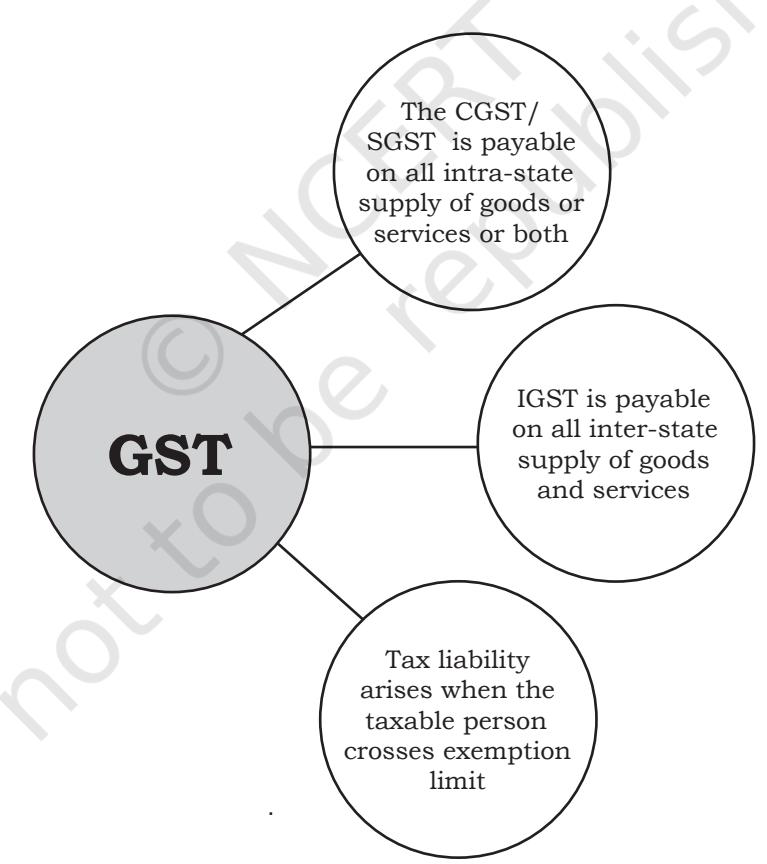

Chapter 10

# Internal Trade

# **LEARNING OBJECTIVES**

After studying this chapter, you should be able to:

- • describe the meaning and types of internal trade;
- • specify the services of wholesalers to manufactures and retailers;
- • explain the services of retailers;
- • classify the types of retailers;
- • explain the forms of small scale and large scale retailers; and
- • state the role of Chambers of Commerce and industry in the promotion of internal trade.
- • officiate the implementation of GST

Chapter 10.indd 215 9/2/2022 2:21:21 PM

Have you ever thought if there were no markets, how products of different manufacturers would reach us? We are all aware of our general provisions store round the corner which is selling items of our daily need. But is that enough? When we need to buy items of a specialised nature, we like to look at bigger markets or shops with variety. Our observation tells us that there are different types of shops selling different items or specialised goods and depending on our requirements we purchase from certain shops or markets. In rural areas, we may have noticed people selling their goods on the streets, these goods may range from vegetables to clothes. This is a completely different scene from what we see in the urban areas. In our country, all kinds of markets co-exist in harmony. With the advent of imported goods and multinational corporations, we have shops selling these products too. In big towns and cities, there are many retail shops selling particular branded products only. Another aspect of all this is, how these products reach the shops from the manufacturers? There must be some middlemen doing this job. Are they really useful or do prices increase because of them?

## **10.1 Introduction**

Trade refers to buying and selling of goods and services with the objective of earning profit. Mankind has been engaged in trading, in some form or the other, since early days of civilisation. The importance of trade in modern times has increased as new products are being developed every day and are being made available for consumption throughout the world. No individual or country can claim to be self-sufficient in producing all the goods and services required by it. Thus, each one is engaged in producing what it is best suited to produce and exchanging the excess produce with others.

On the basis of geographical location of buyers and sellers, trade can broadly be classified into two categories (i) Internal trade; and (ii) External trade. Trade which takes place within a country is called internal trade. Trade between two or more

countries, on the other hand, is called external trade. The present chapter discusses in detail the meaning and nature of internal trade and explains its different types and the role of chambers of commerce in promoting internal trade.

## **10.2 Internal Trade**

Buying and selling of goods and services within the boundaries of a nation are referred to as internal trade. Whether the products are purchased from a neighbourhood shop in a locality or a central market or a departmental store or a mall or even from any door-to-door salesperson or from an exhibition, all these are examples of internal trade as the goods are purchased from an individual or establishment within a country. No custom duty or import duty is levied on such trade as goods are part of domestic production and are meant for domestic consumption.

Chapter 10.indd 216 9/2/2022 2:21:21 PM

Generally, payment has to be made in the legal tender of the country or any other acceptable currency.

Internal trade can be classified into two broad categories viz., (i) wholesale trade and (ii) retail trade. Generally, for products, which are to be distributed to a large number of buyers who are located over a wide geographical area, it becomes very difficult for the producers to reach all the consumers or users directly. For example, if vegetable oil or bathing soap or salt produced in a factory in any part of the country are to reach millions of consumers throughout the country, the help of wholesalers and retailers becomes very important. Purchase and sale of goods and services in large quantities for the purpose of resale or intermediate use is referred to as wholesale trade.

On the other hand, purchase and sale of goods in relatively small quantities, generally to the ultimate consumers, is referred to as retail trade. Traders dealing in wholesale trade are called wholesale traders and those dealing in retail trade are called retailers. Both retailers and wholesalers are important marketing intermediaries who perform very useful functions in the process of exchange of goods and services between producers and users or ultimate consumers. Internal trade aims at equitable distribution of goods within a nation speedily and at reasonable cost.

#### **10.3 Wholesale Trade**

As discussed in the previous section, wholesale trade refers to buying and selling of goods and services in large quantities for the purpose of resale or intermediate use.

Wholesaling is concerned with the activities of those persons or establishments which sell to retailers and other merchants, and/ or to industrial, institutional and commercial users but who do not sell in significant amount to ultimate consumers. Wholesalers serve as an important link between manufacturers and retailers. They enable the producers not only to reach large number of buyers spread over a wide geographical area (through retailers), but also to perform a variety of functions in the process of distribution of goods and services. They generally take the title of the goods and bear the business risks by purchasing and selling the goods in their own name. They purchase in bulk and sell in small lots to retailers or industrial users. They undertake various activities such as grading of products, packing into smaller lots, storage, transportation, promotion of goods, collection of market information, collection of small and scattered orders of retailers and distribution of supplies to them. They also relieve the retailers of maintaining large stock of articles and extend credit facilities to them. Most of the functions performed by wholesalers are such which cannot be eliminated. If there are no wholesalers, these functions shall have to be performed either by the manufacturers or the retailers.

Chapter 10.indd 217 9/2/2022 2:21:21 PM

## **Services of Wholesalers**

Wholesalers provide various services to manufacturers as well as retailers and provide immense help in the distribution of goods and services. By making the products available at a place where these are needed and at a time when these are needed for consumption or use, they provide both the time and place utility. The various services of wholesalers to different sections are discussed below:

# **10.3.1 Services to Manufacturers**

Major services offered by wholesalers to the producers of goods and services are given as below:

**(i) Facilitating large scale production:**  Wholesalers collect small orders from a number of retailers and pass on the pool of such orders to the manufacturers and make purchases in bulk quantities. This enables the producers to undertake production on a large scale and take advantage of the economies of scale.

**(ii) Bearing risk:** The wholesale merchants deal in goods in their own name, take delivery of the goods and keep the goods purchased in large lots in their warehouses. In the process, they bear variety of risks such as the risk of fall in prices, theft, pilferage, spoilage, fire, etc. To that extent, they relieve the manufacturers from bearing these risks.

**(iii) Financial assistance:** The wholesalers provide financial assistance to the manufacturers in the sense that they generally make cash payment for the goods

purchased by them. To that extent, the manufacturers need not block their capital in the stocks. Sometimes they also advance money to the producers for bulk orders placed by them.

**(iv) Expert advice:** As the wholesalers are in direct contact with the retailers, they are in a position to advice the manufacturers about various aspects including customer's tastes and preferences, market conditions, competitive activities and the features preferred by the buyers. They serve as an important source of market information on these and related aspects.

**(v) Help in marketing function:**  The wholesalers take care of the distribution of goods to a number of retailers who, in turn, sell these goods to a large number of customers spread over a large geographical area. This relieves the manufacturers from many of the marketing activities and enable them to concentrate on the production activity.

**(vi) Facilitate production continuity:**  The wholesalers facilitate continuity of production activity throughout the year by purchasing the goods as and when these are produced and storing them till the time these are demanded by retailers or consumers in the market.

(vii) Storage: Wholesalers take delivery of goods when these are produced in factory and keep them in their godowns/warehouses. This reduces the burden of manufacturers of providing for storage facilities for the finished products. They thus provide time utility.

Chapter 10.indd 218 9/2/2022 2:21:21 PM

#### **10.3.2 Services to Retailers**

The important services offered by manufacturers to the retailers are described as below:

**(i) Availability of goods:** Retailers have to maintain adequate stock of varied commodities so that they can offer variety to their customers. The wholesalers make the products of various manufacturers readily available to the retailers. This relieves the retailers of the work of collecting goods from several producers and keeping big inventory of the same.

**(ii) Marketing support:** The wholesalers perform various marketing functions and provide support to the retailers. They undertake advertising and other sales promotional activities to induce customers to purchase the goods. The retailers are benefitted as it helps them in increasing the demand for various new products.

**(iii) Grant of credit:** The wholesalers generally extend credit facilities to their regular customers. This enables the retailers to manage their business with relatively small amount of working capital.

**(iv) Specialised knowledge:** The wholesalers specialise in one line of products and know the pulse of the market. They pass on the benefit of their specialised knowledge to the retailers. They inform the retailers about the new products, their uses, quality, prices, etc. They may also advise them on the decor of the retail outlet, allocation of shelf space and demonstration of certain products.

**(v) Risk sharing:** The wholesalers purchase in bulk and sell in relatively small quantities to the retailers. Being able to purchase merchandise in smaller quantities, retailers are in a position to avoid the risk of storage, pilferage, obsolescence, reduction in prices and demand fluctuations in respect of larger quantites of goods that they would have to purchase in case the services of wholesalers are not available.

## **10.4 Retail Trade**

A retailer is a business enterprise that is engaged in the sale of goods and services directly to the ultimate consumers. The retailer normally buys goods in large quantities from the wholesalers and sells them in small quantities to the ultimate consumers. The retails represents the final stage in the distribution where goods are transferred from the hands of the manufacturers or wholesalers to the final consumers or users. Retailing is, thus, that branch of business which is devoted to the sale of goods and services to the ultimate consumers for their personal and non-business use.

There may be different ways of selling the goods viz., personally, on telephone, or through vending machines. Also, the products may be sold at different places, viz., in a store, at the customer's house or any other place. Some of the common situations that we encounter in our daily life, for example, are the sale of ball pens or some magic medicine or book of

Chapter 10.indd 219 9/2/2022 2:21:21 PM

jokes in the roadways buses; the sale of cosmetics/detergent powder, on door-to-door sales basis; and the sale of vegetables by the road side by a small farmer. But as long as the goods are sold to ultimate consumers, these will be treated as cases of retail selling. Thus, irrespective of 'how' the products are sold or 'where' the sale is made, if the sales are made directly to the consumers, it will be considered as retailing.

A retailer performs different functions in the distribution of goods and services. He/she purchases a variety of products from the wholesale distributors and others, arranges for proper storage of goods, sells the goods in small quantities, bears business risks, grades the products, collects market information, extends credit to the buyers and promotes the sale of products through displays, participation in various schemes, etc.

# **Services of Retailers**

Retailers serve as an important link between the producers and final consumers in the distribution of products and services. They provide useful services to the consumers, wholesalers and manufacturers. Some of the important services of retailers are described as below:

# **10.4.1 Services to Manufacturers and Wholesalers**

The invaluable services that the retailers render to the wholesalers and producers are given as here under:

**(i) Help in distribution of goods:** A retailer's most important service to the wholesalers and manufacturers is to provide help in the distribution of their products by making these available to the final consumers, who may be scattered over a large geographic area. They thus provide place utility.

**(ii) Personal selling:** In the process of sale of most consumer goods, some amount of personal selling effort is necessary. By undertaking personal selling efforts, the retailers relieve the producers of this activity and greatly help them in the process of actualising the sale of the products.

**(iii) Enabling large-scale operations:** On account of retailer's services, the manufacturers and wholesalers are freed from the trouble of making individual sales to consumers in small quantities. This enables them to operate on, at relatively large scale, and thereby fully concentrate on their other activities.

**(iv) Collecting market information:**  As retailers remain in direct and constant touch with the buyers, they serve as an important source of collecting market information about the tastes, preferences and attitudes of customers. Such information is considered very useful in taking important marketing decisions in an organisation.

**(v) Help in promotion:** From time-to-time, manufacturers and distributors have to carry on various promotional activities in order to

Chapter 10.indd 220 9/2/2022 2:21:21 PM

increase the sale of their products. For example, they have to advertise their products and offer short-term incentives in the form of coupons, free gifts, sales contests, and so on. Retailers participate in these activities in various ways and, thereby, help in promoting the sale of the products.

# **10.4.2 Services to Consumers**

Some of the important services of retailers from the point of view of consumers are as follows :

**(i) Regular availability of products:**  The most important service of a retailer to consumers is to maintain regular availability of various products produced by different manufacturers. This enables the buyers to buy products as and when needed.

**(ii) New products information:** By arranging for effective display of products and through their personal

selling efforts, retailers provide important information about the arrival, special features, etc., of new products to the customers. This serves as an important factor in the buying decision making process of the purchase of such goods.

**(iii) Convenience in buying:** Retailers generally buy goods in large quantities and sell these in small quantities, according to the requirements of their customers. Also, they are normally situated very near to the residential areas and remain open for long hours. This offers great convenience to the customers in buying products of their requirements.

**(iv) Wide selection:** Retailers generally keep stock of a variety of products of different manufacturers. This enables the consumers to make their choice out of a wide selection of goods.

## **Terms of Trade**

The following are the main terms used in the trade

- **1. Cash on delivery (COD):-** It refers to a type of transaction in which payment for goods or services is made at the time of delivery. If the buyer is unable to make payment when the goods or services are delivered then it will be returned to the seller.
- **2. Free on Board or Free on Rail (FoB or FOR):-** It rerers to a contract between the seller and the buyer in which all the expenses up to the point of delivery to a carrier (it may be a ship, rail, lorry, etc.) are to be borne by seller.
- **3. Cost, Insurance and Freight (CFF):-** It is the price of goods which includes not only the cost of goods but also the insurance and frieght charges payable on goods upto destination port.
- **4. Errors and Omissions Excepted(E&OE):-** It refers to that term which is used in trade documents to say that mistakes and things that have been forgotten should be taken into account.

Chapter 10.indd 221 9/2/2022 2:21:21 PM

**(v) After-sales services:** Retailers provide important after-sales services in the form of home delivery, supply of spare parts and attending to customers. This becomes an important factor in the buyers' decision for repeat purchase of the products.

**(vi) Provide credit facilities:** The retailers sometimes provide credit facilities to their regular buyers. This enables the latter to increase their level of consumption and, thereby, their standard of living.

# **10.5 Types of Retailing Trade**

There are many types of retailers in India. For proper understanding, it would be useful, to classify them into certain common categories. Different classifications have been used by experts to categorise retailers into different types. For example, on the basis of 'size of business', they may be categorised into large, medium and small retailers. On the basis of 'type of ownership', they may be categorised into 'sole trader', 'partnership firm', 'cooperative store' and 'company'. Similarly, on the basis of 'merchandise handled', the different classifications may be 'speciality store', 'supermarket' and 'departmental store'. Another common basis of classification is whether or not they have a fixed place of business. On this basis, there are two categories of retailers:

- (a) Itinerant retailers, and
- (b) Fixed shop retailers

Both these types of retailers have been described in detail in the sections that follow here after.

#### **10.5.1 Itinerant Retailers**

Itinerant retailers are traders who do not have a fixed place of business to operate from. They keep on moving with their wares from street to street or place to place, in search of customers.

#### **Characteristics**

- (a) They are small traders operating with limited resources.
- (b) They normally deal in consumer products of daily use such as toiletry products, fruits and vegetables, and so on.
- (c) The emphasis of such traders is on providing greater customer service by making the products available at the very doorstep of the customers.
- (d) As they do not have any fixed business establishment to operate from, these retailers have to keep their limited inventory of merchandise either at home or at some other place.

Some of the most common types of itinerant retailers operating in India are as below:

**(i) Peddlers and hawkers:** Peddlers and hawkers are probably amongst the oldest form of retailers in the market place who have not lost their utility even during the modern times. They are small producers or petty traders who carry the products on a bicycle, a hand cart, a cycle-rickshaw or on their heads, and move from place to place to sell their merchandise at the doorstep of the customers. They generally deal in non-standardised and low-value

Chapter 10.indd 222 9/2/2022 2:21:21 PM

products such as toys, vegetables and fruits, fabrics, carpets, snacks and ice creams, etc. They are also found in streets of residential areas, places of exhibitions or meals, and outside schools, during a lunch break.

The main advantage of this form of retailing is the provision of convenient service to the consumers. However, one should be careful in dealing with them, as the products they deal in are not always reliable in terms of quality and price.

**(ii) Market traders:** Market traders are the small retailers who open their shops at different places on fixed days or dates, such as every Saturday or alternate Saturdays, and so on. These traders may be dealing in one particular line of merchandise, say fabrics or ready-made garments, toys, or crockery, or alternatively, they may be general merchants. They are mainly catering to lower-income group of customers and deal in low-priced consumer items of daily use.

**(iii) Street traders (pavement vendors):** Street traders are the small retailers who are commonly found at places where huge floating population gathers, for example, near railway stations and bus stands, and sell consumer items of common use, such as stationery items, eatables, ready-made garments, newspapers and magazines. They are different from market traders in the sense that they do not change their place of business so frequently.

**(iv) Cheap jacks:** Cheap jacks are petty retailers who have independent shops

of a temporary nature in a business locality. They keep on changing their business from one locality to another, depending upon the potentiality of the area. However, the change of place is not as frequent as in the case of hawkers or market traders. They deal in consumer items as well as services such as repair of watches, shoes, buckets etc.

## **10.5.2 Fixed Shop Retailers**

This is the most common type of retailing in the market place. As is evident from the name, these are retail shops who maintain permanent establishment to sell their merchandise. They, therefore, do not move from place to place to serve their customers. Some of the other characteristics of such traders are:

#### **Characteristics**

- (a) Compared with the itinerant traders, normally they have greater resources and operate on a relatively large scale. However, there are different size groups of fixed shop retailers, varying from very small to very large.
- (b) These retailers may be dealing in different products, including consumer durables as well as nondurables.
- (c) This category of retailers has greater credibility in the minds of customers, and they are in a position to provide greater services to the customers such as home delivery, guarantees, repairs, credit facilities, availability of spares, etc.

Chapter 10.indd 223 9/2/2022 2:21:21 PM

## **Types**

The fixed-shop retailers can be classified into two distinct types on the basis of the size of their operations. These are:

- (a) small shop-keepers, and
- (b) large retailers.

The different types of retailers falling under the above two broad heads are described as follows:

# **Fixed Shop Small Retailers**

**(i) General stores:** General stores are most commonly found in a local market and residential areas. As the name indicates, these shops carry stock of a variety of products required to satisfy the day-to-day needs of the consumers residing in nearby localities. Such stores remain open for long hours at convenient timings and often provide credit facilities to some of their regular customers.

The biggest advantage of such stores is in terms of convenience to the customers in buying products of daily use such as grocery items, soft drinks, toiletry products, stationery and confectionery. As most of their customers are residents of the same locality, an important factor contributing to their success is the image of the owner and the rapport he has established with them.

**(ii) Speciality shops:** This type of retail store is, of late, becoming very popular, particularly in urban areas. Instead of selling a variety of products of different types, these retail stores specialise in the sale of a specific line

of products. For example, shops selling children's garments, men's wear, ladies shoes, toys and gifts, school uniforms, college books or consumer electronic goods, etc. These are some of the commonly found stores of this type in the marketplace.

The speciality shops are generally located in a central place where a large number of customers can be attracted, and they provide a wide choice to the customers in the selection of goods.

**(iii) Street stall holders:** These small vendors are commonly found at street crossings or other places where flow of traffic is heavy. They attract floating customers and deal mainly in goods of cheap variety like hosiery products, toys, cigarettes, soft drinks, etc. They get their supplies from local suppliers as well as wholesalers. The total area covered by a stall is very limited and, therefore, they handle goods on a very small scale. Their main advantage is in providing convenient service to the customers in buying some of the items of their needs.

**(iv) Second-hand goods shop:** These shops deal in second-hand or used goods, like books, clothes, automobiles, furniture and other household goods. Generally persons with modest means purchase goods from such shops. The goods are sold at lower prices. Such shops may also stock rare objects of historical value and antique items which are sold at rather heavy prices to people who have special interest in such antique goods.

The shops, selling second-hand goods may be located at street crossings

Chapter 10.indd 224 9/2/2022 2:21:21 PM

or in busy streets in the form of a stall having very little structure—a table or a temporary platform to display the books or may have reasonably good infrastructure, as in the case of those selling furniture or used cars or scooters or motorcycles.

## **Fixed shop—Large stores**

#### **1. Departmental stores**

 A departmental store is a large establishment offering a wide variety of products, classified into well-defined departments, aimed at satisfying practically every customer's need under one roof. It has a number of departments, each one confining its activities to one kind of product. For example, there may be separate departments for toiletries, medicines, furniture, groceries, electronics, clothing and dress material within a store. Thus, they satisfy diverse market segments with a wide variety of goods and services. It is not uncommon for a department store in the United States of America to carry 'needle to an aeroplane' or 'all shopping under one roof.' Everything from 'a pin to an elephant' is the spirit behind a typical department store. In India real departmental stores have not yet come in a big way in the retailing business. However, some stores on this line in Indiainclude 'Akberally'inMumbai and 'Spencers' in Chennai.

Some of the important features of a departmental store are as follows:

- (a) A modern departmental store may provide all facilities such as restaurant, travel and information bureau, telephone booth, restrooms, etc. As such they try to provide maximum service to higher class of customers for whom price is of secondary importance.
- (b) These stores are generally located at a central place in the heart of a city, which caters to a large number of customers.
	- (c) As the size of these stores is very large, they are generally formed as a joint stock company managed by a board of directors. There is a managing director assisted by a general manager and several department managers.
- (d) A departmental store combines both the functions of retailing as well as warehousing. They purchase directly from manufacturers and operate separate warehouses. That way they help in eliminating undesirable middlemen between the producers and the customers.
- (e) They have centralised purchasing arrangements. All the purchases in a department store are made centrally by the purchase department of the store, whereas sales are decentralised in different departments.

Chapter 10.indd 225 9/2/2022 2:21:21 PM

## **Advantages**

The major advantages of retailing through departmental stores may be listed as follows:

**(i) A t t r a c t l a r g e n um b e r o f customers:** As these stores are usually located at central places, they attract a large number of customers during the best part of the day.

**(ii) Convenience in buying:** By offering large variety of goods under one roof, the departmental stores provide great convenience to customers in buying almost all goods of their requirements at one place. As a result, customers do not have to run from one place to another to complete their shopping.

**(iii) Attractive services:** A departmental store aims at providing maximum services to the customers. Some of the services offered by it include home delivery of goods, execution of telephone orders, grant of credit facilities and provision for restrooms, telephone booths, restaurants, saloons, etc.

**(iv) E c o n om y o f l a r g e - s c a l e operations:** As these stores are organised at a very large scale, the benefits of large scale operations, particularly, in respect of purchase of goods are available to them.

**(v) Promotion of sales:** The departmental stores are in a position to spend considerable amount of money on advertising and other promotional activities, which help in boosting their sales.

## **Limitations**

However, there are certain limitations of this type of retailing. These are described as follows:

**(i) Lack of personal attention:** Because of the large-scale operations, it is very difficult to provide adequate personal attention to the customers in these stores.

**(ii) High operating cost:** As these stores give more emphasis on providing services, their operating costs tend to be on the higher side. These costs, in turn, make the prices of the goods high. They are, therefore, not attractive to the lower income group of people.

**(iii) High possibility of loss:** As a result of high operating costs and large-scale operations, the chances of incurring losses in a departmental store are high. For example, if there is any change in the tastes of customers or latest fashions, it necessitates selling of such out-of-fashion articles in clearance sale, to reduce the huge inventory of goods built up.

**(iv) Inconvenient location:** As a departmental store is generally situated at a central location, it is not convenient for the purchase of goods that are needed at short notice.

In spite of some of these limitations the departmental stores have been popular in some of the western countries of the world because of their benefits to a certain class of customers.

- **2. Chain Stores or Multiple Shops:**  Chain stores or multiple shops are networks of retail shops that
Chapter 10.indd 226 9/2/2022 2:21:21 PM

are owned and operated by manufacturers or intermediaries. Under this type of arrangement, a number of shops with similar appearance are established in localities, spread over different parts of the country. These different shops normally deal in standardised and branded consumer products, which have rapid sales turnover. These shops are run by the same organisation and have identical merchandising strategies, with identical products and displays. Some of the important features of such shops may be described as follows:

- (a) These shops are located in fairly populous localities, where sufficient number of customers can be approached. The idea is to serve the customers at a point which is nearest to their residence or work place, rather than attracting them to a central place.
- (b) The manufacturing/procurement of merchandise for all the retail units is centralised at the head office, from where the goods are despatched to each of these shops according to their requirements. This results in savings in the cost of operation of these stores.
- (c) Each retail shop is under the direct supervision of a Branch Manager, who is held responsible for its day-to-day management. The Branch Manager sends

daily reports to the head office in respect of the sales, cash deposits, and the require-ments of the stock.

- (d) All the branches are controlled by the head office, which is concerned with formulating the policies and getting them implemented.
- (e) The prices of goods in such shops are fixed and all sales are made on cash basis. The cash realised from the sales of merchandise is deposited daily into a local bank account on behalf of the head office, and a report is sent to the head office in this regard.
- (f) The head office normally appoints inspectors, who are concerned with day-to-day supervision of the shops, in respect of quality of customer service provided, adherence to the policies of the head office, and so on.

The chain operation is most effective in handling high-volume merchandise, whose sales are relatively constant throughout the year. In India, Bata Shoe stores DCM, Nirula's Raymonds etc., are typical examples of such shops.

#### **Advantages**

Multiple shops are offering various advantages to the consumers, which are described as follows:

**(i) Economies of scale:** As there is central procurement, the multiple-shop organisation enjoys the economies of scale.

Chapter 10.indd 227 18-04-2024 11:38:20

**(ii) Elimination of middlemen:** By selling directly to the consumers, the multiple-shop organisation is able to eliminate unnecessary middlemen in the sale of goods and services.

**(iii) No bad debts:** Since all the sales in these shops are made on cash basis, there are no losses on account of bad debts.

**(iv) Transfer of goods:** The goods not in demand in a particular locality may be transferred to another locality where it is in demand. This reduces the chances of dead stock in these shops.

**(v) Diffusion of risk:** The losses incurred by one shop may be covered by profits in other shops, reducing the total risk of an organisation.

**(vi) Low cost:** Because of centralised purchasing, elimination of middlemen, centralised promotion of sales and increased sales, the multiple shops have lower cost of business.

**(vii) Flexibility:** Under this system, if a shop is not operating at a profit, the management may decide to close it or shift it to some other place without really affecting the profitability of the organisation as a whole.

# **Limitations**

**(i) Limited selection of goods:** Some of the multiple shops deal only in limited range of products. This is especially the problem with the chain stores which are owned and operated by manufacterers, and as such mostly sell the products produced by the themselves. They donot sell products

of other manufacturers. In that way the consumers get only a limited choice of goods. This, however is not the case with retailer owned chain stores such as Big Apple or Reliance Retail which sell products of a large number of manufacturers.

**(ii) Lack of initiative:** The personnel managing the multiple shops have to obey the instructions received from the head office. This makes them habitual of looking up to the head office for guidance on all matters, and takes away the initiative from them to use their creative skills to satisfy the customers.

**(iii) Lack of personal touch:** Lack of initiative in the employees sometimes leads to indifference and lack of personal touch in them.

**(iv) Difficult to change demand:** If the demand for the merchandise handled by multiple shops change rapidly, the management may have to sustain huge losses because of large stocks lying unsold at the central depot.

## **Difference between Departmental stores and Multiple shops**

Although both these types of retail organisations are large establishments, there are certain differences between the two. Such differences are given here below:

**(i) Location:** A departmental store is located at a central place, where a large number of customers can be attracted to it. However, the multiple stores are located at a number of

Chapter 10.indd 228 9/2/2022 2:21:21 PM

places for approaching a large number of customers. Thus, central location is not necessary for a multiple shop.

**(ii) Range of products:** Departmental stores aim at satisfying all the needs of customers under one roof. As such, they have to carry a variety of products of different types. However, the multiple stores generally aim to satisfy the requirements of customers relating to a specified range of their products only.

**(iii) Services offered:** The departmental stores lay great emphasis on providing maximum service to their customers. Some of the services, provided by them include alteration of garments, restaurant and so on. As against this, the multiple shops provide very limited service confined to guarantees and repairs if the sold out goods turn out to be defective.

**(iv) Pricing:** The multiple shop chains sell goods at fixed prices and maintain uniform pricing policies for all the shops. The departmental stores, however, do not have uniform pricing policy for all the departments; rather they have to occasionally offer discounts on certain products and varieties to clear their stock.

**(v) Class of customers:** The departmental stores cater to the needs of relatively high income group of customers who care more for the services provided rather than the prices of the product. The multiple shops, on the other hand, cater to different types of customers, including those belonging to the lower income groups, who are interested in buying quality goods at reasonable prices.

**(vi) Credit facilities:** All sales in the multiple shops are made strictly on cash basis. In contrast, the departmental stores may provide credit facilities to some of their regular customers.

**(vii) Flexibility:** As the departmental stores deal in a wide variety of products, they have certain flexibility in respect of the line of goods marketed. However, there is not much scope for flexibility in the chain stores, which deal only in limited line of products.

#### **Mail Order Houses**

Mail order houses are the retail outlets that sell their merchandise through mail. There is generally no direct personal contact between the buyers and the sellers in this type of trading. For obtaining orders, potential customers are approached through advertisements in newspapers or magazines, circulars, catalogues, samples and bills, and price lists sent to them by post. All the relevant information about the products such as the price, features, delivery terms, terms of payment, etc., are described in the advertisement. On receiving the orders, the items are carefully scrutinised with respect to the specifications asked for by the buyers and are complied with through the post office.

There can be different alternatives for receiving payments. First, the customers may be asked to make full payment in advance. Second, the goods may be sent by Value Payable Post (VPP). Under this arrangement,

Chapter 10.indd 229 9/2/2022 2:21:21 PM

the goods are sent through post and are delivered to the customers only on making full payment for the same. Third, the goods may be sent through a bank, which is instructed to deliver the articles to the customers. In this arrangement there is no risk of bad debt, as the goods are handed over to the buyers only after he makes full payment. However, there is a need to ensure the buyers that the goods despatched are in accordance with their specifications.

This type of business is not suitable for all types of products. For example, goods that are perishable in nature or are bulky and cannot be easily handled, are not recommended for mail-house trading. Only the goods that can be (i) graded and standardised, (ii) easily transported at low cost, (iii) have ready demand in the market, (iv) are available in large quantity throughout the year, (v) involve least possible competition in the market and (vi) can be described through pictures etc., are suitable for this type of trading. Another important point in this regard is that mail house business cannot be successfully carried out unless education is wide spread. It is so because only the literate people can be reached through advertisements and other forms of written communication.

## **Advantages**

**(i) Limited capital requirement:** Mail order business does not require heavy expenditure on building and other infrastructural facilities. Therefore, it can be started with relatively low amount of capital.

**(ii) Elimination of middle men:** The biggest advantage of mail-order business from the point of view of consumers is that unnecessary middlemen between the buyers and sellers are eliminated. This may result in lot of savings both to the buyers as well as to the sellers.

**(iii) Absence of bad debt:** Since the mail order houses do not extend credit facilities to the customers, there are no chances of any bad debt on account of non payment of cash by the customers.

**(iv) Wide reach:** Under this system the goods can be sent to all the places having postal services. This opens wide scope for business as a large number of people throughout the country can be served through mail.

**(v) Convenience:** Under this system goods are delivered at the doorstep of the customers. This results in great convenience to the customers in buying these products.

## **Limitations**

**(i) Lack of personal contact:** As there is no personal contact between the buyers and the sellers under the system of mail order selling, there are greater possibilities of misunderstanding and mistrust between the two. The buyers are not in a position to examine the products before buying and the sellers cannot pay personal attention to the likes and

Chapter 10.indd 230 9/2/2022 2:21:21 PM

dislikes of the buyers and cannot clear all their doubts through catalogues and advertisements.

**(ii) High promotion cost:** The mail order business has to rely heavily on advertisements and other methods of promotion in order to inform and persuade the potential buyers to buy their products. As a result, there is heavy expenditure on promotion of the products.

**(iii) No after sales service:** In mail order selling, the buyers and sellers may be located very far away from each other and there is no personal contact between the two. As a result, there is absence of after sales services which is so important for the satisfaction of the customers.

**(iv) No credit facilities:** The mail order houses do not provide credit facilities to the buyers. Thus, customers with limited means may not be interested in this type of trading.

**(v) Delayed delivery:** There is no immediate delivery of goods to the customers, as receipt and execution of order through mail takes its own time. **(vi) Possibility of abuse:** This type of business provides greater possibility of abuse to dishonest traders to cheat the customers by making false claims about the products or not honouring the commitments made through hand

bills or advertisements. **(vii) High dependence on postal services:** The success of mail order business depends heavily on the availability of efficient postal services at a place. But in a vast country like ours, where many places are still without postal facilities, this type of business has limited prospects.

## **Consumer Cooperative Store**

A consumer cooperative store is an organisation owned, managed and controlled by consumers themselves. The objective of such stores is to reduce the number of middlemen who increase the cost of produce, and thereby provide service to the members. The cooperative stores generally buy in large quantity, directly from manufacturers or wholesalers and sell them to the consumers at reasonable prices. Since the middleman are eliminated or reduced, the members get products of good quality at cheaper rates. The profits earned by consumer cooperative stores during a year are utilised for declaring bonus to members and for strengthening the general reserves and general welfare funds or similar funds for social and educational benefits of the members.

To start a consumer cooperative store, at least 10 people have to come together and form a voluntary association and get it registered under the Cooperative Societies Act. The capital of a cooperative store is raised by issue of shares to members. The management of the store is democratic and entrusted to an elected managing committee where one man one vote is the rule. The liability of the members of a cooperative store is generally limited to the extent of the capital contributed by them. To ensure fair management of funds, the accounts of the stores are

Chapter 10.indd 231 9/2/2022 2:21:21 PM

audited by the Registrar of Cooperative Societies or a person authorised by him/her.

# **Advantages**

The major advantages of a consumer cooperative store are as follows:

**(i) Ease information:** It is easy to form a consumer cooperative society. Any ten people can come together to form a voluntary association and get themselves registered with the Registrar of Cooperative Societies by completing certain formalities.

**(ii) Limited liability:** The liability of the members in a cooperative store is limited to the extent of the capital contributed by them. Over and above that amount, they are not liable personally to pay for the debts of society, in case the liabilities are greater than its assets.

**(iii) Democratic management:** Cooperative societies are democratically managed through management committees which are elected by the members. Each member has one vote, irrespective of the number of shares held by him/her.

**(iv) Lower prices:** A cooperative store purchases goods directly from the manufacturers or wholesalers and sells them to members and others. Elimination of middlemen results in lower prices for the consumer goods to the members.

**(v) Cash sales:** The consumer cooperative stores normally sell goods on cash basis. As a result, the requirement for working capital is reduced.

**(vi) Convenient location:** The consumer cooperative stores are generally opened at convenient public places where the members and others can easily buy the products as per their requirements.

# **Limitations**

The limitations of consumer cooperative stores are given as below:

**(i) Lack of initiative:** As the cooperative stores are managed by people who work on honorary basis, there is a lack of sufficient initiative and motivation amongst them to work more effectively.

**(ii) Shortage of funds:** The primary source of funds for a cooperative store is the money raised from members by issue of shares. The stores generally face shortage of funds as membership is limited. This comes in the way of growth and expansion of the cooperative stores.

**(iii) Lack of patronage:** The members of the cooperative stores generally do not patronise them regularly. As a result of this, the stores are not able to operate successfully.

**(iv) Lack of business training:** The people entrusted with the management of cooperative stores lack expertise as they are not trained in running the stores efficiently.

## **Super Markets**

A super market is a large retailing business unit selling wide variety of consumer goods on the basis of low price appeal, wide variety and

Chapter 10.indd 232 9/2/2022 2:21:21 PM

assortment, self-service and heavy emphasis on merchandising appeal. The goods traded are generally food products and other low priced, branded and widely used consumer products such as grocery, utensils, clothes, electronic appliances, household goods, and medicines. Super markets are generally situated at the main shopping centres. Goods are kept on racks with clearly labelled price and quality tags in such stores. The customers move into the store to pick up goods of their requirements, bring them to the cash counter, make payment and take home the delivery.

Super markets are organised on departmental basis where customers can buy various types of goods under one roof. However, as compared to departmental stores, these markets do not offer certain services such as free home delivery, credit facilities, etc., and also do not appoint sales persons to convince customers about the quality of products. Some of the important characteristics of a super market are as follows:

- (i) A super market generally carries a complete line of food items and groceries, in addition to non-food convenience goods.
- (ii) The buyers can purchase different products as per their requirements under one roof in such markets.
- (iii) A super market operates on the principle of self-service. The distribution cost is, therefore, lower.
- (iv) The prices of the products are generally lower than other types

of retail stores because of bulk purchasing, lower operational cost, and low profit margins.

- (v) The goods are sold on cash basis only.
- (vi) The super markets are generally located at central locations to secure high turnover.

#### **Advantages**

The following are the merits of super markets:

**(i) One roof, low cost:** Super markets offer a wide variety of products at low cost under one roof. These outlets are, therefore, not only convenient but also economical to the buyers for making their purchases.

**(ii) Central location:** The super markets are generally located in the heart of the city. As a result, these are easily accessible to large number of people staying in the surrounding localities.

**(iii) Wide selection:** Super markets keep a wide variety of goods of different designs, colour, etc., which enables the buyers to make better selection.

**(iv) No bad debts:** As generally the sales are made on cash basis, there are no bad debts in super markets.

**(v)  Benefits of being large scale:** A super market is a large scale retailing store. It enjoys all the benefits of large scale buying and selling because of which its operating costs are lower.

#### **Limitations**

The major limitations of super markets are as follows:

Chapter 10.indd 233 9/2/2022 2:21:21 PM

**(i) No credit:** Super markets sell their products on cash basis only. No credit facilities are made available to the buyers. This restricts the purchasing power of buyers from such markets.

**(ii) No personal attention:** Super markets work on the principle of selfservice. The customers, therefore, do not get any personal attention. As a result, such commodities that require personal attention by sales people cannot be handled effectively in super markets.

**(iii) Mishandling of goods:** Some customers handle the goods kept in the shelf carelessly. This may raise costs in super markets.

**(iv) High overhead expenses:** Super market incur high overhead expenses. As a result these have not been able to create low price appeal among the customers.

**(v) Huge cap ita l requ irement :**  Establishing and running a super market requires huge investment. The turnover of a store should be high so that the overheads are kept under reasonable level. This can be possible in bigger towns but not in small towns.

## **Vending Machines**

Vending machines are the newest revolution in marketing methods. Coin operated vending machines are proving useful in selling several products such as hot beverages, platform tickets, milk, soft drinks, chocolates, newspaper, etc., in many countries. Apart from some of the products mentioned here, the latest

area in which this concept is getting popular in many parts of our country (particularly in the urban areas) is the case of Automated Teller Machines (ATM) in the banking service. As the name suggests, these machines have altogether changed the concept of banking and made it possible to withdraw money at any time without visiting any branch of a bank.

Vending machines can be useful for selling pre-packed brands of low priced products which have high turnover and which are uniform in size and weight. However, the initial cost of installing a vending machine and the expenditure on regular maintenance and repair are quite high. Also consumers cannot feel or see the product before buying and do not have the opportunity of returning unwanted goods. Apart from that, special packs have to be developed for the machines. The machines have to be made reliable in their operations. In spite of these limitations, with the growth in the economy, vending machines have a promising future in retail sales of high turnover and low priced consumer products.

## **Goods and Services Tax**

The Government of India, following the *credo* of 'One Nation and One Tax', and wanting a unified market in order to ensure the smooth flow of goods across the country implemented the Goods and Services Tax (GST) from July 1, 2017. The move also aims to make life easier for manufacturers, producers, investors and consumers.

Chapter 10.indd 234 9/2/2022 2:21:22 PM

This system is regared as the most revolutionising tax reform in the Indian taxation history. Tax apart from being a source of revenue for growth also plays a key role in making the State accountable to its taxpayers. Effective taxation ensures that public funds are effectively employed in fulfilling social objectives for sustainable development.

GST is a destination-based single tax on the supply of goods and services from the manufacturer to the consumer, and has replaced multiple indirect taxes levied by the Central and the State governments, thereby, converting the country into a unified market. Among other benefits, GST is expected to improve the ease of doing business in tax compliance, reduce the tax burden by eliminating taxon-tax, improve tax administration, mitigate tax evasion, broaden the organised segment of the economy and boost tax revenues. The GST has replaced 17 indirect taxes (8 Central + 9 State levels) and 23 cesses of the Centre and the States, eliminating the need for filing multiple returns and assessments and rationalising the tax treatment of goods and services along the supply chain from producers to consumers. GST comprises Central GST (CGST) and the State GST (SGST), subsuming levies previously charged by the Central and the State governments respectively. GST (CGST + SGST) is charged at each stage of value addition and the supplier offsets the levy on inputs in the previous stages of value chain through the tax credit mechanism. The last dealer in the supply chain passes on the added GST to the consumer, making GST a destination-based consumption tax. The provision of availing input credit at each stage of value chain helps in avoiding the cascading effect (tax on tax) under GST, which is expected to reduce prices of commodities and benefit the consumers. (refer page 253)

#### **Some Facts about GST**

- 1. GST aims to subsume a plethora of taxes into one single tax across the country and make goods uniformly priced across India, albeit some goods become costly and some become cheaper.
- 2. With the implementation of GST, luxury goods have become costlier, while items of mass consumption have become cheaper.
- 3. GST is not taxation at source. It is a destination tax or rather it's a consumption tax. A product is manufactured in Tamil Nadu and travels through the country before it reaches Delhi, where the buyer or consumer pays tax for it. Both the Centre and the State have their share in this tax.
- 4. The Indian GST will have a mechanism of matching of invoices.Inputtax credit of purchased goods and services will only be available if the taxable supplies received by the supplies received by the supplier. The Goods and Services Tax network is a self-regulating mechanism, which not only checks tax frauds and tax evasion, but also brings in more and more businesses into the formal economy.

Chapter 10.indd 235 9/2/2022 2:21:22 PM

- 5. Anti-profiteering measure is one of the key features of the recently implemented Goods and Services Tax law. These measures prevent entities from making excessive profits. Since the GST, along with the input tax credit, is eventually expected to bring down prices, a National Anti-profiteering Authority (NAA) is to be set up to ensure that the benefits accrued to entities due to reduction in costs is passed on to the consumers. Also, entities that hike rates inordinately, citing GST as the reason, will be checked by this body.
## **How will GST Benefit and Empower Citizens**

- Reduction in overall tax burden
- No hidden taxes
- Development of a harmonised national market for goods and services
- Higher disposable income in hand, education and essential needs
- Customers to have wider choice
- Increased economic activity
- More employment opportunities

#### **Key Features of GST:**

- 1. The territorial spread of GST is the whole country.
- 2. GST is applicable on the 'supply' of goods or services as against the present concept of tax on the manufacture or sale of goods or on the provision of services.
- 3. It is based on the principle of destination-based consumption tax against the present principle of origin-based taxation.
- 4. Import of goods and services is treated as inter-State supplies and would be subject to IGST in addition to the applicable customs duties.
- 5. CGST, SGST and IGST are levied at rates mutually agreed upon by the Centre and the States under the aegis of the GST Council.
- 6. There are four tax slabs namely 5 per cent, 12 per cent, 18 per cent and 28 per cent for all goods or services.
- 7. Exports and supplies to SEZ are zero-rated.
- 8. There are various modes of payment of tax available to the taxpayer, including Internet banking, debit/credit card and National Electronic Funds Transfer (NEFT)/Real Time Gross Settlement (RTGS).

Chapter 10.indd 236 10/21/2022 2:48:25 PM

#### **GST Council – Constitution**

- Chairperson: Finance Minister
- Vice Chairperson is to be chosen amongst the Ministers of State Government
- Members: MoS (Finance) and all Ministers of Finance/Taxation of each State
- Quorum is 50% of total members
- States have two-third weightage and Centre has one-third weightage
- Decision is taken by 75% majority
- The Council shall make recommendations on everything related to GST including, rules and rates, etc.

Chapter 10.indd 237 9/2/2022 2:21:22 PM

# **10.6 R o l e o f C o m m e r c e a n d Industry Associations is in Promotion of Internal Trade**

Associations of business and industrial houses are formed to promote and protect their common interest and goals. Many such associations have been formed and are present in the country such as Associated Chamber of Commerce and Industry (ASSOCHAM), Confederation of Indian Industry (CII) and Federation of Indian Chambers of Commerce and Industry (FICCI). These associations or chambers act as the national guardians of trade, commerce and industry.

These associations have been playing a catalytic role in strengthening internal trade to make it an important part of overall economic activity.The Chambers of Commerce and Industry interact with the government at different levels to reorient or put in place policies which reduce hindrances, increase interstate movement of goods, introduce transparency and remove multiple layers of inspection and bureaucratic hurdles. Besides, the chambers also aim at erecting sound infrastructure and simplifying and harmonising the tax structures. The interventions are mainly in the following areas:

**(i) Interstate movement of goods:**  The Chambers of Commerce and Industry help in many activities concerning inter state movement of goods which include registration of vehicles, surface transport policies, construction of highways and roads.

For example, the construction of golden quadrilateral corridor announced by the Prime Minister of India in one of the Annual General Meetings of the Federation of Indian Chambers of Commerce and Industry (FICCI) will facilitate internal trade.

**(ii) Octroi and other local levies:**  Octroi and local taxes are the important sources of revenue of the local government. These are collected on the goods and from people entering the state or the municipal limits. The Chambers of Commerce try to ensure that their imposition is not at the cost of smooth transportation and local trade.

**(iii) Harmonisation of sales tax structure and Value Added Tax:**  The Chambers of Commerce and Industry play an important role in interacting with the government to harmonise the sales tax structure in different states. The sales tax is an important part of the state revenue. A rational structure of the sales tax and its uniform rates across states, are important for promoting a balance in trade. As per the new policy of the government, the Value Added Tax is being levied in place of the sales tax to remove the cascading effect of the sales tax.

**(iv) Marketing of agro products and related issues:** The associations of agriculturists and other federations play an important role in the marketing of agro products. Streamlining of local subsidies and marketing policies of organisations selling agro products are some of the areas where the Chambers

Chapter 10.indd 238 9/2/2022 2:21:22 PM

of Commerce and Industry can really intervene and interact with concerned agencies like farming cooperatives.

**(v) Weights and Measures and prevention of duplication brands:**  Laws relating to weights and measures and protection of brands are necessary to protect the interest of the consumers as well as the traders. These need to be enforced strictly. The Chambers of Commerce and Industry interact with the government to formulate such laws and take action against those who violate rules and regulations.

**(vi) Excise duty:** Central excise is the chief source of the government revenue levied across states by the central government. The excise policy plays an important role in pricing mechanism. The trade associations

need to interact with the government to ensure streamlining of excise duties. **(vii) Promoting sound infrastructure:** A sound infrastructure like road, port, electricity, railways etc., play a catalytic role in promoting trade. The Chambers of Commerce and Industry hold discussions with government agencies for investments into these projects.

**(viii) Labour legislation:** A simple and flexible labour legislation is helpful in running industries, maximising production and generating employment. The Chambers o f Commerce and Industry and the government are constantly interacting onissues like labour laws, retrenchment etc. with the government.

#### **Key Terms**

Internal trade Wholesalers Market traders Wholesale trade Retailers Cheap jacks Retail trade Internal retailers Speciality stores Departmental stores Chain stores Vending machines

Super markets Chambers of Commerce

#### **SUMMARY**

Trade refers to buying and selling of goods and services with the objective of earning profit on the basis of geographical location of buyers and sellers. It can be classified into two categories (i) internal trade; and (ii) external trade.

**Internal trade:** Buying and selling of goods and services within the boundaries of a nation are referred to as internal trade. No custom duties or import duties are levied on such trade as goods are part of domestic production and are meant for domestic consumption. Internal trade can be categorised into two broad categories (i) wholesale trade; and (ii) retailing trade.

Chapter 10.indd 239 9/2/2022 2:21:22 PM

**Wholesale trade:** Purchase and sale of goods and services in large quantities for the purposes of resale or intermediate use is referred to as wholesale trade. Wholesalers perform a number of functions in the process of distribution of goods and services and provide valuable services to manufacturers and retailers.

**Services of wholesalers:** Wholesalers are an important link between manufacturers and retailers. They add value by creating time and place utility.

**Services of manufacturers:** The services provided by wholesalers to manufacturers include (i) facilitating large scale production; (ii) bearing risk; (iii) providing financial assistance; (iv) expert advice; (v) help in marketing function; (vi) facilitating continuity; and (vii) storage.

**Services to retailers:** The services provided by wholesalers to retailers include (i) availability of goods (ii) marketing support (iii) grant of credit (iv) specialised knowledge (v) risk sharing

**Retail trade:** A retailer is a business enterprise that is engaged in the sale of goods and services directly to the ultimate consumers.

**Services of retailers:** Retailers are an important link between the producers and final consumers. They provide useful service to consumers wholesalers and manufacturers in the distribution of products and services.

**Services to manufacturers/wholesalers:** Different services provided by retailers to wholesalers and manufacturers include (i) helping distribution of goods; (ii) personal selling; (iii) enabling large scale operations; (iv) collecting market information; and (v) help in promotion of goods and services.

**Services to consumers:** The different services provided by retailers to consumers include (i) regular availability of products (ii) new product information (iii) convenience of buying (iv) trade selection (v) after sales services and (vi) providing credit facilities.

**Types of retail trade:** Retail trade can be classified into different types according to their size, type of ownership, on the basis of merchandise handled and whether they have fixed place of business or not. Retailers can be categorised as (i) itinerant retailers; and (ii) fixed shop retailers.

**Itinerant retailers:** Itinerant retailers are traders who don't have a fixed place of business to operate from. They are small traders operating with limited resources who keep on moving with their wares from street to street or place to place in search of customers. The major types of such retailers are:

(i) Peddlers and hawkers: They are small producers or petty traders who carry the products on a bicycle or handcart or on their heads and move from place to place, to sell their goods at the doorstep of the customers.

Chapter 10.indd 240 9/2/2022 2:21:22 PM

(ii) Market traders: Market traders are small retailers who open their shops at different places on fixed days/dates, catering mainly to lower income group of customers and dealing in low priced consumer items of daily use.

(iii) Street trades: Street traders are the small retailers who are commonly found at places where huge floating population gathers.

(iv) Cheap jacks: Cheap jacks are those petty retailers who have independent shops of a temporary nature in a business location. They deal in consumer items and provide services to consumers in terms of making the products available where needed.

**Fixed shop retailers:** On the basis of size of operations, (fixed shop retailers can be classified as a) small shopkeepers and (b) large retailers.

#### **Fixed shop small retailers**

(i) General stores: General stores carry stock of a variety of products such as grocery items, soft drinks, toiletry products, confectionery, and stationery, needed to satisfy day-to-day needs of consumers, residing in nearby localities.

(ii) Speciality shops: Speciality shops specialise in the sale of specific line of products such as children's garments, men's wear, ladies shoes, school uniform, college books or consumer electronic goods, etc.,

(iii) Street stall holders: These small vendors are commonly found at street crossing or other places where flow of traffic is heavy and deal mainly in goods of cheap variety like hosiery products, toys, cigarettes, soft drinks, etc.

(iv) Second hand goods shop: These shops deals in second hand or used goods of different kinds like furniture, books, clothes and other household articles which are sold at lower prices.

(v) Single line stores: Single line stores deal in a single product line such as ready made garments, watches, shoes etc., and keep variety of items of the same line and are situated at central location.

**Fixed shop large stores:** In fixed shop large stores, the volume and variety of goods stocked is large.

**Departmental stores:** A departmental store is a large establishment offering a wide variety of products, classified into well-designed departments, aimed at satisfying practically every customer's need under one roof.

Advantages: (a) attracts large number of customers (b) convenience in buying (c) attractive services (d) economy of large scale operation (e) promotion of sales.

Limitations: (a) lacks personal attention (b) high operating cost (c) high possibility of loss (d) inconvenient location.

Chapter 10.indd 241 9/2/2022 2:21:22 PM

**Chain stores or multiple shops:** These shops are networks of retail shops that are owned and operated by manufacturers or intermediaries dealing in standardised and branded consumer products having rapid sales turnover.

Advantages: (a) economies of scale (b) elimination of middlemen (c) no bad debts (d) transfer of goods (e) diffusion of risk (e) low cost (f) flexibility.

Limitations: (a) limited selection of goods (b) lack of initiative (c) lack of personal touch (d) difficult to change demand.

**Difference between Departmental Stores and Multiple Shops:** (a) location (b) range of products (c) services offered (d) pricing (e) class of customers (f) credit facilities (g) flexibility.

**Mail order houses:** Mail order houses are retail outlets that sell their merchandise through mail, without any direct personal contact with the buyers.

Advantages: (a) limited capital requirements (b) elimination of middlemen, (c) absence of bad debts (d) wide reach (e) convenience.

Limitations: (a) lack of personal contact, (b) high promotion cost (c) no after sales services (d) no credit facilities (e) delayed delivery (f) possibility of abuse (g) high dependence on postal services.

**Consumer cooperative stores:** A consumer cooperative store is an organisation owned managed and controlled by consumers themselves formed with the objective of reducing the number of middlemen and thereby providing services to members.

Advantages: (i) ease in formation (ii) limited liability (iii) democratic management (iv) lower prices (v) cash sales (vi) convenient location.

Limitations: (i) lack of initiative (ii)shortage of funds (iii) lack of patronage (iv) lack of business training.

**Super markets:** A super market is a large retailing business unit selling wide variety of consumer goods on the basis of low margin appeal, wide variety and assortment and heavy emphasis on merchandising appeal.

Advantages: (i) one roof, low cost (ii) central location (iii) wide selection (iv) no bad debts (v) benefits of large scale.

Limitations: (a) no credit (b) no personal attention (c) mishandling of goods (d) high over head expenses (e) huge capital requirements.

**Vending Machines:** Vending machines are proving useful in selling pre-packed brands of low priced products which have high turnover and which are uniform in size and weight.

Chapter 10.indd 242 9/2/2022 2:21:22 PM

#### **EXERCISES**

#### **Short Answer Questions**

- 1. What is meant by internal trade?
- 2. Specify the characteristics of fixed shop retailers.
- 3. What purpose is served by wholesalers providing warehousing facilities?
- 4. How does market information provided by the wholesalers benefit the manufacturers?
- 5. How does the wholesaler help the manufacturer in availing the economies of scale?
- 6. Distinguish between single line stores and speciality stores. Can you identify such stores in your locality?
- 7. How would you differentiate between street traders and street shops?
- 8. Explain the services offered by wholesalers to manufacturers.
- 9. What are the services offered by retailers to wholesalers and consumers?

#### **Long Answer Questions**

- 1. Itinerant traders have been an integral part of internal trade in India. Analyse the reasons for their survival in spite of competition from large scale retailers.
- 2. Discuss the features of a departmental store. How are they different from multiple shops or chain stores.
- 3. Why are consumer cooperative stores considered to be less expensive? What are its relative advantages over other large scale retailers?
- 4. Imagine life without your local market. What difficulties would a consumer face if there is no retail shop?
- 5. Explain the usefulness of mail orders houses. What type of products are generally handled by them? Specify.

#### **Projects/Assignments**

- 1. Identify various fixed shop retailers in your locality and classify them according to the different types you have studied.
- 2. Do you know any retailers selling second-hand goods in your area? Find out the category of the product that they deal in? Which products are suitable for resale? List some of your findings. What conclusions do you draw?

Chapter 10.indd 243 9/2/2022 2:21:22 PM

- 3. Do you observe any difference in the retail business of yesterday and the times to come. Prepare a brief write-up and discuss it in class.
- 4. From you own experience, compare the features of two retail stores selling the same product. For example, the same products being sold at a small scale retailer like a general store and in a big store like a departmental store. What similarities and differences can you identify in terms of price, service, variety, convenience, etc.
- 5. The GST has been rolled out by the Government of India on July, 01, 2017. Different goods and services are classified under GST rates viz., 0%, 5%, 12%, 18% and 28%. Collect the information on GST from newspapers, media news, Internet and business magazines and classify the given goods and services five GST rates:

| Activity: | Classification | of | GST | Rates | of | different | Goods | and | Services |  |
| --- | --- | --- | --- | --- | --- | --- | --- | --- | --- | --- |
| Items |  | No tax (0%) |  |  | 5% |  | 12% | 18% |  | 28% |
| Jute |  |  |  |  |  |  |  |  |  |  |
| Newspaper |  |  |  |  |  |  |  |  |  |  |
| Coffee/Tea |  |  |  |  |  |  |  |  |  |  |
| Shampoo |  |  |  |  |  |  |  |  |  |  |
| Washing Machine |  |  |  |  |  |  |  |  |  |  |
| Motorcycles |  |  |  |  |  |  |  |  |  |  |
| Vegetables |  |  |  |  |  |  |  |  |  |  |
| Milk |  |  |  |  |  |  |  |  |  |  |
| Curd |  |  |  |  |  |  |  |  |  |  |
| Salt |  |  |  |  |  |  |  |  |  |  |
| Spices |  |  |  |  |  |  |  |  |  |  |
| Kerosene |  |  |  |  |  |  |  |  |  |  |
| Kites |  |  |  |  |  |  |  |  |  |  |
| Apparel |  |  |  |  |  |  |  |  |  |  |
| above Rs 1000 |  |  |  |  |  |  |  |  |  |  |
| Cheese |  |  |  |  |  |  |  |  |  |  |
| Ghee |  |  |  |  |  |  |  |  |  |  |
| Fruit Juices |  |  |  |  |  |  |  |  |  |  |
| Bhujia |  |  |  |  |  |  |  |  |  |  |
| Ayurvedic Medicines |  |  |  |  |  |  |  |  |  |  |

Chapter 10.indd 244 9/2/2022 2:21:22 PM

| Sewing Machine |  |
| --- | --- |
| Cell Phones |  |
| Ketchup | & Sauces |
| Exercise | Books |
| Notebooks |  |
| Spectacles |  |
| Luxury goods |  |
| Fertilisers |  |
| Biscuits |  |
| Pasta |  |
| Pastries | and cakes |
| Jams |  |
| Mineral | Water |
| Steel |  |
| Products |  |
| Camera |  |
| Speakers | and monitors |
| Aluminum Foil |  |
| CCTV |  |
| Telecom | Services |
| Branded | Garments |

Chapter 10.indd 245 9/2/2022 2:21:22 PM

