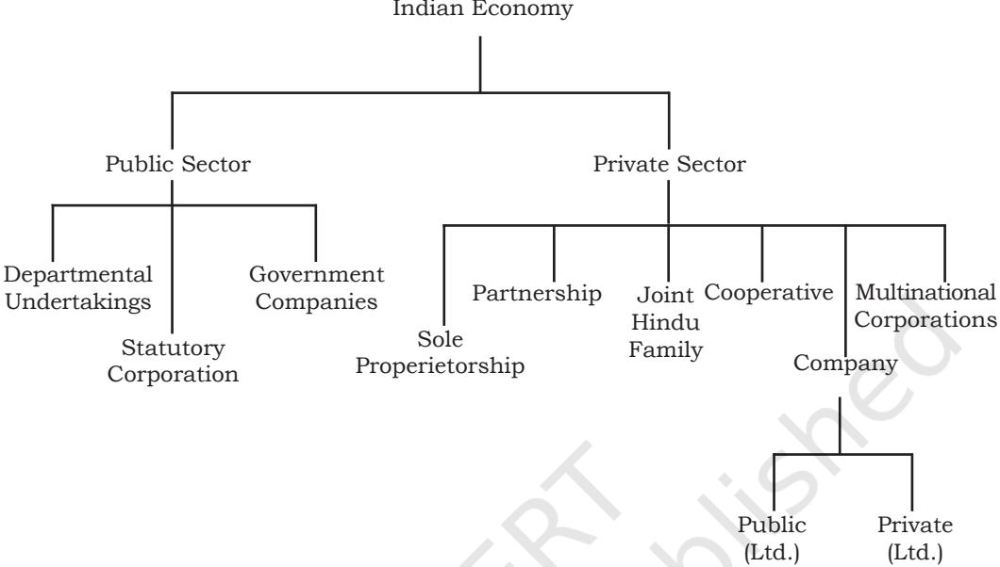
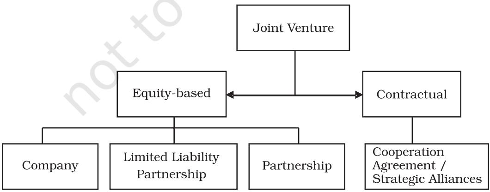

Chapter 3

# **Private, Public and Global Enterprises**

# **LEARNING OBJECTIVES**

After studying this chapter, you should be able to:

- • explain the concept and characteristics of business;
- • explain the features of different forms of public enterprises viz., departmental, statutory corporations and government companies;
- • critically examine the changing role of the public sector;
- • explain the features of global enterprises; and
- • appreciate the benefits of joint ventures.

Chapter 3.indd 57 31-12-2020 11:54:45

Anita, a student of Class XI, was going through some newspapers. The headlines stared at her face, Government plans to disinvest its shares in a few companies. The next day there was another news item on one public sector company incurring heavy losses and the proposal for closing the same. In contrast to this, she read another item on how some of the companies under the private sector were doing so well. She was actually curious to know what these terms like public sector, disinvestment, privatisation meant.

She learnt there are all kinds of business organisation-small or large, industrial or trading, privately owned or government owned existing in our country. These organisations affect our daily economic life and therefore become part of the Indian economy. Since the Indian economy consists of both privately owned and government owned business enterprises, it is known as a mixed economy. The Government of India has opted for a mixed economy where both private and government enterprises are allowed to operate. The economy, therefore, may be classified into two sectors, viz., private sector and public sector.

Then there are businesses which operate in more than one country known as global enterprises. Therefore, you may have observed that all types of organisations are doing business in the country whether they are public, private or global.

## **3.1 Introduction**

You must have come across all types of business organisations in your daily life. In your neighbourhood market, there are shops owned by sole proprietors or big retail organisations run by a company. Then there are people providing you services like legal services, medical services, being owned by more than one person i.e., partnership firms. These are all privately owned organisations. Similarly, there are other offices or places of business which may be owned by the government. For example, Railways is an organisation wholly owned and managed by the government. The post office, in your locality is owned by the Post and Telegraph Department, Government of India, though our dependence on their postal services, particularly in cities and towns has been greatly reduced. This is because of plenty of private courier services firms operating in bigger towns. Then there are businesses which operate in more than one country known as global enterprises. Therefore, you may have observed that all types of organisations are doing business in the country whether they are public, private or global.

# **3.2 Private Sector and Public Sector**

The private sector consists of business owned by individuals or a group of individuals, as you have learnt in the previous chapter. The various forms of organisation are sole proprietorship, partnership, joint Hindu family, cooperative and company.

Chapter 3.indd 58 13-01-2021 11:15:54

The public sector consists of various organisations owned and managed by the government. These organisations may either be partly or wholly owned by the central or state government. They may also be a part of the ministry or come into existence by a Special Act of the Parliament. The government, through these enterprises participates in the economic activities of the country.

The government in its industrial policy resolutions, from time-totime, defines the area of activities in which the private sector and public sector are allowed to operate. In the Industrial Policy Resolution 1948, the Government of India had specified the approach towards development of the industrial sector. The roles of the private and public sector were clearly defined and the government through various Acts and Regulations was overseeing the economic activities of both the private and public sector. The Industrial Policy Resolution, 1956 had also laid down certain objectives for the public sector to follow so as to accelerate the rate of growth and industrialisation. The public sector was given a lot of importance but at the same time mutual dependency of public and private sectors was emphasised. The 1991 industrial policy was radically different from all the earlier policies where the government was deliberating disinvestment of public sector and allowing greater freedom to the private sector. At the same time, foreign direct investment was invited from business houses outside India. Thus, multinational corporations or global enterprises which operate in more than one country gained entry into the Indian economy. Thus, we have public sector units, private sector enterprises and global enterprises coexisting in the Indian economy.

# **3.3 Forms of Organising Public Sector Enterprises**

Government's participation in business and economic sectors of the country needs some kind of organisational framework to function. You have studied about the forms of business organisation in the private sector viz., sole proprietorship, partnership, Hindu undivided family, cooperative and company.

In the public sector, as it grows, an important question arises in respect of how it is to be organised or what form of organisation it should take. The government has a major role to play in the formation of the public sector. But the government acts through its people, its offices, employees and they take decisions on behalf of the government. For this purpose, public enterprises were formed by the government to participate in the economic activities of the country. They are expected to contribute to the economic development of the country in today's liberalised, competitive world. These public enterprises are owned by the public and are accountable to the public through the Parliament. They are characterised by public

Chapter 3.indd 59 31-12-2020 11:54:45

ownership, public funds being used for its activities and public accountability.

A public enterprise may take any particular form of organisation depending upon the nature of its operations and their relationship with the government. The suitability of a particular form of organisation would depend upon its requirements. At the same time, in accordance with general principles, any organisation in the public sector should ensure organisational performance productivity and quality standards.

The forms of organisation which a public enterprise may take are as follows:

- (i) Departmental undertaking
- (ii) Statutory corporation
- (iii) Government company

#### **3.3.1 Departmental Undertakings**

This is the oldest and most traditional form of organising public enterprises. These enterprises are established as departments of the ministry and are considered part or an extension of the ministry itself. The Government functions through these departments and the activities performed by them are an integral part of the functioning of the government. They have not been constituted as autonomous or independent institutions and as such are not independent legal entities. They act through the officers of the Government and its employees are Government employees. These undertakings may be under the central or the state government and the rules of central/state government are applicable. Examples of these

Chapter 3.indd 60 31-12-2020 11:54:45

undertakings are railways and post and telegraph department.

## **Features**

The main characteristics of Departmental undertakings are as follows:

- (i) The funding of these enterprises come directly from the Government Treasury and are an annual appropriation from the budget of the Government. The revenue earned by these is also paid into the treasury;
- (ii) They are subject to accounting and audit controls applicable to other Government activities;
- (iii) The employees of the enterprise are Government servants and their recruitment and conditions of service are the same as that of other employees directly under the Government. They are headed by Indian Administrative Service (IAS) officers and civil servants who are transferable from one ministry to another;
- (iv) It is generally considered to be a major subdivision o f the Government department and is subject to direct control of the ministry;
- (v) They are accountable to the ministry since their management is directly under the concerned ministry.

## **Merits**

Departmental undertakings have certain advantages which are as follows:

- (i) These undertakings facilitate the Parliament to exercise effective control over their operations;
- (ii) These ensure a high degree of public accountability;
- (iii) The revenue earned by the enterprise goes directly to the treasury and hence is a source of income for the Government;
- (iv) Where national security is concerned, this form is most suitable since it is under the direct control and supervision of the concerned Ministry.

## **Limitations**

This form of organisation suffers from serious drawbacks, some of which are as follows:

- (i) Departmental undertakings fail to provide flexibility, which is essential for the smooth operation of business;
- (ii) The employees or heads of departments of such undertakings are not allowed to take independent decisions, without the approval of the ministry concerned. This leads to delays, in matters where prompt decisions are required;
- (iii) These enterprises are unable to take advantage of business opportunities. The bureaucrat's over-cautious and conservative approval does not allow them to take risky ventures;
- (iv) There is red tapism in day-to-day operations and no action can be taken unless it goes through the proper channels of authority;

Chapter 3.indd 61 31-12-2020 11:54:45

- (v) There is a lot of political interference through the ministry;
- (vi) These organisations are usually insensitive to consumer needs and do not provide adequate services to them.

# **3.3.2 Statutory Corporations**

Statutory corporations are public enterprises brought into existence by a Special Act of the Parliament. The Act defines its powers and functions, rules and regulations governing its employees and its relationship with government departments.

This is a corporate body created by the legislature with defined powers and functions and is financially independent with a clear control over a specified area or a particular type of commercial activity. It is a corporate person and has the capacity of acting in its own name. Statutory corporations therefore have the power of the government and considerable amount of operating flexibility of private enterprises.

## **Features**

Statutory corporations have certain distinct features, which are discussed as below:

- (i) Statutory corporations are set up under an Act of Parliament and are governed by the provisions of the Act. The Act defines the objects, powers and privileges of a statutory corporation;
- (ii) This type of organisation is wholly owned by the state. The

government has the ultimate financial responsibility and has the power to appropriate its profits. At the same time, the state also has to bear the losses, if any;

- (iii) A statutory corporation is a body corporate and can sue and be sued, enter into contract and acquire property in its own name;
- (iv) This type of enterprise is usually independently financed. It obtains funds by borrowings from the government or from the public through revenues, derived from sale of goods and services. It has the authority to use its revenues;
- (v) A statutory corporation is not subject to the same accounting and audit procedures applicable to government departments. It is also not concerned with the central budget of the Government;
- (vi) The employees of these enterprises are not government or civil servants and are not governed by government rules and regulations. The conditions of service of the employees are governed by the provisions of the Act itself. At times, some officers are taken from government departments, on deputation, to head these organisations.

## **Merits**

This form of organisation enjoys certain advantages in its working, which are as follows:

- (i) They enjoy independence in their functioning and a high degree of
Chapter 3.indd 62 31-12-2020 11:54:45

operational flexibility. They are free from undesirable government regulation and control;

- (ii) Since the funds of these organisations do not come from the central budget, the government generally does not interfere in their financial matters, including their income and receipts;
- (iii) Since they are autonomous organisations they frame their own policies and procedures within the powers assigned to them by the Act. The Act may, however, provide few issues/ matters which require prior approval of a particular ministry;
- (iv) A statutory corporation is a valuable instrument for economic development. It has the power of the government, combined with the initiative of private enterprises.

## **Limitations**

This type of organisation suffers from several limitations, which are as follows:

- (i) In reality, a statutory corporation doesnot enjoy asmuchoperational flexibility as stated above. All actions are subject to many rules and regulations;
- (ii) Government and political interference has always been there in major decisions or where huge funds are involved;
- (iii) Where there is dealing with public, rampant corruption exists;

- (iv) The Government has a practice of appointing advisors to the Corporation Board. This curbs the freedom of the corporation in entering into contracts and other decisions. If there is any disagreement, the matter is referred to the government for final decisions. This further delays action.
# **3.3.3 Government Company**

A government company is established under The Companies Act, 2013 and is registered and governed by the provisions of The Act. These are established for purely business purposes and in true spirit compete with companies in the private sector.

According to the section 2(45) of the Companies Act 2013, a government company means any company in which not less than 51 per cent of the paid up capital is held by the central government, or by any state government or partly by Central government and partly by one or more State governments and includes a company which is a subsidiary of a government company. Under the Companies Act 2013, there is no change in the definition of a company. All provisions of the Act are applicable to government companies unless otherwise specified. A government company may be formed as a private limited company or a public limited company. There are certain provisions which are applicable to the appointment/retirement of directors and other managerial personnel.

Chapter 3.indd 63 31-12-2020 11:54:45

From the above it is clear that the government exercises control over the paid up share capital of the company. The shares of the company are purchased in the name of the President of India. Since the government is the major shareholder and exercises control over the management of these companies, they are known as government companies.

## **Features**

Government companies have certain characteristics which makes them distinct from other forms of organisations. These are discussed as follows:

- (i) It is an organisation created under the Companies Act, 2013 or any other previous Company Law.
- (ii) The company can file a suit in a court of law against any third party and be sued;
- (iii) The company can enter into a contract and can acquire property in its own name;
- (iv) The management of the company is regulated by the provisions of the Companies Act, like any other public limited company;
- (v) The employees of the company are appointed according to their own rules and regulations as contained in the Memorandum and Articles of Association of the company. The Memorandum and Articles of Association are the main documents of the company, containing the objects of the company and its rules and regulations;
- (vi) These companies are exempted from the accounting and audit rules and procedures. An auditor is appointed by the Central Government and the Annual Report is to be presented in the Parliament or the State Legislature;
- (vii) The government company obtains its funds from government shareholdings and other private shareholders. It is also permitted to raise funds from the capital market.

# **Merits**

Government companies enjoy several advantages, which are as follows:

- (i) A government company can be established by fulfilling the requirements of the Indian Companies Act. A separate Act in the Parliament is not required;
- (ii) It has a separate legal entity, apart from the Government;
- (iii) I t enjoys autonomy in all management decisions and takes actions according to business prudence;
- (iv) These companies by providing goods and services at reasonable prices are able to control the market and curb unhealthy business practices.

## **Limitations**

Despite the autonomy given to these companies, they have certain disadvantages:

- (i) Since the Government is the only shareholder in some of the
Chapter 3.indd 64 31-12-2020 11:54:46

companies, the provisions of the Companies Act does not have much relevance;

- (ii) I t e v a d e s c o n s t i t u t i o n a l responsibility, which a company financed by the government should have. It is not answerable directly to the Parliament;
- (iii) The government being the sole shareholder, the management and administration rests in the hands of the government. The main purpose of a government company, registered like other companies, is defeated.

# **3.4 Changing Role of Public Sector**

At the time of Independence, it was expected that the public sector enterprises would play an important role inachieving certainobjectives ofthe economy either by direct participation in business or by acting as a catalyst. The public sector would build up infrastructure for other sectors of the economy and invest in key areas. The private sector was unwilling to invest in projects which required heavy investment and had long gestation periods. The government then took it upon itself to develop infrastructural facilities and provide for goods and services essential for the economy.

The Indian economy is in a stage of transition. The Five Year Plans in the initial stages of development gave lot of importance to the public sector. In the post–1990s, the new economic policies, emphasised on liberalisation, privatisation and globalisation. The role of public sector was redefined. It was not supposed to play a passive role but to actively participate and compete in the market with other private sector companies in the same industry. They were also held accountable for losses and return on investment. If a public sector was making losses continuously, it was referred to the Board for Industrial and Financial Reconstruction (BIFR) for complete overhauling or shut down. Various committees were set up to study the working of inefficient public sector units with reports on how to improve their managerial efficiency and profitability. The role of public sector is definitely not what was envisaged in the early 1960s or 70s.

**(i) Development of infrastructure:** The development of infrastructure is a prerequisite for industrialisation in any country. In the pre-Independence period, basic infrastructure was not developed and therefore, industrialisation progressed at a very slow pace. The process of industrialisation cannot be sustained without adequate transportation and communication facilities, fuel and energy, and basic and heavy industries. The private sector did not show any initiative to invest in heavy industries or develop it in any manner. They did not have trained personnel or finances to immediately establish heavy industries which was the requirement of the economy.

It was only the government which could mobilise huge capital, coordinate

Chapter 3.indd 65 31-12-2020 11:54:46

industrial construction and train technicians and workforce. Rail, road, sea and air transport was the responsibility of the government, and their expansion has contributed to the pace of industrialisation and ensured future economic growth. The public sector enterprises were to operate in certain spheres. Investments were to be made to:

- (a) Give infrastructure to the core sector, which requires huge capital investment, complex and upgraded technology, big and effective organisation structures like steel plants, power generation plants, civil aviation, railways, petroleum, state trading, coal, etc;
- (b) Give a lead in investment to the core sector where private sector enterprises are not functioning in the desired direction, like fertilizers, pharmaceuticals, petro-chemicals, newsprint, medium and heavy engineering;
- (c) Give direction to future investments like hotels, project management, consultancies, textiles, auto-mobiles, etc.

**(ii) Regional balance:** The government is responsible for developing all regions and states in a balanced way and removing regional disparties. Most of the industrial progress was limited to a few areas like the port towns in the pre-Independence period. After 1951, the government laid down in its Five Year Plans, that particular attention would be paid to those regions which were lagging behind and public sector

industries were deliberately set up. Four major steel plants were set up in the backward areas to accelerate economic development, provide employment to the workforce and develop ancilliary industries. This was achieved to some extent but there is scope for a lot more. Development of backward regions so as to ensure a regional balance in the country is one of the major objectives of planned development. Therefore, the government had to locate new enterprises in backward areas and at the same time prevent the mushrooming growth of private sector units in already advanced areas.

**(iii) Economies of scale:** Where large scale industries are required to be set up with huge capital outlay, the public sector had to step in to take advantage of economies of scale. Electric power plants, natural gas, petroleum and telephone industries are some examples of the public sector setting up large scale units. These units required a larger base to function economically which was only possible with government resources and mass scale production.

**(iv) Check over concentration of economic power:** The public sector acts as a check over the private sector. In the private sector there are very few industrial houses which would be willing to invest in heavy industries with the result that wealth gets concentrated in a few hands and monopolostic practices are encouraged. This gives rise to inequalities in income, which is detrimental to society.

Chapter 3.indd 66 31-12-2020 11:54:46

The public sector is able to set large industries which requires heavy investment and thus the income and benefits that accrue are shared by a large of number of employees and workers. This prevents concentration of wealth and economic power in the private sector.

**(v) Import substitution:** During the second and third Five Year Plan period, India was aiming to be self-reliant in many spheres. Obtaining foreign exchange was also a problem and it was difficult to import heavy machinery required for a strong industrial base. At that time, public sector companies involved in heavy engineering which would help in import substitution were established. Simultaneously, several public sector companies like STC and MMTC have played an important role in expanding exports of the country.

**(vi) Government policy towards the public sector since 1991:** The Government of India had introduced four major reforms in the public sector in its new industrial policy in 1991. The main elements of the Government policy are as follows:

- • Restructure and revive potentially viable PSUs
- • Close down PSUs, which cannot be revived
- • Bring down governments equity in all non-strategic PSUs to 26 per cent or lower, if necessary; and
- • Fully protect the interest of workers.
- **(a) Reduction in the number of industries reserved for the**

**public sector from 17 to 8 (and then to 3):** In the 1956 resolution on Industrial policy, 17 industries were reserved for the public sector. In 1991, only 8 industries were reserved for the public sector, they were restricted to atomic energy, arms and communication, mining, and railways. In 2001, only three industries were reserved exclusively for the public sector. These are atomic energy, arms and rail transport. This meant that the private sector could enter all areas (except the three) and the public sector would have to compete with them.

The public sector has played a vital role in the development of the economy. However, the private sector is also quite capable of contributing substantially to the nation building process. Therefore, both the public sector and the private sector need to be viewed as mutually complementary parts of the national sector. Private sector units also have to assume greater public responsibilities. Simultaneously, the public sector needs to focus on achieving more in a highly competitive market.

- **(b) Disinvestment of shares of a select set of public sector enterprises:** Disinvestment involves the sale of the equity shares to the private sector and the public. The objective was to raise resources and encourage wider participation of the general
Chapter 3.indd 67 31-12-2020 11:54:46

public and workers in the ownership of these enterprises. The government had taken a decision to withdraw from the industrial sector and reduce its equity in all undertakings. It was expected that this would lead to improving managerial performance and ensuring financial discipline. But there remains a lot to be done in this area.

The primary objectives of privatising public sector enterprises are:

- • Releasing the large amount of public resources locked up in non-strategic Public Sector Enterprises (PSEs), so that they may be utilised on other social priority areas such as basic health, family welfare and primary education.
- • Reducing the huge amount of public debt and interest burden;
- • Transferring the commercial risk to the private sector so that the funds are invested in able projects;
- • Freeing these enterprises from government control and introduction of corporate governance; and
- • In many areas where the public sector had a monopoly, for example, telecom sector the consumers have benefitted by more choices, lower prices and better quality of products and services.
- **(c) Policy regarding sick units to be the same as that for**

**the private sector:** All public sector units were referred to the Board of Industrial and Financial Reconstruction to decide whether a sick unit was to be restructured or closed down. The Board has reconsidered revival and rehabilitation schemes for some cases and winding up for a number of units. There is a lot of resentment amongst workers of the units which are to be closed down. A National Renewal Fund was set up by the government to retrain or redeploy retrenched labour and to provide compensation to public sector employees seeking voluntary retirement.

 There are many enterprises which are sick and not capable of being revived as they have accumulated huge losses. With public finances under intense pressure, both central and state government are just not able to sustain them much longer. The only option available to the government in such cases is to close down these undertakings after providing a safety net for the employees and workers. Resources under the National Renewal Fund have not been sufficient to meet the cost of Voluntary Separation Scheme or Voluntary Retirement Scheme.

- **(d) Memorandum of Understanding:** Improvement of performance through a MoU (Memorandum
Chapter 3.indd 68 31-12-2020 11:54:46

of Understanding) system by which managements are to be granted greater autonomy but held accountable for specified results. Under this system, public sector units were given clear targets and operational autonomy for achieving those targets. The MoU was between the particular public sector unit and their administrative ministries defining their relationship and autonomy.

# **3.5 Global Enterprises**

At some time you must have come across products produced by Multi National Corporations (MNCs). In the last 2 decades or so. MNCs have played an important role in the Indian economy. They have become a common feature of most developing economies in the world. MNCs as is evident from what we see around us, are gigantic corporations which have their operations in a number of countries. They are characterised by their huge size, large number of products, advanced technology, marketing strategies and network of operations all over the world. Global enterprises thus are huge industrial organisations which extend their industrial and marketing operations through a network of their branches in several countries. These enterprises operate in several areas producing multiple products with their business strategy extending over a number of countries. They do not aim at maximising profits from one or two products but instead spread their branches all over.

## **Features**

These corporations have distinct features which distinguish them from other private sector companies, public sector companies and public sector enterprises. These are as follows:

**(i) Huge capital resources:** These enterprises are characterised by possessing huge financial resources and the ability to raise funds from different sources. They are able to tap funds from various sources. They may issue equity shares, debentures or bonds to the public. They are also in a position to borrow from financial institutions and international banks. They enjoy credibility in the capital market. Even investors and banks of the host country are willing to invest in them. Because of their financial strength they are able to survive under all circumstances.

**(ii) Foreign collaboration:** Global enterprises usually enter into agreements with Indian companies pertaining to the sale of technology, production of goods, use of brand names for the final products, etc. These MNCs may collaborate with companies in the public and private sector. There are usually various restrictive clauses in the agreement relating to transfer of technology, pricing, dividend payments, tight control by foreign technicians, etc. Big industrial houses wanting to diversify and expand have gained by collaborating with MNCs in terms of patents, resources, foreign exchange etc. But at the same time these foreign collaborations have given rise to the growth of monopolies and concentration of power in few hands.

Chapter 3.indd 69 31-12-2020 11:54:46

**(iii) Advanced technology:** These enterprises possess technological superiorities in their methods of production. They are able to conform to international standards and quality specifications. This leads to industrial progress of the country in which such corporations operate since they are able to optimally exploit local resources and raw materials. Computerisation and other inventions have come due to the technological advancements provided by MNCs.

**(iv) Product innovation:** These enterprises are characterised by having highly sophisticated research and development departments engaged in the task of developing new products and superior designs of existing products. Qualitative research requires huge investment which only global enterprises can afford.

**(v) Marketing strategies:** The marketing strategies of global companies are far more effective than other companies. They use aggressive marketing strategies in order to increase their sales in a short period. They posses a more reliable and upto-date market information system. Their advertising and sales promotion techniques are normally very effective. Since they already have carved out a place for themselves in the global market, and their brands are wellknown, selling their products is not a problem.

**(vi) Expansion of market territory:** Their operations and activities extend beyond the physical boundaries of their own countries. Their international

image also builds up and their market territory expands enabling them to become international brands. They operate through a network of subsidiaries, branches and affiliates in host countries. Due to their giant size they occupy a dominant position in the market.

**(vii) Centralised control:** They have their headquaters in their home country and exercise control over all branches and subsidiaries. However, this control is limited to the broad policy framework of the parent company. There is no interference in day-to-day operations.

# **3.6 Joint Ventures**

## **Meaning**

Business organisations as you have studied earlier can be of various types private or government owned or global enterprises. Now, any business organisation if it so desires can join hands with another business organisation for mutual benefit. These two organisations may be private, government-owned or a foreign company. When two businesses agree to join together for a common purpose and mutual benefit, it gives rise to a joint venture. Businesses of any size can use joint ventures to strengthen long-term relationships or to collaborate on short term projects. A joint venture can be flexible depending upon the party's requirements. These need to be clearly stated in a joint venture agreement to avoid conflict at a later stage.

Chapter 3.indd 70 31-12-2020 11:54:46

A joint venture may also be the result of an agreement between two businesses in different countries. In this case, there are certain provisions provided by the governments of the two countries, which will have to be adhered to.

Thus, we see that joint ventures may mean many things, depending upon the context we are using it in. But in a broader sense, a joint venture is the pooling of resources and expertise by two or more businesses, to achieve a particular goal. The risks and rewards of the business are also shared. The reasons behind the joint venture often include business expansion, development of new products or moving into new markets, particularly in another country. It is becoming increasingly common for companies to create joint ventures with other businesses/companies and form strategic alliances with them. The reasons for these alliances may be complementary capabilities and resources such as distribution channels, technology or finance. In this kind of a joint venture, two or more (parent) companies agree to share capital, technology, human resources, risks and rewards in the formation of a new entity, under shared control.

In India, joint venture companies are the best way of doing business. There are no separate laws for these joint ventures. The companies incorporated in India are treated the same as domestic companies.

#### **Joint Ventures are of two types —**

Contractual joint venture Equity-based joint venture

### **3.6.1 Types of Joint Ventures**

**(i) Contractual Joint Venture (CJV):** In a contractual joint venture, a new jointly-owned entity is not created. There is only an agreement to work together. The parties do not share ownership of the business but exercise some elements of control in the joint venture. A typical example of a contractual joint venture is a

Chapter 3.indd 71 31-12-2020 11:54:46

franchisee relationship. In such a relationship the key elements are:

- (a) Two or more parties have a common intention – of running a business venture;
- (b) Each party brings some inputs;
- (c) Both parties exercise some control on the business venture; and
- (d) The relationship is not a transaction-to-transaction relationship but has a character of relatively longer duration.

## **(ii) Equity-based Joint Venture (EJV):**

An equity joint venture agreement is one in which a separate business entity, jointly owned by two or more parties, is formed in accordance with the agreement of the parties. The key operative factor in such case is joint ownership by two or more parties. The form of business entity may vary — company, partnership firm, trusts, limited liability partnership firms, venture capital funds, etc.

- (a) There is an agreement to either create a new entity or for one of the parties to join into ownership of an existing entity;
- (b) Shared ownership by the parties involved;
- (c) Shared management of the jointly owned entity;
- (d) Shared responsibilities regarding capital investment and other financing arrangements; and

- (e) Shared profits and losses according to the agreement.
A joint venture must be based on a memorandum of understanding signed by both the parties, highlighting the basis of a joint venture agreement. The terms should be thoroughly discussed and negotiated to avoid any legal complications at a later stage. Negotiations and terms must take into account the cultural and legal background of the parties. The joint venture agreement must also state that all necessary governmental approvals and licences will be obtained within a specified period.

## **3.6.2 Benefits**

Business can achieve unexpected gains through joint ventures with a partner. Joint ventures can prove to be extremely beneficial for both parties involved. One party may have strong potential for growth and innovative ideas, but is still likely to benefit from entering into a joint venture because it enhances its capacity, resources and technical expertise. The major benefits of joint ventures are as follows:

**(i) Increased resources and capacity:**  Joining hands with another or teaming up adds to existing resources and capacity enabling the joint venture company to grow and expand more quickly and efficiently. The new business pools in financial and human resources and is able to face market challenges and take advantage of new opportunities.

Chapter 3.indd 72 31-12-2020 11:54:46

**(ii) Access to new markets and distribution networks:** When a business enters into a joint venture with a partner from another country, it opens up a vast growing market. For example, when foreign companies form joint venture companies in India they gain access to the vast Indian market. Their products which have reached saturation point in their home markets can be easily sold in new markets.

They can also take advantage of the established distribution channels i.e., the retail outlets in different local markets. Otherwise, establishing their own retail outlets may prove to be very expensive.

**(iii) Access to technology:** Technology is a major factor for most businesses to enter into joint ventures. Advanced techniques of production leading to superior quality products saves a lot of time, energy and investment as they do not have to develop their own technology. Technology also adds to efficiency and effectiveness, thus leading to reduction in costs.

**(iv) Innovation:** The markets are increasingly becoming more demanding in terms of new and innovative products. Joint ventures allow business to come up with something new and creative for the same market. Specially foreign partners can come up with innovative products because of new ideas and technology.

**(v) Low cost of production:** When international corporations invest in India, they benefit immensely due to the lower cost of production. They are able to get quality products for their global requirements. India is becoming an important global source and extremely competitive in many products.

There are many reasons for this, low cost of raw materials and labour, technically qualified workforce; management professionals, excellent manpower in different cadres, like lawyers, chartered accountants, engineers, scientists. The international partner thus, gets the products of required quality and specifications at a much lower cost than what is prevailing in the home country.

**(vi) Established brand name:** When two businesses enter into a joint venture, one of the parties benefits from the other's goodwill which has already been established in the market. If the joint venture is in India and with an Indian company, the Indian company does not have to spend time or money in developing a brand name for the product or even a distribution system. There is a ready market waiting for the product to be launched. A lot of investment is saved in the process.

# **3.7 Public Private Partnership (PPP)**

The Public Private Partnership model allocates tasks, obligations and risks among the public and private partners in an optimal manner. The public partners in PPP are Government entities, i.e., ministries, government departments, municipalities or state-owned enterprises. The private partners can be local or foreign

Chapter 3.indd 73 13-01-2021 12:30:04

(international) and include businesses or investors with technical or financial expertise relevant to the project. PPP also includes NGOs and/or community-based organisations who are the stakeholders directly affected by the project. PPP is, therefore, defined as a relationship between public and private entities in the context of infrastructure and other services. Under the PPP model, public sector plays an important role and ensures that the social obligations are fulfilled and sector reforms and public investment are successfully met. The government's contribution to PPP is in the form of capital for investment and transfer of assets that support the partnership in addition to social responsibility, environmental awareness and local knowledge. The private sector's role in the partnership is to make use of its expertise in operations, managing tasks and innovation to run the business efficiently.

Sectors in which PPPs have been completed worldwide include power generation and distribution, water and sanitation, refuse disposal, pipelines, hospitals, school buildings and teaching facilities, stadiums, air traffic control, prisons, railways, roads, billing and other information technology systems, and housing.

# **PPP Model**

#### **Features**

- • Contract with the private party to design and build public facility.
- • Facility is financed and owned by the public sector.
- • Key driver is the transfer of design and construction risk.

#### **Application**

- • Suited to capital projects with small operating requirement.
- • Suited to capital projects where the public sector wishes to retain the operating responsibility.

#### **Strengths**

- • Transfer of design and construction risk.
- • Potential to accelerate project.

#### **Weaknesses**

- • Conflict between parties may arise on environmental considerations
- • Does not attract private finance easily.

#### **Example**

- • Kundli Manesar Expressway Ltd.: In this 135 km expressway, land has been provided by the government and surface has been laid out by the company.
Chapter 3.indd 74 31-12-2020 11:54:46

## **Key Terms**

| Public sector | Departmental undertaking | Globalisation |
| --- | --- | --- |
| Public enterprises | Government companies | Global enterprises |
| Statutory corporation | Disinvestment | Public Sector Undertakings |
| Joint ventures | Public accountability |  |
| Public Private Partnership | Privatisation |  |

#### **SUMMARY**

**Private sector and public sector:** There are all kinds of business organisations—small or large, industrial or trading, privately owned or government owned existing in our country. These organisations affect our daily economic life and therefore, become part of the Indian economy. The government of India has opted for a mixed economy, where both private and government enterprises are allowed to operate. The economy, therefore, may be classified into two sectors viz., private sector and public sector. The private sector consists of business owned by individuals or a group of individuals. Various forms of organisation are sole proprietorship, partnership, joint Hindu family, cooperative and company. The public sector consists of various organisations owned and managed by the government. These organisations may either be partly or wholly owned by the central or state government.

**Forms of organising public sector enterprises:** Government's participation in business and economic sectors of the country needs some kind of organisational framework to function. A public enterprise may take any particular form of organisation depending upon the nature of it's operations and their relationship with the government. The suitability of a particular form of organisation would depend upon its requirements. The forms of organisation which a public enterprise may take are as follows:

- (i) Departmental undertaking
- (ii) Statutory corporation
- (iii) Government company

**Departmental undertakings:** These enterprises are established as departments of the ministry and are considered part or an extension of the ministry itself. The Government functions through these departments and the activities performed by them are an integral part of the functioning of the government.

**Statutory corporations:** Statutory corporations are public enterprises brought into existence by a Special Act of the Parliament. The Act defines its powers and functions, rules and regulations governing its employees and its

Chapter 3.indd 75 13-01-2021 09:41:21

relationship with Government departments. This is a corporate body created by legislature with defined powers and functions and financially independent with a clear control over a specified area or a particular type of commercial activity.

**Government company:** A Government company means any company in which not less than 51 percent of the paid up capital is held by the central government, or by any state governments or government or partly by central government and partly by one or more state governments and includes a company which is a subsidiary company of such a government company.

**Changing role of public sector:** At the time of Independence, it was expected that the public sector enterprises would play an important role in achieving certain objectives of the economy either by direct participation in business or by acting as a catalyst. The Indian economy is in a stage of transition. In the post 90's period, the new economic policies emphasised liberalisation, privatisation and globalisation. The role of the public sector was redefined. It was not supposed to play a passive role but to actively participate and compete in the market with other private sector companies in the same industry.

**Development of infrastructure:** The process of industrialisation cannot be sustained without adequate transportation and communication facilities, fuel and energy, and basic and heavy industries. It is only the government which could mobilise huge capital, coordinate industrial construction and train technicians and workforce.

**Regional balance:** The government is responsible for developing all regions and states in a balanced way and removing regional disparties. Development of backward regions so as to ensure a regional balance in the country is one of the major objectives of planned development. Therefore, the government had to locate new enterprises in backward areas and at the same time prevent the mushrooming growth of private sector unit in already advanced areas.

**Economies of scale:** Where large scale industries are required to be set up with huge capital outlay, the public sector had to step in to take advantage of economies of scale.

**Check over concentration of economic power:** The public sector acts as a check over the private sector. In the private sector there are very few industrial houses which would be willing to invest in heavy industries with the result that wealth gets concentrated in a few hands and monopolostic practices are encouraged.

**Import substitution:** During the second and third Five Year Plan period, India was aiming to be self-reliant in many spheres. Public sector companies involved in heavy engineering which would help in import substitution were established.

Chapter 3.indd 76 31-12-2020 11:54:46

**Government policy towards public sector since 1991. Its main elements are:** Restructure and revive potentially viable PSUs, Close down PSUs, which cannot be revived. Bring down governments equity in all non-strategic PSUs to 26 per cent or lower if necessary; and fully protect the interest of workers.

- (a) *Reduction in the number of industries reserved for the public sector from 17 to 8 (and then to 3):* This meant that the private sector could enter all areas (except 3) and the public sector would have to compete with them.
- (b) *Disinvestment of shares of a select set of public sector enterprises:*  Disinvestment involves the sale of the equity shares to the private sector and the public. The objective was to raise resources and encourage wider participation of the general public and workers in the ownership of these enterprises. The government had taken a decision to withdraw from the industrial sector and reduce its equity in all undertakings.
- (c) *Policy regarding sick units to be the same as that for the private sector:* All public sector units were referred to the Board of Industrial and Financial Reconstruction to decide whether a sick unit was to be restructured or closed down.

**Memorandum of Understanding:** Improvement of performance through a MoU (Memorandum of Understanding) system by which managements are to be granted greater autonomy but held accountable for specified results.

**Global enterprises:** In the last 2 decades MNCs have played an important role in the Indian economy. They are characterised by their huge size, large number of products, advanced technology, marketing strategies and network of operations all over the world. Global enterprises thus are huge industrial organisations which extend their industrial and marketing operations through a network of their branches in several countries. These corporations have distinct features which distinguishes them from other private sector companies, public sector companies and public sector enterprises i.e., (i) Huge capital resources, (ii) Foreign collaboration, (iii) Advanced Technology, (iv) Product innovation, (v) Marketing strategies, (vi) Expansion of market territory, (vii) Centralised control.

**Joint ventures:** Joint ventures may mean many things, depending upon the context we are using it in. But in a broader sense, a joint venture is the pooling of resources and expertise by two or more businesses, to achieve a particular goal. The risks and rewards of the business are also shared. The reasons behind the joint venture often include business expansion, development of new products or moving into new markets, particularly in another country.

**Public Private Partnership:** It is a relationship among public sector and private sector for allocation and completion of development projects.

Chapter 3.indd 77 31-12-2020 11:54:46

## **EXERCISES**

### **Short Answer Questions**

- 1. Explain the concept of public sector and private sector.
- 2. State the various types of organisations in the private sector.
- 3. What are the different kinds of organisations that come under the public sector?
- 4. List the names of some enterprises under the public sector and classify them.
- 5. Why is the government company form of organisation preferred to other types in the public sector?
- 6. How does the government maintain a regional balance in the country?
- 7. State the meaning of public private partnership.

#### **Long Answer Questions**

- 1. Describe the Industrial Policy 1991, towards the public sector.
- 2. What was the role of the public sector before 1991?
- 3. Can the public sector companies compete with the private sector in terms of profits and efficiency? Give reasons for your answer.
- 4. Why are global enterprises considered superior to other business organisations?
- 5. What are the benefits of entering into joint ventures and public private partnership?

#### **Projects/Assignments**

- 1. Make a list of Indian companies entering into joint ventures with foreign companies. Find out the apparent benefits derived out of such ventures.
Chapter 3.indd 78 31-12-2020 11:54:46

