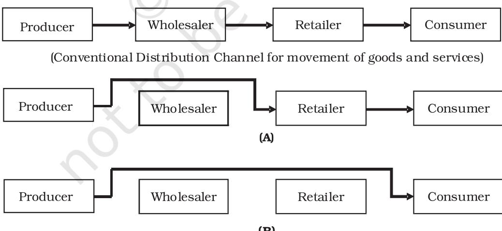

Chapter 5

# **Emerging Modes of Business**

# **LEARNING OBJECTIVES**

After studying this chapter, you should be able to:

- • state the meaning of e-business;
- • explain the process of online buying and selling as a part of e-business;
- • distinguish e-business from traditional business;
- • state benefits of switching over to electronic mode;
- • explain requirements for a firm's initiation into e-business;
- • identify major security concerns of electronic mode of doing business;
- • discuss the need for business process outsourcing; and
- • appreciate the scope of business process outsourcing.

Chapter 5.indd 113 9/2/2022 2:12:15 PM

"Let us do some shopping," Rita woke up Rekha, her friend from the home-village who had come to Delhi during the vacations. "At this hour well past midnight," said Rekha rubbing her eyes, "Who would be sitting with his shop open for you?" "Oh! Perhaps I could not convey it properly. We are not going anywhere! I am talking about online shopping over the internet!" told Rita. "Oh yes! I have heard of online shopping, but have never done any," Rekha said, "What would they be selling over the internet, how will they deliver, What about payment… and why is it that internet has not yet become as popular in the villages? As Rekha was grappling with these questions, Rita had already logged on to one of India's largest online shopping mall.

# **5.1 Introduction**

The way business is done has undergone fundamental changes during the last decade or so. The manner of conducting business is referred to as the 'mode of business,' and, the prefix 'emerging' underlines the fact, that these changes are happening here and now, and, that these trends are likely to continue. In fact, i f one were to list the three strongest trends that are shaping business, these would be: (i) digitisation — the conversion of text, sound, images, video, and other content into a series of ones and zeroes that can be transmitted electronically, (ii) outsourcing, and, (iii) internationalisation and globalisation. You will read about international business in Chapter 11. In this chapter, we will be familiarising you with the first two developments, i.e., digitisation (a term from electronics) of business—also referred to as electronic business (e-business), and Business Process Outsourcing (BPO). Before we do so, a brief discussion about the factors responsible for these two new modes of business would be in order.

The newer modes of business are not new business. These are rather simply the new ways of doing business attributable to a number of factors. You are aware that business as an activity is aimed at creating utilities or value in the form of goods and services which the household and industrial buyers purchase for meeting their needs and wants. In an effort to improve the business processes—be it purchase and production, marketing, finance or human resources business managers and business thinkers keep evolving newer and better ways of doing things. Business firms have to strengthen their capabilities of creating utilities and delivering value to successfully meet the competitive pressures and ever-growing demands of consumers for better quality, lower prices, speedier deliveries and better customer care. Besides, the quest for benefitting from emerging technologies means that business as an activity keeps evolving.

Chapter 5.indd 114 9/2/2022 2:12:15 PM

# **5.2 e-Business**

If the term business is taken to mean a wide range of activities comprising industry, trade and commerce; e-business may be defined as the conduct of industry, trade and commerce using the computer networks. The network you are most familiar with as a student or consumer is the internet. Whereas internet is a public thorough way, firms use more private, and, hence more secure networks for more effective and efficient management of their internal functions.

**e-business versus e-commerce:**  Though, many a times, the terms e-business and e-commerce are used interchangeably, yet more precise definitions would distinguish between the two. Just as the term 'business' is a broader term than 'commerce', e-business is a more elaborate term and comprises various business

transactions and functions conducted electronically, including the more popular gamut of transactions called 'e-commerce.' e-commerce covers a firm's interactions with its customers and suppliers over the internet. e-business includes not only e-commerce, but also other electronically conducted business functions such as production, inventory management, product development, accounting and finance and human resource management. e-business is, therefore, clearly much more than buying and selling over the Internet, i.e., e-commerce.

# **5.2.1 Scope of e-Business**

We have mentioned above that the scope of e-business is quite vast. Almost all types of business functions such as production, finance, marketing and personnel administration as well

**Figure 5.1 Business to Business e-Commerce**

Chapter 5.indd 115 9/2/2022 2:12:15 PM

as managerial activities like planning, organising and controlling can be carried out over computer networks. The other way of looking at the scope of e-business is to examine it in terms of people or parties involved in electronic transactions. Viewed from this perspective, a firm's electronic transactions and networks can be visualised as extending into three directions viz., (i) B2B which is a firm's interactions with other businesses, (ii) B2C i.e., a firm's interactions with its customers and (iii) intra-B or a firm's internal processes.

A brief discussion of various constituents of e-business and interand intra-transactions among them is given as below:

**(i) B2B Commerce:** Here, both the parties involved in e-commerce transactions are business firms, and, hence the name B2B, i.e., businessto-business (see Figure 5.1). Creation o f utilities or delivering value requires a business to interact with a number of other business firms which may be suppliers or vendors of diverse inputs; or else they may be a part of the channel through which a firm distributes its products to the consumers. For example, the manufacture of an automobile requires assembly of a large number of components which in turn are being manufactured elsewhere—within the vicinity of the automobile factory or even overseas. To reduce dependence on a single supplier, the automobile factory has to cultivate more than one vendor for each of the components.

A network of computers is used for placing orders, monitoring production and delivery of components, and making payments. Likewise, a firm may strengthen and improve its distribution system by exercising a real time (as it happens) control over its stock-intransit as well as that with different middlemen in different locations. For example, each consignment of goods from a warehouse and the stock-at-hand can be monitored and replenishments and reinforcements can be set in motion as and when needed. Or else, a customer's specifications may be routed through the dealers to the factory and fed into the manufacturing system for customised production. Use of e-commerce expedites the movement of the information and documents; and of late, money transfers as well.

Historically, the term e-commerce originally meant facilitation of B2B transactions using Electronic Data Interchange (EDI) technology to send and receive commercial documents like purchase orders or invoices.

**(ii) B2C Commerce:** As the name implies, B2C (business-to-customers) transactions have business firms at one end and its customers on the other end. Although, what comes to one's mind instantaneously is online shopping, it must be appreciated that 'selling' is the outcome of the marketing process. And, marketing begins well before a product is offered for sale and continues even after the product has been sold. B2C commerce,

Chapter 5.indd 116 9/2/2022 2:12:15 PM

#### **Benefits of e-Commerce**

- 1. Business Organisation:
	- (i) Expands the marketplace to national and international markets,
- (ii) Gradual decline in the cost of operations,
- (iii) Facilitates 'pull' supply chain management,
- (iv) Competitive advantage over competitors,
- (v) Proper time management and support business processes, and
	- (vi) Small firms co-exist with big firms (win-win).
- 2. Benefits to Consumers and Society
	- (i) Flexibility,
	- (ii) Competitive price/discounts/waive offs,
	- (iii) More options and choices and Customised products,
	- (iv) Quick and Timely delivery (digitised products),
	- (v) Employment potential,
	- (vi) Facilitate e-Auctions and e-Tenders,
	- (vii) Interaction with consumers,
- (viii) Wider outreach.

therefore, entails a wide gamut of marketing activities such as identifying activities, promotion and sometimes even delivery of products (e.g., music or films) that are carried out online. e-Commerce permits conduct of these activities at a much lower cost but high speed. For example, ATM speeds up withdrawal of money.

Customers these days are becoming very choosy and desire individual attention to be given to them. Not only do they require the product features to be tailor-made to suit their requirements, but also the convenience of delivery and payment at their pleasure. With the onset of e-commerce, all this has become a reality.

Further, B2C variant of e-commerce enables a business to be in touch with its customers on round-the-clock basis. Companies can conduct online surveys to ascertain as to who is buying what and what the customer satisfaction level is.

#### **ATM speeds up Withdrawal of Money**

e-Commerce greatly facilitates and speeds up the entire B2C process. Withdrawal of one's own money from banks was, for example, a tedious process in the past. One had to go through a series of procedural formalities before he or she was able to get the payment. After the introduction of ATMs, all that is fast becoming a history now. The first thing that occurs is that the customer is able to withdraw his money, and the rest of the back-end processes take place later.

Chapter 5.indd 117 9/2/2022 2:12:15 PM

By now, you might have formed the opinion that B2C is a one-way traffic, i.e., from business-to-customers. But do remember that its corollary, C2B commerce is very much a reality which provides the consumers with the freedom of shopping-at-will. Customers can also make use of call centres set up by companies to make toll free calls to make queries and lodge complaints round the clock at no extra cost to them. The beauty of the process is that one need not set up these call centres or help lines; they may be outsourced. We shall discuss this aspect later in the section devoted to Business Process Outsourcing (BPO). **(iii) Intra-B Commerce:** Here, parties involved in the electronic transactions are from within a given business firm, hence, the name intra-B commerce. As noted earlier too, one critical difference between e-commerce and e-business is that, e-commerce comprises a business firm's interaction with its suppliers, and distributors/other business firms (hence, the name B2B) and customers (B2C) over the internet. While e-business is a much wider term and also includes the use of intranet for managing interactions and dealings among various departments and persons within a firm. It is largely due to use of intra-B commerce that today it has become possible for the firms to go in for flexible manufacturing. Use of computer networks makes it possible for the marketing department to interact constantly with the production department and get the customised p r o d u c t s m a d e a s p e r t h e requirements o f the individual customer. In a similar vein, closer computer-based interactions among the other departments makes it possible for the firm to reap advantages of efficient inventory and cash management, greater utilisation of plant and machinery, effective handling of customers' orders, and effective human resource management.

Just as intercom facilitated voice communication within the office, intranet facilitates multimedia and even 3-D graphic communication among organisational units for wellinformed decisions, permitting better coordination, faster decisions and speedier workflows. Take for example, a firm's interactions with its employees, sometimes referred to a s B2E commerce. Companies are resorting to personnel recruitment, interviewing and selection, training, development and education via e-commerce (captured in a catch-all phrase 'e-learning'). Employees can use electronic catalogues and ordering forms and access inventory information for better interaction with the customers. They can send field reports via e-mail and the management can have them on real time basis. In fact, Virtual Private Network (VPN) technology would mean that employees do not have to come to office. Instead, in a way the office goes to them and they can work from wherever they are, and at their own speed and time convenience. Meetings can be held online via tele/ video conferencing.

Chapter 5.indd 118 9/2/2022 2:12:15 PM

**(iv) C2C Commerce:** Here, the business originates from the consumer and the ultimate destination is also consumers, thus the name C2C commerce (see Figure 5.2). This type of commerce is best suited for dealing in goods for which there is no established market mechanism, for example, selling used books or clothes either on cash or barter basis. The vast space of the internet allows persons to globally search for potential buyers. Additionally, e-commerce technology provides market system security to such transactions which otherwise would have been missing if the buyers and sellers were to interact in anonymity of one-to-one transactions? An excellent example of this is found at eBay where consumers sell their goods and services to other consumers. To make this activity more secure and robust, several technologies have emerged. Firstly, eBay allows all the sellers and buyers to rate one another. In this manner, future prospective purchasers may see that a particular seller has sold to more than 2,000 customers—all of whom rate the seller as excellent. In another example, a prospective purchaser may see a seller who has previously sold only four times and all four rate the seller poorly. This type of information is helpful. Another technology that has emerged to support C2C activities is that of the payment intermediary. PayPal is a good example of this kind. Instead of purchasing items directly from an unknown, untrusted seller; the buyer can instead send the money

to Pay Pal. From there, PayPal notifies the seller that they will hold the money for them until the goods have been shipped and accepted by the buyer.

An important C2C area o f interactive commerce can be the formation of consumers' forum and pressure groups. You might have heard of Yahoo groups. Like a vehicle owner in a traffic jam can alert others via message on radio (you must have heard traffic alerts on FM) about the traffic situation of the area he is stuck in; an aggrieved customer can share his experience with a product/service/ vendor and warn others by writing just a message and making it known to the entire group. And, it is quite possible that the group pressure might result in a solution of this problem.

From the foregoing discussion concerning scope of e-business, it is clear that e-business applications are varied and many.

# **e -Bus iness versus Trad it iona l Business**

By now, you must have formed an idea as to how e-enabling has radically transformed the mode of doing business. Table 5.1 (page 124) provides a feature on comparison between traditional business and e-business.

A comparative assessment of the features of traditional and e-business as listed in Table 5.1 points towards the distinct benefits and limitations of e-business that we shall discuss in the following paragraphs.

Chapter 5.indd 119 9/2/2022 2:12:15 PM

#### **e-commerce makes flexible Manufacturing and Mass Customisation possible**

Customised products have traditionally been made to order by craftsmen and have, therefore, been expensive and delivery times have been long. Industrial revolution meant that organisations could engage in mass production and could sell homogeneous products rolled out of the factory at a lower cost due to the economies of scale. Thanks to e-commerce, now organisations can offer customised products/ services at lower costs, that previously were only associated with mass produced commodity items. Here are a few examples:

| 401(k) Forum (US) Customises | educational content and investment advice based |
| --- | --- |
|  | on individual interviews. |
| Acumin Corp. (US) | Customises vitamin pills specified by using the Internet. |
|  | Customers fill in lifestyle and health questionnaire. |
| Dell (US) ­ | Build your own PC. |
| Green Mountain | Electricity supplier (but not generator). Customers could select |
| Energy Resources | sources for their electricity, e.g., hydro, solar, etc. |
| (US) |  |
| Levi Jeans | Tailored jeans service. Web service suspended after complaints |
| (Original Spin) | by retailers but service now offered through retailers. Offers |
| (US) | 49,500 different sizes and 30 styles for a total of nearly 1.5 |
|  | million options for a cost of just $55. Orders are sent by net |
|  | and jeans are produced and shipped in 2-3 weeks. |
| N.V. Nutsbedrijf | Westland supplies natural gas to many tulip growers in the |
| Westland | Netherlands. Computers in the greenhouse help greenhouse |
| (Newzealand) ­ | owners maintain temperature, CO2 output, humidity, light and |
|  | other factors in the most cost-efficient manner. |
| National Bicycle | Custom built bicycles within 2/3 days of taking the order. |
| (Japan) |  |
| Simon and | Teachers can order customised books specifically matched to |
| Schuster (US) | individual course and student needs. Xerox DocuTech printers |
|  | are generating in excess of 125,000 customised books a month. |
| Skyway (US) ­ | Skyway is a logistics company offering whole order delivery. |
|  | Shipments from multiple origins with different modes of |
|  | transport can be merged in transit and delivered as a single |
|  | order with one set of paperwork to the store or consumer. |
| SmithKline | Creates customised stop smoking programme for customers. |
| Beecham (US) | Uses call centre questionnaire to generate a series of |
|  | personalised communications. |
| Source: Adapted from http://www.managingchange.com |  |

Chapter 5.indd 120 9/2/2022 2:12:15 PM

**Figure 5.2 Consumer to Consumer e-Commerce (C2C)**

# **5.3 Benefits of e-Business**

**(i) Ease of formation and lower investment requirements:** Unlike a host of procedural requirements for setting up an industry, e-business is relatively easy to start. The benefits of internet technology accrue to big or small business alike. In fact, Internet is responsible for the popularity of the phrase: *'networked individuals and firms are more efficient than networthed individuals.'* This means that even if you do not have much of the investment (networth) but have contacts (network), you can do fabulous business.

Imagine a restaurant that does not have any requirement of a physical space. Yes, you may have an online 'menu' representing the best of cuisines from the best of restaurants the worldover that you have networked with. The customer visits your website, decides the menu, places the order that in turn is routed to the restaurant located closest to his location. The food is delivered and the payment collected by the restaurant staff and the amount due to you as a client solicitor is credited to your account through an electronic clearing system.

**(ii) Convenience:** Internet offers the convenience of '24 hours **×** 7 days a week **×** 365 days' a year business that allowed Rita and Rekha to go for shopping well after midnight. Such flexibility is available even to the organisational personnel whereby they can do work from wherever they are, and whenever they may want to do it. Yes, e-business is truly a business as enabled and enhanced by electronics and offers the advantage of accessing anything, anywhere, anytime.

**(iii) Speed:** As already noted, much of the buying or selling involves exchange of information that Internet allows at the click of a mouse. This benefit becomes all the more attractive in the case of information-intensive products

Chapter 5.indd 121 9/2/2022 2:12:15 PM

#### **Box A Some e-Business Applications**

**e-Procurement:** It involves internet-based sales transactions between business firms, including both, "reverse auctions" that facilitate online trade between a single business purchaser and many sellers, and, digital marketplaces that facilitate online trading between multiple buyers and sellers.

**e-Bidding/e-Auction:** Most shopping sites have 'Quote your price' whereby you can bid for the goods and services (such as airline tickets!). It also includes e-tendering whereby one may submit tender quotations online.

**e-Communication/e-Promotion:** Right from e-mail, it includes publication of online catalogues displaying images of goods, advertisement through banners, pop-ups, opinion poles and customer surveys, etc. Meetings and conferences may be held by the means of video conferencing.

**e-Delivery:** It includes electronic delivery of computer software, photographs, videos, books (e-books) and journals (e-journals) and other multimedia content to the user's computer. It also includes rendering of legal, accounting, medical, and other consulting services electronically. In fact, internet provides the firms with the opportunities for outsourcing of a host of Information Technology Enabled Services (ITES) that we will be discussing under business process outsourcing. Now, you can even print the airlines and railway tickets at home!

**e-Trading:** It involves securities trading, that is online buying and selling of shares and other financial instruments. For example, sharekhan.com is India's largest online trading firm.

such as softwares, movies, music, e-books and journals that can even be delivered online. Cycle time, i.e., the time taken to complete a cycle from the origin of demand to its fulfilment, is substantially reduced due to transformation of the business processes from being sequential to becoming parallel or simultaneous. You know that in the digital era, money is defined as electronic pulses at the speed of light, thanks to the electronic funds transfer technology of e-commerce.

**(iv) Global reach/access:** Internet is truly without boundaries. On the one hand, it allows the seller an access to

the global market; on the other hand, it affords to the buyer a freedom to choose products from almost any part of the world. It would not be an exaggeration to say that in the absence of internet, globalisation would have been considerably restricted in scope and speed.

**(v) Movement towards a paperless society:**Use of Internet has considerably reduced dependence on paperwork and the attendant 'red tape.' You know that Maruti Udyog does bulk of its sourcing of supplies of materials and components in a paper less fashion. Even the government departments and regulatory authorities are increasingly

Chapter 5.indd 122 9/2/2022 2:12:15 PM

moving in this direction whereby they allow electronic filing of returns and reports. In fact, e-commerce tools are effecting the administrative reforms aimed at speeding up the process of granting permissions, approvals and licences. In this respect, the provisions of Information Technology Act 2000 are quite noteworthy.

# **5.4 Limitations of e-Business**

e-business is not all that rosy. Doing business in the electronic mode suffers from certain limitations. It is advisable to be aware of these limitations as well. **(i) Low personal touch:** High-tech it may be, e-business, however, lacks warmth of interpersonal interactions. To this extent, it is relatively less suitable mode of business in respect of product categories requiring high personal touch such as garments, toiletries, etc.

(**ii) Incongruence between order taking/giving and order fulfilment speed:** Information can flow at the click of a mouse, but the physical delivery of the product takes time. This incongruence may play on the patience of the customers. At times, due to technical reasons, web sites take unusually long time to open. This may further frustrate the user.

**(iii) Need for technology capability and competence of parties to e-business:** Apart from the traditional 3R's (**R**eading, W**R**iting, and A**R**ithmetic), e-business requires a fairly high degree of familiarity of the parties with the world of computers.

And, this requirement is responsible for what is known as digital divide, that is the division of society on the basis of familiarity and non-familiarity with digital technology.

**(iv) Increased risk due to anonymity and non-traceability of parties:**  Internet transactions occur between cyber personalities. As such, it becomes difficult to establish the identity of the parties. Moreover, one does not know even the location from where the parties may be operating. It is riskier, therefore, transacting through internet. e-business is riskier also in the sense that there are additional hazards of impersonation (someone else may transact in your name) and leakage of confidential information such as credit card details. Then, there also are problems of 'virus,' and 'hacking,' that you must have heard of. If not, we will be dealing with security and safety concerns of online business.

**(v) People resistance:** The process of adjustment to new technology and new way of doing things causes stress and a sense of insecurity. As a result, people may resist an organisation's plans of entry into e-business.

**(vi) Ethical fallouts:** "So, you are planning to quit, you may as well quit right now", said the HR manager showing her a copy of the e-mail that she had written to her friend. Sabeena was both shocked and stunned as to how her boss got through to her e-mail account. Nowadays, companies use an 'electronic eye' to keep track of the computer files you use, your e-mail account, the websites you visit etc. Is it ethical?

Chapter 5.indd 123 9/2/2022 2:12:15 PM

2024-25

| Basis of distinction | Traditional business | e-business |
| --- | --- | --- |
| Ease of formation | Difficult | Simple |
| Physical presence | Required | Not required |
| Locational requirements | Proximity to the source of raw materials or the market for | None |
|  | the products |  |
| Cost of setting up | High | Low as no requirement of physical facilities |
|  | High due to fixed charges associated with investment | Low as a result of reliance on network |
| Operating cost | in procurement and storage, | of relationships rather |
|  | production, marketing and | than ownership of |
|  | distribution facilities | resources |
| Nature of contact with the suppliers and the | Indirect through | Direct |
|  | intermediaries |  |
|  | Hierarchical - from top level | Non-hierarchical, |
| Nature of internal | management to middle level | allowing direct vertical, |
| communication | management to lower level | horizontal and diagonal |
|  | management to operatives | communication |
| Response time for meeting |  |  |
| customers'/internal | Long | Instantaneous |
| requirements |  |  |
| Shape of the | Vertical/tall, due to hierarchy |  |
| organisational structure | or chain of command | and communication. |
|  | Sequential precedence succession relationship, | Simultaneous |
| Business processes and | i.e., purchase - production/ |  |
| length of the cycle | operation - marketing - sales. | process cycle is, |
|  | The, business process cycle is, therefore, longer | therefore, shorter |
|  | Much more |  |
|  |  | Less. However, digitable products |
| Opportunity for physical |  | such an opportunity |
| pre-sampling of the | Much more | is tremendous. You |
| products |  | can pre-sample music, |
| customers |  |  |
|  |  | Horizontal/flat due to |
|  |  | directness of command |
|  |  | (concurrence) different |
|  |  | processes. Business |
| Opportunity for inter |  |  |
| personal touch |  | Less |
|  |  | for |
|  |  | books, journals, |
|  |  | software, videos, etc. |

**Table 5.1 Difference between Traditional and e-Business**

Chapter 5.indd 124 9/2/2022 2:12:15 PM

| Ease of going global | Less | Much, as cyber space is |
| --- | --- | --- |
|  |  | truly without boundaries |
| Government patronage | Shrinking | Much, as IT sector is among the topmost |
|  |  | priorities of the |
|  |  | government |
|  | Semi-skilled and even | Technically and |
| Nature of human capital |  | professionally qualified |
|  | unskilled manpower needed. | personnel needed |
|  | Low due to arm's length | High due to the |
| Transaction risk | transactions and face-to-face | distance and anonymity |
|  | contact. | of the parties |

# **Despite limitations, e-commerce is the way**

It may be pointed out that most of the limitations of e-business discussed above are in the process of being overcome. Websites are becoming more and more interactive to overcome the problem of 'low touch.' Communication technology is continually evolving to increase the speed and quality of communication through internet. Efforts are on to overcome the digital divide, for example, by resorting to such strategies as setting up of community telecentres in villages and rural areas in India with the involvement of government agencies, NGOs and international institutions. In order to diffuse e-commerce in all nooks and corners, India has undertaken about 150 such projects.

In view of the above discussion, it is clear that e-business is here to stay and is poised to reshape the businesses, governance and the economies. It is, therefore, appropriate that we familiarise ourselves with how e-business is conducted.

# **5.5 Online Transactions**

Operationally, one may visualise three stages involved in online transactions. Firstly, the pre-purchase/sale stage including advertising and informationseeking; secondly, the purchase/ sale stage comprised of steps such as price negotiation, closing of purchase/ sales deal and payment; and thirdly, the delivery stage (see Figure 5.2). It may be observed from Figure 5.2 that, except the stage relating to delivery, all other stages involve flow of information. The information is exchanged in the traditional business mode too, but at severe time and cost constraints. In face-to-face interaction in traditional business mode, for example, one needs to travel to be able to talk to the other party, requiring travel effort, greater time and costs. Exchange of information through the telephone is also cumbersome. It requires simultaneous presence of both the parties for verbal exchange of information. Information can be transmitted by post too, but this again is quite a time consuming and

Chapter 5.indd 125 9/2/2022 2:12:16 PM

#### **Information Technology Act 2000 paves way for Paperless Society**

Below are given some of the provisions of Information Technology Act 2000 that have made it possible to have paper less dealings in the business world as well as in the government domain.

**Legal recognition of electronic records (Section 4):** Where any law provides that information or any other matter shall be in writing or in the typewritten or printed form, then, notwithstanding anything contained in such law, such requirement shall be deemed to have been satisfied if such information or matter is rendered or made available in an electronic form; and accessible so as to be usable for a subsequent reference.

**Legal recognition of digital signatures (Section 5):** Where any law provides that information or any other matter shall be authenticated by affixing the signature or any document shall be signed or bear the signature of any person, hence notwithstanding anything contained in such law, such requirement shall be deemed to have been satisfied, if such information or matter is authenticated by means of digital signature affixed in such a manner as may be prescribed by the Central Government.

**Use of electronic records and digital signatures in Government and its agencies (Section 6-1):** Where any law provides for the filing of any form, application or any other document with any office, authority, body or agency owned or controlled by the appropriate Government in a particular manner; the issue or grant of any licence, permit, sanction or approval by whatever name called in a particular manner; the receipt or payment of money in a particular manner, then, notwithstanding anything contained in any other law for the time being in force, such requirement shall be deemed to have been satisfied if such filing, issue, grant, receipt or payment, as the case may be, is effected by means of such electronic form as may be prescribed by the appropriate Government.

**Retention of electronic records (Section 7-1):** Where any law provides that documents, records or information shall be retained for any specific period, then, that requirement shall be deemed to have been satisfied if such documents, records or information are retained in the electronic form.

*Source: Information Technology Act, 2000*

expensive process. Internet comes in as the fourth channel which is free from most of the problems referred to above. In the case of information-intensive products and services such as software and music, even delivery can take place online.

What is described here is the process of online trading from a customer's standpoint. We will be discussing the seller's perspective in the paragraphs on resource requirements for e-business. So, are you ready with the shopping list or would you like to rely on your instincts as you take a tour of the shopping mall? Let us follow Rita and Rekha browsing indiatimes.com.

Chapter 5.indd 126 9/2/2022 2:12:16 PM

**(i) Registration:** Before online shopping, one has to register with the online vendor by filling-up a registration form. Registration means that you have an 'account' with the online vendor. Among various details that need to be filled in is a 'password' as the sections relating to your 'account', and 'shopping cart' are password protected. Otherwise, anyone can login using your name and shop in your name. This can put you in trouble.

**(ii) Placing an order:** You can pick and drop the items in the shopping cart. Shopping cart is an online record of what you have picked up while browsing the online store. Just as in a physical store you can put in and take items out of your cart, likewise, you can do so even while shopping online. After being sure of what you want to buy, you can 'checkout' and choose your payment options.

**(iii) Payment mechanism:** Payment for the purchases through online shopping may be done in a number of ways:

- • **Cash-on Delivery (CoD):** As is clear from the name, payment for the goods ordered online may be made in cash at the time of physical delivery of goods.
- • **Cheque:** Alternatively, the online vendor may arrange for the pickup of the cheque from the customer's end. Upon realisation, the delivery of goods may be made.
- • **Net-banking Transfer:** Modern banks provide to their customers the facility of electronic transfer

of funds over the Internet using Immediate Payment Services (IMPS), NEFT and RTGS. In this case, therefore, the buyer may transfer the amount for the agreed price of the transaction to the account of the online vendor who may, then, proceed to arrange for the delivery of goods.

- *•*  **Credit or Debit Cards:** Popularly referred to as 'plastic money,'these cards are the most widely used medium for online transactions. In fact, about 95 per cent of online consumer transactions are executed with a credit card. Credit card allows its holder to make purchase on credit. The amount due from the card holder to the online seller is assumed by the card issuing bank, who later transfers the amount involved in the transaction to the credit of the seller. Buyer's account is debited, who often enjoys the freedom to deposit the amount in instalments and at his convenience. Debit card allows its holder to make purchases through it to the extent of the amount lying in the corresponding account. The moment any transaction is made, the amount due as payment is deducted electronically from the card.
 To accept credit card as an online paymenttype,the seller first needs a secure means of collecting credit card information from its customer. Payments through credit cards can be processed

Chapter 5.indd 127 9/2/2022 2:12:16 PM

either manually, or through an online authorisation system, such as SSL Certificate (see box on, History of e-commerce).

- • **Digital Cash:** This is a form of electronic currency that exists only in cyberspace. This type of currency has no real physical properties, but offers the ability to use real currency in an electronic format. First you need to pay to a bank (vide cheque, draft, etc.) an amount equivalent to the digital cash that you want to get issued in your favour. Then the bank dealing in e-cash will send you a special software (you can download on your hard disk) that will allow you to draw digital cash from your account with the bank. You may then use the digital funds to make purchases over the web.
# **5.6 Security and Safety of e-Transactions: e-Business Risks**

Online transactions, unlike arm's length transactions in physical exchange, are prone to a number of risks. Risk refers to the probability of any mishappening that can result into financial, reputational or psychological losses to the parties involved in a transaction. Because of greater probability of such risks in the case of online transactions, security and safety issues becomes the most crucial concern in e-business. One may broadly discuss these issues under three headings: transaction risks, data storage and transmission risks, and threat to intellectual property and privacy risks.

**(i) Transaction risks:** Online transactions are vulnerable to the following types of transaction risks:

Chapter 5.indd 128 9/2/2022 2:12:16 PM

- • Sellerdenies thatthe customer ever placed the order or the customer denies that he ever placed the order. This may be referred to as '*default on order taking/giving.*'
- • The intended delivery does not take place, goods are delivered at wrong address, or goods other than ordered may be delivered. This may be regarded as '*default on delivery*'.
- • Seller does not get the payment for the goods supplied whereas the customer claims that the payment was made. This may be referred to as '*default on payment*'.

Thus, in e-business risk may arise for the seller or the buyer on account of default on order taking/giving, delivery as well as payment. Such situations can be averted by providing for identity and location/address verification at the time of registration, and obtaining authorisation as to the order confirmation and payment realisation. For example, in order to confirm that the customer has correctly entered his details in the registration form, the seller may verify the same from the 'cookies'. Cookies are very similar to the caller id in telephones that provide telemarketers with such relevantinformation as:the consumer's name, address and previous purchase payment record. As for customer's protection from anonymous sellers, it is always advisable to shop from well-established shopping sites. While allowing advertisers to sell their products online, these sites assure customers of the sellers' identities,

locations and service records. Sites such as eBay even provide for rating of the sellers. These sites provide protection to the customers against default on delivery and reimburse the payments made up to some extent.

As for the payments, we have already seen that in almost 95 per cent of the cases people use credit cards for their online purchases. At the time of confirming the order, the buyer is required to furnish the details such as the card number, card issuer and card validity online. These details may be processed offline; and only after satisfying himself or herself about the availability of the credit limits, etc., the seller may go ahead with the delivery of goods. Alternatively, e-commerce technology today permits even online processing of the credit card information. For protecting the credit card details from being misused, shopping malls these days use the encryption technology such as Netscape's Secure Sockets Layer (SSL). You can gain some information about SSL from box on history of e-commerce. In the succeeding section, we will familiarise you with the encryption or cryptography—an important tool used for safeguarding against data transmission risks in online transactions.

**(ii) Data storage and transmission risks:** Information is power indeed. But think for a moment if the power goes into the wrong hands. Data stored in the systems and en-route is exposed to a number of risks. Vital information may be stolen or modified to pursue

Chapter 5.indd 129 9/2/2022 2:12:16 PM

some selfish motives or simply for fun/adventure. You must have heard of 'virus' and 'hacking'. Do you know the full form of the acronym 'VIRUS?' It means **V**ital **I**nformation **U**nder **S**iege. Actually, virus is a program (a series of commands) which replicates itself on the other computer systems. The effect of computer viruses can range from mere annoyance in terms of some on-screen display (Level-1 virus), disruption of functioning (Level-2 virus) damage to target data files (Level-3 virus), to complete destruction of the system (Level-4 virus). Installing and timely updating anti-virus programmes and scanning the files and disks with them provides protection to your data files, folders and systems from virus attacks.

Data may be intercepted in the course of transmission. For this, one may use *cryptography*. It refers to the art of protecting information by transforming it (encrypting it) into an unreadable format called 'cyphertext'. Only those who possess a secret key can decipher (or decrypt) the message into 'plaintext'. This is similar to using 'code words' withsome one so that others do not understand your conversation.

**(iii) Risks of threat to intellectual property and privacy:** Internet is an open space. Once the information is available over the internet, it moves out of the private domain. It then becomes difficult to protect it from being copied. Data furnished in the course of online transactions may be supplied to others who may start dumping a host of advertising and promotional literature into your e-mail box. You are then at the receiving end, with little respite from receiving junk mails.

# **5.7 Resources Required for Successful e-business Implementation**

Setting up of any business requires money, men and machines (hardware). For e-business, you require additional resources for developing, operating, maintaining and enhancing a website where 'site' means location and 'web' means world wide web (www). Simply speaking, a website is a firm's location on the world wide web. Obviously, website is not a physical location. Rather, it is an online embodiment of all the content that a firm may like to provide to others.

#### **Key Terms**

| e-Business | e-Commerce |  | Browser |
| --- | --- | --- | --- |
| Virus | Secure Sockets | Layer (SSL) | Online trading |
| e-Trading | e-Procurement |  | e-Bidding |
| e-Cash | Business Process Outsourcing |  | Call Centres |
| Verticals | Horizontals |  | Captive BPO units |
| Sweat-shopping |  |  |  |

- 
#### 130 BUSINESS STUDIES

Chapter 5.indd 130 9/2/2022 2:12:16 PM

### **SUMMARY**

The world of business is changing. e-business and outsourcing are the two most obvious expressions of this change. The trigger for the change owes its origin to both internal and external forces. Internally, it is the business firm's own quest for improvement and efficiency that has propelled it into e-business and outsourcing. Externally, the ever mounting competitive pressures and ever demanding customers have been the force behind the change.

Electronic mode of doing business, or e-business as it is referred to, presents the firm with promising opportunities for anything, anywhere and anytime to its customers, thereby, dismantling the time and space/locational constraints on its performance. Though e-business is high-tech, it suffers from the limitation of being low in personal touch. The customers as a result do not get attended to on an interpersonal basis. Besides, there are concerns over security of e-transactions and privacy of those who transact business over the internet. The benefits of e-commerce also seem to have accrued unevenly across countries and across regions within a country.

Apart from becoming digital, the firms are also resorting to a departure from the erstwhile 'do it all by yourself' mindset. They are increasingly contracting out manufacturing, R and D as well as of business processes irrespective of whether these are IT enabled or not. India is riding high on the global outsourcing business and has gained considerably in terms of employment generation, capability building and contribution to exports and GDP.

Together, the two trends of e-business and outsourcing are reshaping the way business is and will be conducted. Interestingly, both e-business and outsourcing are continuing to evolve, and that is why these are referred to as the emerging modes of business.

#### **EXERCISES**

#### **Short Answer Questions**

- 1. State any three differences between e-business and traditional business.
- 2. Describe briefly any two applications of e-business.
- 3. Describe briefly the data storage and transmission risks in e-business.

Chapter 5.indd 131 9/2/2022 2:12:16 PM

## **Long Answer Questions**

- 1. Why are e-business and outsourcing referred to as the emerging modes of business? Discuss the factors responsible for the growing importance of these trends.
- 2. Elaborate the steps involved in on-line trading.
- 3. Evaluate the need for outsourcing and discuss its limitations.
- 4. Discuss the salient aspects of B2C commerce.
- 5. Discuss the limitations of electronic mode of doing business. Are these limitations severe enough to restrict its scope? Give reasons for your answer.

#### **Projects/Assignments**

- 1. Compare and contrast the products and their prices available on the internet and in retail shops. Is the quality, customer satisfaction and other factors the same?
- 2. Study any business unit/company which is using e-commerce, e-business as a way of doing business. Interview some people working there and find out the advantages in practical business in terms of its costs also.

2024-25

Chapter 5.indd 132 9/2/2022 2:12:16 PM

