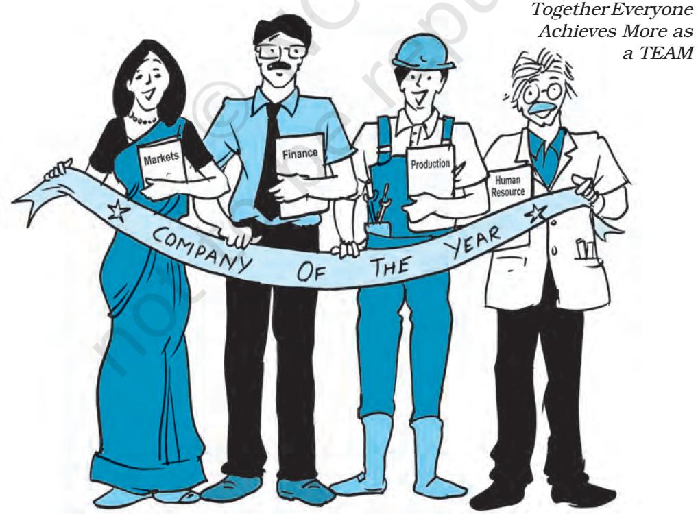
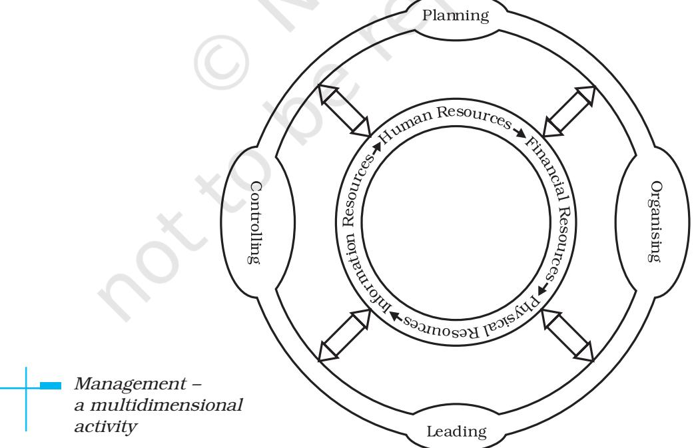
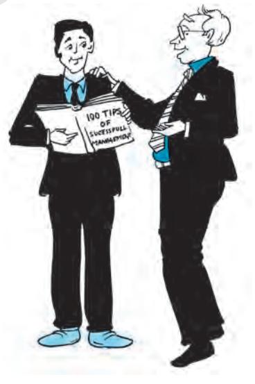
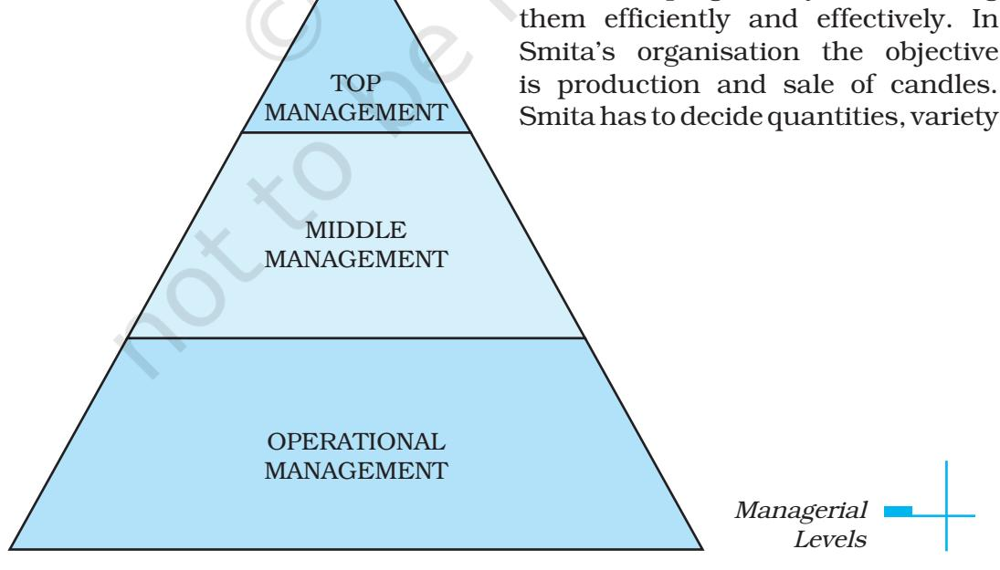
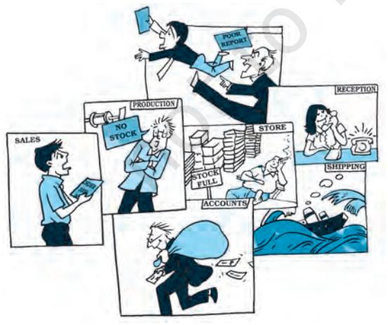

# **NATURE AND SIGNIFICANCE OF MANAGEMENT**

### **Management at Tata Steel**

OBJECTIVES Founded in 1868, by Jamsetji Nusserwanji ,Tata the Tata Group is a global business conglomerate operating in over 100 countries across 5 continents. His strong sense of values and spirit of innovation and entrepreneurship are a legacy that continues to guide Tata companies till date. He had four goals in life: setting up an iron and steel company, a world-class learning institution, a unique hotel and a hydro-electric plant. Only the hotel became a reality during his lifetime, with the inauguration of the Taj Mahal Hotel at Colaba waterfront in Mumbai on 3 December 1903 at the cost of 11 million (worth 11 billion in 2015 prices). At that time it was the only hotel in India to have electricity.

He believed that satisfied workers create satisfied workers and in lieu to this principle he paid all his workers gratuity, provident fund well before it was made mandatory. His management skills were clearly evident when minute details were chalked in planning and building the entire city of Jamshedpur. The values and principles that have governed the business for a century are enshrined in the Tata Code of Conduct (TCOC).

From an early foray into steel and automobiles, to staying abreast of the latest technologies, the Tata Group today has 29 publicly-listed Tata enterprises, which include Tata Steel, Tata Motors, Tata Consultancy Services, Tata Power, Tata Chemicals, Tata Global Beverages, Tata Teleservices, Titan, Tata Communications and Indian Hotels. The group has a combined market capitalisation of around $103.51bn (2016-17).

Tata has a strong sense of social responsibility. They balance economic prosperity, environmental responsibility and social benefits for the community. In India, they are a partner in progress with Odisha, and believe in taking its stakeholders forward in its journey of growth. Tata Steel Thailand is one of the first 30 companies that joined UNICEF in Child Friendly Business in "The Children Sustainability Forum" to make a commitment in protecting children's rights. Tata Steel Europe's Community Partnership Programme- 'Future Generations', with sub-themes of education, environment, health and Well-being works across

L E A R N I N G

After studying this chapter, you should be able to:

- n Describe the characteristics of management and its importance in an organisation;
- n Explain the nature of management as an art, science and profession;
- n Explain the functions of management; and
- n Appreciate the nature and importance of coordination.

Ch_01.indd 1 24-09-2019 12:15:10 PM

the UK, assisting job and wealth creation by supporting small and medium businesses with finance and business premises.

They also play a constructive role in addressing climate change – both by reducing carbon footprint, and by creating high performance steels that lead to fuel-efficient vehicles and energy-efficient buildings. Their Environmental Management Systems meet the ISO 14001 standards at all of their main manufacturing sites.

Shaped by a lineage of sound and straightforward business principles, the Tata Group is built on a foundation of trust and transparency. Building such huge enterprises, sustaining and running them profitably are possible only through effective and efficient management and co-ordination at all levels.

*Source: www.tatasteel.com; Accessed June, 2018*

# **Introduction**

The above case is an example of a successful organisation which is amongst the top companies in India. It has risen to the top because of its quality of management. Management is required in all kinds of organisations—those manufacturing handlooms, trading in consumer goods or providing hairstyling services and even in non-business organisations. Let us take another example.

Smita Rai is a 38-year old entrepreneur who grew up in a rural district called Namchi, South Sikkim. She was very good in art and craft particularly, Wax moulds. She loved to make candles, often she make into toys and small pieces of art with wax and used it as a gift for her friends and relatuves. She was loved and appreciated for these. Smita was never happy with the conditions of the women in her district as most were poor and jobless, so she planned to do something to solve their problems because she knew that imparting skills for livelihood is needed but she had no idea of how to implement her idea.

In August 2012, she met Abishek Lama, the Branch Manager of NEDFI, Namchi Branch, a financial corporation which support local people with skills development programs and also channelize them into revenue generating activities. Smita got interested. "I love making candles, then, why not convert my hobby into a venture and involve these rural women also", she thought. This led to the establishment of Namchi Designer Candles with the help of NEDFI, some financial institutions and support from different stakeholders in various dimensions.

Since then, the women have never looked back, despite challenges. The

Ch_01.indd 2 24-09-2019 12:15:10 PM

women also faced a lot of harassment but they could overcome all those troubles.

Namchi Designer Candles has 100 per cent women as employees and they also produce varieties of candles. During Diwali, they produce customized candles meant for the occasion. These Diwali themed candle has been a success in Sikkim as its demand increases on a yearly basis.

Namchi Designer Candles has been receiving numerous awards such as North East Women Entrepreneur of the year 2015-2016 for Sikkim and Sreemanta Shankar Mission of Guwahati on 26th April 2018 at New Delhi.

A typical day in Smita's life consists of a series of interrelated and continuous functions. She has to plan a special festive collection for Diwali. This means organising more funds and recruiting more workers. She also has to regularly communicate with her suppliers to ensure that deadlines regarding delivery of goods are met. In the course of the day, she meets customers for a general feedback and any suggestions that they may have.

Smita is managing Namchi Designer Candles. So is the Principal managing your school. They all manage organisations. Schools, hospitals, shops and large corporations are all organisations with diverse goals that are aimed at achieving something. No matter what the organisation is or what its goals might be, they all have something in common-management and managers.

You have observed that Smita's work as a manager consists of a series of different activities or functions aimed at achieving the goals of the organisation. These interconnected and interdependent functions are part of management. Successful organisations do not achieve their goals by chance but by following a deliberate process called 'management'.

### **Definitions of Management**

"Management is the process of designing and maintaining an environment in which individuals, working together in groups, efficiently accomplish selected aims."

Harold Koontz and Heinz Weihrich

"Management is defined as t he process of planning, organising, actuating and controlling an organisation's operations in order to achieve coordination of the human and material resources essential in the effective and efficient attainment of objectives."

Robert L. Trewelly and M. Gene Newport "Management is the process of working with and through others to effectively achieve organisational objectives by efficiently using limited resources in the changing environment." Kreitner

Ch_01.indd 3 24-09-2019 12:15:10 PM

Management is essential for all organisations big or small, profit or non-profit, services or manufacturing. Management is necessary so that individuals make their best contribution towards group objectives.

Management consists of a series of interrelated functions that are performed by all managers. Later in this chapter you will understand that although both of them are managers, they function at different levels in the organisation. The time spent by managers in different functions however is different. Managers at the top level spend more time in planning and organising than managers at lower levels of the organisation.

# **Concept**

Management is a very popular term and has been used extensively for all types of activities and mainly for taking charge of different activities in any enterprise. As you have seen from the above example and case study that management is an activity which is necessary wherever there is a group of people working in an organisation. People in organisations are performing diverse tasks but they are all working towards the same goal. Management aims at guiding their efforts towards achieving a common objective — a goal. Thus, management has to see that tasks are completed and goals are achieved (i.e., effectiveness) with the least amount of resources at a minimum cost (i.e., efficiency).

Management, has therefore, been defined as a process of getting things done with the aim of achieving goals effectively and efficiently. We need to analyse this definition. There are certain terms which require elaboration. These are (a) process, (b) effectively, and (c) efficiently.

Process in the definition means the primary functions or activities that management performs to get things done. These functions are planning, organising, staffing, directing and controlling which we will discuss later in the chapter and the book.

Being effective or doing work effectively basically means finishing the given task. Effectiveness in management is concerned with doing the right task, completing activities and achieving goals. In other words, it is concerned with the end result.

But it is not enough to just complete the tasks. There is another aspect also, i.e., being efficient or as we say doing work efficiently.

Efficiency means doing the task correctly and with minimum cost. There is a kind of cost-benefit analysis involved and the relationship between inputs and outputs. If by using less resources (i.e., the inputs) more benefits are derived (i.e., the outputs) then efficiency has increased. Efficiency is also increased when for the same benefit or outputs, fewer resources are used and less costs are incurred. Input resources are money, materials, equipment and

Ch_01.indd 4 24-09-2019 12:15:10 PM

persons required to do a particular task. Obviously, management is concerned with the efficient use of these resources, because they reduce costs and ultimately lead to higher profits.

### *Effectiveness versus Efficiency*

These two terms are different but they are interrelated. For management, it is important to be both effective and efficient. Effectiveness and efficiency are two sides of the same coin. But these two aspects need to be balanced and management at times, has to compromise with efficiency. For example, it is easier to be effective and ignore efficiency i.e., complete the given task but at a high cost. Suppose, a company's target production is 5000 units in a year. To achieve this target the manager has to operate on double shifts due to power failure most of the time. The manager is able to produce 5000 units but at a higher production cost. In this case, the manager was effective but not so efficient, since for the same output, more inputs (labour cost, electricity costs) were used.

At times, a business may concentrate more on producing goods with fewer resources i.e., cutting down cost but not achieving the target production. Consequently, the goods do not reach the market and hence the demand for them declines and competitors enter the market. This is a case of being efficient but not effective since the goods did not reach the market.

Therefore, it is important for management to achieve goals (effectiveness) with minimum resources i.e., as efficiently as possible while maintaining a balance between effectiveness and efficiency. Usually high efficiency is associated with high effectiveness which is the aim of all managers. But undue emphasis on high efficiency without being effective is also not desirable. Poor management is due to both inefficiency and ineffectiveness.

# **Characteristics of Management**

After going through some of the definitions we find some elements that may be called the basic characteristics of management:

- (i) **Management is a goal-oriented process:** An organisation has a set of basic goals which are the basic reason for its existence. These should be simple and clearly stated. Different organisations have different goals. For example, the goal of a retail store may be to increase sales, but the goal of The Spastics Society of India is to impart education to children with special needs. Management unites the efforts of different individuals in the organisation towards achieving these goals.
Ch_01.indd 5 24-09-2019 12:15:10 PM

### **The Management Mantra from GE**

Jack Welch was appointed CEO of GE in 1981. At that time the firm had a market capitalisation of $13 billion. In 2000 when he stepped down the firm's turnover had increased multifold to $500 billion. What was the secret of Welch's success? He has laid down the following pointers for managers to be successful:

- n *Create a vision and then ignite your organisation to make this vision a reality.* Get people so passionate about what they are doing that they cannot wait to execute this plan. Have great energy, competitive spirit and the ability to spark excitement and achieve results. Search for leaders who have the same qualities.
- n *Focus on strategic issues.* Your job is to understand the vital issues within each of your businesses. Recognise the talent needed to win in those markets.
- n *Focus on the main issue .* Your job is to see the big picture. Don't manage every detail. Don't get caught up in the minute details, but instead inspire others to execute some of your vision. Surround yourself with great people and trust them to do their job and contribute their best to the organisation.
- n *Involve everyone and welcome great ideas from everywhere.* Anyone can be a leader, just so long as they contribute, and the most meaningful way for anyone to contribute is to come up with a good idea. Business is all about getting the best ideas from everyone. New ideas are the lifeblood of the organisation, the fuel that makes it run. "The hero is the person with a new idea." There is simply nothing more important to an organisation than expressing ideas and creating a vision.
- n *Lead by example.* To spark others to perform, you must lead by example. Jack Welch's mastery of the four E's of leadership – Energy, Energise, Edge, and Execution – was always in evidence. "He had great energy, sparked others, had incredible competitive spirit, and had a record of execution that was second to none. This is a key of the Welch phenomenon. Had he been lacking in any of the traits he espoused, he would not have commanded such acclaim."

*Source: www.ge.co.in*

- (ii) **Management is all pervasive:** The activities involved in managing an enterprise are common to all organisations whether economic, social or political. A petrol pump needs to be managed as much as a hospital or a school. What managers do in India, the USA, Germany or Japan is the same. How they do it may be quite different. This difference is due to the differences in culture, tradition and history.
- (iii) **Management is multidimensional:** Management is a complex activity that has three main dimensions. These are:
	- (a) *Management of work:* All organisations exist for the performance of some work. In a factory, a product is manufactured, in a garment store a customer's need is satisfied and in a hospital a patient is treated. Management translates this work in terms

Ch_01.indd 6 24-09-2019 12:15:10 PM

of goals to be achieved and assigns the means to achieve it. This is done in terms of problems to be solved, decisions to be made, plans to be established, budgets to be prepared, responsibilities to be assigned and authority to be delegated.

- (b) *Management of people:* Human resources or people are an organisation's greatest asset. Despite all developments in technology "getting work done through people" is still a major task for the manager. Managing people has two dimensions
(i) it implies dealing with employees as individuals with diverse needs and behavior; (ii) it also means dealing with individuals as a group of people. The task of management is to make people work towards achieving the organisation's goals, by making their strengths effective and their weaknesses irrelevant.

- (c) *Management of operations:* No matter what the organisation, it has some basic product or service to provide in order to survive. This requires a production process which entails

Ch_01.indd 7 24-09-2019 12:15:16 PM

the flow of input material and the technology for transforming this input into the desired output for consumption. This is interlinked with both the management of work and the management of people.

- (iv) **Management is a continuous process:** The process of management is a series of continuous, composite, but separate functions (planning, organising, directing, staffing and controlling). These functions are simultaneously performed by all managers all the time. You may have observed that Smita at Namchi Designer Candles performs several different tasks in a single
day. Some days she may spend more time in planning a future exhibition and on another day, she may spend time in sorting out an employee's problem. The task of a manager consists of an ongoing series of functions.

- (v) **Management is a group activity:** An organisation is a collection of diverse individuals with different needs. Every member of the group has a different purpose for joining the organisation but as members of the organisation they work towards fulfilling the common organisational goal. This requires team work and coordination of individual effort in a common direction.

Ch_01.indd 8 24-09-2019 12:15:16 PM

At the same time management should enable all its members to grow and develop as needs and opportunities change.

- (vi) **Management is a dynamic function:** Management is a dynamic function and has to adapt itself to the changing environment. An organisation interacts with its external environment which consists of various social, economic and political factors. In order to be successful, an organisation must change itself and its goals according to the needs of the environment. You probably know that McDonalds, the fast food giant made major changes in its menu to be able to survive in the Indian market.
- (vii) **Management is an intangible force:** Management is an intangible force that cannot be seen but its presence can be felt in the way the organisation functions. The effect of management is noticeable in an organisation where targets are met according to plans, employees are happy and satisfied, and there is orderliness instead of chaos.

### **Objectives of Management**

Management seeks to achieve certain objectives which are the desired result of any activity. They must be derived from the basic purpose of the business. In any organisation there are different objectives and management has to achieve all objectives in an effective and efficient manner. Objectives can be classified into organisational objectives, social objectives and personal or individual objectives.

- (i) **Organisational Objectives:** Management is responsible for setting and achieving objectives for the organisation. It has to achieve a variety of objectives in all areas considering the interest of all stakeholders including, shareholders, employees, customers and the government. The main objective of any organisation should be to utilise human and material resources to the maximum possible advantage, i.e., to fulfill the economic objectives of a business. These are survival, profit and growth.  *Survival:* The basic objectives of any business is survival. Management must strive to ensure the survival of the organisation. In order to survive, an organisation must earn enough revenues to cover costs.  *Profit:* Mere survival is not enough for business. Management has to ensure that the organisation makes a profit. Profit provides a vital incentive for the continued successful operation of the enterprise. Profit is essential for covering costs and risks of the business.
Ch_01.indd 9 24-09-2019 12:15:16 PM

 *Growth:* A business needs to add to its prospects in the long run, for this it is important for the business to grow. To remain in the industry, management must exploit fully the growth potential of the organisation. Growth of a business can be measured in terms of sales volume increase in the number of employees, the number of products or the increase in capital investment, etc. There can be other indicators of growth.

- (ii) **Social objectives:** It involves the creation of benefit for society. As a part of society, every organisation whether it is business or non-business, has a social obligation to fulfill. This
### **ITC – Empowering Rural India**

A quiet digital revolution is reshaping the lives of farmers in remote Indian villages. In these villages, farmers grow soyabeans, wheat and coffee in small plots of land, as they have done for thousands of years. A typical village has no reliable electricity and has antiquated telephone lines. The farmers are largely illiterate and have never seen a computer. But farmers in these villages are conducting e-business through an initiative called E-Choupal, created by ITC, one of India's largest consumer product and agribusiness companies.

ITC's E-Chaupal initiative is a fine example of a business organisation fulfilling corporate social responsibility. The basic aim of the programme is to provide farmers in rural India with the opportunity to make use of a direct marketing channel eliminating multiple intermediation and wasteful handling and unnecessary transaction costs. It is the single-largest information technology-based intervention by a corporate entity in rural India, transforming the Indian farmer into a progressive knowledge-seeking citizen, enriching him with knowledge and elevating him to a new order of empowerment.

E-Choupal delivers real-time information and customised knowledge to improve the farmer's decision-making ability, thereby better aligning farm output to market demands; securing better quality, productivity and improved price discovery. Given the low levels of literacy in the rural sector, the role of the Choupal Sanchalak, the lead farmer of the village, in facilitating physical interface between the computer terminal and the farmers is central to the project. E-Choupal Smart Cards enable farmer identification to provide customised information on the E-Choupal website. Online transactions are captured to reward farmers for volume and value of usage.

The E-Chaupal initiative has found its way into the Harvard Business School as a leading case study illustarating the use of modern technology by a leading business house for the benefit of the rural poor.

> *Source: Mohanbir Sawhney, McCormick Tribune Professor of Technology, Kellogg School of Management, USA.*

Ch_01.indd 10 24-09-2019 12:15:16 PM

refers to consistently creating economic value for various constituents of society. This includes using environmental friendly methods of production, giving employment opportunities to the underpreviledged sections of society and providing basic amenities like schools and healthcare, etc., for community. The box given below illustrates how a company can fulfill its social responsibility.

- (iii) **Personnel objectives:** Organisations are made up of people who have different personalities, backgrounds, experiences and objectives. They all become part of the organisation to satisfy their diverse needs. These vary from financial needs such as competitive salaries and perks, social needs such as peer recognition and higher level needs such as personal growth and development. Management has to reconcile personal goals with organisational objectives for harmony in the organisation.
**Importance of Management** Having understood that management is a universal activity that is integral to any organisation we now examine some of the reasons that have made management so important:

- (i) **Management helps in achieving group goals:** Management is required not for itself but
for achieving the goals of the organisation. The task of a manager is to give a common direction to the individual effort in achieving the overall goal of the organisation.

- (ii) **Management increases efficiency:** The aim of a manager is to reduce costs and increase productivity through better planning, organising, directing, staffing and controlling the activities of the organisation.
- (iii) **Management creates a dynamic organisation:** All organisations have to function in an environment which is constantly changing. It is generally seen that individuals in an organisation resist change as it often means moving from a familiar, secure environment into a newer and more challenging one. Management helps people adapt to these changes so that the organisation is able to maintain its competitive edge.
- (iv) **Management helps in achieving personal objectives:** A manager motivates and leads his team in such a manner that individual members are able to achieve personal goals while contributing to the overall organisational objective. Through motivation and leadership the management helps individuals to develop team spirit, cooperation and commitment to group success.
- (v) **Management helps in the development of society:** An orga-

Ch_01.indd 11 19-11-2019 5:06:37 PM

nisation has multiple objectives to serve the purpose of the different groups that constitute it. In the process of fulfilling all these, management helps in the development of the organisation and through that it helps in the development of society. It helps to provide good quality products and services, creates employment opportunities, adopts new techno-logy for the greater good of the people and leads the path towards growth and development.

# **Nature of Management**

Management is as old as civilisation. Although modern organisations are of recent origin, organised activity has existed since the time of the ancient civilisations. In fact, organisations may be considered the distinguishing feature that separated civilised society from uncivilised ones. The earliest management practices were a set of rules and regulations that grew out of the experiences of governmental and commercial activities. The development of trade and commerce gradually led to the development of management principles and practices.

The term 'management' today has several different connotations that highlight the different aspects of its nature. The study of management has evolved over a period of time along with the modern organisations; based both on the experience and practice of managers and a set of theoretical relationships. Over a period of time, it has grown into a dynamic subject with its own special characteristics. However, one question that needs to be addressed pertaining to the nature of management is whether it is a science or an art or both? In order to answer this let us examine the features of both science and art to see how far management fulfills them.

# **Management as an Art**

What is art? Art is the skillful and personal application of existing knowledge to achieve desired results. It can be acquired through study, observation and experience. Since art is concerned with personal application of knowledge some kind of ingenuity and creativity is required to practice the basic principles learnt. The basic features of an art are as follows:

- (i) **Existence of theoretical knowledge:** Art presupposes the existence of certain theoretical knowledge. Experts in their respective areas have derived certain basic principles which are applicable to a particular form of art. For example, literature on dancing, public speaking, acting or music is widely recognised.
- (ii) **Personalised application:** The use of this basic knowledge varies from individual to individual. Art, therefore, is a very person-

Ch_01.indd 12 24-09-2019 12:15:16 PM

alised concept. For example, two dancers, two speakers, two actors, or two writers will always differ in demonstrating their art.

- (iii) **Based on practice and creativity:** All art is practical. Art involves the creative practice of existing theoretical knowledge. We know that all music is based on seven basic notes. However, what makes the composition of a musician unique or different is his use of these notes in a creative manner that is entirely his own interpretation.
Management can be said to be an art since it satisfies the following criteria:

- (i) A successful manager practices the art of management in the day-to-day job of managing an enterprise based on study, observation and experience. There is a lot of literature available in various areas of management like marketing, finance and human resources which the manager has to specialise in. There is existence of theoretical knowledge.
- (ii) There are various theories of management, as propounded by many management thinkers, which prescribe certain universal principles. A manager applies these scientific methods and body of knowledge to a given situation, an issue or a problem, in his own unique

manner. A good manager works through a combination of practice, creativity, imagination, initiative and innovation. A manager achieves perfection after long practice. Students of management also apply these principles differently depending on how creative they are.

- (iii) A manager applies this acquired knowledge in a personalised and skillful manner in the light of the realities of a given situation. He is involved in the activities of the organisation, studies critical situations and formulates his own theories for use in a given situation. This gives rise to different styles of management
The best managers are committed and dedicated individuals; highly trained and educated, with personal qualities such as ambition, selfmotivation, creativity and imagination, a desire for development of the self and the organisation they belong to. All management practices are based on the same set of principles; what distinguishes a successful manager from a less successful one is the ability to put these principles into practice.

# **Management as a Science**

Science is a systematised body of knowledge that explains certain general truths or the operation of general laws. The basic features of science are as follows:

Ch_01.indd 13 24-09-2019 12:15:16 PM

### **Some Interesting Cross-disciplinary Perspectives**

**Anthropology** – Anthropology is the study of societies, which helps us learn about human beings and their activities. Anthropologists' work on cultures and environments, for instance, has helped managers to better understand differences in fundamental values, attitudes, and behavior between people in different countries and within different organisations.

**Economics** – Economics is concerned with the allocation and distribution of scarce resources. It provides us with an understanding of the changing economy as well as the role of competition and free markets in a global context. An understanding of free trade and protectionist policies is absolutely essential to any manager operating in the global marketplace, and these topics are addressed by economists.

**Philosophy** – Philosophy courses inquire into the nature of things, particularly values and ethics. Ethics are standards that govern human conduct. These ethics have shaped today's organisations by providing a basis for legitimate authority, linking rewards to performance, and justifying the existence of business and the corporate form.

**Political Science** – Political science is the study of the behavior of individuals and groups within a political environment. Management is affected by a nation's form of government – by whether it allows its citizens to hold property, by its citizens' ability to engage in and enforce contracts, and by the appeal mechanisms available to redress grievances. A nation's stand on property, contracts, and justice, in turn, shapes the type, form, and policies of its organisations.

**Psychology** – Psychology is the science that seeks to measure, explain, and sometimes change the behaviour of humans and other animals. Today's managers confront both a diverse customer base and a diverse set of employees. Psychologists' efforts to understand gender and cultural diversity provide managers with a better perception of the needs of their changing customer and employee populations. Psychology courses are also relevant to managers in terms of gaining a better understanding of motivation, leadership, trust, employee selection, performance appraisals, and training techniques.

**Sociology** – Sociology is the study of people in relation to their fellow human beings. What are some of the sociological issues that have relevance to managers? Here are a few. How are societal changes such as globalisation, increasing cultural diversity, changing gender roles, and varying forms of family life affecting organisational practices? What are the implications of schooling practices and education trends on future employees' skills and abilities? Answers to questions such as these have a major effect on how managers operate their businesses.

*Source: Fundamentals of Management Stephen P. Robbins David A. DeCenzo*

Ch_01.indd 14 24-09-2019 12:15:16 PM

- (i) **Systematised body of knowledge:** Science is a systematic body of knowledge. Its principles are based on a cause and effect relationship. For example, the phenomenon of an apple falling from a tree towards the ground is explained by the law of gravity.
- (ii) **Principles based on experimentation:** Scientific principles are first developed through observation and then tested through repeated experimentation under controlled conditions.
- (iii) **Universal validity:** Scientific principles have universal validity and application.

Based on the above features, we can say that management has some characteristics of science.

- (i) Management has a systematised body of knowledge. It has its own theory and principles that have developed over a period of time, but it also draws on other disciplines such as Economics, Sociology, Psychology and Mathematics. Like all other organised activity, management has its own vocabulary of terms and concepts. For example, all of us discuss sports like cricket and soccer using a common vocabulary. The players also use these terms to communicate with each other. Similarly managers need to communicate with one another with the help
of a common vocabulary for a better understanding of their work situation.

- (ii) The principles of management have evolved over a period of time based on repeated experimentation and observation in different types of organisations. However, since management deals with human beings and human behaviour, the outcomes of these experiments are not capable of being accurately predicted or replicated. Therefore, management can be called an inexact science. Despite these limitations, management scholars have been able to identify general principles of management. For example, scientific management principles by F.W. Taylor and Functional Management principles by Henri Fayol which you will study in the next chapter.
- (iii) Since the principles of management are not as exact as the principles of science, their application and use is not universal. They have to be modified according to a given situation. However, they provide managers with certain standardised techniques that can be used in different situations. These principles are also used for training and development of managers.

You must have understood from the foregoing discussion that management has features of both art and

Ch_01.indd 15 24-09-2019 12:15:16 PM

science. The practice of management is an art. However, managers can work better if their practice is based on the principles of management. These principles constitute the science of management. Management as an art and a science are therefore not mutually exclusive, but complement each other.

### **Management as a Profession**

You have understood so far that all forms of organised activity need to be managed. You would also have observed that organisations look for individuals with specific qualifications and experience to manage them. It has also been observed that there has been an increase in the corporate form of business on the one hand and increasing emphasis on managed business concerns. Does this imply that management is a profession? To answer this question let us examine the salient features of a profession and see whether management satisfies them.

A profession has the following characteristics:

- (i) **Well-defined body of knowledge**: All professions are based on a well-defined body of knowledge that can be acquired through instruction.
- (ii) **Restricted entry:** The entry to a profession is restricted through an examination or through acquiring an educational

degree. For example, to become a chartered accountant in India a candidate has to clear a specified examination conducted by the Institute of Chartered Accountants of India.

- (iii) **Professional association:** All professions are affiliated to a professional association which regulates entry, grants certificate of practice and formulates and enforces a code of conduct. To be able to practice in India lawyers have to become members of the Bar Council which regulates and controls their activities.
- (iv) **Ethical code of conduct:** All professions are bound by a code of conduct which guides the behaviour of its members. All doctors, for example, take the oath of ethical practice at the time they enter the profession.
- (v) **Service motive:** The basic motive of a profession is to serve their client's interests by rendering dedicated and committed service. The task of a lawyer is to ensure that his client gets justice.

Management does not meet the exact criteria of a profession. However, it does have some of the features of a profession:

- (i) All over the world there is marked growth in management as a discipline. It is based on a systematic body of knowledge comprising well-defined
Ch_01.indd 16 24-09-2019 12:15:17 PM

principles based on a variety of business situations. This knowledge can be acquired at different colleges and professional institutes and through a number of books and journals. The subject of management is taught at different institutions. Some of these have been set up with the specific purpose of providing management education such as the Indian Institutes of Management (IIMs) in India. Entry to different institutes is usually through an examination.

- (ii) There is no restriction on anyone being designated or appointed as manager in any business enterprise. Anyone can be called a manager irrespective of the educational qualifications possessed.
 Unlike professions such as medicine or law which require a practicing doctor or lawyer to possess valid degrees, nowhere in the world is it mandatory for a manager to possess any such specific degree. But professional knowledge and training is considered to be a desirable qualification, since there is greater demand for those who possess degrees or diplomas from reputed institutions. Therefore, as such the second criterion has not been strictly met.

- (iii) There are several associations of practising managers in India, like the AIMA (All India Management
Association) that has laid down a code of conduct to regulate the activities of their members. There is, however, no compulsion for managers to be members of such an association nor does it have any statutory backing.

- (iv) The basic purpose of management is to help the organisation achieve its stated goal. This may be profit maximisation for a business enterprise and service for a hospital. However, profit maximisation as the objective of management does not hold true and is fast changing. Therefore, if an organisation has a good management team that is efficient and effective it automatically serves society by providing good quality products at reasonable prices.
# **Levels of Management**

Management is a universal term used for certain functions performed by individuals in an enterprise who are bound together in a hierarchy of relationships. Every individual in the hierarchy is responsible for successful completion of a particular task. To be able to fulfill that responsibility he is assigned a certain amount of authority or the right to take a decision. This authority-responsibility relationship binds individuals as superiors and subordinates and gives rise to different levels in an organisation. Generally speaking there are three levels in the hierarchy of an organisation.

Ch_01.indd 17 24-09-2019 12:15:17 PM

- (i)**Top Management:** They consist of the senior-most executives of the organisation by whatever name they are called. They are usually referred to as the chairman, the chief executive officer, chief operating officer, president and vice-president. Top management is a team consisting of managers from different functional levels, heading finance, marketing etc. For example chief finance officer, vice president (marketing). Their basic task is to integrate diverse elements and coordinate the activities of different departments according to the overall objectives of the organisation. These top level managers are responsible for the welfare and survival of the organisation. They analyse the business environment and its implications for the survival of the firm. They formulate overall organisational goals and strategies for their achievement. They are responsible for all the activities of the business and for its impact on society. The job of the top manager is complex and stressful, demanding long hours and commitment to the organisation.
- (ii) **Middle Management:** is the link between top and lower level managers. They are subordinate to top managers and superior to the first line managers. They are usually known as division heads, for example

production manager. Middle management is responsible for implementing and controlling plans and strategies developed by top management. At the same time they are responsible for all the activities of first line managers. Their main task is to carry out the plans formulated by the top managers. For this they need to: (i) interpret the policies framed by top management, (ii) ensure that their department has the necessary personnel, (iii) assign necessary duties and responsibilities to them, (iv) motivate them to achieve desired objectives, and (v) cooperate with other departments for smooth functioning of the

*"You don't learn management from books alone..."*

Ch_01.indd 18 24-09-2019 12:15:18 PM

organisation. At the same time they are responsible for all the activities of first line managers.

- (iii) **Supervisory or Operational Management:** Foremen and supervisors comprise the lower level in the hierarchy of the organisation. Supervisors directly oversee the efforts of the workforce. Their authority and responsibility is limited according to the plans drawn by the top management. Supervisory management plays a very important role in the organisation since they interact with the actual work force and pass on instructions of the middle
management to the workers. Through their efforts quality of output is maintained, wastage of materials is minimised and safety standards are maintained. The quality of workmanship and the quantity of output depends on the hard work, discipline and loyalty of the workers.

**Functions of Management** Management is described as the process of planning, organising, directing and controlling the efforts of organisational members and of using organisational resources to achieve specific goals.

*Planning* is the function of determining in advance what is to be done and who is to do it. This implies setting goals in advance and developing a way of achieving them efficiently and effectively. In Smita's organisation the objective is production and sale of candles. Smita has to decide quantities, variety

Ch_01.indd 19 24-09-2019 12:15:18 PM

and colour and then allocate resources for their purchase from different suppliers. Planning cannot prevent problems, but it can predict them and prepare contingency plans to deal with them if and when they occur.

*Organising* is the management function of assigning duties, grouping tasks, establishing authority and allocating resources required to carry out a specific plan. Once a specific plan has been established for the accomplishment of an organisational goal, the organising function examines the activities and resources required to implement the plan. It determines what activities and resources are required. It decides who will do a particular task, where it will be done, and when it will be done. Organising involves the grouping of the required tasks into manageable departments or work units and the establishment of authority and reporting relationships within the organisational hierarchy. Proper organisational techniques help in the accomplishment of work and promote both the efficiency of operations and the effectiveness of results. Different kinds of business require different structures according to the nature of work. You will read more about this in a later chapter.

*Staffing* simply stated, is finding the right people for the right job. A very important aspect of management is to make sure that the right people with the right qualifications are available at the right places and times to accomplish the goals of the organisation. This is also known as the human resource function and it involves activities such as recruitment, selection, placement and training of personnel. Infosys Technologies which develops software needs systems analysts and programmers.

*Directing* involves leading, influencing and motivating employees to perform the tasks assigned to them. This requires establishing an atmosphere that encourages employees to do their best. Motivation and leadership are two key components of direction. Directing also involves communicating effectively as well as supervising employees at work. Motivating workers means simply creating an environment that makes them want to work. Leadership is influencing others to do what the leader wants them to do. A good manager directs through praise and criticism in such a way that it brings out the best in the employee.

*Controlling* is the management function of monitoring organisational performance towards the attainment of organisational goals. The task of controlling involves establishing standards of performance, measuring current performance, comparing this with established standards and

Ch_01.indd 20 24-09-2019 12:15:18 PM

taking corrective action where any deviation is found. Here management must determine what activities and outputs are critical to success, how and where they can be measured and who should have the authority to take corrective action.

The various functions of a manager are usually discussed in the order given above, suggesting that a manager first plans, then organises, puts staff in position, then directs, and finally controls. In reality, managers are rarely able to carry out these functions in isolation. The activities of a manager are interrelated and it is often difficult to pinpoint where one ended and the other began.

# **Coordination — The Essence of Management**

You have understood by now that a manager has to perform five interrelated functions in the process of managing an organisation which is a system made up of different interlinked and interdependent subsystems. A manager has to link these diverse groups towards the achievement of a common goal. The process by which a manager synchronises the activities of different departments is known as coordination.

Coordination is the force that binds all the other functions of management. It is the common thread that runs through all activities such as purchase, production, sales, and finance to ensure continuity in the working of the organisation. Coordination is sometimes considered a separate function of management. It is however, the essence of management, for achieving harmony among individual efforts towards the accomplishment of group goals. Each managerial function is an exercise contributing individually to coordination. Coordination is implicit and inherent in all functions of an organisation.

The process of coordinating the activities of an organisation begins at the planning stage itself. Top management plans for the entire organisation. According to these plans the organisational structure is developed and staffed. In order to ensure that these plans are executed according to plans directing is required. Any discrepancies between actual and realised activities are then taken care of at the stage of controlling. It is through the process of coordination that a manager ensures the orderly arrangement of individual and group efforts to ensure unity of action in the realisation of common objectives. Coordination therefore involves synchronisation of the different actions or efforts of the various units of an organisation. This provides the requisite amount, quality, timing and sequence of efforts which ensures that planned objectives are achieved with a minimum of conflict.

Ch_01.indd 21 24-09-2019 12:15:19 PM

# **Characteristics of**

# **Coordination**

The definitions given above highlight the following features of coordination:

- (i) **Coordination integrates group efforts:** Coordination unifies unrelated or diverse interests into purposeful work activity. It gives a common focus to group effort to ensure that performance is as it was planned and scheduled.
- (ii) **Coordination ensures unity of action:** The purpose of coordination is to secure unity of action in the realisation of a common purpose. It acts as the binding force between departments and ensures that all action is aimed at achieving
	- *In the absence of coordination what results is chaos*

the goals of the organisation. At Namchi Designer Candles, the production and sales department have to coordinate their work, so that production takes place according to the demand in the market.

- (iii) **Coordination is a continuous process:** Coordination is not a one-time function but a continuous process. It begins at the planning stage and continues till controlling. Smita plans her dewali collection in the month of June itself. She has to then ensure that there is adequate workforce and continuously monitor whether production is proceeding according to plans. Her marketing department also has to be briefed in time to prepare their promotional and advertising campaigns.
- (iv) **Coordination is an all pervasive function:** Coordination is required at all levels of management due to the interdependent nature of activities of various departments. It integrates the efforts of different departments and different levels. The purchase, production and sales departmental efforts have to be coordinated by Smita for achieving organisational objectives harmoniously. The purchase department is responsible for procuring fabric. This then becomes the basis of the activities of the production department

Ch_01.indd 22 24-09-2019 12:15:21 PM

and finally sales can take place. If fabric purchased is of an inferior quality or is not according to the specifications of the production department, further sales will also decline. In the absence of coordination there is overlapping and chaos instead of harmony and integration of activities.

- (v) **Coordination is the responsibility of all managers:** Coordination is the function of every manager in the organisation. Top level managers need to coordinate with their subordinates to ensure that the overall policies for the organisation are duly carried out. Middle level management coordinates with both the top level and first line managers. Operational level management coordinates the activities of its workers to ensure that work proceeds according to plans.
- (vi) **Coordination is a deliberate function:** A manager has to coordinate the efforts of different people in a conscious

and deliberate manner. Even where members of a department willingly cooperate and work, coordination gives a direction to that willing spirit. Cooperation in the absence of coordination may lead to wasted effort and coordination without cooperation may lead to dissatisfaction among employees.

Coordination, therefore, is not a separate function of management, but its very essence. For an organisation to effectively and efficiently achieve its objectives coordination is required. Like a thread in a garland, coordination is a part of all management functions.

# **Importance of Coordination**

Coordination is important as it integrates the efforts of individuals, departments and specialists. The primary reason for coordination is that departments and individuals in the organisation are interdependent,

### **Definitions of Coordination**

Coordination is balancing and keeping together the team by ensuring suitable allocation of tasks to the various members and seeing that the tasks are performed with harmony among the members themselves. *E.F.L. Brech* Coordination is the process whereby an executive develops an orderly pattern of

group efforts among his subordinates and secures unity of action in the pursuit of common purpose. *McFarland*

Coordination is the orderly synchronising of efforts of subordinates to provide proper amount, timing and quality of execution so that their united efforts lead to the stated objectives, namely, the common purpose of the enterprise. *Theo Haimann*

Ch_01.indd 23 24-09-2019 12:15:21 PM

i.e. they depend on each other for information and resources to perform their respective activities. Thus, managers need to reconcile differences in approach, timing, effort or interest. At the same time, there is a need to harmonise individual goals and organisational goals.

(i) **Growth in size:** As organisations grow in size, the number of people employed by the organisation also increases. At times, it may become difficult to integrate their efforts and activities. All individuals differ in their habits of work, background, approaches to situations and relationships with others. It becomes necessary to ensure that all individuals work towards the common goals of the organisation. But employees may have their own individual goals also. Therefore, for organisational efficiency, it is important to harmonise individual goals and organisational goals through coordination.

(ii) **Functional differentiation:**  Functions of an organisation are divided into departments, divisions

### **'DABBAWALLAS' – Excellence through Coordination**

The Dabbawallas of Mumbai is the story of a SIX SIGMA business enterprise. The success of the business lies in the complex yet well coordinated exercise that is carried out on the streets of Mumbai day after day. What is the secret behind the efficiency with which their business is conducted?

The story of the dabbawallas begins in the kitchens of Mumbai. After they step out of their door, someone begins the time-consuming process of preparing the worker a fresh, homecooked lunch. What happens next for demonstrates the coordination of the dabbawallas system. The first dabbawalla picks up the tiffin from home and takes it to the nearest railway station.The second dabbawalla sorts out the dabbas at the railway station according to destination and puts them in the luggage carriage. The third one travels with the dabbas to the railway stations nearest to the destinations. The fourth one picks up dabbas from the railway station and drops them off at the offices.

By mid-morning, thousands of dabbawallas are bicycling through the streets of Mumbai, ensuring a hot home cooked lunch for their customers. The whole tiffin distribution requires negligible technology. The dabbawallas rely on low capital and use cycles, wooden carriages and local trains to achieve their target.There are several groups that work independently and network with each other to achieve their goal.

Each area is divided into several small distribution sectors and each sector is handled by a particular person. This person understands the address in that locality very well. Also, this perfection comes with practice. Many new employees work for months under the guidance of their seniors.

Punctuality and time management are on top of the agenda for dabbawallas. Whatever be the circumstances, the dabbawallas never get delayed even by a few minutes.

Ch_01.indd 24 24-09-2019 12:15:21 PM

and sections. In an organisation there may be separate departments of finance, production, marketing or human resources. All these departments may have their own objectives, policies and their own style of working. For example, the marketing department's objective may be to increase sales by 10 per cent by offering discounts. But, the finance department may not approve of such discounts as it means loss of revenue. These kinds of conflict arise in organisations because each unit/ department is performing activities in isolation from others and barriers between departments are becoming more rigid.

However, all departments and individuals are interdependent and they have to depend on each other for information to perform their activities. The activity of each department needs to be focused on attainment of common organisational goals. The process of linking the activities of various departments is accomplished by coordination.

(iii) **Specialisation:** Modern organisations are characterised by a high degree of specialisation. Specialisation arises out of the complexities of modern technology and the diversity of tasks to be performed. Organisations, therefore,

### **Management in the Twenty-first Century**

Even as you read this chapter, the organisation and its management are changing. As boundaries between cultures and nations get blurred and new communication technology makes it possible to think of the world as a 'global village', the scope of international and intercultural relationships is rapidly expanding. The modern organisation is a global organisation that has to be managed in a global perspective. What does this imply?

A global manager today is one who possesses what can be termed as 'hard' types of skills as well as 'softer' types of skills. Managers who understand analysis, strategy, engineering, and technology are still going to be needed, but extremely critical to global success are people who understand how teams work, how organisations work, how people are motivated.

A manager who really understands different cultures should be able to work in a West European, non-English speaking country, then move to a developing country like Malaysia or Kenya, and then be transferred to an office based in New York, USA, and be almost immediately productive in all three places.

It can thus be understood that the role of a global manager has evolved in much the same way that the global industry and economy have evolved. It has changed from being a single dimensional role in a defined business context, to being a multi-faceted role that calls for a diverse combination of technical skills, soft management and people skills, and the ability to imbibe and learn different cultural experiences.

Ch_01.indd 25 24-09-2019 12:15:21 PM

need to employ a number of specialists. Specialists usually think that they only are qualified to evaluate, judge and decide according to their professional criteria. They do not take advice or suggestions from others in matters pertaining to their area of specialisation. This often leads to conflict amongst different specialists as well as others in the organisation. Therefore, some coordination is required by an independent person to reconcile the differences in approach, interest or opinion of the specialists.

# **Management in the Twenty-first Century**

Even as you read this chapter, the organisation and its management are changing. As boundaries between cultures and nations get blurred and new communication technology makes it possible to think of the world as a 'global village', the scope of international and intercultural relationships is rapidly expanding. The modern organisation is a global organisation that has to be managed in a global perspective. What does this imply?

### **Key Terms**

Management Process Efficiency Effectiveness Art

Science Profession Planning Organising Staffing

Directing Controlling Coordination

### **Summary**

#### **Concept**

Management is the process of planning, organising, staffing, directing and controlling the enterprise resources efficiently and effectively for achieving the goals of the organisation. Effectiveness in management is concerned with doing the right task, completing activities and achieving goals. Efficiency means doing the task correctly and with minimum cost.

#### **Characteristics**

The key features of management are: (i) goal oriented process (ii) all pervasive (iii) multidimensional (iv) continuous process (v) group activity (vi) dynamic function (vii) tangible force.

### **Objectives**

Management fulfills three basic objectives: organisational, social and personal.

Ch_01.indd 26 24-09-2019 12:15:21 PM

#### **Importance**

Management is important because it helps in achieving group goals, increases efficiency, creates a dynamic organisation, helps achieve personal objectives and contributes to the development of society.

#### **Nature**

Management is a combination of an organised body of knowledge (science) and its skillful application (art). Although it does not satisfy all the requirements of a profession, it is to a large extent professional in character.

#### **Levels**

Management is considered a three-tier activity. The top management focuses on determination of objectives and policies, middle management attempts to achieve these objectives through the effort of other managers and supervisory or operational management directly oversees the efforts of the workforce.

#### **Functions**

All managers perform the following interrelated functions: Planning, Organising, Staffing, Directing and Controlling.

#### **Coordination**

Coordination is the essence of management. It is the process of achieving unity of action among interdependent activities and departments of an organisation.

### **Exercises**

#### **Very Short Answer Type:**

- 1. What is meant by management?
- 2. Name any two important characteristics of management.
- 3. Identify and state the force that binds all the other functions of management.
- 4. List any two indicators of growth of an organisation.
- 5. Indian Railways has launched a new broad gauge solar power train which is going to be a path breaking leap towards making trains greener and more environment friendly. The solar power DEMU (Diesel Electric Multiple Unit) has 6 trailer coaches and is expected to save about 21,000 liters of diesel and ensure a cost saving of Rs 12, 00,000 per year. Name the objectives of management achieved by Indian Railways in the above case.

Ch_01.indd 27 24-09-2019 12:15:21 PM

#### **Short Answer Type:**

- 1. Ritu is the manager of the northern division of a large corporate house. At what level does she work in the organisation? What are her basic functions?
- 2. State the basic features of management as a profession.
- 3. Why is management considered to be a multi-dimensional concept?
- 4. Company X is facing a lot of problems these days. It manufactures white goods like washing machines, microwave ovens, refrigerators and air conditioners. The company's margins are under pressure and the profits and market share are declining. The production department blames marketing for not meeting sales targets and marketing blames production department for producing goods, which are not of good quality meeting customers' expectations. The finance department blames both production and marketing for declining return on investment and bad marketing. State the quality of management that the company is lacking? What quality of management do you think the company is lacking? Explain briefly. What steps should the company management take to bring the company back on track?
- 5. Coordination is the essence of management. Do you agree? Give reasons.
- 6. Ashita and Lakshita are employees working in Dazzling enterprises dealing in costume jewellery. The firm secured an urgent order for 1,000 bracelets that were to be delivered within 4 days. They were assigned the responsibility of producing 500 bracelets each at a cost of Rs 100 per bracelet. Ashita was able to produce the required number within the stipulated time at the cost of Rs 55,000 whereas, Lakshita was able to produce only 450 units at a cost of Rs 90 per unit. State whether Ashita and Lakshita are efficient and effective. Give reasons to justify your answer.

#### **Long Answer Type:**

- 1. Management is considered to be both an art and science. Explain.
- 2. Do you think management has the characteristics of a fullfledged profession?

Ch_01.indd 28 24-09-2019 12:15:21 PM

- 3. "A successful enterprise has to achieve its goals effectively and efficiently." Explain.
- 4. Management is a series of continuous interrelated functions. Comment.
- 5. A company wants to modify its existing product in the market due to decreasing sales. You can imagine any product about which you are familiar. What decisions/steps should each level of management take to give effect to this decision?
- 6. A firm plans in advance and has a sound organisation structure with efficient supervisory staff and control system but on several occasion it finds that plans are not being adhered to. It leads to confusion and duplication of work. Advise remedy.

Ch_01.indd 29 24-09-2019 12:15:21 PM

