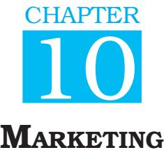
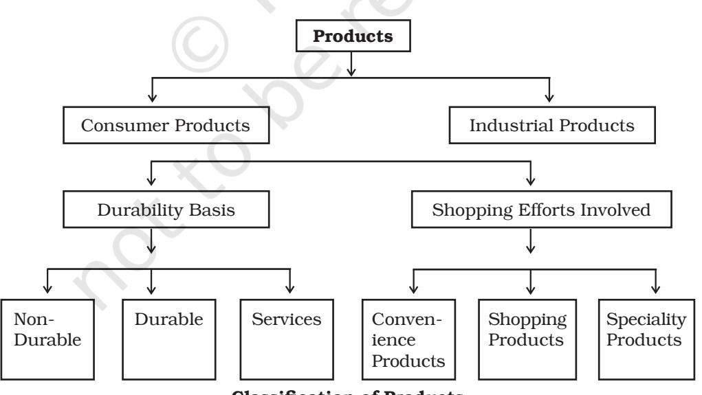
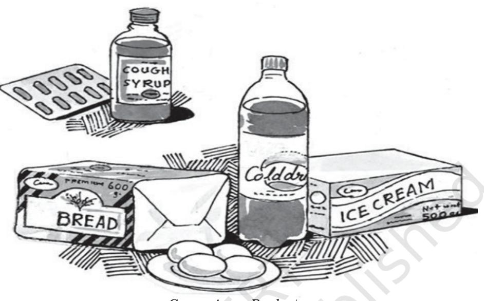
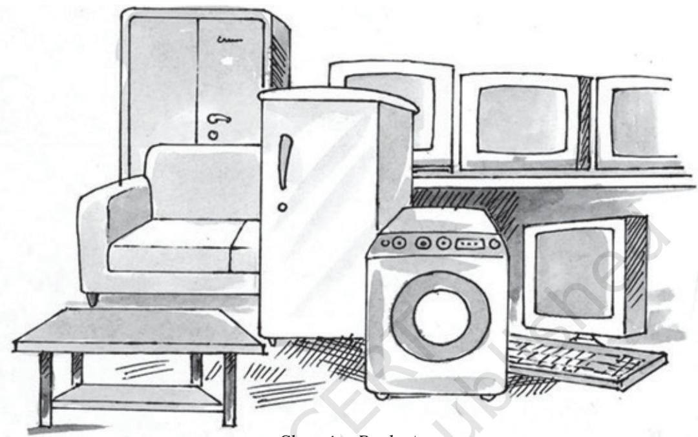
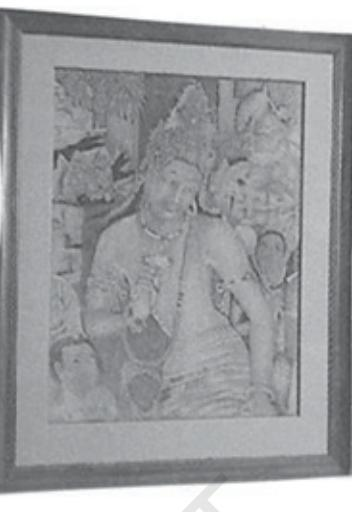
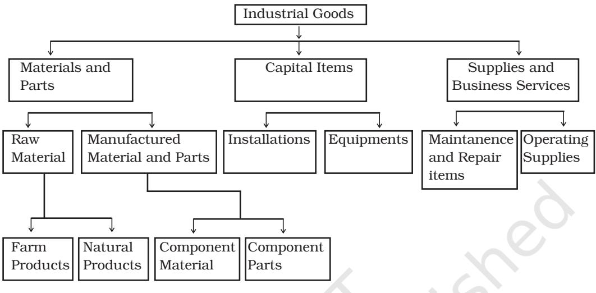
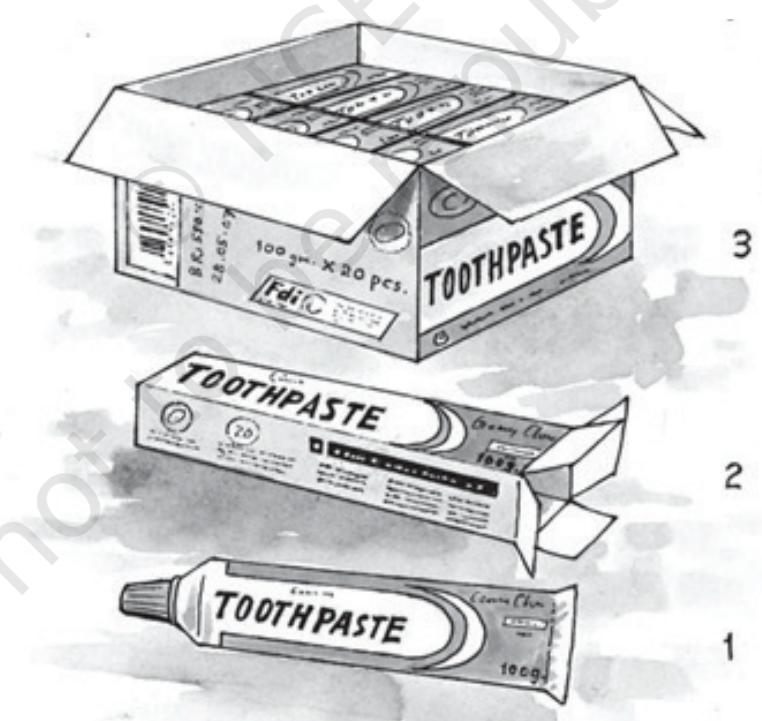
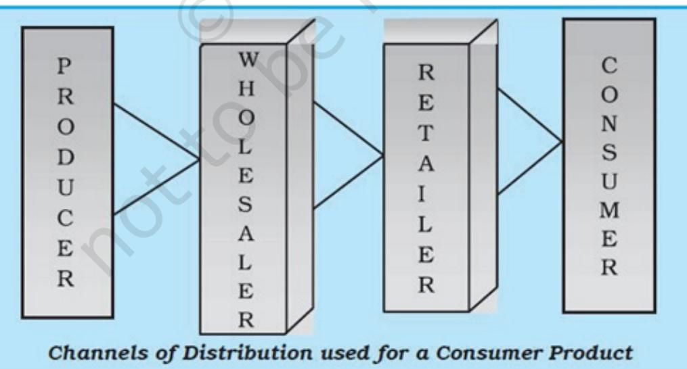
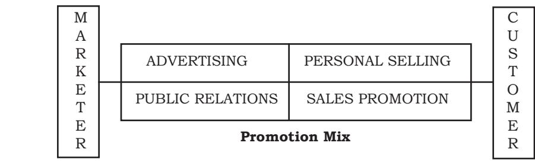
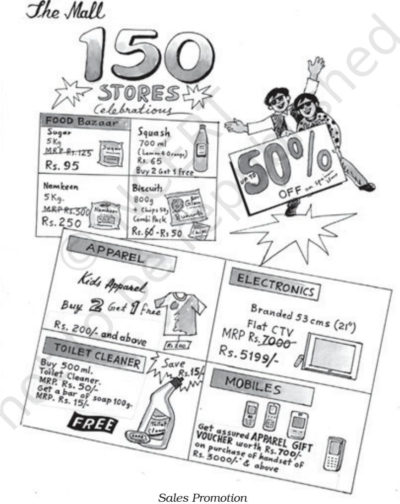

# Learning Objectives

After studying this chapter, you should be able to:

- ¾ explain the meaning of 'marketing';
- ¾ distinguish between ' m a r k e t i n g ' a n d 'selling';
- ¾ list out important functions of marketing;
- ¾ examine the role of marketing in the development of an economy in a firm, to the society and to consumers;
- ¾ explain the elements of marketing-mix;
- ¾ classify products into different categories;
- ¾ analyse the factors affecting price of a product;
- ¾ list out the types o f c h a n n e l s o f distribution; and
- ¾ explain the major tools of promotion, viz. advertising, personal selling, sales promotion and publicity.

# Where Do Companies Do Their Business?

# *In the Markets or in the Society?*

It is an undisputed fact that a company's survival does not depend upon its consumers alone, but a diverse set of stakeholders like the government, religious leaders, social activists, NGOs, media, etc. Hence, earning the satisfaction of these segments is also as imperative as they add to the power of the brand by word of mouth.

The social concern adds to the strength of the brand. Corporates that embraced the deepest social values, have been successful in building powerful brand, and, eventually, robust customer relationship. The area of corporate social justice fall under two broad categories. The issues such as the nutrition of children, child care, old-age homes, amelioration of hunger, offering aid to those affected by natural calamities, etc. needing instant attention with humanitarian perspective, comes under the first category.

The issues that contribute to making society a pleasant place to live in the long run, may be grouped under the second category. The issues which come under this category are health awareness and aid, education, environmental protection, women's employment and empowerment, preventing unjust discriminations (on the basis of caste, community, religion, ethnicity, race, and sex), eradication of poverty through employment, preservation of culture, values, and ethics, contribution to research, etc.

Procter and Gamble's (P&G) philosophy is that it should lead the industry in implementing a global environmental programme. P&G is one of the first companies in the world to actively study the influence of consumer products on the environment and introduce concentrated products, recycled plastic bottles, and refill packages to the industry. P&G contributes to sustainable development and addresses environmental and social issues connected with its products and services.

*Source: Adapted from 'Effective Executive'*

Ch_10.indd 242 10-08-2022 10:04:27

The term marketing has been described by different people in different ways. Some people believe that marketing is same as 'shopping'. Whenever they go out for shopping of certain products or services, they describe it as marketing. There are some other people who confuse marketing with 'selling' and feel that marketing activity starts after a product or service has been produced. Some people describe it to mean 'merchandising' or designing a product. All these descriptions may be partly correct but marketing is a much broader concept, which is discussed as follows:

Traditionally, marketing has been described in terms of its functions or activities. In this respect, marketing has been referred to as performance of business activities that direct the flow of goods and services from producers to consumers.

As we know, most of the manufacturing firms do not produce goods for their own consumption but for the consumption or use by others. Therefore, to move the goods and services from the producer to consumers, a number of activities, such as product designing or merchandising, packaging, warehousing, transportation, branding, selling, advertising and pricing are required. All these activities are referred to as marketing activities.

Thus, 'merchandising', 'selling' and distribution are all parts of a large number of activities undertaken by a firm, which are collectively called marketing.

It may be noted here that marketing is not merely a post- production activity. It includes many activities that are performed even before goods are actually produced, and continue even after the goods have been sold. For example, activities such as identification of customer needs, collection of information for developing the product, designing suitable product package and giving it a brand name are performed before commencement of the actual production. Similarly, many follow up activities are required for maintaining good customer relations for procuring repeat sale.

In modern times, emphasis is placed on describing marketing as a social process. It is a process whereby people exchange goods and services for money or for something of value to them. Taking the social perspective, Phillip Kolter has defined marketing as, "a social process by which individual groups obtain what they need and want through creating offerings and freely exchanging products and services of value with others".

"Business is not financial science, it's about trading, buying and selling. It's about creating a product or service so good that people will pay for it."

— Anta Roddick

"Marketing takes a day to learn. Unfortunately it takes time to master."

— Philip Kotler

Ch_10.indd 243 10-08-2022 10:04:27

244

#### Understanding Market

In the traditional sense, the term 'market' refers to the place where buyers and sellers gather to enter into transactions involving the exchange of goods and services. It is in this sense that this term is being used in day to day language, even today. The other ways in which this term is being used is in the context of a product market (cotton market, gold or share market), geographic market (national and international market), type of buyers (consumer market and industrial market) and the quantity of goods transacted (retail market and wholesale market).

But in modern marketing sense, the term market has a broader meaning. It refers to a set of actual and potential buyers of a product or service. For example, when a fashion designer designs a new dress and offers it for exchange, all the people who are willing to buy and offer some value for it can be stated to be the market for that dress. Similarly, market for fans or bicycles or electric bulbs or shampoos refers to all the actual and potential buyers for these products.

Thus, marketing is a social process where in people interact with others, in order to persuade them to act in a particular way, say to purchase a product or a service, rather than forcing them to do so. A careful analysis of the definition shows the following important features of marketing:

1. Needs and Wants: The process of marketing helps individuals and groups in obtaining what they need and want. Thus, the primary reason or motivation for people to engage in the process of marketing is to satisfy some of their needs or wants. In other words, the focus of the marketing process is on satisfaction of the needs and wants of individuals and organisations.

A need is a state of felt deprivation or feeling of being deprived of something. If unsatisfied, it leaves a person unhappy and uncomfortable. For example, on getting hungry, we become uncomfortable and start looking for objects that are capable of satisfying our hunger.

Needs are basic to human beings and do not pertain to a particular product. Wants, on the other hand, are culturally defined objects that are potential satisfiers of needs. In other words, human needs shaped by such factors as culture, personality and religion are called wants. A basic need for food, for example, may take various forms such as want for dosa and rice for a South Indian and chapatti and vegetables for a North Indian person.

A marketer's job in an organisation is to identify needs of the target customers and develop products and services that satisfy such needs.

2. Creating a Market Offering: On the part of the marketers, the effort involves creation of a 'market offering. Market offering refers to a complete offer for a product or service, having given features like size, quality, taste, etc; at a certain price; available at a given outlet or location and so on. Let us say the offer is for a cell phone, available in four different versions,

Ch_10.indd 244 10-08-2022 10:04:27

on the basis of certain features such as size of memory, television viewing, internet, camera, etc., for a given price, say between ` 5,000 and ` 20,000 (depending on the model selected), available for sale at say firm's exclusive shops in and around all metropolitan cities in the country. A good 'market offer' is the one which is developed after analysing the needs and preferences of the potential buyers.

3. Customer Value: The process of marketing facilitates exchange of products and services between the buyers and the sellers. The buyers, however, make buying decisions on their perceptions of the value of the product or service in satisfying their need, in relation to its cost. A product will be purchased only if it is perceived to be giving greatest benefit or value for the money. The job of a marketer, therefore, is to add to the value of the product so that the customers prefer it in relation to the competing products and decide to purchase it.

4. Exchange Mechanism: The process of marketing works through the exchange mechanism. The individuals (buyers and sellers) obtain what they need and want through the process of exchange. In other words, the process of marketing involves exchange of products and services for money or something considered valuable by the people.

Exchange refers to the process through which two or more parties come together to obtain the desired product or service from someone, offering the same by giving something in return. For example, a person feeling hungry may get food by offering to give money or some other product or service in return to someone who is willing to accept the same for food.

In the modern world, goods are produced at different places and are distributed over a wide geographical area through various middlemen, involving exchanges at different levels of distribution. Exchange is, therefore, referred to as the essence of marketing. For any exchange to take place, it is important that the following conditions are satisfied:

- (i) Involvement of at least two parties viz., the buyer and the seller.
- (ii) Each party should be capable of offering something of value to the other. For example, the seller offers a product and the buyer, money.
- (iii) Each party should have the ability to communicate and deliver the product or service. No exchange can take place if the buyers and sellers are not able to communicate with each other or if they can not deliver something of value to the other.
- (iv) Each party should have freedom to accept or reject other party's offer.
- (v) The parties should be willing to enter into transaction with each other. Thus, the acceptance or rejection of the offer takes place on voluntary basis rather than on the bases of any compulsion.

Ch_10.indd 245 10-08-2022 10:04:27

The points listed above are the necessary conditions for an exchange to take place. Whether the exchange actually takes place or not depends on the suitability of the act of exchange to both the parties, whether it makes the parties better off or at least not worse off.

Another important point to be noted is that Marketing is not merely a business phenomena or confined only to business organisations. Marketing activities are equally relevant to nonprofit organisations such as hospitals, schools, sports clubs and social and religious organisations. It helps these organisations in achieving their goals such as spreading the message of family planning, improving the literacy standards of people and providing medication to the sick.

# Marketing Management

Marketing management means management of the marketing function. In other words, marketing management refers to planning, organising, directing and control of the activities which facilitate exchange of goods and services between producers and consumers or users of products and services. Thus the focus of marketing management is on achieving desired exchange outcomes with the target markets. Taking a management perspective, the term marketing has been defined as "the process of planning and executing

| What can be Marketed? |  |
| --- | --- |
| Physical Products : | DVD player, Motor cycle, ipods, Cell phone, Footwear, |
| Television, Refrigerator. |  |
| Services : | Insurance, Health Care, Business Process Outsourcing, |
|  | Security, Easy Bill service, Financial Services |
|  | (Investment),Computer Education, Online Trading. |
| Ideas : | Polio Vaccination, Helpage, Family Planning, Donation of |
|  | Blood (Red cross), Donation of money on Flag Day (National |
| Foundation for Communal Harmony). |  |
| Persons : | For Election of Candidates for Certain Posts. |
| Place : | 'Visit Agra – 'City of Love', 'Udaipur – 'The City of Lakes', |
|  | 'Mysore – The City of Gardens', 'When Orisa celebrates, |
| Eleven the God JoinIn'. |  |
| Events : | Sports events (say Olympics, Cricket series), diwali mela, |
|  | fashion show, music concert, film festival, elephant race |
| (Kerala Tourism). |  |
| Information : | Production packaging and distribution of information by |
|  | organisations such as by universities, research organisation, |
|  | providing information as market information (marketing |
| research agencies), technology information. |  |

Ch_10.indd 246 10-08-2022 10:04:27

the conception, pricing, promotion and distribution of ideas, goods and services to create exchanges that satisfy individual and organisational goals" by American Management Association, similarly Philip kotler has defined Marketing management as the art and science of choosing target markets and getting, keeping and growing customers through creating, delivering and communicating superior customer values of management.

A careful analysis of the definition reveals that the process of management of marketing involves:

- (i) Choosing a target market, say a manufacturer may choose to make readymade garments for children up to the age of 5 years;
- (ii) In respect of the target market chosen, the focus of the process of management is on getting, keeping as well as growing the customers. That means the marketer has to create demand for his products so that the target customers purchase the product, keep them satisfied with the firm's products and also attract more customers to the firm's products so that the firm can grow; and
- (iii) The mechanism for achieving the objective is through creating, developing and communicating superior values for the customers. That means, the primary job of a marketing manager is to create superior values so that the customers are attracted to the products and services and communicate these values to the

prospective buyers and persuade them to buy these products.

Marketing management involves performance of various functions such as analysing and planning the marketing activities, implementing marketing plans and setting control mechanism. These functions are to be performed in such a way that organisation's objectives are achieved at the minimum cost.

Marketing management generally is related to creation of demand. However, in certain situations, the manager has to restrict the demand. For example, if there is a situation of 'overfull demand', i.e., the demand being more than what the company can or want to handle, (like what the situation in our country was before the adoption of policies of liberalisation and globalisation, in early 90's, in most consumer products be it automobiles or electronics goods or other durable products. The job of marketing mangers, in these situations would be to find ways to reduce the demand temporarily by say reducing the expenditure on promotion or increasing the prices. Similarly, if the demand is 'irregular', such as in case of seasonal products, (say fans, woollen clothes) the marketer's job is to change the time pattern of demand through such methods as providing short-term incentives, to the buyers. Thus, the marketing management in not only concerned with creating demand but with managing the demand effectively, as per the situation in the market.

Ch_10.indd 247 10-08-2022 10:04:27

248

### Marketing Versus Selling

Many people confuse 'selling' for 'marketing'. They consider these two terms as one and the same. Marketing refers to a large set of activities of which selling is just one part. For example, a marketer of televisions, before making the sale, does a lot of other activities such as planning the type and model of televisions to be produced, the price at which it would be sold and selecting the distribution outlets at which the same would be available, etc. In short, marketing involves whole range of activities relating to planning, pricing, promoting and distributing the products that satisfy customer's needs.

The function of selling, on the other hand, is restricted to promotion of goods and services through salesmanship, advertising, publicity and short-term incentives so that title of the product is transferred from seller to buyer or in other words product is converted into cash.

# Marketing Management Philosophies

In order to achieve desired exchange outcomes with target markets, it is important to decide what philosophy or thinking should guide the marketing efforts of an organisation. An understanding of the philosophy or the concept to be adopted is important as it determines the emphasis or the weightage to be put on different factors, in achieving the organisational objectives. For example, whether the marketing efforts of an organisation will focus on the product—say designing its features etc or on selling techniques or on customer's needs or the social concerns.

The concept or philosophy of marketing has evolved over a period of time, and is discussed as follows.

# The Production Concept

During the earlier days of industrial revolution, the demand for industrial goods started picking up but the number of producers were limited. As a result, the demand exceeded the supply. Selling was no problem. Anybody who could produce the goods was able to sell. The focus of business activities was, therefore, on production of goods. It was believed that profits could be maximised by producing at large scale, thereby reducing the average cost of production. It was also assumed that consumers would favour those products which were widely available at an affordable price. Thus, availability and affordability of the product were considered to be the key to the success of a firm. Therefore, greater emphasis was placed on improving the production and distribution efficiency of the firms.

# The Product Concept

As a result of emphasis on production capacity during the earlier days, the position of supply increased over period of time. Mere availability and

Ch_10.indd 248 10-08-2022 10:04:27

low price of the product could not ensure increased sale and as such the survival and growth of the firm. Thus, with the increase in the supply of the products, customers started looking for products which were superior in quality, performance and features. Therefore, the emphasis of the firms shifted from quantity of production to quality of products. The focus of business activity changed to bringing continuous improvement in the quality, incorporating new features, etc. Thus, product improvement became the key to profit maximisation of a firm, under the concept of product orientation.

### The Selling Concept

With the passage of time, the marketing environment underwent further change. The increase in the scale of business further improved the position with respect to supply of goods, resulting in increased competition among sellers. The product quality and availability did not ensure the survival and growth of firms because of the large number of sellers selling quality products. This led to greater importance to attracting and persuading customers to buy the product. The business philosophy changed. It was assumed that the customers would not buy, or not buy enough, unless they are adequately convinced and motivated to do so. Therefore, firms must undertake aggressive selling and promotional efforts to make customers buy their products. The use of promotional techniques such as advertising, personal selling and sales promotion were considered essential for selling of products. Thus, the focus of business firms shifted to pushing the sale of products through aggressive selling techniques with a view to persuade, lure or coax the buyers to buy the products. Making sale through any means became important. It was assumed that buyers can be manipulated but what was forgotten was that in the long run what matters most is the customer satisfaction, rather than anything else.

# The Marketing Concept

Marketing orientation implies that focus on satisfaction of customer's needs is the key to the success of any organisation in the market. It assumes that in the long run an organisation can achieve its objective of maximisation of profit by identifying the needs of its present and prospective buyers and satisfying them in an effective way. All the decisions in a firm are taken from the point of view of the customers. In other words, customer's satisfaction become the focal point of all decision making in the organisation. For example, what product will be produced, with what features and at what price shall it be sold, or where shall it be made available for sale will depend on what do the customers want. If the customers want features like double door in a refrigerator or a separate provision for water cooler in it, the organisation would produce a refrigerator with these features, would

Ch_10.indd 249 10-08-2022 10:04:27

price it at a level which the customers are willing to pay and so on. If all marketing decisions are taken with this prospective, selling will not be any problem. It will automatically follow. The basic role of a firm then is to 'identify a need and fill it'. The concept implies that products ad-services are bought not merely because of their quality, packing or brand name, but because they satisfy a specific need of a customer. A pre-requisite for the success of any organisation, therefore, is to understand and respond to customer needs.

To sum up, the marketing concept is based on the following pillars:

- (i) Identification of market or customer who are chosen as the target of marketing effort.
- (ii) Understanding needs and wants of customers in the target market.
- (iii) Development of products or services for satisfying needs of the target market.
- (iv) Satisfying needs of target market better than the competitors.
- (v) Doing all this at a profit.

Thus, the focus of the marketing concept is on customer needs and the customer satisfaction becomes the means to achieving the firms' objective of maximising profit. The purpose of

|  | Philosophies/ | Production | Product S | elling | Marketing S | ocietal |
| --- | --- | --- | --- | --- | --- | --- |
| Bases |  | Concept C | oncept C | oncept C | oncept C | oncept |
| 1. | Starting | Factory | Factory | Factory | Market | Market, |
|  | Point |  |  |  |  | Society |
| 2. | Main | Quantity of | Quality, E | xisting | Customer | Customer |
|  | Focus | product | performance, | product | needs | needs and |
|  |  |  | features of |  |  | society's |
|  |  |  | product |  |  | well being |
| 3. | Means | Availability | Product | Selling | Integrated | Integrated |
|  |  | and | improve- | and | marketing | marketing |
|  |  | affordability | ments | promoting |  |  |
|  |  | of product |  |  |  |  |
| 4. | Ends | Profit through | Profit through | Profit | Profit | Profit |
|  |  | volume of | product | through | through | through |
|  |  | production | quality | sales | customer | customer |
|  |  |  |  | volume | satisfaction satisfaction |  |
|  |  |  |  |  |  | and social |
|  |  |  |  |  |  | welfare |

#### Differences in the Marketing Management Philosophies

Ch_10.indd 250 10-08-2022 10:04:27

marketing is to generate customer value at a profit.

# The Societal Marketing Concept

The marketing concept, as described in the preceeding section cannot be considered as adequate if we look at the challenges posed by social problems like environmental pollution, deforestation, shortage of resources, population explosion and inflation. It is so because any activity which satisfies human needs but is detrimental to the interests of the society at large cannot be justified. The business orientation should, therefore, not be short-sighted to serve only consumers' needs. It should also consider large issues of longterm social welfare, as illustrated above.

The societal marketing concept holds that the task of any organisation is to identify the needs and wants of the target market and deliver the desired satisfaction in an effective and efficient manner so that the longterm well-being of the consumers and the society is taken care of. Thus, the societal marketing concept is the extension of the marketing concept as supplemented by the concern for the long-term welfare of the society. Apart from the customer satisfaction, it pays attention to the social, ethical and ecological aspects of marketing. There are large number of such issues that need to be attended.

# Functions Of Marketing

Marketing is concerned with exchange of goods and services from producers to consumers or users in such a way that maximises the satisfaction of customers' needs. From the view point of management function, number of activities are involved, which have been described as below:

1. Gathering and Analysing Market Information: One of the important functions of a marketer is to gather and analyse market information. This is necessary to identify the needs of the customers and take various decisions for the successful marketing of the products and services. This is important for making an analysis of the available opportunities and threats as well as strengths and weaknesses of the organisation and help in deciding what opportunities can best be pursued by it. For example, rapid growth is predicted in several areas in the Indian economy, say in the use of the Internet, market for cell phones and several other areas. Which of these areas a particular organisation should enter, or in which area should it expand, requires a careful scanning of the strengths and weaknesses of the organisation, which is done with the help of careful market analysis.

With the growth of computers, a new trend has emerged in the collection of market information. More and more companies are using interactive sites on the internet, to gather customer views and opinions, before taking important business decisions. One of the popular TV News Channel (in Hindi) seeks viewers choice (through SMS) on which of the given four or five main news stories

Ch_10.indd 251 10-08-2022 10:04:27

of the day would be broadcasted as detailed story at the prime time, to ensure that the viewers get to listen to the story of their own choice.

2. Marketing Planning: Another important activity or area of work of a marketer is to develop appropriate marketing plans so that the marketing objectives of the organisation can be achieved. For example a marketer of colour TV, having 10 per cent of the current market share in the country, aims at enhancing his market share to 20 per cent, in the next three years. He will have to develop a complete marketing plan covering various important aspects including the plan for increasing the level of production, promotion of the products, etc., and specify the action programmes to achieve these objectives.

3 . P r o d u c t D e s i g n i n g a n d Development: Another important marketing activity or decision area relates to product designing and development. The design of the product contributes to making the product attractive to the target customers. A good design can improve performance of a product and also give it a competitive advantage in the market. For example, when we plan to buy any product say a motorbike, we not only see its features like cost, mileage, but also the design aspects like its shape, style, etc.

4. Standardisation and Grading: Standardisation refers to producing goods of predetermined specifications, which helps in achieving uniformity and consistency in the output. Standardisation ensures the buyers that goods conform to the predetermined standards of quality, price and packaging and reduces the need for inspection, testing and evaluation of the products.

Grading is the process of classification of products into different groups, on the basis of some of its important characteristics such as quality, size, etc. Grading is particularly necessary for products which are not produced according to predetermined specifications, such as in the case of agricultural products, say wheat, oranges, etc. Grading ensures that goods belong to a particular quality and helps in realising higher prices for high quality output.

5. Packaging and Labelling: Packaging refers to designing and developing the package for the products. Labelling refers to designing and developing the label to be put on the package. The label may vary from a simple tag to complex graphics.

Packaging and labelling have become so important in modern day marketing that these are considered as the pillars of marketing. Packaging is important not only for protection of the products but also serves as a promotional tool. Sometimes, the quality of the product is assessed by the buyers form packaging. We have seen that in the success of many of the consumer brands in recent times such as Lays or Uncle Chips potato wafers Clinic Plus shampoos, and Colgate

Ch_10.indd 252 10-08-2022 10:04:27

253

Toothpaste, etc., packaging has played an important role.

6. Branding: A very important decision area for marketing of most consumer products is whether to sell the product in its generic name (name of the category of the product, say Fan, Pen, etc.) or to sell them in a brand name (such as Pollar Fan or Rottomac Pen). Brand name helps in creating product differentiation, i.e., providing basis for distinguishing the product of a firm with that of the competitor, which in turn, helps in building customer's loyality and in promoting its sale. The important decision areas in respect of branding include deciding the branding strategy, say whether each product will be given a separate brand name or the same brand name will be extended to all products of the company, say Phillips bulbs, tubes and television or Videocon washing machine, television, and refrigerator. Selection of the brand name plays an important role in the success of a product.

7. Customer Support Services: A very important function of the marketing management relates to developing customer support services such as after sales services, handling customer complaints and adjustments, procuring credit services, maintenance services, technical services and consumer information. All these services aim at providing maximum satisfaction to the customers, which is the key to marketing success in modern days. Customer support services are very effective in bringing repeat sales from the customers and developing brand loyality for a product.

8. Pricing of Product: Price of product refers to the amount of money customers have to pay to obtain a product. Price is an important factor affecting the success or failure of a product in the market. The demand for a product or service is related to its price. Generally lower the price, higher would be the demand for the product and vice-versa. The marketers have to properly analyse the factors determining the price of a product and take several crucial decisions in this respect, including setting the pricing objectives, determining the pricing strategies, determining the price and changing the prices.

9. Promotion: Promotion of products and services involves informing the customers about the firm's product, its features, etc., and persuading them to purchase these products. The four important methods of promotion include advertising, Personal Selling, Publicity and Sales Promotion. A marketer has to take several crucial, decisions in respect of promotion of the products and services such as deciding the promotion budget, the promotion mix, i.e., the combination of the promotional tools that will be use, the promotion budget, etc.

10. Physical Distribution: Managing physical distribution is another very important function in the

Ch_10.indd 253 10-08-2022 10:04:27

marketing of goods and services. The two major decision areas under this function include (a) decision regarding channels of distribution or the marketing intermediaries (like whole salers, retailers) to be used and (b) physical movement of the product from where it is produced to a place where it is required by the customers for their consumption or use. The important decision areas under physical distribution include managing inventory (levels of stock of goods), storage and warehousing and transportation of goods from one place to the other.

11. Transportation: Transportation involves physical movement of goods from one place to the other. As generally the users of products, particularly consumer products are wide spread and geographically separated from the place these are produced, it is necessary to move them to the place where it is needed for consumption or use, For example, tea produced in Assam has to be transported not only within the state but to other far off places like Tamil Nadu, Punjab, Jammu and Kashmir and Haryana, Rajasthan, where it is consumed.

A marketing firm has to analyse its transportation needs after taking into consideration various factors such as nature of the product, cost and location of target market and take decisions in respect of mode of transportation to be chosen and other related aspects.

12. Storage or Warehousing: Usually there is a time gap between the production or procurement of goods and their sale or use. It may be because of irregular demand for the products such as in the case of woollen garments or raincoats, or there may be irregular supply because of seasonal production such as in the case of agricultural products (sugarcane, rice, wheat, cotton, etc.). In order to maintain smooth flow of products in the market, there is a need for proper storage of the products. Further, there is a need for storage of adequate stock of goods to protect against unavoidable delays in delivery or to meet out contingencies in the demand. In the process of marketing, the function of storage is performed by different agencies such as manufacturers, wholesalers and retailers.

# Marketing Mix

The marketing mix consists of various elements, which have broadly been classified into four categories, popularly known as four Ps of marketing. These are: (i) Product, (ii) Price, (iii) Place, and (iv) Promotion. These are briefly discussed as follows:

1. Product: Product means goods or services or 'anything of value', which is offered to the market for sale. For example, Hindustan lever offers number of consumer products like toiletries (Close-Up toothpaste, Lifebuoy soap, etc.), detergent powder (Surf, Wheel), food products (Refined

Ch_10.indd 254 10-08-2022 10:04:27

Vegetable Oil); Tata offers Tata Steel, Trucks, Salt and a large number of other products; LG electronics offers televisions, refrigerators, colour monitors for computers, etc; Amul offers a number of food products (Amul milk, ghee, butter, cheese, chocolates, etc.).

The concept of product relates to not only the physical product as mentioned in the above examples but also the benefits offered by it from customer's view point (for example toothpaste is bought for whitening teeth, strengthening gums, etc.). The concept of product also include the extended product or what is offered to the customers by way of after sales services, handling complaints, availability of spare parts etc. These aspects are very important, particularly in the marketing of consumer durable products (like Automobiles, refrigerators, etc.). The important product decisions include deciding about the features, quality, packaging, labelling and branding of the products.

2. Price: Price is the amount of money customers have to pay to obtain the product. In case of most of the products, level of price affects the level of their demand. The marketers have not only to decide about the objectives of price setting but to analyse the factors determining the price and fix a price for the firm's products. Decisions have also to be taken in respect of discounts to customers, traders and credit terms, etc., so that customers

| Marketing Mix: Elements |  |
| --- | --- |
| Product | Price |
| Product Mix | Price Level |
| Product Quality | Margins |
| New Product | Pricing Policy |
| Design and Development | Pricing Strategies |
| Packaging | Price Change |
| Labelling |  |
| Branding |  |
| Place | Promotion |
| Channel Strategy | Promotion Mix |
| Channel Selection | Advertising |
| Channel Conflict | Personal Selling |
| Channel Cooperation | Sales Promotion |
| Physical Distribution | Publicity |
|  | Public Relations |

Ch_10.indd 255 10-08-2022 10:04:27

perceive the price to be in line with the value of the product.

3. Place: Place or Physical Distribution include activities that make firm's products available to the target customers. Important decision areas in this respect include selection of dealers or intermediaries to reach the customers, providing support to the intermediaries (by way of discounts, promotional campaigns, etc.). The intermediaries in turn keep inventory of the firm's products, demonstrate them to potential buyers, negotiate price with buyers, close sales and also service the products after the sale. The other decision areas relate to managing inventory, storage and warehousing and transportation of goods from the place it is produced to the place it is required by the buyers.

4. Promotion: Promotion of products and services include activities that communicate availability, features, merits, etc., of the products to the target customers and persuade them to buy it. Most marketing organisations, undertake various promotional activities and spend substantial amount of money on the promotion of their goods through using number of tools such as advertising, personal selling and sales promotion techniques (like price discounts, free samples, etc.). A large number of decisions are to be taken in each of the area specified above. For example, in the respect of advertising it is important to decide about the message, the media to be used (example, print-media–

newspaper, magazines, the objections of customers, etc.).

The success of a market offer will depend on how well these ingredients are mixed to create superior value for the customers and simultaneously achieve their sale and profit objectives. Let us say a firm would like to achieve necessary volume of sale at a cost that will permit a desired level of profit. But so many alternative mixes can be adopted by a firm to achieve this objectives. The issue before a firm then is to decide what would be the most effective combination of elements to achieve the given objectives.

#### Products

From the customer's point of view, a product is a bundle of utilities, which is purchased because of its capability to provide satisfaction of certain need.

A buyer buys a product or service for what it does for her or the benefit it provides to her. There can be three types of benefits a customer may seek to satisfy from the purchase of a product, viz.,

- (i) functional benefits,
- (ii) psychological benefits, and
- (iii) social benefits.

For example, the purchase of a motorcycle provides functional utility of transportation, but at the same time satisfies the need for prestige and esteem and provides social benefit by the way of acceptance from a group, by riding a motorbike. Thus, all these aspects should be considered while planning for a product.

Ch_10.indd 256 10-08-2022 10:04:27

257

## Classification of Products

Products may broadly be classified into two categories — (i) consumers' products, and (ii) industrial products. The consumer products may further be classified into different groups, as detailed below:

# Consumer Products

Products, which are purchased by the ultimate consumers or users for satisfying their personal needs and desires are referred to as consumer products. For example, soap, edible oil, eatables, textiles, toothpaste, fans, etc. which we use for our personal and non-business use are consumer goods. We can classify the consumer product into the following three categories as here under:

1. Convenience Products: Those consumer products, which are purchased frequently, immediately and with least time and efforts are referred to as convenience goods. Examples of such products are cigarettes, ice creams, medicines, newspaper, stationery items toothpaste etc. These products have low unit-value and are bought in small qualities.

2. Shopping Products: Shopping products are those consumer goods where buyers devote considerable time, to compare the quality, price, style, suitability, etc., at several stores, before making final purchase. Some of the examples of shopping products are clothes, shoes, jewellery, furniture, radio, television, etc.

3. Speciality Products: Speciality products are those consumer goods

#### Classification of Products

Ch_10.indd 257 10-08-2022 10:04:27

258

*Convenience Products*

which have certain special features because of which people make special efforts in their purchase. These products are such, which have reached a brand loyalty of the highest order, with a significant number of buyers. The buyers are willing to spend a lot of time and efforts on the purchase of such products. For example, if there is a rare collection of artwork or of antiques, some people may be willing to spend a lot of shopping effort and travel long distance to buy such products. In our day-to-day life, we see people going to a particular hair-cutting saloon or restaurant, or a tailor. The demand for these goods is relatively inelastic, i.e., even if the price is increased, the demand does not come down.

# Durability Of Products

On the basis of their durability, the consumer products have been classified into three categories— Durable, Non-durable and Services.

1. Non-durable Products: The consumer products which are normally consumed in one or few uses are called non-durable products. For example, products like toothpaste, detergents, bathing soap and stationary products etc. From the marketing point of view, these products generally command a small margin, should be made available in many locations and need to be heavily advertised.

2. Durable Products: Those tangible consumer products which normally survive many years, for example,

Ch_10.indd 258 10-08-2022 10:04:27

259

*Shopping Products*

refrigerator, radio, bicycle, sewing machine and kitchen gadgets are referred to as durable products. These goods are generally used for a longer period, command a higher per unit margin, require greater personal- selling efforts, guarantees and after sales services, on the part of the seller.

3. Services: By services we mean those intangible activities, benefits which are offered for sale, e.g., dry cleaning, watch repairs, hair cutting, postal services, services offered by a doctor, an architect and a lawyer.

#### Industrial Products

Industrial products are those products, which are used as inputs in producing other products. The examples of such products are raw materials, engines, lubricants, machines, tools, etc. In other words, industrial products are meant for non-personal and business use for producing other products.

The market for industrial products consists of manufacturers, transport agencies, banks and insurance companies, mining companies and public utilities. Industrial products are those products, which are used as inputs in producing other products. The examples of such products are

Ch_10.indd 259 10-08-2022 10:04:27

*Speciality Products*

raw materials, engines, lubricants, machines, tools, etc. In other words, industrial products are meant for non-personal and business use for producing other products.

The market for industrial products consists of manufacturers, transport agencies, banks and insurance companies, mining companies and public utilities.

# Classification

The industrial goods are classified into the following major categories:

(i) Materials and Parts: These include goods that enter the manufacture's products completely. Such goods are of two types: (a) raw material: including farm products like cotton, sugar cane, oil seed and natural products such as minerals (say crude petroleum, iron ore), fish and lumber; and (b) manufactured material and parts. These are again of two types – component materials like glass, iron, plastic and component parts such as tyre, electric bulb, steering, and battery.

(ii) Capital Items: These are such goods that are used in the production of finished goods. These include: (a) installations like elevators, mainframe Computers, and (b) equipments like Hand Tools, Personal Computer, Fax Machines, etc.

(iii) Supplies and Business Services: These are short lasting goods and services that facilitate developing or managing the finished product. These include: (a) maintenance and repair items like Paint, Nails, etc., and (b) operating supplies like Lubricant, Computer Stationary, Writing Paper, etc.

Ch_10.indd 260 10-08-2022 10:04:27

Classification of Industrial Goods

### Branding

One of the most important decisions that a marketer has to take in the area of 'product' is in respect of branding. He has to decide whether the firm's products will be marketed under a brand name or a generic name. Generic name refers to the name of the whole class of the product. For example, a book, a wristwatch, tyre, camera, toilet soap, etc. We know that a camera is a lens surrounded by plastic or steel from all sides and having certain other features such as a flash gun and so on. Similarly book is a bunch of papers, which are in a bound form, on which some useful information about a subject is printed. Thus, all products having these characteristics would be called by the generic name such as camera or book.

If products were sold by generic names, it would be very difficult for the marketers to distinguish their products from that of their competitors. Thus, most marketers give a name to their product, which helps in identifying and distinguishing their products from the competitors' products. This process of giving a name or a sign or a symbol etc., to a product is called branding. The various terms relating to branding are as follows:

1. Brand: A brand is a name, term, sign, symbol, design or some combination of them, used to identify the products goods or services of one seller or group of sellers and to differentiate them from those of the competitors. For example, some of the common brands are Bata, Lifebuoy, Dunlop, and Parker. Brand is a comprehensive term, which has two components—brand name and brand mark.

Ch_10.indd 261 10-08-2022 10:04:28

**2. Brand Name**: That part of a brand, which can be spoken, is called a brand name. In other words, brand name is the verbal component of a brand.

**3. Brand Mark**: That part of a brand which can be recognised but which is not utterable is called brand mark. It appears in the form of a symbol, design, distinct colour scheme or lettering.

**4. Trade Mark**: A brand or part of a brand that is given legal protection is called trademark. The protection is given against its use by other firms. Thus the firm, which got its brand registered, gets the exclusive right for its use. In that case, no other firm can use such name or mark in the country.

Though branding adds to the cost e.g., to the cost of packaging, labelling, legal protection, and promotion, it provides several advantages to the sellers as well as the consumers.

### **Characteristics of Good Brand Name**

Choosing the right brand name is not an easy decision. What makes this decision important is the fact that once a brand name is chosen and the product is launched in the market, changing the brand name is very difficult. So, getting it right the first time is very essential. Following are some of the considerations, which should be kept in mind while choosing a brand name.

- (i) The brand name should be short, easy to pronounce, spell, recognise and remember e.g., Ponds, VIP, Rin, Vim, etc.
- (ii) A brand should suggest the product's benefits and qualities. It should be appropriate to the product's function.
- (iii) A brand name should be distinctive.
- (iv) The brand name should be adaptable to packing or labelling requirements, to different advertising media and to different languages.
- (v) T h e b r a n d n a m e s h o u l d be sufficiently versatile to accommodate new products, which are added to the product line.
- (vi) It should be capable of being registered and protected legally.
- (vii) Chosen name should have staying power i.e., it should not get out of date.

# **Packaging**

One of the most important developments affecting the business world in recent years has been in the area of packaging. Many products, which we thought could never lend themselves to packing because of their nature, have been successfully packed e.g., Pulses, Ghee, Milk, Salt, Cold Drinks, etc. Packaging refers to the act of designing and producing the container or wrapper of a product. Packaging plays a very important role in the marketing success or failure of many products, particularly the consumer non-durable products. In fact if one makes an analysis of the reasons for the success of some of the successful

Ch_10.indd 262 2/6/2024 10:04:04 AM

263

products in the recent past, it can be noted that packaging has played its due role. For example, it was one of the important factors in the success of products like Maggie's Noodles, Uncle Chips or Crax wafers.

# **Levels of Packaging**

There can be three different levels of packaging. These are as below:

**1. Primary Package**: It refers to the product's immediate container. In some cases, the primary package is kept till the consumer is ready to use the product (e.g., plastic packet for socks); whereas in other cases, it is kept throughout the entire life of the product (e.g., a toothpaste tube, a match box, etc.).

**2. Secondary Packaging**: It refers to additional layers of protection that are kept till the product is ready for use, e.g., a tube of shaving cream usually comes in a card board box. When consumers start using the shaving cream, they will dispose off the box but retain the primary tube.

**3. Transportation Packaging**: It refers to further packaging components necessary for storage, identification or transportation. For example, a toothpaste manufacturer may send the goods to retailers in corrugated boxes containing 10, 20, or 100 units.

*Levels of Packaging*

Ch_10.indd 263 1/23/2024 05:45:40 PM

# **Importance of Packaging**

Packaging has acquired great significance in the marketing of goods and services, because of following reasons:

- *(i) Rising Standards of Health and Sanitation:* Because of the increasing standards of living in the country, more and more people have started purchasing packed goods as the chances of adulteration in such goods are minimised.
- *(ii) Self Service Outlets:* The selfservice retail outlets are becoming very popular, particularly in major cities and towns. Because of this, some of the traditional role assigned to personal selling in respect of promotion has gone to packaging.
- *(iii) Innovational Opportunity:* Some of the recent developments in the area of packaging have completely changed the marketing scene in the country. For example, milk can now be stored for 4-5 days without refrigeration in the recently developed packing materials. Similarly, in the area of pharmaceuticals, soft drinks, etc., lots of new innovations have come in respect of packaging. As a result, the scope for the marketing of such products has increased.
- *(iv) Product Differentiation:* Packaging is one of the very important means of creating product differentiation. The colour, size, material, etc., of package makes real difference in the

perception of customers about the quality of the product. For example, by looking at the package of a product say Paint or Hair Oil, one can make some guess about quality of the product contained in it.

# **Functions of Packaging**

As stated above, packaging performs a number of functions in the marketing of goods. Some of the important functions are as follows:

- *(i) Product Identification:* Packaging greatly helps in identification of the products. For example, Colgate in red colour, or Ponds cream jar can be easily identified by its package.
- *(ii) Product Protection:* Packaging protects the contents of a product from spoilage, breakage, leakage, pilferage, damage, climatic effect, etc. This kind of protection is required during storing, distribution and transportation of the product.
- *(iii) Facilitating Use of the Product:* The size and shape of the package should be such that it should be convenient to open, handle and use for the consumers. Cosmetics, medicines and tubes of toothpastes are good examples of this.
- *(iv) Product Promotion:* Packaging is also used for promotion purposes. A startling colour scheme, photograph or typeface may be used to attract attention of the people at the point of purchase. Sometimes it may work even better

Ch_10.indd 264 1/23/2024 05:45:40 PM

than advertising. In self-service stores, this role of packaging becomes all the more important.

# **Labelling**

A simple looking but important task in the marketing of goods relates to designing the label to be put on the package. The label may vary from a simple tag attached to the product (such as in case of local unbranded products like sugar, wheat, pulses, etc.) indicating some information about the quality or price, to complex graphics that are part of the package, like the ones on branded products. Lables are useful in providing detailed information about the product, its contents, method of use, etc. The various functions performed by a label are as follows:

**1. Describe the Product and specify its contents**: Let us look at some of the labels of the products used by us in our day to day life. The label on the package of a local tea company describes the company as 'Mohini Tea Company, an ISO 9001:200C Certified Company'; a popular brand of Prickly Heat Powder, describes how the product provides relief from prickly heat and controls bacterial growth and infection, giving caution forbidding its application on cuts and wounds. Package of fast food products like ready to eat Dosa, Idli or Noodles, describe the procedure of cooking these products; the Package of a toothpaste brand lists the 'Ten Teeth and Gum Problems', which the product claims to fight with its 'Complete Germicheck Formula'; the Package of a brand of Coconut Oil describes the product as pure coconut oil with Heena, Amla, Lemon and specifies how these are good for Hair. Thus, one of the most important functions of labels is to describe the product, its usage, cautions in use, etc. and specify its contents.

**2. Identification of the Product or brand**: The other important function performed by labels is to help in identifying the product or brand. For example, the brand name of any product, say Biscuits or Potato Chips imprinted on its package helps us to identify, from number of packages, which one is our favourite brand. Other common identification information provided by the labels include name and address of the manufacturer, net weight when packed, manufacturing date, maximum retail price and Batch number.

**3. Grading of Products**: Another important function performed by labels is to help grading the products into different categories. Sometimes marketers assign different grades to indicate different features or quality of the product. For example, a popular brand of Hair Conditioners comes in different categories for different hair, say for 'normal hair' and for other categories. Different type of tea is sold by some brands under Yellow, red and Green Label categories.

**4. Helps in Promotion of Products**: An important function of label is to

Ch_10.indd 265 1/23/2024 05:45:40 PM

266

aid in promotion of the products. A carefully designed label can attract attention and give reason to purchase. We see many product labels providing promotional messages for example, the pack of a popular Amla Hair Oil states, 'Baalon mein Dum, Life mein Fun'. The label on the package of a brand of Detergent Powder says, 'keep cloth look good and your machine in top condition'. Labels play important role in sales promotional schemes launched by companies. For example the label on the package of a Shaving Cream mentions, '40% Extra Free' or package of a toothpaste mentioning, 'Free Toothbrush Inside', or 'Save `15'.

**5. Providing Information Required by Law**: Another important function of labeling is to provide information required by law. For example, packaged food articles must have list of ingredients declaration regarding vegetarian or non-vegetarian food additives and date of manufacturing or packing on the label. Such information is required on processed foods, drugs and tobacco products. In case of hazardous or poisonous material, appropriate safety-warning need to be put on the label.

Thus, labels perform number of important functions relating to communicating with the potential buyers and promoting the sale of the products.

# **Pricing**

When a product is bought, some money is paid for it. This money represent the sum of values that consumers exchange for the benefit of having or using the product and is referred to as the price of the product. Similarly, money paid for the services such as fare for the transport service, premium for an insurance policy, and fee to a doctor for his medical advise represent the price of these services. Price may therefore be defined as the amount of money paid by a buyer (or received by a seller) in consideration of the purchase of a product or a services.

Pricing occupies an important place in the marketing of goods and services by a firm. No product can be launched without a price tag or at least some guidelines for pricing. Pricing is often used as a regulator of the demand of a product. Generally, if the price of a product is increased, its demand comes down, and vice-versa.

Pricing is considered to be an effective competitive weapon. In the conditions of perfect competition, most of the firms compete with each other on the basis of this factor. It is also the single most important factor affecting the revenue and profits of a firm. Thus, most marketing firms give high importance to the fixation of price for their products and services.

# **Factors affecting Price Determination**

There are number of factors which affect the fixation of the price of a product. Some of the important factors in this regard are discussed as below:

Ch_10.indd 266 1/23/2024 05:45:40 PM

**1. Product cost**: One of the most important factor affecting price of a product or service is its cost. This includes the cost of producing, distributing and selling the product. The cost sets the minimum level or the floor price at which the product may be sold. Generally all marketing firms strive to cover all their costs, at least in the long run. In addition, they aim at earning a margin of profit over and above the costs. In certain circumstance, for example, at the time of introducing a new product or while entering a new market, the products may be sold at a price, which does not cover all the costs. But in the long run, a firm cannot survive unless at least all its costs are covered.

There are broadly three types of costs: viz., Fixed Costs, Variable Costs and Semi Variable Costs. Fixed costs are those costs, which do not vary with the level of activity of a firm say with the volume of production or sale. For example, rent of a building or salary of a sales manager remains the same whether 1000 units or 10 units are produced in a week.

Those costs which vary in direct proportion with the level of activity are called variable costs. For example, the costs of raw material, labour and power are directly related with the quantity of goods produced. Let us say, if the cost of wood for manufacturing one chair comes to `100 the cost of wood for 10 chairs would be ` 1000. Obviously, there will be no cost of wood if no chair is produced.

Semi variable costs are those costs which vary with the level of activity but not in direct proportion with it. For example, compensation of a sales person may include a fixed salary of say `10,000 plus a commission of 5 per cent on sales. With an increase in the volume of sales, the total compensation will increase but not in direct proportion with the change in the volume of sale.

Total Costs are the sum total of the fixed, variable and semi-variable costs for the specific level of activity, say volume of sales or quantity produced.

**2. The Utility and Demand**: While the product costs set the lower limits of the price, the utility provided by the product and the intensity of demand of the buyer sets the upper limit of price, which a buyer would be prepared to pay. In fact the price must reflect the interest of both the parties to the transaction—the buyer and the seller. The buyer may be ready to pay up to the point where the utility from the product is at least equal to the sacrifice made in terms of the price paid. The seller would, however, try to at least cover the costs. According to the law of demand, consumers usually purchase more units at a low price than at a high price.

**3. Extent of Competition in the Market**: Between the lower limit and the upper limit where would the price settle down? This is affected by the nature and the degree of competition. The price will tend to reach the upper limit in case there is lesser degree of

Ch_10.indd 267 1/23/2024 05:45:40 PM

#### 268

competition while under conditions of free competition, the price will tend to be set at the lowest level

Competitors' prices and their anticipated reactions must be considered before fixing the price of a product. Not only the price but the quality and the features of the competitive products must be examined carefully, before fixing the price.

**4. Government and Legal Regulations**: In order to protect the interest of public against unfair practices in the field of price fixing, Government can intervene and regulate the price of commodities. Government can declare a product as essential product and regulate its price. For example, the cost of a drug manufactured by a company having monopoly in the production of the same come to ` 20 per strip of ten and the buyer is prepared to pay any amount for it, say `200. In the absence of any competitor, the seller may be tempted to extort the maximum amount of ` 200 for the drug and intervene to regulate the price. Usually in such a case, the Government does not allow the firms to charge such a high price and intervene to regulate the price of the drug. This can be done by the Government by declaring the drug as essential commodity and regulating its price.

**5. Pricing Objectives**: Pricing objectives are another important factor affecting the fixation of the price of a product or a service. Generally the objective is stated to be maximise the profits. But there is a difference in maximising profit in the short run and in the long run. If the firm decides to maximise profits in the short run, it would tend to charge maximum price for its products. But if it is to maximise its total profit in the long run, it would opt for a lower per unit price so that it can capture larger share of the market and earn greater profits through increased sales.

Apart from profit maximisation, the pricing objectives of a firm may include:

- (a) Obtaining Market Share Leadership: If a firms objective is to obtain larger share of the market; it will keep the price of its products at lower levels so that greater number of people are attracted to purchase the products;
- (b) Surviving in a Competitive Market: If a firm is facing difficulties in surviving in the market because of intense competition or introduction of a more efficient substitute by a competitor, it may resort to discounting its products or running a promotion campaign to liquidate its stock; and
- (c) Attaining Product Quality Leadership: In this case, normally higher prices are charged to cover high quality and high cost of research and Development.

Thus, the price of a firm's products and services is affected by the pricing objective of the firm.

**6. Marketing Methods Used**: Price fixation process is also affected by other elements of marketing such

Ch_10.indd 268 1/23/2024 05:45:40 PM

269

as distribution system, quality of salesmen employed, quality and amount of advertising, sales promotion efforts, the type of packaging, product differentiation, credit facility and customer services provided. For example, if a company provides free home delivery, it has some of flexibility in fixing prices. Similarly, uniqueness of any of the elements mentioned above gives the company a competitive freedom in fixing prices of its products.

# **Physical Distribution**

The fourth important element of marketing mix is the physical distribution of products and services. Through this component of marketing mix, the goods and services are made available at right place, at right time to right people without change.

Once goods are manufactured, packaged, branded, priced, and promoted, these must be made available to customers at the right place, in right quantity and at the right time. For example, a person convinced about the quality, etc. of a product, say, a detergent bar, wants to purchase the same. He/She goes to a retail outlet and asks for the product. If that product is not available in that shop, he/she may purchase some of the alternative brand available. This way a sure sale is lost because goods were not available at the place where the customer wanted to purchase. Thus, it is an important responsibility of the marketers to make the product physically available at a place where the customers would like them to buy. The physical handling and movement of goods from place of production to the place of distribution is referred to as physical distribution, which is a very important element of marketing mix.

Ch_10.indd 269 1/23/2024 05:45:41 PM

Physical distribution covers all the activities required to physically move goods from manufacturers to the customers. Important activities involved in the physical distribution include transportation, warehousing, material handling, and inventory control. These activities constitute major components of physical distribution.

# **Components of Physical Distribution**

The main components of physical distribution are explained as follows:

**1. Order Processing**: In a typical buyer-seller relationship, order placement is the first step. Products flow from manufacturers to customers via channel members while orders flow in the reverse direction, from customers to the manufacturers. A good physical distribution system should provide for an accurate and speedy processing of orders, in the absence of which, goods would reach the customers late or in wrong quantity or specifications. This would result in customer dissatisfaction, with the danger of loss of business and goodwill.

**2. Transportation**: Transportation is the means of carrying goods and raw materials from the point of production to the point of sale. It is one of the major elements in the physical distribution of goods. It is important because unless the goods are physically made available, the sale cannot be completed.

**3. Warehousing**: Warehousing refers to the act of storing and assorting

### **Nothing Beats Word of Mouth in India**

Nothing sways an Indian buyer's choice more than a word of reassurance from the people he knows. Even for the purchases like cars, mobile phones and home loans, majority of the consumers in India rely on the references from their friends and relatives while making their decisions.

The story is different in developed economies. Take the case of automobiles. In markets like the US, Canada and Japan, more people are influenced by conventional advertising by automobile companies, in developing markets like India, Malaysia and Thailand it's the neighbour or the colleague who tips the scales one way or the other. "In case of luxury goods, the psyche of Indians has always been different. Buying a car is a family decision, so it is only natural that all the members of the family will talk to all the other users of a similar products, who they know", General Motors India director P Balendran said.

When the whole world is going crazy with Internet and mobile marketing, it is interesting that for Indians it's still conventional advertising and word of mouth campaigns that sways their choices. Unlike in the West, Indians come from a very closely-knit society where people get influenced by their peers, relatives and local celebrities. People are more than willing to accept a brand if it's endorsed by their favourite superstar or is recommended by their close associates.

Ch_10.indd 270 1/23/2024 05:45:41 PM

products in order to create time utility in them. The basic purpose of warehousing activities is to arrange placement of goods and provide facilities to store them. The need for warehousing arises because there may be difference between the time a product is produced and the time it is required for consumption. Generally the efficiency of a firm in serving its customers will depend on where these warehouses are located and where are these to be delivered.

Generally larger the number of warehouses a firm has, lesser would be the time taken in serving customers at different locations but greater would be the cost of warehousing and vice-versa. Thus the firm has to strike a balance between the cost of warehousing and the level of customer service.

For products requiring longterm storage (such as agricultural products) the warehouses are located near production sites. This helps in minimising the charges on transportation of the goods. On the other hand, the products which are bulky and hard to ship (machinery, automobiles) as well as perishable products (bakery, meat, vegetables) are kept at different locations near the market.

**4. Inventory Control**: Linked to warehousing decisions are the inventory decisions which hold key to success for many manufacturers, especially those where the per unit cost is high. A very important decision in respect of inventory is deciding about the level of inventory. Higher the level of inventory, higher will be the level of service to customers but the cost of carrying the inventory will also be high because lot of capital would be tied up in the stock. Thus, a balance is to be maintained in respect of the cost and customer satisfaction.

# **Promotion**

A company may produce a good quality product, price it appropriately and make it available at the selling points, which are convenient to customers. But in spite of all this, the product may not sell well in the market. There is a need for developing proper communication with the market. In the absence of communication, the customers would not be able to know about the product and how it can satisfy their needs and wants or may not be convinced about its utility and benefits.

Promotion refers to the use of communication with the twin objective of informing potential customers about a product and persuading them to buy it. In other words, promotion is an important element of marketing mix by which marketers makes use of various tools of communication to encourage exchange of goods and services in the market.

# **Promotion Mix**

Promotion mix refers to combination of promotional tools used by an o r g a n i s a t i o n t o a c h i e v e i t s communication objectives. Various tools of communication are used

Ch_10.indd 271 1/23/2024 05:45:41 PM

272

*Marketing Communications*

by the marketers to inform and persuade customers about their firm's products. These include: (i) Advertising, (ii) Personal Selling, (iii) Sales Promotion, and (iv) Publicity. These tools are also called elements of promotion mix and can be used in different combinations, to achieve the goals of promotion. For example, consumer goods firms may use more of advertising through mass media while the industrial goods firms may be using more of personal selling. What combination of these elements is used by a firm will depend upon various factors such as nature of market, nature product, the promotions budget, objectives of promotion, etc. Let us first know about these elements in some details.

### **Advertising**

We generally come across hundreds of advertising messages everyday, which tell us about various products such as toilet soaps, detergent powder, soft drinks and services such as hotels, insurance policies, etc.

Advertising is perhaps the most commonly used tool of promotion. It is an impersonal form of communication, which is paid for by the marketers (sponsors) to promote some goods or service. The most common modes of advertising are 'newspapers', 'magazines', 'television', and 'radio'. The important distinguishing features of advertising are as follows:

- (i) *Paid Form:* Advertising is a paid form of communication. That is, the sponsor has to bear the cost of communicating with the prospects.
- *(ii) Impersonality:* There is no direct face-to-face contact between the prospect and the advertiser. It is therefore, referred to as impersonal method of promotion. Advertising creates a monologue and not a dialogue.
- (*iii) Identified Sponsor:* Advertising is undertaken by some identified individual or company, who makes the advertising efforts and also bears the cost of it.

Ch_10.indd 272 1/23/2024 05:45:41 PM

### **Merits of advertising**

Advertising, as a medium of communication, has the following merits:

- *(i) Mass Reach:* Advertising is a medium through which a large number of people can be reached over a vast geographical area. For example, an advertisement message placed in a national daily reaches lakhs of its subscribers.
- *(ii) Enhancing Customer Satisfaction and Confidence:* Advertising creates confidence amongst prospective buyers as they feel more comfortable and assured about the product quality and hence feel more satisfied.
- *(iii) Expressiveness:* W i t h t h e developments in art, computer designs, and graphics, advertising has developed into one of the most forceful medium of communication. With the special effects that can be created, even simple products and messages can look very attractive.
- *(iv) Economy:* Advertising is a very economical mode of communication if large number of people are to be reached. Because of its wide reach, the overall cost of advertising gets spread over numerous communication links established. As a result the per-unit cost of reach comes low.

### **Objections To Advertising**

Though advertising is one of the most frequently used medium of promotion of goods and services, it attracts lot of criticism. The opponents of advertising say that the expenditure on advertising is a social waste as it adds to the cost, multiplies the needs of people and undermines social values. The proponents, however, argue that advertising is very useful as it increases the reach, brings the pay unit cost of production down and adds to the growth of the economy. It is therefore, important to examine the major criticisms against advertising and see the extent to which these are true. This is taken up as follows:

**1. Adds to Cost:** The opponents of advertising argue that advertising unnecessarily adds to the cost of product, which is ultimately passed on to the buyers in the form of high prices. An advertisement on TV, for a few seconds, for example, costs the marketers several lakhs of rupees. Similarly an advertisement in print media say in a newspaper or a magazine costs the marketers a large amount of money. The money spent adds to the cost, which in an important factor in fixation of the price of a product.

True, advertisement of a product costs lot of money but it helps to increase the demand for the product as large number of potential buyers come to know about the availability of the products, its features, etc. and are persuaded to buy it. The increased demand leads to higher production, which brings with it the economies of scale. As a result, the per unit cost of production comes down as the total cost is divided by larger number

Ch_10.indd 273 2/6/2024 10:12:03 AM

of units. Thus, the expenditure on advertisement adds to the total cost but the per unit cost comes down, which in fact lessens the burden of consumers rather than adding to it.

**2. Undermines Social Values**: Another important criticism of advertising is that it undermines social values and promotes materialism. It breeds discontent among people as they come to know about new products and feel dissatisfied with their present state of affairs. Some advertisements show new life styles, which don't find social approval.

This criticism is not entirely true. Advertisement in fact helps buyers by informing them about the new products, which may be improvement over the existing products. If the buyers are not informed about these products, they may be using inefficient products. Further, the job of an advertisement is to inform. The final choice to buy or not to buy anyway rests with the buyers. They will buy if the advertised product satisfies some of their needs. They may be motivated to work harder to be able to purchase these products.

**3. Confuses the Buyers**: Another criticism against advertisement is that so many products are being advertised which makes similar claims that the buyer gets confused as to which one is true and which one should be relied upon. For example, we may note similar claims of whiteness or stain removing abilities in competing brands of detergent powder or claims of whiteness of tooth or 'feelings of freshness' in competing brands of toothpaste that it is sometimes confusing to us as to which one to buy.

The supporters of advertisement, however, argue that we are all rational human beings who make our decisions for purchase of products on factors such as price, style, size, etc. Thus the buyers can clear their confusion by analysing the information provided on the advertisements and other sources before taking a decision to purchase a product. However, this criticism cannot be completely overruled.

**4. Encourages Sale of Inferior Products**: Advertising does not distinguish between superior and inferior products and persuade people to purchase even the inferior products.

In fact superiority and inferiority depends on the quality, which is a relative concept. The desired level of quality will depend on the economic status and preferences of the target customers. Advertisements sell products of a given quality and the buyers will buy if it suits their requirements. No advertisement should however, make false claim about the quality of a product. If a firm makes a false claims it can be prosecuted for the same.

### **Personal Selling**

Personal selling involves oral presentation of message in the form of conversation with one or more prospective customers for the purpose

Ch_10.indd 274 1/23/2024 05:45:41 PM

Marketing

of making sales. It is a personal form of communication. Companies appoint salespersons to contact prospective buyers and create awareness about the product and develop product preferences with the aim of making sale.

# **Features of Personal selling**

- *(i) Personal Form:* In personal selling a direct face-to-face dialogue takes place that involves an interactive relationship between the seller and the buyer.
- *(ii) Development of Relationship:* Personal selling allows a salesperson to develop personal relationships with the prospective customers, which may become important in making sale.

### **Merits of Personal selling**

- *(i) Flexibility:* There is lot of flexibility in personal selling. The sales presentation can be adjusted to fit the specific needs of the individual customers.
- *(ii) Direct Feedback:* As there is direct face-to-face communication in personal selling, it is possible to take a direct feed back from the customer and to adapt the presentation according to the needs of the prospects.
- *(iii) Minimum Wastage:* The wastage of efforts in personal selling can be minimised as company can decide the target customers before making any contact with them.

# **Role Of Personal Selling**

Personal selling plays a very important role in the marketing of goods and services. The importance of personal selling to businessmen, customers and society may be described as below.

## **Importance to Businessmen**

Personal selling is a powerful tool for creating demand for a firm's products and increasing their sale. The importance of personal selling to a business organisation may be described as follows:

- *(i) Effective Promotional Tool:* Personal selling is very effective promotional tool, which helps in influencing the prospects about the merits of a product and thereby increasing its sale.
- *(ii) Flexible Tool:* Personal selling is more flexible than other tools of promotion such as advertising and sales promotion. It helps business persons in adopting their offer in varying purchase situations.
- *(iii) Minimises Wastage of Efforts:* Compared with other tools of promotion, the possibility of wastage of efforts in personal selling is minimum. This helps the business persons in bringing economy in their efforts.
- *(iv) Consumer Attention:* There is an opportunity to detect the loss of consumer attention and interest in a personal selling situation. This helps a business person in successfully completing the sale.
- *(v) Lasting Relationship:* Personal selling helps to develop lasting

Ch_10.indd 275 1/23/2024 05:45:41 PM

#### 276

relationship between the sales persons and the customers, which is very important for achieving the objectives of business.

- *(vi) Personal Rapport:* Development of personal rapport with customers increases the competitive strength of a business organisation.
- *(vii) Role in Introduction Stage:* Personal selling plays very important role in the introduction stage of a new product as it helps in persuading customers about the merits of the product.
- *(viii) Link with Customers:* Sales people play three different roles, namely persuasive role, service role and informative role, and thereby link a business firm to its customers.

# **Importance to Customers**

This role of personal selling becomes more important for the illiterate and rural customers, who do not have many other means of getting product information.

The customers are benefited by personal selling in the following ways:

*(i) Help in Identifying Needs:* Personal selling helps the customers in identifying their needs and wants and in knowing how these can best be satisfied.

- *(ii) Latest Market Information:* Customers get latest market information regarding price changes, product availability and shortages and new product introduction, which help them in taking the purchase decisions in a better way.
- *(iii) Expert Advice:* Customers get expert advice and guidance in purchasing various goods and services, which help them in making better purchase.
- *(iv) Induces Customers:* Personal selling induces customers to purchase new products that satisfy their needs in a better way and thereby helps in improving their standards of living.

# **Importance to Society**

Personal selling plays a very productive role in the economic progress of a society. The more specific benefits of personal selling to a society are as follows:

- *(i) Converts Latest Demand:* Personal selling converts latest demand into effective demand. It is through this
### *Personal Selling*

'Most people think 'selling' is the same as 'talking'. But the most effective salespeople know that listening is the most important part of their job.'

### *—Roy Bartell*

'You don't close a sale, you open a relationship if you want to build a long-term, successful enterprise.'

*—Patricia Fripp*

Ch_10.indd 276 1/23/2024 05:45:41 PM

cycle that the economic activity in the society is fostered, leading to more jobs, more incomes and more products and services. That is how economic growth is influenced by personal selling.

- *(ii) Employment Opportunities:* Personal selling offers greater income and employment opportunities to the unemployed youth.
- *(iii) Career Opportunities:* Personal selling provides attractive career with greater opportunities for advancement and job satisfaction as well as security, respect, variety, interest and independence to young men and women.
- *(iv) Mobility of Sales People:* There is a greater degree of mobility in sales people, which promote travel and tourism in the country.
- *(v) Product Standardisation:* Personal s e l l i n g i n c r e a s e s p r o d u c t standardisation and uniformity in consumption pattern in a diverse society.

### **Sales Promotion**

Sales promotion refers to shortterm incentives, which are designed to encourage the buyers to make immediate purchase of a product or service. These include all promotional efforts other than advertising, personal selling and publicity, used by a company to boost its sales. Sales promotion activities include offering cash discounts, sales contests, free gift offers, and free sample distribution. Sales promotion is usually undertaken to supplement other promotional efforts such as advertising and personal selling.

Companies use sales promotion tools specifically designed to promote to customers (e.g., free samples, discounts, and contests), tradesmen or middlemen (e.g., cooperative advertising, dealer discounts and dealer incentives and contests) and to sales person (e.g., bonus, salesmen contests, special offers). Sales promotions include only those activities that are used to provide short term incentives to boost the sales of a firm.

### **Merits of Sales Promotion**

- *(i) Attention Value:* Sales promotion activities attract attention of the people because of the use of incentives.
- *(ii) Useful in New Product Launch:*  Sales promotion tools can be very effective at the time of introduction of a new product in the market. It induces people to break away from their regular buying behaviour and try the new product.
- *(iii) Synergy in Total Promotional Efforts:* Sales promotion activities are designed to supplement the personal selling and advertising efforts used by a firm and add to the over all effectiveness of the promotional efforts of a firm.

#### **Limitation of Sales Promotion**

- *(i) Reflects Crisis:* If a firm frequently rely on sales promotion, it may give the impression that it is unable to manage its sales
Ch_10.indd 277 2/6/2024 10:54:03 AM

#### 278

or that there are no takers of its product.

- *(ii) Spoils Product Image:* Use of sales promotion tools may affect the image of a product. The buyers may start feeling that the product is not of good quality or is not appropriately priced.
# **Commonly used sales Promotion activities**

**1. Rebate**: Offering products at special prices, to clear off excess inventory. Example, a car manufacturer's offer to sell a particular brand of car at a discount of `10,000, for a limited period.

Ch_10.indd 278 2/6/2024 10:54:04 AM

**2. Discount**: Offering products at less than list price. Example, a shoe company's offer of 'Discount Up to 50%' or a shirt marketer's offer of '50+40% Discount'.

**3. Refunds**: refunding a part of price paid by customer on some proof of purchase, say on return of empty foils or wrapper. This is commonly used by food product companies, to boost their sales.

**4. Product combinations**: Offering another product as gift along with the purchase of a product, say offer of a pack of ½ kg of rice with the purchase of a bag of Aatta (wheat flour), or 'Get 128 KB Memory Card Free with a Digicam' or Buy a TV of 25+ and Get a Vacuum Cleaner Free' or '100 Gm Bottle of Sauce Free With 1 kg Detergent.'

**5. Quantity gift**: Offering extra quantity of the product commonly used by marketer of toiletry products. For example, a shaving cream's offer of '40% extra' or A Hotel's offer of "Take a 2 Night 3 Days Package At the Hotel and Get an extra Night Stay At Just `500" or 'Buy 2 Get 1 Free' offer of a marketer of shirts.

**6. Instant Draws and Assigned Gift**: For example, 'Scratch a Card' or 'Burst a Cracker' and instantly win a refrigerator, Car, T-shirt, Computer, with the purchase of a TV.

**7. Lucky Draw**: For example, the offer of a bathing soap to win a gold coin on lucky draw coupon for free petrol on purchase of certain quantity of petrol from given petrol pump or lucky draw coupon on purchase of easy undergarment and win a car offer.

**8.Usable Benefit**: Purchase goods worth ` 3000 and get a holiday package worth ` 3000 free' or 'Get a Discount Voucher for Accessories on Apparel Purchase of ` 1000 and above.'

**9. Full finance @ 0%**: Many marketers of consumer durables such as Electronic goods, automobiles etc offer easy financing schemes such as '24 easy instalments, Eight Up Front and 16 To Be Paid as Post Dated Cheques'. However, one should be careful about the file charges, which sometimes is nothing but interest recovered in advance.

**10. Sampling***:* Offer of free sample of a product, say a detergent powder or tooth paste to potential customers at the time of launch of a new brand.

**11.Contests**: Competitive events involving application of skills or luck, say salving a quiz or answering some questions.

# **Public Relations**

Managing public opinion of an organisation is an important task which can be performed by the marketing department. The business needs to communicate effectively to customers, suppliers, and dealers, since they are instrumental in increasing the sales and profit. Besides those who come into direct contact with the organisation or its products, there are other members of the general public whose voice

Ch_10.indd 279 1/23/2024 05:45:41 PM

280

or opinion is equally important. This public may be interested in the company and its product and have an impact on the business ability to achieve its objectives. Thus, it becomes imperative to manage public opinion and the company's relation with the public on a regular basis. Therefore, public relations involve a variety of programmes designed to promote or protect a company's image and its individual products in the eyes of the public.

The business relates with a number of groups including suppliers, shareholders, intermediaries, activist groups, and the government. For example, active support of middlemen is needed if the firm wants to survive in a competitive selling environment. Similarly, consumer activist groups need to be satisfied because they can impose restriction on the sales of the firm's products directly by urging customers to refrain from buying them or through the imposition of laws. Most organisations, business or otherwise nowadays, have a separate department to manage public relations. They may also utilize the services of any outside public relations agency.

Their main task is to disseminate information and build goodwill about the business. Concrete steps are to be taken to monitor the attitude of the general public and generate positive publicity. They are especially useful when there is negative publicity about the company or its products. At that time, the situation has to be tackled like an emergency to improve public image. The public relations department then has to do something drastic so that damage to company's images is controlled and minimised. They also advise top management to adopt certain programmes which will add to their public image and ensure that negative publicity does not take place at all.

## **Role of Public Relations**

The role of public relations can be discussed with respect to the functions which the department performs. Public relations itself is an important tool in the hands of the marketing department, which can be used to the advantage of the business. The public relations department performs five functions:

- **1. Publicity**: Publicity is similar to advertising, in the sense that it is a non-personal form of communication. However, as against advertising it is a nonpaid form of communication. Publicity generally takes place when favourable news is presented in the mass media about a product or service. For example, if a manufacturer achieves a breakthrough by developing a car engine, which runs on water instead of petrol, and this news is covered by television or radio or newspapers in the form of a news item. It would be termed as publicity because the engine manufacturer would benefit from
Ch_10.indd 280 1/23/2024 05:45:41 PM

such dissemination of information about its achievement by the media but would not bear any cost for the same. Thus, the two important features of publicity are that:

- (i) Publicity is an unpaid form of communication. It does not involve any direct expenditure by the marketing firm; and
- (ii) There is no identified sponsor for the communication as the message goes as a news item.

In publicity, as the information is disseminated by an independent source, e.g., the press in the form of news stories and features, the message has more credibility than if that comes as a sponsored message in advertising.

- **2. Press release**: Information about the organisation needs to be presented in a positive manner in the press. Generating news requires skill in developing and researching a story and getting the media to accept press releases is a difficult task. The public relations department is in contact with the media to present true facts and a correct picture about the company. Otherwise news can get distorted if taken from other sources.
- **3. Corporate communication**: The image of the organisation needs to be promoted through communicating with the public and the employees within the organisation. This is usually done with the help of newsletter, annual reports, brochures, articles and audio-visual materials. Companies

rely on these materials to reach and influence their target markets. Speeches by the company's executives at a meeting of trade associations or trade fairs can really boost the company's image. even interviews with TV channels and responding to queries from the media go a long way in promoting public relations.

- **4. Lobbying**: The organisation has to deal with government officials and different ministers in charge of corporate affairs, industry, finance with respect to policies relating to business and the economy. The government also seeks to maintain a healthy relationship with associations of commerce and industry and solicits the opinion of major stakeholders while formulating industrial, telecom, taxation policies, etc. The public relations department then has to be really proactive in promoting or decoding regulations that affect them.
- **5. Counselling** : T h e p u b l i c relations department advises the management on general issues which affect the public and the position the company would like to the take on a particular issue. The company can build goodwill by contributing money and time to certain causes like environment, wildlife, children's rights, education, etc. Such cause-related activities help in promoting public relations and building goodwill.

Ch_10.indd 281 1/23/2024 05:45:41 PM

*The major differences between advertising and personal selling are as follows:*

|  | Difference between Advertising and Personal Selling |  |
| --- | --- | --- |
| S. | Advertising | Personal Selling |
| No. |  |  |
| 1. | Advertising is an impersonal form of | Personal selling is a personal form of |
|  | communication. | communication. |
| 2. | Advertising involves transmission of | In personal selling, the sales talk is |
|  | standardised messages, i.e., same | adjusted keeping view customer's |
|  | message is sent to all the customers | background and needs. |
|  | in a market segment. |  |
| 3. | Advertising is inflexible as the message | Personal selling is highly flexible. as |
|  | can' t be adjusted to the needs of the | the message can be adjusted. |
|  | buyer. |  |
| 4. | It reaches masses, i.e., a large number | Only a limited number of people can |
|  | of people can be approached. | be contacted because of time and cost |
|  |  | considerations. |
| 5. | In advertising the cost per person | The cost per person is quite high in |
|  | reached is very low. | the case of personal selling. |
| 6. | Advertising can cover the market in a | Personal selling efforts take a lot of |
|  | short time. | time to cover the entire market. |
| 7. | Advertising makes use of mass media | Personal selling makes use of sales |
|  | such television, radio, newspaper, and | staff, which has limited reach. |
|  | magazines. |  |
| 8. | Advertising lacks direct feedback. | Personal selling provides direct and |
|  | Marketing research efforts are needed | immediate feed back. Sales persons |
|  | to judge customers' reactions to | come to know about the customers' |
|  | advertising. | reactions immediately. |
| 9. | Advertising is more useful in creating | Personal selling plays important role |
|  | and building interest of the consumers | at the awareness stage of decision |
|  | in the firms products. | making. |
| 10. | Advertising is more useful in marketing | Personal selling is more helpful in |
|  | to the ultimate consumer's who are | selling products to the industrial |
|  | large in numbers. | buyers or to imtermediaries such as |
|  |  | dealers and retailers who are relatively |
|  |  | few in numbers. |

Ch_10.indd 282 1/23/2024 05:45:41 PM

283

In addition, maintaining good public relations also helps in achieving the following marketing objectives:

- **(a) Building awareness**: Public relations department can place stories and dramatise the product in the media. This will build marketplace excitement before the product reaches the market or media advertising takes place. This usually creates a favourable impression on the target customer.
- **(b) Building credibility**: If news about a product comes in the media whether print or electronic it always lends credibility and people believe in the product since it is in the news.
- **(c) Stimulates sales force**: It becomes easier for the sales force to deal with the retailers and convince dealers if they have already heard about the product in the news before it is launched. Retailers and dealers also feel it is easier to sell the product to the ultimate consumer.
- **(d) Lowers promotion costs** : Maintaining good public relations costs much less than advertising and direct mail. However, it requires a lot of communication and interpersonal skills to convince the media to give space or time for the organisation and its product.

# **Key Terms**

Marketing Trade Mark Labelling Marketing Management Marketing Mix Advertising Channels of Distribution Physical Distribution Publicity Consumer Product Sales Promotion Promotion Mix Convenience Product Shopping Product Personal Selling Public Relations Brand

## **SUMMARY**

In the traditional sense, the term 'market' refers to the place where buyers and sellers gather to enter into transactions involving the exchange of goods and services. But in modern marketing sense, it refers to a set of actual and potential buyers of a product or service.

**Marketing:** The term marketing has been described as performance of business activities that direct the flow of goods and services from producers to consumers.

Ch_10.indd 283 2/20/2024 03:57:12 PM

Marketing is not merely a post-production activity. It includes many activities that are performed even before goods are actually produced and continue even after the goods have been sold.

**Functions of Marketing:** The important functions of marketing include Gathering and Analysing Market Information, Marketing Planning, Product Designing and Development, Standardisation and Grading, Packaging and Labelling, Branding, Customer Support Services, Pricing of Products, Promotion, Physical distribution, Transportation, Storage or Warehousing.

**Role of Marketing:** By adopting marketing orientation, an organisation whether profit making or non-profit making, can achieve its goals in the most effective manner. Also marketing acts as a catalyst in the economic development of a country and helps in raising the standards of living of people.

**Marketing Mix:** is a set of marketing tools that the firm uses to pursue its marketing objectives in a target market. The variables or elements of marketing mix have been classified in to four categories, popularly known as four Ps of marketing viz., Product, Price, Place and Promotion. These elements are combined to create an offer.

**Product** In common parlance, the word 'product', is used to refer only to the physical or tangible attributes of a product. In marketing, product is a mixture of tangible and intangible attributes, which are capable of being exchanged for a value, with ability to satisfy customer needs. It is anything that can be offered to a market to satisfy a want or need. Products may broadly be classified into two categories—industrial products and consumers' products. Products, which are purchased, by the ultimate consumers or users for satisfying their personal needs and desires are referred to as consumer products. On the basis of shopping efforts involved, the products are classified as Convenience Product, Shopping Products and Speciality Products. On the basis of their durability, consumer products have been classified into categories—Durable, Non-durable, and Services.

Those activities, benefits or satisfactions, which are offered for sale, e.g., dry cleaning, watch repairs, hair cutting, are called services.

Industrial products are those products, which are used as inputs in producing other products. These are broadly classified in to (i) Materials and Parts, (ii) Capital Items, and (iii) Supplies and Business Services.

**Packaging:** The act of designing and producing the container or wrapper of a product is referred as packaging. There can be three different levels of packaging viz., Primary package, Secondary packaged, Transport package.

Ch_10.indd 284 2/6/2024 11:28:52 AM

Packaging performs a number of functions in the marketing of goods. Some of the important functions, include Product identification; Product protection; Facilitating the use of the product and Promotion of goods and services.

**Labelling:** A simple looking but important task in the marketing of goods relates to designing the label to be put on the package. The label may vary from a simple tag attached to the product to complex graphics that are part of the package. The most important functions of labels include i) describing the product ii) help in identifying the product or brand; iii) help in grading the products into different categories; and aids in promotion of the products.

**Pricing:** Price may be defined as the amount of money paid by a buyer or received by a seller in consideration of the purchase of a product or service. Generally, if the price of a product is increased, its demand comes down, and vice-versa. Pricing is considered to be an effective competitive weapon. It is also the single most important factor affecting the revenue and profits of a firm. The factors affecting price determination are (i) Product Cost (ii) The Utility and Demand (iii) Competition (iv) Government and Legal regulations and (v) Marketing Methods Used.

**Physical Distribution:** There are two important decisions relating to this aspectone regarding physical movement of goods and two, regarding the channels. Physical Distribution covers all the activities required to physically move goods from manufacturers to the customers. The main component of physical distribution are (i) Order Processing; (ii) Transportation; (iii) Warehousing; and (iv). Inventory Control: Just-in-Time-Inventory.

**Promotion:** Promotion refers to the use of communication with the twin objective of informing potential customers about a product and persuading them to buy it. There are four major tools, or elements of promotion mix, which are — (i) Advertising, (ii) Personal Selling, (iii) Sales Promotion, and (iv) Publicity. These tools are used in different combinations to achieve the goals of promotion.

**Advertising** is the most commonly used tool of promotion. It is an impersonal form of communication, which is paid for by the marketers (Sponsors) to promote some goods or service. The merits of advertising, as a medium of communication, include (i) Mass reach; (ii) Enhancing customer satisfaction and confidence; (iii) Expressiveness; and (iv) Economy.

The limitations of advertising are that it is (i) less forceful (ii) lacks Feedback (iii) inflexibility (iv) low effectiveness. The most common Objections to Advertising

Ch_10.indd 285 1/23/2024 05:45:41 PM

are that it (i) adds to cost; (ii) undermines social Values; (iii) confuses the buyers; and (iv) encourages sale of Inferior Products.

Most of the criticisms against advertising are not fully true. Advertising is therefore considered an essential function of marketing.

**Personal selling** involves oral presentation of message in the form of conversation with one or more prospective customers for the purpose of making sales. Personal Selling plays important role for the business persons as well as for the society.

**Sales Promotion** refers to short-term incentives, which are designed to encourage the buyers to make immediate purchase of a product service. These include promotional efforts other than advertising, personal selling and publicity, used by a company to boost its sales. Commonly used Sales Promotion Activities include rebate, Discount, refunds, Product Combinations, Quantity Gift, Instant Draws and Assigned Gift, Lucky Draw, Usable Benefit, Full Finance @ 0%, sampling, and contests.

Publicity is similar to advertising, in the sense that it is a non-personal form of communication. However, as against advertising it is a non-paid form of communication. In publicity, as the information is disseminated by an independent source. However, an important limitation of publicity is that as a medium of promotion, it is not within the control of a marketing firm.

**Public Relations:** It is about managing organisations image in the eyes of all stake holders. It has five components publicity, public relations, corporate communication, lobbying and counselling.

# **EXERCISES**

# **Very Short Answer Type**

- 1. State any two advantages of branding to marketers of goods and services?
- 2. How does branding help in differential pricing?
- 3. What is the societal concept of marketing?
- 4. Enlist the advantages of packaging of consumer products.
- 5. List five shopping products purchased by you or your family during the last few months.

Ch_10.indd 286 2/6/2024 11:03:15 AM

- 6. A marketer of colour TV having 20% of the current market share of the country aims at enhancing the market share to 50 per cent in next three years. For achieving this objective he specified an action programme. Name the function of marketing being discussed above. (Ans. Marketing planning.)
# **Short Answer Type**

- 1. What is marketing? What functions does it perform in the process of exchange of goods and services? Explain.
- 2. Distinguish between the product concept and production concept of marketing.
- 3. Product is a bundle of utilities. Explain.
- 4. What are industrial products? How are they different from consumer products? Explain.
- 5. Distinguish between convenience product and shopping product.
- 6. Describe the functions of labeling in the marketing of products.
- 7. Discuss the role of intermediaries in the distribution of consumer non-durable products.
- 8. Define advertising? What are its main features? Explain.
- 9. Discuss the role of 'sales promotion' as an element of promotion mix.
- 10. As the marketing manager of a big hotel located at an important tourist destination, what societal concerns would be faced by you and what steps would you plan to take care of these concerns? Discuss.
- 11. What information is generally placed on the package of a food product? Design a label for one of the food products of your choice.
- 12. For buyers of consumer durable products, what 'customer care services' would you plan as a manager of a firm marketing new brand of motorcycle. Discuss.

### **Long Answer Type**

- 1. What is marketing concept? How does it help in the effective marketing ofgoods and services.
- 2. What is marketing mix? What are its main elements? Explain.
- 3. How does branding help in creating product differentiation? Does it help in marketing of goods and services? Explain.
- 4. What are the factors affecting determination of the price of a product or service? Explain.

Ch_10.indd 287 2/6/2024 11:03:15 AM

- 5. Explain the major activities involved in the physical distribution of products.
- 6. 'Expenditure on advertising is a social waste.' Do you agree? Discuss.
- 7. Distinguish between advertising and personal selling.
- 8. Explain the factors determining the choice of channel of distribution.

# **Project Work**

Identify a product or service for a new launch for attracting potential consumers for your product. Prepare a project file to—

- (a) Advertise the product or service selected.
- (b) Write a Press Release for the launch of new product or service.
- (c) Publicity of your product as a PR tool.

Ch_10.indd 288 1/23/2024 05:45:41 PM

