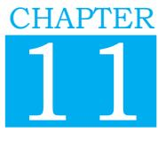
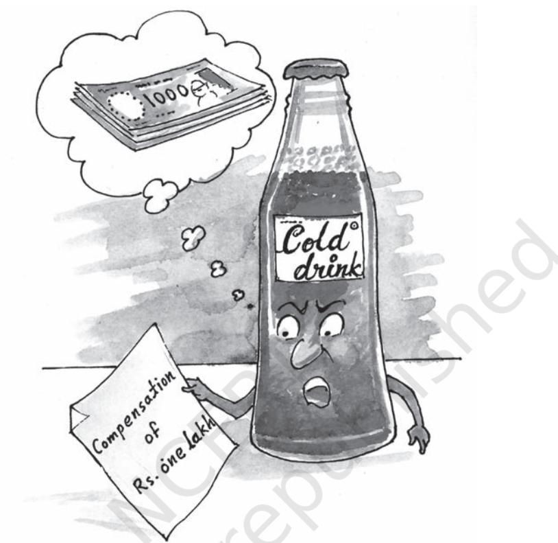
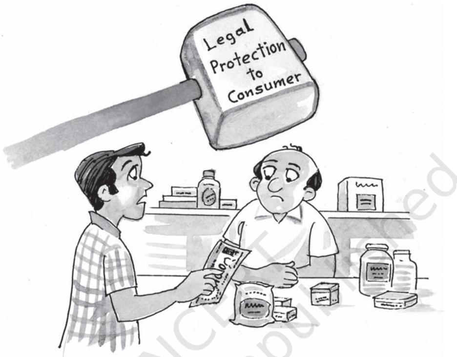
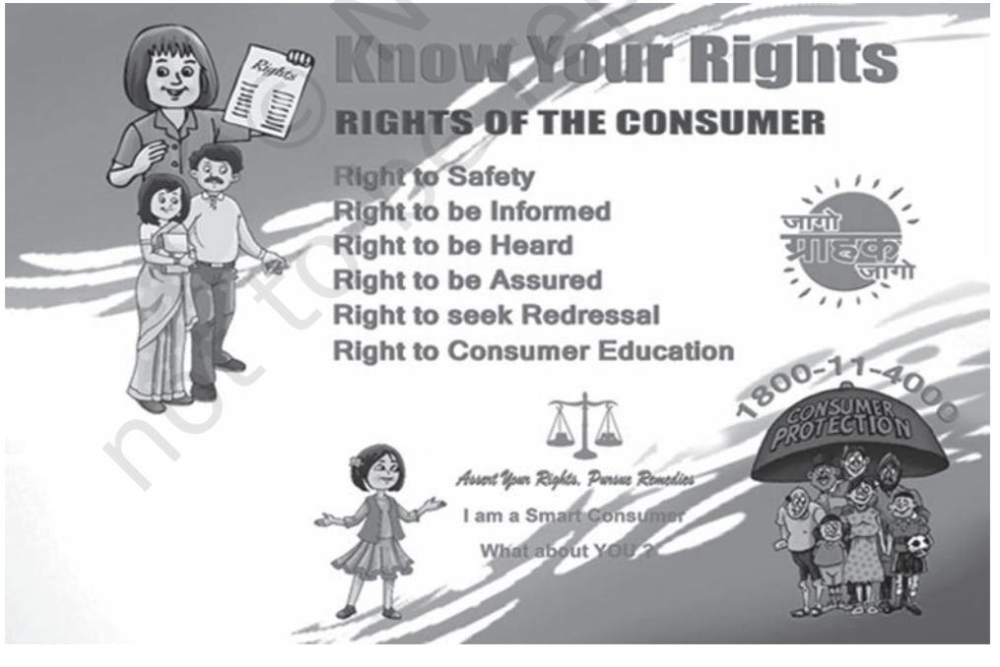
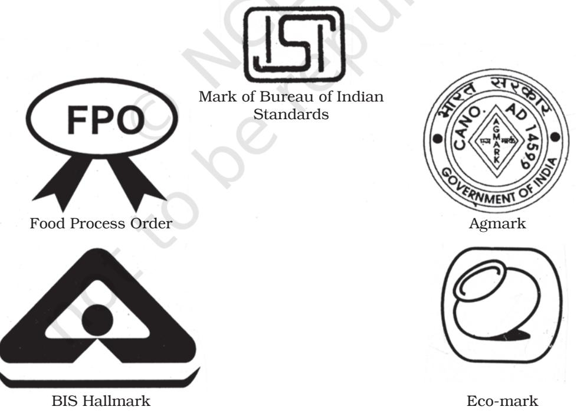
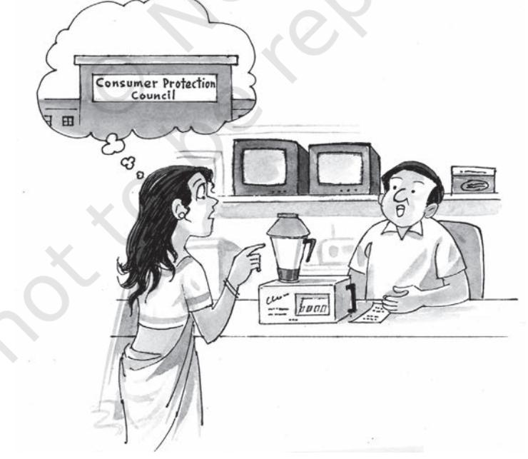

# **Consumer Protection**

# **Learning Objectives**

After studying this chapter, you should be able to:

¾ state the importance of consumer protection;

¾ briefly explain legal framework for consumer protection in India;

¾ describe consumer rights in India;

¾ briefly describe the ways and means of consumer protection; and

### **Banks Responsible for Failed Transactions and No Cash in ATMs**

In a landmark consumer forum judgement, now, if you do not get money from ATMs, it would be considered as deficiency of services on part of bank,.On May 4, 2017, a petition in the Consumer Forum in Raipur was filed where the complainant submitted photos and video recording of three failed ATM transactions due to non-availability of cash bank's ATMs.

In front of the forum, the bank argued that ATM runs with Internet connectivity, so at the time when users use ATM, he/she is not directly the bank client. Hence, if the said money not withdrawn from the ATM, then it cannot be termed as a deficiency in service.

The forum rejected the bank's logic completely. The petitioner has presented photo and video recording at the time of withdrawal as evidence in front of forum. Forum acknowledged that the consumers at various times go to ATM to withdrawn money every time the message of 'cash not available' is the lack in service.

The forum accepted the petition. After hearing the arguments of both the parties, the forum ordered that if the bank will not provide ATM service to the customer, then it will be considered a reduction in service Consumer Forum imposed a fine of Rs. 2,500 on the bank including Rs1,500 as compensation for mental harassment and Rs1,000 for legal expenses for non-availability of cash in its ATMs as deficiency in bank services.

> *Source:http://dailypost.in/news/ consumer-forum-fines-sbi-ignoringcustomers/, 2017.*

Ch_11.indd 289 2/22/2024 12:12:55 PM

### **Introduction**

Each one of us is a consumer in one way or another. It is important for us to be an aware and informed consumer of goods and services available to us in the market.The above case is just one of the examples of the many problems that consumers face in the purchase, use and consumption of goods and services. But, very few consumers are aware of their rights given to them by the Consumer Protection Act 2019. The Consumer Protection Act 20192019 has replaced the Act 1986 and seeks to widen its scope in addressing consumer concerns.

Have you ever thought what would be the plight of consumers if adequate protection is not provided to them? With growing competition and in an attempt to increase their sales and market share, manufacturers, sellers and serviceproviders may be tempted to engage in unscrupulous, exploitative and unfair trade practices like defective and unsafe products, adulteration, false and misleading advertising, hoarding, black-marketing, etc. This means that a consumer might be exposed to risks due to unsafe products, might suffer from bad health due to adulterated food products, might be cheated because of misleading advertisements or sale of spurious products, might have to pay a higher price when sellers engage in overpricing, hoarding or black-marketing, etc. As a result, consumer becomes unsafe, feels cheated and is exposed to many risks and health problems.

Can business afford to ignore the interests of consumers? The market forces have changed from a seller market i.e., the earlier approach of *caveat emptor* which means *Let the buyer beware*, to a consumer market i.e., *caveat venditor* which implies *Let the seller beware*. A consumer is said to be a KING in the free market economy. Hence, consumer protection has significance for both consumers and business alike. Under the Consumer Protection Act 2019, the Government of India has conferred a legal protection to safeguard interests of a consumer.

# **Importance of Consumer Protection**

The concept of consumer protection is to safeguard the interests of the consumers. It adopts measures to protect consumers from unethical malpractices by businesses and provide a swift redressal of their grievances with regard to:

- 1. Sale of adulterated goods such as adding inferior substances to the product being sold.
- 2. Sale of counterfeit goods such as selling a product of lesser value than the real product.
- 3. Sale of sub-standard goods such as the sale of products that do not meet the prescribed quality standards.
- 4. Sale of duplicate goods.

Ch_11.indd 290 10-08-2022 10:03:34

consumer protection

291

- 5. Use of malfunctioning weights and measures that lead to underweight of products.
- 6. Black marketing and hoarding that eventually leads to scarcity of the product and well as a rise in the price of the same.
- 7. Overcharging a product, i.e., charging a product above its Maximum Retail Price.
- 8. Supplying of defective goods.
- 9. Advertisements that are misleading, i.e., advertisements that falsely claim a product or a service to be shown as superior quality, grade or standard when not in real.
- 10. Supply of inferior services, i.e., quality of service lesser than the condition agreed.

# Need for Consumer Protection

The need for consumer protection arises from the need to protect consumers from the loss or injury or other prevailing malpractices and to ensure:

- 1. Physical safety of a consumer.
- 2. Access to information.
- 3. Corporate Social Responsibility to provide quality and quantity of goods at fair prices.
- 4. Consumer satisfaction.
- 5. Social justice and Trusteeship
- 6. Survival and the Growth of businesses.

That is why we as an informed consumer have to wake up and save our self from various types of exploitation and should complain about it. Consumer protection has a wide scope. It not only includes educating consumers about their rights and responsibilities, but also helps in getting their grievances redressed. It not only requires a judicial machinery for protecting the interests of consumers but also requires the consumers to be united and form themselves into consumer associations for protection and promotion of their interests.

# From Consumers' point of view

The importance of consumer protection from the consumers' point of view can be understood from the following points:

- **(i) Consumer Ignorance:** In the light of widespread ignorance of consumers about their rights and reliefs available to them, it becomes necessary to educate them about the same so as to achieve consumer awareness.
- **(ii) Unorganised Consumers:** Consumers need to be organised in the form of consumer organisations which would take care of their interests. Though, in India, we do have consumer organisations which are working in this direction, adequate protection is required to be given to consumers till these organisations become powerful enough to protect and promote the interests of consumers.

Ch_11.indd 291 10-08-2022 10:03:34

*Compensation for impurities in cold drinks*

- **(iii) Widespread Exploitation of Consumers:** Consumers might be exploited by unscrupulous, exploitative and unfair trade practices like defective and unsafe products, adulteration, false and misleading advertising, hoarding, black-marketing, etc. Consumers need protection against such malpractices of the sellers.
#### **From the point of view of Business**

A business must also lay emphasis on protecting the consumers and adequately satisfying them. This is important because of the following reasons:

- **(i) Long-term I n t e r e s t o f Business:** E n l i g h t e n e d businesses realise that it is in their long-term interest to satisfy their customers. Satisfied customers not only lead to repeat sales but also provide good feedback to prospective customers and thus, help in increasing the customer-base of business. Thus, business firms should aim at long-term profit maximisation through customer satisfaction.
Ch_11.indd 292 2/22/2024 12:14:01 PM

- **(ii) Bu s in e s s u s e s So c i e ty ' s Resources:** B u s i n e s s organisations use resources which belong to the society. They, thus, have a responsibility to supply such products and render such services which are in public interest and would not impair public confidence in them.
- **(iii) Social Responsibility:** A business has social responsibilities towards various interest groups. Business organisations make money by selling goods and providing services to consumers. Thus, consumers form an important group among the many stakeholders of business and like other stakeholders, their interest has to be well taken care of.
- **(iv) Moral Justification:** It is the moral duty of any business to take care of consumer's interest and avoid any form of their exploitation. Thus, a business must avoid unscrupulous, exploitative and unfair trade practices like defective and unsafe products, adulteration, false and misleading advertising, hoarding, black marketing, etc.
- **(v) Government Intervention:** A business engaging in any form of exploitative trade practices would invite government intervention or action. This can impair and tarnish the image of the company. Thus,

it is advisable that business organisations voluntarily resort to such practices where the customers' needs and interests will well be taken care of.

# **The Consumer Protection Act, 2019**

The Consumer protection Act 2019 seeks to protect and promote the consumers' interest through speedy and inexpensive redressal of their grievances. It extends to the whole of India. It is applicable to all types of businesses whether a manufacturer or a trader and whether supplying goods or providing servicesincluding e-commerce firms. The Act confers certain rights to consumers with a view to empowering them and to protect their interests.

### **Who is A Consumer?**

A 'consumer' is generally understood as a person who uses or consumes goods or avails of any service. Under the Consumer Protection Act 2019, a consumer is a person who buys any goods or avails services for a consideration, which has been paid or promised, or partly paid and partly promised, or under any scheme of deferred payment. It includes any user of such goods or beneficiary of services if such use is made with the approval of the buyer. It applies to both offline and online transactions through electronic means or by teleshopping or direct selling or multilevel marketing. However, any person who obtains goods or avails

Ch_11.indd 293 10-08-2022 10:03:34

*Protection against malpractices and exploitation*

services for resale or commercial purpose is nottreated as a consumer and is outside the scope of Consumer Protection Act 2019.

### **Consumer Rights**

The Consumer Protection Act 2019 provides for six rights of consumers.

### Terms & Definitions

- *1. Complaint:* Any allegation in writing made by the complainant for obtaining relief w.r.t restrictive trade practice, defect in goods or deficiency in services provided, overcharging of price or offer of goods or service injurious to life and safety.
- *2. Complainant: means one or more* consumers, or any voluntary consumer association, central or state government or the central authority or a legal heir or legal representative or a parent or legal representative in case of a minor.
- *3. Spurious goods:* Goods that are falsely claimed to be genuine.
- *4. Unfair trade practice*: A trade practice for the purpose of promoting sale, use or supply of any goods or service falsely represents its quality, standard, quantity, composition, style or model.

Ch_11.indd 294 10-08-2022 10:03:34

#### 295

- *5. Restrictive trade practice*: A trade practice which manipulates price or affect the flow of supplies in the market relating to goods and services in such a manner that an unjustified cost is imposed on the consumer.
- *6. Defect:* Any fault, imperfection, shortcoming or inadequacy in quality, nature and manner of performance in relation to goods or a product.
- *7. Deficiency:* Any fault, imperfection, shortcoming or inadequacy in quality, nature and manner of performance in relation to in relation to any service and includes act of negligence or omission or commission or withholding relevant information which causes loss or injury to the consumer.
- *8. Injury:* Any harm illegally caused to any person in body, mind or property.
- *9. Product:* Any article or goods or substance or raw material or any extended cycle of such product either in gaseous , liquid or solid state possessing intrinsic value capable of delivery either as assembled or a component produced or manufactured to trade. It does not include human tissues, blood, blood products and organs.
- *10. Product Seller:* Any person in the course of business imports, sells, distributes, leases, installs, prepares, labels, markets, repairs, maintains or otherwise involved in placing the product for commercial use or a service provider.
- *11. Product Liability:* Responsibility of a product manufacturer or seller of any product or service to compensate for any harm caused to a consumer by defective product manufactured or sold or by deficiency in services.

These rights include the following:

- **1. Right to Safety:** The consumer has a right to be protected against goods and services which are hazardous to life, health and property. For example, electrical appliances which are manufactured with substandard products or do not conform to the safety norms might cause serious injury. Thus, consumers are educated that they should use electrical appliances which are ISI marked as this would be an assurance of such products meeting quality specifications.
- **2. Right to be informed:** The consumer has a right to have

complete information about the product he intends to buy including its ingredients, date of manufacture, price, quantity, directions for use, etc. It is because of this reason that the legal framework in India requires the manufactures to provide such information on the package and label of the product.

- **3. Right to be assured:** The consumer has the freedom to access variety of products at competitive prices. This implies that the marketers should offer a wide variety of products in terms of quality, brand, prices, size, etc. and allow the consumer to make a choice from amongst these.
Ch_11.indd 295 10-08-2022 10:03:34

- **4. Right to be heard:** The consumer has a right to file a complaint and to be heard in case of dissatisfaction with a good or a service. It is because of this reason that many enlightened business firms have set up their own consumer service and grievance cells. Many consumer organisations are also working towards this direction and helping consumers in redressal of their grievances.
- **5. Right to seek redressal:** The consumer has a right to get relief against unfair trade practice of restrictive trade practices or unscrupulous exploitation in case the product or a service falls short of his expectations. The Consumer Protection Act 2019 provides for redressal to the consumers including replacement of the product, removal of defect in the product, compensation paid for any loss or injury suffered by the consumer, etc.
- **6. Right to Consumer Education:** The consumer has a right to acquire knowledge and to be a well informed consumer throughout life. He should be aware about his rights and the reliefs available to him in case of a product or service falling short of his expectations. Many consumer organisations and some enlightened businesses are taking an active part in educating consumers in this respect.

# **Consumer Responsibilities**

The Consumer Protection Act empowers the consumer to fight against any unscrupulous, exploitative and unfair, restrictive trade practices adopted by sellers. Consumer rights, by themselves, cannot be effective in achieving the objective of consumer protection. Consumer protection can, in effect, be achieved only when the consumers also understand their responsibilities.

A consumer should keep in mind the following responsibilities while purchasing, using and consuming goods and services —

- (i) Be aware about various goods and services available in the market so that an intelligent and wise choice can be made.
- (ii) Buy only standardised goods as they provide quality assurance. Thus, look for ISI mark on electrical goods, FPO mark on food products, Hallmark on jewelry, etc.
- (iii) Learn about the risks associated with products and services, follow manufacturer's instructions and use the products safely.
- (iv) Read labels carefully so as to have information about prices, net weight, manufacturing and expiry dates, etc.
- (v) Assert yourself to ensure that you get a fair deal.
- (vi) Be honest in your dealings. Choose only from legal goods and services and discourage

Ch_11.indd 296 10-08-2022 10:03:34

297

unscrupulous practices like black-marketing, hoarding, etc.

- (vii) Ask for a cash memo on purchase of goods or services. This would serve as a proof of the purchase made.
- (viii) File a complaint in an appropriate consumer forum in case of a shortcoming in the quality of goods purchased or services availed. Do not fail to take an action even when the amount involved is small.
	- (ix) Form consumer societies which would play an active part in educating consumers and safeguarding their interests.
	- (x) Respect the environment. Avoid waste, littering and contributing to pollution.

# **Ways and Means of Consumer Protection**

A consumers' awareness about their rights and responsibilities is just one of the ways in which the objective of consumer protection can be achieved. There are other ways in which this objective may be achieved.

- **1. Self-regulation by Business:** Socially responsible firms follow ethical standards and practices in dealing with their customers Good and ethical practices encourage firms to realise that it is in their long-term interest to serve the customers in a rightful manner. Many firms have set up their customer service and grievance cells to redress the problems and grievances of their consumers.

Ch_11.indd 297 10-08-2022 10:03:35

- **2. Business Associations:** The associations of trade, commerce and business like Federation of Indian Chambers of Commerce of India (FICCI) and Confederation of Indian Industries (CII) have laid down their code of conduct which lay down for their members the guidelines in their dealings with the customers.
- **3. Consumer Awareness:** A consumer, who is well-informed about his rights and the reliefs available to him, would be in a position to raise his voice against any unfair trade practices or unscrupulous exploitation. In addition to this, an understanding

of his responsibilities would also enable a consumer to safeguard his interests. In this regard, the Department of Consumer Affairs, GOI, has been undertaking *JagoGrahakJago*campaign, for generating awareness among consumers.

- **4. Consumer Organisations:** Consumer organisations play an important role in educating consumers about their rights and providing protection to them. These organisations can force business firms to avoid malpractices and exploitation of consumers.
- **5. Government:** The government can protect the interests of the

Ch_11.indd 298 10-08-2022 10:03:35

consumers by enacting various measures. For example, the GOI has set up a toll-free national consumer Helpline Number 1800114000 for this purpose. The legal framework in India encompasses various legislations which provide protection to consumers. The most important of these regulations is the Consumer Protection Act, 2019. The Act provides for a central authority to regulate matters relating to violation of rights of consumers, unfair trade practices and false or misleading advertisements which are prejudicial to the interests of consumers. This is known as Central Consumer Protection Authority (CCPA). A three-tier machinery at the district, state and national levels for redressal of consumer grievances.

# **Redressal Agencies Under The Consumer Protection Act**

For the redressal of consumer grievances, the Consumer Protection Act 2019 provides for setting up of a three-tier enforcement machinery at the District, State, and the National levels, known as the District Consumer Disputes Redressal Commission, State Consumer Disputes Redressal Commission, and the National Consumer Disputes Redressal Commission. They are briefly referred to as the 'District Commission', 'State Commission', and the 'National

*Consumer Awareness*

Ch_11.indd 299 10-08-2022 10:03:35

Commission', respectively. While the National Commission is set up by the Central Government, the State Commissions and the District Forums are set up, by the State Government. The Figure on redressal agencies shows the hierarchical structure of this three-tire machinery.

Let us now see how the consumer grievances are redressed by the threetire machinery:

- **1. District Commission:**District commission has a jurisdiction to entertain complaints where value of goods or services paid as consideration does not exceed one crore rupees. Either on the first hearing or at any later stage, it appears to district commission that there exists elements of settlement which may be acceptable to the parties, it may direct them to give their consent for settlement of dispute through mediation within five days. In case the parties agree for settlement by mediation and give written consent, the district commission refers the matter for mediation and the provisions relating to mediation shall apply. However, in the event of failure of settlement by mediation proceeds with the complaint. If the complaint alleges defect in goods which cannot be determined without proper analysis or test of goods, the commission obtains the sample of goods, seal it and refer to the appropriate authority for analysis. In case of services, the dispute is settled based on the basis of
evidence brought to its notice by the complainant and can ask for any required information document or records from the service provider for settlement.

If any of the parties are not satisfied by the order of District Commission can appeal against such order to the State Commission on the grounds of facts or law within a period of forty five days from the date of order.

- **2. State Commission:** It is established by the respective state government and ordinarily function at the state capital. State Commission has a jurisdiction to entertain complaints where value of goods and services paid as consideration exceeds one crore but does not exceed ten crore rupees. If any of the parties are not satisfied by the order of State Commission can appeal against such order to the National Commission within a period of thirty days of such order.
- **3. National Commission:** The National Commission has territorial jurisdiction over the whole country. National Commission has a jurisdiction to entertain complaints where value of goods or services paid as consideration exceeds ten crores of rupees. If any of the parties are not satisfied by the order of National Commission can appeal against such order to the Supreme Court of India within a period of thirty days of such order.

Ch_11.indd 300 10-08-2022 10:03:35

#### Relief Available

Where District or State or National Commission is satisfied about defect in goods, or deficiency in services on any unfair trade practice or claim for compensation under product liability, issues an order:

- (i) To remove the defect in goods or deficiency in service.
- (ii) To replace the defective product with a new one, free from any defect.
- (iii) To refund the price paid for the product, or the charges paid for the service.
- (iv) To pay a reasonable amount of compensation for any loss or injury suffered by the consumer due to the negligence of the opposite party.
- (v) To pay punitive damages in appropriate circumstances.
- (vi) To discontinue the unfair/ restrictive trade practice and not to repeat it in the future.
- (vii) Not to offer hazardous goods for sale.
- (viii) To withdraw the hazardous goods from sale.
- (ix) To cease manufacture of hazardous goods and to desist from offering hazardous services.

- (x) Compensate for any loss or injury suffered by consumer under product liability action and withdraw hazardous products from being offered for sale etc.
However, every order of a district commission, the state commission or the national commission is deemed final if no appeal for such order is made by any of the parties involved in dispute.

### Role of Consumer Organisations And Ngos

In India, several c o n s u m e r organisations and non-governmental organisations (NGOs) have been set up for the protection and promotion of consumers' interests. Nongovernmental organisations are nonprofit organisations which aim at promoting the welfare of people. They have a constitution of their own and are free from government interference. Consumer organisations and NGOs perform several functions for the protection and promotion of interest of consumers. These include:

- (i) Educating the general public about consumer rights by organising training programmes, seminars and workshops.
- (ii) Publishing periodicals and other publications to impart

#### Setting up of Consumer Mediation Cell

The Chapter V of the Consumer Protection Act of 2019 provides for a mediation process for settlement of disputes at three levels - National, State and District with all three being attached to the respective commissions. It is a new provision in the Act 2019 as an alternate mechanism to ensure faster aspeedydispute settlements by respective commissions.

Ch_11.indd 301 10-08-2022 10:03:35

knowledge about consumer problems, legal reporting, reliefs available and other matters of interest.

- (iii) Carrying out comparative testing of consumer products in accredited laboratories to test relative qualities of competing brands and publishing the test results for the benefit of consumers.
- (iv) Encouraging consumers to strongly protest and take an action against unscrupulous,

exploitative and unfair trade practices of sellers.

- (v) Providing legal assistance to consumers by way of providing aid, legal advice etc. in seeking legal remedy.
- (vi) Filing complaints in appropriate consumer courts on behalf of the consumers.
- (vii) Taking an initiative in filing cases in consumer courts in the interest of the general public, not for any individual.
- (viii) Consumer unity and Trust Society (CuTS), Jaipur.

# **Key Terms**

Redressal mechanism Mediation

Consumer protection Consumer Rights Consumer Responsibilities

# SUMMARY

**Importance of Consumer Protection:** From the point of consumers, consumer protection is important because consumers are ignorant, unorganised and exploited by sellers. Consumer Protection is also important for a business because (i) It is in the long-term interest of business, (ii) Business uses society's resources, (iii) It is a social responsibility of business, (iv)It has moral justification, (v) It avoids government intervention in the functioning of business.

**Legal Protection to Consumers:** The Indian legal framework consists of a number of legislations which provide protection to consumers. These include (i) The Consumer protection Act, 1986, (ii) The Indian Contract Act, 1872, (iii) The Sale of Goods Act, 1930, (iv) The essential Commodities Act,1955, (v) The Agricultural produce (Grading and Marking) Act, 1937, (vi) The prevention of Food Adulteration Act, 1954, (vii) The Standards of Weights and Measures Act, 1976, (viii) The Trade Marks Act, 1999, (ix) The Competition Act, 2002,(x) The Bureau of Indian Standards Act, 1986.

**Consumer Rights:** The Consumer Protection Act, 1986, provides for six consumer rights. These are: (i) Right to safety, (ii) Right to be informed, (iii)

Ch_11.indd 302 10-08-2022 10:03:35

Right to choose, (iv) Right to be heard, (v) Right to seek redressal,(vi) Right to consumer education.

**Consumer Responsibilities:** In addition to exercising his rights, a consumer should also keep in mind his responsibilities while purchasing, using and consuming goods and services.

**Ways and Means of Consumer Protection:** There are various ways in which the objective of consumer protection can be achieved. These Include (i) Self regulation by business, (ii) Business associations, (iii) Consumer awareness, (iv)Consumer organisations, (v) Government.

**Redressal Agencies under the Consumer Protection Act:** The Consumer Protection Act provides for setting up of a three-tier enforcement machinery at the District, State, and the National levels. They are referred to as the 'District Forum', 'State Commission', and the 'National Commission'. There are various reliefs available to a consumer under the Act. The appropriate consumer court may pass an order for removal of defect in goods, replace a defective product, refund the price of the product, pay compensation for the loss suffered, etc.

**Consumer Organisations and NGOs:** In India, several consumer organisations and non-governmental organisations (nGOs) are playing an active role in protection and promotion of consumers' interests.

# EXERCISES

# Very Short Answer Type

- 1. Under which consumer right does a business firm set up consumer grievance cell?
- 2. Which quality certification mark is used for agricultural products?
- 3. What is the jurisdiction of cases that can be filed in a State Commission?
- 4. State any two relief available to consumers under CPA.
- 5. Name the component of product mix that helps the consumer to exercise the right to information.

# Short Answer Type

- 1. Enumerate the various Acts passed by the Government of India which help in protection of consumers' interests.
- 2. What are the responsibilities of a consumer?
- 3. Who can file a complaint in a consumer court?

Ch_11.indd 303 10-08-2022 10:03:35

- 4. FSSAI (Food Safety and Standards Authority of India) has made a proposal for hotels and other food outlets to declare the kind of oil/fat used in cooking each of the food items on their menus. Name and explain the Consumer Right being reinforced by this proposal.
- 5. Who is a consumer as per CPA?

# Long Answer Type

- 1. Explain the importance of consumer protection from the point of view of a business.
- 2. Explain the rights and responsibilities of consumer?
- 3. What are various ways in which the objective of consumer protection can be achieved?
- 4. Explain the redressal mechanism available to consumers under the Consumer Protection Act, 2019
- 5. Explain the role of consumer organisations and NGOs in protecting and promoting consumer's interest.
- 6. Mrs. Mathur sent a jacket to a laundry shop in January 2018. The jacket was purchased at a price of `4,500. She had previously sent the jacket for dry cleaning with Shine Dry Cleaners and the jacket was cleaned well. However, she noticed that her jacket had white discoloration marks when she collected the jacket this time. On informing the dry cleaner, Mrs. Mathur received a letter confirming that discolouration indeed appeared after the jacket was dry cleaned. She contacted the dry cleaner multiple times and requested for compensation for discoloured jacket but to no avail.

 Upon Consumer court's intervention, Shine Dry Cleaners agreed to compensate Rs. 2,500 to Mrs. Mathur for the discoloured jacket.

- (a) Which right was exercised by Mrs. Mathur at the first instance.
- (b) Name and explain the right which helped Mrs. Mathur to avail the compensation.
- (c) State which consumer responsibility has been fulfilled by Mrs. Mathur in the above case.
- (d) State any other two responsibilities to be assumed by the consumers.

### Project work

- 1. Visit a consumer organisation in your town. List down the various functions performed by it.
- 2. Collect some newspaper cuttings of some consumer cases and the rulings given therein.

Ch_11.indd 304 10-08-2022 10:03:35

