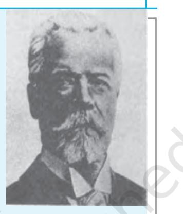

# **PRINCIPLES OF MANAGEMENT**

### **Guiding Principles of Toyota Motor Corporation**

Toyota follows certain well-defined business principles guiding its functioning. These are:

- 1. Honour the language and spirit of law of every nation and undertake open and fair corporate activities to be a good corporate citizen around the world.
- 2. Respect the culture and customs of every nation and contribute to economic and social development through corporate activities in local communities.
- 3. To provide clean and safe products and to enhance the quality of life everywhere.
- 4. Create and develop advanced technologies and provide outstanding products and services that fulfil the needs of customers worldwide.
- 5. Foster a corporate culture that enhances individual creativity and teamwork value, while honouring mutual trust and respect between management and labour.
- 6. Pursue growth and harmony with global community through innovative management.
- 7. Work with business partners in research and creativity to achieve stable, long-term growth and mutual benefits and be open to new partnerships. These principles, will guide the company in its global vision 2010. This global vision envisages continuous innovations in future, use of environment friendly technologies, respecting and working with different sections of society and establishing an interactive relationship with society.

*http://www.toyotaglobal.com/company/history of toyota/ 75years/data/conditions/philosophy/guiding principles.html/* **CHAPTER** 2

L E A R N I N G OBJECTIVES

After studying this chapter, you should be able to:

- n State the meaning, nature and significance of principles of management;
- n Explain Taylor's principles and techniques of Scientific Management; and
- n Explain Fayol's principles of management.

It is clear from the foregoing case that managerial pursuits at Toyota Motor Corporation are driven by principles that serve as broad guidelines for stating the vision as well as the ways to achieve it. Similarly, many other business enterprises have followed various principles in their working

Ch_02.indd 30 24-09-2019 12:05:00 PM

over a period of time. A number of management thinkers, and writers have also studied principles of management from time-to-time. In fact, there is a long history of management thought. Management principles have evolved and are in the continuous process of evolution. (see box.)

You can see that the evolution of management thought has been very

#### **Evolution of Management Principles**

In tracing the history of management, one comes across various schools of thought that have outlined principles to guide management practices. These schools of thought may be divided into 6 distinctive phases: 1. Early Perspectives; 2. Classical Management Theory; 3. Neo Classical Theory — Human Relations Approach; 4. Behavioural Science Approach — Organisational Humanism; 5. Management Science/Operational Research; 6. Modern Management.

#### EARLY PERSPECTIVES

The first known management ideas were recorded in 3000-4000 B.C. One Pyramid built by Egyptian ruler Cheops required work to be done by 100,000 men for over twenty years in 2900 B.C. It covered 13 acres of land and measured 481 meters in height. The stone slabs had to be moved thousands of kilometres of distance. As folklore goes, even the sound of a hammer was not heard in the villages in the vicinity of the site of these pyramids. Such monumental work could not be completed without adherence to principles of sound management.

#### CLASSICAL MANAGEMENT THEORY

Rational economic view, scientific management, administrative principles, and bureaucratic organisation characterise this phase. While the rational economic view assumed that people are motivated by economic gains primarily; scientific management of F.W. Taylor and others emphasised one best way of production etc; administrative theorists personified by Henri Fayol etc looked at the best way to combine jobs and people into an efficient organisation; bureaucratic organisation theorists led by Max Weber looked at ways to eliminate managerial inconsistencies due to abuse of power which contributed to ineffectiveness. This was the era of the industrial revolution and factory system of production. Large scale production would not have been possible without adherence to the principles governing organising production based on division of labour and specialisation, relationship between man and the machine, managing people and so on.

fascinating. In this chapter we will study the contributions of Fredrick Winslow Taylor and Henri Fayol who as you have read are associated with the classical management theory. Both of them contributed immensely towards the study of management as a discipline. Whereas F.W. Taylor was an American mechanical engineer, Henri Fayol was a French mining engineer. Taylor gave the concept

Ch_02.indd 31 24-09-2019 12:05:00 PM

#### NEO CLASSICAL THEORY — HUMAN RELATIONS APPROACH

This school of thought developed between 1920s to 1950s felt that employees simply do not respond rationally to rules, chains of authority and economic incentives alone but are also guided by social needs, drives and attitudes. Hawthorne Studies at GEC etc., were conducted then. It was quite natural that in the early phases of the industrial revolution, the emphasis was on development of techniques and technology. The attention to the human factor was the salient aspect of this school of thought. This attention was to serve as a precursor to the development of behavioural sciences.

#### BEHAVIOURAL SCIENCE APPROACH — ORGANISATIONAL HUMANISM

Organisational behaviourists like Chris Argyris; Douglas McGregor, Abraham Maslow and Fredrick Herzberg used the knowledge of psychology, sociology and anthropology to develop this approach. The underlying philosophy of organisational humanism is that individuals need to use all of their capacities and creative skills at work as well as at home.

#### MANAGEMENT SCIENCE/OPERATIONAL RESEARCH

It emphasises research on operations and use of quantitative techniques to aid managers to take decisions.

#### MODERN MANAGEMENT

It sees modern organisations as complex systems and underlies contingency approach and use of modern techniques to solve organisational and human problems.

*Source: Adapted from Internet modern history source book on www.fordham.edu*

of 'Scientific Management' whereas Fayol emphasised 'Administrative Principles'.

But before we go into the details of their contributions let us study the meaning of the principles of management.

# **Principles of Management: The Concept**

A managerial principle is a broad and general guideline for decisionmaking and behaviour. For example while deciding about promotion of an employee one manager may consider seniority, whereas the other may follow the principle of merit.

One may distinguish principles of management from those of pure science. Management principles are not as rigid as principles of pure science. They deal with human behaviour and, thus, are to be applied creatively given the demands of the situation. Human behaviour is never static and so also technology, which affects business. Hence all the principles have to keep pace with these changes. For example, in the absence of Information and

Ch_02.indd 32 24-09-2019 12:05:00 PM

Communications Technology (ICT), a manager could oversee only a small work force that too within a narrow geographical space. The advent of ICT has expanded the capability of the managers to preside over large business empires spread across the globe. Infosys headquarters in Bangalore boast of the Asia's largest flat screen in their conference room from where their managers can interact with their employees and customers in all parts of the world.

In developing an understanding of the meaning of principles of management, it is also useful to know what these are not. The principles of management should be distinguished from techniques of management. Techniques are procedures or methods, which involve a series of steps to be taken to accomplish desired goals. Principles are guidelines to take decisions or actions while practicing techniques. Likewise, principles should also be understood as being distinct from values. Values are something, which are acceptable or desirable. They have moral connotations. Principles are basic truths or guidelines for behaviour. Values are general rules for behaviour of individuals in society formed through common practice whereas principles of management are formed after research in work situations, which are technical in nature. However, while practicing principles of management values cannot be neglected, as businesses have to fulfil social and ethical responsibilities towards society.

# **Nature of Principles of Management**

By nature is meant qualities and characteristics of anything. Principles are general propositions, which are applicable when certain conditions are present. These have been developed on the basis of observation and experimentation as well as personal experiences of the managers. Depending upon how they are derived and how effective they are in explaining and predicting managerial behaviour, they contribute towards the development of management both as a science and as an art. Derivation of these principles may be said to be a matter of science and their creative application may be regarded as an art. These principles lend credibility of a learnable and teachable discipline to the practice of management. As such, ascent to managerial position may not be a matter of birth, but a matter of requisite qualifications. Clearly, management principles have gained importance with increasing professionalisation of management.

These principles are guidelines to action. They denote a cause and effect relationship. While functions of management viz., Planning, Organising, Staffing, Directing and Controlling are the actions to be

Ch_02.indd 33 24-09-2019 12:05:00 PM

taken while practising management, Principles help managers to take decisions while performing these functions. The following points summarise the nature of principles of management.

- (i) **Universal applicability:** The principles of management are intended to apply to all types of organisations, business as well as non-business, small as well large, public sector as well as private sector, manufacturing as well as the services sectors. However, the extent of their applicability would vary with the nature of the organisation, business activity, scale of operations and the like. For example, for greater productivity, work should be divided into small tasks and each employee should be trained to perform his/her specialised job. This principle is applicable to a government office where there is a diary/despatch clerk whose job is to receive and send mail or documents, a data entry operator whose task is to input data on the computer, a peon and an officer etc. This principle is also applicable to a limited company where there are separate departments like Production, Finance, Marketing and Research and Development etc. Extent of division of work, however, may vary from case to case.
- (ii) **General guidelines:** The principles are guidelines to action

but do not provide readymade, straitjacket solutions to all managerial problems. This is so because real business situations are very complex and dynamic and are a result of many factors. However, the importance of principles cannot be underestimated because even a small guideline helps to solve a given problem. For example, in dealing with a situation of conflict between two departments, a manager may emphasise the primacy of the overall goals of the organisation.

- (iii) **Formed by practice and experimentation:** The principles of management are formed by experience and collective wisdom of managers as well as experimentation. For example, it is a matter of common experience that discipline is indispensable for accomplishing any purpose. This principle finds mention in management theory. On the other hand, in order to remedy the problem of fatigue of workers in the factory, an experiment may be conducted to see the effect of improvement of physical conditions to reduce stress.
- (iv) **Flexibile:** The principles of management are not rigid prescriptions, which have to be followed absolutely. They are flexible and can be modified by the manager when the situation

Ch_02.indd 34 24-09-2019 12:05:00 PM

so demands. They give the manager enough discretion to do so. For example, the degree of concentration of authority (centralisation) or its dispersal (decentralisation) will depend upon the situations and circumstances of each enterprise. Moreover individual principles are like different tools serving different purposes, the manager has to decide which tool to use under what circumstances.

- (v) **Mainly behavioural:** Management principles aim at influencing behaviour of human beings. Therefore, principles of management are mainly behavioural in nature. It is not that these principles do not pertain to things and phenomenon at all, it is just a matter of emphasis. Moreover, principles enable a better understanding of the relationship between human and material resources in accomplishing organisational purposes. For example, while planning the layout of a factory, orderliness would require that workflows are matched by flow of materials and movement of men.
- (vi) **Cause and effect relationships:** The principles of management are intended to establish relationship between cause and effect so that they can be used in similar situations in a large

number of cases. As such, they tell us if a particular principle was applied in a particular situation, what would be its likely effect. The principles of management are less than perfect since they mainly apply to human behaviour. In real life, situations are not identical. So, accurate cause and effect relationships may be difficult to establish. However,principles of management assist managers in establishing these relationships to some extent and are therefore useful. In situations of emergencies, it is desirable that someone takes charge and others just follow. But in situations requiring cross-functional expertise, such as setting up of a new factory, more participative approach to decision-making would be advisable.

- (vii) **Contingent:** The application of principles of management is contingent or dependent upon the prevailing situation at a particular point of time. The application of principles has to be changed as per requirements. For example, employees deserve fair and just remuneration. But what is just and fair is determined by multiple factors. They include contribution of the employee, paying capacity of the employer and also prevailing
Ch_02.indd 35 24-09-2019 12:05:00 PM

wage rate for the occupation under consideration.

Having described the inherent qualities and characteristics of management principles, it should be easy for you to appreciate the significance of these principles in managerial decision-making. But before that you can read the following case study of 'Kiran Mazumdar Shaw' a highly successful Indian businesswoman and CEO of 'Biocon' in the accompanying box. You should be able to see how she was able to transform a little known sector of biotechnology into a very profitable company and earn titles which any one would dream of.

From the foregoing story it is clear that success of Biocon due to the efforts of Dr. Kiran Mazumdar Shaw was not a mere chance. It was a sincere effort, which involved application of qualities, which are

The story of Dr. Kiran Mazumdar Shaw is very inspiring. She foresaw the tremendous potential of bio technology when no one dared to think about it. She started her own company Biocon India in her garage with a meagre capital of ` 10,000 in collaboration with Biocon Bio Chemical's Limited of Ireland.

The Company is a pioneer in bringing the benefit of high quality, yet affordable, novel biologics and biosimilars to patients in India and other emerging markets. Today, it is India's largest and fully-integrated biopharmaceutical company that develops, manufactures and supplies advanced, life-saving biopharmaceuticals for diabetes, cancer and autoimmune conditions at price points that make them affordable and thus accessible.

As an innovation-led organization focused on providing affordable access, we have leveraged our inherent strengths in advanced science to develop, manufacture and deliver a rich portfolio of Small Molecules APIs & Formulations and Complex Biologics - both Novels and Biosimilars – including Monoclonal Antibodies (MAbs), rh-insulin and Insulin Analogs.

The company's global scale capacities for manufacturing high quality, affordable biologics have positioned the company as the world's fourth largest insulins producer, enabling us to address the growing needs of diabetes patients across the globe. As one of the leading oncology companies in India, the company has brought safe, efficacious and affordable medicines for cancer to cater to the needs of patients, caregivers and medical practitioners in the country.

*http://biocon.com/https://www.biocon.com/biocon_aboutus_people_bod.asp*

Ch_02.indd 36 24-09-2019 12:05:00 PM

a part of management principles directly or indirectly. Now you can see the significance of these principles.

# **Significance of Principles of Management**

The principles of management derive their significance from their utility. They provide useful insights to managerial behaviour and influence managerial practices. Managers may apply these principles to fulfil their tasks and responsibilities. Principles guide managers in taking and implementing decisions. It may be appreciated that everything worthwhile is governed by an underlying principle. The quest of the management theorists has been and should be to unearth the underlying principles with a view to using these under repetitive circumstances as a matter of management habit. The significance of principles of management can be discussed in terms of the following points:

- (i) **Providing managers with useful insights into reality:**The principles of management provide the managers with useful insights into real world situations. Adherence to these principles will add to their knowledge, ability and understanding of managerial situations and circumstances. It will also enable managers to learn from past mistakes and conserve time by solving recurring problems quickly. As
such management principles increase managerial efficiency. For example, a manager can leave routine decision-making to his subordinates and deal with exceptional situations which require her/his expertise by following the principles of delegation.

- (ii) **Optimum utilisation of resources and effective administration:** Resources both human and material available with the company are limited. They have to be put to optimum use. By optimum use we mean that the resources should be put to use in such a manner that they should give maximum benefit with minimum cost. Principles equip the managers to foresee the cause and effect relationships of their decisions and actions. As such the wastages associated with a trial-and-error approach can be overcome. Effective administration necessitates impersonalisation of managerial conduct so that managerial power is used with due discretion. Principles of management limit the boundary of managerial discretion so that their decisions may be free from personal prejudices and biases. For example, in deciding the annual budgets for different departments, rather than personal preferences,
Ch_02.indd 37 24-09-2019 12:05:01 PM

managerial discretion is bounded by the principle of contribution to organisational objectives.

- (iii) **Scientific decisions:** Decisions must be based on facts, thoughtful and justifiable in terms of the intended purposes. They must be timely, realistic and subject to measurement and evaluation. Management principles help in thoughtful decision-making. They emphasise logic rather than blind faith. Management decisions taken on the basis of principles are free from bias and prejudice. They are based on the objective assessment of the situation.
- (iv) **Meeting changing environment requirements:** Although the principles are in the nature of general guidelines but they are modified and as such help managers to meet changing requirements of the environment. You have already studied that management principles are flexible to adapt to dynamic business environment. For example, management principles emphasise division of work and specialisation. In modern times this principle has been extended to the entire business whereby companies are specialising in their core competency and divesting non-core businesses. In this context, one may cite the decision of Hindustan Lever

Limited in divesting non-core businesses of chemicals and seeds. Some companies are outsourcing their non-core activities like share-transfer management and advertising to outside agencies. So much so, that even core processes such as R&D, manufacturing and marketing are being outsourced today. Haven't you heard of proliferation of 'Business Process Outsourcing' (BPO) and 'Knowledge Process Outsourcing' (KPO)?

- (v) **Fulfilling social responsibility:**  The increased awareness of the public, forces businesses especially limited companies to fulfill their social responsibilities. Management theory and management principles have also evolved in response to these demands. Moreover, the interpretation of the principles also assumes newer and contemporary meanings with the change in time. So, if one were to talk of 'equity' today, it does not apply to wages alone. Value to the customer, care for the environment, dealings with business associates would all come under the purview of this principle. As an application of this principle, we find that Public Sector Undertakings have developed entire townships as, for example, BHEL has developed Ranipur in Hardwar
Ch_02.indd 38 24-09-2019 12:05:01 PM

(Uttaranchal). One may also cite the story of Shri Mahila Griha Udyog Lijjat Papad as can be seen in the accompanying box on page 41.

- (vi) **Management training, education and research:** Principles of management are at the core of management theory. As such these are used as a basis for management training, education and research. You must be aware that entrance to management institutes is preceded by management aptitude tests. Do you think that these tests could have been developed without an understanding of management principles and how they may be applied in different situations? These principles provide basic groundwork for the development of management as a discipline. Professional courses such as MBA (Master of Business Administration), BBA (Bachelor of Business Administration) also teach these principles as part of their curriculum at the beginner's level.
 These principles enable refinement of management practices as well by facilitating the development of new management techniques. Thus, we see that techniques like Operations Research (OR), cost accounting, 'Just in Time', 'Kanban' and 'Kaizen' have developed due to further research on these principles.

In conclusion it can be said that understanding the meaning, nature and significance of principles of management will help us to appreciate their applicability in real life situations.

As stated at the beginning of the chapter, management principles have undergone a long history of evolution. And, they continue to evolve. What follows is a description of the management principles pertaining to the classical school; more precisely, those propounded by F.W. Taylor and Henri Fayol.

# **Taylor's Scientific**

# **Management**

Scientific management refers to an important stream of one of the earlier

### **Test Your Understanding**

- 1. Do you think innovativeness evident from the examples of Toyota and Kiran Mazumdar Shaw can be linked to the nature of management principles?
- 2. To what aspects of the significance of management principles would you attribute the endeavours of BHEL and Shri Mahila Griha Udyog Lijjat Papad?

Ch_02.indd 39 24-09-2019 12:05:01 PM

### **Shri Mahila Griha Udyog Lijjat Papad- Combining business with social responsibility (An organization of the women, by the women and for the women)**

The story of Shri Mahila Griha Udyog lijjat Papad is very inspiring for would-be managers. It shows how an organisation can combine business with social responsibility and make its stakeholders self-reliant. The stakeholders are various women who, numbering over 45,000, are given the task of making lijjat papads, which are famous for their quality throughout the world. The organisation started with a modest loan of Rs 80 and is now worth around Rs 650 crores. Its exports exceed Rs 60 crores. Their exports are made through Merchant Exporters to countries like UK, USA, Middle East Countries, Thailand, Singapore, Hongkong, Holland, Japan, Australia and other Countries.

One of the main reasons for their success can be attributed to their core values to which they have stuck to since its inception in 1959. It has shown how it is possible to combine Gandhian values with business. Shri Mahila Griha Udyog Lijjat Papad is a synthesis of three different concepts (core values) namely:

- 1. The concept of business
- 2. The concept of family
- 3. The concept of devotion

All these concepts are uniformly followed in this institution. As a result of this synthesis, a peculiar Lijjat way of thinking has developed therein.

Besides the concept of business, the institution along with all its member sisters has adopted the concept of mutual family affection, concern and trust. All the affairs of the institution are dealt with in a manner similar to that of a family carrying out its own daily household chores. But the most important concept adopted by the institution is the concept of devotion. For the membersisters, employees and well-wishers, the institution is never merely a place to earn one's livelihood — it is a place of worship to devote one's energy not for his or her own benefits but for the benefit of all. Lijjat' provides scholarships to the children of the papad roller sister members who pass out in 10th and 12th standard every year so as to enable the Lady Members to encourage their children for education.

*Source: Adapted from http/www.lijjat.com*

Ch_02.indd 40 24-09-2019 12:05:01 PM

schools of thought of management referred to as the 'Classical' school. The other two streams belonging to the classical school are Fayol's Administrative Theory and Max Weber's Bureaucracy. We will not be describing bureaucracy here. A discussion of Fayol's principles, however, will follow the discussion of scientific management.

Fredrick Winslow Taylor (March 20,1856 – March 21, 1915) was an American mechanical engineer who sought to improve industrial efficiency. In 1874, he became an apprentice mechanist, learning factory conditions at the grass roots level. He earned a degree in mechanical engineering. He was one of the intellectual leaders of the efficiency movement and was highly influential in reshaping the factory system of production. You must appreciate that he belonged to the era of the industrial revolution characterised by mass production.

### LIFE TIME: March 20,1856 to March 21, 1915 PROFESSION: American mechanical engineer EDUCATION: Degree in Mechanical Engineering from Stevens Institute of Technology in 1883. POSITIONS HELD— 1. Apprentice Machinist in 1874. 2. Executive at Midville Steel Company in 1884. 3. At Bethlehem Iron Company in 1898, which later became Bethlehem Steel Company. 4. Professor at 'Tuck School of Business' founded in 1900. 5. President of 'American Society of Mechanical Engineers' from 1906 to 1907. WRITINGS:1. 'The Principles of Scientific Management' series of articles published in 'The American Magazine' During march-may 1911, later published in book form. 1. 'Concrete, Plain and Reinforced' in 1906. 2. 'Notes on Belting' in 1893 3. 'On the Art of Cutting Metals' December 1906. 4. 'A Piece Rate System' in June 1895. **Fredrick Winslow Taylor – Founder of Scientific Management Movement**

- 5. 'The making of a putting green' a series of articles published in 1915.
- 6. 'Not for the genius but for the average man' published in 'The American Magazine' in March 1918.

*Adapted from www.wikipedia.org and www.stevens.edu/library*

Ch_02.indd 41 24-09-2019 12:05:01 PM

You must also appreciate that every new development takes some time to be perfected. Taylor's contribution must be seen in the light of the efforts made to perfect the factory system of production.

Taylor thought that by scientifically analysing work, it would be possible to find 'one best way' to do it. He is most remembered for his time and motion studies. He would break a job into its component parts and measure each to the second.

Taylor believed that contemporary management was amateurish and should be studied as a discipline. He also wanted that workers should cooperate with the management and thus there would be no need of trade unions. The best results would come from the partnership between a trained and qualified management and a cooperative and innovative workforce. Each side needed the other.

He is known for coinage of the term 'Scientific Management' in his article 'The Principles of Scientific Management' published in 1911. After being fired from Bethlehem Steel Company he wrote a book 'Shop floor' which sold well. He was selected to be the president of the American Society of Mechanical Engineers (ASME) from 1906 to 1907. He was a professor at Tuck School of Business at Dartmouth College founded in 1900.

In 1884 he became an executive at Midvale Steel Company by demonstrating his leadership abilities. He instructed his fellow workers to work in phases. He joined the Bethlehem Iron Company in 1898, which later became Bethlehem Steel Company. He was originally employed to introduce piece rate wage system. After setting up the wage system, he was given authority and more responsibilities in the company. Using his newfound resources he increased the staff and made Bethlehem a show place for inventive work. Unfortunately, the company was sold to another group and he was discharged.

In 1910 his health started to fall. He died in 1915 due to pneumonia. A synoptic view of his contribution can be had from the accompanying box on the next page.

# **Principles of Scientific Management**

In the earlier days of the Industrial Revolution, in the absence of an established theory of factory organisation, factory owners or managers relied on personal judgment in attending to the problems they confronted in the course of managing their work. This is what is referred to as 'rule of thumb'. Managing factories by rule of thumb enabled them to handle the situations as they arose but suffered from the limitation of a trial and error approach. For their experiences to be emulated, it was important to know what works and why does it work. For this, there was

Ch_02.indd 42 24-09-2019 12:05:01 PM

#### **Taylor's Contribution to Scientific Management**

The following extracts are taken from Taylor's testimony before the U.S. House of Representatives Special Committee in 1912 and also from his most important work "THE PRINCIPLES OF SCIENTIFIC MANAGEMENT" published in 1911.

"Scientific management requires first, a careful investigation of each of the many modifications of the same implement, developed under rule of thumb; and second, after time and motion study has been made of the speed attainable with each of these implements, that the good points of several of them shall be unified in a single standard implementation, which will enable the workman to work faster and with greater ease than he could before. This one implement, then is adopted as standard in place of the many different kinds before in use and it remains standard for all workmen to use until superseded by an implement which has been shown, through motion and time study, to be still better." (Scientific management, page 119)

The main elements of the Scientific Management are: (page 129-130 sci-mgt) "Time Studies"

Functional or specialised supervision

Standardisation of tools and implements

Standardisation of work methods

Separate Planning function

Management by exception principle

The use of 'slide-rules and similar time-saving devices'

Instruction cards for workmen

Task allocation and large bonus for successful performance

The use of the 'differential rate'

Mnemonic systems for classifying products and implements

A routing system

A modern costing system etc. etc.

Taylor called these elements "merely the elements or details of the mechanisms of management" He saw them as extensions of the four principles of management. (Page 130, scientific management)

1. The development of a true science.

2. The scientific selection of the workman.

3. The scientific education and development of the workman.

- 4. Intimate and friendly cooperation between the management and the employees.
*Adapted from Taylorism (F.W. Taylor & Scientific Management) at http://www.quality.org/TQM-MSI/taylor.html*

Ch_02.indd 43 24-09-2019 12:05:01 PM

a need to follow an approach that was based on the method of sciencedefining a problem, developing alternative solutions, anticipating consequences, measuring progress and drawing conclusions.

In this scenario, Taylor emerged as the 'Father of Scientific Management'. He proposed scientific management as opposed to rule of thumb. He broke up human activity into small parts and found out how it could be done effectively, in less time and with increased productivity. It implies conducting business activities according to standardised tools, methods and trained personnel in order to increase the output, improve its quality and reduce costs and wastes.

In the words of Taylor, "Scientific management means knowing exactly what you want men to do and seeing that they do it in the best and cheapest way. The Bethlehem Steel company where Taylor himself worked achieved three-fold increase in productivity by application of scientific management principles. Therefore, it would be in order to discuss these principles.

- (i) **Science not Rule of Thumb:** Taylor pioneered the introduction of the method of scientific inquiry into the domain of management practice. We have already referred to the limitations of the rule of thumb approach of management. As different managers would follow their
indigenous rules of thumb, it is but a statement of the obvious that all would not be equally effective. Taylor believed that there was only one best method to maximise efficiency. This method can be developed through study and analysis. The method so developed should substitute 'Rule of Thumb' throughout the organisation. Scientific method involved investigation of traditional methods through work-study, unifying the best practices and developing a standard method, which would be followed throughout the organisation. According to Taylor, even a small production activity like loading pigs of iron into boxcars can be scientifically planned and managed. This can result in tremendous saving of human energy as well as wastage of time and materials. The more sophisticated the processes, greater would be the savings.

 In the present context, the use of Internet has brought about dramatic improvements in internal efficiencies and customer satisfaction.

- (ii) **Harmony, Not Discord:** Factory system of production implied that managers served as a link between the owners and the workers. Since as managers they had the mandate to 'get work done' from the workers, it should not be
Ch_02.indd 44 24-09-2019 12:05:01 PM

difficult for you to appreciate that there always existed the possibility of a kind of class-conflict, the mangers versus workers. Taylor recognised that this conflict helped none, the workers, the managers or the factory owners. He emphasised that there should be complete harmony between the management and workers. Both should realise that each one is important. To achieve this state, Taylor called for complete mental revolution on the part of both management and workers. It means that management and workers should transform their thinking. In such a situation even trade unions will not think of going on strike etc.

 Management should share the gains of the company, if any, with the workers. At the same time workers should work hard and

*workers leading to complete harmony*

Ch_02.indd 45 24-09-2019 12:05:02 PM

be willing to embrace change for the good of the company. Both should be part of the family. According to Taylor, 'Scientific management has for its foundation the firm conviction that the true interests of the two are one and the same; that prosperity for the employer cannot exist for a long time unless it is accompanied by prosperity for the employees and vice versa'.

 Japanese work culture is a classic example of such a situation. In Japanese companies, paternalistic style of management is in practice. There is complete openness between the management and workers. If at all workers go to strike they wear a black badge but work more than normal working hours to gain the sympathy of the management.

- (iii) **Cooperation, Not Individualism:** There should be complete cooperation between the labour and the management instead of individualism. This principle is an extension of principle of 'Harmony not discord'. Competition should be replaced by cooperation. Both should realise that they need each other.
 For this, management should not close its ears to any constructive suggestions made by the employees. They should be rewarded for their suggestions which results in substantial reduction in costs. They should be part of management and, if any important decisions are taken, workers should be taken into confidence.

 At the same time workers should desist from going on strike and making unreasonable demands on the management. In fact when there will be open communication system and goodwill there will be no need for even a trade union. Paternalistic style of management, whereby the employer takes care of the needs of employees, would prevail as in the case of Japanese companies.

 According to Taylor, there should be an almost equal division of work and responsibility between workers and management. All the day long the management should work almost side by side with the workers helping, encouraging and smoothing the way for them.

- (iv) **Development of Each and Every Person to His or Her Greatest Efficiency and Prosperity:** Industrial efficiency depends to a large extent on personnel competencies. As such, scientific management also stood for worker development. Worker training was essential also to learn the 'best method' developed as a consequence of
Ch_02.indd 46 24-09-2019 12:05:02 PM

the scientific approach. Taylor was of the view that the concern for efficiency could be built in right from the process of employee selection. Each person should be scientifically selected. Then work assigned should suit her/his physical, mental and intellectual capabilities. To increase efficiency, they should be given the required training. Efficient employees would produce more and earn more. This will ensure their greatest efficiency and prosperity for both company and workers.

From the foregoing discussion it is clear that Taylor was an ardent supporter of use of scientific method of production in business.

# **Techniques of Scientific Management**

Let us now discuss techniques as specified by him. These are based on the various experiments he conducted during his career.

# **Functional Foremanship**

In the factory system, the foreman represents the managerial figure with whom the workers are in face-to-face contact on a daily basis. In the first chapter of the book, you have seen that the foreman is the lowest ranking manager and the highest ranking worker. He is the pivot around whom revolves the entire production planning, implementation and control. Thus, Taylor concentrated on improving the performance of this role in the factory set-up. In fact, he identified a list of qualities of a good foreman/supervisor and found that no single person could fit them all. This prompted him to suggest functional foremanship through eight persons.

Taylor advocated separation of planning and execution functions. This concept was extended to the lowest level of the shop floor. It was known as functional foremanship. Under the factory manager there was a planning incharge and a production incharge. Under planning incharge four personnel namely instruction card clerk, route clerk, time and cost clerk and a disciplinarian worked. These four personnel would draft instructions for the workers, specify the route of production, prepare time and cost sheet and ensure discipline respectively.

Under Production incharge, personnel who would work were speed boss, gang boss, repair boss, and inspector. These respectively were responsible for timely and accurate completion of job, keeping machines and tools etc., ready for operation by workers, ensure proper working condition of machines and tools and check the quality of work.

Functional foremanship is an extension of the principle of division of work and specialisation to the shop floor. Each worker will have to

Ch_02.indd 47 24-09-2019 12:05:02 PM

take orders from these eight foremen in the related process or function of production. Foremen should have intelligence, education, tact, grit, judgment, special knowledge, manual dexterity, and energy, honesty and good health. Since all these qualities could not be found in a single person so Taylor proposed eight specialists. Each specialist is to be assigned work according to her/his qualities. For example, those with technical mastery, intelligence and grit may be given planning work. Those with energy and good health may be assigned execution work.

# **Standardisation and Simplification of Work**

Taylor was an ardent supporter of standardisation. According to him scientific method should be used to analyse methods of production prevalent under the rule of thumb. The best practices can be kept and further refined to develop a standard which should be followed throughout the organisation. This can be done through work-study techniques which include time study, motion study, fatigue study and method study, and which are discussed further in this chapter. It may be pointed out that even the contemporary techniques of business process including reengineering, kaizen (continuous improvement) and benchmarking are aimed at standardising the work.

Standardisation refers to the process of setting standards for every business activity; it can be standardisation of process, raw material, time, product, machinery, methods or working conditions. These standards are the benchmarks, which must be adhered to during production. The objectives of standardisation are:

Ch_02.indd 48 24-09-2019 12:05:02 PM

- (i) To reduce a given line or product to fixed types, sizes and characteristics.
- (ii) To establish interchange ability of manufactured parts and products.
- (iii) To establish standards of excellence and quality in materials.
- (iv) To establish standards of performance of men and machines.

Simplification aims at eliminating superfluous varieties, sizes and dimensions while standardisation implies devising new varieties instead of the existing ones. Simplification aims at eliminating unnecessary diversity of products. It results in savings of cost of labour, machines and tools. It implies reduced inventories, fuller utilisation of equipment and increasing turnover.

Most large companies like Nokia, Toyota and Microsoft, etc. have successfully implemented standardisation and simplification. This is evident from their large share in their respective markets.

# **Method Study**

The objective of method study is to find out one best way of doing the job. There are various methods of doing the job. To determine the best way there are several parameters. Right from procurement of raw materials till the final product is delivered to the customer every activity is part of method study. Taylor devised the concept of assembly line by using method study. Ford Motor Company used this concept very successfully. Even now auto companies are using it.

The objective of the whole exercise is to minimise the cost of production and maximise the quality and satisfaction of the customer. For this purpose many techniques like process charts and operations research etc are used.

For designing a car, the assembly line production would entail deciding the sequence of operations, place for men, machines and raw materials etc. All this is part of method study.

# **Motion Study**

Motion study refers to the study of movements like lifting, putting objects, sitting and changing positions, etc., which are undertaken while doing a typical job. Unnecessary movements are sought to be eliminated so that it takes less time to complete the job efficiently. For example, Taylor and his associate Frank Gailberth were able to reduce motions in brick layering from 18 to just 5. Taylor demonstrated that productivity increased to about four times by this process.

On close examination of body motions, for example, it is possible to find out:

- (i) Motions which are productive
- (ii) Motions which are incidental (e.g., going to stores)

(iii) Motions which are unproductive.

Taylor used stopwatches and various symbols and colours to identify different motions. Through motion

Ch_02.indd 49 31-10-2019 10:08:20 AM

studies, Taylor was able to design suitable equipment and tools to educate workers on their use. The results achieved by him were truly remarkable.

# **Time Study**

It determines the standard time taken to perform a well-defined job. Time measuring devices are used for each element of task. The standard time is fixed for the whole of the task by taking several readings. The method of time study will depend upon volume and frequency of the task, the cycle time of the operation and time measurement costs. The objective of time study is to determine the number of workers to be employed; frame suitable incentive schemes and determine labour costs.

For example, on the basis of several observations it is determined that standard time taken by the worker to make one cardboard box is 20 minutes. So in one hour she/he will make 3 boxes. Assuming that a worker has to put in 8 hours of work in a shift and deducting one hour for rest and lunch, it is determined that in 7 hours a worker makes 21 boxes @ 3 boxes per hour. Now this is the standard task a worker has to do. Wages can be decided accordingly.

# **Fatigue Study**

A person is bound to feel tired physically and mentally if she/he does not rest while working. The rest intervals will help one to regain stamina and work again with the same capacity. This will result in increased productivity. Fatigue study seeks to determine the amount and frequency of rest intervals in completing a task. For example, normally in a plant, work takes place in three shifts of eight hours each. Even in a single shift a worker has to be given some rest interval to take her/his lunch etc. If the work involves heavy manual labour then small pauses have to be frequently given to the worker so that she/he can recharge her/his energy level for optimum contribution.

There can be many causes for fatigue like long working hours, doing unsuitable work, having uncordial relations with the boss or bad working conditions etc. Such hindrances in good performance should be removed.

# **Differential Piece Wage System**

Taylor was a strong advocate of piece wage system. He wanted to differentiate between efficient and inefficient workers. The standard time and other parameters should be determined on the basis of the workstudy discussed above. The workers can then be classified as efficient or inefficient on the basis of these standards. He wanted to reward efficient workers. So he introduced different rate of wage payment for

Ch_02.indd 50 24-09-2019 12:05:02 PM

those who performed above standard and for those who performed below standard. For example, it is determined that standard output per worker per day is 10 units and those who made standard or more than standard will get Rs. 50 per unit and those below will get Rs. 40 per unit. Now an efficient worker making 11 units will get 11�50= Rs. 550 per day whereas a worker who makes 9 units will get 9××�40 = Rs. 360 per day.

According to Taylor, the difference of Rs. 190 should be enough for the inefficient worker to be motivated to perform better. From his own experience, Taylor gives the example of a worker named Schmidt who was able to earn 60% more wages from $1.15 to $1.85 on increasing pig iron loading from 12.5 tons per man per day to 47 tons per man per day in box cars at Bethlehem Steel works by following scientific management techniques.

It is important to have a relook at the techniques of scientific management as comprising a unified whole of Taylor's prescription of efficiency. Search for efficiency requires the search for one best method and the chosen method must lead to the determination of a fair day's work. There must be a compensation system that differentiates those who are able to accomplish/exceed the fair day's work. This differential system must be based on the premise that efficiency is the result of the joint efforts of the managers and the workers. Thus, rather than quarrelling over the share in the resultant surplus, the workers and managers should work in harmony for maximising the output rather than restricting it. Clearly the sum and substance of Taylor's ideas lies not in the disjointed description of principles and techniques of scientific management, but in the change of the mindset, which he referred to as **mental revolution**. Mental revolution involves a change in the attitude of workers and management towards one another from competition to cooperation. Both should realise that they require one another. Both should aim to increase the size of surplus. This would eliminate the need for any agitation. Management should share a part of surplus with workers. Workers should also contribute their might so that the company makes profits. This attitude will be good for both of them and also for the company. In the long run only worker's well-being will ensure prosperity of the business.

Now, having studied the elements, principles and techniques of scientific management we can consider the practical applications of the same at the time of F.W. Taylor and in the present.

We can also examine the present status of scientific management. Today, many new techniques have been developed as a sequel to scientific management. Operations research was developed in the second World War to optimise the deployment of war material. Similarly assembly line was

Ch_02.indd 51 24-09-2019 12:05:02 PM

also discovered by F.W. Taylor, which was used very successfully by Ford motor company for manufacturing 'Model T' car for the masses. This concept is much used now. The latest development in scientific management is 'LEAN MANUFACTURING'. Now a days robotics and computers are being used in production and other business activities. This is part of scientific management of these activities. It has increased productivity levels. The techniques of operation research have also been developed and are being used as a result of scientific management. The box below gives meanings of some terms used in modern manufacturing.

# **Fayol's Principles of Management**

In the development of classical school of management thought, Fayol's administrative theory provides an important link. While Taylor succeeded in revolutionising the working of factory shop-floor in terms of devising the best method, fair day's work, differential piece-rate system and functional foremanship; Henri Fayol explained what amounts to a managers work and what principles should be followed in doing this work. If workers' efficiency mattered in the factory system, so does the managerial efficiency. Fayol's contribution must

### **Applications of Scientific Management by Taylor and his Contemporaries**

- 1. Taylor found out the optimum-shovelling load of 21 pounds per shovel per worker through a series of experiments in work-study at Bethlehem Steel Company. The implementation saved the company $ 75000 to $80000 per year.
- 2. Pig iron handling per person per day was increased from 12.5 tons to 47 tons. This also resulted in the wages increase to labourers by 60% but also savings to the company on account of less number of labourers from 500 to 140.
- 3. He had published a paper "The Art of cutting metals" which turned it into a science.
- 4. He designed a Piece Rate Wage System including incentives for Bethlehem Steel Company.
- 5. Taylor's associate Frank Gilbreth applied scientific management to the art of 'brick layering' and through motion study was able to eliminate certain motions which were considered by the brick layers to be necessary (reduced motions from 18 to 5), designed simple apparatus like adjustable scaffold and its packets to hold the bricks and finally also taught brick layers to use both the hands at the same time. This is a classic example of application of Scientific Management to the simple art of brick layering.

Ch_02.indd 52 24-09-2019 12:05:02 PM

be interpreted in terms of the impact that his writings had and continue to have improvement in managerial efficiencies.

Henri Fayol (1841-1925) was a French management theorist whose

> **Glossary of Some Terms of Modern Production/Scientific Management**

- 1. Just In Time Manufacturing: It is an inventory management strategy to improve return on investment by reducing in process inventory and its associated costs. The system is implemented by the use of visual signals or KANBAN, which tells whether the replenishment is required at any level of production process, or not.
- 2. Lean Manufacturing: It is a management philosophy focusing on reduction of seven wastes of overproduction, waiting time, transportation, processing, motion, inventory and scrap in any type of manufacturing process or any type of business. By eliminating waste, quality is improved, production time is reduced and cost is reduced.
- 3. Kaizen: It is a Japanese word, which means 'change for better' or 'improvement'. It is an approach to improvement of productivity through application of works of American experts such as F.W. Taylor by Japanese after World War II. The goals of kaizen include elimination of waste (which is defined as those activities which add cost but not value to the product or service), just in time delivery, production load levelling of amount and types, standardised work, paced moving lines, right sized equipment and others. A closer Japanese use of the word means 'to take apart and put it in a better way'. What is taken apart is usually a process, system, product or service. It is a daily activity which humanizes the workplace, eliminates hard work both physical and mental, teaches people how to do rapid experiments using scientific method and how to learn to see and eliminate waste in business processes.
- 4. Six Sigma: It is a data driven approach that can help any organisationwhatever sector or field it might be operating in, to bring down inefficiencies and save time and money by reducing 'quality variations'. It has a strong customer oriented approach that relies on data to create more efficient processes or refine existing processes. There should not be more than 3-4 defects per million opportunities according to prescribed norms. It can be applied to any process but needs unstilted organisational support.

theories concerning scientific organisation of labour were widely influential in the beginning of twentieth century. He graduated from the mining academy of St. Etienne in 1860 in mining engineering. The

Ch_02.indd 53 24-09-2019 12:05:02 PM

19 year old engineer started at the mining company 'Compagnie de commentary-Fourchambean-Decazeville, ultimately acting as its managing director from 1888 to 1918.

His theories deal with organisation of production in the context of a competitive enterprise that has to control its production costs. Fayol was the first to identify four functions of management – Planning, Organising, Directing and Controlling although his version was a bit different – Plan, Organise, Command, Coordinate and Control. According to Fayol, all activities of an industrial undertaking could be divided into: Technical; Commercial; Financial; Security; Accounting and Managerial. He also suggested that qualities a manager must possess should be — Physical, Moral, Education, Knowledge and experience. He believed that the number of management principles that might help to improve an organisation's operation is potentially limitless.

Based largely on his own experience, he developed his concept of administration. The 14 principles of management propounded by him were discussed in detail in his book published in 1917, 'Administration industrielle et generale'. It was published in English as 'General and Industrial Management' in 1949 and is widely considered a foundational work in classical management theory. For his contribution he is also known as the 'Father of General Management'

The 14 principles of management given by him are:

- (i) **Division of Work:** Work is divided into small tasks/ jobs. A trained specialist who is competent is required to perform each job. Thus, division of work leads to specialisation. According to Fayol, "The intent of division of work is to produce more and better work for the same effort. Specialisation is the most efficient way to use human effort."
 In business work can be performed more efficiently if it is divided into specialised tasks; each performed by a specialist or trained employee. This results in efficient and effective output. Thus, in a company we have separate departments for finance, marketing, production and human resource development etc. All of them have specialised persons. Collectively they achieve production and sales targets of the company. Fayol applies this principle of division of work to all kinds of work – technical as well as

Ch_02.indd 54 24-09-2019 12:05:02 PM

#### **Henri Fayol**

- 1. Life Time: 1841 TO 1925
- 2. Profession: Mining Engineer and Management Theorist (French national)
- 3. Education: Graduated from Mining Academy at St. Entinne. in 1880.
- 4. Positions Held: Founded the mining company 'Cmpagnie de Commentry- Fourchambeau-Decazeville' and became its Managing Director in 1888 and remained till 1918.
- 5. Writings: Administration industrielle et générale. It was published in English as General and Industrial Management in 1949 and is widely considered *a foundational work in classical management theory.*
- 6. Contributions: Mainly 14 Management Principles, which are referred to as administrative in nature in that they have Top-Down approach concerning top management and other manager's conduct.

*Source: www.en.wikipedia.org Image source: www.image.google.com*

managerial. You can observe this principle at work in any organisation like hospital or even a government office.

- (ii) **Authority and Responsibility:**  According to Fayol, "Authority is the right to give orders and obtain obedience, and responsibility is the corollary of authority. The two types of authority are official authority, which is the authority to command, and personal authority which is the authority of the individual manager."
Authority is both formal and informal. Managers require authority commensurate with their responsibility. There should be a balance between authority and responsibility. An organisation should build safeguards against abuse of managerial power. At the same time a manager should have necessary authority to carry out his responsibility. For example, a sales manager has to negotiate a deal with a buyer. She finds that if she can offer credit period of 60 days she is likely to clinch the deal which is supposed to fetch the company net margin of say

Ch_02.indd 55 24-09-2019 12:05:02 PM

` 50 crores. Now the company gives power to the manager to offer a credit period of only 40 days. This shows that there is an imbalance in authority and responsibility. In this case the manager should be granted authority of offering credit period of 60 days in the interest of the company. Similarly, in this example this manager should not be given a power to offer a credit period of say 100 days because it is not required. A manager should have the right to punish a subordinate for wilfully not obeying a legitimate order but only after sufficient opportunity has been given to a subordinate for presenting her/his case.

- (iii) **Discipline:** Discipline is the obedience to organisational rules and employment agreement which are necessary for the working of the organisation. According to Fayol, discipline requires good superiors at all levels, clear and fair agreements and judicious application of penalties.
 Suppose management and labour union have entered into an agreement whereby workers have agreed to put in extra hours without any additional payment to revive the company out of loss. In return the management has promised to increase wages of the workers when this mission is accomplished. Here discipline when applied would mean that the workers and management both honour their commitments without any prejudice towards one another.

- (iv) **Unity of Command:** According to Fayol there should be one and only one boss for every individual employee. If an employee gets orders from two superiors at the same time the principle of unity of command is violated. The principle of unity of command states that each participant in a formal organisation should receive orders from and be responsible to only one superior. Fayol gave a lot of importance to this principle. He felt that if this principle is violated "authority is undermined, discipline is in jeopardy, order disturbed and stability threatened". The principle resembles military organisation. Dual subordination should be avoided. This is to prevent confusion regarding tasks to be done. Suppose a sales person is asked to clinch a deal with a buyer and is allowed to give 10% discount by the marketing manager. But finance department tells her/ him not to offer more than 5% discount. Now there is no unity of command. This can be avoided if there is coordination between various departments.
- (v) **Unity of Direction:** All the units of an organisation should be moving towards the same objectives through coordinated

Ch_02.indd 56 24-09-2019 12:05:03 PM

and focussed efforts. Each group of activities having the same objective must have one head and one plan. This ensures unity of action and coordination. For example, if a company is manufacturing motorcycles as well as cars then it should have two separate divisions for both of them. Each division should have its own incharge, plans and execution resources. On no account should the working of two divisions overlap. Now let us differentiate between the two principles of unity of command and unity of direction.

- (vi) **Subordination of Individual Interest to General Interest:** The interests of an organisation should take priority over the interests of any one individual employee according to Fayol. Every worker has some individual interest for working in a company. The company has got
its own objectives. For example, the company would want to get maximum output from its employees at a competitive cost (salary). On the other hand, an employee may want to get maximum salary while working the least. In another situation an individual employee may demand some concession, which is not admissible to any other employee like working for less time.

 In all the situations the interests of the group/company will supersede the interest of any one individual. This is so because larger interests of the workers and stakeholders are more important than the interest of any one person. For example, interests of various stakeholders, i.e., owners, shareholders, creditors, debtors, financers, tax authorities, customers and the society at large cannot be sacrificed for

| Basis | Unity of Command | Unity of Direction |
| --- | --- | --- |
| 1. Meaning | One subordinate should receive orders from and | Each group of activities having same objective must |
|  | should be responsible to | have one head and one |
|  | only one superior. | plan. |
| 2. Aim | It prevents dual | It prevents overlapping of |
|  | subordination. | activities. |
| 3. Implications | It affects an individual | It affects the entire |
|  | employee. | organisation. |

### **Difference betweeen Unity of Command and Unity of Direction**

Ch_02.indd 57 28-10-2019 4:51:30 PM

one individual or a small group of individuals who want to exert pressure on the company. A manager can ensure this by her/his exemplary behaviour. For example, she/he should not fall into temptation of misusing her/his powers for individual/ family benefit at the cost of larger general interest of the workers/ company. This will raise her/his stature in the eyes of the workers and at the same time ensure same behaviour by them.

- (vii) **Remuneration of Employees:** The overall pay and compensation should be fair to both employees and the organisation. The employees should be paid fair wages, which should give them at least a reasonable standard of living. At the same time it should be within the paying capacity of the company. In other words, remuneration should be just and equitable. This will ensure congenial atmosphere and good relations between workers and management. Consequently, the working of the company would be smooth.
- (viii)**Centralisation and Decentralisation:** The concentration of decision-making authority is called centralisation whereas its dispersal among more than one person is known as decentralisation. According to Fayol, "There is a need to balance

subordinate involvement through decentralisation with managers' retention of final authority through centralisation." The degree of centralisation will depend upon the circumstances in which the company is working. In general large organisations have more decentralisation than small organisations. For example, panchayats in our country have been given more powers to decide and spend funds granted to them by the government for the welfare of villages. This is decentralisation at the national level.

- (ix) **Scalar Chain:** An organisation consists of superiors and subordinates. The formal lines of authority from highest to lowest ranks are known as scalar chain.
 According to Fayol, "Organisations should have a chain of authority and communication that runs from top to bottom and should be followed by managers and the subordinates."

 Let us consider a situation where there is one head 'A' who has two lines of authority under her/ him. One line consists of B-C-D-E-F. Another line of authority under 'A' is L-M-N-O-P. If 'E' has to communicate with 'O' who is at the same level of authority then she/he has to traverse the route E-D-C-B-A-L-M-N-O. This is due to the principle of scalar

Ch_02.indd 58 24-09-2019 12:05:03 PM

chain being followed in this situation. According to Fayol, this chain should not be violated in the normal course of formal communication. However, if there is an emergency then 'E' can directly contact 'O' through 'Gang Plank' as shown in the diagram. This is a shorter route and has been provided so that communication is not delayed. In practice you find that a worker cannot directly contact the CEO of the company. If at all she/he has to, then all the formal levels i.e., foreman, superintendent, manager, director etc have to know about the matter. However, in an emergency it can be possible that a worker can contact CEO directly.

- (x) **Order:** According to Fayol, "People and materials must be in suitable places at appropriate time for maximum efficiency." The principle of order states that 'A place for everything (everyone) and everything (everyone) in its (her/his) place'. Essentially it means orderliness. If there is a fixed place for everything and it is present there, then there will be no hindrance in the activities of business/ factory. This will lead to increased productivity and efficiency.
- (xi) **Equity:** Good sense and experience are needed to ensure fairness to all employees, who should be treated as fairly as possible," according to Fayol. This principle emphasises kindliness and justice in the behaviour of managers towards workers. This will ensure loyalty and devotion. Fayol does not rule out use of force sometimes. Rather he says that lazy personnel should be dealt with sternly to send the message that everyone is equal in the eyes of the management. There should be no discrimination against anyone on account of sex, religion, language, caste, belief or nationality etc. In practice we can observe that now a days in multinational corporations people of various nationalities work together in a

Ch_02.indd 59 24-09-2019 12:05:03 PM

discrimination free environment. Equal opportunities are available for everyone in such companies to rise.

- (xii) **Stability of Personnel:** "Employee turnover should be minimised to maintain organisational efficiency", according to Fayol. Personnel should be selected and appointed after due and rigorous procedure. But once selected they should be kept at their post/
position for a minimum fixed tenure. They should have stability of tenure. They should be given reasonable time to show results. Any adhocism in this regard will create instability/insecurity among employees. They would tend to leave the organisation. Recruitment, selection and training cost will be high. So stability in tenure of personnel is good for the business.

Ch_02.indd 60 24-09-2019 12:05:05 PM

### **Fayol: Then and Now**

Now let us see what Fayol's principles means in the contemporary business situations especially service based and high tech economies like USA. Carl A. Rodrigues of Mont Clair State University, Upper Montclair, New Jersey, USA has come out with the following conclusions in his paper "Fayol's 14 Principles of Management. Then and Now- A Framework For Managing Today's Organisations Effectively" published in Journal "Management Decision" 39/10(2001) PP 880-889.

|  | Name of Principle | THEN | NOW |
| --- | --- | --- | --- |
| 1. | Division of Work | Specialisation in workers | Generalisation in workers' |
|  |  | Job design | Job design |
| 2. | Authority & | Managers are empowered | Employees are |
|  | Responsibility |  | empowered |
| 3. | Discipline | Formalised Controls | Informal, Peer pressure |
|  |  |  | controls |
| 4. | Unity of Command | Subordinates report to only | Subordinates report to |
|  |  | one boss | multiple bosses |
| 5. | Unity of Direction | Functions have only one | Functions have multiple |
|  |  | plan and one boss | plans and multiple bosses |
| 6. | Subordination of | Employees are committed | Organisation is committed |
|  | individual interest | to the organisation | to the employees and vice |
|  | to common good |  | versa |
| 7. | Remuneration of | Reasonable Pay reward | Performance based reward |
|  | personnel | system | system |
| 8. | Centralisation | Trickle down decision | Task relevant ad hoc |
|  |  | making | decision making |
| 9. | Scalar Chain | Hierarchical, formalised | Less formalised, flatter |
|  |  | communication channel | communication structure. |
| 10. | Order | Internal information system | Internal information |
|  |  | for control purposes | system for coordination |
|  |  |  | purposes. |
| 11. | Equity | Commitment obtained | Commitment obtained |
|  |  | through kindness | through a sense of |
|  |  |  | ownership |
| 12. | Stability of tenure | Train employees and | On-going employee |
|  | of personnel | encourage them to remain | training and development |
| 13. | Initiative | Managers conceive and | Workers conceive and |
|  |  | implement new ideas | implement new ideas |
| 14. | Espirit de corps | Maintaining high morale | Maintaining high morale |
|  |  | among employees is | among employees is |
|  |  | imperative | desirable. |

Ch_02.indd 61 24-09-2019 12:05:05 PM

- (xiii)**Initative:** Workers should be encouraged to develop and carry out their plans for improvements according to Fayol. Initiative means taking the first step with self-motivation. It is thinking out and executing the plan. It is one of the traits of an intelligent person. Initiative should be encouraged. But it does not mean going against the established practices of the company for the sake of being different. A good company should have an employee suggestion system whereby initiative/suggestions which result in substantial cost/time reduction should be rewarded.
- (xiv) **Esprit De Corps:** Management should promote a team spirit of unity and harmony among employees, according to Fayol. Management should promote teamwork especially in large organisations because otherwise objectives would be difficult to realise. It will also result in a loss of coordination. A manager should replace 'I' with 'We' in all his conversations with workers to foster team spirit. This will give rise to a spirit of mutual trust and belongingness among team members. It will also minimise the need for using penalties.

From the foregoing discussion it is clear that Fayol's 14 principles of management are widely applicable to managerial problems and have cast a profound impact on management thinking today. But with the change of environment in which business is done, the interpretation of these principles has changed. For example, authority and responsibility meant empowering of managers but now it means empowerment of employees because of flat organisational structures that are gaining ground. We are now in a position to understand the current connotations of Fayol's principles discussed in the accompanying box.

# **Fayol Versus Taylor — A Comparison**

We are now in a position to compare the contributions of both Fayol and Taylor. Both of them have contributed immensely to the knowledge of management, which has formed a basis for further practice by managers. It must be pointed out that their contributions are complementary to each other. We can make out the following points of difference between their contributions.

You may also like to have some knowledge of contributions of Indians to the growth of management knowledge which can be seen in the accompanying box item.

Ch_02.indd 62 05-11-2019 3:36:01 PM

| Sl. No. | Basis of difference | Henri Fayol | F. W. Taylor |
| --- | --- | --- | --- |
| 1. | Perspective | Top level of management | Shop floor level of a factory |
| 2. | Unity of Command | Staunch Proponent | Did not feel that it is important as |
|  |  |  | under functional |
|  |  |  | foremanship a worker received orders from |
|  |  |  | eight specialists. |
| 3. | Applicability | Applicable | Applicable to |
|  |  | universally | specialised situations |
| 4. | Basis of formation | Personal experience | Observations and experimentation |
| 5. | Focus | Improving overall administration | Increasing Productivity |
| 6. | Personality | Practitioner | Scientist |
| 7. | Expression | General Theory of | Scientific Management |
|  |  | Administration |  |

### **Key Terms**

Functional Foremanship Standardisation of Work Time Study Motion Study Fatigue Study Method Study Differential Piece Wage System Mental Revolution Unity of Command Unity of Direction Scalar Chain Gang Plank Espirit De Corps

Ch_02.indd 63 24-09-2019 12:05:06 PM

### **Summary**

#### **Meaning**

Principles of management are general guidelines, which can be used for conduct in work places under certain situations. They help managers to take and implement decisions.

#### **Nature**

The nature of management principles can be discussed under the heads- formed by practice; general guidelines; universal; flexible; behavioural; contingent; and cause and effect relationship **Significance**

Proper understanding of significance of management principles is essential to make sound decisions by managers. The significance can be discussed under the following heads- Increase in efficiency; Optimum utilisation of resources; Scientific decision making; Adaptation to changing environment; Fulfilling social responsibilities; Proper research and development; Training managers; and Effective administration.

#### **Scientific Management**

Taylor's principles of scientific management are — Science, not the rule of thumb; Harmony not discord; Cooperation not individualism; Maximum not restricted output; Development of each person to her/ his greatest efficiency and prosperity. The techniques of scientific management as per Taylor were — Functional foremanship; Standardisation and simplification of work; Fatigue Study; Method Study; Time Study; Motion Study; and Differential Wage System. We can also point out differences between the contributions of Taylor and Fayol but essentially they were complementary in nature.

#### **Fayol's Principles of Management**

According to Fayol, the functions of management are to plan, to organise, to command, to coordinate and to control. The activities of an industrial undertaking could be divided into; Technical; Commercial; Financial; Security; Accounting and Managerial. He also suggested that managers should have the following qualities-Physical; Moral; Education; Knowledge; and Experience. Fayol listed 14 principles of management — Division of work; Authority and responsibility; Discipline; Unity of command; Unity of direction; Subordination of individual interest to general interest; Remuneration of Personnel; Centralisation and decentralisation; Scalar Chain; Order; Equity; Stability in the tenure of Personnel; Initiative; and Espirit De corps.

We can also point out differences between the contributions of Taylor and Fayol but essentially they were complementary in nature.

Ch_02.indd 64 24-09-2019 12:05:06 PM

| Exercises | Very Short Answer Type: |  |  |  |  |  |  |  |  |
| --- | --- | --- | --- | --- | --- | --- | --- | --- | --- |
| 1. | What makes principles of management flexible? | 2. | State the main objective of time study. |  |  |  |  |  |  |
| 3. | Name the principle that is an extension of the 'harmony, not | discord'. |  |  |  |  |  |  |  |
| 4. | State any two causes of fatigue that may create hindrance in | the employee's performance. |  |  |  |  |  |  |  |
| 5. | SanakLal and Gagan started their career in Wales Limited | (a printing press) after going through a rigorous recruitment |  |  |  |  |  |  |  |
| process. Since they had no prior work experience, the firm | decided to give them one year to prove themselves. Name the |  |  |  |  |  |  |  |  |
| principle of management followed by Wales Limited. | 6. | Which technique is used by Taylor for distinguishing efficient |  |  |  |  |  |  |  |
| and inefficient workers? |  |  |  |  |  |  |  |  |  |
| Short Answer Type: | 1. | How is the Principle of 'Unity of Command' useful to |  |  |  |  |  |  |  |
| management? Explain briefly. | 2. | Define | scientific | management. | State | any | three | of | its |
| principles. | 3. | If an organisation does not provide the right place for physical |  |  |  |  |  |  |  |
| and human resources in an organisation, which principle is | violated? What are the consequences of it? |  |  |  |  |  |  |  |  |
| 4. | Explain any four points regarding significance of principles | of management. |  |  |  |  |  |  |  |
| 5. | Explain the principle of 'Scalar Chain' and gang plank. | 6. | A production manager at top level in a reputed corporate, |  |  |  |  |  |  |
| Mr. Rathore holds the responsibility for ordering raw | material for the firm. While deciding on the supplier for the |  |  |  |  |  |  |  |  |
| financial year 2017-18, he gave the order to his cousin at | a higher price per unit instead of the firm's usual supplier |  |  |  |  |  |  |  |  |
| who was willing to lower the rates for the order. Which | principle of management was violated by Mr. Rathore? What |  |  |  |  |  |  |  |  |
| are the positive impacts of following the above identified | principle? |  |  |  |  |  |  |  |  |

Ch_02.indd 65 24-09-2019 12:05:06 PM

#### **Long Answer Type/ Essay Type:**

- 1. Explain the Principles of Scientific management given by Taylor.
- 2. Explain the following Principles of management given by Fayol with examples:
- a. Unity of direction
- b. Equity
- c. Espirit de corps
- d. Order
- e. Centralisation and decentralisation
- f. Initiative
- 2. Explain the technique of 'Functional Foremanship' and the concept of 'Mental Revolution' as enunciated by Taylor.
- 3. Discuss the following techniques of Scientific Work Study:
- a. Time Study
- b. Motion Study
- c. Fatigue Study
- d. Method Study
- e. Simplification and standardisation of work
	- 4. Discuss the differences between the contributions of Taylor and Fayol.
	- 5. Discuss the relevance of Taylor and Fayol's contribution in the contemporary business environment.
- 6. 'Bhasin' limited was engaged in the business of food processing and selling its products under a popular brand. Lately the business was expanding due to good quality and reasonable prices. Also with more people working the market for processed food was increasing. New players were also coming to cash in on the new trend. In order to keep its market share in the short run the company directed its existing workforce to work overtime. But this resulted in many problems. Due to increased pressure of work the efficiency of the workers declined. Sometimes the subordinates had to work for more than one superior resulting in declining efficiency. The divisions that were previously working on one product were also made to work on two or more products.

Ch_02.indd 66 28-10-2019 4:46:26 PM

This resulted in a lot of overlapping and wastage. The workers were becoming indisciplined. The spirit of teamwork, which had characterized the company, previously was beginning to wane. Workers were feeling cheated and initiative was declining. The quality of the products was beginning to decline and market share was on the verge of decrease. Actually the company had implemented changes without creating the required infrastructure.

- a. Identify the Principles of Management (out of 14 given by Henry Fayol) that were being violated by the company.
- b. Explain these principles in brief.
- c. What steps should the company management take in relation to the above principles to restore the company to its past glory?
- 7. (Further information related to the above question 6) The management of company Bhasin Limited now realised its folly. In order to rectify the situation it appointed a management consultant -Mukti Consultants - to recommend a restructure plan to bring the company back on the rails. Mukti Consultants undertook a study of the production process at the plant of the company Bhasin Limited and recommended the following changes —

• The company should introduce scientific management with regard to production.

- Production Planning including routing, scheduling, dispatching and feedback should be implemented.
- In order to separate planning from operational management 'Functional foremanship' should be introduced.
- 'Work study' should be undertaken to optimise the use of resources.
- 'Standardisation' of all activities should be implemented to increase efficiency and accountability.
- To motivate the workers 'Differential Piece Rate System' should be implemented.

 (The above changes should be introduced apart from the steps recommended as an answer to Part c - case problem 6 above.)

Ch_02.indd 67 24-09-2019 12:05:06 PM

 It was expected that the changes will bring about a radical transformation in the working of the company and it will regain its pristine glory.

- a. Do you think that introduction of scientific management as recommended by M consultants will result in intended outcome?
- b. What precautions should the company undertake to implement the changes?
- c. Give your answer with regard to each technique separately as enunciated in points 1 through 6 in the case problem.

Ch_02.indd 68 24-09-2019 12:05:06 PM

