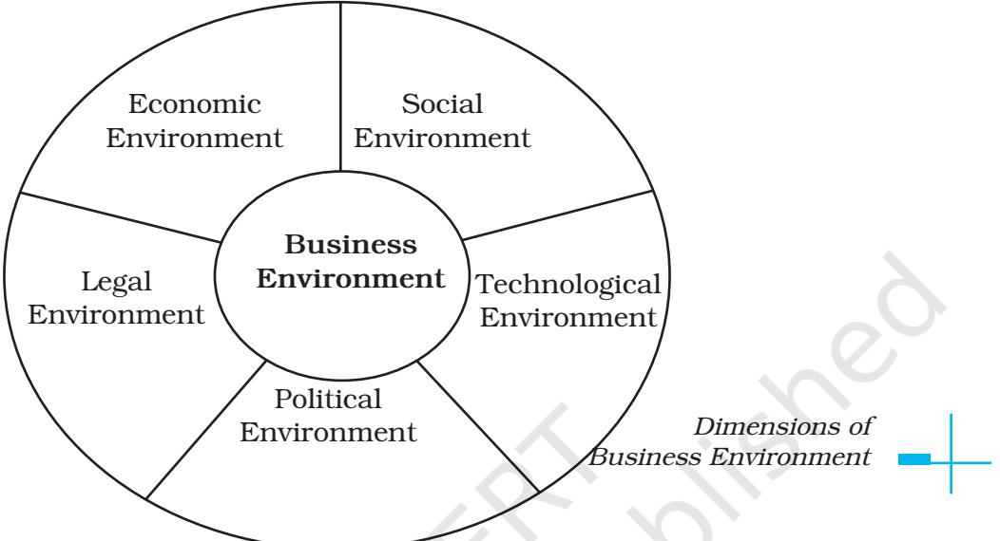
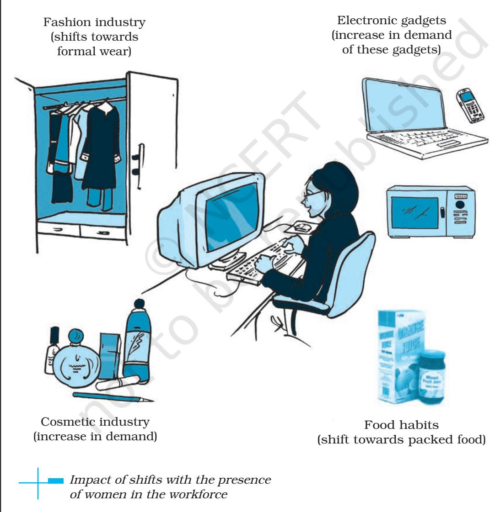
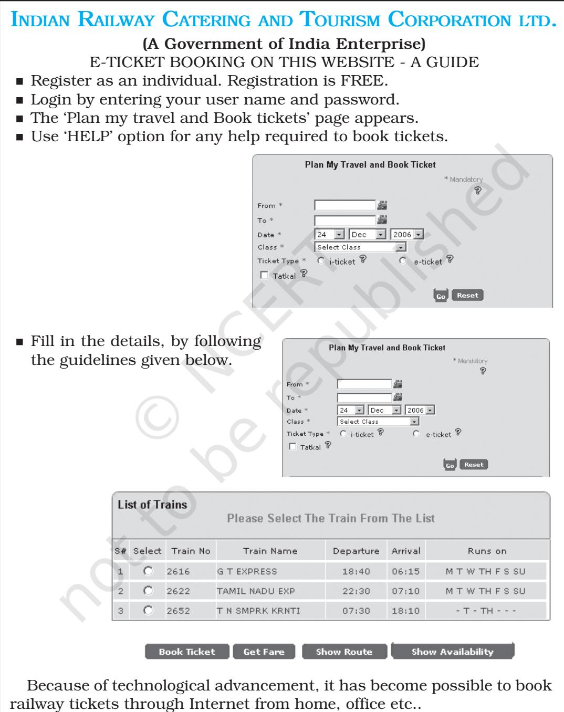

## **BUSINESS ENVIRONMENT**

#### **How a Rickshaw Puller became an entrepreneur**

OBJECTIVES On what seemed like a regular day at work Dharamveer Kamboj, a rickshaw puller, was riding through the streets of Delhi when he met with a terrible accident. This was an event that would change his life forever. Knowing that he wouldn't be able to go back to his work, he made the decision of returning to his native village in the Yamunanagar district of Haryana to begin life anew. Being a school dropout with no technical training of any kind further restricted his scope in terms of employment.

The desire to do something out of the ordinary kept stirring in his heart time and again. He was on the lookout for the right inspiration and opportunity. Such an opportunity crossed his path during one of his visits to the outskirts of Jaipur, Ajmer and Pushkar regions of Rajasthan, where he observed a number of women self help groups at work. A common sight was women in the process of making gooseberry laddoos. While this process appeared to be rather simple, the grating of gooseberries on slabs of stone manually with hands was an excruciatingly painful exercise. There were machines available that could process the gooseberrys but none of them proved to be cost effective. The industry was so small in scale and the owners so modest in means that it was impossible for them to buy machines and put them in use. Dharamveer Kamboj began to think of ways of making fruit and vegetable processing machines not only affordable, but also free of accidental health hazards. Observing that cutting, grating, juicing and pulverizing involved similar techniques made him come up with the idea of a multipurpose processing machine that could work equally well for all of these tasks. There was however a big hurdle in the way of Dharamveer. His limited education would prove his task to be an uphill battle. He however was not deterred. He knew problems would come his way, but to challenge and overcome them was his motto in life. *"Sangharsh hi sabse badi kaamyaabi hai. Agar badhna hai toh peeche mud kar nahin dekhna hai."*

# L E A R N I N G

After studying this chapter you will be able to:

- n Explain the meaning of business environment;
- n Discuss the importance of business environment;
- n Describe the various elements of business environment; and
- n Examine the economic environment in India and the impact of Government policies on business and industry.

Ch_03.indd 69 08-08-2022 09:37:32

This is the truism that Dharamveer Singh Kamboj has always lived by and was able to somehow convince him and obtain a funding of ` 25,000 for his project. He began work immediately. The first prototype of his machine was ready in March 2005. An unexpected problem of overheating however cropped up. Even after Dharamveer's constant trials for the elimination of this problem, the issue still persisted in the second prototype. But the thought of giving up never crossed Dharamveer's mind. In his third prototype, he had successfully solved the problem of overheating at last. This prototype was bought by GIAN North and sent to Kenya on a pilot basis. Based on the feedback, GIAN asked him to modify it further incorporating provisions that would make it portable, including the incorporation of foldable legs. In the fourth machine he also incorporated a sieve to manage the flow of juice from the machine during the extraction process. The machine that Dharamveer developed is unique in a way that it has the capacity to process a wide variety of products without damaging the seed of the fruit or vegetable.

> *Source: The National Innovation Foundation (NIF) – India (nif.org.in)*

The above example shows how a machine invented by Dharamveer Kamboj made life easier for women workers in unorganised sector. This innovation resulted in a positive impact on food processing business i.e., social, economic and technological in addition to enhancing quality of life.

### **Meaning of Business Environment**

The term 'business environment' means the sum total of all individuals, institutions and other forces that are outside the control of a business enterprise but that may affect its performance. As one writer has put it– "Just take the universe, subtract from it the subset that represents the organisation, and the remainder is environment". Thus, the economic, social, political, technological and other forces which operate outside a business enterprise are part of its environment. So also, the individual consumers or competing enterprises as well as the governments, consumer groups, competitors, courts, media and other institutions working outside an enterprise constitute its environment. The important point is that these individuals, institutions and forces are likely to influence the performance of a business enterprise although they happen to exist outside its boundaries. For example, changes in government's economic

Ch_03.indd 70 08-08-2022 09:37:32

policies, rapid technological developments, political uncertainty, changes in fashions and tastes of consumers and increased competition in the market — all influence the working of a business enterprise in important ways. Increase in taxes by government can make things expensive to buy. Technological improvements may render existing products obsolete. Political uncertainty may create fear in the minds of investors. Changes in fashions and tastes of consumers may shift demand in the market from existing products to new ones. Increased competition in the market may reduce profit margins of firms.

On the basis of the foregoing discussion, it can be said business environment, has the following features:

- (i) **Totality of external forces:** Business environment is the sum total of all things external to business firms and, as such, is aggregative in nature.
- (ii) **Specific and general forces:** Business environment includes both specific and general forces. Specific forces (such as investors, customers, competitors and suppliers) affect individual enterprises directly and immediately in their day-to-day working. General forces (such as social, political, legal and technological conditions) have impact on all business enterprises and thus may affect an individual firm only indirectly.
- (iii) **Inter-relatedness:** Different elements or parts of business environment are closely interrelated. For example, increased life expectancy of people and increased awareness for health care have increased the demand for many health products and services like soft drinks, fat-free cooking oil, and health resorts. New health products and services have, in turn, changed people's life styles.
- (iv) **Dynamic nature:** Business environment is dynamic in that it keeps on changing whether in terms of technological improvement, shifts in consumer preferences or entry of new competition in the market.
- (v) **Uncertainty:** Business environment is largely uncertain as it is very difficult to predict future happenings, especially when environment changes are taking place too frequently as in the case of information technology or fashion industries.
- (v i ) **Complexity:** Since business environment consists of numerous interrelated and dynamic conditions or forces which arise from different sources, it becomes difficult to comprehend at once what exactly constitutes a given environment. In other words, environment is a complex phenomenon that is relatively easier to understand in parts but difficult to grasp in its

Ch_03.indd 71 08-08-2022 09:37:32

totality. For example, it may be difficult to know the extent of the relative impact of the social, economic, political, technological or legal factors on change in demand of a product in the market.

- (vii) **Relativity:** Business environment is a relative concept since it differs from country to country and even region to region. Political conditions in the USA, for instance, differ from those in China or Pakistan. Similarly, demand for sarees may be fairly high in India whereas it may be almost non-existent in France.
### **Importance of Business**

### **Environment**

Just like human beings, business enterprises do not exist in isolation. Each business firm is not an island unto itself; it exists, survives and grows within the context of the element and forces of its environment. While an individual firm is able to do little to change or control these forces, it has no alternative to responding or adapting according to them. A good understanding of environment by business managers enables them not only to identify and evaluate, but also to react to the forces external to their firms. The importance of business environment and its understanding by managers can be appreciated if we consider the following facts:

- (i) **It enables the firm to identify opportunities and getting the first mover advantage:** Opportunities refer to the positive external trends or changes that will help a firm to improve its performance. Environment provides numerous opportunities for business success. Early identification of opportunities helps an enterprise to be the first to exploit them instead of losing them to competitors. For example, Maruti Udyog became the leader in the small car market because it was the first to recognise the need for small cars in an environment of rising petroleum prices and a large middle class population in India.
- (ii) **It helps the firm to identify threats and early warning signals:** Threats refer to the external environment trends and changes that will hinder a firm's performance. Besides opportunities, environment happens to be the source of many threats. Environmental awareness can help managers to identify various threats on time and serve as an early warning signal. For example, if an Indian firm finds that a foreign multinational is entering the Indian market with new substitutes, it should act as a warning signal. On the basis of this information, the Indian firms can prepare themselves to meet the threat by adopting such

Ch_03.indd 72 08-08-2022 09:37:32

measures as improving the quality of the product, reducing cost of the production, engaging in aggressive advertising, and so on.

- (iii) **It helps in tapping useful resources:** Environment is a source of various resources for running a business. To engage in any type of activity, a business enterprise assembles various resources called inputs like finance, machines, raw materials, power and water, labour, etc., from its environment including financiers, government and suppliers. They decide to provide these resources with their own expectations to get something in return from the enterprise. The business enterprise supplies the environment with its outputs such as goods and services for customers, payment of taxes to government, return on financial investment to investors and so on. Because the enterprise depends on the environment as a source of inputs or resources and as an outlet for outputs, it only makes sense that the enterprise designs policies that allow it to get the resources that it needs so that it can convert those resources into outputs that the environment desires. This can be done better by understanding what the environment has to offer.
- (iv) **It helps in coping with rapid changes:** Today's business environment is getting increasingly dynamic where changes are taking place at a fast pace. It is not the fact of change itself that is so important as the pace of change. Turbulent market conditions, less brand loyalty, divisions and sub-divisions (fragmentation) of markets, more demanding customers, rapid changes in technology and intense global competition are just a few of the images used to describe today's business environment. All sizes and all types of enterprises are facing increasingly dynamic environment. In order to effectively cope with these significant changes, managers must understand and examine the environment and develop suitable courses of action.
- (v) **It helps in assisting in planning and policy formulation:** Since environment is a source of both opportunities and threats for a business enterprise, its understanding and analysis can be the basis for deciding the future course of action (planning) or training guidelines for decision making (policy). For instance, entry of new players in the market, which means more competition may make an enterprise think afresh about how to deal with the situation.

Ch_03.indd 73 08-08-2022 09:37:32

- (vi) **It helps in improving performance:** The final reason for understanding business environment relates to whether or not it really makes a difference in the performance of an enterprise. The answer is that it does appear to make a difference. Many studies reveal that the future of an enterprise is closely bound up with what is happening in the environment. And, the enterprises that continuously monitor their environment and adopt suitable business practices are the ones which not only improve their present performance but also continue to succeed in the market for a longer period.
### **Dimensions of Business Environment**

Dimensions of, or the factors constituting the business environment include economic, social, technological, political and legal conditions which are considered relevant for decision-making and improving the performance of an enterprise. In contrast to the specific environment, these factors explain the general environment which mostly influences many enterprises at the same time. However, management of every enterprise can benefit from being aware of these dimensions instead of being disinterested in them. For instance, scientific research has discovered a technology that makes it possible to produce an

energy efficient light bulb that lasts at least twenty times as long as a standard bulb. Senior managers in the lighting divisions at General Electric and Phillips recognised that this discovery had the potential to significantly affect their unit growth and profitability, So they have carefully followed the progress on this research and profitably used its findings. A brief discussion of the various factors constituting the general environment of business is given below:

- (i) **Economic Environment:** Interest rates, inflation rates, changes in disposable income of people, stock market indices and the value of rupee are some of the economic factors that can affect management practices in a business enterprise. Short and long term interest rates significantly affect the demand for product and services. For example, in case of construction companies and automobile manufacturers, low longer-term rates are beneficial because they result in increased spending by consumers for buying homes and cars on borrowed money. Similarly, a rise in the disposable income of people due to increase in the gross domestic product of a country creates increasing demand for products. High inflation rates generally result in constraints on business enterprises as they increase
Ch_03.indd 74 08-08-2022 09:37:32

the various costs of business such as the purchase of raw materials or machinery and payment of wages and salaries to employees.

- (ii) **Social Environment:** The social environment of business include the social forces like customs and traditions, values, social
#### **Components of Economic Environment**

- n Existing structure of the economy in terms of relative role of private and public sectors.
- n The rates of growth of GNP and per capita income at current and constant prices
- n Rates of saving and investment
- n Volume of imports and exports of different items
- n Balance of payments and changes in foreign exchange reserves
- n Agricultural and industrial production trends
- n Expansion of transportation and communication facilities
- n Money supply in the economy
- n Public debt (internal and external)
- n Planned outlay in private and public sectors

Ch_03.indd 75 08-08-2022 09:37:32

trends, society's expectations from business, etc. Traditions define social practices that have lasted for decades or even centuries. For example, the celebration of Diwali, Eid, Christmas, and Guru Parv in India provides significant financial opportunities for greetings card companies, sweets or confectionery manufacturers, tailoring outlets and many other related business. Values refer to concepts that a society holds in high esteem. In India, individual freedom, social justice, equality of opportunity and national integration are examples of major values cherished by all of us. In business terms, these values translate into freedom of choice in the market, business's responsibility towards the society and non-discriminatory employment practices. Social trends present various opportunities and threats to business enterprises. For example, the health-and-fitness trend has become popular among large number of urban dwellers. This has created a demand for products like organic food, gyms, bottled (mineral) water and food supplements.

- (iii) **Technological Environment:**  Technological environment includes forces relating to scientific improvements and
innovations which provide new ways of producing goods and services and new methods and techniques of operating a business. For example, recent technological, advances in computers and electronics have modified the ways in which companies advertise their products. It is common now to see computerised information kiosks, and World Wide Web multimedia pages highlighting the virtues of products. Similarly, retailers have direct links with suppliers who replenish stocks when needed. Manufacturers have flexible manufacturing systems. Airline companies have Internet and World Wide Web pages where customers can look for flight times, destinations and fares and book their tickets online. In addition, continuing innovations in different scientific and engineering fields such as lasers, robotics, biotechnology, food preservatives, medicine, telecommunication and synthetic fuels have provided numerous opportunities and threats for many different enterprises. Shifts in demand from vaccum tubes to transistors, from steam locomotives to dieseland electric engines, from fountain pens to ballpoint, from propeller airplanes to jets, and from typewriters to computer based word processors,

Ch_03.indd 76 08-08-2022 09:37:32

have all been responsible and creating new business.

- (iv) **Political Environment:** Political environment includes political conditions such as general stability and peace in the coun-try and specific attitudes that elected government representatives hold towards business. The significance of political conditions in business success lies in the predictability of business activities under stable political conditions. On the other hand, there may be uncertainty of business activities due to political unrest and threats to law and order. Political stability, thus, builds up confidence among business people to invest
in the long term projects for the growth of the economy. Political instability can shake that confidence. Similarly, the attitudes of government officials towards business may have either positive or negative impact upon business.

- (v) **Legal Environment:** Legal environment includes various legislations passed by the Government administrative orders issued by government authorities, court judgments as well as the decisions rendered by various commissions and agencies at every level of the government— centre, state or local. It is imperative for the management of every enterprise to obey the law
#### **Major Elements of Social Environment**

- n Attitudes towards product innovations, lifestyles, occupational distribution and consumer preferences
- n Concern with quality of life
- n Life expectancy
- n Expectations from the workforce
- n Shifts in the presence of women in the workforce
- n Birth and death rates
- n Population shifts
- n Educational system and literacy rates
- n Consumption habits
- n Composition of family

Ch_03.indd 77 08-08-2022 09:37:32

#### *Activity II*

### *SOCIAL ENVIRONMENT*

Contact any ten families known to you. Find out the changes in their consumption habits over the last five years. Analyse the impact of these changes on the working of business enterprises.

Ch_03.indd 78 08-08-2022 09:37:34

Ch_03.indd 79 08-08-2022 09:37:34

of the land. Therefore, an adequate knowledge of rules and regulations framed by the Government is a pre-requisite for better business performance. Non-compliance of laws can land the business enterprise into legal problems. In India, Constitutional Provisions; Companies Act 2013; Industries (Development and Regulations) Act 1951; Foreign Exchange Management Act and the Imports and Exports (Control) Act 1947; Factories Act, 1948; Trade Union Act; 1926; Workmen's Compensation Act, 1923; Industrial Disputes Act, 1947, Consumer Protection Act, 1986, Competition Act,

2002 and host of such other legal enactments as amended from time to time by the Parliament, is important for doing business. Impact of legal environment can be illustrated with the help of government regulations to protect consumer's interests. For example, the advertisement of alcoholic beverages is prohibited. Advertisements, including packets of cigarettes carry the statutory warning 'Cigarette smoking is injurious to health'. Similarly, advertisements of baby food must necessarily inform the potential buyer that mothers milk is the best. All these regulations are required to be followed by advertisers.

#### **Major Elements of the Political Environment**

- n Prevailing political system
- n The degree of politicisation of business and economic issues
- n Dominant ideologies and values of major political parties
- n The nature and profile of political leadership and thinking of political personalities
- n The level of political morality
- n Political institutions like the government and allied agencies
- n Political ideology and practices of the ruling party
- n The extent and nature of government intervention in business
- n The nature of relationship of our country with foreign countries

Ch_03.indd 80 08-08-2022 09:37:34

### **Economic Environment in India**

The economic environment in India consists of various macrolevel factors related to the means of production and distribution of wealth which have an impact on business and industry. These include:

- (a) Stage of economic development of the country.
- (b) The economic structure in the form of mixed economy which recognises the role of both public and private sectors.
- (c) Economic policies of the Government, including industrial, monetary and fiscal policies.
- (d) Economic planning, including five year plans, annual budgets, and so on.
- (e) Economic indices, like national income, distribution of income, rate and growth of GNP, per capita income, disposal personal income, rate of savings and investments, value of exports and imports, balance of payments, and so on.
- (f) Infrastructural factors, such as, financial institutions, banks, modes of transportation communication facilities, and so on.

Business enterprises in India do realise the importance and impact of the economic environment on their working. Almost all annual company reports presented by their chairpersons devote considerable attention to the general economic environment prevailing in the country and an assessment of its impact on their companies.

The economic environment of business in India has been steadily changing mainly due to the government policies. At the time of Independence:

- (a) The Indian economy was mainly agricultural and rural in character;
- (b) About 70% of the working population was employed in agriculture;
- (c) About 85% of the population was living in the villages;
- (d) Production was carried out using irrational, low productivity technology;
- (e) Communicable diseases were widespread, mortality rates were high. These was no good public health system.

In order to solve economic problems of our country, the government took several steps including control by the State of certain industries, central planning and reduced importance of the private sector. The main objectives of India's development plans were:

- (a) Initiate rapid economic growth to raise the standard of living, reduce unemployment and poverty;
- (b) Become self-reliant and set up a strong industrial base with emphasis on heavy and basic industries;
- (c) Reduce inequalities of income and wealth;

Ch_03.indd 81 08-08-2022 09:37:34

- (d) Adopt a socialist pattern of development — based on equality and prevent exploitation of man by man.
In accordance with the economic planning, the government gave a lead role to the public sector for infrastructure industries whereas the private sector was broadly given the responsibility of developing consumer goods industry. At the same time, the government imposed several restrictions, regulations and controls on the working of private sector enterprises. India's experience with economic planning has delivered mixed results. In 1991 the economy faced a serious foreign exchange crisis, high government deficit and a rising trend of prices despite bumper crops.

As a part of economic reforms, the Government of India announced a new industrial policy in July 1991.

The broad features of this policy were as follows:

- (a) The Government reduced the number of industries under compulsory licensing to six.
- (b) Many of the industries reserved for the public sector under the earlier policy, were dereserved. The role of the public sector was limited only to four industries of strategic importance.
- (c) Disinvestment was carried out in case of many public sector industrial enterprises.
- (d) Policy towards foreign capital was liberalised. The share of foreign equity participation was increased and in many activities 100 per

cent Foreign Direct Investment (FDI) was permitted.

- (e) Automatic permission was now granted for technology agreements with foreign companies.
- (f) Foreign Investment Promotion Board (FIPB) was set up to promote and channelise foreign investment in India.

Appropriate measures were taken to remove obstacles in the way of growth and expansion of industrial units of large industrial houses. Small-scale sector was assured all help and accorded due recognition.

In essence, this policy has sought to liberate industry from the shackles of the licensing system (liberalisation), drastically reduce the role of the public sector (privatisation) and encourage foreign private participation in India's industrial development (globalisation).

**Liberalisation:** The economic reforms that were introduced were aimed at liberalising the Indian business and industry from all unnecessary controls and restrictions. They signalled the end of the licence-pemit-quota raj. Liberalisation of the Indian industry has taken place with respect to:

- (i) abolishing licensing requirement in most of the industries except a short list,
- (ii) freedom in deciding the scale of business activities i.e., no restrictions on expansion or contraction of business activities,
- (iii) removal of restrictions on the movement of goods and services,
- (iv) freedom in fixing the prices of goods services,

Ch_03.indd 82 08-08-2022 09:37:34

#### **Crisis of June 1991**

Major elements of the crisis situation which led the Government of India to announce economic reform were:

- n A serious fiscal crisis in which the fiscal deficit reached the level of 6.6 per cent of GDP in 1990-91.
- n Heavy internal debt which rose to about 50 per cent of GDP with interest payments draining about 39 per cent of total revenue collections of the central government.
- n Low GNP growth rate which fell to 1.4 per cent from the peak level of 10.5 per cent in 1988-89 (at 1980-81 prices).
- n Low overall agricultural production, foodgrain production and industrial production showed negative growth rates of –2.8 per cent, –5.3 per cent and –0.1 per cent respectively.
- n Soaring inflation rate based both on wholesale price index and consumer price index (for industrial workers) at 13-14 per cent.
- n Shrinkage of foreign trade, imports (in $ terms) fell by 19.4 per cent and exports by 1.5 per cent.
- n Depreciation of rupee by 26.7 per cent vis-à-vis US dollars.
- n Fall of foreign exchange reserves to such a low level that they were barely adequate to meet the import requirements of a few weeks. Non-resident Indians (NRIs) were withdrawing their deposits at an alarmingly high rate.
- n The confidence of the international financial institutions was badly shaken and in just over a year its creditworthiness rating fell from AAA to BB+ (put on credit watch).
- n The country was on the verge of defaulting on international financial obligations and the situation warranted immediate policy action to save the situation. In May 1991, the Government had to lease 20 tones of gold out of its stock to the State Bank of India to enable it to sell the gold with repurchase option after six months. In addition, Reserve Bank of India was allowed to pledge 47 tones of gold to the Bank of England to raise a loan of $600 million.
- (v) reduction in tax rates and lifting of unnecessary controls over the economy,
- (vi) simplifying procedures for imports and experts, and
- (vii) making it easier to attract foreign capital and technology to India.

**Privatisation:** The new set of economic reforms aimed at giving greater role to the private sector in the nation building process and a reduced role to the public sector. This was a reversal of the development strategy pursued so far by Indian planners. To achieve this, the government redefined the

Ch_03.indd 83 08-08-2022 09:37:34

role of the public sector in the New Industrial Policy of 1991, adopted the policy of planned disinvestments of the public sector and decided to refer the loss making and sick enterprises to the Board of Industrial and Financial Reconstruction. The term disinvestments used here means transfer in the public sector enterprises to the private sector. It results in dilution of stake of the Government in the public enterprise. If there is dilution of Government ownership beyond 51 percent, it would result in transfer of ownership and management of the enterprise to the private sector.

**Globalisation:** Globalisation means the integration of the various economies of the world leading towards the emergence of a cohesive global economy. Till 1991, the Government of India had followed a policy of strictly regulating imports in value and volume terms. These regulations were with respect to (a) licensing of imports, (b) tariff restrictions and (c) quantitative restrictions. The new economic reforms aimed at trade liberalisation were directed towards import liberalisation, export promotion through rationalisation of the tariff structure and reforms with respect to foreign exchange so that the country does not remain isolated from the rest of the world. Globalisation involves an increased level of interaction and interdependence among the various nations of the global economy. Physical geographical gap or political boundaries no longer remain barriers for a business enterprise to serve a customer in a distant geographical market. This has been made possible by the rapid advancement in technology and liberal trade policies by Governments. Through the policy of 1991, the government of India moved the country to this globalisation pattern.

#### **A Truly Globalised Economy**

A truly global economy implies a boundaryless world where there is:

- (i) Free flow of goods and services across nations;
- (ii) Free flow of capital across nations;
- (iii) Free flow of information and technology;
- (iv) Free movement of people across borders;
- (v) A common acceptable mechanism for the settlement of disputes;
- (vi) A global governance perspective.

#### *Activity 3*

#### *GLOBALISATION*

Make a list of five Indian companies which have global operations today. Find out the major products they sell and the countries where they operate.

Ch_03.indd 84 08-08-2022 09:37:34

#### **Early Crisis Met : Reform Measures**

- Some of the early major steps taken to manage the economic crisis were the following:
- n Fiscal correction aimed at reducing fiscal deficit by about Rs. 7,700 crore in 1991-92 (compared to 1990-91);
- n Announcement of New Industry Policy in July 1991 seeking to deregulate the industry with the objective of promoting the growth of a more competitive and efficient industrial economy;
- n Abolition of industrial licensing for all industrial projects except 18 industries of high strategic and environmental importance and with high import content. About 80 per cent of the industries were delicensed;
- n Amendment of the MRTP Act to eliminate the need for prior approval of the Central Government by large companies for capacity expansion, diversification and merger and amalgamation.
- n Nine areas in basic and core industries earlier reserved for the public sector were opened to the private sector;
- n Limit of foreign equity holding raised from 40 per cent to 51 per cent in a wide range of priority industries;
- n Foreign Investment Promotion Board (FIPB) established to negotiate proposals from large international firms and expedite clearances of the investment proposals;
- n Rupee devaluation by 18 per cent during July 1-3, 1991 supported by a standby credit of $2.3 billion from the IMP over a 20 months period negotiated in October 1991;
- n Negotiation of $500 million Structural Adjustment Loan from the World Bank in April 1992 and a loan totalling SDR 1.3 billion from the International Monetory Fund (IMF) between January-September 1991;
- n Introduction of India Development Bond Scheme and Immunity Scheme for repatriation of funds held abroad in October 1991, under which more than $2 billion were mobilised during 1991-92;
- n Bringing back of gold earlier pledged to the Bank of England and the Bank of Japan;
- n Continuance of the measures of import control and credit squeeze;
- n Administered licensing of imports replaced by freely tradeable import entitlements (called Eximscrips) linked to export earnings. The measure was expected to introduce selfbalancing mechanism in India's foreign trade;
- n Introduction of Liberalised Exchange Rate Management System (LERMS) under which a dual exchange rate system was established, one rate being effectively floated in the market; and
- n Import licensing in most capital goods, raw materials, intermediates and components eliminated. Advance Licensing System considerably simplified.

The initial series of measures set the tone for the future economic reforms. Any of the measures taken above was continued to form a part of the ongoing reform process.

Ch_03.indd 85 08-08-2022 09:37:34

**Demonetisation:** The Government of India, made an announcement on November 8, 2016 with profound implications for the Indian economy. The two largest denomination notes, `500 `1,000, were 'demonetised' with immediate effect, ceasing to be legal tender except for a few specified purposes such as paying utility bills. This led to eighty six per cent of the money in circulation invalid. The people of India had to deposit the invalid currency in the banks which came along with the restrictions placed on cash withdrawals. In other words, restrictions were placed on the convertibility of domestic money and bank deposits.

The aim of demonetisation was to curb corruption, counterfeiting the use of high denomination notes for illegal activities; and especially the accumulation of 'black money' generated by income that has not been declared to the tax authorities.

#### *Features*

- 1. Demonetisation is viewed as a tax administration measure. Cash holdings arising from declared income was readily deposited in banks and exchanged for new notes. But those with black money had to declare their unaccounted wealth and pay taxes at a penalty rate.
- 2. Demonetisation is also interpreted as a shift on the part of the government indicating that tax evasion will no longer be tolerated or accepted.
- 3. Demonetisation also led to tax administration channelizing savings into the formal financial system. Though, much of the cash that has been deposited in the banking system is bound to be withdrawn but some of the new deposits schemes offered by the banks will continue to provide a base loans, at lower interest rates.
- 4. Another feature of demonetisation is to create a *less-cash* or *cash-lite* economy, i.e., channeling more savings through the formal financial system and improving tax compliance. Though there are arguments against this as digital transactions require use of cell phones for customers and Point-of-Sale (PoS) machines for merchants, which will only work if there is internet connectivity. On the contrary, these disadvantages are counterbalanced by an understanding that it helps people into the formal economy, thereby increasing financial saving and reducing tax evasion.

Digitalisation has broadly impact three sections of society: the poor, who are largely outside the digital economy; the less largely outside the digital economy; the less affluent, who are becoming part of the digital economy who have been covered under *Jan Dhan Accounts* and *Rupay cards*; and the affluent, who are fully conversant with digital transactions.

Ch_03.indd 86 08-08-2022 09:37:34

| 1. | Money/Interest | i. Decline in cash transactions |
| --- | --- | --- |
|  | rates | ii. Bank deposits increased |
|  |  | iii. Increase in financial savings |
| 2. | Private wealth | Declined since some high demonetised notes were not returned |
|  |  | and real estate prices fell |
| 3. | Public sector | No effect |
|  | wealth |  |
| 4. | Digitisation | Digital transactions amongst new users (RuPay/AEPS) increased |
| 5. | Real estate | Prices declined |
| 6. | Tax collection | Rise in income tax collection because of increased disclosure |

#### **Impact of Demonetisation**

*Adapted from Economic Survey, 2016–17*

#### **Key Terms**

| Business environment |  | Opportunities | Threats | Economic |
| --- | --- | --- | --- | --- |
| Environment | Political | environment | Social | environment |
| Technological environment |  | Legal environment |  | Liberalisation |
| Privatisation | Globalisation |  |  |  |

#### **Summary**

**Meaning of business environment:** The term business environment means the totality of all individuals, institutions and other forces that are outside a business but that potentially affect its performance. Business environment can be characterised in terms of

- (a) totality of external forces
- (b) specific and general forces
- (c) inter-relatedness
- (d) dynamic nature
- (e) uncertainty
- (f) complexity
- (g) relativity

**Importance of business environment:** Business environment and its understanding are important for (i) enabling the identification of opportunities and getting the first mover advantage, (ii) helping in the identification of threats and early warning signals, (iii) coping with the rapid changes, (v) assisting in planning and policy and (vi) improving the performance.

Ch_03.indd 87 08-08-2022 09:37:34

**Elements of business environment:** Business environment consists of five important dimensions including economic, social, technological, political and legal.

**Economic environment** includes such factors as interest rates, inflation rates, changes in disposable income of people, stock market indexes and the value of rupee.

**Social environment** includes social forces like traditions, values, social trends, society's expectations of business, and so on.

**Technological environment** includes forces relating to scientific improvements and innovations which provide new ways of producing goods and services and new methods and techniques of operating a business.

**Political environment** includes political conditions such as general stability and peace in the country and specific attitudes that elected government representatives hold toward business.

**Legal environment** includes various legislations passed by the government, administrative orders issued by government authorities, court judgments as well as decisions rendered by various commissions and agencies at every level of the government center, state or local.

**Economic environment in India:** The economic environment in India consists of various macro-level factors related to the means of production and distribution of wealth which have an impact on business and industry. The economic environment of business in India has been steadily changing since Independence mainly due to government policies. In order to solve economic problems of our country at the time of Independence, the government took several steps including control by the state of key industries, central planning and reduced importance of the private sector. These steps delivered mixed results until 1991 when Indian economy happened to face serious foreign exchange crisis, high government deficit and a rising trend of prices despite bumper crops.

**Liberalisation, privatisation and globalisation:** As a part of economic reforms, the Government of India announced a new industrial policy in July 1991 which sought to liberate the industry from the shackles of the licensing system (liberalisation), drastically reduce the role of the public sector (privatisation) and encourage foreign private participation in industrial development (globalisation).

**Impact of Government policy changes on business and industry:** The government policy of liberalisation, privatisation and globalisation has made a definite impact on the working of enterprises in business and industry in terms of

Ch_03.indd 88 08-08-2022 09:37:34

- (a) increasing competition
- (b) more demanding customers
- (c) rapidly changing technological environment
- (d) necessity for change
- (e) need for developing human resource
- (f ) market orientation
- (g) loss of budgetary support to the public sector. In the new economic environment, the Indian enterprises have developed various strategies to meet the challenge of competition

#### **Exercises**

#### **Very Short Answer Type:**

- 1. What is meant by business environment?
- 2. How does understanding of business environment help in improving performance of a business?
- 3. Give an example to show that a business firm operates within numerous inter related factors constituting the business environment.(Hint: example highlighting the inter relatedness of dimensions of business environment).
- 4. Krishna Furnishers Mart started its operations in the year 1954 and emerged as the market leader in the industry because of their original designs and efficiency in operations. They had a steady demand for their products but over the years, they found their market share declining because of new entrants in the field. The firm decided to review their operations and decided that in order to meet the competition, they need to study and analyze the market trends and then design and develop their products accordingly. List any two impacts of changes in business environment on Krishna Furnishers Mart's operations. (Hint: increase in competition and Market orientation).
- 5. Name any two Specific forces of business environment affecting business.

#### **Short Answer Type:**

- 1. Why it is important for business enterprises to understand their environment? Explain.
- 2. Explain the following terms: a. Liberalisation

Ch_03.indd 89 08-08-2022 09:37:34

- b. Privatization
- c. Globalisation
- 3. National Digital Library of India (NDL India) is a pilot project initiated by the HRD ministry. It works towards developing a framework of virtual repository of learning resources with a single-window search facility. It provides support to all academic levels including researchers, life-long learners and differentlyabled learners free of cost. State the dimensions of business environment highlighted above.
- 4. State the impact of demonetization on interest rates, private wealth and real estate.

#### **Long Answer Type:**

- 1. How would you characterize business environment? Explain with examples, the difference between general and specific environment.
- 2. How would you argue that the success of a businessenterprise is significantly influenced by its environment?
- 3. Explain, with examples, the various dimensions of businessenvironment.
- 4. The government of India announced Demonetization of ` 500 and ` 1,000 currency notes with effect from the midnight of November 8, 2016. As a result, the existing ` 500 and ` 1,000 currency notes ceased to be legal tender from that date. New currency notes of the denomination of ` 500 and ` 2,000 were issued by Reserve Bank of India after the announcement.

 This step resulted in a substantial increase in the awareness about and use of Point of Sale machines, e-wallets, digital cash and other modes of cashless transactions. Also, increased transparency in monetary transactions and disclosure led to a rise in government revenue in the form of tax collection.

- a. Enumerate the dimensions of business environment highlighted above.
- b. State the features of Demonetization.
- 5. What economic changes were initiated by the Government under the Industrial Policy, 1991? What impact have these changes made on business and industry?
- 6. What are the essential features of:
	- a. Liberalisation,
	- b. Privatization and
	- c. Globalisation?

Ch_03.indd 90 08-08-2022 09:37:34

