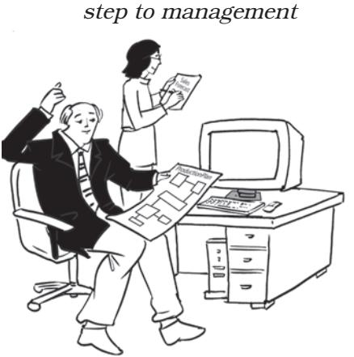

#### **Indian Oil Company Limited (IOCL) - Plans to**  *Energize* **with** *sustainability*

Indian Oil is India's largest commercial organisation. It is top ranked Indian company in the latest Fortune 'Global 500' listings (2017). Indian Oil's vision is driven by a group of dynamic leaders who have made it a name to reckon with. With over 34,000 strong work force, a Maharatna Company, Indian Oil has been helping to meet India's energy demands and reaching petroleum products to every part of India for over five decades. It plans to increase its business operations all around the world. The company plans to invest ` 20,000 crore in 2017-18 acquisitions and plans to expand overseas. The company always believed to be ahead of the demand. Last year too, IOC had invested close to ` 20,000 crore, including around ` 16,000 crore in various Indian projects and on acquisition for upstream in Russia.

It is noteworthy, between 2012-17, IOCL ended up investing around ` 75,000 crore against the targeted planned investment of around ` 56,200 crore. All investments have been in refinery expansion, upgradation of quality of refineries, building new pipelines, getting more aggressive in petrochemical projects, setting up new natural gas facilities etc. IOC is also looking at the overseas market. Recently it was decided to open an office in Bangladesh apart from talking to the Government of Bangladesh on many accounts, especially regarding LPG and natural gas where it is trying to take a linkage from IOC pipeline going up from Damra project and West Bengal border before finally connecting to the Bangladesh network. For Nepal, IOC plans to build a pipeline between Motihari terminal of IOCL, which is currently coming up, and their own facilities inside Nepal. The company has already signed a memorandum of understanding (MoU) with Bhutan and looking at newly opening markets such as Myanmar.

The company always feels that they have to keep their eyes open for new acquisitions. The company has got good reserves and were able to generate funds through internal accruals. But

# **CHAPTER**

### L E A R N I N G OBJECTIVES

After studying this chapter, you will be able to:

- n State the meaning of planning;
- n Describe the features and importance of planning;
- n Explain the limitations of planning;
- n Analyse the steps in the planning process; and
- n Identity the different types of plans.

Ch_04.indd 91 08-08-2022 09:43:21

on a project basis IOC will certainly go into the market — both India and Overseas, depending on which is cheaper — to borrow money, if needed.

> *Source: https://www.business-standard.com/article/ companies/ioc-to-invest-around-rs-20-000-in-2017-18 plans-expansion-acquisitions-117051600438_1.html.*

# **Introduction**

You have just read about the plans of Indian Oil Company Limited (IOCL). Of course, these are broad statements given by the company and they have to be broken down into steps for implementation. This is an example of a company with a nation‑wide reach striving to be one of the top companies in India. Further more, every organisation whether it is government-owned, a privately owned business or a company in the private sector requires planning. The government makes five year plans for the country, a small business has it's own plans, while other companies have big plans, sales plans, production plans. All of them have some plans.

All business firms would like to be successful, increase their sales and earn profits. All managers dream of these and strive to achieve their goals. But to turn these dreams into reality managers need to work hard in thinking about the future, in making business predictions and achieving targets. Dreams can be turned into reality only if business managers think in advance on what to do and how to do it. This is the essence of planning.

# **Concept**

Planning is deciding in advance what to do and how to do. It is one of the basic managerial functions. Before doing something, the manager must formulate an idea of how to work on a particular task. Thus, planning is closely connected with creativity and innovation. But the manager would first have to set objectives, only then will a manager know where he has to go. Planning seeks to bridge the gap between where we are and where we want to go. Planning is what managers at all levels do. It requires taking decisions since it involves making a choice from alternative courses of action.

Planning, thus, involves setting objectives and developing appropriate courses of action to achieve these obj‑ ectives. Objectives provide direction for all managerial decisions and actions. Planning provides a rational approach for achieving predetermined objectives. All members, therefore,

Ch_04.indd 92 08-08-2022 09:43:21

*Planning: Keeping the objective in view and being in action*

need to work towards achieving organisational goals. These goals set the targets which need to be achieved and against which actual performance is measured. Therefore, planning means setting objectives and targets and formulating an action plan to achieve them. It is concerned with both ends and means i.e., what is to be done and how it is to be done.

The plan that is developed has to have a given time frame but time is a limited resource. It needs to be utilised judiciously. If time factor is not taken into consideration, conditions in the environment may change and all business plans may go waste. Planning will be a futile exercise if it is not acted upon or implemented.

Do you think from the above we can formulate a comprehensive definition of planning? One of the ways to do so would be to define planning as setting objectives for a given time period, formulating various courses of action to achieve them, and then selecting the best possible alternative from among the various courses of action available.

# **Importance of Planning**

You must have seen in films and advertisements how executives draw up plans and make powerful presentations in boardrooms. Do those plans actually work? Does it improve efficiency? After all why should we plan? These are numerous questions to which we would like to find solutions. Planning is certainly important as it tells us where to go, it provides direction and reduces the risk of uncertainty by preparing forecasts. The major benefits of planning are given below:

- (i) **Planning provides directions:** By stating in advance how work is to be done planning provides direction for action. Planning ensures that the goals or objectives are clearly stated so that they act as a guide for deciding what action should be taken and in which direction. If goals are well defined, employees are aware of what the organisation has to do and what they must do to achieve those goals. Departments and
Ch_04.indd 93 08-08-2022 09:43:23

individuals in the organisation are able to work in coordination. If there was no planning, empl‑ oyees would be working in different directions and the organisation would not be able to achieve its desired goals.

- (ii) **Planning reduces the risks of uncertainty:** Planning is an activity which enables a manager to look ahead and anticipate changes. By deciding in advance the tasks to be performed, planning shows the way to deal with changes and uncertain events. Changes or events cannot be eliminated but they can be anticipated and managerial responses to them can be developed.
- (iii) **Planning reduces overlapping and wasteful activities:** Planning serves as the basis of coordinating the activities and efforts of different divisions, departments and individuals. It helps in avoiding confusion and misunderstanding. Since planning ensures clarity in thought and action, work is carried on smoothly without interruptions. Useless and redundant activities are minimised or eliminated. It is easier to detect inefficiencies and take corrective measures to deal with them.
- (iv) **Planning promotes innovative ideas:** Since planning is the first function of management, new ideas can take the shape

of concrete plans. It is the most challenging activity for the management as it guides all future actions leading to growth and prosperity of the business.

- (v) **Planning facilitates decision making:** Planning helps the manager to look into the future and make a choice from amongst various alternative courses of action. The manager has to evaluate each alternative and select the most viable proposition. Planning involves setting targets and predicting future conditions, thus helping in taking rational decisions.
- (vi) **Planning establishes standards for controlling:** Planning involves setting of goals. The entire managerial process is concerned with accomplishing predetermined goals through planning, organising, staffing, directing and controlling. Planning provides the goals or standards against which actual performance is measured. By comparing actual performance with some standard, managers can know whether they have actually been able to attain the goals. If there is any deviation it can be corrected. Therefore, we can say that planning is a prerequisite for controlling. If there were no goals and standards, then finding deviations which are a

Ch_04.indd 94 08-08-2022 09:43:23

part of controlling would not be possible. The nature of corrective action required depends upon the extent of deviations from the standard. Therefore, planning provides the basis of control.

# **Features of Planning**

In the example of Polaris, the company has plans of expansion. Their objective is to increase their capacity so that they can employ 800 more professionals. Their target time is six months. The objective of the current year has also been clearly stated which is to increase capacity by 1500-2000 more professionals. Since planning is the primary function of management they have set their objectives first. Thus, all businesses follow a set pattern of planning. You will be able to find some similarities in the features of planning and what you see in real life. Try and identify them.

The planning function of the management has certain special features. These features throw light on its nature and scope.

- (i) **Planning focuses on achieving objectives:** Organisations are set up with a general purpose in view. Specific goals are set out in the plans along with the activities to be undertaken to achieve the goals. Thus, planning is purposeful. Planning has no meaning unless it
contributes to the achievement of predetermined organisational goals.

- (ii) **Planning is a primary function of management:** Planning lays down the base for other functions of management. All other managerial functions are performed within the framework of the plans drawn. Thus, planning precedes other functions. This is also referred to as the primacy of planning. The various functions of management are interrelated and equally important. However, planning provides the basis of all other functions.
- (iii) **Planning is pervasive:** Planning is required at all levels of management as well as in all departments of the organisation. It is not an exclusive function of top management nor of any particular department. But the scope of planning differs at different levels and among different departments. For example, the top management undertakes planning for the organisation as a whole. Middle management does the departmental planning. At the lowest level, day-to-day operational planning is done by supervisors.
- (iv) **Planning is continuous:** Plans are prepared for a specific period of time, may be for a month, a quarter, or a year. At the end

Ch_04.indd 95 08-08-2022 09:43:23

of that period there is need for a new plan to be drawn on the basis of new requirements and future conditions. Hence, planning is a continuous process. Continuity of planning is related with the planning cycle. It means that a plan is framed, it is implemented, and is followed by another plan, and so on.

- (v) **Planning is futuristic:** Planning essentially involves looking ahead and preparing for the future. The purpose of planning is to meet future events effectively to the best advantage of an organisation. It implies peeping into the future, analysing it and predicting it. Planning is, therefore, regarded as a forward looking function based on forecasting. Through forecasting, future events and conditions are anticipated and plans are drawn accordingly. Thus, for example, sales forecasting is the basis on which a business firm prepares its annual plan for production and sales.
- (vi) **Planning involves decision making:** Planning essentially involves choice from among various alternatives and activities. If there is only one possible goal or a possible course of action, there is no

need for planning because there is no choice. The need for planning arises only when alternatives are available. In actual practice, planning presupposes the existence of alternatives. Planning, thus, involves thorough examination and evaluation of each alternative and choosing the most appropriate one.

- (vii) **Planning is a mental exercise:** Planning requires application of the mind involving foresight, intelligent imagination and sound judgement. It is basically an intellectual activity of thinking rather than doing, because planning determines the action to be taken. However, planning requires logical and systematic thinking rather than guess work or wishful thinking.
*Planning: the first* 

Ch_04.indd 96 08-08-2022 09:43:24

In other words, thinking for planning must be orderly and based on the analysis of facts and forecasts.

# **Limitations of Planning**

We have seen how planning is essential for business organisations. It is difficult to manage operations without formal planning. It is important for an organisation to move towards achieving goals. But we have often seen in our daily lives also, that things do not always go according to plan. Unforeseen events and changes, rise in costs and prices, environmental changes, government interventions, legal regulations, all affect our business plans. Plans then need to be modified. If we cannot adhere to our plans, then why do we plan at all? This is what we need to analyse. The major limitations of planning are given below:

- (i) **Planning leads to rigidity:** In an organisation, a well-defined plan is drawn up with specific goals to be achieved within a specific time frame. These plans then decide the future course of action and managers may not be in a position to change it. This kind of rigidity in plans may create difficulty. Managers need to be given some flexibility to be able to cope with the changed circumstances.
Following a pre-decided plan, when circumstances have changed, may not turn out to be in the organisations interest.

- (ii) **Planning may not work in a dynamic environment:** The business environment is dynamic, nothing is constant. The environment consists of a number of dimensions, economic, political, physical, legal and social dimensions. The organisation has to constantly adapt itself to changes. It becomes difficult to accurately assess future trends in the environment if economic policies are modified or political conditions in the country are not stable or there is a natural calamity. Competition in the market can also upset financial plans, sales targets may have to be revised and, accordingly, cash budgets also need to be modified since they are based on sales figures. Planning cannot foresee everything and thus, there may be obstacles to effective planning.
- (iii) **Planning reduces creativity:** Planning is an activity which is done by the top management. Usually the rest of the members just implements these plans. As a consequence, middle management and other decision

Ch_04.indd 97 08-08-2022 09:43:24

makers are neither allowed to deviate from plans nor are they permitted to act on their own. Thus, much of the initiative or creativity inherent in them also gets lost or reduced. Most of the time, employees do not even attempt to formulate plans. They only carry out orders. Thus, planning in a way reduces creativity since people tend to think along the same lines as others. There is nothing new or innovative.

- (iv) **Planning involves huge costs:** When plans are drawn up huge costs are involved in their formulation. These may be in terms of time and money for example, checking accuracy of facts may involve lot of time. Detailed plans require scientific calculations to ascertain facts and figures. The costs incurred sometimes may not justify the benefits derived from the plans. There are a number of incidental costs as well, like expenses on boardroom meetings, discussions with professional experts and preliminary investigations to find out the viability of the plan.
- (v) **Planning is a time-consuming process:** Sometimes plans to be drawn up take so much of time that there is not much time left for their implementation.

- (vi) **Planning does not guarantee success:** The success of an enterprise is possible only when plans are properly drawn up and implemented. Any plan needs to be translated into action or it becomes meaningless. Managers have a tendency to rely on previously tried and tested successful plans. It is not always true that just because a plan has worked before it will work again. Besides, there are so many other unknown factors to be considered. This kind of complacency and false sense of security may actually lead to failure instead of success. However, despite its limitations, planning is not a useless exercise. It is a tool to be used with caution. It provides a base for analysing future courses of action. But, it is not a solution to all problems.
# **Planning Process**

Planning, as we all know is deciding in advance what to do and how to do. It is a process of decision making. How do we go about making a plan? Since planning is an activity there are certain logical steps for every manager to follow.

- (i) **Setting Objectives:** The first and foremost step is setting objectives. Every organisation
Ch_04.indd 98 08-08-2022 09:43:24

must have certain objectives. Objectives may be set for the entire organisation and each department or unit within the organisation. Objectives or goals specify what the organisation wants to achieve. It could mean an increase in sales by 20% which could be objective of the entire organisation. How all departments would contribute to the organisational goals is the plan that is to be drawn up. Objectives should be stated clearly for all departments, units and employees. They give direction to all departments. Departments/ units then need to set their own objectives within the broad framework of the organisation's philosophy. Objectives have to percolate down to each unit and employees at all levels. At the same time, managers must contribute ideas and participate in the objective setting process. They must also understand how their actions contribute to achieving objectives. If the end result is clear it becomes easier to work towards the goal.

- (ii) **Developing Premises:** Planning is concerned with the future which is uncertain and every planner is using conjecture about what might happen in future.
#### **Kinds of plans: Objective, Strategy and Policy of Mitticool**

During the devastating earthquake of January 2001, Mansukhbhai incurred heavy loss and most of his goods were damaged. He distributed the leftover stock that was undamaged, to the quake affected masses of Kutch. This led to a photograph that was taken just after the earthquake and featured on the Sandesh Gujarati Daily in February 2001. It showed a broken water filter that was made by Mansukhbhai with a caption that said "The poor man's broken fridge".

At that time, he met the Gujarat Grass-roots Innovation Augmentation Network (GIAN), Ahmedabad, which supported Mansukhbhai further in his endeavours. Finally after an arduous quest and several tests of soil and fridge designs, he emerged with the innovative Mitticool fridge in 2005. After that he has innovated various products using clay.

- y The company has stuck to its policy of keeping all its products at a lower rate which will be affordable for the poor people.
- y Their future plans include starting a factory with the aid of the National Innovation Foundation at IIM Ahmedabad and making a MittiCool house. It will be a green (eco-friendly) house with clay that will have no electricity but only renewable energy to maintain a comfortable temperature inside."

Ch_04.indd 99 08-08-2022 09:43:24

Therefore, the manager is required to make certain assumptions about the future. These assumptions are called premises. Assumptions are the base material upon which plans are to be drawn. The base material may be in the form of forecasts, existing plans or any past information about policies. The premises or assumptions must be the same for all and there should be total agreement on them. All managers involved in planning should be familiar with and use the same assumptions. For example, forecasting is important in developing premises as it is a technique of gathering information. Forecasts can be made about the demand for a particular product, policy change, interest rates, prices of capital goods, tax rates etc. Accurate forecasts, therefore become essential for successful plans.

- (iii) **Identifying alternative courses of action:** Once objectives are set, assumptions are made. Then the next step would be to act upon them. There may be many ways to act and achieve objectives. All the alternative courses of action should be identified. The course of action which may be taken could be either routine or innovative. An innovative course may be adopted by involving more people and sharing their ideas. If the project is important, then more alternatives should
be generated and thoroughly discussed amongst the members of the organisation.

- (iv) **Evaluating alternative courses:**  The next step is to weigh the pros and cons of each alternative. Each course will have many variables which have to be weighed against each other. The positive and negative aspects of each proposal need to be evaluated in the light of the objective to be achieved. In financial plans, for example, the risk-return trade-off is very common. The more risky the investment, the higher the returns it is likely to give. To evaluate such proposals detailed calculations of earnings, earnings per share, interest, taxes, dividends are made and decisions taken. Accurate forecasts in conditions of certainty/uncertainty then become vital assumptions for these proposals. Alternatives are evaluated in the light of their feasibility and consequences.
- (v) **Selecting an alternative:** This is the real point of decision making. The best plan has to be adopted and implemented. The ideal plan, of course, would be the most feasible, profitable and with least negative consequences. Most plans may not always be subjected to a mathematical analysis. In such cases, subjectivity and the manager's experience, judgement and

Ch_04.indd 100 08-08-2022 09:43:24

at times, intuition play an important part in selecting the most viable alternative. Sometimes, a combination of plans may be selected instead of one best course. The manager will have to apply permutations and combinations and select the best possible course of action.

- (vi) **Implementing the plan:** This is the step where other managerial functions also come into the picture. The step is concerned with putting the plan into action, i.e., doing what is required. For example, if there is a plan to increase production then more labour, more machinery will be required. This step would also involve organising for labour and purchase of machinery.
- (vii) **Follow-up action:** To see whether plans are being implemented and activities are performed according to schedule is also part of the planning process. Monitoring the plans is equally important to ensure that objectives are achieved.

# **Types of Plans**

#### **Single-use and standing plans**

An organisation has to prepare a plan before making any decision related to business operation, or undertaking any project. Plans can be classified into several types depending on the use and the length of the planning period. Certain plans have a shortterm horizon and help to achieve operational goals. These plans can be classified into single-use plans and standing plans.

**Single-use Plan:** A single-use plan is developed for a one-time event or project. Such a course of action is not likely to be repeated in future, i.e., they are for non-recurring situations. The duration of this plan may depend upon the type of the project. It may span a week or a month. A project may sometimes be of only one day, such as, organising an event or a seminar or conference. These plans include budgets, programmes and projects. They consist of details, including the names of employees who are responsible for doing the work and contributing to the single-use plan. For example, a programme may consist of identifying steps, procedures required for opening a new department to deal with other minor work. Projects are similar to programmes but differ in scope and complexity. A budget is a statement of expenses, revenue and income for a specified period.

**Standing Plan:** A standing plan is used for activities that occur regularly over a period of time. It is designed to ensure that internal operations of an organisation run smoothly. Such a plan greatly enhances efficiency in routine decision-making. It is usually developed once but is modified from time to time to meet business needs as required. Standing plans include policies, procedures, methods and rules.

Policies are general forms of standing plans that specifies the organisations

Ch_04.indd 101 08-08-2022 09:43:24

response to a certain situation like the admission policy of an educational institution. Procedures describe steps to be followed in particular circumstances like the procedure for reporting progress in production. Methods provide the manner in which a task has to be performed. Rules are very clearly stated as to exactly what has to be done like reporting for work at a particular time.

Single-use and standing plans are part of the operational planning process.

There are other types of plans which usually are not classified as singleuse or standing plans. A strategy, for example, is part of strategic planning or management. It is a general plan prepared by top management outlining resource allocation, priorities and takes into consideration the business environment and competition. Objectives are usually set by the top management and serve as a guide for overall planning. Each unit then formulates their own objectives keeping in view the overall organisational goals.

Based on what the plans seek to achieve, plans can be classified as Objectives, Strategy, Policy, Procedure, Method, Rule, Programme, Budget.

# **Objectives**

The first step in planning is setting objectives. Objectives, therefore, can be said to be the desired future position that the management would like to reach. Objectives are very basic to the organisation and they are defined as ends which the management seeks to achieve by its operations. Therefore, an objective simply stated is what you would like to achieve, i.e., the end result of activities. For example, an organisation may have an objective of increasing sales by 10% or earning a reasonable rate of return on investment, earn a 20% profit from business. They represent the end point of planning. All other managerial activities are also directed towards achieving these objectives. They are usually set by top management of the organisation and focus on broad, general issues. They define the future state of affairs which the organisation strives to realise. They serve as a guide for overall business planning. Different departments or units in the organisation may have their own objectives.

Objectives need to be expressed in specific terms i.e., they should be measurable in quantitative terms, in the form of a written statement of desired results to be achieved within a given time period.

# **Strategy**

A strategy provides the broad contours of an organisation's business. It will also refer to future decisions defining the organisations direction and scope in the long run. Thus, we can say a strategy is a comprehensive plan

Ch_04.indd 102 08-08-2022 09:43:24

for accomplishing an organisation objectives. This comprehensive plan will include three dimensions, (i) determining long term objectives, (ii) adopting a particular course of action, and (iii) allocating resources necessary to achieve the objective.

Whenever a strategy is formulated, the business environment needs to be taken into consideration. The changes in the economic, political, social, legal and technological environment will affect an organisation's strategy. Strategies usually take the course of forming the organisation's identity in the business enviro‑ nment. Major strategic decisions will include decisions like whether the organisation will continue to be in the same line of business, or combine new lines of activity with the existing business or seek to acquire a dominant position in the same market. For example, a company's marketing strategy has to address certain questions i.e., who are the customers? what is the demand for the product? which channel of distribution to use? what is the pricing policy? and how do we advertise the product. These and many more issues need to be resolved while formulating a marketing strategy for any organisation.

# **Policy**

Policies are general statements that guide thinking or channelise energies towards a particular direction. Policies provide a basis for interpreting strategy which is usually stated in general terms. They are guides to managerial action and decisions in the implementation of strategy. For example, the company may have a recruitment policy, pricing policy within which objectives are set and decisions are made. If there is an established policy, it becomes easier to resolve problems or issues. As such, a policy is the general response to a particular problem or situation.

There are policies for all levels and departments in the organisation ranging from major company policies to minor policies. Major company policies are for all to know i.e., customers, clients, competitors etc., whereas minor polices are applicable to insiders and contain minute details of information vital to the employees of an organisation. But there has to be some basis for divulging information to others.

Policies define the broad parameters within which a manager may function. The manager may use his/her discretion to interpret and apply a policy. For example, the decisions taken under a Purchase Policy would be in the nature of manufacturing or buying decisions. Should a company make or buy its requirements of packages, transport services, printing of stationery, water and power supply and other items? How should vendors be selected for procuring supplies? How many suppliers should a company make purchases from? What is the criteria for choosing suppliers. All these

Ch_04.indd 103 08-08-2022 09:43:24

queries would be addressed by the Purchase Policy.

# **Procedure**

Procedures are routine steps on how to carry out activities. They detail the exact manner in which any work is to be performed. They are specified in a chronological order. For example, there may be a procedure for requisitioning supplies before production. Procedures are specified steps to be followed in particular circumstances. They are generally meant for insiders to follow. The sequence of steps or actions to be taken are generally to enforce a policy and to attain pre-determined objectives. Policies and procedures are interlinked with each other. Procedures are steps to be carried out within a broad policy framework.

# **Method**

Methods provide the prescribed ways or manner in which a task has to be performed considering the objective. It deals with a task comprising one step of a procedure and specifies how this step is to be performed. The method may vary from task to task. Selection of proper method saves time, money and effort and increases efficiency. For imparting training to employees at various level from top management to supervisory, different methods can be adopted. For example for higher level management orientation programmes, lectures and seminars can be organised whereas at the supervisory level, on the job training methods and work-oriented methods are appropriate.

# **Rule**

Rules are specific statements that inform what is to be done. They do not allow for any flexibility or discretion. It reflects a managerial decision that a certain action must or must not be taken. They are usually the simplest type of plans because there is no compromise or change unless a policy decision is taken.

# **Programme**

Programmes are detailed statements about a project which outlines the objectives, policies, procedures, rules, tasks, human and physical resources required and the budget to implement any course of action. Programmes will include the entire gamut of activities as well as the organisation's policy and how it will contribute to the overall business plan. The minutest details are worked out i.e., procedures, rules, budgets, within the broad policy framework.

# **Budget**

A budget is a statement of expected results expressed in numerical terms. It is a plan which quantifies future facts and figures. For example, a sales budget may forecast the sales

Ch_04.indd 104 08-08-2022 09:43:24

of different products in each area for a particular month. A budget may also be prepared to show the number of workers required in the factory at peak production times.

Since budget represents all items in numbers, it becomes easier to compare actual figures with expected figures and take corrective action subsequently. Thus, a budget is also a control device from which deviations can be taken care of. But making a budget involves forecasting, therefore, it clearly comes under planning. It is a fundamental planning instrument in many organisations.

Let us take an example of Cash Budget. The cash budget is a basic tool in the management of cash. It is a device to help the management to plan and control the use of cash. It is a statement showing the estimated cash inflows and cash outflows over a given period. Cash inflows would generally come from cash sales and the cash outflows would generally be the costs and expenses associated with the operations of the business. The net cash position is determined by the cash budget i.e., inflows minus (–) outflows = surplus or deficiency.

The management has to hold adequate cash balances for various purposes. But at the same time, it should avoid excess balance of cash since it gives little or no return. The business has to assess and plan its need for cash with a degree of caution.

### **Key Terms**

| Planning | Objectives |  | Goals | Decisions |
| --- | --- | --- | --- | --- |
| Standards |  | Controlling | Premises | Assumptions |
| Alternatives |  | Strategy | Policy | Procedure |
| Rule | Programme | Budget |  |  |

#### **Summary**

#### **Planning**

Planning is deciding in advance what to do and how to do. It is one of the basic managerial functions.

Planning therefore involves setting objectives and developing an appropriate course of action to achieve these objectives.

#### **Importance of Planning**

Planning provides directions, reduces risks of uncertainty, reduces overlapping and wasteful activities, promotes innovative ideas, facilitates decision making, establishes standards for controlling. **Features of Planning**

Planning focuses on achieving objectives; It is a primary function of management; Planning is pervasive, continuous, futuristic and involves decision making; It is a mental exercise.

Ch_04.indd 105 08-08-2022 09:43:24

#### **Limitations of Planning**

Planning leads to rigidity; reduces creativity; involves huge costs; It is a time consuming process; Planning does not work in a dynamic environment; and does not guarantee success.

#### **Planning Process**

*Setting objectives:* Objectives may be set for the entire organisation and each department or unit within the organisation.

*Developing premises:* Planning is concerned with the future which is uncertain and every planner is using conjucture about what might happen in future.

*Identifying alternative courses of action:* Once objectives are set, assumptions are made. Then the next step would be to act upon them. *Evaluating alternative courses:* The next step is to weigh the pros and cons of each alternative.

*Selecting an alternative:* This is the real point of decision making. The best plan has to be adopted and implemented.

*Implement the plan:* This is concerned with putting the plan into action. *Follow-up action:* Monitoring the plans are equally important to ensure that objectives are achieved.

#### **Types of Plans**

*Objectives:* Objectives therefore can be said to be the desired future position that the management would like to reach.

*Strategy:* A strategy provides the broad contours of an organisation's business. It will also refer to future decisions defining the organisations direction and scope in the long run.

*Policy:* Policies are general statements that guide thinking or channelise energies towards a particular direction.

*Procedure:* Procedures are routine steps on how to carry out activities. *Rule:* Rules are specific statements that tell what is to be done.

*Programme:* Programmes are detailed statements about a project which outlines the objectives, policies, procedures, rules, tasks, human and physical resources required and the budget to implement any course of action.

*Budget:* A budget is a statement of expected results expressed in numerical terms. It is a plan which quantifies future facts and figures.

#### **Exercises**

#### **Very Short Answer Type**

- 1. How does planning provide direction?
- 2. A company wants to increase its market share from the present 10% to 25% to have a dominant position in the

Ch_04.indd 106 08-08-2022 09:43:24

market by the end of the next financial year. Ms Rajni, the sales manager has been asked to prepare a proposal that will outline the options available for achieving this objective. Her report included the following options - entering new markets, expanding the product range offered to customers, using sales promotion techniques such as giving rebates, discounts or increasing the budget for advertising activities. Which step of the planning process has been performed by Ms Rajni?

- 3. Why are rules considered to be plans?
- 4. Rama Stationery Mart has made a decision to make all the payments by e-transfers only. Identify the type of plan adopted by Rama Stationery Mart.
- 5. Can planning work in a changing environment? Give a reason to justify your answer.

#### **Short Answer Type**

- 1. What are the main aspects in the definition of planning?
- 2. If planning involves working out details for the future, why does it not ensure success?
- 3. What kind of strategic decisions are taken by business organisations?
- 4. Planning reduces creativity. Critically comment.(Hint: both the points - Planning promotes innovative ideas and planning reduces creativity – will be given).
- 5. In an attempt to cope with Reliance Jio's onslaught in 2018, market leader Bharti Airtel has refreshed its ` 149 prepaid plan to offer 2 GB of 3G/4G data per day, twice the amount it offered earlier. Name the type of plan is highlighted in the given example. ? State its three dimensions also.
- 6. State the type of plan and state whether they are Single use or Standing plan:
	- a. A type of plan which serves as a controlling device as well.(budget)
	- b. A plan based on research and analysis and is concerned with physical and technical tasks. (Method)

#### **Long Answer Type**

- 1. Why is it that organisations are not always able to accomplish all their objectives?
Ch_04.indd 107 08-08-2022 09:43:24

- 2. What are the steps taken by management in the planning process?
- 3. An auto company C Ltd. is facing a problem of declining market share due to increased competition from other new and existing players in the market. Its competitors are introducing lower priced models for mass consumers who are price sensitive. C Ltd. realized that it needs to take steps immediately to improve its market standing in the future. For quality conscious consumers, C Limited plans to introduce new models with added features and new technological advancements. The company has formed a team with representatives from all the levels of management. This team will brainstorm and will determine the steps that will be adopted by the organisation for implementing the above strategy. Explain the features of Planning highlighted in the situation given below.(Hint: Planning is pervasive, Planning is futuristic and Planning is a mental exercise).

Ch_04.indd 108 08-08-2022 09:43:24

