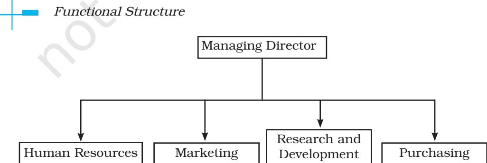
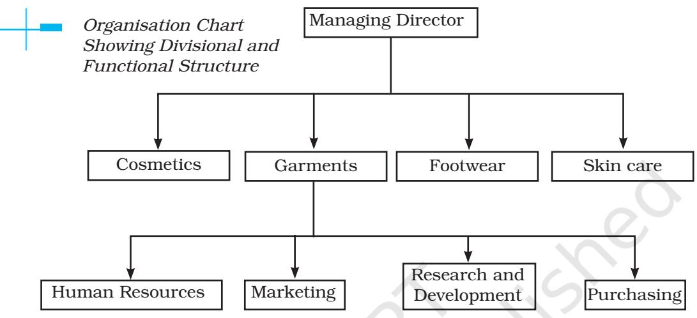
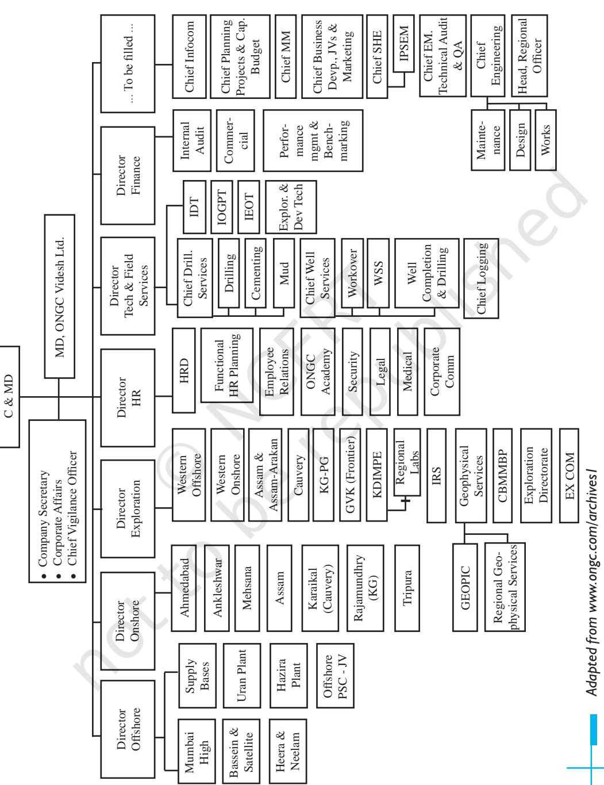
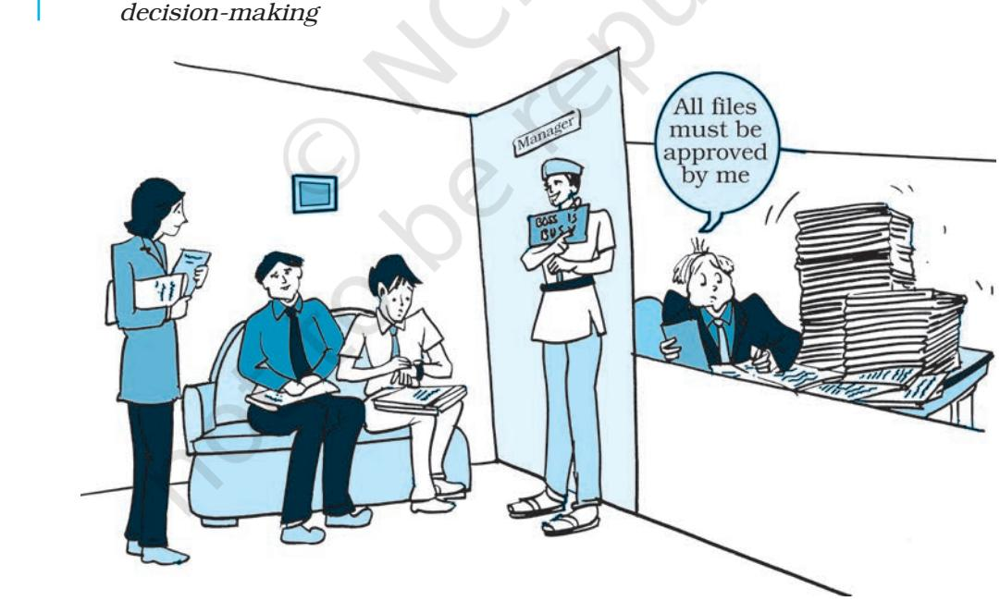

## **ORGANISING**

# **CHAPTER** 5

#### **Way To Go, Wipro!**

It's not quite there yet, but the goal is certainly within reach. One of India's largest IT solutions providers, Wipro Technologies, is taking on the likes of IBM and Accenture in its effort to be included among the largest and most successful technology services companies in the world.

Restructuring Wipro was considered the most important step in becoming a global giant, driven by the goal towards improved customerorientation.

During the past few months, Wipro separated itself into several subsidiaries by product line: telecommunications, engineering, financial services, etc. Each subsidiary brings in about $300 million in annual earnings and is self-sufficient with their own accounting books, personnel and administrative functions.

Wipro shifted from a centralised to decentralised management system. All responsibilities for growth lay with the management of each entity.

"We tried to de-layer the organisation and empower our business leaders with a much higher degree of growth responsibility," said Premji. "We removed an entire layer [of executives]".

> *Adapted from an article by Heide B. Malhotra for Epoch Times Washington D.C.*

Once the plans have been laid down and objectives specified therein, the next step is to organise resources in a manner which leads to the accomplishment of objectives. A

## L E A R N I N G OBJECTIVES

After studying this chapter you should be able to:

- n Explain the concept of organising;
- n Explain the process of organising;
- n Describe the importance of organising;
- n Explain the meaning, advantages and disadvantages of functional organisation;
- n Explain the meaning, advantages and disadvantages of divisional organisation;
- n Explain the meaning, advantages and disadvantages of formal and informal organisation;
- n Distinguish between formal and informal organisation;
- n Explain the concept of delegation and decentralisation;
- n Describe the importance of delegation and decentralisation; and
- n Distinguish between delegation and decentralisation.

critical issue in accomplishing the goals specified in the planning process is structuring the work of an organisation to adapt to the dynamic business environment. The activities

Ch_05.indd 109 08-08-2022 09:50:36

of an enterprise must be organised in such a manner that plans can be successfully implemented.

For planning to be fruitful a number of considerations like resources that will be needed, optimum utilisation of the same translation of work into attainable tasks, empowering the workforce to accomplish these tasks etc., need to be understood and dealt with properly.

It is evident from the way Wipro has moved towards reaching for it's goal of becoming a globally successful technology company, that organising plays a significant role in implementation of plans.

What has Wipro done to become a contending force among other global giants? Are there lessons to be learnt from Wipro's approach?

Wipro organised itself in a manner that allowed customer orientation to dominate over other goals and diversified on the basis of product lines. It also modified the relationships within the management hierarchy to suit the goals.

The management function of organising ensures that efforts are directed towards the attainment of goals laid down in the planning function in such a manner that resources are used optimally and people are able to work collectively and effectively for a common purpose. Thus, it is in the context of effective management that the organisation function earns due importance. It is a means for translating plans into action.

The organising function leads to the creation of an organisational structure which includes the designing of roles to be filled by suitably skilled people and defining the inter relationship between these roles so that ambiguity in performance of duties can be eliminated. Not only is this important for productive cooperation between the personnel but also for clarification of extent of authority, as well as responsibility for results and logical grouping of activities.

## **Meaning**

Let us take an example to understand how organising takes place. Have you ever paid attention to how, the school fete which you enjoy so much, actually takes place? What goes on behind the scene to make it the desired reality you want? The whole activity is divided into task groups each dealing with a specific area like the food committee, the decoration committee, the ticketing committee and so on. These are under the overall supervision of the official in charge of the event. Coordinating relationships are established among the various groups to enable smooth interaction and clarity about each group's contribution towards the event. All the above activities are a part of the organising function.

Organising essentially implies a process which coordinates human efforts, assembles resources and integrates both into a unified whole

Ch_05.indd 110 08-08-2022 09:50:36

to be utilised for achieving specified objectives.

Organising can be defined as a process that initiates implementation of plans by clarifying jobs and working relationships and effectively deploying resources for attainment of identified and desired results (goals).

## **Steps in the Process of Organising**

Organising involves a series of steps that need to be taken in order to achieve the desired goal. Let us try and understand how organising is carried out with the help of an example.

Suppose twelve students work for the school library in the summer vacations. One afternoon they are told to unload a shipment of new releases, stock the bookshelves, and then dispose of all waste (packaging, paper etc). If all the students decide to do it in their own way, it will result in mass confusion. However, if one student supervises the work by grouping students, dividing the work, assigning each group their quota and developing reporting relationships among them, the job will be done faster and in a better manner.

From the above description, the following steps emerge in the process of organising:

- (i) **Identification and division of work:** The first step in the process of organising involves identifying and dividing the work that has to be done in accordance with previously determined plans. The work is divided into manageable activities so that duplication can be avoided and the burden of work can be shared among the employees.
- (ii) **Departmentalisation:** Once work has been divided into small and manageable activities then those activities which are similar in nature are grouped together. Such sets facilitate specialisation. This grouping process is

#### **Definition of Organising**

Organising is the process of identifying and grouping the work to be performed, defining and delegating responsibility and authority, and establishing relationships for the purpose of enabling people to work most effectively together in accomplishing objectives.

*Louis Allen*

Organising is the process of defining and grouping the activities of the enterprise and establishing authority relationships among them. *Theo Haimman*

Ch_05.indd 111 08-08-2022 09:50:36

#### **Think About It**

Your school must have various societies for extra-curricular activities like the dramatics society, the quiz club, the economics society, the debating society and so on. Observe and list the way they have organised their activities using division of labour, chain of communication and the levels they have adopted for reporting on work. How far is this similar to the process you have read about?

called departmentalisation. Departments can be created using several criteria as a basis. Examples of some of the most popularly used basis are territory (north, south, west, etc.) and products (appliances, clothes, cosmetics etc).

- (iii) **Assignment of duties:** It is necessary to define the work of different job positions and accordingly allocate work to various employees. Once departments have been formed, each of them is placed under the charge of an individual. Jobs are then allocated to the members of each department in accordance to their skills and competencies. It is essential for effective performance that a proper match is made between the nature of a job and the ability of an individual. The work must be assigned to those who are best fitted to perform it well.
- (iv) **Establishing authority and reporting relationships:** Merely allocating work is not enough. Each individual should also know who he has to take orders from and to whom he is accountable.

The establishment of such clear relationships helps to create a hierarchal structure and helps in coordination amongst various departments.

## **Importance of Organising**

Performance of the organising function can pave the way for a smooth transition of the enterprise in accordance with the dynamic business environment. The significance of the organising function mainly arises from the fact that it helps in the survival and growth of an enterprise and equips it to meet various challenges. In order for any business enterprise to perform tasks and successfully meet goals, the organising function must be properly performed. The following points highlight the crucial role that organising plays in any business enterprise:

- (i) **Benefits of specialisation:**  Organising leads to a systematic allocation of jobs amongst the work force. This reduces the workload as well as enhances productivity because of the specific workers performing a
Ch_05.indd 112 08-08-2022 09:50:36

specific job on a regular basis. Repetitive performance of a particular task allows a worker to gain experience in that area and leads to specialisation.

- (ii) **Clarity in working relationships:** The establishment of working relationships clarifies lines of communication and specifies who is to report to whom. This removes ambiguity in transfer of information and instructions. It helps in creating a hierarchical order thereby enabling the fixation of responsibility and specification of the extent of authority to be exercised by an individual.
- (iii) **Optimum utilisation of resources:** Organising leads to the proper usage of all material, financial and human resources. The proper assignment of jobs avoids overlapping of work and also makes possible the best use of resources. Avoidance of duplication of work helps in preventing confusion and minimising the wastage of resources and efforts.
- (iv) **Adaptation to change:** The process of organising allows a business enterprise to accommodate changes in the business environment. It allows the organisation structure to be suitably modified and the revision of inter-relationships amongst managerial levels to pave the

way for a smooth transition. It also provides much needed stability to the enterprise as it can then continue to survive and grow inspite of changes.

- (v) **Effective administration:** Organising provides a clear description of jobs and related duties. This helps to avoid confusion and duplication. Clarity in working relationships enables proper execution of work. Management of an enterprise thereby becomes easy and this brings effectiveness in administration.
- (vi) **Development of personnel:** Organising stimulates creativity amongst the managers. Effective delegation allows the managers to reduce their workload by assigning routine jobs to their subordinates. The reduction in workload by delegation is not just necessary because of limited capacity of an individual but also allows the manager to develop new methods and ways of performing tasks. It gives them the time to explore areas for growth and the opportunity to innovate thereby strengthening the company's competitive position. Delegation also develops in the subordinate the ability to deal effectively with challenges and helps them to realise their full potential.
- (vii) **Expansion and growth:** Organising helps in the growth and diversification of an enterprise

Ch_05.indd 113 08-08-2022 09:50:36

#### **Think About It**

Organising leads to specialisation in work. A pitfall of this is that repetitive performance of the same job may lead to monotony, stress, boredom and absenteeism. What can managers do to improve the scenario?

by enabling it to deviate from existing norms and taking up new challenges.

It allows a business enterprise to add more job positions, departments and even diversify their product lines. New geographical territories can be added to current areas of operation and this will help to increase customer base, sales and profit.

Thus, organising is a process by which the manager brings order out of chaos, removes conflict among people over work or responsibility sharing and creates an environment suitable for teamwork.

## **Organisation Structure**

Organisation structure is the outcome of the organising process. An effective structure will result in increased profitability of the enterprise. The need for an adequate organisation structure is felt by an enterprise whenever it grows in size or complexity. It is only those enterprises which do not focus on growth that can maintain a particular structure for a long period of time. However, it is important to understand that such stagnancy may prove to be detrimental to an enterprise as those companies which do not change at all will close down or cease to grow.

As an organisation grows, coordination becomes difficult due to the emergence of new functions and increase in structural hierarchies. Thus, for an organisation to function smoothly and face environmental changes, it becomes necessary to pay attention to its structure.

Peter Drucker emphasises on the importance of having an appropriate organisation structure when he says, "organisation structure is an indispensable means; and the wrong structure will seriously impair business performance and even destroy it."

The organisation structure can be defined as the framework within which managerial and operating tasks are performed. It specifies the relationships between people, work and resources. It allows correlation and coordination among human, physical and financial resources and this enables a business enterprise to accomplish desired goals. The organisation structure of a firm is shown in an organisation chart.

The span of management, to a large extent gives shape to the

Ch_05.indd 114 08-08-2022 09:50:36

organisational structure. Span of management refers to the number of subordinates that can be effectively managed by a superior. This determines the levels of management in the structure.

A proper organisation structure is essential to ensure a smooth flow of communication and better control over the operations of a business enterprise.

An organisation structure provides the framework which enables the enterprise to function as an integrated unit by regulating and coordinating the responsibilities of individuals and departments. Let us try and understand this through an example.

*For example:* Sunita opened her own travel agency. The success of her travel agency depends on a harmonious relationship between the customer and the employees of the travel agency. In order to achieve this objective she has divided the entire work of the agency into three subheads based on the functions namely operations, sales and administration. Operations include travel counsellor, reservation and ticketing and customer care. Sales include the Accounts executive. Administration includes Book Keeper, Cashier and utility personnel. This division of work on the basis of functions has resulted into an organisational structure specifying the line of authority and responsibility.

## **Types of Organisation Structures**

The type of structure adopted by an organisation will vary with the nature and types of activities performed by an organsation. The organisational structure can be classified under two categories which are as follows:

- (i) Functional structure and
- (ii) Divisional structure

#### **Functional structure**

Grouping of jobs of similar nature under functional and organising these major functions as separate

Ch_05.indd 115 08-08-2022 09:50:36

departments creates a functional structure. All departments report to a coordinating head. For example, in a manufacturing concern division of work into key functions will include production, purchase, marketing, accounts and personnel. These departments may be further divided into sections. Thus, a functional structure is an organisational design that groups similar or related jobs together.

*Advantages:* The functional structure has many advantages to offer. Important among them are as follows:

- (a) A functional structure leads to occupational specialisation since emphasis is placed on specific functions. This promotes efficiency in utilisation of manpower as employees perform similar tasks within a department and are able to improve performance.
- (b) It promotes control and coordination within a department because of similarity in the tasks being performed.
- (c) It helps in increasing managerial and operational efficiency and this results in increased profit.
- (d) It leads to minimal duplication of effort which results in economies of scale and this lowers cost.
- (e) It makes training of employees easier as the focus is only on a limited range of skills.
- (f) It ensures that different functions get due attention.

*Disadvantages:* The functional structure has certain disadvantages which an organisation must take into consideration before it adopts it. Some of them are as follows:

- (a) A functional structure places less emphasis on overall enterprise objectives than the objectives pursued by a functional head. Such practices may lead to functional empires wherein the importance of a particular function may be overemphasised. Pursuing departmental interests at the cost of organisational interests can also hinder the interaction between two or more departments.
- (b) It may lead to problems in coordination as information has to be exchanged across functionally differentiated departments.
- (c) A conflict of interests may arise when the interests of two or more departments are not compatible. For example, the sales department insisting on a customer friendly design may cause difficulties in production. Such dissension can prove to be harmful in terms of fulfillment of organisational interest. Interdepartmental conflicts can also arise in the absence of clear separation of responsibility.
- (d) It may lead to inflexibility as people with same skills and knowledge base may develop a narrow perspective and thus,

Ch_05.indd 116 08-08-2022 09:50:36

#### **Think About It**

Read newspapers regularly and try to identify the structures various business organisations being mentioned in the news have adopted. Have their structures led to improved and desired results in any way?

have difficulty in appreciating by other point of view. Functional heads do not get training for top management positions because they are unable to gather experience in diverse areas.

*Suitability:* It is most suitable when the size of the organisation is large, has a diversified activities and operations require a high degree of specialisation.

#### **Divisional Structure**

Many large organisations with diversified activities have reorganised themselves away from the simpler and basic functional structure towards a divisional structure which is more suited to their activities. This is particularly true of those enterprises which have more than one category of products to offer. This is because although every organisation performs a set of homogenous functions, as it diversifies into varied product categories, the need for a more evolved structural design is felt to cope with the emerging complexity.

In a divisional structure, the organisation structure comprises of separate business units or divisions. Each unit has a divisional manager responsible for performance and who has authority over the unit. Generally, manpower is grouped on the basis of different products manufactured. Each division is multifunctional because within each division functions like production, marketing, finance, purchase, etc., are performed together to achieve a common goal. Each division is self-contained as it develops expertise in all functions related to a product line.

In other words, within each division, the functional structure tends to be adopted. However, functions may vary across divisions in accordance with a particular product line. Further, each division works as a profit center where the divisional head is responsible for the profit or loss of his division. For example, a large company may have divisions like cosmetics, clothing, etc. *Advantages:* The divisional structure offers many benefits. Prominent among these are as follows:

- (a) Product specialisation helps in the development of varied skills in a divisional head and this prepares
Ch_05.indd 117 08-08-2022 09:50:36

him for higher positions. This is because he gains experience in all functions related to a particular product.

- (b) Divisional heads are accountable for profits, as revenues and costs related to different departments can be easily identified and assigned to them. This provides a proper basis for performance measurement. It also helps in fixation of responsibility in cases of poor performance of the division and appropriate remedial action can be taken.
- (c) It promotes flexibility and initiative because each division functions as an autonomous unit which leads to faster decision making.
- (d) It facilitates expansion and growth as new divisions can be added without interrupting the existing

operations by merely adding another divisional head and staff for the new product line.

*Disadvantages:* The divisional structure has certain disadvantages. Some of them are as follows:

- (a) Conflict may arise among different divisions with reference to allocation of funds and further a particular division may seek to maximise its profits at the cost of other divisions.
- (b) It may lead to increase in costs since there may be a duplication of activities across products. Providing each division with separate set of similar functions increases expenditure.
- (c) It provides managers with the authority to supervise all activities related to a particular division. In course of time, such a manager

Ch_05.indd 118 08-08-2022 09:50:36

| Basis | Functional Structure | Divisional Structure |
| --- | --- | --- |
| Formation | Formation is based on | Formation is based on product |
|  | functions | lines and is supported by |
|  |  | functions. |
| Specialisation | Functional specialisation. | Product specialisation. |
| Responsibility | Difficult to fix on a | Easy to fix responsiblity for |
|  | department. | performance. |
| Managerial | Difficult, as each | Easier, autonomy as well as |
| Development | functional manager | the chance to perform multiple |
|  | has to report to the top | functions helps in managerial |
|  | management. | development. |
| Cost | Functions are not | Duplication of resources in |
|  | duplicated hence | various departments, hence |
|  | economical | costly. |
| Coordination | Difficult for a multi | Easy, because all functions |
|  | product company. | related to a particular |
|  |  | product are integrated in one |
|  |  | department. |

#### **Comparative view: Functional and Divisional Structure**

may gain power and in a bid to assert his independence may ignore organisational interests.

*Suitability:* Divisional structure is suitable for those business enterprises where a large variety of products are manufactured using different productive resources. When an organisation grows and needs to add more employees, create more departments and introduce new levels of management, it will decide to adopt a divisional structure. Table 1 provides a comparison of functional and divisional structure to provide further clarity on the topic.

Thus, it can be said that business operates in a dynamic environment and those enterprises which fail to adapt to change are unable to survive. Hence, management must continuously review its plans and objectives and accordingly the organisation structure of the enterprise should also be subjected to periodic review to determine if modification is required. An organisation structure, at all times should contribute towards the achievement of the enterprise's objectives and should provide scope for initiative so that contribution of personnel can be maximum and effective.

Ch_05.indd 119 08-08-2022 09:50:36

120 Business Studies

Ch_05.indd 120 08-08-2022 09:50:36

#### **Structural Transformation at ONGC**

Since its inception, ONGC has been instrumental in transforming the country's limited upstream sector into a large viable playing field, with its activities spread throughout India and significantly in overseas territories.

The 1990s had begun on a grim note for ONGC. It took almost a decade for the Corporation to sort things out in most uncertain of times.

Among many problems, the Corporation was also suffering from the organisational atrophy. In order to survive ONGC sought help from Mc Kinsey.

Mc Kinsey's mandate was to evolve an organisational structure that was far more responsive to its business needs than that based on business groups. The ONGC system run by functional heads often meant delays exceeding a year in matters requiring urgent decisions on fields. Also, since responsibilities were shared at production platforms between different business groups, the system degenerated into wrangling over responsibilities. Similarly, group loyalties often took precedence over the requirements of tasks. But, most importantly, it was found that the performance evaluation criteria based on business group yardstick were completely at loggerheads with requirements on fields. Mc Kinsey recommended an assetbased approach with clearly-defined responsibilities in its presentation titled 'Organisation Transformation Project'

Though Mc Kinsey recommendations were broadly accepted, coordination issues concerning commonly-shared services needed to be sorted out.

Finally, the first control over all service personnel working with asset teams was vested in asset managers, on grounds that being responsible for the performance of their strategic business units they must rightfully exercise control over all personnel working with them. Even procurement powers were devolved. Finally, a new structure made up of 14 assets and 11 centralised services was rolled out .

#### **Do It Yourself**

You have seen the structure of ONGC as an illustration in this text. Browse the websites of other business organisations and study their organisational chart. Try to identify the structure they are using.

## **Formal and Informal Organisation**

In all organisations, employees are guided by rules and procedures. To enable smooth functioning of the enterprise, job description and rules and procedures related to work processes have to be laid down. This is done through the formal organisation.

Formal organisation refers to the organisation structure which is designed by the management to accomplish a particular task. It specifies clearly the boundaries of authority and responsibility and

Ch_05.indd 121 08-08-2022 09:50:36

there is a systematic coordination among the various activities to achieve organisational goals.

The structure in a formal organisation can be functional or divisional. The formal organisation can be better understood by a study of its features which are as follows:

- (a) It specifies the relationships among various job positions and the nature of their interrelationship. This clarifies who has to report to whom.
- (b) It is a means to achieve the objectives specified in the plans, as it lays down rules and procedures essential for their achievement.
- (c) Efforts of various departments are coordinated, interlinked and integrated through the formal organisation.
- (d) It is deliberately designed by the top management to facilitate the smooth functioning of the organisation.
- (e) It places more emphasis on work to be performed than interpersonal relationships among the employees.

*Advantages:* Formal organisation offers many advantages. Some of the important ones are:

- (a) It is easier to fix responsibility since mutual relationships are clearly defined.
- (b) There is no ambiguity in the role that each member has to play as duties are specified. This also helps in avoiding duplication of effort.
- (c) Unity of command is maintained through an established chain of command.
- (d) It leads to effective accomplishment of goals by providing a framework for the operations to be performed and ensuring that each employee knows the role he has to play.
- (e) It provides stability to the organisation. This is because behaviour of employees can be fairly predicted since there are specific rules to guide them.

*Limitations:* The formal organisation suffers from the following limitations:

- (a) The formal communication may lead to procedural delays as the established chain of command has
#### **Formal Organisation**

The formal organisation is a system of well-defined jobs, each bearing a definite measure of authority, responsibility and accountability. *Louis Allen* 

Formal organisation is a system of consciously coordinated activities of two or more persons toward a common objective.

*Chester Barnand*

Ch_05.indd 122 08-08-2022 09:50:36

to be followed which increases the time taken for decision making.

- (b) Poor organisation practices may not provide adequate recognition to creative talent, since it does not allow any deviations from rigidly laid down polices.
- (c) It is difficult to understand all human relationships in an enterprise as it places more emphasis on structure and work. Hence, the formal organisation does not provide a complete picture of how an organisation works.

## **Informal Organisation**

Interaction among people at work gives rise to a 'network of social relationships among employees' called the informal organisation.

Informal organisation emerges from within the formal organisation when people interact beyond their officially defined roles. When people have frequent contacts they cannot be forced into a rigid formal structure. Rather, based on their interaction and friendship they tend to form groups which show conformity in terms of interest. Examples of such groups formed with common interest may be those who take part in cricket matches on Sundays, meet in the cafeteria for coffee, are interested in dramatics, etc. Informal organisation has no written rules, is fluid in form and scope and does not have fixed lines of communication. The Table in the next page compares informal organisation with the formal organisation to provide better understanding of both types.

Informal organisation can be better understood with the help of the following features:

- (a) An informal organisation originates from within the formal organisation as a result of personal interaction among employees.
- (b) The standards of behaviour evolve from group norms rather than officially laid down rules and regulations.
- (c) Independent channels of communication without specified direction of flow of information are developed by group members.
- (d) It emerges spontaneously and is not deliberately created by the management.
- (e) It has no definite strucure or form because it is a complex network of social relationships among members.

#### **Informal Organisation**

An informal organisation is an aggregate of interpersonal relationships without any conscious purpose but which may contribute to joint results.

#### *Chester Barnand*

Informal organisation is a network of personal and social relations not established or required by the formal organisation but arising spontaneously as people associate with one another. *Keith Davis*

Ch_05.indd 123 08-08-2022 09:50:36

*Advantages:* The informal organisation offers many benefits. Important among them are given below:

- (a) Prescribed lines of communication are not followed. Thus, the informal organisation leads to faster spread of information as well as quick feedback.
- (b) It helps to fulfill the social needs of the members and allows them to find like minded people. This enhances their job satisfaction since it gives them a sense of belongingness in the organisation.
- (c) It contributes towards fulfillment of organisational objectives by compensating for inadequacies in

the formal organisation. For example, employees reactions towards plans and policies can be tested through the informal network.

*Disadvantages:* The informal organisation has certain disadvantages. Some of them are as follows:

- (a) When an informal organisation spreads rumours, it becomes a destructive force and goes against the interest of the formal organisation.
- (b) The management may not be successful in implementing changes if the informal organisation opposes them. Such resistance to change may delay or restrict growth.

| Basis | Formal organisation | Informal organisation |
| --- | --- | --- |
| Meaning | Structure of authority relationships created by the | Network of social relationships arising out |
|  | management | of interaction among |
|  |  | employees |
| Origin | Arises as a result of | Arises as a result of social |
|  | company rules and policies | interaction |
| Authority | Arises by virtue of position | Arises out of personal |
|  | in management | qualities |
| Behavior | It is directed by rules | There is no set behaviour |
|  |  | pattern |
| Flow of Communication | Communication takes place | Flow of communication is not through a planned |
|  | through the scalar chain | route. It can take place in |
|  |  | any direction |
| Nature | Rigid | Flexible |
| Leadership | Managers are leaders. | Leaders may or may not |
|  |  | be managers. They are |
|  |  | chosen by the group. |

#### **Formal and informal organisation: A Comparative view**

Ch_05.indd 124 08-08-2022 09:50:37

- (c) It pressurises members to conform to group expectations. This can be harmful to the organisation if the norms set by the group are against organisational interests.
Informal organisation cannot be altogether eliminated. Thus, it would be in the best interest of the organisation if the existence of such groups is recognised and the roles that their members play are identified. The knowledge of such groups can be used to gather their support and consequently lead to improved organisational performance. Such groups can also provide useful communication channels. Instead of confronting them, the management should skillfully take advantage of both the formal and informal organisation so that work continues smoothly.

## **Delegation**

A manager, no matter how capable he is, cannot manage to do every task on his own. The volume of work makes it impractical for him to handle it all by himself. As a consequence, if he desires to meet the organisational goals, focus on objectives and ensure that all work is accomplished, he must delegate authority.

Delegation refers to the downward transfer of authority from a superior to a subordinate. It is a pre-requisite to the efficient functioning of an organisation because it enables a manager to use his time on high priority activities. It also satisfies the subordinate's need for recognition and provides them with opportunities to develop and exercise initiative.

Delegation helps a manager to extend his area of operations as without it, his activities would be restricted to only what he himself can do. However, delegation does not mean abdication. The manager shall still be accountable for the performance of the assigned tasks. Moreover, the authority granted to a subordinate can be taken back and redelegated to another person. Thus, irrespective of the extent of delegated authority ,the manager shall still be accountable to the same extent as before delegation.

#### **Delegation**

Delegation is the process a manager follows in dividing the work assigned to him so that he performs that part which only he because of his unique organisational placement, can perform effectively and so that he can get others to help with what remains.

*Louis Allen*

Delegation of authority merely means the granting of authority to subordinates to operate within prescribed limits.

*Theo Haimman*

Ch_05.indd 125 08-08-2022 09:50:37

### **Elements of Delegation**

According to Louis Allen, delegation is the entrustment of responsibility and authority to another and the creation of accountability for performance.

A detailed analysis of Louis Allen's definition brings to light the following essential elements of delegation:

- (i) *Authority:* Authority refers to the right of an individual to command his subordinates and to take action within the scope of his position. The concept of authority arises from the
*No delegation leads to delays in* 

established scalar chain which links the various job positions and levels of an organisation. Authority also refers to the right to take decisions inherent in a managerial position to tell people what to do and expect them to do it.

In the formal organisation authority originates by virtue of an individual's position and the extent of authority is highest at the top management levels and reduces successively as we go down the corporate ladder. Thus, authority flows from top to bottom,

Ch_05.indd 126 08-08-2022 09:50:39

*Creation of accountability for performance*

i.e., the superior has authority over the subordinate.

Authority relationships helps to maintain order in the organisation by giving the managers the right to exact obedience and give directions to the workforce under them.

Authority determines the superior subordinate relationship wherein the superior communicates his decision to the subordinate, expecting compliance from him and the subordinate executes the decision as per the guidelines of the superior. The extent to which a superior can exact compliance also depends on the personality of the superior.

It must be noted that authority is restricted by laws and the rules and regulation of the organisation, which limit its scope. However, as we go higher up in the management hierarchy, the scope of authority increases.

- (ii) *Responsibility:* Responsibility is the obligation of a subor-dinate to properly perform the assigned duty. It arises from a superior– subordinate relationship because the subor-dinate is bound to perform the duty assigned to him by his superior. Thus, responsibility flows upwards, i.e., a subordinate will always be responsible to his superior.
Ch_05.indd 127 08-08-2022 09:50:40

An important consideration to be kept in view with respect to both authority and responsibility is that when an employee is given responsibility for a job he must also be given the degree of authority necessary to carry it out. Thus, for effective delegation the authority granted must be commensurate with the assigned responsibility. If authority granted is more than responsibility, it may lead to misuse of authority, and if responsibility assigned is more than authority it may make a person ineffective.

- (iii) *Accountability:* Delegation of authority, undoubtedly empowers an employee to act for his superior but the superior would still be accountable for the outcome:
Accountability implies being answerable for the final outcome. Once authority has been delegated and responsibility accepted, one cannot deny accountability. It cannot be delegated and flows upwards, i.e., a subordinate will be accountable to a superior for satisfactory performance of work. It indicates that the manager has to ensure the proper discharge of duties by his subordinates. It is generally enforced through regular feedback on the extent of work accomplished. The subordinate will be expected to explain the consequences of his actions or omissions.

In conclusion, it can be stated that while authority is delegated, responsibility is assumed, accountability is imposed. Responsibility is derived from authority and accountability is derived from responsibility.

**Importance of Delegation** Delegation ensures that the subordinates perform tasks on behalf of the manager thereby reducing his workload and providing him with more time to concentrate on important

| Basis | Authority | Responsibility | Accountability |
| --- | --- | --- | --- |
| Meaning | Right to command. | Obligation to | Answerability for |
|  |  | perform an assigned | outcome of the |
|  |  | task. | assigned task. |
| Delegation | Can be delegated. | Cannot be entirely | Cannot be delegated |
|  |  | delegated. | at all. |
| Origin | Arises from formal | Arises from | Arises from |
|  | position . | delegated authority. | responsibility. |
| Flow | Flows downward | Flows upward from | Flows upward from |
|  | from superior to | subordinate to | subordinate to |
|  | subordinate. | superior. | superior |

#### **Overview of the elements of delegation**

Ch_05.indd 128 08-08-2022 09:50:40

matters. Effective delegation leads to the following benefits:

- (i) **Effective management:** By empowering the employees, the managers are able to function more efficiently as they get more time to concentrate on important matters. Freedom from doing routine work provides them with opportunities to excel in new areas.
- (ii) **Employee development:** As a result of delegation, employees get more opportunitiecs to utilise their talent and this may give rise to latent abilities in them. It allows them to develop those skills which will enable them to perform complex tasks and assume those responsibilities which will improve their career prospects. It makes them better leaders and decision makers. Thus, delegation helps by preparing better future managers. Delegation empowers the employees by providing them with the chance to use their skills, gain experience and develop themselves for higher positions.
- (iii) **Mot ivat ion o f emp loyees :**  Delegation helps in developing the talents of the employees. It also has psychological benefits. When a superior entrusts a subordinate with a task, it is not merely the sharing of work but involves trust on the superior's part and commitment

on the part of the subordinate. Responsibility for work builds the self-esteem of an employee and improves his confidence. He feels encouraged and tries to improve his performance further.

- (iv) **Facilitation of growth:** Delegation helps in the expansion of an organisation by providing a ready workforce to take up leading positions in new ventures. Trained and experienced employees are able to play significant roles in the launch of new projects by replicating the work ethos they have absorbed from existing units, in the newly set up branches.
- (v) **Basis of management hierarchy:** Delegation of authority establishes superior-subordinate relationships, which are the basis of hierarchy of management. It is the degree and flow of authority which determines who has to report to whom. The extent of delegated authority also decides the power that each job position enjoys in the organisation.
- (vi) **Better coordination:** The elements of delegation, namely authority, responsibility and accountability help to define the powers, duties and answerability related to the various positions in an organisation. This helps to avoid overlapping of duties and duplication of effort as it gives a clear picture of the work being

Ch_05.indd 129 08-08-2022 09:50:40

done at various levels. Such clarity in reporting relationships help in developing and maintaining effective coordination amongst the departments, levels and functions of management.

Thus, delegation is a key element in effective organising.

## **Decentralisation**

In many organisations the top management plays an active role in taking all decisions while there are others in which this power is given to even the lower levels of management. Those organisations in which decision making authority lies with the top management are termed as centralised organisations whereas those in which such authority is shared with lower levels are decentralised organisations.

Decentralisation explains the manner in which decision making responsibilities are divided among hierarchical levels. Put simply, decentralisation refers to delegation of authority throughout all the levels of the organisation. Decision making authority is shared with lower levels and is consequently placed nearest to the points of action. In other words decision making authority is pushed down the chain of command.

When decisions taken by the lower levels are numerous as well as important an organisation can be regarded as greatly decentralised.

#### **Centralisation and Decentralisation**

Centralisation and decentralisation are relative terms, as seen from the existing status of various business enterprises.

An organisation is centralised when decision-making authority is retained by higher management levels whereas it is decentralised when such authority is delegated.

Complete centralisation would imply concentration of all decision making functions at the apex of the management hierarchy. Such a scenario would obviate the need for a management hierarchy. On the other hand, complete decentralisation

#### **Decentralisation**

Decentralisation refers to systematic effort to delegate to the lowest level all authority except that which can be exercised at central points.

#### *Louis Allen*

Everything which goes to increase the importance of a subordinate's role is decentralisation, everything that goes to reduce it is centralisation.

*Henri Fayol*

Ch_05.indd 130 08-08-2022 09:50:40

would imply the delegation of all decision making functions to the lower level of the hierarchy and this would obviate the need for higher managerial positions. Both the scenarios are unrealistic.

An organisation can never be completely centralised or decentralised. As it grows in size and complexity , there is a tendency to move towards decentralised decision making. This is because in large organisations those employees who are directly and closely involved with certain operations tend to have more knowledge about them than the top management which may only be indirectly associated with individual operations.

Hence, there is a need for a balance between these co-existing forces. Thus, it can be said that every organisation will be characterised by both centralisation and decentralisation.

## **Importance**

Decentralisation is much more than a mere transfer of authority to the lower levels of management hierarchy. It is a philosophy that implies selective dispersal of authority because it propagates the belief that people are competent, capable and resourceful. They can assume the responsibility for the effective implementation of their decisions. Thus this philosophy recognises the decision maker's need for autonomy. The management, however, needs to carefully select those decisions which will be pushed down to lower levels and those that will be retained for higher levels. Table 4 provides a comparative look between delegation and decentralisation.

Decentralisation is a fundamental step and its importance can be understood from the following points:

- (i) **Develops initiative among subordinates:** Decentralisation helps to promote self-reliance and confidence amongst the subordinates. This is because when lower managerial levels are given freedom to take their own decisions they learn to depend on their own judgment. It also keeps them in a state wherein they are constantly challenged and have to develop solutions for the various problems they encounter. A decentralisation policy helps to identify those executives who have the necessary potential to become dynamic leaders.
- (ii) **Develops managerial talent for the future:** Formal training plays an important part in equipping subordinates with skills that help them rise in the organisation but equally important is the experience gained by handling assignments independently. Decentralisation gives them a chance to prove their abilities and creates a reservoir of qualified manpower

Ch_05.indd 131 08-08-2022 09:50:40

who can be considered to fill up more challenging positions through promotions. It also helps to identify those who may not be successful in assuming greater responsibility. Thus, it is a means of management education as well as an opportunity for trained manpower to use its talent in real life situations.

- (iii) **Quick decision making:** The management hierarchy can be looked upon as a chain of communication. In centralised organisation because every decision is taken by the top management the flow of information is slow as it has to traverse many levels. Response also takes time. This reduces the speed of decision making and makes it difficult for an enterprise to adapt to dynamic operating conditions. In a decentralised organisation, however ,since decisions are taken at levels which are nearest to the points of action and there is no requirement for approval from many levels, the process is much faster. There are also less chances of information getting distorted because it doesn't have to go through long channels.
- (iv) **Relief to top management:** Decentralisation diminishes the amount of direct supervision

exercised by a superior over the activities of a subordinate because they are given the freedom to act and decide albeit within the limits set by the superior. Also, personal supervision is generally replaced by other forms of control such as return on investment etc. Decentralisation also leaves the top management with more time which they can devote to important policy decisions rather than occupying their time with both policy as well as operational decisions. In fact decentralisation is greatest when checking required on decisions taken by lower levels of management is least.

- (v) **Facilitates growth:** Decentralisation awards greater autonomy to the lower levels of management as well as divisional or departmental heads. This allows them to function in a manner best suited to their department and fosters a sense of competition amongst the departments. Consequently, with each department doing its best in a bid to outdo the other, the productivity levels increase and the organisation is able to generate more returns which can be used for expansion purposes.
- (vi) **Better control:** Decentralisation makes it possible to evaluate performance at each level and the departments can be individually

Ch_05.indd 132 08-08-2022 09:50:40

held accountable for their results. The extent of achievement of organisational objectives as well as the contribution of each department in meeting the overall objectives can be ascertained. Feedback from all levels helps to analyse variances and improve operations. In decentralisation, one of the challenges is the accountability of performance. In response to this challenge, better control systems are being evolved such as the balance score card and management information system. Decentralisation compels the management to innovative performance measurement systems.

As a conclusion, it must be noted that in spite of its benefits decentralisation should be applied with caution as it can lead to organisational disintegration if the departments start to operate on their own guidelines which may be contrary to the interest of the organisation. Decentralisation must always be balanced with centralisation in areas of major policy decisions.

#### **Decentralisation : A Strength**

The McNeil name has been associated with the manufacturing and sale of pharmaceutical products since 1879, when Robert McNeil opened his first retail drug outlet in Pennsylvania. Growing as a producer of prescription pharmaceuticals, McNeil Laboratories, Inc. was incorporated in the U.S. in 1933, and became a member of the Johnson & Johnson family of companies in 1959. Mcneil Consumer Healthcare began operations in Canada in an existing administrative Johnson & Johnson facility in Guelph, Ontario in 1980.

McNeil Consumer Healthcare (nonprescription pharmaceutical products) in Guelph, Ontario is member of the Johnson & Johnson family of companies in Canada.

An important difference between Johnson & Johnson and most other companies—is the concept of decentralised management. Instead of operating as one large multi-billion dollar corporation, Johnson & Johnson is operated as 190 smaller companies, each focused on a specific medical or product franchise and/or geographic area, with each affiliate generating multiple options for growth. Through decentralisation we combine the advantages of being big with the agility and focus of smaller firms. Decentralisation enables each company to sty close to its customer, maintain short lines of communication with customers and employees, and accelerate the development of talent. The Johnson & Johnson - Merck Consumer Pharmaceuticals company also operates from our Woodlawn Road facility in Guelph.

*http://www.mcneilcanada.com/eng/eco07pgl.shtm*

Ch_05.indd 133 08-08-2022 09:50:40

#### **Think About It**

If you were a manager, would you decentralise, knowing that it would mean dispersal of decision making authority?

| Basis | Delegation |  | Decentralisation |  |  |  |  |
| --- | --- | --- | --- | --- | --- | --- | --- |
| Nature | Delegation is a compulsory |  | Decentralisation is an optional |  |  |  |  |
|  | act because no individual can |  | policy decision. It is |  |  |  | done |
|  | perform all tasks on his own. |  | at the discretion of the top |  |  |  |  |
|  |  |  | management. |  |  |  |  |
| Freedom of action | More by superiors | control | Less control over executives |  |  |  |  |
|  | hence less freedom to take |  | hence |  | greater | freedom | of |
|  | own decisions. |  | action. |  |  |  |  |
| Status | It is a process followed to |  | It result | is | the | of | the |
|  | share tasks. |  | policy |  | decision | of the | top |
|  |  |  | management. |  |  |  |  |
| Scope | It has narrow scope as it is |  | It has wide scope as it implies |  |  |  |  |
|  | limited to superior and his |  | extension of delegation to the |  |  |  |  |
|  | immediate subordinate. |  | lowest level of management. |  |  |  |  |
| Purpose | To lessen the burden of the |  | To increase the |  |  | role | of |
|  | manager. |  | the in |  | subordinates |  | the |
|  |  |  | organisation giving |  | by |  | them |
|  |  |  | more autonomy. |  |  |  |  |

#### **Delegation and Decentralisation: A Comparative view**

#### **Key Terms**

Organising Organisational structure

Departmentalisation Delegation Authority

Responsibility Accountability Functional structure

Divisional structure Formal organisation

Informal organisation Span of management

Centralisation Decentralisation

Ch_05.indd 134 08-08-2022 09:50:41

#### **Summary**

**Organising** is the process of defining and grouping activities and establishing authority relationships among them.

Process: the process of organising consists of the following steps:

- (a) Identification and division of work
- (b) Departmentalisation
- (c) Assignment of Duties
- (d) Establishing reporting relationships

Importance: Organising is considered important because it leads to division of work, clarity in reporting relationships, optimum utilization of resources, growth, better administration and greater creativity.

**Organisational structure** is the framework within which managerial and operating tasks are performed. It can be functional or divisional.

**Span of management** is the number of subordinates under a superior.

**Functional structure** groups activities on the basis of functions. The advantages of such a structure are specialisation, better control, managerial efficiency and ease in training employees. The disadvantages are functional empires, conflict of interest, inflexibility, and restriction in managerial development.

**Divisional structure** groups activities on the basis of products. The advantages are integration, product specialisation, greater accountability, flexibility, better coordination and more initiative. The disadvantages are departmental conflicts, costly process, ignoring of organisational interests, increase in requirements of general managers.

**Formal organisation** is designed by the management to achieve organisational goals. Its advantages are fixation of responsibility, clarity of roles, unity of command and effective accomplishment of goals. Its disadvantages are procedural delays, inadequate recognition of creativity, limited in scope.

**Informal organisation** arises out of interaction amongst people at work. Its advantages are speed, fulfillment of social needs, fills inadequacies of formal structure. Its disadvantages are: disruptive force, resistance to change and priority to group interests.

**Delegation** is the transfer of authority from superior to subordinate. It has three elements: Authority, Responsibility and Accountability.

Ch_05.indd 135 08-08-2022 09:50:41

Importance of delegation is that it helps in effective management, employee development, motivation, growth and coordination.

**Decentralisation** is delegation of authority throughout the organisation.

Importance of decentralisation is that it helps in development of managerial talent, quick decision making reducing burden on top management, development of initiative, growth and better control.

#### **Exercises**

#### **Very Short Answer Type:**

- 1. Identify the network of social relationships which arises spontaneously due to interaction at work.
- 2. What does the term 'Span of management' refer to?
- 3. State any two circumstances under which the functional structure will prove to be an appropriate choice.
- 4. Draw a diagram depicting a functional structure.
- 5. company has its registered office in Delhi, manufacturing unit at Gurgaon and marketing and sales department at Faridabad. The company manufactures the consumer products. Which type of organisational structure should it adopt to achieve its target?

#### **Short Answer Type:**

- 1. What are the steps in the process of organising?
- 2. Discuss the elements of delegation.
- 3. How does informal organisation support the formal organisation?
- 4. Can a large sized organisation be totally centralised of decentralised? Give your opinion.
- 5. Decentralisation is extending delegation to the lowest level. Comment.
- 6. Neha runs a factory wherein she manufactures shoes. The business has been doing well and she intends to expand by diversifying into leather bags as well as western formal wear thereby making her company a complete provider of corporate wear. This will enable her to market her business unit as the one stop for working women. Which type of structure would you recommend for her expanded organisation and why?

Ch_05.indd 136 08-08-2022 09:50:41

- 7. The production manager asked the foreman to achieve a target production of 200 units per day, but he doesn't give him the authority to requisition tools and materials from the stores department. Can the production manager blame the foreman if he is not able to achieve the desired target? Give reasons.
#### **Long Answer Type**

- 1. Why delegation is considered essential for effective organising?
- 2. What is a divisional structure? Discuss its advantages and limitations.
- 3. Decentralisation is an optional policy. Explain why an organisation would choose to be decentralised.
- 4. Distinguish between centralisation and decentralisation.
- 5. How is a functional structure different from a divisional structure?
- 6. A company, which manufactures a popular brand of toys, has been enjoying good market reputation. It has a functional organisational structure with separate departments for Production, Marketing, Finance, Human Resources and Research and Development. Lately to use its brand name and also to cash on to new business opportunities it is thinking to diversify into manufacture of new range of electronic toys for which a new market is emerging. Which organisation structure should be adopted in this situation? Give concrete reasons with regard to benefits the company will derive from the steps it should take.
- 7. A company manufacturing sewing machines set up in 1945 by the British promoters follows formal organisation culture in totality. It is facing lot of problems in delays in decision making. As the result it is not able to adapt to changing business environment. The work force is also not motivated since they cannot vent their grievances except through formal channels, which involve red tape. Employee turnover is high. Its market share is also declining due to changed circumstances and business environment. You are to advise the company with regard to change it should bring about in its organisation structure to overcome the problems faced by it. Give reasons in terms of benefits it will derive from the changes suggested by you.

Ch_05.indd 137 08-08-2022 09:50:41

- 8. A company X limited manufacturing cosmetics, which has enjoyed a pre-eminent position in business, has grown in size. Its business was very good till 1991. But after that, new liberalised environment has seen entry of many MNC's in the sector. With the result the market share of X limited has declined. The company had followed a very centralised business model with Directors and divisional heads making even minor decisions. Before 1991 this business model had served the company very well as consumers had no choice. But now the company is under pressure to reform. What organisation structure changes should the company bring about in order to retain its market share? How will the changes suggested by you help the firm? Keep in mind that the sector in which the company is FMCG.
Ch_05.indd 138 08-08-2022 09:50:41

