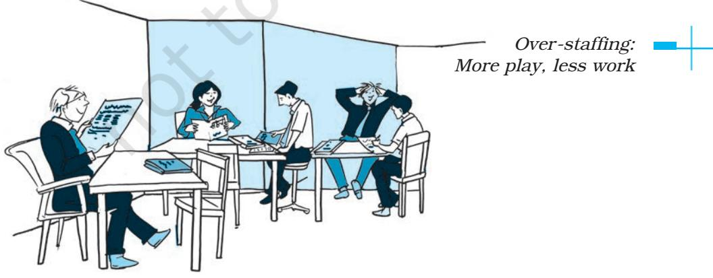

# **STAFFING**

### **Management of Human Resources at INFOSYS**

"Our assets walk out of the door each evening. We have to make sure that they come back the next morning" (as stated by Narayana Murthy former, CEO of INFOSYS.)

At a time when organisations are debating the strategic importance of their human resources, Infosys, a consulting and software services organisation, includes its human resources on its balance sheet to affirm their asset value. The rationale for this is as follows: "The long term success of a company is usually examined on certain financial and non-financial parameters. Human resources are among these new nonfinancial parameters that challenge the usefulness of evaluating corporate success solely on traditional measures. Human resources represent the collective expertise, innovation, leadership, entrepreneurial and managerial skills endowed in the employees of an organisation."

As a knowledge intensive company, Infosys recognises the value of its human assets in maintaining its competitive position. It realises that these assets can easily walk away, as competitors in India and abroad covet its IT talent. Consequently, the challenge facing Infosys is how to attract, retain and develop its human assets in a highly competitive and dynamic environment?

Most of the current human resource practices at Infosys result from the vision of the leaders and the culture that they have created. Narayana Murthy, known for his leadership and vision is the public image of Infosys. His leadership style is humble and straight-forward, quite uncommon in the world of Indian business. He believes in sharing wealth with his employees and in leading by example. In a knowledge-based business like Infosys, he sees the importance of consistency in rhetoric and action in empowering employees. He is credited with creating a culture of closeness and empowerment at Infosys. His management style, rare among Indian business leaders, is based on western management.

> *Source: Sumita Raghuram, Fordham Graduate School of Business*

# L E A R N I N G OBJECTIVES

After studying this chapter, you should be able to:

- n define staffing;
- n establish its relationship with Human Resource Management;
- n state the need and importance of staffing;
- n describe the steps in the staffing process;
- n state the meaning of recruitment and selection;
- n identify important sources of recruitment;
- n describe the steps in the selection process;
- n appreciate the need of training and development; and
- n explain various on the job and off the job methods of training.

Ch_06.indd 139 08-08-2022 10:06:10

# **Introduction**

The foundation of any organisation is the talented and hardworking people, who are the principal assets of any firm. It is an established fact that the growth of an organisation requires the continual infusion of quality staff. Thus, adequate staffing or the provision for appropriate human resources is an essential requirement for any organisation's success. It is, therefore, believed that an organisation can achieve its objectives only when it has the right persons in the right positions.

# **Meaning**

After planning and selection of the organisation structure, the next step in the management process is to fill the various posts provided in the organisation. This is termed as the management of staffing function. In the simplest terms, staffing is 'putting people to jobs'. It begins with workforce planning and includes different other function like recruitment, selection, training, development, promotion, compensation and performance appraisal of work force. In other words, staffing is that part of the process of management which is concerned with obtaining, utilising and maintaining a satisfactory and satisfied work force. Today, staffing may involve any combination of employees including daily wagers, consultants and contract employees. Staffing recognises the importance

of every single person employed by an organisation as it is the individual worker, who is the ultimate performer.

Staffing has been described as the managerial function of filling and keeping filled the positions in the organisation structure. This is achieved by, first of all, identifying requirement of work force, followed by recruitment, selection, placement, promotion, appraisal and development of personnel, to fill the roles designed into the organisation structure.

In a new enterprise, the staffing function follows the planning and organising functions. After deciding what is to be done, how it is to be done and after creation of the organisation structure, the management is in a position to know the human resource requirements of the enterprise at different levels. Once the number and types of personnel to be selected is determined, management starts with the activities relating to recruiting, selecting and training people, to fulfill the requirements of the enterprise. In an existing enterprise, staffing is a continuous process because new jobs may be created and some of the existing employees may leave the organisation.

# **Importance of Staffing**

In any organisation, there is a need for people to perform work. The staffing function of management

Ch_06.indd 140 08-08-2022 10:06:10

fulfills this requirement and finds the right people for the right job. Basically, staffing fills the positions as shown in the organisation structure.

Human resources are the foundation of any business. The right people can help you take your business to the top; the wrong people can break your business. Hence, staffing is the most fundamental and critical drive of organisational performance. The staffing function has assumed greater importance these days because of rapid advancement of technology, increasing size of organisation and complicated behaviour of human beings. Human resources are the most important asset of an organisation. The ability of an organisation to achieve its goal depends upon the quality of its human resources. Therefore, staffing is a very important managerial function. No organisation can be successful unless it can fill and keep filled the various positions provided for in the structure with the right kind of people.

Proper staffing ensures the following benefits to the organisation:

- (i) helps in discovering and obtaining competent personnel for various jobs;
- (ii) makes for higher performance, by putting right person on the right job;
- (iii) ensures the continuous survival and growth of the enterprise through the succession planning for managers;
- (iv) helps to ensure optimum utilisation of the human resources. By avoiding overmanning, it prevents under -utilisation of personnel and high labour costs. At the same time it avoids disruption of work by indicating in advance the shortages of personnel; and
- (v) improves job satisfaction and morale of employees through objective assessment and fair reward for their contribution.

Staffing function must be performed efficiently by all organisations. If right kind of employees are not available, it will lead to wastage of materials, time, effort and energy, resulting in lower productivity and poor quality of products. The enterprise will not be able to sell its products profitably. It is, therefore, essential that right kind of people must be available in right number at the right time. They should be given adequate training so that wastage is minimum. They must also be induced to show higher productivity and quality by offering them proper incentives.

# *Staffing as part of Human Resource Management*

It is a function which all managers need to perform. It is a separate and specialised function and there are many aspects of human relations to be considered. It is the job of managers to fill positions in their organisation and to make sure that

Ch_06.indd 141 08-08-2022 10:06:10

they remain occupied with qualified people. Staffing is closely linked to organising since after the structure and positions have been decided, people are required to work in these positions. Subsequently, they need to be trained and motivated to work in harmony with the goals of the organisation. Thus, staffing is seen as a generic function of management.

The staffing function deals with the human element of management. Managing the human component of an organisation is the most important task because the performance of an organisation depends upon how well this function is performed. The success of an organisation in achieving its goals is determined to a great extent on the competence, motivation and performance of its human resource.

It is the responsibility of all managers to directly deal with and select people to work for the organisation. When the manager performs the staffing function his role is slightly limited. Some of these responsibilities will include placing the right person on the right job, introducing new employees to the organisation, training employees and improving their performance, developing their abilities, maintaining their morale and protecting their health and physical conditions. In small organisations, managers may perform all duties related to employees salaries, welfare and working conditions.

But as organisations grow and number of persons employed increases, a separate department called the human resource department is formed which has specialists in managing people. The management of human resource is a specialised area which requires the expertise of many people. The number of human resource specialists and size of this department gives an indication of the size of the business as well. For a very large company, the Human Resources Department itself will contain specialists for each function of this department.

Human Resource Management includes many specialised activities and duties which the human resource personnel must perform. These duties are:

- n Recruitment, i.e., search for qualified people
- n Analysing jobs, collecting information about jobs to prepare job descriptions.
- n Developing compensation and incentive plans.
- n Training and development of employees for efficient performance and career growth.
- n Maintaining labour relations and union management relations.
- n Handling grievances and complaints.
- n Providing for social security and welfare of employees.
- n Defending the company in law suits and avoiding legal complications.

Ch_06.indd 142 08-08-2022 10:06:10

# **Evolution of Human Resource Management**

Human resource management has replaced the traditional concept of labour welfare and personnel management. Human Resource Management (HRM) in its present form has evolved from a number of significant inter-related developments, which date back to the era of industrial revolution. Emergence of trade union movement led to the need of a person who could act as an effective link between the owners and workers. Thus, the concept of labour welfare officer came into being. His role was limited to the bare minimum welfare activities of employees. In fact, he was looked down by both the workers and the owners.

With the introduction of factory system, thousands of persons began to be employed under one roof. The job of hiring people for the organisation was given to one man, who later on was assigned the responsibility of recruitment, selection and placement of personnel. This led to the emergence of personnel officer in the first place and personnel manager, later on.

Human relations approach recognises human factor as the most important instrument of success in an organisation. Fast changing technological developments, however, necessitated new skill development and training of employees. People came to be recognised as a valuable resource, which can be further developed. Increase in scope of the work led to replacement of personnel manager with human resource manager.

You may have observed that all these aspects are concerned with the human element in industry as distinct from the mechanical side of the enterprise. Thus, staffing is an inherent part of human resource management as it is the practice of finding, evaluating and establishing a working relationship with people, for a purpose.

It is important to understand that staffing is both a function of management just like planning, organising, directing, and controlling as well as a distinct functional area of management just as marketing management and financial management. Staffing, is therefore, referred to as both a line as well as a staff activity i.e., an essential function of the manager as well as an advisory role played by the Human Resource Department.

# **Staffing Process**

As you are now aware, the prime concern of the staffing function in the management process is the timely fulfillment of the manpower requirements within an organisation. These requirements may arise in case of starting a new

Ch_06.indd 143 08-08-2022 10:06:10

business or expanding the existing one or they may arise as a matter of the need for replacing those who quit, retire or are transferred or promoted from or are fired from the job. In any case, need for 'the right person for the right job' hardly needs an over emphasis. But just as the phrase 'water water everywhere and not a drop to drink' amplifies the fact that despite 2/3rd of the earth being water, drinkable water is a scarce commodity, so may also be said of finding 'the right person for the right job.' As such, it is important to appreciate staffing as a process that starts from understanding the manpower requirements within the organisation and identifying the potential sources from where it can be met, either from within the organisation or from outside. And, given that 'the right person' is scarce, there is need to 'market' the job and the organisation to the people. Even in situations where a single job vacancy might attract a few hundreds of the applicants, there is a challenge of selecting the most appropriate one. Freshly appointed persons might need orientation or training to familiarise them with the way the things are done in an organisation. And, in case they have been selected only on the basis of academic qualifications and aptitude for learning, they might need training in specific skills as well. For example, if one is selected by a Business Process Outsourcing (BPO) unit by virtue of being extrovert and well-versed in English speaking, one needs to be trained in the relevant business processes, telephone conversation etiquettes as well as diction adaptation before actual placement. The employee's experiences during orientation and placement form his/her 'first impression' of the organisation. Even whilst on the job, the employees need training for upgradation of knowledge and skills and for preparing for higher responsibilities. So staff training and development is another important aspect of the staffing process.

What follows is a brief description of the above stages.

- (i) **Estimating the Manpower Requirements:** You are aware that while designing the organisational structure, we undertake an analysis of the decisions and the decision-making levels, activities as well as relationship among them with a view to evolving the horizontal and vertical dimensions of the structure. Thus, various job positions are created. Clearly, performance of each job necessitates the appointment of a person with a specific set of educational qualifications, skills, prior experience and so on.
Ch_06.indd 144 08-08-2022 10:06:10

Thus, understanding manpower requirements is not merely a matter of knowing how many persons we need but also of what type. Given that we need to encourage women, persons from backward communities and persons with special abilities (such as physically challenged, visually and hearing impaired) to assume responsible positions in our organisations, there is a need to understand, and if the need be, to redefine manpower requirements accordingly. Can you think why should we encourage such a diversity in the workforce?

Operationally, understanding the manpower requirements would necessitate workload analysis on the one hand and workforce analysis on the other. Workload analysis would enable an assessment of the number and types of human resources necessary for the performance of various jobs and accomplishment of organisational objectives. Workforce analysis would reveal the number and type available. In fact such an exercise would reveal whether we are understaffed, overstaffed or optimally staffed. It may be pointed out that neither over-staffing nor under-staffing is a desirable situation. Can you think why? In fact this exercise would form the basis of the subsequent staffing actions. A situation of overstaffing somewhere would necessitate employee removal or transfer elsewhere. A situation of understaffing would necessitate the starting of the recruitment process. However, before that can be done, it is important to translate the manpower requirements into specific job description and the desirable profile of its occupant — the desired qualifications, experience, personality characteristics and so on. This information becomes the base for looking for potential employees.

- (ii) **Recruitment:** Recruitment may be defined as the process of searching for prospective employees and stimulating them to apply for jobs in the organisation. The information generated in the process of writing the job description and the candidate profile may be used for developing the 'situations vacant' advertisement. The advertisement may be displayed on the factory/ office gate or else it may be got published in print media or flashed in electronic media. This step involves locating the potential candidate or determining the sources of potential candidates. In fact, there are a large number of recruitment avenues available to a firm which would be discussed latter when we talk about the various sources of recruitment. The essential objective is to create a pool of the prospective
Ch_06.indd 145 08-08-2022 10:06:10

job candidates. Both internal and external sources of recruitment may be explored. Internal sources may be used to a limited extent. For fresh talent and wider choice external sources are used.

- (iii) **Selection:** Selection is the process of choosing from among the pool of the prospective job candidates developed at the stage of recruitment. Even in case of highly specialised jobs where the choice space is very narrow, the rigour of the selection process serves two important purposes: (i) it ensures that the organisation gets the best among the available, and (ii) it enhances the self-esteem and prestige of those selected and conveys to them the seriousness with which the things are done in the organisation. The rigour involves a host of tests and interviews, described later. Those who are able to successfully negotiate the
test and the interviews are offered an employment contract, a written document containing the offer of employment, the terms and conditions and the date of joining.

- (iv) **Placement and Orientation:**  Joining a job marks the beginning of socialisation of the employee at the workplace. The employee is given a brief presentation about the company and is introduced to his superiors, subordinates and the colleagues. He is taken around the workplace and given the charge of the job for which he has been selected. This process of familiarisation is very crucial and may have a lasting impact on his decision to stay and on his job performance. Orientation is, thus, introducing the selected employee to other employees and familiarising him with the rules and policies of the organisation. Placement refers to the employee

Ch_06.indd 146 08-08-2022 10:06:12

occupying the position or post for which the person has been selected.

- (v) **Training and Development:**  What people seek is not simply a job but a career. Every one must have the opportunity to rise to the top. The best way to provide such an opportunity is to facilitate employee learning. Organisations have either inhouse training centers or have forged alliances with training and educational institutes to ensure continuing learning of their employees. The organisations too benefit in turn. If employee motivation is high, their competencies are strengthened, they perform better and thus, contribute more to organisational effectiveness and efficiency. By offering the opportunities for career advancement to their members, organisations are not only able to attract but also retain its talented people.
As discussed earlier, in most organisations there is a separate Human Resource Department, which takes care of the staffing function. But in small organisations the line manager is required to perform all the functions of management viz, planning, organising, staffing, directing and controlling. The process of staffing will then include three more stages.

## (vi) **Performance Appraisal**

 After the employees have undergone a period of training and they have been on the job for some time, there is a need to evaluate their performance. All organisations have some formal or informal means of appraising their employee's performance. Performance appraisal means evaluating an employee's current and/or past performance as against certain predetermined standards. The employee is expected to know what the standards are and the superior is to provide the employee feedback on his/her performance. The performance appraisal process, therefore, will include defining the job, appraising performance and providing feedback.

- (vii) **Promotion and career planning** It becomes necessary for all organisations to address career related issues and promotional avenues for their employees. Managers need to design activities to serve employees' long-term interests also. They must encourage employees to grow and realise their full potential. Promotions are an integral part of people's career. They refer to being placed in positions of increased responsibility. They usually
Ch_06.indd 147 08-08-2022 10:06:12

mean more pay, responsibility and job satisfaction.

### (viii) **Compensation**

 All organisations need to establish wage and salary plans for their employees. There are various ways to prepare different pay plans depending on the worth of the job. Basically the price of the job needs to be determined. Compensation, therefore, refers to all forms of pay or rewards going to employees. It may be in the form of direct financial payments like wages, salaries, incentives, commissions and bonuses and indirect payments like employer paid insurance and vacations.

Direct financial payments are of two types : time based or performance based. A time based plan means salary and wages are paid either daily, weekly or monthly or annually. Performance based plans means salary/wages are paid according to piecework. For example, a worker may be paid according to the number of units produced by him/her. There are many methods to calculate the compensation under various incentive plans to reward performance. Certain pay plans can be created which are a combination of time based pay plus incentives for higher performance. Various plans may be formulated for paying employees time based wage or salary as well as performance based financial incentives and bonuses, and employee benefits.

Besides there are some other factors also which influence the design of any pay plan, like legal (labour laws), union, company policy and equity.

Thus, we see that as a process, staffing includes acquisition, retention, development, performance appraisal, promotion and compensation of the most important resource of an organisation, that is, its human capital.

It needs to be kept in mind that several factors such as supply and demand of specific skills in the labour market, unemployment rate, labour market conditions, legal and political considerations, company's image, policy, human resource planning cost, technological developments and general economic environment etc., will influence the way recruitment, selection and training will be actually carried out.

# **Aspects of staffing**

There are three aspects of staffing: recruitment, selection and training. These are now discussed in detail.

# **Recruitment**

Recruitment refers to the process of finding possible candidates for a job or a function. It has been defined as

Ch_06.indd 148 08-08-2022 10:06:12

'the process of searching for prospective employees and stimulating them to apply for jobs in an organisation.'

Advertising is commonly part of the recruitment process, and can occur through several means, through newspapers, using newspaper dedicated to job advertisement, through professional publication, using advertisements placed in windows, through a job center, through campus interviews, etc.

## **Sources of Recruitment**

The object of recruitment is to attract potential employees with the necessary characteristics or qualification, in the adequate number for the jobs available. It locates available people for the job and invites them to apply for the job in the organisation. The process of recruitment precedes the process of selection of a right candidate for the given positions in the organisation. Recruitment seeks to attract suitable applicants to apply for available jobs. The various activities involved with the process of recruitment includes (a) identification of the different sources of labour supply, (b) assessment of their validity, (c) choosing the most suitable source or sources,

and (d) inviting applications from the prospective candidates, for the vacancies.

The requisite positions may be filled up from within the organisation or from outside. Thus, there are two sources of recruitment – Internal and External.

## **Internal Sources**

There are two important sources of internal recruitment, namely, transfers and promotions, which are discussed below:

- (i) **Transfers:** It involves shifting of an employee from one job to another, one department to another or from one shift to another, without a substantive change in the responsibilities and status of the employee. It may lead to changes in duties
Ch_06.indd 149 08-08-2022 10:06:13

and responsibilities, working condition etc., but not necessarily salary. Transfer is a good source of filling the vacancies with employees from over-staffed departments. It is practically a horizontal movement of employees. Shortage of suitable personnel in one branch may be filled through transfer from other branch or department. Job transfers are also helpful in avoiding termination and in removing individual problems and grievances. At the time of transfer, it should be ensured that the employee to be transferred to another job is capable of performing it. Transfers can also be used for training of employees for learning different jobs.

- (ii) **Promotions:** Business enterprises generally follow the practice of filling higher jobs by promoting employees from lower jobs. Promotion leads to shifting an employee to a higher position, carrying higher responsibilities, facilities, status and pay. Promotion is a vertical shifting of employees. This practice helps to improve the motivation, loyalty and satisfaction level of employees. It has a great psychological impact over the employees because a promotion at the higher level may lead to a chain of promotions at lower levels in the organisation.
# **Merits of Internal Sources**

Filling vacancies in higher jobs from within the organisation or through internal transfers has the following merits:

- (i) Employees are motivated to improve their performance. A promotion at a higher level may lead to a chain of promotion at lower levels in the organisation. This motivates the employees to improve their performance through learning and practice. Employees work with commitment and loyalty and remain satisfied with their jobs. Also peace prevails in the enterprise because of promotional avenues;
- (ii) Internal recruitment also simplifies the process of selection and placement. The candidates that are already working in the enterprise can be evaluated more accurately and economically. This is a more reliable way of recruitment since the candidates are already known to the organisation;
- (iii) Transfer is a tool of training the employees to prepare them for higher jobs. Also people recruited from within the organisation do not need induction training;
- (iv) Transfer has the benefit of shifting workforce from the surplus departments to those where there is shortage of staff;

Ch_06.indd 150 08-08-2022 10:06:13

- (v) Filling of jobs internally is cheaper as compared to getting candidates from external sources.
# **Limitations of Internal Sources**

The limitations of using internal sources of recruitment are as follows:

- (i) When vacancies are filled through internal promotions, the scope for induction of fresh talent is reduced. Hence, complete reliance on internal recruitment involves danger of 'inbreeding' by stopping 'infusion of new blood' into the organisation;
- (ii) The employees may become lethargic if they are sure of timebound promotions;
- (iii) A new enterprise cannot use internal sources of recruitment. No organisation can fill all its vacancies from internal sources;
- (iv) The spirit of competition among the employees may be hampered; and
- (v) Frequent transfers of employees may often reduce the productivity of the organisation.

## **External Sources**

An enterprise has to tap external sources for various positions because all the vacancies cannot be filled through internal recruitment. The existing staff may be insufficient or they may not fulfill the eligibility criteria of the jobs to be filled. External recruitment provides wide choice and brings new blood in the organisation. The commonly used external sources of recruitment are discussed below:

- (i) **Direct Recruitment:** Under the direct recruitment, a notice is placed on the notice-board of the enterprise specifying the details of the jobs available. Jobseekers assemble outside the premises of the organisation on the specified date and selection is done on the spot. The practice of direct recruitment is followed usually for casual vacancies of unskilled or semi-skilled jobs. Such workers are known as casual or '*badli*' workers and they are paid remuneration on daily wage basis. This method of recruitment is very inexpensive as it does not involve any cost of advertising the vacancies. It is suitable for filling casual vacancies when there is a rush of work or when some permanent workers are absent.
- (ii) **Casual Callers:** Many reputed business organisations keep a database of unsolicited applicants in their offices. Such job-seekers can be a valuable source of manpower. A list of such job-seekers can be prepared and can be screened to fill the vacancies as they arise. The major merit of this source

Ch_06.indd 151 08-08-2022 10:06:13

of recruitment is that it reduces the cost of recruiting workforce in comparison to other sources.

- (iii) **Advertisement:** Advertisement in newspapers or trade and professional journals is generally used when a wider choice is required. Most of the senior positions of industry as well as commerce are filled by this method. The advantage of advertising vacancies is that more information about the organisation and job can be given in the advertisement. Advertisement gives the management a wider range of candidates from which to choose. Advertisements may be placed in leading newspapers. Its disadvantage is that it may bring in a flood of response, and many times, from quite unsuitable candidates.
- (iv) **Employment Exchange:** Employment exchanges run by the Government are regarded as a good source of recruitment for unskilled and skilled operative jobs. In some cases, compulsory notification of vacancies to employment exchange is required by law. Thus, employment exchanges help to match personnel demand and supply by serving as link between job-seekers and employers. Unfortunately, the records of employment exchange are often

not up to date and many of the candidates referred by them may not be found suitable.

- (v) **Placement Agencies and Management Consultants:** In technical and professional areas, private agencies and professional bodies appear to be doing substantive work. Placement agencies provide a nationwide service in matching personnel demand and supply. These agencies compile bio-data of a large number of candidates and recommend suitable names to their clients. Such agencies charge fee for their services and they are useful where extensive screening is required. These professional recruiters can entice the needed top executives from other companies by making the right offers.
 Management consultancy firms help the organisations to recruit technical, professional and managerial personnel. They specialise in middle level and top level executive placements. They maintain data bank of persons with different qualifications and skills and even advertise the jobs on behalf of their clients to recruit right type of personnel.

- (vi) **Campus Recruitment:** Colleges and institutes of management and technology have become a
Ch_06.indd 152 08-08-2022 10:06:13

popular source of recruitment for technical, professional and managerial jobs. Many big organisations maintain a close liaison with the universities, vocational schools and management institutes to recruit qualified personnel for various jobs. Recruitment from educational institutions is a well-established practice of businesses. This is referred to as campus recruitment.

- (vii) **Recommendations of Employees:** Applicants introduced by present employees, or their friends and relatives may prove to be a good source of recruitment. Such applicants are likely to be good employees because their background is sufficiently known. A type of preliminary screening takes place because the present employees know both the company and the candidates and they would try to satisfy both.
- (viii) **Labour Contractors:** Labour contractors maintain close contacts with labourers and they can provide the required number of unskilled workers at short notice. Workers are recruited through labour contractors who are themselves employees of the organisation. The disadvantages of this system are that if the contractor himself decides to leave the organisation, all

the workers employed through him will follow suit.

- (ix) **Advertising on Television:** The practice of telecasting of vacant posts over Television is gaining importance these days. The detailed requirements of the job and the qualities required to do it are publicised alongwith the profile of the organisation where vacancy exists.
- (x) **Web Publishing:** Internet is becoming a common source of recruitment these days. There are certain websites specifically designed and dedicated for the purpose of providing information about both job seekers and job opening. In fact, websites are very commonly visited both by the prospective employees and the organisations searching for suitable people.

Ch_06.indd 153 08-08-2022 10:06:13

# **Merits of External Sources**

The advantages of using external sources of recruitment are as follows:

- (i) *Qualified Personnel:* By using external sources of recruitment, the management can attract qualified and trained people to apply for vacant jobs in the organisation.
- (ii) *Wider Choice:* When vacancies are advertised widely, a large number of applicants from outside the organisation apply. The management has a wider choice while selecting the people for employment.
- (iii) *Fresh Talent:* The present employees may be insufficient or they may not fulfill the specifications of the jobs to be filled. External recruitment provide wider choice and brings new blood in the organisation. However, it is expensive and timeconsuming.
- (iv) *Competitive Spirit:* If a company taps external sources, the extisting staff will have to compete with the outsiders. They will work harder to show better performance.

## **Limitations of External Sources**

- 1. *Dissatisfaction among existing staff:* External recruitment may lead to dissatisfaction and frustration among existing employees. They may feel that their chances of promotion are reduced.
- 2. *Lengthy process:* Recruitment from external sources takes a long time. The business has to notify the vacancies and wait for applications to initiate the selection process.
- 3. *Costly process:* It is very costly to recruit staff from external sources. A lot of money has to be spent on advertisement and processing of applications.

# **Selection**

Selection is the process of identifying and choosing the best person out of a number of prospective candidates for a job. Towards this purpose, the candidates are required to take a series of employment tests and interviews. At every stage many are eliminated and a few move on to the next stage until the right type is found. The process may start right from the screening of the applications. It may continue even after the offer of employment, acceptance and joining of the candidate. It is so because the process of selection, like any other managerial decision, involves judgment about the performance potential of the candidate. The effectiveness of the selection process would ultimately be tested in terms of on-the-job of the chosen person.

## **Process of Selection**

The important steps in the process of selection are as follows:

- (i) **Preliminary Screening:** Preliminary screening helps the
Ch_06.indd 154 08-08-2022 10:06:13

### **...Hiring via employee referrals on the rise**

When Lenovo India decided to strengthen its diversity numbers, it decided to tap into its referral system. The company asked its employees to recommend candidates, and decided to reward those who successfully recommended more women for the same roles. As employee referrals become an established method to hire quality lateral talent, companies are using technology platforms to build a steady talent pipeline through referrals. A majority of companies (nearly 41%, according to one study) across India use top technology for referral hires. According to the study India Recruiting Trends 2016 conducted by LinkedIn Talent Solutions, employee referrals are on the rise. This year, referrals were the top source of quality hires. "Nearly 55% of talent leaders see employee referral programmes as the top source of quality hire," says Irfan Abdulla, director, talent solutions, LinkedIn India. Top players such as Coca-Cola, Infosys, Genpact, Capgemini, Deloitte, Dabur, Jubilant and more are reporting that over 40% of their hires come through referrals.

Today, technology major Infosys, for instance, has enhanced the use of technology for the employee referral process. It has created a portal where employees can view requirements and submit profiles of candidates directly. Employees can then track the status of their referral real-time. Richard Lobo, senior vice president and head HR, Infosys, says a majority of their hiring now takes place through the referral route. "Employees can make a good referral decision as they understand the aspirations of the candidate they refer as well as the requirements and culture of the company," he said.

*Source: https://economictimes.indiatimes.com ›, August 19, 2016*

manager eliminate unqualified or unfit job seekers based on the information supplied in the application forms. Preliminary interviews help reject misfits for reasons, which did not appear in the application forms.

- (ii) **Selection Tests:** An employment test is a mechanism (either a paper and pencil test or an exercise) that attempts to measure certain characteristics of individuals. These characteristics range from aptitudes, such as manual dexterity, to intelligence to personality.
## **Important Tests Used for Selection of Employees:**

- (a) *Intelligence Tests:* This is one of the important psychological tests used to measure the level of intelligence quotient of an individual. It is an indicator of a person's learning ability or the ability to make decisions and judgments.
- (b) *Aptitude Test:* It is a measure of individuals potential for learning new skills. It indicates the person's capacity to develop.

Ch_06.indd 155 08-08-2022 10:06:13

## **Intense Competition, Talent Crunch Push Companies to Hand Out 15-20% Pay Hikes**

Indian employees have never had it so good. Intense competition and rising attrition levels are forcing companies to hand out 15-20% mid-term salary hikes.

Reliance Industries, Marico and Dabur have offered mid-term increments and out-of-turn hikes of 15-20% to top performers in recent months. This is over and above the 15-20% salary hikes handed out during annual appraisals last year. This comes at a time when India Inc. is desperately trying to hold back talent, especially in telecom, IT, BPO and retail.

A massive recruitment spree in sunrise sectors like BPO, telecom and retail has led to a demand-supply mismatch and mid-term hikes going up to 40%. Average attrition rates in IT have moved up to 22% from 18% and those in BPOs to 50% from 46%. In the manufacturing sector, talent exodus is averaging 8-12%.

Several corporates are even offering bonuses and increments on a quarterly basis to top teams. An HR head said, "Although it is a short-term reaction, we have to react proactively to the market scenario and retain our performers. If one loses an employee, the average time taken for a new person to pick up the skills is up to six months, which is critical time lost for a company. Also, replacement costs like hiring consultants would in any case add up to a huge expense and a lot of pressure on HR," said Dabur India HR chief.

Company are identifying people who may be tempted to leave and are devising ways of retaining such talent – offering learning and development facilities for freshers, sending them abroad on one-year bonds (for six-months postings), etc.

*Source: The Economic Times, 1st Dec. 06*

Such tests are good indices of a person's future success score.

- (c) *Personality Tests:* Personality tests provide clues to a person's emotions, her reactions, maturity and value system etc. These tests probe the overall personality. Hence, these are difficult to design and implement.
- (d) *Trade Test:* These tests measure the existing skills of the individual. They measure the

level of knowledge and proficiency in the area of professions or technical training. The difference between aptitude test and trade test is that the former measures the potential to acquire skills and the later the actual skills possessed.

- (e) *Interest Tests:* Every individual has fascination for some job than the other. Interest tests are used to know the pattern of interests or involvement of a person.
Ch_06.indd 156 08-08-2022 10:06:13

- (iii) **Employment Interview:**  Interview is a formal, in-depth conversation conducted to evaluate the applicant's suitability for the job. The role of the interviewer is to seek information and that of the interviewee is to provide the same. Though, in present times, the interviewee also seeks information from interviewer.
- (iv) **Reference and Background Checks:** Many employers request names, addresses, and telephone numbers of references for the purpose of verifying information and, gaining additional information on an applicant. Previous employers, known persons, teachers and university professors can act as references.
- (v) **Selection Decision:** The final decision has to be made from among the candidates who pass the tests, interviews and reference checks. The views of the concerned manager will

be generally considered in the final selection because it is he/she who is responsible for the performance of the new employee.

- (vi) **Medical Examination:** After the selection decision and before the job offer is made, the candidate is required to undergo a medical fitness test. The job offer is given to the candidate being declared fit after the medical examination.
- (vii) **Job Offer:** The next step in the selection process is job offer to those applicants who have passed all the previous hurdles. Job offer is made through a letter of appointment/confirm his acceptance. Such a letter generally contains a date by which the appointee must report on duty. The appointee must be given reasonable time for reporting.
- (viii)**Contract of Employment:** After the job offer has been made and candidate accepts the offer, certain documents need to be

## **Right/ Wrong Selection Decisions Matter a lot to the Organisations!**

Consider, for a moment that any selection decision can result in 4 possible outcomes. A decision is correct when an applicant was predicted to be successful and proved to be successful on the job, or when the applicant was predicted to be unsuccessful and would perform accordingly if hired. In the first case, we have successfully accepted; in the second case we have successfully rejected. Problems arise when errors are made in rejecting candidates who would have performed successfully on the job (reject errors) or accepting those who ultimately perform poorly (accept errors). Don't you think, these problems can be significant and can result in costly mistakes?

Ch_06.indd 157 08-08-2022 10:06:13

Ch_06.indd 158 08-08-2022 10:06:13

executed by the employer and the candidate. One such document is the attestation form. This form contains certain vital details about the candidate, which are authenticated and attested by him or her. Attestation form will be a valid record for future reference. There is also a need for preparing a contract of employment. Basic information that should be included in a written contract of employment will vary according to the level of the job, but the following checklists sets out the typical headings: Job Title, Duties, Responsibilities, Date when continuous employment starts and the basis for calculating service, rates of pay, allowances, hours of work, leave rules, sickness, grievance procedure, disciplinary procedure, work rules, termination of employment.

# **Training and Development**

Someone has rightly said:

"If you wish to plan for a year, sow seeds,

If you wish to plan for 10 years, plant trees,

If you wish to plan for a lifetime, develop people."

Training and Development is an attempt to improve the current or future employee performance by increasing an employee's ability to perform through learning, usually by changing the employee's attitude or increasing his or her skills and knowledge.

# **Importance of Training and Development**

When jobs were simple, easy to learn and influenced to only a small degree by technological changes, there was little need for employees to upgrade or alter their skills. But the rapid changes taking place during the last quarter century in our highly sophisticated and complex society have created increased pressures for organisations to readapt the products and services produced, the manner in which products and services are produced and offered, the types of jobs required and the types of skills necessary to complete these jobs. Thus, as jobs have become more complex the importance of employee training has increased.

Training and development help both the organisation and the individual.

# **Benefits to the organisation**

The benefits of training and development to an organisation are as follows:

- (i) Training is a systematic learning, always better than hit and trial methods which lead to wastage of efforts and money.
- (ii) It enhances employee productivity both in terms of quantity and quality, leading to higher profits.

Ch_06.indd 159 08-08-2022 10:06:14

- (iii) Training equips the future manager who can take over in case of emergency.
- (iv) Training increases employee morale and reduces absenteeism and employee turnover.
- (v) It helps in obtaining effective response to fast changing environment – technological and economic.

# **Benef its to the Employee**

The benefits of training and development activity to the employees are as follows:

- (i) Improved skills and knowledge due to training lead to better career of the individual.
- (ii) Increased performance by the individual help him to earn more.
- (iii) Training makes the employee more efficient to handle machines. Thus, less prone to accidents.
- (iv) Training increases the satisfaction and morale of employees.

# **Training, Development and Education**

The term training is used to indicate the process by which attitudes, skills and abilities of employees to perform specific jobs are increased. But the term development means growth of individual in all respects. Training is short term process but development is an on going process. Also, development includes training.

It also needs to be understood that training, education and development are distinct terms although they overlap to some extent.

**Training** is any process by which the aptitudes, skills and abilities of employees to perform specific jobs are increased. It is a process of learning new skills and application of knowledge. It attempts to improve their performance on the current job or prepare them for any intended job.

**Education** is the process of increasing the knowledge and understanding of employees. It is the understanding and interpretation of knowledge. It does not provide definite answers, but rather develops a logical and rational mind that can determine relationships among pertinent variables and thereby understand a phenomenon. Education imparts qualities of mind and character and understanding of the basic principles and develop the capacities of analysis, synthesis and objectivity. Education is broader in scope than training. Training is tied to the goals of organisations more than to the goals of the individual.

**Development** refers to the learning opportunities designed to help employees grow. It covers not only those activities which improve job performance but also those which bring about growth of the personality, help individuals in the progress towards maturity and actualisation of their potential

Ch_06.indd 160 08-08-2022 10:06:14

| Training | Development |
| --- | --- |
| It is a process of increasing knowledge | It is a process of learning and growth. |
| and skills. |  |
| It is to enable the employee to do the job | It is to enable the overall growth of the |
| better. | employee. |
| It is a job oriented process. | It is a career oriented process. |

## **Difference between Training and Development**

capacities so that they become not only good employees but better men and women.

The field of training and development concerned with improving deals with the design and delivery of learning to improve performance within organisations. In some organisations the term Learning and Development is used instead of Training and Development in order to emphasise the importance of learning for the individual and the organisation. In other organisations, the term Human Resource Development is used.

# **Training Methods**

There are various methods of training. These are broadly categorised into two groups: On-the-Job and Off-the-Job methods. On-the-Job methods refer to the methods that are applied to the workplace, while the employee is actually working. Off-the-Job methods are used away from the work place. The former means learning while doing, while the latter means learning before doing.

# **On the Job Methods**

- (i) **Apprenticeship Programmes:** Apprenticeship programmes put the trainee under the guidance of a master worker. These are designed to acquire a higher level of skill. People seeking to enter skilled jobs, to become, for example, plumbers, electricians or iron-workers, are often required to undergo apprenticeship training. These apprentices are trainees who spend a prescribed amount of time working with an experienced guide, or trainer. A uniform period of training is offered to trainees, in which both fast and slow learn here, are placed together. Slow learners may require additional training.
- (ii) **Coaching:** In this method, the superior guides and instructs the trainee as a coach. The coach or counselor sets mutually agreed upon goals, suggests how to achieve these goals, periodically reviews the trainees progress

Ch_06.indd 161 08-08-2022 10:06:14

and suggests changes required in behavior and performance. The trainee works directly with a senior manager and the manager takes full responsibility for the trainee's coaching. Classically the trainee is being groomed to replace the senior manager and relieve him from some of his duties. This gives a chance for the trainee to learn the job also.

- (iii) **Internship Training:** It is a joint programme of training in which educational institutions and business firms cooperate. Selected candidates carry on regular studies for the prescribed period. They also work in some factory or office to acquire practical knowledge and skills.
- (iv) **Job Rotation:** This kind of training involves shifting the trainee from one department to another or from one job to another. This enables the trainee to gain a broader understanding of all parts of the business and how the organisation as a whole functions. The trainee gets fully involved in the departments operations and also gets a chance to test her own aptitude and ability. Job rotation allows trainees to interact with other employees facilitating future cooperation among departments.

When employees are trained by this method, the organisation finds it easier at the time of promotions, replacements or transfers.

# **Off the Job Methods**

- (i) **Class Room Lectures/Conferences:** The lecture or conference approach is well adapted to conveying specific informationrules, procedures or methods. The use of audio-visuals or demonstrations can often make a formal classroom presentation more interesting while increasing retention and offering a vehicle for clarifying more difficult points.
- (ii) **Films:** They can provide information and explicitly demonstrate skills that are not easily represented by the other techniques. Used in conjunction with conference discussions, it is a very effective method in certain cases.
- (iii) **Case Study:** Taken from actual experiences of organisations, cases represent attempts to describe, as accurately as possible real problems that managers have faced. Trainees study the cases to determine problems, analyse causes, develop alternative solutions, select what they believe to be the best solution, and implement it.

Ch_06.indd 162 08-08-2022 10:06:14

- (iv) **Computer Modelling:** It simulates the work environment by programming a computer to imitate some of the realities of the job and allows learning to take place without the risk or high costs that would be incurred if a mistake were made in real life situation.
- (v) **Vestibule Training:** Employees learn their jobs on the equipment they will be using, but the training is conducted away from the actual work floor. Actual work environments are created in a class room and employees use the same materials, files and

equipment. This is usually done when employees are required to handle sophisticated machinery and equipment.

- (vi) **Programmed Instruction:** This method incorporates a prearranged and proposed acquisition of some specific skills or general knowledge. Information is broken into meaningful units and these units are arranged in a proper way to form a logical and sequential learning package i.e. from simple to complex. The trainee goes through these units by answering questions or filling the blanks.
## **Key Terms**

| Staffing | Personnel Management |
| --- | --- |
| Human Resource Management |  |
| Recruitment | Selection |
| Training | Development |
| Performance Appraisal | Assessment Tests |

## **Summary**

**Meaning**: Staffing has been described as the managerial function of filling and keeping filled, the positions in an organisation structure. This is achieved by, first of all, identifying requirement of work force, followed by recruitment, selection, placement, promotion, appraisal and development of personnel, to fill the roles designed into the organisation structure.

**Need and Importance of Staffing**: In any organisation, there is a need for people to perform work. The staffing function of management fulfills this requirement and finds the right people for the right job.

Ch_06.indd 163 08-08-2022 10:06:14

The staffing function has assumed greater importance these days because of rapid advancement of technology, increasing size of organisation and complicated behaviour of human beings. The ability of an organisation to achieve its goal depends upon the quality of its human resources.

**Staffing as part of Human Resource Management:** Staffing is a function which all managers need to perform. It is a separate and specialised function and there are many aspects of human relations to be considered.

It is the responsibility of all managers to directly deal and select people to work for the organisation. When the manager performs the staffing function his role is slightly limited. In small organisations, managers may perform all duties related to employees salaries, welfare and working conditions.

But as organisations grow and number of persons employed increases, a separate department called the human resource department is formed which has specialists in the field to manage people.

Human Resource Management includes many specialised activities and duties which the human resource personnel must perform.

**Evolution of HRM:** Human resource management has replaced the traditional concept of labour welfare and personnel management. HRM in its present form has evolved from a number of significant inter-related developments, which date back to the era of industrial revolution. Emergence of trade union movement led to the need of a person who could act as an effective link between the owners and workers.

You may have observed that all these aspects are concerned with the human element in the industry as distinct from the mechanical side of the enterprise. Thus, staffing is an inherent part of human resource management as it is the practice of finding, evaluating and establishing a working relationship with people, for a purpose.

**Staffing Process**: The prime concern of the staffing function in the management process is the timely fulfillment of the manpower requirements within an organisation.

*Estimating the Manpower Requirements:* Performance of each job necessitates the appointment of a person with a specific set of educational qualifications, skills, prior experience and so on. Operationally, understanding the manpower requirements would necessitate workload analysis on the one hand and workforce analysis on the other.

Ch_06.indd 164 08-08-2022 10:06:14

*Recruitment:* Recruitment may be defined as the process of searching for prospective employees and stimulating them to apply for jobs in the organisation.

*Selection:* Selection is the process of choosing from among the pool of the prospective job candidates developed at the stage of recruitment.

*Placement and Orientation:* Orientation is introducing the selected employee to other employees and familiarising him with the rules and policies of the organisation. Placement refers to the employee occupying the position or post for which the person has been selected.

*Training and Development:* What people seek is not simply a job but a career. Every one must have the opportunity to rise to the top. The best way to provide such an opportunity is to facilitate employee learning. **Recruitment** 

Recruitment refers to the process of finding possible candidates for a job or function.

**Sources of Recruitment:** The requisite positions may be filled up from within the organisation or from outside. Thus, there are two sources of recruitment – Internal and External.

*Internal Sources:* Recruitment from within the enterprise. There are two important sources of internal recruitment, namely, transfers and promotions.

*External Sources:* An enterprise has to tap external sources for various positions because all the vacancies cannot be filled through internal recruitment. The commonly used external sources of recruitment are Direct Recruitment, Casual Callers, Advertisements, Employment Exchange, Placement Agencies and Management Consultants, Campus Recruitment, Recommendations of Employees, Labour Contractors, Advertising on Television and Web Publishing.

**Process of Selection:** (i) Preliminary Screening: Application Form (ii) Selection Tests: (a) Intelligence Tests (b) Aptitude Test (c) Personality Tests (d) Trade Test (e) Interest Tests

(iii) Employment (iv) Interview, (v) Reference and Background Checks, (vi) Selection Decision, (vii) Medical Examination, (viii) Job Offer (ix) Contract of Employment

### **Training and Development**

### **Need of Training and Development**

The rapid changes taking place in our highly sophisticated and complex society have created increased pressures for organisations

Ch_06.indd 165 08-08-2022 10:06:14

to readapt the products and services produced, the manner in which products and services are produced and offered, the types of jobs required and the types of skills necessary to complete these jobs.

**Training** is any process by which the aptitudes, skills and abilities of employees to perform specific jobs are increased.

**Education** is the process of increasing the knowledge and understanding of employees. It is the understanding and interpretation of knowledge.

**Development** refers to the learning opportunities designed to help employees grow.

### **Training Methods**

There are various methods of training. These are broadly categorised into two groups: On-the-Job and Off-the-Job methods.

#### **On the Job Methods**

(i) Apprenticeship Programs (ii) Coaching (iii) Internship Training (iv) Job Rotation

### **Off the Job Methods**

(i) Class Room Lectures/Conferences (ii) Films (iii) Case Study (iv) Computer Modelling (v) Vestibule Training (vi) Programmed Instruction.

## **Exercises**

### **Very Short Answer Type**

- 1. What is meant by staffing?
- 2. State the two important sources of recruitment.
- 3. The workers of a factory are unable to work on new machines and always demand for help of supervisor. The Supervisor is overburdened with their frequent calls. Suggest the remedy. ( Hint: training)
- 4. The quality of production is not as per standards. On investigation it was observed that most of the workers were not fully aware of the proper operation of the machinery. What could be the way to improve the quality of production to meet the standards? (training).
- 5. The workers of a factory remain idle because of lack of knowledge of hi-tech machines. Frequent visit of engineer is made which causes high overhead charges. How can this problem be removed. (vestibule training)

Ch_06.indd 166 08-08-2022 10:06:14

### **Short Answer Type**

- 1. What is meant by recruitment? How is it different from selection?
- 2. An organisation provides security services. It requires such candidates who are reliable and don't leak out the secrets of their clients. What steps should be incorporated in selection process?
- 3. A company is manufacturing paper plates and bowls. It produces 1,00,000 plates and bowls each day. Due to local festival, it got an urgent order of extra 50,000 plates and bowls. Explain the method of recruitment that the company should adopt in the given circumstances to meet the order.
- 4. Distinguish between training and development.
- 5. Why are internal sources of recruitment considered to be more economical?
- 6. ' No organisation can be successful unless it fills and keeps the various positions filled with the right kind of people for the right job.' Elucidate

### **Long Answer Type**

- 1. 'Human resource management includes many specialized activities and duties.' Explain.
- 2. Explain the procedure for selection of employees.
- 3. What are the advantages of training to the individual and to the organisation?
- 4. Kaul Consultants have launched www.naukaripao.com exclusively for senior management professionals. The portal lists out senior level jobs and ensures that the job is genuine through rigorous screening process.
	- a. State the source of recruitment highlighted in the case above.
	- b. State four benefits of the above identified source of recruitment.
- 5. A company, Xylo limited, is setting up a new plant in India for manufacturing auto components. India is a highly competitive and cost effective production base in this sector. Many reputed car manufacturers source their auto components from here. Xylo limited is planning to capture about 40% of the market share in India and also export to the tune of at least ` 50 crores in about 2 years of its planned

Ch_06.indd 167 08-08-2022 10:06:14

operations. To achieve these targets it requires a highly trained and motivated work force. You have been retained by the company to advise it in this matter. While giving answers keep in mind the sector the company is operating.

#### **Questions:**

- a. Outline the process of staffing the company should follow.
- b. Which sources of recruitment the company should rely upon. Give reasons for your recommendation.
- c. Outline the process of selection the company should follow with reasons.
- 6. A major insurance company handled all recruiting, screening and training processes for data entry/customer service representatives. Their competitor was attracting most of the qualified, potential employees in their market. Recruiting was made even more difficult by the strong economy and the 'jobseeker's market.' This resulted in the client having to choose from candidates who had the 'soft' skills needed for the job, but lacked the proper 'hard' skills and training.

#### **Questions**

- a. As an HR manager what problems do you see in the company?
- b. How do you think it can be resolved and what would be its impact on the company?
- 7. Ms. Jayshree recently completed her Post Graduate Diploma in Human Resource Management. A few months from now a large steel manufacturing company appointed her as its human resource manager. As of now, the company employs 800 persons and has an expansion plan in hand which may require another 200 persons for various types of additional requirements. Ms. Jayshree has been given complete charge of the company's Human Resource Department.

### **Questions**

- a. Point out, what functions is she supposed to perform?
- b. What problems do you foresee in her job?
- c. What steps is she going to take to perform her job efficiently?
- d. How significant is her role in the organisation?

Ch_06.indd 168 08-08-2022 10:06:14

