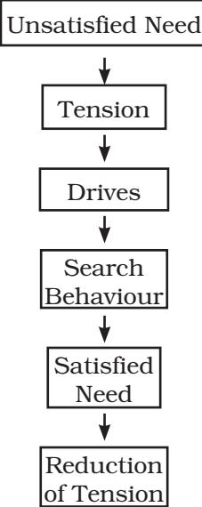
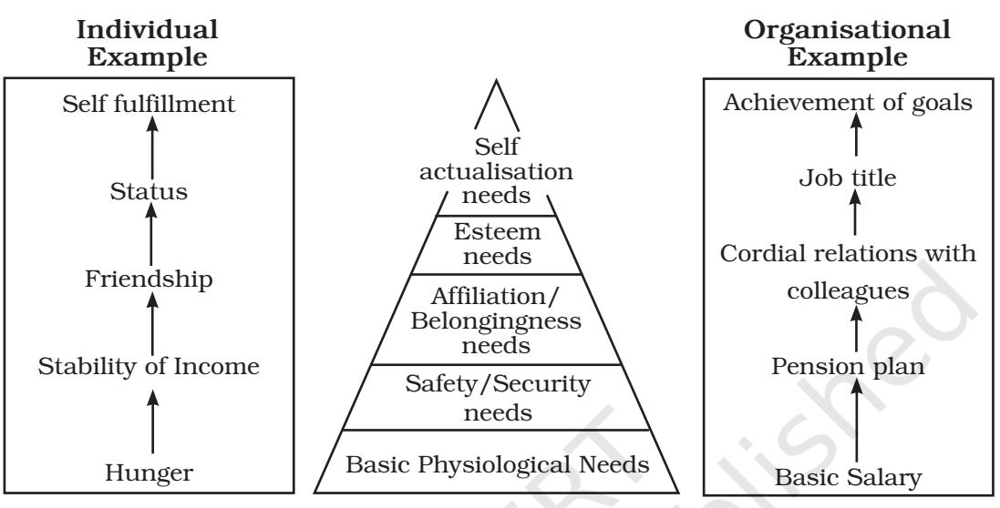
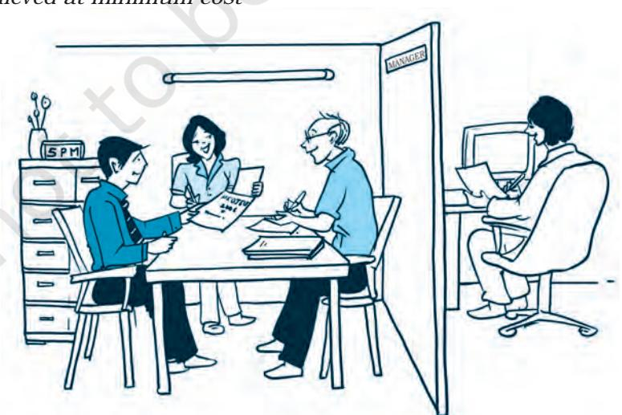
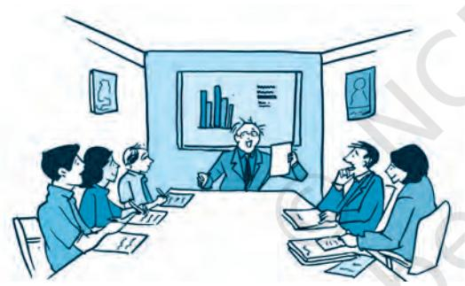
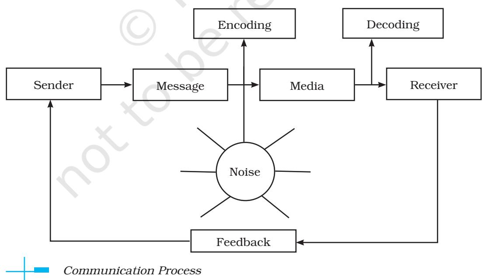
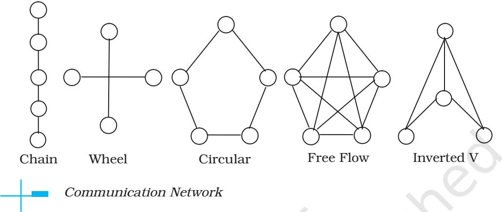
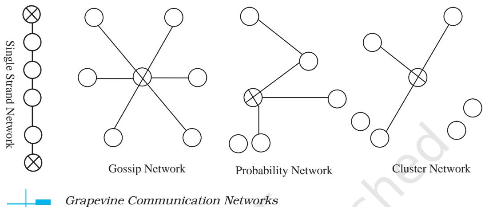
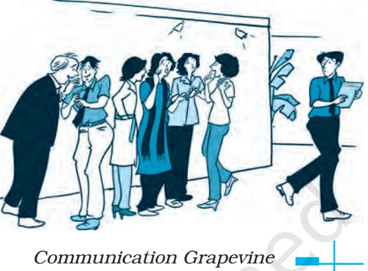

# **DIRECTING**

#### **Grassroot Leadership - Ford Motor Co.**

Ford has always attracted and nurtured capable managers and technicians, but it has failed to do the same for change agents and leaders. So, as part of the automaker's cultural overhaul, Ford is embarking on a sweeping attempt to mass-manufacture leaders. It wants to build an army of "warriorentrepreneurs" — people who have the courage and skills to topple old ideas, and who believe in change passionately enough to make it happen.

Ford Motor Company announced key changes to its senior management team as it continues to strengthen its automotive business, improve the company's operational fitness, and accelerate a strategic shift to capitalize on emerging opportunities. In announcing the leadership changes, Ford President and CEO Jim Hackett said Form is "very fortunate to have an experienced and committed executive team in place to significantly strengthen their business while building towards their vision of becoming the world's most trusted mobility company. Their objective is to lead business to new levels of operational fitness, product and brand excellence and profitability.

Ford views grassroot leadership as the best vehicle for creating a successful business.

> *Source: http://media.ford.com/ content/fordmedia/fna/us/en/news/ 2018/02/22/company-news.html*

## LEARNING OBJECTIVES

After studying this chapter, you should be able to:

- n Explain the concept of directing and its importance in business organisations;
- n Understand the principles guiding directing process;
- n Explain the meaning of supervision and its importance;
- n Explain the meaning of motivation and its importance in business management;
- n Understand and explain Maslow's theory of hierarchy of needs and its application to motivation of employees in an organisation;
- n Explain the financial and nonfinancial incentives through which managers motivate their employees;
- n Explain the concept of leadership and its importance in management;
- n Describe the qualities of a good leader;
- n Explain about formal and informal communications in the organisations; and
- n Identify various barriers to effective communications and measures to overcome these barriers in the organisations.

Ch_07.indd 169 08-08-2022 10:35:54

## **Introduction**

The above case reveals how important it is to instill leadership qualities in all managers. Business organisations have always given due importance to its managers who are capable of leading others. A manager needs to use various ways to lead, motivate and inspire the subordinates and to communicate with them suitably. These ways, discussed in the present chapter, are collectively called the directing function of management.

## **Meaning**

In the ordinary sense, directing means giving instructions and guiding people in doing work. In our daily life, we come across many situations like a hotel owner directing his employees to complete certain activities for organising a function, a teacher directing his student to complete an assignment, a film director directing the artists about how they should act in the film etc. In all these situations, we can observe that directing is done to achieve some predetermined objective.

In the context of management of an organisation, directing refers to the process of instructing, guiding, counselling, motivating and leading people in the organisation to achieve its objectives.

You can observe here that directing is not a mere issue of communication but encompasses many elements like supervision, motivation and leadership. It is one of the key managerial functions performed by every manager. Directing is a managerial process which takes place throughout the life of an organisation.

The main characteristics of directing are discussed below:

- (i) *Directing initiates action:* Directing is a key managerial function. A manager has to perform this function along with planning, organising, staffing and controlling while discharging his duties in the organisation. While other functions prepare a setting for action, directing initiates action in the organisation.
- (ii) *Directing takes place at every level of management:* Every manager, from top executive to supervisor performs the function of directing. The directing takes place wherever superior – subordinate relations exist.
- (iii) *Directing is a continuous process:* Directing is a continuous activity. It takes place throughout the life of the organisation irrespective of people occupying managerial positions. We can observe that in organisations like Infosys, Tata, BHEL, HLL and the managers may change but the directing process continues because without direction the organisational activities can not continue further.
- (iv) *Directing flows from top to bottom:* Directing is first initiated at top level and flows to the bottom through organisational hierarchy.

Ch_07.indd 170 08-08-2022 10:35:54

It means that every manager can direct his immediate subordinate and take instructions from his immediate boss.

## **Importance of Directing**

The importance of directing can be understood by the fact that every action in the organisation is initiated through directing only. Directing guides towards achievement of common objectives. Through directing, managers not only tell the people in the organisation as to what they should do, when they should do and how they should do but also see that their instructions are implemented in proper perspective. Very often, this becomes an important factor in the efficient and effective functioning of the organisation. The points which emphasise the importance of directing are presented as follows:

- (i) Directing helps to initiate action by people in the organisation towards attainment of desired objectives. For example, if a supervisor guides his subordinates and clarifies their doubts in performing a task, it will help the worker to achieve work targets given to him.
- (ii) Directing integrates employeesefforts in the organisation in such a way that every individual effort contributes to the organisational performance. Thus, it ensures that the individuals work for organisational goals. For example,

a manager with good leadership abilities will be in a position to convince the employees working under him that individual efforts and team effort will lead to achievement of organisational goals.

- (iii) Directing guides employees to fully realise their potential and capabilities by motivating and providing effective leadership. A good leader can always identify the potential of his employees and motivate them to extract work up to their full potential.
- (iv) Directing facilitates introduction of needed changes in the organisation. Generally, people have a tendency to resist changes in the organisation. Effective directing through motivation, communication and leadership helps to reduce such resistance and develop required cooperation in introducing changes in the organisation. For example, if a manager wants to introduce new system of accounting, there may be initial resistance from accounting staff. But, if manager explains the purpose, provides training and motivates with additional rewards, the employees may accept change and cooperate with manager.
- (v) Effective directing helps to bring stability and balance in the organisation since it fosters cooperation and commitment

Ch_07.indd 171 08-08-2022 10:35:54

among the people and helps to achieve balance among various groups, activities and the departments.

## **Principles of Directing**

Providing good and effective directing is a challenging task as it involves many complexities. A manager has to deal with people with diverse background, and expectations. This complicates the directing process. Certain guiding principles of directing may help in directing process. These principles are briefly explained below:

- (i) *Maximum individual contribution:* This principle emphasises that directing techniques must help every individual in the organisation to contribute to his maximum potential for achievement of organisational objectives. It should bring out untappted energies of employees for the efficiency of organisation. For example, a good motivation plan with suitable monetary and non-monetary rewards can motivate an employee to contribute his maximum efforts for the organisation as he or she may feel that their efforts will bring them suitable rewards.
- (ii) *Harmony of objectives:* Very often, we find that individual objectives of employees and the organisational objectives as understood are conflicting to each other. For example, an employee may expect attractive salary and monetary

benefits to fulfill his personal needs. The organisation may expect employees to improve productivity to achieve expected profits. But, good directing should provide harmony by convincing that employee rewards and work efficiency are complimentary to each other.

- (iii) *Unity of Command:* This principle insists that a person in the organisation should receive instructions from one superior only. If instructions are received from more than one, it creates confusion, conflict and disorder in the organisation. Adherence to this principle ensures effective direction.
- (iv) *Appropriateness of direction technique:* According to this principle, appropriate motivational and leadership technique should be used while directing the people based on subordinate needs, capabilities, attitudes and other situational variables. For example, for some people money can act as powerful motivator while for others promotion may act as effective motivator.
- (v) *Managerial communication:* Effective managerial communication across all the levels in the organisation makes direction effective. Directing should convey clear instructions to create total understanding to subordinates. Through proper feedback, the

Ch_07.indd 172 08-08-2022 10:35:54

managers should ensure that subordinate understands his instructions clearly.

- (vi) *Use of informal organisation:* A manager should realise that informal groups or organisations exist within every formal organisation. He should spot and make use of such organisations for effective directing.
- (vii) *Leadership:* While directing the subordinates, managers should exercise good leadership as it can influence the subordinates positively without causing dissatisfaction among them.
- (viii)*Follow through:* Mere giving of an order is not sufficient. Managers should follow it up by reviewing continuously whether orders are being implemented accordingly or any problems are being encountered. If necessary, suitable modifications should be made in the directions.

## **Elements of Direction**

The process of directing involves guiding, coaching, instructing, motivating, leading the people in an organisation to achieve organisational objectives. Consider the following examples: (i) A supervisor explains a worker about operations to be carried by him on a lathe machine, (ii) A mining engineer explains about safety precautions to be followed while working in a coal mine, (iii) A Managing Director declares share in the profits to the managers for their contribution to inhance profits of the company, and (iv) A manager inspires his/her employees by playing a lead role in performing a work.

All these examples and many other activities related to directing may broadly be grouped into four categories which are the elements of directing. These are:

- (i) Supervision
- (ii) Motivation
- (iii) Leadership
- (iv) Communication

To know more about directing, these elements are discussed in detail.

## **Supervision**

The term supervision can be understood in two ways. Firstly, it can be understood as an element of directing and secondly, as a function performed by supervisors in the organisational hierarchy.

Supervision being an element of directing, every manager in the organisation supervises his/her subordinates. In this sense, supervision can be understood as the process of guiding the efforts of employees and other resources to accomplish the desired objectives. It means overseeing what is being done by subordinates and giving instructions to ensure optimum utilisation of resources and achievement of work targets.

Secondly, supervision can be understood as the function to be performed by supervisor, a managerial

Ch_07.indd 173 08-08-2022 10:35:54

position in the organisation hierarchy at the operative level i.e., immediately above the worker. The functions and performance of the supervisor are vital to any organisation because he is directly related with workers whereas other mangers have no direct touch with bottom level workers.

## **Importance of Supervision**

The importance of supervision can be understood from multiple roles performed by a supervisor. These are explained below:

- (i) Supervisor maintains day-to-day contact and maintains friendly
relations with workers. A good supervisor acts as a guide, friend and philosopher to the workers.

- (ii) Supervisor acts as a link between workers and management. He conveys management ideas to the workers on one hand and workers problems to the management on the other. This role played by supervisor helps to avoid misunderstandings and conflicts between management and workers/employees.
- (iii) Supervisor plays a key role in maintaining group unity among workers placed under his control. He sorts out internal differences

### **Directing a Dissatisfied Manager**

Rashmi Joshi had been a district sales manager with Fine Productions for ten years. She was recognised by her peers and supervisors as a person who managed department in a good way. However, everyone realised that Rashmi was extremely ambitious and was seeking a higher-level management position. When one of her sales representatives did a good job, she would attempt to take the credit. However, if a problem arose, she thought it was not her fault. When the marketing manager retired, Rashmi applied for the position. The company decided to do a thorough search because of the responsibility and importance associated with the position. When the search was concluded, the decision was made to fill the position by a person from outside the company. The consensus of top management was that Rashmi, although a good district sales manager might have difficulties in working with her new peer groups. They felt that she might displease the other managers if she tried to take credit for their work and, as a result, their performance would suffer.

Rashmi was heart-broken. She had wanted that particular job for a long time and had dedicated all her energies towards obtaining it. She became very despondent and her work deteriorated. The department functioned inspite of her, not because of her. Decisions were made slowly if at all and she began to be late with her sales reports. Although her sales staff continued to be productive, Rashmi could not take the credit.

When the new marketing manager took over, one of the first major problems that he confronted was how to motivate and inspire Rashmi to her former level of performance. He recognised that Rashmi had been with the company for a long time but something had to be done to motivate her to perform really well.

Ch_07.indd 174 08-08-2022 10:35:54

and maintains harmony among workers.

- (iv) Supervisor ensures performance of work according to the targets set. He takes responsibility for task achievement and motivates his workers effectively.
- (v) Supervisor provides good on-the-job training to the workers and employees. A skilled and knowledgeable supervisor can build efficient team of workers.
- (vi) Supervisory leadership plays a key role in influencing the workers in the organisation. A supervisor with good leadership qualities can build up high morale among workers.
- (vii) A good supervisor analyses the work performed and gives feedback to the workers. He suggests ways and means of developing work skills.

## **Motivation**

The case of Rashmi reveals an important fact of managerial work; it is not always possible to get the best of work from employees merely by exercising formal authority. What makes people to behave the way they do? Why are some people reluctant to do the work though they have ability to do? What should be done to make people work effectively?

For answering these questions, a manager should try to develop insights into causes of behaviour of people. A manager may come across highly committed and hardworking staff or lazy, evasive and superficial workers. He or she may wonder what to do with workers not willing to work to their potential. Psychologists say it is motivation, which stimulates people to take up work voluntarily.

Let us try to understand something about motivation.

*Motivation:* Motivation means incitement or inducement to act or move. In the context of an organisation, it means the process of making subordinates to act in a desired manner to achieve certain organisational goals.

While discussing about motivation, we need to understand three inter related terms — motive, motivation and motivators. Let us try to know about these terms.

- (i) *Motive:* A motive is an inner state that energises, activates or moves and directs behaviour towards goals. Motives arise out of the needs of individuals. Realisation of a motive causes restlessness in the individual which prompts some action to reduce such restlessness. For example, the need for food causes hunger an account of which a man searches for food. Some such motives are – hunger, thirst, security, affiliation, need for comfort, recognition etc.,
- (ii) *Motivation:* Motivation is the process of stimulating people to action to accomplish desired goals. Motivation depends upon satisfying needs of people.

Ch_07.indd 175 08-08-2022 10:35:54

- (iii) *Motivators:* Motivator is the technique used to motivate people in an organisation. Managers use diverse motivators like pay, bonus, promotion, recognition, praise, responsibility etc., in the organisation to influence people to contribute their best.
Some of the definitions to explain the concept of motivation are given in the above box.

*Features of Motivation:* The analysis of various definitions and viewpoints on motivation reveals the following features of motivation:

- (i) Motivation is an internal feeling. The urge, drives, desires, aspirations, striving or needs of human being, which are internal, influence human behaviour. For example, people may have the urge or desire for possessing a motorbike, comfortable house, reputation in the society. These urges are internal to an individual.
- (ii) Motivation produces goal directed behaviour. For example, the promotion in the job may be given to employee with the objective of improving his performance. If the employee is interested in promotion, it helps to produce a behaviour to improve performance.
- (iii) Motivation can be either positive or negative. Positive motivation provides positive rewards like increase in pay, promotion, recognition etc., Negative motivation uses negative means like punishment, stopping increments, threatening etc. which also may induce a person to act in the desired way.
- (iv) Motivation is a complex process as the individuals are heterogeneous in their expectations, perceptions and reactions. Any type of motivation may not have uniform effect on all the members.

#### **Definitions on Motivation**

Motivation means a process of stimulating people to action to accomplish desired goals

*William G. Scout*

Motivation refers to the way in which urges, drives, desires, aspirations, strivings or needs direct, control and explain the behaviour of human beings.

#### *Mc Farland*

Motivation is a complex force starting with keeping a person at work in an organisation. Motivation is something which moves the person to action and continues him in the course of action already initiated.

*Dubin*

Motivation is a process which begins with a physiological or psychological need or deficiency which triggers behaviour or a drive that is aimed at a goal or incentive.

*Fred Luthans*

Ch_07.indd 176 08-08-2022 10:35:54

*Motivation Process:* Motivation process is based on human needs. A simple model to explain motivation process is presented below.

The following example explains the process of satisfaction of human needs.

Ramu is very hungry since he did not have breakfast in the morning. By1.00 P.M., he became restless and started walking on the road in search of a hotel for snacks or meals. After walking for 2 kms, he could find a hotel where roti and dal was available for ` 10. Since he had only ` 15 in his pocket, he paid ` 10 and had a satisfying meal. After taking a meal, he felt that he had regained energy.

An unsatisfied need of an individual creates tension which stimulates his or her drives. These drives generate a search behaviour to satisfy such need. If such need is satisfied, the individual is relieved of tension.

#### **Motivating Employees in Tata Steel**

In Tata Steel several initiatives have been taken to further improve the motivation levels and participation in the decision making process of the officers, greater impetus to training through a formalised system of a personal development programme, talent review and job rotation systems, compensation linked to the performance management system, formal rewards and recognition systems, knowledge management systems linked with appraisals, leadership opportunities in quality circles, continuous improvement and value engineering programmes and an extremely transparent and credible multi-path communication system to address queries and concerns of all employees through various dialogues both formal and online, with such tools as video conferencing, 'MD Online', special dialogues with senior management, meetings, conferences and seminars. These initiatives have helped to build a homogeneous and focused team in Tata Steel, increasing motivation and binding to the vision of the company and spurred employees to deliver targets on a participatory management basis leading to ownership of processes.

Tata Steel is a company that actively promotes freedom to work, freedom to innovate and even the freedom to fail. It is a nimble, fast, modern and forward-looking company on a strong growth path. The company has undergone a revolutionary change in terms of its production facilities and the technology in the manufacturing process. These changes have resulted in creating greater opportunities for taking up newer challenges for young recruits work and for performance based on IT enabled systems and high levels of automation. These have led to making the company one of the lowest cost producers of steel and the only Indian company to be recognised by the World Steel Dynamics as one of the top most 'World Class' steel makers. Tata Steel hopes not only to consolidate but better its leadership by robust leadership development systems that have seen the company create many CEOs for other companies.

*http://www.tata.com/tata_steel/releases/20030829.htm*

Ch_07.indd 177 08-08-2022 10:35:54

*Importance of Motivation:* In the example of Tata Steel you have seen how the direction, motivation and effective leadership has taken the company forward. Even communication systems in the company have encouraged employees to achieve targets.

Motivation is considered important because it helps to identify and satisfy the needs of human resources in the organisation and thereby helps in improving their performance. It is the reason why every major organisation develops various kinds of motivational programmes and spends crores of rupees on these programmes. The importance of motivation can be pointed out by the following benefits:

- (i) Motivation helps to improve performance levels of employees
as well as the organisation. Since proper motivation satisfies the needs of employees, they in turn devote all their energies for optimum performance in their work. A satisfied employee can always turnout expected performance. Good motivation in the organisation helps to achieve higher levels of performance as motivated employees contribute their maximum efforts for organisational goals.

- (ii) Motivation helps to change negative or indifferent attitudes of employee to positive attitudes so as to achieve organisational goals. For example, a worker may have indifferent or negative attitude towards his work, if he is not rewarded properly. If suitable rewards are given and supervisor gives positive encouragement and praise for the good work done, the worker may slowly develop positive attitude towards the work.
- (iii) Motivation helps to reduce employee turnover and thereby saves the cost of new recruitment and training. The main reason for high rate of employee turnover is lack of motivation. If managers identify motivational needs of employees and provide suitable incentives, employees may not think of leaving the organisation. High rate of turnover compels management to go for new

Ch_07.indd 178 08-08-2022 10:35:54

recruitment and training which involve additional investment of money, time and effort. Motivation helps to save such costs. It also helps to retain talented people in the organisation.

- (iv) Motivation helps to reduce absenteeism in the organisation. Some important reasons for absenteeism are–bad working conditions, inadequate rewards, lack of recognition, poor relations with supervisors and colleagues etc. Through sound motivational system, all these deficiencies can be covered. If motivation is adequately provided, work becomes a source of pleasure and workers attend to the work regularly.
- (v) Motivation helps managers to introduce changes smoothly without much resistance from people. Normally, for any change introduced in the organisation, there may be resistance for changes. If manager can convince employees that proposed changes will bring additional rewards to employees, they may readily accept the change.

*Maslow's Need Hierarchy Theory of Motivation:* Since motivation is highly complex, many researchers have studied about motivation from several dimensions and developed some theories. These theories help to develop understanding about motivation phenomenon. Among

these, Maslow's Need Hierarchy Theory is considered fundamental to understanding of motivation. Let us examine it in detail.

Abraham Maslow, a well-known psychologist in a classic paper published in 1943, outlined the elements of an overall theory of motivation.

His theory was based on human needs. He felt that within every human being, there exists a hierarchy of five needs. These are:

- (i) *Basic Physiological Needs:* These needs are most basic in the hierarchy and corresponds to primary needs. Hunger, thirst, shelter, sleep and sex are some examples of these needs. In the organisational context, basic salary helps to satisfy these needs.
- (ii) *Safety/Security Needs:* These needs provide security and protection from physical and emotional harm. Examples: job security, stability of income, Pension plans etc.,
- (iii) *Affiliation/Belonging Needs:* These needs refer to affection, sense of belongingness, acceptance and friendship.
- (iv) *Esteem Needs:* These include factors such as self-respect, autonomy status, recognition and attention.
- (v) *Self Actualisation Needs:* It is the highest level of need in the hierarchy. It refers to the drive to become what one is capable of

Ch_07.indd 179 08-08-2022 10:35:54

#### *Maslow's Need Hierarchy Theory*

becoming. These needs include growth, self-fulfillment and achievement of goals.

Maslow's theory is based on the following assumptions:

- (i) People's behaviour is based on their needs. Satisfaction of such needs influences their behaviour.
- (ii) People's needs are in hierarchical order, starting from basic needs to other higher level needs.
- (iii) A satisfied need can no longer motivate a person; only next higher level need can motivate him.
- (iv) A person moves to the next higher level of the hierarchy only when the lower need is satisfied. Maslow's Theory focuses on the

needs as the basis for motivation. This theory is widely recognised and appreciated. However, some of his propositions are questioned on his classification of needs and hierarchy of needs. But, despite such criticism, the theory is still relevant because needs, no matter how they are classified, are important to understand the behaviour. It helps managers to realise that need level of employee should be identified to provide motivation to them.

### **Financial and Non-Financial Incentives**

Incentive means all measures which are used to motivate people to improve performance. These incentives may be broadly classified as financial and non financial. Let us learn about these incentives in detail.

*Financial Incentives:* In the context of existing economic system, money

Ch_07.indd 180 08-08-2022 10:35:55

### **Profile of Abraham Maslow (1908 – 1970)**

Abraham H. Maslow was born in Brooklyn, New York, in 1908. He studied primate behavior at the University of Wisconsin, where he received his doctorate in psychology in 1934.

Early in his career, Maslow was drawn to the study of human motivation and personality. His work in this area upset strict behaviorists, whose explanations of motivation and personality failed to account for what Maslow called the whole person. His theory of the hierarchy of needs, which leads to the 'selfactualised' individual, was a strong catalyst for the founding of humanistic psychology. Maslow successfully bridged motivation and personality in his theories of needs, self-actualising persons, and peak experiences.

Maslow is considered an important figure in contemporary psychology. His career was a formidable one. For 14 years he taught at Brooklyn College, and then went to Brandeis University as chairman of the Psychology Department. In 1968 he was elected president of the American Psychological Association. In 1969 he went to the Laughlin Foundation in Menlo Park, California. He wrote two important books: Toward a Psychology of Being (1968) and Motivation and Personality (1970). Abraham Maslow died of a heart attack in 1970.

has become a means to satisfy the physical needs of daily life and also of obtaining social position and power. Since, money has the purchasing power, it becomes a very important incentive for every individual.

Financial incentives refer to incentives which are in direct monetary form or measurable in monetary term and serve to motivate people for better performance. These incentives may be provided on individual or group basis. The financial incentives generally used in organisations are listed below:

- (i) *Pay and allowances:* For every employee, salary is the basic monetary incentive. It includes basic pay, dearness allowance and other allowances. Salary
system consists of regular increments in the pay every year and enhancement of allowances from time-to-time. In some business organisations, pay hike and increments may be linked to performance.

- (ii) *Productivity linked wage incentives:* Several wage incentive plans aims at linking payment of wages to increase in productivity at individual or group level.
- (iii) *Bonus:* Bonus is an incentive offered over and above the wages/ salary to the employees.
- (iv) *Profit Sharing:* Profit sharing is meant to provide a share to employees in the profits of the organisation. This serves to motivate the employees to

Ch_07.indd 181 08-08-2022 10:35:55

improve their performance and contribute to increase in profits.

- (v) *Co-partnership/ Stock option:* Under these incentive schemes, employees are offered company shares at a set price which is lower than market price. Sometimes, management may allot shares in line of various incentives payable in cash. The allotment of shares creates a feeling of ownership to the employees and makes them to contribute for the growth of the organisation. In Infosys the scheme of stock option has been implemented as a part of managerial compensation.
- (vi) *Retirement Benefits:* Several retirement benefits such as provident fund, pension, and gratuity provide financial security to employees after their retirement. This acts as an incentive when they are in service in the organisation.
- (vii) *Perquisites:* In many companies perquisites and fringe benefits are offered such as car allowance, housing, medical aid, and education to the children, etc., over and above the salary. These measures help to provide motivation to the employees/ managers.

*Non-Financial Incentives:* All the needs of individuals are not satisfied by money alone. Psychological, social and emotional factors also play important role in providing motivation. Non-financial incentives mainly focus on these needs. Some times, monetary aspect may be involved in non-financial incentives as well. However, the emphasis is to provide psychological and emotional satisfaction rather than money driven satisfaction. For example, if an individual gets promotion in the organisation, it satisfies him psychologically more as he gets a feeling of elevation, increase in status, increase in authority, challenge in the job etc., Though promotion involves payment of extra money, non-monetary aspects over-ride monetary aspects.

Some of the important non-financial incentives are discussed below:

- (i) *Status:* In the organisational context, status means ranking of positions in the organisation. The authority, responsibility, rewards, recognition, perquisites and prestige of job indicate the status given to a person holding a managerial position. Psychological, social and esteem needs of an individual are satisfied by status given to their job.
- (ii) *Organisational Climate:* Organisational climate indicates the characteristics which describe an organisation and distinguish one organisation from the other. These characteristics influence the behaviour of individuals in the organisation. Some of these characteristics are–individual autonomy, reward orientation, consideration to employees,

Ch_07.indd 182 08-08-2022 10:35:55

risk-tasking, etc., If managers take positive measures regarding these aspects, it helps to develop better organisational climate.

- (iii) *Career Advancement Opportunity:* Every individual wants to grow to the higher level in the organisation. Managers should provide opportunity to employees to improve their skills and be promoted to the higher level jobs. Appropriate skill development programmes, and sound promotion policy will help employees to achieve promotions. Promotion works as a tonic and encourages employees to exhibit improved performance.
- (iv) *Job Enrichment:* Job enrichment is concerned with designing jobs that include greater variety of work content, require higher level of knowledge and skill; give workers more autonomy and responsibility; and provide the opportunity for personal growth and a meaningful work experience. If jobs are enriched and made interesting, the job itself becomes a source of motivation to the individual.
- (v) *Employee Recognition programmes:* Most people have a need for evaluation of their work and due recognition. They feel that what they do should be recognised by others concerned. Recognition means acknowledgment with a show of appreciation. When such

appreciation is given to the work performed by employees, they feel motivated to perform/work at higher level. Some examples of employee recognition are:

- n Congratulating the employee for good performance.
- n Displaying on the notice board or in the company news letter about the achievement of employee.
- n Installing award or certificate for best performance.
- n Distributing mementos, complimentaries like T-shirts in recognition of employee services.
- n Rewarding an employee for giving valuable suggestions.
- (vi) *Job security:* Employees want their job to be secure. They want certain stability about future income and work so that they do not feel worried on these aspects and work with greater zeal. In India, this aspect is more important considering the inadequate job opportunities and too many aspirants for these. However, there is one negative aspect of job security. When people feel that they are not likely to lose their jobs, they may become complacent.
- (vii) *Employee participation:* It means involving employees in decision making of the issues related to them. In many companies, these programmes are in practice in

Ch_07.indd 183 08-08-2022 10:35:55

the form of joint management committees, work committees, canteen committees etc.,

- (viii)*Employee Empowerment:* Empowerment means giving more autonomy and powers to subordinates. Empowerment makes people feel that their jobs are important. This feeling contributes positively to the use of skills and talents in the job performance.
## **Leadership**

Whenever we hear the success stories of any organisation, we are immediately reminded of their leaders. Can you imagine Mircrosoft without Bill Gates, Reliance Industries without Ambanis, Infosys without Narayana Murthy, Tata without J.R.D. Tata or Wipro without Azim Premji. You would say it is not possible to achieve success without such great leaders. The leaders always play a key role for the success and excellence of any organisation.

Let us understand the concept of leadership, its importance and qualities of good leaders. Leadership is the process of influencing the behaviour of people by making them strive voluntarily towards achievement of organisational goals. Leadership indicates the ability of an individual to maintain good interpersonal relations with followers and motivate them to contribute for achieving organisational objectives.

## **Features of leadership**

An examination of the above definition reveals the following important features of leadership:

- (i) Leadership indicates ability of an individual to influence others.
#### **Definitions of Leadership**

Leadership is the activity of influencing people to strive willingly for group objectives.

George Terry

Leadership is the art or process of influencing people so that they will strive willingly and enthusiastically towards the achievement of group goals.

*Harold Koontz and Heinz Weihrich*

Leadership is a set of interpersonal behaviours designed to influence employees to cooperate in the achievement of objectives.

*Glueck*

Leadership is both a process and property. The process of leadership is the use of noncoercive influence to direct and coordinate the activities of the members of an organised group towards the accomplishment of group objectivities. As a property, leadership is the set of qualities or characteristics attributed to those who are perceived to successfully employ such influence.

*Gay and Strake*

Ch_07.indd 184 08-08-2022 10:35:55

- (ii) Leadership tries to bring change in the behaviour of others.
- (iii)Leadership indicates interpersonal relations between leaders and followers.
- (iv) Leadership is exercised to achieve common goals of the organisation.
- (v) Leadership is a continuous process.

The term leader emerges from leadership. An individual possessing attributes of leadership is known as leader. While discussing about leadership, it is important to understand leader–follower relationship. Many times, the success of an organisation is attributed to the leader, but due credit is not given to the followers. Many followers related factors like – their skills, knowledge, commitment, willingness to cooperate, team spirit etc., make a person an effective leader. It is said that followers make a person, a good leader by acceptance of leadership. Therefore, it is to be recognised that both leader and follower play key role in leadership process.

*Importance of Leadership:*  Leadership is a key factor in making any organisation successful. History reveals that, many times, difference between success and failure of an organisation is leadership. It is aptly mentioned by Stephen Covey, a famous management consultant, that managers are important but leaders are vital for lasting organisational success. A leader not only commits

*Effective leadership is getting work done, tasks completed on time and goals achieved at minimum cost*

Ch_07.indd 185 08-08-2022 10:35:57

his followers to organisational goals but also pools needed resources, guides and motivates subordinates to reach the goals.

The importance of leadership can be discussed from the following benefits to the organisation:

- (i) Leadership influences the behaviour of people and makes them to positively contribute their energies for the benefit of the organisation. Good leaders always produce goods results through their followers.
- (ii) A leader maintains personal relations and helps followers in fulfilling their needs. He provides needed confidence, support and encouragement and thereby creates congenial work environment.
- (iii) Leader plays a key role in introducing required changes in the organisation. He persuades, clarifies and inspires people to accept changes whole-heartedly. Thus, he overcomes the problem of resistance to change and introduces it with minimum discontentment.
- (iv) A leader handles conflicts effectively and does not allow adverse effects resulting from the conflicts. A good leader always allows his followers to ventilate their feelings and disagreement but persuades them by giving suitable clarifications.

- (v) Leader provides training to their subordinates. A good leader always builds up his successor and helps in smooth succession process.
However, we should remember that all good leaders may not necessarily posses all the qualities of a good leader. In fact, it is not possible for any individual to have all the qualities. But an understanding about these qualities help the managers to acquire them through training and conscious efforts.

### **Leadership Style**

There are many theories of leadership behaviour and styles. Research studies have revealed certain traits and qualities which a leader might possess. However, these are not conclusive since many people may possess these qualities but may not be leaders.

There are several bases for classifying leadership styles. The most popular classification of leadership styles is based on the use of authority. Depending on the use of authority, there are three basic styles of leadership:

(i) Autocratic (ii) Democratic, and (iii) Laissez-faire

- **(i) Autocratic or Authoritarian leader**  An autocratic leader gives orders and expects his subordinates to obey those orders. If a manager is following this style, then communication is only one-way with the subordinate only acting
Ch_07.indd 186 08-08-2022 10:35:57

according to the command given by the manager.

 This leader is dogmatic, i.e., does not change or wish to be contradicted. His following is based on the assumption that reward or punishment both can be given depending upon the result. This leadership style is effective in getting productivity in many situations like in a factory where the supervisor is responsible for production on time and has to ensure labour productivity. Quick decision-making is also facilitated.

 But there are variations also, they may listen to everyone's opinion, consider subordinates ideas and concerns but the decision will be their own.

- (**ii) Democratic or Participative leader**
A democratic leader will develop action plans and makes decisions in consultation with his subordinates. He will encourage them to participate in decision-making. This kind of leadership style is more common now-a-days, since leaders also recognise that people perform best if they have set their own objectives. They also need to respect the other's opinion and support subordinates to perform their duties and accomplish organisational objectives. They exercise more control by using forces within the group.

- **(iii) Laissez faire or Free-rein leader**  Such a leader does not believe in the use of power unless it is absolutely essential. The followers are given a high degree of independence to formulate their own objectives and ways to achieve them. The group members work on their own tasks resolving issues themselves. The manager is there only to support them and supply them the required information to complete the task assigned. At the same time, the subordinate assumes responsibility for the work to be performed.
Depending upon the situation a leader may choose to exercise a combination of these styles when required. Even a laissez faire leader would have certain rules to be followed while doing work and a democratic leader may have to take his own decision in an emergency situation.

## **Communication**

Communication plays key role in the success of a manager. How much professional knowledge and intelligence a manager possesses becomes immaterial if he is not able to communicate effectively with his subordinates and create understanding in them. Directing abilities of a manager mainly depend upon his communication skills. That is why organisation always emphasise on improving communication skills of managers as well as employees.

Ch_07.indd 187 08-08-2022 10:35:57

*Rogers*

#### **Definitions of Communication**

Communication is the sum of all things one person does when he wants to create understanding in the mind of another. It involves systematic and continuous process of telling, listening and understanding.

*Louis Allen* Communication is transfer of information from the sender to the receiver with the information being understood by the receiver.

*Harold Koontz and Heniz Weihrich*

Communication is a process by which people create and share information with one another in order to reach common understanding.

*Effective Communication* 

 The word communication has been derived from the Latin word 'communis' which means 'common' which consequently implies common understanding. Communication is defined in different ways. Generally, it is understood as a process of exchange of ideas, views, facts, feelings, etc., between or among people to create common understanding.

Some of the definitions given by management experts are presented in the box.

*increases managerial efficiency* A close examination of above definitions reveals that communication is the process of exchange of information between two or more persons to reach common understanding.

## **Elements of Communication Process**

Communication has been defined as a process. This process involves elements like source, encoding, media/channel, receiver, decoding, noise and feedback. The process is represented in the figure.

The elements involved in communication process are explained below:

- (i) *Sender:* Sender means person who conveys his thoughts or ideas to the receiver. The sender represents source of communication.
- (ii) *Message:* It is the content of ideas, feelings, suggestions, order, etc., intended to be communicated.
- (iii) *Encoding:* It is the process of converting the message into

Ch_07.indd 188 08-08-2022 10:35:59

communication symbols such as words, pictures, gestures etc.,

- (iv) *Media:* It is the path through which encoded message is transmitted to receiver. The channel may be in written form, face to face, phone call, Internet etc.,
- (v) *Decoding:* It is the process of converting encoded symbols of the sender.
- (vi) *Receiver:* The person who receives communication of the sender.
- (vii) *Feedback:* It includes all those actions of receiver indicating that he has received and understood message of sender.
- (viii)*Noise:* Noise means some obstruction or hindrance to communication. This hindrance

may be caused to sender, message or receiver. Some examples of noise are:

- (a) Ambiguous symbols that lead to faulty encoding.
- (b) A poor telephone connection.
- (c) An inattentive receiver.
- (d) Faulty decoding (attaching wrong meanings to message).
- (e) Prejudices obstructing the poor understanding of message.
- (f ) Gestures and postures that may distort the message.

## **Importance of Communication** Communication is one of the most

central aspects of managerial activities. It has been estimated that a manager spends 90 percent of his time in communicating-reading, writing, listening, guiding, instructing,

Ch_07.indd 189 08-08-2022 10:35:59

approving, reprimanding, etc. Effectiveness of a manager depends significantly on his ability to communicate effectively with his superiors, subordinates and external agencies such as bankers, suppliers, union and government.

An ex-president of American Management Association once observed that number one management problem today is communication. Bernard has called it the foundation of all group activities. Communication serves as the lubricant fostering for the smooth operations of the management process. The importance of communication in management can be judged from the following:

- (i) *Acts as basis of coordination:* Communication acts as basis of coordination. It provides coordination among departments, activities and persons in the organisation. Such coordination is provided by explaining about organisational goals, the mode of their achievement and inter relationships between different individuals, etc.
- (ii) *Helps in smooth working of an enterprise:* Communication makes possible for the smooth and unrestricted working of the enterprise. All organisational interactions depend on communications. The job of a manager is to coordinate the human and physical elements of an organisation into an efficient and

active working unit that achieves common objectives. It is only communication which makes smooth working of an enterprise possible. Communication is basic to an organisation's existenceright from its birth through its continuing life. When communication stops, organised activity ceases to exist.

- (iii) *Acts as basis of decision making:* Communication provides needed information for decision making. In its absence, it may not be possible for the managers to take any meaningful decision. Only on the basis of communication of relevant information one can take right decision.
- (iv) *Increases managerial efficiency:* Communication is essential for quick and effective performance of managerial functions. The management conveys the goals and targets, issues instructions, allocates jobs and responsibilities and looks after the performance of subordinates. Communication is involved in all these aspects. Thus, communication lubricates the entire organisation and keeps the organisation at work with efficiency.
- (v) *Promotes cooperation and industrial peace:* Efficient operation is the aim of all prudent management. It may be possible only when there is industrial peace in the factory and mutual cooperation between management and workers. The

Ch_07.indd 190 08-08-2022 10:35:59

two way communication promotes cooperation and mutual understanding between the management and workers.

- (vi) *Establishes effective leadership:* Communication is the basis of leadership. Effective communication helps to influence subordinates. While influencing people, leader should possess good communication skills.
- (vii) *Boosts morale and provides motivation:* An efficient system of communication enables management to motivate, influence and satisfy the subordinates. Good communication assists the workers in their adjustment with the physical and social aspect of work. It improves good human relations in industry. Communication is the basis of participative and democratic pattern of management. Communication helps to boost morale of employees and managers.

## **Formal and Informal Communciation**

Communication taking place within an organisation may be broadly classified as formal and informal communication.

## **Formal Communication**

Formal communication flows through official channels designed in the organisation chart. This communication may take place between a superior and subordinate, a subordinate and superior or among same cadre employees or managers. The communications may be oral or written but generally recorded and filed in the office.

Formal communication may be further classified as – Vertical and Horizontal.

Vertical communication flows vertically, i.e., upwards or downwards through formal channels. Upward communications refer to flow of communication from subordinate to superior whereas downward communication indicates communication from a superior to subordinate. The examples of upward communication are – application for grant of leave, submission of progress report, request for grants, etc. Similarly, the examples of downward communication include – sending notice to employees to attend a meeting, ordering subordinates to complete an assigned work, passing on guidelines framed by top management to the subordinates, etc.

Horizontal or lateral communication takes place between one division and another. For example, a production manager may contact marketing manager to discuss about schedule of product delivery, product design, quality, etc.

The pattern through which communication flows within the organisation is generally indicated through communication network.

Ch_07.indd 191 08-08-2022 10:35:59

Different types of communication networks may operate in formal organisation. Some of the popular communication networks are presented and discussed in given figure.

- (i) *Single chain:* This network exists between a supervisor and his subordinates. Since many levels exist in an organisation structure, communication flows from every superior to his subordinate through single chain.
- (ii) *Wheel:* In wheel network, all subordinates under one superior communicate through him only as he acts as a hub of the wheel. The subordinates are not allowed to talk among themselves.
- (iii) *Circular:* In circular network, the communication moves in a circle. Each person can communicate with his adjoining two persons. In this network, communication flow is slow.
- (iv) *Free flow:* In this network, each person can communicate with others freely. The flow of communication is fast in this network.
- (v) *Inverted V:* In this network, a subordinate is allowed to communicate with his immediate superior as well as his superiors superior. However, in later case, only prescribed communication takes place.

#### **Informal Communication**

Communication that takes place without following the formal lines of communication is said to be informal communication. Informal system of communication is generally referred to as the 'grapevine' because it spreads throughout the organisation with its branches going out in all directions in utter disregard to the levels of authority.

The informal communication arises out of needs of employees to

Ch_07.indd 192 08-08-2022 10:35:59

exchange their views, which cannot be done through formal channels. Workers chit chating in a canteen about the behaviour of the superior, discussing about rumours that some employees are likely to be transferred are some examples of informal communications. The grapevine/ informal communication spreads rapidly and sometimes gets distorted. It is very difficult to detect the source of such communication. It also leads to generate rumours which are not authentic. People's behaviour is affected by rumours and informal discussions and sometimes may hamper work environment. Sometimes, grapevine channels may be helpful as they carry information rapidly and, therefore, may be useful to the manager at times. Informal channels are used by the managers to transmit information so as to know the reactions of his/her subordinates. An intelligent manager should make use of positive aspects of informal channels and minimise negative aspects of this channel of communication.

### **Grapevine Network**

Grapevine communication may follow different types of network.

In single strand network, each person communicates to the other in sequence. In gossip network, each person communicates with all on non-selective basis. In probability network, the individual communicates randomly with other individual. In cluster, the individual communicates with only those people whom he trusts. Of these four types of networks, cluster is the most popular in organisations.

#### **Barriers to Communication**

It is generally observed that managers face several problems due to communication breakdowns or barriers. These barriers may prevent

Ch_07.indd 193 08-08-2022 10:35:59

a communication or filter part of it or carry incorrect meaning due to which misunderstandings may be created. Therefore, it is important for a manager to identity such barriers and take measures to overcome them.

The barriers to communication in the organisations can be broadly grouped as: semantic barriers, psychological barriers, organisational barriers, and personal barriers. These are briefly discussed below:

*Semantic barriers:* Semantics is the branch of linguistics dealing with the meaning of words and sentences. Semantic barriers are concerned with problems and obstructions in the process of encoding and decoding of message into words or impressions. Normally, such barriers result on account of use of wrong words, faulty translations, different interpretations, etc. These are discussed below:

- (i) *Badly expressed message:* Some times intended meaning may not be conveyed by a manager to his subordinates. These badly expressed messages may be an account of inadequate vocabulary, usage of wrong words, omission of needed words, etc.
- (ii) *Symbols with different meanings:* A word may have several meanings. Receiver has to perceive one such meaning for the word used by communicator. For example,

consider these three sentences where the work 'value' is used:

- (a) What is the value of this ring?
- (b) I value our friendship.
- (c) What is the value of learning computer skills? You will find that the 'value' gives different meaning in different contexts. Wrong perception leads to communication problems.
- (iii) *Faulty translations:* Sometimes the communications originally drafted in one language (e.g., English) need to be translated to the language understandable to workers (e.g., Hindi). If the translator is not proficient with both the languages, mistakes may creep in causing different meanings to the communication.
- (iv) *Unclarified assumptions:* Some communications may have certain assumptions which are subject to different interpretations. For example, a boss may instruct his subordinate, "Take care of our guest". Boss may mean that

Ch_07.indd 194 08-08-2022 10:36:01

subordinate should take care of transport, food, accommodation of the guest until he leaves the place. The subordinate may interpret that guest should be taken to hotel with care. Actually, the guest suffers due to these unclarified assumptions.

- (v) *Technical jargon:* It is usually found that specialists use technical jargon while explaining to persons who are not specialists in the concerned field. Therefore, they may not understand the actual meaning of many such words.
- (vi) *Body language and gesture decoding:* Every movement of body communicates some meaning. The body movement and gestures of communicator matters so much in conveying the message. If there is no match between what is said and what is expressed in body movements, communications may be wrongly perceived.

*Psychological barriers:* Emotional or psychological factors acts as barriers to communicators. For example, a worried person cannot communicate properly and an angry receiver cannot understand the real meaning of message. The state of mind of both sender and receiver of communication reflects in the effective communication. Some of the psychological barriers are:

- (i) *Premature evaluation:* Some times people evaluate the meaning of message before the sender completes his message. Such premature evaluation
may be due to pre-conceived notions or prejudices against the communication.

- (ii) *Lack of attention:* The preoccupied mind of receiver and the resultant non-listening of message acts as a major psychological barrier. For instance, an employee explains about his problems to the boss who is pre-occupied with an important file before him. The boss does not grasp the message and the employee is disappointed.
- (iii) *Loss by transmission and poor retention:* When communication passes through various levels, successive transmissions of the message results in loss of, or transmission of inaccurate information. This is more so in case of oral communication.

 Poor retention is another problem. Usually people cannot retain the information for a long time if they are inattentive or not interested.

- (iv) *Distrust:* Distrust between communicator and communicate acts as a barrier. If the parties do not believe each other, they can not understand each others message in its original sense.
*Organisational barriers:* The factors related to organisation structure, authority relationships, rules and regulations may, sometimes, act as barriers to effective communication. Some of these barriers are:

Ch_07.indd 195 08-08-2022 10:36:01

- (i) *Organisational policy:* If the organisational policy, explicit or implicit, is not supportive to free flow of communication, it may hamper effectiveness of communications. For example, in an organisation with highly centralised pattern, people may not be encouraged to have free communication.
- (ii) *Rules and regulations:* Rigid rules and cumbersome procedures may be a hurdle to communication. Similarly, communications through prescribed channel may result in delays.
- (iii) *Status:* Status of superior may create psychological distance between him and his subordinates. A status conscious manager also may not allow his subordinates to express their feelings freely.
- (iv) *Complexity in organisation structure:* In an organisation where there are number of managerial levels, communication gets delayed and distorted as number of filtering points are more.
- (v) *Organisational facilities:* If facilities for smooth, clear and timely communications are not provided communications may be hampered. Facilities like frequent meetings, suggestion box, complaint box, social and cultural gathering, transparency in operations, etc., will encourage free flow of communication. Lack

of these facilities may create communication problems.

*Personal barriers:* The personal factors of both sender and receiver may exert influence on effective communication. Some of the personal barriers of superiors and subordinates are mentioned below:

- (i) *Fear of challenge to authority:* If a superior perceives that a particular communication may adversely affect his authority, he or she may withhold or suppress such communication.
- (ii) *Lack of confidence of superior on his subordinates:* If superiors do not have confidence on the competency of their subordinates, they may not seek their advice or opinions.
- (iii) *Unwillingness to communicate:* Sometimes, subordinates may not be prepared to communicate with their superiors, if they perceive that it may adversely affect their interests.
- (iv) *Lack of proper incentives:* If there is no motivation or incentive for communication, subordinates may not take initiative to communicate. For example, if there is no reward or appreciation for a good suggestion, the subordinates may not be willing to offer useful suggestions.

### **Improving Communication Effectiveness**

The barriers to effective communication exists in all organisations to a

Ch_07.indd 196 29-08-2022 12:19:20

greater or lesser degree. Organisations keen on developing effective communication should adopt suitable measures to overcome the barriers and improve communication effectiveness. Some such measures are indicated below:

- (i) *Clarify the ideas before communication:* The problem to be communicated to subordinates should be clear in all its perspective to the executive himself. The entire problem should be studied in depth, analysed and stated in such a manner that is clearly conveyed to subordinates.
- (ii) *Communicate according to the needs of receiver:* The level of understanding of receiver should be crystal clear to the communicator. Manager should adjust his communication according to the education and understanding levels of subordinates.
- (iii) *Consult others before communicating:* Before actually communicating the message, it is better to involve others in developing a plan for communication. Participation and involvement of subordinates may help to gain ready acceptance and willing cooperation of subordinates.
- (iv) *Be aware of languages, tone and content of message:* The contents of the message, tone, language used, manner in which the message is to be communicated

are the important aspects of effective communication. The language used should be understandable to the receiver and should not offend the sentiments of listeners. The message should be stimulating to evoke response from the listeners.

- (v) *Convey things of help and value to listeners:* While conveying message to others, it is better to know the interests and needs of the people with whom you are communicating. If the message relates directly or indirectly to such interests and needs it certainly evokes response from communicatee.
- (vi) *Ensure proper feedback:* The communicator may ensure the success of communication by asking questions regarding the message conveyed. The receiver of communication may also be encouraged to respond to communication. The communication process may be improved by the feedback received to make it more responsive.
- (vii) *Communicate for present as well as future:* Generally, communication is needed to meet the existing commitments to maintain consistency, the communication should aim at future goals of the enterprise also.
- (viii)*Follow up communications:* There should be regular follow up and review on the instructions given to subordinates. Such follow

Ch_07.indd 197 29-08-2022 12:19:20

up measures help in removing hurdles if any in implementing the instructions.

- (ix) *Be a good listener:* Manager should be a good listener. Patient
and attentive listening solves half of the problems. Managers should also give indications of their interest in listening to their subordinates.

### **Key Terms**

| Directing Supervision | Motives |  | Motivation | Incentives |
| --- | --- | --- | --- | --- |
| Self actualisation | Egoistic needs |  | Leadership | Trait approach |
| Communication | Encoding | Decoding |  | Feedback |
| Semanticism | Formal communication |  |  |  |
| Informal communication | Profit sharing |  |  | Copartnership |
| Quality circles | Stock options |  |  |  |

#### **Summary**

Directing is a complex managerial function consisting of all the activities that are designed to encourage subordinates to work effectively. It includes supervision, motivation, communication and leading. The principles which guide effective directing may be classified as principles related to the purpose of directing and principles related to direction process.

**Supervision:** It is an element of direction. It can be understood as a process as well as the functions performed by supervisor (a position at operative level). Supervision is very important as it is closely linked to overseeing the work, guiding and ensuring that targets are met by workers and employees.

**Motivation:** Motivation is the process of stimulating people to action to accomplish desired goals of organisation. It is an internal feeling of an individual and leads to goal directed behaviour. Motivation is mainly based on needs of individuals. It helps individuals and groups in the organisation for improved performance.

Managers offer incentives to employees both financial and non financial. Financial incentives are monetary and may be in the form of salary, bonus, profit sharing, pension, etc. Non financial incentives provide social and psychological satisfaction.

Ch_07.indd 198 08-08-2022 10:36:01

These include status, promotion, responsibility, job enrichment, job recognition, job security, employee participation, delegation, empowerment etc.

**Leadership:** Leadership is most important factor in the success of an enterprise. It is the process of influencing people to strive willingly for group objectives. The qualities of a good leader have been researched by many experts. Some of the qualities of good leader include–courage, will power, judgement, knowledge, integrity, physical energy, faith, moral qualities, fairness, vitality, decisiveness, social skills etc. But all these qualities cannot be possessed by one individual nor always help in their success.

**Communication:** Communication refers to process of exchange of ideas between or among persons and create understanding. Communication process involves the elements of source, encoding, channel, receiver, decoding and feedback. In organisations, both formal and informal communications simultaneously takes place. Formal communications refers to all official communications in the form of orders, memos, appeals, notes, circulars, agenda, minutes, etc. Apart from formal communications, informal or grapevine communications also exist. Informal communications are usually in the form of rumours, whispers, etc. They are unofficial, spontaneous, unrecorded, spread very fast and usually distorted. A manager should learn to manage with informal communication also. In most of the organisations, several barriers may exist for effective communications. Some of these barriers include – semantic barriers, organisational barriers, language barriers, transmission barriers, psychological barriers and personal barriers. Managers should take appropriate measures to overcome these barriers and promote effective communication in the organisation.

**Exercises**

#### **Very Short Answer Type**

- 1. What is informal communication?
- 2. Which style of leadership does not believe in use of power unless it is absolutely essential?
- 3. Which element in the communication process involves converting the message into words, symbols, gestures etc.?

Ch_07.indd 199 08-08-2022 10:36:01

- 4. The workers always try to show their inability when any new work is given to them. They are always unwilling to take up any kind of work. Due to sudden rise in demand a firm wants to meet excess orders. The supervisor is finding it difficult to cope up with the situation. State the element of directing that can help the supervisor in handling the problem.
#### **Short Answer Type**

- 1. What are semantic barriers of communication?
- 2. Explain the process of motivation with the help of a diagram.
- 3. State the different networks of grapevine communications.
- 4. Explain any three principles of Directing.
- 5. In an organisation, one of the departmental manager is inflexible and once he takes a decision, he does not like to be contradicted. As a result, employees always feel they are under stress and they take least initiative and fear to express their opinions and problems before the manager. What is the problem in the way authority is being used by the manager?
- 6. A reputed hostel, GyanPradan provides medical aid and free education to children of its employees. Which incentive is being highlighted here? State its category and name any two more incentives of the same category.

#### **Long Answer Type**

- 1. Discuss Maslow's Need Hierarchy theory of motivation.
- 2. What are the common barriers to effective communication? Suggest measures to overcome them.
- 3. Explain different financial and non-financial incentives used to motivate employees of a company?
- 4. In an organisation all the employees take things easy and are free to approach anyone for minor queries and problems. This has resulted in everyone taking to each other and thus resulting in inefficiency in the office. It has also resulted in loss of secrecy and confidential information being leaked out. What system do you think the manager should adopt to improve communication?

Ch_07.indd 200 08-08-2022 10:36:01

