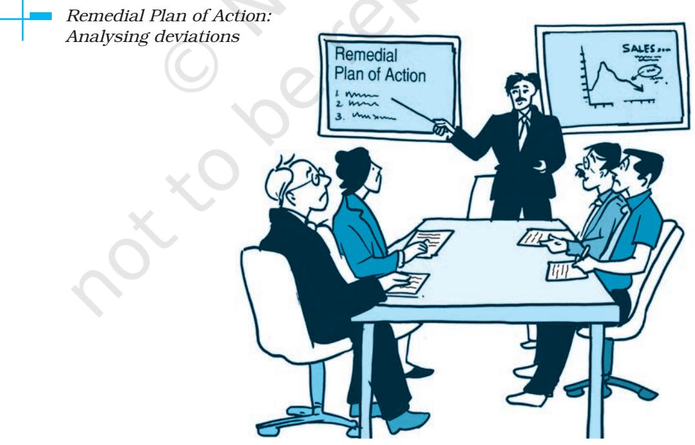

# **CONTROLLING**

#### **Departure Control Systems (DCS)**

A Departure Control System (DCS) automates processing an airlines airport management operations which includes managing the informant required for airport check-in, printing boarding pass, baggage acceptance, boarding load control and aircraft checks. Today almost 98% of DCS manage e-ticket using interface from a number of devices including check-in kiosks, online check-in, mobile boarding pass and baggage handling. DCS are able to identify and capture updated reservations from an airline computer reservation system for passengers called passenger name record (PNR). A DCS is used to update reservations typically as ckecked-in, boarded, and flown or another status. Additionally and increasingly a DCS or some city fare sectors may also interface with immigration control for visa, immigration and passenger no fly watch list.

L E A R N I N G OBJECTIVES

After studying this chapter, you should be able to:

- n Explain the meaning of controlling;
- n State the importance of controlling;
- n Describe the relationship between planning and controlling;
- n Explain the steps in the process of controlling; and
- n Describe the techniques of controlling.

It is quite clear from the example that all managers need to manage situations intelligently and take corrective action before any damage is done to the business. Controlling function of management comes to the rescue of a manager here. It not only helps in keeping a track on the progress of activities but also ensures that activities conform to the standards set in advance so that organisational goals are achieved.

# **Meaning of Controlling**

Controlling is one of the important functions of a manager. In order to seek planned results from the subordinates, a manager needs to exercise effective control over the activities of the subordinates. In other

Ch_08.indd 201 08-08-2022 16:39:15

words, controlling means ensuring that activities in an organisation are performed as per the plans. Controlling also ensures that an organisation's resources are being used effectively and efficiently for the achievement of predetermined goals. Controlling is, thus, a goal-oriented function.

Controlling function of a manager is a pervasive function. It is a primary function of every manager. Managers at all levels of management—top, middle and lower-need to perform controlling functions to keep a control over activities in their areas. Moreover, controlling is as much required in an educational institution, military, hospital, and a club as in any business organisation.

Controlling should not be misunderstood as the last function of management. It is a function that brings back the management cycle back to the planning function. The controlling function finds out how far actual performance deviates from standards, analyses the causes of such deviations and attempts to take corrective actions based on the same. This process helps in formulation of future plans in the light of the problems that were identified and, thus, helps in better planning in the future periods. Thus, controlling only completes one cycle of management process and improves planning in the next cycle.

# **Importance of Controlling**

Control is an indispensable function of management. Without control the best of plans can go awry. A good control system helps an organisation in the following ways:

- (i) **Accomplishing organisational goals:** The controlling function measures progress towards the organisational goals and brings to light the deviations, if any, and indicates corrective action. It, thus, guides the organisation and keeps it on the right track so that organisational goals might be achieved.
- (ii) **Judging accuracy of standards:**  A good control system enables management to verify whether the standards set are accurate and objective. An efficient control system keeps a careful check on the changes taking place in the organisation and in the environment and helps to review and revise the standards in light of such changes.

Managerial Control implies the measurement of accomplishment against the standard and the correction of deviations to assure attainment of objectives according to plans.

*Koontz and O' Donnel*

Ch_08.indd 202 08-08-2022 16:39:15

- (iii) **Mak ing e f f ic ient use o f resources:** By exercising control, a manager seeks to reduce wastage and spoilage of resources. Each activity is performed in accordance with predetermined standards and norms. This ensures that resources are used in the most effective and efficient manner.
- (iv) **Improving employee motivation:**  A good control system ensures that employees know well in advance what they are expected to do and what are the standards of performance on the basis of which they will be appraised. It, thus, motivates them and helps them to give better performance.
- (v) **Ensuring order and discipline:** Controlling creates an atmosphere of order and discipline in the organisation. It helps to minimise dishonest behaviour on the part of the employees by keeping a close check on their activities.

The box explains how an importexport company was able to track dishonest employees by using computer monitoring as a part of their control system.

- (vi) **Facilitating coordination in action:** Controlling provides direction to all activities and efforts for achieving organisational goals. Each department and employee is governed by predetermined standards which are well coordinated with one another. This ensures that overall organisational objectives are accomplished.
### **Limitations of Controlling**

Although controlling is an important function of management, it suffers from the following limitations.

- (i) **Difficulty in setting quantitative standards:** Control system loses some of its effectiveness when standards cannot be defined in
#### **Control Through Computer Monitoring**

Managers at a New York City import-export company suspected that two employees were robbing it. Corporate Defense Strategies (CDS) of Maywood, New Jersey, advised the firm to install a software program that could secretly log every single stroke of the suspects' computer keys and send an encrypted e-mail report to CDS. Investigators revealed that the two employees were deleting orders from the corporate books after processing them, pocketing the revenues, and building their own company from within. The programme picked up on their plan to return to the office late one night to steal a large shipment of electronics. Police hid in the rafters of the firm's warehouse, and when the suspects entered, they were arrested. The pair was charged with embezzling $3 million over two and a half years, a sizable amount of revenue for a $25 million-a-year firm.

> *Source: Hellriegel Don, Susan E. Jackson and John W. Slocum Jr., Management: A Competency-based Approach*

Ch_08.indd 203 08-08-2022 16:39:15

quantitative terms. This makes measurement of performance and their comparison with standards a difficult task. Employee morale, job satisfaction and human behaviour are such areas where this problem might arise.

- (ii) **Little control on external factors:** Generally an enterprise cannot control external factors such as government policies, t e c h n o l o g i c a l c h a n g e s , competition etc.
- (iii) **Resistance from employees:**  Control is often resisted by employees. They see it as a restriction on their freedom. For instance, employees might object when they are kept under

a strict watch with the help of Closed Circuit Televisions (CCTVs).

- (iv) **Costly affair:** Control is a costly affair as it involves a lot of expenditure, time and effort. A small enterprise cannot afford to install an expensive control system. It cannot justify the expenses involved. Managers must ensure that the costs of installing and operating a control system should not exceed the benefits derived from it.
The box on Control System at FedEx gives an overview of the control system used by FedEx and how it helped FedEx to increase its profits.

Ch_08.indd 204 08-08-2022 16:39:16

# **Relationship between Planning and Controlling**

Planning and controlling are inseparable twins of management. A system of control presupposes the existence of certain standards. These standards of performance which serve as the basis of controlling are provided by planning. Once a plan becomes operational, controlling is necessary to monitor the progress, measure it, discover deviations and initiate corrective measures to ensure that events conform to plans. Thus, planning without controlling is meaningless. Similarly, controlling is blind without planning. If the standards are not set in advance, managers have nothing to control. When there is no plan, there is no basis of controlling.

Planning is clearly a prerequisite for controlling. It is utterly foolish to think that controlling could be accomplished without planning. Without planning there is no predetermined understanding of the desired performance. Planning seeks consistent, integrated and articulated programmes while controlling seeks to compel events to conform to plans.

Planning is basically an intellectual process involving thinking, articulation and analysis to discover and prescribe an appropriate course of action for achieving objectives. Controlling, on the other hand, checks whether decisions have been translated into desired action. Planning is thus, prescriptive whereas, controlling is evaluative.

It is often said that planning is looking ahead while controlling is looking back. However, the statement is only partially correct. Plans are prepared for future and are based on forecasts about future conditions. Therefore, planning involves looking ahead and is called a forward-looking function. On the contrary, controlling is like a postmortem of past activities to find out deviations from the standards. In that sense, controlling is a backwardlooking function. However, it should be understood that planning is guided by past experiences and the corrective action initiated by control function aims to improve future performance. Thus, planning and controlling are both backward-looking as well as a forward-looking function.

Thus, planning and controlling are interrelated and, in fact, reinforce each other in the sense that

- 1. Planning based on facts makes controlling easier and effective; and
- 2. Controlling improves future planning by providing information derived from past experience.

# **Controlling Process**

Controlling is a systematic process involving the following steps.

- 1. Setting performance standards
- 2. Measurement of actual performance

Ch_08.indd 205 08-08-2022 16:39:16

- 3. Comparison of actual performance with standards
- 4. Analysing deviations
- 5. Taking corrective action

**Step 1:** *Setting Performance Standards:* The first step in the controlling process is setting up of performance standards. Standards are the criteria against which actual performance would be measured. Thus, standards serve as benchmarks towards which an organisation strives to work.

Standards can be set in both quantitative as well as qualitative terms. For instance, standards set in terms of cost to be incurred, revenue to be earned, product units to be produced and sold, time to be spent in performing a task, all represents quantitative standards. Sometimes standards may also be set in qualitative terms. Improving goodwill and motivation level of employees are examples of qualitative standards. The table in the next page gives a glimpse of standards used in different functional areas of business to gauge performance.

At the time of setting standards, a manager should try to set standards in precise quantitative terms as this would make their comparison with actual performance much easier. For instance, reduction of defects from 10 in every 1,000 pieces produced to 5 in every 1,000 pieces produced by the end of the quarter. However, whenever qualitative standards are set, an effort must be made to define them in a manner that would make their measurement easier. For instance, for improving customer satisfaction in a fast food chain having self-service, standards can be set in terms of time taken by a customer to wait for a table, time taken by him to place the order and time taken to collect the order.

It is important that standards should be flexible enough to be modified whenever required. Due to changes taking place in the internal and external business environment, standards may need some modification to be realistic in the changed business environment.

**Step 2:** *Measurement of Actual Performance:* Once performance standards are set, the next step is measurement of actual performance. Performance should be measured in an objective and reliable manner. There are several techniques for measurement of performance. These include personal observation, sample checking, performance reports, etc. As far as possible, performance should be measured in the same units in which standards are set as this would make their comparison easier.

It is generally believed that measurement should be done after the task is completed. However, wherever possible, measurement of work should be done during the performance. For instance, in case of assembling task, each part produced

Ch_08.indd 206 08-08-2022 16:39:16

should be checked before assembling. Similarly, in a manufacturing plant, levels of gas particles in the air could be continuously monitored for safety.

Measurement of performance of an employee may require preparation of performance report by his superior. Measurement of a company's performance may involve calculation of certain ratios like gross profit ratio, net profit ratio, return on investment, etc., at periodic intervals. Progress of work in certain operating areas like marketing may be measured by considering the number of units sold, increase in market share, etc., whereas, efficiency of production may be measured by counting the number of pieces produced and number of defective pieces in a batch. In small organisations, each piece produced may be checked to ensure that it conforms to quality specifications laid down for the product. However, this might not be possible in a large organisation. Thus, in large organisations, certain pieces are checked at random for quality. This is known as sample checking.

**Step 3:** *Comparing Actual Performance with Standards:* This step involves comparison of actual performance with the standard. Such comparison will reveal the deviation between actual and desired results. Comparison becomes easier when standards are set in quantitative terms. For instance, performance of a worker in terms of units produced in a week can be easily measured against the standard output for the week.

**Step 4:** *Analysing Deviations:*  Some deviation in performance can be expected in all activities. It is, therefore, important to determine the acceptable range of deviations. Also, deviations in key areas of business need to be attended more urgently as compared to deviations in certain insignificant areas. Critical point

| Production | Marketing | Human Resource | Finance and |
| --- | --- | --- | --- |
|  |  | Management | Accounting |
| Quantity | Sales volume | Labour relations | Capital expenditures |
| Quality | Sales expense | Labour turnover | Inventories |
| Cost | Advertising expenditures | Labour absenteeism | Flow of capital |
| Individual job | Individual |  | Liquidity |
| Performance | Sales-person's performance |  |  |

#### **Standards used in Functional Areas to Gauge Performance**

Ch_08.indd 207 08-08-2022 16:39:16

control and management by exception should be used by a manager in this regard.

- 1. *Critical Point Control:* It is neither economical nor easy to keep a check on each and every activity in an organisation. Control should, therefore, focus on key result areas (KRAs) which are critical to the success of an organisation. These KRAs are set as the critical points. If anything goes wrong at the critical points, the entire organisation suffers. For instance, in a manufacturing organisation, an increase of 5 per cent in the labour cost may be more troublesome than a 15 per cent increase in postal charges.
- 2. *Management by Exception:*  Management by exception, which is often referred to as control by exception, is an important principle of management control based on the belief that an attempt to control everything results in controlling nothing. Thus, only

significant deviations which go beyond the permissible limit should be brought to the notice of management. Thus, if the plans lay down 2 per cent increase in labour cost as an acceptable range of deviation in a manufacturing organisation, only increase in labour cost beyond 2 per cent should be brought to the notice of the management. However, in case of major deviation from the standard (say, 5 per cent), the matter has to receive immediate action of management on a priority basis.

The box below highlights the advantages of critical point control and management by exception.

After identifying the deviations that demand managerial attention, these deviations need to be analysed for their causes. Deviations may have multiple causes for their origin. These include unrealistic standards, defective process, inadequacy of resources, structural drawbacks, organisational constraints and environmental factors

#### **Advantages of Critical Point Control and Management by Exception**

When a manager sets critical points and focuses attention on significant deviations which cross the permissible limit, the following advantages accrue:

- 1. It saves the time and efforts of managers as they deal with only significant deviations.
- 2. It focuses managerial attention on important areas. Thus, there is better utilisation of managerial talent.
- 3. The routine problems are left to the subordinates. Management by exception, thus, facilitates delegation of authority and increases morale of the employees.
- 4. It identifies critical problems which need timely action to keep the organisation in right track.

Ch_08.indd 208 08-08-2022 16:39:16

beyond the control of the organisation. It is necessary to identify the exact cause(s) of deviations, failing which, an appropriate corrective action might not be possible. The deviations and their causes are then reported and corrective action taken at appropriate level.

**Step 5:** *Taking Corrective Action:*  The final step in the controlling process is taking corrective action. No corrective action is required when the deviations are within acceptable limits. However, when the deviations go beyond the acceptable range, especially in the important areas, it demands immediate managerial attention so that deviations do not occur again and standards are accomplished.

Corrective action might involve training of employees if the production target could not be met. Similarly, if an important project is running behind schedule, corrective action might involve assigning of additional workers and equipment to the project and permission for overtime work. In case the deviation cannot be corrected through managerial action, the standards may have to be revised. The table below cites some of the causes of deviations and the respective corrective action that might be taken by a manager.

The information in the box in next page gives an account of how Saco Defense was able to control a crisis situation.

Ch_08.indd 209 08-08-2022 16:39:18

#### **Key Terms**

Controlling Critical point control Management by exception

Breakeven analysis Budgetary control Return on investment

Ratio analysis Responsibility accounting Management audit

PERT and CPM Management Information system

#### **Summary**

- n Controlling is the process of ensuring that actual activities conform to planned activities.
- n The importance of managerial control lies in the fact that it helps in accomplishing organisational goals. Controlling also helps in judging accuracy of standards, ensuring efficient utilization of resources, boosting employee morale, creating an atmosphere of order and discipline in the organisation and coordinating different activities so that they all work together in one direction to meet targets.
- n Controlling suffers from certain limitations also. An organisation has no control over external factors. The control system of an organisation may face resistance from its employees. Sometimes controlling turns out to be a costly affair, especially in case of small organisations. Moreover, it is not always possible for the management to set quantitative standards of performance in the absence of which controlling exercise loses some of its effectiveness.
- n The process of control involves setting performance standards, measurement of actual performance, comparison of actual performance with standards, analysis of deviations and taking corrective action.
- n Planning and controlling are inseparable twins of management. Planning initiates the process of management and controlling completes the process. Plans are the basis of control and without control the best laid plans may go astray.
- n Personal observation, statistical reports, breakeven analysis and budgetary control are traditional techniques of managerial control.
- n Return on investment, ratio analysis, responsibility accounting, management audit, PERT and CPM and Management Information System are modern techniques of managerial control.

Ch_08.indd 210 08-08-2022 16:39:18

#### **Exercises**

#### **Very Short Answer Type**

- 1. State the meaning of controlling.
- 2. Name the principle that a manager should consider while dealing with deviations effectively. State any one situation in which an organisation's control system loses its effectiveness.
- 3. State any one situation in which an organisation's control system loses is effectiveness.
- 4. Give any two standards that can be used by a company to evaluate the performance of its Finance & Accounting department.
- 5. Which term is used to indicate the difference between standard performance and actual performance?

#### **Short Answer Type**

- 1. 'Planning is looking ahead and controlling is looking back.' Comment.
- 2. 'An effort to control everything may end up in controlling nothing.' Explain.
- 3. Explain how management audit serves as an effective technique of controlling.
- 4. Mr.Arfaaz had been heading the production department of Writewell Products Ltd., a firm manufacturing stationary items. The firm secured an export order that had to be completed on a priority basis and production targets were defined for all the employees. One of the workers, Mr.Bhanu Prasad, fell short of his daily production target by 10 units for two days consecutively. Mr.Arfaaz approached MsVasundhara, the CEO of the Company, to file a complaint against MrBhanu Prasad and requested her to terminate his services. Explain the principle of management control that MsVasundhara should consider while taking her decision. (Hint: Management by exception).

Ch_08.indd 211 08-08-2022 16:39:18

#### **Long Answer Type**

- 1. Explain the various steps involved in the process of control.
- 2. Explain the techniques of managerial control.
- 3. Explain the importance of controlling in an organisation. What are the problems faced by the organisation in implementing an effective control system?
- 4. Discuss the relationship between planning and controlling.
- 5. A company 'M' limited is manufacturing mobile phones both for domestic Indian market as well as for export. It had enjoyed a substantial market share and also had a loyal customer following. But lately it has been experiencing problems because its targets have not been met with regard to sales and customer satisfaction. Also mobile market in India has grown tremendously and new players have come with better technology and pricing. This is causing problems for the company. It is planning to revamp its controlling system and take other steps necessary to rectify the problems it is facing.
	- a. Identify the benefits the company will derive from a good control system.
	- b. How can the company relate its planning with control in this line of business to ensure that its plans are actually implemented and targets attained.
	- c. Give the steps in the control process that the company should follow to remove the problems it is facing
- 6. Mr Shantanu is a chief manager of a reputed company that manufactures garments. He called the production manager and instructed him to keep a constant and continuous check on all the activities related to his department so that everything goes as per the set plan. He also suggested him to keep a track of the performance of all the employees in the organisation so that targets are achieved effectively and efficiently.
	- a. Describe any two features of Controlling highlighted in the above situation.(Goal Oriented, continuous and pervasive – any 2).
	- b. Explain any four points of importance of Controlling.

Ch_08.indd 212 08-08-2022 16:39:18

Ch_08.indd 213 08-08-2022 16:39:18

Ch_08.indd 214 08-08-2022 16:39:18

