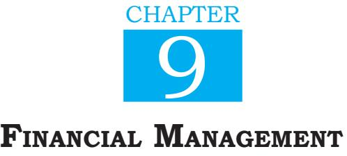
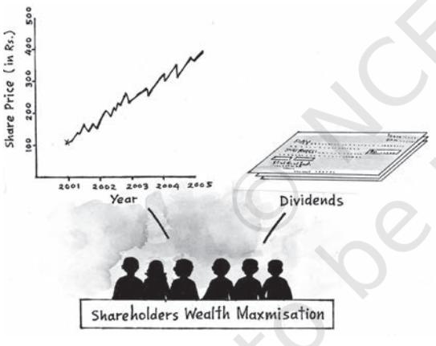
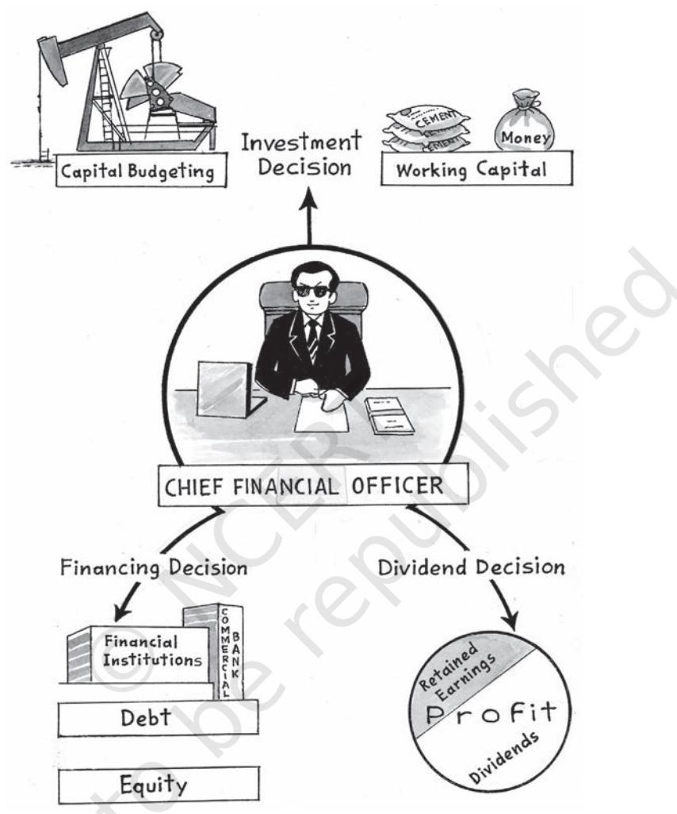

## **Learning Objectives**

After studying this chapter, you should be able to:

- ¾ explain the meaning of business finance;
- ¾ describe financi a l management;
- ¾ explain the role of financial management in our enterprise;
- ¾ discuss objectives of financial management and how they could be achieved;
- ¾ explain the meaning and importance of financial planning;
- ¾ state the meaning of capital structure;
- ¾ analyse the factors affecting the choice of an appropriate capital structure;
- ¾ state meaning of fixed capital and working capital; and
- ¾ analyse the factors affecting the requirement of fixed and working capital.

# **When Tata Steel Acquired Corus**

Tata Steel, the biggest steel producer in the Indian private sector has acquired Corus, (formerly known as British Steel) in a deal worth $8.6 billion in 2007. A financial decision of this magnitude has significant implicitness for both Tata Steel and Corus as well as their employees and shareholders. To mention some of them:

- � Tata Steel raised a debt of over $8 billion to finance the transaction. The deal will be paid for by Tata Steel UK, a special purpose vehicle (SPV) set up for the purpose. Another company of the Tata group, Tata Sons Ltd., invested $ 1 billion dollars for preference shares along with Tata Steel which will invest an equal amount.
- � Tata Steel, the acquirer company, arranged about 36,500 crores of rupees to finance the take-over.
- � Tata Steel raised this amount through debt or equity or a combination of both. Some amount came from internal accruals also. This financing decision affected the capital structure of the acquirer.

#### *Source: The Economic Times*

Ch_9.indd 215 2/6/2024 09:51:33 AM


216

#### Introduction

In the above case, these decisions require careful financial planning, an understanding of the resultant capital structure and the riskiness and profitability of the enterprise. All these have a bearing on shareholders as well as employees. They require an understanding of business finance, major financial decision areas, financial risk, and working capital requirements of the business. Finance, as we all know, is essential for running a business. Success of business depends on how well finance is invested in assets and operations and how timely and cheaply the finances are arranged, from outside or from within the business.

## Meaning of Business Finance

Money required for carrying out business activities is called business finance. Almost all business activities require some finance. Finance is needed to establish a business, to run it, to modernise it, to expand, or diversify it. It is required for buying a variety of assets, which may be tangible like machinery, factories, buildings, offices; or intangible such as trademarks, patents, technical expertise, etc. Also, finance is central to running the day-to-day operations of business, like buying material, paying bills, salaries, collecting cash from customers, etc. needed at every stage in the life of a business entity. Availability of adequate finance is, thus, very crucial for the survival and growth of a business.

Financial Managements

217

# Financial Management

All finance comes at some cost. It is quite imperative that it needs to be carefully managed. Financial Management is concerned with optimal procurement as well as the usage of finance. For optimal procurement, different available sources of finance are identified and compared in terms of their costs and associated risks. Similarly, the finance so procured needs to be invested in a manner that the returns from the investment exceed the cost at which procurement has taken place. Financial Management aims at reducing the cost of funds procured, keeping the risk under control and achieving effective deployment of such funds. It also aims at ensuring availability of enough funds whenever required as well as avoiding idle finance. Needless to emphasise, the future of a business depends a great deal on the quality of its financial management.

*Importance:* The role of financial management cannot be overemphasised, since it has a direct bearing on the financial health of a business. The financial statements, such as Balance Sheet and Profit and Loss Account, reflect a firm's financial position and its financial health. Almost all items in the financial statements of a business are affected directly or indirectly through some financial management decisions. Some

Ch_9.indd 216 10-08-2022 09:09:51

prominent examples of the aspects being affected could be as under:

BUSINESS STUDIES

216

- (i) *The size* and *the composition of fixed assets of the business:* For example, a capital budgeting decision to invest a sum of Rs. 100 crores in fixed assets would raise the size of fixed assets block by this amount.
- (ii) *The quantum of current assets and its break-up into cash, inventory and receivables:* With an increase in the investment in fixed assets, there is a commensurate increase in the working capital requirement. The quantum of current assets is also influenced by financial management decisions. In addition, decisions about credit and inventory management affect the amount of debtors and inventory which in turn affect the total current assets as well as their composition.
- (iii) *The amount of long-term and short- term funds to be used:* Financial management, among others, involves decision about the proportion of long-term and short-term funds. An organisation wanting to have more liquid assets would raise relatively more amount on a long-term basis. There is a choice between liquidity and profitability. The underlying assumption here is that current liabilities cost less than long term liabilities.
- (iv) *Break-up of long-term financing into debt, equity etc:* Of the total longterm finance, the proportions to be

raised by way of debt and/or equity is also a financial management decision. The amounts of debt, equity share capital, preference share capital are affected by the financing decision, which is a part of financing management.

- (v) *All items in the Profit and Loss Account, e.g., Interest, Expense, Depreciation, etc. :* Higher amount of debt means higher interest expense in future. Similarly, use of higher equity may entail higher payment of dividends. Similarly, an expansion of business which is a result of capital budgeting decision is likely to affect virtually all items in the profit and loss account of the business.
It can, thus, be stated that the financial statements of a business are largely determined by financial management decisions taken earlier. Similarly, the future financial statements would depend upon past as well as current financial decisions. Thus, the overall financial health of a business is determined by the quality of its financial management. Good financial management aims at mobilisation of financial resources at a lower cost and deployment of these in most lucrative activities.

## Objectives

The primary aim of financial management is to maximise shareholders' wealth, which is referred to as the wealth-maximisation concept. The market price of a company's shares

Ch_9.indd 217 10-08-2022 09:09:51

BUSINESS STUDIES

218

is linked to the three basic financial decisions which you will study a little later. This is because a company funds belong to the shareholders and the manner in which they are invested and the return earned by them determines their market value and price. It means maximisation of the market value of equity shares. The market price of equity share increases, if the benefit from a decision exceeds the cost involved. All financial decisions aim at ensuring that each decision is efficient and adds some value. Such value additions tend to increase the market price of shares. Therefore, those financial decisions are taken which will ultimately prove gainful from the point of view of the shareholders. The shareholders gain if the value of shares in the market increases. Those decisions which result in decline in the share price are poor financial decisions. Thus, we can say, the objective of financial management is to maximise the current price of equity shares of the company or to maximise the wealth of owners of the company, that is, the shareholders.

Therefore, when a decision is taken about investment in a new machine, the aim of financial management is to ensure that benefits from the investment exceed the cost so that some value addition takes place. Similarly, when finance is procured, the aim is to reduce the cost so that the value addition is even higher.

In fact, in all financial decisions, major or minor, the ultimate objective that guides the decision-maker is that some value addition should take place. All those avenues of investment, modes of financing, ways of handling various components of working capital must be identified which will ultimately lead to an increase in the price of equity share. It can happen through efficient decision-making. Decision-making is efficient if, out of the various available alternatives, the best is selected.

Financial Managements

219

## Financial Decisions

Financial management is concerned with the solution of three major issues relating to the financial operations of a firm corresponding to the three questions of investment, financing and divident decision. In a financial context, it means the selection of best financing alternative or best investment alternative. The finance function, therefore, is concerned with three broad decisions which are explained below:

#### Investment Decision

A firm's resources are scarce in comparison to the uses to which they can be put. A firm, therefore, has to choose where to invest these resources, so that they are able to earn the highest possible return for their investors. The investment decision, therefore, relates to how the firm's funds are invested in different assets.

Investment decision can be longterm or short-term. A long-term investment decision is also called a Capital Budgeting decision. It involves committing the finance on a long-

Ch_9.indd 218 10-08-2022 09:09:51

term basis. For example, making investment in a new machine to replace an existing one or acquiring a new fixed asset or opening a new branch, etc. These decisions are very crucial for any business since they affect its earning capacity in the long run. The size of assets, profitability and competitiveness are all affected by capital budgeting decisions. Moreover, these decisions normally involve huge amounts of investment and are irreversible except at a huge cost. Therefore, once made, it is often almost impossible for a business to wriggle out of such decisions. Therefore, they need to be taken with utmost care. These

BUSINESS STUDIES

218



*Wealth Maximisation Concept*

decisions must be taken by those who understand them comprehensively. A bad capital budgeting decision normally has the capacity to severely damage the financial fortune of a business. *Short-term* investment decisions (also called working capital decisions) are concerned with the decisions about the levels of cash, inventory and receivables. These decisions affect the day-to-day working of a business. These affect the liquidity as well as profitability of a business. Efficient cash management, inventory management and receivables management are essential ingredients of sound working capital management.

## *Factors affecting Capital Budgeting Decision*

A number of projects are often available to a business to invest in. But each project has to be evaluated carefully and, depending upon the returns, a particular project is either selected or rejected. If there is only one project, its viability in terms of the rate of return, viz., investment and its comparability with the industry's average is seen. There are certain factors which affect capital budgeting decisions.

- *(a) Cash flows of the project:* When a company takes an investment decision involving huge amount it expects to generate some cash flows over a period. These cash flows are in the form of a series of cash receipts and payments over the life of an investment. The amount of these cash flows should be carefully analysed before considering a capital budgeting decision.
- *(b) The rate of return:* The most important criterion is the rate of return of the project. These calculations are based on the

Ch_9.indd 219 10-08-2022 09:09:51

BUSINESS STUDIES

expected returns from each proposal and the assessment of the risk involved. Suppose, there are two projects, A and B (with the same risk involved), with a rate of return of 10 per cent and 12 per cent, respectively, then under normal circumstance, project B should be selected.

- (c) *The investment criteria involved:*  The decision to invest in a particular project involves a number of calculations regarding the amount of investment, interest rate, cash flows and rate of return. There are different techniques to evaluate investment proposals which are known as capital budgeting techniques. These techniques are applied to each proposal before selecting a particular project.
#### Financing Decision

This decision is about the quantum of finance to be raised from various long-term sources. Short-term sources are studied under the 'working capital management'.

It involves identification of various available sources. The main sources of funds for a firm are shareholders' funds and borrowed funds. The shareholders' funds refer to the equity capital and the retained earnings. Borrowed funds refer to the finance raised through debentures or other forms of debt. A firm has to decide the proportion of funds to be raised from either sources, based on their basic characteristics. Interest on borrowed funds have to be paid regardless of whether or not a firm has earned a profit. Likewise, the borrowed funds have to be repaid at a fixed time. The risk of default on payment is known as financial risk which has to be considered by a firm likely to have insufficient shareholders to make these fixed payments. Shareholders' funds, on the other hand, involve no commitment regarding the payment of returns or the repayment of capital. A firm, therefore, needs to have a judicious mix of both debt and equity in making financing decisions, which may be debt, equity, preference share capital, and retained earnings.

Financial Managements

221

The cost of each type of finance has to be estimated. Some sources may be cheaper than others. For example, debt is considered to be the cheapest of all the sources, tax deductibility of interest makes it still cheaper. Associated risk is also different for each source, e.g., it is necessary to pay interest on debt and redeem the principal amount on maturity. There is no such compulsion to pay any dividend on equity shares. Thus, there is some amount of financial risk in debt financing. The overall financial risk depends upon the proportion of debt in the total capital. The fund raising exercise also costs something. This cost is called floatation cost. It also must be considered while evaluating different sources. Financing decision is, thus, concerned with the decisions about how much to be raised from which source. This decision determines the overall cost of capital and the financial risk of the enterprise.

Ch_9.indd 220 10-08-2022 09:09:51



*Financial Decisions*

## *Factors Affecting Financing Decisions*

BUSINESS STUDIES

220

The financing decisions are affected by various factors. Important among them are as follows:

- *(a) Cost:* The cost of raising funds through different sources are
different. A prudent financial manager would normally opt for a source which is the cheapest.

- (b) *Risk:* The risk associated with each of the sources is different.
- *(c) Floatation Costs:* Higher the floatation cost, less attractive the source.

Ch_9.indd 221 10-08-2022 09:09:52

BUSINESS  STUDIES

#### 222

- *(d) Cash Flow Position of the Company:* A stronger cash flow position may make debt financing more viable than funding through equity.
- *(e) Fixed Operating Costs:* If a business has high fixed operating costs (e.g., building rent, Insurance premium, Salaries, etc.), It must reduce fixed financing costs. Hence, lower debt financing is better. Similarly, if fixed operating cost is less, more of debt financing may be preferred.
- *(f) Control Considerations:* Issues of more equity may lead to dilution of management's control over the business. Debt financing has no such implication. Companies afraid of a takeover bid would prefer debt to equity.
- *(g) State of Capital Market:* Health of the capital market may also affect the choice of source of fund. During the period when stock market is rising, more people invest in equity. However, depressed capital market may make issue of equity shares difficult for any company.

## **Dividend Decision**

The third important decision that every financial manager has to take relates to the distribution of dividend. Dividend is that portion of profit which is distributed to shareholders. The decision involved here is how much of the profit earned by company (after paying tax) is to be distributed to the shareholders and how much of it should be retained in the business. While the dividend constitutes the current income re-investment as retained earning increases the firm's future earning capacity. The extent of retained earnings also influences the financing decision of the firm. Since the firm does not require funds to the extent of re-invested retained earnings, the decision regarding dividend should be taken keeping in view the overall objective of maximising shareholder's wealth.

Financial Managements

223

## *Factors Affecting Dividend Decision*

How much of the profits earned by a company will be distributed as profit and how much will be retained in the business is affected by many factors. Some of the important factors are discussed as follows:

- *(a) Amount of Earnings:* Dividends are paid out of current and past earning. Therefore, earnings is a major determinant of the decision about dividend.
- *(b) Stability Earnings:* Other things remaining the same, a company having stable earning is in a better position to declare higher dividends. As against this, a company having unstable earnings is likely to pay smaller dividend.
- *(c) Stability of Dividends:* Companies generally follow a policy of stabilising dividend per share. The increase in dividends is generally made when there is confidence that

Ch_9.indd 222 1/23/2024 03:51:22 PM

their earning potential has gone up and not just the earnings of the current year. In other words, dividend per share is not altered if the change in earnings is small or seen to be temporary in nature.

BUSINESS  STUDIES

222

- *(d) Growth Opportunities:* Companies having good growth opportunities retain more money out of their earnings so as to finance the required investment. The dividend in growth companies is, therefore, smaller, than that in the non– growth companies.
- *(e) Cash Flow Position:* The payment of dividend involves an outflow of cash. A company may be earning profit but may be short on cash. Availability of enough cash in the company is necessary for declaration of dividend.
- *(f) Shareholders' Preference:* While declaring dividends, managements must keep in mind the preferences of the shareholders in this regard. If the shareholders in general desire that at least a certain amount is paid as dividend, the companies are likely to declare the same. There are always some shareholders who depend upon a regular income from their investments.
- *(g) Taxation Policy:* The choice between the payment of dividend and retaining the earnings is, to some extent, affected by the difference in the tax treatment of dividends and capital gains. If tax on dividend is higher, it is better to pay less by

way of dividends. As compared to this, higher dividends may be declared if tax rates are relatively lower. Though the dividends are free of tax in the hands of shareholders, a dividend distribution tax is levied on companies. Thus, under the present tax policy, shareholders are likely to prefer higher dividends.

- *(h) Stock Market Reaction:* Investors, in general, view an increase in dividend as a good news and stock prices react positively to it. Similarly, a decrease in dividend may have a negative impact on the share prices in the stock market. Thus, the possible impact of dividend policy on the equity share price is one of the important factors considered by the management while taking a decision about it.
- *(i) Access to Capital Market:* Large and reputed companies generally have easy access to the capital market and, therefore, may depend less on retained earning to finance their growth. These companies tend to pay higher dividends than the smaller companies which have relatively low access to the market.
- *(j) Legal Constraints:* Certain provisions of the Companies Act place restrictions on payouts as dividend. Such provisions must be adhered to while declaring the dividend.
- *(k) Contractual Constraints:* While granting loans to a company, sometimes the lender may impose

Ch_9.indd 223 1/23/2024 03:51:22 PM

#### 224

certain restrictions on the payment of dividends in future. The companies are required to ensure that the dividend does not violate the terms of the loan agreement in this regard.

## **Financial Planning**

Financial planning is essentially the preparation of a financial blueprint of an organisation's future operations. The objective of financial planning is to ensure that enough funds are available at right time. If adequate funds are not available the firm will not be able to honour its commitments and carry out its plans. On the other hand, if excess funds are available, it will unnecessarily add to the cost and may encourage wasteful expenditure. It must be kept in mind that financial planning is not equivalent to, or a substitute for, financial management. Financial management aims at choosing the best investment and financing alternatives by focusing on their costs and benefits. Its objective is to increase the shareholders' wealth. Financial planning on the other hand aims at smooth operations by focusing on fund requirements and their availability in the light of financial decisions. For example, if a capital budgeting decisions is taken, the operations are likely to be at a higher scale. The amount of expenses and revenues are likely to increase. Financial planning process tries to forecast all the items which are likely to undergo changes. It enables the management to foresee the fund requirements both the quantum as well as the timing. Likely shortage and surpluses are forecast so that necessary activities are taken in advance to meet those situations. Thus, financial planning strives to achieve the following twin objectives.

Financial Managements

225

- *(a) To ensure availability of funds whenever required:* This include a proper estimation of the funds required for different purposes such as for the purchase of longterm assets or to meet day-today expenses of business etc. Apart from this, there is a need to estimate the time at which these funds are to be made available. Financial planning also tries to specify possible sources of these funds.
- *(b) To see that the firm does not raise resources unnecessarily:* Excess funding is almost as bad as inadequate funding. Even if there is some surplus money, good financial planning would put it to the best possible use so that the financial resources are not left idle and don't unnecessarily add to the cost.

Thus, a proper matching of funds requirements and their availability is sought to be achieved by financial planning. This process of estimating the fund requirement of a business and specifying the sources of funds

Ch_9.indd 224 1/23/2024 03:51:22 PM

is called financial planning. Financial planning takes into consideration the growth, performance, investments and requirement of funds for a given period. Financial planning includes both short-term as well as long-term planning. Long-term planning relates to long term growth and investment. It focuses on capital expenditure programmes. Short-term planning covers short-term financial plan called budget.

BUSINESS  STUDIES

224

Typically, financial planning is done for three to five years. For longer periods it becomes more difficult and less useful. Plans made for periods of one year or less are termed as budgets. Budgets are example of financial planning exercise in greater details. They include detailed plan of action for a period of one year or less.

Financial planning usually begins with the preparation of a sales forecast. Let us suppose a company is making a financial plan for the next five years. It will start with an estimate of the sales which are likely to happen in the next five years. Based on these, the financial statements are prepared keeping in mind the requirement of funds for investment in the fixed capital and working capital. Then the expected profits during the period are estimated so that an idea can be made of how much of the fund requirements can be met internally i.e., through retained earnings (after dividend payouts). This results in an estimation of the requirement for external funds. Further, the sources from which the external funds requirement can be met are identified and cash budgets are made, incorporating these factors.

## **Importance**

Financial planning is an important part of overall planning of any business enterprise. It aims at enabling the company to tackle the uncertainty in respect of the availability and timing of the funds and helps in smooth functioning of an organisation. The importance of financial planning can be explained as follows:

- (i) It helps in forecasting what may happen in future under different business situations. By doing so, it helps the firms to face the eventual situation in a better way. In other words, it makes the firm better prepared to face the future. For example, a growth of 20% in sales is predicted. However, it may happen that the growth rate eventually turns out to be 10% or 30%. Many items of expenses shall be different in these three situations. By preparing a blueprint of these three situations the management may decide what must be done in each of these situations. This preparation of alternative financial plans to meet different situations is clearly of immense help in running the business smoothly.
- (ii) It helps in avoiding business shocks and surprises and helps

Ch_9.indd 225 1/23/2024 03:51:22 PM

BUSINESS  STUDIES

#### 226

#### **Cutting Back on Debt**

Even successful businesses have debt, but how much is too much? Learning how to manage debt is what can put you ahead.

Taking on the right amount of debt can mean the difference between a business struggling to survive and one that can respond nimbly to changing economic or market conditions. A number of circumstances may justify acquiring debt. As a general rule, borrowing makes the most sense when you need to bolster cash flow or finance growth or expansion. But while debt can provide the leverage you need to grow, too much debt can strangle your business. So the question is: How much debt is too much?

The answer, experts say, lies in a careful analysis of your cash flow as well as your industry. A business that doesn't grow dies. You've got to grow, but you've got to grow within the financial constraints of your business. What is the ideal capital structure a business needs in its industry to remain viable? The higher the volatility (in your industry), the less debt you should have. The smaller the volatility, the more debt you can afford.

Although banks and other financial institutions look for a satisfactory debt-toequity ratio before agreeing to make a loan, don't assume a creditor's willingness to extend funds is evidence that your business is in a strong debt position. Some financial institutions are overzealous lenders, particularly when trying to lure or hold on to promising business customers. "The bank may be looking more at collateral than whether the (business's) earnings are going to come in to justify the debt service.

To avoid these and other credit pitfalls, it's up to you to get the financial facts on your business and make sound borrowing decisions. Unfortunately, many entrepreneurs fail to recognise how important financial analysis is to running a successful business. Even business owners who receive detailed financial statements from their accountants often do not take advantage of the valuable information contained in the documents.

the company in preparing for the future.

- (iii) If helps in co-ordinating various business functions, e.g., sales and production functions, by providing clear policies and procedures.
- (iv) Detailed plans of action prepared under financial planning reduce waste, duplication of efforts, and gaps in planning.
- (v) It tries to link the present with the future.

- (vi) It provides a link between investment and financing decisions on a continuous basis.
Financial Managements

227

- (vii) By spelling out detailed objectives for various business segments, it makes the evaluation of actual performance easier.
## **Capital Structure**

One of the important decisions under financial management relates to the financing pattern or the proportion of

Ch_9.indd 226 1/23/2024 03:51:22 PM

227

the use of different sources in raising funds. On the basis of ownership, the sources of business finance can be broadly classified into two categories viz., 'owners' funds' and 'borrowed funds'. Owners' funds consist of equity share capital, preference share capital and reserves and surpluses or retained earnings. Borrowed funds can be in the form of loans, debentures, public deposits etc. These may be borrowed from banks, other financial institutions, debentureholders and public.

Capital structure refers to the mix between owners and borrowed funds. These shall be referred as equity and debt in the subsequent text. It can be calculated as debt-equity ratio

i.e.,$\left(\begin{array}{c}\mbox{Debt}\\ \mbox{Equity}\end{array}\right)$ or as the proportion

of debt out of the total capital i.e.,

.

#### Debt Debt + Equity

BUSINESS  STUDIES

226

Debt and equity differ significantly in their cost and riskiness for the firm. The cost of debt is lower than the cost of equity for a firm because the lender's risk is lower than the equity shareholder's risk, since the lender earns an assured return and repayment of capital and, therefore, they should require a lower rate of return. Additionally, interest paid on debt is a deductible expense for computation of tax liability whereas dividends are paid out of after-tax profit. Increased use of debt, therefore, is likely to lower the over-all cost of capital of the firm provided that the cost of equity remains unaffected. Impact of a change in the debt-equity ratio upon the earning per share is dealt with in detail later in this chapter.

Debt is cheaper but is more risky for a business because the payment of interest and the return of principal is obligatory for the business. Any default in meeting these commitments may force the business to go into liquidation. There is no such compulsion in case of equity, which is therefore, considered riskless for the business. Higher use of debt increases the fixed financial charges of a business. As a result, increased use of debt increases the financial risk of a company.

Financial risk is the chance that a firm would fail to meet its payment obligations.

Capital structure of a company, thus, affects both the profitability and the financial risk. A capital structure will be said to be optimal when the proportion of debt and equity is such that it results in an increase in the value of the equity share. In other words, all decisions relating to capital structure should emphasise on increasing the shareholders' wealth.

The proportion of debt in the overall capital is also called financial leverage.

Financial leverage is computed as D E

or D D + E when D is the Debt and E is the Equity. As the financial leverage

Ch_9.indd 227 1/23/2024 03:51:23 PM


228

#### **Example I**

**Company X Ltd.**

| Total Funds used | Rs. 30 Lakh |
| --- | --- |
| Interest rate | 10% p.a. |
| Tax rate | 30% |
| EBIT | Rs. 4 Lakh |
| Debt |  |
| S ituation I N | il |
| Situation II | Rs. 10 Lakh |
| Situation III | Rs. 20 Lakh |

#### **EBIT-EPS Analysis**

|  | Situation I | Situation II | Situation III |
| --- | --- | --- | --- |
| EBIT | 4,00,000 | 4,00,000 | 4,00,000 |
| Interest | NIL | 1,00,000 | 2,00,000 |
| EBT | 4,00,000 | 3,00,000 | 2,00,000 |
| (Earnings before taxes) |  |  |  |
| Tax | 1,20,000 | 90,000 | 60,000 |
| EAT | 2,80,000 | 2,10,000 | 1,40,000 |
| (Earnings after taxes) |  |  |  |
| No. of shares of Rs.10 | 3,00,000 | 2,00,000 | 1,00,000 |
| EPS | 0.93 | 1.05 | 1.40 |
| (Earnings per share) |  |  |  |

increases, the cost of funds declines because of increased use of cheaper debt but the financial risk increases. The impact of financial leverage on the profitability of a business can be seen through EBIT-EPS (Earning before Interest and Taxes-Earning per Share) analysis as in the following example.

Three situations are considered. There is no debt in situation-I i.e. (unlevered business). Debt of Rs. 10 lakh and 20 lakh are assumed in situations-II and III, respectively. All debt is at 10% p.a.

Financial Managements

229

The company earns Rs. 0.93 per share if it is unlevered. With debt of Rs. 10 lakh its EPS is Rs. 1.05. With a still higher debt of Rs. 20 lakh, its, EPS rises to Rs. 1.40. Why is the EPS rising with higher debt? It is because the cost of debt is lower than the return that company is earning on funds employed. The company is earning a Return on Investment (RoI).

Ch_9.indd 228 2/6/2024 11:23:29 AM

of 13.33% EBIT Total Investment × 100 , 4Lakh 30Lakh × 100 . This is higher than the 10% interest it is paying on debt funds. With higher use of debt, this difference between RoI and cost of debt increases the EPS. This is a situation of favourable financial leverage. In such cases, companies often employ more of cheaper debt to enhance the EPS. Such practice is called Trading on Equity.

Trading on Equity refers to the increase in profit earned by the equity shareholders due to the presence of fixed financial charges like interest.

Now consider the following case of Company Y. All details are the same except that the company is earning a profit before interest and taxes of Rs. 2 lakh.

#### **Example II**

BUSINESS  STUDIES

228

**Company Y Ltd.**

| S | ituation I S | ituation II S | ituation III |
| --- | --- | --- | --- |
| EBIT | 2,00,000 | 2,00,000 | 2,00,000 |
| Interest | NIL | 1,00,000 | 2,00,000 |
| EBT | 2,00,000 | 1,00,000 | NIL |
| Tax | 60,000 | 30,000 | NIL |
| EAT | 1,40,000 | 70,000 | NIL |
| No. of shares of Rs.10 | 3,00,000 | 2,00,000 | 1,00,000 |
| EPS | 0.47 | 0.35 | NIL |

In this example, the EPS of the company is falling with increased use of debt. It is because the Company's rate of return on investment (RoI) is less than the cost of debt. The RoI for company Y is 2Lakh 30Lakh ×100 , i.e., 6.67%, whereas the interest rate on debt is 10%. In such cases, the use of debt reduces the EPS. This is a situation of unfavourable financial leverage. Trading on Equity is clearly unadvisable in such a situation.

Even in case of Company X, reckless use of Trading on Equity is not recommended. An increase in debt may enhance the EPS but as pointed out earlier, it also raises the financial risk. Ideally, a company must choose that risk-return combination which maximises shareholders' wealth. The debt-equity mix that achieves it, is the optimum capital structure.

## **Factors affecting the Choice of Capital Structure**

Deciding about the capital structure of a firm involves determining the relative proportion of various types of funds. This depends on various

Ch_9.indd 229 2/6/2024 09:50:37 AM

#### BUSINESS  STUDIES

```
230
```
factors. For example, debt requires regular servicing. Interest payment and repayment of principal are obligatory on a business. In addition a company planning to raise debt must have sufficient cash to meet the increased outflows because of higher debt. Similarly, important factors which determine the choice of capital structure are as follows:

**1. Cash Flow Position:** Size of projected cash flows must be considered before borrowing. Cash flows must not only cover fixed cash payment obligations but there must be sufficient buffer also. It must be kept in mind that a company has cash payment obligations for (i) normal business operations; (ii) for investment in fixed assets; and (iii) for meeting the debt service commitments i.e., payment of interest and repayment of principal.

**2. Interest Coverage Ratio (ICR):**  The interest coverage ratio refers to the number of times earnings before interest and taxes of a company covers the interest obligation. This may be calculated as follows:

$$\mathrm{ICR}={\frac{\mathrm{EBIT}}{\mathrm{Interest}}}$$

The higher the ratio, lower shall be the risk of company failing to meet its interest payment obligations. However, this ratio is not an adequate measure. A firm may have a high EBIT but low cash balance. Apart from interest, repayment obligations are also relevant.

**3. Debt Service Coverage Ratio (DSCR):** Debt Service Coverage Ratio takes care of the deficiencies referred to in the Interest Coverage Ratio (ICR). The cash profits generated by the operations are compared with the total cash required for the service of the debt and the preference share capital. It is calculated as follows:

Financial Managements

231

Profit after tax + Depreciation + Interest + Non Cash exp. Pref. Div + Interest + Repayment obligation

A higher DSCR indicates better ability to meet cash commitments and consequently, the company's potential to increase debt component in its capital structure.

**4. Return on Investment (RoI):** If the RoI of the company is higher, it can choose to use trading on equity to increase its EPS, i.e., its ability to use debt is greater. We have already observed in Example I that a firm can use more debt to increase its EPS. However, in Example II, use of higher debt is reducing the EPS. It is because the firm is earning an RoI of only 6.67% which lower than its cost of debt. In example I the RoI is 13.33%, and trading on equity is profitable. It shows that, RoI is an important determinant of the company's ability to use Trading on equity and thus the capital structure.

**5. Cost of debt:** A firm's ability to borrow at a lower rate increases its capacity to employ higher debt. Thus, more debt can be used if debt can be raised at a lower rate.

Ch_9.indd 230 1/23/2024 03:51:23 PM

**6. Tax Rate:** Since interest is a deductible expense, cost of debt is affected by the tax rate. The firms in our examples are borrowing @ 10%. Since the tax rate is 30%, the after tax cost of debt is only 7%. A higher tax rate, thus, makes debt relatively cheaper and increases its attraction vis-à-vis equity.

BUSINESS  STUDIES

230

**7. Cost of Equity:** Stock owners expect a rate of return from the equity which is commensurate with the risk they are assuming. When a company increases debt, the financial risk faced by the equity holders, increases. Consequently, their desired rate of return may increase. It is for this reason that a company can not use debt beyond a point. If debt is used beyond that point, cost of equity may go up sharply and share price may decrease inspite of increased EPS. Consequently, for maximisation of shareholders' wealth, debt can be used only upto a level.

**8. Floatation Costs:** Process of raising resources also involves some cost. Public issue of shares and debentures requires considerable expenditure. Getting a loan from a financial institution may not cost so much. These considerations may also affect the choice between debt and equity and hence the capital structure.

**9. Risk Consideration:** As discussed earlier, use of debt increases the financial risk of a business. Financial risk refers to a position when a company is unable to meet its fixed financial charges namely interest payment, preference dividend and repayment obligations. Apart from the financial risk, every business has some operating risk (also called business risk). Business risk depends upon fixed operating costs. Higher fixed operating costs result in higher business risk and vice-versa. The total risk depends upon both the business risk and the financial risk. If a firm's business risk is lower, its capacity to use debt is higher and vice-versa.

**10. Flexibility:** If a firm uses its debt potential to the full, it loses flexibility to issue further debt. To maintain flexibility, it must maintain some borrowing power to take care of unforeseen circumstances.

**11. Control:** Debt normally does not cause a dilution of control. A public issue of equity may reduce the managements' holding in the company and make it vulnerable to takeover. This factor also influences the choice between debt and equity especially in companies in which the current holding of management is on a lower side.

**12. Regulatory Framework:** Every company operates within a regulatory framework provided by the law e.g., public issue of shares and debentures have to be made under SEBI guidelines. Raising funds from banks and other financial institutions require fulfillment of other norms. The relative ease with which these norms can, be

Ch_9.indd 231 1/23/2024 03:51:23 PM


#### 232

met or the procedures completed may also have a bearing upon the choice of the source of finance.

**13. Stock Market Conditions:** If the stock markets are bullish, equity shares are more easily sold even at a higher price. Use of equity is often preferred by companies in such a situation. However, during a bearish phase, a company, may find raising of equity capital more difficult and it may opt for debt. Thus, stock market conditions often affect the choice between the two.

**14. Capital Structure of other Companies:** A useful guideline in the capital structure planning is the debtequity ratios of other companies in the same industry. There are usually some industry norms which may help. Care however must be taken that the company does not follow the industry norms blindly. For example, if the business risk of a firm is higher, it can not afford the same financial risk. It should go in for low debt. Thus, the management must know what the industry norms are, whether they are following them or deviating from them and adequate justification must be there in both cases.

## **Fixed and Working Capital**

#### **Meaning**

Every company needs funds to finance its assets and activities. Investment is required to be made in fixed assets and current assets. Fixed assets are those which remains in the business for more than one year, usually for much longer, e.g., plant and machinery, furniture and fixture, land and building, vehicles, etc.

Financial Managements

233

Decision to invest in fixed assets must be taken very carefully as the investment is usually quite large. Such decisions once taken are irrevocable except at a huge loss. Such decisions are called capital budgeting decisions.

Current assets are those assets which, in the normal routine of the business, get converted into cash or cash equivalents within one year, e.g., inventories, debtors, bills receivables, etc.

## **Management of Fixed Capital**

Fixed capital refers to investment in long-term assets. Management of fixed capital involves allocation of firm's capital to different projects or assets with long-term implications for the business. These decisions are called investment decisions or capital budgeting decisions and affect the growth, profitability and risk of the business in the long run. These long-term assets last for more than one year.

It must be financed through long-term sources of capital such as equity or preference shares, debentures, long-term loans and retained earnings of the business. Fixed Assets should never be financed through short-term sources.

Investment in these assets would also include expenditure on

Ch_9.indd 232 1/23/2024 03:51:23 PM

acquisition, expansion, modernisation and their replacement. These decisions include purchase of land, building, plant and machinery, launching a new product line or investing in

advanced techniques of production. Major expenditures such as those on advertising campaign or research and development programme having long term implications for the firm are also examples of capital budgeting decisions. The management of fixed capital or investment or capital budgeting decisions are important for the following reasons:

BUSINESS  STUDIES

232

- *(i) Long-term growth:* These decisions have bearing on the long-term growth. The funds invested in long-term assets are likely to yield returns in the future. These will affect the future prospects of the business.
- *(ii) Large amount of funds involved:* These decisions result in a substantial portion of capital funds being blocked in long-term projects. Therefore, these investments are planned after a detailed analysis is undertaken. This may involve decisions like where to procure funds from and at what rate of interest.
- *(iii) Risk involved:* Fixed capital involves investment of huge amounts. It affects the returns of the firm as a whole in the long-term. Therefore, investment decisions involving fixed capital influence the overall business risk complexion of the firm.

#### Financial Managements

- *(iv) Irreversible decisions:* These decisions once taken, are not reversible without incurring heavy losses. Abandoning a project after heavy investment is made is quite costly in terms of waste of funds. Therefore, these decisions should be taken only after carefully evaluating each detail or else the adverse financial consequences may be very heavy.
## **Factors affecting the Requirement of Fixed Capital**

**1. Nature of Business:** The type of business has a bearing upon the fixed capital requirements. For example, a trading concern needs lower investment in fixed assets compared with a manufacturing organisation; since it does not require to purchase plant and machinery, etc.

**2. Scale of Operations:** A larger organisation operating at a higher scale needs bigger plant, more space etc. and therefore, requires higher investment in fixed assets when compared with the small organisation.

**3. Choice of Technique:** Some organisations are capital intensive whereas others are labour intensive. A capital-intensive organisation requires higher investment in plant and machinery as it relies less on manual labour. The requirement of fixed capital for such organisations would be higher. Labour intensive organisations on the other hand

Ch_9.indd 233 1/23/2024 03:51:23 PM


#### 234

require less investment in fixed assets. Hence, their fixed capital requirement is lower.

**4. Technology Upgradation:** In certain industries, assets become obsolete sooner. Consequently, their replacements become due faster. Higher investment in fixed assets may, therefore, be required in such cases. For example, computers become obsolete faster and are replaced much sooner than say, furniture. Thus, such organisations which use assets which are prone to obsolescence require higher fixed capital to purchase such assets.

**5. Growth Prospects:** Higher growth of an organisation generally requires higher investment in fixed assets. Even when such growth is expected, a company may choose to create higher capacity in order to meet the anticipated higher demand quicker. This entails larger investment in fixed assets and consequently larger fixed capital.

**6. Diversification:** A firm may choose to diversify its operations for various reasons, With diversification, fixed capital requirements increase e.g., a textile company is diversifying and starting a cement manufacturing plant. Obviously, its investment in fixed capital will increase.

**7. Financing Alternatives:** A developed financial market may provide leasing facilities as an alternative to outright purchase. When an asset is taken on lease, the firm pays lease rentals and uses it. By doing so, it avoids huge sums required to purchase it. Availability of leasing facilities, thus, may reduce the funds required to be invested in fixed assets, thereby reducing the fixed capital requirements. Such a strategy is specially suitable in high risk lines of business.

Financial Managements

235

**8. Level of Collaboration:** At times, certain business organisations share each other's facilities. For example, a bank may use another's ATM or some of them may jointly establish a particular facility. This is feasible if the scale of operations of each one of them is not sufficient to make full use of the facility. Such collaboration reduces the level of investment in fixed assets for each one of the participating organisations.

## **Working Capital**

Apart from the investment in fixed assets every business organisation needs to invest in current assets. This investment facilitates smooth day-today operations of the business. Current assets are usually more liquid but contribute less to the profits than fixed assets. Examples of current assets, in order of their liquidity, are as under.

- 1. Cash in hand/Cash at Bank
- 2. Marketable securities
- 3. Bills receivable
- 4. Debtors
- 5. Finished goods inventory

Ch_9.indd 234 1/23/2024 03:51:23 PM

- 6. Work in progress
- 7. Raw materials

BUSINESS  STUDIES

234

- 8. Prepaid expenses
These assets, as noted earlier, are expected to get converted into cash or cash equivalents within a period of one year. These provide liquidity to the business. An asset is more liquid if it can be converted into cash quicker and without reduction in value. Insufficient investment in current assets may make it more difficult for an organisation to meet its payment obligations. However, these assets provide little or low return. Hence, a balance needs to be struck between liquidity and profitability.

Current liabilities are those payment obligations which are due for payment within one year; such as bills payable, creditors, outstanding expenses and advances received from customers, etc.

Some part of current assets is usually financed through short-term sources, i.e., current liabilities. The rest is financed through long-term sources and is called net working capital. Thus, NWC = CA – CL (i.e. Current Assets - Current Liabilities.) Thus, net working capital may be defined as the excess of current assets over current liabilities.

# **Factors Affecting the Working Capital Requirements**

**1. Nature of Business:** The basic nature of a business influences the amount of working capital required. A trading organisation usually needs a smaller amount of working capital compared to a manufacturing organisation. This is because there is usually no processing. Therefore, there is no distinction between raw materials and finished goods. Sales can be effected immediately upon the receipt of materials, sometimes even before that. In a manufacturing business, however, raw material needs to be converted into finished goods before any sales become possible. Other factors remaining the same, a trading business requires less working capital. Similarly, service industries which usually do not have to maintain inventory require less working capital.

**2. Scale of Operations:** For organisations which operate on a higher scale of operation, the quantum of inventory and debtors required is generally high. Such organisations, therefore, require large amount of working capital as compared to the organisations which operate on a lower scale.

**3. Business Cycle:** Different phases of business cycles affect the requirement of working capital by a firm. In case of a boom, the sales as well as production are likely to be larger and, therefore, larger amount of working capital is required. As against this, the requirement for working capital will be lower during the period of depression as the sales as well as productionwillbesmall.

Ch_9.indd 235 1/23/2024 03:51:23 PM


<sup>236</sup>

**4. Seasonal Factors:** Most business have some seasonality in their operations. In peak season, because of higher level of activity, larger amount of working capital is required. As against this, the level of activity as well as the requirement for working capital will be lower during the lean season.

**5. Production Cycle:** Production cycle is the time span between the receipt of raw material and their conversion into finished goods. Some businesses have a longer production cycle while some have a shorter one. Duration and the length of production cycle, affects the amount of funds required for raw materials and expenses. Consequently, working capital requirement is higher in firms with longer processing cycle and lower in firms with shorter processing cycle.

**6. Credit Allowed:** Different firms allow different credit terms to their customers. These depend upon the level of competition that a firm faces as well as the credit worthiness of their clientele. A liberal credit policy results in higher amount of debtors, increasing the requirement of working capital.

**7. Credit Availed:** Just as a firm allows credit to its customers it also may get credit from its suppliers. To the extent it avails the credit on purchases, the working capital requirement is reduced.

**8. Operating Efficiency:** Firms manage their operations with varied degrees of efficiency. For example, a firm managing its raw materials efficiently may be able to manage with a smaller balance. This is reflected in a higher inventory turnover ratio. Similarly, a better debtors turnover ratio may be achieved reducing the amount tied up in receivables. Better sales effort may reduce the average time for which finished goods inventory is held. Such efficiencies may reduce the level of raw materials, finished goods and debtors resulting in lower requirement of working capital.

Financial Managements

237

**9. Availability of Raw Material:** If the raw materials and other required materials are available freely and continuously, lower stock levels may suffice. If, however, raw materials do not have a record of un-interrupted availability, higher stock levels may be required. In addition, the time lag between the placement of order and the actual receipt of the materials (also called lead time) is also relevant. Larger the lead time, larger the quantity of material to be stored and larger shall be the amount of working capital required.

**10. Growth Prospects:** If the growth potential of a concern is perceived to be higher, it will require larger amount of working capital so that it is able to meet higher production and sales target whenever required.

**11. Level of Competition:** Higher level of competitiveness may necessitate larger stocks of finished goods to

Ch_9.indd 236 1/23/2024 03:51:23 PM

meet urgent orders from customers. This increases the working capital requirement. Competition may also force the firm to extend liberal credit terms discussed earlier.

**12. Inflation:** With rising prices, larger amounts are required even to maintain a constant volume of production and sales. The working capital requirement of a business thus, become higher with higher rate of inflation. It must, however, be noted that an inflation rate of 5%, does not mean that every component of working capital will change by the same percentage. The actual requirement shall depend upon the rates of price change of different components (e.g., raw material, finished goods, labour cost,) Finished goods as well as their proportion in the total requirement.

# **Key Terms**

BUSINESS  STUDIES

236

Trading on Equity

Financial Management Wealth Maximisation Investment Decision Financing Decision Dividend Decision Capital Budgeting Working Capital Financial Planning Capital Structure

# **Summary**

**Business finance:** The money required for carrying out business activities is called business finance. Almost all business activities require some finance. Finance is needed to establish a business, to run it, to modernise it, to expand, and diversify it.

**Financial Management:** Financial Management is concerned with optimal procurement as well as usage of finance. For optimal procurement, different available sources of finance are identified and compared in terms of their costs and associated risks.

**Objectives and Financial Decisions** The primary aim of financial management is to maximise shareholders' wealth which is referred to as the wealth maximisation concept. The market price of a company's shares are linked to the three basic financial decisions

Financial decision-making is concerned with three broad decisions which are Investment Decision, Financing Decision, Dividend Decision

**Financial Planning and Importance** Financial planning is essentially preparation of a financial blueprint of an organisation's future operations. The

Ch_9.indd 237 1/23/2024 03:51:24 PM

BUSINESS  STUDIES

238

objective of financial planning is to ensure that enough funds are available at right time.

Financial Managements

239

Financial planning strives to achieve the following twin objectives.

- *(a) To ensure availability of funds whenever these are required:*
- *(b) To see that the firm does not raise resources unnecessarily:*

Financial planning is an important part of overall planning of any business enterprise. It aims at enabling the company to tackle the uncertainty in respect of the availability and timing of the funds and helps in smooth functioning of an organisation.

**Capital Structure and Factors** One of the important decisions under financial management relates to the financing pattern or the proportion of the use of different sources in raising funds. On the basis of ownership, the sources of business finance can be broadly classified into two categories viz., 'owners funds' and 'borrowed funds'. Capital structure refers to the mix between owners and borrowed funds.

Deciding about the capital structure of a firm involves determining the relative proportion of various types of funds. This depends on various factors which are: Cash Flow Position, Interest Coverage Ratio (ICR), Debt Service Coverage Ratio (DSCR), Return on Investment (RoI), Cost of debt, Tax Rate, Cost of Equity, Floatation Costs, Risk Consideration, Flexibility, Control, Regulatory Framework, Stock Market Conditions, and Capital Structure of other Companies.

**Fixed and Working Capital** Fixed capital refers to investment in long-term assets. Management of fixed capital involves around allocation of firm's capital to different projects or assets with long-term implications for the business. These decisions are called investment decisions or capital budgeting decisions. They affect the growth, profitability and risk of the business in the long run.

Factors affecting the Requirement of Fixed Capital are: Nature of Business, Scale of Operations, Choice of Technique, Technology Upgradation, Growth Prospects, Diversification, Financing Alternatives and Level of Collaboration.

Apart from the investment in fixed assets, every business organisation needs to invest in current assets. This investment facilitates smooth day-today operations of the organisation. Current assets are usually more liquid but contribute less to the profits than fixed assets.

Factors affecting the working capital requirement are: Nature of Business, Scale of Operations, Business Cycle, Seasonal Factor, Production Cycle, Credit

Ch_9.indd 238 1/23/2024 03:51:24 PM

Allowed, Credit Availed, Operating Efficiency, Availability of Raw Material, Growth Prospects, Level of competition, and rate of Inflation.

# **exercises**

# **Very Short Answer Type**

BUSINESS  STUDIES

238

- 1. What is meant by capital structure?
- 2. Sate the two objectives of financial planning.
- 3. Name the concept of financial management which increases the return to equity shareholders due to the presence of fixed financial charges.
- 4. Amrit is running a 'transport service' and earning good returns by providing this service to industries. Giving reason, state whether the working capital requirement of the firm will be 'less' or 'more'.
- 5. Ramnath is into the business of assembling and selling of televisions. Recently he has adopted a new policy of purchasing the components on three months credit and selling the complete product in cash. Will it affect the requirement of working capital? Give reason in support of your answer.

## **Short Answer Type**

- 1. What is financial risk? Why does it arise?
- 2. Define current assets? Give four examples of such assets.
- 3. What are the main objectives of financial management? Briefly explain.
- 4. Financial management is based on three broad financial decisions. What are these?
- 5. Sunrises Ltd. dealing in readymade garments, is planning to expand its business operations in order to cater to international market. For this purpose the company needs additional `80,00,000 for replacing machines with modern machinery of higher production capacity. The company wishes to raise the required funds by issuing debentures. The debt can be issued at an estimated cost of 10%. The EBIT for the previous year of the company was `8,00,000 and total capital investment was `1,00,00,000. Suggest whether issue of debenture would be considered a rational decision by the company. Give reason to justify your answer. (Ans. No, Cost of Debt (10%) is more than ROI which is 8%).

Ch_9.indd 239 1/23/2024 03:51:24 PM


240

- 6. How does working capital affect both the liquidity as well as profitability of a business?
Financial Managements

241

- 7. Aval Ltd. is engaged in the business of export of canvas goods and bags. In the past, the performance of the company had been upto the expectations. In line with the latest demand in the market, the company decided to venture into leather goods for which it required specialised machinery. For this, the Finance Manager Prabhu prepared a financial blueprint of the organisation's future operations to estimate the amount of funds required and the timings with the objective to ensure that enough funds are available at right time. He also collected the relevant data about the profit estimates in the coming years. By doing this, he wanted to be sure about the availability of funds from the internal sources of the business. For the remaining funds, he is trying to find out alternative sources from outside.
	- a. Identify the financial concept discussed in the above paragraph. Also, state the objectives to be achieved by the use of financial concept so identified. ( Financial Planning).
	- b. 'There is no restriction on payment of dividend by a company'. Comment. ( Legal & Contractual Constraints)

## **Long Answer Type**

- 1. What is working capital? Discuss five important determinants of working capital requirement?
- 2. "Capital structure decision is essentially optimisation of risk-return relationship." Comment.
- 3. "A capital budgeting decision is capable of changing the financial fortunes of a business." Do you agree? Give reasons for your answer?
- 4. Explain the factors affecting dividend decision?
- 5. Explain the term 'Trading on Equity'? Why, when and how it can be used by company.
- 6. 'S' Limited is manufacturing steel at its plant in India. It is enjoying a buoyant demand for its products as economic growth is about 7–8 per cent and the demand for steel is growing. It is planning to set up a new steel plant to cash on the increased demand. It is estimated that it will require about `5000 crores to set up and about `500 crores of working capital to start the new plant.

Ch_9.indd 240 1/23/2024 03:51:24 PM

- a. Describe the role and objectives of financial management for this company.
BUSINESS  STUDIES

240

- b. Explain the importance of having a financial plan for this company. Give an imaginary plan to support your answer.
- c. What are the factors which will affect the capital structure of this company?
- d. Keeping in mind that it is a highly capital-intensive sector, what factors will affect the fixed and working capital. Give reasons in support of your answer.

Ch_9.indd 241 1/23/2024 03:51:24 PM

