# **SOME BASIC CONCEPTS OF CHEMISTRY**

After studying this unit, you will be able to

- appreciate the contribution of India in the development of chemistry understand the role of chemistry in different spheres of life;
- explain the characteristics of three states of matter;
- classify different substances into elements, compounds and mixtures;
- use scientific notations and determine significant figures;
- differentiate between precision and accuracy;
- define SI base units and convert physical quantities from one system of units to another;
- explain various laws of chemical combination;
- appreciate significance of atomic mass, average atomic mass, molecular mass and formula mass;
- describe the terms mole and molar mass;
- calculate the mass per cent of component elements constituting a compound;
- determine empirical formula and molecular formula for a compound from the given experimental data; and
- perform the stoichiometric calculations.

*Chemistry is the science of molecules and their transformations. It is the science not so much of the one hundred elements but of the infinite variety of molecules that may be built from them.*

#### *Roald Hoffmann*

Science can be viewed as a continuing human effort to systematise knowledge for describing and understanding nature. You have learnt in your previous classes that we come across diverse substances present in nature and changes in them in daily life. Curd formation from milk, formation of vinegar from sugarcane juice on keeping for prolonged time and rusting of iron are some of the examples of changes which we come across many times. For the sake of convenience, science is sub-divided into various disciplines: chemistry, physics, biology, geology, etc. The branch of science that studies the preparation, properties, structure and reactions of material substances is called chemistry.

# **DEVELOPMENT OF CHEMISTRY**

Chemistry, as we understand it today, is not a very old discipline. Chemistry was not studied for its own sake, rather it came up as a result of search for two interesting things:

- *i. Philosopher's stone (Paras)* which would convert all baser metals e.g., iron and copper into gold.
- *ii. 'Elixir of life'* which would grant immortality.

People in ancient India, already had the knowledge of many scientific phenomenon much before the advent of modern science. They applied that knowledge in various walks of life. Chemistry developed mainly in the form of Alchemy and Iatrochemistry during 1300-1600 CE. Modern chemistry took shape in the 18th century Europe, after a few centuries of alchemical traditions which were introduced in Europe by the Arabs.

Other cultures – especially the Chinese and the Indian – had their own alchemical traditions. These included much knowledge of chemical processes and techniques.

In ancient India, chemistry was called *Rasayan Shastra, Rastantra, Ras Kriya* or *Rasvidya*. It included metallurgy, medicine, manufacture of cosmetics, glass, dyes, etc. Systematic excavations at Mohenjodaro in Sindh and Harappa in Punjab prove that the story of development of chemistry in India is very old. Archaeological findings show that baked bricks were used in construction work. It shows the mass production of pottery, which can be regarded as the earliest chemical process, in which materials were mixed, moulded and subjected to heat by using fire to achieve desirable qualities. Remains of glazed pottery have been found in Mohenjodaro. Gypsum cement has been used in the construction work. It contains lime, sand and traces of CaCO3. Harappans made faience, a sort of glass which was used in ornaments. They melted and forged a variety of objects from metals, such as lead, silver, gold and copper. They improved the hardness of copper for making artefacts by using tin and arsenic. A number of glass objects were found in Maski in South India (1000–900 BCE), and Hastinapur and Taxila in North India (1000–200 BCE). Glass and glazes were coloured by addition of colouring agents like metal oxides.

Copper metallurgy in India dates back to the beginning of chalcolithic cultures in the subcontinent. There are much archeological evidences to support the view that technologies for extraction of copper and iron were developed indigenously.

According to *Rigveda,* tanning of leather and dying of cotton were practised during 1000–400 BCE. The golden gloss of the black polished ware of northen India could not be replicated and is still a chemical mystery. These wares indicate the mastery with which kiln temperatures could be controlled. Kautilya's *Arthashastra* describes the production of salt from sea.

A vast number of statements and material described in the ancient Vedic literature can be shown to agree with modern scientific findings. Copper utensils, iron, gold, silver ornaments and terracotta discs and painted grey pottery have been found in many archaeological sites in north India. *Sushruta Samhita* explains the importance of Alkalies. The *Charaka Samhita* mentions ancient indians who knew how to prepare sulphuric acid, nitric acid and oxides of copper, tin and zinc; the sulphates of copper, zinc and iron and the carbonates of lead and iron.

*Rasopanishada* describes the preparation of gunpowder mixture. Tamil texts also describe the preparation of fireworks using sulphur, charcoal, saltpetre (i.e., potassium nitrate), mercury, camphor, etc.

Nagarjuna was a great Indian scientist. He was a reputed chemist, an alchemist and a metallurgist. His work *Rasratnakar* deals with the formulation of mercury compounds. He has also discussed methods for the extraction of metals, like gold, silver, tin and copper. A book, *Rsarnavam*, appeared around 800 CE. It discusses the uses of various furnaces, ovens and crucibles for different purposes. It describes methods by which metals could be identified by flame colour.

*Chakrapani* discovered mercury sulphide. The credit for inventing soap also goes to him. He used mustard oil and some alkalies as ingredients for making soap. Indians began making soaps in the 18th century CE. Oil of *Eranda* and seeds of *Mahua* plant and calcium carbonate were used for making soap.

The paintings found on the walls of Ajanta and Ellora, which look fresh even after ages, testify to a high level of science achieved in ancient India. Varähmihir's *Brihat Samhita* is a sort of encyclopaedia, which was composed in the sixth century CE. It informs about the preparation of glutinous material to be applied on walls and roofs of houses and temples. It was prepared entirely from extracts of various plants, fruits, seeds and barks, which were concentrated by boiling, and then, treated with various resins. It will be interesting to test such materials scientifically and assess them for use.

Unit 1.indd 2 9/9/2022 4:27:29 PM

A number of classical texts, like *Atharvaveda* (1000 BCE) mention some dye stuff, the material used were turmeric, *madder*, sunflower, orpiment, cochineal and lac. Some other substances having tinting property were *kamplcica, pattanga* and *jatuka*.

Varähmihir's *Brihat Samhita* gives references to perfumes and cosmetics. Recipes for hair dying were made from plants, like indigo and minerals like iron power, black iron or steel and acidic extracts of sour rice gruel. *Gandhayukli* describes recipes for making scents, mouth perfumes, bath powders, incense and talcum power.

Paper was known to India in the 17th century as account of Chinese traveller I-tsing describes. Excavations at Taxila indicate that ink was used in India from the fourth century. Colours of ink were made from chalk, red lead and minimum.

It seems that the process of fermentation was well-known to Indians*.* Vedas and Kautilya's *Arthashastra* mention about many types of liquors. *Charaka Samhita* also mentions ingredients, such as barks of plants, stem, flowers, leaves, woods, cereals, fruits and sugarcane for making *Asavas.*

The concept that matter is ultimately made of indivisible building blocks, appeared in India a few centuries BCE as a part of philosophical speculations. Acharya Kanda, born in 600 BCE, originally known by the name Kashyap, was the first proponent of the 'atomic theory'. He formulated the theory of very small indivisible particles, which he named '*Paramãnu*' (comparable to atoms). He authored the text *Vaiseshika Sutras*. According to him, all substances are aggregated form of smaller units called atoms (*Paramãnu*), which are eternal, indestructible, spherical, suprasensible and in motion in the original state. He explained that this individual entity cannot be sensed through any human organ. Kanda added that there are varieties of atoms that are as different as the different classes of substances. He said these (*Paramãnu*) could form pairs or triplets, among other combinations and unseen forces cause interaction between them. He conceptualised this theory around 2500 years before John Dalton (1766-1844).

*Charaka Samhita* is the oldest Ayurvedic epic of India. It describes the treatment of diseases. The concept of reduction of particle size of metals is clearly discussed in *Charaka Samhita*. Extreme reduction of particle size is termed as nanotechnology. *Charaka Samhita*  describes the use of *bhasma* of metals in the treatment of ailments. Now-a-days, it has been proved that *bhasmas* have nanoparticles of metals.

After the decline of alchemy, Iatrochemistry reached a steady state, but it too declined due to the introduction and practise of western medicinal system in the 20th century. During this period of stagnation, pharmaceutical industry based on Ayurveda continued to exist, but it too declined gradually. It took about 100-150 years for Indians to learn and adopt new techniques. During this time, foreign products poured in. As a result, indigenous traditional techniques gradually declined. Modern science appeared in Indian scene in the later part of the nineteenth century. By the mid-nineteenth century, European scientists started coming to India and modern chemistry started growing.

From the above discussion, you have learnt that chemistry deals with the composition, structure, properties and interection of matter and is of much use to human beings in daily life. These aspects can be best described and understood in terms of basic constituents of matter that are **atoms** and **molecules**. That is why, chemistry is also called the science of atoms and molecules. Can we see, weigh and perceive these entities (atoms and molecules)? Is it possible to count the number of atoms and molecules in a given mass of matter and have a quantitative relationship between the mass and the number of these particles? We will get the answer of some of these questions in this Unit. We will further describe how physical properties of matter can be quantitatively described using numerical values with suitable units.

Unit 1.indd 3 9/9/2022 4:27:29 PM

#### **1.1 IMPORTANCE OF CHEMISTRY**

Chemistry plays a central role in science and is often intertwined with other branches of science.

Principles of chemistry are applicable in diverse areas, such as weather patterns, functioning of brain and operation of a computer, production in chemical industries, manufacturing fertilisers, alkalis, acids, salts, dyes, polymers, drugs, soaps, detergents, metals, alloys, etc., including new material.

Chemistry contributes in a big way to the national economy. It also plays an important role in meeting human needs for food, healthcare products and other material aimed at improving the quality of life. This is exemplified by the large-scale production of a variety of fertilisers, improved variety of pesticides and insecticides. Chemistry provides methods for the isolation of lifesaving drugs from natural sources and makes possible synthesis of such drugs. Some of these drugs are **cisplatin** and **taxol**, which are effective in cancer therapy. The drug AZT (Azidothymidine) is used for helping AIDS patients.

Chemistry contributes to a large extent in the development and growth of a nation. With a better understanding of chemical principles it has now become possible to design and synthesise new material having specific magnetic, electric and optical properties. This has lead to the production of superconducting ceramics, conducting polymers, optical fibres, etc. Chemistry has helped in establishing industries which manufacture utility goods, like acids, alkalies, dyes, polymesr metals, etc. These industries contribute in a big way to the economy of a nation and generate employment.

In recent years, chemistry has helped in dealing with some of the pressing aspects of environmental degradation with a fair degree of success. Safer alternatives to environmentally hazardous refrigerants, like CFCs (chlorofluorocarbons), responsible for ozone depletion in the stratosphere, have been successfully synthesised. However, many big environmental problems continue to be matters of grave concern to the chemists. One such problem is the management of the Green House gases, like methane, carbon dioxide, etc. Understanding of biochemical processes, use of enzymes for large-scale production of chemicals and synthesis of new exotic material are some of the intellectual challenges for the future generation of chemists. A developing country, like India, needs talented and creative chemists for accepting such challenges. To be a good chemist and to accept such challanges, one needs to understand the basic concepts of chemistry, which begin with the concept of

#### **1.2 Nature of Matter**

You are already familiar with the term **matter** from your earlier classes. Anything which has mass and occupies space is called **matter**. Everything around us, for example, book, pen, pencil, water, air, all living beings, etc., are composed of matter. You know that they have mass and they occupy space. Let us recall the characteristics of the states of matter, which you learnt in your previous classes.

matter. Let us start with the nature of matter.

# **1.2.1 States of Matter**

You are aware that matter can exist in three physical states *viz.* **solid**, **liquid** and **gas**. The constituent particles of matter in these three states can be represented as shown in Fig. 1.1.

Particles are held very close to each other in **solids** in an orderly fashion and there is not much freedom of movement. In **liquids**, the particles are close to each other but they can move around. However, in **gases**, the particles are far apart as compared to those present in solid or liquid states and their movement is easy and fast. Because of such arrangement of particles, different states of matter exhibit the following characteristics:

- (i) Solids have *definite volume* and *definite shape*.
- (ii) Liquids have *definite volume* but *do not* have *definite shape*. They take the shape of the container in which they are placed.

Unit 1.indd 4 9/9/2022 4:27:29 PM

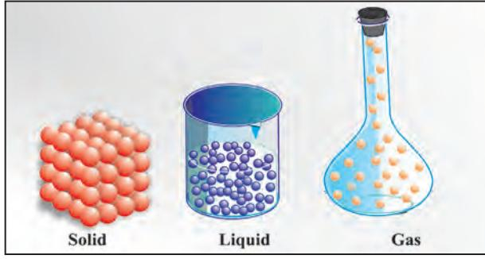

*Fig. 1.2 Classification of matter Fig. 1.1 Arrangement of particles in solid, liquid and gaseous state*

- (iii) Gases have *neither definite volume nor definite shape*. They completely occupy the space in the container in which they are placed.
These three states of matter are interconvertible by changing the conditions of temperature and pressure.

Solid liquid Gas

On heating, a solid usually changes to a liquid, and the liquid on further heating changes to gas (or vapour). In the reverse process, a gas on cooling liquifies to the liquid and the liquid on further cooling freezes to the solid.

#### **1.2.2. Classification of Matter**

In Class IX (Chapter 2), you have learnt that at the macroscopic or bulk level, matter can be classified as **mixture** or **pure substance**. These can be further sub-divided as shown in Fig. 1.2.

When all constituent particles of a substance are same in chemical nature, it is said to be a pure substance. A mixture contains many types of particles.

**A mixture** contains particles of two or more pure substances which may be present in it in any ratio. Hence, their composition is variable. Pure substances forming mixture are called its components. Many of the substances present around you are **mixtures**. For example, sugar solution in water, air, tea, etc., are all mixtures. A mixture may be **homogeneous** or **heterogeneous**. In a **homogeneous mixture**, the components

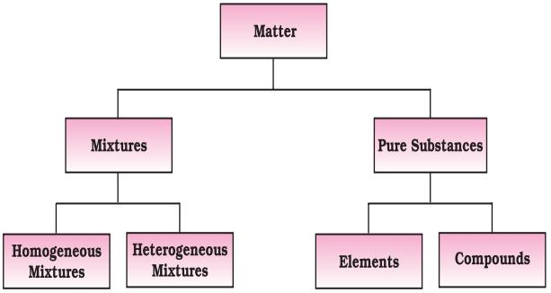

completely mix with each other. This means particles of components of the mixture are uniformly distributed throughout the bulk of the mixture and its composition is uniform throughout. Sugar solution and air are the examples of homogeneous mixtures. In contrast to this, in a **heterogeneous mixture**, the composition is not uniform throughout and sometimes different components are visible. For example, mixtures of salt and sugar, grains and pulses along with some dirt (often stone pieces), are heterogeneous mixtures. You can think of many more examples of mixtures which you come across in the daily life. It is worthwhile to mention here that the components of a mixture can be separated by using physical methods, such as simple hand-picking, filtration, crystallisation, distillation, etc.

**Pure substances** have characteristics different from mixtures. Constituent particles of pure substances have fixed composition. Copper, silver, gold, water and glucose are some examples of pure substances. Glucose contains carbon, hydrogen and oxygen in a fixed ratio and its particles are of same composition. Hence, like all other pure substances, glucose has a fixed composition. Also, its constituents—carbon, hydrogen and oxygen—cannot be separated by simple physical methods.

Pure substances can further be classified into **elements** and **compounds**. Particles of an **element** consist of only one type of atoms. These particles may exist as **atoms** or **molecules**. You may be familiar with atoms

Unit 1.indd 5 9/9/2022 4:27:30 PM

and molecules from the previous classes; however, you will be studying about them in detail in Unit 2. Sodium, copper, silver, hydrogen, oxygen, etc., are some examples of elements. Their all atoms are of one type. However, the atoms of different elements are different in nature. Some elements, such as sodium or copper, contain atoms as their constituent particles, whereas, in some others, the constituent particles are molecules which are formed by two or more atoms. For example, hydrogen, nitrogen and oxygen gases consist of molecules, in which two atoms combine to give their respective molecules. This is illustrated in Fig. 1.3.

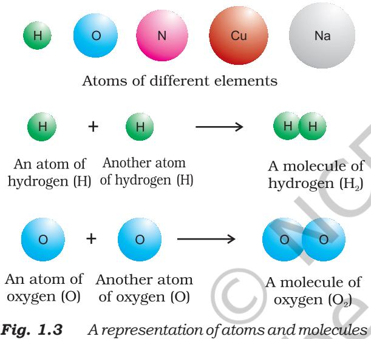

When two or more atoms of different elements combine together in a definite ratio, the molecule of a **compound** is obtained. Moreover, the constituents of a compound cannot be separated into simpler substances by physical methods. They can be separated by chemical methods. Examples of some compounds are water, ammonia, carbon dioxide, sugar, etc. The molecules of water and carbon dioxide are represented in Fig. 1.4.

Note that a water molecule comprises two hydrogen atoms and one oxygen atom. Similarly, a molecule of carbon dioxide contains two oxygen atoms combined with one carbon atom. Thus, the atoms of different

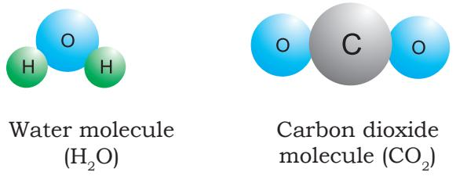

*Fig. 1.4 A depiction of molecules of water and carbon dioxide*

elements are present in a compound in a fixed and definite ratio and this ratio is characteristic of a particular compound. Also, the properties of a compound are different from those of its constituent elements. For example, hydrogen and oxygen are gases, whereas, the compound formed by their combination i.e., water is a liquid. It is interesting to note that hydrogen burns with a pop sound and oxygen is a supporter of combustion, but water is used as a fire extinguisher.

# **1.3 Properties of Matter and their Measurement**

# **1.3.1 Physical and chemical properties**

Every substance has unique or characteristic properties. These properties can be classified into two categories — **physical properties,** such as colour, odour, melting point, boiling point, density, etc., and **chemical properties,** like composition, combustibility, ractivity with acids and bases, etc.

**Physical properties** can be measured or observed without changing the identity or the composition of the substance. The measurement or observation of **chemical properties** requires a chemical change to occur. Measurement of physical properties does not require occurance of a chemical change. The examples of chemical properties are characteristic reactions of different substances; these include acidity or basicity, combustibility, etc. Chemists describe, interpret and predict the behaviour of substances on the basis of knowledge of their physical and chemical properties, which are determined by careful measurement and experimentation. In the following section, we

Unit 1.indd 6 9/9/2022 4:27:30 PM

will learn about the measurement of physical properties.

#### **1.3.2 Measurement of physical properties**

Quantitative measurement of properties is reaquired for scientific investigation. Many properties of matter, such as length, area, volume, etc., are quantitative in nature. Any quantitative observation or measurement is represented by a number followed by units in which it is measured. For example, length of a room can be represented as 6 m; here, 6 is the number and m denotes metre, the unit in which the length is measured.

Earlier, two different systems of measurement, i.e., the **English System**  and the **Metric System** were being used in different parts of the world. The metric system, which originated in France in late eighteenth century, was more convenient as it was based on the decimal system. Late, need of a common standard system was felt by the scientific community. Such a system was established in 1960 and is discussed in detail below.

#### **1.3.3 The International System of Units (SI)**

The International System of Units (in French *Le Systeme International d'Unités* — abbreviated as SI) was established by the 11th General Conference on Weights and Measures (CGPM from *Conference Generale des Poids et Measures*). The CGPM is an inter-

# **Maintaining the National Standards of Measurement**

The system of units, including unit definitions, keeps on changing with time. Whenever the accuracy of measurement of a particular unit was enhanced substantially by adopting new principles, member nations of metre treaty (signed in 1875), agreed to change the formal definition of that unit. Each modern industrialised country, including India, has a National Metrology Institute (NMI), which maintains standards of measurements. This responsibility has been given to the National Physical Laboratory (NPL), New Delhi. This laboratory establishes experiments to realise the *base units* and *derived units* of measurement and maintains National Standards of Measurement. These standards are periodically inter-compared with standards maintained at other National Metrology Institutes in the world, as well as those, established at the International Bureau of Standards in Paris.

governmental treaty organisation created by a diplomatic treaty known as Metre Convention, which was signed in Paris in 1875.

**The SI system has seven** *base units* and they are listed in Table 1.1. These units pertain to the seven fundamental scientific quantities. The other physical quantities, such as speed, volume, density, etc., can be derived from these quantities.

| Base Physical | Symbol for | Name of | Symbol for |
| --- | --- | --- | --- |
| Quantity | Quantity | SI Unit | SI Unit |
| Length | l | metre | m |
| Mass | m | kilogram | kg |
| Time | t | second | s |
| Electric current | I | ampere | A |
| Thermodynamic | T | kelvin | K |
| temperature |  |  |  |
| Amount of | n | mole | mol |
| substance | I | candela |  |
|  | v |  | cd |
| Luminous |  |  |  |
| intensity |  |  |  |

# **Table 1.1 Base Physical Quantities and their Units**

Unit 1.indd 7 9/9/2022 4:27:30 PM

The definitions of the SI base units are given in Table 1.2.

The SI system allows the use of prefixes to indicate the multiples or submultiples of a unit. These prefixes are listed in Table 1.3.

Let us now quickly go through some of the quantities which you will be often using in this book.

| Unit of length | metre | The metre, symbol m is the SI unit of length. It is defined by taking the fixed numerical value of the speed of light in vacuum |
| --- | --- | --- |
|  |  | c to be 299792458 when expressed in the unit ms–1, where |
|  |  | the second is defined in terms of the caesium frequencyV Cs. |
| Unit of mass | kilogram | The kilogram, symbol kg. is the SI unit of mass. It is defined |
|  |  | by taking the fixed numerical value of the planck constant h to |
|  |  | be 6.62607015×10–34 when expressed in the unit Js, which is |
|  |  | equal to kgm2s–1, where the metre and the second are defined |
|  |  | in terms of c andV Cs. |
| Unit of time | second | The second symbol s, is the SI unit of time. It is defined by |
|  |  | taking the fixed numerical value of the caesium frequency V Cs, |
|  |  | the unperturbed ground-state hyperfine transition frequency |
|  |  | of the caesium-133 atom, to be 9192631770 when expressed |
|  |  | in the unit Hz, which is equal to s–1. |
|  |  | The ampere, symbol A, is the SI unit of electric current. It is |
| Unit of electric |  | defined by taking the fixed numerical value of the elementary |
| current | ampere | charge e to be 1.602176634×10–19 when expressed in the unit C, which is equal to As, where the second is defined in terms |
|  |  | of V Cs. |
| Unit of |  | The kelvin, symbol k, is the SI unit of thermodynamic temperature. It is defined by taking the fixed numerical value |
| thermodynamic | kelvin | of the Boltzmann constant k to be 1.380649×10–23 when expressed in the unit JK–1, which is equal to kgm2s–2k–1 where |
| temperature |  | the kilogram, metre and second are defined in terms of h, c |
|  |  | and V Cs. |
| Unit of amount |  | The mole, symbol mol, is the SI unit of amount of substance. One mole contains exactly 6.02214076×1023 elementary |
|  |  | entities. This number is the fixed numerical value of the |
|  |  | when expressed in the unit mol–1 and Avogadro constant, NA, |
| of substance | mole | is called the Avogadro number. The amount of substance, symbol n, of a system is a measure of the number of specified |
|  |  | elementary entities. An elementary entity may be an atom, a |
|  |  | molecule, an ion, an electron, any other particle or specified |
|  |  | group of particles. |
| Unit of luminous |  | The candela, symbol cd is the SI unit of luminous intensity in |
|  |  | a given direction. It is defined by taking the fixed numerical |
|  |  | value of the luminous efficacy of monochromatic radiation |
|  | Candela | of frequency 540×1012 Hz, Kcd, to be 683 when expressed |
| Intensity |  |  |
|  |  | in the unit lm·W–1, which is equal to cd·sr·W–1, or cd sr kg–1 |
|  |  | m–2s3, where the kilogram, metre and second are defined in |
|  |  | terms of h, c and V Cs. |

# **Table 1.2 Definitions of SI Base Units**

Unit 1.indd 8 9/9/2022 4:27:30 PM

**Table 1.3 Prefixes used in the SI System**

| Multiple | Prefix | Symbol |
| --- | --- | --- |
| 10–24 | yocto | y |
| 10–21 | zepto | z |
| 10–18 | atto | a |
| 10–15 | femto | f |
| 10–12 | pico | p |
| 10–9 | nano | n |
| 10–6 | micro | µ |
| 10–3 | milli | m |
| 10–2 | centi | c |
| 10–1 | deci | d |
| 10 | deca | da |
| 102 | hecto | h |
| 103 | kilo | k |
| 106 | mega | M |
| 109 | giga | G |
| 1012 | tera | T |
| 1015 | peta | P |
| 1018 | exa | E |
| 1021 | zeta | Z |
| 1024 | yotta | Y |

#### **1.3.4 Mass and Weight**

**Mass** of a substance is the amount of matter present in it, while **weight** is the force exerted by gravity on an object. The mass of a substance is constant, whereas, its weight may vary from one place to another due to change in gravity. You should be careful in using these terms.

The mass of a substance can be determined accurately in the laboratory by using an analytical balance (Fig. 1.5).

The SI unit of mass as given in Table 1.1 is kilogram. However, its fraction named as gram (1 kg = 1000 g), is used in laboratories due to the smaller amounts of chemicals used in chemical reactions.

#### **1.3.5 Volume**

Volume is the amont of space occupied by a substance. It has the units of (length)3. So in

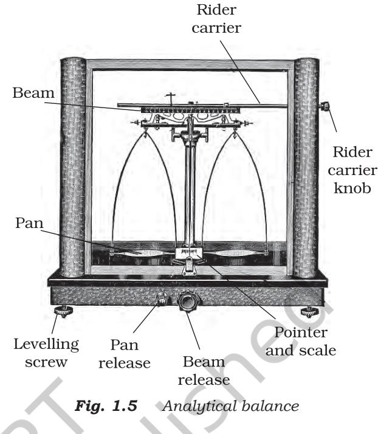

SI system, volume has units of m3. But again, in chemistry laboratories, smaller volumes are used. Hence, volume is often denoted in cm3 or dm3 units.

A common unit, litre (L) which is not an SI unit, is used for measurement of volume of liquids.

1 L = 1000 mL, 1000 cm3 = 1 dm3 Fig. 1.6 helps to visualise these relations.

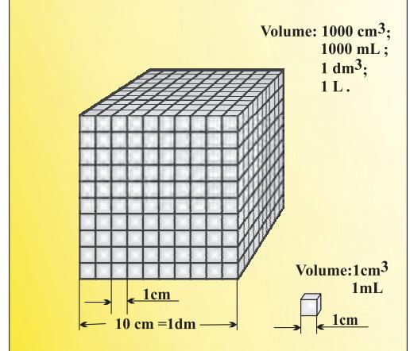

*Fig. 1.6 Different units used to express volume*

Unit 1.indd 9 9/9/2022 4:27:31 PM

In the laboratory, the volume of liquids or solutions can be measured by graduated cylinder, burette, pipette, etc. A volumetric flask is used to prepare a known volume of a solution. These measuring devices are shown in Fig. 1.7.

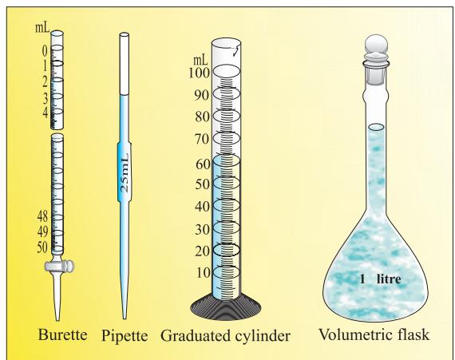

 *Fig. 1.7 Some volume measuring devices*

#### **1.3.6 Density**

The two properties — mass and volume discussed above are related as follows:

$$\mathrm{Density}={\frac{\mathrm{Mass}}{\mathrm{Volume}}}$$

Density of a substance is its amount of mass per unit volume. So, SI units of density can be obtained as follows:

SI unit of density =

* [16] M. C.  
  

This unit is quite large and a chemist often expresses density in g cm–3, where mass is expressed in gram and volume is expressed in cm3. Density of a substance tells us about how closely its particles are packed. If density is more, it means particles are more closely packed.

# **1.3.7 Temperature**

There are three common scales to measure temperature — °C (degree celsius), °F (degree fahrenheit) and K (kelvin). Here, K is the SI unit. The thermometers based on these scales are shown in Fig. 1.8. Generally, the thermometer with celsius scale are calibrated from 0° to 100°, where these two temperatures are the freezing point and the boiling point of water, respectively. The fahrenheit scale is represented between 32° to 212°.

The temperatures on two scales are related to each other by the following relationship:

$$\mathrm{{^{\circ}F}={\frac{9}{5}}({^{\circ}C})+32}$$

The kelvin scale is related to celsius scale as follows:

K = °C + 273.15

It is interesting to note that temperature below 0 °C (i.e., negative values) are possible in Celsius scale but in Kelvin scale, negative temperature is not possible.

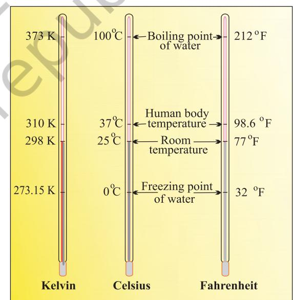

*Fig. 1.8 Thermometers using different temperature scales*

# **1.4 Uncertainty in Measurement**

Many a time in the study of chemistry, one has to deal with experimental data as well as theoretical calculations. There are meaningful ways to handle the numbers conveniently and

Unit 1.indd 10 9/9/2022 4:27:32 PM

After defining a unit of measurement such as the kilogram or the metre, scientists agreed on reference standards that make it possible to calibrate all measuring devices. For getting reliable measurements, all devices such as *metre sticks* and *analytical balances* have been calibrated by their manufacturers to give correct readings. However, each of these devices is standardised or calibrated against some reference. The mass standard is the kilogram since 1889. It has been defined as the mass of platinum-iridium (Pt-Ir) cylinder that is stored in an airtight jar at International Bureau of Weights and Measures in Sevres, France. Pt-Ir was chosen for this standard because it is highly resistant to chemical attack and its mass will not change for an extremely long time.

Scientists are in search of a new standard for mass. This is being attempted through accurate determination of Avogadro constant. Work on this new standard focuses on ways to measure accurately the number of atoms in a well-defined mass of sample. One such method, which uses X-rays to determine the atomic density of a crystal of ultrapure silicon, has an accuracy of about 1 part in 106 but has not yet been adopted to serve as a standard. There are other methods but none of them are presently adequate to replace the Pt-Ir cylinder. No doubt, changes are expected within this decade.

The metre was originally defined as the length between two marks on a Pt-Ir bar kept at a temperature of 0°C (273.15 K). In 1960 the length of the metre was defined as 1.65076373×106 times the wavelength of light emitted by a krypton laser. Although this was a cumbersome number, it preserved the length of the metre at its agreed value. The metre was redefined in 1983 by CGPM as the length of path travelled by light in vacuum during a time interval of 1/299 792 458 of a second. Similar to the length and the mass, there are reference standards for other physical quantities.

present the data realistically with certainty to the extent possible. These ideas are discussed below in detail.

#### **1.4.1 Scientific Notation**

As chemistry is the study of atoms and molecules, which have extremely low masses and are present in extremely large numbers, a chemist has to deal with numbers as large as 602, 200,000,000,000,000,000,000 for the molecules of 2 g of hydrogen gas or as small as 0.00000000000000000000000166 g mass of a H atom. Similarly, other constants such as Planck's constant, speed of light, charges on particles, etc., involve numbers of the above magnitude.

It may look funny for a moment to write or count numbers involving so many zeros but it offers a real challenge to do simple mathematical operations of addition, subtraction, multiplication or division with such numbers. You can write any two numbers of the above type and try any one of the operations you like to accept as a challenge, and then, you will really appreciate the difficulty in handling such numbers.

This problem is solved by using scientific notation for such numbers, i.e., exponential notation in which any number can be represented in the form N ×10n, where n is an exponent having positive or negative values and N is a number (called digit term) which varies between 1.000... and 9.999....

Thus, we can write 232.508 as 2.32508 ×102 in scientific notation. Note that while writing it, the decimal had to be moved to the left by two places and same is the exponent (2) of 10 in the scientific notation.

Similarly, 0.00016 can be written as 1.6 × 10–4. Here, the decimal has to be moved four places to the right and (–4) is the exponent in the scientific notation.

While performing mathematical operations on numbers expressed in scientific notations, the following points are to be kept in mind.

Unit 1.indd 11 9/9/2022 4:27:32 PM

# *Multiplication and Division*

These two operations follow the same rules which are there for exponential numbers, i.e.

$$\begin{split}\big{(}5.6\times10^{5}\big{)}\times\big{(}6.9\times10^{8}\big{)}&=\big{(}5.6\times6.9\big{)}\big{(}10^{5+8}\big{)}\\ &=\big{(}5.6\times6.9\big{)}\times10^{13}\\ &=38.64\times10^{13}\\ &=3.864\times10^{14}\\ \big{(}9.8\times10^{-2}\big{)}\times\big{(}2.5\times10^{-6}\big{)}&=\big{(}9.8\times2.5\big{)}\big{(}10^{-2+(-6)}\big{)}\\ &=\big{(}9.8\times2.5\big{)}\big{(}10^{-2-6}\big{)}\\ &=24.50\times10^{-8}\\ &=2.450\times10^{-7}\\ \end{split}$$

#### *Addition and Subtraction*

For these two operations, first the numbers are written in such a way that they have the same exponent. After that, the coefficients (digit terms) are added or subtracted as the case may be.

Thus, for adding 6.65×104 and 8.95×103, exponent is made same for both the numbers. Thus, we get (6.65×104) + (0.895×104)

Then, these numbers can be added as follows (6.65 + 0.895)×104 = 7.545×104

Similarly, the subtraction of two numbers can be done as shown below:

- (2.5 × 10–2) (4.8 ×10–3)

$$=(2.5\times10^{-2})-(0.48\times10^{-2})$$

- = (2.5 0.48)×10–2 = 2.02 ×10–2
# **1.4.2 Significant Figures**

Every experimental measurement has some amount of uncertainty associated with it because of limitation of measuring instrument and the skill of the person making the measurement. For example, mass of an object is obtained using a platform balance and it comes out to be 9.4g. On measuring the mass of this object on an analytical balance, the mass obtained is 9.4213g. The mass obtained by an analytical balance is slightly higher than the mass obtained by using a platform balance. Therefore, digit 4 placed after decimal in the measurement by platform balance is uncertain.

The uncertainty in the experimental or the calculated values is indicated by mentioning the number of significant figures. **Significant figures** are meaningful digits which are known with certainty plus one which is estimated or uncertain. The uncertainty is indicated by writing the certain digits and the last uncertain digit. Thus, if we write a result as 11.2 mL, we say the 11 is certain and 2 is uncertain and the uncertainty would be +1 in the last digit. Unless otherwise stated, an uncertainty of +1 in the last digit is always understood.

There are certain rules for determining the number of significant figures. These are stated below:

- (1) All non-zero digits are significant. For example in 285 cm, there are three significant figures and in 0.25 mL, there are two significant figures.
- (2) Zeros preceding to first non-zero digit are not significant. Such zero indicates the position of decimal point. Thus, 0.03 has one significant figure and 0.0052 has two significant figures.
- (3) Zeros between two non-zero digits are significant. Thus, 2.005 has four significant figures.
- (4) Zeros at the end or right of a number are significant, provided they are on the right side of the decimal point. For example, 0.200 g has three significant figures. But, if otherwise, the terminal zeros are not significant if there is no decimal point. For example, 100 has only one significant figure, but 100 has three significant figures and 100.0 has four significant figures. Such numbers are better represented in scientific notation. We can express the number 100 as 1×102 for one significant figure, 1.0×102 for two significant figures and 1.00×102 for three significant figures.

Unit 1.indd 12 9/9/2022 4:27:32 PM

- (5) Counting the numbers of object, for example, 2 balls or 20 eggs, have infinite significant figures as these are exact numbers and can be represented by writing infinite number of zeros after placing a decimal i.e., 2 = 2.000000 or 20 = 20.000000.
In numbers written in scientific notation, all digits are significant e.g., 4.01×102 has three significant figures, and 8.256×10–3 has four significant figures.

However, one would always like the results to be precise and accurate. Precision and accuracy are often referred to while we talk about the measurement.

**Precision** refers to the closeness of various measurements for the same quantity. However, **accuracy** is the agreement of a particular value to the true value of the result. For example, if the true value for a result is 2.00 g and student 'A' takes two measurements and reports the results as 1.95 g and 1.93 g. These values are precise as they are close to each other but are not accurate. Another student 'B' repeats the experiment and obtains 1.94 g and 2.05 g as the results for two measurements. These observations are neither precise nor accurate. When the third student 'C' repeats these measurements and reports 2.01 g and 1.99 g as the result, these values are both precise and accurate. This can be more clearly understood from the data given in Table 1.4.

# **Table 1.4 Data to Illustrate Precision and Accuracy**

|  |  | Measurements/g |  |
| --- | --- | --- | --- |
|  | 1 | 2 | Average (g) |
| Student A | 1.95 | 1.93 | 1.940 |
| Student B | 1.94 | 2.05 | 1.995 |
| Student C | 2.01 | 1.99 | 2.000 |

# *Addition and Subtraction of Significant Figures*

The result cannot have more digits to the right of the decimal point than either of the original numbers. 12.11

| 18.0 |
| --- |
| 1.012 |
| 31.122 |

Here, 18.0 has only one digit after the decimal point and the result should be reported only up to one digit after the decimal point, which is 31.1.

# *Multiplication and Division of Significant Figures*

In these operations, the result must be reported with no more significant figures as in the measurement with the few significant figures.

2.5×1.25 = 3.125

Since 2.5 has two significant figures, the result should not have more than two significant figures, thus, it is 3.1.

While limiting the result to the required number of significant figures as done in the above mathematical operation, one has to keep in mind the following points for rounding off the numbers

- 1. If the rightmost digit to be removed is more than 5, the preceding number is increased by one. For example, 1.386. If we have to remove 6, we have to round it to 1.39.
- 2. If the rightmost digit to be removed is less than 5, the preceding number is not changed. For example, 4.334 if 4 is to be removed, then the result is rounded upto 4.33.
- 3. If the rightmost digit to be removed is 5, then the preceding number is not changed if it is an even number but it is increased by one if it is an odd number. For example, if 6.35 is to be rounded by removing 5, we have to increase 3 to 4 giving 6.4 as the result. However, if 6.25 is to be rounded off it is rounded off to 6.2.

# **1.4.3 Dimensional Analysis**

Often while calculating, there is a need to convert units from one system to the other. The method used to accomplish this is called **factor label method** or **unit factor method**  or **dimensional analysis**. This is illustrated below.

# **Example**

A piece of metal is 3 inch (represented by in) long. What is its length in cm?

Unit 1.indd 13 9/9/2022 4:27:32 PM

# **Solution**

We know that 1 in = 2.54 cm

From this equivalence, we can write

$${\frac{\mathrm{1~in}}{\mathrm{2.54\,cm}}}=1={\frac{\mathrm{2.54\,cm}}{\mathrm{1~in}}}$$

Thus, $\,\frac{\text{1in}}{\text{2.54cm}}\,$ equals $\,\text{1}\,$ and $\,\frac{\text{2.54cm}}{\text{1in}}\,$.  

also equals 1. Both of these are called **unit factors**. If some number is multiplied by these unit factors (i.e., 1), it will not be affected otherwise.

Say, the 3 in given above is multiplied by the unit factor. So,

3 in = 3 in × 2 54 1 . cm in = 3 × 2.54 cm = 7.62cm

Now, the unit factor by which multiplication is to be done is that unit factor ( 2 54 1 . cm in in

the above case) which gives the desired units i.e., the numerator should have that part which is required in the desired result.

It should also be noted in the above example that units can be handled just like other numerical part. It can be cancelled, divided, multiplied, squared, etc. Let us study one more example.

# **Example**

A jug contains 2L of milk. Calculate the volume of the milk in m3.

# **Solution**

Since 1 L = 1000 cm3 and 1m = 100 cm, which gives

$${\frac{1{\mathrm{~m}}}{100{\mathrm{~cm}}}}=1\Longrightarrow{\frac{100{\mathrm{~cm}}}{1{\mathrm{m}}}}$$

To get m3 from the above unit factors, the first unit factor is taken and it is cubed.

$$\left({\frac{1\,\mathrm{m}}{100\,\mathrm{cm}}}\right)^{3}\Rightarrow{\frac{1\,\mathrm{m}^{3}}{10^{6}\,\mathrm{cm}^{3}}}=\left(1\right)^{3}=1$$

# Now 2 L = 2 $\times1000$ cm$^{3}$. 

The above is multiplied by the unit factor 2 1000 1 10 2 10 2 10 3 3 6 3 3 3 3 3 cm m cm m m

# **Example**

How many seconds are there in 2 days?

# **Solution**

```
Here, we know 1 day = 24 hours (h)
```

$${\mathrm{or~}}{\frac{1\,\mathrm{day}}{24\,\mathrm{h}}}=1={\frac{24\,\mathrm{h}}{1\,\mathrm{day}}}$$
  
then, 1h = 60 min  
  
or ${\frac{1\,\mathrm{h}}{60\,\mathrm{min}}}=1={\frac{60\,\mathrm{min}}{1\,\mathrm{h}}}$

so, for converting 2 days to seconds,

i.e., 2 days – – – – – – = – – – seconds

The unit factors can be multiplied in series in one step only as follows:

$$\mathrm{\Large{\begin{array}{l}{{\xrightarrow{}}2\,d a y\times{\frac{24\,h}{1\,d a y}}\times{\frac{60\,\,m i n}{1\,h}}\times{\frac{60\,s}{1\,\,m i n}}}\end{array}}}$$

$$\begin{array}{l}{{=2\times24\times60\times60\ \mathrm{s}}}\\ {{=172800\ \mathrm{s}}}\end{array}$$

# **1.5 Laws of Chemical Combinations**

The combination of elements to form compounds is governed by the following five basic laws.

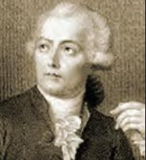

Antoine Lavoisier (1743–1794)

# **1.5.1 Law of Conservation of Mass**

This law was put forth by Antoine Lavoisier in 1789. He performed careful experimental studies for combustion reactions and reached to the conclusion that in all physical and chemical changes, there is no net change in mass duting the process. Hence, he reached to the conclusion that matter can neither be created nor destroyed. This is called 'Law of Conservation of Mass'. This law formed the basis for several later developments in chemistry. Infact, this was the result of exact measurement of masses of reactants and products, and carefully planned experiments performed by Lavoisier.

Unit 1.indd 14 9/9/2022 4:27:33 PM

#### **1.5.2 Law of Definite Proportions**

This law was given by, a French chemist, Joseph Proust. He stated that *a given compound always contains exactly the same proportion of elements by weight.*

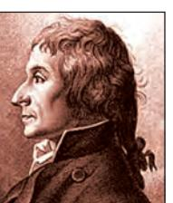

Proust worked with two samples of cupric carbonate — one of which was of natural

Joseph Proust (1754–1826)

origin and the other was synthetic. He found that the composition of elements present in it was same for both the samples as shown below:

|  | % of | % of | % of |
| --- | --- | --- | --- |
|  | copper | carbon | oxygen |
| Natural Sample | 51.35 | 9.74 | 38.91 |
| Synthetic Sample | 51.35 | 9.74 | 38.91 |

Thus, he concluded that irrespective of the source, a given compound always contains same elements combined together in the same proportion by mass. The validity of this law has been confirmed by various experiments. It is sometimes also referred to as **Law of Definite Composition**.

# **1.5.3 Law of Multiple Proportions**

This law was proposed by Dalton in 1803. According to this law, *if two elements can combine to form more than one compound, the masses of one element that combine with a fixed mass of the other element, are in the ratio of small whole numbers.*

For example, hydrogen combines with oxygen to form two compounds, namely, water and hydrogen peroxide.

> Hydrogen + Oxygen → Water 2g 16g 18g

Hydrogen + Oxygen → Hydrogen Peroxide 2g 32g 34g

Here, the masses of oxygen (i.e., 16 g and 32 g), which combine with a fixed mass of hydrogen (2g) bear a simple ratio, i.e., 16:32 or 1: 2.

# **1.5.4 Gay Lussac's Law of Gaseous Volumes**

This law was given by Gay Lussac in 1808. He observed that *when gases combine or*  *are produced in a chemical reaction they do so in a simple ratio by volume, provided all gases are at the same temperature and pressure.*

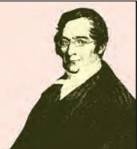

Thus, 100 mL of hydrogen combine with 50 mL of oxygen to give 100 mL of water vapour.

Joseph Louis Gay Lussac

Hydrogen + Oxygen → Water 100 mL 50 mL 100 mL

Thus, the volumes of hydrogen and oxygen which combine (i.e., 100 mL and 50 mL) bear a simple ratio of 2:1.

Gay Lussac's discovery of integer ratio in volume relationship is actually the law of definite proportions by volume. The law of definite proportions, stated earlier, was with respect to mass. The Gay Lussac's law was explained properly by the work of Avogadro in 1811.

#### **1.5.5 Avogadro's Law**

In 1811, Avogadro proposed that *equal volumes of all gases at the same temperature and pressure should contain equal number of molecules.* Avogadro made a distinction between **atoms** and **molecules** which is quite understandable in present times. If we consider again the reaction of hydrogen and oxygen to produce water, we see that two volumes of hydrogen combine with one volume of oxygen to give two volumes of water without leaving any unreacted oxygen.

Note that in the Fig. 1.9 (Page 16) each

box contains equal number of molecules. In fact, Avogadro could explain the above result by considering the molecules to be **polyatomic.** If hydrogen and oxygen were considered as **diatomic** as recognised now, then the above results are easily understandable. However, Dalton and others believed at that time that atoms of the same kind

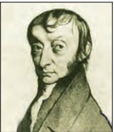

Lorenzo Romano Amedeo Carlo Avogadro di Quareqa edi Carreto (1776–1856)

Unit 1.indd 15 9/9/2022 4:27:34 PM


*Fig. 1.9 Two volumes of hydrogen react with one volume of oxygen to give two volumes of water vapour*

cannot combine and molecules of oxygen or hydrogen containing two atoms did not exist. Avogadro's proposal was published in the French *Journal de Physique*. In spite of being correct, it did not gain much support.

After about 50 years, in 1860, the first international conference on chemistry was held in Karlsruhe, Germany, to resolve various ideas. At the meeting, Stanislao Cannizaro presented a sketch of a course of chemical philosophy, which emphasised on the importance of Avogadro's work.

#### **1.6 Dalton's Atomic Theory**

Although the origin of the idea that matter is composed of small indivisible particles called *'a-tomio'* (meaning, *indivisible*), dates back

to the time of Democritus, a Greek Philosopher (460– 370 BC), it again started emerging as a result of several experimental studies which led to the laws mentioned above.

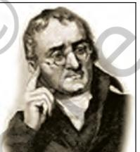

In 1808, Dalton published 'A New System of Chemical Philosophy', in which he proposed the following :

John Dalton (1776–1884)

- 1. Matter consists of indivisible atoms.
- 2. All atoms of a given element have identical properties, including identical mass. Atoms of different elements differ in mass.
- 3. Compounds are formed when atoms of different elements combine in a fixed ratio.
- 4. Chemical reactions involve reorganisation of atoms. These are neither created nor destroyed in a chemical reaction.

Dalton's theory could explain the laws of chemical combination. However, it could not explain the laws of gaseous volumes. It could not provide the reason for combining of atoms, which was answered later by other scientists.

**1.7 Atomic and Molecular Masses** After having some idea about the terms atoms and molecules, it is appropriate here to understand what do we mean by atomic and molecular masses.

# **1.7.1 Atomic Mass**

The atomic mass or the mass of an atom is actually very-very small because atoms are extremely small. Today, we have sophisticated techniques e.g., mass spectrometry for determining the atomic masses fairly accurately. But in the nineteenth century, scientists could determine the mass of one atom **relative** to another by experimental means, as has been mentioned earlier. Hydrogen, being the lightest atom was arbitrarily assigned a mass of 1 (without any units) and other elements were assigned masses relative to it. However, the present system of atomic masses is based on carbon-12 as the standard and has been agreed upon in 1961. Here, Carbon-12 is one of the **isotopes** of carbon and can be represented as 12C. In this system, 12C is assigned a mass of exactly 12 atomic mass unit (**amu**) and masses of all other atoms are given relative to this standard. One **atomic mass unit** is defined as a mass exactly equal to one-twelfth of the mass of one carbon – 12 atom.

Unit 1.indd 16 9/9/2022 4:27:34 PM

And 1 amu = 1.66056×10–24 g Mass of an atom of hydrogen

= 1.6736×10–24 g

Thus, in terms of amu, the mass

of hydrogen atom =

= 1.0078 amu

  

$$\text{=1.0080amu}$$
.  

Similarly, the mass of oxygen - 16 (16O) atom would be 15.995 amu.

At present, **'amu'** has been replaced by **'u'**, which is known as **unified mass**.

When we use atomic masses of elements in calculations, we actually use *average atomic masses* of elements, which are explained below.

#### **1.7.2 Average Atomic Mass**

Many naturally occurring elements exist as more than one isotope. When we take into account the existence of these isotopes and their relative abundance (per cent occurrence), the average atomic mass of that element can be computed. For example, carbon has the following three isotopes with relative abundances and masses as shown against each of them.

| Isotope | Relative | Atomic Mass |
| --- | --- | --- |
|  | Abundance | (amu) |
|  | (%) |  |
| 12C | 98.892 | 12 |
| 13C | 1.108 | 13.00335 |
| 14C | 2 ×10–10 | 14.00317 |

From the above data, the average atomic mass of carbon will come out to be: (0.98892) (12 u) + (0.01108) (13.00335 u) + (2 ×10–12) (14.00317 u) = 12.011 u

Similarly, average atomic masses for other elements can be calculated. In the periodic table of elements, the atomic masses mentioned for different elements actually represent their average atomic masses.

# **1.7.3 Molecular Mass**

Molecular mass is the sum of atomic masses of the elements present in a molecule. It is obtained by multiplying the atomic mass of each element by the number of its atoms and adding them together. For example, molecular mass of methane, which contains one carbon atom and four hydrogen atoms, can be obtained as follows:

Molecular mass of methane,

$$(\mathrm{CH}_{4})=(12.011\ \mathrm{u})+4\ (1.008\ \mathrm{u})$$

```
= 16.043 u
```
Similarly, molecular mass of water (H2O)

= 2 × atomic mass of hydrogen + 1× atomic mass of oxygen

= 2 (1.008 u) + 16.00 u

= 18.02 u

# **1.7.4 Formula Mass**

Some substances, such as sodium chloride, do not contain discrete molecules as their constituent units. In such compounds, positive (sodium ion) and negative (chloride ion) entities are arranged in a three-dimensional structure, as shown in Fig. 1.10.


*Fig. 1.10 Packing of Na+ and Cl– ions in sodium chloride*

It may be noted that in sodium chloride, one Na+ ion is surrounded by six Cl– ion and *vice-versa*.

The formula, such as NaCl, is used to calculate the **formula mass** instead of molecular mass as in the solid state sodium chloride does not exist as a single entity.

Unit 1.indd 17 9/9/2022 4:27:35 PM

Thus, the formula mass of sodium chloride is atomic mass of sodium + atomic mass of chlorine

= 23.0 u + 35.5 u = 58.5 u

#### **Problem 1.1**

Calculate the molecular mass of glucose (C6H12O6) molecule.

#### **Solution**

Molecular mass of glucose (C6H12O6) = 6 (12.011 u) + 12 (1.008 u) + 6 (16.00 u) = (72.066 u) + (12.096 u) + (96.00 u) = 180.162 u

# **1.8 Mole concept and Molar Masses**

Atoms and molecules are extremely small in size and their numbers in even a small amount of any substance is really very large. To handle such large numbers, a unit of convenient magnitude is required.

Just as we denote one dozen for 12 items, score for 20 items, gross for 144 items, we use the idea of mole to count entities at the microscopic level (i.e., atoms, molecules, particles, electrons, ions, etc).

In SI system, **mole** (symbol, mol) was introduced as seventh base quantity for the amount of a substance.

The mole, symbol mol, is the SI unit of amount of substance. One mole contains exactly 6.02214076 ×1023 elementary entities. This number is the fixed numerical value of the Avogadro constant, NA, when expressed in the unit mol–1 and is called the Avogadro number. The amount of substance, symbol *n*, of a system is a measure of the number of specified elementary entities. An elementary entity may be an atom, a molecule, an ion, an electron, any other particle or specified group of particles. It may be emphasised that the mole of a substance always contains the same number of entities, no matter what the substance may be. In order to determine this number precisely, the mass of a carbon–12 atom was determined by a mass spectrometer and found to be equal to 1.992648 ×10–23 g. Knowing that one mole of carbon weighs 12 g, the number of atoms in it is equal to:

> 12 1 992648 10 12 23 12 g mol C g Catom / . / 6 0221367 1023 . atoms/mol

This number of entities in 1 mol is so important that it is given a separate name and symbol. It is known as **'Avogadro constant'**, or Avogadro number denoted by NA in honour of Amedeo Avogadro. To appreciate the largeness of this number, let us write it with all zeroes without using any powers of ten.

602213670000000000000000

Hence, so many entities (atoms, molecules or any other particle) constitute one mole of a particular substance.

We can, therefore, say that 1 mol of hydrogen atoms = 6.022 ×1023 atoms

1 mol of water molecules = 6.022 ×1023 water molecules

1 mol of sodium chloride = 6.022×1023 formula units of sodium chloride

Having defined the mole, it is easier to know the mass of one mole of a substance or the constituent entities. **The mass of one mole of a substance in grams is called its molar mass.** The molar mass in grams is numerically equal to atomic/molecular/ formula mass in u.

Molar mass of water = 18.02 g mol–1

Molar mass of sodium chloride = 58.5 g mol–1

# **1.9 Percentage Composition**

So far, we were dealing with the number of entities present in a given sample. But many a time, information regarding the percentage of a particular element present in a compound is required. Suppose, an unknown or new compound is given to you, the first question

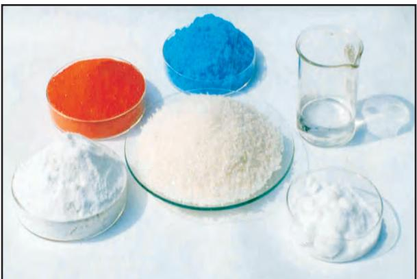

*Fig. 1.11 One mole of various substances*

Unit 1.indd 18 9/9/2022 4:27:35 PM

you would ask is: what is its formula or what are its constituents and in what ratio are they present in the given compound? For known compounds also, such information provides a check whether the given sample contains the same percentage of elements as present in a pure sample. In other words, one can check the purity of a given sample by analysing this data.

Let us understand it by taking the example of water (H2O). Since water contains hydrogen and oxygen, the percentage composition of both these elements can be calculated as follows:

Mass % of an element =

mass of that element in the compound 100 molar mass of th × e compound

- Molar mass of water = 18.02 g Mass % of hydrogen = = 11.18 Mass % of oxygen = 16.00 18.02 ×100 = 88.79
Let us take one more example. What is the percentage of carbon, hydrogen and oxygen in ethanol?

Molecular formula of ethanol is: C2H5OH Molar mass of ethanol is:

(2×12.01 + 6×1.008 + 16.00) g = 46.068 g

Mass per cent of carbon

24.02 g $\times$100 = 52.1490  
  
46.068 g 

Mass per cent of hydrogen

6.048 g $\times$100 = 13.139/0  
  
46.068 g 

Mass per cent of oxygen

$$\begin{array}{l}{\sum_{\mathrm{{}={}}}{\frac{16.00\,\mathrm{g}}{46.068\,\mathrm{g}}}\times100\,=34.73\%}\end{array}$$

After understanding the calculation of per cent of mass, let us now see what information can be obtained from the per cent composition data.

# **1.9.1 Empirical Formula for Molecular Formula**

An **empirical formula** represents the simplest whole number ratio of various atoms present in a compound, whereas, the **molecular formula** shows the exact number of different types of atoms present in a molecule of a compound.

If the mass per cent of various elements present in a compound is known, its empirical formula can be determined. Molecular formula can further be obtained if the molar mass is known. The following example illustrates this sequence.

#### **Problem 1.2**

A compound contains 4.07% hydrogen, 24.27% carbon and 71.65% chlorine. Its molar mass is 98.96 g. What are its empirical and molecular formulas?

# **Solution**

# **Step 1. Conversion of mass per cent to grams**

Since we are having mass per cent, it is convenient to use 100 g of the compound as the starting material. Thus, in the 100 g sample of the above compound, 4.07g hydrogen, 24.27g carbon and 71.65g chlorine are present.

# **Step 2. Convert into number moles of each element**

Divide the masses obtained above by respective atomic masses of various elements. This gives the number of moles of constituent elements in the compound

Moles of hydrogen = 4.07 g 1.008g = 4.04

$${\mathrm{Moles~of~carbon~}}={\frac{24.27\,{\mathrm{g}}}{12.01\,{\mathrm{g}}}}=2.021$$

$${\mathrm{Moles~of~chlorine~={\frac{71.65g}{35.453g}}=2.021}}$$

Unit 1.indd 19 9/9/2022 4:27:36 PM

# **Step 3. Divide each of the mole values obtained above by the smallest number amongst them**

Since 2.021 is smallest value, division by it gives a ratio of 2:1:1 for H:C:Cl.

In case the ratios are not whole numbers, then they may be converted into whole number by multiplying by the suitable coefficient.

# **Step 4. Write down the empirical formula by mentioning the numbers after writing the symbols of respective elements**

CH2Cl is, thus, the empirical formula of the above compound.

# **Step 5. Writing molecular formula**

(a) Determine empirical formula mass by adding the atomic masses of various atoms present in the empirical formula. For CH2Cl, empirical formula mass is 12.01 + (2 ×1.008) + 35.453 = 49.48 g

(b) Divide Molar mass by empirical formula mass

= 2 = (*n*)

(c) Multiply empirical formula by *n* obtained above to get the molecular formula

Empirical formula = CH2Cl, *n* = 2. Hence molecular formula is C2H4Cl2.

# **1.10 Stoichiometry and Stoichiometric Calculations**

The word 'stoichiometry' is derived from two Greek words — *stoicheion* (meaning, *element*) and *metron* (meaning, *measure*). Stoichiometry, thus, deals with the calculation of masses (sometimes volumes also) of the reactants and the products involved in a chemical reaction. Before understanding how to calculate the amounts of reactants required or the products produced in a chemical reaction, let us study what information is available from the **balanced** chemical equation of a given reaction. Let us consider the combustion of methane. A balanced equation for this reaction is as given below:

CH4 (g) + 2O2 (g) → CO2 (g) + 2 H2O (g) Here, methane and dioxygen are called *reactants* and carbon dioxide and water are called *products*. Note that all the reactants and the products are gases in the above reaction and this has been indicated by letter (g) in the brackets next to its formula. Similarly, in case of solids and liquids, (s) and (l) are written respectively.

The coefficients 2 for O2 and H2O are called stoichiometric coefficients. Similarly the coefficient for CH4 and CO2 is one in each case. They represent the number of molecules (and moles as well) taking part in the reaction or formed in the reaction.

Thus, according to the above chemical reaction,

- • One **mole** of CH4(g) reacts with two **moles**  of O2(g) to give one **mole** of CO2(g) and two **moles** of H2O(g)
- • One **molecule** of CH4(g) reacts with 2 **molecules** of O2(g) to give one **molecule** of CO2(g) and 2 molecules of H2O(g)
- • 22.7 L of CH4(g) reacts with 45.4 L of O2 (g) to give 22.7 L of CO2 (g) and 45.4 L of H2O(g)
- • 16 g of CH4 (g) reacts with 2×32 g of O2 (g) to give 44 g of CO2 (g) and 2×18 g of H2O (g).

From these relationships, the given data can be interconverted as follows:

mass

$${\frac{\mathrm{Mass}}{\mathrm{Volume}}}=\mathrm{Density}$$

# **1.10.1 Limiting Reagent**

Many a time, reactions are carried out with the amounts of reactants that are different than the amounts as required by a balanced chemical reaction. In such situations, one reactant is in more amount than the amount required by balanced chemical reaction. The

Unit 1.indd 20 9/9/2022 4:27:36 PM

reactant which is present in the least amount gets consumed after sometime and after that further reaction does not take place whatever be the amount of the other reactant. Hence, the reactant, which gets consumed first, limits the amount of product formed and is, therefore, called the **limiting reagent**.

In performing stoichiometric calculations, this aspect is also to be kept in mind.

# **1.10.2 Reactions in Solutions**

A majority of reactions in the laboratories are carried out in solutions. Therefore, it is important to understand as how the amount of substance is expressed when it is present in the solution. The concentration of a solution or the amount of substance present in its given volume can be expressed in any of the following ways.

- 1. Mass per cent or weight per cent (w/w %)
- 2. Mole fraction
- 3. Molarity
- 4. Molality

Let us now study each one of them in detail.

# **Balancing a chemical equation**

According to the law of conservation of mass, a balanced chemical equation has the *same number of atoms of each element on both sides* of the equation. Many chemical equations can be balanced by *trial and error*. Let us take the reactions of a few metals and non-metals with oxygen to give oxides

|
|  |

- 2 Mg(s) + O2(g) → 2MgO(s) (b) balanced equation
- P4(s) + O2 (g) → P4O10(s) (c) unbalanced equation
- 

Equations (a) and (b) are balanced, since there are same number of metal and oxygen atoms on each side of the equations. However equation (c) is not balanced. In this equation, phosphorus atoms are balanced but not the oxygen atoms. To balance it, we must place the coefficient 5 on the left of oxygen on the left side of the equation to balance the oxygen atoms appearing on the right side of the equation.

 P4(s) + 5O2(g) → P4O10(s) balanced equation Now, let us take combustion of propane, C3H8. This equation can be balanced in steps.

Step 1 Write down the correct formulas of reactants and products. Here, propane and oxygen are reactants, and carbon dioxide and water are products.

 C3H8(g) + O2(g) → CO2 (g) + H2O(l) unbalanced equation **Step 2** *Balance the number of C atoms:* Since 3 carbon atoms are in the reactant, therefore, three CO2 molecules are required on the right side.

C3H8 (g) + O2 (g) → 3CO2 (g) + H2O (l)

**Step 3** *Balance the number of H atoms:* on the left there are 8 hydrogen atoms in the reactants however, each molecule of water has two hydrogen atoms, so four molecules of water will be required for eight hydrogen atoms on the right side.

C3H8 (g) +O2 (g) → 3CO2 (g)+4H2O (l)

**Step 4** *Balance the number of O atoms:* There are 10 oxygen atoms on the right side (3 × 2 = 6 in CO2 and 4×1= 4 in water). Therefore, five O2 molecules are needed to supply the required 10 CO2 and 4×1= 4 in water). Therefore, five O2 molecules are needed to supply the required 10 oxygen atoms.

C3H8 (g) +5O2 (g) → 3CO2 (g) + 4H2O (l)

**Step 5** *Verify that the number of atoms of each element is balanced in the final equation.* The equation shows three carbon atoms, eight hydrogen atoms, and 10 oxygen atoms on each side.

All equations that have correct formulas for all reactants and products can be balanced. Always remember that subscripts in formulas of reactants and products cannot be changed to balance an equation.

Unit 1.indd 21 9/9/2022 4:27:36 PM

# **Problem 1.3**

Calculate the amount of water (g) produced by the combustion of 16 g of methane.

#### **Solution**

The balanced equation for the combustion of methane is :

CH4 (g) + 2O2 (g) → CO2 (g) + 2H2O (g)

(i) 16 g of CH4 corresponds to one mole.

(ii) From the above equation, 1 mol of CH4 (g) gives 2 mol of H2O (g).

2 mol of water (H2O) = 2×(2+16) = 2×18 = 36 g

1 mol H2O = 18 g H2O ⇒ 18g H O 1mol H O 2 2 = 1

Hence, 2 mol H${}_{2}$O$\times$ 18g H${}_{2}$O  
  
1 mol H${}_{2}$O

= 2×18 g H2O = 36 g H2O

#### **Problem 1.4**

How many moles of methane are required to produce 22g CO2 (g) after combustion?

# **Solution**

According to the chemical equation,

CH4 (g) + 2O2 (g) → CO2 (g) + 2H2O (g)

44g CO2 (g) is obtained from 16 g CH4 (g).

[∴1 mol CO2(g) is obtained from 1 mol of CH4(g)]

Number of moles of CO2 (g)

= 22 g CO${}_{2}$ (g) $\times$ 44gCO${}_{2}$ (g)

= 0.5 mol CO2 (g)

Hence, 0.5 mol CO2 (g) would be obtained from 0.5 mol CH4 (g) or 0.5 mol of CH4 (g) would be required to produce 22 g CO2 (g).

#### **Problem 1.5**

50.0 kg of N2 (g) and 10.0 kg of H2 (g) are mixed to produce NH3 (g). Calculate the amount of NH3 (g) formed. Identify

the limiting reagent in the production of NH3 in this situation.

#### **Solution**

A balanced equation for the above reaction is written as follows :

$$\mathrm{N_{2}\,\left(g\right)+3H_{2}\,\left(g\right)\rightleftharpoons2\ N H_{3}\,\left(g\right)}$$

$${\mathrm{Calculation~of~moles:}}$$

Number of moles of N2

* 50.0 kg N2 x 1000 g N2 x 1 mol N2  
* 1 kg N2 x 28.0g N2  
* 17.86x102 mol Number of moles of H2  
* 10.00 kg H2 x 1000 g H2  
* 2.016 g H2

= 4.96 ×103 mol

According to the above equation, 1 mol N2 (g) requires 3 mol H2 (g), for the reaction. Hence, for 17.86×102 mol of N2, the moles of H2 (g) required would be

$$17.86\times10^{2}\,\mathrm{mol}\,\mathrm{N}_{2}\times{\frac{3\,\mathrm{mol}\,\mathrm{H}_{2}\,(\mathrm{g})}{1\,\mathrm{mol}\,\mathrm{N}_{2}\,(\mathrm{g})}}$$

* [16] A. A. K.  
  

But we have only 4.96×103 mol H2. Hence, dihydrogen is the limiting reagent in this case. So, NH3(g) would be formed only from that amount of available dihydrogen *i.e.,* 4.96 ×103 mol

Since 3 mol H2(g) gives 2 mol NH3(g)

4.96 $\times$10${}^{3}$ mol H${}_{2}$ (g) $\times$ 2 mol NH${}_{3}$ (g) 3 mol H${}_{2}$ (g)

= 3.30 ×103 mol NH3 (g)

3.30 ×103 mol NH3 (g) is obtained.

If they are to be converted to grams, it is done as follows :

1 mol NH3 (g) = 17.0 g NH3 (g)

$3.30\times10^{3}$ mol NH${}_{3}$ (g) $\times\frac{17.0\,\mathrm{g}\,\mathrm{NH}_{3}\,(\mathrm{g})}{1\,\mathrm{mol}\,\mathrm{NH}_{3}\,(\mathrm{g})}$

Unit 1.indd 22 9/9/2022 4:27:37 PM

- = 3.30×103×17 g NH3 (g)
- = 56.1×103 g NH3
- = 56.1 kg NH3

# *1. Mass per cent*

It is obtained by using the following relation:

# **Problem 1.6**

A solution is prepared by adding 2 g of a substance A to 18 g of water. Calculate the mass per cent of the solute.

# **Solution**

# *2. Mole Fraction*

It is the ratio of number of moles of a particular component to the total number of moles of the solution. If a substance 'A' dissolves in substance 'B' and their number of moles are *n*A and *n*B, respectively, then the mole fractions of A and B are given as:

$$={\frac{n_{\mathrm{B}}}{n_{\mathrm{A}}+n_{\mathrm{B}}}}$$

# *3. Molarity*

It is the most widely used unit and is denoted by M. It is defined as the number of moles of the solute in 1 litre of the solution. Thus,

Molarity (M) = No. of moles of solute Volume of solution in litres

Suppose, we have 1 M solution of a substance, say NaOH, and we want to prepare a 0.2 M solution from it.

1 M NaOH means 1 mol of NaOH present in 1 litre of the solution. For 0.2 M solution, we require 0.2 moles of NaOH dissolved in 1 litre solution.

Hence, for making 0.2M solution from 1M solution, we have to take that volume of 1M NaOH solution, which contains 0.2 mol of NaOH and dilute the solution with water to 1 litre.

Now, how much volume of concentrated (1M) NaOH solution be taken, which contains 0.2 moles of NaOH can be calculated as follows:

If 1 mol is present in 1L or 1000 mL solution

then, 0.2 mol is present in

$${\frac{1000\,\mathrm{mL}}{1\,\mathrm{mol}}}\times0.2\,\mathrm{mol}\,\mathrm{solution}$$

= 200 mL solution

Thus, 200 mL of 1M NaOH are taken and enough water is added to dilute it to make it 1 litre.

In fact for such calculations, a general formula, M1×*V*1 = M2× V2 where M and *V* are molarity and volume, respectively, can be used. In this case, M1 is equal to 0.2M; *V*1 = 1000 mL and, M2 = 1.0M; V2 is to be calculated. Substituting the values in the formula:

$$\begin{array}{r}{0.2\;\mathrm{M}\times1000\;\mathrm{mL}=1.0\;\mathrm{M}\times V_{2}}\\ {\therefore\;V_{2}={\frac{0.2\;\mathrm{M}\times1000\;\mathrm{mL}}{1.0\;\mathrm{M}}}=200\;\mathrm{L}}\end{array}$$

Note that the **number of moles of solute** (NaOH) was 0.2 in 200 mL and *it has remained the same*, i.e., 0.2 even after dilution ( in 1000 mL) as we have changed just the amount of solvent (i.e., water) and have not done anything with respect to NaOH. But keep in mind the concentration.

Unit 1.indd 23 9/9/2022 4:27:37 PM

# **Problem 1.7**

Calculate the molarity of NaOH in the solution prepared by dissolving its 4 g in enough water to form 250 mL of the solution.

#### **Solution**

Since molarity (M)

Note that molarity of a solution depends upon temperature because volume of a solution is temperature dependent.

# *4. Molality*

It is defined as the number of moles of solute present in 1 kg of solvent. It is denoted by m.

Thus, Molality (m) = No. of moles of solute Mass of solvent in kg

# **Problem 1.8**

The density of 3 M solution of NaCl is 1.25 g mL–1. Calculate the molality of the solution.

#### **Solution**

M = 3 mol L–1 Mass of NaCl in 1 L solution = 3 × 58.5 = 175.5 g Mass of 1L solution = 1000 × 1.25 = 1250 g (since density = 1.25 g mL–1) Mass of water in solution = 1250 –75.5 = 1074.5 g Molality = No. of moles of solute

Mass of solvent in kg

* [10] A. A. K.  
  

Often in a chemistry laboratory, a solution of a desired concentration is prepared by diluting a solution of known higher concentration. The solution of higher concentration is also known as stock solution. Note that the molality of a solution does not change with temperature since mass remains unaffected with temperature.

Chemistry, as we understand it today is not a very old discipline. People in ancient India, already had the knowledge of many scientific phenomenon much before the advent of modern science. They applied the knowledge in various walks of life.

**Summary**

The study of chemistry is very important as its domain encompasses every sphere of life. Chemists study the properties and structure of substances and the changes undergone by them. All substances contain matter, which can exist in three states – solid, liquid or gas. The constituent particles are held in different ways in these states of matter and they exhibit their characteristic properties. Matter can also be classified into elements, compounds or mixtures. An **element** contains particles of only one type, which may be **atoms** or **molecules**. The compounds are formed where atoms of two or more elements combine in a fixed ratio to each other. Mixtures occur widely and many of the substances present around us are mixtures.

When the properties of a substance are studied, measurement is inherent. The quantification of properties requires a system of measurement and units in which the quantities are to be expressed. Many systems of measurement exist, of which the English

Unit 1.indd 24 11/30/2022 14:49:36

and the Metric Systems are widely used. The scientific community, however, has agreed to have a uniform and common system throughout the world, which is abbreviated as SI units (International System of Units).

Since measurements involve recording of data, which are always associated with a certain amount of uncertainty, the proper handling of data obtained by measuring the quantities is very important. The measurements of quantities in chemistry are spread over a wide range of 10–31 to 10+23. Hence, a convenient system of expressing the numbers in **scientific notation** is used. The uncertainty is taken care of by specifying the number of **significant figures,** in which the observations are reported. The **dimensional analysis** helps to express the measured quantities in different systems of units. Hence, it is possible to interconvert the results from one system of units to another.

The combination of different atoms is governed by basic laws of chemical combination — these being the **Law of Conservation of Mass, Law of Definite Proportions, Law of Multiple Proportions, Gay Lussac's Law of Gaseous Volumes** and **Avogadro Law**. All these laws led to the **Dalton's atomic theory,** which states that atoms are building blocks of matter. The **atomic mass** of an element is expressed relative to 12C isotope of carbon, which has an exact value of 12u. Usually, the atomic mass used for an element is the **average atomic mass** obtained by taking into account the natural abundance of different isotopes of that element. The **molecular mass** of a molecule is obtained by taking sum of the atomic masses of different atoms present in a molecule. The **molecular formula** can be calculated by determining the mass per cent of different elements present in a compound and its molecular mass.

The number of atoms, molecules or any other particles present in a given system are expressed in the terms of **Avogadro constant** (6.022 × 1023). This is known as **1 mol** of the respective particles or entities.

Chemical reactions represent the chemical changes undergone by different elements and compounds. A **balanced** chemical equation provides a lot of information. The coefficients indicate the molar ratios and the respective number of particles taking part in a particular reaction. The quantitative study of the reactants required or the products formed is called **stoichiometry**. Using stoichiometric calculations, the amount of one or more reactant(s) required to produce a particular amount of product can be determined and vice-versa. The amount of substance present in a given volume of a solution is expressed in number of ways, e.g., mass per cent, mole fraction, molarity and molality.

#### **exerciseS**

- 1.1 Calculate the molar mass of the following: (i) H2O (ii) CO2 (iii) CH4
- 1.2 Calculate the mass per cent of different elements present in sodium sulphate (Na2SO4).
- 1.3 Determine the empirical formula of an oxide of iron, which has 69.9% iron and 30.1% dioxygen by mass.
- 1.4 Calculate the amount of carbon dioxide that could be produced when
	- (i) 1 mole of carbon is burnt in air.
	- (ii) 1 mole of carbon is burnt in 16 g of dioxygen.
	- (iii) 2 moles of carbon are burnt in 16 g of dioxygen.
- 1.5 Calculate the mass of sodium acetate (CH3COONa) required to make 500 mL of 0.375 molar aqueous solution. Molar mass of sodium acetate is 82.0245 g mol–1.

Unit 1.indd 25 9/9/2022 4:27:38 PM

- 1.6 Calculate the concentration of nitric acid in moles per litre in a sample which has a density, 1.41 g mL–1 and the mass per cent of nitric acid in it being 69%.
- 1.7 How much copper can be obtained from 100 g of copper sulphate (CuSO4)?
- 1.8 Determine the molecular formula of an oxide of iron, in which the mass per cent of iron and oxygen are 69.9 and 30.1, respectively.
- 1.9 Calculate the atomic mass (average) of chlorine using the following data:

|  | % Natural Abundance M | olar Mass |
| --- | --- | --- |
| 35Cl | 75.77 | 34.9689 |
| 37Cl | 24.23 | 36.9659 |

- 1.10 In three moles of ethane (C2H6), calculate the following:
	- (i) Number of moles of carbon atoms.
	- (ii) Number of moles of hydrogen atoms.
	- (iii) Number of molecules of ethane.
- 1.11 What is the concentration of sugar (C12H22O11) in mol L–1 if its 20 g are dissolved in enough water to make a final volume up to 2L?
- 1.12 If the density of methanol is 0.793 kg L–1, what is its volume needed for making 2.5 L of its 0.25 M solution?
- 1.13 Pressure is determined as force per unit area of the surface. The SI unit of pressure, pascal is as shown below:
	- 1Pa = 1N m–2

If mass of air at sea level is 1034 g cm–2, calculate the pressure in pascal.

- 1.14 What is the SI unit of mass? How is it defined?
- 1.15 Match the following prefixes with their multiples:

## **Prefixes Multiples**

| (i) | micro | 106 |
| --- | --- | --- |
| (ii) | deca | 109 |
| (iii) | mega | 10–6 |
| (iv) | giga | 10–15 |
| (v) | femto | 10 |

- 1.16 What do you mean by significant figures?
- 1.17 A sample of drinking water was found to be severely contaminated with chloroform, CHCl3, supposed to be carcinogenic in nature. The level of contamination was 15 ppm (by mass).
	- (i) Express this in per cent by mass.
	- (ii) Determine the molality of chloroform in the water sample.
- 1.18 Express the following in the scientific notation:
	- (i) 0.0048
	- (ii) 234,000
	- (iii) 8008
	- (iv) 500.0
	- (v) 6.0012

1.19 How many significant figures are present in the following?

- (i) 0.0025
- (ii) 208
- (iii) 5005

Unit 1.indd 26 9/9/2022 4:27:38 PM

(iv) 126,000 (v) 500.0

- (vi) 2.0034 1.20 Round up the following upto three significant figures: (i) 34.216 (ii) 10.4107 (iii) 0.04597 (iv) 2808 1.21 The following data are obtained when dinitrogen and dioxygen react together to form different compounds:  **Mass of dinitrogen Mass of dioxygen** (i) 14 g 16 g (ii) 14 g 32 g (iii) 28 g 32 g (iv) 28 g 80 g (a) Which law of chemical combination is obeyed by the above experimental data? Give its statement. (b) Fill in the blanks in the following conversions: (i) 1 km = ...................... mm = ...................... pm (ii) 1 mg = ...................... kg = ...................... ng (iii) 1 mL = ...................... L = ...................... dm3 1.22 If the speed of light is 3.0 × 108 m s–1, calculate the distance covered by light in 2.00 ns. 1.23 In a reaction A + B2 AB2 Identify the limiting reagent, if any, in the following reaction mixtures. (i) 300 atoms of A + 200 molecules of B (ii) 2 mol A + 3 mol B (iii) 100 atoms of A + 100 molecules of B (iv) 5 mol A + 2.5 mol B (v) 2.5 mol A + 5 mol B 1.24 Dinitrogen and dihydrogen react with each other to produce ammonia according to the following chemical equation: N2 (g) + H2 (g) 2NH3 (g) (i) Calculate the mass of ammonia produced if 2.00 × 103 g dinitrogen reacts with 1.00 × 103 g of dihydrogen. (ii) Will any of the two reactants remain unreacted? (iii) If yes, which one and what would be its mass? 1.25 How are 0.50 mol Na2CO3 and 0.50 M Na2CO3 different? 1.26 If 10 volumes of dihydrogen gas reacts with five volumes of dioxygen gas, how many volumes of water vapour would be produced? 1.27 Convert the following into basic units:
	- (i) 28.7 pm
	- (ii) 15.15 pm
	- (iii) 25365 mg

Unit 1.indd 27 9/9/2022 4:27:38 PM

1.28 Which one of the following will have the largest number of atoms?

(i) 1 g Au (s)

- (ii) 1 g Na (s)
(iii) 1 g Li (s)

- (iv) 1 g of Cl2(g)
- 1.29 Calculate the molarity of a solution of ethanol in water, in which the mole fraction of ethanol is 0.040 (assume the density of water to be one).
- 1.30 What will be the mass of one 12C atom in g?
- 1.31 How many significant figures should be present in the answer of the following calculations?

(i) 0.02856 298.15 × × 0.112 0.5785 (ii) 5 × 5.364 (iii) 0.0125 + 0.7864 + 0.0215

- 1.32 Use the data given in the following table to calculate the molar mass of naturally occuring *argon* isotopes:

| I | sotope I | sotopic molar mass A | bundance |
| --- | --- | --- | --- |
|  | 36Ar | 35.96755 g mol–1 | 0.337% |
|  | 38Ar | 37.96272 g mol–1 | 0.063% |
|  | 40Ar | 39.9624 g mol–1 | 99.600% |

- 1.33 Calculate the number of atoms in each of the following (i) 52 moles of Ar (ii) 52 u of He (iii) 52 g of He.
- 1.34 A welding fuel gas contains carbon and hydrogen only. Burning a small sample of it in oxygen gives 3.38 g carbon dioxide, 0.690 g of water and no other products. A volume of 10.0 L (measured at STP) of this welding gas is found to weigh 11.6 g. Calculate (i) empirical formula, (ii) molar mass of the gas, and (iii) molecular formula.
- 1.35 Calcium carbonate reacts with aqueous HCl to give CaCl2 and CO2 according to the reaction, CaCO3 (s) + 2 HCl (aq) → CaCl2 (aq) + CO2(g) + H2O(l)

What mass of CaCO3 is required to react completely with 25 mL of 0.75 M HCl?

- 1.36 Chlorine is prepared in the laboratory by treating manganese dioxide (MnO2) with aqueous hydrochloric acid according to the reaction
4 HCl (aq) + MnO2(s) → 2H2O (l) + MnCl2(aq) + Cl2 (g)

How many grams of HCl react with 5.0 g of manganese dioxide?

Unit 1.indd 28 9/9/2022 4:27:38 PM

