# **Unit 5**

**Thermodynamics**

After studying this Unit, you will be able to

- explain the terms : system and surroundings;
- discriminate between close, open and isolated systems;
- explain internal energy, work and heat;
- state first law of thermodynamics and express it mathematically;
- calculate energy changes as work and heat contributions in chemical systems;
- explain state functions: *U*, *H*.
- correlate ∆*U* and ∆*H*;
- measure experimentally ∆*U* and ∆*H*;
- define standard states for ∆*H*;
- calculate enthalpy changes for various types of reactions;
- state and apply Hess's law of constant heat summation;
- differentiate between extensive and intensive properties;
- define spontaneous and nonspontaneous processes;
- explain entropy a s a thermodynamic state function and apply it for spontaneity;
- explain Gibbs energy change (∆*G*); and
- establish relationship between ∆*G* and spontaneity, ∆*G* and equilibrium constant.

*It is the only physical theory of universal content concerning which I am convinced that, within the framework of the applicability of its basic concepts, it will never be overthrown.*

*Albert Einstein*

Chemical energy stored by molecules can be released as heat during chemical reactions when a fuel like methane, cooking gas or coal burns in air. The chemical energy may also be used to do mechanical work when a fuel burns in an engine or to provide electrical energy through a galvanic cell like dry cell. Thus, various forms of energy are interrelated and under certain conditions, these may be transformed from one form into another. The study of these energy transformations forms the subject matter of thermodynamics. The laws of thermodynamics deal with energy changes of macroscopic systems involving

a large number of molecules rather than microscopic systems containing a few molecules. Thermodynamics is not concerned about how and at what rate these energy transformations are carried out, but is based on initial and final states of a system undergoing the change. Laws of thermodynamics apply only when a system is in equilibrium or moves from one equilibrium state to another equilibrium state. Macroscopic properties like pressure and temperature do not change with time for a system in equilibrium state. In this unit, we would like to answer some of the important questions through thermodynamics, like:

*How do we determine the energy changes involved in a chemical reaction/process? Will it occur or not?*

*What drives a chemical reaction/process?*

*To what extent do the chemical reactions proceed?*

Unit 5.indd 136 9/12/2022 11:53:33 AM

## **5.1 Thermodynamic terms**

We are interested in chemical reactions and the energy changes accompanying them. For this we need to know certain thermodynamic terms. These are discussed below.

## **5.1.1 The System and the Surroundings**

A **system** in thermodynamics refers to that part of universe in which observations are made and remaining universe constitutes the **surroundings.** The surroundings include everything other than the system. System and the surroundings together constitute the universe.

The universe = The system + The surroundings

However, the entire universe other than the system is not affected by the changes taking place in the system. Therefore, for all practical purposes, the surroundings are that portion of the remaining universe which can interact with the system. Usually, the region of space in the neighbourhood of the system constitutes its surroundings.

For example, if we are studying the reaction between two substances A and B kept in a beaker, the beaker containing the reaction mixture is the system and the room where the beaker is kept is the surroundings (Fig. 5.1).

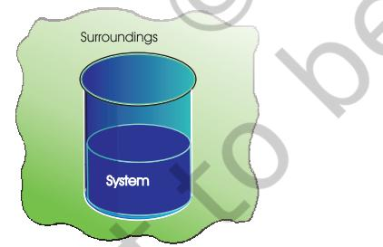

*Fig. 5.1 System and the surroundings*

Note that the system may be defined by physical boundaries, like beaker or test tube, or the system may simply be defined by a set of Cartesian coordinates specifying a particular volume in space. It is necessary to think of the system as separated from the surroundings by some sort of wall which may be real or imaginary. The wall that separates the system from the surroundings is called **boundary**. This is designed to allow us to control and keep track of all movements of matter and energy in or out of the system.

#### **5.1.2 Types of the System**

We, further classify the systems according to the movements of matter and energy in or out of the system.

#### *1. Open System*

In an open system, there is exchange of energy and matter between system and surroundings [Fig. 5.2 (a)]. The presence of reactants in an open beaker is an example of an open system*. Here the boundary is an imaginary surface enclosing the beaker and reactants.

## *2. Closed System*

In a closed system, there is no exchange of matter, but exchange of energy is possible between system and the surroundings [Fig. 5.2 (b)]. The presence of reactants in a closed vessel made of conducting material e.g., copper or steel is an example of a closed system.

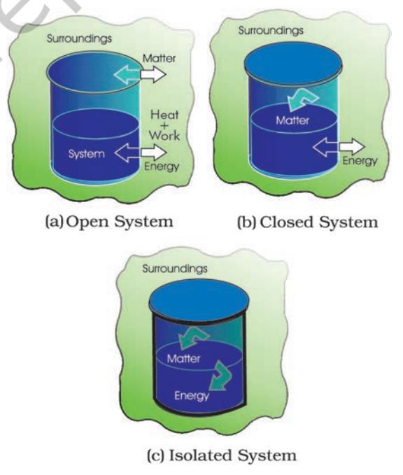

** We could have chosen only the reactants as system then walls of the beakers will act as boundary.*

Unit 5.indd 137 9/12/2022 11:53:34 AM

## *3. Isolated System*

In an isolated system, there is no exchange of energy or matter between the system and the surroundings [Fig. 5.2 (c)]. The presence of reactants in a thermos flask or any other closed insulated vessel is an example of an isolated system.

#### **5.1.3 The State of the System**

The system must be described in order to make any useful calculations by specifying quantitatively each of the properties such as its pressure (*p*), volume (*V*), and temperature (*T* ) as well as the composition of the system. We need to describe the system by specifying it before and after the change. You would recall from your Physics course that the state of a system in mechanics is completely specified at a given instant of time, by the position and velocity of each mass point of the system. In thermodynamics, a different and much simpler concept of the state of a system is introduced. It does not need detailed knowledge of motion of each particle because, we deal with average measurable properties of the system. We specify the state of the system by **state functions** or **state variables**.

The **state** of a thermodynamic system is described by its measurable or macroscopic (bulk) properties. We can describe the state of a gas by quoting its pressure (*p*), volume (*V*), temperature (*T* ), amount (*n*) etc. Variables like *p*, *V*, *T* are called **state variables** or **state functions** because their values depend only on the state of the system and not on how it is reached. In order to completely define the state of a system it is not necessary to define all the properties of the system; as only a certain number of properties can be varied independently. This number depends on the nature of the system. Once these minimum number of macroscopic properties are fixed, others automatically have definite values.

The state of the surroundings can never be completely specified; fortunately it is not necessary to do so.

## **5.1.4 The Internal Energy as a State Function**

When we talk about our chemical system losing or gaining energy, we need to introduce a quantity which represents the total energy of the system. It may be chemical, electrical, mechanical or any other type of energy you may think of, the sum of all these is the energy of the system. In thermodynamics, we call it the internal energy, *U* of the system, which may change, when

- • heat passes into or out of the system,
- • work is done on or by the system,
- • matter enters or leaves the system.

These systems are classified accordingly as you have already studied in section 5.1.2.

#### *(a) Work*

Let us first examine a change in internal energy by doing work. We take a system containing some quantity of water in a thermos flask or in an insulated beaker. This would not allow exchange of heat between the system and surroundings through its boundary and we call this type of system as **adiabatic**. The manner in which the state of such a system may be changed will be called adiabatic process. Adiabatic process is a process in which there is no transfer of heat between the system and surroundings. Here, the wall separating the system and the surroundings is called the adiabatic wall (Fig. 5.3).

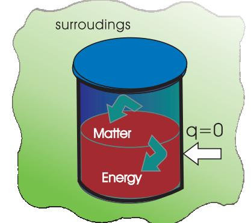

Let us bring the change in the internal energy of the system by doing some work on it. Let us call the initial state of the system as state A and its temperature as *T*A. Let the internal energy of the system in state A be called *U*A. We can change the state of the system in two different ways.

Unit 5.indd 138 9/12/2022 11:53:36 AM

*One way:* We do some mechanical work, say 1 kJ, by rotating a set of small paddles and thereby churning water. Let the new state be called B state and its temperature, as *T*B. It is found that *T*B > *T*A and the change in temperature, ∆*T* = *T*B–*T*A. Let the internal energy of the system in state B be *U*B and the change in internal energy, ∆*U* =*U*B– *U*A.

*Second way:* We now do an equal amount (i.e., 1kJ) electrical work with the help of an immersion rod and note down the temperature change. We find that the change in temperature is same as in the earlier case, say, *T*B – *T*A.

In fact, the experiments in the above manner were done by J. P. Joule between 1840–50 and he was able to show that a given amount of work done on the system, no matter how it was done (irrespective of path) produced the same change of state, as measured by the change in the temperature of the system.

So, it seems appropriate to define a quantity, the internal energy *U*, whose value is characteristic of the state of a system, whereby the adiabatic work, wad required to bring about a change of state is equal to the difference between the value of *U* in one state and that in another state, ∆*U i.e.,*

∆*U =U*2 *–U*1*=* wad

Therefore, internal energy, *U*, of the system is a state function.

By conventions of IUPAC in chemical thermodynamics. The positive sign expresses that wad is positive when work is done **on** the system and the internal energy of system increases. Similarly, if the work is done **by** the system, wad will be negative because internal energy of the system decreases.

Can you name some other familiar state functions? Some of other familiar state functions are *V*, *p*, and *T*. For example, if we bring a change in temperature of the system from 25°C to 35°C, the change in temperature is 35°C–25°C = +10°C, whether we go straight up to 35°C or we cool the system for a few degrees, then take the system to the final temperature. Thus, *T* is a state function and the change in temperature is independent of the route taken. Volume of water in a pond, for example, is a state function, because change in volume of its water is independent of the route by which water is filled in the pond, either by rain or by tubewell or by both.

#### *(b) Heat*

We can also change the internal energy of a system by transfer of heat from the surroundings to the system or vice-versa without expenditure of work. This exchange of energy, which is a result of temperature difference is called heat, *q*. Let us consider bringing about the same change in temperature (the same initial and final states as before in section 5.1.4 (a) by transfer of heat through thermally conducting walls instead of adiabatic walls (Fig. 5.4).

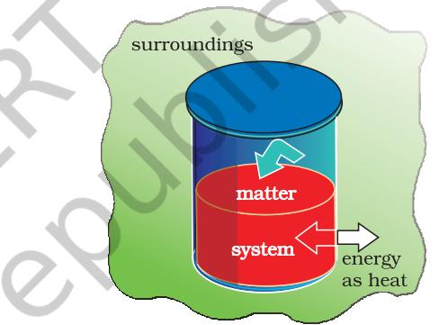

*Fig. 5.4 A system which allows heat transfer through its boundary.*

We take water at temperature, *T*A in a container having thermally conducting walls, say made up of copper and enclose it in a huge heat reservoir at temperature, *T*B. The heat absorbed by the system (water), *q* can be measured in terms of temperature difference, *T*B – *T*A. In this case change in internal energy, ∆*U* = *q*, when no work is done at constant volume.

*By conventions of IUPAC in chemical thermodynamics. The q is positive, when heat is transferred from the surroundings to the system and the internal energy of the system increases and q is negative when heat is transferred from system to the surroundings resulting in decrease of the internal energy of the system.* 

Unit 5.indd 139 9/12/2022 11:53:37 AM

<i>* *Earlier negative sign was assigned when the work is done on the system and positive sign when the work is done by the system. This is still followed in physics books, although IUPAC has recommended the use of new sign convention.*

## *(c) The general case*

Let us consider the general case in which a change of state is brought about both by doing work and by transfer of heat. We write change in internal energy for this case as:

$\Lambda U=q$ + w (5.1)

For a given change in state, *q* and w can vary depending on how the change is carried out. However, *q* +w = ∆*U* will depend only on initial and final state. It will be independent of the way the change is carried out. If there is no transfer of energy as heat or as work (isolated system) i.e., if w = 0 and *q* = 0, then ∆ *U* = 0.

The equation 5.1 i.e., ∆*U* = *q* + w is mathematical statement of the **first law of thermodynamics**, which states that

> *The energy of an isolated system is constant.*

It is commonly stated as the law of conservation of energy i.e., energy can neither be created nor be destroyed.

**Note:** There is considerable difference between the character of the thermodynamic property energy and that of a mechanical property such as volume. We can specify an unambiguous (absolute) value for volume of a system in a particular state, but not the absolute value of the internal energy. However, we can measure only the changes in the internal energy, ∆*U* of the system.

## **Problem 5.1**

Express the change in internal energy of a system when

- (i) No heat is absorbed by the system from the surroundings, but work (w) is done on the system. What type of wall does the system have ?
- (ii) No work is done on the system, but *q* amount of heat is taken out from the system and given to the surroundings. What type of wall does the system have?
- (iii) w amount of work is done by the system and *q* amount of heat is supplied to the system. What type of system would it be?

## **Solution**

- (i) ∆ *U* = w ad, wall is adiabatic
- (ii) ∆ *U* = *q*, thermally conducting walls
- (iii) ∆ *U* = *q* w, closed system.

#### **5.2 Applications**

Many chemical reactions involve the generation of gases capable of doing mechanical work or the generation of heat. It is important for us to quantify these changes and relate them to the changes in the internal energy. Let us see how!

## **5.2.1 Work**

First of all, let us concentrate on the nature of work a system can do. We will consider only mechanical work i.e., pressure-volume work.

For understanding pressure-volume work, let us consider a cylinder which contains one mole of an ideal gas fitted with a frictionless piston. Total volume of the gas is *Vi* and pressure of the gas inside is *p*. If external pressure is *p*ex which is greater than *p*, piston is moved inward till the pressure

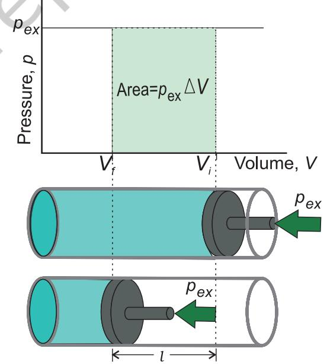

*Fig. 5.5 (a)Work done on an ideal gas in a cylinder when it is compressed by a constant external pressure, pex (in single step) is equal to the shaded area.*

Unit 5.indd 140 9/12/2022 11:53:37 AM

inside becomes equal to *p*ex. Let this change be achieved in a single step and the final volume be *Vf* . During this compression, suppose piston moves a distance, *l* and is cross-sectional area of the piston is A [Fig. 5.5(a)].

then, volume change = *l* × A = ∆*V* = (*Vf* – *Vi* ) We also know, pressure =

Therefore, force on the piston = *p*ex . A

If w is the work done on the system by movement of the piston then

$$w = force \times distance = p_{ex}. A.l = p_{ex}. (-\Delta V) = - p_{ex}\Delta V = - p_{ex}(V_{f}-V_{i}) (5.2)$$

The negative sign of this expression is required to obtain conventional sign for w, which will be positive. It indicates that in case of compression work is done on the system. Here (*Vf* – *Vi* ) will be negative and negative multiplied by negative will be positive. Hence the sign obtained for the work will be positive.

If the pressure is not constant at every stage of compression, but changes in number of finite steps, work done on the gas will be summed over all the steps and will be equal to – Σ*р*∆*V* [Fig. 5.5 (b)]

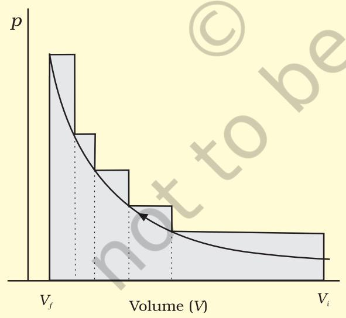

*Fig.5.5 (b) pV-plot when pressure is not constant and changes in finite steps during compression from initial volume, Vi to final volume, Vf . Work done on the gas is represented by the shaded area.* 

If the pressure is not constant but changes during the process such that it is always infinitesimally greater than the pressure of the gas, then, at each stage of compression, the volume decreases by an infinitesimal amount, *dV*. In such a case we can calculate the work done on the gas by the relation

$\mathbf{W}=-\int\limits_{V_{\ell}}^{V_{\ell}}P_{ex}dV$ (5.3)

Here, *pex* at each stage is equal to (*pin* + *dp*) in case of compression [Fig. 5.5(c)]. In an expansion process under similar conditions, the external pressure is always less than the pressure of the system i.e., *pex* = (*pin– dp*). In general case we can write, *pex* = (*pin* + *dp*). Such processes are called reversible processes.

**A process or change is said to be reversible, if a change is brought out in such a way that the process could, at any moment, be reversed by an infinitesimal change. A reversible process proceeds infinitely slowly by a series of equilibrium states such that system and the surroundings are always in near equilibrium with each other.** 

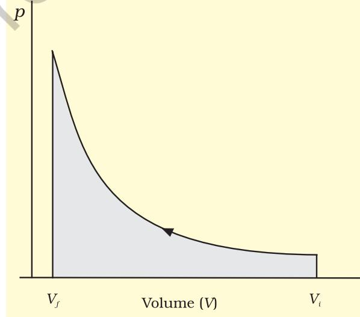

*Fig.5.5 (c) pV-plot when pressure is not constant and changes in infinite steps (reversible conditions) during compression from initial volume, Vi to final volume, Vf . Work done on the gas is represented by the shaded area.* 

Unit 5.indd 141 9/12/2022 11:53:37 AM

#### **Processes other than reversible processes are known as irreversible processes.**

In chemistry, we face problems that can be solved if we relate the work term to the **internal pressure of the system.** We can relate work to internal pressure of the system under **reversible conditions** by writing equation 5.3 as follows:

$$\mathbf{w}_{r e v}=-\int\limits_{V_{i}}^{V_{f}}P_{e x}d V=-\int\limits_{V_{i}}^{V_{f}}(p_{i n}\pm d p)\,d V$$

Since *dp* × *dV* is very small we can write

$$\begin{array}{c}\mbox{W}_{\rm rew}=-\int\limits_{V_{\rm f}}^{V_{\rm f}}P_{in}dV\\ \end{array}\tag{5.4}$$

Now, the pressure of the gas (*pin* which we can write as *p* now) can be expressed in terms of its volume through gas equation. For *n* mol of an ideal gas i.e., *pV* =*n*R*T*

$$\Rightarrow p={\frac{n\mathbb{R}T}{V}}$$

Therefore, at constant temperature (isothermal process),

$$\mathrm{W}_{\mathrm{rev}}=-\int\limits_{V_{i}}^{V_{f}}n\mathrm{R}T\,\frac{dV}{V}=-n\mathrm{R}T\ln\frac{V_{f}}{V_{i}}$$
  
  

$$=-\ 2.303\ n\mathrm{R}T\log\frac{V_{f}}{V_{i}}\tag{5.5}$$

*Free expansion:* Expansion of a gas in vacuum (*pex* = 0) is called free expansion. No work is done during free expansion of an ideal gas whether the process is reversible or irreversible (equation 5.2 and 5.3).

Now, we can write equation 5.1 in number of ways depending on the type of processes.

Let us substitute w = – *pex*∆*V* (eq. 5.2) in equation 5.1, and we get

*U q p V ex*

If a process is carried out at constant volume (∆*V* = 0), then

$$\Delta U=q_{V}$$

the subscript *V* in *qV* denotes that heat is supplied at constant volume.

## *Isothermal and free expansion of an ideal gas*

For isothermal (*T* = constant) expansion of an ideal gas into vacuum; w = 0 since *pex* = 0. Also, Joule determined experimentally that *q* = 0; therefore, ∆*U* = 0

Equation 5.1, can be expressed for isothermal irreversible and reversible changes as follows:

- 1. For isothermal irreversible change

$$q=-\,\mathrm{w}=p_{e x}\,(V_{f}-V_{i})$$

- 2. For isothermal reversible change

$$q=-\,\mathrm{w}=\,n\mathrm{R}T\ln\,{\frac{V}{n\mathrm{R}}}$$

 = 2.303 *n*R*T* log *V V f i* For adiabatic change, *q* = 0, ∆*U* = wad

## **Problem 5.2**

Two litres of an ideal gas at a pressure of 10 atm expands isothermally at 25 °C into a vacuum until its total volume is 10 litres. How much heat is absorbed and how much work is done in the expansion ?

## **Solution**

We have *q* = – w = *pex* (10 – 2) = 0(8) = 0 No work is done; no heat is absorbed.

#### **Problem 5.3**

Consider the same expansion, but this time against a constant external pressure of 1 atm.

#### **Solution**

We have *q* = – w = *pex* (8) = 8 litre-atm

#### **Problem 5.4**

Consider the expansion given in problem 5.2, for 1 mol of an ideal gas conducted reversibly.

#### **Solution**

  
### 2.303 = 2.303 nRT log $\dfrac{V_f}{V_s}$  
  
= 2.303 × 1 × 0.8206 × 298 × log $\dfrac{10}{2}$.  

Unit 5.indd 142 9/12/2022 11:53:38 AM

= 2.303 x 0.8206 x 298 x log 5

2.303 x 0.8206 x 298 x 0.6990

= 393.66 L atm

## **5.2.2 Enthalpy,** *H (a) A Useful New State Function*

We know that the heat absorbed at constant volume is equal to change in the internal energy i.e., ∆*U* = *qV*. But most of chemical reactions are carried out not at constant volume, but in flasks or test tubes under constant atmospheric pressure. We need to define another state function which may be suitable under these conditions.

We may write equation (5.1) as ∆*U = qp – p*∆*V* at constant pressure, where *qp* is heat absorbed by the system and –*p*∆*V* represent expansion work done by the system.

Let us represent the initial state by subscript 1 and final state by 2

We can rewrite the above equation as

*U*2–*U*1 = *qp* – *p* (*V*2 – *V*1)

On rearranging, we get

*qp* = (*U*2 + *pV*2) – (*U*1 + *pV*1) (5.6)

Now we can define another thermodynamic function, the enthalpy *H* [Greek word *enthalpien*, to warm or heat content] as :

$H=U+pV$  
  
$=$ (5.7)

so, equation (5.6) becomes

*qp*= *H*2 – *H*1 = ∆*H*

Although *q* is a path dependent function, *H* is a state function because it depends on *U*, *p* and *V*, all of which are state functions. Therefore, ∆*H* is independent of path. Hence, *qp* is also independent of path.

For finite changes at constant pressure, we can write equation 5.7 as

∆*H* = ∆*U* + ∆*pV*

Since *p* is constant, we can write

$\Delta H=\Delta U+p\Delta V$ (5.8)

It is important to note that when heat is absorbed by the system at constant pressure, we are actually measuring changes in the enthalpy.

Remember ∆*H* = *qp*, heat absorbed by the system at constant pressure.

## ∆*H* **is negative for exothermic reactions which evolve heat during the reaction and**  ∆*H* **is positive for endothermic reactions which absorb heat from the surroundings.**

At constant volume (∆*V* = 0), ∆*U* = *qV*, therefore equation 5.8 becomes

∆*H* = ∆*U* = *qV*

The difference between ∆*H* and ∆*U* is not usually significant for systems consisting of only solids and / or liquids. Solids and liquids do not suffer any significant volume changes upon heating. The difference, however, becomes significant when gases are involved. Let us consider a reaction involving gases. If *V*A is the total volume of the gaseous reactants, *V*B is the total volume of the gaseous products, *n*A is the number of moles of gaseous reactants and *n*B is the number of moles of gaseous products, all at constant pressure and temperature, then using the ideal gas law, we write,

 *pV*A = *n*AR*T* and *pV*B = *n*BR*T*

Thus, *pV*B – *pV*A = *n*BR*T* – *n*AR*T* = (*n*B–*n*A)R*T*

or $p\left(V_{\rm B}-V_{\rm A}\right)=\left(n_{\rm B}-n_{\rm A}\right)\,{\rm RT}$  
  
or $p\,\Delta V=\Delta n_{\rm g}{\rm RT}$ (5.9)

Here, ∆*ng* refers to the number of moles of gaseous products minus the number of moles of gaseous reactants.

Substituting the value of *p*∆*V* from equation 5.9 in equation 5.8, we get

$\Lambda H=\Lambda U+\Lambda n_{g}RT$ (5.10)

The equation 5.10 is useful for calculating ∆*H* from ∆*U* and *vice versa*.

#### **Problem 5.5**

If water vapour is assumed to be a perfect gas, molar enthalpy change for vapourisation of 1 mol of water at 1bar and 100°C is 41kJ mol–1. Calculate the internal energy change, when

Unit 5.indd 143 9/12/2022 11:53:38 AM

1 mol of water is vapourised at 1 bar pressure and 100°C.

#### **Solution**

(i) The change H2O (*l*) → H2O (g)

$$\Delta H=\Delta U+\Delta n g\mathbb{R}T$$

or ∆*U* = ∆*H* – ∆*ng* R*T*, substituting the values, we get

∆*U* = 41.00 kJ mol–1 – 1

× 8.3 J mol–1 K–1 × 373 K

- = 41.00 kJ mol-1 3.096 kJ mol-1
- = 37.904 kJ mol–1

## *(b) Extensive and Intensive Properties*

In thermodynamics, a distinction is made between extensive properties and intensive properties. An **extensive property** is a property whose value depends on the quantity or size of matter present in the system. For example, mass, volume, internal energy, enthalpy, heat capacity, etc. are extensive properties.

Those properties which do not depend on the quantity or size of matter present are known as **intensive properties**. For example temperature, density, pressure etc. are intensive properties. A molar property, χm, is the value of an extensive property χ of the system for 1 mol of the substance. If *n* is

the amount of matter, m *n* is independent of the amount of matter. Other examples are molar volume, *V*m and molar heat capacity, *C*m. Let us understand the distinction between extensive and intensive properties by considering a gas enclosed in a container of volume *V* and at temperature *T* [Fig. 5.6(a)]. Let us make a partition such that volume is halved, each part [Fig. 5.6 (b)] now has one half of the original volume, *V* 2 , but the temperature will still remain the same i.e., *T*. It is clear that volume is an extensive property and temperature is an intensive property.

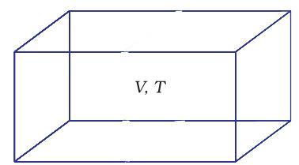

*Fig. 5.6(a) A gas at volume V and temperature T*

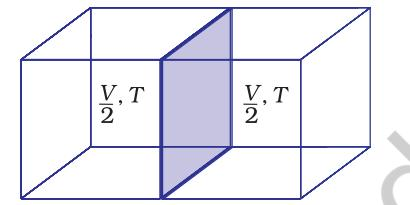

*Fig. 5.6 (b) Partition, each part having half the volume of the gas*

## *(c) Heat Capacity*

In this sub-section, let us see how to measure heat transferred to a system. This heat appears as a rise in temperature of the system in case of heat absorbed by the system.

The increase of temperature is proportional to the heat transferred

$$q=c o e f f\times\Delta T$$

The magnitude of the coefficient depends on the size, composition and nature of the system. We can also write it as *q* = *C* ∆*T*

The coefficient, *C* is called the heat capacity.

Thus, we can measure the heat supplied by monitoring the temperature rise, provided we know the heat capacity.

When *C* is large, a given amount of heat results in only a small temperature rise. Water has a large heat capacity i.e., a lot of energy is needed to raise its temperature.

*C* is directly proportional to amount of substance. The molar heat capacity of a substance, *Cm* = *C n* , is the heat capacity

for one mole of the substance and is the quantity of heat needed to raise the temperature of one mole by one degree celsius (or one kelvin). Specific heat, also called specific heat capacity is the quantity

Unit 5.indd 144 9/12/2022 11:53:39 AM

of heat required to raise the temperature of one unit mass of a substance by one degree celsius (or one kelvin). For finding out the heat, *q*, required to raise the temperatures of a sample, we multiply the specific heat of the substance, c, by the mass m, and temperatures change, ∆*T* as

$q=c\times m\times\Delta T=C\,\Delta T$ (5.11)

## *(d) The Relationship between Cp and CV for an Ideal Gas*

At constant volume, the heat capacity, *C* is denoted by *CV* and at constant pressure, this is denoted by *Cp* . Let us find the relationship between the two.

We can write equation for heat, *q*

at constant volume as *qV* = *C T V U*

at constant pressure as *qp* = *C T p H*

The difference between *Cp* and *CV* can be derived for an ideal gas as:

For a mole of an ideal gas, ∆*H* = ∆*U* + ∆(*pV* )

= ∆*U* + ∆(R*T* )

* $\Delta H=\Delta U+\mbox{R}\,\Delta T$ (5.12)

On putting the values of ∆*H* and ∆*U*, we have

$\mathbf{C}_{p}\Delta T=\mathbf{C}_{V}\Delta T+\mathbf{R}\Delta T$  
  
$\mathbf{C}_{p}=\mathbf{C}_{V}+\mathbf{R}$  
  
$\mathbf{C}_{p}-\mathbf{C}_{V}=\mathbf{R}$

## **5.3 Measurement of** ∆*U* **and** ∆*H***: Calorimetry**

We can measure energy changes associated with chemical or physical processes by an experimental technique called calorimetry. In calorimetry, the process is carried out in a vessel called calorimeter, which is immersed in a known volume of a liquid. Knowing the heat capacity of the liquid in which calorimeter is immersed and the heat capacity of calorimeter, it is possible to determine the heat evolved in the process by measuring temperature changes. Measurements are made under two different conditions:

- i) at constant volume, *qV*
- ii) at constant pressure, *qp*

#### *(a)* ∆*U Measurements*

For chemical reactions, heat absorbed at constant volume, is measured in a bomb calorimeter (Fig. 5.7). Here, a steel vessel (the bomb) is immersed in a water bath. The whole device is called calorimeter. The steel vessel is immersed in water bath to ensure that no heat is lost to the surroundings. A combustible

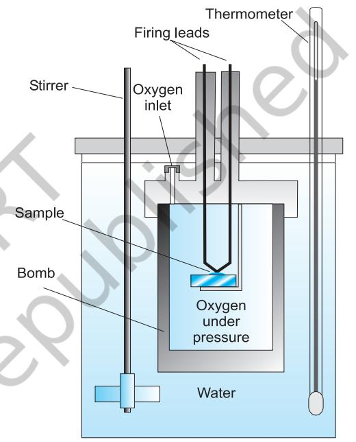

 *Fig. 5.7 Bomb calorimeter*

substance is burnt in pure dioxygen supplied in the steel bomb. Heat evolved during the reaction is transferred to the water around the bomb and its temperature is monitored. Since the bomb calorimeter is sealed, its volume does not change i.e., the energy changes associated with reactions are measured at constant volume. Under these conditions, no work is done as the reaction is carried out at constant volume in the bomb calorimeter. Even for reactions involving gases, there is no work done as ∆*V* = 0. Temperature change of the calorimeter produced by the completed reaction is then converted to *qV*, by using the known heat capacity of the calorimeter with the help of equation 5.11.

Unit 5.indd 145 9/12/2022 11:53:39 AM

## *(b)* ∆*H Measurements*

Measurement of heat change at constant pressure (generally under atmospheric pressure) can be done in a calorimeter shown in Fig. 5.8. We know that ∆Η = *qp* (at constant *p*) and, therefore, heat absorbed or evolved, *qp* at constant pressure is also called the heat of reaction or enthalpy of reaction, ∆*r H*.

In an exothermic reaction, heat is evolved, and system loses heat to the surroundings. Therefore, *qp* will be negative and ∆*r H* will also be negative. Similarly in an endothermic reaction, heat is absorbed, *qp* is positive and ∆*r H* will be positive.

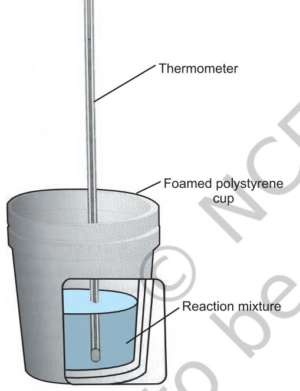

#### **Problem 5.6**

1g of graphite is burnt in a bomb calorimeter in excess of oxygen at 298 K and 1 atmospheric pressure according to the equation

C (graphite) + O2 (g) → CO2 (g)

During the reaction, temperature rises from 298 K to 299 K. If the heat capacity of the bomb calorimeter is 20.7kJ/K, what is the enthalpy change for the above reaction at 298 K and 1 atm?

#### **Solution**

Suppose *q* is the quantity of heat from the reaction mixture and *CV* is the heat capacity of the calorimeter, then the quantity of heat absorbed by the calorimeter.

$$q=C_{V}\times\Delta T$$

Quantity of heat from the reaction will have the same magnitude but opposite sign because the heat lost by the system (reaction mixture) is equal to the heat gained by the calorimeter.

$$q=C_{V}\times\Delta T=-20.7 kJ/K\times (299 - 298) K\times 20.7 kJ$$

(Here, negative sign indicates the exothermic nature of the reaction)

Thus, ∆*U* for the combustion of the 1g of graphite = – 20.7 kJK–1

For combustion of 1 mol of graphite,

12.0 g mol${}^{-1}$ x(-20.7 k)

1 g

=

= – 2.48 ×102 kJ mol–1 , Since ∆ *ng* = 0, ∆ *H* = ∆ *U* = – 2.48 ×102 kJ mol–1

#### **5.4 Enthalpy change,** ∆*r H* **of a reaction – Reaction Enthalpy**

In a chemical reaction, reactants are converted into products and is represented by,

Reactants → Products

The enthalpy change accompanying a reaction is called the **reaction enthalpy**. The enthalpy change of a chemical reaction, is given by the symbol ∆*r H*

∆*r H* = (sum of enthalpies of products) – (sum of enthalpies of reactants)

$$=\sum_{i}a_{i}H_{\rm products}-\sum_{i}b_{i}H_{\rm reactants}\tag{5.14}$$

Here symbol ∑ (sigma) is used for summation and a*i* and b*i* are the stoichiometric

Unit 5.indd 146 9/12/2022 11:53:40 AM

coefficients of the products and reactants respectively in the balanced chemical equation. For example, for the reaction

$\rm CH_{4}$ (g) + 2O${}_{2}$ (g) $\rightarrow$ CO${}_{2}$ (g) + 2H${}_{2}$O ($\lambda$)  
  
$A_{r}H=\sum a_{i}H_{\rm Pr\,\,\mbox{\tiny\it ordus}}-\sum b_{i}H_{\rm\,\,\mbox{\tiny\it reac\,\,\it tan\,\it is}}$  
  
$=[H_{\rm m}^{i}\,(CO_{2},\,g)+2H_{\rm m}^{i}\,(H_{2}O,\,\lambda)-[H_{\rm m}\,(CH_{4},\,g)$  
  
$+\,2H_{\rm m}\,(O_{2},\,g)]$

where *H*m is the molar enthalpy.

Enthalpy change is a very useful quantity. Knowledge of this quantity is required when one needs to plan the heating or cooling required to maintain an industrial chemical reaction at constant temperature. It is also required to calculate temperature dependence of equilibrium constant.

#### *(a) Standard Enthalpy of Reactions*

Enthalpy of a reaction depends on the conditions under which a reaction is carried out. It is, therefore, necessary that we must specify some standard conditions. **The standard enthalpy of reaction is the enthalpy change for a reaction when all the participating substances are in their standard states.**

**The standard state of a substance at a specified temperature is its pure form at 1 bar.** For example, the standard state of liquid

ethanol at 298 K is pure liquid ethanol at 1 bar; standard state of solid iron at 500 K is pure iron at 1 bar. Usually data are taken at 298 K.

Standard conditions are denoted by adding the superscript to the symbol ∆*H*, e.g., ∆*H*

## *(b) Enthalpy Changes during Phase Transformations*

Phase transformations also involve energy changes. Ice, for example, requires heat for melting. Normally this melting takes place at constant pressure (atmospheric pressure) and during phase change, temperature remains constant (at 273 K).

H2O(s) → H2O(*l*); ∆*fusH* = 6.00 kJ moI–1 Here ∆*fusH* is enthalpy of fusion in standard state. If water freezes, then process is reversed and equal amount of heat is given off to the surroundings.

**The enthalpy change that accompanies melting of one mole of a solid substance in standard state is called standard enthalpy of fusion or molar enthalpy of fusion,**  ∆*fusH*.

Melting of a solid is endothermic, so all enthalpies of fusion are positive. Water

| Substance | Tf/K |  | △fus Hº / (KJ mol -)   Tb/K   △vapH® ((kJ mol -1) |  |
| --- | --- | --- | --- | --- |
| N2 | 63.15 | 0.72 | 77.35 | 5.59 |
| NH3 | 195.40 | 5.65 | 239.73 | 23.35 |
| HCl | 159.0 | 1.992 | 188.0 | 16.15 |
| CO | 68.0 | 6.836 | 82.0 | 6.04 |
| CH COCH, | 177.8 | 5.72 | 329.4 | 29.1 |
| CCI4 | 250.16 | 2.5 | 349.69 | 30.0 |
| H,O | 273.15 | 6.01 | 373.15 | 40.79 |
| NaCl | 1081.0 | 28.8 | 1665.0 | 170.0 |
| С°Н° | 278.65 | 9.83 | 353.25 | 30.8 |

#### **Table 5.1 Standard Enthalpy Changes of Fusion and Vaporisation**

*(Tf and Tb are melting and boiling points, respectively)*

Unit 5.indd 147 9/12/2022 11:53:40 AM

requires heat for evaporation. At constant temperature of its boiling point *T*b and at constant pressure:

H2O(*l*) → H2O(g); ∆*vapH* = + 40.79 kJ moI–1 ∆*vapH* is the standard enthalpy of vaporisation.

**Amount of heat required to vaporize one mole of a liquid at constant temperature and under standard pressure (1bar) is called its standard enthalpy of vaporization or molar enthalpy of vaporization,** ∆*vapH***.** 

Sublimation is direct conversion of a solid into its vapour. Solid CO2 or 'dry ice' sublimes at 195K with ∆*subH*=25.2 kJ mol–1; naphthalene sublimes slowly and for this ∆*sub H* = 73.0 kJ mol–1 .

**Standard enthalpy of sublimation,** ∆*subH* **is the change in enthalpy when one mole of a solid substance sublimes at a constant temperature and under standard pressure (1bar).**

The magnitude of the enthalpy change depends on the strength of the intermolecular interactions in the substance undergoing the phase transfomations. For example, the strong hydrogen bonds between water molecules hold them tightly in liquid phase. For an organic liquid, such as acetone, the intermolecular dipole-dipole interactions are significantly weaker. Thus, it requires less heat to vaporise 1 mol of acetone than it does to vaporize 1 mol of water. Table 5.1 gives values of standard enthalpy changes of fusion and vaporisation for some substances.

## **Problem 5.7**

A swimmer coming out from a pool is covered with a film of water weighing about 18g. How much heat must be supplied to evaporate this water at 298 K ? Calculate the internal energy of vaporisation at 298K.

∆*vap H* for water at 298K= 44.01kJ mol–1

#### **Solution**

We can represent the process of evaporation as

$$\begin{array}{r}{\mathrm{H_{2}O(l)}\,{\xrightarrow[1\,m o l]{\mathrm{\scriptsize~\scriptsize~vaporisation}}}\,\mathrm{H_{2}O(g)}}\\ {\mathrm{1\,mol}}\end{array}$$

No. of moles in 18 g H2O(l) is

$$={\frac{18\mathrm{g}}{18\mathrm{g}\mathrm{~mol}^{-1}}}=1\mathrm{~mol}$$

Heat supplied to evaporate18g water at 298 K = n × ∆*vap H*

(1 mol) x (44.01 kJ mol${}^{-1}$)  
  
= 44.01 kJ

(assuming steam behaving as an ideal gas).

$\Lambda_{\rm vap}H^{\rm p}-\Lambda_{\rm vap}H^{\rm p}-\Lambda_{\rm vap}H^{\rm p}-\Lambda_{\rm vap}RT$

$\Lambda_{\rm vap}H^{V}-\Lambda_{\rm gas}RT=44.01$ kJ  
  
$-(1)(8.314$ J/K${}^{1}$mol${}^{-1})(298$K)(10${}^{-3}$kJ J${}^{-1})$  
  
$\Lambda_{\rm vap}H^{V}=44.01$ kJ - 2.48kJ  
  
$\Lambda_{\rm vap}H^{V}=41.53$ kJ

## **Problem 5.8**

Assuming the water vapour to be a perfect gas, calculate the internal energy change when 1 mol of water at 100°C and 1 bar pressure is converted to ice at 0°C. Given the enthalpy of fusion of ice is 6.00 kJ mol-1 heat capacity of water is 4.2 J/g°C

The change take place as follows: Step - 1 1 mol H2O (l, 100°C) 1 mol (l, 0°C) Enthalpy change ∆H1

- Step 2 1 mol H2O (l, 0°C) 1 mol H2O( S, 0°C) Enthalpy change ∆H2 Total enthalpy change will be - ∆H = ∆H1 + ∆H2 ∆H1 = - (18 x 4.2 x 100) J mol-1 = - 7560 J mol-1 = - 7.56 k J mol-1
∆H2 = - 6.00 kJ mol-1

Unit 5.indd 148 9/12/2022 11:53:40 AM

| Substance | △, H / (kJ mol-1) | Substance | △; H° / (kJ mol-1) |
| --- | --- | --- | --- |
| Al2O3(s) | -1675.7 | HI(g) | +26.48 |
| BaCO3(s) | -1216.3 | KCl(s) | -436.75 |
| Br2(1) | 0 | KBr(s) | -393.8 |
| Br2(g) | +30.91 | MgO(s) | -601.70 |
| CaCO3(s) | -1206.92 | Mg(OH)2(s) | -924.54 |
| C (diamond) | +1.89 | NaF(s) | -573.65 |
| C (graphite) | 0 | NaCl(s) | -411.15 |
| CaO(s) | - 635.09 | NaBr(s) | -361.06 |
| CH4(g) | -74.81 | NaI(s) | -287.78 |
| C2H4(g) | 52.26 | NH3(g) | -46.11 |
| CH3OH(I) | -238.86 | NO(g) | + 90.25 |
| C2H2OH(I) | -277.69 | NO2(g) | +33.18 |
| C6H6(1) | + 49.0 | PC13(1) | -319.70 |
| CO(g) | -110.53 | PC15(s) | -443.5 |
| CO2(g) | -393.51 | SiO2(s) (quartz) | -910.94 |
| C2H6(g) | -84.68 | SnCl2(s) | -325.1 |
| Cl2(g) | 0 | SnCl4(1) | -511.3 |
| C3H8(g) | -103.85 | SO2(g) | -296.83 |
| n-C4H10(g) | -126.15 | SO3(g) | -395.72 |
| HgS(s) red | -58.2 | SiH4(g) | + 34 |
| H2(g) | 0 | SiCl4(g) | -657.0 |
| H2O(g) | -241.82 | C(g) | +716.68 |
| H2O(1) | -285.83 | H(8) | +217.97 |
| HF(g) | -271.1 | Cl(g) | +121.68 |
| HCl(g) | -92.31 | Fe2O3 (s) | -824.2 |
| HBr(g) | -36.40 |  |  |

**Table 5.2 Standard Molar Enthalpies of Formation (**∆*f H* **) at 298K of a Few Selected Substances**

Therefore,

 ∆H = - 7.56 kJ mol-1 + (-6.00 kJ mol-1) = -13.56 kJ mol-1

There is negligible change in the volume during the change form liquid to solid state.

Therefore, p∆v = ∆ng RT = 0 ∆H = ∆U = - 13.56kJ mol-1

#### *(c) Standard Enthalpy of Formation*

**The standard enthalpy change for the formation of one mole of a compound from its elements in their most stable states**  **of aggregation (also known as reference states) is called Standard Molar Enthalpy of Formation. Its symbol is** ∆*f H*, where the subscript ' *f* ' indicates that one mole of the compound in question has been formed in its standard state from its elements in their most stable states of aggregation. The reference state of an element is its most stable state of aggregation at 25°C and 1 bar pressure. For example, the reference state of dihydrogen is H2 gas and those of dioxygen, carbon and sulphur are O2 gas, Cgraphite and Srhombic respectively. Some reactions with standard molar enthalpies of formation are as follows.

Unit 5.indd 149 9/12/2022 11:53:40 AM

H2(g) + ½O2 (g) → H2O(1); ∆*f H* = –285.8 kJ mol–1 C (graphite, s) + 2H2(g) → Ch4 (g); ∆*f H* = –74.81 kJ mol–1 2C (graphite, s)+3H2 (g)+ ½O2(g) → C2H5OH(1); ∆*f H* = – 277.7kJ mol–1

It is important to understand that a standard molar enthalpy of formation, ∆*f H* , is just a special case of ∆*r H*, where one mole of a compound is formed from its constituent elements, as in the above three equations, where 1 mol of each, water, methane and ethanol is formed. In contrast, the enthalpy change for an exothermic reaction:

CaO(s) + CO2(g) → CaCo3(s);

$$\Delta_{r}H^{\ominus}={\mathrm{\small-~178.3k J~mol^{-1}~}}$$

is not an enthalpy of formation of calcium carbonate, since calcium carbonate has been formed from other compounds, and not from its constituent elements. Also, for the reaction given below, enthalpy change is not standard enthalpy of formation, ∆*f H* for HBr(g).

H${}_{2}$(g) + Br${}_{2}$($\delta$) $\rightarrow$ 2HBr(g);  
  
$\Delta_{r}H^{\circ}=-178.3kJ$ mol${}^{-1}$

Here two moles, instead of one mole of the product is formed from the elements, i.e.,

$$\Delta_{r}H^{\ominus}=2\Delta_{f}H^{\ominus}$$

Therefore, by dividing all coefficients in the balanced equation by 2, expression for enthalpy of formation of HBr (g) is written as ½H2(g) + ½Br2(1) → HBr(g);

∆*f H* = – 36.4 kJ mol–1

Standard enthalpies of formation of some common substances are given in Table 5.2.

By convention, standard enthalpy for formation, ∆*f H*, of an element in reference state, i.e., its most stable state of aggregation is taken as zero.

Suppose, you are a chemical engineer and want to know how much heat is required to decompose calcium carbonate to lime and carbon dioxide, with all the substances in their standard state.

$$\mathrm{CaCO_{3}(s)\to C a O(s)+C O_{2}(g);\Delta_{r}H^{\ominus}=?}$$

Here, we can make use of standard enthalpy of formation and calculate the enthalpy change for the reaction. The following general equation can be used for the enthalpy change calculation.

$\Lambda_{r}H^{\rm e}=\sum_{i}\,\,\,{\rm a}_{i}H^{\rm e}({\rm products})-\sum_{i}\,\,\,{\rm b}_{i}\Lambda_{f}H^{\rm e}({\rm reactants})$

where a and b represent the coefficients of the products and reactants in the balanced equation. Let us apply the above equation for decomposition of calcium carbonate. Here, coefficients 'a' and 'b' are 1 each. Therefore,

$$\Lambda_{f}H^{\oplus}=\Lambda_{f}H^{\oplus}=[CaO(s)]+\Lambda_{f}H^{\oplus}[CO{}_{2}(g)]-\Lambda_{f}H^{\oplus}=[CaCO{}_{3}(s)]

=1 (-635.1 kJ mol{}^{-1}) + 1(-393.5 kJ mol{}^{-1})

=1 (-1206.9 kJ mol{}^{-1})$$

= 178.3 kJ mol–1

Thus, the decomposition of CaCO3 (s) is an endothermic process and you have to heat it for getting the desired products.

## *(d) Thermochemical Equations*

A balanced chemical equation together with the value of its ∆*r H* is called a thermochemical equation. We specify the physical state (alongwith allotropic state) of the substance in an equation. For example:

$\rm{C_{2}H_{5}OH(\!\!\!\!/)+3O_{2}(\!\!\!\!/)\to2CO_{2}(\!\!\!\!/)+3H_{2}O(\!\!\!\!/)}$;  
  
$\rm{A_{f}H^{5}=-1367\ kJ\ mol^{-1}}$

The above equation describes the combustion of liquid ethanol at constant temperature and pressure. The negative sign of enthalpy change indicates that this is an exothermic reaction.

It would be necessary to remember the following conventions regarding thermochemical equations.

- 1. The coefficients in a balanced thermochemical equation refer to the number of moles (never molecules) of reactants and products involved in the reaction.
- 2. The numerical value of ∆*r H* refers to the number of moles of substances specified by an equation. Standard enthalpy change ∆*r H* will have units as kJ mol–1.

Unit 5.indd 150 9/12/2022 11:53:40 AM

To illustrate the concept, let us consider the calculation of heat of reaction for the following reaction :

$$\mathrm{Fe}_{2}\mathrm{O}_{3}\left(\mathrm{s}\right)+3\mathrm{H}_{2}\left(\mathrm{g}\right)\to2\mathrm{Fe}\left(\mathrm{s}\right)+3\mathrm{H}_{2}\mathrm{O}\left(1\right),$$

From the Table (5.2) of standard enthalpy of formation (∆*f H*), we find :

∆*f H* (H2O,*l*) = –285.83 kJ mol–1; ∆*f H* (Fe2O3,s) = – 824.2 kJ mol–1; Also ∆*f H* (Fe, s) = 0 and

 ∆*f H* (H2, g) = 0 as per convention Then,

∆*f H*1 = 3(–285.83 kJ mol–1) – 1(– 824.2 kJ mol–1) = (–857.5 + 824.2) kJ mol–1 = –33.3 kJ mol–1

Note that the coefficients used in these calculations are pure numbers, which are equal to the respective stoichiometric coefficients. The unit for ∆*r H* is kJ mol–1, which means *per mole of reaction*. Once we balance the chemical equation in a particular way, as above, this defines the *mole of reaction*. If we had balanced the equation differently, for example,

$${\frac{1}{2}}\operatorname{Fe}_{2}\!\mathrm{O}_{3}\left(\mathbf{s}\right)+{\frac{3}{2}}\mathrm{H}_{2}\left(\mathbf{g}\right)\to\operatorname{Fe}(\mathbf{s})+{\frac{3}{2}}\mathrm{H}_{2}\!\mathrm{O}(1)$$

then this amount of reaction would be one mole of reaction and ∆*r H* would be

$\Lambda_{f}H_{2}^{\circ}=\frac{3}{2}$(-285.83 kJ mol${}^{-1}$)  
  
$-\frac{1}{2}$(-824.2 kJ mol${}^{-1}$)  
  
$=$ (- 428.7 + 412.1) kJ mol${}^{-1}$  
  
$=$ -16.6 kJ mol${}^{-1}$ = $\sqrt[1]{2}$A $H_{2}^{\circ}$

It shows that enthalpy is an extensive quantity.

- 3. When a chemical equation is reversed, the value of ∆*r H* is reversed in sign. For example
$\rm N_{2}(g)+3H_{2}(g)\to2NH_{3}(g)$;  
  
$\rm\Delta_{r}H^{\circ}=-91.8$ kJ. mol${}^{-1}$  
  
$\rm2NH_{3}(g)\to N_{2}(g)+3H_{2}(g)$;  
  
$\rm\Delta_{r}H^{\circ}=+91.8$ kJ mol${}^{-1}$

## *(e) Hess's Law of Constant Heat Summation*

We know that enthalpy is a state function, therefore the change in enthalpy is independent of the path between initial state (reactants) and final state (products). In other words, enthalpy change for a reaction is the same whether it occurs in one step or in a series of steps. This may be stated as follows in the form of Hess's Law.

**If a reaction takes place in several steps then its standard reaction enthalpy is the sum of the standard enthalpies of the intermediate reactions into which the overall reaction may be divided at the same temperature.**

Let us understand the importance of this law with the help of an example.

Consider the enthalpy change for the reaction

(graphite,s) + 20(g) $\rightarrow$ CO (g); $\Delta_{r}H^{\circ}=$ ?

Although CO(g) is the major product, some CO2 gas is always produced in this reaction. Therefore, we cannot measure enthalpy change for the above reaction directly. However, if we can find some other reactions involving related species, it is possible to calculate the enthalpy change for the above reaction.

Let us consider the following reactions: C (graphite,s) + O2 (g) → CO2 (g);

∆*r H* = – 393.5 kJ mol–1 (i)

$$\mathrm{CO~(g)+\frac{1}{2}\,O_{2}~(g)\to C O_{2}~(g)}$$
 
$$\Delta_{r}H^{\circ}=-\ 283.0\ \mathrm{kJ~mol^{-1}}$$
 (ii)

We can combine the above two reactions in such a way so as to obtain the desired reaction. To get one mole of CO(g) on the right, we reverse equation (ii). In this, heat is absorbed instead of being released, so we change sign of ∆*r H* value

$\rm CO_{2}$ (g) $\rightarrow$ CO (g) + $\frac{1}{2}$ O${}_{2}$ (g);  
  
$\rm A_{r}H^{\circ}=+283.0$ kJ mol${}^{-1}$ (iii)

Unit 5.indd 151 9/12/2022 11:53:41 AM

Adding equation (i) and (iii), we get the desired equation,

$$\mathrm{C}(\mathrm{graphite},\mathrm{s})+{\frac{1}{2}}\mathrm{O}_{2}\left(\mathrm{g}\right)\to\mathrm{CO}(\mathrm{g});$$
  
for which $\mathrm{A}_{r}H^{\ominus}$ = (– 393.5 + 283.0) = – 110.5 kJ mol${}^{-1}$

In general, if enthalpy of an overall reaction A→B along one route is ∆*r H* and ∆*r H*1, ∆*r H*2, ∆*r H*3..... representing enthalpies of reactions leading to same product, B along another route, then we have

∆*r H* = ∆*r H*1 + ∆*r H*2 + ∆*r H*3 ... (5.16)

It can be represented as:

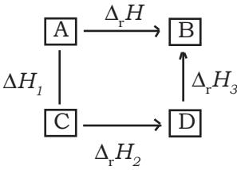

## **5.5 Enthalpies for different types of reactions**

It is convenient to give name to enthalpies specifying the types of reactions.

#### *(a) Standard Enthalpy of Combustion (symbol :* ∆*c H )*

Combustion reactions are exothermic in nature. These are important in industry, rocketry, and other walks of life. Standard enthalpy of combustion is defined as the enthalpy change per mole (or per unit amount) of a substance, when it undergoes combustion and all the **reactants and products** being in their standard states at the specified temperature.

Cooking gas in cylinders contains mostly butane (C4H10). During complete combustion of one mole of butane, 2658 kJ of heat is released. We can write the thermochemical reactions for this as:

$$\mathrm{C_{4}H_{10}(g)+\frac{13}{2}\,O_{2}(g)\to4C O_{2}(g)+5H_{2}O(l);}$$
  

$$\Delta_{c}H^{\ominus}\,=-\,2658.0\,\,\mathrm{kJ\ mol^{-1}}$$

Similarly, combustion of glucose gives out 2802.0 kJ/mol of heat, for which the overall equation is :

$$\begin{array}{c}{{\mathrm{C_{6}H_{12}O_{6}(g)+6O_{2}(g)\to6C O_{2}(g)+6H_{2}O(l);}}}\\ {{\mathrm{\Delta_{C}H^{\ominus}=-\ 2802.0\ kJ\ mol^{-1}}}}\end{array}$$

Our body also generates energy from food by the same overall process as combustion, although the final products are produced after a series of complex bio-chemical reactions involving enzymes.

#### **Problem 5.9**

The combustion of one mole of benzene takes place at 298 K and 1 atm. After combustion, CO2(g) and H2O (1) are produced and 3267.0 kJ of heat is liberated. Calculate the standard enthalpy of formation, ∆*f H* of benzene. Standard enthalpies of formation of CO2(g) and H2O(l) are –393.5 kJ mol–1 and – 285.83 kJ mol–1 respectively.

#### **Solution**

The formation reaction of benezene is given by :

6 3 C g 2 6 6 raphite H g C H l ;

∆*f H* = ? ... (i)

The enthalpy of combustion of 1 mol of benzene is :

$$\mathrm{C_{6}H_{6}\left(l\right)+\frac{15}{2}O_{2}\to6C O_{2}\left(g\right)+3H_{2}O\left(l\right);}$$

∆*C H* = – 3267 kJ mol–1... (ii)

The enthalpy of formation of 1 mol of CO2(g) :

$$\mathrm{C}\,(\mathrm{graphite})+\mathrm{O}_{2}\,(\mathrm{g})\to\mathrm{CO}_{2}\,(\mathrm{g});$$

∆*f H* = – 393.5 kJ mol–1... (iii)

The enthalpy of formation of 1 mol of H2O(l) is :

$$\mathrm{H}_{2}\left({\bf g}\right)+\frac{1}{2}\mathrm{O}_{2}\left({\bf g}\right)\rightarrow\mathrm{H}_{2}\mathrm{O}(1);$$

∆*C H* = – 285.83 kJ mol–1... (iv)

multiplying eqn. (iii) by 6 and eqn. (iv) by 3 we get:

Unit 5.indd 152 9/12/2022 11:53:41 AM

6 6 C g raphite O 2 2 g C 6 O g ; ∆*f H* = – 2361 kJ mol–1 3 3 2 Hg Og 2 2 3 1 H O2 ; ∆*f H* = – 857.49 kJ mol–1 Summing up the above two equations :

6 3 15 2 6 3 2 2 2 2 C graphite H g O g CO g H O l ;

∆*f H* = – 3218.49 kJ mol–1... (v)

Reversing equation (ii);

$$6\mathrm{CO}_{2}\left(\mathrm{g}\right)+3\mathrm{H}_{2}\mathrm{O}(1)\to\mathrm{C}_{6}\mathrm{H}_{6}\left(1\right)+\frac{15}{2}\mathrm{O}_{2};$$

∆*f H* = – 3267.0 kJ mol–1... (vi)

Adding equations (v) and (vi), we get 6 3 C g 2 6 6 raphite H g C H l ; ∆*f H* = – 48.51 kJ mol–1... (iv)

## *(b) Enthalpy of Atomization (symbol:* ∆*aH***)**

Consider the following example of atomization of dihydrogen

H2(g) → 2H(g); ∆*aH* = 435.0 kJ mol–1 You can see that H atoms are formed by breaking H–H bonds in dihydrogen. The enthalpy change in this process is known as enthalpy of atomization, ∆*aH*. It is the enthalpy change on breaking one mole of bonds completely to obtain atoms in the gas phase.

In case of diatomic molecules, like dihydrogen (given above), the enthalpy of atomization is also the bond dissociation enthalpy. The other examples of enthalpy of atomization can be

CH4(g) → C(g) + 4H(g); ∆*aH* = 1665 kJ mol–1

Note that the products are only **atoms** of C and H in gaseous phase. Now see the following reaction:

$$\mathrm{Na(s)~\to~Na(g);~}\Delta_{a}H^{\ominus}\mathrm{=108.4~k J~mol^{-1}}$$

In this case, the enthalpy of atomization is same as the enthalpy of sublimation.

## *(c) Bond Enthalpy (symbol:* ∆*bondH***)**

Chemical reactions involve the breaking and making of chemical bonds. Energy is required to break a bond and energy is released when a bond is formed. It is possible to relate heat of reaction to changes in energy associated with breaking and making of chemical bonds. With reference to the enthalpy changes associated with chemical bonds, two different terms are used in thermodynamics.

(i) Bond dissociation enthalpy

(ii) Mean bond enthalpy

Let us discuss these terms with reference to diatomic and polyatomic molecules.

*Diatomic Molecules:* Consider the following process in which the bonds in one mole of dihydrogen gas (H2) are broken:

H2(g) → 2H(g); ∆H–H*H* = 435.0 kJ mol–1 The enthalpy change involved in this process is the bond dissociation enthalpy of H–H bond. The bond dissociation enthalpy is the change in enthalpy when one mole of covalent bonds of a gaseous covalent compound is broken to form products in the gas phase.

Note that it is the same as the enthalpy of atomization of dihydrogen. This is true for all diatomic molecules. For example:

$$\mathrm{Cl}_{2}(\mathrm{g})\ \to\ 2\mathrm{Cl}(\mathrm{g});\ \Delta_{\mathrm{Cl-Cl}}H^{\ominus}\ =242\ \mathrm{kJ\ mol^{-1}}$$

O2(g) → 2O(g); ∆O=O*H* = 428 kJ mol–1

In the case of polyatomic molecules, bond dissociation enthalpy is different for different bonds within the same molecule.

*Polyatomic Molecules:* Let us now consider a polyatomic molecule like methane, CH4. The overall thermochemical equation for its atomization reaction is given below:

$$\mathrm{CH_{4}(g)\to C(g)+4H(g);}$$

∆*a H* = 1665 kJ mol–1

In methane, all the four C – H bonds are identical in bond length and energy. However, the energies required to break the individual C – H bonds in each successive step differ :

Unit 5.indd 153 9/12/2022 11:53:42 AM

CH4(g) → CH3(g)+H(g);∆*bond H* = +427 kJ mol–1 CH3(g) → CH2(g)+H(g);∆*bond H* = +439 kJ mol–1 CH2(g) → CH(g)+H(g);∆*bond H* = +452 kJ mol–1 CH(g) → C(g)+H(g);∆*bond H* = +347 kJ mol–1 Therefore,

CH4(g) → C(g)+4H(g);∆*a H* = 1665 kJ mol–1

## In such cases we use **mean bond enthalpy of C – H bond**.

For example in CH${}_{4}$, $\Lambda_{\rm C-H}H^{\circ}$ is calculated as: $\Lambda_{\rm C-H}H^{\circ}$= 1/4 ($\Lambda_{a}H^{\circ}$) = 1/4 (1665 kJ mol${}^{-1}$) = 416 kJ mol${}^{-1}$

We find that mean C–H bond enthalpy in methane is 416 kJ/mol. It has been found that mean C–H bond enthalpies differ slightly from compound to compound, as in CH3CH2Cl, CH3NO2, etc., but it does not differ in a great deal*. Using Hess's law, bond enthalpies can be calculated. Bond enthalpy values of some single and multiple bonds are given in Table 5.3. The reaction enthalpies are very important quantities as these arise from the changes that accompany the breaking of old bonds and formation of the new bonds. We can predict enthalpy of a reaction in gas phase, if we know different bond enthalpies. The standard enthalpy of reaction, ∆*r H* is related to bond enthalpies of the reactants and products in gas phase reactions as:

$\Lambda_{r}H^{\oplus}=\sum$ bond enthalpiesreactants  
  
$-\sum$ bond enthalpiesproducts (5.17)${}^{\pm\pm}$

This relationship is particularly more useful when the required values of ∆*f H* are not available. The net enthalpy change of a reaction is the amount of energy required to break all the bonds in the reactant molecules minus the amount of energy required to break all the bonds in the product molecules. Remember that this relationship is approximate and is valid when all substances

#### **Table 5.3(a) Some Mean Single Bond Enthalpies in kJ mol–1 at 298 K**

| H | C | N | O | F | Si | P | S | Cl | Br | I |  |
| --- | --- | --- | --- | --- | --- | --- | --- | --- | --- | --- | --- |
| 435.8 | 414 | 389 | 464 | 569 | 293 | 318 | 339 | 431 | 368 | 297 | H |
|  | 347 | 293 | 351 | 439 | 289 | 264 | 259 | 330 | 276 | 238 | C |
|  |  | 159 | 201 | 272 | - | 209 | - | 201 | 243 | - | N |
|  |  |  | 138 | 184 | 368 | 351 | - | 205 | - | 201 | O |
|  |  |  |  | 155 | 540 | 490 | 327 | 255 | 197 | - | F |
|  |  |  |  |  | 176 | 213 | 226 | 360 | 289 | 213 | Si |
|  |  |  |  |  |  | 213 | 230 | 331 | 272 | 213 | P |
|  |  |  |  |  |  |  | 213 | 251 | 213 | - | S |
|  |  |  |  |  |  |  |  | 243 | 218 | 209 | CI |
|  |  |  |  |  |  |  |  |  | 192 | 180 | Br |
|  |  |  |  |  |  |  |  |  |  | 151 | I |

#### **Table 5.3(b) Some Mean Multiple Bond Enthalpies in kJ mol–1 at 298 K**

| N = N | 418 | C = C | 611 | O = O | 498 |
| --- | --- | --- | --- | --- | --- |
| N ≡ N | 946 | C ≡ C | 837 |  |  |
| C = N | 615 | C = O | 741 |  |  |
| C ≡ N | 891 | C ≡ O | 1070 |  |  |

* *Note that symbol used for bond dissociation enthalpy and mean bond enthalpy is the same.*

** *If we use enthalpy of bond formation, (*∆*f Hbond ), which is the enthalpy change when one mole of a particular type of bond is formed from gaseous atom, then* ∆*f H =* ∑ ∆*f H bonds of products –* ∑ ∆*f H bonds of reactants* 

Unit 5.indd 154 9/12/2022 11:53:42 AM

(reactants and products) in the reaction are in gaseous state.

#### *(d) Lattice Enthalpy*

The lattice enthalpy of an ionic compound is the enthalpy change which occurs when one mole of an ionic compound dissociates into its ions in gaseous state.

Na Cl s Na g Cl g ( ) ;

$$\Delta_{\mathrm{lattice}}H^{\ominus}={\mathrm{+788~kJ~mol^{-1}}}$$

Since it is impossible to determine lattice enthalpies directly by experiment, we use an indirect method where we construct an enthalpy diagram called a **Born-Haber Cycle** (Fig. 5.9).

Let us now calculate the lattice enthalpy of Na+Cl– (s) by following steps given below :

- 1. Na( ) s N → a g( ) , *sublimation of sodium metal,* ∆*subH* = 108.4 kJ mol–1
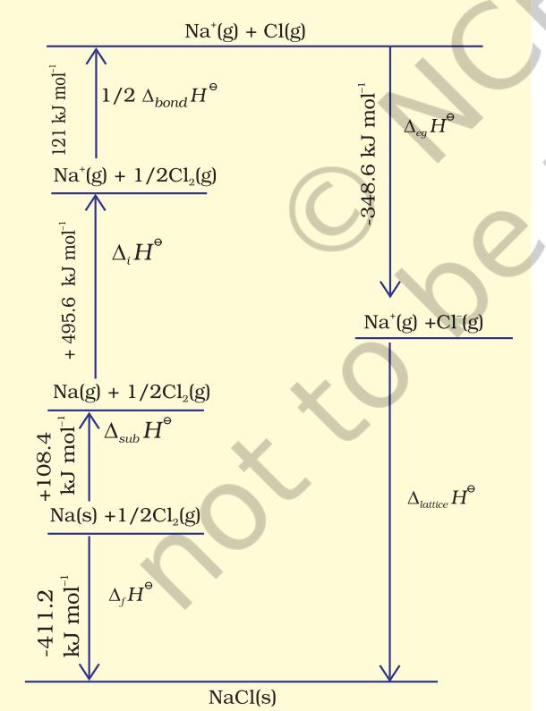

*Fig. 5.9 Enthalpy diagram for lattice enthalpy of NaCl*

- 2. Na() () g N a g e g( ) 1 , the *ionization of sodium atoms*, ionization enthalpy ∆*i H* = 496 kJ mol–1
- 3. 1 2 Cl2( ) g C → l g( ), the *dissociation of*

*chlorine*, the reaction enthalpy is half the bond dissociation enthalpy.

$$\frac{1}{2}\Delta_{_{b o n d}}H^{\ominus}=\,121\mathrm{~k J~mol^{-1}}$$

- 4. Cl() () g e g Cl g( ) 1 *electron gained* by chlorine atoms. The electron gain enthalpy, ∆*egH*  = – 348.6 kJ mol–1. You have learnt about ionization enthalpy and electron gain enthalpy in Unit 3. In fact, these terms have been taken from thermodynamics. Earlier terms, ionization energy and electron affinity were in practice in place of the above terms (see the box for justification).
#### **Ionization Energy and Electron Affinity**

Ionization energy and electron affinity are defined at absolute zero. At any other temperature, heat capacities for the reactants and the products have to be taken into account. Enthalpies of reactions for

M(g) → M+(g) + e– (for ionization) M(g) + e– → M– (g) (for electron gain) at temperature, *T* is

$$\Delta_{\!,}H^{\ominus}(T)=\Delta_{\!,}H^{\ominus}(0)+\int\limits_{0}^{T}\Delta_{\!,}C_{F}^{\ominus}d T$$

The value of *Cp* for each species in the above reaction is 5/2 R (*CV* = 3/2R)

So, ∆*r Cp* = + 5/2 R (for ionization) ∆*r Cp* = – 5/2 R (for electron gain) Therefore,

∆*r H* (ionization enthalpy) = *E*0 (ionization energy) + 5/2 R*T* ∆*r H* (electron gain enthalpy) = – A( electron affinity) – 5/2 R*T*

5. Na (g) Cl (g) Na Cl (s) + − +− + →

The sequence of steps is shown in Fig. 5.9, and is known as a Born-Haber

Unit 5.indd 155 9/12/2022 11:53:43 AM

cycle. The importance of the cycle is that, the sum of the enthalpy changes round a cycle is zero. Applying Hess's law, we get,

$$\Delta_{\mathrm{lattice}}H^{\ominus}=411.2\,+\,108.4\,+\,121\,+\,496\,-\,348.6$$

$$\Delta_{\mathrm{{lattice}}}H^{\ominus}={\mathrm{+~788kJ}}$$

for NaCl(s) Na+(g) + Cl– (g)

Internal energy is smaller by 2RT (because ∆*ng* = 2) and is equal to + 783 kJ mol–1.

Now we use the value of lattice enthalpy to calculate enthalpy of solution from the expression:

∆*solH* = ∆*latticeH* + ∆*hydH* For one mole of NaCl(s), lattice enthalpy = + 788 kJ mol–1 and ∆*hydH* = – 784 kJ mol–1( from the literature) ∆*sol H* = + 788 kJ mol–1 – 784 kJ mol–1 = + 4 kJ mol–1

The dissolution of NaCl(s) is accompanied by very little heat change.

## *(e) Enthalpy of Solution (symbol :* ∆*solH )*

Enthalpy of solution of a substance is the enthalpy change when one mole of it dissolves in a specified amount of solvent. The enthalpy of solution at infinite dilution is the enthalpy change observed on dissolving the substance in an infinite amount of solvent when the interactions between the ions (or solute molecules) are negligible.

When an ionic compound dissolves in a solvent, the ions leave their ordered positions on the crystal lattice. These are now more free in solution. But solvation of these ions (hydration in case solvent is water) also occurs at the same time. This is shown diagrammatically, for an ionic compound, AB (s)

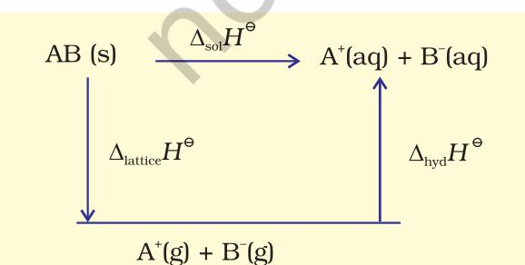

The enthalpy of solution of AB(s), ∆*solH*, in water is, therefore, determined by the selective values of the lattice enthalpy, ∆*latticeH* and enthalpy of hydration of ions, ∆*hydH* as

∆*sol H =* ∆*latticeH +* ∆*hydH* 

For most of the ionic compounds, ∆*sol H* is positive and the dissociation process is endothermic. Therefore the solubility of most salts in water increases with rise of temperature. If the lattice enthalpy is very high, the dissolution of the compound may not take place at all. Why do many fluorides tend to be less soluble than the corresponding chlorides? Estimates of the magnitudes of enthalpy changes may be made by using tables of bond energies (enthalpies) and lattice energies (enthalpies).

## *(f) Enthalpy of Dilution*

It is known that enthalpy of solution is the enthalpy change associated with the addition of a specified amount of solute to the specified amount of solvent at a constant temperature and pressure. This argument can be applied to any solvent with slight modification. Enthalpy change for dissolving one mole of gaseous hydrogen chloride in 10 mol of water can be represented by the following equation. For convenience we will use the symbol aq. for water

HCl(g) + 10 aq. → HCl.10 aq.

∆H = –69.01 kJ / mol

Let us consider the following set of enthalpy changes:

- (S-1) HCl(g) + 25 aq. → HCl.25 aq. ∆H = –72.03 kJ / mol (S-2) HCl(g) + 40 aq. → HCl.40 aq. ∆H = –72.79 kJ / mol (S-3) HCl(g) + ∞ aq. → HCl. ∞ aq.
∆H = –74.85 kJ / mol

The values of ∆H show general dependence of the enthalpy of solution on amount of solvent. As more and more solvent is used, the enthalpy of solution approaches a limiting value, i.e, the value in infinitely dilute solution. For hydrochloric acid this value of ∆H is given above in equation (S-3).

Unit 5.indd 156 9/12/2022 11:53:43 AM

If we subtract the first equation (equation S-1) from the second equation (equation S-2) in the above set of equations, we obtain–

> HCl.25 aq. + 15 aq. → HCl.40 aq. ∆H = [ –72.79 – (–72.03)] kJ / mol = – 0.76 kJ / mol

This value (–0.76kJ/mol) of ∆H is enthalpy of dilution. It is the heat withdrawn from the surroundings when additional solvent is added to the solution. The enthalpy of dilution of a solution is dependent on the original concentration of the solution and the amount of solvent added.

#### **5.6 spontaneity**

The first law of thermodynamics tells us about the relationship between the heat absorbed and the work performed on or by a system. It puts no restrictions on the direction of heat flow. However, the flow of heat is unidirectional from higher temperature to lower temperature. In fact, all naturally occurring processes whether chemical or physical will tend to proceed spontaneously in one direction only. For example, a gas expanding to fill the available volume, burning carbon in dioxygen giving carbon dioxide.

But heat will not flow from colder body to warmer body on its own, the gas in a container will not spontaneously contract into one corner or carbon dioxide will not form carbon and dioxygen spontaneously. These and many other spontaneously occurring changes show unidirectional change. We may ask 'what is the driving force of spontaneously occurring changes ? What determines the direction of a spontaneous change ? In this section, we shall establish some criterion for these processes whether these will take place or not.

Let us first understand what do we mean by spontaneous reaction or change ? You may think by your common observation that spontaneous reaction is one which occurs immediately when contact is made between the reactants. Take the case of combination of hydrogen and oxygen. These gases may be mixed at room temperature and left for many years without observing any perceptible change. Although the reaction is taking place between them, it is at an extremely slow rate. It is still called spontaneous reaction. So spontaneity means *'having the potential to proceed without the assistance of external agency'*. However, it does not tell about the rate of the reaction or process. Another aspect of spontaneous reaction or process, as we see is that these cannot reverse their direction on their own. We may summarise it as follows:

*A sp on tan e ou s p r o c e s s i s an irreversible process and may only be reversed by some external agency.*

## *(a) Is Decrease in Enthalpy a Criterion for Spontaneity ?*

If we examine the phenomenon like flow of water down hill or fall of a stone on to the ground, we find that there is a net decrease in potential energy in the direction of change. By analogy, we may be tempted to state that a chemical reaction is spontaneous in a given direction, because decrease in energy has taken place, as in the case of exothermic reactions. For example:

$\Delta_{r}H^{\Theta}=-46.1$ kJ mol${}^{-1}$  
  
$\Delta_{r}H^{\Theta}=-46.1$ kJ mol${}^{-1}$

$\frac{1}{2}$H${}_{2}$(g) + $\frac{1}{2}$Cl${}_{2}$(g) = HCl (g);  
  
$\Delta_{r}H^{\circ}=-92.32$ kJ mol${}^{-1}$

$$\mathrm{H_{2}(g)\,+\,\frac{1}{2}\ O_{2}(g)\to H_{2}O(l)\ ;}$$
 
$$\Delta_{r}H^{\ominus}=-285.8\ \mathrm{kJ\ mol^{-1}}$$

The decrease in enthalpy in passing from reactants to products may be shown for any exothermic reaction on an enthalpy diagram as shown in Fig. 5.10(a).

Thus, the postulate that driving force for a chemical reaction may be due to decrease in energy sounds 'reasonable' as the basis of evidence so far !

Now let us examine the following reactions:

$$\frac{1}{2}\mathrm{~N}_{2}(\mathrm{g})+\mathrm{O}_{2}(\mathrm{g})\to\mathrm{NO}_{2}(\mathrm{g});$$
 
$$\Delta_{r}H^{\ominus}=+33.2\mathrm{~kJ~mol^{-1}}$$
 C(graphite, s) + 2 S(l) → CS${}_{2}$(l); 
$$\Delta_{r}H^{\ominus}=+128.5\mathrm{~kJ~mol^{-1}}$$

Unit 5.indd 157 9/12/2022 11:53:43 AM

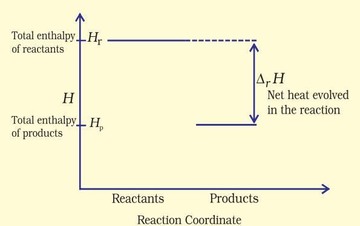

*Fig. 5.10 (a) Enthalpy diagram for exothermic reactions*

These reactions though endothermic, are spontaneous. The increase in enthalpy may be represented on an enthalpy diagram as shown in Fig. 5.10(b).

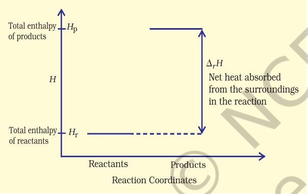

*Fig. 5.10 (b) Enthalpy diagram for endothermic reactions*

Therefore, it becomes obvious that while decrease in enthalpy may be a contributory factor for spontaneity, but it is not true for all cases.

#### *(b) Entropy and Spontaneity*

Then, what drives the spontaneous process in a given direction ? Let us examine such a case in which ∆*H* = 0 i.e., there is no change in enthalpy, but still the process is spontaneous.

Let us consider diffusion of two gases into each other in a closed container which is isolated from the surroundings as shown in Fig. 5.11.

The two gases, say, gas A and gas B are represented by black dots and white dots

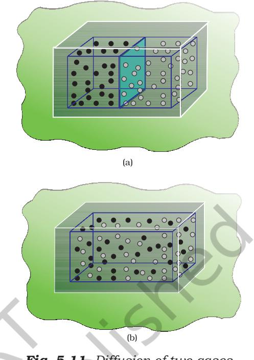

*Fig. 5.11 Diffusion of two gases*

respectively and separated by a movable partition [Fig. 5.11 (a)]. When the partition is withdrawn [Fig. 5.11(b)], the gases begin to diffuse into each other and after a period of time, diffusion will be complete.

Let us examine the process. Before partition, if we were to pick up the gas molecules from left container, we would be sure that these will be molecules of gas A and similarly if we were to pick up the gas molecules from right container, we would be sure that these will be molecules of gas B. But, if we were to pick up molecules from container when partition is removed, we are not sure whether the molecules picked are of gas A or gas B. We say that the system has become less predictable or more chaotic.

We may now formulate another postulate: in an isolated system, there is always a tendency for the systems' energy to become more disordered or chaotic and this could be a criterion for spontaneous change !

At this point, we introduce another thermodynamic function, **entropy** denoted as *S*. The above mentioned disorder is the manifestation of entropy. To form a mental

Unit 5.indd 158 9/12/2022 11:53:47 AM

picture, one can think of entropy as a measure of the degree of randomness or disorder in the system. The greater the disorder in an isolated system, the higher is the entropy. As far as a chemical reaction is concerned, this entropy change can be attributed to rearrangement of atoms or ions from one pattern in the reactants to another (in the products). If the structure of the products is very much disordered than that of the reactants, there will be a resultant increase in entropy. The change in entropy accompanying a chemical reaction may be estimated qualitatively by a consideration of the structures of the species taking part in the reaction. Decrease of regularity in structure would mean increase in entropy. For a given substance, the crystalline solid state is the state of lowest entropy (most ordered), The gaseous state is state of highest entropy.

Now let us try to quantify entropy. One way to calculate the degree of disorder or chaotic distribution of energy among molecules would be through statistical method which is beyond the scope of this treatment. Other way would be to relate this process to the heat involved in a process which would make entropy a thermodynamic concept. Entropy, like any other thermodynamic property such as internal energy *U* and enthalpy *H* is a state function and ∆*S* is independent of path.

Whenever heat is added to the system, it increases molecular motions causing increased randomness in the system. Thus **heat (***q***) has randomising influence** on the system. Can we then equate ∆*S* with *q* ? Wait ! Experience suggests us that the distribution of heat also depends on the temperature at which heat is added to the system. A system at higher temperature has greater randomness in it than one at lower temperature. Thus, **temperature is the measure of average chaotic motion of particles in the system**. Heat added to a system at lower temperature causes greater randomness than when the same quantity of heat is added to it at higher temperature. This suggests that the entropy change is inversely proportional to the temperature. ∆*S* is related with *q* and *T* for a reversible reaction as :

$\Lambda$S = $\frac{q_{rev}}{T}$ (5.18)

The total entropy change (∆*Stotal*) for the system and surroundings of a spontaneous process is given by

$\Lambda$S${}_{total}=\Lambda$S${}_{system}+\Lambda$S${}_{surr}>0$ (5.19)

When a system is in equilibrium, the entropy is maximum, and the change in entropy, ∆*S* = 0.

We can say that entropy for a spontaneous process increases till it reaches maximum and at equilibrium the change in entropy is zero. Since entropy is a state property, we can calculate the change in entropy of a reversible process by

$$\Delta\mathrm{S}_{\mathrm{sys}}\triangleq{\frac{q_{\mathrm{sys,rev}}}{T}}$$

We find that both for reversible and irreversible expansion for an ideal gas, under isothermal conditions, ∆*U* = 0, but ∆*Stotal* i.e., *S S sys s urr* is not zero for irreversible process. Thus, ∆*U* does not discriminate between reversible and irreversible process, whereas ∆*S* does.

#### **Problem 5.10**

Predict in which of the following, entropy increases/decreases :

- (i) A liquid crystallizes into a solid.
- (ii) Temperature of a crystalline solid is raised from 0 K to 115 K.
- iii NaHCO s Na CO s CO g H O g 2 3 2 3 2 2

(iv) H g 2 2H g

#### **Solution**

- (i) After freezing, the molecules attain an ordered state and therefore, entropy decreases.
- (ii) At 0 K, the contituent particles are static and entropy is minimum. If temperature is raised to 115 K, these begin to move and oscillate

Unit 5.indd 159 9/12/2022 11:53:48 AM

about their equilibrium positions in the lattice and system becomes more disordered, therefore entropy increases.

- (iii) Reactant, NaHCO3 is a solid and it has low entropy. Among products there are one solid and two gases. Therefore, the products represent a condition of higher entropy.
- (iv) Here one molecule gives two atoms i.e., number of particles increases leading to more disordered state. Two moles of H atoms have higher entropy than one mole of dihydrogen molecule.

## **Problem 5.11**

For oxidation of iron,

4 3 Fes O 2 2 g F 2 e O3 s

entropy change is – 549.4 JK–1 mol–1 at 298 K. Inspite of negative entropy change of this reaction, why is the reaction spontaneous?

(∆*r H* for this reaction is –1648 × 103 J mol–1)

#### **Solution**

One decides the spontaneity of a reaction by considering

 *S S total s ys Ssurr* . For calculating ∆*Ssurr*, we have to consider the heat absorbed by the surroundings which is equal to – ∆*r H* . At temperature T, entropy change of the surroundings is

$\Delta$S${}_{\rm surr}=-\frac{\Delta_{r}H^{\circ}}{T}$ (at constant pressure)  
  
$=-\frac{(-1648\times10^{3}\,\rm J\,mol^{-1})}{298\,\rm K}$  
  
$=5530$ JK${}^{-1}$mol${}^{-1}$

Thus, total entropy change for this reaction

$$\begin{array}{r}{\Delta_{r}\mathbf{S}_{\mathrm{total}}=5530\mathrm{JK}^{-1}\mathrm{mol}^{-1}+}\\ {\left(-549.4\mathrm{JK}^{-1}\mathrm{mol}^{-1}\right)}\end{array}$$

= 4980.6 JK–1 mol–1

This shows that the above reaction is spontaneous.

## *(c) Gibbs Energy and Spontaneity*

We have seen that for a system, it is the total entropy change, ∆*Stotal* which decides the spontaneity of the process. But most of the chemical reactions fall into the category of either closed systems or open systems. Therefore, for most of the chemical reactions there are changes in both enthalpy and entropy. It is clear from the discussion in previous sections that neither decrease in enthalpy nor increase in entropy alone can determine the direction of spontaneous change for these systems.

For this purpose, we define a new thermodynamic function the Gibbs energy or Gibbs function, *G*, as

$G=H-\overline{\bf S}$ (5.20)

Gibbs function, *G* is an extensive property and a state function.

The change in Gibbs energy for the system, ∆*Gsys* can be written as

$$\Delta\bar{G}_{s u s}=\Delta H_{s u s}-T\Delta S_{s u s}-S_{s u s}\Delta T$$

At constant temperature,

*G H sys s* = *ys T S sys*

Usually the subscript 'system' is dropped and we simply write this equation as

$\Lambda G=\Lambda H-T\Lambda$ (5.21)

Thus, Gibbs energy change = enthalpy change – temperature × entropy change, and is referred to as the Gibbs equation, one of the most important equations in chemistry. Here, we have considered both terms together for spontaneity: energy (in terms of ∆*H*) and entropy (∆*S*, a measure of disorder) as indicated earlier. Dimensionally if we analyse, we find that ∆*G* has units of energy because, both ∆*H* and the *T*∆*S* are energy terms, since *T*∆*S* = (K) (J/K) = J.

Now let us consider how ∆*G* is related to reaction spontaneity.

Unit 5.indd 160 9/12/2022 11:53:48 AM

We know,

∆*Stotal* = ∆*Ssys* + ∆*Ssurr*

 If the system is in thermal equilibrium with the surrounding, then the temperature of the surrounding is same as that of the system. Also, increase in enthalpy of the surrounding is equal to decrease in the enthalpy of the system.

Therefore, entropy change of surroundings,

$$\Delta\mathbf{S}_{\mathrm{surr}}={\frac{\Delta H_{\mathrm{surr}}}{T}}=-{\frac{\Delta H_{\mathrm{sys}}}{T}}$$
  

$$\Delta\mathbf{S}_{\mathrm{total}}=\Delta\mathbf{S}_{\mathrm{sys}}+\left(-\ {\frac{\Delta H_{\mathrm{sys}}}{T}}\right)$$

Rearranging the above equation:

*T*∆*Stotal* = *T*∆*Ssys* – ∆*Hsys* For spontaneous process, *Stotal* 0 , so

$$T\Delta S_{_\mathrm{sys}}-\Delta H_{_\mathrm{sys}}>0$$
  

$$\Rightarrow-\left(\Delta H_{_\mathrm{sys}}-T\Delta S_{_\mathrm{sys}}\right)>0$$

Using equation 5.21, the above equation can be written as

$\Delta G=\Delta H-T\Delta S<0$

∆*Hsys* is the enthalpy change of a reaction, *T*∆*Ssys* is the energy which is not available to do useful work. So ∆*G* is the net energy available to do useful work and is thus a measure of the 'free energy'. For this reason, it is also known as the free energy of the reaction.

∆*G* gives a criteria for spontaneity at constant pressure and temperature.

- (i) If ∆*G* is negative (< 0), the process is spontaneous.
- (ii) If ∆*G* is positive (> 0), the process is non spontaneous.

**Note :** If a reaction has a positive enthalpy change and positive entropy change, it can be spontaneous when *T*∆*S* is large enough to outweigh ∆*H*. This can happen in two ways; (a) The positive entropy change of the system can be 'small' in which case *T* must be large. (b) The positive entropy change of the system can be 'large', in which case *T* may be small. The former is one of the reasons why reactions are often carried out at high temperature. Table 5.4 summarises the effect of temperature on spontaneity of reactions.

## **(d)** *Entropy and Second Law of Thermodynamics*

We know that for an isolated system the change in energy remains constant. Therefore, increase in entropy in such systems is the natural direction of a spontaneous change. This, in fact is the second law of thermodynamics. Like first law of thermodynamics, second law can also be stated in several ways. The second law of thermodynamics explains why spontaneous exothermic reactions are so common. In exothermic reactions heat released by the reaction increases the disorder of the surroundings and overall entropy change is positive which makes the reaction spontaneous.

#### **(e)** *Absolute Entropy and Third Law of Thermodynamics*

Molecules of a substance may move in a straight line in any direction, they may spin like a top and the bonds in the molecules may stretch and compress. These motions of the molecule are called translational, rotational and vibrational motion respectively. When temperature of the system rises, these motions become more vigorous and entropy increases. On the other hand when temperature is lowered, the entropy decreases. **The entropy of any pure crystalline substance approaches zero as the temperature approaches absolute zero. This is called third law of thermodynamics.**  This is so because there is perfect order in a crystal at absolute zero. The statement is confined to pure crystalline solids because theoretical arguments and practical evidences have shown that entropy of solutions and super cooled liquids is not zero at 0 K. The importance of the third law lies in the fact that it permits the calculation of absolute values of entropy of pure substance from thermal data alone. For a pure substance, this can

Unit 5.indd 161 9/12/2022 11:53:49 AM

be done by summing *q T rev* increments from 0

*n*

K to 298 K. Standard entropies can be used to calculate standard entropy changes by a Hess's law type of calculation.

## **5.7 Gibbs energ y change and equilibrium**

We have seen how a knowledge of the sign and magnitude of the free energy change of a chemical reaction allows:

- (i) Prediction of the spontaneity of the chemical reaction.
- (ii) Prediction of the useful work that could be extracted from it.

So far we have considered free energy changes in irreversible reactions. Let us now examine the free energy changes in reversible reactions.

'Reversible' under strict thermodynamic sense is a special way of carrying out a process such that system is at all times in perfect equilibrium with its surroundings. When applied to a chemical reaction, the term 'reversible' indicates that a given reaction can proceed in either direction simultaneously, so that a dynamic equilibrium is set up. This means that the reactions in both the directions should proceed with a decrease in free energy, which seems impossible. It is possible only if at equilibrium the free energy of the system is minimum. If it is not, the system would spontaneously change to configuration of lower free energy.

> So, the criterion for equilibrium A + B C + D; is ∆*r G* = 0

Gibbs energy for a reaction in which all reactants and products are in standard state, ∆*r G*  is related to the equilibrium constant of the reaction as follows:

$$\begin{array}{r l}{0}&{{}=\ \Delta_{r}G^{\circ}+\mathrm{\,R}T\ln\,K}\end{array}$$

or $\Delta_{r}G^{\,\otimes}=-\,$RT ln $K$ or $\Delta_{r}G^{\,\otimes}=-\,$2.303 RTlog $K$

We also know that

$\Lambda_{r}G^{\otimes}=\Lambda_{r}H^{\otimes}-T\Lambda_{r}S^{\otimes}=\Lambda_{r}H^{\otimes}$ (5.24)

For strongly endothermic reactions, the value of ∆*r H* may be large and positive. In such a case, value of *K* will be much smaller than 1 and the reaction is unlikely to form much product. In case of exothermic reactions, ∆*r H* is large and negative, and ∆*r G* is likely to be large and negative too. In such cases, *K* will be much larger than 1. We may expect strongly exothermic reactions to have a large *K*, and hence can go to near completion. ∆*r G* also depends upon ∆*r S*, if the changes in the entropy of reaction is also taken into account, the value of *K* or extent of chemical reaction will also be affected, depending upon whether ∆*r S* is positive or negative.

Using equation (5.24),

| H ∆r | S ∆r | G ∆r | Description* |
| --- | --- | --- | --- |
| – | + | – | Reaction spontaneous at all temperatures |
| – | – | – (at low T ) | Reaction spontaneous at low temperature |
| – | – | + (at high T ) | Reaction nonspontaneous at high temperature |
| + | + | + (at low T ) | Reaction nonspontaneous at low temperature |
| + | + | – (at high T ) | Reaction spontaneous at high temperature |
| + | – | + (at all T ) | Reaction nonspontaneous at all temperatures |

#### **Table 5.4 Effect of Temperature on Spontaneity of Reactions**

* *The term low temperature and high temperature are relative. For a particular reaction, high temperature could even mean room temperature.*

Unit 5.indd 162 9/12/2022 11:53:49 AM

- (i) It is possible to obtain an estimate of ∆*G* from the measurement of ∆*H* and ∆*S*, and then calculate *K* at any temperature for economic yields of the products.
- (ii) If K is measured directly in the laboratory, value of ∆*G* at any other temperature can be calculated.

Using equation (5.24),

#### **Problem 5.12**

Calculate ∆*r G* for conversion of oxygen to ozone, 3/2 O2(g) → O3(g) at 298 K. if *Kp* for this conversion is 2.47 × 10–29.

#### **Solution**

We know ∆*r G* = – 2.303 R*T* log *Kp* and R = 8.314 JK–1 mol–1

Therefore, ∆*r G* = – 2.303 (8.314 J K–1 mol–1) × (298 K) (log 2.47 × 10–29)

- = 163000 J mol–1
- = 163 kJ mol–1.

#### **Problem 5.13**

Find out the value of equilibrium constant for the following reaction at 298 K.

2NH3(g)+CO2(g)=NH3CONH2(aq)+H2O(l)

Standard Gibbs energy change, ∆*r G* at the given temperature is –13.6 kJ mol–1.

#### **Solution**

We know, log *K* =

– . 13 6 10 3 J mol –1

= . . 2 303 8 314 298 JK mol K –1 –1 = 2.38

Hence *K* = antilog 2.38 = 2.4 × 102.

#### **Problem 5.14**

At 60°C, dinitrogen tetroxide is 50 per cent dissociated. Calculate the standard free energy change at this temperature and at one atmosphere.

#### **Solution**

N2O4(g) 2NO2(g)

1 5

.

If N2O4 is 50% dissociated, the mole fraction of both the substances is given by

$\begin{array}{c}\includegraphics[width=140.0pt]{fig1}\end{array}$

1 1 5 1 . atm.

The equilibrium constant *Kp* is given by

$\left(\begin{array}{c}\text{P}_{\text{NO}_{2}}\\ \text{P}_{\text{NO}_{4}}\end{array}\right)^{2}$\(\left(\begin{array}{c}\text{P}_{\text{NO}_{2}}\\ \text{P}_{\text{NO}_{4}}\end{array}\right)^{2}\

= 1.33 atm. Since ∆*r G* = –R*T* ln *Kp* ∆*r G* = (– 8.314 JK–1 mol–1) × (333 K) × (2.303) × (0.1239) = – 763.8 kJ mol–1

Unit 5.indd 163 9/12/2022 11:53:50 AM

#### **Summary**

Thermodynamics deals with energy changes in chemical or physical processes and enables us to study these changes quantitatively and to make useful predictions. For these purposes, we divide the universe into the system and the surroundings. Chemical or physical processes lead to evolution or absorption of heat (*q*), part of which may be converted into work (w). These quantities are related through the **first law of thermodynamics** via ∆*U* = *q* + w. ∆*U*, change in internal energy, depends on initial and final states only and is a state function, whereas *q* and w depend on the path and are not the state functions. We follow sign conventions of *q* and w by giving the positive sign to these quantities when these are added to the system. We can measure the transfer of heat from one system to another which causes the change in temperature. The magnitude of rise in temperature depends on the heat capacity (*C*) of a substance. Therefore, heat absorbed or evolved is *q* = *C*∆*T*. Work can be measured by w = –*pex*∆*V*, in case of expansion of gases. Under reversible process, we can put *pex* = *p* for infinitesimal changes in the volume making wrev = – *p* d*V*. In this condition, we can use gas equation, *pV* = *n*R*T*.

At constant volume, w = 0, then ∆*U* = *qV* , heat transfer at constant volume. But in study of chemical reactions, we usually have constant pressure. We define another state function **enthalpy**. Enthalpy change, ∆*H* = ∆*U* + ∆*ng* R*T*, can be found directly from the heat changes at constant pressure, ∆*H* = *qp*.

There are varieties of enthalpy changes. Changes of phase such as melting, vaporization and sublimation usually occur at constant temperature and can be characterized by enthalpy changes which are always positive. Enthalpy of formation, combustion and other enthalpy changes can be calculated using **Hess's law**. Enthalpy change for chemical reactions can be determined by

$\Lambda_{r}H=\sum_{f}(a_{i}\Lambda_{f}H_{\rm products})-\sum_{i}(b_{i}\Lambda_{f}H_{\rm reactants})$

and in gaseous state by

#### ∆*r H* = Σ *bond enthalpies of the reactants* – Σ *bond enthalpies of the products*

First law of thermodynamics does not guide us about the direction of chemical reactions i.e., what is the driving force of a chemical reaction. For isolated systems, ∆*U* = 0. We define another state function, *S*, **entropy** for this purpose. **Entropy** is a measure of disorder or randomness. For a spontaneous change, total entropy change is positive. Therefore, for an isolated system, ∆*U* = 0, ∆*S* > 0, so entropy change distinguishes a spontaneous change, while energy change does not. Entropy changes can be measured by the equation

$\Delta$S = $\frac{q_{\rm rev}}{T}$ for a reversible process. $\frac{q_{\rm rev}}{T}$ is independent of path.  
  

Chemical reactions are generally carried at constant pressure, so we define another state function **Gibbs energy**, *G*, which is related to entropy and enthalpy changes of the system by the equation:

$$\Delta_{r}G=\mathrm{\boldmath~\nabla~}\!\!\Delta_{r}H-T\Delta_{r}S_{\Delta_{r}}$$

For a spontaneous change, ∆*G*sys < 0 and at equilibrium, ∆*Gsys* = 0.

Standard Gibbs energy change is related to equilibrium constant by

* [16] A. A. K.  
  

K can be calculated from this equation, if we know ∆*r G* which can be found from . Temperature is an important factor in the equation. Many reactions which are non-spontaneous at low temperature, are made spontaneous at high temperature for systems having positive entropy of reaction.

Unit 5.indd 164 9/12/2022 11:53:50 AM

#### **Exercises**

- 5.1 Choose the correct answer. A thermodynamic state function is a quantity
	- (i) used to determine heat changes
	- (ii) whose value is independent of path
	- (iii) used to determine pressure volume work
	- (iv) whose value depends on temperature only.
- 5.2 For the process to occur under adiabatic conditions, the correct condition is:
	- (i) ∆*T* = 0
	- (ii) ∆*p* = 0
	- (iii) *q* = 0
	- (iv) w = 0

#### 5.3 The enthalpies of all elements in their standard states are:

- (i) unity
- (ii) zero
- (iii) < 0
- (iv) different for each element
- 5.4 ∆*U* of combustion of methane is X kJ mol–1. The value of ∆*H* is
	- (i) = ∆*U*
	- (ii) > ∆*U*
	- (iii) < ∆*U*
	- (iv) = 0
- 5.5 The enthalpy of combustion of methane, graphite and dihydrogen at 298 K are, –890.3 kJ mol–1 –393.5 kJ mol–1, and –285.8 kJ mol–1 respectively. Enthalpy of formation of CH4(g) will be
	- (i) –74.8 kJ mol–1 (ii) –52.27 kJ mol–1
	- (iii) +74.8 kJ mol–1 (iv) +52.26 kJ mol–1.
- 5.6 A reaction, A + B → C + D + q is found to have a positive entropy change. The reaction will be
	- (i) possible at high temperature
	- (ii) possible only at low temperature
	- (iii) not possible at any temperature
	- (v) possible at any temperature
- 5.7 In a process, 701 J of heat is absorbed by a system and 394 J of work is done by the system. What is the change in internal energy for the process?
- 5.8 The reaction of cyanamide, NH2CN (s), with dioxygen was carried out in a bomb calorimeter, and ∆*U* was found to be –742.7 kJ mol–1 at 298 K. Calculate enthalpy change for the reaction at 298 K.

$$\mathrm{NH_{2}C N(g)\,+\,\frac{3}{2}\,O_{2}(g)\to N_{2}(g)\,+\,C O_{2}(g)\,+\,H_{2}O(l)}$$

Unit 5.indd 165 9/12/2022 11:53:50 AM

- 5.9 Calculate the number of kJ of heat necessary to raise the temperature of 60.0 g of aluminium from 35°C to 55°C. Molar heat capacity of Al is 24 J mol–1 K–1.
- 5.10 Calculate the enthalpy change on freezing of 1.0 mol of water at10.0°C to ice at –10.0°C. ∆*fusH* = 6.03 kJ mol–1 at 0°C.

*Cp* [H2O(l)] = 75.3 J mol–1 K–1

*Cp* [H2O(s)] = 36.8 J mol–1 K–1

- 5.11 Enthalpy of combustion of carbon to CO2 is –393.5 kJ mol–1. Calculate the heat released upon formation of 35.2 g of CO2 from carbon and dioxygen gas.
- 5.12 Enthalpies of formation of CO(g), CO2(g), N2O(g) and N2O4(g) are –110, 393, 81 and 9.7 kJ mol–1 respectively. Find the value of ∆*r H* for the reaction:

$\rm N_{2}O_{4}(g)+3CO(g)\to N_{2}O(g)+3CO_{2}(g)$

- 5.13 Given
N2(g) + 3H2(g) → 2NH3(g); ∆*r H* = –92.4 kJ mol–1 What is the standard enthalpy of formation of NH3 gas?

- 5.14 Calculate the standard enthalpy of formation of CH3OH(l) from the following data:
$\rm CH_{3}OH$ (l) + $\frac{3}{2}$ O${}_{2}$(g) $\rightarrow$ CO${}_{2}$(g) + 2H${}_{2}$O(l) ; $\Delta_{\rm r}H^{\phi}$ = -726 kJ mol${}^{-1}$  
  
C(graphite) + O${}_{2}$(g) $\rightarrow$ CO${}_{2}$(g) ; $\Delta_{\rm c}H^{\phi}$ = -393 kJ mol${}^{-1}$

H${}_{2}$(g) + $\frac{1}{2}$ O${}_{2}$(g) $\rightarrow$ H${}_{2}$O(l); $\Delta_{f}H^{0}=-286$ kJ mol${}^{-1}$.  
  

- 5.15 Calculate the enthalpy change for the process CCl4(g) → C(g) + 4 Cl(g) and calculate bond enthalpy of C – Cl in CCl4(g).

$$\Delta_{u a p}H^{\ominus}(\mathrm{CCl}_{4})=30.5\mathrm{~kJ~mol^{-1}}.$$

$$\Delta_{f}H^{\ominus}\ (\mathrm{CCl}_{4})=-135.5\ \mathrm{kJ}\ \overline{{{\mathrm{mol}}}}^{-1}.$$

∆*aH* (C) = 715.0 kJ mol–1, where ∆*aH* is enthalpy of atomisation

$$\Delta_{a}H^{\mathrm{p}}\;(\mathrm{Cl}_{2})=242\,\mathrm{\underline{{{k J}}}}\,\mathrm{\underline{{{i n o l}}}}^{-1}$$

- 5.16 For an isolated system, ∆*U* = 0, what will be ∆*S* ?
- 5.17 For the reaction at 298 K,

2A + B $\rightarrow$ C. 

∆*H* = 400 kJ mol–1 and ∆*S* = 0.2 kJ K–1 mol–1

At what temperature will the reaction become spontaneous considering ∆*H* and ∆*S* to be constant over the temperature range.

- 5.18 For the reaction, 2 Cl(g) → Cl2(g), what are the signs of ∆*H* and ∆*S* ?
- 5.19 For the reaction
	- 2 A(g) + B(g) → 2D(g)

∆*U*  = –10.5 kJ and ∆*S* = –44.1 JK–1.

Calculate ∆*G* for the reaction, and predict whether the reaction may occur spontaneously.

Unit 5.indd 166 9/12/2022 11:53:50 AM

- 5.20 The equilibrium constant for a reaction is 10. What will be the value of ∆*G* ? R = 8.314 JK–1 mol–1, T = 300 K.
- 5.21 Comment on the thermodynamic stability of NO(g), given

$$\frac{1}{2}\mathrm{~N_{2}(g)+\frac{1}{2}O_{2}(g)\to N O(g);\quad\Delta_{r}H^{\circ}=90\mathrm{~kJ~mol^{-1}~}}$$
  

$$\mathrm{NO(g)+\frac{1}{2}O_{2}(g)\to N O_{2}(g);\quad\Delta_{r}H^{\circ}=-74\mathrm{~kJ~mol^{-1}~}}$$

- 5.22 Calculate the entropy change in surroundings when 1.00 mol of H2O(l) is formed under standard conditions. ∆*f H* = –286 kJ mol–1.
Unit 5.indd 167 9/12/2022 11:53:51 AM

