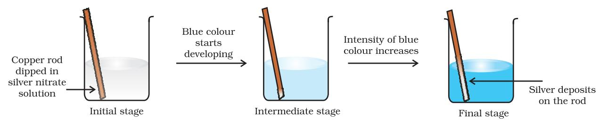

Unit 7

# redox reactions

After studying this unit you will be able to

- identify redox reactions as a class of reactions in which oxidation and reduction reactions occur simultaneously;
- define the terms oxidation, reduction, oxidant (oxidising agent) and reductant (reducing agent);
- explain mechanism of redox reactions by electron transfer process;
- use the concept of oxidation number to identify oxidant and reductant in a reaction;
- classify redox reaction into combination (synthesis), decomposition, displacement a n d d i s p r o p o r t i o n a t i o n reactions;
- suggest a comparative order among various reductants and oxidants;
- balance chemical equations using (i) oxidation number (ii) half reaction method;
- learn the concept of redox reactions in terms of electrode processes.

*Where there is oxidation, there is always reduction – Chemistry is essentially a study of redox systems.*

Chemistry deals with varieties of matter and change of one kind of matter into the other. Transformation of matter from one kind into another occurs through the various types of reactions. One important category of such reactions is Redox Reactions. A number of phenomena, both physical as well as biological, are concerned with redox reactions. These reactions find extensive use in pharmaceutical, biological, industrial, metallurgical and agricultural areas. The importance of these reactions is apparent from the fact that burning of different types of fuels for obtaining energy for domestic, transport and other commercial purposes, electrochemical processes for extraction of highly reactive metals and non-metals, manufacturing of chemical compounds like caustic soda, operation of dry and wet batteries and corrosion of metals fall within the purview of redox processes. Of late, environmental issues like Hydrogen Economy (use of liquid hydrogen as fuel) and development of 'Ozone Hole' have started figuring under redox phenomenon.

# 7.1 CLASSICAL IDEA OF REDOX REACTIONS – OXIDATION AND REDUCTION REACTIONS

Originally, the term oxidation was used to describe the addition of oxygen to an element or a compound. Because of the presence of dioxygen in the atmosphere (~20%), many elements combine with it and this is the principal reason why they commonly occur on the earth in the form of their oxides. The following reactions represent oxidation processes according to the limited definition of oxidation:

| (7.1) |
| --- |
| 2 Mg (s) + O2 (g) → 2 MgO (s) |

- S (s) + O2 (g) → SO2 (g) (7.2)
Unit 7.indd 235 10/10/2022 10:37:02 AM

In reactions (7.1) and (7.2), the elements magnesium and sulphur are oxidised on account of addition of oxygen to them. Similarly, methane is oxidised owing to the addition of oxygen to it.

$\rm CH_{4}$ (g) + 2O${}_{2}$ (g) $\rightarrow$ CO${}_{2}$ (g) + 2H${}_{2}$O (l) (7.3)

A careful examination of reaction (7.3) in which hydrogen has been replaced by oxygen prompted chemists to reinterpret oxidation in terms of removal of hydrogen from it and, therefore, the scope of term oxidation was broadened to include the removal of hydrogen from a substance. The following illustration is another reaction where removal of hydrogen can also be cited as an oxidation reaction.

2 H${}_{2}$S(g) + O${}_{2}$ (g) $\rightarrow$ 2 S (s) + 2 H${}_{2}$O (l) (7.4)

As knowledge of chemists grew, it was natural to extend the term oxidation for reactions similar to (7.1 to 7.4), which do not involve oxygen but other electronegative elements. The oxidation of magnesium with fluorine, chlorine and sulphur etc. occurs according to the following reactions :

Mg (s) + F2 (g) → MgF2 (s) (7.5)

Mg (s) + Cl2 (g) → MgCl2 (s) (7.6)

Mg (s) + S (s) → MgS (s) (7.7)

Incorporating the reactions (7.5 to 7.7) within the fold of oxidation reactions encouraged chemists to consider not only the removal of hydrogen as oxidation, but also the removal of electropositive elements as oxidation. Thus the reaction :

2K${}_{4}$ [Fe(CN)${}_{6}$](aq) + H${}_{2}$O${}_{2}$ (aq) $\rightarrow$2K${}_{3}$[Fe(CN)${}_{6}$](aq) + 2 KOH (aq)

is interpreted as oxidation due to the removal of electropositive element potassium from potassium ferrocyanide before it changes to potassium ferricyanide. To summarise, the term "oxidation" is defined as the addition of oxygen/electronegative element to a substance or removal of hydrogen/ electropositive element from a substance.

In the beginning, reduction was considered as removal of oxygen from a compound. However, the term reduction has been broadened these days to include removal of oxygen/electronegative element from a substance or addition of hydrogen/ electropositive element to a substance.

According to the definition given above, the following are the examples of reduction processes:

2 HgO (s) 2 Hg (l) + O2 (g) (7.8)

(removal of oxygen from mercuric oxide ) 2 FeCl3 (aq) + H2 (g) →2 FeCl2 (aq) + 2 HCl(aq) (7.9)

(removal of electronegative element, chlorine from ferric chloride)

CH2 = CH2 (g) + H2 (g) → H3C – CH3 (g) (7.10) (addition of hydrogen) 2HgCl2 (aq) + SnCl2 (aq) → Hg2Cl2 (s)+SnCl4 (aq) (7.11)

(addition of mercury to mercuric chloride)

In reaction (7.11) simultaneous oxidation of stannous chloride to stannic chloride is also occurring because of the addition of electronegative element chlorine to it. It was soon realised that oxidation and reduction always occur simultaneously (as will be apparent by re-examining all the equations given above), hence, the word "redox" was coined for this class of chemical reactions.

#### Problem 7.1

In the reactions given below, identify the species undergoing oxidation and reduction:

(i) H2S (g) + Cl2 (g) → 2 HCl (g) + S (s) (ii) 3Fe3O4 (s) + 8 Al (s) → 9 Fe (s)

$$\mathrm{+4Al_{2}O_{3}\;(s)}$$

(iii) 2 Na (s) + H${}_{2}$ (g) $\rightarrow$ 2 NaH (s)

# Solution

(i) H2S is oxidised because a more electronegative element, chlorine is added to hydrogen (or a more electropositive element, hydrogen has been removed from S). Chlorine is reduced due to addition of hydrogen to it.

(ii) Aluminium is oxidised because oxygen is added to it. Ferrous ferric oxide

Unit 7.indd 236 10/10/2022 10:37:03 AM

(Fe3O4) is reduced because oxygen has been removed from it.

(iii) With the careful application of the concept of electronegativity only we may infer that sodium is oxidised and hydrogen is reduced.

Reaction (iii) chosen here prompts us to think in terms of another way to define redox reactions.

# 7.2 REDOX REACTIONS IN TERMS OF ELECTRON TRANSFER REACTIONS

We have already learnt that the reactions

|  |  | (7.12) |
| --- | --- | --- |
| 2Na(s) + Cl2(g) | → 2NaCl (s) |  |

4Na(s) + O${}_{2}$(g) $\rightarrow$ 2Na${}_{2}$O(s) (7.13)

2Na(s) + S(s) $\rightarrow$ Na${}_{2}$S(s) (7.14)

are redox reactions because in each of these reactions sodium is oxidised due to the addition of either oxygen or more electronegative element to sodium. Simultaneously, chlorine, oxygen and sulphur are reduced because to each of these, the electropositive element sodium has been added. From our knowledge of chemical bonding we also know that sodium chloride, sodium oxide and sodium sulphide are ionic compounds and perhaps better written as Na+Cl– (s), (Na+) 2O2–(s), and (Na+) 2 S2–(s). Development of charges on the species produced suggests us to rewrite the reactions (7.12 to 7.14) in the following manner :

For convenience, each of the above processes can be considered as two separate steps, one involving the loss of electrons and the other the gain of electrons. As an illustration, we may further elaborate one of these, say, the formation of sodium chloride.

$$2\mathrm{~Na(s)\to2~Na^{+}(g)~+~2e^{-}}$$

Cl2(g) + 2e– → 2 Cl– (g)

Each of the above steps is called a half reaction, which explicitly shows involvement of electrons. Sum of the half reactions gives the overall reaction :

#### 2 Na(s) + Cl2 (g) → 2 Na+ Cl– (s) or 2 NaCl (s)

Reactions 7.12 to 7.14 suggest that half reactions that involve loss of electrons are called oxidation reactions. Similarly, the half reactions that involve gain of electrons are called reduction reactions. It may not be out of context to mention here that the new way of defining oxidation and reduction has been achieved only by establishing a correlation between the behaviour of species as per the classical idea and their interplay in electron-transfer change. In reactions (7.12 to 7.14) sodium, which is oxidised, acts as a reducing agent because it donates electron to each of the elements interacting with it and thus helps in reducing them. Chlorine, oxygen and sulphur are reduced and act as oxidising agents because these accept electrons from sodium. To summarise, we may mention that

*Oxidation :* Loss of electron(s) by any species.

*Reduction :* Gain of electron(s) by any species.

*Oxidising agent :* Acceptor of electron(s). *Reducing agent :* Donor of electron(s).

Problem 7.2 Justify that the reaction: 2 Na(s) + H2(g) → 2 NaH (s) is a redox change.

## Solution

Since in the above reaction the compound formed is an ionic compound, which may also be represented as Na+H– (s), this suggests that one half reaction in this process is :

2 Na (s) → 2 Na+(g) + 2e–

Unit 7.indd 237 10/10/2022 10:37:03 AM

and the other half reaction is:

H2 (g) + 2e– → 2 H– (g)

This splitting of the reaction under examination into two half reactions automatically reveals that here sodium is oxidised and hydrogen is reduced, therefore, the complete reaction is a redox change.

# 7.2.1 Competitive Electron Transfer Reactions

Place a strip of metallic zinc in an aqueous solution of copper nitrate as shown in Fig. 7.1, for about one hour. You may notice that the strip becomes coated with reddish metallic copper and the blue colour of the solution disappears. Formation of Zn2+ ions among the products can easily be judged when the blue colour of the solution due to Cu2+ has disappeared. If hydrogen sulphide gas is passed through the colourless solution containing Zn2+ ions, appearance of white zinc sulphide, ZnS can be seen on making the solution alkaline with ammonia.

The reaction between metallic zinc and the aqueous solution of copper nitrate is : Zn(s) + Cu2+ (aq) → Zn2+ (aq) + Cu(s) (7.15)

In reaction (7.15), zinc has lost electrons to form Zn2+ and, therefore, zinc is oxidised. Evidently, now if zinc is oxidised, releasing electrons, something must be reduced, accepting the electrons lost by zinc. Copper ion is reduced by gaining electrons from the zinc.

Reaction (7.15) may be rewritten as :

At this stage we may investigate the state of equilibrium for the reaction represented by equation (7.15). For this purpose, let us place a strip of metallic copper in a zinc sulphate solution. No visible reaction is noticed and attempt to detect the presence of Cu2+ ions by passing H2S gas through the solution to produce the black colour of cupric sulphide, CuS, does not succeed. Cupric sulphide has such a low solubility that this is an extremely sensitive test; yet the amount of Cu2+ formed cannot be detected. We thus conclude that the state of equilibrium for the reaction (7.15) greatly favours the products over the reactants.

Let us extend electron transfer reaction now to copper metal and silver nitrate solution in water and arrange a set-up as shown in Fig. 7.2. The solution develops blue colour due to the formation of Cu2+ ions on account of the reaction:

  
  
\begin{tabular}{l c} \hline \multicolumn{2}{c}{release of 2e} \\ \hline Cu(s) + 2Ag(aq) & Cu${}^{2+}$(aq) + 2Ag(s) \\ \cline{2-3} & \multicolumn{2}{c}{gain of 2e} \\ \hline \end{tabular}  
  

Here, Cu(s) is oxidised to Cu2+(aq) and Ag+(aq) is reduced to Ag(s). Equilibrium greatly favours the products Cu2+ (aq) and Ag(s).

By way of contrast, let us also compare the reaction of metallic cobalt placed in nickel sulphate solution. The reaction that occurs here is :

*Fig. 7.1 Redox reaction between zinc and aqueous solution of copper nitrate occurring in a beaker.*

Unit 7.indd 238 11/11/2022 09:48:49

*Fig. 7.2 Redox reaction between copper and aqueous solution of silver nitrate occurring in a beaker.* 

At equilibrium, chemical tests reveal that both Ni2+(aq) and Co2+(aq) are present at moderate concentrations. In this case, neither the reactants [Co(s) and Ni2+(aq)] nor the products [Co2+(aq) and Ni (s)] are greatly favoured.

This competition for release of electrons incidently reminds us of the competition for release of protons among acids. The similarity suggests that we might develop a table in which metals and their ions are listed on the basis of their tendency to release electrons just as we do in the case of acids to indicate the strength of the acids. As a matter of fact we have already made certain comparisons. By comparison we have come to know that zinc releases electrons to copper and copper releases electrons to silver and, therefore, the electron releasing tendency of the metals is in the order: Zn>Cu>Ag. We would love to make our list more vast and design a metal activity series or electrochemical series. The competition for electrons between various metals helps us to design a class of cells, named as Galvanic cells in which the chemical reactions become the source of electrical energy. We would study more about these cells in Class XII.

#### 7.3 OXIDATION NUMBER

A less obvious example of electron transfer is realised when hydrogen combines with oxygen to form water by the reaction:

2H${}_{2}$(g) + O${}_{2}$(g) $\rightarrow$ 2H${}_{2}$O (l)

Though not simple in its approach, yet we can visualise the H atom as going from a neutral (zero) state in H2 to a positive state in H2O, the O atom goes from a zero state in O2 to a dinegative state in H2O. It is assumed that there is an electron transfer from H to O and consequently H2 is oxidised and O2 is reduced.

However, as we shall see later, the charge transfer is only partial and is perhaps better described as an electron shift rather than a complete loss of electron by H and gain by O. What has been said here with respect to equation (7.18) may be true for a good number of other reactions involving covalent compounds. Two such examples of this class of the reactions are:

H2(s) + Cl2(g) → 2HCl(g) (7.19) and,

CH 4(g) + 4Cl2(g) → CCl4(l) + 4HCl(g) (7.20)

In order to keep track of electron shifts in chemical reactions involving formation of covalent compounds, a more practical method of using oxidation number has been developed. In this method, it is always assumed that there is a complete transfer of electron from a less electronegative atom to a more electonegative atom. For example, we rewrite equations (7.18 to 7.20) to show charge on each of the atoms forming part of the reaction :

0 0 +1 –2

2H2(g) + O2(g) → 2H2O (l) (7.21) 0 0 +1 –1

H${}_{2}$ (s) + Cl${}_{2}$(g) $\rightarrow$ 2HCl(g) (7.22)

$$\begin{array}{r l r l r l r l r l r l r l r}{{-4}+1}&{{}}&{{}}&{{}}&{{}}&{{0}}&{{}}&{{+4}-1}&{{}}&{{}}&{{+1}-1}\end{array}$$

$\rm CH_{4}(g)+4Cl_{2}(g)\to CCl_{4}(l)+4HCl(g)$ (7.23)

It may be emphasised that the assumption of electron transfer is made for book-keeping purpose only and it will become obvious at a later stage in this unit that it leads to the simple description of redox reactions.

Oxidation number denotes the oxidation state of an element in a compound ascertained according to a set of rules formulated on the basis that electron pair

Unit 7.indd 239 11/10/2022 15:18:03

# in a covalent bond belongs entirely to more electronegative element.

It is not always possible to remember or make out easily in a compound/ion, which element is more electronegative than the other. Therefore, a set of rules has been formulated to determine the oxidation number of an element in a compound/ion. If two or more than two atoms of an element are present in the molecule/ion such as Na2S2O3/Cr2O7 2–, the oxidation number of the atom of that element will then be the average of the oxidation number of all the atoms of that element. We may at this stage, state the rules for the calculation of oxidation number. These rules are:

- 1. In elements, in the free or the uncombined state, each atom bears an oxidation number of zero. Evidently each atom in H2, O2, Cl2, O3, P4, S8, Na, Mg, Al has the oxidation number zero.
- 2. For ions composed of only one atom, the oxidation number is equal to the charge on the ion. Thus Na+ ion has an oxidation number of +1, Mg2+ ion, +2, Fe3+ ion, +3, Cl– ion, –1, O2– ion, –2; and so on. In their compounds all alkali metals have oxidation number of +1, and all alkaline earth metals have an oxidation number of +2. Aluminium is regarded to have an oxidation number of +3 in all its compounds.
- 3. The oxidation number of oxygen in most compounds is –2. However, we come across two kinds of exceptions here. One arises in the case of peroxides and superoxides, the compounds of oxygen in which oxygen atoms are directly linked to each other. While in peroxides (e.g., H2O2, Na2O2), each oxygen atom is assigned an oxidation number of –1, in superoxides (e.g., KO2, RbO2) each oxygen atom is assigned an oxidation number of –(½). The second exception appears rarely, i.e. when oxygen is bonded to fluorine. In such compounds e.g., oxygen difluoride (OF2) and dioxygen difluoride (O2F2), the oxygen is assigned an oxidation number of +2 and +1, respectively. The number assigned to oxygen will depend upon the

bonding state of oxygen but this number would now be a positive figure only.

- 4. The oxidation number of hydrogen is +1, except when it is bonded to metals in binary compounds (that is compounds containing two elements). For example, in LiH, NaH, and CaH2, its oxidation number is –1.
- 5. In all its compounds, fluorine has an oxidation number of –1. Other halogens (Cl, Br, and I) also have an oxidation number of –1, when they occur as halide ions in their compounds. Chlorine, bromine and iodine when combined with oxygen, for example in oxoacids and oxoanions, have positive oxidation numbers.
- 6. The algebraic sum of the oxidation number of all the atoms in a compound must be zero. In polyatomic ion, the algebraic sum of all the oxidation numbers of atoms of the ion must equal the charge on the ion. Thus, the sum of oxidation number of three oxygen atoms and one carbon atom in the carbonate ion, (CO3) 2– must equal –2.

By the application of above rules, we can find out the oxidation number of the desired element in a molecule or in an ion. It is clear that the metallic elements have positive oxidation number and nonmetallic elements have positive or negative oxidation number. The atoms of transition elements usually display several positive oxidation states. The highest oxidation number of a representative element is the group number for the first two groups and the group number minus 10 (following the long form of periodic table) for the other groups. Thus, it implies that the highest value of oxidation number exhibited by an atom of an element generally increases across the period in the periodic table. In the third period, the highest value of oxidation number changes from 1 to 7 as indicated below in the compounds of the elements.

A term that is often used interchangeably with the oxidation number is the oxidation state. Thus in CO2, the oxidation state of carbon is +4, that is also its oxidation number and similarly the oxidation state as well as oxidation number of oxygen is – 2. This implies that the oxidation number denotes the oxidation state of an element in a compound.

Unit 7.indd 240 10/10/2022 10:37:04 AM

| Group | 1 | 2 | 13 | 14 | 15 | 16 | 17 |
| --- | --- | --- | --- | --- | --- | --- | --- |
| Element | Na | Mg | Al | Si | P | S | Cl |
| Compound | NaCl | MgSO4 | AlF3 | SiCl4 | P4O10 | SF6 | HClO |
| Highest oxidation | +1 | +2 | +3 | +4 | +5 | +6 | +7 |
| number state of |  |  |  |  |  |  |  |
| the group element |  |  |  |  |  |  |  |

The oxidation number/state of a metal in a compound is sometimes presented according to the notation given by German chemist, Alfred Stock. It is popularly known as Stock notation. According to this, the oxidation number is expressed by putting a Roman numeral representing the oxidation number in parenthesis after the symbol of the metal in the molecular formula. Thus aurous chloride and auric chloride are written as Au(I)Cl and Au(III)Cl3. Similarly, stannous chloride and stannic chloride are written as Sn(II)Cl2 and Sn(IV)Cl4. This change in oxidation number implies change in oxidation state, which in turn helps to identify whether the species is present in oxidised form or reduced form. Thus, Hg2(I)Cl2 is the reduced form of Hg(II) Cl2.

# Problem 7.3

Using Stock notation, represent the following compounds :HAuCl4, Tl2O, FeO, Fe2O3, CuI, CuO, MnO and MnO2.

# Solution

By applying various rules of calculating the oxidation number of the desired element in a compound, the oxidation number of each metallic element in its compound is as follows:

| HAuCl4 | → | Au has 3 |
| --- | --- | --- |
| Tl2O | → | Tl has 1 |
| FeO | → | Fe has 2 |
| Fe2O3 | → | Fe has 3 |
| CuI | → | Cu has 1 |
| CuO | → | Cu has 2 |
| MnO | → | Mn has 2 |
| MnO2 | → | Mn has 4 |

Therefore, these compounds may be represented as:

HAu(III)Cl4, Tl2(I)O, Fe(II)O, Fe2(III)O3, Cu(I)I, Cu(II)O, Mn(II)O, Mn(IV)O2.

The idea of oxidation number has been invariably applied to define oxidation, reduction, oxidising agent (oxidant), reducing agent (reductant) and the redox reaction. To summarise, we may say that:

*Oxidation:* An increase in the oxidation number of the element in the given substance.

*Reduction :* A decrease in the oxidation number of the element in the given substance.

*Oxidising agent:* A reagent which can increase the oxidation number of an element in a given substance. These reagents are called as oxidants also.

*Reducing agent:* A reagent which lowers the oxidation number of an element in a given substance. These reagents are also called as reductants.

*Redox reactions:* Reactions which involve change in oxidation number of the interacting species.

# Problem 7.4

Justify that the reaction:

2Cu2O(s) + Cu2S(s) → 6Cu(s) + SO2(g) is a redox reaction. Identify the species oxidised/reduced, which acts as an oxidant and which acts as a reductant.

# Solution

Let us assign oxidation number to each of the species in the reaction under examination. This results into:

 +1 –2 +1 –2 0 +4 –2 2Cu2O(s) + Cu2S(s) → 6Cu(s) + SO2

We therefore, conclude that in this reaction *copper is reduced* from +1 state to zero oxidation state and *sulphur is oxidised* from –2 state to +4 state. The above reaction is thus a *redox reaction*.

Unit 7.indd 241 10/10/2022 10:37:04 AM

Further, Cu2O helps sulphur in Cu2S to increase its oxidation number, therefore, Cu(I) is an oxidant; and sulphur of Cu2S helps copper both in Cu2S itself and Cu2O to decrease its oxidation number; therefore, sulphur of Cu2S is reductant.

# 7.3.1 Types of Redox Reactions

#### *1. Combination reactions*

A combination reaction may be denoted in the manner:

$$\mathrm{A+B~\to~C}$$

Either A and B or both A and B must be in the elemental form for such a reaction to be a redox reaction. All combustion reactions, which make use of elemental dioxygen, as well as other reactions involving elements other than dioxygen, are redox reactions. Some important examples of this category are:

$\begin{array}{ccccc}0&0&+4\ -2\\ \text{C(s)}&+&\text{O}_{2}\ (\text{g})&\underline{\Delta}&\text{CO}_{2}(\text{g})\\ 0&0&+2\ -3\\ 3\text{Mg(s)}&+&\text{N}_{2}(\text{g})&\underline{\Delta}&\text{Mg}_{3}\text{N}_{2}(\text{s})\\ \end{array}$  
  
$\begin{array}{ccccc}0&0&+4\ -2&+1\ -2\\ \text{CH}_{4}(\text{g})&+&2\text{O}_{2}(\text{g})&\underline{\Delta}&\text{CO}_{2}(\text{g})&+&2\text{H}_{2}\text{O}\ (\text{l})\\ \end{array}$

#### *2. Decomposition reactions*

Decomposition reactions are the opposite of combination reactions. Precisely, a decomposition reaction leads to the breakdown of a compound into two or more components at least one of which must be in the elemental state. Examples of this class of reactions are:

${}^{+1}$ -2 ${}^{0}$ 0  
  
${}^{2}$H${}_{2}$O (l) $\stackrel{{\bf A}}{{\rightarrow}}$ 2H${}_{2}$ (g) + O${}_{2}$(g) (7.26)

  
  
\begin{tabular}{l c c} $+1$ & $-1$ & $0$ & $0$ \\ $2$NaH (s) & $\rightarrow$ & $2$Na (s) + H${}_{2}$(g) & (7.27) \\ \end{tabular}  
  

+1 +5 –2 +1 –1 0 2KClO3 (s) 2KCl (s) + 3O2(g) (7.28)

It may carefully be noted that there is no change in the oxidation number of hydrogen in methane under combination reactions and that of potassium in potassium chlorate in reaction (7.28). This may also be noted here that all decomposition reactions are not redox reactions. For example, decomposition of calcium carbonate is not a redox reaction.

+2 +4 –2 +2 –2 +4 –2 CaCO3 (s) CaO(s) + CO2(g)

$$\mathbf{3.}\ \mathbf{Displacement\ \reactions}$$

In a displacement reaction, an ion (or an atom) in a compound is replaced by an ion (or an atom) of another element. It may be denoted as:

$$\mathrm{X~+YZ~\rightarrow~XZ~+Y~}$$

Displacement reactions fit into two categories: metal displacement and non-metal displacement.

*(a) Metal displacement:* A metal in a compound can be displaced by another metal in the uncombined state. We have already discussed about this class of the reactions under section 7.2.1. Metal displacement reactions find many applications in metallurgical processes in which pure metals are obtained from their compounds in ores. A few such examples are:

${}^{+2}$+6 -2 0 0 +2 +6 -2 CuSO${}_{4}$(aq) + Zn (s) $\rightarrow$ Cu(s) + ZnSO${}_{4}$ (aq) (7.29)

* [45] -2 0 0 +2 -2  
* [46] V${}_{2}$O${}_{5}$ (s) + 5Ca (s) - 2V (s) + 5CaO (s)  
* [47]

${}^{+4}$ -1 0 0 +2 -1  
  
TiCl${}_{4}$ (l) + 2Mg (s) $\stackrel{{\bf A}}{{\rightarrow}}$ Ti (s) + 2 MgCl${}_{2}$ (s)  
  
(7.31)

${}^{+3}$ -2 0 +3 -2 0 ${\rm Cr_{2}O_{3}}$ (s) + 2 Al (s) $\stackrel{{\bf A}}{{\rightarrow}}$ Al${}_{2}$O${}_{3}$ (s) + 2Cr(s) (7.32)

In each case, the reducing metal is a better reducing agent than the one that is being reduced which evidently shows more capability to lose electrons as compared to the one that is reduced.

*(b) Non-metal displacement:* The nonmetal displacement redox reactions include hydrogen displacement and a rarely occurring reaction involving oxygen displacement.

Unit 7.indd 242 10/10/2022 10:37:04 AM

All alkali metals and some alkaline earth metals (Ca, Sr, and Ba) which are very good reductants, will displace hydrogen from cold water.

 0 +1 –2 +1 –2 +1 0 2Na(s) + 2H2O(l) → 2NaOH(aq) + H2(g) (7.33) 0 +1 –2 +2 –2 +1 0 Ca(s) + 2H2O(l) → Ca(OH)2 (aq) + H2(g) (7.34)

Less active metals such as magnesium and iron react with steam to produce dihydrogen gas:

  
  
\begin{tabular}{l c c c} $0$ & $+1$ -2 & $+2$ -2 +1 & $0$ \\ Mg(s) & $+$ & 2H${}_{2}$O(l) & Mg(OH)${}_{2}$(s) + H${}_{2}$(g) & (7.35) \\ $0$ & $+1$ -2 & $+3$ -2 & $0$ \\ $0$ & $+1$ -2 & $+3$ -2 & $0$ \\ $0$ & $+1$ -2 & $+3$ -2 & $0$ \\ $0$ & $+1$ -2 & $+3$ -2 & $0$ \\ \end{tabular}  
  

2Fe(s) + 3H2O(l) Fe2O3(s) + 3H2(g) (7.36)

Many metals, including those which do not react with cold water, are capable of displacing hydrogen from acids. Dihydrogen from acids may even be produced by such metals which do not react with steam. Cadmium and tin are the examples of such metals. A few examples for the displacement of hydrogen from acids are:

  
  
\begin{tabular}{c c c} $0$ & $+1$ -1 & $+2$ -1 & $0$ \\ Zn(s) + 2HCl(aq) & $\rightarrow$ & ZnCl${}_{2}$(aq) + H${}_{2}$(g) & (7.37) \\ $0$ & $+1$ -1 & $+2$ -1 & $0$ \\ Mg (s) + 2HCl (aq) & $\rightarrow$ & MgCl${}_{2}$ (aq) + H${}_{2}$ (g) & (7.38) \\ $0$ & $+1$ -1 & $+2$ -1 & $0$ \\ Fe(s) + 2HCl(aq) & $\rightarrow$ & CaCl${}_{2}$(aq) + H${}_{2}$(g) & (7.38) \\ \end{tabular}  
  

  
  
**Fe(s) + 2HCl(aq) $\rightarrow$ FeCl${}_{2}$(aq) + H${}_{2}$(g)**  
  
(7.39)

Reactions (7.37 to 7.39) are used to prepare dihydrogen gas in the laboratory. Here, the reactivity of metals is reflected in the rate of hydrogen gas evolution, which is the slowest for the least active metal Fe, and the fastest for the most reactive metal, Mg. Very less active metals, which may occur in the native state such as silver (Ag), and gold (Au) do not react even with hydrochloric acid.

In section (7.2.1) we have already discussed that the metals – zinc (Zn), copper (Cu) and silver (Ag) through tendency to lose electrons show their reducing activity in the order Zn> Cu>Ag. Like metals, activity series also exists for the halogens. The power of these elements as oxidising agents decreases as we move down from fluorine to iodine in group 17 of the periodic table. This implies that fluorine is so reactive that it can replace chloride, bromide and iodide ions in solution. In fact, fluorine is so reactive that it attacks water and displaces the oxygen of water :

 +1 –2 0 +1 –1 0 2H2O (l) + 2F2 (g) → 4HF(aq) + O2(g) (7.40)

It is for this reason that the displacement reactions of chlorine, bromine and iodine using fluorine are not generally carried out in aqueous solution. On the other hand, chlorine can displace bromide and iodide ions in an aqueous solution as shown below:

$\begin{array}{ccccc}0&+1&-1&+1&-1&0\\ \mbox{Cl}_{2}\,(\mbox{g})+2\mbox{KBr}\,(\mbox{aq})&\stackrel{{\mbox{\scriptsize$\circ$}}}{{\rightarrow}}&2\mbox{KCl}\,(\mbox{aq})+\mbox{Br}_{2}\,(\mbox{l})\\ 0&+1&-1&+1&-1&0\\ \end{array}$

$\rm Cl_{2}$ (g) + 2KI (aq) $\rightarrow$ 2 KCl (aq) + $\rm I_{2}$ (s)

As Br2 and I2 are coloured and dissolve in CCl4, can easily be identified from the colour of the solution. The above reactions can be written in ionic form as:

$\begin{array}{ccccc}0&-1&-1&0\\ \mbox{Cl}_{2}\,(\mbox{g})+2\mbox{Br}^{-}\,(\mbox{aq})\to2\mbox{Cl}^{-}\,(\mbox{aq})+\mbox{Br}_{2}\,(\mbox{l})\,\,\,(7.41\mbox{a})\\ 0&-1&0\\ \mbox{Cl}_{2}\,(\mbox{g})+2\mbox{I}^{-}\,(\mbox{aq})\to2\mbox{Cl}^{-}\,(\mbox{aq})+\mbox{I}_{2}\,(\mbox{s})\,\,\,\,(7.42\mbox{b})\end{array}$

Reactions (7.41) and (7.42) form the basis of identifying Br– and I– in the laboratory through the test popularly known as 'Layer Test'. It may not be out of place to mention here that bromine likewise can displace iodide ion in solution:

$\begin{array}{ccccc}0&-1&-1&0\\ \mbox{Br}_{2}\mbox{(l)}&+2\mbox{I}^{-}\mbox{(aq)}&\to2\mbox{Br}^{-}\mbox{(aq)}&+\mbox{I}_{2}\mbox{(s)}&\mbox{(7.43)}\end{array}$

The halogen displacement reactions have a direct industrial application. The recovery of halogens from their halides requires an oxidation process, which is represented by:

2X- $\rightarrow$ X${}_{2}$ + 2e- (7.44)

here X denotes a halogen element. Whereas chemical means are available to oxidise Cl– , Br– and I– , as fluorine is the strongest oxidising

Unit 7.indd 243 10/10/2022 10:37:04 AM

agent; there is no way to convert F– ions to F2 by chemical means. The only way to achieve F2 from F– is to oxidise electrolytically, the details of which you will study at a later stage.

# *4. Disproportionation reactions*

Disproportionation reactions are a special type of redox reactions. In a disproportionation reaction an element in one oxidation state is simultaneously oxidised and reduced. One of the reacting substances in a disproportionation reaction always contains an element that can exist in at least three oxidation states. The element in the form of reacting substance is in the intermediate oxidation state; and both higher and lower oxidation states of that element are formed in the reaction. The decomposition of hydrogen peroxide is a familiar example of the reaction, where oxygen experiences disproportionation.

+1 –1 +1 –2 0 2H2O2 (aq) → 2H2O(l) + O2(g) (7.45) Here the oxygen of peroxide, which is present in –1 state, is converted to zero oxidation state in O2 and decreases to –2 oxidation state in H2O.

Phosphorous, sulphur and chlorine undergo disproportionation in the alkaline medium as shown below :

0 –3 +1 P4(s) + 3OH– (aq)+ 3H2O(l) → PH3(g) + 3H2PO2 – (aq) (7.46) 0 –2 +2 S8(s) + 12 OH– (aq) → 4S2– (aq) + 2S2O3 2–(aq) + 6H2O(l) (7.47) 0 +1 –1 Cl2 (g) + 2 OH– (aq) → ClO– (aq) + Cl– (aq) + H2O (l) (7.48)

The reaction (7.48) describes the formation of household bleaching agents. The hypochlorite ion (ClO– ) formed in the reaction oxidises the colour-bearing stains of the substances to colourless compounds.

It is of interest to mention here that whereas bromine and iodine follow the same trend as exhibited by chlorine in reaction (7.48), fluorine shows deviation from this behaviour when it reacts with alkali. The reaction that takes place in the case of fluorine is as follows: 2 F2(g) + 2OH– (aq) → 2 F– (aq) + OF2(g) + H2O(l) (7.49)

(It is to be noted with care that fluorine in reaction (7.49) will undoubtedly attack water to produce some oxygen also). This departure shown by fluorine is not surprising for us as we know the limitation of fluorine that, being the most electronegative element, it cannot exhibit any positive oxidation state. This means that among halogens, fluorine does not show a disproportionation tendency.

#### Problem 7.5

Which of the following species, do not show disproportionation reaction and why ?

ClO– , ClO2 – , ClO3 – and ClO4 –

Also write reaction for each of the species that disproportionates.

# Solution

Among the oxoanions of chlorine listed above, ClO4 – does not disproportionate because in this oxoanion chlorine is present in its highest oxidation state that is, +7. The disproportionation reactions for the other three oxoanions of chlorine are as follows:

 +1 –1 +5 3ClO– → 2Cl– + ClO– 3 +3 +5 –1 6 ClO2 – 4ClO3 – + 2Cl– +5 –1 +7 4ClO– 3 → Cl– + 3 ClO4 –

#### Problem 7.6

Suggest a scheme of classification of the following redox reactions

(a) N2 (g) + O2 (g) → 2 NO (g) (b) 2Pb(NO3) 2(s) → 2PbO(s) + 4 NO2 (g) + O2 (g) (c) NaH(s) + H2O(l) → NaOH(aq) + H2 (g) (d) 2NO2(g) + 2OH– (aq) → NO2 – (aq) + NO3 – (aq)+H2O(l)

Unit 7.indd 244 11/10/2022 15:18:43

#### Solution

In reaction (a), the compound nitric oxide is formed by the combination of the elemental substances, nitrogen and oxygen; therefore, this is an example of combination redox reactions. The reaction (b) involves the breaking down of lead nitrate into three components; therefore, this is categorised under decomposition redox reaction. In reaction (c), hydrogen of water has been displaced by hydride ion into dihydrogen gas. Therefore, this may be called as displacement redox reaction. The reaction (d) involves disproportionation of NO2 (+4 state) into NO2 – (+3 state) and NO3 – (+5 state). Therefore reaction (d) is an example of disproportionation redox reaction.

#### The Paradox of Fractional Oxidation Number

Sometimes, we come across with certain compounds in which the oxidation number of a particular element in the compound is in fraction. Examples are:

C3O2 [where oxidation number of carbon is (4/3)],

Br3O8 [where oxidation number of bromine is (16/3)]

and Na2S4O6 (where oxidation number of sulphur is 2.5).

We know that the idea of fractional oxidation number is unconvincing to us, because electrons are never shared/transferred in fraction. Actually this fractional oxidation state is the average oxidation state of the element under examination and the structural parameters reveal that the element for whom fractional oxidation state is realised is present in different oxidation states. Structure of the species C3O2, Br3O8 and S4O6 2– reveal the following bonding situations:

$\begin{array}{c}\mbox{\rm O}=\mbox{\rm C}=\mbox{\rm C}^{\mbox{\rm\scriptsize\bf e}}=\mbox{\rm C}=\mbox{\rm O}\\ \mbox{\rm Structure of C}_{3}\mbox{\rm O}_{2}\\ \mbox{\rm[carbon suboxide]}\end{array}$

  
  
## 1 Introduction  
  
The _Fractional State_ of the Universe is a very important concept in the field theory. The _Fractional State_ of the Universe is a very important concept in the field theory.  
  

 Structure of Br3O8 (tribromooctaoxide) Structure of S4O6 2– (tetrathionate ion)

The element marked with asterisk in each species is exhibiting the different oxidation state (oxidation number) from rest of the atoms of the same element in each of the species. This reveals that in C3O2, two carbon atoms are present in +2 oxidation state each, whereas the third one is present in zero oxidation state and the average is 4/3. However, the realistic picture is +2 for two terminal carbons and zero for the middle carbon. Likewise in Br3O8, each of the two terminal bromine atoms are present in +6 oxidation state and the middle bromine is present in +4 oxidation state. Once again the average, that is different from reality, is 16/3. In the same fashion, in the species S4O6 2–, each of the two extreme sulphurs exhibits oxidation state of +5 and the two middle sulphurs as zero. The average of four oxidation numbers of sulphurs of the S4O6 2– is 2.5, whereas the reality being + 5,0,0 and +5 oxidation number respectively for each sulphur.

We may thus, in general, conclude that the idea of fractional oxidation state should be taken with care and the reality is revealed by the structures only. Further, whenever we come across with fractional oxidation state of any particular element in any species, we must understand that this is the average oxidation number only. In reality (revealed by structures only), the element in that particular species is present in more than one whole number oxidation states. Fe3O4, Mn3O4, Pb3O4 are some of the other examples of the compounds, which are mixed oxides, where we come across with fractional oxidation states of the metal atom. However, the oxidation states may be in fraction as in O2 + and O2 – where it is +½ and –½ respectively.

Unit 7.indd 245 10/10/2022 10:37:04 AM

# Problem 7.7

Why do the following reactions proceed differently ?

Pb3O4 + 8HCl → 3PbCl2 + Cl2 + 4H2O and Pb3O4 + 4HNO3 → 2Pb(NO3) 2 + PbO2 + 2H2O

#### Solution

Pb3O4 is actually a stoichiometric mixture of 2 mol of PbO and 1 mol of PbO2. In PbO2, lead is present in +4 oxidation state, whereas the stable oxidation state of lead in PbO is +2. PbO2 thus can act as an oxidant (oxidising agent) and, therefore, can oxidise Cl– ion of HCl into chlorine. We may also keep in mind that PbO is a basic oxide. Therefore, the reaction

Pb3O4 + 8HCl → 3PbCl2 + Cl2 + 4H2O

can be splitted into two reactions namely: 2PbO + 4HCl → 2PbCl2 + 2H2O

(acid-base reaction)

+4 –1 +2 0 PbO2 + 4HCl → PbCl2 + Cl2 +2H2O (redox reaction)

Since HNO3 itself is an oxidising agent therefore, it is unlikely that the reaction may occur between PbO2 and HNO3. However, the acid-base reaction occurs between PbO and HNO3 as:

2PbO + 4HNO3 → 2Pb(NO3) 2 + 2H2O

It is the passive nature of PbO2 against HNO3 that makes the reaction different from the one that follows with HCl.

#### 7.3.2 Balancing of Redox Reactions

Two methods are used to balance chemical equations for redox processes. One of these methods is based on the change in the oxidation number of reducing agent and the oxidising agent and the other method is based on splitting the redox reaction into two half reactions — one involving oxidation and the other involving reduction. Both these methods are in use and the choice of their use rests with the individual using them.

*(a) Oxidation Number Method:* In writing equations for oxidation-reduction reactions, just as for other reactions, the compositions and formulas must be known for the substances that react and for the products that are formed. The oxidation number method is now best illustrated in the following steps:

Step 1: Write the correct formula for each reactant and product.

Step 2: Identify atoms which undergo change in oxidation number in the reaction by assigning the oxidation number to all elements in the reaction.

Step 3: Calculate the increase or decrease in the oxidation number per atom and for the entire molecule/ion in which it occurs. If these are not equal then multiply by suitable number so that these become equal. (If you realise that two substances are reduced and nothing is oxidised or vice-versa, something is wrong. Either the formulas of reactants or products are wrong or the oxidation numbers have not been assigned properly).

Step 4: Ascertain the involvement of ions if the reaction is taking place in water, add H+ or OH– ions to the expression on the appropriate side so that the total ionic charges of reactants and products are equal. If the reaction is carried out in acidic solution, use H+ ions in the equation; if in basic solution, use OH– ions.

Step 5 : Make the numbers of hydrogen atoms in the expression on the two sides equal by adding water (H2O) molecules to the reactants or products. Now, also check the number of oxygen atoms. If there are the same number of oxygen atoms in the reactants and products, the equation then represents the balanced redox reaction.

Let us now explain the steps involved in the method with the help of a few problems given below:

# Problem 7.8

Write the net ionic equation for the reaction of potassium dichromate(VI), K2Cr2O7 with sodium sulphite, Na2SO3, in an acid solution to give chromium(III) ion and the sulphate ion.

Unit 7.indd 246 10/10/2022 10:37:04 AM

#### Solution

Step 1: The skeletal ionic equation is: Cr2O7 2–(aq) + SO3 2–(aq) → Cr3+(aq)

> + SO4 2–(aq)

Step 2: Assign oxidation numbers for Cr and S

+6 –2 +4 –2 +3 +6 –2 Cr2O7 2–(aq) + SO3 2–(aq) → Cr(aq)+SO4 2–(aq) This indicates that the dichromate ion is the oxidant and the sulphite ion is the reductant.

Step 3: Calculate the increase and decrease of oxidation number, and make them equal: from step-2 we can notice that there is change in oxidation state of chromium and sulphur. Oxidation state of chromium changes form +6 to +3. There is decrease of +3 in oxidation state of chromium on right hand side of the equation. Oxidation state of sulphur changes from +4 to +6. There is an increase of +2 in the oxidation state of sulphur on right hand side. To make the increase and decrease of oxidation state equal, place numeral 2 before cromium ion on right hand side and numeral 3 before sulphate ion on right hand side and balance the chromium and sulphur atoms on both the sides of the equation. Thus we get

${}^{+6}$ -2 +4 -2 +3 ${\rm Cr_{2}O_{7}}^{2}$-(aq) + 3SO${}_{3}^{2}$ (aq) $\rightarrow$ 2Cr${}^{3+}$ (aq) + +6 -2 +3SO${}_{4}^{2}$ (aq)

Step 4: As the reaction occurs in the acidic medium, and further the ionic charges are not equal on both the sides, add 8H+ on the left to make ionic charges equal

Cr2O7 2–(aq) + 3SO3 2–(aq)+ 8H+→ 2Cr3+(aq) + 3SO4 2– (aq)

Step 5: Finally, count the hydrogen atoms, and add appropriate number of water molecules (i.e., 4H2O) on the right to achieve balanced redox change.

Cr2O7 2– (aq) + 3SO3 2– (aq)+ 8H+ (aq) → 2Cr3+ (aq) + 3SO4 2– (aq) +4H2O (l)

#### Problem 7.9

Permanganate ion reacts with bromide ion in basic medium to give manganese dioxide and bromate ion. Write the balanced ionic equation for the reaction.

#### Solution

Step 1: The skeletal ionic equation is : MnO4 – (aq) + Br– (aq) → MnO2(s) + BrO3 – (aq) Step 2: Assign oxidation numbers for Mn and Br

+7 –1 +4 +5 MnO4 – (aq) + Br– (aq) →MnO2 (s) + BrO3 – (aq) this indicates that permanganate ion is the oxidant and bromide ion is the reductant.

Step 3: Calculate the increase and decrease of oxidation number, and make the increase equal to the decrease.

 +7 –1 +4 +5 2MnO4 – (aq)+Br – (aq) → 2MnO2(s)+BrO3 – (aq) Step 4: As the reaction occurs in the basic medium, and the ionic charges are not equal on both sides, add 2 OH– ions on the right to make ionic charges equal.

2MnO${}_{4}^{-}$ (aq) + Br (aq) $\rightarrow$ 2MnO${}_{2}$(s) +

BrO3 – (aq) + 2OH– (aq)

Step 5: Finally, count the hydrogen atoms and add appropriate number of water molecules (i.e. one H2O molecule) on the left side to achieve balanced redox change. 2MnO4 – (aq) + Br– (aq) + H2O(l) → 2MnO2(s) + BrO3 – (aq) + 2OH– (aq)

*(b) Half Reaction Method:* In this method, the two half equations are balanced separately and then added together to give balanced equation.

Suppose we are to balance the equation showing the oxidation of Fe2+ ions to Fe3+ ions by dichromate ions (Cr2O7) 2– in acidic medium, wherein, Cr2O7 2– ions are reduced to Cr3+ ions. The following steps are involved in this task. Step 1: Produce unbalanced equation for the reaction in ionic form :

${\rm Fe^{2+}(aq)+Cr_{2}O_{7}^{2-}(aq)\to Fe^{3+}(aq)+Cr^{3+}(aq)}$  
  
(7.50)

Unit 7.indd 247 10/10/2022 10:37:05 AM

Step 2: Separate the equation into halfreactions:

 +2 +3 Oxidation half : Fe2+ (aq) → Fe3+(aq) (7.51) +6 –2 +3 Reduction half : Cr2O7 2–(aq) → Cr3+(aq)

(7.52) Step 3: Balance the atoms other than O and H in each half reaction individually. Here the oxidation half reaction is already balanced with respect to Fe atoms. For the reduction half reaction, we multiply the Cr3+ by 2 to balance Cr atoms.

Cr${}_{2}$O${}_{7}^{2-}$(aq) $\rightarrow$ 2 Cr${}^{3+}$(aq) (7.53)

Step 4: For reactions occurring in acidic medium, add H2O to balance O atoms and H+ to balance H atoms.

Thus, we get :

Cr${}_{2}$O${}_{7}^{2-}$ (aq) + 14H${}^{+}$ (aq) $\rightarrow$ 2 Cr${}^{3+}$(aq) + 7H${}_{2}$O (l) (7.54)

Step 5: Add electrons to one side of the half reaction to balance the charges. If need be, make the number of electrons equal in the two half reactions by multiplying one or both half reactions by appropriate number.

The oxidation half reaction is thus rewritten to balance the charge:

${\rm Fe}^{2+}$ (aq) $\rightarrow$ Fe${}^{3+}$ (aq) + e${}^{\rm e}$ ($\rightarrow$) (7.55)

Now in the reduction half reaction there are net twelve positive charges on the left hand side and only six positive charges on the right hand side. Therefore, we add six electrons on the left side.

${\rm Cr_{2}O_{7}^{2-}(aq)+14H^{+}(aq)+6e^{-}\to2Cr^{3+}(aq)+7H_{2}O(l)(7.56)}$

To equalise the number of electrons in both the half reactions, we multiply the oxidation half reaction by 6 and write as :

6Fe${}^{2+}$ (aq) $\rightarrow$ 6Fe${}^{3+}$(aq) + 6e${}^{-}$ (7.57)

Step 6: We add the two half reactions to achieve the overall reaction and cancel the electrons on each side. This gives the net ionic equation as :

6Fe${}^{2+}$(aq) + Cr${}_{2}$O${}_{7}^{2-}$(aq) + 14H${}^{+}$(aq) $\rightarrow$ 6 Fe${}^{3+}$(aq) + 2Cr ${}^{3+}$(aq) + 7H${}_{2}$O(l) (7.58)

Step 7: Verify that the equation contains the same type and number of atoms and the same charges on both sides of the equation. This last check reveals that the equation is fully balanced with respect to number of atoms and the charges.

For the reaction in a basic medium, first balance the atoms as is done in acidic medium. Then for each H+ ion, add an equal number of OH– ions to both sides of the equation. Where H+ and OH– appear on the same side of the equation, combine these to give H2O.

# Problem 7.10

Permanganate(VII) ion, MnO4 – in basic solution oxidises iodide ion, I– to produce molecular iodine (I2) and manganese (IV) oxide (MnO2). Write a balanced ionic equation to represent this redox reaction.

# Solution

Step 1: First we write the skeletal ionic equation, which is

MnO4 – (aq) + I– (aq) → MnO2(s) + I2(s)

Step 2: The two half-reactions are:

 –1 0 Oxidation half : I– (aq) → I2 (s) +7 +4

Reduction half: MnO4 – (aq) → MnO2(s) Step 3: To balance the I atoms in the

oxidation half reaction, we rewrite it as: 2I–

$$2\Gamma\;(\mathrm{aq})\to\mathrm{I}_{2}\;(\mathbf{s})$$

Step 4: To balance the O atoms in the reduction half reaction, we add two water molecules on the right:

MnO4 – (aq) → MnO2 (s) + 2 H2O (l)

To balance the H atoms, we add four H+ ions on the left:

MnO4 – (aq) + 4 H+ (aq) → MnO2(s) + 2H2O (l)

As the reaction takes place in a basic solution, therefore, for four H+ ions, we add four OH– ions to both sides of the equation:

MnO4 – (aq) + 4H+ (aq) + 4OH– (aq) →

MnO2 (s) + 2 H2O(l) + 4OH– (aq) Replacing the H+ and OH– ions with water,

Unit 7.indd 248 10/10/2022 10:37:05 AM

the resultant equation is:

MnO4 – (aq) + 2H2O (l) → MnO2 (s) + 4 OH– (aq) Step 5 : In this step we balance the charges of the two half-reactions in the manner depicted as:

2I– (aq) → I2 (s) + 2e– MnO4 – (aq) + 2H2O(l) + 3e– → MnO2(s) + 4OH– (aq)

Now to equalise the number of electrons, we multiply the oxidation half-reaction by 3 and the reduction half-reaction by 2.

$$6\Gamma(\mathrm{aq})\to3\mathrm{I}_{2}\;(\mathrm{s})\;+\;6\mathrm{e}^{-}$$

2 MnO4 – (aq) + 4H2O (l) +6e– → 2MnO2(s) + 8OH– (aq)

Step 6: Add two half-reactions to obtain the net reactions after cancelling electrons on both sides.

6I– (aq) + 2MnO4 – (aq) + 4H2O(l) → 3I2(s) + 2MnO2(s) +8 OH– (aq)

Step 7: A final verification shows that the equation is balanced in respect of the number of atoms and charges on both sides.

# 7.3.3 Redox Reactions as the Basis for Titrations

In acid-base systems we come across with a titration method for finding out the strength of one solution against the other using a pH sensitive indicator. Similarly, in redox systems, the titration method can be adopted to determine the strength of a reductant/ oxidant using a redox sensitive indicator. The usage of indicators in redox titration is illustrated below:

- (i) In one situation, the reagent itself is intensely coloured, e.g., permanganate ion, MnO4 – . Here MnO4 – acts as the self indicator. The visible end point in this case is achieved after the last of the reductant (Fe2+ or C2O4 2–) is oxidised and the first lasting tinge of pink colour appears at MnO4 – concentration as low as 10–6 mol dm–3 (10–6 mol L–1). This ensures a minimal 'overshoot' in colour beyond the equivalence point, the point where the reductant and the oxidant are equal in terms of their mole stoichiometry.
- (ii) If there is no dramatic auto-colour change (as with MnO4 – titration), there are indicators which are oxidised immediately after the last bit of the reactant is consumed, producing a dramatic colour change. The best example is afforded by Cr2O7 2–, which is not a self-indicator, but oxidises the indicator substance diphenylamine just after the equivalence point to produce an intense blue colour, thus signalling the end point.
- (iii) There is yet another method which is interesting and quite common. Its use is restricted to those reagents which are able to oxidise I– ions, say, for example, Cu(II):

2Cu2+(aq) + 4I– (aq) → Cu2I 2(s) + I2(aq) (7.59)

This method relies on the facts that iodine itself gives an intense blue colour with starch and has a very specific reaction with thiosulphate ions (S2O3 2–), which too is a redox reaction:

I2(aq) + 2 S2O3 2–(aq)→2I– (aq) + S4O6 2–(aq) (7.60) I2, though insoluble in water, remains in solution containing KI as KI3.

On addition of starch after the liberation of iodine from the reaction of Cu2+ ions on iodide ions, an intense blue colour appears. This colour disappears as soon as the iodine is consumed by the thiosulphate ions. Thus, the end-point can easily be tracked and the rest is the stoichiometric calculation only.

# 7.3.4 Limitations of Concept of Oxidation Number

As you have observed in the above discussion, the concept of redox processes has been evolving with time. This process of evolution is continuing. In fact, in recent past the oxidation process is visualised as a decrease in electron density and reduction process as an increase in electron density around the atom(s) involved in the reaction.

# 7.4 Redox Reactions and Electrode Processes

The experiment corresponding to reaction (7.15), can also be observed if zinc rod is dipped in copper sulphate solution. The redox reaction takes place and during the

Unit 7.indd 249 10/10/2022 10:37:05 AM

reaction, zinc is oxidised to zinc ions and copper ions are reduced to metallic copper due to direct transfer of electrons from zinc to copper ion. During this reaction heat is also evolved. Now we modify the experiment in such a manner that for the same redox reaction transfer of electrons takes place indirectly. This necessitates the separation of zinc metal from copper sulphate solution. We take copper sulphate solution in a beaker and put a copper strip or rod in it. We also take zinc sulphate solution in another beaker and put a zinc rod or strip in it. Now reaction takes place in either of the beakers and at the interface of the metal and its salt solution in each beaker both the reduced and oxidized forms of the same species are present. These represent the species in the reduction and oxidation half reactions. A redox couple is defined as having together the oxidised and reduced forms of a substance taking part in an oxidation or reduction half reaction.

This is represented by separating the oxidised form from the reduced form by a vertical line or a slash representing an interface (e.g. solid/solution). For example in this experiment the two redox couples

are represented as Zn2+/Zn and Cu2+/Cu. In both cases, oxidised form is put before the reduced form. Now we put the beaker containing copper sulphate solution and the beaker containing zinc sulphate solution side by side (Fig. 7.3). We connect solutions in two beakers by a salt bridge (a U-tube containing a solution of potassium chloride or ammonium nitrate usually solidified by boiling with agar agar and later cooling to a jelly like substance). This provides an electric contact between the two solutions without allowing them to mix with each other. The zinc and copper rods are connected by a metallic wire with a provision for an ammeter and a switch. The set-up as shown in Fig.7.3 is known as Daniell cell. When the switch is in the off position, no reaction takes place in either of the beakers and no current flows through the metallic wire. As soon as the switch is in the on position, we make the following observations:

- 1. The transfer of electrons now does not take place directly from Zn to Cu2+ but through the metallic wire connecting the two rods as is apparent from the arrow which indicates the flow of current.
- 2. The electricity from solution in one beaker to solution in the other beaker flows by the migration of ions through the salt bridge. We know that the flow of current is possible only if there is a potential difference between the copper and zinc rods known as electrodes here.

The potential associated with each electrode is known as electrode potential. If the concentration of each species taking part in the electrode reaction is unity (if any gas appears in the electrode reaction, it is confined to 1 atmospheric pressure) and further the reaction is carried out at 298K, then the potential of each electrode is said to be the Standard Electrode Potential. By convention, the standard electrode potential (E) of hydrogen electrode is 0.00 volts. The electrode potential value for each electrode process is a measure of the relative tendency of the active species in the process to remain in the oxidised/reduced form. A negative E means that the redox couple is a stronger

Unit 7.indd 250 10/10/2022 10:37:05 AM

reducing agent than the H+/H2 couple. A positive E means that the redox couple is a weaker reducing agent than the H+/H2 couple. The standard electrode potentials are very important and we can get a lot of other useful information from them. The values of standard electrode potentials for some selected electrode processes (reduction reactions) are given in Table 7.1. You will learn more about electrode reactions and cells in Class XII.

| Table 7.1 The Standard Electrode Potentials at 298 K |
| --- |

Ions are present as aqueous species and H2O as liquid; gases and solids are shown by g and s respectively.

|  | Reaction (Oxidised form + ne– | → Reduced form) | E / V |
| --- | --- | --- | --- |
|  | F2(g) + 2e– | → 2F– | 2.87 |
|  | Co3+ + e– | → Co2+ | 1.81 |
|  | H2O2 + 2H+ + 2e– | → 2H 2O | 1.78 |
|  | – + 8H+ + 5e– MnO4 | → Mn2+ + 4H 2O | 1.51 |
|  | Au3+ + 3e– | → Au(s) | 1.40 |
|  | Cl2(g) + 2e– | → 2Cl– | 1.36 |
|  | 2– + 14H+ + 6e– Cr2O7 | → 2Cr3+ + 7H 2O | 1.33 |
|  | O2(g) + 4H+ + 4e– | → 2H 2O | 1.23 |
|  | MnO2(s) + 4H+ + 2e– | → Mn2+ + 2H 2O | 1.23 |
|  | Br2 + 2e– | → 2Br– | 1.09 |
|  | – + 4H+ + 3e– NO3 | → NO(g) + 2H 2O | 0.97 |
|  | 2Hg2+ + 2e– | → Hg 2+ 2 | 0.92 |
|  | Ag+ + e– | → Ag(s) | 0.80 |
|  | Fe3+ + e– | → Fe2+ | 0.77 |
|  | O2(g) + 2H+ + 2e– | → H 2O2 | 0.68 |
|  | I2(s) + 2e– | → 2I– | 0.54 |
| Increasing strength of oxidising agent | Cu+ + e– | → Cu(s) | Increasing strength of reducing agent 0.52 |
|  | Cu2+ + 2e– | → Cu(s) | 0.34 |
|  | AgCl(s) + e– | → Ag(s) + Cl– | 0.22 |
|  | AgBr(s) + e– | → Ag(s) + Br– | 0.10 |
|  | 2H+ + 2e– | → H2(g) | 0.00 |
|  | Pb2+ + 2e– | → Pb(s) | –0.13 |
|  | Sn2+ + 2e– | → Sn(s) | –0.14 |
|  | Ni2+ + 2e– | → Ni(s) | –0.25 |
|  | Fe2+ + 2e– | → Fe(s) | –0.44 |
|  | Cr3+ + 3e– | → Cr(s) | –0.74 |
|  | Zn2+ + 2e– | → Zn(s) | –0.76 |
|  | 2H2O + 2e– | → H2(g) + 2OH– | –0.83 |
|  | Al3+ + 3e– | → Al(s) | –1.66 |
|  | Mg2+ + 2e– | → Mg(s) | –2.36 |
|  | Na+ + e– | → Na(s) | –2.71 |
|  | Ca2+ + 2e– | → Ca(s) | –2.87 |
|  | K+ + e– | → K(s) | –2.93 |
|  | Li+ + e– | → Li(s) | –3.05 |

1. A negative *E* means that the redox couple is a stronger reducing agent than the H+ /H2 couple.

2. A positive *E* means that the redox couple is a weaker reducing agent than the H+ /H2 couple.

Unit 7.indd 251 10/10/2022 10:37:05 AM

#### SUMMARY

Redox reactions form an important class of reactions in which oxidation and reduction occur simultaneously. Three tier conceptualisation viz, classical, electronic and oxidation number, which is usually available in the texts, has been presented in detail. Oxidation, reduction, oxidising agent (oxidant) and reducing agent (reductant) have been viewed according to each conceptualisation. Oxidation numbers are assigned in accordance with a consistent set of rules. Oxidation number and ion-electron method both are useful means in writing equations for the redox reactions. Redox reactions are classified into four categories: combination, decomposition displacement and disproportionation reactions. The concept of redox couple and electrode processes is introduced here. The redox reactions find wide applications in the study of electrode processes and cells.

#### EXERCISES

| 7.1 | Assign oxidation number to the underlined elements in each of the following species: |
| --- | --- |
|  | (a) NaH2PO4 (b) NaHSO4 (c) H4P2O7 (d) K2MnO4 |
|  | (e) CaO2 (f) NaBH4 (g) H2S2O7 (h) KAl(SO4) 2.12 H2O |
| 7.2 | What are the oxidation number of the underlined elements in each of the following |
|  | and how do you rationalise your results ? |
|  | (a) KI3 (b) H2S4O6 (c) Fe3O4 (d) CH3CH2OH (e) CH3COOH |
| 7.3 | Justify that the following reactions are redox reactions: |
|  | (a) CuO(s) + H2(g) → Cu(s) + H2O(g) |
|  | (b) Fe2O3(s) + 3CO(g) → 2Fe(s) + 3CO2(g) |
|  | (c) 4BCl3(g) + 3LiAlH4(s) → 2B2H6(g) + 3LiCl(s) + 3 AlCl3 (s) |
|  | (d) (s) 2K(s) + F2(g) → 2K+F– |
|  | (e) 4 NH3(g) + 5 O2(g) → 4NO(g) + 6H2O(g) |
| 7.4 | Fluorine reacts with ice and results in the change: |
|  | → HF(g) + HOF(g) H2O(s) + F2(g) |
|  | Justify that this reaction is a redox reaction. |
| 7.5 | 2– Calculate the oxidation number of sulphur, chromium and nitrogen in H2SO5, Cr2O7 |
|  | – and NO3 . Suggest structure of these compounds. Count for the fallacy. |
| 7.6 | Write formulas for the following compounds: |
|  | (a) Mercury(II) chloride (b) Nickel(II) sulphate |
|  | (c) Tin(IV) oxide (d) Thallium(I) sulphate |
|  | (e) Iron(III) sulphate (f) Chromium(III) oxide |
| 7.7 | Suggest a list of the substances where carbon can exhibit oxidation states from –4 |
|  | to +4 and nitrogen from –3 to +5. |
| 7.8 | While sulphur dioxide and hydrogen peroxide can act as oxidising as well as reducing |
|  | agents in their reactions, ozone and nitric acid act only as oxidants. Why ? |
| 7.9 | Consider the reactions: |
|  | (a) 6 CO2(g) + 6H2O(l) → C6 H12 O6(aq) + 6O2(g) |

Unit 7.indd 252 10/10/2022 10:37:06 AM

(b) O3(g) + H2O2(l) → H2O(l) + 2O2(g)

Why it is more appropriate to write these reactions as :

- (a) 6CO2(g) + 12H2O(l) → C6 H12 O6(aq) + 6H2O(l) + 6O2(g)
(b) O3(g) + H2O2 (l) → H2O(l) + O2(g) + O2(g)

Also suggest a technique to investigate the path of the above (a) and (b) redox reactions.

- 7.10 The compound AgF2 is unstable compound. However, if formed, the compound acts as a very strong oxidising agent. Why ?
- 7.11 Whenever a reaction between an oxidising agent and a reducing agent is carried out, a compound of lower oxidation state is formed if the reducing agent is in excess and a compound of higher oxidation state is formed if the oxidising agent is in excess. Justify this statement giving three illustrations.
- 7.12 How do you count for the following observations ?
	- (a) Though alkaline potassium permanganate and acidic potassium permanganate both are used as oxidants, yet in the manufacture of benzoic acid from toluene we use alcoholic potassium permanganate as an oxidant. Why ? Write a balanced redox equation for the reaction.
	- (b) When concentrated sulphuric acid is added to an inorganic mixture containing chloride, we get colourless pungent smelling gas HCl, but if the mixture contains bromide then we get red vapour of bromine. Why ?
- 7.13 Identify the substance oxidised reduced, oxidising agent and reducing agent for each of the following reactions:
	- (a) 2AgBr (s) + C6H6O2(aq) → 2Ag(s) + 2HBr (aq) + C6H4O2(aq)
	- (b) HCHO(l) + 2[Ag (NH3) 2] +(aq) + 3OH– (aq) → 2Ag(s) + HCOO– (aq) + 4NH3(aq)

+ 2H2O(l)

- (c) HCHO (l) + 2 Cu2+(aq) + 5 OH– (aq) → Cu2O(s) + HCOO– (aq) + 3H2O(l)
- (d) N2H4(l) + 2H2O2(l) → N2(g) + 4H2O(l)
- (e) Pb(s) + PbO2(s) + 2H2SO4(aq) → 2PbSO4(s) + 2H2O(l)
- 7.14 Consider the reactions :

2 S2O3 2– (aq) + I2(s) → S4 O6 2–(aq) + 2I– (aq)

S2O3 2–(aq) + 2Br2(l) + 5 H2O(l) → 2SO4 2–(aq) + 4Br– (aq) + 10H+(aq)

Why does the same reductant, thiosulphate react differently with iodine and bromine ?

- 7.15 Justify giving reactions that among halogens, fluorine is the best oxidant and among hydrohalic compounds, hydroiodic acid is the best reductant.
- 7.16 Why does the following reaction occur ?

XeO6 4– (aq) + 2F– (aq) + 6H+(aq) → XeO3(g)+ F2(g) + 3H2O(l) What conclusion about the compound Na4XeO6 (of which XeO6 4– is a part) can be drawn from the reaction.

- 7.17 Consider the reactions:
(a) H3PO2(aq) + 4 AgNO3(aq) + 2 H2O(l) → H3PO4(aq) + 4Ag(s) + 4HNO3(aq)

- (b) H3PO2(aq) + 2CuSO4(aq) + 2 H2O(l) → H3PO4(aq) + 2Cu(s) + H2SO4(aq)
- (c) C6H5CHO(l) + 2[Ag (NH3) 2] +(aq) + 3OH– (aq) → C6H5COO– (aq) + 2Ag(s) + 4NH3 (aq) + 2 H2O(l)
	- (d) C6H5CHO(l) + 2Cu2+(aq) + 5OH– (aq) → No change observed.

Unit 7.indd 253 10/10/2022 10:37:06 AM

What inference do you draw about the behaviour of Ag+ and Cu2+ from these reactions ?

- 7.18 Balance the following redox reactions by ion electron method :
	- (a) MnO4 – (aq) + I– (aq) → MnO2 (s) + I2(s) (in basic medium)
	- (b) MnO4 – (aq) + SO2 (g) → Mn2+ (aq) + HSO4 – (aq) (in acidic solution)
	- (c) H2O2 (aq) + Fe2+ (aq) → Fe3+ (aq) + H2O (l) (in acidic solution)
	- (d) Cr2O7 2– + SO2(g) → Cr3+ (aq) + SO4 2– (aq) (in acidic solution)
- 7.19 Balance the following equations in basic medium by ion-electron method and oxidation number methods and identify the oxidising agent and the reducing agent.
	- (a) P4(s) + OH– (aq) → PH3(g) + HPO2 – (aq)
	- (b) N2H4(l) + ClO3 – (aq) → NO(g) + Cl– (g)
	- (c) Cl2O7 (g) + H2O2(aq) → ClO2 – (aq) + O2(g) + H+
- 7.20 What sorts of informations can you draw from the following reaction ?

(CN)2(g) + 2OH– (aq) → CN– (aq) + CNO– (aq) + H2O(l)

- 7.21 The Mn3+ ion is unstable in solution and undergoes disproportionation to give Mn2+, MnO2, and H+ ion. Write a balanced ionic equation for the reaction.
- 7.22 Consider the elements :

Cs, Ne, I and F

- (a) Identify the element that exhibits only negative oxidation state.
- (b) Identify the element that exhibits only postive oxidation state.
- (c) Identify the element that exhibits both positive and negative oxidation states.
- (d) Identify the element which exhibits neither the negative nor does the positive oxidation state.
- 7.23 Chlorine is used to purify drinking water. Excess of chlorine is harmful. The excess of chlorine is removed by treating with sulphur dioxide. Present a balanced equation for this redox change taking place in water.
- 7.24 Refer to the periodic table given in your book and now answer the following questions:
	- (a) Select the possible non metals that can show disproportionation reaction.
	- (b) Select three metals that can show disproportionation reaction.
- 7.25 In Ostwald's process for the manufacture of nitric acid, the first step involves the oxidation of ammonia gas by oxygen gas to give nitric oxide gas and steam. What is the maximum weight of nitric oxide that can be obtained starting only with 10.00 g. of ammonia and 20.00 g of oxygen ?
- 7.26 Using the standard electrode potentials given in the Table 8.1, predict if the reaction between the following is feasible:
	- (a) Fe3+(aq) and I– (aq)
	- (b) Ag+(aq) and Cu(s)
	- (c) Fe3+ (aq) and Cu(s)
	- (d) Ag(s) and Fe3+(aq)
	- (e) Br2(aq) and Fe2+(aq).

Unit 7.indd 254 10/10/2022 10:37:06 AM

- 7.27 Predict the products of electrolysis in each of the following:
	- (i) An aqueous solution of AgNO3 with silver electrodes
	- (ii) An aqueous solution AgNO3 with platinum electrodes
	- (iii) A dilute solution of H2SO4 with platinum electrodes
	- (iv) An aqueous solution of CuCl2 with platinum electrodes.
- 7.28 Arrange the following metals in the order in which they displace each other from the solution of their salts.

Al, Cu, Fe, Mg and Zn.

- 7.29 Given the standard electrode potentials,
K+/K = –2.93V, Ag+/Ag = 0.80V,

Hg2+/Hg = 0.79V

Mg2+/Mg = –2.37V. Cr3+/Cr = –0.74V

arrange these metals in their increasing order of reducing power.

- 7.30 Depict the galvanic cell in which the reaction Zn(s) + 2Ag+(aq) → Zn2+(aq) +2Ag(s) takes place, Further show:
	- (i) which of the electrode is negatively charged,
	- (ii) the carriers of the current in the cell, and
	- (iii) individual reaction at each electrode.

Unit 7.indd 255 10/10/2022 10:37:06 AM

